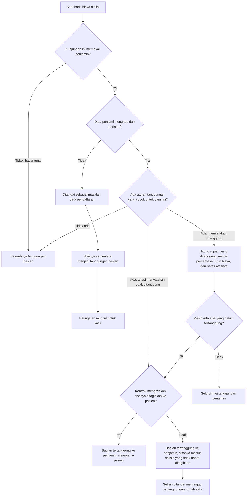
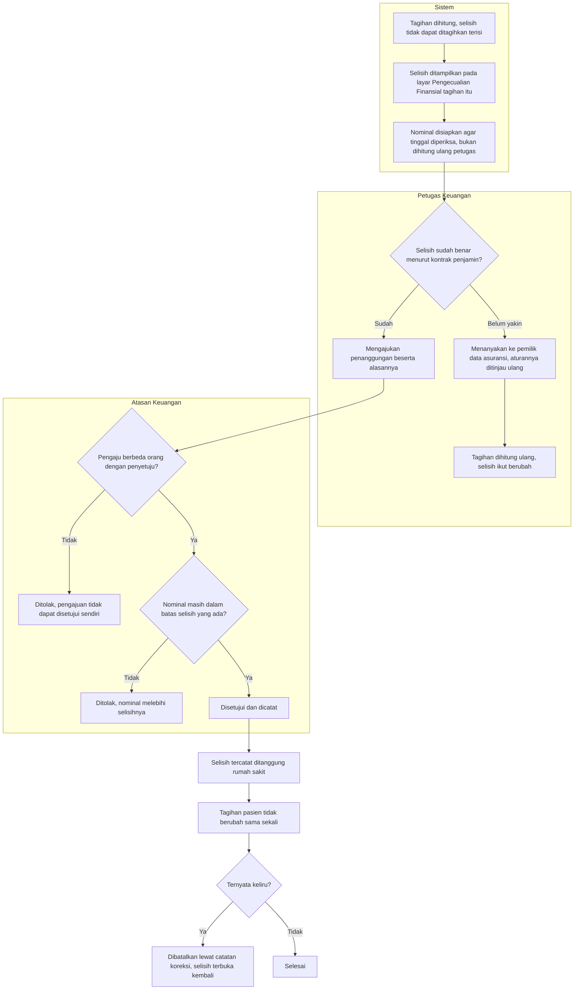

# Pembagian Tanggungan Penjamin

> Revision `0.8`, status **draft**. Input keputusan: `BKC-DEC-070`–`075` dan **`BKC-DEC-080`** (seluruhnya approved 4 September 2026), beserta `BKC-DEC-036` (approved 20 Agustus 2026); keputusan arsitektur `BKC-DES-010`–`014` dan `BKC-DES-021`–`025`. Diagram memuat jalur normal **dan** jalur pengecualiannya.
>
> **Yang dikoreksi pada revisi `0.8`.** Revisi `0.7` menggambar cabang "kontrak tidak mengizinkan sisanya ditagihkan ke pasien" berakhir pada satu kotak: "menjadi selisih yang tidak ditagihkan". Kotak itu adalah akhir jalan — nominalnya punya nama, tetapi tidak ada seorang pun yang diminta melakukan apa pun terhadapnya. `BKC-DEC-080` memutuskan selisih itu **ditanggung rumah sakit lewat jalur Pengecualian Finansial/write-off yang sudah ada**, sehingga cabangnya kini berlanjut ke tindakan Finance dan persetujuan orang kedua.

## Yang digambarkan alur ini

Bagaimana sistem memutuskan, untuk **setiap baris biaya**, berapa rupiah yang ditanggung perusahaan asuransi dan berapa yang menjadi tanggungan pasien. Proses ini berjalan otomatis setiap kali tagihan dihitung ulang; petugas tidak menekan tombol apa pun untuk memulainya.

Yang **berubah** pada revisi ini: bucket "Penjamin Belum Terverifikasi" tidak ada lagi. Biaya yang dulu tertahan di sana kini punya tempat yang jelas — sebagian menjadi tanggungan pasien, sebagian menjadi selisih yang tidak ditagihkan, dan sisanya ditandai sebagai masalah data pendaftaran.

Tanda pada langkah terakhir bukan akhir cerita. Selisih itu diselesaikan pada alur terpisah di bawah, yang **tidak** dijalankan kasir dan **tidak** menahan pembayaran pasien.

## Alur lanjutan — penanggungan selisih oleh rumah sakit

**Tiga hal yang sengaja tidak terjadi pada alur ini**, karena ketiganya adalah kesalahan yang paling mudah dibuat:

1. **Sistem tidak mengajukan sendiri.** Ia menghitung, menandai, dan menyiapkan nominalnya; yang mengajukan tetap petugas keuangan. Bila sistem yang mengajukan, satu-satunya manusia dalam alur itu adalah penyetujunya, dan pemeriksaan dua orang berubah menjadi satu orang atas uang rumah sakit.
2. **Tagihan pasien tidak ikut berkurang.** Selisih ini memang sejak awal tidak pernah ditagihkan kepada pasien. Bila penanggungan ini juga mengurangi tagihan pasien, rumah sakit kehilangan nominal yang sama dua kali untuk satu peristiwa.
3. **Tagihan tidak berubah menjadi "lunas lewat penanggungan".** Pasien mungkin sudah membayar bagiannya penuh; menandai tagihannya diselesaikan lewat penanggungan akan membuat pemeriksa membaca bahwa rumah sakit menghapus utang pasien, padahal pasien tidak berutang.

## Tabel langkah

| No | Langkah | Pelaku | Masukan | Keluaran | Bila gagal, petugas melakukan |
| ---: | --- | --- | --- | --- | --- |
| 1 | Menentukan apakah kunjungan memakai penjamin | Sistem | Data sumber pembayaran kunjungan | Jalur tunai atau jalur penjamin | Bila kunjungan seharusnya memakai asuransi tetapi terbaca tunai, Pendaftaran membetulkan data penjamin kunjungan itu |
| 2 | Memeriksa kelengkapan dan keberlakuan data penjamin | Sistem | Status kelayakan, status polis, dan perusahaan asuransi yang dipilih | Lolos, atau ditandai bermasalah | Kasir membaca peringatan yang muncul, lalu menghubungi Pendaftaran. Kasir **tetap dapat** menerima pembayaran sambil menunggu |
| 3 | Mencari aturan tanggungan yang cocok untuk baris itu | Sistem | Perusahaan asuransi, jenis layanan, dan tarif baris itu | Satu aturan, atau tidak ada | Bila layanan itu seharusnya ditanggung, pemilik data asuransi melengkapi aturannya di data induk. Sampai itu terjadi, biaya menjadi tanggungan pasien |
| 4 | Menghitung rupiah yang ditanggung | Sistem | Persentase tanggungan, urun biaya, dan batas atas pada aturan | Nominal tanggungan penjamin untuk baris itu | Tidak ada tindakan petugas; angka ini mengikuti data induk apa adanya |
| 5 | Menentukan nasib sisa yang belum tertanggung | Sistem | Ketentuan kontrak tentang boleh tidaknya sisa ditagihkan ke pasien | Sisa menjadi tanggungan pasien, atau menjadi selisih yang tidak dapat ditagihkan dan menunggu penanggungan rumah sakit | Tidak ada tindakan petugas. Bila hasilnya terasa keliru, pemilik data asuransi meninjau ketentuan kontrak pada aturan itu |
| 6 | Menjumlah hasil seluruh baris | Sistem | Hasil langkah 1–5 untuk setiap baris | Subtotal Asuransi, Subtotal Mandiri, dan selisih yang tidak dapat ditagihkan | Bila jumlah per baris tidak sama dengan totalnya, perhitungan dihentikan dan tim teknis dihubungi |
| 7 | Memeriksa selisih dan mengajukan penanggungan rumah sakit | Petugas keuangan | Nominal selisih yang sudah disiapkan sistem pada layar Pengecualian Finansial | Pengajuan penanggungan beserta alasannya | Bila selisihnya terasa keliru, pengajuan **tidak** dibuat. Petugas menghubungi pemilik data asuransi agar aturannya ditinjau, lalu tagihan dihitung ulang |
| 8 | Menyetujui penanggungan | Atasan keuangan | Pengajuan langkah 7 | Selisih tercatat ditanggung rumah sakit | Bila penyetuju sama orangnya dengan pengaju, sistem menolak. Bila nominalnya melebihi selisih yang ada, sistem juga menolak. Petugas memperbaiki pengajuannya, bukan memaksa lewat |
| 9 | Membatalkan penanggungan yang keliru | Atasan keuangan | Catatan penanggungan yang sudah disetujui | Catatan koreksi; selisih terbuka kembali untuk diajukan ulang | Riwayatnya tidak dihapus. Bila pembatalan pun keliru, pengajuan baru dibuat — bukan catatan lama disunting |

## Yang berubah dibanding perilaku sebelumnya

| Keadaan | Sebelumnya | Sekarang | Dasar |
| --- | --- | --- | --- |
| Aturan menyatakan ditanggung, tetapi menandai butuh persetujuan atau surat jaminan | Seluruh nilainya tertahan menunggu verifikasi | Langsung dihitung dan masuk tanggungan penjamin | `BKC-DEC-071` |
| Aturan menyatakan ditanggung, tetapi mencantumkan batas pemakaian bulanan | Seluruh nilainya tertahan menunggu verifikasi | Langsung dihitung dan masuk tanggungan penjamin | `BKC-DEC-071` |
| Tidak ada aturan yang cocok untuk baris itu | Tertahan menunggu verifikasi | Menjadi tanggungan pasien | `BKC-DEC-072` |
| Aturan menyatakan tidak ditanggung | Tidak berubah | Tidak berubah | `BKC-DEC-072` |
| Data penjamin tidak lengkap atau tidak berlaku | Tertahan menunggu verifikasi, tanpa penjelasan | Ditandai sebagai masalah data pendaftaran, nilainya sementara ke pasien, dan kasir diberi tahu apa yang harus dibetulkan | `BKC-DEC-073` |
| Sisa perhitungan yang menurut kontrak tidak boleh ditagihkan ke pasien | Tertahan menunggu verifikasi | Tampil sebagai selisih yang tidak dapat ditagihkan, **dan berlanjut** menjadi penanggungan rumah sakit yang diajukan petugas keuangan serta disetujui atasannya | `BKC-DEC-074`, **`BKC-DEC-080`**, `BKC-DES-021`–`025` |
| Aturan menyatakan tidak ditanggung, dan kontrak melarang menagihkannya ke pasien | Tertahan menunggu verifikasi | Tampil sebagai selisih yang tidak dapat ditagihkan, **tanpa** jalur penanggungan — pemiliknya belum memutuskan keadaan ini | `BKC-DEC-072`, `BKC-DEC-074`; pertanyaan terbuka `BKC-OQ-093` |

## Contoh berangka

**Kunjungan rawat jalan pasien asuransi, data penjamin lengkap.**

| Baris biaya | Nilai | Aturan yang cocok | Ditanggung penjamin | Tanggungan pasien |
| --- | ---: | --- | ---: | ---: |
| Konsultasi Dokter Umum | Rp 100.000 | Ditanggung 100% | Rp 100.000 | Rp 0 |
| Fisioterapi | Rp 300.000 | Ditanggung 80% | Rp 240.000 | Rp 60.000 |
| Vitamin C tablet | Rp 25.000 | Tidak ada | Rp 0 | Rp 25.000 |
| **Jumlah** | **Rp 425.000** | | **Rp 340.000** | **Rp 85.000** |

Kasir menagih Rp 85.000. Tidak ada baris "Penjamin Belum Terverifikasi", dan tidak ada baris selisih yang tidak ditagihkan.

**Kunjungan yang sama, tetapi status kelayakan penjamin belum dicentang saat pendaftaran.**

Seluruh Rp 425.000 sementara menjadi tanggungan pasien, dan di atas ringkasan pembayaran muncul peringatan bahwa penjamin kunjungan ini belum dinyatakan layak beserta nominal yang terdampak. Kasir tetap dapat menerima pembayaran, tetapi diharapkan menghubungi Pendaftaran lebih dulu. Setelah data dibetulkan dan tagihan dihitung ulang, pembagiannya kembali seperti tabel di atas.

**Kunjungan yang sama, tetapi aturan Fisioterapi melarang selisihnya ditagihkan ke pasien.**

| Baris biaya | Nilai | Aturan yang cocok | Ditanggung penjamin | Tanggungan pasien | Selisih tidak dapat ditagihkan |
| --- | ---: | --- | ---: | ---: | ---: |
| Konsultasi Dokter Umum | Rp 100.000 | Ditanggung 100% | Rp 100.000 | Rp 0 | Rp 0 |
| Fisioterapi | Rp 300.000 | Ditanggung 80%, selisih **tidak boleh** ditagihkan ke pasien | Rp 240.000 | Rp 0 | Rp 60.000 |
| Vitamin C tablet | Rp 25.000 | Tidak ada | Rp 0 | Rp 25.000 | Rp 0 |
| **Jumlah** | **Rp 425.000** | | **Rp 340.000** | **Rp 25.000** | **Rp 60.000** |

Kasir menagih **Rp 25.000** — bukan Rp 85.000 seperti pada contoh pertama. Rp 60.000 selisih Fisioterapi tidak pernah muncul sebagai angka yang dapat ditagihkan kepada siapa pun di layar kasir.

Rp 60.000 itulah yang kemudian dibawa alur lanjutan: petugas keuangan membuka Pengecualian Finansial pada tagihan itu, melihat "Selisih tidak dapat ditagihkan yang belum ditanggung: Rp 60.000", mengajukannya beserta alasan yang menyebut kontrak penjaminnya, dan atasannya menyetujui. Sesudah disetujui, yang berubah **hanya** catatan penanggungan: tagihan pasien tetap Rp 25.000, statusnya tetap seperti semula, dan kwitansi yang dicetak pasien tidak menyebut angka Rp 60.000 sama sekali.
