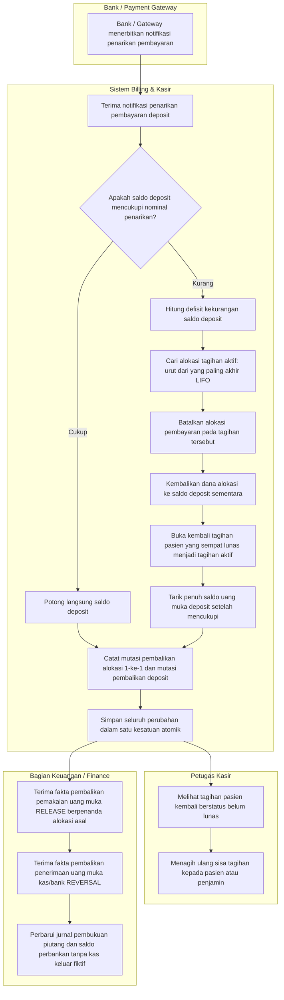

# Alur Pembalikan Tender Top-Up Deposit dan Pembatalan Alokasi Tagihan

Masukan `BKC-DEC-128`–`134`, `BKC-DES-051`–`056`. Status **draft**, 29 September 2026.

Dokumen ini menggambarkan urutan langkah yang terjadi ketika setoran uang muka (deposit) pasien ditarik kembali atau dibatalkan oleh bank/gateway pembayaran, serta bagaimana sistem secara otomatis membatalkan alokasi pembayaran tagihan pasien menggunakan urutan LIFO (*Last In First Out*) agar saldo deposit tidak pernah minus dan tagihan pasien yang terdampak dibuka kembali sebagai piutang.

---

## 1. Alur Pokok — Penarikan Uang Muka yang Sebagian Dananya Telah Terpakai

---

## 2. Tabel Langkah Alur Pembalikan Deposit

| No | Langkah | Pelaku | Masukan | Keluaran | Bila Gagal / Tindakan Petugas |
|---:|---|---|---|---|---|
| 1 | Menerima penarikan pembayaran | Sistem | Status penarikan dari bank / gateway | Perintah pembalikan tender top-up | Transaksi dibatalkan; status pembayaran tetap seperti semula |
| 2 | Memeriksa saldo deposit | Sistem | Saldo akun deposit pasien saat ini | Nominal saldo yang tersedia vs nilai penarikan | Jika saldo tidak cukup, sistem tidak langsung memotong saldo melainkan masuk ke alur penarikan alokasi tagihan |
| 3 | Mencari alokasi tagihan LIFO | Sistem | Riwayat alokasi pembayaran tagihan pasien | Daftar alokasi tagihan terurut dari yang terbaru | Jika tidak ada alokasi tagihan yang dapat ditarik, sistem menolak pembalikan agar saldo tidak minus |
| 4 | Membatalkan alokasi tagihan | Sistem | Baris alokasi tagihan terpilih | Baris alokasi pembalik bertanda kompensasi | Transaksi dibatalkan secara utuh (*rollback*); tidak ada alokasi yang dibatalkan separuh |
| 5 | Membuka kembali tagihan pasien | Sistem | Tagihan yang alokasinya ditarik | Tagihan berubah dari lunas kembali menjadi tagihan terbuka | Sistem memastikan status tagihan mencerminkan kewajiban yang belum dibayar |
| 6 | Memotong saldo deposit | Sistem | Saldo deposit yang telah dipulihkan | Saldo deposit berkurang tepat sebesar uang yang ditarik bank | Saldo akhir dijamin tidak pernah negatif (`>= 0`) |
| 7 | Mencatat mutasi audit | Sistem | Bukti pembalikan alokasi dan penarikan deposit | Dua jenis mutasi tercatat: pengembalian alokasi (`RELEASE` 1 baris per alokasi yang dibatalkan, berpenanda `ReversesMovementId` ke mutasi `ALLOCATION` terkait per `BKC-DEC-132`/`133`) dan pembalikan deposit (`REVERSAL` berpenanda `ReversesMovementId` ke mutasi `TOP_UP` awal) | Menjamin audit trail utuh 1-ke-1 untuk rekonsiliasi keuangan dan penjurnalan Finance |
| 8 | Menagih ulang tagihan terbuka | Kasir | Daftar tagihan pasien yang aktif kembali | Pembayaran baru dari pasien atau penjamin | Kasir menghubungi keluarga pasien untuk melunasi tagihan yang terbuka kembali |
| 9 | Membukukan jurnal keuangan | Keuangan | Aliran fakta mutasi dari Billing | Jurnal pemulihan piutang dan penarikan kas/bank tanpa kas keluar fiktif | Bagian keuangan memverifikasi rekening koran bank |

---

## 3. Jalur Pengecualian dan Penanganan Masalah

```mermaid
flowchart TD
    subgraph Pengecualian["Pengecualian Sistem"]
        E1[Pembalikan tender gagal di tengah transaksi] --> E2[Batalkan seluruh perubahan / Rollback]
        E2 --> E3[Saldo deposit dan status tagihan tetap utuh]
        E3 --> E4[Catat log audit kegagalan dan kirim peringatan teknis]
    end

    subgraph KasusKhusus["Kasus Dana Tersebar di Beberapa Tagihan"]
        F1[Kekurangan dana melampaui satu tagihan] --> F2[Tarik alokasi tagihan terakhir sampai habis]
        F2 --> F3[Tarik alokasi tagihan sebelumnya secara berurutan]
        F3 --> F4[Tulis 1 mutasi RELEASE berpenanda alokasi asal per tagihan 1-ke-1]
        F4 --> F5[Seluruh tagihan terdampak dibuka kembali sebagai piutang]
    end
```

### Penjelasan Jalur Pengecualian

1. **Kegagalan Koneksi Database di Tengah Transaksi:**
   Bila terjadi galat sistem saat alokasi tagihan dibatalkan namun mutasi pembalikan top-up belum selesai ditulis, sistem secara otomatis mengeksekusi *rollback* database. Saldo deposit pasien dan status tagihan tidak berubah sedikit pun, sehingga tidak terjadi inkonsistensi saldo (*fail-safe*).
2. **Dana Tersebar di Lebih dari Satu Tagihan (Granularitas 1-ke-1 `BKC-DEC-133`):**
   Bila seorang pasien menggunakan setoran uang muka deposit Rp 10.000.000 untuk membayar Tagihan A (Rp 6.000.000, mutasi alokasi M1) dan Tagihan B (Rp 4.000.000, mutasi alokasi M2), penarikan top-up Rp 10.000.000 akan membatalkan alokasi Tagihan B terlebih dahulu (LIFO), kemudian membatalkan alokasi Tagihan A. Sistem mencatat **dua mutasi `RELEASE` terpisah**: R1 Rp 4.000.000 (`ReversesMovementId = M2.Id`) dan R2 Rp 6.000.000 (`ReversesMovementId = M1.Id`). Kedua tagihan tersebut otomatis terbuka kembali sebagai piutang yang belum terbayar.
3. **Pencegahan Saldo Negatif:**
   Sistem tidak pernah mengizinkan pemotongan saldo deposit jika total saldo yang tersedia ditambah seluruh alokasi aktif tidak mencukupi nominal yang diminta bank. Hal ini melindungi rumah sakit dari saldo deposit fiktif bernilai minus.
4. **Pembedaan Tegas Pengembalian Alokasi vs Pengembalian Kas (`BKC-DEC-134`):**
   Mutasi `RELEASE` pembatalan alokasi bukan kas keluar; dana kembali ke akun deposit pasien. Oleh karena itu, mutasi ini **dikecualikan dari perhitungan `totalRefunded`** pada ringkasan kasir, dan efeknya pada buku rekening mutasi deposit dihitung sebagai penambahan saldo (`+Amount`) sebelum mutasi `REVERSAL` menariknya (`-Amount`).

