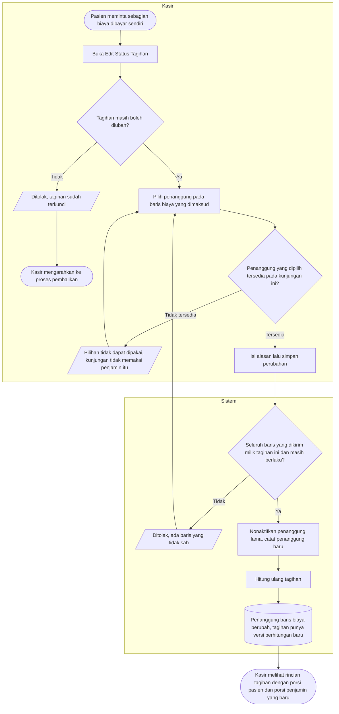

# Alur Proses — Menentukan Penanggung Tiap Baris Biaya

> Revisi blueprint `1.1`, status **draft**. Masukan: `MPY-DEC-004`, `MPY-DEC-005`, `MPY-DES-008`, `MPY-DES-009`.
>
> Nama keadaan pada diagram ini sama persis dengan [`contracts/state-transition-matrix.md`](../contracts/state-transition-matrix.md). Kalimat penolakan yang sebenarnya hanya ada di [`contracts/validation-matrix.md`](../contracts/validation-matrix.md).

## Kapan alur ini dipakai

Kunjungan sudah punya penjamin, tetapi tidak semua biaya ingin ditagihkan kepada penjamin itu. Contoh yang paling sering: pasien meminta vitamin tambahan di luar tanggungan perusahaan dan bersedia membayarnya sendiri, atau satu tindakan sengaja tidak diklaimkan ke asuransi atas permintaan pasien.

Nama fiturnya "Edit Status Tagihan" mengikuti kebiasaan pengguna, tetapi yang diubah adalah **penanggung biaya**, bukan status hidup-matinya tagihan.

## Diagram

## Tabel langkah

| Langkah | Pelaku | Masukan yang dibutuhkan | Keluaran | Bila gagal |
| --- | --- | --- | --- | --- |
| Buka Edit Status Tagihan | Kasir | Tagihan yang belum dibayar | Daftar baris biaya beserta penanggungnya saat ini | Tombol tidak aktif; kasir membaca keterangan sebabnya |
| Pilih penanggung per baris | Kasir | Baris biaya yang ingin diubah | Pilihan penanggung terisi pada baris itu | Pilihan yang tidak tersedia tampil nonaktif beserta alasannya; kasir memilih yang lain |
| Isi alasan lalu simpan | Kasir | Alasan perubahan | Perintah terkirim berisi baris yang berubah saja | Alasan kosong ditolak; kasir mengisinya |
| Periksa keabsahan baris | Sistem | Daftar baris yang dikirim | Lolos atau ditolak | Ditolak seluruhnya; tidak ada satu baris pun yang tersimpan sebagian |
| Catat penanggung baru | Sistem | Baris yang sudah lolos | Penanggung lama dinonaktifkan, penanggung baru tercatat beserta alasannya | Seluruh perintah dibatalkan |
| Hitung ulang tagihan | Sistem | Penanggung terkini seluruh baris | Versi perhitungan baru beserta porsi pasien dan porsi penjamin | Seluruh perintah dibatalkan |

## Jalur pengecualian yang wajib terlihat di layar

| Keadaan | Yang dilihat kasir | Yang dilakukan kasir berikutnya |
| --- | --- | --- |
| Kunjungan tunai | Hanya pilihan Pribadi yang tersedia; dua pilihan lain nonaktif beserta alasannya | Bila memang perlu ditagihkan ke penjamin, ganti dulu penjamin kunjungan lewat Edit Asuransi |
| Kunjungan berasuransi | Pilihan Penjamin nonaktif beserta alasannya | Sama seperti di atas |
| Kunjungan berpenjamin perusahaan | Pilihan Asuransi nonaktif beserta alasannya | Sama seperti di atas |
| Baris biaya sudah dibatalkan | Baris tampil tetapi tidak dapat diubah penanggungnya | Tidak ada tindakan; baris yang dibatalkan memang tidak ditagihkan |
| Baris ditandai ditanggung penjamin tetapi aturannya tidak menanggung | Perubahan **tetap berhasil**; hasil perhitungan menunjukkan nol tertanggung dan pasien membayar penuh | Tidak ada tindakan bila memang disengaja. Ini perilaku yang dirancang, bukan kesalahan |
| Penjamin kunjungan diganti sesudah penanggung baris diatur | Pemberitahuan berapa baris yang dikembalikan menjadi tanggungan pasien | Meninjau ulang baris-baris itu dan mengatur penanggungnya kembali bila perlu |

## Catatan penting

Kasir menentukan **kepada siapa biaya ditagihkan**; mesin menentukan **berapa yang ditanggung**. Keduanya sengaja dipisah (`MPY-DEC-004`): sebuah baris boleh ditandai ditanggung penjamin walaupun aturan tanggungan menyatakan tidak tertanggung, dan hasilnya nol tertanggung dengan pasien membayar penuh. Yang berpindah hanyalah keterangan penanggungnya, bukan nominalnya.

Setiap perubahan penanggung tidak menimpa catatan sebelumnya. Penanggung lama dinonaktifkan dan penanggung baru dicatat sebagai baris tersendiri, sehingga riwayat siapa mengubah apa tetap terbaca.

Trace `MPY-DEC-004`, `MPY-DEC-005`, `MPY-DES-008`, `MPY-DES-009`. Tests `BIL-AT-089`–`092`.
