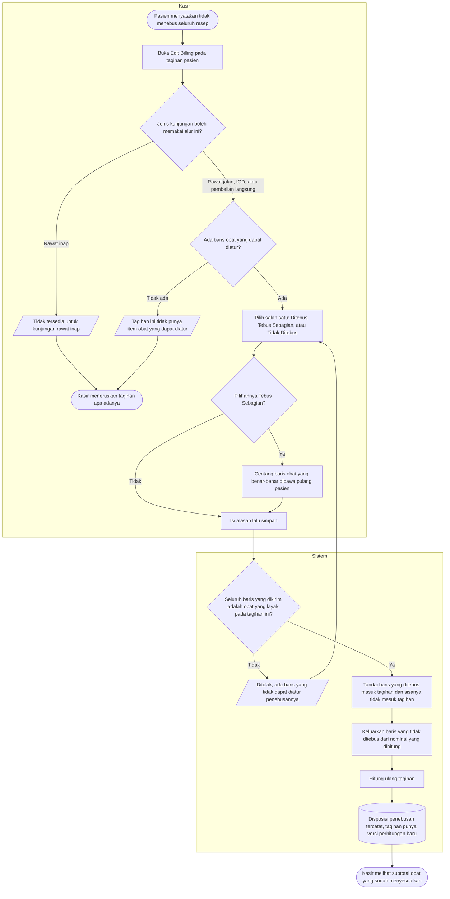

# Alur Proses — Menentukan Obat yang Masuk Tagihan

> Revisi blueprint `1.1`, status **draft**. Masukan: `MPY-DEC-009`, `MPY-DES-010`–`012`.
>
> Nama keadaan pada diagram ini sama persis dengan [`contracts/state-transition-matrix.md`](../contracts/state-transition-matrix.md). Kalimat penolakan yang sebenarnya hanya ada di [`contracts/validation-matrix.md`](../contracts/validation-matrix.md).

## Kapan alur ini dipakai

Pasien rawat jalan, IGD, atau pembelian langsung menerima resep, tetapi tidak selalu menebus seluruhnya. Sebagian obat ditinggalkan karena pasien sudah memilikinya di rumah, atau karena harganya di luar kemampuan saat itu. Obat yang tidak dibawa pulang tidak boleh ikut ditagihkan.

Alur ini **hanya** menentukan obat mana yang masuk tagihan. Ia tidak pernah mengubah catatan penyerahan obat milik Farmasi — dua hal yang berbeda dan sengaja dipisah (`MPY-DEC-009`).

## Diagram

## Tabel langkah

| Langkah | Pelaku | Masukan yang dibutuhkan | Keluaran | Bila gagal |
| --- | --- | --- | --- | --- |
| Buka Edit Billing | Kasir | Tagihan yang belum dibayar | Daftar baris obat yang dapat diatur | Tombol tidak aktif beserta keterangan jenis kunjungan; kasir meneruskan tagihan apa adanya |
| Pilih cara penebusan | Kasir | Keterangan pasien tentang obat yang dibawa pulang | Salah satu dari tiga pilihan terpilih | Tidak ada kegagalan; ketiga pilihan selalu tersedia bila layarnya terbuka |
| Centang baris yang ditebus | Kasir | Baris obat yang dibawa pulang | Daftar baris tercentang | Tidak ada satu pun yang dicentang pada mode sebagian ditolak; kasir mencentang, atau memilih Tidak Ditebus |
| Isi alasan lalu simpan | Kasir | Alasan | Perintah terkirim | Alasan kosong ditolak; kasir mengisinya |
| Periksa kelayakan baris | Sistem | Daftar baris yang dikirim | Lolos atau ditolak | Ditolak seluruhnya; tidak ada satu baris pun tersimpan sebagian |
| Tandai disposisi | Sistem | Baris yang sudah lolos | Baris yang ditebus masuk tagihan, sisanya tidak | Seluruh perintah dibatalkan |
| Hitung ulang tagihan | Sistem | Disposisi terkini | Versi perhitungan baru beserta subtotal obat yang menyesuaikan | Seluruh perintah dibatalkan |

## Jalur pengecualian yang wajib terlihat di layar

| Keadaan | Yang dilihat kasir | Yang dilakukan kasir berikutnya |
| --- | --- | --- |
| Kunjungan rawat inap | Tombol Edit Billing tidak aktif beserta keterangan bahwa alur ini tidak berlaku untuk rawat inap | Meneruskan tagihan apa adanya |
| Tagihan tidak punya baris obat | Panel terbuka tetapi kosong beserta keterangannya | Menutup panel |
| Kasir mencoba mengubah jumlah obat | Isian jumlah tidak dapat diubah pada layar ini | Bila jumlah memang keliru, persoalannya ada di resep atau penyerahan — diteruskan ke Farmasi, bukan diselesaikan di kasir |
| Kasir mencoba mengatur baris non-obat | Baris non-obat tidak punya kotak centang | Tidak ada tindakan |
| Seluruh obat ditandai tidak ditebus | Subtotal obat menjadi nol; baris non-obat tidak terpengaruh sama sekali | Melanjutkan pembayaran atas sisa tagihan |

## Catatan penting

Baris obat yang tidak ditebus **tidak muncul sebagai porsi pasien maupun porsi penjamin**. Ia dikeluarkan dari nominal yang dihitung sebelum tanggungan dihitung, sehingga benar-benar hilang dari tagihan — bukan ditagihkan lalu ditanggung nol.

Penebusan sebagian memilih **baris utuh**. Tidak ada keadaan di mana sebagian dari satu baris obat ditebus dan sebagian lagi tidak; bila kebutuhan itu muncul, penyelesaiannya ada di sisi resep dan penyerahan milik Farmasi, bukan di kasir.

Catatan penyerahan obat milik Farmasi **tidak berubah sedikit pun** oleh alur ini. Farmasi tetap mencatat apa yang benar-benar diserahkan; kasir mencatat apa yang ditagihkan. Bila keduanya berbeda, selisihnya justru terbaca — dan itu memang gunanya dipisah.

Trace `MPY-DEC-009`, `MPY-DES-010`–`012`. Tests `BIL-AT-093`–`096`.
