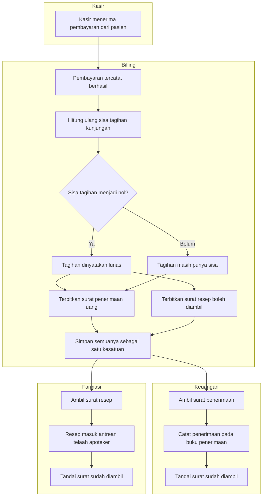
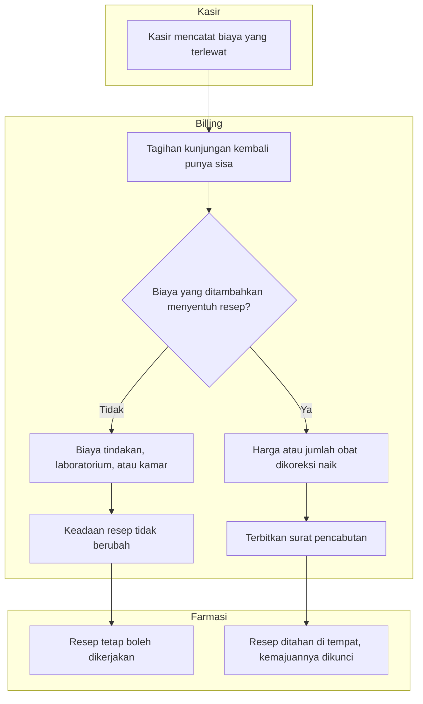
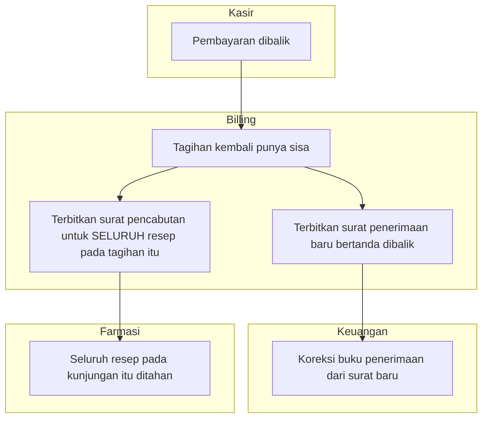
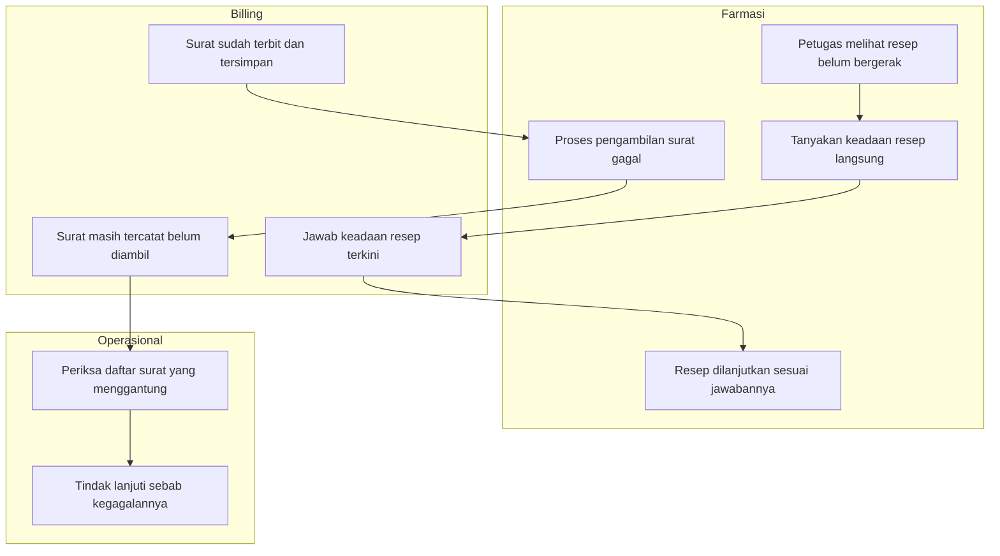

# Alur Penerbitan Fakta Finansial ke Modul Konsumen

Masukan `BKC-DEC-106`–`109`. Status **draft**, 21 September 2026.

Dokumen ini menggambarkan urutan langkah yang benar-benar terjadi ketika uang bergerak atau
keadaan tagihan berubah, sampai dua modul lain mengetahuinya. Ia menggantikan penjelasan lisan
yang selama ini hanya hidup di kepala orang yang merancangnya.

## Mengapa alur ini ada

Sebelum jalur ini dibangun, dua hal berikut terjadi bersamaan di rumah sakit:

- Kasir menerima uang, tetapi bagian keuangan tidak punya cara resmi mengetahuinya. Akibatnya
  uang yang sudah diterima berisiko ditagihkan ulang sebagai piutang.
- Pasien membayar obat, tetapi apoteker tidak pernah mendapat kabar bahwa resepnya sudah boleh
  dikerjakan. Resep berhenti di keadaan menunggu pembayaran dan tidak pernah bergerak.

## Alur pokok — jalur normal

Perhatikan percabangan di tengah: ketika tagihan **belum** lunas, hanya surat penerimaan yang
terbit. Bagian keuangan tetap mengetahui uang yang masuk, sementara apoteker memang belum boleh
mengerjakan resepnya. Ini disengaja — pasien boleh membayar sebagian, dan uang yang sudah masuk
tetap harus tercatat.

### Tabel langkah

| Langkah | Pelaku | Masukan | Keluaran | Bila gagal |
| --- | --- | --- | --- | --- |
| Menerima pembayaran | Kasir | Uang atau kartu pasien | Pembayaran tercatat berhasil | Pembayaran diulang; tidak ada surat yang terbit |
| Menghitung ulang sisa tagihan | Sistem | Seluruh biaya dan pembayaran kunjungan itu | Sisa tagihan terbaru | Seluruh transaksi dibatalkan; uang belum dianggap diterima |
| Menerbitkan surat | Sistem | Hasil perhitungan dan keadaan tagihan | Satu atau dua surat | Seluruh transaksi dibatalkan, termasuk pembayarannya |
| Mengambil surat penerimaan | Bagian keuangan | Surat yang belum diambil | Penerimaan tercatat di buku penerimaan | Surat tetap menggantung dan terlihat pada daftar pemeriksaan |
| Mengambil surat resep | Farmasi | Surat yang belum diambil | Resep masuk antrean apoteker | Petugas memeriksa ulang keadaan resep lewat jalur pemeriksaan |

## Jalur pengecualian — biaya menyusul setelah tagihan lunas

Ini jalur yang paling sering salah dipahami, dan akibatnya langsung terasa oleh pasien di loket
obat.

Contoh yang membuatnya konkret. Pasien melunasi seluruh tagihan pukul 09.00, dan resepnya masuk
antrean. Pukul 09.30 kasir menyadari ada biaya tindakan yang terlewat dicatat, sehingga tagihan
kunjungan itu kembali punya sisa. **Obat tetap boleh diserahkan** — yang sudah dibayar tetap
dibayar. Pasien punya kewajiban baru atas tindakan itu, bukan atas obatnya.

Bandingkan dengan keadaan sebaliknya: bila yang dikoreksi naik justru harga obat pada resep itu,
resep ditahan sampai selisihnya dilunasi.

### Tabel langkah

| Langkah | Pelaku | Masukan | Keluaran | Bila gagal |
| --- | --- | --- | --- | --- |
| Mencatat biaya susulan | Kasir | Biaya yang terlewat | Tagihan kembali punya sisa | Pencatatan diulang |
| Menilai apakah menyentuh resep | Sistem | Jenis biaya yang ditambahkan | Keputusan menerbitkan surat atau tidak | Seluruh transaksi dibatalkan |
| Menahan resep | Farmasi | Surat pencabutan | Resep berhenti di tahap terakhirnya | Petugas memeriksa ulang keadaan resep |

## Jalur pengecualian — uang ditarik kembali

Pencabutan di sini berlaku untuk **seluruh** resep pada tagihan itu, tanpa memilah. Sebabnya
jujur dan perlu diketahui pemilik proses: sistem tidak melacak uang mana yang membayar bagian
mana, karena pembayaran selalu dialokasikan ke tagihan secara utuh. Ketika uang ditarik,
tidak ada cara membuktikan porsi obat masih terbayar — maka seluruhnya ditahan.

Surat penerimaan yang terbit di sini adalah **baris baru** bertanda dibalik, bukan perubahan
pada surat lama. Riwayat tidak pernah disunting.

### Tabel langkah

| Langkah | Pelaku | Masukan | Keluaran | Bila gagal |
| --- | --- | --- | --- | --- |
| Membalik pembayaran | Kasir atau Finance | Alasan pembalikan | Pembayaran tidak lagi berlaku | Pembalikan diulang |
| Menerbitkan dua jenis surat | Sistem | Keadaan tagihan terbaru | Surat baru untuk keuangan dan pencabutan untuk farmasi | Seluruh transaksi dibatalkan, termasuk pembalikannya |
| Menahan seluruh resep | Farmasi | Surat pencabutan | Seluruh resep kunjungan itu berhenti | Petugas memeriksa ulang keadaan tiap resep |

## Jalur pengecualian — surat tidak sampai

Surat bisa gagal diproses: modul penerimanya sempat bermasalah, mati, atau barisnya terlewat.
Tanpa jalan keluar, resep akan tertahan sampai ada perubahan berikutnya — yang mungkin tidak
pernah terjadi, karena tagihannya memang sudah lunas.

Dua jalur pemulihan berjalan berdampingan: petugas Farmasi dapat menanyakan keadaan resep
kapan saja tanpa menunggu siapa pun, sementara bagian operasional dapat melihat daftar surat
yang menggantung sebagai tanda ada yang perlu diperbaiki.

Billing sendiri **tidak menahan apa pun** karena surat belum diambil. Uang sudah diterima, dan
pelayanan tidak boleh berhenti karena urusan teknis antar modul.

### Tabel langkah

| Langkah | Pelaku | Masukan | Keluaran | Bila gagal |
| --- | --- | --- | --- | --- |
| Menanyakan keadaan resep | Petugas Farmasi | Identitas resep | Keadaan terkini beserta sebabnya | Dijawab "belum diketahui"; obat **tidak** boleh diserahkan |
| Memeriksa daftar surat menggantung | Bagian operasional | Penyaring jenis dan waktu | Daftar surat yang belum diambil | Daftar kosong berarti tidak ada yang tertinggal |

Berapa lama sebuah surat boleh menggantung sebelum dianggap tidak wajar, dan siapa yang
diberi tahu, **belum diputuskan** (`BKC-OQ-101`). Sampai itu ditetapkan, pemeriksaan bersifat
manual dan bergantung pada seseorang yang memang memeriksanya.
