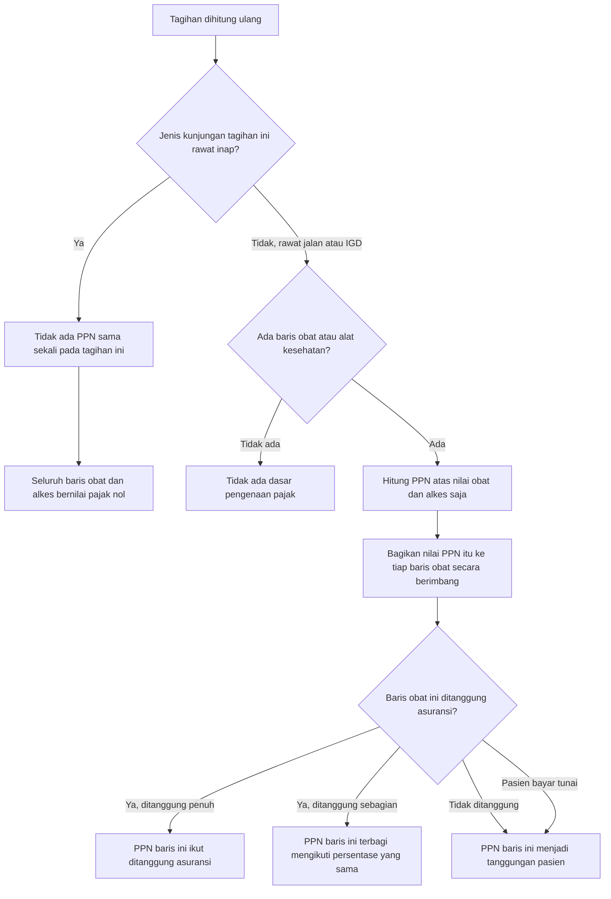

# Pengenaan dan Pembagian PPN Obat dan Alat Kesehatan

> Revision `0.7`, status **draft**. Input keputusan: `BKC-DEC-076` (sebagian `superseded`), `BKC-DEC-077`, `BKC-DEC-078`, `BKC-DEC-079` — seluruhnya approved 4 September 2026. Keputusan arsitektur: `BKC-DES-018`, `BKC-DES-019`, `BKC-DES-020`.

## Yang digambarkan alur ini

Dua pertanyaan yang sering dicampur, dan yang di sini sengaja dipisah:

1. **Apakah PPN dikenakan?** Ditentukan oleh jenis barang dan jenis kunjungan.
2. **Siapa yang menanggung PPN yang sudah dikenakan?** Ditentukan oleh status tanggungan barang yang dipajaki.

Pertanyaan kedua hanya berlaku bila jawaban pertanyaan pertama adalah "ya".

## Tabel langkah

| No | Langkah | Pelaku | Masukan | Keluaran | Bila gagal, petugas melakukan |
| ---: | --- | --- | --- | --- | --- |
| 1 | Memeriksa jenis kunjungan tagihan | Sistem | Jenis kunjungan yang tercatat saat tagihan dibuka | Kena pajak, atau dibebaskan | Bila jenis kunjungan salah tercatat, tagihan itu **tidak** dapat dikoreksi dengan membetulkan pendaftaran saja; tagihannya harus dibatalkan dan dibuka ulang. Lihat catatan di bawah |
| 2 | Memilih baris yang menjadi dasar pengenaan | Sistem | Kategori tiap baris biaya | Daftar baris obat dan alat kesehatan | Bila obat tidak ikut terpajaki, pemilik data induk memeriksa penandaan kategori tarifnya |
| 3 | Menghitung nilai PPN | Sistem | Tarif pajak yang berlaku dan nilai dasar pengenaan | Satu nilai PPN untuk tagihan itu | Bila ada dua tarif pajak yang sama-sama berlaku, perhitungan berhenti dan menyebut kode keduanya. Pemilik data induk menonaktifkan salah satunya |
| 4 | Membagikan nilai PPN ke tiap baris | Sistem | Nilai PPN dan nilai tiap baris obat | Nilai pajak per baris obat | Tidak ada tindakan petugas; sisa pembulatan dibebankan ke baris terakhir supaya jumlahnya persis |
| 5 | Menentukan penanggung PPN tiap baris | Sistem | Status tanggungan baris obat yang dipajaki | Pajak ke asuransi, ke pasien, atau terbagi | Bila hasilnya terasa terbalik, pemilik data induk memeriksa ketentuan pembagian pajak pada tarif pajak yang aktif |

## Aturan yang berlaku, dengan contoh

### Aturan 1 — Dasar pengenaan hanya obat dan alat kesehatan

Jasa pelayanan kesehatan tidak dikenai PPN. Biaya konsultasi, tindakan, biaya administrasi, dan biaya kamar karena itu tidak pernah masuk dasar pengenaan. Ini **tidak berubah** dari sebelumnya (`BKC-DEC-076`, bagian yang tidak direvisi).

> **Contoh.** Tagihan rawat jalan berisi Konsultasi Rp 100.000, Fisioterapi Rp 300.000, dan Amoksisilin Rp 50.000. Tarif PPN 11%. Dasar pengenaannya hanya Rp 50.000, sehingga PPN yang ditagihkan Rp 5.500 — bukan 11% dari Rp 450.000.

### Aturan 2 — Rawat inap dibebaskan sepenuhnya

Kunjungan rawat inap tidak dikenai PPN atas obat maupun alat kesehatan, apa pun cara pembayarannya dan apa pun status tanggungannya (`BKC-DEC-078`).

> **Contoh.** Pasien rawat inap menerima obat Rp 1.000.000 dan biaya kamar Rp 2.000.000. Total tagihannya Rp 3.000.000, tanpa satu rupiah pun PPN. Pasien rawat jalan yang menerima obat Rp 1.000.000 yang sama membayar Rp 1.110.000.

### Aturan 3 — IGD diperlakukan seperti rawat jalan

Kunjungan gawat darurat **kena** PPN, sama seperti rawat jalan (`BKC-DEC-079`).

> **Contoh.** Pasien IGD menerima alat kesehatan Rp 200.000. PPN Rp 22.000 tetap dikenakan. Bila pasien yang sama kemudian dirawat inap, obat yang diserahkan **selama rawat inap** tidak lagi dikenai PPN, sedangkan yang sudah diserahkan di IGD tetap dikenai.

### Aturan 4 — Jenis kunjungan yang belum diputuskan tetap dikenai PPN

Pemeriksaan kesehatan berkala dan konsultasi jarak jauh **belum** diputuskan pemilik produk. Sampai ada keputusan, keduanya diperlakukan seperti rawat jalan dan dikenai PPN (`BKC-DES-019`). Alasannya: pembebasan yang salah menghasilkan kurang bayar pajak yang baru ketahuan saat pemeriksaan, sedangkan pengenaan yang salah menghasilkan kelebihan bayar yang dapat dikembalikan.

### Aturan 5 — PPN mengikuti nasib barang yang dipajakinya

| Keadaan | Siapa menanggung PPN | Dasar |
| --- | --- | --- |
| Pasien bayar tunai | Pasien | `BKC-DEC-077` butir 1 |
| Pasien asuransi, obatnya ditanggung penuh | Asuransi | `BKC-DEC-077` butir 2 |
| Pasien asuransi, obatnya ditanggung sebagian | Terbagi dengan persentase yang sama seperti obatnya | `BKC-DEC-077` butir 2 |
| Pasien asuransi, obatnya tidak ditanggung | Pasien | `BKC-DEC-077` butir 3 |

> **Contoh berangka.** Pasien rawat jalan berasuransi menerima dua obat. Amoksisilin Rp 100.000 ditanggung 100%; Vitamin C Rp 50.000 tidak punya aturan tanggungan. Tarif PPN 11%, sehingga PPN totalnya Rp 16.500 — Rp 11.000 menempel pada Amoksisilin dan Rp 5.500 pada Vitamin C. Hasilnya: Pajak Asuransi Rp 11.000, Pajak Mandiri Rp 5.500. Bila obat pertama hanya ditanggung 80%, PPN-nya ikut terbagi menjadi Rp 8.800 ke asuransi dan Rp 2.200 ke pasien.

## Jalur pengecualian

| Keadaan | Yang terjadi | Yang dilakukan petugas |
| --- | --- | --- |
| Dua tarif pajak sama-sama berlaku pada satu waktu | Perhitungan **berhenti** dan menyebut kode kedua tarif itu | Pemilik data induk menonaktifkan salah satunya atau membatasi masa berlakunya. Pemeriksaan ini **tetap berjalan** untuk kunjungan rawat inap, walaupun pajaknya nanti dibebaskan |
| Tidak ada tarif pajak yang berlaku | Tidak ada PPN pada tagihan itu. Bukan galat | Bila seharusnya ada, pemilik data induk mengaktifkan tarifnya |
| Jenis kunjungan tagihan tidak dikenal | PPN **tetap** dikenakan | Melaporkan tagihan itu, karena jenis kunjungan yang tidak dikenal menandakan ada yang salah saat tagihan dibuka |
| Ketentuan pembagian pajak pada tarif aktif bukan "berimbang" | Pembagian PPN antar-penanggung menjadi salah, **tanpa peringatan apa pun** | Pemilik data induk memastikan tarif pajak yang aktif memakai ketentuan pembagian berimbang. Ini pemeriksaan yang **MUST** dilakukan sebelum perubahan ini dianggap selesai |

## Catatan penting tentang koreksi jenis kunjungan

Jenis kunjungan yang menentukan pengenaan PPN adalah jenis yang **tercatat pada tagihan saat tagihan itu dibuka**, bukan jenis kunjungan yang berlaku sekarang (`BKC-DES-018`). Ini disengaja: dasar pengenaan pajak sebuah tagihan tidak boleh berubah karena Pendaftaran membetulkan datanya sebulan kemudian.

Akibatnya, kunjungan rawat inap yang keliru didaftarkan sebagai rawat jalan akan tetap dikenai PPN sampai tagihannya dibatalkan dan dibuka ulang. Membetulkan pendaftaran saja tidak cukup, dan itu **MUST** disampaikan kepada petugas Billing sebelum perubahan ini dipakai.

## Dampak sekali jalan yang harus diketahui

Tagihan **rawat inap** yang masih berjalan hari ini sudah membawa PPN. Pada perhitungan ulang pertama setelah perubahan ini berlaku, PPN itu hilang dan total tagihannya berkurang. Bila deposit atau pembayaran sudah diterima sebesar total yang lama, selisihnya menjadi kelebihan bayar dan diselesaikan lewat pengembalian uang atau penyesuaian yang sudah ada — **bukan** dengan menyunting tagihan yang sudah dibayar. Besarnya dampak ini **MUST** dihitung sebelum perubahan diberlakukan.

Tagihan yang sudah difinalisasi tidak terpengaruh sama sekali; angkanya tetap seperti saat difinalisasi.
