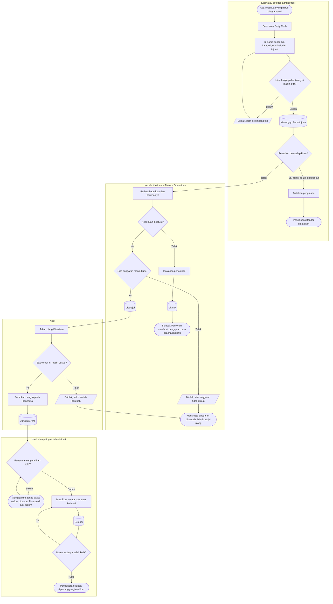
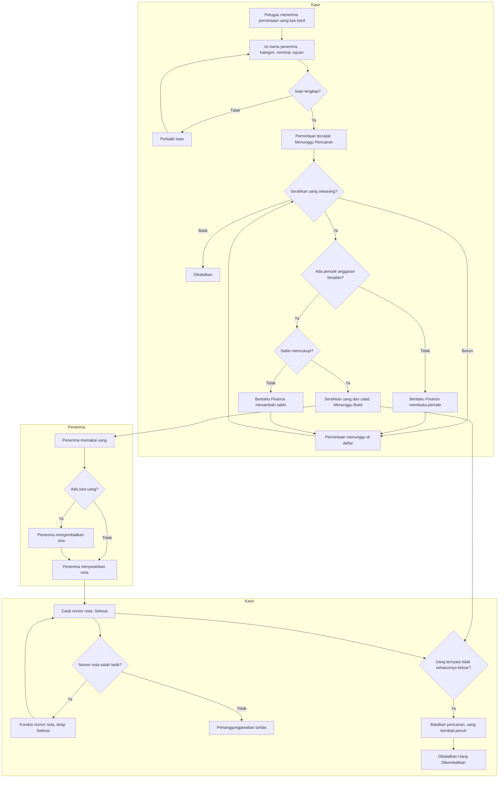

# Billing dan Kasir — Alur Voucher Petty Cash (Kas Kecil)

> Revisi `1.0`, status **draft**. Berkas ini menggambarkan **satu proses beserta seluruh percabangan dan jalur pengecualiannya**: perjalanan satu voucher kas kecil dari pengajuan sampai bukti nota.
>
> Nama status pada diagram sama persis dengan [`../contracts/state-transition-matrix.md`](../contracts/state-transition-matrix.md). Diagram sengaja **tidak** memuat nama tabel, kolom, endpoint, maupun nama kelas — untuk itu bacalah [`../02-backend-architecture.md`](../02-backend-architecture.md). Kalimat penolakan yang sebenarnya ada di [`../contracts/validation-matrix.md`](../contracts/validation-matrix.md); node penolakan di sini hanya menyebut sebabnya secara singkat.
>
> Alur anggarannya dipisah ke [`anggaran-petty-cash.md`](anggaran-petty-cash.md).

## Yang digambarkan alur ini

Rumah sakit mengeluarkan uang tunai kecil setiap hari — ongkos transport kurir, konsumsi rapat, alat tulis, perbaikan kecil. Alur ini menggambarkan bagaimana satu pengeluaran semacam itu diajukan, diputuskan, diserahkan uangnya, dan dipertanggungjawabkan notanya.

**Pemicu:** ada keperluan operasional yang harus dibayar tunai sekarang.

**Prasyarat:** kategori pengeluaran sudah tersedia di data induk, dan anggaran kas kecil sudah diisi Finance.

**Hasil akhir:** uang sudah diserahkan kepada penerimanya, saldo kas kecil sudah berkurang, dan bukti notanya tersimpan.

## Tabel langkah

| No | Langkah | Pelaku | Masukan yang dibutuhkan | Keluaran | Bila gagal, petugas melakukan |
| ---: | --- | --- | --- | --- | --- |
| 1 | Buka layar Petty Cash | Kasir/petugas administrasi | Hak akses melihat voucher kas kecil | Daftar voucher beserta sisa kas kecil | Menghubungi admin bila layarnya tidak muncul di menu — berarti hak aksesnya belum diberikan |
| 2 | Isi pengajuan | Kasir/petugas administrasi | Nama penerima, kategori, nominal, dan tujuan pengeluaran | Pengajuan berstatus `Menunggu Persetujuan` beserta nomor voucher yang dibuat sistem | Melengkapi isian yang ditandai. Bila kategori yang dicari tidak ada di daftar, meminta Finance menambahkannya di data induk |
| 3 | Batalkan pengajuan | **Pemohon voucher itu sendiri** | Pengajuan yang belum diputuskan | Pengajuan ditandai dibatalkan dan tidak lagi menunggu keputusan | Bila sudah diputuskan, pembatalan tidak tersedia. Yang tersisa adalah menyelesaikan alurnya, atau — bila sudah ditolak — membuat pengajuan baru |
| 4 | Periksa dan putuskan | Kepala Kasir/Finance Operations | Pengajuan yang menunggu, sisa anggaran kas kecil | Keputusan menyetujui atau menolak | Bila ragu, menghubungi pemohon lebih dulu. Keputusan yang sudah diambil tidak dapat ditarik kembali |
| 5 | Tolak beserta alasan | Kepala Kasir/Finance Operations | Alasan penolakan | Pengajuan berstatus `Ditolak`, permanen | Alasan wajib diisi; tanpa alasan, penolakan tidak tersimpan |
| 6 | Setujui | Kepala Kasir/Finance Operations | Sisa anggaran yang benar-benar bebas | Pengajuan berstatus `Disetujui`; nominalnya dijanjikan tetapi **belum** keluar dari saldo | Bila sisa anggaran tidak cukup, meminta Finance menambah anggaran lebih dulu, lalu menyetujui ulang. Pengajuan tetap menunggu, tidak hilang |
| 7 | Tekan Uang Diberikan | Kasir | Pengajuan yang sudah disetujui, uang tunai di laci | Pengajuan berstatus `Uang Diterima`; saldo kas kecil berkurang | Bila ditolak karena saldo sudah berubah, meminta Finance memeriksa anggaran. Uang **tidak** boleh diserahkan lebih dulu lalu dicatat belakangan |
| 8 | Serahkan uang | Kasir | Penerima hadir | Uang berpindah tangan | Bila penerima belum datang, jangan menekan tombolnya lebih dulu — status `Uang Diterima` berarti uang sudah keluar |
| 9 | Masukkan bukti nota | Kasir/petugas administrasi | Nomor nota atau kwitansi dari penerima | Pengajuan berstatus `Selesai` | Bila nota belum ada, tidak ada yang perlu dilakukan; pengajuan menunggu tanpa batas waktu dan tidak menghalangi pekerjaan lain |
| 10 | Koreksi nomor nota | Kasir/petugas administrasi | Nomor nota yang benar | Nomor diperbarui; status **tetap** `Selesai` | Koreksi tercatat sebagai perubahan beralasan, bukan penggantian diam-diam |

## Jalur pengecualian yang paling sering ditemui

| Keadaan | Yang dilihat petugas | Yang dilakukan berikutnya |
| --- | --- | --- |
| Sisa anggaran tidak cukup saat menyetujui | Penolakan yang menyebut sisa yang benar-benar dapat dipakai | Meminta Finance menambah anggaran, lalu menyetujui ulang pengajuan yang sama. Pengajuan **tidak** perlu dibuat ulang |
| Saldo berubah antara persetujuan dan penyerahan | Penolakan saat menekan Uang Diberikan | Sama seperti di atas. Pengajuan tetap `Disetujui` dan menunggu |
| Tombol Uang Diberikan tertekan dua kali | Layar menampilkan hasil yang sama seperti penekanan pertama | Tidak ada tindakan. Uang tetap keluar satu kali |
| Pengajuan ditolak, tetapi keperluannya masih ada | Pengajuan lama terkunci dan tidak dapat disunting | Membuat pengajuan baru dari awal. Pengajuan lama tetap tersimpan sebagai catatan |
| Salah mengisi nama penerima atau nominal, dan belum diputuskan | Tidak ada tombol sunting | Membatalkan pengajuan itu, lalu membuat yang baru |
| Salah mengisi nama penerima atau nominal, tetapi sudah disetujui | Tidak ada tombol sunting dan tidak ada tombol batal | Menghubungi Kepala Kasir. Bila uang belum diserahkan, pengajuan dibiarkan tidak dicairkan; bila sudah, koreksinya lewat penyesuaian anggaran beralasan |
| Kategori yang dibutuhkan tidak ada di daftar | Dropdown kategori tidak memuat pilihan yang dicari | Meminta Finance menambahkannya lewat menu data induk, lalu mengisi ulang pengajuan |
| Nota tidak pernah diserahkan penerima | Pengajuan tetap berstatus `Uang Diterima` | Menagih notanya di luar sistem. Tidak ada pemberitahuan otomatis, dan itu memang keadaan yang dipilih untuk rilis pertama |

## Yang tidak digambarkan di sini

Penambahan dan koreksi anggaran kas kecil, beserta cara saldonya dihitung, ada di [`anggaran-petty-cash.md`](anggaran-petty-cash.md). Pengelolaan kategori adalah pengelolaan data induk biasa dan tidak digambar sebagai alur tersendiri.

Alur ini juga **tidak** bersinggungan dengan penutupan shift kasir. Uang kas kecil dan uang kas shift adalah dua kantong yang berbeda; menyerahkan uang kas kecil tidak mengubah hitungan kas shift mana pun.

---

## Amendment 15 September 2026 — Alur baru: pencairan langsung tanpa persetujuan

Status **approved** (`PC-DEC-026`) · input: **`PC-DEC-016`**, `PC-DEC-022`, `PC-DEC-025`; keputusan arsitektur `PC-DES-015`, `PC-DES-020`, `PC-DES-022`.

Diagram di bawah **menggantikan** diagram pada bagian sebelumnya. Bagian lama tetap terbaca sebagai jejak alur yang pernah berlaku sampai 14 September 2026.

Yang berubah pokok: dua kotak keputusan persetujuan hilang seluruhnya, dan dua jalur pengembalian uang muncul di ujung.

### Alur utama beserta jalur pengecualiannya

### Tabel langkah

| Langkah | Pelaku | Masukan | Keluaran | Bila gagal |
| --- | --- | --- | --- | --- |
| Mencatat permintaan | Kasir/petugas administrasi | Nama penerima, kategori, nominal, tujuan | Permintaan bernomor berstatus `Menunggu Pencairan` | Perbaiki isian yang ditolak; nomor belum terpakai sehingga tidak ada yang terbuang |
| Menyerahkan uang | Kasir | Permintaan yang belum dicairkan | Uang keluar; status `Menunggu Bukti`; saldo berkurang | Bila belum ada periode berjalan, mintakan Finance membukanya. Bila saldo kurang, mintakan Finance menambahnya. Permintaan tetap menunggu, tidak hangus |
| Membatalkan permintaan | Kasir/petugas mana pun yang berwenang | Permintaan yang belum dicairkan | Permintaan bertanda `Dibatalkan` | Bila uang sudah terlanjur keluar, pembatalan ditolak — yang tersedia adalah pembatalan pencairan, yang mencatat uang keluar dan kembalinya |
| Mengembalikan sisa uang | Kasir mencatat, penerima menyerahkan | Nominal sisa beserta keterangannya | Saldo bertambah; status permintaan tidak berubah | Bila nominalnya melebihi sisa yang masih di tangan penerima, catatan ditolak. Periksa kembali berapa yang sudah pernah dikembalikan |
| Mencatat nomor nota | Kasir/petugas administrasi | Nomor nota atau kwitansi | Status `Selesai` | Bila uangnya belum keluar, pencatatan nota ditolak |
| Mengoreksi nomor nota | Kasir/petugas administrasi | Nomor nota yang benar | Nomor diperbarui; status tetap `Selesai` | Nomor lama dipertahankan bila koreksinya ditolak |
| Membatalkan pencairan | Kasir | Alasan pembatalan | Uang kembali penuh ke kolam; status `Dibatalkan (Uang Dikembalikan)` | Bila pencairan itu sudah pernah dibatalkan, permintaan kedua ditolak. Bila pengeluarannya ternyata memang perlu, buat permintaan baru |

### Yang hilang dari alur lama

| Langkah lama | Keadaan | Sebab |
| --- | --- | --- |
| Kepala Kasir menyetujui | **Hilang** | `PC-DEC-016` mencabut gerbang persetujuan |
| Kepala Kasir menolak | **Hilang** | Tidak ada peristiwa keputusan lagi |
| Menunggu di antrean persetujuan | **Hilang** | Permintaan langsung dapat dicairkan begitu dibuat |
| Nominal dipesan sejak disetujui | **Hilang** | Tidak ada lagi pemesanan saldo (`PC-DES-016`) |

Permintaan yang dibuat sebelum 15 September 2026 dan masih menunggu — termasuk yang sudah terlanjur disetujui — seluruhnya muncul sebagai `Menunggu Pencairan` dan dapat langsung dicairkan.
