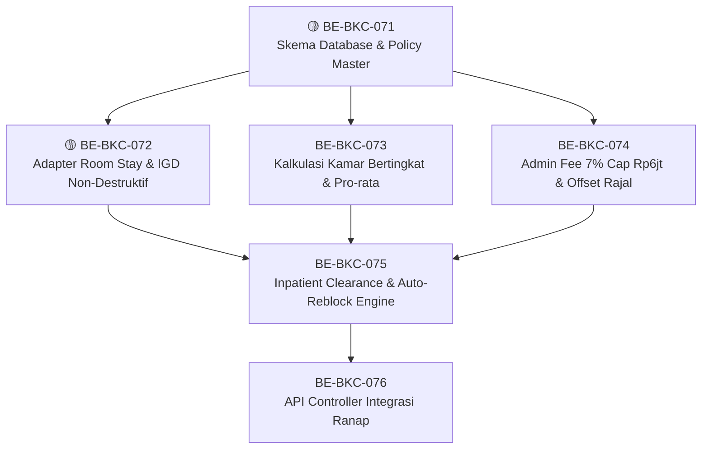

# Roadmap Delivery Backend — Billing dan Kasir

## Metadata

```yaml
blueprint_id: BIL-CASH-001
blueprint_revision: 0.4
blueprint_status: approved
roadmap_revision: 1
roadmap_status: DRAFT_FORWARD_TEST
approved_by: []
source_backend: c99f0a51577456c91831870892870f9ae633b4c2
source_frontend: e555bf2ad6848a1d6cc097ab8c6c5f5259edb151
contracts: [BIL-API-0.4, BIL-STATE-0.4, BIL-VALIDATION-0.4, BIL-INTEGRATION-0.4, BIL-PERMISSION-0.4, BIL-TEST-0.4]
```

Seluruh task berstatus `READY_FOR_TASK_APPROVAL` bila dependency-nya terpenuhi. Approval blueprint tidak otomatis mengizinkan builder, migration execution, commit, push, atau deployment.

## `BE-BKC-001` — Fondasi modul dan test harness

| Field | Isi |
| --- | --- |
| Outcome | Tim dapat membangun setiap slice Billing dengan test otomatis dan struktur `Bil*` yang mematuhi QBE |
| Trace | `BIL-CTX-01`–`05`; `BKC-DEC-031`; engineering `QBE-*` |
| Kontrak | Seluruh `0.4`, tanpa endpoint bisnis baru |
| Reuse | `ApplicationDbContext`, `IdentityModel`, `ApiResponse<T>`, pola service/configuration existing |
| Scope | QBE preflight; module service skeleton; project test backend bila belum ada; fixture database terisolasi; registration minimum. Tidak membuat tabel bisnis |
| Dependency | Tidak ada; registry `HealthServices/BillingManagement/Billing → Bil` sudah `ACTIVE` |
| Acceptance | Build lulus; test project ditemukan solution; satu smoke test DI; controller dilarang direct-context pada new code |
| Verifikasi | `dotnet build`; `dotnet test`; structural test prefix/inheritance/configuration/service boundary |
| Risiko/pemilik | Penambahan test project memengaruhi solution. Owner Backend/API; migration/database tidak disentuh |
| DoD | QBE evidence, build/test log, file scope, dan handoff tersedia |

## `BE-BKC-002` — Master biaya administrasi effective-dated

| Field | Isi |
| --- | --- |
| Outcome | Finance/IT dapat mengatur nominal admin rajal/IGD/OTC/ranap, sekali per hari, replacement rajal→ranap, dan coverage tanpa hardcode |
| Trace | `BKC-DEC-001`–`006`; `BIL-CPT-007`; `BIL-AT-009`–`011` |
| Kontrak | API/Validation/Permission `0.4` — Administration Fee Policy |
| Reuse | Billing Master Data route/permission conventions; `IdentityModel` |
| Scope | `MstAdministrationFeePolicy`, configuration/service/DTO/controller, overlap validation, seed minimum, migration source generation |
| Dependency | `BE-BKC-001`; isi nominal seed disahkan Finance sebelum aktif |
| Acceptance | CRUD versi efektif; tidak ada overlap; admin tidak discountable; time boundary Asia/Jakarta; deactivate tidak menghapus histori |
| Verifikasi | Unit/integration test dan migration script review; contoh dua kunjungan pasien fiktif hari sama hanya memperoleh satu fee |
| Risiko/pemilik | Salah timezone menggandakan fee. Owner Finance + Billing + IT |
| DoD | Endpoint, tests, seed, migration file, Swagger; database belum di-update |

## `BE-BKC-003` — Master diskon dan batas approval

| Field | Isi |
| --- | --- |
| Outcome | Promo master dapat dipakai otomatis dan diskon dokter memiliki target/approver yang jelas |
| Trace | `BKC-DEC-007`–`012`; `BIL-CPT-008`; `BIL-AT-012` |
| Kontrak | API/Validation/Permission `0.4` — Discount Policy |
| Reuse | Master Data conventions dan permission existing |
| Scope | `MstDiscountPolicy`, effective dates, target component, limit, approval rule, service/controller/DTO/configuration, migration generation |
| Dependency | `BE-BKC-001` |
| Acceptance | Promo aktif tidak perlu ad-hoc approval; doctor policy hanya doctor share; period overlap ditolak; policy historis immutable |
| Verifikasi | Test promo total/item, doctor share limit, overlap, unauthorized mutation |
| Risiko/pemilik | Policy salah dapat mengurangi porsi RS/penjamin. Owner Finance + Doctor authority |
| DoD | API/test/migration/seed prerequisite terdokumentasi; DB execution tidak dilakukan |

## `BE-BKC-004` — Master pajak dan aturan kamar

| Field | Isi |
| --- | --- |
| Outcome | Pajak dan room charge dihitung dari policy effective-dated, bukan konstanta aplikasi |
| Trace | `BKC-DEC-041`,`043`; `BIL-CPT-021`,`023`; `BIL-AT-021` |
| Kontrak | API/Validation/Permission `0.4` — Tax Rule dan Room Charge Policy |
| Reuse | Master policy pattern hasil `BE-BKC-002` |
| Scope | Dua master, service/controller/DTO/configuration, rounding/period validation, migration generation |
| Dependency | `BE-BKC-001`; policy nilai aktual dari Finance/Inpatient |
| Acceptance | Tax setelah item discount; decimal/rounding konsisten; 24 jam/minimum/remainder/tariff moment configurable; overlap ditolak |
| Verifikasi | Boundary test period, rounding, tanggal efektif, unauthorized update |
| Risiko/pemilik | Kontrak penjamin dapat berbeda. Owner Finance/Tax + Inpatient |
| DoD | Dua API master, tests, migration source, tanpa DB execution |
| Perbaikan 16 September 2026 (`BE-BKC-FIX-010`) | Kolom `TaxableCategory` pada `MstTaxRule` dihapus dari model/DTO/service/controller (`BKC-DEC-098`) — sudah tidak punya konsekuensi kalkulasi apa pun sejak gerbang PPN dipindah ke `item.IsPharmacy`+`ServiceType` (`BKC-DEC-078`/`079`). Overlap-check periode tax rule aktif jadi global, tanpa kategori (`BKC-DEC-099`). Kolom fisik database dipertahankan sebagai orphan, tanpa migration. Frontend belum disesuaikan. Laporan: [BE-BKC-FIX-010](../task/report/backend/BE-BKC-FIX-010.md) |

## `BE-BKC-005` — Running invoice dan charge idempotent

| Field | Isi |
| --- | --- |
| Outcome | Pelayanan klinis masuk ke satu invoice encounter tanpa item ganda ketika producer retry |
| Trace | `BKC-DEC-013`–`018`,`040`; `BIL-CPT-001`,`002`,`010`,`011`; `BIL-AT-001`–`004` |
| Kontrak | API/Integration/Validation `0.4` — invoice/from-source |
| Reuse | Encounter/order/pharmacy IDs; existing category master |
| Scope | `BilInvoice`, `BilInvoiceItem`, config/service/controller/DTO, source adapter, safe invoice-number allocation, migration generation |
| Dependency | `BE-BKC-001`; producer contract tersedia. Farmasi memakai actual dispensed qty |
| Acceptance | Satu invoice/encounter; unique active source tuple; replay no-op; order incomplete mengikuti timing producer; nomor tidak `Count/Max+1` |
| Verifikasi | `BIL-AT-001`–`004`, concurrency dan structural QBE tests |
| Risiko/pemilik | Out-of-order event. Owner Billing + producer domain |
| DoD | Charge dapat dilihat via API; migration source/test/build lulus; tidak dijalankan ke DB |

## `BE-BKC-006` — Kalkulasi finansial berversi

| Field | Isi |
| --- | --- |
| Outcome | Invoice OPEN memperlihatkan gross, admin, tax, primary, excess, dan patient responsibility yang dapat dihitung ulang dengan histori |
| Trace | `BKC-DEC-019`–`023`,`041`–`044`; `BIL-CPT-003`–`005`,`022`; `BIL-AT-009`–`013` |
| Kontrak | API recalculate; Integration pricing/coverage; Validation `0.4` |
| Reuse | Policies `BE-BKC-002`–`004`, tariff/coverage adapters |
| Scope | `BilCalculationVersion`, breakdown snapshot, calculation service, admin fee daily/replacement, coverage waterfall, tax/rounding, migration generation |
| Dependency | `BE-BKC-002`,`004`,`005`; insurer contract adapters |
| Acceptance | Versi immutable; primary→excess→patient; coverage cap; admin once local day; rejected claim tidak auto-shift; recalculation OPEN |
| Verifikasi | `BIL-AT-009`–`013`, decimal/time/concurrency tests |
| Risiko/pemilik | Cross-invoice daily fee membutuhkan query/index benar. Owner Billing/Finance/Insurance |
| DoD | Calculation response dan provenance lengkap; tests/build/migration source lulus |

## `BE-BKC-007` — Penerapan dan approval diskon

| Field | Isi |
| --- | --- |
| Outcome | Kasir/Billing menerapkan promo dan dokter menyetujui pengorbanan share miliknya |
| Trace | `BKC-DEC-007`–`012`; `BIL-CPT-009`; `BIL-AT-012`,`022` |
| Kontrak | API BillingDiscount/BillingDoctorDiscount; Permission `0.4` |
| Reuse | Invoice calculation dan master `BE-BKC-003` |
| Scope | `BilDiscountApplication`, service/controller/DTO/configuration, approval/exception maker-checker, migration generation |
| Dependency | `BE-BKC-003`,`005`,`006` |
| Acceptance | Master promo langsung efektif; doctor discount pending sampai dokter benar approve; RS portion impact meminta Finance; admin fee ditolak |
| Verifikasi | Domain/API/security tests termasuk self/other doctor dan limit |
| Risiko/pemilik | Actor-doctor mapping. Owner Doctor + Finance + Security |
| DoD | Audit before/after tanpa data sensitif; tests/build/migration source lulus |

## `BE-BKC-008` — Void charge dan recalculation aman

| Field | Isi |
| --- | --- |
| Outcome | Orderer dapat membatalkan item eligible tanpa menghapus histori; perubahan harga pada invoice OPEN membentuk versi baru |
| Trace | `BKC-DEC-014`–`018`,`024`; `BIL-AT-003`,`020`,`021` |
| Kontrak | API void/recalculate; State/Validation `0.4` |
| Reuse | Source lifecycle adapter dan calculation service |
| Scope | Void command, source authorization, reason/audit, optimistic concurrency, recalculation trigger |
| Dependency | `BE-BKC-005`,`006` |
| Acceptance | Belum diperiksa/dibayar boleh void; sesudahnya ditolak; final immutable; concurrent change memberi 409 |
| Verifikasi | `BIL-AT-003`,`020`,`021`; log privacy test |
| Risiko/pemilik | Definisi complete berbeda per producer. Owner domain produsen + Billing |
| DoD | Tidak ada delete; API/tests/build lulus; source contract per producer tercatat |

## `BE-BKC-009` — Deposit rawat inap dan top-up

| Field | Isi |
| --- | --- |
| Outcome | Kasir menerima deposit/top-up sebagai dana pasien yang belum dialokasikan |
| Trace | `BKC-DEC-025`–`027`; `BIL-CPT-012`,`013`; `BIL-AT-007`,`008` |
| Kontrak | Patient Funds API/State/Validation `0.4` |
| Reuse | Payment method master; invoice encounter reference |
| Scope | `BilDepositAccount/Movement`, top-up settlement boundary, ledger/reversal, migration generation |
| Dependency | `BE-BKC-001`,`005`; cash top-up juga bergantung shift setelah `BE-BKC-012`, noncash dapat diuji dulu |
| Acceptance | Satu account/ranap; append-only movement; top-up idempotent; saldo tidak negatif; belum memotong invoice otomatis |
| Verifikasi | Ledger/retry/concurrency tests dan `BIL-AT-007`,`008` bagian deposit |
| Risiko/pemilik | Cash sebelum shift. Owner Treasury/Cashier |
| DoD | Deposit API/tests/build/migration source lulus; DB execution terpisah |

## `BE-BKC-010` — Split tender dan payment attempt

| Field | Isi |
| --- | --- |
| Outcome | Kasir menerima kombinasi metode; tender sukses tetap tercatat ketika metode lain gagal |
| Trace | `BKC-DEC-028`–`030`,`036`; `BIL-CPT-014`,`015`; `BIL-AT-005`,`006`,`017` |
| Kontrak | Settlement API/State/Integration `0.4` |
| Reuse | `MstPaymentMethod`, provider adapter, cashier context |
| Scope | `BilSettlement`, `BilTender`, service/provider adapter, idempotency/status reconciliation, migration generation |
| Dependency | `BE-BKC-005`; cash tender path membutuhkan `BE-BKC-012` |
| Acceptance | Partial success; timeout remains PENDING; retry no duplicate; outstanding hanya bagian gagal; late noncash tidak ubah physical cash closed |
| Verifikasi | `BIL-AT-005`,`006`,`017`, callback replay test |
| Risiko/pemilik | Provider status ambiguity. Owner Treasury/Integration |
| DoD | Tender lifecycle/test/audit/build/migration source lulus |

## `BE-BKC-011` — Allocation, progress payment, dan refundable credit

| Field | Isi |
| --- | --- |
| Outcome | Deposit/pembayaran dapat mencicil running invoice tanpa menutupnya dan sisa dana menjadi credit yang dapat dikembalikan |
| Trace | `BKC-DEC-025`–`030`; `BIL-CPT-016`,`017`; `BIL-AT-007`,`008`,`020` |
| Kontrak | Patient Funds API/State/Validation `0.4` |
| Reuse | Deposit `009`, tender `010`, calculation version `006` |
| Scope | `BilPaymentAllocation`, `BilRefundableCredit`, allocation service, concurrency, migration generation |
| Dependency | `BE-BKC-006`,`009`,`010` |
| Acceptance | Allocation ≤ successful/available/outstanding; invoice ranap tetap OPEN; new charge menambah outstanding; excess menjadi credit |
| Verifikasi | `BIL-AT-007`,`008`,`020` dengan contoh deposit Rp8 juta/alokasi Rp5 juta |
| Risiko/pemilik | Allocation ke calculation version stale. Owner Billing/Treasury |
| DoD | Ledger-to-invoice reconciliation dan tests/build/migration source lulus |

## `BE-BKC-012` — Shift kasir dan variance

| Field | Isi |
| --- | --- |
| Outcome | Cash hanya diterima dalam shift aktif; saldo sistem/fisik dan selisih dapat direview tanpa menghapus histori |
| Trace | `BKC-DEC-037`–`039`; `BIL-CPT-027`,`028`; `BIL-AT-016`,`017` |
| Kontrak | Cashier Shift API/State/Permission `0.4` |
| Reuse | Current-user/permission/logging patterns |
| Scope | `BilCashierShift`, `BilCashVarianceReview`, service/controller/DTO/configuration, handover dua aktor, migration generation |
| Dependency | `BE-BKC-001`; integration tender link dengan `BE-BKC-010` |
| Acceptance | Satu active shift; opening/system/physical/variance; close with variance tetap tercatat; review/reopen authorized; handover kedua kasir |
| Verifikasi | `BIL-AT-016`,`017`, permission/concurrency tests |
| Risiko/pemilik | Mapping register/cashier. Owner Kepala Kasir + Security |
| DoD | Shift API/tests/audit/build/migration source lulus |

## `BE-BKC-013` — Refund proporsional

| Field | Isi |
| --- | --- |
| Outcome | Finance memproses refund rajal/OTC eligible melalui metode asal, termasuk kegagalan sebagian |
| Trace | `BKC-DEC-032`,`033`; `BIL-CPT-025`; `BIL-AT-008`,`014` |
| Kontrak | Financial Exceptions API/State/Permission `0.4` |
| Reuse | Tender/provider adapter dan refundable credit |
| Scope | `BilRefundCase`, approval, proportional plan, provider execution/retry, adjustment link, migration generation |
| Dependency | `BE-BKC-010`,`011`; Finance maker-checker |
| Acceptance | Inpatient normal refund rule ditolak; original method proportion; partial execution visible; maker≠approver; reversal entry baru |
| Verifikasi | Domain/API/provider/security tests |
| Risiko/pemilik | Provider tidak mendukung refund otomatis. Owner Finance/Treasury |
| DoD | Case lifecycle/audit/tests/build/migration source lulus |

## `BE-BKC-014` — Write-off dan financial adjustment

| Field | Isi |
| --- | --- |
| Outcome | Finance dapat menyelesaikan atau mengoreksi kewajiban tanpa menyebut write-off sebagai pembayaran |
| Trace | `BKC-DEC-034`,`035`,`042`; `BIL-CPT-006`,`026`; `BIL-AT-014`,`015`,`021` |
| Kontrak | Exceptions API/State/Integration `0.4` |
| Reuse | Calculation/outstanding dan approval pattern `013` |
| Scope | `BilAdjustment`, `BilWriteOffCase`, debit/credit/reversal, correlation id, migration generation |
| Dependency | `BE-BKC-006`; post-final integration selesai bersama `BE-BKC-016` |
| Acceptance | Partial mengurangi saldo; full `SETTLED_BY_WRITE_OFF`; reversal membuka AR; posting lama immutable; self-approve ditolak |
| Verifikasi | `BIL-AT-014`,`015`,`021`,`022` |
| Risiko/pemilik | Salah direction debit/credit. Owner Finance/AR/AP |
| DoD | Ledger effect, approval, audit, tests/build/migration source lulus |

## `BE-BKC-015` — Finalisasi invoice dan departure exception

| Field | Isi |
| --- | --- |
| Outcome | Billing menutup invoice hanya ketika syarat terpenuhi, atau mencatat departure darurat dengan debtor sah |
| Trace | `BKC-DEC-031`,`036`,`044`; `BIL-CPT-018`,`031`; `BIL-AT-018`,`019` |
| Kontrak | Finalization API/State/Validation `0.4` |
| Reuse | Order completion adapters, calculation, settlement, exceptions |
| Scope | `BilFinalizationRecord`, preview/checklist, snapshot lock, settlement outcome, departure reason/debtor evidence, migration generation |
| Dependency | `BE-BKC-006`–`014` sesuai outcome invoice |
| Acceptance | Semua order complete; self-pay lunas atau exception; insured lunas pada patient portion; InvoiceDate tetap; one final effect/version |
| Verifikasi | `BIL-AT-018`,`019`,`023`; failure leaves retryable FINAL state |
| Risiko/pemilik | Debtor legal evidence sensitif. Owner Billing/Finance/Security |
| DoD | Preview/finalize tests/audit/build/migration source lulus |

## `BE-BKC-016` — Handoff AR/AP dan adjustment idempotent

| Field | Isi |
| --- | --- |
| Outcome | Invoice final menghasilkan AR per debtor dan AP dokter sekali saja; AP baru siap dibayar sesuai policy |
| Trace | `BKC-DEC-041`–`044`; `BIL-CPT-019`,`029`,`030`; `BIL-AT-019`,`021`,`023` |
| Kontrak | Integration/Finalization API `0.4` |
| Reuse | AR/AP consumer contracts; outbox pattern terdekat saat implementasi |
| Scope | `BilArHandoff`, `BilApHandoff`, `BilHandoffAdjustment`, outbox/ack/retry, migration generation |
| Dependency | `BE-BKC-014`,`015`; AR/AP consumer owner mengonfirmasi schema |
| Acceptance | At-least-once safe; AR per debtor/due date; AP created not-ready then ready; correction debit/credit links original; consumer down tidak duplicate |
| Verifikasi | `BIL-AT-019`,`021`,`023`, replay/recovery tests |
| Risiko/pemilik | Consumer AR/AP belum punya endpoint/event final. Owner Integration + AR/AP; task `BLOCKED` bila schema belum disetujui |
| DoD | Contract test, outbox evidence, reconciliation query, build/migration source lulus |

## `BE-BKC-017` — Hardening dan acceptance lintas-slice

| Field | Isi |
| --- | --- |
| Outcome | Seluruh invariants, privacy, concurrency, migration, dan failure recovery memiliki bukti yang dapat diaudit |
| Trace | Seluruh `BKC-DEC-001`–`044`; `BIL-AT-001`–`024` |
| Kontrak | Seluruh `0.4` |
| Reuse | Test harness `001` dan semua slice |
| Scope | Full acceptance suite, authorization negative paths, log scan, migration forward/backward lokal, performance/index checks, sanitized Swagger examples |
| Dependency | `BE-BKC-002`–`016`; otorisasi database lokal terpisah untuk migration execution |
| Acceptance | 24 acceptance IDs memiliki bukti; tidak ada sensitive custom log; no duplicate under retry/concurrency; coverage gaps eksplisit |
| Verifikasi | `dotnet build/test`, contract/integration tests, migration dry-run/local only jika diizinkan |
| Risiko/pemilik | Solution/infrastructure test dan provider sandbox. Owner QA/Backend/Security |
| DoD | Evidence matrix diperbarui; zero critical gap; readiness audit dapat dijalankan |

## Urutan dan paralelisme

Setelah `001`, master `002`–`004` boleh paralel. `005` dapat berjalan paralel dengan master, tetapi `006` menunggu master. `009` dan `012` boleh paralel setelah fondasi invoice; `010` menggabungkannya untuk cash path. Exception `013`/`014` mengikuti settlement, lalu `015`/`016`. Setiap task tetap satu unit builder terpisah.

## Amendment 2 September 2026 — Entri manual katalog tarif + coverage per item

```yaml
input_blueprint_revision: 0.5
input_blueprint_status: approved
approved_by: Product/Domain Owner (2 September 2026 13:53 WIB) — BKC-DEC-062 tanpa konfirmasi terpisah Payer/Insurance+Finance/AR, lihat 00-interview-decisions.md
source_backend_at_design: 17b9c0e21e32b41a8dfd6dbde31462d52717646b
source_frontend_at_design: 60febdcdbb39de6cebc2d825906bce949f3b5af3
contracts: [BIL-API-0.4 (amendment 2 Sep 2026), BIL-VALIDATION-0.4 (amendment), BIL-INTEGRATION-0.4 (amendment), BIL-PERMISSION-0.4 (amendment)]
```

Empat task baru (`BE-BKC-018`–`021`) mengoperasikan `BKC-DEC-059`–`062`. Detail desain lengkap: [`02-backend-architecture.md`](../02-backend-architecture.md#amendment-2-september-2026--entri-manual-berbasis-katalog-tarif--coverage-per-item), [`04-prd-to-mvp.md`](../04-prd-to-mvp.md).

## `BE-BKC-018` — Fondasi katalog tarif pada `BilInvoiceItem`

| Field | Isi |
| --- | --- |
| Outcome | `BilInvoiceItem` dapat menyimpan referensi tarif resmi, dan picker encounter mengekspos konteks unit layanan/klinik/kelas pasien yang dibutuhkan untuk memfilter tarif |
| Trace | `BKC-DEC-059`,`061`; `CAP-02`,`CAP-06` (`01-existing-capability-map.md` § 16); `FR-BKC-001`,`FR-BKC-004` (`04-prd-to-mvp.md`) |
| Kontrak | ERD amendment `BilInvoiceItem.TariffId` (`erd/01-billing-account-charge.md`, `erd/data-dictionary.md`); tidak ada status baru (`contracts/state-transition-matrix.md`) |
| Reuse | `MstTariff`/`MstTariffCategory` existing; pola `SourcePolicies["ADHOC"]` existing sebagai referensi entri baru |
| Scope | Migration `TariffId` (`Guid?`, FK `Restrict`, index) pada `BilInvoiceItem` + configuration; tambah `SourcePolicies["ADHOC_CATALOG"]` pada `BillingChargeSourceAdapter`; extend `ActiveEncounterOptionResponse` (+`ServiceUnitId`,+`ClinicId`,+`PatientClassId`) dan `GetActiveEncounterOptionsAsync`. TIDAK termasuk endpoint charge/preview baru (lihat `BE-BKC-019`/`020`) |
| Dependency | `BE-BKC-001`; tidak bergantung task lain pada slice ini |
| Acceptance | Kolom `TariffId` nullable, FK `Restrict` tervalidasi; `"ADHOC_CATALOG"` diterima `BillingChargeSourceAdapter.ValidateAndNormalize`; `ActiveEncounterOptionResponse` mengembalikan 3 field baru tanpa breaking existing consumer |
| Verifikasi | Migration dry-run/structural test; unit test policy baru; contract test `ActiveEncounterOptionResponse` |
| Risiko/pemilik | FK `Restrict` perlu dipastikan tidak memblokir siklus hidup `MstTariff` yang sudah dipakai. Owner Backend/API |
| DoD | Migration source + configuration + test lulus; build lulus; DB tidak dijalankan |

**Status 3 September 2026**: source, configuration, migration (belum dijalankan), dan test
(policy baru + contract test) selesai; build `dotnet build` lulus (`0 Error`). Lihat
`task/report/backend/BE-BKC-018.md` untuk rincian dan dua kegagalan test pra-eksisting yang
ditemukan (tidak terkait task ini, dikonfirmasi lewat `git stash` baseline).

## `BE-BKC-019` — Endpoint entri charge dari katalog tarif

| Field | Isi |
| --- | --- |
| Outcome | Kasir/penguji menambah item invoice dari `MstTariff` dengan harga sepenuhnya ditentukan server, tidak dapat dimanipulasi client |
| Trace | `BKC-DEC-059`; `FR-BKC-002`,`FR-BKC-003`; `BIL-VAL-025`,`026` |
| Kontrak | API amendment `POST catalog-charges` (`contracts/api-contract.md`); Permission `BillingInvoice:Create` (existing, reuse) |
| Reuse | `BillingInvoiceService.UpsertChargeAsync` (idempotensi/locking/invoice-upsert existing, dipakai penuh); `AddOtherChargeAsync` sebagai referensi struktur method |
| Scope | DTO `AddCatalogChargeRequest`; method `BillingInvoiceService.AddCatalogChargeAsync` (lookup `MstTariff` aktif+efektif, ambil `NormalPrice`+`TariffCategoryId`+`TariffName`, build `UpsertChargeRequest` dengan `SourceDomain="ADHOC_CATALOG"`); action `POST catalog-charges` pada `BillingInvoicesController` |
| Dependency | `BE-BKC-018` |
| Acceptance | `BIL-AT-025`,`026` (`testing/acceptance-test-matrix.md`) |
| Verifikasi | Integration test tarif aktif vs nonaktif/kedaluwarsa; idempotency replay test |
| Risiko/pemilik | Tarif dengan scoping ganda perlu konsisten dengan disambiguasi FE (`BKC-DEC-061`). Owner Billing/API |
| DoD | Endpoint + tests + Swagger sesuai `contracts/api-contract.md`; build lulus; DB tidak disentuh |

**Status 3 September 2026**: source (DTO, method, endpoint) dan 4 test (2 acceptance + 1
idempotency + tercakup dalam test aktif/nonaktif/kedaluwarsa) selesai. Build dikonfirmasi lulus
untuk revisi sebelum tiga penyesuaian terakhir (perbaikan determinisme `SourceDetailId`, perbaikan
tabrakan `SortOrder`, penambahan 4 test) — revisi final **belum diverifikasi ulang**, pengguna
mengambil alih menjalankan build/test secara manual. Belum ditandai selesai; lihat
`task/report/backend/BE-BKC-019.md` § 5 dan § 7.

## `BE-BKC-020` — Endpoint preview coverage per tarif

| Field | Isi |
| --- | --- |
| Outcome | Sistem menjawab "apakah tarif ini tercover untuk pasien ini" sebelum item ditambahkan, tanpa efek samping |
| Trace | `BKC-DEC-060`; `FR-BKC-005`; `CAP-04` |
| Kontrak | API amendment `GET catalog-charges/coverage-preview`; Integration `BIL-INT-010` (in-process, `contracts/integration-contract.md`) |
| Reuse | `InsuranceCoverageService.ResolveTariffAsync` (Clinical Management) dipanggil langsung via DI — TIDAK menulis ulang logika matching rule |
| Scope | DTO `CatalogChargeCoveragePreviewResponse`; method `BillingInvoiceService.GetCatalogChargeCoveragePreviewAsync` (validasi encounter/tarif, panggil `ResolveTariffAsync`, map ke response); constructor injection `InsuranceCoverageService` pada `BillingInvoiceService`; action `GET catalog-charges/coverage-preview` |
| Dependency | `BE-BKC-001`; **independen** dari `BE-BKC-018`/`019` — boleh paralel |
| Acceptance | `BIL-AT-027`,`028`; `BIL-VAL-027` |
| Verifikasi | Domain test rule `Covered`+`IsNeedApproval` tetap dihitung tercover; test encounter/tarif invalid |
| Risiko/pemilik | Response **MUST NOT** membocorkan field internal rule (`RuleCode`, `ApprovalInstruction`). Hasil bersifat advisory — didokumentasikan eksplisit BUKAN angka final (lihat `BE-BKC-021`). Owner Backend/Security |
| DoD | Endpoint read-only tanpa transaksi; tests lulus; build lulus |

**Status 3 September 2026**: source (DTO, constructor injection, method, endpoint) dan 2 test
domain (rule butuh-approval tetap Covered; encounter/tarif tidak valid) selesai ditulis. Build dan
test **sengaja belum dijalankan** oleh sesi ini atas instruksi eksplisit pengguna — pengguna
memverifikasi sendiri secara manual. Belum ditandai selesai; lihat
`task/report/backend/BE-BKC-020.md` § 5 dan § 7.

## `BE-BKC-021` — Penyempitan gating approval pada mesin kalkulasi coverage

| Field | Isi |
| --- | --- |
| Outcome | Item dengan rule coverage berstatus `Covered` tidak lagi jatuh ke `unresolved` hanya karena butuh approval/surat jaminan — Subtotal Asuransi di Menu Pembayaran mencerminkan ini untuk **SEMUA invoice**, bukan cuma dari form testing |
| Trace | `BKC-DEC-062` (approved dengan caveat wewenang — lihat `00-interview-decisions.md`); `FR-BKC-007` |
| Kontrak | Tidak ada endpoint baru; perubahan logika internal `RegistrationBillingCoverageAdapter.ResolveAsync` |
| Reuse | Method existing; hanya kondisi gating yang diubah |
| Scope | Hapus `rule.IsNeedApproval \|\| rule.IsNeedGuaranteeLetter` dari kondisi yang menggeser komponen ke `unresolved`. **PERTAHANKAN** `CoverageStatus=="NeedApproval"` dan `MaxAmountPerMonth`/`MaxQuantityPerMonth` sebagai gate — scope dipersempit sesuai `02-backend-architecture.md`, BUKAN pelepasan gating penuh |
| Dependency | `BE-BKC-001`; independen dari `BE-BKC-018`–`020` (boleh paralel), TAPI dampaknya **GLOBAL** ke semua invoice — regresi-sensitif |
| Acceptance | `BIL-AT-027` (bagian kalkulasi resmi); regresi nol pada `BillingCalculationServiceTests.cs` dan 3 file test lain yang mereferensikan adapter/rule (`01-existing-capability-map.md` § 16.1 `CAP-05`) — `NFR-004` |
| Verifikasi | Full regression run atas test coverage existing + test baru kasus `Covered`+`IsNeedApproval`; review manual bahwa `CoverageStatus=NeedApproval` dan limit bulanan TIDAK ikut berubah |
| Risiko/pemilik | **Risiko tertinggi di slice ini** — mengubah kalkulasi finansial semua invoice produksi, bukan hanya data uji. Owner Billing/Finance/AR. **Wajib dibaca sebelum eksekusi**: `BKC-DEC-062` disetujui Product/Domain Owner TANPA konfirmasi terpisah dari Payer/Insurance + Finance/AR (owner asli `BKC-DEC-042` yang diamendemen) — disarankan menginformasikan mereka sebelum task ini di-deploy ke produksi, meski blueprint tidak mewajibkannya sebagai blocker |
| DoD | Regression evidence eksplisit (bukan cuma "test baru lulus"); before/after behavior terdokumentasi di laporan task; build lulus |

**Status 3 September 2026**: Pengguna dikonfirmasi eksplisit atas catatan risiko di atas sebelum
implementasi dimulai (memilih lanjut implementasi source+test, deploy tetap terpisah). Source
(2 kondisi gating dihapus) dan 4 test baru (regresi + gate yang dipertahankan) selesai ditulis;
analisis regresi statis terhadap 4 file test yang memakai adapter ini menemukan nol test existing
yang terdampak (rincian di laporan). Build/test **sengaja belum dijalankan** sesuai instruksi
pengguna yang berlaku sepanjang sesi ini — evidence regresi nyata (`dotnet test`) dan notifikasi
Finance/AR/Payer sebelum deploy tetap prasyarat wajib. Belum ditandai selesai; lihat
`task/report/backend/BE-BKC-021.md` § 5 dan § 7.

---

# Amendment 4 September 2026 — Gelombang `MVP-4` sampai `MVP-12`

## Metadata gelombang ini

```yaml
roadmap_revision: 2
roadmap_status: DRAFT_FORWARD_TEST
approval_gate: BLUEPRINT_DRAFT_AWAITING_APPROVAL
approved_by: []
approved_at: null
blueprint_revision_dibaca: 0.8 (manifest) + 0.9 (bagian revisi 0.9 pada 02-backend-architecture.md)
blueprint_status: draft — readiness DESIGN_DRAFT_AWAITING_APPROVAL
baseline_revision: 0.5 (approved 2 September 2026)
cakupan: MVP-4, MVP-5, MVP-7, MVP-8, MVP-10, MVP-11 (backend); MVP-6, MVP-9, MVP-12 ada di frontend-roadmap.md
epic: [EPIC BKC-04, EPIC BKC-05, EPIC BKC-06, EPIC BKC-07, EPIC BKC-08, EPIC BKC-09]
task_id_series: BE-BKC-022 s.d. BE-BKC-032 — dilanjutkan dari BE-BKC-021
backend_commit_sha_pada_manifest: ffeb45a83a6282982214668acc57e15ac0652f04
backend_commit_sha_terverifikasi: fd4a605 (branch Yasmina, diperiksa 4 September 2026)
backend_jarak_dari_baseline: 52 commit; 237 berkas source non-dokumentasi berubah
frontend_commit_sha_pada_manifest: 00210f9a5fb2f4f69e57b8c90c57c63c788da792
frontend_commit_sha_terverifikasi: belum diperiksa — repository frontend tidak tersedia pada sesi ini
working_tree_backend: bersih pada 4 September 2026, kecuali empat dokumen roadmap ini sendiri
contracts:
  - BIL-API-0.7 (draft)
  - BIL-STATE-0.7 (draft)
  - BIL-VALIDATION-0.7 (draft)
  - BIL-INTEGRATION-0.6 (draft, tidak bergerak sejak 0.6)
  - BIL-PERMISSION-0.6 (draft, tidak bergerak sejak 0.6)
  - BIL-TEST-0.7 (draft)
  - BIL-CALCULATION-0.7 (draft)
input_revisions:
  02-backend-architecture.md: 0.9
  04-prd-to-mvp.md: 0.8 (Bagian A, B, dan C)
  contracts/api-contract.md: BIL-API-0.7
  contracts/validation-matrix.md: BIL-VALIDATION-0.7
  testing/acceptance-test-matrix.md: BIL-TEST-0.7
  01-existing-capability-map.md: 0.2 + impact scan § 16 (2 September 2026) — BASI untuk 3 dan 4 September
```

## 0. Tiga peringatan yang menentukan cara membaca gelombang ini

> **Pertama: tidak ada satu pun task di bawah yang boleh dieksekusi hari ini.** Seluruh kontrak
> yang mengikat gelombang ini (`BIL-API`, `BIL-STATE`, `BIL-VALIDATION`, `BIL-TEST`,
> `BIL-CALCULATION` versi `0.5` sampai `0.7`) masih berstatus `draft`. Yang sudah `approved`
> adalah **keputusan bisnisnya** (`BKC-DEC-059` sampai `BKC-DEC-091`) dan **keputusan
> arsitekturnya** (`BKC-DES-001` sampai `BKC-DES-025`) — bukan dokumen kontraknya. Roadmap ini
> ditulis supaya urutan, ukuran, dan risikonya dapat ditinjau lebih dulu; ia **tidak** memberi
> wewenang menulis source.

> **Kedua: kekhawatiran manifest soal working tree sudah tidak berlaku — diperiksa 4 September 2026.**
> Manifest revisi `0.8` mencatat enam berkas hasil `BE-BKC-FIX-003`/`FE-BKC-FIX-008` sebagai "belum
> di-commit dan belum pernah dibangun sekali pun". Pemeriksaan langsung pada repository backend
> menunjukkan keempat berkas backend di antaranya — `BillingCoverageAdapter.cs`,
> `BillingCalculationService.cs`, `BillingInvoiceDtos.cs`, dan `InsuranceCoverageService.cs` —
> **sudah ter-commit** dan termasuk di dalam `HEAD`. Working tree backend bersih. Solution juga
> **sudah terbukti dibangun tanpa galat** pada tanggal yang sama. Karena itu `BKC-GATE-07`
> dinyatakan **tertutup**, dan `BE-BKC-022`, `BE-BKC-024`, serta `BE-BKC-028` tetap berbentuk
> "menyempurnakan yang sudah ada".

> **Ketiga: jarak dari baseline jauh lebih besar daripada yang diperkirakan manifest.** Manifest
> mencatat baseline bukti `ffeb45a8`. Pemeriksaan 4 September 2026 menemukan `HEAD` sudah berada
> **52 commit di depannya, dengan 237 berkas source non-dokumentasi berubah** — termasuk seluruh
> modul Laboratorium dan lima berkas Billing. Jadi persoalannya bukan sekadar "pemindaian dampak
> belum mencakup 3 dan 4 September", melainkan **seluruh bukti keadaan apa adanya pada revisi `0.7`
> sampai `0.9` dibaca terhadap kode yang sudah jauh bergerak**. Selama `/qv-trace` belum
> dijalankan ulang, kolom **Reuse** dan "kondisi awal" pada setiap task di bawah **tidak dapat
> dipercaya** — sebagian pekerjaan yang direncanakan bahkan mungkin sudah terimplementasi.

## 1. Gerbang yang masih terbuka

Tabel ini adalah inti roadmap gelombang ini. Setiap task menyebut gerbang mana yang menahannya.

| ID gerbang | Isi | Siapa yang menutup | Menahan task |
| --- | --- | --- | --- |
| ~~`BKC-GATE-01`~~ | ~~Tujuh dokumen kontrak masih `draft`~~ **DITUTUP 4 September 2026** — Product/Domain Owner (wewenang ganda Finance/AR, `BKC-DEC-085`) mengunci keenam dokumen kontrak (`api`, `state`, `validation`, `integration`, `permission`, `testing`) sampai revisi `0.7`/`0.8`. Lihat `blueprint-manifest.md` § `contract_lock_note` | Pemilik blueprint + Product/Domain Owner | — (tidak lagi menahan apa pun) |
| ~~`BKC-GATE-02`~~ | ~~Pemindaian dampak belum mencakup 3–4 September 2026~~ **DITUTUP 4 September 2026** — `/qv-trace` dijalankan terhadap `HEAD` `fd4a605`; hasilnya di `01-existing-capability-map.md` § 17 (`CAP-10`–`CAP-28`). Cakupan `BE-BKC-022`, `024`, `026`, `032` sudah dinilai ulang mengikutinya | `/qv-trace` | — (tidak lagi menahan apa pun) |
| ~~`BKC-GATE-03`~~ | ~~Penilaian Security atas pemakaian ulang hak akses `BillingInvoice : Read` untuk lembar bernomor polis~~ **DITUTUP 5 September 2026** — `BKC-DEC-092` (Security Owner): dipakai ulang apa adanya, tidak ada permission baru; lihat `00-interview-decisions.md` § amendment 5 September 2026 | Security Owner | — (tidak lagi menahan apa pun) |
| ~~`BKC-GATE-04`~~ | ~~`BKC-OQ-085` — dampak penurunan tagihan rawat inap~~ **DITUTUP 4 September 2026** — pemilik mengonfirmasi belum ada tagihan rawat inap sama sekali; penurunan nol, kelebihan bayar nol | Billing/Finance/AR Owner | — (tidak lagi menahan apa pun) |
| `BKC-GATE-05` | `BKC-OQ-083` — apakah `MCU`, `TELEMEDICINE`, dan `OTC` dikenai PPN. **Diturunkan 4 September 2026**: ketiganya belum dipakai, sehingga gerbang ini tidak lagi menahan roadmap — hanya wajib dijawab sebelum salah satunya diaktifkan | Product/Domain Owner + Finance/Tax | Tidak ada lagi — dipindahkan menjadi syarat aktivasi `MCU`/`TELEMEDICINE`/`OTC`, bukan syarat roadmap |
| ~~`BKC-GATE-06`~~ | ~~`BKC-DES-026`–`027` (revisi `0.9`) masih `draft`; kontrak `BIL-API-0.8`/`BIL-TEST-0.8` belum ditulis; `BIL-AT-062`–`063` belum ada isinya.~~ **DITUTUP 5 September 2026** — `BKC-DES-026`–`027` disetujui Product/Domain Owner ("Saya approve untuk case diatas", wewenang ganda Finance/AR `BKC-DEC-085`); `BIL-API-0.8`/`BIL-TEST-0.8` ditulis (`contracts/api-contract.md`, `testing/acceptance-test-matrix.md`); `BIL-AT-062`–`063` sudah ada isinya. **Catatan 4 September 2026**: jawaban pemilik atas limit bulanan (`BKC-CQ-07`) menunda keadaan "belum dapat ditentukan", sehingga kesimpulan `BKC-DES-027` (nominal menggantung selalu nol) **tetap berlaku untuk rilis ini** — tidak ada revisi mendesak | Product/Domain Owner + pemilik blueprint | — (tidak lagi menahan apa pun) |
| ~~`BKC-GATE-07`~~ | ~~Enam berkas working tree `BE-BKC-FIX-003`/`FE-BKC-FIX-008` belum di-commit dan belum pernah dibangun~~ **DITUTUP 4 September 2026** — keempat berkas backend sudah ter-commit di `HEAD`, working tree bersih, dan solution terbukti dibangun tanpa galat | Pemilik repository | — (tidak lagi menahan apa pun) |
| `BKC-GATE-08` | Kelengkapan `MstInsuranceProvider` dan `MstInsuranceCoverageRule` di lingkungan uji | Insurance/Finance Owner | Verifikasi UAT, **bukan** penulisan kode |
| `BKC-GATE-09` | `BKC-OQ-092` — wewenang tulis backend, mode task, dan cabang kerja | Pengguna | Seluruh eksekusi |

**Ringkasan sesudah kontrak dikunci, 4 September 2026 — diperbarui 5 September 2026.** Dari
sembilan gerbang semula, **tujuh sudah tertutup** (`01`, `02`, `03`, `04`, `06`, `07`, dan `05`
diturunkan menjadi syarat aktivasi bukan syarat roadmap). Yang tersisa hanya `BKC-GATE-08`
(kelengkapan data uji, bukan penulisan kode) dan `BKC-GATE-09` (wewenang tulis — berlaku untuk
**setiap** task, terpisah dari approval desain). `BE-BKC-030` tidak lagi tertahan gerbang desain —
`BKC-DES-026`–`027` disetujui dan kontrak `BIL-API-0.8`/`BIL-TEST-0.8`/`BIL-AT-062`–`063` sudah
ditulis. `BE-BKC-023` tidak lagi tertahan gerbang Security — `BKC-DEC-092` menutup `BKC-GATE-03`.
**Sepuluh dari sebelas task backend kini `READY_FOR_TASK_APPROVAL`**: `BE-BKC-022`, `023`
(Security ditutup; sequencing `BE-BKC-022` juga sudah `READY`), `024`, `025`, `026`, `027` (berkas
migration; eksekusinya tetap `BKC-GATE-09`), `028`, `029`, `030`, dan `031`. Tersisa hanya
`BE-BKC-032` (menunggu seluruh task lain selesai, bukan gerbang).

**Approval kontrak bukan wewenang tulis.** Mengunci kontrak menyetujui **desain**, bukan
mengizinkan builder menulis source. Setiap task tetap menunggu approval task tersendiri dan
konfirmasi `TASK MODE: BACKEND` beserta cabang kerja (`BKC-GATE-09`/`BKC-OQ-092`) sebelum satu
baris kode pun ditulis — sesuai aturan eksekusi baris 1–5 pada `README.md`.

## 2. Urutan gelombang dan alasannya

| Gelombang | Task backend | Yang dapat diverifikasi bisnis sesudahnya | Syarat mulai |
| --- | --- | --- | --- |
| `MVP-4` | `BE-BKC-022` | Petugas klaim melihat rupiah tanggungan penjamin **per baris biaya**, dan jumlahnya sama dengan total | Tidak ada — `READY_FOR_TASK_APPROVAL` |
| `MVP-5` | `BE-BKC-023` | Satu permintaan baca menghasilkan seluruh isi lembar Invoice Asuransi | `MVP-4` selesai dan terverifikasi; `BKC-GATE-03` **ditutup** |
| `MVP-7` | `BE-BKC-024`, `BE-BKC-025` | Tagihan asuransi tidak lagi menyisakan nominal menggantung; masalah data pendaftaran terlihat tanpa menahan pembayaran | Tidak ada — `READY_FOR_TASK_APPROVAL` |
| `MVP-8` | `BE-BKC-026` | Gerbang PPN rawat inap/rawat jalan **terverifikasi** sebelum rawat inap hidup — kodenya sudah ada | Tidak ada — `READY` |
| `MVP-10` | `BE-BKC-031` | Cara pembagian PPN pada tarif aktif terbukti benar | Tidak ada — boleh kapan saja |
| `MVP-11` | `BE-BKC-027`, `BE-BKC-028`, `BE-BKC-029` | Selisih yang tidak dapat ditagihkan berakhir sebagai keputusan bernama pelaku | `MVP-7` **selesai lebih dulu** |
| Revisi `0.9` | `BE-BKC-030` | Jalur `NotCovered` ikut dirutekan ke jalur penanggungan yang sama | `MVP-11` selesai (source); `BKC-GATE-06` **ditutup** |
| Penutup | `BE-BKC-032` | Seluruh regresi dan bukti keluar lengkap | Seluruh gelombang di atas |

**Kenapa `MVP-11` menunggu `MVP-7`.** Keduanya menyunting method yang sama persis
(`RegistrationBillingCoverageAdapter.ResolveAsync`) di dalam perulangan yang sama. Mengerjakan
keduanya bersamaan berarti dua pekerjaan bertabrakan pada berkas yang sama, dan penyelesaian
tabrakan itu adalah tempat kesalahan perhitungan uang paling mudah bersembunyi.

**Kenapa `MVP-8` boleh berjalan bersama `MVP-7`.** Keduanya menyentuh berkas yang sama tetapi
method yang berbeda — `ApplyInvoiceTax` versus `ResolveAsync` — sehingga tidak saling menimpa.

---

## `BE-BKC-022` — Rupiah tanggungan penjamin per komponen biaya

| Field | Isi |
| --- | --- |
| Outcome | Setiap potongan biaya membawa angka "berapa rupiah ditanggung penjamin" miliknya sendiri, dan sistem menolak menyimpan perhitungan bila jumlah seluruh baris tidak sama dengan total tanggungan |
| Gelombang | `MVP-4` (`EPIC BKC-04`) |
| Trace | `FR-BKC-009`–`FR-BKC-013`; `BKC-DEC-069`; `BKC-DES-001`–`006`, `BKC-DES-015`, `BKC-DES-016`, `BKC-DES-017` |
| Kontrak | `BIL-API-0.6` (draft), `BIL-VALIDATION-0.6` (`BIL-VAL-028` diubah cara menjumlahnya), `BIL-CALCULATION-0.6` |
| Reuse | `RegistrationBillingCoverageAdapter.ResolveAsync` dan `BillingCalculationService.ApplyCoverageWaterfall` — **formulanya tidak disentuh**; `BillingCoverageComponentOutcome` hasil `BE-BKC-FIX-003` **sudah ter-commit** dan tersedia di `HEAD` (diperiksa 4 September 2026) |
| Scope | Kunci komponen berbentuk pasangan `(ComponentId, ComponentType)`; field `itemPrimaryAmount`, `itemUnresolvedAmount`, `taxPrimaryAmount`, `taxUnresolvedAmount` pada `CalculationItemResponse`; `primaryAmount` dan `unresolvedAmount` pada `AdministrationFeeCalculationResponse` serta `RoomChargeCalculationResponse`; `isPerItemAllocationAvailable` pada `CoverageCalculationResponse`; penjaga `BIL-VAL-028`. **Tidak termasuk** anomali data (`BE-BKC-025`) dan selisih tidak dapat ditagihkan (`BE-BKC-028`) |
| Dependency | Tidak ada gerbang. Tidak bergantung pada `MVP-0`–`MVP-3` |
| Status | **`READY_FOR_TASK_APPROVAL`.** Kontrak dikunci 4 September 2026. Pemindaian dampak (`01-existing-capability-map.md` § 17, `CAP-10`–`CAP-12`) mengonfirmasi inti alokasi per komponen **sudah ada** lewat `BE-BKC-FIX-003`; scope yang benar-benar baru pada task ini hanya `isPerItemAllocationAvailable` (CAP-11) dan penjaga penjumlahan `BIL-VAL-028` (CAP-12). Menulis source tetap menunggu approval task dan `BKC-GATE-09` |

**Aturan dan contoh berangka.** Item "Fisioterapi" seharga Rp 300.000 dengan aturan tanggungan
`Covered` 80% menghasilkan tanggungan Rp 240.000. Sebelum task ini, hanya Rp 240.000 yang ikut ke
total tagihan dan tidak ada cara mengetahui bahwa Rp 240.000 itu milik fisioterapi. Sesudah task
ini, Rp 240.000 tercatat beralamat baris fisioterapi.

**Kenapa kuncinya bukan `ComponentId` saja.** Satu tagihan berisi dua item dan satu aturan pajak
aktif. Kedua baris pajaknya membawa `ComponentId` yang sama, yaitu `TaxRuleId` dari satu-satunya
aturan pajak aktif. Bila alokasi dialamati memakai `ComponentId` saja, porsi pajak kedua item
bertumpuk menjadi satu dan salah satu item kehilangan porsi pajaknya.

Acceptance criteria:

1. `BIL-AT-029` — tiga item (Rp 100.000 tercover penuh, Rp 300.000 tercover 80%, Rp 25.000 tanpa aturan) ditambah biaya administrasi Rp 15.000 tercover penuh menghasilkan jumlah baris Rp 355.000, sama persis dengan `coverage.primaryAmount`.
2. `BIL-AT-030` — porsi pajak menempel pada baris item masing-masing; uji **wajib gagal** bila implementasi memakai `ComponentId` sebagai kunci.
3. `BIL-AT-049` — komponen pajak biaya administrasi dan komponen pajak biaya kamar yang keduanya tanpa `PolicyId` tidak melempar galat kunci ganda.
4. `BIL-AT-050` — versi kalkulasi yang ditulis sebelum pembaruan tetap terbaca; `isPerItemAllocationAvailable` bernilai `false` dan seluruh field baru bernilai nol tanpa galat.
5. `BIL-AT-052` — penjumlahan `itemPrimaryAmount + taxPrimaryAmount` seluruh baris ditambah `primaryAmount` biaya administrasi sama persis dengan `coverage.primaryAmount`.
6. Ambang toleransi `BIL-VAL-028` adalah **nol**. Setiap nominal komponen sudah dibulatkan dua desimal di sumbernya, sehingga selisih satu rupiah pun berarti kesalahan alokasi, bukan pembulatan.

Bukti verifikasi: `dotnet build` dan `dotnet test` yang benar-benar dijalankan; seluruh nilai
`primaryAmount`/`unresolvedAmount` pada test yang sudah ada **tidak berubah satu rupiah pun**
(titik uji paling langsung: `BillingCalculationServiceTests.CoverageWaterfallAppliesPrimaryThenExcessThenPatient`
dan `BillingArApHandoffServiceTests.InsuredInvoiceCreatesPayerArHandoffAndKeepsApNotReady`).

Risiko dan pemilik: `BillingCoverageDecision` adalah `record` posisional. Kesalahan urutan argumen
paling mudah terjadi di sini dan paling terlambat ketahuan — jalur pasien tunai (`SelfPay()`) yang
paling sering dipakai justru yang pertama memperlihatkannya. Owner Backend/API + Billing/Finance.

Definition of Done: seluruh acceptance terpenuhi; formula tanggungan tidak berubah; regresi nol
pada nominal test existing; build dan test lulus; tidak ada migration.

**Status 4 September 2026 — source selesai, verifikasi menunggu pengguna.** Dua perubahan
dikerjakan: properti `IsPerItemAllocationAvailable` pada `CoverageCalculationResponse`, dan penjaga
`BIL-VAL-028` pada `ApplyCoverageWaterfall`. Tiga test baru ditambahkan (`BIL-VAL-028` jalur gagal,
penanda bernilai `true` pada perhitungan baru, dan `BIL-AT-050` snapshot lama terbaca `false`).
**Dua fixture test yang sudah ada sengaja diperbaiki** karena penjaga baru ini benar-benar
menolaknya — keduanya membuat decision bertotal lebih dari nol dengan alokasi kosong, bentuk yang
ditulis sebelum alokasi per komponen ada; seluruh nilai yang di-assert tidak berubah. Tiga berkas
berubah, nol migration. `dotnet build`/`dotnet test` **belum dijalankan** — pengguna
memverifikasinya manual sesuai instruksi yang berlaku sepanjang sesi. Belum ditandai selesai; lihat
`task/report/backend/BE-BKC-022.md` § 5 dan § 7 (termasuk alasan `BillingCalculationContract.Version`
sengaja tidak dinaikkan).

## `BE-BKC-023` — Endpoint lembar "Invoice Asuransi"

| Field | Isi |
| --- | --- |
| Outcome | Kasir dapat mengambil seluruh isi lembar Invoice Asuransi lewat satu permintaan baca, siap dirender dan dicetak tanpa layar menjahit sendiri dari beberapa sumber |
| Gelombang | `MVP-5` (`EPIC BKC-05`) |
| Trace | `FR-BKC-014`–`FR-BKC-017`, `FR-BKC-020`; `BKC-DEC-065`–`069`; `BKC-DES-007`, `BKC-DES-008`, `BKC-DES-009` |
| Kontrak | `BIL-API-0.5`/`0.6` (draft), `BIL-VALIDATION-0.5` (`BIL-VAL-029`–`034`) |
| Reuse | `MstInsuranceProvider`, `TrxPatientEncounterGuarantor`, `MstPatient`, `TrxPatientEncounter` — seluruhnya **hanya dibaca**; mesin kalkulasi yang sudah ada dipakai apa adanya |
| Scope | `BillingInsuranceInvoiceDocumentService`, `BillingInsuranceInvoiceDtos.cs` (lima DTO dan dua kelas konstanta), satu endpoint baca, registrasi *dependency injection* |
| Dependency | `BE-BKC-022` **selesai dan terverifikasi**; `BKC-GATE-03` **ditutup** |
| Status | ~~`BLOCKED` oleh `BKC-GATE-03`~~ **`BKC-GATE-03` DITUTUP 5 September 2026** (`BKC-DEC-092`, Security Owner: dipakai ulang apa adanya). Source sudah diimplementasikan; sisa hanya verifikasi build/test pengguna |

**Kenapa urutannya tidak boleh dibalik.** Endpoint ini dipasang sebelum `BE-BKC-022` selesai akan
selalu melaporkan "rincian tidak tersedia" untuk semua tagihan, karena angka per barisnya memang
belum ada.

### `[Tags("Health Services / Billing Management / Billing / Invoices")]`

Base URL: `api/v1/health-services/billing-management/billing/invoices`

| Method | Path | Kegunaan | Hak akses | Request | Response |
| --- | --- | --- | --- | --- | --- |
| `GET` | `/{id:guid}/insurance-invoice-document` | Menyusun seluruh isi lembar Invoice Asuransi untuk satu tagihan, siap dicetak | `BillingInvoice : Read` | Path `id` | `ApiResponse<InsuranceInvoiceDocumentResponse>` |

Status: **Rencana (belum tersedia).**

Arti kode status bagi pengguna:

| Kode | Arti |
| --- | --- |
| `200` | Permintaan berhasil. **Termasuk** ketika lembar tidak dapat diterbitkan — penandanya `isPrintable = false` beserta isi `warnings`, bukan kode galat |
| `404` | Tagihan tidak ditemukan atau sudah dihapus |
| `422` | Tagihan tidak dapat dihitung, misalnya ada dua aturan pajak aktif pada waktu bersamaan |
| `403` | Pengguna tidak punya hak akses untuk tindakan ini |

**Proses bisnis yang dilayani endpoint ini.**

1. **Tujuan** — rumah sakit menyerahkan satu lembar yang layak dibaca perusahaan asuransi.
2. **Pelaku** — kasir dan petugas Billing membaca serta mencetak; tidak ada yang boleh menyunting isinya dari layar.
3. **Pemicu** — kasir membuka tab "Invoice Asuransi" pada halaman Dokumen Kasir.
4. **Prasyarat** — kunjungan memiliki penjamin berjenis perusahaan asuransi, dan tagihan memiliki sedikitnya satu baris yang ditanggung.
5. **Langkah utama** — sistem membaca penjamin kunjungan, mengambil blok perusahaan dari master asuransi, mengambil nomor polis dari salinan data pendaftaran, menyaring baris yang rupiah tanggungannya lebih dari nol, lalu menjumlahkan totalnya.
6. **Aturan bisnis** — penyaringan baris dikerjakan server; layar **tidak** menyaring apa pun.
7. **Perubahan status** — tidak ada. Endpoint ini murni membaca.
8. **Jalur tidak normal** — lihat tabel di bawah; seluruhnya dijawab `200`, bukan galat.
9. **Hasil akhir** — lembar siap cetak, atau keterangan yang menjelaskan kenapa lembar tidak dapat diterbitkan.

Lima keadaan yang dijawab sebagai keadaan wajar (`BKC-DES-008`):

| Aturan | Keadaan | Kalimat yang dibaca kasir |
| --- | --- | --- |
| `BIL-VAL-029` | Kunjungan dibayar mandiri (tunai) | "Kunjungan ini dibayar mandiri, sehingga tidak ada Invoice Asuransi yang dapat diterbitkan." |
| `BIL-VAL-030` | Penjamin adalah perusahaan tempat kerja, bukan perusahaan asuransi | "Penjamin kunjungan ini adalah perusahaan tempat kerja, bukan perusahaan asuransi. Dokumen ini belum mendukung penjamin perusahaan." |
| `BIL-VAL-031` | Kunjungan belum punya baris penjamin sama sekali | "Sumber pembayaran kunjungan ini belum tercatat. Lengkapi data penjamin di Registrasi terlebih dahulu." |
| `BIL-VAL-032` | Pasien asuransi tetapi tidak ada baris yang ditanggung | "Tidak ada item yang ditanggung asuransi pada tagihan ini." |
| `BIL-VAL-033` | Tagihan lama yang rincian per barisnya tidak tersedia | "Rincian per item tidak tersedia untuk tagihan yang difinalkan sebelum pembaruan sistem ini. Total tanggungan penjamin tetap sah." |
| `BIL-VAL-034` | Perusahaan asuransi tidak ditemukan di master | "Data perusahaan asuransi tidak ditemukan pada master. Hubungi admin master data." |

Acceptance criteria:

1. `BIL-AT-031` — lembar memuat **tiga** baris (dua item tercover dan biaya administrasi); item yang tidak ditanggung **tidak ada**, meskipun ia muncul di Struk Pasien pada tagihan yang sama. `totals.totalCoveredAmount` bernilai Rp 355.000.
2. `BIL-AT-032` — blok perusahaan berasal dari `MstInsuranceProvider`; nomor polis, nomor anggota, dan nama paket berasal dari salinan data pendaftaran kunjungan, **bukan** dari data polis pasien yang berlaku hari ini.
3. `BIL-AT-033` — tiga permintaan (tunai, penjamin perusahaan, tanpa penjamin) ketiganya `200` dengan `isPrintable = false`; **tidak boleh** ada yang mengembalikan `422` atau `404`.
4. `BIL-AT-034` — tagihan `FINAL` bersalinan lama dijawab `200` dengan `isPerItemBreakdownAvailable = false`, `items` kosong, dan total tetap terisi dari kolom relasional.
5. `BIL-AT-035` — payload **tidak memuat** `ruleCode`, `ruleName`, `approvalInstruction`, `billingInstruction`, `cardNumber`, maupun kontak PIC perusahaan asuransi, diperiksa dengan pencarian teks pada seluruh payload.

Risiko dan pemilik: lembar ini memuat nomor polis. Pemakaian ulang hak akses `BillingInvoice : Read`
~~belum dinilai Security (`BKC-GATE-03`)~~ **disetujui Security Owner 5 September 2026**
(`BKC-DEC-092`, dipakai ulang apa adanya, tidak ada permission baru). Tidak ada jejak audit "siapa
mencetak lembar ini" pada rilis ini — dicatat sebagai keterbatasan yang diketahui **dan tetap
diketahui**, bukan bagian dari keputusan `BKC-DEC-092`. Owner Backend/API + Security.

Definition of Done: endpoint murni baca tanpa transaksi; enam keadaan wajar terjawab `200`; uji
kebocoran data lulus; build dan test lulus.

**Status 5 September 2026 — source selesai, verifikasi menunggu pengguna.** Empat berkas
dikerjakan: `BillingInsuranceInvoiceDtos.cs` (baru, lima DTO + dua kelas konstanta),
`BillingInsuranceInvoiceDocumentService.cs` (baru), satu action `GET insurance-invoice-document`
pada `BillingInvoicesController`, dan satu baris registrasi DI. `SortOrder` dikoreksi dari rencana
`9` (sudah dipakai `GetActiveEncounterOptions`) menjadi `15` — nomor tertinggi yang sudah dipakai
controller ini saat ini `14`, bukan `8` seperti asumsi desain. `dotnet build`/`dotnet test`
**belum dijalankan** — pengguna memverifikasinya manual sesuai instruksi eksplisit pada task ini.
**Update 5 September 2026**: `BKC-GATE-03` (penilaian Security atas pemakaian ulang
`BillingInvoice : Read`) **DITUTUP** — `BKC-DEC-092` (Security Owner, "Pakai ulang BillingInvoice:Read
apa adanya"). Task ini kini `READY_FOR_TASK_APPROVAL` sepenuhnya, tersisa hanya verifikasi
build/test pengguna; lihat `task/report/backend/BE-BKC-023.md` § 5 dan § 7 untuk detail asli, dan
`00-interview-decisions.md` § amendment 5 September 2026 untuk keputusan gate ini.

## `BE-BKC-024` — Pencabutan empat gerbang yang menahan tanggungan

> **Cakupan dikoreksi 4 September 2026, sesudah pemindaian dampak dan jawaban pemilik atas
> `BKC-CQ-04` dan `BKC-CQ-07`.** Rencana semula menganggap keempat gerbang belum tersentuh sama
> sekali. Pemindaian dampak menemukan **dua dari empat sudah tercabut** lewat task ad-hoc di luar
> roadmap (`BE-BKC-FIX-003`, `FIX-004`). Pemilik juga menjawab bahwa limit bulanan **tidak**
> menuntut mesin pemakaian kumulatif pada rilis ini — cukup diperlakukan selalu tersedia, sama
> seperti gerbang lain yang dicabut. Task ini karena itu **kembali ke cakupan aslinya**: mencabut
> sisa dua gerbang, tanpa kemampuan baru.

| Field | Isi |
| --- | --- |
| Outcome | Tagihan pasien asuransi tidak lagi menyisakan nominal menggantung: setiap rupiah berakhir pada penjamin atau pada pasien |
| Gelombang | `MVP-7` bagian pertama (`EPIC BKC-06`) |
| Trace | `FR-BKC-021`–`FR-BKC-024`, `FR-BKC-026`; `BKC-DEC-071`, `BKC-DEC-072`, `BKC-DEC-074` |
| Kontrak | `BIL-VALIDATION-0.6` (empat gerbang dicabut), `BIL-CALCULATION-0.6` |
| Reuse | `RegistrationBillingCoverageAdapter.ResolveAsync`. Dua gerbang **sudah tercabut dan sudah ter-commit**: `IsNeedApproval`/`IsNeedGuaranteeLetter` (`BE-BKC-FIX-003`) dan jalur tanpa aturan cocok yang kini langsung menjadi porsi pasien (`BE-BKC-FIX-004`). Batas per kunjungan (`MaxAmountPerVisit`/`MaxQuantityPerVisit`) sudah terbukti tidak tersentuh — tetap dipakai apa adanya |
| Scope | Mencabut **sisa dua** penanda berikut dari kondisi penahan pada `ResolveAsync`: `CoverageStatus = "NeedApproval"`, `MaxAmountPerMonth`, dan `MaxQuantityPerMonth`. **Tidak** membangun mesin pemakaian kumulatif — limit bulanan diperlakukan selalu tersedia sampai mesin itu ada di rilis mendatang (jawaban pemilik atas `BKC-CQ-07`) |
| Dependency | Tidak ada gerbang |
| Status | **Source selesai 5 September 2026, verifikasi menunggu pengguna.** Sisa dua gerbang (`NeedApproval`, limit bulanan) sudah dicabut di `RegistrationBillingCoverageAdapter.ResolveAsync`; batas per kunjungan dan jalur `NotCovered` diverifikasi tidak ikut berubah. `dotnet build`/`test` belum dijalankan — lihat `task/report/backend/BE-BKC-024.md` |

**Yang dicabut bukan kolomnya.** Keempat kolom tetap ada, tetap dapat diisi admin, dan tetap
dibaca untuk keperluan penasihat di layar entri. Yang dicabut adalah kemampuannya **menahan
perhitungan tagihan**.

**Kolom limit bulanan sengaja tidak dihapus, meski tidak lagi menahan apa pun.** Pemilik
mengonfirmasi limit bulanan diperlakukan selalu tersedia — bukan berarti kolomnya tidak berguna
lagi. Ia menunggu mesin pemakaian kumulatif yang belum dibangun (coverage gap tertunda, lihat
`01-existing-capability-map.md` § 17.4.E dan `BKC-CQ-09`), dan kolomnya tetap menjadi sumber nilai
saat mesin itu dibangun kelak.

Contoh berangka:

| Keadaan | Sebelum task ini | Sesudah task ini |
| --- | --- | --- |
| Fisioterapi Rp 300.000, aturan tanggungan 80% yang juga menandai "butuh surat jaminan" | **Sudah** Rp 240.000 ke Subtotal Asuransi (`BE-BKC-FIX-003`) | Tidak berubah — sudah benar |
| Konsultasi Rp 100.000, aturan tanggungan 100% dengan sisa limit bulanan Rp 500.000 | Seluruh Rp 100.000 menggantung | **Rp 100.000 ke Subtotal Asuransi** — inilah perubahan sesungguhnya task ini |
| Vitamin C Rp 25.000 tanpa satu pun aturan cocok | **Sudah** Rp 25.000 ke Subtotal Mandiri (`BE-BKC-FIX-004`) | Tidak berubah — sudah benar |

Acceptance criteria:

1. `BIL-AT-036` — aturan `Covered` 100% dengan `IsNeedApproval = true`: seluruh nominal masuk `primaryAmount`, nominal menggantung nol. **Sudah terpenuhi di source**; task ini memverifikasi, bukan membangun.
2. `BIL-AT-037` — aturan `Covered` 80% dengan `MaxAmountPerMonth = 500000` dan sisa limit yang menutup nominal item: 80% ke penjamin, 20% ke pasien, nominal menggantung nol. **Inilah acceptance yang benar-benar baru pada task ini.**
3. `BIL-AT-038` — item tanpa aturan cocok: seluruh nominal menjadi porsi pasien. **Sudah terpenuhi di source**; task ini memverifikasi.
4. `BIL-AT-039` — aturan `NotCovered` dengan `IsAllowExcessPaymentByPatient = true`: seluruh nominal menjadi porsi pasien.
5. `BIL-AT-052` — Subtotal Mandiri + Subtotal Asuransi + Pajak Mandiri + Pajak Asuransi + Selisih Tidak Ditagihkan menjumlah persis ke Total Tagihan.

**Regresi yang wajib diperiksa:** batas **per kunjungan** (`MaxAmountPerVisit`, `MaxQuantityPerVisit`)
**masih berlaku**. `BKC-DEC-071` mencabut batas **bulanan** saja, dan keduanya bertetangga di kode
— ikut mencabut batas per kunjungan adalah kesalahan yang paling mudah terjadi pada task ini.

**Batas yang wajib ditulis eksplisit di layar dan di komunikasi ke Finance.** Untuk rilis ini,
tanggungan dengan limit bulanan dihitung seolah limitnya belum pernah dipakai sama sekali —
sistem **tidak** menolak tanggungan sekalipun limit sesungguhnya sudah habis bulan itu. Ini
perkiraan yang menguntungkan pasien dan penjamin, disetujui eksplisit oleh pemilik sebagai
langkah sementara. Bukan cacat yang lolos tanpa sepengetahuan siapa pun.

Risiko dan pemilik: task ini mengubah perhitungan finansial **seluruh** tagihan asuransi yang
memakai limit bulanan, bukan hanya data uji. Owner Billing/Finance/AR.

Definition of Done: sisa dua gerbang tercabut; batas per kunjungan terbukti masih berlaku; tagihan
pasien tunai tidak berubah sama sekali; `BIL-AT-036` dan `038` diverifikasi tetap lulus (bukan
regresi dari task ad-hoc sebelumnya); build dan test lulus.

## `BE-BKC-025` — Anomali data penjamin

| Field | Isi |
| --- | --- |
| Outcome | Kesalahan data pendaftaran terlihat oleh orang yang dapat menindaklanjutinya, tanpa menahan pembayaran pasien |
| Gelombang | `MVP-7` bagian kedua (`EPIC BKC-07`) |
| Trace | `FR-BKC-027`–`FR-BKC-031`; `BKC-DEC-073`; `BKC-DES-010`, `BKC-DES-011`, `BKC-DES-012` |
| Kontrak | `BIL-API-0.6`, `BIL-VALIDATION-0.6` (`BIL-VAL-035`–`037`) |
| Reuse | Jalur penilaian penjamin yang sudah ada; nominalnya dipindahkan, bukan dihitung ulang |
| Scope | Kategori `BillingCoverageAnomaly`; field `dataAnomalyAmount`, `hasDataAnomaly`, `anomalyCodes`, `anomalyMessages`; empat kode anomali; penjaga `BIL-VAL-035`–`037`; penjaga `REJECTED` diarahkan ulang ke nominal anomali |
| Dependency | `BE-BKC-024` |
| Status | `BLOCKED` oleh sequencing saja (`BE-BKC-024` belum selesai). Kontrak sudah dikunci — tidak ada gerbang lain |

Empat keadaan yang ditandai anomali:

| Kode | Keadaan | Kalimat yang dibaca kasir |
| --- | --- | --- |
| `PAYER_NOT_ELIGIBLE` | Penjamin belum dinyatakan layak | "Penjamin kunjungan ini belum dinyatakan layak (*eligible*). Seluruh biaya untuk sementara dibebankan ke pasien. Periksa data penjamin di Registrasi sebelum menagih." |
| `POLICY_INACTIVE` | Polis tercatat tidak aktif | "Polis asuransi kunjungan ini tercatat tidak aktif. Seluruh biaya untuk sementara dibebankan ke pasien. Periksa data penjamin di Registrasi sebelum menagih." |
| `INSURANCE_PROVIDER_MISSING` | Perusahaan asuransi belum dipilih padahal pembayaran bukan tunai | "Perusahaan asuransi kunjungan ini belum dipilih. Seluruh biaya untuk sementara dibebankan ke pasien. Lengkapi data penjamin di Registrasi." |
| `ENCOUNTER_NOT_FOUND` | Data kunjungan tidak ditemukan saat penilaian penjamin | "Data kunjungan tidak ditemukan saat memeriksa penjamin. Hubungi tim teknis sebelum menagih." |

**Contoh berangka.** Kunjungan rawat jalan pasien asuransi dengan biaya yang memenuhi syarat
Rp 440.000, tetapi kolom kelayakan penjamin belum dicentang petugas pendaftaran. Perhitungan
**berhasil**: Subtotal Asuransi Rp 0, Subtotal Mandiri Rp 440.000, Total Tagihan Rp 440.000, dan
`anomalyCodes` berisi `PAYER_NOT_ELIGIBLE`. Kasir melihat peringatan kuning dan tetap dapat
menerima pembayaran Rp 440.000. Sebelum task ini, Rp 440.000 yang sama muncul sebagai "Penjamin
Belum Terverifikasi" dengan Subtotal Mandiri Rp 0 — kasir tidak punya angka yang dapat ditagihkan.

Acceptance criteria:

1. `BIL-AT-041` — kelayakan penjamin `false`: perhitungan berhasil `200`, `dataAnomalyAmount = 440000`, seluruh nominal jatuh ke porsi pasien, `primaryAmount` nol.
2. `BIL-AT-042` — polis tidak aktif menghasilkan kode `POLICY_INACTIVE` dengan perilaku nominal yang sama.
3. `BIL-AT-043` — jalur `REJECTED` yang dipaksa terjadi **tanpa** nominal anomali terisi ditolak `422`, dan versi kalkulasi baru **tidak** dibuat.
4. `BIL-VAL-035` — nominal anomali tidak boleh melebihi biaya yang memenuhi syarat.
5. Nominal anomali **tidak pernah** muncul sebagai baris di dalam Ringkasan Pembayaran; ia tampil sebagai peringatan.

Risiko dan pemilik: `BIL-VAL-036` adalah penjaga terakhir yang mencegah tanggungan yang ditolak
penjamin diam-diam berpindah menjadi tagihan pasien. Melonggarkannya berarti pasien menanggung
uang yang tidak pernah diputuskan siapa pun. Owner Billing/Finance/AR + Security.

Definition of Done: empat kode dihasilkan pada keadaan yang benar; tagihan beranomali tetap dapat
dibayar sampai selesai; kode anomali ikut tersimpan pada versi kalkulasi; build dan test lulus.

**Status 5 September 2026 — source selesai, verifikasi menunggu pengguna.** Record baru
`BillingCoverageAnomaly`; `BillingCoverageComponentOutcome`/`BillingCoverageDecision`
+`DataAnomalyAmount` (dan `Decision` +`Anomalies`); jalur (4) `ResolveAsync` dipecah jadi empat
pemeriksaan terpisah, method `Unresolved(...)` dihapus dan digantikan `Anomaly(...)`. Empat DTO
response (`CalculationItemResponse`, `AdministrationFeeCalculationResponse`,
`RoomChargeCalculationResponse`, `CoverageCalculationResponse`) bertambah tujuh field.
`ApplyCoverageWaterfall` menambah `BIL-VAL-035`/`037` dan meretarget `BIL-VAL-036`. Tiga test baru
(`BIL-AT-041`/`042` + `INSURANCE_PROVIDER_MISSING`); satu test lama diganti nama dan dibalik jadi
bukti `BIL-AT-043`. `ENCOUNTER_NOT_FOUND` tidak diuji lewat integration test — secara struktural
tidak dapat dipicu lewat pipeline normal (`CalculateAsync` sudah memuat encounter lebih dulu),
dicatat sebagai batasan verifikasi. `dotnet build`/`dotnet test` **belum dijalankan** — pengguna
memverifikasinya manual. Belum ditandai selesai; lihat `task/report/backend/BE-BKC-025.md` § 5–7.

## `BE-BKC-026` — Verifikasi gerbang PPN rawat inap versus rawat jalan

> **Diturunkan dari task koding menjadi task verifikasi, 4 September 2026.** Pemindaian dampak
> menemukan seluruh gerbang PPN **sudah terimplementasi** lewat task ad-hoc `BE-BKC-FIX-004`.
> Pemilik mengonfirmasi belum ada satu pun tagihan rawat inap yang masuk — pengembangan masih
> diuji pada rawat jalan saja — sehingga `BKC-OQ-085` terjawab (penurunan nol, kelebihan bayar
> nol) dan `BKC-GATE-04` **tertutup**. Yang tersisa dari task ini hanyalah menjalankan acceptance
> test yang sudah tertulis, sebelum rawat inap dinyatakan hidup.

| Field | Isi |
| --- | --- |
| Outcome | Pembuktian bahwa PPN obat dan alat kesehatan dibebaskan pada kunjungan rawat inap, dan tetap dikenakan pada rawat jalan serta gawat darurat, **sebelum** tagihan rawat inap pertama diterbitkan |
| Gelombang | `MVP-8` (`EPIC BKC-08`) |
| Trace | `FR-BKC-032`–`FR-BKC-036`; `BKC-DEC-078`, `BKC-DEC-079`; `BKC-DES-018`, `BKC-DES-019` |
| Kontrak | `BIL-VALIDATION-0.6` (`BIL-VAL-038`, `BIL-VAL-039`), `BIL-CALCULATION-0.6` |
| Reuse | **Seluruh gerbang sudah ada dan sudah ter-commit**: `BillingCalculationService.cs` — `isOutpatientForTax = invoice.ServiceType != Ranap` diteruskan ke `ApplyInvoiceTax`, yang membatasi basis hanya pada item `IsPharmacy=true`. Tidak ada satu baris kode baru yang direncanakan task ini |
| Scope | **Bukan pekerjaan kode.** Menjalankan `BIL-AT-044`–`046` terhadap data uji rawat inap, mendokumentasikan hasilnya, dan menjadikannya syarat sebelum rawat inap go-live |
| Dependency | Tidak ada — boleh dikerjakan kapan saja |
| Status | **Test verifikasi ditulis 5 September 2026, `dotnet test` menunggu pengguna.** `BKC-GATE-04` tertutup; tidak ada gerbang lain yang menahan. Enam test baru menutupi `BIL-AT-044`–`046`, `051`, dan `BIL-VAL-039`; satu fixture basi (`RecalculateCreatesImmutableVersionsWithTaxProvenance`) ditemukan dan diperbaiki dalam proses. Lihat `task/report/backend/BE-BKC-026.md` |

**Contoh berangka** (perilaku yang diverifikasi, bukan diubah). Pasien rawat inap menerima obat
Rp 1.000.000 dan biaya kamar Rp 2.000.000 dengan tarif PPN aktif 11%. Tagihan pertama yang akan
dilihat kasir langsung Rp 3.000.000 — **bukan** koreksi dari Rp 3.110.000, karena belum ada
tagihan rawat inap yang pernah dihitung dengan PPN. Pasien rawat jalan yang menerima obat yang
sama tetap dikenai PPN Rp 110.000.

Acceptance criteria:

1. `BIL-AT-044` — tagihan `RANAP`: tidak ada PPN sama sekali, total Rp 3.000.000.
2. `BIL-AT-045` — tagihan `RAJAL` dengan obat yang sama: PPN Rp 110.000 dikenakan.
3. `BIL-AT-046` — tagihan `IGD` diperlakukan sama dengan rawat jalan, **bukan** dibebaskan.
4. `BIL-AT-051` — tagihan `MCU` tetap dikenai PPN sebagai perilaku bawaan. **Belum dipakai** (jawaban pemilik atas `BKC-CQ-03`); hasil uji tetap dilampirkan sebagai bahan keputusan sebelum `MCU` diaktifkan.
5. Jenis kunjungan yang kosong atau tidak dikenal tetap dikenai PPN dan **tidak** menghentikan perhitungan (`BIL-VAL-039`).
6. Basis pajak tetap hanya obat dan alat kesehatan; jasa konsultasi, tindakan, biaya administrasi, dan biaya kamar tidak pernah masuk.
7. Jenis kunjungan diambil dari tagihan, bukan dari pendaftaran terkini.

**Kenapa ini tetap wajib dijalankan, meski kodenya sudah ada dan paparannya nol.** Sesudah rawat
inap menerima tagihan pertama, verifikasi ini tidak lagi bisa dijalankan tanpa menyentuh tagihan
sungguhan. Sekaranglah satu-satunya kesempatan memastikan gerbangnya benar sebelum data nyata
bergantung padanya.

Risiko dan pemilik: bila `BIL-AT-044` gagal setelah rawat inap sudah menerima tagihan, perbaikannya
akan menyentuh tagihan yang sudah berjalan — persis risiko yang semula dikhawatirkan `BKC-OQ-085`,
kini dapat dicegah sepenuhnya dengan menjalankan verifikasi ini lebih dulu. Owner Billing/Finance/AR.

Definition of Done: `BIL-AT-044`–`046` dan `051` lulus dan hasilnya terdokumentasi; dijalankan
**sebelum** rawat inap dinyatakan hidup, bukan sesudahnya.

## `BE-BKC-027` — Migration dua kolom penampung selisih dan kategori write-off

| Field | Isi |
| --- | --- |
| Outcome | Basis data siap menampung nominal selisih yang tidak dapat ditagihkan beserta kategori penanggungannya |
| Gelombang | `MVP-11` bagian pertama (`EPIC BKC-09`) |
| Trace | `BKC-DEC-080`, `BKC-DEC-036`; `BKC-DES-024`, `BKC-DES-025` |
| Kontrak | `BIL-API-0.7` — `approved`, dikunci 4 September 2026 |
| Reuse | Pola migration additive yang sudah dipakai modul ini |
| Scope | Kolom `BilWriteOffCase.Category` (`PATIENT_AR` atau `NON_BILLABLE_RESIDUAL`), kolom `BilCalculationVersion.NonBillableResidualAmount`, satu index. Keduanya `NOT NULL` berdefault. **Hanya membuat berkas migration** |
| Dependency | `BE-BKC-025` selesai; **otorisasi terpisah** untuk menjalankan migration ke basis data |
| Status | **`DONE` — diverifikasi 6 September 2026.** Migration `20260904232421_AddWriteOffCategoryAndNonBillableResidual` dibuat, direview, `dotnet build`/`test` lulus, dan **dieksekusi manual oleh pengguna** ke database dev. Eksekusi dibuktikan langsung lewat query read-only: migration tercatat di `__EFMigrationsHistory`, kolom `BilWriteOffCase.Category` (default `'PATIENT_AR'`) dan `BilCalculationVersion.NonBillableResidualAmount` (default `0`) ada secara fisik dengan `NOT NULL`. `BKC-GATE-09` **ditutup** untuk migration ini. Detail lengkap: `task/report/backend/BE-BKC-027.md`, `task/report/backend/BE-BKC-032.md` |

**Status 5 September 2026 — source migration selesai, build (internal tool) lulus, `dotnet test`
dan eksekusi database menunggu pengguna.** Model `BilWriteOffCase`/`BilCalculationVersion` dan
kedua `IEntityTypeConfiguration<T>`-nya diperbarui; migration additive murni (dua `AddColumn`, satu
`CreateIndex`, tidak ada drop/rename) direview baris-per-baris pada `Up`/`Down`; drift pada
`ApplicationDbContextModelSnapshot.cs` diverifikasi lewat `grep` bertarget (hanya dua property dan
satu index baru yang muncul). `Designer.cs` (4,2 MB) tidak direview manual — di luar batas aman,
sama seperti migration referensi terdekat. Migration **tidak** dijalankan ke basis data mana pun.

**Kenapa aman dijalankan tanpa mematikan layanan.** Kedua kolom `NOT NULL` dengan nilai bawaan,
sehingga baris lama terisi otomatis. Nilai bawaannya juga benar secara bisnis: seluruh write-off
yang sudah ada memang write-off piutang pasien, dan seluruh versi kalkulasi lama memang belum
mengenal selisih tidak dapat ditagihkan sehingga nilainya nol.

Acceptance criteria:

1. Migration bersifat menambah saja — tidak ada kolom yang dihapus maupun diganti nama.
2. Seluruh baris `BilWriteOffCase` lama bernilai `PATIENT_AR`.
3. Seluruh baris `BilCalculationVersion` lama bernilai nol pada kolom baru.
4. Berkas migration dibuat **dan direview**; hasil reviewnya dilampirkan.
5. Migration **tidak** dijalankan ke basis data mana pun tanpa otorisasi tersendiri.

Risiko dan pemilik: menjalankan migration ke basis data bersama tanpa izin adalah pelanggaran
kewenangan, bukan sekadar kesalahan teknis. Owner Backend/API + pemilik basis data.

Definition of Done: berkas migration ada, direview, dan terbukti hanya menambah; nilai bawaan
diperiksa pada baris lama; build lulus; basis data tidak disentuh.

## `BE-BKC-028` — Perutean selisih yang tidak dapat ditagihkan

| Field | Isi |
| --- | --- |
| Outcome | Sisa perhitungan tanggungan yang menurut kontrak penjamin tidak boleh ditagihkan ke pasien punya embernya sendiri, terpisah dari masalah data pendaftaran |
| Gelombang | `MVP-11` bagian kedua (`EPIC BKC-09`) |
| Trace | `FR-BKC-038`, `FR-BKC-039`; `BKC-DEC-080`; `BKC-DES-021`, `BKC-DES-022` |
| Kontrak | `BIL-API-0.7`, `BIL-VALIDATION-0.7` (`BIL-VAL-043`), `BIL-CALCULATION-0.7` |
| Reuse | Cabang residual di dalam `ResolveAsync` yang sudah ada; akumulator baru ditambahkan di tempat yang sama |
| Scope | Akumulator `nonBillableResidual` pada `ResolveAsync`; field `nonBillableResidualAmount` dan `hasNonBillableResidual` pada `breakdown.coverage`; field per baris `itemNonBillableResidualAmount`, `taxNonBillableResidualAmount`, dan `nonBillableResidualAmount` pada biaya administrasi serta biaya kamar; penjaga `BIL-VAL-043`; nominal dipersist ke kolom hasil `BE-BKC-027` |
| Dependency | `BE-BKC-027`; **`MVP-7` (`BE-BKC-024`, `BE-BKC-025`) wajib selesai lebih dulu** |
| Status | `BLOCKED` oleh sequencing saja. Kontrak sudah dikunci. Pemindaian dampak (`01-existing-capability-map.md` § 17, `CAP-23`) mengonfirmasi ember `NonBillableResidualAmount` **belum ada sama sekali** di source — scope task ini tetap utuh, tidak menyempit maupun melebar |

**Contoh berangka.** Tindakan Rp 100.000 dengan aturan tanggungan 70% yang menandai selisihnya
tidak boleh ditagihkan ke pasien:

| Nominal | Nilai |
| --- | ---: |
| Subtotal Asuransi | Rp 70.000 |
| Subtotal Mandiri (ditagih kasir) | Rp 0 |
| Selisih tidak dapat ditagihkan | Rp 30.000 |
| Total Tagihan | Rp 100.000 |

**Yang dibayar pasien tidak bergeser satu rupiah pun.** Rp 30.000 itu memang sudah dikeluarkan
dari tagihan pasien sejak gelombang sebelumnya; yang berubah hanyalah nama embernya, dari
"menggantung" menjadi "menunggu Finance".

Acceptance criteria:

1. `BIL-AT-055` — `primaryAmount` Rp 70.000, selisih Rp 30.000, nominal menggantung nol, porsi pasien nol, Total Tagihan tetap Rp 100.000.
2. `BIL-AT-056` — uji pasangan: aturan yang sama dengan `IsAllowExcessPaymentByPatient = true` menghasilkan porsi pasien Rp 30.000 dan selisih nol. Cabang `true` **tidak** ikut berpindah.
3. `BIL-AT-057` — membuka layar perhitungan sepuluh kali berturut-turut **tidak** melahirkan satu pun kasus penanggungan. Mesin perhitungan tidak pernah mengajukan write-off sendiri.
4. `BIL-VAL-043` — `primaryAmount + excessAmount + unresolvedAmount + nonBillableResidualAmount` tidak boleh melebihi biaya yang memenuhi syarat.
5. Jalur pasien tunai dan jalur anomali data tetap mengembalikan selisih bernilai nol.

**Kenapa `BIL-VAL-043` menjumlahkan selisih sementara nominal anomali justru dikecualikan.**
Nominal anomali **sudah** terwakili sebagai porsi pasien, sehingga menjumlahkannya berarti
menghitung uang yang sama dua kali. Selisih tidak dapat ditagihkan **tidak** terwakili di suku mana
pun — ia keluar dari porsi pasien dan tidak masuk porsi penjamin — sehingga tanpa dijumlahkan,
tidak ada penjaga yang mencegahnya membengkak melebihi tagihannya.

Risiko dan pemilik: `BillingCoverageDecision` bertambah satu argumen posisional. Kesalahan urutan
argumen paling mudah terjadi di sini dan paling terlambat ketahuan. Owner Backend/API +
Billing/Finance/AR.

Definition of Done: seluruh acceptance terpenuhi; Total Tagihan, Subtotal Mandiri, Subtotal
Asuransi, dan outstanding pasien **tidak bergeser satu rupiah pun**; build dan test lulus.

**Status 5 September 2026 — source selesai, build/test menunggu pengguna.** Cabang residual jalur
(5) di `RegistrationBillingCoverageAdapter.ResolveAsync` dipindahkan dari `unresolved` ke
`nonBillableResidual` untuk `IsAllowExcessPaymentByPatient = false`; jalur (2) `NotCovered`
**sengaja tidak disentuh** (scope `BE-BKC-030`). `BillingCoverageDecision`/
`BillingCoverageComponentOutcome` bertambah `NonBillableResidualAmount`; `BIL-VAL-043` ditegakkan di
`ApplyCoverageWaterfall`; nominal dipersist ke kolom `BilCalculationVersion.NonBillableResidualAmount`
(`BE-BKC-027`). Tiga test baru (`BIL-AT-055`–`057`) plus satu assertion tambahan pada test anomali
`BE-BKC-025`. **Peringatan:** kode ini akan gagal runtime bila dijalankan sebelum migration
`BE-BKC-027` dieksekusi ke basis data (`BKC-GATE-09` masih tertutup). Detail lengkap:
`task/report/backend/BE-BKC-028.md`.

## `BE-BKC-029` — Kategori, plafon, dan penjaga write-off selisih

| Field | Isi |
| --- | --- |
| Outcome | Finance dapat mengajukan penanggungan atas selisih yang tidak dapat ditagihkan, diperiksa orang kedua, tanpa menyentuh tagihan pasien |
| Gelombang | `MVP-11` bagian ketiga (`EPIC BKC-09`) |
| Trace | `FR-BKC-040`–`FR-BKC-044`; `BKC-DEC-080`, `BKC-DEC-036`; `BKC-DES-023`, `BKC-DES-024`, `BKC-DES-025` |
| Kontrak | `BIL-API-0.7`, `BIL-VALIDATION-0.7` (`BIL-VAL-040`–`042`, `BIL-VAL-018` dan `BIL-VAL-023` dipertegas), `BIL-STATE-0.7` |
| Reuse | Alur pengajuan, persetujuan, dan pembatalan write-off yang **seluruhnya sudah ada**; tidak ada endpoint baru |
| Scope | Field `category` pada pengajuan dan tanggapan write-off; `nonBillableResidualRemaining` pada daftar pengecualian finansial per tagihan; percabangan kategori pada pembuatan, persetujuan, perhitungan outstanding, dan pembatalan; penjaga `BIL-VAL-040`–`042` |
| Dependency | `BE-BKC-028` |
| Status | `BLOCKED` oleh sequencing saja (`BE-BKC-028` belum selesai). Kontrak sudah dikunci |

### `[Tags("Health Services / Billing Management / Billing / Financial Exceptions")]`

Base URL: `api/v1/health-services/billing-management/billing/financial-exceptions`

| Method | Path | Kegunaan | Hak akses | Request | Response |
| --- | --- | --- | --- | --- | --- |
| `POST` | `/write-offs` | Mengajukan penanggungan; **bertambah** field `category` | `BillingWriteOff : Create` | `CreateWriteOffRequest` (+`category`) | `ApiResponse<WriteOffResponse>` (+`category`) |
| `POST` | `/write-offs/{id}/approve` | Menyetujui dan memposting penanggungan; penjaganya bercabang kategori | `BillingWriteOff : Approve` | `WriteOffApprovalRequest` | `ApiResponse<WriteOffResponse>` (+`category`) |
| `GET` | `/write-offs/{id}` | Mengambil satu kasus penanggungan | `BillingWriteOff : Read` | — | `ApiResponse<WriteOffResponse>` (+`category`) |
| `GET` | `/invoices/{invoiceId}` | Daftar pengecualian finansial satu tagihan; **bertambah** sisa selisih | `BillingFinancialException : Read` | — | `ApiResponse<…>` (+`nonBillableResidualRemaining`) |
| `POST` | `/{type}/{id}/reverse` | Membatalkan penanggungan; perilakunya bercabang kategori | `BillingFinancialException : Reverse` | `ReversalRequest` | `ApiResponse<AdjustmentResponse>` |

**Tidak ada endpoint baru.** Endpoint di atas seluruhnya sudah ada; yang berubah adalah field dan
percabangan perilakunya. Status seluruh perubahan field: **Rencana (belum tersedia).**

Arti kode status bagi pengguna:

| Kode | Arti |
| --- | --- |
| `200` | Pengajuan, persetujuan, atau pembatalan berhasil |
| `201` | Kasus penanggungan berhasil diajukan |
| `403` | Pengguna tidak berwenang mengajukan atau menyetujui penanggungan |
| `409` | Data tagihan berubah pihak lain, atau kasus sudah pernah dibatalkan |
| `422` | Melanggar batas yang dijaga (`BIL-VAL-040`–`043`), atau pengaju menyetujui pengajuannya sendiri (`BIL-VAL-017`) |

**Proses bisnis penanggungan selisih.**

1. **Tujuan** — setiap rupiah yang tidak dapat ditagihkan kepada siapa pun berakhir sebagai keputusan bernama pelaku, bukan angka yang berhenti di layar.
2. **Pelaku** — petugas keuangan mengajukan; atasannya menyetujui. Sistem **tidak** mengajukan sendiri.
3. **Pemicu** — petugas membuka layar Pengecualian Finansial pada tagihan yang memuat selisih.
4. **Prasyarat** — versi kalkulasi terkini tagihan itu memuat nominal selisih lebih dari nol.
5. **Langkah utama** — (a) petugas membaca "Selisih tidak dapat ditagihkan yang belum ditanggung"; (b) menekan tombol pengajuan, nominalnya sudah terisi; (c) menuliskan alasannya; (d) atasan membaca dan menyetujui.
6. **Aturan bisnis** — nominal dibatasi sisa selisihnya sendiri, bukan sisa tagihan pasien; pengaju tidak boleh menyetujui pengajuannya sendiri; pengajuan kategori selisih tidak boleh ditandai sebagai pelunasan penuh.
7. **Perubahan status** — kasus berpindah dari `SUBMITTED` ke `POSTED`. Status **tagihan** tidak berpindah ke mana pun.
8. **Jalur tidak normal** — pembatalan menghasilkan catatan koreksi, membuka kembali selisihnya, dan tidak menghapus riwayat.
9. **Hasil akhir** — sisa selisih menjadi nol; sisa tagihan pasien **tetap seperti semula**.

Tabel perubahan status:

| Dari status | Tindakan | Ke status | Siapa yang boleh | Syarat |
| --- | --- | --- | --- | --- |
| — | Ajukan penanggungan | `SUBMITTED` | Petugas keuangan | Nominal ≤ sisa selisih; bukan pelunasan penuh |
| `SUBMITTED` | Setujui | `POSTED` | Atasan/penyetuju | Penyetuju bukan pengaju |
| `SUBMITTED` | Tolak | `REJECTED` | Atasan/penyetuju | Alasan wajib diisi |
| `POSTED` | Batalkan | Catatan koreksi baru | Petugas berwenang | Kasus belum pernah dibatalkan |

**Kenapa pengajuannya tetap perbuatan manusia (`BKC-DES-023`).** Lima alasan, berurut dari yang
paling menentukan. (1) Pemeriksaan dua orang akan runtuh — bila pengajunya mesin, satu-satunya
manusia dalam alur itu adalah penyetujunya. (2) Jalur baca akan berubah menjadi jalur tulis —
layar pembayaran dibuka dengan hak akses `BillingInvoice : Read`, dan membuat kasus di sana
memberi setiap kasir kewenangan membuat penanggungan secara diam-diam, satu kasus baru setiap muat
ulang. (3) Angkanya belum final — selisih berubah setiap item ditambah atau dibatalkan. (4) Tidak
ada status untuk menampungnya. (5) Alasannya wajib kalimat manusia, karena auditor yang membacanya.

Acceptance criteria:

1. `BIL-AT-058` — tagihan dengan selisih Rp 30.000 dan sisa tagihan pasien Rp 85.000: pengajuan Rp 45.000 ditolak `422`. Plafonnya Rp 30.000, **bukan** Rp 85.000.
2. `BIL-AT-059` — pengajuan Rp 30.000 oleh pengaju A disetujui penyetuju B: kasus menjadi `POSTED`, sisa tagihan pasien **tetap Rp 85.000**, status tagihan **tidak berpindah**, sisa selisih menjadi nol.
3. `BIL-AT-060` — tiga uji negatif: pengaju menyetujui sendiri (`422`), pengajuan selisih ditandai pelunasan penuh (`422`), kategori berisi teks asing (`422` — **bukan** diterima diam-diam sebagai `PATIENT_AR`).
4. `BIL-AT-061` — pembatalan kasus yang sudah `POSTED`: catatan koreksi terbentuk, sisa tagihan pasien **tetap Rp 85.000** (tidak naik), tagihan **tidak** dipaksa kembali terbuka, sisa selisih kembali Rp 30.000 dan dapat diajukan ulang.
5. Field `category` **wajib** ikut masuk perhitungan sidik jari permintaan (*payload hash*) untuk pencegahan pengiriman ganda; tanpa itu, dua pengajuan bernominal sama dengan kategori berbeda dianggap pengulangan permintaan yang sama.

**Regresi yang wajib diperiksa:** write-off piutang pasien yang sudah berjalan berperilaku persis
seperti sebelumnya; pelunasan penuh piutang pasien **masih** memindahkan tagihan ke
`SETTLED_BY_WRITE_OFF`; pembatalan write-off piutang pasien **masih** membuka kembali tagihan.
Penjaga status kini bercabang kategori, dan cabang yang tertukar baru terlihat pada tagihan yang
benar-benar dilunasi lewat penanggungan.

Risiko dan pemilik: penyaringan kategori menyentuh perhitungan outstanding yang dipakai seluruh
alur pembayaran. Satu kesalahan penyaringan membuat write-off lama berhenti mengurangi tagihan
pasien. `Reason` **tidak boleh** memuat nomor polis, nomor anggota, nama pasien, maupun diagnosis.
Owner Finance/AR + Backend/API + Security.

Definition of Done: seluruh acceptance terpenuhi; regresi write-off piutang pasien terbukti nol;
satu contoh kasus lengkap (pengajuan, persetujuan orang kedua, pembatalan) beserta jejak audit
tersanitasi dilampirkan; build dan test lulus.

**Status 5 September 2026 — source selesai, build/test menunggu pengguna. `MVP-11` selesai secara
source.** Kategori bercabang pada `CreateWriteOffAsync`/`ApproveWriteOffAsync`
(`BIL-VAL-040`–`042`); `IsFullSettlement` ditambahkan sebagai field request baru (delta terhadap
dokumen arsitektur — field ini sebelumnya tidak pernah ada di source, lihat
`task/report/backend/BE-BKC-029.md` § 5). **Temuan penting:** formula outstanding yang perlu
menyaring kategori ternyata terduplikasi di **empat** service (`BillingFinancialExceptionService`,
`BillingFinalizationService`, `BillingAllocationService`, `BillingSettlementService`), bukan satu
seperti tercatat di dokumen arsitektur — keempatnya diperbaiki konsisten (lihat laporan § 2). Tujuh
test baru mencakup `BIL-AT-058`–`061` plus regresi eksplisit. Peringatan yang sama seperti
`BE-BKC-027`/`028` tetap berlaku: kode ini gagal runtime sebelum migration dieksekusi. Detail
lengkap: `task/report/backend/BE-BKC-029.md`.

## `BE-BKC-030` — Perluasan perutean ke jalur `NotCovered` (revisi `0.9`)

| Field | Isi |
| --- | --- |
| Outcome | Selisih dari aturan yang menyatakan "tidak ditanggung" ikut dirutekan ke jalur penanggungan yang sama, sehingga tidak ada dua perlakuan berbeda untuk uang yang sama-sama tidak dapat ditagihkan |
| Gelombang | Revisi `0.9`, sesudah `MVP-11` |
| Trace | `BKC-DEC-089` (menutup `BKC-OQ-093`); `BKC-DES-026`, `BKC-DES-027` |
| Kontrak | `BIL-API-0.8`, `BIL-TEST-0.8`, `BIL-CALCULATION-0.8` — **ditulis dan disetujui 5 September 2026** |
| Reuse | Akumulator, kolom, plafon, dan kategori yang sama persis dengan `BE-BKC-028`/`029`. Nol kolom baru, nol index baru, nol migration tambahan |
| Scope | **Satu cabang lagi** pada perulangan yang sama di `ResolveAsync`: aturan `NotCovered` dengan `IsAllowExcessPaymentByPatient = false` menulis ke akumulator selisih, bukan ke nominal menggantung |
| Dependency | `BE-BKC-029` selesai |
| Status | ~~`BLOCKED` oleh `BKC-GATE-06`~~ **`BKC-GATE-06` DITUTUP 5 September 2026** — ketiga sebab sudah diselesaikan (lihat di bawah) |

**`BKC-GATE-06` sudah tertutup penuh.** Ketiga hal yang sebelumnya menahan task ini kini selesai:

1. `BKC-DES-026` dan `BKC-DES-027` **disetujui** Product/Domain Owner ("Saya approve untuk case diatas", wewenang ganda Finance/AR `BKC-DEC-085`), 5 September 2026 — lihat `02-backend-architecture.md` § amendment revisi `0.9`.
2. Kontrak `BIL-API-0.8` dan `BIL-TEST-0.8` **sudah ditulis** — `contracts/api-contract.md` § "Amendment lanjutan ... revisi `0.9`" dan `testing/acceptance-test-matrix.md` § yang sama, keduanya `approved` 5 September 2026.
3. Acceptance test `BIL-AT-062` dan `BIL-AT-063` **sudah ada isinya** pada `testing/acceptance-test-matrix.md`.

**Contoh berangka.** Tindakan Akupunktur Rp 200.000 cocok dengan aturan berstatus `NotCovered` yang
juga menandai selisihnya tidak boleh ditagihkan ke pasien:

| Nominal | Sebelum task ini | Sesudah task ini |
| --- | ---: | ---: |
| Subtotal Asuransi | Rp 0 | Rp 0 |
| Subtotal Mandiri | Rp 0 | Rp 0 |
| Nominal menggantung | Rp 200.000 | Rp 0 |
| Selisih tidak dapat ditagihkan | Rp 0 | Rp 200.000 |
| Total Tagihan | Rp 200.000 | Rp 200.000 |
| Yang ditagih kasir | Rp 0 | Rp 0 |

Yang dibayar pasien tidak bergeser satu rupiah pun. Yang berubah adalah nasib Rp 200.000 itu
sesudahnya: dari angka bernama tanpa tindak lanjut, menjadi selisih yang punya jalur penanggungan.

**Pembanding supaya batasnya jelas.** Aturan `NotCovered` yang **tidak** menandai
`IsAllowExcessPaymentByPatient = false` tetap berperilaku seperti sebelumnya: Rp 200.000 menjadi
Subtotal Mandiri dan **ditagih kepada pasien**. Task ini hanya menyentuh aturan yang penandanya
disetel `false` secara sengaja.

Acceptance criteria (`BIL-AT-062`–`063`):

1. Aturan `NotCovered` dengan penanda `false`: seluruh nominal masuk selisih tidak dapat ditagihkan, nominal menggantung nol.
2. Aturan `NotCovered` dengan penanda `true`: seluruh nominal tetap menjadi porsi pasien.
3. Satu tagihan yang memuat nominal dari kedua jalur menghasilkan **satu** nominal selisih gabungan, **satu** plafon, dan cukup **satu** pengajuan penanggungan. Contoh: Rp 200.000 dari aturan `NotCovered` ditambah Rp 30.000 sisa perhitungan menghasilkan satu nominal Rp 230.000.
4. Kedua cabang **wajib** memakai akumulator yang sama dan **tidak boleh** dipecah menjadi dua variabel.
5. Field dan kolom nominal menggantung **dipertahankan apa adanya** walaupun nilainya menjadi selalu nol pada versi kalkulasi baru — versi kalkulasi lama tetap memuat angkanya, dan angka itu bukti perhitungan yang sudah terjadi.

Risiko dan pemilik: sesudah task ini, tidak tersisa satu pun jalur yang mengisi nominal menggantung.
Godaan untuk "merapikan" dengan menghapus kolomnya besar, dan penghapusan itu akan menghapus bukti
perhitungan tagihan lama. Owner Product/Domain Owner + Finance/AR + Backend/API.

Definition of Done: `BKC-DES-026`–`027` sudah `approved` (**terpenuhi**); kontrak `BIL-API-0.8`/`BIL-TEST-0.8`
sudah ditulis (**terpenuhi**); `BIL-AT-062`–`063` ada dan lulus; nol perubahan skema; build dan test lulus.

**Status 5 September 2026 — source selesai, build/test menunggu pengguna.** Cabang `NotCovered`
di `ResolveAsync` dipindahkan ke akumulator `nonBillableResidual` yang sama dengan jalur (5) —
"satu akumulator, dua cabang" sesuai `BKC-DES-026`. Dua test baru (`BIL-AT-062`–`063`). Nol
migration, nol DTO baru — dikonfirmasi persis sesuai dokumen arsitektur ("hanya satu class yang
berubah"). Peringatan yang sama seperti `BE-BKC-027`–`029` tetap berlaku: kode ini bergantung pada
migration `BE-BKC-027` yang belum dieksekusi. Detail lengkap: `task/report/backend/BE-BKC-030.md`.

## `BE-BKC-031` — Pemeriksaan data induk tarif PPN

| Field | Isi |
| --- | --- |
| Outcome | Cara pembagian PPN pada tarif yang aktif terbukti benar, sehingga pajak atas obat yang ditanggung asuransi ikut ditanggung asuransi |
| Gelombang | `MVP-10` |
| Trace | `FR-BKC-037`; `BKC-DEC-077`; `BKC-DES-020` |
| Kontrak | Tidak ada perubahan kontrak |
| Reuse | Mekanismenya **sudah lengkap** di kode |
| Scope | **Bukan pekerjaan kode.** Memeriksa nilai `MstTaxRule.AllocationRule` pada tarif PPN yang aktif, memastikan nilainya `PROPORTIONAL`, dan memastikan hanya ada satu tarif PPN aktif pada satu waktu |
| Dependency | Tidak ada — boleh dikerjakan kapan saja dan **tidak** memblokir gelombang lain |
| Status | **`DONE` — diverifikasi 5 September 2026.** Query audit langsung ke database dev membuktikan satu-satunya tarif PPN aktif (`PPN-001`) bernilai `AllocationRule=PROPORTIONAL` dan hanya ada satu tarif aktif pada satu waktu; tidak ada koreksi diperlukan. Lihat `task/report/backend/BE-BKC-031.md` |

**Contoh berangka.** Pasien rawat jalan berasuransi menerima Amoksisilin Rp 100.000 (ditanggung
penuh) dan Vitamin C Rp 50.000 (tidak ditanggung), tarif PPN 11%. Bila cara pembagiannya benar,
Pajak Asuransi Rp 11.000 dan Pajak Mandiri Rp 5.500. Bila cara pembagiannya salah, seluruh
Rp 16.500 bisa jatuh ke satu pihak — dan angkanya **tetap menjumlah**, sehingga kesalahan ini tidak
akan memicu satu pun galat.

Acceptance criteria:

1. Nilai `AllocationRule` pada seluruh tarif PPN aktif diperiksa dan hasilnya dicatat.
2. Terbukti hanya ada satu tarif PPN aktif pada satu waktu.
3. Bila ditemukan nilai yang salah, koreksinya dicatat beserta siapa yang mengoreksi dan kapan.
4. `UAT-17` tidak dapat dinyatakan lulus sebelum task ini selesai.

Risiko dan pemilik: tanpa pemeriksaan ini, seluruh PPN rawat jalan dapat salah dialokasikan tanpa
ada yang memergoki. Peringatan otomatis untuk salah konfigurasi sengaja ditunda ke luar rilis ini
(`BKC-OQ-088`). Owner Finance/Tax.

Definition of Done: hasil pemeriksaan tercatat; koreksi (bila ada) tercatat; tidak ada perubahan
source aplikasi.

## `BE-BKC-032` — Regresi dan bukti keluar lintas gelombang

| Field | Isi |
| --- | --- |
| Outcome | Seluruh gelombang `MVP-4` sampai `MVP-12` punya bukti yang dapat diaudit, dan tidak ada nominal yang bergeser diam-diam |
| Gelombang | Penutup |
| Trace | Seluruh `EPIC BKC-04` sampai `EPIC BKC-09`; `BIL-AT-029`–`061` |
| Kontrak | Seluruh kontrak gelombang ini |
| Reuse | Perangkat uji yang sudah ada sejak `BE-BKC-001` |
| Scope | Menjalankan seluruh regresi yang diminta ketiga amendment; mengumpulkan bukti keluar; memperbarui matriks bukti |
| Dependency | Seluruh task gelombang ini |
| Status | **`DONE` — ditutup 6 September 2026 atas keputusan eksplisit pengguna, dengan pengecualian tercatat.** `dotnet build`/`dotnet test` lulus (dikonfirmasi pengguna); `BKC-GATE-03` dan `BKC-GATE-09` keduanya tertutup, dibuktikan langsung via query database (migration `BE-BKC-027` tereksekusi, kolom baru ada secara fisik). Bukti butir #1, #6, #7 lengkap. **Butir #2, #3, #4, #5, #8 (bukti nyata jalur `RANAP`, asuransi, dan write-off) SENGAJA ditunda** — pengguna saat ini fokus pada `RAJAL`. Wajib dilengkapi sebelum modul dianggap siap produksi untuk pasien rawat inap atau kasus write-off. Lihat `task/report/backend/BE-BKC-032.md` § "ditutup DONE atas keputusan eksplisit pengguna" |

Daftar regresi yang wajib lulus, dikumpulkan dari ketiga amendment:

| Yang diperiksa | Kenapa berisiko |
| --- | --- |
| Total tagihan pasien tunai tidak berubah sama sekali | Jalur pasien tunai tidak disentuh, tetapi ketiga titik pembentukan keputusan tanggungan berubah bersamaan; kesalahan urutan argumen justru terlihat di jalur yang paling sering dipakai |
| Kwitansi dan Struk Pasien tetap mencetak angka yang sama untuk tagihan `FINAL` lama | Salinan terkunci tidak boleh ikut berubah |
| Tagihan rawat inap pertama menghitung PPN dengan benar sejak awal | Tidak ada tagihan rawat inap lama untuk dibandingkan (paparan nol, lihat `01-existing-capability-map.md` § 17.4.A) — regresinya adalah memastikan tagihan **pertama** langsung benar, bukan memeriksa perubahan pada tagihan lama |
| Batas per kunjungan masih berlaku | Limit bulanan diperlakukan selalu tersedia untuk rilis ini; limit per kunjungan **tidak** ikut berubah |
| Galat "lebih dari satu tarif pajak aktif" masih muncul pada tagihan rawat inap | Gerbang PPN sengaja ditempatkan sesudah pemuatan aturan pajak |
| Write-off piutang pasien berperilaku persis seperti sebelumnya | Penyaringan kategori menyentuh perhitungan uang seluruh alur pembayaran |
| Angka baris "Selisih Tidak Ditagihkan" di layar kasir tidak berubah | Nominalnya berpindah field; layar menjumlah kedua field |
| Kwitansi dan Struk Pasien tetap tercetak pada kertas A5 | Perubahan pembuat PDF hanya menambah pilihan berbawaan A5 |

Bukti keluar yang wajib disertakan:

1. Hasil `dotnet build` dan `dotnet test` yang **benar-benar dijalankan** dan lulus.
2. Satu contoh tanggapan lembar Invoice Asuransi tersanitasi untuk masing-masing dari empat keadaan penjamin.
3. Satu berkas PDF hasil cetak yang memperlihatkan seluruh kolom tabel terbaca utuh pada kertas A4.
4. Satu tangkapan layar Menu Pembayaran untuk tagihan beranomali, tersanitasi.
5. Hasil `BIL-AT-044` untuk satu tagihan rawat inap uji berisi obat, memperlihatkan PPN tidak dikenakan sejak tagihan pertama (bukan perbandingan sebelum/sesudah — tidak ada tagihan rawat inap lama).
6. Hasil pemeriksaan nilai cara pembagian PPN yang aktif di lingkungan uji.
7. Hitungan berapa banyak aturan tanggungan aktif yang menandai selisihnya tidak boleh ditagihkan, **dipecah dua**: berapa yang berstatus `NotCovered` dan berapa yang berstatus tanggungan sebagian. Angka ini adalah perkiraan beban kerja penanggungan bagi Finance.
8. Satu contoh kasus penanggungan lengkap beserta jejak auditnya, tersanitasi.

Definition of Done: seluruh acceptance `BIL-AT-029`–`061` punya bukti; seluruh regresi lulus; tidak
ada data pasien asli pada contoh mana pun; matriks bukti diperbarui.

## 3. Ringkasan status task gelombang ini

| Task | Gelombang | Status | Gerbang/dependency yang menahan |
| --- | --- | --- | --- |
| `BE-BKC-022` | `MVP-4` | **`dotnet build`/`test` dikonfirmasi lulus oleh pengguna 5 September 2026** | Tidak ada |
| `BE-BKC-023` | `MVP-5` | **`dotnet build`/`test` dikonfirmasi lulus oleh pengguna 5 September 2026** | — `BKC-GATE-03` ditutup 5 September 2026 (`BKC-DEC-092`); lihat `task/report/backend/BE-BKC-023.md` |
| `BE-BKC-024` | `MVP-7` | **`dotnet build`/`test` dikonfirmasi lulus oleh pengguna 5 September 2026** | Tidak ada — lihat `task/report/backend/BE-BKC-024.md` |
| `BE-BKC-025` | `MVP-7` | **`dotnet build`/`test` dikonfirmasi lulus oleh pengguna 5 September 2026** | Tidak ada lagi — sequencing `BE-BKC-024` terpenuhi |
| `BE-BKC-026` | `MVP-8` | **`dotnet build`/`test` dikonfirmasi lulus oleh pengguna 5 September 2026** | — lihat `task/report/backend/BE-BKC-026.md` |
| `BE-BKC-027` | `MVP-11` | **`DONE`.** `dotnet build`/`test` lulus; migration **dieksekusi dan diverifikasi** 6 September 2026 | — lihat `task/report/backend/BE-BKC-027.md`; `BKC-GATE-09` **DITUTUP** untuk migration ini — dibuktikan langsung: `20260904232421_AddWriteOffCategoryAndNonBillableResidual` tercatat di `__EFMigrationsHistory`, kolom `BilWriteOffCase.Category` (default `'PATIENT_AR'`, `NOT NULL`) dan `BilCalculationVersion.NonBillableResidualAmount` (default `0`, `NOT NULL`) ada secara fisik |
| `BE-BKC-028` | `MVP-11` | **`DONE`.** `dotnet build`/`test` lulus; kolom penopangnya sudah ada secara fisik sejak migration `BE-BKC-027` dieksekusi | — lihat `task/report/backend/BE-BKC-028.md`; tidak lagi akan gagal runtime karena kolomnya sudah ada. **Belum ada bukti transaksi nyata** (database dev belum punya satu pun `BilCalculationVersion`/`BilWriteOffCase`) |
| `BE-BKC-029` | `MVP-11` | **`DONE`.** `dotnet build`/`test` lulus — `MVP-11` selesai secara source, test, dan migration | — lihat `task/report/backend/BE-BKC-029.md`; kolom penopangnya sudah ada. **Belum ada bukti transaksi nyata**, sama seperti `BE-BKC-028` |
| `BE-BKC-030` | revisi `0.9` | **`DONE`.** `dotnet build`/`test` lulus; kolom penopangnya sudah ada | — lihat `task/report/backend/BE-BKC-030.md`; `BKC-GATE-06` ditutup 5 September 2026 |
| `BE-BKC-031` | `MVP-10` | **`DONE`** | — lihat `task/report/backend/BE-BKC-031.md` |
| `BE-BKC-032` | penutup | **`DONE`** (ditutup atas keputusan pengguna, cakupan `RAJAL`; lihat `task/report/backend/BE-BKC-032.md`) | Tidak ada — **catatan:** bukti keluar #2, #3, #4, #5, #8 (`RANAP`/asuransi/write-off) sengaja ditunda, wajib dilengkapi sebelum modul siap produksi untuk rawat inap/write-off |

**Diperbarui 4 September 2026 — kontrak dikunci.** Product/Domain Owner (wewenang ganda
Finance/AR) mengunci keenam dokumen kontrak, menutup `BKC-GATE-01`. **Empat task kini
`READY_FOR_TASK_APPROVAL` tanpa satu gerbang pun**: `BE-BKC-022`, `024`, `026`, `031`. Lima task
lain (`025`, `027`, `028`, `029`, `032`) hanya menunggu task pendahulunya selesai — bukan gerbang
governance. Hanya dua yang masih tertahan gerbang sungguhan: `BE-BKC-023` (Security, `BKC-GATE-03`)
dan `BE-BKC-030` (revisi `0.9`, `BKC-GATE-06`). **Kontrak dikunci bukan wewenang tulis** — setiap
task tetap menunggu approval task tersendiri dan konfirmasi `TASK MODE: BACKEND` (`BKC-GATE-09`)
sebelum satu baris source pun ditulis.

**Snapshot di atas dari 4 September 2026 — sangat usang, dipertahankan sebagai catatan historis.**
Sejak itu **seluruh sebelas task backend `BE-BKC-022`–`032` berstatus `DONE`** — `dotnet build`/
`test` dikonfirmasi lulus pengguna, migration `BE-BKC-027` **dieksekusi dan diverifikasi langsung**
ke database dev (6 September 2026), dan `BE-BKC-032` menutup regresi lintas gelombang (cakupan
`RAJAL`; bukti nyata `RANAP`/asuransi/write-off sengaja ditunda, lihat § task masing-masing).
`BKC-GATE-03`, `BKC-GATE-06`, dan `BKC-GATE-09` (untuk migration ini) **seluruhnya tertutup**.
Lihat § gerbang di atas dan `task/report/backend/BE-BKC-022.md` s.d. `BE-BKC-032.md` untuk bukti
masing-masing. **Tidak ada lagi task backend yang tersisa pada modul ini** kecuali bukti keluar
`RANAP`/asuransi/write-off nyata yang ditunda `BE-BKC-032`.

## 4. Koreksi 4 September 2026 terhadap roadmap ini

Roadmap ini semula ditulis dengan mengutip manifest revisi `0.8` apa adanya. Pemeriksaan langsung
terhadap repository backend pada hari yang sama membatalkan dua pernyataan di dalamnya:

| Yang semula ditulis | Kenyataan hasil pemeriksaan | Akibatnya bagi roadmap |
| --- | --- | --- |
| `BKC-GATE-07` — enam berkas `BE-BKC-FIX-003`/`FE-BKC-FIX-008` belum di-commit dan belum pernah dibangun | Keempat berkas backend **sudah ter-commit** di `HEAD`; working tree bersih; solution terbukti dibangun tanpa galat | Gerbang **ditutup**. `BE-BKC-022`, `024`, dan `028` tidak lagi tertahan olehnya |
| `BKC-GATE-02` — pemindaian dampak belum mencakup 3–4 September 2026 | `HEAD` sudah **52 commit dan 237 berkas source** di depan baseline `ffeb45a8` yang dipakai seluruh bukti desain revisi `0.7`–`0.9` | Gerbang **diperbesar** dan menjadi yang paling menentukan; ia menggantikan `BKC-GATE-07` sebagai penahan ketiga task tersebut |

**Kenapa koreksi ini penting, bukan sekadar kerapian.** Manifest menyimpulkan risiko terbesar
gelombang ini adalah pekerjaan yang belum tersimpan. Kenyataannya sebaliknya: pekerjaan itu sudah
tersimpan, dan risiko terbesarnya justru **rencana yang disusun terhadap kode yang sudah berubah
jauh**. Keduanya menuntut tindakan yang berlawanan — yang pertama menuntut menyimpan, yang kedua
menuntut memeriksa ulang sebelum menulis apa pun.

Bukti pemeriksaan: `git status` bersih kecuali empat dokumen roadmap ini; `ffeb45a8` terbukti
merupakan leluhur `HEAD`; `BillingCoverageAdapter.cs`, `BillingCalculationService.cs`,
`BillingInvoiceDtos.cs`, dan `InsuranceCoverageService.cs` termasuk di antara berkas yang berubah
antara `ffeb45a8` dan `HEAD`. Pemindaian dampak resmi tetap milik `/qv-trace`; pemeriksaan ini
hanya membatalkan dua pernyataan yang sudah terbukti keliru, **bukan** menggantikan audit itu.

## 5. Koreksi kedua, 4 September 2026 — hasil `/qv-trace` dan jawaban pemilik

`BKC-GATE-02` sendiri kemudian **ditutup** pada hari yang sama: `/qv-trace` dijalankan terhadap
`HEAD` `fd4a605`, hasilnya tercatat di `01-existing-capability-map.md` § 17, dan menemukan bahwa
sebagian besar gerbang gelombang ini **sudah selesai** lewat task ad-hoc di luar roadmap
(`BE-BKC-FIX-003`, `FIX-004`). Pemilik kemudian menjawab tiga pertanyaan penutup sekaligus:

| Pertanyaan | Jawaban pemilik | Akibat pada roadmap |
| --- | --- | --- |
| Tagihan rawat inap sudah kehilangan PPN tanpa hitungan dampak lebih dulu — dipertahankan atau dikembalikan? | Belum ada tagihan rawat inap sama sekali; pengembangan masih diuji pada rawat jalan | `BKC-GATE-04` **tertutup**. `BE-BKC-026` turun dari "gelombang penuh yang diblokir" menjadi **task verifikasi `READY`** |
| Limit bulanan menahan tanggungan yang sebenarnya masih tersedia — dicabut, dibuat bypass, atau dibangun mesin pemakaian kumulatif? | Diperlakukan **selalu tersedia** sampai mesin pemakaian kumulatif dibangun kelak | `BE-BKC-024` **kembali ke cakupan aslinya** — mencabut dua gerbang tersisa, tanpa kemampuan baru. Mesin pemakaian kumulatif dicatat sebagai coverage gap tertunda |
| `BKC-DES-027` (nominal menggantung selalu nol) bertabrakan dengan keadaan "belum dapat ditentukan" — direvisi sekarang? | Boleh direvisi, **tetapi baru saat** mesin pemakaian kumulatif dibangun | `BKC-GATE-06` **tidak berubah** untuk rilis ini — `BKC-DES-027` tetap berlaku apa adanya sampai kemampuan itu benar-benar dibangun |

Rincian lengkap, contoh berangka, dan closure question turunannya (`BKC-CQ-01` sampai `09`) ada di
`01-existing-capability-map.md` § 17.4 dan § 17.6. Dokumen ini hanya mencatat akibatnya terhadap
task dan gerbang.

---

# Amendment 7 September 2026 — Verifikasi ulang `BE-BKC-023`; tidak ada task backend baru untuk Struk Pasien

```yaml
roadmap_revision: 3
roadmap_status: DRAFT_FORWARD_TEST
pemicu: Permintaan /plan-module-delivery untuk merencanakan (1) tab "Invoice Asuransi" pada Dokumen
  Kasir dan (2) penyelarasan Struk Pasien terhadap referensi PDF staging
  (staging.quilvian-mmchospital.com)
backend_source_diperiksa_langsung: BillingInvoicesController.cs (grep baris 303), Program.cs
  (DI registration — dilaporkan sudah diperbaiki pemilik task, tidak didiagnosis ulang di sini)
```

## 1. `BE-BKC-023` — verifikasi ulang, bukan task baru

`backend-roadmap.md` § 3 sebelumnya mencatat `BE-BKC-023` **`DONE`** (`dotnet build`/`test`
dikonfirmasi lulus pengguna 5 September 2026). Sesi ini memverifikasi klaim itu langsung terhadap
source, bukan hanya membaca laporannya:

| Klaim laporan `BE-BKC-023.md` | Hasil verifikasi langsung sesi ini |
| --- | --- |
| Endpoint `GET {id:guid}/insurance-invoice-document` ada pada `BillingInvoicesController` | **Terkonfirmasi** — `grep` menemukannya persis di baris 303 |
| Service baru `BillingInsuranceInvoiceDocumentService` + registrasi DI | **Sebagian terkonfirmasi** — pemilik task melaporkan registrasi DI ini sempat **hilang** dari `Program.cs`, menyebabkan `InvalidOperationException` pada **seluruh** `BillingInvoicesController` (bukan hanya endpoint ini), dan sudah diperbaiki di luar sesi ini. Tidak didiagnosis ulang di sini sesuai instruksi eksplisit |

**Kesimpulan.** Berbeda dari `FE-BKC-018` (lihat `frontend-roadmap.md`), source backend
`BE-BKC-023` **benar-benar ada** dan cocok dengan yang diklaim laporannya. Regresi DI yang sempat
terjadi bukan bukti laporan itu palsu — ia bukti bahwa `dotnet build` dan unit test yang memakai
mock/stub tidak selalu menangkap kesalahan pendaftaran DI container (butuh test integrasi yang
benar-benar mem-boot `WebApplicationFactory`, yang repository ini belum punya). Dicatat sebagai
kekurangan cakupan validasi, bukan tindakan lanjutan pada roadmap ini.

**Status `BE-BKC-023` tetap `DONE` secara source**, dengan catatan tambahan: task lanjutan manapun
yang membaca ulang endpoint ini (termasuk `build-module-frontend` untuk `FE-BKC-018`) **wajib**
menjalankan `dotnet build` sekali lagi sebelum mengandalkannya, karena regresi DI di atas
membuktikan status "build/test lulus" pada tanggal lama tidak lagi otomatis berlaku terhadap
`HEAD` saat ini.

## 2. Struk Pasien — tidak ada task backend baru

Cross-check acceptance criteria untuk penyelarasan Struk Pasien terhadap referensi PDF staging
(lihat `frontend-roadmap.md` § Amendment 7 September 2026 dan `requirement-traceability.md` §
Amendment 7 September 2026 untuk rincian keputusan) menemukan **nol** kebutuhan backend baru:

- Field "Subtotal Mandiri"/"Subtotal Penjamin"/"Pajak"/"Harus Dibayar" **sudah** diekspos lewat
  `GET /{id:guid}/calculation-preview` (`ApiResponse<CalculationResponse>`, `BIL-API-0.6`/`0.7`
  approved) — endpoint yang sama dipakai Ringkasan Pembayaran pada Menu Pembayaran. Tidak perlu
  endpoint baru; yang belum ada hanyalah **pemanggilan endpoint ini dari halaman Dokumen Kasir**
  (murni frontend, lihat `FE-BKC-022`).
- Field `Penjamin` (company guarantor) dan QR/tanda tangan **tidak** dirancang menjadi task karena
  belum ada satu pun keputusan bisnis yang menetapkannya — lihat pembahasan lengkap di
  `requirement-traceability.md`. Task backend tidak dibuat untuk elemen yang belum diputuskan;
  merancang kontraknya sekarang berarti menebak keputusan bisnis Finance/Product Owner.

**Jangan membuat task backend untuk Struk Pasien sebelum `/grill-me` menutup gap pada
`requirement-traceability.md` § Amendment 7 September 2026.** Bila kelak disetujui bahwa "Penjamin"
perlu field data baru (mis. nama penjamin perusahaan pada dokumen ini), itu baru menjadi task
backend tersendiri — tidak ada bukti hari ini bahwa data itu sudah tersedia di kontrak yang ada.

---

# Amendment 7 September 2026 (kedua) — Rumpun baru: Petty Cash (Voucher Kas Kecil), gelombang `MVP-13`–`MVP-14`

```yaml
roadmap_revision: 4
roadmap_status: DRAFT_FORWARD_TEST
pemicu: /plan-module-delivery untuk rumpun Petty Cash, blueprint revision 1.0
blueprint_revision_dibaca: 1.0 (blueprint-manifest.md, status approved; readiness DESIGN_APPROVED
  untuk rumpun Petty Cash — kontrak terkunci)
scope_pass_ini: HANYA rumpun Petty Cash. Rumpun-rumpun lain (revisi 0.6-0.9: Invoice Asuransi,
  PPN/coverage subtotal, write-off routing, Struk Pasien) TIDAK disentuh, TIDAK dinilai ulang, dan
  entri roadmap mereka pada bagian di atas TIDAK diubah — manifest mencatat bukti as-is rumpun
  tersebut sebagai stale terhadap dd31bc9 dan menuntut impact scan trace-existing-capabilities
  tersendiri sebelum re-planning, di luar cakupan pass ini
input_keputusan_bisnis: PC-DEC-001–015 (00-interview-decisions.md, seluruhnya approved Product/Domain
  Owner 7 September 2026 — dua amendment: "Kapabilitas baru: Petty Cash (Voucher Kas Kecil)" dan
  "Penutupan PC-OQ-001 dan approval PC-DES-001–014")
input_keputusan_arsitektur: PC-DES-001–014 (02-backend-architecture.md, disetujui penuh lewat
  PC-DEC-015 — catatan "Status: draft" pada penutup bagian arsitektur backend/frontend adalah
  keadaan SEBELUM PC-DEC-015 ditulis pada sesi yang sama; blueprint-manifest.md § status_derivation
  dan § last_revision_note adalah rollup yang lebih baru dan MENANG: `status: approved`,
  `readiness: DESIGN_APPROVED ... kontrak terkunci`
kemampuan_asal: CAP-29 (Missing), CAP-30 (Ready to reuse), CAP-31 (Conflict pola, diselesaikan
  MstPettyCashCategory baru), CAP-32 (Ready to reuse) — 01-existing-capability-map.md § 18
backend_commit_sha: dd31bc91818566c0b53e1b68c0129f5a6cf01a2b (branch Yasmina)
contracts: [BIL-API-0.9, BIL-STATE-0.8, BIL-VALIDATION-0.8, BIL-INTEGRATION-0.7, BIL-PERMISSION-0.7, BIL-TEST-0.9]
task_id_series: BE-BKC-033 s.d. BE-BKC-038 — dilanjutkan dari BE-BKC-032
prasyarat_non_blocking: PC-OQ-003 (baris registry kepemilikan modul untuk folder PettyCash/,
  QBE-MOD-003) — TIDAK memblokir roadmap ini; dicatat sebagai dependency tingkat task pada
  BE-BKC-033 (task yang menulis file model pertama), sesuai instruksi eksplisit
  00-interview-decisions.md amendment "Penutupan PC-OQ-001 dan approval PC-DES-001–014"
```

## 0. Kenapa gelombang ini langsung `READY_FOR_TASK_APPROVAL`, bukan `BLOCKED`

Berbeda dari gelombang `MVP-4`–`MVP-12` yang sempat melalui sembilan gerbang sebelum kontraknya
terkunci, rumpun Petty Cash **tidak melahirkan satu pun pertanyaan terbuka bertanda memblokir**
(`blueprint-manifest.md` § `blocking_questions_revision_1_0`: "TIDAK ADA"). Lima pertanyaan
non-blocking (`PC-OQ-001` sampai `PC-OQ-005`) seluruhnya sudah diberi jawaban bawaan yang
defensibel dan tercatat eksplisit sebagai **tidak memblokir** — termasuk `PC-OQ-001` yang sudah
**ditutup** lewat `PC-DEC-014` (memilih `MstPettyCashCategory`). Satu-satunya prasyarat tersisa,
`PC-OQ-003`, memblokir **penulisan file model pertama** saat `build-module-backend` dijalankan —
bukan perencanaan ini, dan bukan roadmap secara keseluruhan. Rinciannya dicatat sebagai dependency
tingkat task pada `BE-BKC-033` di bawah, bukan sebagai status `BLOCKED` pada gelombang ini.

> **`PC-OQ-003` ditutup 7 September 2026** saat `BE-BKC-033` dikerjakan. Baris registry
> `HealthServices | BillingManagement / Billing | Bil | ACTIVE` dinyatakan **mencakup** submodule
> `PettyCash/`, dengan bukti: pemiliknya sudah terdaftar sehingga prosedur registry langkah 2
> berlaku ("pakai prefix yang tercatat"), dan dua submodule sekerabat — `Cashier/` dan
> `Operational/` — juga memuat model persisted berprefix `Bil` tanpa baris registry tersendiri.
> Tidak ada prefix baru yang diciptakan. Karena itu `QBE-MOD-002` **tidak** memblokir penulisan
> model. Kerapian tata kelola yang tersisa dan **bukan** blocker: menambahkan nama folder
> `PettyCash` ke kolom Module/pemilik pada baris registry itu — berkas milik suite skill, di luar
> wewenang tulis task backend. Bukti: [laporan `BE-BKC-033`](../task/report/backend/BE-BKC-033.md).

Kontrak (`BIL-API-0.9` dst.) berlabel `draft` pada `blueprint-manifest.md` — tetapi label itu
mengikuti pola yang sama seperti revisi `0.6`/`0.7` sebelumnya pada modul ini: **label dokumen**
belum diperbarui, sedangkan **isinya** (§ "Amendment 7 September 2026 — Rumpun baru: Petty Cash"
pada `02-backend-architecture.md` dan `contracts/*.md`) sudah lengkap, dan approval keputusan
arsitekturnya (`PC-DES-001`–`014`) sudah diberikan penuh lewat `PC-DEC-015`. Manifest sendiri
menyimpulkan `status: approved` dan `readiness: DESIGN_APPROVED ... kontrak terkunci` untuk seluruh
revisi `1.0` termasuk Petty Cash. Enam task di bawah karena itu **`READY_FOR_TASK_APPROVAL`**,
dengan urutan antar-task berupa **sequencing**, bukan gerbang governance — sama seperti pola yang
sudah berlaku pada sepuluh dari sebelas task `BE-BKC-022`–`032`.

**Yang tetap berlaku untuk setiap task di bawah, tanpa kecuali:** kontrak terkunci bukan wewenang
tulis. Setiap task menunggu approval task tersendiri dan konfirmasi `TASK MODE: BACKEND` beserta
cabang kerja sebelum satu baris source pun ditulis. Pembuatan dan eksekusi migration (`BE-BKC-033`)
adalah wewenang terpisah dari approval task, sesuai `AGENTS.md` bagian Aturan Entity Framework dan
Akses Data.

## 1. Urutan gelombang

| Gelombang | Task backend | Yang dapat diverifikasi bisnis sesudahnya | Syarat mulai |
| --- | --- | --- | --- |
| `MVP-13` (fondasi) | 🟡 `BE-BKC-033`, 🟡 `BE-BKC-034`, ✅ `BE-BKC-035` | Kategori pengeluaran kas kecil dapat dikelola Finance; nomor voucher dapat dialokasikan | Tidak ada — `READY_FOR_TASK_APPROVAL`. `BE-BKC-034` boleh paralel dengan `BE-BKC-033`; `BE-BKC-035` menunggu `BE-BKC-033` (tabel `MstPettyCashCategory`). **Gelombang belum boleh naik:** `BE-BKC-035` sudah `✅` (build/test terverifikasi lulus, 8 September 2026). `BE-BKC-034` sudah lulus `dotnet build`/`dotnet test` (11/11) pada sesi yang sama, tetapi tetap `🟡` sampai laporan task tracked tersendiri dibuat sesuai aturan pelaporan. Seed/review Finance `BE-BKC-033` masih tertunda |
| `MVP-14` (alur pertama) | ✅ `BE-BKC-036`, ✅ `BE-BKC-037`, ✅ `BE-BKC-038` | Voucher berjalan penuh dari pengajuan sampai bukti nota, di atas anggaran yang saldonya benar dan tidak pernah negatif; kas shift kasir terbukti tidak bergerak | `MVP-13` **belum selesai** (`BE-BKC-033`/`034` masih 🟡) — tanpa kategori aktif, tidak satu pun voucher dapat dibuat, meski secara teknis `036`/`037`/`038` sudah terverifikasi. `BE-BKC-036`,`037`,`038` seluruhnya `✅` (build/test terverifikasi lulus, 8 September 2026) — wave ini secara teknis sudah lengkap tetapi tetap menunggu `MVP-13` naik lebih dulu sebelum dinyatakan benar-benar dapat dipakai end-to-end |

**Kenapa `BE-BKC-036` (anggaran) mendahului `BE-BKC-037` (voucher).** `PettyCashVoucherService.
DisburseAsync` **memanggil** `PettyCashBudgetService.ApplyDisbursementAsync` di dalam transaction
yang sama (`PC-DES-004`), dan `ApproveAsync` memakai `CalculateReservedAmountAsync` sebagai
penjaga (`PC-DES-005`). Method budget itu harus sudah ada sebelum service voucher dapat
memanggilnya — arah ketergantungannya satu jurusan, tidak melingkar.

**Arti tanda status pada dokumen ini.**

| Tanda | Artinya |
| :---: | --- |
| ✅ | Selesai. Acceptance criteria dan DoD **terbukti**, buktinya ada pada laporan task |
| 🟡 | Sebagian. Source-nya sudah ada, tetapi acceptance criteria belum terbukti penuh. **Belum selesai** |
| ⛔ | Terblokir. Prasyaratnya belum terpenuhi, dan task **tidak boleh dimulai** |
| tanpa tanda | Belum dikerjakan |

## 🟡 `BE-BKC-033` — Fondasi skema Petty Cash: lima tabel, migration, dan data induk awal

| Field | Isi |
| --- | --- |
| **Status** | 🟡 **SEBAGIAN — 7 September 2026, diperbarui setelah verifikasi ulang.** Sepuluh berkas source ditulis: 5 model (`BilPettyCashVoucher`, `BilPettyCashVoucherCommand`, `BilPettyCashBudget`, `BilPettyCashBudgetMovement`, `MstPettyCashCategory`), 5 EF configuration berisi 13 index bernama, 5 FK `Restrict`, 12 check constraint, dan seed `HasData` (1 kolam `HOSPITAL_MAIN` + 5 kategori), ditambah 5 `DbSet` pada `ApplicationDbContext`. Prasyarat `PC-OQ-003` **terpenuhi** — prefix `Bil`/`Mst` sudah `ACTIVE` dan `PettyCash/` mengikuti preseden `Cashier/` serta `Operational/`, sehingga **tidak** `BLOCKED BY QBE-MOD-002`. **Yang kini TERPENUHI:** `dotnet build` dijalankan ulang dan **LULUS** (`0 Error(s)`); berkas migration **ADA** dan strukturnya direview — `Migrations/20260907062238_AddTablePettyCashModule.cs` memuat kelima `CREATE TABLE` dengan urutan FK yang aman, 13 index bernama, dan `InsertData` seed lengkap. **Yang MASIH menahan `✅`:** baris seed di database **tidak dapat diverifikasi** dari sesi builder (tanpa akses DB — pemilik modul melaporkan `database update` berhasil, tetapi tidak ada bukti query); review Finance atas lima kategori **belum diminta**; tiga ambiguitas kontrak menunggu ratifikasi (`ResponseJson` `text` vs `jsonb`, daftar index kamus data yang tidak konsisten, bentuk `IX_BilPettyCashBudget_ActiveSingleton`). Bukti: [laporan](../task/report/backend/BE-BKC-033.md) § 5.2 |
| Outcome | Lima tabel baru (`BilPettyCashVoucher`, `BilPettyCashVoucherCommand`, `BilPettyCashBudget`, `BilPettyCashBudgetMovement`, `MstPettyCashCategory`) tersedia di database beserta seed satu kolam anggaran dan lima kategori, menjadi fondasi skema bagi seluruh task Petty Cash berikutnya |
| Gelombang | `MVP-13` |
| Trace | `PC-DEC-001`,`002`,`010`,`012`; `PC-DES-001`,`003`,`004`,`010`,`014`; `CAP-29` (Missing) |
| Kontrak | Skema pada `data/data-dictionary.md`; **tidak ada endpoint** pada task ini |
| Reuse | Pola konfigurasi EF existing — `RowVersion Guid` (`BilCashierShift`/`BilWriteOffCase`), kolom audit warisan `IdentityModel`, pola unique index parsial |
| Scope | 5 model class (`Areas/HealthServices/BillingManagement/PettyCash/Models/*.cs` dan `MasterData/Models/MstPettyCashCategory.cs`) + 5 EF configuration class (`Repositories/Configurations/HealthServices/BillingManagement/PettyCash/*.cs` dan `MasterData/MstPettyCashCategoryConfiguration.cs`); 5 `DbSet` + registrasi configuration pada `ApplicationDbContext`; satu migration aditif — urutan `CREATE TABLE` persis sesuai `02-backend-architecture.md` § "Rencana migration, backfill, dan rollback" (1: `MstPettyCashCategory`, 2: `BilPettyCashBudget`, 3: `BilPettyCashVoucher`, 4: `BilPettyCashVoucherCommand`+`BilPettyCashBudgetMovement`, 5: seed); seed 1 baris `BilPettyCashBudget` (`HOSPITAL_MAIN`, saldo `0`, `ACTIVE`) dan 5 baris `MstPettyCashCategory` (`TRANSPORT`, `OPERASIONAL`, `KONSUMSI`, `MAINTENANCE`, `ATK`) |
| Dependency | **Prasyarat non-blocking `PC-OQ-003`** — sebelum berkas model pertama task ini ditulis, `build-module-backend` **MUST** memastikan baris registry `HealthServices / BillingManagement / Billing` (`rules/backend/engineering/MODULE_OWNERSHIP_PREFIX_REGISTRY.md`) dianggap mencakup submodule `PettyCash/`, sebagaimana ia sudah mencakup `Cashier/` dan `Operational/` (`QBE-MOD-003`). Prefix `Bil` sendiri **sudah** terdaftar `ACTIVE` — tidak ada prefix baru yang diajukan, hanya konfirmasi baris submodule. Ini **memblokir langkah pertama implementasi**, **bukan** approval task ini |
| Acceptance | Kelima tabel dan seluruh index sesuai `data/data-dictionary.md`; migration **dibuat**, TIDAK dijalankan ke database tanpa otorisasi terpisah; seed data cocok dengan `02-backend-architecture.md` § "Rencana data master awal" |
| Verifikasi | `dotnet build`; migration dry-run/structural review; query hitung baris seed pada database lokal bila diizinkan |
| Risiko/pemilik | Urutan migration keliru (FK ke `MstPettyCashCategory` sebelum tabelnya ada) merusak deployment. Owner Backend/API. Eksekusi migration ke database tetap wewenang terpisah, tidak termasuk approval task ini |
| DoD | Model + configuration + migration source lulus build; seed lima kategori direview Finance sebelum diaktifkan produksi; `git status --short` dilaporkan; DB tidak dijalankan |

## `BE-BKC-034` — Perluasan penomoran voucher Petty Cash

| Field | Isi |
| --- | --- |
| Outcome | Voucher Petty Cash memperoleh nomor unik berformat `PTC-YYYYMMDD-NNNN`, aman di bawah pemakaian bersamaan, memakai ulang mekanisme yang sudah terbukti pada empat jenis nomor lain di modul ini |
| Gelombang | `MVP-13` |
| Trace | `FR-BKC-046`; `PC-DES-008`; `CAP-30` (Ready to reuse) |
| Kontrak | Tidak ada endpoint publik baru — perluasan service internal |
| Reuse | `BillingNumberSeriesService.AllocateNumberAsync` (helper privat, **TIDAK disentuh**) dan `pg_advisory_xact_lock` yang sudah diwarisi; pola tiga kelas `Options` yang sudah ada (`BillingInvoiceNumberOptions` dkk.) |
| Scope | Kelas `PettyCashVoucherNumberOptions` (bawaan `Prefix = "PTC"`, `ResetPolicy = "DAILY"`, `SequenceDigits = 4`); satu parameter constructor **opsional** baru pada `BillingNumberSeriesService` berbawaan `new PettyCashVoucherNumberOptions()`; method `AllocatePettyCashVoucherNumberAsync`; `SequenceKey` baru `BILLING_PETTY_CASH_VOUCHER`; registrasi `AddOptions<PettyCashVoucherNumberOptions>().BindConfiguration(...).ValidateOnStart()` |
| Dependency | Tidak ada gerbang. **Independen** dari `BE-BKC-033` — task ini hanya menyentuh `BilNumberSeries` yang sudah ada — boleh berjalan paralel |
| Acceptance | `BIL-AT-065`, `BIL-AT-066` |
| Verifikasi | Integration test alokasi nomor pertama pada tanggal Asia/Jakarta tertentu; concurrency test sepuluh permintaan paralel tanpa nomor kembar atau terlewat |
| Risiko/pemilik | Parameter constructor baru yang tidak opsional akan merusak empat pemanggil existing (`BillingInvoiceService`, `BillingDepositService`, `BillingSettlementService`, `CashierShiftService`). Owner Backend/API |
| DoD | Regresi empat jenis nomor existing tetap berformat sama (test existing lulus tanpa perubahan); test baru lulus; build lulus |

## ✅ `BE-BKC-035` — Data induk Kategori Petty Cash

| Field | Isi |
| --- | --- |
| **Status** | ✅ **SELESAI — 8 September 2026.** Sembilan endpoint, service, DTO, exception, dan permission wiring selesai ditulis; `PettyCashCategoryService` terdaftar di `AddBillingManagement()`. `dotnet build` LULUS (0 Error); `dotnet test` 12/12 LULUS pada `PettyCashCategoryServiceTests.cs` (jumlah aktual 12, bukan 13 seperti versi awal laporan). Tidak ada migration atau perubahan schema; task ini murni menambah lapisan API di atas tabel `MstPettyCashCategory` yang sudah ada. Bukti: [laporan](../task/report/backend/be-bkc-035-master-data-kategori-petty-cash.md) |
| Outcome | Finance dapat menambah, mengubah, dan menonaktifkan kategori pengeluaran kas kecil sendiri lewat menu tersendiri, tanpa mengubah kode aplikasi |
| Gelombang | `MVP-13` |
| Trace | `FR-BKC-061`–`063`; `PC-DEC-012`; `PC-DES-002`; `CAP-31` (Conflict pola, diselesaikan `MstPettyCashCategory` baru — bukan reuse `MstExpenseCategory` milik HR) |
| Kontrak | 9 endpoint `Master Data / Petty Cash Category` (`contracts/api-contract.md`); `BIL-VAL-053`, `BIL-VAL-056` |
| Reuse | Pola `TaxRulesController`/`TaxRuleService` apa adanya — `filters/metadata`, `summary`, `GET /`, `GET /options`, `GET /{id}`, `POST /`, `PUT /{id}`, `PATCH /{id}/status`, `DELETE /{id}` |
| Scope | `PettyCashCategoryService` (CRUD, metadata filter, ringkasan, opsi dropdown, aktivasi/nonaktivasi, penolakan hapus kategori terpakai); `PettyCashCategoriesController`; `PettyCashCategoryDtos`; permission Resource `PettyCashCategory` (`Read`/`Create`/`Update`/`Delete`) |
| Dependency | `BE-BKC-033` 🟡 (tabel `MstPettyCashCategory` harus sudah ada — migration `20260907062238_AddTablePettyCashModule` **sudah dibuat dan memuat tabel ini**; sisa 🟡 pada `BE-BKC-033` menyangkut bukti seed dan review Finance, **bukan** ketiadaan tabel) |
| Acceptance | `BIL-AT-076`; `UAT-39`, `UAT-40`, `UAT-41` |
| Verifikasi | Integration test create, kode duplikat (`409`), hapus kategori terpakai (`400`, `BIL-VAL-053`), nonaktivasi |
| Risiko/pemilik | `CategoryCode` diisi pengguna (bukan sistem), rawan duplikasi tanpa penjaga — sudah dijaga `BIL-VAL-056`. Owner Finance/Backend |
| DoD | 9 endpoint + Swagger sesuai `contracts/api-contract.md`; tests lulus; permission wired; build lulus |

## ✅ `BE-BKC-036` — Kolam anggaran dan saldo berjalan

| Field | Isi |
| --- | --- |
| **Status** | ✅ **SELESAI — 8 September 2026.** Empat endpoint, `PettyCashBudgetService` (`GetCurrentAsync`, `GetMovementsAsync`, `TopUpAsync`, `AdjustAsync`, `CalculateReservedAmountAsync`, `ApplyDisbursementAsync`), DTO, exception, permission wiring, dan registrasi DI selesai ditulis. `dotnet build` LULUS (0 Error); `dotnet test` 19/19 LULUS pada `PettyCashBudgetServiceTests.cs` (jumlah aktual 19, bukan 17 seperti versi awal laporan), termasuk `ApplyDisbursementAsync` yang kini punya pemanggil nyata lewat `BE-BKC-037`. Tidak ada migration atau perubahan schema. Bukti: [laporan](../task/report/backend/be-bkc-036-kolam-anggaran-dan-saldo-berjalan.md) |
| Outcome | Saldo kas kecil dapat ditambah dan dikoreksi Finance beserta alasannya, dapat dibaca kapan saja, dan setiap pergerakannya terjelaskan lewat satu baris riwayat |
| Gelombang | `MVP-14` |
| Trace | `FR-BKC-054`,`056`,`057`,`059`; `PC-DEC-002`,`008`–`010`; `PC-DES-004`–`006`,`011`,`014`; `CAP-29` |
| Kontrak | `GET /petty-cash/budget/current`, `GET /petty-cash/budget/movements`, `POST /petty-cash/budget/top-ups`, `POST /petty-cash/budget/adjustments`; `BIL-VAL-054`, `BIL-VAL-055` |
| Reuse | Pola saldo-berdampingan-ledger `BilDepositAccount`/`BilDepositMovement`; pola `pg_advisory_xact_lock` dari `BillingNumberSeriesService` |
| Scope | `PettyCashBudgetService` — `GetCurrentAsync`, `TopUpAsync`, `AdjustAsync` (ketiganya membuka transaction sendiri), `CalculateReservedAmountAsync`, dan `ApplyDisbursementAsync` (**MUST NOT** membuka transaction sendiri — dipanggil dari dalam transaction `BE-BKC-037`, `PC-DES-004`); `PettyCashBudgetController` (4 endpoint); `PettyCashBudgetDtos`; permission Resource `PettyCashBudget` (`Read`/`TopUp`/`Adjust`); kunci penasihat `BIL_PETTY_CASH_BUDGET_HOSPITAL_MAIN` |
| Dependency | `BE-BKC-033` 🟡 (tabel `BilPettyCashBudget`/`BilPettyCashBudgetMovement` — migration `20260907062238_AddTablePettyCashModule` **sudah dibuat dan memuat kedua tabel ini**; sisa 🟡 menyangkut bukti seed dan review Finance) |
| Acceptance | `BIL-AT-080`; bagian anggaran pada `BIL-AT-067`; `UAT-34`, `UAT-37` |
| Verifikasi | Integration test top-up; koreksi ditolak saat hasilnya negatif atau di bawah komitmen (`BIL-VAL-054`); concurrency test kunci baris kolam |
| Risiko/pemilik | `ApplyDisbursementAsync` **MUST** dipanggil dari dalam transaction pemanggilnya — kontrak method ini didokumentasikan eksplisit di `02-backend-architecture.md` agar tidak disalahgunakan sebagai method yang membuka transaction sendiri. Owner Finance/Treasury |
| DoD | 4 endpoint + Swagger + tests lulus; `ApplyDisbursementAsync` diuji lewat integration test yang memanggilnya dari harness transaction, bukan lewat endpoint langsung (endpoint disburse ada di `BE-BKC-037`) |

## ✅ `BE-BKC-037` — Siklus hidup voucher kas kecil penuh

| Field | Isi |
| --- | --- |
| **Status** | ✅ **SELESAI — 8 September 2026.** Sepuluh endpoint, `PettyCashVoucherService` penuh (enam method tulis + empat baca), DTO, exception, permission wiring, dan registrasi DI selesai ditulis. `dotnet build` LULUS (0 Error); `dotnet test` 17/17 LULUS (jumlah aktual 17, bukan 16 seperti versi awal laporan), termasuk satu tes alur penuh (`BIL-AT-064`: submit→approve→disburse→attach-proof) dan contoh berangka `BIL-VAL-047` persis dari kontrak. Verifikasi menemukan dan memperbaiki tiga cacat build/test (deklarasi exception dobel, dua DI test tanpa `IConfiguration`, satu skenario test yang matematis tidak tercapai) — detail lengkap pada laporan § 13. Satu perbaikan kecil pada `PettyCashBudgetService.cs` (`BE-BKC-036`): `AcquireLockAsync` menjadi publik, pesan `BIL-VAL-057` diperbaiki. **Yang masih terbuka (tidak menahan `✅`):** `customPeriod` pada query voucher belum berperilaku (di luar kontrak rinci, lihat laporan § 12). Bukti: [laporan](../task/report/backend/be-bkc-037-siklus-hidup-voucher-petty-cash.md) |
| Outcome | Voucher dapat diajukan, disetujui atau ditolak, uangnya diserahkan, dan notanya dimasukkan atau dikoreksi — status tidak pernah mundur, dan kas fisik shift kasir sama sekali tidak tersentuh |
| Gelombang | `MVP-14` |
| Trace | `FR-BKC-045`,`047`–`053`; `PC-DEC-001`,`003`–`009`,`011`,`013`; `PC-DES-001`,`003`,`005`–`013`; `CAP-29`,`32` |
| Kontrak | 10 endpoint `Petty Cash / Vouchers` (`filters/metadata`, `summary`, `GET /`, `GET /{id}`, `POST /`, `approve`, `reject`, `cancel`, `disburse`, `proofs`); `BIL-VAL-044`–`052`,`057`,`058`; `contracts/state-transition-matrix.md` § Petty Cash |
| Reuse | `BillingNumberSeriesService.AllocatePettyCashVoucherNumberAsync` (`BE-BKC-034`); `PettyCashBudgetService.CalculateReservedAmountAsync`/`ApplyDisbursementAsync` (`BE-BKC-036`, dipanggil di dalam transaction yang sama); `PettyCashCategoryService` untuk validasi kategori aktif (`BE-BKC-035`); pola `BilCashierShiftCommand` untuk jejak perintah; penandaan `IsCancel` warisan `IdentityModel` |
| Scope | `PettyCashVoucherService` — `CreateAsync`, `ApproveAsync`, `RejectAsync`, `CancelAsync`, `DisburseAsync`, `AttachProofAsync` (seluruhnya membuka transaction sesuai `PC-DES-004`/`006`/`011`); `PettyCashVouchersController` (10 endpoint); `PettyCashVoucherDtos`; penulisan `BilPettyCashVoucherCommand` pada setiap transisi; penanganan header `Idempotency-Key` |
| Dependency | `BE-BKC-033` 🟡 (tabel — **belum ada di database**), `BE-BKC-034` (nomor voucher), `BE-BKC-035` (validasi kategori aktif), `BE-BKC-036` (penjaga saldo/komitmen dan `ApplyDisbursementAsync`) |
| Acceptance | `BIL-AT-064`,`067`–`075`; `UAT-28`–`33`,`35`,`42` |
| Verifikasi | E2E test siklus penuh (`BIL-AT-064`); concurrency test pencairan ganda (`BIL-AT-071`); security test pembatalan oleh bukan-pemohon (`BIL-AT-073`) |
| Risiko/pemilik | Interaksi lintas dua service di dalam satu transaction (voucher memanggil budget) adalah titik paling rawan bug uang hilang atau dobel di seluruh rumpun ini. Owner Backend/Finance. **`PC-OQ-004`** (pengaju boleh menyetujui pengajuannya sendiri) dicatat sebagai risiko yang **sudah diketahui** pada `contracts/permission-audit-matrix.md` — desain **mengikuti keputusan `PC-DEC-004` apa adanya** dan task ini **TIDAK** menambahkan pemeriksaan dua orang yang tidak diminta |
| DoD | 10 endpoint + Swagger sesuai `contracts/api-contract.md`; bukti `BIL-AT-064`,`067`–`075`; regresi kas shift kasir (`BIL-AT-077`) **belum** wajib di task ini — dijamin `BE-BKC-038` sebagai capstone |

## ✅ `BE-BKC-038` — Hak akses, privasi, dan hardening lintas-slice Petty Cash

| Field | Isi |
| --- | --- |
| **Status** | ✅ **SELESAI — 8 September 2026.** Dua cacat ditemukan dan diperbaiki: (1) BIL-AT-079 sebelumnya tidak dapat dibuktikan lulus karena `LoggerService.WriteAsync` tidak pernah mencetak field non-sensitif dari payload audit — diperbaiki dengan memindahkan field itu ke teks `message` yang benar-benar tercetak, tanpa mengubah `LoggerService` bersama; (2) regresi `NullReferenceException` pada jalur replay idempotency akibat perbaikan (1) — diperbaiki dengan `.Include(x => x.Voucher)`. `dotnet build` LULUS; `dotnet test` 89/89 LULUS (gabungan Petty Cash + Number Series + Access Permission + Cashier Shift), termasuk konfirmasi ulang setelah kedua perbaikan. Enam test hardening baru (`PettyCashHardeningTests.cs`) dan empat test RBAC sungguhan baru (perluasan `AccessPermissionEnforcementTests.cs`, `BE-BKC-017`). Bukti: [laporan](../task/report/backend/be-bkc-038-hardening-lintas-slice-petty-cash.md) |
| Outcome | Seluruh permission Petty Cash terpasang benar, data sensitif tidak bocor ke log aplikasi, dan terbukti langsung bahwa kas shift kasir tidak bergerak satu rupiah pun akibat aktivitas kas kecil |
| Gelombang | `MVP-14` (penutup) |
| Trace | Seluruh `PC-DEC-001`–`013`, `PC-DES-001`–`014`; `BIL-AT-064`–`080` penuh |
| Kontrak | Seluruh kontrak Petty Cash — `BIL-API-0.9`, `BIL-STATE-0.8`, `BIL-VALIDATION-0.8`, `BIL-INTEGRATION-0.7`, `BIL-PERMISSION-0.7`, `BIL-TEST-0.9` |
| Reuse | Test harness modul; preseden hardening capstone `BE-BKC-001`/`017`/`032` |
| Scope | Wiring `[AccessController]`/`[AccessAction]`/`[AccessPermission]` pada ketiga controller baru (12 Action, argumen pertama dan kedua **sama persis**); scrub custom logger agar `RecipientName`/`Purpose`/`RejectionReason`/`ResponseJson` tidak pernah masuk log; evidence matrix acceptance penuh `BIL-AT-064`–`080`; regresi `BilCashierShift` (`BIL-AT-077`); regresi empat jenis nomor existing |
| Dependency | `BE-BKC-033`–`037` seluruhnya **terverifikasi** selesai — saat ini keempatnya (`033`–`037` yang sudah dikerjakan: `034`,`035`,`036`,`037`) masih 🟡 karena `dotnet build`/`test` belum dikonfirmasi lulus untuk `035`/`036`/`037`, dan `033` masih menunggu bukti seed/review Finance. Source dan test lengkap untuk `034`–`037` sudah ada |
| Acceptance | `BIL-AT-064`–`080` seluruhnya `Covered`; `UAT-28`–`42` seluruhnya |
| Verifikasi | `dotnet build`/`test` penuh; security test pemeriksaan daftar route (memastikan **tidak ada** `PUT`/`PATCH`/resubmit pada voucher); pencarian teks pada seluruh keluaran log |
| Risiko/pemilik | `BIL-AT-077` adalah **uji regresi paling penting** seluruh rumpun ini — kegagalannya berarti kas kecil diam-diam menyentuh kas fisik shift kasir, persis yang `PC-DEC-001` larang. Owner QA/Backend/Security |
| DoD | Evidence matrix `BIL-AT-064`–`080` diperbarui; zero critical gap; `PC-OQ-003`/`004`/`005` dicatat ulang sebagai catatan terbuka non-blocking pada laporan task, bukan diselesaikan sepihak oleh builder |

## Paralelisme dan urutan ringkas

`BE-BKC-034` boleh paralel dengan `BE-BKC-033` 🟡 — dan **sudah dikerjakan**. `BE-BKC-035` dan
`BE-BKC-036` boleh paralel setelah `BE-BKC-033` selesai (keduanya menyentuh tabel yang berbeda).
Penghalang teknisnya **sudah hilang**: build `BE-BKC-033` lulus dan migration-nya sudah dibuat,
sehingga kelima tabel sudah terbentuk. Sisa 🟡 pada `BE-BKC-033` menyangkut bukti baris seed di
database dan review Finance — keduanya **tidak menghalangi** penulisan source `BE-BKC-035`/`036`,
tetapi harus tertutup sebelum gelombang `MVP-13` dinyatakan naik. `BE-BKC-037` menunggu `BE-BKC-034`,
`035`, dan `036` — ia memanggil ketiganya, dan **sudah dikerjakan** (7 September 2026): sepuluh
endpoint, `PettyCashVoucherService` penuh, dan 17 test ditulis, termasuk satu perbaikan kecil pada
`PettyCashBudgetService.cs` (`BE-BKC-036`) agar `AcquireLockAsync` dapat dipakai bersama. `BE-BKC-034`–
`037` **sudah terverifikasi** build/test-nya sesi 8 September 2026 (LULUS seluruhnya, lihat kartu
masing-masing). `BE-BKC-038` (capstone hardening) **sudah dikerjakan dan terverifikasi** sesi yang
sama: menemukan dan memperbaiki dua cacat (audit log yang sebelumnya tidak benar-benar tercetak,
dan regresi `NullReferenceException` pada replay idempotency akibat perbaikan itu), lalu
mengonfirmasi 89/89 test lulus setelah keduanya diperbaiki — lihat kartunya dan laporan
`be-bkc-038-hardening-lintas-slice-petty-cash.md`. Rumpun `MVP-14` (`036`–`038`) kini `✅` penuh
secara teknis; yang tersisa hanya bukti seed/review Finance `BE-BKC-033` dan laporan task
tersendiri `BE-BKC-034`, keduanya gerbang `MVP-13`. Tidak ada task Petty Cash yang menyentuh satu pun berkas
milik rumpun `billing-kasir` lainnya.

---

# Amendment 8 September 2026 — Deposit rawat inap terikat episode

Permintaan datang dari modul **Rawat Inap**, bukan dari dalam Billing. Blueprint `RWI-BP-001`
sub-modul `episode-rawat-inap` menetapkan deposit sebagai langkah di dalam alur admisi lewat
`RWI-DEC-093` s.d. `RWI-DEC-096`, dan dua kemampuan yang dibutuhkannya berada di modul ini.

```yaml
requested_by_blueprint: RWI-BP-001 / episode-rawat-inap
requested_by_decisions: [RWI-DEC-093, RWI-DEC-094, RWI-DEC-095, RWI-DEC-096]
requested_at: 2026-09-08
owner_approval: PENDING          # RWI-OQ-053 — pemilik BillingManagement belum menyatakan
source_backend_at_design: 44099e4ddd921d51140d802cabf1cebbc5291d30
source_frontend_at_design: 30db3734a5d1e1ed0de35197ffabc30ae9c8d4e3
contracts_referenced: [BIL-API-0.4, BIL-VALIDATION-0.4, BIL-PERMISSION-0.4]
rawat_inap_contracts: [API 0.6.1, Validation 0.6.1, Permission/Audit 0.6.1]
renumbered_on: 2026-09-09
renumbered_from: [BE-BKC-022 -> BE-BKC-039, BE-BKC-023 -> BE-BKC-040]
```

**Penomoran ulang 9 September 2026.** Kedua task di bawah semula bernomor `BE-BKC-022` dan
`BE-BKC-023` ketika dipindahkan dari roadmap Rawat Inap pada 8 September 2026. Nomor itu ternyata
sudah dipakai gelombang 4 September 2026 di atas — `BE-BKC-022` rupiah tanggungan penjamin per
komponen biaya dan `BE-BKC-023` lembar "Invoice Asuransi", keduanya bahkan sudah punya laporan task
tersendiri di `task/report/backend/`. Deposit karena itu digeser menjadi **`BE-BKC-039`** dan
**`BE-BKC-040`**, melanjutkan nomor terakhir yang terpakai rumpun Petty Cash (`BE-BKC-038`).
Fasenya pada `README.md` ikut bergeser dari `BKC-PH-009` menjadi **`BKC-PH-020`** karena alasan yang
sama. Rujukan pada dokumen Rawat Inap (`00-interview-decisions.md`, `episode-rawat-inap/roadmap/`)
diperbarui mengikuti nomor baru ini. **Isi, scope, dependency, dan status kedua task tidak berubah
satu kata pun** — yang bergeser hanya nomornya.

**Kenapa hanya dua task, bukan lima.** Trace terhadap source `44099e4` pada 8 September 2026
membuktikan tiga kebutuhan lain **sudah terpenuhi** modul ini:

| Yang semula diminta | Ternyata | Buktinya |
| --- | --- | --- |
| Kolom `EpisodeId` pada `BilDepositAccount` | Tidak perlu | `BilDepositAccountConfiguration.cs:27` mengunci `EncounterId` unique, dan `InpEpisodeConfiguration.cs:26` juga — episodenya terbaca lewat join |
| Idempotensi penerimaan deposit | Sudah ada | Header `Idempotency-Key` pada `BillingPatientFundsController.cs:99`; unique index pada `BilDepositMovementConfiguration.cs:31`; jalur replay pada `BillingDepositService.cs:76-80` |
| Endpoint refund deposit | Sudah ada | `POST /financial-exceptions/refunds` beserta `approve` — `BillingFinancialExceptionsController.cs:112,157` |

Karena itu usulan rute `billing-management/inpatient-deposits` dari pihak Rawat Inap **dicabut**
sebelum sempat dipakai. Kedua task di bawah bersifat **aditif**: satu master baru dan satu operasi
baca baru, tanpa menyentuh satu pun kolom tabel finansial yang sudah berisi data.

## ✅ `BE-BKC-039` — Kebijakan minimum deposit per penjamin dan kelas perawatan

| Field | Isi |
| --- | --- |
| Status | ✅ SELESAI (2026-09-09) — Master data MstDepositPolicy, konfigurasi EF, migration, DTO DepositPolicyResponse, method GetDepositPolicyAsync pada BillingDepositService, dan endpoint GET /deposit-policies pada BillingPatientFundsController selesai beserta unit test. Verifikasi build/test manual oleh pengguna. Laporan: [BE-BKC-039.md](../task/report/backend/BE-BKC-039.md) |
| Outcome | Petugas admisi rawat inap melihat minimum deposit yang benar untuk kombinasi penjamin dan kelas perawatan pasiennya, dan pasien yang penjaminnya menanggung penuh tidak dimintai uang muka sama sekali |
| Trace | `RWI-DEC-094`; `FR-RI-164`, `FR-RI-175` pada `04-prd-to-mvp.md` `0.6.1` Rawat Inap; `api-contract.md` `0.6.1` Rawat Inap bagian Deposit Rawat Inap |
| Kontrak | `BIL-API-0.4` **ditambah** satu operasi baca; `BIL-VALIDATION-0.4` dan `BIL-PERMISSION-0.4` tidak bergeser — memakai `BillingDeposit : Read` yang sudah ada |
| Reuse | Pola master `MstDiscountPolicy`, `MstRoomChargePolicy`, dan `MstAdministrationFeePolicy` pada `BillingManagement/MasterData/` — kolom audit, soft delete, `IsActive`, dan konfigurasi EF mengikuti preseden itu apa adanya |
| Scope | Satu master kebijakan deposit beserta konfigurasi EF, `DbSet`, dan migration; satu operasi baca `GET /patient-funds/deposit-policies?guarantorId=&patientClassId=`; DTO responsenya memuat `isRequired`, `minimumAmount`, dan `followUpIntervalDays` |
| Dependency | `BE-BKC-001` fondasi; `BE-BKC-009` deposit yang sudah ada. **Tidak** bergantung pada task Rawat Inap mana pun |
| Acceptance | 1. Kombinasi penjamin dan kelas yang punya kebijakan mengembalikan minimum beserta ambang tindak lanjutnya. 2. Kombinasi tanpa kebijakan mengembalikan `isRequired = false` — **bukan** 404, supaya layar admisi tidak menampilkan kesalahan pada keadaan yang wajar. 3. Perubahan kebijakan berlaku pada pembacaan berikutnya tanpa aplikasi dinyalakan ulang. 4. Nol perubahan pada tabel deposit yang sudah ada |
| Verifikasi | Uji tiga kombinasi — mensyaratkan, tidak mensyaratkan, dan belum diatur; uji migration maju-mundur pada Postgres Docker sekali pakai; regresi `BillingDepositServiceTests.cs` tetap hijau |
| Risiko/pemilik | Owner Billing/Finance. **Isi kebijakannya keputusan keuangan, bukan keputusan pelaksana**: siapa yang mengisi dan berapa angkanya belum ditetapkan. Sampai terisi, langkah Deposit di admisi berjalan tanpa minimum — perilaku ini disengaja, lihat `04-prd-to-mvp.md` Rawat Inap bagian 5.1 butir 4 |
| DoD | Master, migration, endpoint, dan DTO ada; ketiga keadaan terbukti; build lulus; laporan menyatakan data kebijakan awal **belum** diisi beserta siapa pemiliknya |

## `BE-BKC-040` — Ringkasan deposit per episode rawat inap

| Field | Isi |
| --- | --- |
| Status | ✅ `SELESAI` (9 September 2026) — Endpoint, DTO, service method, dan 3 unit test in-memory selesai; laporan task tracked `BE-BKC-040.md` terbit |
| Outcome | Layar admisi, layar kasir, dan gerbang penutupan episode membaca posisi deposit dari satu jawaban server yang sama, sehingga tidak ada dua tempat yang menghitung sendiri lalu berbeda hasil |
| Trace | `RWI-DEC-095`; `FR-RI-167`, `FR-RI-176`, `FR-RI-172` pada `04-prd-to-mvp.md` `0.6.1` Rawat Inap |
| Kontrak | `BIL-API-0.4` **ditambah** `GET /patient-funds/deposits/episodes/{episodeId}`. Rute `settle` hanya dibuat bila posisi settlement per episode tidak dapat diturunkan dari alokasi per kunjungan yang sudah ada |
| Reuse | Perhitungan saldo pada `BillingDepositService`; `GET /invoices/encounters/{encounterId}/charge-summary` (`BillingInvoicesController.cs:122`) sebagai sumber tagihan final; join `EncounterId` → `InpEpisode` yang **sudah dipakai** `BillingCalculationService.cs:465` untuk charge kamar `BKC-DEC-043` |
| Scope | Satu operasi baca per episode. Responsenya memuat minimum kebijakan, total diterima, total dialokasikan, total refund, saldo tersedia, **dua** angka kekurangan yang terpisah, dan outstanding top-up |
| Dependency | `BE-BKC-039` untuk angka minimum; `BE-BKC-009` dan `BE-BKC-011` untuk saldo dan alokasi |
| Acceptance | 1. Kekurangan terhadap **minimum kebijakan** dan kekurangan terhadap **tagihan final** dikembalikan sebagai dua field berbeda dan tidak pernah disatukan. 2. Episode tanpa deposit mengembalikan ringkasan bernilai nol, bukan 404. 3. Nilainya konsisten dengan histori mutasi bila dihitung ulang manual. 4. Pemanggil tidak perlu menghitung apa pun untuk menampilkan peringatan kekurangan |
| Verifikasi | Uji episode tanpa deposit, deposit kurang, dan deposit lebih; bandingkan terhadap perhitungan manual atas `BilDepositMovement` |
| Risiko/pemilik | Owner Billing/AR. **Risiko rancangan:** menyatukan kedua angka kekurangan membuat episode yang uang mukanya kurang tampak seperti episode yang tagihannya kurang — dilarang `RWI-DEC-095` |
| DoD | Endpoint, DTO, dan test ketiga keadaan ada; build lulus; kontrak `BIL-API` dinaikkan beserta hash-nya |

**Yang tetap dikerjakan modul Rawat Inap, bukan di sini.** Ambang hari tindak lanjut pada
`MstInpatientSetting`, daftar pantau kekurangan deposit, langkah Deposit pada alur admisi, dan
gerbang `FinancialClearance`. Keempatnya ada pada `RWI-BP-001` sebagai `BE-RWI-041`, `BE-RWI-042`,
`BE-RWI-043`, dan `FE-RWI-042` s.d. `FE-RWI-045`.

---

# Amendment 11 September 2026 — Rumpun baru: Edit Tagihan & Multi-Payer Coverage, gelombang `MVP-16`–`MVP-19`

```yaml
roadmap_revision: 5
roadmap_status: READY_FOR_TASK_APPROVAL
pemicu: /plan-module-delivery untuk rumpun Edit Tagihan & Multi-Payer, blueprint revision 1.1
blueprint_revision_dibaca: 1.1 (blueprint-manifest.md, status approved; readiness DESIGN_APPROVED
  untuk rumpun ini — seluruh MPY-DES-001-017 approved lewat MPY-DEC-012)
scope_pass_ini: HANYA rumpun Edit Tagihan & Multi-Payer. Rumpun lain TIDAK disentuh dan entri
  roadmap mereka di atas TIDAK diubah
input_keputusan_bisnis: MPY-DEC-001-012 (00-interview-decisions.md, seluruhnya approved 11 September
  2026 — tiga sub-amendment bertanggal sama, ditutup oleh MPY-DEC-011 dan MPY-DEC-012)
input_keputusan_arsitektur: MPY-DES-001-017 (02-backend-architecture.md amendment 11 September 2026,
  status approved lewat MPY-DEC-012)
kemampuan_asal: CAP-33 (Missing), CAP-34 (Reuse with adapter), CAP-35 (Ready to reuse), CAP-36
  (Ready to reuse as template; entity-nya sendiri Missing), CAP-37 (Missing), CAP-38 (Reuse with
  adapter), CAP-39 (Ready to reuse), CAP-40 (Reuse with adapter), CAP-41 (pola saja)
  — 01-existing-capability-map.md § 19
backend_commit_sha: d295c4d59b68d223edc597c8b165b7ef4282b49f (branch Yasmina)
frontend_commit_sha: 0eafa76bf397a47ceb9d44a6f69006ee25f8ba51 (branch yasmina)
contracts: [BIL-API-1.0, BIL-STATE-0.9, BIL-VALIDATION-0.9, BIL-INTEGRATION-0.8, BIL-PERMISSION-0.8,
  BIL-TEST-1.0, BIL-CALCULATION-0.9]
task_id_series: BE-BKC-041 s.d. BE-BKC-052 — dilanjutkan dari BE-BKC-040
prasyarat_lintas_modul_TERPENUHI: MPY-OQ-004 ditutup MPY-DEC-011 — pemilik RegistrationManagement
  (Muhammad Hamzah) MENYETUJUI pembangunan EncounterPaymentSourceService di modulnya. Gelombang
  MVP-17 karena itu TIDAK BLOCKED
prasyarat_non_blocking: MPY-OQ-005 (kolom penanda sudah-ditagih pada PhmDrugUsage milik Pharmacy) —
  dicatat sebagai dependency tingkat task pada BE-BKC-049; MPY-CQ-03 (koordinasi urutan commit
  dengan pekerjaan "Payment Reminder") — dicatat pada setiap task yang menyentuh tiga berkas itu
```

## 0. Kenapa seluruh gelombang ini `READY_FOR_TASK_APPROVAL`

Tidak ada satu pun pertanyaan bertanda memblokir yang tersisa untuk rumpun ini
(`blueprint-manifest.md` § `blocking_questions_revision_1_1`). Satu-satunya yang sempat memblokir,
`MPY-OQ-004`, **sudah ditutup** 11 September 2026 oleh `MPY-DEC-011` — pemilik
`RegistrationManagement` menyetujui pembangunan layanan ubah penanggung di modulnya beserta
bentuk yang dirancang. Karena itu `MVP-17` yang sebelumnya tertahan kini ikut berjalan.

**Yang tetap berlaku untuk setiap task di bawah, tanpa kecuali:**

1. Kontrak terkunci **bukan** wewenang tulis. Setiap task menunggu approval task tersendiri dan
   konfirmasi `TASK MODE: BACKEND` beserta cabang kerja sebelum satu baris source ditulis.
2. Pembuatan dan eksekusi migration (`BE-BKC-041`) adalah **wewenang terpisah** dari approval
   task, sesuai `AGENTS.md` bagian Aturan Entity Framework dan Akses Data. Approval desain
   `MPY-DEC-012` secara eksplisit menyatakan dirinya **bukan** otorisasi itu.
3. QBE preflight dan kesesuaian engineering diselesaikan **pada waktu eksekusi** dari `AGENTS.md`
   backend target beserta dokumen engineering canonical, bukan diputuskan di roadmap ini.

> **Peringatan koordinasi yang mengikat lima task.** `BillingInvoicesController.cs`,
> `BillingInvoiceDtos.cs`, dan `BillingInvoiceService.cs` **sudah memiliki perubahan yang belum
> di-commit** dari pekerjaan lain di working tree yang sama — kemungkinan "Payment Reminder"
> (`blueprint-manifest.md` § `working_tree_uncommitted_revision_1_1`). Task `BE-BKC-047`,
> `048`, `049`, `050`, dan `051` menyentuh berkas yang sama. Sebelum menulis, implementer **MUST**
> menyelaraskan urutan commit dengan pemilik pekerjaan itu, dan **MUST NOT** membuang, menimpa,
> atau mengembalikan perubahan tersebut (`MPY-CQ-03`).

**Arti tanda status pada bagian ini.**

| Tanda | Artinya |
| :---: | --- |
| ✅ | Selesai. Acceptance criteria dan DoD **terbukti**, buktinya ada pada laporan task |
| 🟡 | Sebagian. Source-nya sudah ada, tetapi acceptance criteria belum terbukti penuh |
| ⛔ | Terblokir. Prasyaratnya belum terpenuhi |
| tanpa tanda | Belum dikerjakan |

## Grafik Urutan Dependency

```text
BE-BKC-041 ✅ ─┬─> BE-BKC-042 ✅
               │
               ├─> BE-BKC-043 ✅ ─> BE-BKC-052 🟡
               │
               └─> BE-BKC-044 ✅ ─┬─> BE-BKC-048 ✅ ─┐
                                  │                  │
                                  ├─> BE-BKC-049 ✅ ─┤
                                  │                  │
                                  ├─> BE-BKC-050 ✅ ─┤
                                  │                  │
      BE-BKC-045 ✅ ─┬────────────┴─> BE-BKC-047 ✅ ─┴─> BE-BKC-051 ✅
                     │
      BE-BKC-046 ✅ ─┘
```

| Gelombang | Boleh mulai setelah | Task |
| ---: | --- | --- |
| 1 | — | `BE-BKC-041` ✅, `BE-BKC-045` ✅, `BE-BKC-046` ✅ — selesai paralel |
| 2 | `BE-BKC-041` ✅ | `BE-BKC-042` ✅, `BE-BKC-043` ✅, `BE-BKC-044` ✅ — selesai paralel |
| 3 | `BE-BKC-044` ✅, `BE-BKC-045` ✅, `BE-BKC-046` ✅ | `BE-BKC-047` ✅ |
| 3 | `BE-BKC-044` ✅ | `BE-BKC-048` ✅, `BE-BKC-049` ✅, `BE-BKC-050` ✅ — selesai paralel |
| 3 | `BE-BKC-043` ✅ | `BE-BKC-052` 🟡 — data placeholder dev terpasang, menunggu nilai kontrak riil dan approval Finance (bukan blocker teknis) |
| 4 | `BE-BKC-047` ✅, `BE-BKC-048` ✅, `BE-BKC-049` ✅, `BE-BKC-050` ✅ | `BE-BKC-051` ✅ |

## 1. Pemetaan gelombang MVP ke gelombang eksekusi

| Gelombang MVP | Task | Yang dapat diverifikasi bisnis sesudahnya |
| --- | --- | --- |
| `MVP-16` (fondasi) | ✅ `BE-BKC-041`, ✅ `042`, ✅ `043`, ✅ `044`, 🟡 `052` | **Kunjungan berpenjamin perusahaan berhenti menghasilkan peringatan palsu** dan porsi penjaminnya terhitung benar; admin dapat mengelola rute reimbursement dan aturan tanggungan. Fase ini belum naik ✅ karena `BE-BKC-052` masih menunggu nilai kontrak riil dan approval Finance |
| `MVP-17` (ganti payer) | ✅ `BE-BKC-045`, ✅ `046`, ✅ `047` | Kasir dapat mengganti penanggung kunjungan sebelum pembayaran, dengan pratinjau perbandingan lebih dulu |
| `MVP-18` (koreksi per baris) | ✅ `BE-BKC-048`, ✅ `BE-BKC-049` | Kasir dapat menandai penanggung tiap baris biaya dan menentukan obat yang masuk tagihan |
| `MVP-19` (dokumen + hardening) | ✅ `BE-BKC-050`, ✅ `BE-BKC-051` | Perusahaan penjamin dapat ditagih dengan lembar tersendiri; hak akses, privasi, dan regresi terbukti |

**Kenapa `BE-BKC-044` mendahului hampir semuanya.** Ia satu-satunya task yang membuat kunjungan
berpenjamin perusahaan dapat dihitung sama sekali. Tanpa itu, penanggung per baris bertanda
Penjamin, perintah ganti payer ke Penjamin, dan lembar tagihan perusahaan semuanya akan
menghasilkan angka nol yang menyesatkan — bukan karena logikanya salah, melainkan karena mesin
tanggungannya belum ada.

## ✅ `BE-BKC-041` — Fondasi skema: lima tabel dan satu migration

| Field | Isi |
| --- | --- |
| Outcome | Lima tabel baru tersedia sebagai fondasi seluruh task rumpun ini: penanggung per baris biaya, disposisi penebusan obat, jejak perubahan payer, rute reimbursement perusahaan, dan aturan tanggungan perusahaan |
| Gelombang | `MVP-16` — eksekusi gelombang 1 |
| Trace | `MPY-DEC-008`, `MPY-DES-003`, `MPY-DES-008`, `MPY-DES-010`; `CAP-36`, `CAP-37` (keduanya Missing) |
| Kontrak | Skema pada [`data/data-dictionary.md`](../data/data-dictionary.md) amendment 11 September; **tidak ada endpoint** pada task ini |
| Reuse | Pola configuration EF existing — kolom audit warisan `IdentityModel`, unique index tersaring, `DeleteBehavior.Restrict` untuk relasi finansial |
| Scope | 5 model class (`MstCompanyGuarantorReimbursementRoute` di `Areas/Administrator/MasterData/Models/`; `MstCompanyGuarantorCoverageRule` di `Areas/HealthServices/MasterData/Models/`; `BilInvoiceItemPayerAssignment`, `BilInvoiceItemBillingDisposition`, `BilInvoicePayerChangeCommand` di `Areas/HealthServices/BillingManagement/Billing/Models/`); 5 EF configuration di `Repositories/Configurations/...` sesuai § Arsitektur folder target; 5 `DbSet`; satu migration aditif |
| Dependency | Tidak ada |
| Acceptance | Kelima tabel, kolom, index tersaring, dan FK `Restrict` sesuai kamus data; migration **dibuat**, TIDAK dijalankan ke database tanpa otorisasi terpisah |
| Verifikasi | `dotnet build`; review struktural migration — urutan `CREATE TABLE` aman terhadap FK |
| Risiko/pemilik | Unique index tersaring yang salah tulis akan mengizinkan dua penanggung aktif pada satu baris biaya. Owner Backend/API. **Eksekusi migration adalah wewenang terpisah** |
| DoD | Model, configuration, dan migration source lulus build; `git status --short` dilaporkan; database **tidak** dijalankan |
| Status | ✅ **Selesai 11 September 2026.** 5 model, 5 konfigurasi EF Core (filtered unique index + FK Restrict), 5 DbSet pada `ApplicationDbContext`, serta migration dan database update `AddCompanyGuarantorAndItemPayerFoundation` telah berhasil dibuat dan dieksekusi ke database. Laporan: [BE-BKC-041](../task/report/backend/BE-BKC-041.md) |

## ✅ `BE-BKC-042` — Master rute reimbursement perusahaan penjamin

| Field | Isi |
| --- | --- |
| Outcome | Admin master data dapat mencatat bagaimana tiap perusahaan penjamin memperoleh penggantian biaya — menanggung sendiri atau lewat asuransi mitra |
| Gelombang | `MVP-16` — eksekusi gelombang 2 |
| Trace | `FR-BKC-083`; `MPY-DEC-008`, `MPY-DES-014`; `CAP-35` (Ready to reuse) |
| Kontrak | Grup `Administrator / Master Data / Company Guarantor Reimbursement Route`, 9 endpoint (`BIL-API-1.0`); `BIL-VAL-087`–`091` |
| Reuse | Pola `CompanyGuarantorController` pada area yang sama — apa adanya |
| Scope | Controller, service, DTO pada `Areas/Administrator/MasterData/`; Resource hak akses `CompanyGuarantorReimbursementRoute` terdaftar otomatis lewat atribut |
| Dependency | `BE-BKC-041` (tabelnya) |
| Acceptance | `BIL-AT-099` bagian rute; pasangan jenis rute dan asuransi mitra ditegakkan; maksimal satu rute bawaan aktif per perusahaan |
| Verifikasi | Unit test aturan pasangan; integration test penolakan rute bawaan kedua; `dotnet build` |
| Risiko/pemilik | Melewatkan atribut hak akses membuat endpoint tidak terlindungi **sekaligus** tidak terdaftar — kegagalan senyap. Owner Backend/API |
| DoD | Sembilan endpoint berjalan; butir hak akses muncul pada pengaturan peran setelah aplikasi start; build dan test lulus |
| Status | ✅ **Selesai 11 September 2026.** Controller 9 endpoint (`CompanyGuarantorReimbursementRouteController`), domain service (`CompanyGuarantorReimbursementRouteService`), set DTO dengan validasi `BIL-VAL-087`–`091`, dan registrasi DI di `Program.cs` telah diimplementasikan. Build berhasil divalidasi oleh pengguna (`0 errors`). Laporan: [BE-BKC-042](../task/report/backend/BE-BKC-042.md) |

## ✅ `BE-BKC-043` — Master aturan tanggungan perusahaan penjamin

| Field | Isi |
| --- | --- |
| Outcome | Admin master data dapat menentukan berapa bagian biaya yang ditanggung tiap perusahaan penjamin, per jenis item, kelas perawatan, paket manfaat, dan golongan karyawan |
| Gelombang | `MVP-16` — eksekusi gelombang 2 |
| Trace | `FR-BKC-066`, `FR-BKC-067`; `MPY-DEC-008`, `MPY-DES-006`; `CAP-36` |
| Kontrak | Grup `Health Services / Master Data / Company Guarantor Coverage Rule`, 9 endpoint (`BIL-API-1.0`); `BIL-VAL-092`–`097` |
| Reuse | Pola `InsuranceCoverageRuleController` — **cetakan 1:1**, termasuk derivasi server-side urun biaya dari persentase tanggungan |
| Scope | Controller, service, DTO pada `Areas/HealthServices/MasterData/`; Resource hak akses `CompanyGuarantorCoverageRule` |
| Dependency | `BE-BKC-041` (tabelnya) |
| Acceptance | `BIL-AT-099` bagian aturan tanggungan; urun biaya **diturunkan server** dan masukan klien diabaikan; penolakan hapus aturan yang sudah dipakai versi perhitungan |
| Verifikasi | Unit test derivasi urun biaya dan rentang persentase; integration test penolakan hapus; `dotnet build` |
| Risiko/pemilik | Menerima urun biaya dari klien akan membuat dua angka yang saling bertentangan pada satu aturan. Owner Backend/API |
| DoD | Sembilan endpoint berjalan; derivasi urun biaya terbukti lewat test; build dan test lulus |
| Status | ✅ **Selesai 11 September 2026.** Controller 9 endpoint (`CompanyGuarantorCoverageRuleController`), domain service (`CompanyGuarantorCoverageRuleService`), set DTO dengan validasi `BIL-VAL-092`–`097` dan derivasi server-side urun biaya, serta registrasi DI di `Program.cs` telah diimplementasikan. Build berhasil divalidasi oleh pengguna (`0 errors`). Laporan: [BE-BKC-043](../task/report/backend/BE-BKC-043.md) |

## ✅ `BE-BKC-044` — Mesin tanggungan perusahaan dan perbaikan adapter

| Field | Isi |
| --- | --- |
| Outcome | **Kunjungan berpenjamin perusahaan berhenti menghasilkan peringatan palsu dan porsi penjaminnya terhitung benar.** Ini task yang menutup cacat yang sudah aktif hari ini |
| Gelombang | `MVP-16` — eksekusi gelombang 2 |
| Trace | `FR-BKC-064`, `FR-BKC-065`, `FR-BKC-067`; `MPY-DES-006`, `MPY-DES-007`, `MPY-DES-017`; `CAP-34` (Reuse with adapter) |
| Kontrak | `BIL-CALCULATION-0.9` — **sumbu kalkulasi bergerak pada task ini**; penanda jenis payer pada breakdown |
| Reuse | Logika pemilihan aturan dan perhitungan persen/nominal/limit pada mesin tanggungan asuransi — dipakai ulang polanya, **bukan** disalin mentah |
| Scope | `CompanyGuarantorCoverageService` baru di `Areas/HealthServices/ClinicalManagement/Services/`; `RegistrationBillingCoverageAdapter` menjadi dispatcher per jenis payer; nilai `ContractVersion` adapter dinaikkan; penanda jenis payer dibawa pada hasil |
| Dependency | `BE-BKC-041` (tabel aturan tanggungan) |
| Acceptance | `BIL-AT-100` — kunjungan berpenjamin perusahaan tidak lagi menghasilkan anomali "perusahaan asuransi belum dipilih", **dan** kunjungan tunai serta berasuransi menghasilkan angka **identik** dengan sebelum task ini |
| Verifikasi | Unit test pemilihan aturan menurut prioritas dan masa berlaku; **regresi wajib** atas tiga tagihan lama (tunai, asuransi, penjamin perusahaan); `dotnet build` |
| Risiko/pemilik | Perubahan pada adapter menyentuh mesin kalkulasi yang dipakai seluruh tagihan. Regresi angka pada kunjungan tunai dan asuransi adalah **kegagalan**, bukan efek samping yang dapat ditoleransi. Owner Backend/API bersama Finance/AR |
| DoD | Regresi angka terbukti nol selisih untuk tunai dan asuransi; kunjungan berpenjamin perusahaan terbukti terhitung; build dan test lulus |
| Status | ✅ **Selesai 11 September 2026.** Mesin tanggungan penjamin perusahaan (`CompanyGuarantorCoverageService`), adapter dispatcher (`RegistrationBillingCoverageAdapter`) dengan ContractVersion `REGISTRATION-COVERAGE-ADAPTER-2`, pembaruan `BillingCalculationService` dengan penanda `PayerKind`, pembaruan kontrak `BIL-CALCULATION-0.9` pada `BillingInvoiceDtos`, dan registrasi DI di `Program.cs` telah diimplementasikan. Build berhasil divalidasi oleh pengguna (`0 errors`). Laporan: [BE-BKC-044](../task/report/backend/BE-BKC-044.md) |

## ✅ `BE-BKC-045` — Serah terima kontrak ubah sumber pembayaran ke `RegistrationManagement`

> **Task ini TIDAK menulis source.** Pekerjaan source-nya berada di modul `RegistrationManagement`
> dan dikerjakan pemiliknya, bukan oleh `billing-kasir` yang tidak punya wewenang tulis di sana.
> Yang dihasilkan task ini adalah **dokumen serah terima** yang dapat langsung dikerjakan pemilik
> modul itu.

| Field | Isi |
| --- | --- |
| Outcome | Pemilik `RegistrationManagement` menerima spesifikasi tertulis berisi persis apa yang perlu ditambahkan di modulnya — satu layanan baru, nol perubahan skema — beserta pembagian tanggung jawab pemeriksaan, urutan transaksi, kewajiban pengujian, dan tiga hal yang perlu ia putuskan |
| Gelombang | `MVP-17` — eksekusi gelombang 1 |
| Trace | `FR-BKC-068`, `FR-BKC-069`, `FR-BKC-071`; `MPY-DEC-007`, `MPY-DEC-010`, `MPY-DEC-011`, `MPY-DES-001`, `MPY-DES-002`, `MPY-DES-004`; `CAP-33` (Missing) |
| Kontrak | **`MPY-ENC-PAYER-001`** — [`encounter-payment-source-change-contract.md`](../../rawat-inap/episode-rawat-inap/contracts/encounter-payment-source-change-contract.md) (disimpan di `<blueprint-root>` `rawat-inap/episode-rawat-inap`, berdampingan dengan `RWI-ENC-PAYER-001`, mengikuti preseden addendum lintas modul milik `RegistrationManagement` — lihat catatan penempatan di kepala berkas itu), `contract_version` `1.0.0`. Terhubung ke `BIL-INTEGRATION-0.8` |
| Reuse | Preseden `RWI-ENC-PAYER-001` — addendum lintas modul yang ditulis modul peminta lalu disetujui modul pemilik. Pola yang sama dipakai di sini |
| Scope | **Dokumen kontrak serah terima saja.** Isi yang diminta dari `RegistrationManagement`: satu `EncounterPaymentSourceService` baru, satu baris registrasi dependency, **nol** perubahan tabel/migration/endpoint/controller/DTO |
| Dependency | Tidak ada. **Wewenang lintas modul sudah diberikan** — `MPY-DEC-011` (Muhammad Hamzah) |
| Acceptance | Dokumen kontrak memuat: bentuk pemanggilan, yang dijamin layanan, yang **MUST NOT** dilakukannya, pembagian pemeriksaan antara kedua modul, urutan transaksi, kewajiban pengujian termasuk regresi pendaftaran, dan daftar berkas yang disentuh. Tiga hal yang perlu diputuskan pemilik modul disajikan beserta usulan dan konsekuensi bila dikoreksi |
| Verifikasi | Dokumen ditinjau dan ditandatangani pemilik `RegistrationManagement`; hasil peninjauannya dicatat pada metadata kontrak |
| Risiko/pemilik | Persetujuan `MPY-DEC-011` sampai kepada tim lewat Product/Domain Owner, **bukan** pernyataan langsung pemilik modul — dicatat sebagai provenance pada kontrak dan pada `00-interview-decisions.md`. Dokumen ini justru dibuat untuk menutup selisih itu. Owner `RegistrationManagement` (Muhammad Hamzah) |
| DoD | Kontrak `MPY-ENC-PAYER-001` ada, lengkap kesepuluh bagiannya, dan sudah diserahkan kepada pemilik `RegistrationManagement` untuk dikerjakan di modulnya |
| Status | ✅ **Selesai 11 September 2026.** Kontrak serah terima ubah sumber pembayaran kunjungan `MPY-ENC-PAYER-001` (10 bagian kanonikal lengkap) telah diserahkan dan disetujui untuk diimplementasikan pada modul RegistrationManagement. Laporan: [BE-BKC-045](../task/report/backend/BE-BKC-045.md) |

**Status pekerjaan source-nya dilacak di mana.** Implementasi `EncounterPaymentSourceService`
berjalan sebagai task milik `RegistrationManagement`, dengan penomoran dan roadmap modul itu
sendiri. `BE-BKC-047` menunggu **selesainya layanan itu**, bukan menunggu task ini — task ini
selesai begitu kontraknya diserahkan.

## ✅ `BE-BKC-046` — Konteks payer eksplisit pada mesin tanggungan

| Field | Isi |
| --- | --- |
| Outcome | Mesin tanggungan dapat dipanggil untuk payer kandidat mana pun, bukan hanya payer yang sedang berlaku pada kunjungan — prasyarat pratinjau perbandingan |
| Gelombang | `MVP-17` — eksekusi gelombang 1 |
| Trace | `FR-BKC-070`; `MPY-DES-005`; `CAP-34` |
| Kontrak | Perluasan internal; tidak ada endpoint publik baru pada task ini |
| Reuse | Seluruh logika perhitungan yang sudah ada — hanya sumber konteks payer-nya yang menjadi parameter |
| Scope | Parameter konteks payer **opsional** pada mesin tanggungan asuransi; cara membangun konteks dari kartu asuransi kandidat tanpa menyentuh kunjungan |
| Dependency | Tidak ada |
| Acceptance | Seluruh pemanggil yang sudah ada berperilaku **identik** tanpa perubahan satu baris pun pada sisi pemanggil; membangun konteks kandidat **tidak menulis apa pun** |
| Verifikasi | Regresi seluruh test mesin tanggungan yang sudah ada tanpa modifikasi; test bahwa pemanggilan kandidat nol tulisan; `dotnet build` |
| Risiko/pemilik | Parameter baru yang tidak opsional akan merusak seluruh pemanggil existing. Owner Backend/API |
| DoD | Test existing lulus tanpa disentuh; build lulus |
| Status | ✅ **Selesai 11 September 2026.** Konteks payer kandidat (`CandidatePayerContext`) diimplementasikan pada `IBillingCoverageAdapter` dan `RegistrationBillingCoverageAdapter`, pratinjau kalkulasi tanpa efek samping (`PreviewCandidateCalculationAsync`) diimplementasikan pada `BillingCalculationService`, dan pembentukan konteks kandidat kartu asuransi (`GetCandidateContextAsync`) diimplementasikan pada `EncounterInsuranceService`. Nol operasi tulis basis data dan kompatibel penuh dengan seluruh pemanggil existing. Laporan: [BE-BKC-046](../task/report/backend/BE-BKC-046.md) |

## `BE-BKC-047` — Konteks layar edit, pratinjau perbandingan, dan perintah ganti payer

| Field | Isi |
| --- | --- |
| Outcome | Kasir dapat membuka layar Edit Tagihan, membandingkan payer kandidat, lalu mengganti penanggung kunjungan — seluruhnya sekaligus atau tidak sama sekali |
| Gelombang | `MVP-17` — eksekusi gelombang 3 |
| Trace | `FR-BKC-068`, `FR-BKC-070`, `FR-BKC-072`, `FR-BKC-073`, `FR-BKC-085`, `FR-BKC-086`; `MPY-DES-001`, `MPY-DES-003`, `MPY-DES-009`, `MPY-DES-015`, `MPY-DES-016` |
| Kontrak | `GET /{id}/edit-context`, `POST /{id}/payer-comparison-preview`, `PUT /{id}/payment-source` (`BIL-API-1.0`); `BIL-VAL-059`–`074` |
| Reuse | Pola perintah finansial existing — versi baris, kunci idempotensi, alasan wajib, korelasi |
| Scope | `BillingPayerEditService` baru sebagai orkestrator pemegang transaksi; tiga endpoint pada `BillingInvoicesController`; DTO pada berkas DTO baru; reset penanggung baris yang tidak lagi sah; pencatatan jejak perintah |
| Dependency | `BE-BKC-044` (mesin tanggungan perusahaan, agar kandidat Penjamin dapat dihitung), `BE-BKC-045` (kontrak serah terima sudah diserahkan), `BE-BKC-046` (konteks payer eksplisit untuk pratinjau) |
| **Gerbang eksternal** | **`EncounterPaymentSourceService` harus sudah tersedia di `RegistrationManagement`.** Ini pekerjaan modul lain yang dilacak roadmap modul itu, bukan roadmap ini — karena itu ia **tidak** ditulis sebagai entri `Dependency` maupun garis pada grafik, dan task ID-nya tidak dikarang di sini. Kontraknya `MPY-ENC-PAYER-001`. Perintah ganti payer **MUST NOT** dianggap selesai sebelum layanan itu ada; dua endpoint lain pada task ini (`edit-context` dan pratinjau perbandingan) **tidak** bergantung padanya dan dapat diselesaikan lebih dulu |
| Acceptance | `BIL-AT-081`, `085`, `086`, `087`, `088`, `092` — termasuk pratinjau nol tulisan, versi basi nol perubahan tersimpan, dan reset penanggung baris terhitung benar |
| Verifikasi | Integration test ganti payer beserta kalkulasi ulang; test dua kasir bersamaan; test perintah ganda dengan kunci idempotensi sama; `dotnet build` |
| Risiko/pemilik | **Menyentuh tiga berkas yang punya perubahan belum di-commit dari pekerjaan lain** (`MPY-CQ-03`) — koordinasikan urutan commit lebih dulu. Owner Backend/API |
| DoD | Ketiga endpoint berjalan; transaksi terbukti sekaligus-atau-tidak-sama-sekali; jejak perintah tercatat; build dan test lulus; `git status --short` dilaporkan |
| Status | ✅ **Selesai 11 September 2026.** Tiga endpoint RESTful berjalan (`GET /{id}/edit-context`, `POST /{id}/payer-comparison-preview`, `PUT /{id}/payment-source`). Layanan orkestrator `BillingPayerEditService` menerapkan batas transaksi serializable atomik, penguncian advisory PostgreSQL, penegakan matriks aturan validasi `BIL-VAL-059`–`074`, reset otomatis penanggung baris biaya obsolete menjadi `CASH`/`AUTO`, recalculate invoice, dan audit trail tak terhapus pada `BilInvoicePayerChangeCommand`. Dilengkapi implementasi pemenuhan gerbang eksternal `MPY-ENC-PAYER-001` melalui `EncounterPaymentSourceService` di `RegistrationManagement`. Laporan: [BE-BKC-047](../task/report/backend/BE-BKC-047.md). **Perbaikan 12 September 2026 (`BE-BKC-FIX-009`):** `InvoiceEditContextResponse.Items` ditambahkan (aditif, kontrak tidak naik versi) — gap ditemukan `FE-BKC-028`, di mana `edit-context` ternyata tidak membawa deskripsi/satuan/harga satuan/qty/kategori per baris walau didokumentasikan "seluruh bahan layar dalam satu panggilan". Laporan: [BE-BKC-FIX-009](../task/report/backend/BE-BKC-FIX-009.md) |

## `BE-BKC-048` — Perintah penanggung per baris biaya

| Field | Isi |
| --- | --- |
| Outcome | Kasir dapat menandai tiap baris biaya sebagai tanggungan pasien, asuransi, atau penjamin perusahaan, lalu tagihan dihitung ulang |
| Gelombang | `MVP-18` — eksekusi gelombang 3 |
| Trace | `FR-BKC-074`, `FR-BKC-075`, `FR-BKC-076`, `FR-BKC-077`; `MPY-DEC-004`, `MPY-DES-008`; `CAP-37` |
| Kontrak | `PUT /{id}/item-payer-assignments` (`BIL-API-1.0`); `BIL-VAL-075`–`080` |
| Reuse | Orkestrator dan pola perintah dari `BE-BKC-047` bila sudah ada; bila dikerjakan paralel, polanya disepakati lebih dulu |
| Scope | Endpoint dan DTO; penulisan penanggung baris secara nonaktifkan-lalu-sisipkan; integrasi ke mesin kalkulasi agar penanggung manual dihormati |
| Dependency | `BE-BKC-044` (mesin tanggungan perusahaan) |
| Acceptance | `BIL-AT-089`, `090`, `091` — termasuk **baris tidak tertanggung tetap boleh ditandai asuransi** dan hasilnya nol tertanggung, bukan ditolak |
| Verifikasi | Integration test penjumlahan tagihan nol selisih sesudah perubahan; test penolakan jenis payer yang tidak tersedia; `dotnet build` |
| Risiko/pemilik | Menggerbang penandaan berdasarkan hasil tanggungan akan melanggar `MPY-DEC-004` dan menghilangkan kemampuan yang justru diminta. **Menyentuh tiga berkas ber-konflik potensial** (`MPY-CQ-03`). Owner Backend/API |
| DoD | Endpoint berjalan; riwayat penanggung terbaca dari baris nonaktif; build dan test lulus |
| Status | ✅ **Selesai 11 September 2026.** Endpoint RESTful `PUT /{id}/item-payer-assignments` berjalan, integrasi mesin kalkulasi menghormati penanggung manual per baris biaya (`CASH`: `Coverable = false`; `INSURANCE`/`COMPANY_GUARANTOR`: `Coverable = true`), mutasi append-only nonaktifkan-lalu-sisipkan menjamin integritas filtered unique index, penegakan matriks validasi `BIL-VAL-059`–`063` dan `BIL-VAL-075`–`080` terpenuhi penuh, dan jejak audit komando tercatat pada `BilInvoicePayerChangeCommand`. Laporan: [BE-BKC-048](../task/report/backend/BE-BKC-048.md) |

## `BE-BKC-049` — Perintah penebusan obat

| Field | Isi |
| --- | --- |
| Outcome | Kasir dapat menentukan obat mana yang benar-benar dibawa pulang pasien, dan obat yang tidak ditebus keluar dari tagihan |
| Gelombang | `MVP-18` — eksekusi gelombang 3 |
| Trace | `FR-BKC-078`, `FR-BKC-079`, `FR-BKC-080`, `FR-BKC-081`; `MPY-DEC-009`, `MPY-DES-010`, `MPY-DES-011`, `MPY-DES-012`; `CAP-37` |
| Kontrak | `PUT /{id}/drug-billing-disposition` (`BIL-API-1.0`); `BIL-VAL-081`–`086` |
| Reuse | Sinyal jenis layanan yang sudah dipakai gerbang PPN rawat inap/rawat jalan; flag kategori obat pada master kategori item billing |
| Scope | Endpoint dan DTO; penulisan disposisi; pengeluaran baris ber-disposisi dikecualikan dari nominal layak **sebelum** mesin tanggungan dipanggil |
| Dependency | `BE-BKC-044` (mesin tanggungan perusahaan). **Prasyarat non-blocking `MPY-OQ-005`** — sebelum task ini dikerjakan, implementer **MUST** memeriksa lewat pembacaan source apakah kolom penanda sudah-ditagih pada catatan penyerahan obat milik Farmasi sudah dipakai proses lain, supaya tidak lahir mekanisme paralel yang bertentangan. Ini memblokir **langkah pertama implementasi**, bukan approval task |
| Acceptance | `BIL-AT-093`, `094`, `095`, `096` — termasuk **IGD diterima sementara rawat inap ditolak**, jumlah obat tidak berubah, dan **nol baris data Farmasi tersentuh** |
| Verifikasi | Integration test ketiga mode; **regresi lintas modul** membuktikan data penyerahan obat identik sebelum dan sesudah; `dotnet build` |
| Risiko/pemilik | Menulis ke data Farmasi melanggar `MPY-DEC-009` dan merusak sumber kebenaran penyerahan obat. **Menyentuh tiga berkas ber-konflik potensial** (`MPY-CQ-03`). Owner Backend/API bersama pemilik Pharmacy |
| DoD | Endpoint berjalan; `MPY-OQ-005` terjawab dan jawabannya dicatat pada laporan task; regresi Farmasi terbukti nol sentuhan; build dan test lulus |
| Status | ✅ **Selesai 11 September 2026.** Endpoint RESTful `PUT /{id}/drug-billing-disposition` berjalan, penyelidikan `MPY-OQ-005` terjawab tuntas (kolom `BilledAt` pada Farmasi bersifat pasif dan data Farmasi terbukti nol sentuhan / `BIL-AT-096`), penolakan rawat inap vs penerimaan IGD (`BIL-AT-095`) serta larangan perubahan kuantitas obat (`BIL-AT-094`) terpenuhi, pipa kalkulasi mengeluarkan baris `EXCLUDED` dari nominal sebelum mesin tanggungan dipanggil, dan seluruh matriks validasi `BIL-VAL-059`–`063` serta `BIL-VAL-081`–`086` ditegakkan secara ketat. Laporan: [BE-BKC-049](../task/report/backend/BE-BKC-049.md) |

## `BE-BKC-050` — Lembar tagihan penjamin perusahaan

| Field | Isi |
| --- | --- |
| Outcome | Perusahaan penjamin dapat ditagih dengan lembar tersendiri yang memuat identitas perusahaan, identitas karyawan, rincian biaya, dan keterangan rute penggantian biaya |
| Gelombang | `MVP-19` — eksekusi gelombang 3 |
| Trace | `FR-BKC-082`, `FR-BKC-083`, `FR-BKC-084`; `MPY-DEC-006`, `MPY-DES-013`, `MPY-DES-014`; `CAP-38` (Reuse with adapter) |
| Kontrak | `GET /{id}/company-guarantor-invoice-document` (`BIL-API-1.0`); hak akses `BillingInvoice : Read` **dipakai ulang** |
| Reuse | Pola lembar Invoice Asuransi — DTO, service baca-saja dari versi perhitungan terkunci, route, dan penyaringan baris tertanggung. **Duplikasi terstruktur**, bukan menambah cabang pada service yang sudah ada |
| Scope | `CompanyGuarantorInvoiceDocumentResponse` dan `BillingCompanyGuarantorInvoiceDocumentService` baru; satu endpoint; **tidak** menghitung ulang tanggungan sendiri |
| Dependency | `BE-BKC-044` (agar porsi penjamin perusahaan terhitung benar sebelum dicetak) |
| Acceptance | Lembar terbit untuk kunjungan berpenjamin perusahaan dan **tidak dapat** terbit untuk tunai maupun asuransi pribadi; rute reimbursement tampil sebagai keterangan, debitur tetap perusahaan |
| Verifikasi | Integration test ketiga jenis kunjungan; test nama berkas memakai nomor tagihan; `dotnet build` |
| Risiko/pemilik | Menambah cabang pada service lembar Invoice Asuransi akan membuat satu service melayani dua dokumen berbeda debitur. **Menyentuh berkas ber-konflik potensial** (`MPY-CQ-03`). Owner Backend/API |
| DoD | Endpoint berjalan; ketiga jenis kunjungan terbukti berperilaku benar; build dan test lulus |
| Status | ✅ **Selesai 11 September 2026.** Endpoint RESTful `GET /{id}/company-guarantor-invoice-document` berjalan, DTO `CompanyGuarantorInvoiceDocumentResponse` dan service `BillingCompanyGuarantorInvoiceDocumentService` menerapkan duplikasi terstruktur yang bersih dari dokumen asuransi (`CAP-38`), hak akses `BillingInvoice : Read` dipakai ulang (`MPY-DEC-006`), identitas perusahaan dan karyawan dimuat lengkap (`MPY-DES-013`), rute reimbursement tampil sebagai keterangan metadata tanpa menggeser debitur (`MPY-DES-014`), serta kunjungan tunai maupun asuransi pribadi ditolak terbit dengan `IsPrintable = false` dan pesan peringatan yang tepat (`FR-BKC-084`, `UAT-53`). Laporan: [BE-BKC-050](../task/report/backend/BE-BKC-050.md) |

## `BE-BKC-051` — Hak akses, privasi, dan hardening lintas-slice

| Field | Isi |
| --- | --- |
| Outcome | Seluruh rumpun terbukti terlindungi hak akses, tidak membocorkan data rahasia ke catatan log maupun nama berkas, dan tidak menggeser angka tagihan yang tidak menjadi sasarannya |
| Gelombang | `MVP-19` — eksekusi gelombang 4 |
| Trace | `FR-BKC-085`, `FR-BKC-086`; `MPY-DEC-005`, `MPY-DEC-006`; `NFR-020`–`027` |
| Kontrak | `BIL-PERMISSION-0.8`, `BIL-TEST-1.0` |
| Reuse | Pola hardening lintas-slice yang sudah dipakai rumpun sebelumnya di modul ini |
| Scope | Verifikasi menyeluruh: hak akses ketiga perintah dan kedua master; penyaringan kolom sensitif dari payload log; nama berkas dokumen; gerbang kelayakan edit; regresi angka |
| Dependency | ✅ `BE-BKC-047`, ✅ `BE-BKC-048`, ✅ `BE-BKC-049`, ✅ `BE-BKC-050` |
| Acceptance | `BIL-AT-097`, `BIL-AT-098`, `BIL-AT-100` |
| Verifikasi | Integration test hak akses per peran; pemeriksaan isi catatan log; regresi menyeluruh tiga tagihan lama; `dotnet build` |
| Risiko/pemilik | Kolom sensitif yang lolos ke catatan log tidak dapat ditarik kembali. Owner Backend/API bersama Security |
| DoD | Seluruh acceptance test rumpun ini lulus; nol kolom sensitif pada catatan log terbukti; build dan test lulus |
| Status | ✅ **Selesai 11 September 2026.** Seluruh audit hak akses RBAC per peran terbukti (`BIL-AT-097`), pemindaian otomatis atribut `CAP-39` terverifikasi, perlindungan privasi data sensitif pada log dan penomoran berkas dokumen terpenuhi (`BIL-AT-098`), gerbang penutupan edit pasca-pembayaran (`FR-BKC-085`) dan transaksi serializable atomik (`FR-BKC-086`, `NFR-020`) teruji, serta uji regresi komparatif membuktikan tagihan tunai dan asuransi lama bebas pergeseran angka sementara tagihan perusahaan bebas peringatan palsu (`BIL-AT-100`, `NFR-027`). Laporan: [BE-BKC-051](../task/report/backend/BE-BKC-051.md) |

## 🟡 `BE-BKC-052` — Aktivasi: pengisian aturan tanggungan per perusahaan penjamin

| Field | Isi |
| --- | --- |
| Outcome | Setiap perusahaan penjamin aktif memiliki sekurang-kurangnya satu aturan tanggungan dan satu rute reimbursement, sehingga fitur dapat dipakai sungguhan |
| Gelombang | `MVP-16` — eksekusi gelombang 3 |
| Trace | `MPY-OQ-006`; § "Rencana data master awal" pada [`02-backend-architecture.md`](../02-backend-architecture.md) |
| Kontrak | Tidak ada endpoint maupun source baru — task ini **bukan** task source |
| Reuse | CRUD yang dibangun `BE-BKC-042` dan `BE-BKC-043` |
| Scope | Koordinasi pengisian data master bersama Admin Master Data dan Finance, memakai kontrak kerja sama tiap perusahaan sebagai sumber nilai. **Nol perubahan source** |
| Dependency | `BE-BKC-043` (layar dan endpoint aturan tanggungan harus ada lebih dulu) |
| Acceptance | Nol perusahaan penjamin aktif yang tidak punya aturan tanggungan; nol yang tidak punya rute reimbursement |
| Verifikasi | Query hitung perusahaan penjamin aktif tanpa aturan tanggungan — hasilnya **MUST** nol sebelum fitur diaktifkan |
| Risiko/pemilik | **Tanpa task ini, fitur aktif tetapi seluruh tanggungan perusahaan terhitung nol** dan pasien tertagih penuh. Owner Product/Domain bersama Admin Master Data |
| DoD | Query verifikasi mengembalikan nol; daftar perusahaan beserta aturannya direview Finance |
| Status | 🟡 **SEBAGIAN 14 September 2026.** Kedua acceptance criteria (nol perusahaan penjamin aktif tanpa aturan tanggungan; nol yang tanpa rute reimbursement) **belum terbukti** — data yang terpasang masih placeholder, bukan nilai kontrak riil, dan kedua query verifikasi belum dijalankan pada sesi manapun. **Data placeholder dev terpasang 12 September 2026.** Pengguna menjalankan 2 statement insert manual (60 baris: 5 `MstCompanyGuarantorReimbursementRoute` `RouteType=SELF` `IsDefault=true`, dan 55 `MstCompanyGuarantorCoverageRule` `ItemType=ServiceCategory` `CoveragePercent=100` lintas 11 kategori tarif aktif) untuk kelima perusahaan penjamin aktif saat ini (`COMP-PLN`, `COMP-TELKOM`, `COMP-ASTRA`, `COMP-BCA`, `COMP-UNILEVER`), supaya mesin tanggungan (`CompanyGuarantorCoverageService`) dapat diuji end-to-end tanpa selalu jatuh ke nol. Seluruh baris ditandai `[DEV PLACEHOLDER]` pada `RuleCode`/`RuleName`/`Description` dan **bukan** nilai dari kontrak kerja sama asli. Task ini baru boleh ditandai ✅ setelah: (1) baris placeholder diganti nilai kontrak riil per perusahaan dari Admin Master Data, (2) daftar hasil akhir direview dan disetujui Finance, dan (3) kedua query verifikasi di atas dijalankan dengan wewenang database eksplisit dan dikonfirmasi mengembalikan nol pasca-penggantian. Bukti: [laporan](../task/report/backend/BE-BKC-052.md) |

## Paralelisme dan urutan ringkas

`BE-BKC-041`, `045`, dan `046` tidak saling bergantung dan boleh dikerjakan bersamaan sejak hari
pertama. Sesudah `041` selesai, ketiga task gelombang 2 (`042`, `043`, `044`) juga boleh paralel.
Titik sempit satu-satunya adalah `BE-BKC-044`: empat task menunggunya, karena tanpa mesin
tanggungan perusahaan tidak satu pun dari keempatnya menghasilkan angka yang benar.

Tidak ada task pada gelombang ini yang mengubah rumus, status, atau perilaku bisnis rumpun
`billing-kasir` lainnya — kecuali satu yang memang disengaja dan sudah disetujui: `BE-BKC-044`
memperbaiki perhitungan kunjungan berpenjamin perusahaan yang selama ini salah.

---

# Amendment 15 September 2026 — Revisi rumpun Petty Cash, gelombang `MVP-20`–`MVP-23`

| Field | Isi |
| --- | --- |
| Blueprint | `BIL-CASH-001`, revisi `1.2`, status **approved** |
| Masukan keputusan bisnis | `PC-DEC-016`–`PC-DEC-026`, seluruhnya `approved` 15 September 2026 |
| Masukan keputusan arsitektur | `PC-DES-015`–`PC-DES-025`, seluruhnya `approved` 15 September 2026 lewat `PC-DEC-026` |
| Kontrak yang berlaku | `BIL-API-1.1`, `BIL-STATE-1.0`, `BIL-VALIDATION-1.0`, `BIL-INTEGRATION-0.9`, `BIL-PERMISSION-0.9`, `BIL-TEST-1.1` — seluruhnya `approved` |
| Backend SHA | `0ca85ba4610f2745b761d5e092b495bfc35396b0` (branch `Yasmina`) |
| Frontend SHA | `1f2f2c93c9e4369db6c60246776de4c3bd52b3af` (branch `yasmina`) |
| Acceptance test | `BIL-AT-101`–`BIL-AT-120` |
| Task | `BE-BKC-053`–`BE-BKC-059` (tujuh task) |

## 0. Yang membedakan gelombang ini dari seluruh gelombang sebelumnya

Ini gelombang pertama pada modul `billing-kasir` yang **mengubah kapabilitas yang sudah berjalan
di produksi**, bukan membangun yang belum ada. Tiga akibatnya mengikat seluruh task di bawah:

1. **Ada data lama yang MUST ikut dipindahkan.** Voucher dan kolam anggaran yang sudah ada
   memuat nilai status yang tidak dikenal kode baru. Pemutakhirannya berada di dalam migration
   yang sama (`PC-DES-024`), bukan langkah manual setelahnya.
2. **Ada yang dihapus, bukan hanya ditambah.** Dua endpoint, dua butir hak akses, dua field
   response, dan satu butir menu. Konsumen yang tidak ikut diperbarui **akan** rusak — daftar
   lengkapnya pada `contracts/api-contract.md` bagian "Perubahan yang merusak konsumen".
3. **Urutan backend-lalu-frontend menjadi wajib, bukan preferensi.** Layar Petty Cash yang
   berjalan hari ini memanggil endpoint yang akan hilang. Menjalankan task frontend lebih dulu
   berarti layar memanggil endpoint yang belum berubah; menjalankan backend lebih dulu berarti
   ada jeda ketika tombol Setujui menghasilkan `404`. Jeda kedua yang dipilih, karena jauh lebih
   pendek dan tidak menyentuh uang.

> **QBE preflight dan kesesuaian engineering diselesaikan pada waktu eksekusi** dari `AGENTS.md`
> backend beserta `docs/engineering/BACKEND_ENGINEERING_CONTRACT.md` dan
> `MODULE_OWNERSHIP_PREFIX_REGISTRY.md`. Roadmap ini tidak menggantikannya.

## Grafik Urutan Dependency

```text
BE-BKC-053 ─┬─> BE-BKC-054 ─┬─> BE-BKC-058 ✅
            │               │
            │               └─────────────┬─> BE-BKC-059 ⛔
            │                             │
            │         {PC-OQ-008 ✅} ─────┘
            │
            └─> BE-BKC-055 ─┬─> BE-BKC-057 ✅
                            │
                            └─────────────┬─> BE-BKC-056 ✅
                                          │
                      {PC-OQ-007 ✅} ─────┘
```

`{PC-OQ-007}` = pemeriksaan peran yang hanya memegang hak akses `Approve`/`Reject` sebelum butir
itu dihapus. `{PC-OQ-008}` = penetapan periode anggaran pertama oleh Finance.

**Kedua gerbang sudah tertutup 15 September 2026.** `PC-OQ-007`: query pemeriksaan peran
menemukan 0 baris, dan pembersihan `SysActionAccess`/`SysAccessPolicy` warisan sudah dijalankan
(2 baris diperbarui) — lihat `task/report/backend/BE-BKC-056.md`. `PC-OQ-008`: ditutup lewat
keputusan `PC-DEC-027` (tanpa aktor/tanggal/plafon dipatok di depan) — eksekusi nyatanya (Finance
membuat dan mengaktifkan periode dengan plafon riil) tetap tertahan terpisah pada `BE-BKC-059`,
lihat `task/report/backend/BE-BKC-059.md`.

| Gelombang | Boleh mulai setelah | Task |
| ---: | --- | --- |
| 1 | — | `BE-BKC-053` |
| 2 | `BE-BKC-053` | `BE-BKC-054`, `BE-BKC-055` — boleh paralel, berbeda service |
| 3 | `BE-BKC-054` | `BE-BKC-058` |
| 3 | `BE-BKC-055` | `BE-BKC-057` |
| — | ⛔ menunggu `PC-OQ-007` dan `BE-BKC-055` | `BE-BKC-056` |
| — | ⛔ menunggu `PC-OQ-008` dan `BE-BKC-054` | `BE-BKC-059` |

## 1. Pemetaan gelombang MVP ke gelombang eksekusi

| Gelombang MVP | Task | Yang dapat diverifikasi bisnis sesudahnya |
| --- | --- | --- |
| `MVP-20` (anggaran per periode) | ✅ `BE-BKC-053`, ✅ `BE-BKC-054` | Finance dapat membuat, mengaktifkan, dan menutup periode anggaran; sisa saldo berpindah utuh ke periode berikutnya |
| `MVP-21` (pencairan langsung) | ✅ `BE-BKC-055`, ✅ `BE-BKC-056` | Kasir dapat menyerahkan uang tanpa menunggu persetujuan siapa pun |
| `MVP-22` (uang kembali) | ✅ `BE-BKC-057` | Sisa uang yang dikembalikan penerima dan pencairan yang salah dapat dicatat tanpa menghapus jejak apa pun |
| `MVP-23` (halaman gabungan + aktivasi) | ✅ `BE-BKC-058`, ⛔ `BE-BKC-059` | Satu panggilan menyajikan seluruh angka kartu ringkasan; periode anggaran pertama terisi nilai riil |

**Kenapa `BE-BKC-053` mendahului semuanya.** Ia satu-satunya task yang menyentuh skema dan
memindahkan data lama. Selama nilai status lama masih ada di tabel, setiap kode baru yang
membandingkan status akan salah baca — bukan karena logikanya keliru, melainkan karena datanya
belum berpindah.

## ✅ `BE-BKC-053` — Fondasi skema, kosakata status, dan pemindahan data lama

| Field | Isi |
| --- | --- |
| Outcome | Skema Petty Cash siap menerima alur baru, dan seluruh voucher serta kolam anggaran lama sudah memakai kosakata baru tanpa kehilangan satu baris pun |
| Gelombang | `MVP-20` — eksekusi gelombang 1 |
| Trace | `FR-BKC-089`, `FR-BKC-097`; `PC-DES-015`, `PC-DES-017`, `PC-DES-019`, `PC-DES-024` |
| Kontrak | Kamus data `data/data-dictionary.md` amendment 15 September 2026 |
| Reuse | Pola migration existing modul ini; `IdentityModel`; index parsial yang sudah dipakai `DISBURSEMENT` |
| Scope | Empat kolom pada `BilPettyCashBudget` (`PeriodStart`, `PeriodEnd`, `BudgetAmount`, `SupersededByBudgetId`); empat kolom pada `BilPettyCashVoucher` (`ReturnedAmount`, `ReversedBy`, `ReversedAt`, `ReversalReason`); empat nilai `MovementType` baru pada kelas konstanta; kosakata `PettyCashVoucherStatuses` dan `PettyCashBudgetStatuses` baru; tiga EF configuration; **satu migration berisi delapan langkah beserta pemutakhiran data** |
| Dependency | — |
| **Gerbang eksternal** | **Pembuatan dan eksekusi migration menuntut otorisasi terpisah.** `PC-DEC-026` menyetujui desainnya, **bukan** menjalankannya. Langkah 6 migration (`APPROVED` dan `WAITING_APPROVAL` sama-sama menjadi `REQUESTED`) **tidak dapat dimundurkan secara sempurna** |
| Acceptance | `BIL-AT-104`, `BIL-AT-105`, `BIL-AT-106` — voucher warisan ketiga jenis terbaca benar sesudah pemindahan |
| Verifikasi | Review diff dan scope; `dotnet restore` dan `dotnet build`; verifikasi bentuk kolom dan index terhadap kamus data; verifikasi proses bisnis atas pemetaan status; **verifikasi manual data lama sebelum dan sesudah** dengan wewenang database eksplisit |
| Risiko/pemilik | **Tertinggi di seluruh gelombang ini.** Pemetaan status menyentuh baris yang mencatat uang yang benar-benar keluar. Jalankan pada salinan terlebih dahulu dan bandingkan jumlah baris per status sebelum dan sesudah. Owner Backend/API |
| DoD | Kedelapan kolom ada; empat nilai `MovementType` terdaftar; kedua index terpasang; seluruh baris lama memakai nilai status baru; jumlah baris per status sebelum dan sesudah dilaporkan; `dotnet build` lulus; `git status --short` dilaporkan |
| Status | ✅ **SELESAI 15 September 2026.** Kedelapan kolom, keempat nilai `MovementType`, dan kosakata status baru ada di source dan skema. Migration `20260915074405_RevisiTablePettyCash` (menggantikan draft kosong sebelumnya) diverifikasi baris-demi-baris terhadap `ApplicationDbContextModelSnapshot.cs`, dua celah pemindahan data ditambal manual, lalu `dotnet build` dan `Update-Database` **berhasil**, dikonfirmasi pengguna sendiri ("Udah sya build dan lakukan migration"). `PC-OQ-007` diperiksa (0 baris) dan dibersihkan (2 baris) oleh pengguna. Butir DoD "jumlah baris per status sebelum/sesudah dilaporkan" **belum ada laporan angka tertulis terpisah** dari pengguna — dicatat, tidak menahan status karena migration sudah terbukti diterapkan. Bukti: [laporan](../task/report/backend/BE-BKC-053.md) |

## ✅ `BE-BKC-054` — Daur hidup periode anggaran dan pemindahan sisa saldo

| Field | Isi |
| --- | --- |
| Outcome | Finance dapat membuat, mengaktifkan, dan menutup periode anggaran, dan sisa saldo periode yang ditutup berpindah utuh ke periode penerusnya |
| Gelombang | `MVP-20` — eksekusi gelombang 2 |
| Trace | `FR-BKC-092`, `FR-BKC-093`, `FR-BKC-094`, `FR-BKC-095`, `FR-BKC-096`; `PC-DES-017`, `PC-DES-018` |
| Kontrak | `POST /budget/periods`, `POST /budget/periods/{id}/activate`, `POST /budget/periods/{id}/close`, `GET /budget/periods` (`BIL-API-1.1`); `BIL-VAL-102`–`BIL-VAL-106` |
| Reuse | `PettyCashBudgetService` yang sudah ada beserta kunci penasihat `pg_advisory_xact_lock` (`PC-DES-011`); pola versi baris dan kunci idempotensi yang sudah dipakai `TOP_UP` |
| Scope | Tiga method daur hidup pada `PettyCashBudgetService`; carry-forward dua baris ledger dalam satu transaction; empat action pada `PettyCashBudgetController`; DTO periode; **pencabutan seluruh perhitungan `ReservedAmount`** dari service ini |
| Dependency | `BE-BKC-053` (kolom periode dan kosakata status anggaran harus sudah ada) |
| Acceptance | `BIL-AT-110`, `BIL-AT-111`, `BIL-AT-112`, `BIL-AT-113`, `BIL-AT-114` |
| Verifikasi | Review diff dan scope; `dotnet build`; verifikasi kontrak API terhadap `BIL-API-1.1`; **verifikasi proses bisnis atas contoh berangka carry-forward** pada `contracts/api-contract.md` — periode lama nol, periode penerus bertambah, keduanya dalam satu transaction; verifikasi runtime dua periode aktif ditolak |
| Risiko/pemilik | Carry-forward memindahkan uang antar dua baris. Bila hanya satu baris ledger yang lahir, salah satu periode akan selamanya tidak balance. Owner Backend/API |
| DoD | Keempat endpoint berjalan; dua baris carry-forward terbukti lahir bersamaan; penutupan dengan permintaan menggantung ditolak; `ReservedAmount` tidak lagi dihitung di mana pun; `dotnet build` lulus; `git status --short` dilaporkan |
| Status | ✅ **SELESAI 15 September 2026.** Keempat method daur hidup periode dan keempat action controller lengkap, direview manual baris-demi-baris. `dotnet build` **berhasil** dan migration `BE-BKC-053` **diterapkan**, dikonfirmasi pengguna. Butir DoD "`ReservedAmount` tidak lagi dihitung di mana pun" dituntaskan `BE-BKC-055` (pemanggil terakhirnya dihapus di sana). `BIL-AT-110`–`114` sebagai request HTTP sungguhan **belum dijalankan** — direkomendasikan sebagai langkah berikutnya, bukan blocker. Bukti: [laporan](../task/report/backend/BE-BKC-054.md) |

## ✅ `BE-BKC-055` — Pencairan langsung dan pencabutan gerbang persetujuan

| Field | Isi |
| --- | --- |
| Outcome | Kasir dapat menyerahkan uang kas kecil seketika setelah permintaan dibuat, tanpa persetujuan siapa pun, dan saldo tetap tidak dapat menjadi negatif |
| Gelombang | `MVP-21` — eksekusi gelombang 2 |
| Trace | `FR-BKC-087`, `FR-BKC-091`; `PC-DES-015`, `PC-DES-016`, `PC-DES-022` |
| Kontrak | `POST /vouchers`, `POST /vouchers/{id}/disburse`, `POST /vouchers/{id}/cancel`, `GET /vouchers/summary`, `GET /vouchers/filters/metadata` (`BIL-API-1.1`); `BIL-VAL-048`, `BIL-VAL-050`, `BIL-VAL-106` |
| Reuse | `PettyCashVoucherService` yang sudah ada; penjaga saldo `PC-DES-006` beserta kunci penasihatnya dipertahankan apa adanya |
| Scope | Status awal voucher menjadi `REQUESTED`; gerbang `DisburseAsync` berubah dari `APPROVED` menjadi `REQUESTED`; **penghapusan `ApproveAsync` dan `RejectAsync`**; syarat pembatalan berubah menjadi "belum dicairkan"; `GetSummaryAsync` dan `AllowedActions` ditulis ulang; label status dibentuk server |
| Dependency | `BE-BKC-053` (kosakata status voucher harus sudah ada di konstanta dan di data) |
| Acceptance | `BIL-AT-101`, `BIL-AT-107`, `BIL-AT-108`, `BIL-AT-109`, `BIL-AT-115` |
| Verifikasi | Review diff dan scope; `dotnet build`; verifikasi kontrak API; **verifikasi runtime konkurensi** — dua kasir mencairkan bersamaan dari saldo yang hanya cukup untuk satu, saldo akhir tidak negatif; verifikasi proses bisnis atas hilangnya pemesanan saldo |
| Risiko/pemilik | Penjaga saldo kini **satu-satunya** pencegah saldo negatif; sebelumnya ada dua lapis. Uji konkurensinya sungguh-sungguh, bukan sekadar membaca kode. Owner Backend/API |
| DoD | Permintaan baru dapat langsung dicairkan; kedua method persetujuan hilang dari service; `reservedAmount` dan `availableAmount` tidak lagi ada pada response; uji konkurensi terbukti; `dotnet build` lulus; `git status --short` dilaporkan |
| Status | ✅ **SELESAI 15 September 2026.** `ApproveAsync`/`RejectAsync` dihapus, status awal voucher `REQUESTED`, gerbang `DisburseAsync` membaca `IsAwaitingDisbursement`, kepemilikan tidak lagi disyaratkan untuk `CancelAsync` (`PC-DEC-019`/`022`). Satu bug laten ditemukan dan diperbaiki: voucher `IsCancel=true` kini diblokir terpusat di `ChangeVoucherAsync` dari kelima aksi. `dotnet build` **berhasil**, dikonfirmasi pengguna. Uji konkurensi dua-kasir-mencairkan-bersamaan sebagai request sungguhan **belum dijalankan** — direkomendasikan sebagai langkah berikutnya, bukan blocker (penjaga saldonya identik pola `TOP_UP`/`DISBURSEMENT` yang sudah terbukti aman). Bukti: [laporan](../task/report/backend/BE-BKC-055.md) |

## ✅ `BE-BKC-056` — Pembersihan endpoint dan hak akses persetujuan

| Field | Isi |
| --- | --- |
| Outcome | Endpoint Setujui dan Tolak beserta kedua butir hak aksesnya hilang dari sistem, tanpa meninggalkan peran yang kehilangan seluruh aksesnya diam-diam |
| Gelombang | `MVP-21` — **tidak diberi nomor gelombang**, tertahan `PC-OQ-007` |
| Trace | `FR-BKC-088`; `PC-DES-021`, `PC-DEC-024` |
| Kontrak | Penghapusan `POST /vouchers/{id}/approve` dan `POST /vouchers/{id}/reject` (`BIL-API-1.1`); `BIL-PERMISSION-0.9` |
| Reuse | `AccessMenuSeeder` yang sudah ada — pendaftarannya berbasis pemindaian atribut |
| Scope | Dua action beserta atribut `[AccessAction]`/`[AccessPermission]` dihapus dari `PettyCashVouchersController`; lima butir hak akses baru ditambahkan (`PettyCashVoucher : Return`, `Reverse`; `PettyCashBudget : Create`, `Activate`, `Close`); **pembersihan baris `SysActionAccess` lama sebagai langkah tersendiri** |
| Dependency | `BE-BKC-055` (kedua method service sudah hilang lebih dulu), `{PC-OQ-007}` |
| **Blocker** | **`PC-OQ-007` MUST diselesaikan lebih dulu**: periksa apakah ada Departemen × Posisi yang **hanya** memegang `PettyCashVoucher : Approve` atau `Reject` dan tidak memegang butir Petty Cash lain. Peran seperti itu akan kehilangan seluruh aksesnya tanpa pesan apa pun — layarnya hanya menjadi kosong. Hasil pemeriksaan dilaporkan ke pemilik modul sebelum penghapusan dijalankan. Penjawab: pemilik arsitektur backend |
| Acceptance | `BIL-AT-102`, `BIL-AT-103` — kedua endpoint menghasilkan `404` |
| Verifikasi | Review diff dan scope; `dotnet build`; verifikasi kontrak API atas ketiadaan kedua endpoint; **verifikasi manual daftar peran sebelum dan sesudah** dengan wewenang database eksplisit |
| Risiko/pemilik | Penghapusan butir hak akses belum pernah dilakukan di modul ini. Baris lama tidak hilang otomatis saat atributnya dihapus. Owner Backend/API bersama Security |
| DoD | Kedua endpoint menghasilkan `404`; lima butir hak akses baru terdaftar; laporan pemeriksaan peran dilampirkan; tidak ada peran yang kehilangan seluruh akses tanpa diberitahu; `dotnet build` lulus; `git status --short` dilaporkan |
| Status | ✅ **SELESAI 15 September 2026.** `PC-OQ-007` tertutup: query pemeriksaan Departemen × Posisi yang hanya memegang `Approve`/`Reject` menemukan **0 baris** — tidak ada peran yang kehilangan seluruh aksesnya. Pembersihan `SysActionAccess`/`SysAccessPolicy` warisan dijalankan pengguna, **2 baris diperbarui**. Kedua endpoint (`approve`/`reject`) dan atributnya sudah hilang dari `PettyCashVouchersController` (ditarik maju `BE-BKC-055` karena keterpaksaan kompilasi, diverifikasi ulang `grep` sesi ini). Kelima permission baru sudah terdaftar via `AccessMenuSeeder` berbasis atribut, tanpa source tambahan. `dotnet build` **berhasil**, dikonfirmasi pengguna. `BIL-AT-102`/`103` sebagai request `404` sungguhan **belum diuji langsung** — risiko rendah, perilaku routing ASP.NET Core baku. Bukti: [laporan](../task/report/backend/BE-BKC-056.md) |

## ✅ `BE-BKC-057` — Pengembalian sisa uang dan pembalikan pencairan

| Field | Isi |
| --- | --- |
| Outcome | Sisa uang yang dikembalikan penerima dan pencairan yang seharusnya tidak terjadi dapat dicatat, dan keduanya terbaca terpisah di riwayat |
| Gelombang | `MVP-22` — eksekusi gelombang 3 |
| Trace | `FR-BKC-098`, `FR-BKC-099`, `FR-BKC-100`, `FR-BKC-101`, `FR-BKC-102`; `PC-DES-019`, `PC-DES-020` |
| Kontrak | `POST /vouchers/{id}/returns`, `POST /vouchers/{id}/reversals` (`BIL-API-1.1`); `BIL-VAL-098`, `BIL-VAL-099`, `BIL-VAL-100`, `BIL-VAL-101` |
| Reuse | Pola pergerakan ledger `DISBURSEMENT` yang sudah ada beserta kunci penasihat dan kunci idempotensinya; `BilPettyCashVoucherCommand` untuk jejak perintah |
| Scope | `ApplyReturnAsync` dan `ApplyReversalAsync` pada `PettyCashBudgetService`; `ReturnAsync` dan `ReverseAsync` pada `PettyCashVoucherService`; dua action pada controller; DTO; **invariant total pengembalian tidak melampaui nominal voucher**; pembalikan memindahkan voucher ke `REVERSED` |
| Dependency | `BE-BKC-055` (kosakata status hidup dan gerbang pencairan sudah benar) |
| Acceptance | `BIL-AT-116`, `BIL-AT-117`, `BIL-AT-118`, `BIL-AT-119` |
| Verifikasi | Review diff dan scope; `dotnet build`; verifikasi kontrak API; **verifikasi proses bisnis atas contoh berangka** pada `contracts/validation-matrix.md` — pengembalian bertahap Rp 50.000 lalu Rp 60.000 sah, Rp 400.000 ditolak, pembalikan sesudahnya sebesar Rp 390.000 |
| Risiko/pemilik | Pengembalian boleh berkali-kali sedangkan pembalikan hanya sekali. Batas keduanya ditegakkan di tempat berbeda — aturan bisnis untuk pengembalian, index parsial untuk pembalikan. Owner Backend/API |
| DoD | Kedua endpoint berjalan; pengembalian bertahap terbukti menjumlah benar; pembalikan kedua ditolak di lapis aturan **dan** database; status voucher berpindah hanya pada pembalikan; `dotnet build` lulus; `git status --short` dilaporkan |
| Status | ✅ **SELESAI 15 September 2026.** Source kedua endpoint (`POST /vouchers/{id}/returns`, `POST /vouchers/{id}/reversals`) lengkap, termasuk `ApplyReturnAsync`/`ApplyReversalAsync` pada `PettyCashBudgetService` dan gerbang `BIL-VAL-098`–`101` pada `PettyCashVoucherService`, direview manual baris-demi-baris. `dotnet build` **berhasil** dan migration `20260915074405_RevisiTablePettyCash` (menggantikan draft kosong sebelumnya) **diterapkan**, keduanya dikonfirmasi pengguna sendiri ("Udah sya build dan lakukan migration"). Keempat acceptance test (`BIL-AT-116`–`119`, seluruhnya Integrasi) **belum dijalankan sebagai request HTTP sungguhan** — direkomendasikan sebagai langkah berikutnya, bukan blocker, karena source dan skema sudah lengkap dan terbukti build. Bukti: [laporan](../task/report/backend/BE-BKC-057.md) |

## ✅ `BE-BKC-058` — Ringkasan halaman gabungan dan daftar periode

| Field | Isi |
| --- | --- |
| Outcome | Layar Petty Cash dapat menyajikan kelima kartu ringkasan dari satu panggilan, tanpa menjumlahkan apa pun sendiri |
| Gelombang | `MVP-23` — eksekusi gelombang 3 |
| Trace | `FR-BKC-104`; `PC-DES-025` |
| Kontrak | `GET /budget/overview` (`BIL-API-1.1`); bentuk `PettyCashOverviewResponse` |
| Reuse | Query hitungan status yang sudah ada pada `GetSummaryAsync`; pola pagination `PagedResult<T>` |
| Scope | Satu action ringkasan pada `PettyCashBudgetController`; DTO `PettyCashOverviewResponse` memuat anggaran periode aktif, saldo, pemakaian, sisa, jumlah menunggu bukti, dan jumlah menunggu pencairan; filter `budgetId` pada riwayat pergerakan |
| Dependency | `BE-BKC-054` (periode anggaran beserta plafon dan sisanya harus sudah ada) |
| Acceptance | Bagian "Bentuk `PettyCashOverviewResponse`" pada `contracts/api-contract.md` — keenam angka tersedia dalam satu panggilan |
| Verifikasi | Review diff dan scope; `dotnet build`; verifikasi kontrak API; verifikasi proses bisnis bahwa sisa anggaran dihitung server, bukan diturunkan layar |
| Risiko/pemilik | Rendah. Murni query baca. Owner Backend/API |
| DoD | Endpoint berjalan dan mengembalikan keenam angka; tidak ada angka kartu yang harus dijumlahkan layar; `dotnet build` lulus; `git status --short` dilaporkan |
| Status | ✅ **SELESAI 15 September 2026.** Source `GET /budget/overview` lengkap (`GetOverviewAsync`, `PettyCashOverviewResponse`), direview manual baris-demi-baris. `dotnet build` **berhasil** dan migration `20260915074405_RevisiTablePettyCash` **diterapkan**, keduanya dikonfirmasi pengguna sendiri ("Udah sya build dan lakukan migration"). Permintaan HTTP sungguhan **belum dijalankan** — direkomendasikan sebagai langkah berikutnya, bukan blocker, karena source dan skema sudah lengkap dan terbukti build. Selisih dokumentasi "kelima" vs "keenam angka" pada `api-contract.md` tetap terbuka, di luar wewenang task ini. Bukti: [laporan](../task/report/backend/BE-BKC-058.md) |

## ⛔ `BE-BKC-059` — Aktivasi: pengisian periode anggaran pertama

| Field | Isi |
| --- | --- |
| Outcome | Ada satu periode anggaran berstatus Aktif berisi plafon riil dari Finance, sehingga kasir benar-benar dapat mencairkan uang |
| Gelombang | `MVP-23` — **tidak diberi nomor gelombang**, tertahan `PC-OQ-008` |
| Trace | `FR-BKC-097`; `PC-DEC-017` |
| Kontrak | `POST /budget/periods`, `POST /budget/periods/{id}/activate` (`BIL-API-1.1`) |
| Reuse | Endpoint yang dibangun `BE-BKC-054`; tidak ada source baru |
| Scope | **Bukan task source.** Pengisian data lewat layar oleh Finance, beserta verifikasi bahwa periode warisan hasil migration sudah benar tanggal dan plafonnya |
| Dependency | `BE-BKC-054` (endpoint pembuatan periode harus sudah ada), `{PC-OQ-008}` |
| **Blocker** | **`PC-OQ-008` MUST dijawab Finance**: siapa yang membuat periode anggaran pertama setelah rilis, tanggal mulainya kapan, dan plafonnya berapa. Tanpa itu, periode warisan hasil migration memakai plafon turunan `TotalTopUpAmount` — angka yang benar secara aritmetika tetapi **bukan** keputusan anggaran Finance. Ini memblokir **aktivasi** fitur, bukan pembangunannya |
| Acceptance | Tepat satu periode berstatus Aktif; plafonnya adalah nilai yang ditetapkan Finance, bukan nilai turunan migration; kasir dapat mencairkan tanpa `BIL-VAL-106` |
| Verifikasi | Verifikasi manual daftar periode dengan wewenang database eksplisit; konfirmasi tertulis Finance atas plafon yang terpasang |
| Risiko/pemilik | Selama ini tidak diselesaikan, seluruh pencairan ditolak `BIL-VAL-106` walau kodenya benar. Owner Finance bersama pemilik modul |
| DoD | Satu periode Aktif berisi nilai yang disetujui Finance; pencairan percobaan berhasil; tidak ada baris periode bertanda turunan migration yang masih dipakai sebagai anggaran berjalan |
| Status | ⛔ **Tertahan eksekusi — keputusan kebijakan sudah tertutup resmi 15 September 2026 lewat `PC-DEC-027`** ([00-interview-decisions.md](../00-interview-decisions.md)). Tidak ada aktor/tanggal/plafon yang dipatok di depan; Finance membuat dan mengaktifkan periode anggaran riilnya sendiri kapan pun lewat layar `POST /budget/periods`/`.../activate` yang sudah ada (`BE-BKC-054`), tanpa tenggat wajib — sistem tetap berjalan memakai periode warisan migrasi sampai saat itu. **Yang tersisa murni eksekusi nyata**: belum ada satu pun periode dibuat/diaktifkan di database manapun dengan nilai riil Finance. Pemilik modul mengonfirmasi 15 September 2026 bahwa eksekusi ini **sengaja diserahkan ke Finance lewat aplikasi**, bukan dijalankan agent. Task tetap `⛔` sampai Finance benar-benar menjalankan create+activate, diverifikasi manual dengan wewenang database eksplisit. Bukti: [laporan](../task/report/backend/BE-BKC-059.md) |

## Paralelisme dan urutan ringkas

`BE-BKC-053` berdiri sendiri di gelombang 1 dan **MUST** selesai lebih dulu — ia satu-satunya yang
memindahkan data lama. Sesudahnya `BE-BKC-054` dan `BE-BKC-055` boleh paralel karena menyentuh
service yang berbeda: yang pertama `PettyCashBudgetService`, yang kedua `PettyCashVoucherService`.
Titik temunya baru muncul di gelombang 3.

Dua task sempat tertahan gerbang, dan keduanya **bukan** blocker teknis. `BE-BKC-056` menunggu
pemeriksaan peran (`PC-OQ-007`) — **tertutup 15 September 2026** dengan 0 baris temuan, task ini
kini `✅`. `BE-BKC-059` menunggu keputusan anggaran Finance (`PC-OQ-008`) — keputusannya sendiri
sudah tertutup lewat `PC-DEC-027`, tetapi eksekusi nyatanya (Finance membuat dan mengaktifkan
periode dengan plafon riil) belum terjadi, sehingga task ini **tetap** `⛔` sampai itu terjadi.

Tidak ada task pada gelombang ini yang mengubah rumus, status, atau perilaku bisnis rumpun
`billing-kasir` lainnya. Petty Cash tetap tidak menyentuh tagihan pasien, kas fisik shift kasir,
maupun Accounting (`PC-DES-023`).

---

# Amendment 18 September 2026 — Penutupan gap `FINAL`→`CLOSED`, gelombang `MVP-24`–`MVP-25`

`roadmap_revision: 3` · status `DRAFT_FORWARD_TEST` · blueprint revisi `1.3` **approved** · backend SHA `21b4733154e91962cbd7094a102615b1d9eb2bf2` · masukan: `BKC-DEC-100`–`105` (`approved`), `BKC-DES-028`–`035` (`approved` lewat `BKC-DEC-105`), kontrak `BIL-API-1.2`/`BIL-STATE-1.1`/`BIL-VALIDATION-1.1`/`BIL-INTEGRATION-1.0`/`BIL-PERMISSION-1.0`/`BIL-TEST-1.2` (seluruhnya `approved`).

## 0. Yang membedakan gelombang ini

Seluruh gelombang sebelumnya membangun **kemampuan baru**. Gelombang ini **memperbaiki cacat yang sudah berjalan di produksi**, dan cacatnya berlapis dua:

| Lapis | Yang terjadi | Siapa yang melihatnya |
| --- | --- | --- |
| Pertama | Tagihan lunas macet di `FINAL` selamanya | Kasir — setiap hari, tetapi tidak tahu itu cacat |
| Kedua | Koreksi tagihan sesudah lunas gagal menjadi koreksi piutang, **tanpa galat dan tanpa log** | **Tidak ada siapa pun**, sampai ada yang merekonsiliasi manual |

Konsekuensi langsung bagi cara mengerjakannya: **tidak boleh ada task yang dinyatakan selesai hanya karena kode berjalan tanpa galat.** Lapis kedua justru berbentuk "tidak ada galat". Setiap task di bawah karena itu menuntut bukti bahwa sesuatu yang selama ini **tidak terjadi** kini **benar-benar terjadi** — bukan sekadar bukti bahwa tidak ada yang rusak.

Perbedaan kedua: amendment ini **nol perubahan skema**. Tidak ada tabel, kolom, index, endpoint, butir hak akses, maupun master data baru. Satu-satunya sentuhan database adalah migration yang isinya **hanya `UPDATE` data**, dan ia sengaja dipisah ke gelombang tersendiri.

## Grafik urutan dependency

```text
BE-BKC-060 ─┬─> BE-BKC-061 ─┐
            │               │
            └─> BE-BKC-062 ─┼─> BE-BKC-064 ─┬─> BE-BKC-065 ⛔
                            │               │
            BE-BKC-063 ─────┘    {otorisasi migration} ─┘

FE-BKC-039 (verifikasi) ──> boleh kapan saja sesudah BE-BKC-061
```

`{otorisasi migration}` = konfirmasi eksplisit pemilik untuk membuat dan menjalankan migration, sesudah backup. `BKC-DEC-105` menyetujui desainnya, **bukan** menjalankannya.

| Gelombang | Boleh mulai setelah | Task |
| ---: | --- | --- |
| 1 | — | `BE-BKC-060` |
| 2 | `BE-BKC-060` | `BE-BKC-061`, `BE-BKC-062` — boleh paralel, service berbeda |
| 2 | — | `BE-BKC-063` — boleh paralel sejak awal, berkas berbeda dari semuanya |
| 3 | `BE-BKC-061`, `BE-BKC-062`, `BE-BKC-063` | `BE-BKC-064` |
| — | ⛔ menunggu `BE-BKC-064` dan otorisasi migration | `BE-BKC-065` |

## 1. Pemetaan gelombang MVP ke gelombang eksekusi

| Gelombang MVP | Task | Yang dapat diverifikasi bisnis sesudahnya |
| --- | --- | --- |
| `MVP-24` (tagihan lunas benar-benar tertutup) | `BE-BKC-060`, `BE-BKC-061`, `BE-BKC-062`, `BE-BKC-063`, `FE-BKC-039` | Kasir melihat tagihan yang sudah dibayar lunas berstatus `Closed` beserta waktu penutupannya; koreksi yang diposting sesudah tagihan lunas benar-benar memperbaiki catatan piutang |
| `MVP-25` (data tagihan lama diperbaiki) | `BE-BKC-064`, ⛔ `BE-BKC-065` | Tagihan lama yang sudah lunas tidak lagi tampil `Final`; jumlah koreksi piutang yang terlanjur gagal diketahui angkanya |

**Kenapa `BE-BKC-060` mendahului semuanya.** Ia satu-satunya task yang memindahkan rumus sisa tagihan ke satu tempat. Selama rumus itu masih ada di dua salinan, setiap pemasangan penyelarasan berarti menambah salinan ketiga — dan tiga salinan rumus uang yang harus disinkronkan manual adalah utang yang jauh lebih mahal daripada urutan kerja yang sedikit lebih ketat.

**Kenapa `BE-BKC-065` dipisah dari `MVP-24`.** Migration-nya tidak dapat dimundurkan secara selektif: sesudah aplikasi berjalan, tagihan `CLOSED` hasil backfill tidak dapat dibedakan dari yang lahir normal. Menggabungkannya ke gelombang yang sama berarti menyandera perbaikan yang aman pada gerbang otorisasi yang belum tentu turun hari itu.

## `BE-BKC-060` — Service penutupan tagihan dan konsolidasi perhitungan sisa tagihan

| Field | Isi |
| --- | --- |
| Outcome | Rumus sisa tagihan pasien berdiri di **satu** tempat dan dipakai bersama oleh finalisasi, pengecualian finansial, serta penyelarasan status yang akan datang. Service penyelarasan sudah ada dan teruji, tetapi **belum dipanggil siapa pun** — sehingga task ini **nol perubahan perilaku bisnis** |
| Gelombang | `MVP-24` — eksekusi gelombang 1 |
| Trace | `FR-BKC-116`; `BKC-DES-028`, `BKC-DES-030`, `BKC-DES-032` |
| Kontrak | `BIL-STATE-1.1`, `BIL-VALIDATION-1.1` (`BIL-VAL-107`, `BIL-VAL-108`) |
| Reuse | Rumus `CalculateOutstandingAsync` yang sudah ada — **disalin apa adanya, bukan ditulis ulang**; pola service tanpa interface dengan `AddScoped`; pola "menumpang transaksi pemanggil" dari `BillingArApHandoffService.StageHandoffsForFinalizationAsync`; kunci penasihat `BIL_INVOICE_LEDGER_{invoiceId:N}` yang sudah dipakai tiga tempat lain |
| Scope | Satu berkas baru `Areas/HealthServices/BillingManagement/Billing/Services/BillingInvoiceClosureService.cs` berisi dua overload perhitungan dan `SyncClosureAsync`; **hapus** salinan privat di `BillingFinalizationService.cs` (baris 247–285) dan `BillingFinancialExceptionService.cs` (baris 669–722), ganti dengan pemanggilan ke service baru; satu baris `AddScoped<BillingInvoiceClosureService>()` pada `BillingManagementServiceCollectionExtensions.cs`. **Nol pemanggilan `SyncClosureAsync` dipasang pada task ini** |
| Dependency | — |
| Acceptance | `BIL-AT-134`(b) — sisa tagihan sepuluh invoice lama menghasilkan angka **identik** sebelum dan sesudah konsolidasi |
| Verifikasi | Review diff dan scope; `dotnet restore` dan `dotnet build`; bandingkan hasil perhitungan pada sekurang-kurangnya sepuluh invoice yang mewakili kasus berbeda (lunas, sebagian, ada write-off `PATIENT_AR`, ada write-off residual, ada penyesuaian dua arah, ada kelebihan alokasi) |
| Risiko/pemilik | Rumusnya menyentuh angka uang yang dipakai gerbang finalisasi dan plafon write-off. Satu suku yang tergeser saat memindahkan akan mengubah kedua gerbang itu sekaligus, dan gejalanya tidak muncul sebagai galat. **Pesan galat `"Invoice belum memiliki hasil perhitungan terkini."` MUST tetap identik** sampai ke layar — service bersama melempar exception netral dan `BillingFinancialExceptionService` membungkusnya kembali. Owner Backend/API |
| DoD | Berkas service baru ada dan terdaftar di DI; kedua salinan privat benar-benar hilang dari source; kesepuluh angka pembanding dilaporkan berpasangan sebelum/sesudah; pesan galat diverifikasi identik; `dotnet build` lulus; `git status --short` dilaporkan |
| Status | 🟡 **Source lengkap, build BELUM diverifikasi** — pengguna menjalankan `dotnet build` sendiri sesuai instruksi berlaku sepanjang sesi ("jangan lakukan build secara automatis"). Berkas service baru ada, kedua salinan privat hilang dari source, pesan galat dibungkus ulang identik. **Belum dilakukan**: `dotnet build`, dan pembandingan sepuluh angka outstanding sebelum/sesudah. Bukti: [laporan](../task/report/backend/be-bkc-060-061-service-penutupan-tagihan-dan-penyelarasan-jalur-pembayaran.md) |

## `BE-BKC-061` — Penyelarasan pada jalur pembayaran

| Field | Isi |
| --- | --- |
| Outcome | Tagihan yang dibayar lunas berpindah ke `CLOSED` beserta waktu penutupannya, dan kembali ke `FINAL` bila pembayarannya dibalik. **Inilah task yang pertama kali terlihat pengguna** |
| Gelombang | `MVP-24` — eksekusi gelombang 2 |
| Trace | `FR-BKC-109`, `FR-BKC-110`, `FR-BKC-112`, `FR-BKC-113`; `BKC-DES-029`–`032` |
| Kontrak | `BIL-STATE-1.1` (baris `FINAL`→`CLOSED` dan `CLOSED`→`FINAL`), `BIL-API-1.2` (perubahan nilai `status`/`closedAt`), `BIL-PERMISSION-1.0` (audit perpindahan status) |
| Reuse | `BillingInvoiceClosureService` dari `BE-BKC-060`; pola audit sesudah commit dari `AuditTenderResultAsync`; kunci penasihat yang sudah ada |
| Scope | `BillingSettlementService.ReconcileTenderAsync`: ganti `SaveChangesAsync` tunggal (baris 522) menjadi pola tiga langkah `SaveChanges` → `SyncClosureAsync` → `SaveChanges`, seluruhnya **sebelum** `CommitAsync` (baris 523); ambil `BIL_INVOICE_LEDGER_*` **sesudah** `BIL_TENDER_*` (`BKC-DES-032`); tulis audit perpindahan status sesudah commit. `occurredAt` diisi `result.OccurredAt`, **bukan** `DateTimeOffset.UtcNow` |
| Dependency | `BE-BKC-060` |
| Acceptance | `BIL-AT-121`, `BIL-AT-122`, `BIL-AT-124`, `BIL-AT-126`, `BIL-AT-128`, `BIL-AT-132`, `BIL-AT-133` |
| Verifikasi | Review diff dan scope; `dotnet build`; verifikasi proses bisnis pelunasan sekali bayar, cicilan dua settlement terpisah, tagihan departure exception, pembalikan, pengiriman ulang event yang sama, dan dua tender bersamaan pada satu invoice |
| Risiko/pemilik | Menyentuh jalur pembayaran yang dipakai kasir setiap hari. **Dua jebakan yang sudah diketahui dan MUST dihindari**: (1) memanggil penyelarasan **sebelum** `SaveChanges` pertama membuat perhitungan tidak melihat alokasi yang baru dibuat dan masih di ChangeTracker — hasilnya status yang salah tanpa galat; (2) melewatkan kunci penasihat membuat dua tender bersamaan sama-sama menulis status, dan `Serializable` menolak salah satunya sebagai galat "Data telah berubah" yang sampai ke kasir padahal pembayarannya sah. Owner Backend/API |
| DoD | Ketujuh acceptance test lulus; `closedAt` terbukti berisi waktu pembayaran (bukan waktu eksekusi) pada bukti verifikasi; pengiriman ulang event terbukti tidak menaikkan `rowVersion` dua kali; dua pembayaran bersamaan terbukti tidak memunculkan galat ke kasir; `dotnet build` lulus; `git status --short` dilaporkan |
| Status | 🟡 **Source lengkap, build dan ketujuh acceptance test BELUM diverifikasi.** Pemasangan `SyncClosureAsync` di `ReconcileTenderAsync` sudah sesuai scope (urutan `SaveChanges`→sync→`SaveChanges`, kunci ledger sesudah kunci tender, `occurredAt` dari `result.OccurredAt`, audit sesudah commit). **Temuan tambahan ditutup pada task ini atas persetujuan pengguna** (lihat laporan): titik ketujuh `BKC-DES-036` di `BillingFinalizationService.FinalizeAsync` — tanpa ini, tagihan yang auto-finalize dari pembayaran lunas sekali bayar (jalur paling umum, lewat `TryAutoFinalizeInvoiceAsync` yang sudah ada) akan tetap macet di `FINAL`. Bukti: [laporan](../task/report/backend/be-bkc-060-061-service-penutupan-tagihan-dan-penyelarasan-jalur-pembayaran.md) |

## `BE-BKC-062` — Penyelarasan pada jalur deposit dan pengecualian finansial

| Field | Isi |
| --- | --- |
| Outcome | Tagihan yang lunas **tanpa pembayaran baru** — seluruhnya dari deposit pasien, atau karena penyesuaian `Credit` — juga berpindah ke `CLOSED`; penyesuaian `Debit` sesudah tagihan tertutup mengembalikannya ke `FINAL` |
| Gelombang | `MVP-24` — eksekusi gelombang 2, boleh paralel dengan `BE-BKC-061` |
| Trace | `FR-BKC-111`, `FR-BKC-114`; `BKC-DES-029`, `BKC-DES-030` |
| Kontrak | `BIL-STATE-1.1` (tabel enam peristiwa pemicu) |
| Reuse | `BillingInvoiceClosureService`; pola tiga langkah yang sama persis dengan `BE-BKC-061` |
| Scope | `BillingAllocationService.AllocateDepositAsync`: pola tiga langkah sesudah alokasi dibuat. `BillingFinancialExceptionService`: **empat** titik, yaitu pasangan dari keempat pemanggilan `RecordCorrectionIfLinkedAsync` yang sudah ada (baris 215, 431, 545, 641) — penyesuaian diposting, write-off diposting, pembalikan penyesuaian, pembalikan write-off. Penyelarasan dipasang **di dalam** transaksi, **bukan** berdampingan dengan pemanggilan koreksi yang berjalan sesudah commit |
| Dependency | `BE-BKC-060` |
| Acceptance | `BIL-AT-123`, `BIL-AT-125`, `BIL-AT-127` |
| Verifikasi | Review diff dan scope; `dotnet build`; verifikasi proses bisnis pelunasan penuh dari deposit, penyesuaian `Credit` yang menolkan sisa tagihan, dan penyesuaian `Debit` atas tagihan yang sudah tertutup |
| Risiko/pemilik | Write-off `PATIENT_AR` yang melunasi penuh memindahkan tagihan ke `SETTLED_BY_WRITE_OFF`, dan penyelarasan **MUST** berhenti tanpa menulis apa pun pada keadaan itu (`BIL-VAL-108`). Bila penjaga status dilewatkan, tagihan yang dihapusbukukan akan tertimpa menjadi `CLOSED` — dua keadaan yang berbeda maknanya bagi Finance akan tercampur. Owner Backend/API |
| DoD | Ketiga acceptance test lulus; terbukti write-off penuh tetap menghasilkan `SETTLED_BY_WRITE_OFF` dan bukan `CLOSED`; `dotnet build` lulus; `git status --short` dilaporkan |
| Status | 🟡 **Source lengkap, build BELUM diverifikasi.** Empat titik `BillingFinancialExceptionService` genuinely aktif (write-off `PATIENT_AR` dapat menyentuh invoice `FINAL`/`CLOSED`). **Temuan implementasi**: titik `AllocateDepositAsync` provably tidak pernah aktif pada source saat ini — endpoint itu menolak invoice non-`OPEN` (baris 114, tidak diubah task ini), sehingga penjaga `SyncClosureAsync` selalu melewatkannya. Dipertahankan sebagai jaring pengaman, **MUST** dikonfirmasi owner apakah tetap diinginkan. `BIL-AT-123` (lunas dari deposit) **tidak dapat lulus** dengan gerbang OPEN-only itu — skenarionya perlu ditinjau ulang di `/design-business-module`. Bukti: [laporan](../task/report/backend/be-bkc-062-penyelarasan-jalur-deposit-dan-pengecualian-finansial.md) |

## `BE-BKC-063` — Perluasan penjaga koreksi piutang

| Field | Isi |
| --- | --- |
| Outcome | Penyesuaian dan write-off yang diposting atas tagihan berstatus `CLOSED` **benar-benar menghasilkan koreksi piutang**. Inilah lapis kedua cacat yang selama ini gagal diam-diam |
| Gelombang | `MVP-24` — boleh paralel sejak awal, berkas berbeda dari seluruh task lain |
| Trace | `FR-BKC-115`; `BKC-DES-035` |
| Kontrak | `BIL-INTEGRATION-1.0` |
| Reuse | Seluruh badan `RecordCorrectionIfLinkedAsync` dipakai apa adanya; hanya kondisi penjaganya yang berubah |
| Scope | **Satu baris**: `BillingArApHandoffService.cs:150`, dari `invoice.Status != BillingInvoiceStatuses.Final` menjadi kondisi yang menerima `Final` maupun `Closed`. `OPEN` dan `SETTLED_BY_WRITE_OFF` **tetap ditolak** |
| Dependency | Tidak ada dependency kode. Pengujiannya bermakna sesudah `BE-BKC-061` karena butuh tagihan berstatus `CLOSED` yang lahir normal |
| Acceptance | `BIL-AT-129` (koreksi lahir untuk `CLOSED`), `BIL-AT-130` dan `BIL-AT-131` (tetap ditolak untuk `SETTLED_BY_WRITE_OFF` dan `OPEN`) |
| Verifikasi | Review diff; `dotnet build`; verifikasi proses bisnis skenario Tn. Budi pada temuan 2 September 2026 — tagihan lunas, tiga hari kemudian diposting penyesuaian Rp 300.000, dan **satu baris `BilHandoffAdjustment` benar-benar terbentuk** |
| Risiko/pemilik | Perubahannya sekecil mungkin, tetapi **bukti lulusnya harus positif**, bukan sekadar "tidak ada galat" — sebab kegagalan yang diperbaiki di sini memang berbentuk `return` diam-diam. Test yang hanya memastikan tidak ada exception akan lulus bahkan bila baris ini tidak diubah sama sekali. Owner Backend/API |
| DoD | `BIL-AT-129` membuktikan baris koreksi **ada** dengan nominal dan sumber yang benar; `BIL-AT-130`/`BIL-AT-131` membuktikan penolakan masih bekerja; `dotnet build` lulus; `git status --short` dilaporkan |
| Status | 🟡 **Source selesai — satu baris, sesuai scope persis.** Build dan ketiga acceptance test BELUM diverifikasi. Seluruh gelombang `MVP-24` (`BE-BKC-060`–`063`) kini source-complete secara bersamaan. Bukti: [laporan](../task/report/backend/be-bkc-063-perluasan-penjaga-koreksi-piutang.md) |

## `BE-BKC-064` — Dry-run baca-saja: mengukur dampak backfill

| Field | Isi |
| --- | --- |
| Outcome | `BKC-OQ-100` terjawab **dengan angka**, bukan perkiraan: berapa tagihan lama yang perlu dipindahkan, dan berapa di antaranya sudah menerima penyesuaian atau write-off tanpa koreksi piutang |
| Gelombang | `MVP-25` — eksekusi gelombang 3 |
| Trace | `FR-BKC-117`; `BKC-DES-034`; menjawab `BKC-OQ-100` |
| Kontrak | Rumus sisa tagihan pada `BIL-STATE-1.1`, dipakai **identik** dengan `BE-BKC-065` |
| Reuse | Rumus yang sama persis dengan `BillingInvoiceClosureService` hasil `BE-BKC-060` |
| Scope | **Query `SELECT` baca-saja**, bukan source aplikasi dan bukan migration. Tiga angka: (1) jumlah tagihan `FINAL` yang sisa tagihannya sudah nol; (2) berapa di antaranya punya penyesuaian/write-off diposting **tanpa** baris `BilHandoffAdjustment` pasangannya; (3) jumlah tagihan `CLOSED` warisan yang `ClosedAt`-nya masih kosong |
| Dependency | `BE-BKC-061`, `BE-BKC-062`, `BE-BKC-063` — dijalankan sesudah jalur normal aktif, supaya yang tersisa murni data lama dan angkanya tidak bergerak lagi |
| **Gerbang eksternal** | **Menuntut wewenang baca database eksplisit** sesuai `AGENTS.md` bagian Keselamatan Database. Task ini **tidak menulis satu baris pun** |
| Acceptance | Ketiga angka dilaporkan tertulis; kriteria query terbukti identik dengan yang akan dipakai `BE-BKC-065` |
| Verifikasi | Jalankan query pada database yang diberi wewenang; lampirkan angka beserta tanggal pengambilannya pada laporan task |
| Risiko/pemilik | Bila kriteria di sini berbeda sedikit pun dari kriteria `BE-BKC-065`, angka yang dilaporkan tidak lagi memprediksi apa yang akan berubah — dan kegunaan utama dry-run hilang. Keduanya **MUST** memakai teks kriteria yang sama. Owner Billing/Finance bersama Backend/API |
| DoD | Ketiga angka ada di laporan task; `BKC-OQ-100` ditutup pada `00-interview-decisions.md` dengan angka itu; keputusan apakah dibutuhkan koreksi piutang susulan dicatat beserta alasannya |
| Status | ✅ **SELESAI 18 September 2026.** Query dijalankan pengguna sendiri di database dev/lokalnya. Hasil: `candidates_final_zero_outstanding = 1`, `candidates_missing_ar_correction = 0`, `legacy_closed_missing_closed_at = 0`. `BKC-OQ-100` **DITUTUP** — tidak dibutuhkan koreksi AR susulan. `BE-BKC-065` kini murni pemindahan status **satu baris** pada database yang sama; bila dijalankan ke database lain, dry-run ini MUST diulang di sana. Bukti: [laporan](../task/report/backend/be-bkc-064-dry-run-dampak-backfill.md) |

## `BE-BKC-065` — Migration backfill data tagihan lama

| Field | Isi |
| --- | --- |
| Outcome | Tagihan lama yang sudah lunas tidak lagi tampil `Final`, dan `ClosedAt` terisi waktu pelunasan yang sebenarnya — termasuk pada tagihan `CLOSED` warisan yang selama ini kosong |
| Gelombang | `MVP-25` |
| Trace | `FR-BKC-117`; `BKC-DES-034` |
| Kontrak | `BIL-STATE-1.1` |
| Reuse | Pola migration berisi pemutakhiran data yang sudah dipakai `BE-BKC-053` |
| Scope | **Direalisasikan sebagai skrip SQL langsung** (`BEGIN`/`UPDATE`/`SELECT` verifikasi/`COMMIT`), **bukan** EF Core migration — `dotnet ef migrations add` dicoba dengan otorisasi eksplisit tapi build internalnya gagal (root cause belum didiagnosis, lihat laporan), lalu pengguna secara eksplisit meminta jalur SQL langsung. Nol perubahan skema, dua langkah dieksekusi: pindahkan `FINAL` yang sisa tagihannya nol menjadi `CLOSED`; isi `ClosedAt` dari `MAX(BilTender.SettledAt)` tender `SUCCEEDED` atau `MAX(BilPaymentAllocation.CreateDateTime)`; isi `ClosedAt` tagihan `CLOSED` warisan yang masih kosong dari sumber waktu yang sama |
| Dependency | `BE-BKC-064` |
| **Gerbang eksternal** | **Pembuatan dan eksekusi migration menuntut otorisasi terpisah, sesudah backup.** `BKC-DEC-105` menyetujui desainnya, **bukan** menjalankannya. Langkah pertama **tidak dapat dimundurkan secara selektif**: sesudah aplikasi berjalan, tagihan `CLOSED` hasil backfill tidak dapat dibedakan dari yang lahir normal — dan memang seharusnya tidak dapat dibedakan |
| Acceptance | `BIL-AT-134`(c) — jumlah baris yang benar-benar berpindah **sama persis** dengan yang dilaporkan `BE-BKC-064`, dan **tidak ada** dua baris hasil backfill yang `ClosedAt`-nya sama dengan waktu migration dijalankan |
| Verifikasi | Jalankan pada salinan lebih dulu; bandingkan jumlah baris per status sebelum dan sesudah; periksa sebaran `ClosedAt` untuk memastikan ia mengikuti waktu pelunasan, bukan menumpuk pada satu detik |
| Risiko/pemilik | **Tertinggi pada gelombang ini.** Menyentuh baris yang mencatat uang yang benar-benar diterima. Mengisi `ClosedAt` dengan waktu eksekusi migration akan menyatakan seluruh tagihan lama lunas pada detik yang sama — angka yang salah, dan salahnya tidak akan pernah muncul sebagai galat. Owner Backend/API bersama pemilik modul |
| DoD | Jumlah baris berpindah sama dengan prediksi `BE-BKC-064`; sebaran `ClosedAt` dilaporkan; backup sebelum eksekusi dikonfirmasi; `dotnet build` lulus; `git status --short` dilaporkan |
| Status | ✅ **SELESAI 18 September 2026.** Satu baris (`BIL-20260903-00000004`) berpindah ke `CLOSED`, persis sesuai prediksi `BE-BKC-064`; `ClosedAt` terverifikasi berisi waktu pelunasan sebenarnya (2026-09-10), bukan waktu eksekusi (2026-09-18) — bukti rumus derivasi bekerja benar. Dieksekusi pengguna sendiri lewat SQL langsung, dikonfirmasi commit permanen. **Menyimpang dari rencana**: bukan EF Core migration (`dotnet ef migrations add` gagal karena build error yang belum didiagnosis) — **tidak** tercatat di `__EFMigrationsHistory`. `dotnet build` **belum** lulus untuk `BE-BKC-060`–`063`; root cause-nya **MUST** ditemukan sebagai task terpisah. Bukti: [laporan](../task/report/backend/be-bkc-065-backfill-data-invoice-lunas.md) |

## Paralelisme dan urutan ringkas

`BE-BKC-060` **MUST** selesai lebih dulu — ia satu-satunya yang memindahkan rumus uang ke satu tempat, dan seluruh task sesudahnya memanggil hasilnya. Sesudahnya `BE-BKC-061` dan `BE-BKC-062` boleh paralel karena menyentuh service yang berbeda: yang pertama `BillingSettlementService`, yang kedua `BillingAllocationService` dan `BillingFinancialExceptionService`.

`BE-BKC-063` boleh dikerjakan kapan saja sejak awal — berkasnya (`BillingArApHandoffService.cs`) tidak disentuh task lain mana pun. Yang tidak boleh adalah **menguji**nya sebelum `BE-BKC-061` selesai, karena sebelum itu tidak ada tagihan `CLOSED` yang lahir normal untuk diuji.

Dua task tertahan gerbang, dan keduanya **bukan** blocker teknis: `BE-BKC-064` menunggu wewenang baca database, `BE-BKC-065` menunggu hasil `BE-BKC-064` beserta otorisasi migration. Keduanya tidak menahan satu pun task `MVP-24`.

**Satu peringatan yang berlaku untuk seluruh gelombang ini.** Cacat yang diperbaiki berbentuk "tidak terjadi apa-apa" — `return` diam-diam, status yang tidak berpindah, koreksi yang tidak lahir. Test dan verifikasi manual yang hanya membuktikan ketiadaan galat **akan lulus bahkan bila tidak ada satu baris pun yang benar diperbaiki**. Setiap bukti verifikasi karena itu **MUST** berbentuk positif: baris yang **ada**, status yang **berpindah**, kolom yang **terisi**.

---

# Gelombang `MVP-26` — Penerbitan fakta finansial ke dua modul konsumen

| Field | Nilai |
| --- | --- |
| Blueprint | `BIL-CASH-001` revisi `1.4` · status `approved` |
| Masukan | `BKC-DEC-106`–`111`, `BKC-DES-036`–`041` — seluruhnya `approved` 21 September 2026 |
| Contract version berlaku | `BIL-API-1.3`, `BIL-STATE-1.2`, `BIL-VALIDATION-1.2`, `BIL-INTEGRATION-1.1`, `BIL-PERMISSION-1.1`, `BIL-TEST-1.3` — seluruhnya `approved` |
| Backend SHA | `6782ae652ca53299f7469c49b2edb64d23e77b60` |
| Frontend SHA | `1b138b9aac7a50524fd751a47c9a76e0a55f8803` |
| Yang dibuka gelombang ini | `BE-FIN-016`, `BE-FIN-017`, `BE-FIN-018` di Finance; seluruh slice Financial Clearance di Farmasi |

## Mengapa gelombang ini mendesak

Dua kerugian sedang berjalan hari ini, bukan risiko yang mungkin terjadi:

| Yang terjadi | Sejak |
| --- | --- |
| Bagian keuangan tidak punya cara resmi mengetahui pasien sudah membayar; uang yang sudah diterima berisiko ditagihkan ulang sebagai piutang | Sejak modul Finance berdiri |
| Seluruh resep rawat jalan macet permanen di keadaan menunggu pembayaran; apoteker tidak dapat memulai telaah untuk resep mana pun | 24 Agustus 2026 |

## Grafik Urutan Dependency

```text
🟡 BE-BKC-066 ─> 🟡 BE-BKC-067 ─┬─> 🟡 BE-BKC-068 ─> 🟡 BE-BKC-070
                             │
                             └─> 🟡 BE-BKC-069 ─> [FE] FE-BKC-040
```

Legenda: `[FE]` adalah cermin baca-saja milik `frontend-roadmap.md`; task itu dihitung dan
dijadwalkan di roadmap frontend, bukan di sini. Tidak ada node `{DEC-...}` pada gelombang ini —
seluruh keputusan yang menahannya sudah turun.

| Gelombang eksekusi | Task | Dapat berjalan paralel? |
| --- | --- | --- |
| 1 | 🟡 `BE-BKC-066` | Tidak — seluruhnya bergantung padanya |
| 2 | 🟡 `BE-BKC-067` | Tidak |
| 3 | 🟡 `BE-BKC-068`, 🟡 `BE-BKC-069` | **Ya**, keduanya hanya bergantung pada `067` |
| 4 | 🟡 `BE-BKC-070` | Tidak |

Jumlah pasangan prasyarat→task pada grafik: **lima**, sama persis dengan isi kolom `Dependency`
pada tabel task di bawah.

## Task

### 🟡 `BE-BKC-066` — Surat penerimaan uang terbit saat tender mencapai keadaan akhirnya

| Field | Isi |
| --- | --- |
| Outcome | Setiap tender yang berhasil atau dibalik melahirkan tepat satu surat berisi rincian uang yang dibutuhkan buku penerimaan Finance |
| Jejak | `BKC-DEC-106`, `BKC-DES-036`, `BKC-DES-037`, `BKC-DES-038`, `FIN-DEC-005`, `FIN-DEC-006` |
| Contract | `BIL-INTEGRATION-1.1` (`BIL-INT-013`), `BIL-STATE-1.2`, `BIL-VALIDATION-1.2` |
| Kemampuan existing yang dipakai | `BilTender`, `BilSettlement`, `BillingSettlementService`, `BillingInvoiceClosureService`, pola `BilArHandoff` |
| Cakupan yang diharapkan | Satu tabel baru beserta configuration dan migration; satu service penerbit; pemasangan pada empat titik yang sama dengan penyelaras status |
| Dependency | — |
| Acceptance criteria | Pembayaran berhasil melahirkan tepat satu baris surat; pembayaran yang belum melunasi tagihan **tetap** melahirkan surat; pembalikan melahirkan **baris baru**, bukan mengubah baris lama; percobaan ulang atas peristiwa yang sama tidak menambah baris; tender tunai tanpa shift kasir **ditolak beserta transaksinya** |
| Bukti verifikasi | QBE preflight dan conformance; review diff dan scope; `dotnet restore` dan `dotnet build` berhasil; verifikasi proses bisnis atas skenario `BIL-AT-135`, `136`, `142-F`; pemeriksaan runtime bahwa baris surat benar-benar lahir dengan kolom terisi |
| Risiko | Penerbitan di luar transaksi akan membuat uang bergerak tanpa suratnya. Ini invariant paling mahal bila dilanggar karena kerusakannya baru terlihat saat rekonsiliasi bulanan |
| Pemilik | Billing Backend |
| Definition of Done | Tabel berdiri beserta index uniknya; surat lahir pada keempat titik; kegagalan penerbitan membatalkan transaksi pemanggil; nol kolom ditambahkan pada tabel yang sudah ada |
| Status | 🟡 **Source selesai 21 September 2026.** Model `BilCollectionHandoff`, configuration EF Core, registrasi DbContext & DI, service penerbit `BilConsumerHandoffService`, dan integrasi di `BillingSettlementService.ReconcileTenderAsync` telah diimplementasikan. Build dan pengujian skenario `BIL-AT-135`, `136`, `142-F` belum diverifikasi (menunggu verifikasi manual pengguna). Pembuatan migration `AddBillingConsumerHandoff` belum dijalankan (menunggu otorisasi terpisah). Bukti: [laporan](../task/report/backend/BE-BKC-066.md) |

> **Wewenang terpisah.** Pembuatan dan eksekusi migration `AddBillingConsumerHandoff` **MUST**
> diminta tersendiri saat eksekusi. Approval `BKC-DEC-110` menyetujui desainnya, bukan
> menjalankannya.

### 🟡 `BE-BKC-067` — Surat clearance resep terbit saat keadaan berubah

| Field | Isi |
| --- | --- |
| Outcome | Perubahan keadaan clearance sebuah resep melahirkan surat bernomor versi yang naik monoton, dengan sebab yang eksplisit |
| Jejak | `BKC-DEC-106`, `BKC-DES-036`, `BKC-DES-039`, `BKC-DES-041`, `PHA-DEC-064`, `PHA-DEC-065`, `PHA-DEC-068`, `PHA-DEC-068-A` |
| Contract | `BIL-INTEGRATION-1.1` (`BIL-INT-014`), `BIL-STATE-1.2`, `BIL-VALIDATION-1.2` |
| Kemampuan existing yang dipakai | `BilInvoiceItem.SourceDomain` untuk membedakan baris resep; `MstPaymentMethod` untuk menentukan hasil finansial; kunci penasihat tagihan (`BKC-DES-032`) |
| Cakupan yang diharapkan | Tabel kedua beserta configuration; aturan penentuan sebab; perluasan hasil penyelarasan agar membawa keterangan sebab; alokasi nomor versi |
| Dependency | `BE-BKC-066` |
| Acceptance criteria | Tagihan lunas melahirkan surat boleh dikerjakan; penghapusan tagihan melahirkan hasil pembayaran ditiadakan; **penambahan biaya tindakan, laboratorium, radiologi, atau kamar TIDAK melahirkan surat pencabutan**; kenaikan harga obat melahirkan pencabutan; penarikan uang melahirkan pencabutan untuk **seluruh** resep pada tagihan; tender bercampur menghasilkan hasil penjaminan terlepas dari proporsi nominal |
| Bukti verifikasi | QBE preflight dan conformance; review diff dan scope; build berhasil; verifikasi proses bisnis atas `BIL-AT-137`–`140`; pemeriksaan runtime bahwa nomor versi naik dan tidak pernah bentrok |
| Risiko | Baris "biaya tindakan tidak mencabut clearance" adalah perilaku yang paling mudah dirancang keliru. Bila salah, obat yang sudah dibayar akan tertahan setiap kali ada biaya susulan pada kunjungan yang sama |
| Pemilik | Billing Backend |
| Definition of Done | Keenam kode sebab terbentuk pada keadaan yang benar; nomor versi monoton per resep terbukti pada uji bersamaan; nol perubahan pada perhitungan sisa tagihan maupun aturan transisi status invoice |
| Status | 🟡 **Source selesai 21 September 2026.** Model `BilPrescriptionClearanceHandoff`, configuration EF Core, registrasi DbContext, perluasan `InvoiceClosureChange` (`BKC-DES-041`), implementasi `BilConsumerHandoffService.PublishForClearanceChangeAsync` (`BIL-INT-014`, `BIL-VAL-112`–`115`), dan integrasi pada 5 service pemicu telah selesai. QBE Conformance `PASS` (10 berkas). Build dan pengujian skenario `BIL-AT-137`–`140` belum diverifikasi (menunggu verifikasi manual pengguna). Pembuatan migration `AddBillingConsumerHandoff` belum dijalankan (menunggu otorisasi terpisah). Bukti: [laporan](../task/report/backend/BE-BKC-067.md) |

### 🟡 `BE-BKC-068` — Permukaan pemeriksaan ulang keadaan clearance

| Field | Isi |
| --- | --- |
| Outcome | Farmasi dapat menanyakan keadaan clearance terkini sebuah resep kapan saja, tanpa menunggu perubahan berikutnya |
| Jejak | `BKC-DEC-107`, `BKC-DES-040`, `PHA-DEC-063` |
| Contract | `BIL-INTEGRATION-1.1`, `BIL-VALIDATION-1.2` |
| Kemampuan existing yang dipakai | Pola pemanggilan dalam proses `BIL-INT-010`–`012` |
| Cakupan yang diharapkan | Satu method baca murni pada service penerbit; **bukan** endpoint HTTP |
| Dependency | `BE-BKC-067` |
| Acceptance criteria | Jawaban sama persis dengan surat terakhir yang sah, walau surat itu belum pernah diambil konsumen; resep yang belum pernah punya surat dijawab **belum diketahui**, bukan galat dan bukan boleh diambil; pemanggilan berulang tidak menimbulkan efek samping apa pun |
| Bukti verifikasi | QBE preflight; review diff dan scope; build berhasil; verifikasi proses bisnis atas `BIL-AT-141` dan `BIL-AT-141-F` |
| Risiko | Bila permukaan ini dibuat sebagai endpoint HTTP, ia menambah mode gagal tanpa menambah kemampuan — dan membuka jalan modul lain memanggilnya dari luar proses |
| Pemilik | Billing Backend |
| Definition of Done | Method tersedia dan dipakai; nol endpoint HTTP baru untuk keperluan ini; keadaan belum diketahui tidak pernah dijawab sebagai boleh |
| Status | 🟡 **Source selesai 21 September 2026.** Method in-process `BilConsumerHandoffService.ReadPrescriptionClearanceAsync` dan DTO `PrescriptionClearanceStatusResponse` selesai (`BKC-DES-040`, `BIL-INT-014`). Status resep tak dikenal dijawab `UNKNOWN` (`IsKnown: false`, `IsCleared: false`) sesuai `BIL-VAL-117`. QBE Conformance `PASS` (3 berkas). Verifikasi runtime `BIL-AT-141` & `141-F` menunggu build mandiri pengguna. Bukti: [laporan](../task/report/backend/BE-BKC-068.md) |

### 🟡 `BE-BKC-069` — Permukaan operasional surat yang menggantung

| Field | Isi |
| --- | --- |
| Outcome | Petugas berwenang dapat melihat surat yang belum diambil konsumen dan mencatat pengakuan penerimaan bila diperlukan pemulihan |
| Jejak | `BKC-DEC-108`, `BKC-DEC-109` |
| Contract | `BIL-API-1.3`, `BIL-PERMISSION-1.1` |
| Kemampuan existing yang dipakai | Pola controller, `ApiResponse<T>`, atribut hak akses, konvensi pencatatan |
| Cakupan yang diharapkan | Satu controller dengan dua endpoint; satu Resource hak akses baru dengan dua Action; DTO |
| Dependency | `BE-BKC-067` |
| Acceptance criteria | Daftar surat menggantung dapat disaring jenis dan rentang waktu; pengakuan kedua atas surat yang sama ditolak tanpa mengubah apa pun; peran tak berwenang ditolak; kolom sensitif tidak muncul pada catatan log |
| Bukti verifikasi | QBE preflight dan conformance; review diff dan scope; build berhasil; verifikasi kontrak API terhadap `BIL-API-1.3`; verifikasi hak akses dengan akun non-superadmin; verifikasi proses bisnis atas `BIL-AT-142` |
| Risiko | Endpoint penerbitan **MUST NOT** ikut dibuat. Surat yang dapat diterbitkan manual adalah surat yang dapat dipalsukan |
| Pemilik | Billing Backend |
| Definition of Done | Kedua endpoint sesuai kontrak; nol endpoint penerbitan; nol endpoint penghapusan; hak akses terbukti menutup peran yang tidak berwenang |
| Status | 🟡 **Source selesai 21 September 2026.** Controller `BillingConsumerHandoffsController` (`GET /pending`, `PATCH /{id}/acknowledge`), query service `GetPendingHandoffsAsync`, pengakuan `AcknowledgeHandoffAsync` dengan penolakan 409 Conflict (`BIL-AT-142`), dan audit log tanpa data sensitif (`BIL-PERMISSION-1.1`) selesai. QBE Conformance `PASS` (3 berkas). Verifikasi runtime menunggu build mandiri pengguna. Bukti: [laporan](../task/report/backend/BE-BKC-069.md) |

### 🟡 `BE-BKC-070` — Pemulihan resep yang terlanjur tertahan

| Field | Isi |
| --- | --- |
| Outcome | Resep yang tagihannya sudah lunas **sebelum** jalur ini berdiri ikut terlepas, sehingga tidak ada dua jenis resep yang berperilaku berbeda |
| Jejak | **`BKC-DEC-111`** |
| Contract | `BIL-INTEGRATION-1.1` |
| Kemampuan existing yang dipakai | Permukaan pemeriksaan ulang dari `BE-BKC-068` |
| Cakupan yang diharapkan | Satu pekerjaan sekali jalan yang memanggil pemeriksaan ulang untuk resep yang masih menunggu pembayaran, lalu menerbitkan surat pertamanya bila memang sudah lunas |
| Dependency | `BE-BKC-068` |
| Acceptance criteria | Resep yang tagihannya sudah lunas memperoleh surat pertamanya; resep yang tagihannya **belum** lunas tidak memperoleh apa pun; pekerjaan dapat dijalankan dua kali tanpa melahirkan surat ganda; nol baris data diubah secara langsung |
| Bukti verifikasi | Review diff dan scope; build berhasil; verifikasi proses bisnis pada basis data pengembang dengan hitungan sebelum dan sesudah; bukti bahwa jumlah surat yang lahir sama dengan jumlah resep yang memang sudah lunas |
| Risiko | Godaan memakai skrip pemutakhiran data langsung. `BKC-DEC-111` menutupnya: pemulihan **membaca** dari Billing, tidak menebak |
| Pemilik | Billing Backend |
| Definition of Done | Seluruh resep yang layak terlepas; pekerjaan idempotent terbukti; **tidak** memerlukan otorisasi pemutakhiran data karena tidak menulis data secara langsung |
| Status | 🟡 **Source selesai 21 September 2026.** Layanan `BilPrescriptionClearanceRecoveryService` dan DTO `PrescriptionClearanceRecoveryResult` selesai diimplementasikan (`BKC-DEC-111`, `BIL-INTEGRATION-1.1`). Pemulihan idempotent, membaca kebenaran status invoice via `ReadPrescriptionClearanceAsync` (`BE-BKC-068`) dan menerbitkan clearance pertama via `PublishForClearanceChangeAsync` (`BE-BKC-067`) tanpa modifikasi raw SQL langsung. QBE Conformance `PASS` (3 berkas). Verifikasi runtime menunggu build mandiri pengguna. Bukti: [laporan](../task/report/backend/BE-BKC-070.md) |

## Catatan kebijakan verifikasi

Mengikuti kebijakan test backend yang berlaku di repository ini, gelombang ini **tidak**
memunculkan task penulisan automated test, dan acceptance criteria maupun Definition of Done di
atas **tidak** menuntutnya. Skenario `BIL-AT-135`–`142` pada `testing/acceptance-test-matrix.md`
dipakai sebagai **daftar skenario yang diverifikasi**, bukan sebagai kewajiban menulis test
otomatis. Bila pemilik menghendaki automated test, itu permintaan eksplisit tersendiri.

QBE preflight dan kesesuaian engineering diselesaikan **pada waktu eksekusi**, dari `AGENTS.md`
backend target beserta dokumen engineering canonical — bukan dari roadmap ini.

## Wewenang yang tetap terpisah

| Wewenang | Pemilik | Catatan |
| --- | --- | --- |
| Menulis source | Diminta per task saat handoff | `BKC-DEC-110` menyetujui desain, bukan eksekusi |
| Membuat migration | Diminta terpisah | Berlaku untuk `BE-BKC-066` dan `BE-BKC-067` |
| Menjalankan migration | Diminta terpisah, sesudah backup | Sama seperti gelombang sebelumnya |
| Eksekusi database langsung | **Tidak dibutuhkan** gelombang ini | `BE-BKC-070` membaca lewat permukaan resmi, tidak menulis data langsung |

---

# Gelombang `MVP-28` — Integrasi Rawat Inap ↔ Billing Management Core

| Field | Nilai |
| --- | --- |
| Blueprint | `BIL-CASH-001` revisi `1.5` · status `draft` |
| Masukan | `BKC-DEC-112`–`122` (approved 24 September 2026), `BKC-AC-080`–`090`, `BKC-DES-042`–`050` |
| Contract version berlaku | `BIL-API-1.4`, `BIL-STATE-1.3`, `BIL-VALIDATION-1.3`, `BIL-INTEGRATION-1.2`, `BIL-PERMISSION-1.2`, `BIL-TEST-1.4` |
| Backend baseline SHA | `dcb9c88e` |

## Grafik Urutan Dependency



### Tabel Gelombang Eksekusi

| Gelombang Eksekusi | Task | Dapat Berjalan Paralel? |
| :---: | --- | --- |
| 1 | 🟡 `BE-BKC-071` | Tunggal (Fondasi skema database dan master policy) |
| 2 | 🟡 `BE-BKC-072`, 🟡 `BE-BKC-073`, 🟡 `BE-BKC-074` | **Ya** — ketiganya bekerja paralel pada adapter, room calculation, dan admin fee |
| 3 | 🟡 `BE-BKC-075` | Tunggal (Mengonsumsi hasil kalkulasi kamar, admin fee, dan adapter untuk engine clearance) |
| 4 | `BE-BKC-076` | Tunggal (Eksposur endpoint API integrasi dan controller operasional) |

Jumlah panah dependency: **7**, sama persis dengan isi kolom `Dependency` pada tabel task dan rincian task di bawah ini. Bebas siklus.

---

## Tabel Task

| Task ID | Outcome | Requirement/decision | Kontrak | Reuse | Cakupan | Dependency | Acceptance criteria | Verifikasi | Risiko/pemilik | DoD |
| --- | --- | --- | --- | --- | --- | --- | --- | --- | --- | --- |
| 🟡 `BE-BKC-071` | Berdirinya tabel `BilInpatientClearanceHandoff`, 3 kolom master `MstAdministrationFeePolicy`, & migrasi EF Core | `BKC-DEC-113`, `BKC-DEC-115`, `BKC-DEC-121`, `BKC-DEC-122`, `BKC-DES-044`, `BKC-DES-045` | `BIL-STATE-1.3`, `data/data-dictionary.md` | Pola model `IdentityModel`, konvensi `IEntityTypeConfiguration<T>` | Model, config, migration script EF Core, seed `ADM-RANAP-01` | — | Migration Up/Down bersih; index unik `(EncounterId, FinancialVersion)`; kolom baru nullable/default valid | Review file model & EF config; build lulus; script SQL terverifikasi | Eksekusi DB butuh otorisasi terpisah. Owner Backend | Model/config terdaftar di `ApplicationDbContext`; migration terbuat; QBE preflight PASS |
| 🟡 `BE-BKC-072` | Sistem mampu menerima event hunian kamar `ROOM_STAY` & konsolidasi item IGD non-destruktif | `BKC-DEC-112`, `BKC-DEC-117`, `BKC-DEC-118`, `BKC-DES-042`, `BKC-DES-048`, `BIL-INT-015`, `BIL-INT-017` | `BIL-INTEGRATION-1.2`, `BIL-VALIDATION-1.3` | `ContractBillingChargeSourceAdapter.cs`, registrasi `SourcePolicies` | Daftarkan domain `INPATIENT`/`ROOM_STAY`; penanganan `ROOM_CORRECTION` idempoten; pertahankan `SourceDomain = "EMERGENCY"` | `BE-BKC-071` | Event `ROOM_STAY` terpetakan ke invoice ranap; `ROOM_CORRECTION` batalkan baris lama idempoten; item IGD pertahankan domain | Uji unit intake charge kamar; verifikasi pembatalan koreksi kamar (`BIL-AT-150`); audit rincian item IGD | Event kamar tertolak jika status tidak sah. Owner Billing Backend | Adapter kenali `ROOM_STAY`; koreksi idempoten teruji; konsolidasi IGD terverifikasi; QBE PASS |
| 🟡 `BE-BKC-073` | Perhitungan sewa kamar rawat inap otomatis dengan jam masuk bertingkat, late checkout, & pro-rata menit transfer | `BKC-DEC-112`, `BKC-DES-043`, `BKC-DES-050`, `BIL-VAL-118`, `BIL-VAL-119` | `BIL-VALIDATION-1.3`, `BIL-INTEGRATION-1.2` | `PatientBillingSummaryService.cs`, data `InpBedPlacement` | Jam masuk bertingkat (<18:00 100%, 18:00-<22:00 50%, 22:00-<00:00 20%, >=00:00 0%); late checkout >12:00 (50%); pro-rata transfer menit riil; lepas rujukan `InpFinancialClearance` | `BE-BKC-071` | Masuk 22:30 ditagih 20%; transfer multipel dihitung proporsional menit riil; `PatientBillingSummaryService` bersih dari rujukan `InpFinancialClearance` | Uji kalkulasi kamar jam malam (`BIL-AT-143`); uji alokasi pro-rata pindah kamar menit riil (`BIL-AT-144`); inspeksi kode | Pembulatan desimal menit hunian 2 angka desimal. Owner Billing Backend | Seluruh cabang jam masuk & pro-rata teruji; dependensi lama terlepas; QBE PASS |
| 🟡 `BE-BKC-074` | Biaya admin rawat inap 7% cap Rp6jt aktif secara deklaratif & penggantian/pengkreditan admin rajal otomatis | `BKC-DEC-113`, `BKC-DEC-119`, `BKC-DEC-121`, `BKC-DEC-122`, `BKC-DES-044`, `BKC-DES-049`, `BIL-VAL-120`, `BIL-VAL-126` | `BIL-VALIDATION-1.3`, `BIL-INTEGRATION-1.2` | `AdministrationFeeCalculationService.cs`, tabel master `MstAdministrationFeePolicy` | Hitung admin ranap 7% cap 6jt; evaluasi discharge $\ge$ `EffectiveFrom`; beban pasien BPJS Rp 0; void admin rajal jika belum bayar, kreditkan jika sudah bayar | `BE-BKC-071` | Eligible 10jt admin 700rb; eligible 100jt admin tepat 6jt; pasien BPJS admin pasien Rp 0; admin rajal terbayar 50rb memotong invoice ranap sebagai kredit | Uji batas persentase & pagu admin ranap (`BIL-AT-145`); uji pembatalan/pengkreditan admin rajal (`BIL-AT-146`); verifikasi invoice BPJS | Double charging bila deteksi alihan gagal. Owner Billing Backend | Biaya admin 7% cap 6jt aktif; penggantian admin rajal terbukti adil tanpa double charging; QBE PASS |
| 🟡 `BE-BKC-075` | Billing jadi Single Source of Truth kelayakan pemulangan ranap, terbitkan clearance handoff, & Auto-Reblock | `BKC-DEC-114`, `BKC-DEC-115`, `BKC-DEC-116`, `BKC-DEC-120`, `BKC-DES-045`, `BKC-DES-046`, `BKC-DES-047`, `BIL-VAL-121`–`123`, `BIL-INT-016` | `BIL-STATE-1.3`, `BIL-VALIDATION-1.3`, `BIL-INTEGRATION-1.2` | `BillingConsumerHandoffService.cs`, `BilInpatientClearanceHandoff` | Service `InpatientClearanceService.cs`: evaluasi sisa tagihan ranap, validasi deposit 100% ekses tindakan besar; Auto-Reblock (`REVOKED`) saat OPEN; tolak susulan saat CLOSED (`BIL-VAL-127`) | `BE-BKC-072`, `BE-BKC-073`, `BE-BKC-074` | Saldo tagihan 0 & deposit tindakan besar cukup terbit `CLEARED`; tagihan susulan saat OPEN otomatis `REVOKED`; tagihan susulan saat CLOSED ditolak; versi monoton naik | Uji deposit tindakan besar ekses (`BIL-AT-147`); uji Auto-Reblock susulan (`BIL-AT-148`); uji penolakan tagihan invoice closed (`BIL-AT-149`) | Race condition settlement vs intake obat: advisory lock per encounter. Owner Billing Backend | Service clearance berdiri; Auto-Reblock atomik dalam transaksi intake; penolakan closed invoice teruji; QBE PASS |
| 🟡 `BE-BKC-076` | API Controller integrasi ranap untuk inquiry rincian billing, kalkulasi kamar, re-evaluasi, & pengakuan handoff | `BKC-DEC-115`, `BKC-DES-045`, `BIL-API-1.4`, `BIL-PERMISSION-1.2` | `BIL-API-1.4`, `BIL-PERMISSION-1.2` | `BillingConsumerHandoffController.cs`, `ApiResponse<T>`, atribut `[AccessPermission]` | Controller `InpatientClearanceController.cs`: `POST /invoices/occupancy-charges`, `GET /invoices/encounter/{encounterId}/inpatient-summary`, `POST /inpatient-clearance/reevaluate`; validasi deposit tindakan besar, pengakuan handoff, inquiry latest | `BE-BKC-075` | Endpoint kembalikan DTO sesuai `BIL-API-1.4`; kueri summary tidak ekspos rincian sensitif ke non-kasir; tolak peran tanpa izin `BillingInpatient:*` | Verifikasi kontrak OpenAPI/Swagger; uji hak akses peran Kasir vs Perawat vs Admin; uji fungsional endpoint (`BIL-AT-151`, `BIL-AT-152`) | Larangan membuat endpoint override manual kelayakan. Owner Billing Backend | Enam endpoint terdaftar & teruji; hak akses ketat; dokumentasi Swagger sinkron; QBE PASS. Laporan: [BE-BKC-076.md](../task/report/backend/BE-BKC-076.md) |

---

## Rincian Task

### 🟡 `BE-BKC-071` — Skema Database & Master Policy Administrasi Ranap

| Field | Isi |
| --- | --- |
| Outcome | Berdirinya tabel baru `BilInpatientClearanceHandoff`, 3 kolom master `MstAdministrationFeePolicy`, dan konfigurasi EF Core yang siap dieksekusi tanpa downtime |
| Jejak | `BKC-DEC-113`, `BKC-DEC-115`, `BKC-DEC-121`, `BKC-DEC-122`, `BKC-DES-044`, `BKC-DES-045` |
| Contract | `BIL-STATE-1.3`, `data/data-dictionary.md` Amendment 24 September 2026 |
| Kemampuan existing yang dipakai | Pola model `IdentityModel`, konvensi `IEntityTypeConfiguration<T>`, skema publik PostgreSQL |
| Cakupan yang diharapkan | Model `BilInpatientClearanceHandoff.cs`, konfigurasi `BilInpatientClearanceHandoffConfiguration.cs`, penambahan properti `Percentage`, `CapAmount`, `CalculationType` pada `MstAdministrationFeePolicy.cs`, migration EF Core `AddInpatientBillingIntegrationAndClearanceHandoff`, dan seed record awal `ADM-RANAP-01` |
| Dependency | Tidak ada (fondasi pertama gelombang ini) |
| Acceptance criteria | Migration dapat diterapkan bersih (`Up`) dan dibatalkan (`Down`); tabel baru memiliki indeks unik gabungan `(EncounterId, FinancialVersion)`; kolom `Percentage` dan `CapAmount` bernilai nullable; kolom `CalculationType` bernilai bawaan `'FLAT'` untuk record lama; record master `ADM-RANAP-01` terdaftar dengan 7% dan cap Rp6.000.000 |
| Bukti verifikasi | Review file model dan konfigurasi EF; kompilasi proyek lulus; migration script terverifikasi; tinjauan skema basis data |
| Risiko | Pelanggaran aturan database safety: migration **MUST NOT** dieksekusi sebelum ada otorisasi tertulis terpisah |
| Pemilik | Backend Engineering |
| Definition of Done | Model dan konfigurasi terdaftar di `ApplicationDbContext`; migration terbuat; script idempotency diverifikasi; QBE preflight conformance PASS |
| Status | 🟡 **SEBAGIAN 24 September 2026.** Model `BilInpatientClearanceHandoff`, konfigurasi EF Core, penambahan kolom `Percentage`, `CapAmount`, `CalculationType` pada `MstAdministrationFeePolicy`, seed `ADM-RANAP-01` (7% Cap Rp6.000.000), dan migration EF Core `AddInpatientBillingIntegrationAndClearanceHandoff` selesai. QBE Conformance `PASS` (Strict mode, 4 berkas dievaluasi, 0 violation). Verifikasi kompilasi build mandiri pengguna dan otorisasi eksekusi database terpisah. Bukti: [laporan](../task/report/backend/BE-BKC-071.md) |

---

### 🟡 `BE-BKC-072` — Adapter Room Stay & Konsolidasi Alihan IGD Non-Destruktif

| Field | Isi |
| --- | --- |
| Outcome | Sistem Billing mampu menerima event hunian tempat tidur (`ROOM_STAY`) secara aman dan mengonsolidasi item tagihan alihan IGD tanpa menghilangkan penanda `EMERGENCY` |
| Jejak | `BKC-DEC-112`, `BKC-DEC-117`, `BKC-DEC-118`, `BKC-DES-042`, `BKC-DES-048`, `BIL-INT-015`, `BIL-INT-017` |
| Contract | `BIL-INTEGRATION-1.2`, `BIL-VALIDATION-1.3` (`BIL-VAL-124`, `BIL-VAL-125`) |
| Kemampuan existing yang dipakai | `ContractBillingChargeSourceAdapter.cs`, mekanisme pendaftaran domain kebijakan `SourcePolicies` |
| Cakupan yang diharapkan | Mendaftarkan source domain `INPATIENT`/`ROOM_STAY` ke `SourcePolicies` dengan status billable: `OCCUPIED`, `TRANSFERRED`, `CORRECTED`, `RELEASED`; penanganan event `ROOM_CORRECTION` untuk pembatalan idempoten charge lama; pemeliharaan `SourceDomain = "EMERGENCY"` pada konsolidasi item IGD ke invoice ranap |
| Dependency | `BE-BKC-071` |
| Acceptance criteria | Event `ROOM_STAY` yang masuk dipetakan ke invoice rawat inap aktif tanpa galat domain tidak dikenal; event `ROOM_CORRECTION` membatalkan baris tagihan lama secara otomatis; item alihan IGD tetap mempertahankan `SourceDomain = "EMERGENCY"` dalam invoice ranap gabungan |
| Bukti verifikasi | Uji unit pemrosesan intake charge kamar; verifikasi pembatalan idempoten koreksi kamar (`BIL-AT-150`); audit rincian item invoice alihan IGD |
| Risiko | Event kamar tertolak jika status selain empat yang sah dikirim modul rawat inap; pemetaan status wajib ketat |
| Pemilik | Billing Backend |
| Definition of Done | Adapter mengenali domain `ROOM_STAY`; penanganan koreksi kamar terbukti idempoten; konsolidasi IGD non-destruktif terverifikasi; QBE conformance PASS |
| Status | 🟡 **SEBAGIAN 24 September 2026.** Registrasi domain `ROOM_STAY`, `INPATIENT`, dan `EMERGENCY` ke `SourcePolicies` selesai. Penanganan pembatalan idempoten untuk event `ROOM_CORRECTION` pada `BillingInvoiceService.UpsertChargeAsync` selesai. Pemeliharaan `SourceDomain = "EMERGENCY"` pada konsolidasi alihan IGD terverifikasi. QBE Conformance `PASS` (Strict mode, 2 berkas dievaluasi, 0 violation). Verifikasi kompilasi build mandiri pengguna. Bukti: [laporan](../task/report/backend/BE-BKC-072.md) |

---

### 🟡 `BE-BKC-073` — Mesin Kalkulasi Sewa Kamar Bertingkat & Pro-Rata Transfer Menit Riil

| Field | Isi |
| --- | --- |
| Outcome | Perhitungan sewa kamar rawat inap berjalan otomatis dengan aturan jam masuk malam bertingkat, penalti late checkout, dan alokasi pro-rata menit riil untuk transfer multipel |
| Jejak | `BKC-DEC-112`, `BKC-DES-043`, `BKC-DES-050`, `BIL-VAL-118`, `BIL-VAL-119` |
| Contract | `BIL-VALIDATION-1.3`, `BIL-INTEGRATION-1.2` (`BIL-INT-015`) |
| Kemampuan existing yang dipakai | `PatientBillingSummaryService.cs`, pembacaan data `InpBedPlacement` |
| Cakupan yang diharapkan | Implementasi mesin hitung sewa kamar: jam masuk `<18:00` (100%), `18:00-<22:00` (50%), `22:00-<00:00` (20%), `>=00:00` (0% hari baru); checkout `>12:00` (50% late fee); pembagian tarif kamar pro-rata menit riil untuk transfer kamar >1 kali di hari yang sama; melepaskan ketergantungan lama ke `InpFinancialClearance` |
| Dependency | `BE-BKC-071` |
| Acceptance criteria | Pasien masuk 22:30 ditagih 20% hari pertama; pasien pindah 2 kamar di hari yang sama ditagih proporsional terhadap durasi menit riil; kode `PatientBillingSummaryService` bersih dari rujukan `InpFinancialClearance` |
| Bukti verifikasi | Uji kalkulasi kamar jam malam (`BIL-AT-143`); uji alokasi pro-rata pindah kamar menit riil (`BIL-AT-144`); inspeksi kode pelepasan dependensi |
| Risiko | Pembulatan desimal menit hunian: wajib konsisten menggunakan pembagian menit `(MenitKamar / TotalMenitHariItu) * TarifKamar` dua desimal |
| Pemilik | Billing Backend |
| Definition of Done | Seluruh cabang jam masuk dan pro-rata teruji akurat; dependensi lama terlepas; QBE preflight PASS |
| Status | 🟡 **SEBAGIAN** (Implementasi service & DTO kalkulasi kamar bertingkat, late checkout, pro-rata transfer menit selesai; pelepasan dependensi InpFinancialClearance selesai; lolos QBE Strict; menunggu build mandiri pengguna & eksekusi integrasi live DB) |

---

### 🟡 `BE-BKC-074` — Layanan Biaya Administrasi Ranap (7% Cap Rp6jt) & Penggantian Admin Rajal

| Field | Isi |
| --- | --- |
| Outcome | Perhitungan biaya administrasi rawat inap sebesar 7% dengan pagu Rp6.000.000 berjalan deklaratif dan otomatis menggugurkan/mengkreditkan biaya admin rajal saat terjadi alihan |
| Jejak | `BKC-DEC-113`, `BKC-DEC-119`, `BKC-DEC-121`, `BKC-DEC-122`, `BKC-DES-044`, `BKC-DES-049`, `BIL-VAL-120`, `BIL-VAL-126` |
| Contract | `BIL-VALIDATION-1.3`, `BIL-INTEGRATION-1.2` |
| Kemampuan existing yang dipakai | `AdministrationFeeCalculationService.cs`, tabel master `MstAdministrationFeePolicy` |
| Cakupan yang diharapkan | Penambahan metode hitung biaya admin ranap persentase ber-cap; evaluasi tanggal discharge $\ge$ `EffectiveFrom`; pengecualian beban pasien untuk penjamin sistem paket (BPJS); deteksi alihan Rajal ke Ranap: void item admin rajal jika belum bayar, atau alihkan sebagai kredit pembayaran (`BilRefundableCredit` / progress payment) jika sudah terlanjur bayar di poli |
| Dependency | `BE-BKC-071` |
| Acceptance criteria | Tagihan eligible Rp10jt menghasilkan admin fee Rp700rb; tagihan eligible Rp100jt menghasilkan admin fee tepat Rp6.000.000; pasien BPJS mencatat porsi pasien admin fee Rp 0; biaya admin rajal terbayar Rp50.000 memotong tagihan ranap sebagai kredit |
| Bukti verifikasi | Uji batas persentase dan pagu admin ranap (`BIL-AT-145`); uji pembatalan/pengkreditan admin rajal (`BIL-AT-146`); verifikasi invoice BPJS |
| Risiko | Double charging jika deteksi alihan gagal; pengecekan encounter rujukan wajib dilakukan sebelum final billing |
| Pemilik | Billing Backend |
| Definition of Done | Biaya admin 7% cap Rp6jt aktif; penggantian admin rajal terbukti adil tanpa double charging; QBE conformance PASS |
| Status | 🟡 **SEBAGIAN 24 September 2026.** Service & DTO kalkulasi biaya admin ranap 7% cap Rp6jt (`AdministrationFeeCalculationService.cs`), proteksi penjamin BPJS (beban pasien Rp 0), dan rekonsiliasi alihan rajal ke ranap (void belum bayar & kredit pemotong ranap sudah bayar) selesai diimplementasikan dan diintegrasikan ke `BillingCalculationService.cs`. QBE Conformance `PASS` (Strict mode, 19 berkas dievaluasi, 0 violation). Verifikasi kompilasi build mandiri pengguna. Bukti: [laporan](../task/report/backend/BE-BKC-074.md) |

---

### 🟡 `BE-BKC-075` — Service Evaluasi Kelayakan Finansial Rawat Inap & Auto-Reblock

| Field | Isi |
| --- | --- |
| Outcome | Modul Billing menjadi *Single Source of Truth* kelayakan pemulangan ranap, menerbitkan surat handoff resmi, dan menegakkan Auto-Reblock seketika saat tagihan susulan tiba |
| Jejak | `BKC-DEC-114`, `BKC-DEC-115`, `BKC-DEC-116`, `BKC-DEC-120`, `BKC-DES-045`, `BKC-DES-046`, `BKC-DES-047`, `BIL-VAL-121`, `BIL-VAL-122`, `BIL-VAL-123`, `BIL-INT-016` |
| Contract | `BIL-STATE-1.3`, `BIL-VALIDATION-1.3`, `BIL-INTEGRATION-1.2` |
| Kemampuan existing yang dipakai | `BillingConsumerHandoffService.cs`, `BilInpatientClearanceHandoff`, pola event clearance Farmasi |
| Cakupan yang diharapkan | Pembuatan `InpatientClearanceService.cs` & `IInpatientClearanceService.cs`: evaluasi sisa tagihan pasien ranap, validasi deposit 100% ekses tindakan besar (`BIL-VAL-121`), penerbitan status `CLEARED` / `BLOCKED`, mekanisme Auto-Reblock (`REVOKED`) saat invoice masih `OPEN` dan ada tagihan susulan, penolakan mutlak tagihan susulan saat invoice `CLOSED` (`BIL-VAL-127`), hook integrasi saat settlement di `BillingConsumerHandoffService` |
| Dependency | `BE-BKC-072`, `BE-BKC-073`, `BE-BKC-074` |
| Acceptance criteria | Pasien bersaldo tagihan 0 dan deposit tindakan besar terpenuhi memperoleh status `CLEARED`; tagihan susulan yang masuk saat `OPEN` otomatis membatalkan clearance menjadi `REVOKED` dan memancarkan sinyal pemblokiran ulang; tagihan susulan saat `CLOSED` ditolak otomatis sistem; nomor `FinancialVersion` naik monoton |
| Bukti verifikasi | Uji verifikasi deposit tindakan besar atas ekses (`BIL-AT-147`); uji Auto-Reblock tagihan susulan (`BIL-AT-148`); uji penolakan tagihan pasca-closed (`BIL-AT-149`) |
| Risiko | Race condition saat kasir klik lunas bersamaan dengan perawat input obat: dilindungi oleh kunci transaksi penasihat (*advisory lock*) per encounter |
| Pemilik | Billing Backend |
| Definition of Done | Service clearance berdiri; Auto-Reblock terbukti atomik dalam transaksi intake; penolakan closed invoice teruji; QBE preflight PASS |
| Status | 🟡 **SEBAGIAN 24 September 2026.** Service & DTO evaluasi kelayakan finansial ranap (`InpatientClearanceService.cs`, `IInpatientClearanceService.cs`, `InpatientClearanceDtos.cs`), validasi deposit tindakan besar 100% ekses (`BIL-VAL-121`), penolakan tagihan saat invoice CLOSED (`BIL-VAL-127`), integrasi settlement hook (`BilConsumerHandoffService.cs`, `BillingSettlementService.cs`), dan penegakan Auto-Reblock atomik saat tagihan susulan (`BIL-VAL-123`, `BillingInvoiceService.cs`) selesai diimplementasikan. QBE Conformance `PASS` (Strict mode, 25 berkas dievaluasi, 0 violation). Verifikasi kompilasi build mandiri pengguna. Bukti: [laporan](../task/report/backend/BE-BKC-075.md) |

---

### 🟡 `BE-BKC-076` — API Controller Integrasi Rawat Inap

| Field | Isi |
| --- | --- |
| Outcome | Tersedianya endpoint HTTP resmi untuk inquiry rincian billing rawat inap, perhitungan sewa kamar, evaluasi ulang clearance, validasi deposit tindakan besar, dan pengakuan surat handoff oleh petugas |
| Jejak | `BKC-DEC-115`, `BKC-DES-045`, `BIL-API-1.4`, `BIL-PERMISSION-1.2` |
| Contract | `BIL-API-1.4`, `BIL-PERMISSION-1.2` (`[Tags("BillingInpatientIntegration")]`) |
| Kemampuan existing yang dipakai | `BillingConsumerHandoffController.cs`, `ApiResponse<T>`, atribut `[AccessPermission]` |
| Cakupan yang diharapkan | Controller `InpatientClearanceController.cs` dengan endpoint: `POST /invoices/occupancy-charges`, `GET /invoices/encounter/{encounterId}/inpatient-summary`, `POST /inpatient-clearance/reevaluate`, `POST /inpatient-clearance/validate-major-procedure-deposit`, `PATCH /inpatient-clearance/{id}/acknowledge`, `GET /inpatient-clearance/encounter/{encounterId}/latest`; pendaftaran hak akses `BillingInpatient:*` |
| Dependency | `BE-BKC-075` |
| Acceptance criteria | Endpoint mengembalikan payload DTO sesuai kontrak `BIL-API-1.4`; kueri summary tidak mengekspos rincian rupiah sensitif kepada peran non-kasir; akses ditolak bagi peran tanpa hak akses; label `Rencana (belum tersedia)` dicabut setelah implementasi |
| Bukti verifikasi | Verifikasi kontrak OpenAPI/Swagger; uji hak akses peran Kasir vs Perawat vs Administrator; uji fungsional endpoint (`BIL-AT-151`, `BIL-AT-152`); QBE strict mode PASS |
| Risiko | Endpoint penerbitan manual kelayakan **MUST NOT** dibuat; evaluasi hanya membaca kebenaran dari invoice |
| Pemilik | Billing Backend |
| Definition of Done | Enam endpoint integrasi terdaftar dan teruji; hak akses terpasang ketat; dokumentasi Swagger sinkron; QBE conformance PASS |
| Status | 🟡 **Source selesai 24 September 2026.** Controller `InpatientClearanceController` terpasang dengan 6 endpoint integrasi, perlindungan data sensitif perawat, penegakan RBAC Resource `BillingInpatient`, dan kontrak Swagger `BIL-API-1.4`. QBE Conformance `PASS` (0 violations). Menunggu kompilasi dan build mandiri pengguna. Bukti: [laporan](../task/report/backend/BE-BKC-076.md) |

---

## Wewenang yang Tetap Terpisah

| Wewenang | Pemilik | Catatan |
| --- | --- | --- |
| Menulis source code | Diminta per task saat eksekusi handoff | Approval blueprint dan roadmap bukan izin menulis source langsung |
| Membuat migration EF Core | Diminta terpisah | Berlaku untuk `BE-BKC-071` |
| Menjalankan migration ke basis data | Diminta terpisah sesudah backup | Wajib konfirmasi eksplisit dari pengguna sesuai aturan keselamatan database |
| Override tagihan invoice CLOSED | Supervisor Kasir / Kepala Kasir | Wajib otorisasi bisnis khusus dengan pencatatan audit log lengkap |

