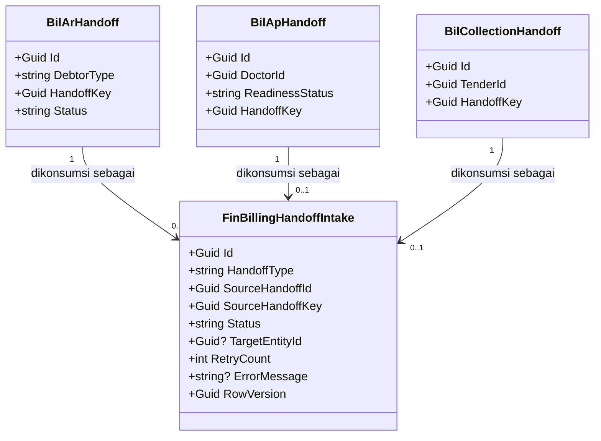
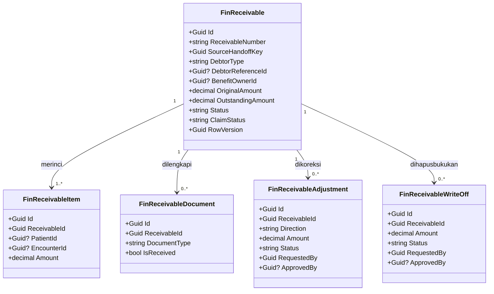
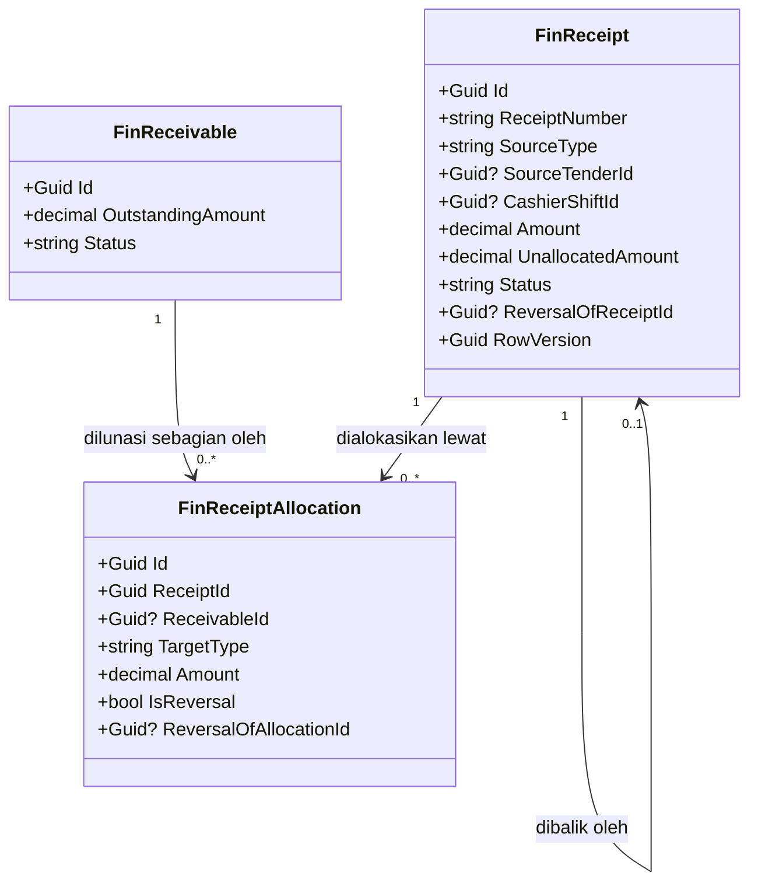
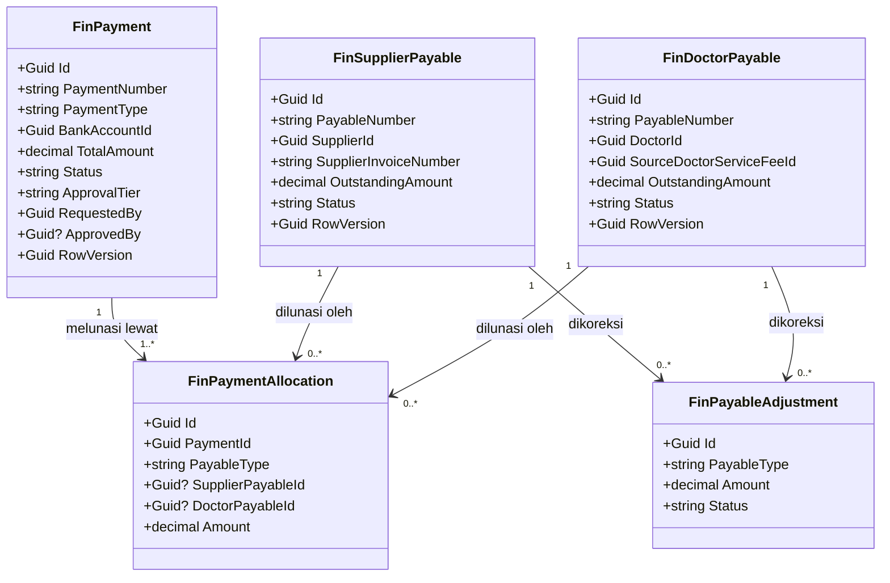
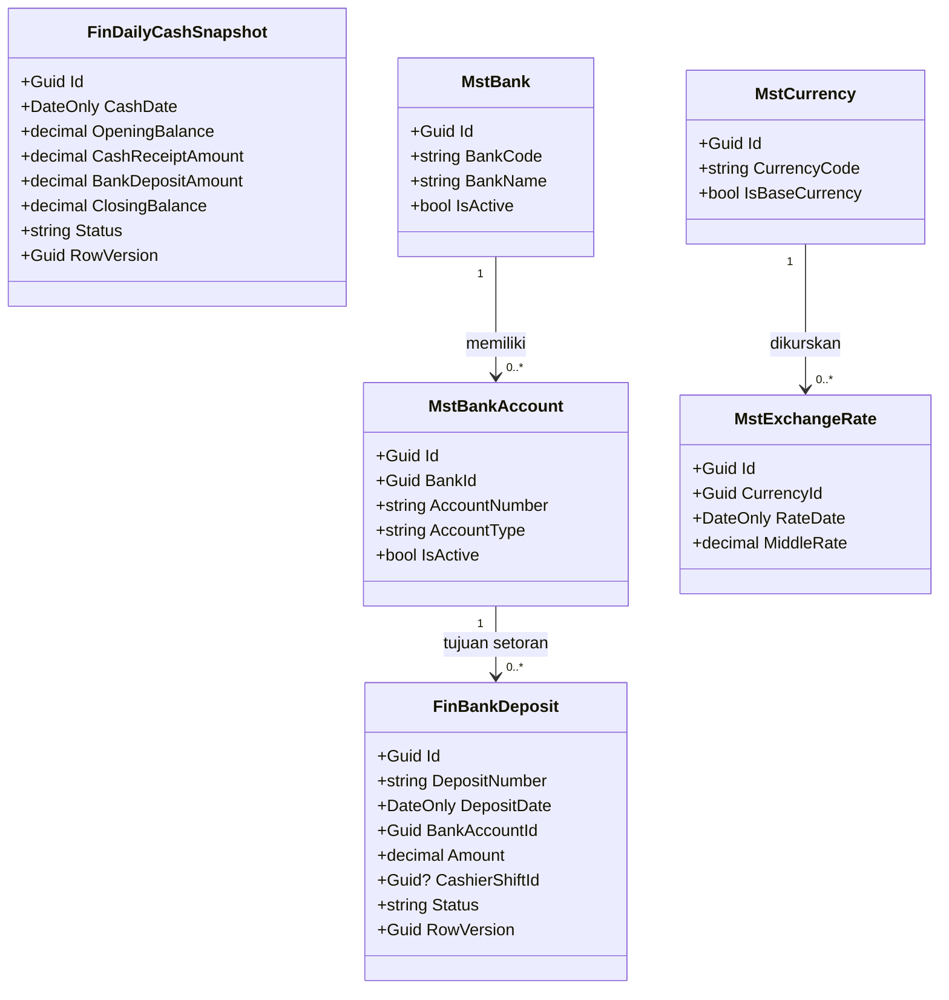
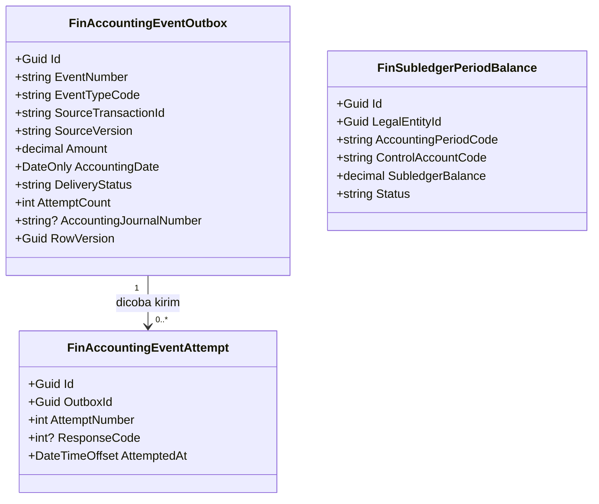
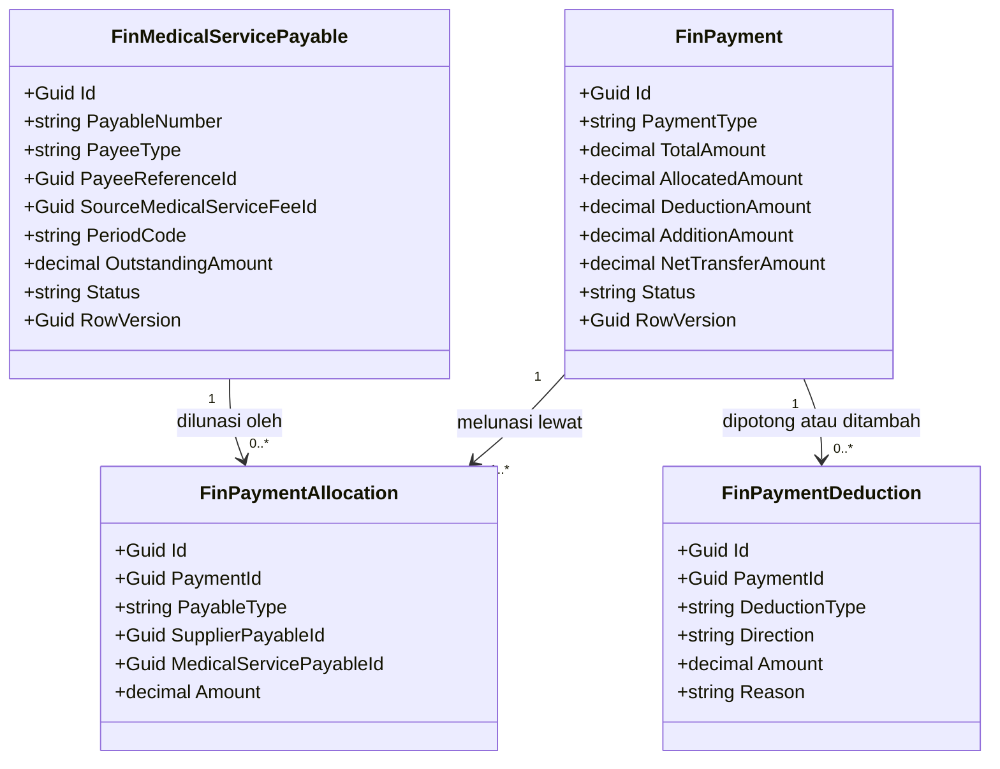

# Finance Management — Arsitektur Backend

| Field | Nilai |
|---|---|
| Blueprint ID | `FIN-BP-001` |
| Revision | `1` |
| Status | `approved` untuk **`FIN-DES-001`..`036`** — `FIN-DES-029`..`036` (AMENDMENT REVISI 3) disetujui Yasmin 25 September 2026 lewat pernyataan "Saya approve semua", dicatat apa adanya. `FIN-DES-001`..`024` disetujui Yasmin pada 20 September 2026, `FIN-DES-025`..`028` pada hari yang sama. Approval ini **bukan** otorisasi migration, perubahan source, maupun pendaftaran registry |
| Masukan | `00-interview-decisions.md` — `FIN-DEC-001`..`044` (`030`..`044` ditambahkan 25 September 2026), `01-existing-capability-map.md` beserta impact scan bagian 9.3 |
| Backend SHA | `09101d05` untuk bagian 1-10 dan AMENDMENT REVISI 2; **`d6cdfaf9`** untuk AMENDMENT REVISI 3 (branch `Yasmina`) |
| Frontend SHA | `abed49b03` |
| Tanggal | 20 September 2026; AMENDMENT REVISI 2 pada tanggal yang sama; **AMENDMENT REVISI 3 pada 25 September 2026** |
| Amendment yang berlaku | REVISI 2 (rumpun Payable, `FIN-DES-025`..`028`) dan **REVISI 3 (uang muka/deposit/selisih kas, `FIN-DES-029`..`036`)**. Keduanya di akhir dokumen; bagian 1-10 tidak ditulis ulang |

Dokumen ini menetapkan bentuk backend modul Finance Management. Ia **menurunkan** dari 23
keputusan bisnis yang sudah disetujui; ia tidak membuat keputusan bisnis baru. Setiap kali
dokumen ini mengambil keputusan teknis, keputusan itu diberi nomor `FIN-DES-nnn` dan disertai
keputusan bisnis yang menjadi dasarnya.

---

## 1. Bounded context dan kepemilikan

Finance Management adalah **subledger operasional keuangan**. Ia duduk di tengah: menerima
fakta dari Billing dan Medical Fee, mengelola piutang/utang/kas, lalu menerbitkan kejadian ke
Accounting. Ia tidak pernah menulis balik ke modul sumber.

### 1.1 Tujuh konteks di dalam modul

| Konteks | Folder submodul | Aggregate root | Tanggung jawab |
|---|---|---|---|
| Billing Intake | `BillingIntake/` | `FinBillingHandoffIntake` | Satu pintu masuk seluruh fakta dari Billing, beserta jejak ACK dan penanganan gagal |
| Receivable (Piutang) | `Receivable/` | `FinReceivable` | Piutang, rincian, dokumen klaim, koreksi, dan penghapusan piutang |
| Collection (Penerimaan) | `Collection/` | `FinReceipt` | Uang yang benar-benar diterima, beserta alokasinya ke piutang atau langsung ke tagihan |
| Payable (Utang) | `Payable/` | `FinSupplierPayable`, `FinDoctorPayable`, `FinPayment` | Utang supplier, utang dokter, dan pembayaran keluar |
| Cash Management | `CashManagement/` | `FinBankDeposit`, `FinDailyCashSnapshot` | Setoran bank dan posisi kas harian |
| Master Data | `MasterData/` | `MstBank`, `MstBankAccount`, `MstCurrency`, `MstPettyCashCategory` | Data induk milik Finance |
| Accounting Integration | `AccountingIntegration/` | `FinAccountingEventOutbox`, `FinSubledgerPeriodBalance` | Kotak keluar kejadian ke Accounting dan saldo subledger periode |

`Petty Cash/` yang sudah ada **tidak** disentuh pass ini. Kepemilikan keputusannya ada di
blueprint `billing-kasir` (`PC-DEC-*`/`PC-DES-*`) sesuai `FIN-DEC-009`.

### 1.2 Tabel kepemilikan data

Ini pertahanan paling langsung terhadap duplikasi entity. Kolom terakhir adalah yang paling
penting dibaca.

| Kelompok data | Modul pemilik | Dipakai modul ini | Dibuat ulang di modul ini |
|---|---|:---:|---|
| Pasien, kunjungan, rekam medis | Registration / Clinical | Ya, sebagai rujukan Id saja | **Tidak.** Finance hanya menyimpan `PatientId`/`EncounterId` sebagai rujukan pada rincian piutang |
| Tagihan, perhitungan, finalisasi (`BilInvoice`) | Billing | Ya, rujukan Id | **Tidak.** Finance tidak pernah menghitung ulang nilai tagihan |
| Penyelesaian pembayaran kasir (`BilSettlement`, `BilTender`, `BilPaymentAllocation`) | Billing | Ya, sebagai sumber fakta penerimaan | **Tidak.** Finance menyalin nilainya ke `FinReceipt`, tidak menghitung ulang |
| Shift kasir (`BilCashierShift`) | Billing | Ya, rujukan `CashierShiftId` untuk rekonsiliasi | **Tidak.** Finance tidak pernah menulis `SystemCash`/`PhysicalCash` |
| Handoff AR/AP (`BilArHandoff`, `BilApHandoff`, `BilHandoffAdjustment`) | Billing | Ya, dikonsumsi lewat `FinBillingHandoffIntake` | **Tidak.** Finance membaca dan memberi ACK, tidak memiliki |
| Handoff penerimaan (`BilCollectionHandoff`) | Billing | Ya | **Tidak.** Tabelnya dibangun tim Billing; blueprint ini hanya mengunci bentuk kontraknya (`FIN-DES-023`) |
| Voucher kas kecil (`BilPettyCashVoucher`) | Billing / HealthServices | Ya, ditaut `VoucherId` dari movement | **Tidak** |
| Anggaran & mutasi kas kecil (`FinPettyCashBudget`, `FinPettyCashBudgetMovement`) | **Finance** (sudah ada) | Ya | **Tidak.** Sudah ada dan dipakai apa adanya |
| Kategori kas kecil (`MstPettyCashCategory`) | **Finance** (sudah ada) | Ya | **Tidak** |
| Supplier (`MstSupplier`) | Administrator / MasterData | Ya, lewat `SupplierId` | **Tidak** — `FIN-DEC-014` menutup ini secara eksplisit |
| Aturan fee dokter & hasil fee (`MstDoctorServiceRule`, `DoctorServiceFee`) | Medical Fee | Ya, rujukan `SourceDoctorServiceFeeId` | **Tidak.** Finance hanya menerima fee yang sudah disetujui |
| Dokter (identitas) | HR / Master Data | Ya, rujukan `DoctorId` | **Tidak** |
| Pegawai & eligibilitas manfaat | HR | Ya, rujukan `BenefitOwnerId` | **Tidak.** `FIN-DEC-016` menegaskan Finance tidak menentukan ulang identitas ini |
| COA, jenis kejadian, aturan posting, periode, jurnal | Accounting | Ya, rujukan kode saja | **Tidak.** Finance tidak pernah menyimpan nomor akun |
| Badan hukum, cost center | Corporate / HR | Ya, rujukan `LegalEntityId` | **Tidak** |
| **Piutang, rincian, dokumen klaim, koreksi, write-off** | **Finance** | Ya | **Ya — baru.** Tidak ada pemilik lain |
| **Penerimaan dan alokasinya** | **Finance** | Ya | **Ya — baru.** Tidak ada pemilik lain |
| **Utang supplier, utang dokter, pembayaran keluar** | **Finance** | Ya | **Ya — baru.** Tidak ada pemilik lain |
| **Setoran bank dan kas harian** | **Finance** | Ya | **Ya — baru.** Tidak ada pemilik lain |
| **Bank, rekening bank, mata uang, kurs** | **Finance** | Ya | **Ya — baru.** `FIN-DEC-018` |
| **Kotak keluar kejadian Accounting** | **Finance** | Ya | **Ya — baru.** Finance adalah satu-satunya penerbit (`FIN-DEC-001`) |

---

## 2. Keputusan arsitektur

Seluruhnya `approved` 20 September 2026 oleh Yasmin (Product/Domain Owner Finance).

`FIN-DES-003` mendapat penegasan terpisah dari owner pada hari yang sama dan karena itu berlaku
sebagai **ketentuan modul**, bukan sekadar keputusan satu pass:

> Bila sebuah entity di dalam `FinanceManagement` berperan sebagai data induk, prefiksnya `Mst`.
> Entity selain itu berprefiks `Fin`.

Aturan itu mengikat entity Finance berikutnya, bukan hanya yang dirancang pass ini.

### 2.1 Penempatan dan penamaan

| ID | Keputusan | Dasar | Konsekuensi |
|---|---|---|---|
| `FIN-DES-001` | Seluruh model, DTO, service, dan controller Finance ditempatkan di `Areas/Corporate/FinanceManagement/<Submodul>/`, sedangkan EF configuration terpisah di `Repositories/Configurations/Corporate/FinanceManagement/<Submodul>/` | Pola nyata `MstPettyCashCategoryConfiguration.cs` dan `FinPettyCashBudgetConfiguration.cs` | Implementer MUST NOT menaruh configuration di dalam `Areas/` |
| `FIN-DES-002` | Enam folder submodul baru (`BillingIntake`, `Receivable`, `Collection`, `Payable`, `CashManagement`, `AccountingIntegration`) MUST didaftarkan pada `docs/engineering/MODULE_OWNERSHIP_PREFIX_REGISTRY.md` **sebelum** file model pertama ditulis | `QBE-MOD-003`, `QBE-NAM-004`; preseden `PC-OQ-003` pada billing-kasir | Tanpa pendaftaran, QBE menolak seluruh entity `Fin*` baru. Ini prasyarat implementasi, bukan blocker perencanaan |
| `FIN-DES-003` | **Ketentuan modul.** Entity yang berperan sebagai data induk di dalam `FinanceManagement` memakai prefix `Mst`; entity lainnya memakai prefix `Fin` | Preseden nyata `MstPettyCashCategory`; registry mencatat `Mst` = MasterData. **Ditegaskan langsung owner 20 September 2026** sebagai aturan modul, bukan sekadar usulan desain | Menggantikan penamaan `FinBank`/`FinBankAccount`/`FinCurrency` pada `FIN-PRD-V2-0.3` bagian 11 dengan `MstBank`/`MstBankAccount`/`MstCurrency`/`MstExchangeRate`. Mengikat entity Finance berikutnya, bukan hanya yang dirancang pass ini |

### 2.2 Pola teknis yang diwarisi dari Petty Cash

Keempat keputusan berikut tidak menciptakan pola baru. Semuanya menyalin pola yang sudah
berjalan, supaya modul ini tidak menjadi pulau tersendiri.

| ID | Keputusan | Bukti pola | Konsekuensi |
|---|---|---|---|
| `FIN-DES-004` | Status disimpan sebagai `string` dengan `[MaxLength(30)]`, daftar nilainya di `public static class ...Statuses`, dan ditegakkan `HasCheckConstraint` di configuration. **Bukan** enum C# yang dikonversi ke `int` | `FinPettyCashBudget.Status` + `PettyCashBudgetStatuses` + `CK_FinPettyCashBudgetMovement_MovementType` | Nilai status terbaca langsung di database tanpa kamus. Template ERD yang menyarankan `int` **tidak** dipakai di sini karena bertentangan dengan pola modul |
| `FIN-DES-005` | Optimistic concurrency memakai `Guid RowVersion` yang di-set ulang `Guid.NewGuid()` setiap perubahan, dicek manual terhadap `ExpectedRowVersion` dari request | `EnsureCurrentRowVersion` pada `PettyCashBudgetService` | Request pengubah state MUST membawa `ExpectedRowVersion`. Bila kosong → `400`; bila tidak cocok → `409` |
| `FIN-DES-006` | Setiap command yang memindahkan uang MUST membawa header `Idempotency-Key` bertipe `Guid`, dan hasilnya disimpan pada kolom `IdempotencyKey` dengan partial unique index | `PettyCashBudgetController.TopUp`, `IX_FinPettyCashBudgetMovement_IdempotencyKey` | Kiriman ulang mengembalikan hasil yang sama, tidak membuat baris kedua |
| `FIN-DES-007` | Command yang mengubah saldo atau `OutstandingAmount` dijalankan di dalam `BeginTransactionAsync(IsolationLevel.Serializable)` | `PettyCashBudgetService.TopUpAsync` baris 152 | Query baca murni tetap `AsNoTracking` tanpa transaksi |

### 2.3 Intake dari Billing

| ID | Keputusan | Dasar | Konsekuensi |
|---|---|---|---|
| `FIN-DES-008` | Seluruh fakta dari Billing masuk lewat **satu tabel pintu masuk** `FinBillingHandoffIntake`, bukan lewat kolom unik yang ditempel di masing-masing subledger | Status model "Billing handoff intake `NEW → CONSUMED → ACKNOWLEDGED \| ERROR`" pada decision log; `FIN-BIL-005` mewajibkan ACK | Satu tempat untuk memantau dan mengulang intake yang gagal. Tanpa ini, kegagalan intake tersebar di empat subledger |
| `FIN-DES-009` | Kunci idempotensi piutang adalah `SourceHandoffKey`, disalin dari `BilArHandoff.HandoffKey` — **bukan** `BilArHandoff.Id` | `BilArHandoff.HandoffKey` adalah kunci idempotensi milik Billing (terbaca langsung di model, `09101d05`) | Bila Billing membuat ulang baris handoff dengan `HandoffKey` sama, Finance tetap tidak membuat piutang kedua |
| `FIN-DES-010` | Kunci idempotensi penerimaan adalah `SourceTenderId`, dengan partial unique index `WHERE "SourceTenderId" IS NOT NULL AND "IsDelete" = false` | `FIN-BIL-006`; pola partial index `IX_FinPettyCashBudgetMovement_Voucher_Disbursement` | Penerimaan manual (tanpa tender) tetap mungkin karena kolomnya nullable dan index-nya berfilter |
| `FIN-DES-011` | `FinReceipt` **tidak pernah** menciptakan `FinReceivable`. Keduanya fakta terpisah yang hanya dipertemukan oleh `FinReceiptAllocation` | `FIN-DEC` aturan bisnis #11 dan #14; `FIN-BIL-008` | Pasien yang bayar lunas menghasilkan receipt tanpa piutang sama sekali. Inilah pencegahan dobel-hitung yang diminta BRD |
| `FIN-DES-023` | Bentuk `BilCollectionHandoff` dikunci di `contracts/integration-contract.md` sebagai kontrak, tetapi **tabelnya milik Billing dan dibangun tim Billing**. Blueprint ini tidak merancang internalnya | `FIN-DEC-005`; `FIN-OOS-001` | Task pembuatan tabel itu masuk roadmap Billing, bukan roadmap Finance. Finance hanya membangun konsumennya |

### 2.4 Piutang, penerimaan, dan koreksi

| ID | Keputusan | Dasar | Konsekuensi |
|---|---|---|---|
| `FIN-DES-012` | Setiap pembalikan — penerimaan maupun alokasi — dicatat sebagai **baris baru** yang menetralkan, tidak pernah dengan `UPDATE` atau `DELETE` baris lama | `FIN-DEC-021`; aturan bisnis #8 | Riwayat tetap utuh. Kolom `IsReversal` dan `ReversalOfAllocationId` yang membawa maknanya |
| `FIN-DES-013` | Alokasi penerimaan ke piutang **tidak** memiliki pencocokan otomatis apa pun di service. Staf mengirim daftar alokasi eksplisit | `FIN-DEC-011` memilih manual penuh | Service MUST NOT diam-diam menambahkan FIFO "supaya praktis". Bila kelak diinginkan, itu keputusan bisnis baru |
| `FIN-DES-014` | Maker-checker ditegakkan dua lapis: `HasCheckConstraint` pada database (`"RequestedBy" <> "ApprovedBy"`) dan pemeriksaan di service | `FIN-DEC-012` | Lapis database membuat aturan ini tidak bisa dilanggar walau ada jalur kode lain di kemudian hari |

### 2.5 Utang dan pembayaran

| ID | Keputusan | Dasar | Konsekuensi |
|---|---|---|---|
| `FIN-DES-015` | Satu entity `FinPayment` melayani pembayaran supplier **dan** dokter, dibedakan kolom `PaymentType` | `FIN-DEC-019` membolehkan rekap; keduanya punya siklus approval yang sama bentuknya | Menghindari dua tabel kembar yang 90% kolomnya identik. Perbedaan perilaku ada di service, bukan di skema |
| `FIN-DES-016` | `FinPaymentAllocation` memakai dua FK nullable (`SupplierPayableId`, `DoctorPayableId`) dengan check constraint "tepat satu terisi dan cocok dengan `PayableType`" | Alternatifnya tabel alokasi terpisah per jenis, yang memecah query rekap | Rekap satu pembayaran ke banyak utang tetap satu query. Check constraint mencegah baris yatim |
| `FIN-DES-024` | Kolom `BenefitOwnerId` dan `BenefitRelationship` **disiapkan** pada `FinReceivable`, tetapi jalur intake-nya berstatus `OPEN DECISION` sampai konfirmasi Billing + HR turun | `FIN-DEC-006`, `FIN-DEC-016`; risiko yang dicatat manifest | Skema tidak perlu diubah lagi saat konfirmasi turun, tetapi rumpun employee benefit MUST NOT masuk gelombang pengiriman mana pun sebelum itu |

### 2.6 Kas

| ID | Keputusan | Dasar | Konsekuensi |
|---|---|---|---|
| `FIN-DES-021` | Saldo kas yang tersedia untuk disetor **dihitung backend saat posting**, di dalam transaksi `Serializable`, bukan dikirim frontend | `FIN-DEC-017` menyebut eksplisit "validasi wajib dilakukan di backend saat posting agar tidak terjadi double allocation atau saldo minus" | Dua petugas yang menyetor bersamaan tidak bisa menghabiskan saldo yang sama dua kali |
| `FIN-DES-022` | Kas harian disimpan sebagai **baris nyata per tanggal** (`FinDailyCashSnapshot`), bukan view yang dihitung ulang setiap kali dibuka | Posisi kas yang sudah ditutup MUST tidak berubah walau ada transaksi terlambat; view akan diam-diam berubah | Transaksi yang datang setelah penutupan masuk ke tanggal berikutnya dan terlihat sebagai selisih, bukan menimpa angka kemarin |

### 2.7 Integrasi Accounting

| ID | Keputusan | Dasar | Konsekuensi |
|---|---|---|---|
| `FIN-DES-017` | Baris outbox ditulis **di dalam transaksi bisnis yang sama** dengan fakta yang melahirkannya (transactional outbox) | `FIN-ACC-XMOD-V2-0.3` bagian 10 | Tidak mungkin ada piutang tanpa kejadian, atau kejadian tanpa piutang |
| `FIN-DES-018` | `DeliveryStatus` memiliki nilai khusus `HELD_FOR_FINALIZATION` sebagai status awal untuk kejadian penerimaan yang tagihannya belum `FINAL` | `FIN-DEC-004` | Worker pengirim MUST melewati baris berstatus ini. Pelepasannya dipicu peristiwa finalisasi tagihan, bukan oleh timer |
| `FIN-DES-019` | Dua lapis anti-dobel: unique `EventNumber`, dan unique gabungan (`SourceModule`, `SourceTransactionId`, `EventTypeCode`, `SourceVersion`) | Paket kontrak Accounting bagian 5 menyebut dua lapis itu persis | Koreksi atas transaksi yang sama MUST menaikkan `SourceVersion`, bukan memakai nomor yang sama |
| `FIN-DES-020` | Pengiriman dijalankan `IHostedService` terpisah yang **dimatikan lewat konfigurasi** sampai endpoint Accounting benar-benar ada | `FIN-CAP-018` masih `Missing`; `FIN-MVP-PRD-V2-0.3` menyebut "release blocker: jangan implementasi POST sebelum endpoint ada" | Outbox boleh dibangun dan diisi sekarang. Yang ditahan hanya pengirimannya |

---

## 3. Class diagram per konteks

### 3.1 Billing Intake



### 3.2 Receivable



### 3.3 Collection



### 3.4 Payable



### 3.5 Cash Management dan Master Data



### 3.6 Accounting Integration



---

## 4. Penjelasan setiap class

### 4.1 `FinBillingHandoffIntake`

| Aspek | Penjelasan |
|---|---|
| **Status** | `Baru` |
| **Lokasi file** | `Areas/Corporate/FinanceManagement/BillingIntake/Models/FinBillingHandoffIntake.cs` |
| Kategori | Transaksi — pintu masuk integrasi |
| Tanggung jawab utama | Mencatat satu baris untuk setiap fakta yang dikirim Billing, beserta apakah fakta itu sudah berhasil diolah Finance. Kalau pengolahan gagal, barisnya tetap ada dengan pesan galat, sehingga petugas tahu ada yang tertinggal — bukan hilang diam-diam |
| Field penting | `HandoffType`, `SourceHandoffId`, `SourceHandoffKey`, `Status`, `TargetEntityId`, `RetryCount`, `ErrorMessage`, `CorrelationId` |
| Navigation property dan relasi | Tidak punya navigation ke tabel Billing — hanya menyimpan Id-nya, agar tidak mengunci tabel milik modul lain |
| Pemakaian dalam alur bisnis | Aktif setiap kali Billing memfinalisasi tagihan atau menyelesaikan pembayaran |
| Catatan desain | `SourceHandoffKey` yang jadi kunci idempotensi, bukan `SourceHandoffId` (`FIN-DES-009`). Baris berstatus `ERROR` MUST dapat diulang tanpa membuat baris kedua |
| Ekuivalen model lama | — |

### 4.2 `FinReceivable`

| Aspek | Penjelasan |
|---|---|
| **Status** | `Baru` |
| **Lokasi file** | `Areas/Corporate/FinanceManagement/Receivable/Models/FinReceivable.cs` |
| Kategori | Transaksi — aggregate root piutang |
| Tanggung jawab utama | Menyimpan satu piutang beserta sisa yang belum tertagih. Nilainya disalin dari handoff Billing dan tidak pernah dihitung ulang Finance |
| Field penting | `ReceivableNumber`, `SourceHandoffKey`, `DebtorType`, `DebtorReferenceId`, `BenefitOwnerId`, `OriginalAmount`, `OutstandingAmount`, `AllocatedAmount`, `AdjustedAmount`, `WrittenOffAmount`, `DueDate`, `Status`, `ClaimStatus` |
| Navigation property dan relasi | Punya banyak `FinReceivableItem`, `FinReceivableDocument`, `FinReceivableAdjustment`, `FinReceivableWriteOff`, dan `FinReceiptAllocation` |
| Pemakaian dalam alur bisnis | Dibuat otomatis saat handoff AR dikonsumsi; hidup sampai lunas, dihapusbukukan, atau dibatalkan |
| Catatan desain | Invariant: `OriginalAmount = OutstandingAmount + AllocatedAmount + AdjustedAmount + WrittenOffAmount`. `OutstandingAmount` MUST NOT negatif dan MUST NOT ditulis di luar `FinanceReceivableService`. Kolom benefit disiapkan tapi jalurnya `OPEN DECISION` (`FIN-DES-024`) |
| Ekuivalen model lama | `Fin_ARHeader` pada V1 QuilvianSta |

### 4.3 `FinReceivableItem`

| Aspek | Penjelasan |
|---|---|
| **Status** | `Baru` |
| **Lokasi file** | `Areas/Corporate/FinanceManagement/Receivable/Models/FinReceivableItem.cs` |
| Kategori | Transaksi — rincian |
| Tanggung jawab utama | Menyimpan rincian pasien dan kunjungan di balik satu piutang, supaya piutang penjamin yang berisi banyak pasien tetap bisa ditelusuri satu per satu |
| Field penting | `ReceivableId`, `PatientId` (**sensitif**), `EncounterId`, `InvoiceId`, `Description`, `Amount` |
| Navigation property dan relasi | Milik `FinReceivable` |
| Pemakaian dalam alur bisnis | Dibuat bersamaan dengan piutangnya |
| Catatan desain | `PatientId` MUST NOT ikut ke payload Accounting (`FIN-DEC` aturan #6). Ia hanya hidup di dalam domain Finance |
| Ekuivalen model lama | `Fin_ARDetail` pada V1 |

### 4.4 `FinReceivableDocument`

| Aspek | Penjelasan |
|---|---|
| **Status** | `Baru` |
| **Lokasi file** | `Areas/Corporate/FinanceManagement/Receivable/Models/FinReceivableDocument.cs` |
| Kategori | Transaksi — daftar periksa dokumen |
| Tanggung jawab utama | Melacak kelengkapan berkas klaim tanpa pernah mengubah nilai piutang |
| Field penting | `ReceivableId`, `DocumentType`, `DocumentNumber`, `IsReceived`, `ReceivedAt`, `Notes` |
| Navigation property dan relasi | Milik `FinReceivable` |
| Pemakaian dalam alur bisnis | Diisi petugas AR saat menyiapkan penagihan ke penjamin |
| Catatan desain | Kelengkapan dokumen MUST NOT menjadi syarat piutang diakui (`FIN-DEC-013`). Ia hanya memengaruhi `ClaimStatus` |
| Ekuivalen model lama | — |

### 4.5 `FinReceivableAdjustment`

| Aspek | Penjelasan |
|---|---|
| **Status** | `Baru` |
| **Lokasi file** | `Areas/Corporate/FinanceManagement/Receivable/Models/FinReceivableAdjustment.cs` |
| Kategori | Transaksi — koreksi berjenjang |
| Tanggung jawab utama | Mencatat penambahan atau pengurangan nilai piutang yang diajukan satu petugas dan disetujui petugas lain |
| Field penting | `AdjustmentNumber`, `ReceivableId`, `SourceHandoffAdjustmentId`, `Direction`, `Amount`, `Reason`, `Status`, `RequestedBy`, `RequestedAt`, `ApprovedBy`, `ApprovedAt`, `RejectionReason` |
| Navigation property dan relasi | Milik `FinReceivable`; boleh menunjuk `BilHandoffAdjustment` sebagai sumber |
| Pemakaian dalam alur bisnis | Dipakai saat penjamin menyetujui nilai berbeda dari tagihan awal |
| Catatan desain | `RequestedBy` MUST NOT sama dengan `ApprovedBy`, ditegakkan check constraint **dan** service (`FIN-DES-014`). `OutstandingAmount` piutang hanya berubah saat status menjadi `APPROVED` |
| Ekuivalen model lama | — |

### 4.6 `FinReceivableWriteOff`

| Aspek | Penjelasan |
|---|---|
| **Status** | `Baru` |
| **Lokasi file** | `Areas/Corporate/FinanceManagement/Receivable/Models/FinReceivableWriteOff.cs` |
| Kategori | Transaksi — penghapusan berjenjang |
| Tanggung jawab utama | Menutup piutang yang sudah dinyatakan tidak tertagih, dengan persetujuan orang kedua |
| Field penting | `WriteOffNumber`, `ReceivableId`, `Amount`, `Reason`, `Status`, `RequestedBy`, `ApprovedBy`, `RejectionReason` |
| Navigation property dan relasi | Milik `FinReceivable` |
| Pemakaian dalam alur bisnis | Akhir hidup piutang yang gagal ditagih |
| Catatan desain | Penghapusan buku MUST NOT menghapus baris piutang. Ia hanya memindahkan nilai dari `OutstandingAmount` ke `WrittenOffAmount` |
| Ekuivalen model lama | Pemutihan Piutang pada V1 |

### 4.7 `FinReceipt`

| Aspek | Penjelasan |
|---|---|
| **Status** | `Baru` |
| **Lokasi file** | `Areas/Corporate/FinanceManagement/Collection/Models/FinReceipt.cs` |
| Kategori | Transaksi — aggregate root penerimaan |
| Tanggung jawab utama | Mencatat uang yang benar-benar sudah diterima rumah sakit, baik dari kasir maupun dari penagihan piutang |
| Field penting | `ReceiptNumber`, `SourceType`, `SourceTenderId`, `SettlementId`, `InvoiceId`, `PaymentMethodId`, `PaymentMethodAccountId`, `Amount`, `AllocatedAmount`, `UnallocatedAmount`, `KwitansiNumber`, `CashierShiftId`, `ProviderReference`, `OccurredAt`, `SourceInvoiceStatus`, `Status`, `ReversalOfReceiptId` |
| Navigation property dan relasi | Punya banyak `FinReceiptAllocation`; boleh menunjuk dirinya sendiri lewat `ReversalOfReceiptId` |
| Pemakaian dalam alur bisnis | Dibuat saat tender Billing berhasil, atau saat penjamin membayar piutang |
| Catatan desain | Nilai `Amount` MUST disalin apa adanya dari `BilTender.Amount` — **jangan** dihitung ulang. Satu `SourceTenderId` hanya boleh melahirkan satu receipt (`FIN-DES-010`). Receipt MUST NOT menciptakan piutang (`FIN-DES-011`) |
| Ekuivalen model lama | `ReceivedPayment` pada V1 |

### 4.8 `FinReceiptAllocation`

| Aspek | Penjelasan |
|---|---|
| **Status** | `Baru` |
| **Lokasi file** | `Areas/Corporate/FinanceManagement/Collection/Models/FinReceiptAllocation.cs` |
| Kategori | Transaksi — baris alokasi |
| Tanggung jawab utama | Menjelaskan uang pada satu penerimaan dipakai untuk melunasi apa. Inilah yang mencegah satu rupiah dihitung dua kali |
| Field penting | `ReceiptId`, `ReceivableId`, `SourceAllocationId`, `TargetType`, `Amount`, `IsReversal`, `ReversalOfAllocationId`, `AllocatedBy`, `AllocatedAt` |
| Navigation property dan relasi | Milik `FinReceipt`; boleh menunjuk `FinReceivable` |
| Pemakaian dalam alur bisnis | Dibuat otomatis saat receipt berasal dari tender yang sudah punya alokasi Billing, atau dibuat manual oleh staf AR (`FIN-DES-013`) |
| Catatan desain | `ReceivableId` boleh kosong — itu keadaan sah untuk pasien yang bayar lunas tanpa pernah punya piutang. Pembalikan membuat baris baru `IsReversal = true` (`FIN-DES-012`) |
| Ekuivalen model lama | `DetailInvoiceReceived` pada V1 |

### 4.9 `FinSupplierPayable`

| Aspek | Penjelasan |
|---|---|
| **Status** | `Baru` |
| **Lokasi file** | `Areas/Corporate/FinanceManagement/Payable/Models/FinSupplierPayable.cs` |
| Kategori | Transaksi — aggregate root utang supplier |
| Tanggung jawab utama | Mencatat kewajiban membayar supplier beserta sisa yang belum dibayar |
| Field penting | `PayableNumber`, `SupplierId`, `SupplierInvoiceNumber`, `SupplierInvoiceDate`, `OriginalAmount`, `OutstandingAmount`, `PaidAmount`, `AdjustedAmount`, `DueDate`, `PaymentTermDays`, `Status` |
| Navigation property dan relasi | Menunjuk `MstSupplier` milik Administrator; punya banyak `FinSupplierPayableItem` dan `FinPaymentAllocation` |
| Pemakaian dalam alur bisnis | Diinput manual staf AP (`FIN-DEC-015`) karena modul Purchasing belum ada |
| Catatan desain | Pasangan (`SupplierId`, `SupplierInvoiceNumber`) MUST unik di antara baris yang belum dihapus — inilah satu-satunya penjaga terhadap invoice supplier yang terinput dua kali, karena tidak ada PO yang bisa dicocokkan |
| Ekuivalen model lama | `PembayaranAP` dan `RekapAP` pada V1 |

### 4.10 `FinSupplierPayableItem`

| Aspek | Penjelasan |
|---|---|
| **Status** | `Baru` |
| **Lokasi file** | `Areas/Corporate/FinanceManagement/Payable/Models/FinSupplierPayableItem.cs` |
| Kategori | Transaksi — rincian |
| Tanggung jawab utama | Merinci isi satu invoice supplier |
| Field penting | `PayableId`, `Description`, `Quantity`, `UnitPrice`, `Amount` |
| Navigation property dan relasi | Milik `FinSupplierPayable` |
| Pemakaian dalam alur bisnis | Diisi bersamaan saat utang diinput |
| Catatan desain | Jumlah seluruh `Amount` baris MUST sama dengan `OriginalAmount` induknya |
| Ekuivalen model lama | `DetailPembayaranAP` pada V1 |

### 4.11 `FinDoctorPayable`

| Aspek | Penjelasan |
|---|---|
| **Status** | `Baru` |
| **Lokasi file** | `Areas/Corporate/FinanceManagement/Payable/Models/FinDoctorPayable.cs` |
| Kategori | Transaksi — aggregate root utang dokter |
| Tanggung jawab utama | Mencatat kewajiban membayar jasa medis dokter yang fee-nya sudah disetujui Medical Fee |
| Field penting | `PayableNumber`, `DoctorId`, `SourceDoctorServiceFeeId`, `SourceApHandoffId`, `PeriodCode`, `OriginalAmount`, `OutstandingAmount`, `PaidAmount`, `Status`, `RecognizedAt` |
| Navigation property dan relasi | Punya banyak `FinDoctorPayableItem` dan `FinPaymentAllocation` |
| Pemakaian dalam alur bisnis | Dibuat setelah `DoctorServiceFee` berstatus disetujui — **bukan** saat `BilApHandoff` datang |
| Catatan desain | `SourceDoctorServiceFeeId` MUST unik: satu fee disetujui menghasilkan paling banyak satu utang. `BilApHandoff` hanya rujukan kesiapan, bukan sumber nilai (`FIN-DEC-003`, Opsi B) |
| Ekuivalen model lama | AP Dokter / Jasa Medis pada V1 |

### 4.12 `FinDoctorPayableItem`

| Aspek | Penjelasan |
|---|---|
| **Status** | `Baru` |
| **Lokasi file** | `Areas/Corporate/FinanceManagement/Payable/Models/FinDoctorPayableItem.cs` |
| Kategori | Transaksi — rincian |
| Tanggung jawab utama | Merinci layanan apa saja yang membentuk satu utang dokter |
| Field penting | `PayableId`, `SourceServiceFeeDetailId`, `Description`, `Amount` |
| Navigation property dan relasi | Milik `FinDoctorPayable` |
| Pemakaian dalam alur bisnis | Dibuat bersamaan dengan utangnya, disalin dari rincian fee |
| Catatan desain | Finance MUST NOT menghitung ulang nilai per layanan; ia menyalin |
| Ekuivalen model lama | — |

### 4.13 `FinPayment`

| Aspek | Penjelasan |
|---|---|
| **Status** | `Baru` |
| **Lokasi file** | `Areas/Corporate/FinanceManagement/Payable/Models/FinPayment.cs` |
| Kategori | Transaksi — aggregate root pembayaran keluar |
| Tanggung jawab utama | Satu perintah bayar, yang boleh melunasi banyak utang sekaligus dalam bentuk rekap |
| Field penting | `PaymentNumber`, `PaymentType`, `PayeeReferenceId`, `BankAccountId`, `PaymentMethod`, `TotalAmount`, `AllocatedAmount`, `Status`, `ApprovalTier`, `RequestedBy`, `RequestedAt`, `ApprovedBy`, `ApprovedAt`, `PaidAt`, `ReferenceNumber` |
| Navigation property dan relasi | Menunjuk `MstBankAccount`; punya banyak `FinPaymentAllocation` |
| Pemakaian dalam alur bisnis | Dipakai staf AP untuk membayar supplier, dan untuk membayar rekap fee banyak dokter sekaligus |
| Catatan desain | `TotalAmount` MUST sama dengan jumlah seluruh alokasinya sebelum status boleh menjadi `PAID`. `ApprovalTier` diisi service dari total nominal (`FIN-DEC-022`) — ambangnya masih `FIN-OQ-010` |
| Ekuivalen model lama | `PembayaranAP` pada V1 |

### 4.14 `FinPaymentAllocation`

| Aspek | Penjelasan |
|---|---|
| **Status** | `Baru` |
| **Lokasi file** | `Areas/Corporate/FinanceManagement/Payable/Models/FinPaymentAllocation.cs` |
| Kategori | Transaksi — baris alokasi |
| Tanggung jawab utama | Menjelaskan satu pembayaran rekap dipakai melunasi utang yang mana saja, sehingga tiap rupiah tetap tertelusur ke fee atau invoice aslinya |
| Field penting | `PaymentId`, `PayableType`, `SupplierPayableId`, `DoctorPayableId`, `Amount`, `IsReversal`, `ReversalOfAllocationId` |
| Navigation property dan relasi | Milik `FinPayment`; menunjuk salah satu dari dua jenis utang |
| Pemakaian dalam alur bisnis | Inilah yang menjawab keluhan sistem lama: dokter dobel atau lupa dibayar karena rekap dikerjakan di Excel terpisah (`FIN-DEC-019`) |
| Catatan desain | Tepat satu dari `SupplierPayableId`/`DoctorPayableId` terisi, dan MUST cocok dengan `PayableType` — ditegakkan check constraint (`FIN-DES-016`) |
| Ekuivalen model lama | `DetailPembayaranAP` pada V1 |

### 4.15 `FinPayableAdjustment`

| Aspek | Penjelasan |
|---|---|
| **Status** | `Baru` |
| **Lokasi file** | `Areas/Corporate/FinanceManagement/Payable/Models/FinPayableAdjustment.cs` |
| Kategori | Transaksi — koreksi utang |
| Tanggung jawab utama | Mencatat retur atau koreksi nilai utang tanpa mengubah catatan aslinya |
| Field penting | `AdjustmentNumber`, `PayableType`, `SupplierPayableId`, `DoctorPayableId`, `Direction`, `Amount`, `Reason`, `Status`, `RequestedBy`, `ApprovedBy` |
| Navigation property dan relasi | Menunjuk salah satu dari dua jenis utang |
| Pemakaian dalam alur bisnis | Dipakai saat barang diretur atau nilai fee dikoreksi setelah utang terbentuk |
| Catatan desain | Memakai aturan tepat-satu-FK yang sama dengan `FinPaymentAllocation` |
| Ekuivalen model lama | — |

### 4.16 `FinBankDeposit`

| Aspek | Penjelasan |
|---|---|
| **Status** | `Baru` |
| **Lokasi file** | `Areas/Corporate/FinanceManagement/CashManagement/Models/FinBankDeposit.cs` |
| Kategori | Transaksi — setoran kas ke bank |
| Tanggung jawab utama | Mencatat perpindahan uang tunai dari brankas rumah sakit ke rekening bank |
| Field penting | `DepositNumber`, `DepositDate`, `BankAccountId`, `Amount`, `CashierShiftId`, `DepositSlipNumber`, `Status`, `PostedBy`, `PostedAt` |
| Navigation property dan relasi | Menunjuk `MstBankAccount`; boleh menunjuk shift kasir sebagai rujukan |
| Pemakaian dalam alur bisnis | Dibuat Treasury setelah menghitung uang fisik yang akan disetor |
| Catatan desain | Saat status menjadi `POSTED`, service MUST menghitung ulang saldo tersedia di dalam transaksi `Serializable` dan menolak bila nominal melebihi saldo (`FIN-DES-021`). Setoran sebagian diperbolehkan |
| Ekuivalen model lama | Setoran Bank pada V1 |

### 4.17 `FinDailyCashSnapshot`

| Aspek | Penjelasan |
|---|---|
| **Status** | `Baru` |
| **Lokasi file** | `Areas/Corporate/FinanceManagement/CashManagement/Models/FinDailyCashSnapshot.cs` |
| Kategori | Transaksi — posisi kas harian |
| Tanggung jawab utama | Menyimpan posisi kas satu tanggal: saldo awal, uang masuk, uang keluar, setoran, dan saldo akhir |
| Field penting | `CashDate`, `OpeningBalance`, `CashReceiptAmount`, `OtherReceiptAmount`, `DisbursementAmount`, `BankDepositAmount`, `ClosingBalance`, `Status`, `ClosedBy`, `ClosedAt` |
| Navigation property dan relasi | Tidak punya FK — angkanya diringkas dari `FinReceipt` dan `FinBankDeposit` saat penutupan |
| Pemakaian dalam alur bisnis | Ditutup Treasury setiap akhir hari |
| Catatan desain | `CashDate` MUST unik. Kas kecil **tidak** masuk perhitungan ini karena kolamnya terpisah (`FIN-DEC-020`, aturan bisnis #15). Baris yang sudah `CLOSED` MUST NOT berubah; transaksi terlambat masuk ke tanggal berikutnya (`FIN-DES-022`) |
| Ekuivalen model lama | Kas Harian pada V1 |

### 4.18 `MstBank`, `MstBankAccount`, `MstCurrency`, `MstExchangeRate`

| Aspek | Penjelasan |
|---|---|
| **Status** | `Baru` (keempatnya) |
| **Lokasi file** | `Areas/Corporate/FinanceManagement/MasterData/Models/MstBank.cs`, `MstBankAccount.cs`, `MstCurrency.cs`, `MstExchangeRate.cs` |
| Kategori | Data induk milik Finance |
| Tanggung jawab utama | Menyediakan daftar bank, rekening rumah sakit, mata uang, dan kurs yang dipakai pembayaran dan setoran |
| Field penting | `MstBank`: `BankCode`, `BankName`, `SwiftCode`, `IsActive`. `MstBankAccount`: `BankId`, `AccountNumber`, `AccountName`, `AccountType`, `CurrencyCode`, `IsActive`. `MstCurrency`: `CurrencyCode`, `CurrencyName`, `Symbol`, `DecimalPlaces`, `IsBaseCurrency`, `IsActive`. `MstExchangeRate`: `CurrencyId`, `RateDate`, `BuyRate`, `SellRate`, `MiddleRate`, `Source` |
| Navigation property dan relasi | `MstBank` punya banyak `MstBankAccount`; `MstCurrency` punya banyak `MstExchangeRate` |
| Pemakaian dalam alur bisnis | Dipilih saat membuat pembayaran keluar dan saat mencatat setoran bank |
| Catatan desain | Memakai prefix `Mst`, bukan `Fin` (`FIN-DES-003`). Kurs hanya dipakai operasional; kejadian ke Accounting tetap IDR saja (`FIN-DEC-018`, aturan bisnis #7). Rekening yang sudah dipakai MUST dinonaktifkan, bukan dihapus — mengikuti pola `MstPettyCashCategory` |
| Ekuivalen model lama | Master Bank / Bank Account pada V1 |

### 4.19 `FinAccountingEventOutbox`

| Aspek | Penjelasan |
|---|---|
| **Status** | `Baru` |
| **Lokasi file** | `Areas/Corporate/FinanceManagement/AccountingIntegration/Models/FinAccountingEventOutbox.cs` |
| Kategori | Transaksi — kotak keluar integrasi |
| Tanggung jawab utama | Menyimpan salinan persis pesan yang akan dikirim ke Accounting, beserta status pengirimannya |
| Field penting | `EventNumber`, `EventTypeCode`, `SourceModule`, `SourceTransactionId`, `SourceVersion`, `EventOccurredAt`, `AccountingDate`, `Amount`, `CurrencyCode`, `LegalEntityId`, `CorrelationId`, `CausationId`, `ComponentsJson`, `PayloadJson`, `DeliveryStatus`, `HoldReason`, `AttemptCount`, `LastAttemptAt`, `LastResponseCode`, `AccountingReceiptNumber`, `AccountingJournalNumber` |
| Navigation property dan relasi | Punya banyak `FinAccountingEventAttempt` |
| Pemakaian dalam alur bisnis | Ditulis otomatis setiap kali Finance mengakui piutang, menerima uang, mengakui utang, atau membayar |
| Catatan desain | Ditulis di transaksi yang sama dengan fakta bisnisnya (`FIN-DES-017`). Dua lapis unique melindungi dari jurnal ganda (`FIN-DES-019`). `PayloadJson` MUST NOT memuat `PatientId`, nomor rekam medis, maupun `DoctorId` (aturan bisnis #6) |
| Ekuivalen model lama | — |

### 4.20 `FinAccountingEventAttempt`

| Aspek | Penjelasan |
|---|---|
| **Status** | `Baru` |
| **Lokasi file** | `Areas/Corporate/FinanceManagement/AccountingIntegration/Models/FinAccountingEventAttempt.cs` |
| Kategori | Transaksi — jejak percobaan kirim |
| Tanggung jawab utama | Menyimpan riwayat setiap percobaan pengiriman, supaya kegagalan berulang bisa ditelusuri |
| Field penting | `OutboxId`, `AttemptNumber`, `AttemptedAt`, `ResponseCode`, `ResponseBody`, `DurationMs`, `ErrorMessage` |
| Navigation property dan relasi | Milik `FinAccountingEventOutbox` |
| Pemakaian dalam alur bisnis | Diisi worker pengiriman |
| Catatan desain | Baris ini append-only. `ResponseBody` MUST dipotong panjangnya agar tidak menggelembungkan tabel |
| Ekuivalen model lama | — |

### 4.21 `FinSubledgerPeriodBalance`

| Aspek | Penjelasan |
|---|---|
| **Status** | `Baru` |
| **Lokasi file** | `Areas/Corporate/FinanceManagement/AccountingIntegration/Models/FinSubledgerPeriodBalance.cs` |
| Kategori | Transaksi — saldo tutup periode |
| Tanggung jawab utama | Menyimpan saldo akhir subledger per akun kontrol yang dikirim ke Accounting saat tutup periode |
| Field penting | `LegalEntityId`, `AccountingPeriodCode`, `ControlAccountCode`, `SubledgerBalance`, `AsOfDate`, `Status`, `SubmittedAt` |
| Navigation property dan relasi | — |
| Pemakaian dalam alur bisnis | Dibuat saat Finance menutup periode, sebelum Accounting menutup bukunya |
| Catatan desain | Nama field mengikuti draf `FIN-DEC-023` yang **belum dikonfirmasi Accounting** (`FIN-OQ-011`). Karena itu rumpun ini `POST-MVP` |
| Ekuivalen model lama | — |

### 4.22 Service

| Service | Status | Lokasi file | Fungsi utama | Dipanggil oleh | Membuka transaksi |
|---|---|---|---|---|:---:|
| `FinanceBillingIntakeService` | `Baru` | `BillingIntake/Services/FinanceBillingIntakeService.cs` | Membaca handoff Billing, membuat piutang/utang/penerimaan yang sesuai, lalu menandai ACK | `FinanceBillingIntakeController`, hosted job | Ya — `Serializable` |
| `FinanceReceivableService` | `Baru` | `Receivable/Services/FinanceReceivableService.cs` | Satu-satunya penulis `OutstandingAmount` piutang; mengurus aging, koreksi, write-off | `FinanceReceivablesController` | Ya — `Serializable` |
| `FinanceReceiptService` | `Baru` | `Collection/Services/FinanceReceiptService.cs` | Membuat penerimaan dari tender, mengalokasikan manual, dan membalik penerimaan | `FinanceReceiptsController`, `FinanceBillingIntakeService` | Ya — `Serializable` |
| `FinanceSupplierPayableService` | `Baru` | `Payable/Services/FinanceSupplierPayableService.cs` | Input manual utang supplier dan koreksinya | `FinanceSupplierPayablesController` | Ya |
| `FinanceDoctorPayableService` | `Baru` | `Payable/Services/FinanceDoctorPayableService.cs` | Membentuk utang dokter dari fee yang sudah disetujui | `FinanceDoctorPayablesController` | Ya |
| `FinancePaymentService` | `Baru` | `Payable/Services/FinancePaymentService.cs` | Menyusun pembayaran rekap, menegakkan approval berjenjang, mengalokasikan ke banyak utang | `FinancePaymentsController` | Ya — `Serializable` |
| `FinanceCashManagementService` | `Baru` | `CashManagement/Services/FinanceCashManagementService.cs` | Menghitung saldo kas tersedia, memposting setoran, menutup kas harian | `FinanceBankDepositsController`, `FinanceDailyCashController` | Ya — `Serializable` |
| `FinanceMasterDataService` | `Baru` | `MasterData/Services/FinanceMasterDataService.cs` | CRUD bank, rekening, mata uang, kurs | `FinanceBanksController` dan tiga controller master lain | Tidak — CRUD sederhana |
| `FinanceAccountingOutboxService` | `Baru` | `AccountingIntegration/Services/FinanceAccountingOutboxService.cs` | Menulis baris outbox di dalam transaksi pemanggil; melepas status tertahan saat tagihan final | Seluruh service Finance lain | Tidak membuka sendiri — **ikut** transaksi pemanggil (`FIN-DES-017`) |
| `FinanceAccountingDeliveryWorker` | `Baru` | `AccountingIntegration/Services/FinanceAccountingDeliveryWorker.cs` | `IHostedService` yang mengirim outbox ke Accounting dan mencatat percobaannya | Runtime | Ya, per baris |

`FinanceAccountingOutboxService` sengaja **tidak** membuka transaksi sendiri. Kalau ia membuka
transaksi terpisah, akan ada celah waktu ketika piutang sudah tersimpan tetapi kejadiannya
belum — persis masalah yang hendak dicegah pola outbox.

### 4.23 Controller

| Controller | Status | Lokasi file | Service yang dipakai | Grup Swagger |
|---|---|---|---|---|
| `FinanceBillingIntakeController` | `Baru` | `BillingIntake/Controllers/FinanceBillingIntakeController.cs` | `FinanceBillingIntakeService` | `Corporate / Finance Management / Billing Intake` |
| `FinanceReceivablesController` | `Baru` | `Receivable/Controllers/FinanceReceivablesController.cs` | `FinanceReceivableService` | `Corporate / Finance Management / Receivable` |
| `FinanceReceiptsController` | `Baru` | `Collection/Controllers/FinanceReceiptsController.cs` | `FinanceReceiptService` | `Corporate / Finance Management / Receipt` |
| `FinanceSupplierPayablesController` | `Baru` | `Payable/Controllers/FinanceSupplierPayablesController.cs` | `FinanceSupplierPayableService` | `Corporate / Finance Management / Supplier Payable` |
| `FinanceDoctorPayablesController` | `Baru` | `Payable/Controllers/FinanceDoctorPayablesController.cs` | `FinanceDoctorPayableService` | `Corporate / Finance Management / Doctor Payable` |
| `FinancePaymentsController` | `Baru` | `Payable/Controllers/FinancePaymentsController.cs` | `FinancePaymentService` | `Corporate / Finance Management / Payment` |
| `FinanceBankDepositsController` | `Baru` | `CashManagement/Controllers/FinanceBankDepositsController.cs` | `FinanceCashManagementService` | `Corporate / Finance Management / Bank Deposit` |
| `FinanceDailyCashController` | `Baru` | `CashManagement/Controllers/FinanceDailyCashController.cs` | `FinanceCashManagementService` | `Corporate / Finance Management / Daily Cash` |
| `FinanceBanksController` | `Baru` | `MasterData/Controllers/FinanceBanksController.cs` | `FinanceMasterDataService` | `Corporate / Finance Management / Master Data / Bank` |
| `FinanceBankAccountsController` | `Baru` | `MasterData/Controllers/FinanceBankAccountsController.cs` | `FinanceMasterDataService` | `Corporate / Finance Management / Master Data / Bank Account` |
| `FinanceCurrenciesController` | `Baru` | `MasterData/Controllers/FinanceCurrenciesController.cs` | `FinanceMasterDataService` | `Corporate / Finance Management / Master Data / Currency` |
| `FinanceAccountingEventsController` | `Baru` | `AccountingIntegration/Controllers/FinanceAccountingEventsController.cs` | `FinanceAccountingOutboxService` | `Corporate / Finance Management / Accounting Event Monitor` |
| `PettyCashBudgetController` | `Sudah ada` | `PettyCash/Controllers/PettyCashBudgetController.cs` | `PettyCashBudgetService` | `Corporate / Finance Management / Petty Cash / Budget` |
| `PettyCashCategoriesController` | `Sudah ada` | `MasterData/Controllers/PettyCashCategoriesController.cs` | `PettyCashCategoryService` | `Corporate / Finance Management / Master Data / Petty Cash Category` |

Seluruh controller baru memakai **satu** `[Route]` kanonik `api/v1/corporate/finance-management/...`.
Route alias `health-services/billing-management/...` yang ada pada dua controller Petty Cash
**MUST NOT** ditiru — alias itu warisan sejarah perpindahan folder, bukan pola yang berlaku.

---

## 5. Arsitektur folder

```text
Areas/Corporate/FinanceManagement/
├── BillingIntake/                      # BARU — wajib didaftarkan registry (FIN-DES-002)
│   ├── Controllers/FinanceBillingIntakeController.cs        # Baru
│   ├── Dtos/FinanceBillingIntakeDtos.cs                     # Baru
│   ├── Models/FinBillingHandoffIntake.cs                    # Baru
│   └── Services/FinanceBillingIntakeService.cs              # Baru
├── Receivable/                         # BARU
│   ├── Controllers/FinanceReceivablesController.cs          # Baru
│   ├── Dtos/FinanceReceivableDtos.cs                        # Baru
│   ├── Models/FinReceivable.cs                              # Baru
│   ├── Models/FinReceivableItem.cs                          # Baru
│   ├── Models/FinReceivableDocument.cs                      # Baru
│   ├── Models/FinReceivableAdjustment.cs                    # Baru
│   ├── Models/FinReceivableWriteOff.cs                      # Baru
│   └── Services/FinanceReceivableService.cs                 # Baru
├── Collection/                         # BARU
│   ├── Controllers/FinanceReceiptsController.cs             # Baru
│   ├── Dtos/FinanceReceiptDtos.cs                           # Baru
│   ├── Models/FinReceipt.cs                                 # Baru
│   ├── Models/FinReceiptAllocation.cs                       # Baru
│   └── Services/FinanceReceiptService.cs                    # Baru
├── Payable/                            # BARU
│   ├── Controllers/FinanceSupplierPayablesController.cs     # Baru
│   ├── Controllers/FinanceDoctorPayablesController.cs       # Baru
│   ├── Controllers/FinancePaymentsController.cs             # Baru
│   ├── Dtos/FinancePayableDtos.cs                           # Baru
│   ├── Dtos/FinancePaymentDtos.cs                           # Baru
│   ├── Models/FinSupplierPayable.cs                         # Baru
│   ├── Models/FinSupplierPayableItem.cs                     # Baru
│   ├── Models/FinDoctorPayable.cs                           # Baru
│   ├── Models/FinDoctorPayableItem.cs                       # Baru
│   ├── Models/FinPayment.cs                                 # Baru
│   ├── Models/FinPaymentAllocation.cs                       # Baru
│   ├── Models/FinPayableAdjustment.cs                       # Baru
│   ├── Services/FinanceSupplierPayableService.cs            # Baru
│   ├── Services/FinanceDoctorPayableService.cs              # Baru
│   └── Services/FinancePaymentService.cs                    # Baru
├── CashManagement/                     # BARU
│   ├── Controllers/FinanceBankDepositsController.cs         # Baru
│   ├── Controllers/FinanceDailyCashController.cs            # Baru
│   ├── Dtos/FinanceCashManagementDtos.cs                    # Baru
│   ├── Models/FinBankDeposit.cs                             # Baru
│   ├── Models/FinDailyCashSnapshot.cs                       # Baru
│   └── Services/FinanceCashManagementService.cs             # Baru
├── AccountingIntegration/              # BARU
│   ├── Controllers/FinanceAccountingEventsController.cs     # Baru
│   ├── Dtos/FinanceAccountingEventDtos.cs                   # Baru
│   ├── Models/FinAccountingEventOutbox.cs                   # Baru
│   ├── Models/FinAccountingEventAttempt.cs                  # Baru
│   ├── Models/FinSubledgerPeriodBalance.cs                  # Baru
│   ├── Services/FinanceAccountingOutboxService.cs           # Baru
│   └── Services/FinanceAccountingDeliveryWorker.cs          # Baru
├── MasterData/                         # SUDAH ADA — bertambah isi
│   ├── Controllers/PettyCashCategoriesController.cs         # Sudah ada
│   ├── Controllers/FinanceBanksController.cs                # Baru
│   ├── Controllers/FinanceBankAccountsController.cs         # Baru
│   ├── Controllers/FinanceCurrenciesController.cs           # Baru
│   ├── DTOs/PettyCashCategoryDtos.cs                        # Sudah ada
│   ├── DTOs/FinanceMasterDataDtos.cs                        # Baru
│   ├── Models/MstPettyCashCategory.cs                       # Sudah ada
│   ├── Models/MstBank.cs                                    # Baru
│   ├── Models/MstBankAccount.cs                             # Baru
│   ├── Models/MstCurrency.cs                                # Baru
│   ├── Models/MstExchangeRate.cs                            # Baru
│   ├── Services/PettyCashCategoryService.cs                 # Sudah ada
│   └── Services/FinanceMasterDataService.cs                 # Baru
└── PettyCash/                          # SUDAH ADA — TIDAK disentuh pass ini
    ├── Controllers/PettyCashBudgetController.cs             # Sudah ada
    ├── Dtos/PettyCashBudgetDtos.cs                          # Sudah ada
    ├── Models/FinPettyCashBudget.cs                         # Sudah ada
    ├── Models/FinPettyCashBudgetMovement.cs                 # Sudah ada
    └── Services/PettyCashBudgetService.cs                   # Sudah ada

Repositories/Configurations/Corporate/FinanceManagement/
├── BillingIntake/FinBillingHandoffIntakeConfiguration.cs    # Baru
├── Receivable/FinReceivableConfiguration.cs                 # Baru
├── Receivable/FinReceivableItemConfiguration.cs             # Baru
├── Receivable/FinReceivableDocumentConfiguration.cs         # Baru
├── Receivable/FinReceivableAdjustmentConfiguration.cs       # Baru
├── Receivable/FinReceivableWriteOffConfiguration.cs         # Baru
├── Collection/FinReceiptConfiguration.cs                    # Baru
├── Collection/FinReceiptAllocationConfiguration.cs          # Baru
├── Payable/FinSupplierPayableConfiguration.cs               # Baru
├── Payable/FinSupplierPayableItemConfiguration.cs           # Baru
├── Payable/FinDoctorPayableConfiguration.cs                 # Baru
├── Payable/FinDoctorPayableItemConfiguration.cs             # Baru
├── Payable/FinPaymentConfiguration.cs                       # Baru
├── Payable/FinPaymentAllocationConfiguration.cs             # Baru
├── Payable/FinPayableAdjustmentConfiguration.cs             # Baru
├── CashManagement/FinBankDepositConfiguration.cs            # Baru
├── CashManagement/FinDailyCashSnapshotConfiguration.cs      # Baru
├── AccountingIntegration/FinAccountingEventOutboxConfiguration.cs   # Baru
├── AccountingIntegration/FinAccountingEventAttemptConfiguration.cs  # Baru
├── AccountingIntegration/FinSubledgerPeriodBalanceConfiguration.cs  # Baru
├── MasterData/MstPettyCashCategoryConfiguration.cs          # Sudah ada
├── MasterData/MstBankConfiguration.cs                       # Baru
├── MasterData/MstBankAccountConfiguration.cs                # Baru
├── MasterData/MstCurrencyConfiguration.cs                   # Baru
├── MasterData/MstExchangeRateConfiguration.cs               # Baru
└── PettyCash/                                               # Sudah ada, tidak disentuh
```

**Catatan utang teknis yang MUST NOT ditiru:** dua controller Petty Cash memiliki `[Route]`
ganda (kanonik `corporate/finance-management` dan alias `health-services/billing-management`).
Alias itu peninggalan perpindahan folder 17 September 2026 dan hanya sah untuk kedua controller
tersebut. Controller baru memakai satu route kanonik saja. Perapian alias itu, bila kelak
diinginkan, MUST menjadi task tersendiri dengan approval pemilik modul — bukan dirapikan
diam-diam di tengah task lain.

### 5.1 Pendaftaran di luar folder modul

| Berkas | Perubahan | Alasan |
|---|---|---|
| `Repositories/ApplicationDbContext.cs` | Tambah 21 `DbSet<T>` baru | Pola existing: `DbSet<FinPettyCashBudget>` baris 619 |
| `Program.cs` | Tambah 9 `builder.Services.AddScoped<T>()` dan 1 `AddHostedService` | Pola existing: `AddScoped<PettyCashBudgetService>()` baris 732 |
| `docs/engineering/MODULE_OWNERSHIP_PREFIX_REGISTRY.md` | Tambah baris untuk enam submodul baru | `QBE-MOD-003` — **MUST** dilakukan sebelum file model pertama ditulis |

---

## 6. Status model dan dampak migration

| Model | Status | Kolom yang berubah | Dampak migration |
|---|---|---|---|
| `FinBillingHandoffIntake` | `Baru` | Seluruh kolom | Tabel baru |
| `FinReceivable` | `Baru` | Seluruh kolom | Tabel baru |
| `FinReceivableItem` | `Baru` | Seluruh kolom | Tabel baru |
| `FinReceivableDocument` | `Baru` | Seluruh kolom | Tabel baru |
| `FinReceivableAdjustment` | `Baru` | Seluruh kolom | Tabel baru |
| `FinReceivableWriteOff` | `Baru` | Seluruh kolom | Tabel baru |
| `FinReceipt` | `Baru` | Seluruh kolom | Tabel baru |
| `FinReceiptAllocation` | `Baru` | Seluruh kolom | Tabel baru |
| `FinSupplierPayable` | `Baru` | Seluruh kolom | Tabel baru |
| `FinSupplierPayableItem` | `Baru` | Seluruh kolom | Tabel baru |
| `FinDoctorPayable` | `Baru` | Seluruh kolom | Tabel baru |
| `FinDoctorPayableItem` | `Baru` | Seluruh kolom | Tabel baru |
| `FinPayment` | `Baru` | Seluruh kolom | Tabel baru |
| `FinPaymentAllocation` | `Baru` | Seluruh kolom | Tabel baru |
| `FinPayableAdjustment` | `Baru` | Seluruh kolom | Tabel baru |
| `FinBankDeposit` | `Baru` | Seluruh kolom | Tabel baru |
| `FinDailyCashSnapshot` | `Baru` | Seluruh kolom | Tabel baru |
| `MstBank` | `Baru` | Seluruh kolom | Tabel baru |
| `MstBankAccount` | `Baru` | Seluruh kolom | Tabel baru |
| `MstCurrency` | `Baru` | Seluruh kolom | Tabel baru |
| `MstExchangeRate` | `Baru` | Seluruh kolom | Tabel baru |
| `FinAccountingEventOutbox` | `Baru` | Seluruh kolom | Tabel baru |
| `FinAccountingEventAttempt` | `Baru` | Seluruh kolom | Tabel baru |
| `FinSubledgerPeriodBalance` | `Baru` | Seluruh kolom | Tabel baru |
| `BilArHandoff` | `Diperbarui` — **milik Billing** | Tambah `BenefitOwnerId uuid NULL`, tambah `BenefitRelationship varchar(30) NULL`, tambah nilai `EMPLOYEE_BENEFIT` pada check constraint `DebtorType` | Dua kolom nullable, aman tanpa pengisian data lama. **Migration ini milik tim Billing**, bukan Finance |
| `BilCollectionHandoff` | `Baru` — **milik Billing** | Seluruh kolom | Tabel baru, dibangun tim Billing (`FIN-DES-023`) |
| `FinPettyCashBudget` | `Sudah ada` | Tidak ada | Tidak disentuh |
| `FinPettyCashBudgetMovement` | `Sudah ada` | Tidak ada | Tidak disentuh |
| `MstPettyCashCategory` | `Sudah ada` | Tidak ada | Tidak disentuh |
| `MstSupplier` | `Sudah ada` — milik Administrator | Tidak ada | Dipakai apa adanya (`FIN-DEC-014`) |

## 7. Rencana migration

Seluruh migration di bawah **memerlukan otorisasi terpisah** untuk dibuat maupun dijalankan
(`AGENTS.md`, bagian Keselamatan Database). Desain ini tidak memberi wewenang itu.

| Urut | Nama migration | Isi | Tanpa downtime | Pengisian data lama | Langkah mundur |
|---:|---|---|:---:|---|---|
| 1 | `AddFinanceMasterData` | `MstBank`, `MstBankAccount`, `MstCurrency`, `MstExchangeRate` | Ya | Tidak ada — tabel baru kosong | `Down()` menghapus empat tabel; belum ada yang menunjuknya |
| 2 | `AddFinanceReceivableAndCollection` | 5 tabel piutang + 2 tabel penerimaan | Ya | Tidak ada | `Down()` menghapus tujuh tabel |
| 3 | `AddFinanceBillingIntake` | `FinBillingHandoffIntake` | Ya | Tidak ada | `Down()` menghapus satu tabel |
| 4 | `AddFinanceAccountingOutbox` | `FinAccountingEventOutbox`, `FinAccountingEventAttempt` | Ya | Tidak ada | `Down()` menghapus dua tabel |
| 5 | `AddFinancePayable` | 7 tabel utang dan pembayaran | Ya | Tidak ada | `Down()` menghapus tujuh tabel |
| 6 | `AddFinanceCashManagement` | `FinBankDeposit`, `FinDailyCashSnapshot` | Ya | Tidak ada | `Down()` menghapus dua tabel |
| 7 | `AddFinanceSubledgerPeriodBalance` | `FinSubledgerPeriodBalance` | Ya | Tidak ada | `Down()` menghapus satu tabel |
| — | `ExtendBilArHandoffWithEmployeeBenefit` | Dua kolom nullable pada `BilArHandoff` + perluasan check constraint | Ya | Baris lama tetap sah dengan kedua kolom `NULL` | `Down()` menghapus dua kolom dan mengembalikan check constraint |

Migration nomor 1 sampai 7 seluruhnya **aditif**: tidak ada tabel existing yang diubah, tidak
ada kolom yang dihapus, dan tidak ada data yang dipindahkan. Karena itu urutannya boleh
dipecah menjadi beberapa rilis tanpa saling mengunci, asalkan nomor 1 mendahului nomor 5 dan 6
(keduanya menunjuk `MstBankAccount`).

Migration terakhir **bukan milik Finance**. Ia menyentuh tabel Billing dan MUST dikerjakan tim
Billing setelah `FIN-DEC-006` dikonfirmasi.

## 8. Rencana data master awal

Modul dengan master kosong tidak dapat dipakai sama sekali. Isi minimum berikut MUST ada
sebelum fitur diaktifkan.

| Master | Isi minimum | Sumber nilai |
|---|---|---|
| `MstCurrency` | Sekurang-kurangnya satu baris `IDR` dengan `IsBaseCurrency = true`, `DecimalPlaces = 2` | ISO 4217; kontrak Accounting hanya menerima IDR (`FIN-DEC-018`) |
| `MstBank` | Bank tempat rumah sakit membuka rekening operasional | Daftar rekening rumah sakit dari Treasury |
| `MstBankAccount` | Sekurang-kurangnya satu rekening bertipe `COLLECTION` (tujuan setoran kasir) dan satu bertipe `PAYMENT` (sumber pembayaran keluar) | Treasury. Tanpa keduanya, setoran bank dan pembayaran AP tidak bisa dijalankan |
| `MstExchangeRate` | Boleh kosong saat mulai | Hanya dipakai bila ada transaksi non-IDR |
| `MstPettyCashCategory` | Sudah terisi `TRANSPORT`, `OPERASIONAL`, `KONSUMSI`, `MAINTENANCE`, `ATK` | Sudah ada di source, tidak perlu tindakan |
| `MstSupplier` | Supplier yang invoice-nya akan diinput | Milik Administrator; Finance hanya memakai |
| `AccEventType` di Accounting | **24 kode kejadian** — 17 dari `FIN-DEC-002` (sudah diratifikasi Accounting 24 September 2026) ditambah tujuh dari AMENDMENT REVISI 3 yang masih menunggu ratifikasi (`FIN-OQ-017`) | **Milik Accounting.** Kejadian berjenis yang belum terdaftar akan dijawab `422` `EVENT_TYPE_NOT_REGISTERED` dan berstatus Tertahan di sisi Accounting |

Nilai seperti tipe rekening dan kode mata uang **MUST** berasal dari master, **MUST NOT**
di-hardcode di controller maupun frontend.

## 9. Invariant dan batas transaksi

| Invariant | Ditegakkan di mana | Bila dilanggar |
|---|---|---|
| `FinReceivable.OriginalAmount = OutstandingAmount + AllocatedAmount + AdjustedAmount + WrittenOffAmount` | Service, di dalam transaksi `Serializable` | Transaksi dibatalkan; tidak ada baris tersimpan sebagian |
| `FinReceivable.OutstandingAmount >= 0` | Check constraint database + service | `422` |
| Satu `SourceTenderId` → paling banyak satu `FinReceipt` | Partial unique index | `409` |
| Satu `SourceHandoffKey` → paling banyak satu `FinReceivable` | Unique index | Intake ditandai sudah dikonsumsi, tidak membuat baris kedua |
| Satu `SourceDoctorServiceFeeId` → paling banyak satu `FinDoctorPayable` | Unique index | `409` |
| `FinReceipt.Amount = AllocatedAmount + UnallocatedAmount` | Service | Transaksi dibatalkan |
| `RequestedBy <> ApprovedBy` pada adjustment, write-off, dan payment | Check constraint + service | `422` |
| `FinPayment.TotalAmount = Σ FinPaymentAllocation.Amount` sebelum status `PAID` | Service | `422` |
| `FinPaymentAllocation`: tepat satu FK utang terisi sesuai `PayableType` | Check constraint | Baris ditolak database |
| `FinBankDeposit.Amount <= saldo kas tersedia` saat posting | Service, dihitung ulang di dalam transaksi `Serializable` | `422` |
| `FinDailyCashSnapshot.CashDate` unik | Unique index | `409` |
| `FinAccountingEventOutbox.EventNumber` unik | Unique index | Pengiriman ulang dianggap duplikat, aman |
| (`SourceModule`, `SourceTransactionId`, `EventTypeCode`, `SourceVersion`) unik | Unique index | Melindungi dari jurnal ganda walau nomor kejadian berbeda |
| `CurrencyCode = 'IDR'` pada seluruh baris outbox | Check constraint | Kontrak Accounting hanya menerima IDR (aturan bisnis #7) |

**Batas transaksi.** Satu transaksi database mencakup: fakta bisnisnya, pembaruan saldo
induknya, dan baris outbox-nya. Ketiganya berhasil bersama atau gagal bersama. Pengiriman ke
Accounting berada **di luar** transaksi itu — ia pekerjaan worker terpisah yang membaca outbox.

## 10. Yang sengaja tidak dibuat

| Yang ditolak | Alasan |
|---|---|
| `FinPractitionerPayable` terpisah dari `FinDoctorPayable` | Dua tabel yang hampir identik beserta dua jalur pembayaran yang harus dijaga konsisten. Diganti satu entity dengan kolom jenis penerima — lihat amendment revisi 2, `FIN-DES-025` |
| `FinSupplier` | Supplier sudah dimiliki Administrator (`MstSupplier`) dan field-nya sudah memuat termin pembayaran, limit kredit, dan rekening bank. `FIN-DEC-014` menutup ini |
| `FinPatient`, `FinDoctor` | Identitas pasien dan dokter milik modul lain. Finance cukup menyimpan Id-nya |
| `FinChartOfAccount`, `FinJournal` | COA dan jurnal milik Accounting. Menyalinnya akan melahirkan dua buku besar yang pasti berbeda setelah revisi pertama |
| `FinCashierShift` | Shift kasir milik Billing. Finance hanya menyimpan `CashierShiftId` untuk rekonsiliasi (aturan bisnis #12) |
| Tabel alokasi terpisah `FinSupplierPaymentAllocation` dan `FinDoctorPaymentAllocation` | Memecah query rekap menjadi dua dan menduplikasi logika pembalikan. Diganti satu tabel dengan check constraint (`FIN-DES-016`) |
| `FinDoctorServiceFee` | Perhitungan fee milik Medical Fee. Finance hanya menerima hasil yang sudah disetujui (`FIN-DEC-003`, Opsi B) |
| View SQL untuk kas harian | Angka yang sudah ditutup akan diam-diam berubah bila ada transaksi terlambat. Diganti tabel snapshot (`FIN-DES-022`) |
| Pencocokan otomatis FIFO pada alokasi piutang | `FIN-DEC-011` memilih manual penuh. Menambahkannya "supaya praktis" adalah keputusan bisnis baru, bukan keputusan teknis |
| Tabel `FinAgingBucket` | Aging diturunkan dari `DueDate` dan `OutstandingAmount` saat query. Menyimpannya berarti harus menghitung ulang setiap hari dan berisiko basi |
| Endpoint Finance yang menerima kejadian dari Accounting | Kontrak `ACC-XMOD-0.2` satu arah. Accounting adalah muara dan tidak menerbitkan kejadian balik |

---

# AMENDMENT REVISI 2 — Rumpun Payable

| Field | Nilai |
|---|---|
| Revisi | `2` |
| Tanggal | 20 September 2026 |
| Status | `approved` — `FIN-DES-025`..`028` disetujui Yasmin 20 September 2026 |
| Dipicu oleh | `MF-DEC-002`, `MF-DEC-005`, `MF-DEC-008` pada blueprint `medical-fee` |
| Menutup | `FIN-OQ-013`, `FIN-OQ-014` |
| Yang TIDAK disentuh | Seluruh rumpun MVP: data induk, intake Billing, piutang, penerimaan, alokasi, koreksi, write-off, kotak keluar kejadian. Bagian 1 sampai 10 di atas tetap berlaku apa adanya kecuali yang disebut eksplisit di bawah |

Amendment ini menyentuh `EPIC FIN-08` dan `EPIC FIN-09` yang keduanya `POST-MVP` dan **nol baris
kode**, sehingga tidak ada yang perlu dibongkar.

## A.1 Mengapa amendment ini ada

Dua keputusan modul Medical Fee membuat rancangan revisi 1 tidak lagi cukup:

| Keputusan Medical Fee | Akibatnya pada Finance |
|---|---|
| `MF-DEC-002` — penerima jasa bukan hanya dokter, tetapi juga tenaga kesehatan lain | `FinDoctorPayable` yang namanya dan bentuknya khusus dokter tidak dapat menampungnya |
| `MF-DEC-005` — Medical Fee menyerahkan jasa **kotor**; seluruh potongan diterapkan Finance | `FinPayment` revisi 1 **tidak punya tempat sama sekali** untuk PPh 21, kasbon, potongan hutang pasien yang dijamin potong honor, sitting fee, KSO, dan iuran |

Praktik yang harus ditampung terdokumentasi pada `evidence/03-referensi-meeting-rs-mmc.md`:
jasa kotor per dokter direkap sebulan, lalu dikurangi dan ditambah beberapa pos sebelum
ditransfer sekali sebagai satu angka bersih.

## A.2 Keputusan arsitektur baru

| ID | Keputusan | Dasar | Konsekuensi |
|---|---|---|---|
| `FIN-DES-025` | `FinDoctorPayable` **digantikan** `FinMedicalServicePayable`. Jenis penerima dibedakan kolom `PayeeType` (`DOCTOR`, `NURSE`, `OTHER_PRACTITIONER`), bukan tabel terpisah per jenis | `MF-DEC-002`, `MF-DEC-008`; mengikuti pola `FIN-DES-015` yang sudah memakai satu `FinPayment` untuk supplier dan dokter | Menghindari tabel kembar. `PayeeReferenceId` menunjuk tenaga medis apa pun, bukan khusus dokter |
| `FIN-DES-026` | Entity baru `FinPaymentDeduction` menyimpan potongan dan tambahan pada satu pembayaran, satu baris per pos | `MF-DEC-005`; pos-pos pada `evidence/03-referensi-meeting-rs-mmc.md` | Potongan bersifat per-penerima-per-periode, jadi melekat pada **pembayaran**, bukan pada utang. Kasbon tidak perlu dibagi ke puluhan baris jasa |
| `FIN-DES-027` | `FinPayment` bertambah `NetTransferAmount`. **Invariant lama tetap berlaku**: `TotalAmount` = jumlah alokasi ke utang. Invariant baru mendampinginya: `NetTransferAmount` = `TotalAmount` − potongan + tambahan | Menjaga `FIN-DES-015` tetap benar alih-alih mengubah arti `TotalAmount` | Dua angka punya makna berbeda dan keduanya dibutuhkan: `TotalAmount` menjawab "berapa utang yang lunas", `NetTransferAmount` menjawab "berapa uang yang keluar" |
| `FIN-DES-028` | Utang jasa tetap lunas sebesar **alokasinya**, bukan sebesar uang yang ditransfer | Potongan adalah urusan antara rumah sakit dan penerima, bukan pengurang kewajiban | Dokter dengan jasa Rp 24.500.000 dan potongan Rp 4.500.000 menerima transfer Rp 20.000.000, tetapi utang jasanya **lunas penuh** Rp 24.500.000 |

`FIN-DES-028` adalah bagian yang paling mudah salah dirancang. Bila potongan diperlakukan
sebagai pengurang utang, utang jasa tidak akan pernah lunas dan sisanya menumpuk selamanya.

## A.3 Contoh berangka

> Dr. Andi (nama samaran) punya tiga utang jasa bulan Agustus 2026: Rp 12.000.000,
> Rp 9.500.000, dan Rp 3.000.000. Totalnya Rp 24.500.000.
>
> Potongan bulan itu: PPh 21 Rp 1.225.000, kasbon Rp 3.000.000, iuran kerohanian Rp 100.000.
> Ada tambahan sitting fee Rp 500.000.
>
> Yang tersimpan:
>
> | Angka | Nilai | Artinya |
> |---|---|---|
> | `TotalAmount` | Rp 24.500.000 | Jumlah utang jasa yang dilunasi |
> | Tiga baris `FinPaymentAllocation` | 12.000.000 + 9.500.000 + 3.000.000 | Utang mana saja yang lunas |
> | Empat baris `FinPaymentDeduction` | −1.225.000, −3.000.000, −100.000, +500.000 | Rincian potongan dan tambahan |
> | `NetTransferAmount` | Rp 20.675.000 | Uang yang benar-benar ditransfer |
>
> Ketiga utang jasa berstatus **lunas penuh**, walaupun yang ditransfer lebih kecil.

## A.4 Class diagram — rumpun Payable sesudah amendment



## A.5 Penjelasan class baru dan berubah

### `FinMedicalServicePayable` — menggantikan `FinDoctorPayable`

| Aspek | Penjelasan |
|---|---|
| **Status** | `Baru` — menggantikan `FinDoctorPayable` yang belum pernah ditulis kodenya |
| **Lokasi file** | `Areas/Corporate/FinanceManagement/Payable/Models/FinMedicalServicePayable.cs` |
| Kategori | Transaksi — aggregate root utang jasa tenaga medis |
| Tanggung jawab utama | Mencatat kewajiban membayar jasa tenaga medis yang hasilnya sudah disetujui modul Medical Fee |
| Field penting | `PayableNumber`, `PayeeType`, `PayeeReferenceId`, `SourceMedicalServiceFeeId`, `PeriodCode`, `OriginalAmount`, `OutstandingAmount`, `PaidAmount`, `AdjustedAmount`, `Status`, `RecognizedAt`, `RowVersion` |
| Navigation property dan relasi | Punya banyak `FinMedicalServicePayableItem` dan `FinPaymentAllocation` |
| Pemakaian dalam alur bisnis | Dibuat setelah hasil jasa disetujui Medical Fee — bukan saat `BilApHandoff` datang |
| Catatan desain | `SourceMedicalServiceFeeId` MUST unik: satu hasil jasa yang disetujui menghasilkan paling banyak satu utang. `PayeeType` menentukan makna `PayeeReferenceId`, dan keduanya **sensitif** |
| Ekuivalen model lama | `FinDoctorPayable` pada revisi 1 — digantikan, belum pernah diimplementasikan |

### `FinPaymentDeduction` — baru

| Aspek | Penjelasan |
|---|---|
| **Status** | `Baru` |
| **Lokasi file** | `Areas/Corporate/FinanceManagement/Payable/Models/FinPaymentDeduction.cs` |
| Kategori | Transaksi — baris potongan dan tambahan |
| Tanggung jawab utama | Merinci mengapa uang yang ditransfer berbeda dari jumlah utang yang dilunasi |
| Field penting | `PaymentId`, `DeductionType`, `Direction`, `Amount`, `Reason`, `ReferenceNumber` |
| Navigation property dan relasi | Milik `FinPayment` |
| Pemakaian dalam alur bisnis | Diisi staf AP saat menyusun rekap pembayaran, sebelum diajukan untuk disetujui |
| Catatan desain | `Direction` membedakan potongan dari tambahan, karena "Atless" di praktik memuat keduanya. Nilai `Amount` selalu positif; arahnya ditentukan `Direction`. Baris ini **tidak pernah** mengurangi `OutstandingAmount` utang (`FIN-DES-028`) |
| Ekuivalen model lama | — |

### `FinPayment` — diperbarui

| Kolom yang ditambahkan | Tipe | Keterangan |
|---|---|---|
| `DeductionAmount` | `decimal(18,2)` | Jumlah seluruh baris berarah potongan |
| `AdditionAmount` | `decimal(18,2)` | Jumlah seluruh baris berarah tambahan |
| `NetTransferAmount` | `decimal(18,2)` | `TotalAmount` − `DeductionAmount` + `AdditionAmount` |

Kolom lain pada `FinPayment` **tidak berubah**.

### `FinPaymentAllocation` dan `FinPayableAdjustment` — diperbarui

Kolom `DoctorPayableId` diganti namanya menjadi `MedicalServicePayableId`, menunjuk
`FinMedicalServicePayable`. Nilai `PayableType` berubah dari `DOCTOR` menjadi
`MEDICAL_SERVICE`. Aturan tepat-satu-FK (`FIN-DES-016`) **tetap berlaku apa adanya**.

## A.6 Jenis potongan yang dikenal

Diturunkan dari praktik pada `evidence/03-referensi-meeting-rs-mmc.md`. Disimpan sebagai
`string` dengan check constraint, mengikuti `FIN-DES-004`.

| `DeductionType` | Arah lazim | Keterangan |
|---|---|---|
| `PPH21` | Potongan | Pajak penghasilan atas jasa |
| `KASBON` | Potongan | Pinjaman yang sudah diambil penerima |
| `PATIENT_DEBT` | Potongan | Hutang pasien yang dijamin dipotong dari honor |
| `SITTING_FEE` | Tambahan | Honor kehadiran |
| `KSO` | Potongan | Kerja sama operasional |
| `IURAN` | Potongan | Iuran kerohanian dan sejenisnya |
| `OTHER` | Keduanya | Wajib mengisi `Reason` |

Daftar ini **MUST** dapat bertambah tanpa perubahan skema — hanya check constraint yang
diperbarui.

## A.7 Status model sesudah amendment

| Model | Status | Kolom yang berubah | Dampak migration |
|---|---|---|---|
| `FinMedicalServicePayable` | `Baru` | Seluruh kolom | Menggantikan rencana tabel `FinDoctorPayable` |
| `FinMedicalServicePayableItem` | `Baru` | Seluruh kolom | Menggantikan rencana `FinDoctorPayableItem` |
| `FinPaymentDeduction` | `Baru` | Seluruh kolom | Tabel baru |
| `FinPayment` | `Diperbarui` | Tambah `DeductionAmount`, `AdditionAmount`, `NetTransferAmount` | Tiga kolom uang, bawaan nol |
| `FinPaymentAllocation` | `Diperbarui` | `DoctorPayableId` → `MedicalServicePayableId`; nilai `PayableType` `DOCTOR` → `MEDICAL_SERVICE` | Belum ada data, jadi bukan rename melainkan definisi awal |
| `FinPayableAdjustment` | `Diperbarui` | Sama seperti di atas | Sama |
| `FinDoctorPayable`, `FinDoctorPayableItem` | **Dibatalkan** | — | Tidak pernah dibuat; dihapus dari rencana migration `AddFinancePayable` |

Rencana migration pada bagian 7 nomor 5 (`AddFinancePayable`) **belum dijalankan**, sehingga
seluruh perubahan di atas masuk ke migration yang sama — bukan menjadi migration tambahan.

## A.8 Invariant yang ditambahkan

| Invariant | Ditegakkan di mana | Bila dilanggar |
|---|---|---|
| `FinPayment.NetTransferAmount = TotalAmount − DeductionAmount + AdditionAmount` | Check constraint + service | Transaksi dibatalkan |
| `NetTransferAmount >= 0` | Check constraint | `422` — potongan tidak boleh melebihi jasa yang dibayarkan |
| `FinPaymentDeduction.Amount > 0` | Check constraint | Ditolak database |
| `DeductionType = 'OTHER'` mewajibkan `Reason` terisi | Check constraint | Ditolak database |
| Satu `SourceMedicalServiceFeeId` → paling banyak satu utang jasa | Unique index | `409` |
| Potongan **tidak pernah** mengurangi `OutstandingAmount` utang | Service | Utang lunas sebesar alokasinya (`FIN-DES-028`) |

## A.9 Yang tetap tidak dibuat

| Yang ditolak | Alasan |
|---|---|
| Tabel utang terpisah per jenis tenaga medis | Melahirkan tabel kembar beserta dua jalur pembayaran; diganti kolom `PayeeType` (`FIN-DES-025`) |
| Perhitungan PPh 21 di dalam Finance | Finance hanya **mencatat** nilainya. Cara menghitungnya mengikuti ketentuan pajak, dan bila kelak perlu otomatis, itu keputusan tersendiri |
| Master jenis potongan sebagai tabel | Daftarnya pendek dan jarang berubah; check constraint sudah cukup, mengikuti pola `FIN-DES-004` |
| Pengurangan utang oleh potongan | Akan membuat utang jasa tidak pernah lunas (`FIN-DES-028`) |

---

# AMENDMENT REVISI 3 — Uang Muka, Deposit, dan Selisih Kas

| Field | Nilai |
|---|---|
| Tanggal | 25 September 2026 |
| Masukan | `00-interview-decisions.md` — `FIN-DEC-030`..`044`, seluruhnya `approved` 25 September 2026 |
| Backend SHA | `d6cdfaf9` (branch `Yasmina`) — bergerak dari `09101d05`, impact scan tercatat di `01-existing-capability-map.md` bagian 9.3 |
| Kontrak yang ikut naik | `FIN-INTEGRATION-1.1`, `FIN-STATE-1.1` |
| Status keputusan | `FIN-DES-029`..`036` **`approved`** — Yasmin, 25 September 2026. Approval ini BUKAN otorisasi migration, perubahan source, maupun pengaktifan pengiriman |
| Yang TIDAK berubah | Seluruh `FIN-DES-001`..`028` tetap berlaku apa adanya. Tidak ada keputusan lama yang dicabut |

## B.1 Mengapa amendment ini ada

Dua sebab, dan keduanya berasal dari luar dokumen ini:

1. **Accounting meminta satu perubahan perilaku** (`ACC-DEC-091`): penerimaan sebelum tagihan
   final tidak lagi ditahan, melainkan terbit segera sebagai Uang Muka Pasien. Owner Finance
   menyetujuinya (`FIN-DEC-030`). Ini membatalkan wujud teknis `FIN-DEC-004` yang **sudah
   terkode** — satu-satunya amendment pada blueprint ini yang menyentuh source berjalan.
2. **Gerbang cutover `G6` menuntut kejelasan** deposit pasien, kelebihan bayar, dan selisih kas
   shift kasir. Jawabannya melahirkan tujuh kode kejadian baru (`FIN-DEC-031`, `034`, `035`,
   `040`..`044`).

**Temuan yang paling mengubah rencana, dan arahnya menguntungkan:** ketiga rumpun itu ternyata
**sudah dimiliki Billing sepenuhnya** dan Finance sudah punya akses bacanya. Tidak ada satu pun
tabel baru yang perlu dibuat Finance, dan tidak ada kontrak baru yang perlu diminta dari Billing.
Bukti lengkap di `01-existing-capability-map.md` `FIN-CAP-022`..`025`.

## B.2 Keputusan arsitektur baru

| ID | Keputusan | Dasar | Kenapa begitu |
|---|---|---|---|
| `FIN-DES-029` | Empat jenis fakta baru masuk lewat `FinBillingHandoffIntake` yang **sudah ada**, dengan menambah nilai `HandoffType`: `DEPOSIT_MOVEMENT`, `REFUNDABLE_CREDIT`, `REFUND_CASE`, `CASH_VARIANCE_REVIEW`. **Bukan** tabel intake baru | `FIN-DEC-040`..`044`; `FIN-DES-008` sudah menetapkan tabel itu sebagai "satu pintu masuk seluruh fakta dari Billing" | Tabelnya memang dirancang untuk ini: `HandoffType` sudah menjadi kolom pembeda, dan unique index `(HandoffType, SourceHandoffKey)` sudah menjaga satu fakta hanya diolah satu kali. Membuat tabel intake kedua akan melahirkan dua jalur idempotensi yang bisa saling menyimpang |
| `FIN-DES-030` | `FinAccountingEventOutbox` **tidak bertambah satu kolom pun**. Tujuh kode baru cukup memakai nilai `EventTypeCode` baru, dan idempotensinya memakai unique index yang sudah ada `(SourceModule, SourceTransactionId, EventTypeCode, SourceVersion)` | `FIN-DEC-031`..`044`; konfigurasi `FinAccountingEventOutboxConfiguration` baris 53-55 | `EventTypeCode` sengaja tidak dibatasi check constraint (komentar pada model menyebutnya eksplisit), sehingga kode baru tidak menuntut migration. `SourceTransactionId` diisi kunci fakta Billing, sehingga satu mutasi deposit tidak mungkin melahirkan dua kejadian sejenis |
| `FIN-DES-031` | Batas `Amount > 0` pada `FinanceAccountingOutboxService.ValidateRequest` **dipersempit**: hanya berlaku untuk kejadian bernilai moneter searah. `SELISIH-KAS-SHIFT` boleh **negatif** (kekurangan kas), `SALDO-SUBLEDGER` boleh **nol atau negatif** | `FIN-DEC-034`, `043`, `035`; `integration-contract.md` bagian 5.6 | Diverifikasi langsung: pembatasan itu **hanya ada di kode**, bukan di database — konfigurasi hanya menetapkan `HasPrecision(18,2)` tanpa check constraint nilai. Jadi relaksasinya **nol migration** |
| `FIN-DES-032` | `AccountingOutboxEventRequest` bertambah satu properti opsional `SubledgerBalance` (`AccountingPeriodCode`, `ControlAccountCode`). `BuildPayloadJson` menyertakannya **hanya** bila terisi | `FIN-DEC-035`; `integration-contract.md` bagian 5.2 | Payload tetap dibangun di dalam service, bukan diterima mentah dari pemanggil — penjagaan `FR-FIN-073` (data pasien tidak pernah ikut) tetap terkunci di level tipe. Menambah satu objek bertipe tetap tidak membuka jalan field bebas |
| `FIN-DES-033` | Properti `RequiresFinalization` pada `AccountingOutboxEventRequest` **dicabut**. Penentuan perlakuan pra-finalisasi berpindah ke pemanggil sebagai **pemilihan `EventTypeCode`**, bukan sebagai penahanan status | `FIN-DEC-030` | Satu fakta hanya boleh punya satu representasi. Membiarkan `RequiresFinalization` tetap ada sementara tidak lagi berpengaruh akan menjadi properti yang menipu pembaca kode berikutnya |
| `FIN-DES-034` | Kode pembalikan penerimaan diturunkan dari **`FinReceipt.SourceInvoiceStatus` milik baris penerimaan ASLI** (yang ditunjuk `ReversalOfReceiptId`), bukan dari status tagihan saat pembalikan terjadi, dan bukan pula dengan menambah kolom baru | `FIN-DEC-044` | Kolomnya sudah ada dan sudah menyimpan status historis yang tepat. `FinanceReceiptService` juga sudah membaca baris asli untuk membuat pembalikan, sehingga tidak ada query tambahan sama sekali — **nol migration, nol biaya baca** |
| `FIN-DES-035` | Pemicu sinkronisasi empat fakta baru memakai **anti-join ke `FinBillingHandoffIntake`**, bukan ke kotak keluar, dengan penyempitan waktu (`OccurredAt`/`RecognizedAt`/`ReviewedAt`) | `FIN-DES-008`, `FIN-DES-029` | Tabel intake adalah catatan resmi "fakta ini sudah diolah". Memakai kotak keluar sebagai penanda akan mencampur dua urusan: apa yang sudah **diolah** dan apa yang sudah **dikirim** |
| `FIN-DES-036` | `SELISIH-KAS-SHIFT` memakai `BilCashVarianceReview.Id` sebagai `SourceTransactionId`, dan `AccountingDate` diambil dari **tanggal shift** (`BilCashierShift.OpenedAt`), bukan tanggal pengesahan | `FIN-DEC-043`; `FIN-CAP-024` | `BilCashVarianceReview` adalah baris yang benar-benar berarti "selisih disahkan", lengkap dengan `ReviewerId`, `Reason`, dan `Resolution`. Memakai `BilCashierShift.Id` akan gagal membedakan shift yang selisihnya ditinjau lebih dari sekali |

## B.3 Contoh berangka — tiga kejadian dari satu rawat inap

Pasien rawat inap menitipkan deposit, dipakai sebagian, sisanya dikembalikan.

| Tanggal | Fakta di Billing | Kejadian Finance | Nilai | Akibat di buku besar |
|---|---|---|---|---|
| 5 November | `BilDepositMovement` `TOP_UP` | `PENERIMAAN-UANG-MUKA` | Rp 10.000.000 | Debit Kas, Kredit Uang Muka Pasien |
| 12 November | `BilDepositMovement` `ALLOCATION` | `PEMAKAIAN-UANG-MUKA-DEPOSIT` | Rp 7.500.000 | Debit Uang Muka Pasien, Kredit Piutang — **kas tidak bergerak** |
| 13 November | `BilDepositMovement` `RELEASE` | `PENGEMBALIAN-UANG-MUKA` | Rp 2.500.000 | Debit Uang Muka Pasien, **Kredit Kas** |

Setelah ketiganya, saldo Uang Muka Pasien untuk pasien itu nol: Rp 10.000.000 masuk,
Rp 7.500.000 dipakai, Rp 2.500.000 dikembalikan. **Bila baris kedua dan ketiga memakai satu kode
yang sama** — sebagaimana `FIN-DEC-032` versi sebelum dikoreksi — Accounting tidak punya cara
membedakan mana yang mengurangi piutang dan mana yang mengeluarkan kas, sehingga salah satunya
pasti salah jurnal sementara buku besar tetap seimbang.

## B.4 Contoh berangka — kelebihan bayar

Pasien rawat jalan membayar tunai Rp 500.000 untuk tagihan Rp 450.000.

| Urutan | Fakta | Kejadian Finance | Nilai | Akibat |
|---:|---|---|---|---|
| 1 | Tender berhasil, tagihan sudah `FINAL` | `PENERIMAAN-KASIR` | Rp 500.000 | Debit Kas Rp 500.000 |
| 2 | Alokasi ke tagihan | *(tidak ada kejadian baru)* | Rp 450.000 | — |
| 3 | `BilRefundableCredit` `ALLOCATION_EXCESS` diakui | `PENGAKUAN-KELEBIHAN-BAYAR` | Rp 50.000 | Debit lawan jurnal penerimaan asli, Kredit Uang Muka Pasien — **kas tidak disentuh** |
| 4 | `BilRefundCase` `EXECUTED` | `PENGEMBALIAN-UANG-MUKA` | Rp 50.000 | Debit Uang Muka Pasien, Kredit Kas |

**Kenapa langkah 3 tidak digabung ke langkah 1.** Pada langkah 1 Finance **belum tahu** ada
kelebihan — Billing baru mengakuinya setelah alokasi. Menunggu sampai langkah 4 juga tidak bisa:
bila pengakuan terjadi November dan pengembaliannya Desember, jurnal koreksinya akan menabrak
periode November yang mungkin sudah ditutup Accounting, dan toleransi selisih mereka nol.

## B.5 Status model dan dampak migration

| Model | Status | Yang berubah | Dampak migration |
|---|---|---|---|
| `FinBillingHandoffIntake` | **Diperbarui** | **Tidak ada kolom yang berubah.** Yang berubah hanya himpunan nilai sah `HandoffType`: dari `AR`, `AP`, `COLLECTION`, `ADJUSTMENT` menjadi delapan nilai dengan tambahan `DEPOSIT_MOVEMENT`, `REFUNDABLE_CREDIT`, `REFUND_CASE`, `CASH_VARIANCE_REVIEW` | **Satu migration** — ubah check constraint `CK_FinBillingHandoffIntake_HandoffType` |
| `FinAccountingEventOutbox` | **Sudah ada, tidak disentuh skemanya** | Nol kolom. `EventTypeCode` menerima tujuh nilai baru tanpa check constraint; `Amount` sudah menerima nol/negatif di level database | **Nol migration** |
| `FinReceipt` | **Sudah ada, tidak disentuh** | Nol kolom. `SourceInvoiceStatus` yang sudah ada dipakai untuk memilih kode (`FIN-DES-034`) | **Nol migration** |
| `FinanceAccountingOutboxService` | **Diperbarui** (kode) | `ValidateRequest` dipersempit (`FIN-DES-031`); `AccountingOutboxEventRequest` bertambah `SubledgerBalance` dan kehilangan `RequiresFinalization` (`FIN-DES-032`, `033`); `BuildPayloadJson` menyertakan objek saldo bila ada | — |
| `FinanceReceiptService` | **Diperbarui** (kode) | Pemilihan `EventTypeCode` berdasarkan `SourceInvoiceStatus`; pembalikan memilih kode dari baris asli (`FIN-DES-034`) | — |
| `FinanceBillingIntakeService` | **Diperbarui** (kode) | Empat jalur sinkronisasi baru (`FIN-DES-035`) | — |
| `FinAccountingEventDeliveryStatuses` | **Sudah ada, tidak disentuh** | `HELD_FOR_FINALIZATION` **tetap** sebagai konstanta dan tetap sah pada check constraint, tetapi **tidak lagi dihasilkan kode baru** | **Nol migration** — lihat B.6 |

**Ringkasnya: satu migration untuk seluruh amendment ini.** Sisanya perubahan kode. Ini akibat
langsung dari keputusan memakai tabel dan kolom yang sudah ada (`FIN-DES-029`, `030`, `034`).

## B.6 Rencana migration

| Urutan | Migration | Tanpa downtime | Pengisian data lama | Cara mundur |
|---:|---|:---:|---|---|
| 1 | `AlterFinBillingHandoffIntakeHandoffTypeCheck` — `DROP CONSTRAINT` lalu `ADD CONSTRAINT` dengan delapan nilai | **Ya** | Tidak ada. Baris existing seluruhnya memakai empat nilai lama yang tetap sah | Kembalikan constraint ke empat nilai. **Hanya aman selama belum ada baris memakai nilai baru** — bila sudah ada, baris itu harus dihapus atau dipindah lebih dulu |

**Penanganan baris warisan `HELD_FOR_FINALIZATION`.** Nilai itu **tidak dihapus** dari check
constraint `CK_FinAccountingEventOutbox_DeliveryStatus`, supaya baris yang tersimpan sebelum
`FIN-DEC-030` berlaku tidak menjadi tidak valid. Tetapi baris seperti itu **tidak akan pernah
terkirim**, karena pemicu pelepasannya dicabut bersama `FIN-DES-033`. Karena itu:

1. Sebelum pengiriman diaktifkan (gerbang `G4`), hitung baris berstatus `HELD_FOR_FINALIZATION`.
2. Bila nol — kasus yang paling mungkin, karena worker pengiriman belum pernah hidup dan endpoint
   Accounting belum ada — tidak ada pekerjaan data sama sekali.
3. Bila ada, tiap baris diperiksa: `EventTypeCode`-nya dibetulkan menjadi `PENERIMAAN-UANG-MUKA`
   bila `SourceInvoiceStatus` penerimaannya `OPEN`, lalu statusnya dipindah ke `PENDING`
   (`state-transition-matrix.md` bagian 9, transisi migrasi satu kali).

Langkah 1 adalah **pembacaan database**, dan seperti seluruh dokumen ini ia **tidak** memberi
wewenang menjalankan apa pun terhadap database. Wewenang migration dan eksekusi tetap terpisah.

## B.7 Yang sengaja tidak dibuat pada amendment ini

| Yang ditolak | Alasan |
|---|---|
| Tabel `FinPatientAdvance` / `FinDepositLedger` milik Finance | Deposit pasien dimiliki Billing (`BilDepositAccount`/`BilDepositMovement`, `FIN-CAP-022`). Membuat salinannya di Finance melahirkan dua saldo yang bisa berselisih, dan melanggar aturan bisnis #1 (Finance menyalin, tidak menghitung ulang) |
| Tabel `FinRefundRequest` milik Finance | Kasus pengembalian beserta approval-nya dimiliki Billing (`BilRefundCase`, `FIN-CAP-023`) dan sudah punya siklus `SUBMITTED→APPROVED→EXECUTED` sendiri. Finance hanya menerbitkan kejadian saat `EXECUTED` |
| Tabel intake kedua khusus deposit/refund | Melahirkan dua jalur idempotensi yang bisa saling menyimpang; `FinBillingHandoffIntake` memang dirancang untuk diperluas lewat `HandoffType` (`FIN-DES-029`) |
| Kolom `AccountingEventTypeCode` pada `FinReceipt` | `SourceInvoiceStatus` yang sudah ada cukup untuk menurunkan kodenya (`FIN-DES-034`), sehingga kolom itu hanya akan menduplikasi informasi yang sama dan berisiko menyimpang |
| Check constraint pada `FinAccountingEventOutbox.EventTypeCode` | Katalog kode adalah kesepakatan dua pihak yang masih menunggu ratifikasi Accounting (`FIN-OQ-017`). Mengunci nilainya di database sekarang berarti setiap penyesuaian nama kode menuntut migration |
| Satu kode gabungan untuk pemakaian dan pengembalian uang muka | Lawan jurnalnya berbeda — lihat B.3. Ini keputusan yang **sudah pernah diambil lalu dikoreksi** (`FIN-DEC-032` `superseded`), dan dicatat di sini supaya tidak diusulkan ulang |
| Kejadian untuk `BilRefundCase` bersumber `SETTLEMENT`/`REFERRED_OUTPATIENT_ADMIN` | Lawan jurnalnya belum digali (`FIN-OQ-018`); di luar permintaan gerbang `G6` |
