# Finance Management — Arsitektur Backend

| Field | Nilai |
|---|---|
| Blueprint ID | `FIN-BP-001` |
| Revision | `1` |
| Status | `approved` untuk **`FIN-DES-001`..`036`** — `FIN-DES-029`..`036` (AMENDMENT REVISI 3) disetujui Yasmin 25 September 2026 lewat pernyataan "Saya approve semua", dicatat apa adanya. `FIN-DES-001`..`024` disetujui Yasmin pada 20 September 2026, `FIN-DES-025`..`028` pada hari yang sama. Approval ini **bukan** otorisasi migration, perubahan source, maupun pendaftaran registry |
| Masukan | `00-interview-decisions.md` — `FIN-DEC-001`..`044` (`030`..`044` ditambahkan 25 September 2026), `01-existing-capability-map.md` beserta impact scan bagian 9.3 |
| Backend SHA | `09101d05` untuk bagian 1-10 dan AMENDMENT REVISI 2; **`d6cdfaf9`** untuk AMENDMENT REVISI 3 (branch `Yasmina`) |
| Frontend SHA | `abed49b03` |
| Tanggal | 20 September 2026; AMENDMENT REVISI 2 pada tanggal yang sama; **AMENDMENT REVISI 3 pada 25 September 2026** |
| Amendment yang berlaku | REVISI 2 (rumpun Payable, `FIN-DES-025`..`028`) dan **REVISI 3 (uang muka/deposit/selisih kas, `FIN-DES-029`..`036`)**. Keduanya di akhir dokumen; bagian 1-10 tidak ditulis ulang |

Dokumen ini menetapkan bentuk backend modul Finance Management. Ia **menurunkan** dari 23
keputusan bisnis yang sudah disetujui; ia tidak membuat keputusan bisnis baru. Setiap kali
dokumen ini mengambil keputusan teknis, keputusan itu diberi nomor `FIN-DES-nnn` dan disertai
keputusan bisnis yang menjadi dasarnya.

---

## 1. Bounded context dan kepemilikan

Finance Management adalah **subledger operasional keuangan**. Ia duduk di tengah: menerima
fakta dari Billing dan Medical Fee, mengelola piutang/utang/kas, lalu menerbitkan kejadian ke
Accounting. Ia tidak pernah menulis balik ke modul sumber.

### 1.1 Tujuh konteks di dalam modul

| Konteks | Folder submodul | Aggregate root | Tanggung jawab |
|---|---|---|---|
| Billing Intake | `BillingIntake/` | `FinBillingHandoffIntake` | Satu pintu masuk seluruh fakta dari Billing, beserta jejak ACK dan penanganan gagal |
| Receivable (Piutang) | `Receivable/` | `FinReceivable` | Piutang, rincian, dokumen klaim, koreksi, dan penghapusan piutang |
| Collection (Penerimaan) | `Collection/` | `FinReceipt` | Uang yang benar-benar diterima, beserta alokasinya ke piutang atau langsung ke tagihan |
| Payable (Utang) | `Payable/` | `FinSupplierPayable`, `FinDoctorPayable`, `FinPayment` | Utang supplier, utang dokter, dan pembayaran keluar |
| Cash Management | `CashManagement/` | `FinBankDeposit`, `FinDailyCashSnapshot` | Setoran bank dan posisi kas harian |
| Master Data | `MasterData/` | `MstBank`, `MstBankAccount`, `MstCurrency`, `MstPettyCashCategory` | Data induk milik Finance |
| Accounting Integration | `AccountingIntegration/` | `FinAccountingEventOutbox`, `FinSubledgerPeriodBalance` | Kotak keluar kejadian ke Accounting dan saldo subledger periode |

`Petty Cash/` yang sudah ada **tidak** disentuh pass ini. Kepemilikan keputusannya ada di
blueprint `billing-kasir` (`PC-DEC-*`/`PC-DES-*`) sesuai `FIN-DEC-009`.

### 1.2 Tabel kepemilikan data

Ini pertahanan paling langsung terhadap duplikasi entity. Kolom terakhir adalah yang paling
penting dibaca.

| Kelompok data | Modul pemilik | Dipakai modul ini | Dibuat ulang di modul ini |
|---|---|:---:|---|
| Pasien, kunjungan, rekam medis | Registration / Clinical | Ya, sebagai rujukan Id saja | **Tidak.** Finance hanya menyimpan `PatientId`/`EncounterId` sebagai rujukan pada rincian piutang |
| Tagihan, perhitungan, finalisasi (`BilInvoice`) | Billing | Ya, rujukan Id | **Tidak.** Finance tidak pernah menghitung ulang nilai tagihan |
| Penyelesaian pembayaran kasir (`BilSettlement`, `BilTender`, `BilPaymentAllocation`) | Billing | Ya, sebagai sumber fakta penerimaan | **Tidak.** Finance menyalin nilainya ke `FinReceipt`, tidak menghitung ulang |
| Shift kasir (`BilCashierShift`) | Billing | Ya, rujukan `CashierShiftId` untuk rekonsiliasi | **Tidak.** Finance tidak pernah menulis `SystemCash`/`PhysicalCash` |
| Handoff AR/AP (`BilArHandoff`, `BilApHandoff`, `BilHandoffAdjustment`) | Billing | Ya, dikonsumsi lewat `FinBillingHandoffIntake` | **Tidak.** Finance membaca dan memberi ACK, tidak memiliki |
| Handoff penerimaan (`BilCollectionHandoff`) | Billing | Ya | **Tidak.** Tabelnya dibangun tim Billing; blueprint ini hanya mengunci bentuk kontraknya (`FIN-DES-023`) |
| Voucher kas kecil (`BilPettyCashVoucher`) | Billing / HealthServices | Ya, ditaut `VoucherId` dari movement | **Tidak** |
| Anggaran & mutasi kas kecil (`FinPettyCashBudget`, `FinPettyCashBudgetMovement`) | **Finance** (sudah ada) | Ya | **Tidak.** Sudah ada dan dipakai apa adanya |
| Kategori kas kecil (`MstPettyCashCategory`) | **Finance** (sudah ada) | Ya | **Tidak** |
| Supplier (`MstSupplier`) | Administrator / MasterData | Ya, lewat `SupplierId` | **Tidak** — `FIN-DEC-014` menutup ini secara eksplisit |
| Aturan fee dokter & hasil fee (`MstDoctorServiceRule`, `DoctorServiceFee`) | Medical Fee | Ya, rujukan `SourceDoctorServiceFeeId` | **Tidak.** Finance hanya menerima fee yang sudah disetujui |
| Dokter (identitas) | HR / Master Data | Ya, rujukan `DoctorId` | **Tidak** |
| Pegawai & eligibilitas manfaat | HR | Ya, rujukan `BenefitOwnerId` | **Tidak.** `FIN-DEC-016` menegaskan Finance tidak menentukan ulang identitas ini |
| COA, jenis kejadian, aturan posting, periode, jurnal | Accounting | Ya, rujukan kode saja | **Tidak.** Finance tidak pernah menyimpan nomor akun |
| Badan hukum, cost center | Corporate / HR | Ya, rujukan `LegalEntityId` | **Tidak** |
| **Piutang, rincian, dokumen klaim, koreksi, write-off** | **Finance** | Ya | **Ya — baru.** Tidak ada pemilik lain |
| **Penerimaan dan alokasinya** | **Finance** | Ya | **Ya — baru.** Tidak ada pemilik lain |
| **Utang supplier, utang dokter, pembayaran keluar** | **Finance** | Ya | **Ya — baru.** Tidak ada pemilik lain |
| **Setoran bank dan kas harian** | **Finance** | Ya | **Ya — baru.** Tidak ada pemilik lain |
| **Bank, rekening bank, mata uang, kurs** | **Finance** | Ya | **Ya — baru.** `FIN-DEC-018` |
| **Kotak keluar kejadian Accounting** | **Finance** | Ya | **Ya — baru.** Finance adalah satu-satunya penerbit (`FIN-DEC-001`) |

---

## 2. Keputusan arsitektur

Seluruhnya `approved` 20 September 2026 oleh Yasmin (Product/Domain Owner Finance).

`FIN-DES-003` mendapat penegasan terpisah dari owner pada hari yang sama dan karena itu berlaku
sebagai **ketentuan modul**, bukan sekadar keputusan satu pass:

> Bila sebuah entity di dalam `FinanceManagement` berperan sebagai data induk, prefiksnya `Mst`.
> Entity selain itu berprefiks `Fin`.

Aturan itu mengikat entity Finance berikutnya, bukan hanya yang dirancang pass ini.

### 2.1 Penempatan dan penamaan

| ID | Keputusan | Dasar | Konsekuensi |
|---|---|---|---|
| `FIN-DES-001` | Seluruh model, DTO, service, dan controller Finance ditempatkan di `Areas/Corporate/FinanceManagement/<Submodul>/`, sedangkan EF configuration terpisah di `Repositories/Configurations/Corporate/FinanceManagement/<Submodul>/` | Pola nyata `MstPettyCashCategoryConfiguration.cs` dan `FinPettyCashBudgetConfiguration.cs` | Implementer MUST NOT menaruh configuration di dalam `Areas/` |
| `FIN-DES-002` | Enam folder submodul baru (`BillingIntake`, `Receivable`, `Collection`, `Payable`, `CashManagement`, `AccountingIntegration`) MUST didaftarkan pada `docs/engineering/MODULE_OWNERSHIP_PREFIX_REGISTRY.md` **sebelum** file model pertama ditulis | `QBE-MOD-003`, `QBE-NAM-004`; preseden `PC-OQ-003` pada billing-kasir | Tanpa pendaftaran, QBE menolak seluruh entity `Fin*` baru. Ini prasyarat implementasi, bukan blocker perencanaan |
| `FIN-DES-003` | **Ketentuan modul.** Entity yang berperan sebagai data induk di dalam `FinanceManagement` memakai prefix `Mst`; entity lainnya memakai prefix `Fin` | Preseden nyata `MstPettyCashCategory`; registry mencatat `Mst` = MasterData. **Ditegaskan langsung owner 20 September 2026** sebagai aturan modul, bukan sekadar usulan desain | Menggantikan penamaan `FinBank`/`FinBankAccount`/`FinCurrency` pada `FIN-PRD-V2-0.3` bagian 11 dengan `MstBank`/`MstBankAccount`/`MstCurrency`/`MstExchangeRate`. Mengikat entity Finance berikutnya, bukan hanya yang dirancang pass ini |

### 2.2 Pola teknis yang diwarisi dari Petty Cash

Keempat keputusan berikut tidak menciptakan pola baru. Semuanya menyalin pola yang sudah
berjalan, supaya modul ini tidak menjadi pulau tersendiri.

| ID | Keputusan | Bukti pola | Konsekuensi |
|---|---|---|---|
| `FIN-DES-004` | Status disimpan sebagai `string` dengan `[MaxLength(30)]`, daftar nilainya di `public static class ...Statuses`, dan ditegakkan `HasCheckConstraint` di configuration. **Bukan** enum C# yang dikonversi ke `int` | `FinPettyCashBudget.Status` + `PettyCashBudgetStatuses` + `CK_FinPettyCashBudgetMovement_MovementType` | Nilai status terbaca langsung di database tanpa kamus. Template ERD yang menyarankan `int` **tidak** dipakai di sini karena bertentangan dengan pola modul |
| `FIN-DES-005` | Optimistic concurrency memakai `Guid RowVersion` yang di-set ulang `Guid.NewGuid()` setiap perubahan, dicek manual terhadap `ExpectedRowVersion` dari request | `EnsureCurrentRowVersion` pada `PettyCashBudgetService` | Request pengubah state MUST membawa `ExpectedRowVersion`. Bila kosong → `400`; bila tidak cocok → `409` |
| `FIN-DES-006` | Setiap command yang memindahkan uang MUST membawa header `Idempotency-Key` bertipe `Guid`, dan hasilnya disimpan pada kolom `IdempotencyKey` dengan partial unique index | `PettyCashBudgetController.TopUp`, `IX_FinPettyCashBudgetMovement_IdempotencyKey` | Kiriman ulang mengembalikan hasil yang sama, tidak membuat baris kedua |
| `FIN-DES-007` | Command yang mengubah saldo atau `OutstandingAmount` dijalankan di dalam `BeginTransactionAsync(IsolationLevel.Serializable)` | `PettyCashBudgetService.TopUpAsync` baris 152 | Query baca murni tetap `AsNoTracking` tanpa transaksi |

### 2.3 Intake dari Billing

| ID | Keputusan | Dasar | Konsekuensi |
|---|---|---|---|
| `FIN-DES-008` | Seluruh fakta dari Billing masuk lewat **satu tabel pintu masuk** `FinBillingHandoffIntake`, bukan lewat kolom unik yang ditempel di masing-masing subledger | Status model "Billing handoff intake `NEW → CONSUMED → ACKNOWLEDGED \| ERROR`" pada decision log; `FIN-BIL-005` mewajibkan ACK | Satu tempat untuk memantau dan mengulang intake yang gagal. Tanpa ini, kegagalan intake tersebar di empat subledger |
| `FIN-DES-009` | Kunci idempotensi piutang adalah `SourceHandoffKey`, disalin dari `BilArHandoff.HandoffKey` — **bukan** `BilArHandoff.Id` | `BilArHandoff.HandoffKey` adalah kunci idempotensi milik Billing (terbaca langsung di model, `09101d05`) | Bila Billing membuat ulang baris handoff dengan `HandoffKey` sama, Finance tetap tidak membuat piutang kedua |
| `FIN-DES-010` | Kunci idempotensi penerimaan adalah `SourceTenderId`, dengan partial unique index `WHERE "SourceTenderId" IS NOT NULL AND "IsDelete" = false` | `FIN-BIL-006`; pola partial index `IX_FinPettyCashBudgetMovement_Voucher_Disbursement` | Penerimaan manual (tanpa tender) tetap mungkin karena kolomnya nullable dan index-nya berfilter |
| `FIN-DES-011` | `FinReceipt` **tidak pernah** menciptakan `FinReceivable`. Keduanya fakta terpisah yang hanya dipertemukan oleh `FinReceiptAllocation` | `FIN-DEC` aturan bisnis #11 dan #14; `FIN-BIL-008` | Pasien yang bayar lunas menghasilkan receipt tanpa piutang sama sekali. Inilah pencegahan dobel-hitung yang diminta BRD |
| `FIN-DES-023` | Bentuk `BilCollectionHandoff` dikunci di `contracts/integration-contract.md` sebagai kontrak, tetapi **tabelnya milik Billing dan dibangun tim Billing**. Blueprint ini tidak merancang internalnya | `FIN-DEC-005`; `FIN-OOS-001` | Task pembuatan tabel itu masuk roadmap Billing, bukan roadmap Finance. Finance hanya membangun konsumennya |

### 2.4 Piutang, penerimaan, dan koreksi

| ID | Keputusan | Dasar | Konsekuensi |
|---|---|---|---|
| `FIN-DES-012` | Setiap pembalikan — penerimaan maupun alokasi — dicatat sebagai **baris baru** yang menetralkan, tidak pernah dengan `UPDATE` atau `DELETE` baris lama | `FIN-DEC-021`; aturan bisnis #8 | Riwayat tetap utuh. Kolom `IsReversal` dan `ReversalOfAllocationId` yang membawa maknanya |
| `FIN-DES-013` | Alokasi penerimaan ke piutang **tidak** memiliki pencocokan otomatis apa pun di service. Staf mengirim daftar alokasi eksplisit | `FIN-DEC-011` memilih manual penuh | Service MUST NOT diam-diam menambahkan FIFO "supaya praktis". Bila kelak diinginkan, itu keputusan bisnis baru |
| `FIN-DES-014` | Maker-checker ditegakkan dua lapis: `HasCheckConstraint` pada database (`"RequestedBy" <> "ApprovedBy"`) dan pemeriksaan di service | `FIN-DEC-012` | Lapis database membuat aturan ini tidak bisa dilanggar walau ada jalur kode lain di kemudian hari |

### 2.5 Utang dan pembayaran

| ID | Keputusan | Dasar | Konsekuensi |
|---|---|---|---|
| `FIN-DES-015` | Satu entity `FinPayment` melayani pembayaran supplier **dan** dokter, dibedakan kolom `PaymentType` | `FIN-DEC-019` membolehkan rekap; keduanya punya siklus approval yang sama bentuknya | Menghindari dua tabel kembar yang 90% kolomnya identik. Perbedaan perilaku ada di service, bukan di skema |
| `FIN-DES-016` | `FinPaymentAllocation` memakai dua FK nullable (`SupplierPayableId`, `DoctorPayableId`) dengan check constraint "tepat satu terisi dan cocok dengan `PayableType`" | Alternatifnya tabel alokasi terpisah per jenis, yang memecah query rekap | Rekap satu pembayaran ke banyak utang tetap satu query. Check constraint mencegah baris yatim |
| `FIN-DES-024` | Kolom `BenefitOwnerId` dan `BenefitRelationship` **disiapkan** pada `FinReceivable`, tetapi jalur intake-nya berstatus `OPEN DECISION` sampai konfirmasi Billing + HR turun | `FIN-DEC-006`, `FIN-DEC-016`; risiko yang dicatat manifest | Skema tidak perlu diubah lagi saat konfirmasi turun, tetapi rumpun employee benefit MUST NOT masuk gelombang pengiriman mana pun sebelum itu |

### 2.6 Kas

| ID | Keputusan | Dasar | Konsekuensi |
|---|---|---|---|
| `FIN-DES-021` | Saldo kas yang tersedia untuk disetor **dihitung backend saat posting**, di dalam transaksi `Serializable`, bukan dikirim frontend | `FIN-DEC-017` menyebut eksplisit "validasi wajib dilakukan di backend saat posting agar tidak terjadi double allocation atau saldo minus" | Dua petugas yang menyetor bersamaan tidak bisa menghabiskan saldo yang sama dua kali |
| `FIN-DES-022` | Kas harian disimpan sebagai **baris nyata per tanggal** (`FinDailyCashSnapshot`), bukan view yang dihitung ulang setiap kali dibuka | Posisi kas yang sudah ditutup MUST tidak berubah walau ada transaksi terlambat; view akan diam-diam berubah | Transaksi yang datang setelah penutupan masuk ke tanggal berikutnya dan terlihat sebagai selisih, bukan menimpa angka kemarin |

### 2.7 Integrasi Accounting

| ID | Keputusan | Dasar | Konsekuensi |
|---|---|---|---|
| `FIN-DES-017` | Baris outbox ditulis **di dalam transaksi bisnis yang sama** dengan fakta yang melahirkannya (transactional outbox) | `FIN-ACC-XMOD-V2-0.3` bagian 10 | Tidak mungkin ada piutang tanpa kejadian, atau kejadian tanpa piutang |
| `FIN-DES-018` | `DeliveryStatus` memiliki nilai khusus `HELD_FOR_FINALIZATION` sebagai status awal untuk kejadian penerimaan yang tagihannya belum `FINAL` | `FIN-DEC-004` | Worker pengirim MUST melewati baris berstatus ini. Pelepasannya dipicu peristiwa finalisasi tagihan, bukan oleh timer |
| `FIN-DES-019` | Dua lapis anti-dobel: unique `EventNumber`, dan unique gabungan (`SourceModule`, `SourceTransactionId`, `EventTypeCode`, `SourceVersion`) | Paket kontrak Accounting bagian 5 menyebut dua lapis itu persis | Koreksi atas transaksi yang sama MUST menaikkan `SourceVersion`, bukan memakai nomor yang sama |
| `FIN-DES-020` | Pengiriman dijalankan `IHostedService` terpisah yang **dimatikan lewat konfigurasi** sampai endpoint Accounting benar-benar ada | `FIN-CAP-018` masih `Missing`; `FIN-MVP-PRD-V2-0.3` menyebut "release blocker: jangan implementasi POST sebelum endpoint ada" | Outbox boleh dibangun dan diisi sekarang. Yang ditahan hanya pengirimannya |

---

## 3. Class diagram per konteks

### 3.1 Billing Intake

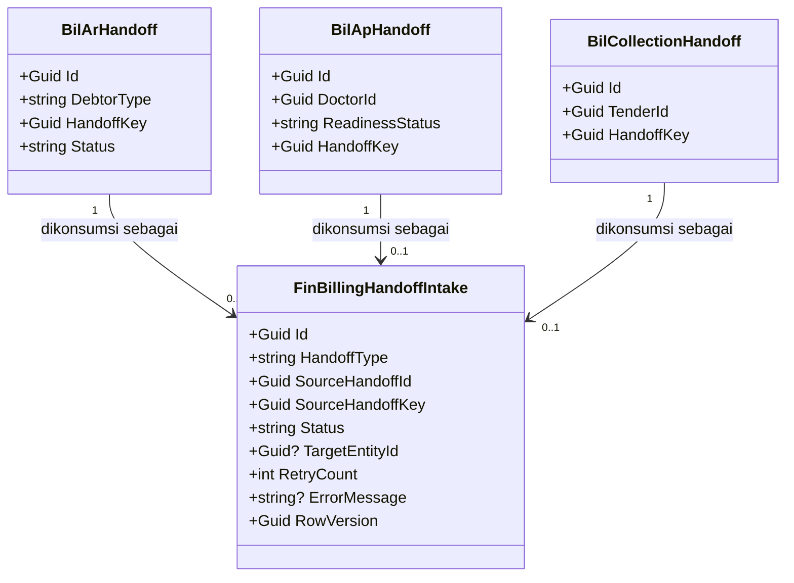
```mermaid
classDiagram
    class FinBillingHandoffIntake {
        +Guid Id
        +string HandoffType
        +Guid SourceHandoffId
        +Guid SourceHandoffKey
        +string Status
        +Guid? TargetEntityId
        +int RetryCount
        +string? ErrorMessage
        +Guid RowVersion
    }
    class BilArHandoff {
        +Guid Id
        +string DebtorType
        +Guid HandoffKey
        +string Status
    }
    class BilApHandoff {
        +Guid Id
        +Guid DoctorId
        +string ReadinessStatus
        +Guid HandoffKey
    }
    class BilCollectionHandoff {
        +Guid Id
        +Guid TenderId
        +Guid HandoffKey
    }
    BilArHandoff "1" --> "0..1" FinBillingHandoffIntake : dikonsumsi sebagai
    BilApHandoff "1" --> "0..1" FinBillingHandoffIntake : dikonsumsi sebagai
    BilCollectionHandoff "1" --> "0..1" FinBillingHandoffIntake : dikonsumsi sebagai
```

### 3.2 Receivable

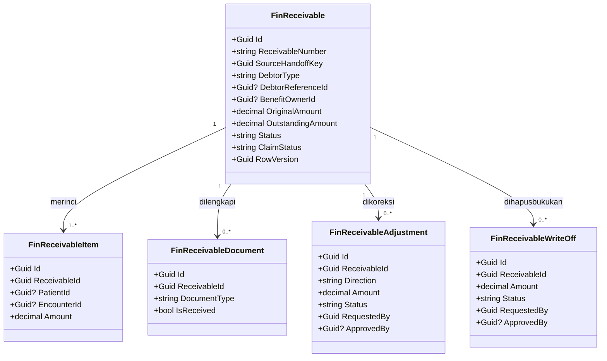
```mermaid
classDiagram
    class FinReceivable {
        +Guid Id
        +string ReceivableNumber
        +Guid SourceHandoffKey
        +string DebtorType
        +Guid? DebtorReferenceId
        +Guid? BenefitOwnerId
        +decimal OriginalAmount
        +decimal OutstandingAmount
        +string Status
        +string ClaimStatus
        +Guid RowVersion
    }
    class FinReceivableItem {
        +Guid Id
        +Guid ReceivableId
        +Guid? PatientId
        +Guid? EncounterId
        +decimal Amount
    }
    class FinReceivableDocument {
        +Guid Id
        +Guid ReceivableId
        +string DocumentType
        +bool IsReceived
    }
    class FinReceivableAdjustment {
        +Guid Id
        +Guid ReceivableId
        +string Direction
        +decimal Amount
        +string Status
        +Guid RequestedBy
        +Guid? ApprovedBy
    }
    class FinReceivableWriteOff {
        +Guid Id
        +Guid ReceivableId
        +decimal Amount
        +string Status
        +Guid RequestedBy
        +Guid? ApprovedBy
    }
    FinReceivable "1" --> "1..*" FinReceivableItem : merinci
    FinReceivable "1" --> "0..*" FinReceivableDocument : dilengkapi
    FinReceivable "1" --> "0..*" FinReceivableAdjustment : dikoreksi
    FinReceivable "1" --> "0..*" FinReceivableWriteOff : dihapusbukukan
```

### 3.3 Collection

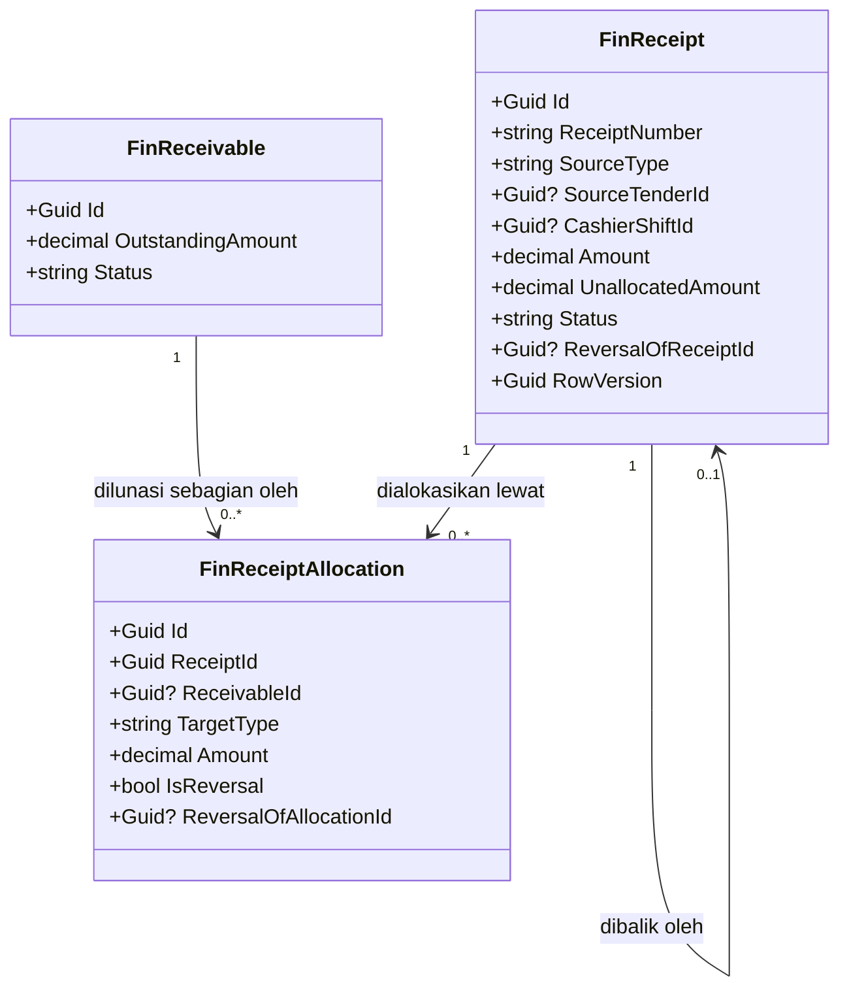
```mermaid
classDiagram
    class FinReceipt {
        +Guid Id
        +string ReceiptNumber
        +string SourceType
        +Guid? SourceTenderId
        +Guid? CashierShiftId
        +decimal Amount
        +decimal UnallocatedAmount
        +string Status
        +Guid? ReversalOfReceiptId
        +Guid RowVersion
    }
    class FinReceiptAllocation {
        +Guid Id
        +Guid ReceiptId
        +Guid? ReceivableId
        +string TargetType
        +decimal Amount
        +bool IsReversal
        +Guid? ReversalOfAllocationId
    }
    class FinReceivable {
        +Guid Id
        +decimal OutstandingAmount
        +string Status
    }
    FinReceipt "1" --> "0..*" FinReceiptAllocation : dialokasikan lewat
    FinReceivable "1" --> "0..*" FinReceiptAllocation : dilunasi sebagian oleh
    FinReceipt "1" --> "0..1" FinReceipt : dibalik oleh
```

### 3.4 Payable

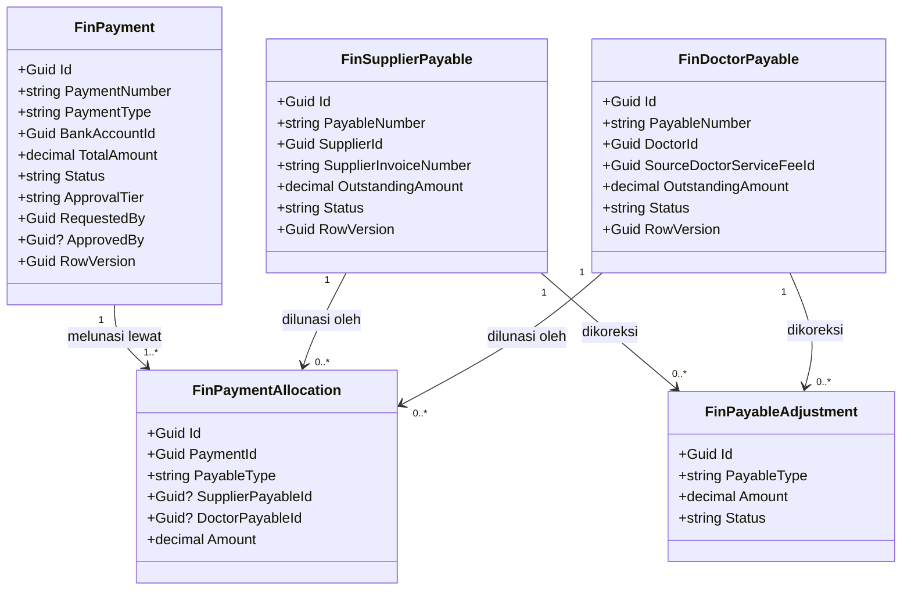
```mermaid
classDiagram
    class FinSupplierPayable {
        +Guid Id
        +string PayableNumber
        +Guid SupplierId
        +string SupplierInvoiceNumber
        +decimal OutstandingAmount
        +string Status
        +Guid RowVersion
    }
    class FinDoctorPayable {
        +Guid Id
        +string PayableNumber
        +Guid DoctorId
        +Guid SourceDoctorServiceFeeId
        +decimal OutstandingAmount
        +string Status
        +Guid RowVersion
    }
    class FinPayment {
        +Guid Id
        +string PaymentNumber
        +string PaymentType
        +Guid BankAccountId
        +decimal TotalAmount
        +string Status
        +string ApprovalTier
        +Guid RequestedBy
        +Guid? ApprovedBy
        +Guid RowVersion
    }
    class FinPaymentAllocation {
        +Guid Id
        +Guid PaymentId
        +string PayableType
        +Guid? SupplierPayableId
        +Guid? DoctorPayableId
        +decimal Amount
    }
    class FinPayableAdjustment {
        +Guid Id
        +string PayableType
        +decimal Amount
        +string Status
    }
    FinPayment "1" --> "1..*" FinPaymentAllocation : melunasi lewat
    FinSupplierPayable "1" --> "0..*" FinPaymentAllocation : dilunasi oleh
    FinDoctorPayable "1" --> "0..*" FinPaymentAllocation : dilunasi oleh
    FinSupplierPayable "1" --> "0..*" FinPayableAdjustment : dikoreksi
    FinDoctorPayable "1" --> "0..*" FinPayableAdjustment : dikoreksi
```

### 3.5 Cash Management dan Master Data

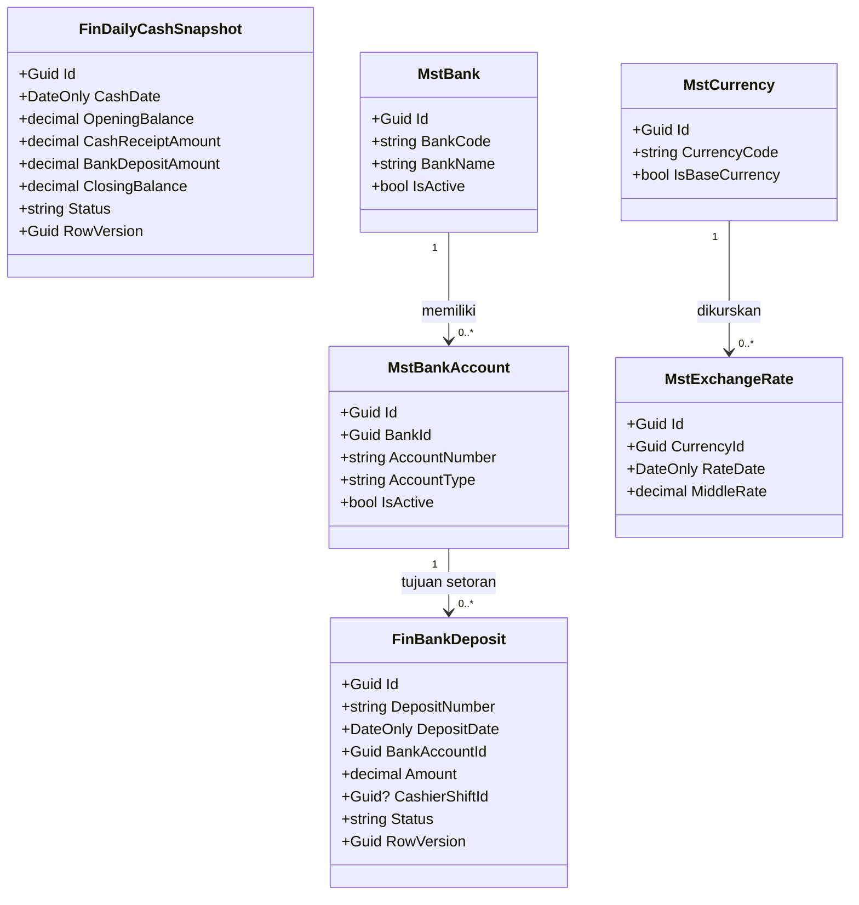
```mermaid
classDiagram
    class FinBankDeposit {
        +Guid Id
        +string DepositNumber
        +DateOnly DepositDate
        +Guid BankAccountId
        +decimal Amount
        +Guid? CashierShiftId
        +string Status
        +Guid RowVersion
    }
    class FinDailyCashSnapshot {
        +Guid Id
        +DateOnly CashDate
        +decimal OpeningBalance
        +decimal CashReceiptAmount
        +decimal BankDepositAmount
        +decimal ClosingBalance
        +string Status
        +Guid RowVersion
    }
    class MstBank {
        +Guid Id
        +string BankCode
        +string BankName
        +bool IsActive
    }
    class MstBankAccount {
        +Guid Id
        +Guid BankId
        +string AccountNumber
        +string AccountType
        +bool IsActive
    }
    class MstCurrency {
        +Guid Id
        +string CurrencyCode
        +bool IsBaseCurrency
    }
    class MstExchangeRate {
        +Guid Id
        +Guid CurrencyId
        +DateOnly RateDate
        +decimal MiddleRate
    }
    MstBank "1" --> "0..*" MstBankAccount : memiliki
    MstBankAccount "1" --> "0..*" FinBankDeposit : tujuan setoran
    MstCurrency "1" --> "0..*" MstExchangeRate : dikurskan
```

### 3.6 Accounting Integration

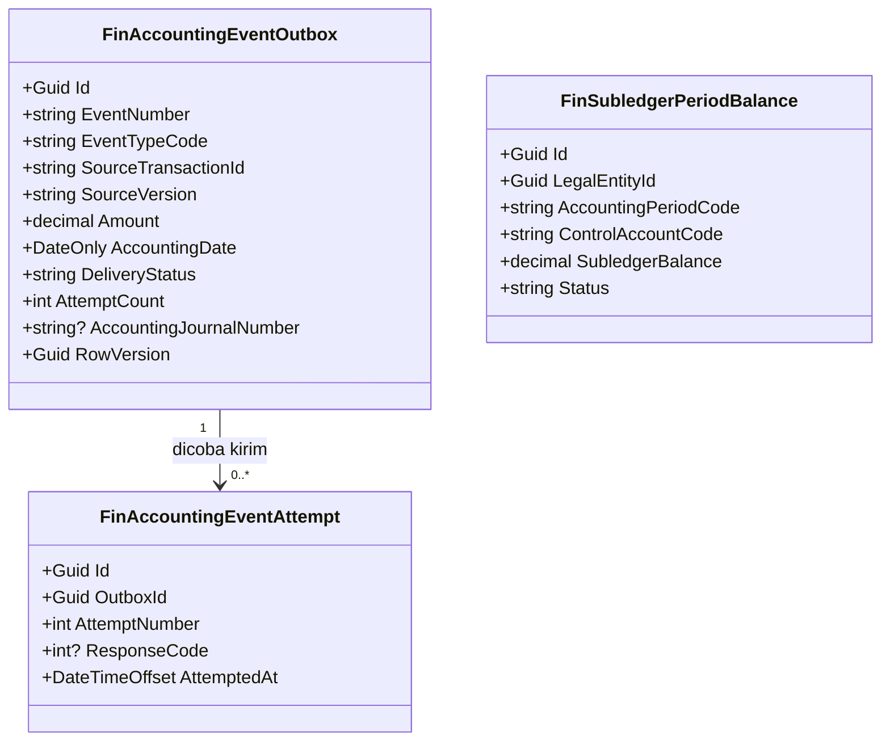
```mermaid
classDiagram
    class FinAccountingEventOutbox {
        +Guid Id
        +string EventNumber
        +string EventTypeCode
        +string SourceTransactionId
        +string SourceVersion
        +decimal Amount
        +DateOnly AccountingDate
        +string DeliveryStatus
        +int AttemptCount
        +string? AccountingJournalNumber
        +Guid RowVersion
    }
    class FinAccountingEventAttempt {
        +Guid Id
        +Guid OutboxId
        +int AttemptNumber
        +int? ResponseCode
        +DateTimeOffset AttemptedAt
    }
    class FinSubledgerPeriodBalance {
        +Guid Id
        +Guid LegalEntityId
        +string AccountingPeriodCode
        +string ControlAccountCode
        +decimal SubledgerBalance
        +string Status
    }
    FinAccountingEventOutbox "1" --> "0..*" FinAccountingEventAttempt : dicoba kirim
```

---

## 4. Penjelasan setiap class

### 4.1 `FinBillingHandoffIntake`

| Aspek | Penjelasan |
|---|---|
| **Status** | `Baru` |
| **Lokasi file** | `Areas/Corporate/FinanceManagement/BillingIntake/Models/FinBillingHandoffIntake.cs` |
| Kategori | Transaksi — pintu masuk integrasi |
| Tanggung jawab utama | Mencatat satu baris untuk setiap fakta yang dikirim Billing, beserta apakah fakta itu sudah berhasil diolah Finance. Kalau pengolahan gagal, barisnya tetap ada dengan pesan galat, sehingga petugas tahu ada yang tertinggal — bukan hilang diam-diam |
| Field penting | `HandoffType`, `SourceHandoffId`, `SourceHandoffKey`, `Status`, `TargetEntityId`, `RetryCount`, `ErrorMessage`, `CorrelationId` |
| Navigation property dan relasi | Tidak punya navigation ke tabel Billing — hanya menyimpan Id-nya, agar tidak mengunci tabel milik modul lain |
| Pemakaian dalam alur bisnis | Aktif setiap kali Billing memfinalisasi tagihan atau menyelesaikan pembayaran |
| Catatan desain | `SourceHandoffKey` yang jadi kunci idempotensi, bukan `SourceHandoffId` (`FIN-DES-009`). Baris berstatus `ERROR` MUST dapat diulang tanpa membuat baris kedua |
| Ekuivalen model lama | — |

### 4.2 `FinReceivable`

| Aspek | Penjelasan |
|---|---|
| **Status** | `Baru` |
| **Lokasi file** | `Areas/Corporate/FinanceManagement/Receivable/Models/FinReceivable.cs` |
| Kategori | Transaksi — aggregate root piutang |
| Tanggung jawab utama | Menyimpan satu piutang beserta sisa yang belum tertagih. Nilainya disalin dari handoff Billing dan tidak pernah dihitung ulang Finance |
| Field penting | `ReceivableNumber`, `SourceHandoffKey`, `DebtorType`, `DebtorReferenceId`, `BenefitOwnerId`, `OriginalAmount`, `OutstandingAmount`, `AllocatedAmount`, `AdjustedAmount`, `WrittenOffAmount`, `DueDate`, `Status`, `ClaimStatus` |
| Navigation property dan relasi | Punya banyak `FinReceivableItem`, `FinReceivableDocument`, `FinReceivableAdjustment`, `FinReceivableWriteOff`, dan `FinReceiptAllocation` |
| Pemakaian dalam alur bisnis | Dibuat otomatis saat handoff AR dikonsumsi; hidup sampai lunas, dihapusbukukan, atau dibatalkan |
| Catatan desain | Invariant: `OriginalAmount = OutstandingAmount + AllocatedAmount + AdjustedAmount + WrittenOffAmount`. `OutstandingAmount` MUST NOT negatif dan MUST NOT ditulis di luar `FinanceReceivableService`. Kolom benefit disiapkan tapi jalurnya `OPEN DECISION` (`FIN-DES-024`) |
| Ekuivalen model lama | `Fin_ARHeader` pada V1 QuilvianSta |

### 4.3 `FinReceivableItem`

| Aspek | Penjelasan |
|---|---|
| **Status** | `Baru` |
| **Lokasi file** | `Areas/Corporate/FinanceManagement/Receivable/Models/FinReceivableItem.cs` |
| Kategori | Transaksi — rincian |
| Tanggung jawab utama | Menyimpan rincian pasien dan kunjungan di balik satu piutang, supaya piutang penjamin yang berisi banyak pasien tetap bisa ditelusuri satu per satu |
| Field penting | `ReceivableId`, `PatientId` (**sensitif**), `EncounterId`, `InvoiceId`, `Description`, `Amount` |
| Navigation property dan relasi | Milik `FinReceivable` |
| Pemakaian dalam alur bisnis | Dibuat bersamaan dengan piutangnya |
| Catatan desain | `PatientId` MUST NOT ikut ke payload Accounting (`FIN-DEC` aturan #6). Ia hanya hidup di dalam domain Finance |
| Ekuivalen model lama | `Fin_ARDetail` pada V1 |

### 4.4 `FinReceivableDocument`

| Aspek | Penjelasan |
|---|---|
| **Status** | `Baru` |
| **Lokasi file** | `Areas/Corporate/FinanceManagement/Receivable/Models/FinReceivableDocument.cs` |
| Kategori | Transaksi — daftar periksa dokumen |
| Tanggung jawab utama | Melacak kelengkapan berkas klaim tanpa pernah mengubah nilai piutang |
| Field penting | `ReceivableId`, `DocumentType`, `DocumentNumber`, `IsReceived`, `ReceivedAt`, `Notes` |
| Navigation property dan relasi | Milik `FinReceivable` |
| Pemakaian dalam alur bisnis | Diisi petugas AR saat menyiapkan penagihan ke penjamin |
| Catatan desain | Kelengkapan dokumen MUST NOT menjadi syarat piutang diakui (`FIN-DEC-013`). Ia hanya memengaruhi `ClaimStatus` |
| Ekuivalen model lama | — |

### 4.5 `FinReceivableAdjustment`

| Aspek | Penjelasan |
|---|---|
| **Status** | `Baru` |
| **Lokasi file** | `Areas/Corporate/FinanceManagement/Receivable/Models/FinReceivableAdjustment.cs` |
| Kategori | Transaksi — koreksi berjenjang |
| Tanggung jawab utama | Mencatat penambahan atau pengurangan nilai piutang yang diajukan satu petugas dan disetujui petugas lain |
| Field penting | `AdjustmentNumber`, `ReceivableId`, `SourceHandoffAdjustmentId`, `Direction`, `Amount`, `Reason`, `Status`, `RequestedBy`, `RequestedAt`, `ApprovedBy`, `ApprovedAt`, `RejectionReason` |
| Navigation property dan relasi | Milik `FinReceivable`; boleh menunjuk `BilHandoffAdjustment` sebagai sumber |
| Pemakaian dalam alur bisnis | Dipakai saat penjamin menyetujui nilai berbeda dari tagihan awal |
| Catatan desain | `RequestedBy` MUST NOT sama dengan `ApprovedBy`, ditegakkan check constraint **dan** service (`FIN-DES-014`). `OutstandingAmount` piutang hanya berubah saat status menjadi `APPROVED` |
| Ekuivalen model lama | — |

### 4.6 `FinReceivableWriteOff`

| Aspek | Penjelasan |
|---|---|
| **Status** | `Baru` |
| **Lokasi file** | `Areas/Corporate/FinanceManagement/Receivable/Models/FinReceivableWriteOff.cs` |
| Kategori | Transaksi — penghapusan berjenjang |
| Tanggung jawab utama | Menutup piutang yang sudah dinyatakan tidak tertagih, dengan persetujuan orang kedua |
| Field penting | `WriteOffNumber`, `ReceivableId`, `Amount`, `Reason`, `Status`, `RequestedBy`, `ApprovedBy`, `RejectionReason` |
| Navigation property dan relasi | Milik `FinReceivable` |
| Pemakaian dalam alur bisnis | Akhir hidup piutang yang gagal ditagih |
| Catatan desain | Penghapusan buku MUST NOT menghapus baris piutang. Ia hanya memindahkan nilai dari `OutstandingAmount` ke `WrittenOffAmount` |
| Ekuivalen model lama | Pemutihan Piutang pada V1 |

### 4.7 `FinReceipt`

| Aspek | Penjelasan |
|---|---|
| **Status** | `Baru` |
| **Lokasi file** | `Areas/Corporate/FinanceManagement/Collection/Models/FinReceipt.cs` |
| Kategori | Transaksi — aggregate root penerimaan |
| Tanggung jawab utama | Mencatat uang yang benar-benar sudah diterima rumah sakit, baik dari kasir maupun dari penagihan piutang |
| Field penting | `ReceiptNumber`, `SourceType`, `SourceTenderId`, `SettlementId`, `InvoiceId`, `PaymentMethodId`, `PaymentMethodAccountId`, `Amount`, `AllocatedAmount`, `UnallocatedAmount`, `KwitansiNumber`, `CashierShiftId`, `ProviderReference`, `OccurredAt`, `SourceInvoiceStatus`, `Status`, `ReversalOfReceiptId` |
| Navigation property dan relasi | Punya banyak `FinReceiptAllocation`; boleh menunjuk dirinya sendiri lewat `ReversalOfReceiptId` |
| Pemakaian dalam alur bisnis | Dibuat saat tender Billing berhasil, atau saat penjamin membayar piutang |
| Catatan desain | Nilai `Amount` MUST disalin apa adanya dari `BilTender.Amount` — **jangan** dihitung ulang. Satu `SourceTenderId` hanya boleh melahirkan satu receipt (`FIN-DES-010`). Receipt MUST NOT menciptakan piutang (`FIN-DES-011`) |
| Ekuivalen model lama | `ReceivedPayment` pada V1 |

### 4.8 `FinReceiptAllocation`

| Aspek | Penjelasan |
|---|---|
| **Status** | `Baru` |
| **Lokasi file** | `Areas/Corporate/FinanceManagement/Collection/Models/FinReceiptAllocation.cs` |
| Kategori | Transaksi — baris alokasi |
| Tanggung jawab utama | Menjelaskan uang pada satu penerimaan dipakai untuk melunasi apa. Inilah yang mencegah satu rupiah dihitung dua kali |
| Field penting | `ReceiptId`, `ReceivableId`, `SourceAllocationId`, `TargetType`, `Amount`, `IsReversal`, `ReversalOfAllocationId`, `AllocatedBy`, `AllocatedAt` |
| Navigation property dan relasi | Milik `FinReceipt`; boleh menunjuk `FinReceivable` |
| Pemakaian dalam alur bisnis | Dibuat otomatis saat receipt berasal dari tender yang sudah punya alokasi Billing, atau dibuat manual oleh staf AR (`FIN-DES-013`) |
| Catatan desain | `ReceivableId` boleh kosong — itu keadaan sah untuk pasien yang bayar lunas tanpa pernah punya piutang. Pembalikan membuat baris baru `IsReversal = true` (`FIN-DES-012`) |
| Ekuivalen model lama | `DetailInvoiceReceived` pada V1 |

### 4.9 `FinSupplierPayable`

| Aspek | Penjelasan |
|---|---|
| **Status** | `Baru` |
| **Lokasi file** | `Areas/Corporate/FinanceManagement/Payable/Models/FinSupplierPayable.cs` |
| Kategori | Transaksi — aggregate root utang supplier |
| Tanggung jawab utama | Mencatat kewajiban membayar supplier beserta sisa yang belum dibayar |
| Field penting | `PayableNumber`, `SupplierId`, `SupplierInvoiceNumber`, `SupplierInvoiceDate`, `OriginalAmount`, `OutstandingAmount`, `PaidAmount`, `AdjustedAmount`, `DueDate`, `PaymentTermDays`, `Status` |
| Navigation property dan relasi | Menunjuk `MstSupplier` milik Administrator; punya banyak `FinSupplierPayableItem` dan `FinPaymentAllocation` |
| Pemakaian dalam alur bisnis | Diinput manual staf AP (`FIN-DEC-015`) karena modul Purchasing belum ada |
| Catatan desain | Pasangan (`SupplierId`, `SupplierInvoiceNumber`) MUST unik di antara baris yang belum dihapus — inilah satu-satunya penjaga terhadap invoice supplier yang terinput dua kali, karena tidak ada PO yang bisa dicocokkan |
| Ekuivalen model lama | `PembayaranAP` dan `RekapAP` pada V1 |

### 4.10 `FinSupplierPayableItem`

| Aspek | Penjelasan |
|---|---|
| **Status** | `Baru` |
| **Lokasi file** | `Areas/Corporate/FinanceManagement/Payable/Models/FinSupplierPayableItem.cs` |
| Kategori | Transaksi — rincian |
| Tanggung jawab utama | Merinci isi satu invoice supplier |
| Field penting | `PayableId`, `Description`, `Quantity`, `UnitPrice`, `Amount` |
| Navigation property dan relasi | Milik `FinSupplierPayable` |
| Pemakaian dalam alur bisnis | Diisi bersamaan saat utang diinput |
| Catatan desain | Jumlah seluruh `Amount` baris MUST sama dengan `OriginalAmount` induknya |
| Ekuivalen model lama | `DetailPembayaranAP` pada V1 |

### 4.11 `FinDoctorPayable`

| Aspek | Penjelasan |
|---|---|
| **Status** | `Baru` |
| **Lokasi file** | `Areas/Corporate/FinanceManagement/Payable/Models/FinDoctorPayable.cs` |
| Kategori | Transaksi — aggregate root utang dokter |
| Tanggung jawab utama | Mencatat kewajiban membayar jasa medis dokter yang fee-nya sudah disetujui Medical Fee |
| Field penting | `PayableNumber`, `DoctorId`, `SourceDoctorServiceFeeId`, `SourceApHandoffId`, `PeriodCode`, `OriginalAmount`, `OutstandingAmount`, `PaidAmount`, `Status`, `RecognizedAt` |
| Navigation property dan relasi | Punya banyak `FinDoctorPayableItem` dan `FinPaymentAllocation` |
| Pemakaian dalam alur bisnis | Dibuat setelah `DoctorServiceFee` berstatus disetujui — **bukan** saat `BilApHandoff` datang |
| Catatan desain | `SourceDoctorServiceFeeId` MUST unik: satu fee disetujui menghasilkan paling banyak satu utang. `BilApHandoff` hanya rujukan kesiapan, bukan sumber nilai (`FIN-DEC-003`, Opsi B) |
| Ekuivalen model lama | AP Dokter / Jasa Medis pada V1 |

### 4.12 `FinDoctorPayableItem`

| Aspek | Penjelasan |
|---|---|
| **Status** | `Baru` |
| **Lokasi file** | `Areas/Corporate/FinanceManagement/Payable/Models/FinDoctorPayableItem.cs` |
| Kategori | Transaksi — rincian |
| Tanggung jawab utama | Merinci layanan apa saja yang membentuk satu utang dokter |
| Field penting | `PayableId`, `SourceServiceFeeDetailId`, `Description`, `Amount` |
| Navigation property dan relasi | Milik `FinDoctorPayable` |
| Pemakaian dalam alur bisnis | Dibuat bersamaan dengan utangnya, disalin dari rincian fee |
| Catatan desain | Finance MUST NOT menghitung ulang nilai per layanan; ia menyalin |
| Ekuivalen model lama | — |

### 4.13 `FinPayment`

| Aspek | Penjelasan |
|---|---|
| **Status** | `Baru` |
| **Lokasi file** | `Areas/Corporate/FinanceManagement/Payable/Models/FinPayment.cs` |
| Kategori | Transaksi — aggregate root pembayaran keluar |
| Tanggung jawab utama | Satu perintah bayar, yang boleh melunasi banyak utang sekaligus dalam bentuk rekap |
| Field penting | `PaymentNumber`, `PaymentType`, `PayeeReferenceId`, `BankAccountId`, `PaymentMethod`, `TotalAmount`, `AllocatedAmount`, `Status`, `ApprovalTier`, `RequestedBy`, `RequestedAt`, `ApprovedBy`, `ApprovedAt`, `PaidAt`, `ReferenceNumber` |
| Navigation property dan relasi | Menunjuk `MstBankAccount`; punya banyak `FinPaymentAllocation` |
| Pemakaian dalam alur bisnis | Dipakai staf AP untuk membayar supplier, dan untuk membayar rekap fee banyak dokter sekaligus |
| Catatan desain | `TotalAmount` MUST sama dengan jumlah seluruh alokasinya sebelum status boleh menjadi `PAID`. `ApprovalTier` diisi service dari total nominal (`FIN-DEC-022`) — ambangnya masih `FIN-OQ-010` |
| Ekuivalen model lama | `PembayaranAP` pada V1 |

### 4.14 `FinPaymentAllocation`

| Aspek | Penjelasan |
|---|---|
| **Status** | `Baru` |
| **Lokasi file** | `Areas/Corporate/FinanceManagement/Payable/Models/FinPaymentAllocation.cs` |
| Kategori | Transaksi — baris alokasi |
| Tanggung jawab utama | Menjelaskan satu pembayaran rekap dipakai melunasi utang yang mana saja, sehingga tiap rupiah tetap tertelusur ke fee atau invoice aslinya |
| Field penting | `PaymentId`, `PayableType`, `SupplierPayableId`, `DoctorPayableId`, `Amount`, `IsReversal`, `ReversalOfAllocationId` |
| Navigation property dan relasi | Milik `FinPayment`; menunjuk salah satu dari dua jenis utang |
| Pemakaian dalam alur bisnis | Inilah yang menjawab keluhan sistem lama: dokter dobel atau lupa dibayar karena rekap dikerjakan di Excel terpisah (`FIN-DEC-019`) |
| Catatan desain | Tepat satu dari `SupplierPayableId`/`DoctorPayableId` terisi, dan MUST cocok dengan `PayableType` — ditegakkan check constraint (`FIN-DES-016`) |
| Ekuivalen model lama | `DetailPembayaranAP` pada V1 |

### 4.15 `FinPayableAdjustment`

| Aspek | Penjelasan |
|---|---|
| **Status** | `Baru` |
| **Lokasi file** | `Areas/Corporate/FinanceManagement/Payable/Models/FinPayableAdjustment.cs` |
| Kategori | Transaksi — koreksi utang |
| Tanggung jawab utama | Mencatat retur atau koreksi nilai utang tanpa mengubah catatan aslinya |
| Field penting | `AdjustmentNumber`, `PayableType`, `SupplierPayableId`, `DoctorPayableId`, `Direction`, `Amount`, `Reason`, `Status`, `RequestedBy`, `ApprovedBy` |
| Navigation property dan relasi | Menunjuk salah satu dari dua jenis utang |
| Pemakaian dalam alur bisnis | Dipakai saat barang diretur atau nilai fee dikoreksi setelah utang terbentuk |
| Catatan desain | Memakai aturan tepat-satu-FK yang sama dengan `FinPaymentAllocation` |
| Ekuivalen model lama | — |

### 4.16 `FinBankDeposit`

| Aspek | Penjelasan |
|---|---|
| **Status** | `Baru` |
| **Lokasi file** | `Areas/Corporate/FinanceManagement/CashManagement/Models/FinBankDeposit.cs` |
| Kategori | Transaksi — setoran kas ke bank |
| Tanggung jawab utama | Mencatat perpindahan uang tunai dari brankas rumah sakit ke rekening bank |
| Field penting | `DepositNumber`, `DepositDate`, `BankAccountId`, `Amount`, `CashierShiftId`, `DepositSlipNumber`, `Status`, `PostedBy`, `PostedAt` |
| Navigation property dan relasi | Menunjuk `MstBankAccount`; boleh menunjuk shift kasir sebagai rujukan |
| Pemakaian dalam alur bisnis | Dibuat Treasury setelah menghitung uang fisik yang akan disetor |
| Catatan desain | Saat status menjadi `POSTED`, service MUST menghitung ulang saldo tersedia di dalam transaksi `Serializable` dan menolak bila nominal melebihi saldo (`FIN-DES-021`). Setoran sebagian diperbolehkan |
| Ekuivalen model lama | Setoran Bank pada V1 |

### 4.17 `FinDailyCashSnapshot`

| Aspek | Penjelasan |
|---|---|
| **Status** | `Baru` |
| **Lokasi file** | `Areas/Corporate/FinanceManagement/CashManagement/Models/FinDailyCashSnapshot.cs` |
| Kategori | Transaksi — posisi kas harian |
| Tanggung jawab utama | Menyimpan posisi kas satu tanggal: saldo awal, uang masuk, uang keluar, setoran, dan saldo akhir |
| Field penting | `CashDate`, `OpeningBalance`, `CashReceiptAmount`, `OtherReceiptAmount`, `DisbursementAmount`, `BankDepositAmount`, `ClosingBalance`, `Status`, `ClosedBy`, `ClosedAt` |
| Navigation property dan relasi | Tidak punya FK — angkanya diringkas dari `FinReceipt` dan `FinBankDeposit` saat penutupan |
| Pemakaian dalam alur bisnis | Ditutup Treasury setiap akhir hari |
| Catatan desain | `CashDate` MUST unik. Kas kecil **tidak** masuk perhitungan ini karena kolamnya terpisah (`FIN-DEC-020`, aturan bisnis #15). Baris yang sudah `CLOSED` MUST NOT berubah; transaksi terlambat masuk ke tanggal berikutnya (`FIN-DES-022`) |
| Ekuivalen model lama | Kas Harian pada V1 |

### 4.18 `MstBank`, `MstBankAccount`, `MstCurrency`, `MstExchangeRate`

| Aspek | Penjelasan |
|---|---|
| **Status** | `Baru` (keempatnya) |
| **Lokasi file** | `Areas/Corporate/FinanceManagement/MasterData/Models/MstBank.cs`, `MstBankAccount.cs`, `MstCurrency.cs`, `MstExchangeRate.cs` |
| Kategori | Data induk milik Finance |
| Tanggung jawab utama | Menyediakan daftar bank, rekening rumah sakit, mata uang, dan kurs yang dipakai pembayaran dan setoran |
| Field penting | `MstBank`: `BankCode`, `BankName`, `SwiftCode`, `IsActive`. `MstBankAccount`: `BankId`, `AccountNumber`, `AccountName`, `AccountType`, `CurrencyCode`, `IsActive`. `MstCurrency`: `CurrencyCode`, `CurrencyName`, `Symbol`, `DecimalPlaces`, `IsBaseCurrency`, `IsActive`. `MstExchangeRate`: `CurrencyId`, `RateDate`, `BuyRate`, `SellRate`, `MiddleRate`, `Source` |
| Navigation property dan relasi | `MstBank` punya banyak `MstBankAccount`; `MstCurrency` punya banyak `MstExchangeRate` |
| Pemakaian dalam alur bisnis | Dipilih saat membuat pembayaran keluar dan saat mencatat setoran bank |
| Catatan desain | Memakai prefix `Mst`, bukan `Fin` (`FIN-DES-003`). Kurs hanya dipakai operasional; kejadian ke Accounting tetap IDR saja (`FIN-DEC-018`, aturan bisnis #7). Rekening yang sudah dipakai MUST dinonaktifkan, bukan dihapus — mengikuti pola `MstPettyCashCategory` |
| Ekuivalen model lama | Master Bank / Bank Account pada V1 |

### 4.19 `FinAccountingEventOutbox`

| Aspek | Penjelasan |
|---|---|
| **Status** | `Baru` |
| **Lokasi file** | `Areas/Corporate/FinanceManagement/AccountingIntegration/Models/FinAccountingEventOutbox.cs` |
| Kategori | Transaksi — kotak keluar integrasi |
| Tanggung jawab utama | Menyimpan salinan persis pesan yang akan dikirim ke Accounting, beserta status pengirimannya |
| Field penting | `EventNumber`, `EventTypeCode`, `SourceModule`, `SourceTransactionId`, `SourceVersion`, `EventOccurredAt`, `AccountingDate`, `Amount`, `CurrencyCode`, `LegalEntityId`, `CorrelationId`, `CausationId`, `ComponentsJson`, `PayloadJson`, `DeliveryStatus`, `HoldReason`, `AttemptCount`, `LastAttemptAt`, `LastResponseCode`, `AccountingReceiptNumber`, `AccountingJournalNumber` |
| Navigation property dan relasi | Punya banyak `FinAccountingEventAttempt` |
| Pemakaian dalam alur bisnis | Ditulis otomatis setiap kali Finance mengakui piutang, menerima uang, mengakui utang, atau membayar |
| Catatan desain | Ditulis di transaksi yang sama dengan fakta bisnisnya (`FIN-DES-017`). Dua lapis unique melindungi dari jurnal ganda (`FIN-DES-019`). `PayloadJson` MUST NOT memuat `PatientId`, nomor rekam medis, maupun `DoctorId` (aturan bisnis #6) |
| Ekuivalen model lama | — |

### 4.20 `FinAccountingEventAttempt`

| Aspek | Penjelasan |
|---|---|
| **Status** | `Baru` |
| **Lokasi file** | `Areas/Corporate/FinanceManagement/AccountingIntegration/Models/FinAccountingEventAttempt.cs` |
| Kategori | Transaksi — jejak percobaan kirim |
| Tanggung jawab utama | Menyimpan riwayat setiap percobaan pengiriman, supaya kegagalan berulang bisa ditelusuri |
| Field penting | `OutboxId`, `AttemptNumber`, `AttemptedAt`, `ResponseCode`, `ResponseBody`, `DurationMs`, `ErrorMessage` |
| Navigation property dan relasi | Milik `FinAccountingEventOutbox` |
| Pemakaian dalam alur bisnis | Diisi worker pengiriman |
| Catatan desain | Baris ini append-only. `ResponseBody` MUST dipotong panjangnya agar tidak menggelembungkan tabel |
| Ekuivalen model lama | — |

### 4.21 `FinSubledgerPeriodBalance`

| Aspek | Penjelasan |
|---|---|
| **Status** | `Baru` |
| **Lokasi file** | `Areas/Corporate/FinanceManagement/AccountingIntegration/Models/FinSubledgerPeriodBalance.cs` |
| Kategori | Transaksi — saldo tutup periode |
| Tanggung jawab utama | Menyimpan saldo akhir subledger per akun kontrol yang dikirim ke Accounting saat tutup periode |
| Field penting | `LegalEntityId`, `AccountingPeriodCode`, `ControlAccountCode`, `SubledgerBalance`, `AsOfDate`, `Status`, `SubmittedAt` |
| Navigation property dan relasi | — |
| Pemakaian dalam alur bisnis | Dibuat saat Finance menutup periode, sebelum Accounting menutup bukunya |
| Catatan desain | Nama field mengikuti draf `FIN-DEC-023` yang **belum dikonfirmasi Accounting** (`FIN-OQ-011`). Karena itu rumpun ini `POST-MVP` |
| Ekuivalen model lama | — |

### 4.22 Service

| Service | Status | Lokasi file | Fungsi utama | Dipanggil oleh | Membuka transaksi |
|---|---|---|---|---|:---:|
| `FinanceBillingIntakeService` | `Baru` | `BillingIntake/Services/FinanceBillingIntakeService.cs` | Membaca handoff Billing, membuat piutang/utang/penerimaan yang sesuai, lalu menandai ACK | `FinanceBillingIntakeController`, hosted job | Ya — `Serializable` |
| `FinanceReceivableService` | `Baru` | `Receivable/Services/FinanceReceivableService.cs` | Satu-satunya penulis `OutstandingAmount` piutang; mengurus aging, koreksi, write-off | `FinanceReceivablesController` | Ya — `Serializable` |
| `FinanceReceiptService` | `Baru` | `Collection/Services/FinanceReceiptService.cs` | Membuat penerimaan dari tender, mengalokasikan manual, dan membalik penerimaan | `FinanceReceiptsController`, `FinanceBillingIntakeService` | Ya — `Serializable` |
| `FinanceSupplierPayableService` | `Baru` | `Payable/Services/FinanceSupplierPayableService.cs` | Input manual utang supplier dan koreksinya | `FinanceSupplierPayablesController` | Ya |
| `FinanceDoctorPayableService` | `Baru` | `Payable/Services/FinanceDoctorPayableService.cs` | Membentuk utang dokter dari fee yang sudah disetujui | `FinanceDoctorPayablesController` | Ya |
| `FinancePaymentService` | `Baru` | `Payable/Services/FinancePaymentService.cs` | Menyusun pembayaran rekap, menegakkan approval berjenjang, mengalokasikan ke banyak utang | `FinancePaymentsController` | Ya — `Serializable` |
| `FinanceCashManagementService` | `Baru` | `CashManagement/Services/FinanceCashManagementService.cs` | Menghitung saldo kas tersedia, memposting setoran, menutup kas harian | `FinanceBankDepositsController`, `FinanceDailyCashController` | Ya — `Serializable` |
| `FinanceMasterDataService` | `Baru` | `MasterData/Services/FinanceMasterDataService.cs` | CRUD bank, rekening, mata uang, kurs | `FinanceBanksController` dan tiga controller master lain | Tidak — CRUD sederhana |
| `FinanceAccountingOutboxService` | `Baru` | `AccountingIntegration/Services/FinanceAccountingOutboxService.cs` | Menulis baris outbox di dalam transaksi pemanggil; melepas status tertahan saat tagihan final | Seluruh service Finance lain | Tidak membuka sendiri — **ikut** transaksi pemanggil (`FIN-DES-017`) |
| `FinanceAccountingDeliveryWorker` | `Baru` | `AccountingIntegration/Services/FinanceAccountingDeliveryWorker.cs` | `IHostedService` yang mengirim outbox ke Accounting dan mencatat percobaannya | Runtime | Ya, per baris |

`FinanceAccountingOutboxService` sengaja **tidak** membuka transaksi sendiri. Kalau ia membuka
transaksi terpisah, akan ada celah waktu ketika piutang sudah tersimpan tetapi kejadiannya
belum — persis masalah yang hendak dicegah pola outbox.

### 4.23 Controller

| Controller | Status | Lokasi file | Service yang dipakai | Grup Swagger |
|---|---|---|---|---|
| `FinanceBillingIntakeController` | `Baru` | `BillingIntake/Controllers/FinanceBillingIntakeController.cs` | `FinanceBillingIntakeService` | `Corporate / Finance Management / Billing Intake` |
| `FinanceReceivablesController` | `Baru` | `Receivable/Controllers/FinanceReceivablesController.cs` | `FinanceReceivableService` | `Corporate / Finance Management / Receivable` |
| `FinanceReceiptsController` | `Baru` | `Collection/Controllers/FinanceReceiptsController.cs` | `FinanceReceiptService` | `Corporate / Finance Management / Receipt` |
| `FinanceSupplierPayablesController` | `Baru` | `Payable/Controllers/FinanceSupplierPayablesController.cs` | `FinanceSupplierPayableService` | `Corporate / Finance Management / Supplier Payable` |
| `FinanceDoctorPayablesController` | `Baru` | `Payable/Controllers/FinanceDoctorPayablesController.cs` | `FinanceDoctorPayableService` | `Corporate / Finance Management / Doctor Payable` |
| `FinancePaymentsController` | `Baru` | `Payable/Controllers/FinancePaymentsController.cs` | `FinancePaymentService` | `Corporate / Finance Management / Payment` |
| `FinanceBankDepositsController` | `Baru` | `CashManagement/Controllers/FinanceBankDepositsController.cs` | `FinanceCashManagementService` | `Corporate / Finance Management / Bank Deposit` |
| `FinanceDailyCashController` | `Baru` | `CashManagement/Controllers/FinanceDailyCashController.cs` | `FinanceCashManagementService` | `Corporate / Finance Management / Daily Cash` |
| `FinanceBanksController` | `Baru` | `MasterData/Controllers/FinanceBanksController.cs` | `FinanceMasterDataService` | `Corporate / Finance Management / Master Data / Bank` |
| `FinanceBankAccountsController` | `Baru` | `MasterData/Controllers/FinanceBankAccountsController.cs` | `FinanceMasterDataService` | `Corporate / Finance Management / Master Data / Bank Account` |
| `FinanceCurrenciesController` | `Baru` | `MasterData/Controllers/FinanceCurrenciesController.cs` | `FinanceMasterDataService` | `Corporate / Finance Management / Master Data / Currency` |
| `FinanceAccountingEventsController` | `Baru` | `AccountingIntegration/Controllers/FinanceAccountingEventsController.cs` | `FinanceAccountingOutboxService` | `Corporate / Finance Management / Accounting Event Monitor` |
| `PettyCashBudgetController` | `Sudah ada` | `PettyCash/Controllers/PettyCashBudgetController.cs` | `PettyCashBudgetService` | `Corporate / Finance Management / Petty Cash / Budget` |
| `PettyCashCategoriesController` | `Sudah ada` | `MasterData/Controllers/PettyCashCategoriesController.cs` | `PettyCashCategoryService` | `Corporate / Finance Management / Master Data / Petty Cash Category` |

Seluruh controller baru memakai **satu** `[Route]` kanonik `api/v1/corporate/finance-management/...`.
Route alias `health-services/billing-management/...` yang ada pada dua controller Petty Cash
**MUST NOT** ditiru — alias itu warisan sejarah perpindahan folder, bukan pola yang berlaku.

---

## 5. Arsitektur folder

```text
Areas/Corporate/FinanceManagement/
├── BillingIntake/                      # BARU — wajib didaftarkan registry (FIN-DES-002)
│   ├── Controllers/FinanceBillingIntakeController.cs        # Baru
│   ├── Dtos/FinanceBillingIntakeDtos.cs                     # Baru
│   ├── Models/FinBillingHandoffIntake.cs                    # Baru
│   └── Services/FinanceBillingIntakeService.cs              # Baru
├── Receivable/                         # BARU
│   ├── Controllers/FinanceReceivablesController.cs          # Baru
│   ├── Dtos/FinanceReceivableDtos.cs                        # Baru
│   ├── Models/FinReceivable.cs                              # Baru
│   ├── Models/FinReceivableItem.cs                          # Baru
│   ├── Models/FinReceivableDocument.cs                      # Baru
│   ├── Models/FinReceivableAdjustment.cs                    # Baru
│   ├── Models/FinReceivableWriteOff.cs                      # Baru
│   └── Services/FinanceReceivableService.cs                 # Baru
├── Collection/                         # BARU
│   ├── Controllers/FinanceReceiptsController.cs             # Baru
│   ├── Dtos/FinanceReceiptDtos.cs                           # Baru
│   ├── Models/FinReceipt.cs                                 # Baru
│   ├── Models/FinReceiptAllocation.cs                       # Baru
│   └── Services/FinanceReceiptService.cs                    # Baru
├── Payable/                            # BARU
│   ├── Controllers/FinanceSupplierPayablesController.cs     # Baru
│   ├── Controllers/FinanceDoctorPayablesController.cs       # Baru
│   ├── Controllers/FinancePaymentsController.cs             # Baru
│   ├── Dtos/FinancePayableDtos.cs                           # Baru
│   ├── Dtos/FinancePaymentDtos.cs                           # Baru
│   ├── Models/FinSupplierPayable.cs                         # Baru
│   ├── Models/FinSupplierPayableItem.cs                     # Baru
│   ├── Models/FinDoctorPayable.cs                           # Baru
│   ├── Models/FinDoctorPayableItem.cs                       # Baru
│   ├── Models/FinPayment.cs                                 # Baru
│   ├── Models/FinPaymentAllocation.cs                       # Baru
│   ├── Models/FinPayableAdjustment.cs                       # Baru
│   ├── Services/FinanceSupplierPayableService.cs            # Baru
│   ├── Services/FinanceDoctorPayableService.cs              # Baru
│   └── Services/FinancePaymentService.cs                    # Baru
├── CashManagement/                     # BARU
│   ├── Controllers/FinanceBankDepositsController.cs         # Baru
│   ├── Controllers/FinanceDailyCashController.cs            # Baru
│   ├── Dtos/FinanceCashManagementDtos.cs                    # Baru
│   ├── Models/FinBankDeposit.cs                             # Baru
│   ├── Models/FinDailyCashSnapshot.cs                       # Baru
│   └── Services/FinanceCashManagementService.cs             # Baru
├── AccountingIntegration/              # BARU
│   ├── Controllers/FinanceAccountingEventsController.cs     # Baru
│   ├── Dtos/FinanceAccountingEventDtos.cs                   # Baru
│   ├── Models/FinAccountingEventOutbox.cs                   # Baru
│   ├── Models/FinAccountingEventAttempt.cs                  # Baru
│   ├── Models/FinSubledgerPeriodBalance.cs                  # Baru
│   ├── Services/FinanceAccountingOutboxService.cs           # Baru
│   └── Services/FinanceAccountingDeliveryWorker.cs          # Baru
├── MasterData/                         # SUDAH ADA — bertambah isi
│   ├── Controllers/PettyCashCategoriesController.cs         # Sudah ada
│   ├── Controllers/FinanceBanksController.cs                # Baru
│   ├── Controllers/FinanceBankAccountsController.cs         # Baru
│   ├── Controllers/FinanceCurrenciesController.cs           # Baru
│   ├── DTOs/PettyCashCategoryDtos.cs                        # Sudah ada
│   ├── DTOs/FinanceMasterDataDtos.cs                        # Baru
│   ├── Models/MstPettyCashCategory.cs                       # Sudah ada
│   ├── Models/MstBank.cs                                    # Baru
│   ├── Models/MstBankAccount.cs                             # Baru
│   ├── Models/MstCurrency.cs                                # Baru
│   ├── Models/MstExchangeRate.cs                            # Baru
│   ├── Services/PettyCashCategoryService.cs                 # Sudah ada
│   └── Services/FinanceMasterDataService.cs                 # Baru
└── PettyCash/                          # SUDAH ADA — TIDAK disentuh pass ini
    ├── Controllers/PettyCashBudgetController.cs             # Sudah ada
    ├── Dtos/PettyCashBudgetDtos.cs                          # Sudah ada
    ├── Models/FinPettyCashBudget.cs                         # Sudah ada
    ├── Models/FinPettyCashBudgetMovement.cs                 # Sudah ada
    └── Services/PettyCashBudgetService.cs                   # Sudah ada

Repositories/Configurations/Corporate/FinanceManagement/
├── BillingIntake/FinBillingHandoffIntakeConfiguration.cs    # Baru
├── Receivable/FinReceivableConfiguration.cs                 # Baru
├── Receivable/FinReceivableItemConfiguration.cs             # Baru
├── Receivable/FinReceivableDocumentConfiguration.cs         # Baru
├── Receivable/FinReceivableAdjustmentConfiguration.cs       # Baru
├── Receivable/FinReceivableWriteOffConfiguration.cs         # Baru
├── Collection/FinReceiptConfiguration.cs                    # Baru
├── Collection/FinReceiptAllocationConfiguration.cs          # Baru
├── Payable/FinSupplierPayableConfiguration.cs               # Baru
├── Payable/FinSupplierPayableItemConfiguration.cs           # Baru
├── Payable/FinDoctorPayableConfiguration.cs                 # Baru
├── Payable/FinDoctorPayableItemConfiguration.cs             # Baru
├── Payable/FinPaymentConfiguration.cs                       # Baru
├── Payable/FinPaymentAllocationConfiguration.cs             # Baru
├── Payable/FinPayableAdjustmentConfiguration.cs             # Baru
├── CashManagement/FinBankDepositConfiguration.cs            # Baru
├── CashManagement/FinDailyCashSnapshotConfiguration.cs      # Baru
├── AccountingIntegration/FinAccountingEventOutboxConfiguration.cs   # Baru
├── AccountingIntegration/FinAccountingEventAttemptConfiguration.cs  # Baru
├── AccountingIntegration/FinSubledgerPeriodBalanceConfiguration.cs  # Baru
├── MasterData/MstPettyCashCategoryConfiguration.cs          # Sudah ada
├── MasterData/MstBankConfiguration.cs                       # Baru
├── MasterData/MstBankAccountConfiguration.cs                # Baru
├── MasterData/MstCurrencyConfiguration.cs                   # Baru
├── MasterData/MstExchangeRateConfiguration.cs               # Baru
└── PettyCash/                                               # Sudah ada, tidak disentuh
```

**Catatan utang teknis yang MUST NOT ditiru:** dua controller Petty Cash memiliki `[Route]`
ganda (kanonik `corporate/finance-management` dan alias `health-services/billing-management`).
Alias itu peninggalan perpindahan folder 17 September 2026 dan hanya sah untuk kedua controller
tersebut. Controller baru memakai satu route kanonik saja. Perapian alias itu, bila kelak
diinginkan, MUST menjadi task tersendiri dengan approval pemilik modul — bukan dirapikan
diam-diam di tengah task lain.

### 5.1 Pendaftaran di luar folder modul

| Berkas | Perubahan | Alasan |
|---|---|---|
| `Repositories/ApplicationDbContext.cs` | Tambah 21 `DbSet<T>` baru | Pola existing: `DbSet<FinPettyCashBudget>` baris 619 |
| `Program.cs` | Tambah 9 `builder.Services.AddScoped<T>()` dan 1 `AddHostedService` | Pola existing: `AddScoped<PettyCashBudgetService>()` baris 732 |
| `docs/engineering/MODULE_OWNERSHIP_PREFIX_REGISTRY.md` | Tambah baris untuk enam submodul baru | `QBE-MOD-003` — **MUST** dilakukan sebelum file model pertama ditulis |

---

## 6. Status model dan dampak migration

| Model | Status | Kolom yang berubah | Dampak migration |
|---|---|---|---|
| `FinBillingHandoffIntake` | `Baru` | Seluruh kolom | Tabel baru |
| `FinReceivable` | `Baru` | Seluruh kolom | Tabel baru |
| `FinReceivableItem` | `Baru` | Seluruh kolom | Tabel baru |
| `FinReceivableDocument` | `Baru` | Seluruh kolom | Tabel baru |
| `FinReceivableAdjustment` | `Baru` | Seluruh kolom | Tabel baru |
| `FinReceivableWriteOff` | `Baru` | Seluruh kolom | Tabel baru |
| `FinReceipt` | `Baru` | Seluruh kolom | Tabel baru |
| `FinReceiptAllocation` | `Baru` | Seluruh kolom | Tabel baru |
| `FinSupplierPayable` | `Baru` | Seluruh kolom | Tabel baru |
| `FinSupplierPayableItem` | `Baru` | Seluruh kolom | Tabel baru |
| `FinDoctorPayable` | `Baru` | Seluruh kolom | Tabel baru |
| `FinDoctorPayableItem` | `Baru` | Seluruh kolom | Tabel baru |
| `FinPayment` | `Baru` | Seluruh kolom | Tabel baru |
| `FinPaymentAllocation` | `Baru` | Seluruh kolom | Tabel baru |
| `FinPayableAdjustment` | `Baru` | Seluruh kolom | Tabel baru |
| `FinBankDeposit` | `Baru` | Seluruh kolom | Tabel baru |
| `FinDailyCashSnapshot` | `Baru` | Seluruh kolom | Tabel baru |
| `MstBank` | `Baru` | Seluruh kolom | Tabel baru |
| `MstBankAccount` | `Baru` | Seluruh kolom | Tabel baru |
| `MstCurrency` | `Baru` | Seluruh kolom | Tabel baru |
| `MstExchangeRate` | `Baru` | Seluruh kolom | Tabel baru |
| `FinAccountingEventOutbox` | `Baru` | Seluruh kolom | Tabel baru |
| `FinAccountingEventAttempt` | `Baru` | Seluruh kolom | Tabel baru |
| `FinSubledgerPeriodBalance` | `Baru` | Seluruh kolom | Tabel baru |
| `BilArHandoff` | `Diperbarui` — **milik Billing** | Tambah `BenefitOwnerId uuid NULL`, tambah `BenefitRelationship varchar(30) NULL`, tambah nilai `EMPLOYEE_BENEFIT` pada check constraint `DebtorType` | Dua kolom nullable, aman tanpa pengisian data lama. **Migration ini milik tim Billing**, bukan Finance |
| `BilCollectionHandoff` | `Baru` — **milik Billing** | Seluruh kolom | Tabel baru, dibangun tim Billing (`FIN-DES-023`) |
| `FinPettyCashBudget` | `Sudah ada` | Tidak ada | Tidak disentuh |
| `FinPettyCashBudgetMovement` | `Sudah ada` | Tidak ada | Tidak disentuh |
| `MstPettyCashCategory` | `Sudah ada` | Tidak ada | Tidak disentuh |
| `MstSupplier` | `Sudah ada` — milik Administrator | Tidak ada | Dipakai apa adanya (`FIN-DEC-014`) |

## 7. Rencana migration

Seluruh migration di bawah **memerlukan otorisasi terpisah** untuk dibuat maupun dijalankan
(`AGENTS.md`, bagian Keselamatan Database). Desain ini tidak memberi wewenang itu.

| Urut | Nama migration | Isi | Tanpa downtime | Pengisian data lama | Langkah mundur |
|---:|---|---|:---:|---|---|
| 1 | `AddFinanceMasterData` | `MstBank`, `MstBankAccount`, `MstCurrency`, `MstExchangeRate` | Ya | Tidak ada — tabel baru kosong | `Down()` menghapus empat tabel; belum ada yang menunjuknya |
| 2 | `AddFinanceReceivableAndCollection` | 5 tabel piutang + 2 tabel penerimaan | Ya | Tidak ada | `Down()` menghapus tujuh tabel |
| 3 | `AddFinanceBillingIntake` | `FinBillingHandoffIntake` | Ya | Tidak ada | `Down()` menghapus satu tabel |
| 4 | `AddFinanceAccountingOutbox` | `FinAccountingEventOutbox`, `FinAccountingEventAttempt` | Ya | Tidak ada | `Down()` menghapus dua tabel |
| 5 | `AddFinancePayable` | 7 tabel utang dan pembayaran | Ya | Tidak ada | `Down()` menghapus tujuh tabel |
| 6 | `AddFinanceCashManagement` | `FinBankDeposit`, `FinDailyCashSnapshot` | Ya | Tidak ada | `Down()` menghapus dua tabel |
| 7 | `AddFinanceSubledgerPeriodBalance` | `FinSubledgerPeriodBalance` | Ya | Tidak ada | `Down()` menghapus satu tabel |
| — | `ExtendBilArHandoffWithEmployeeBenefit` | Dua kolom nullable pada `BilArHandoff` + perluasan check constraint | Ya | Baris lama tetap sah dengan kedua kolom `NULL` | `Down()` menghapus dua kolom dan mengembalikan check constraint |

Migration nomor 1 sampai 7 seluruhnya **aditif**: tidak ada tabel existing yang diubah, tidak
ada kolom yang dihapus, dan tidak ada data yang dipindahkan. Karena itu urutannya boleh
dipecah menjadi beberapa rilis tanpa saling mengunci, asalkan nomor 1 mendahului nomor 5 dan 6
(keduanya menunjuk `MstBankAccount`).

Migration terakhir **bukan milik Finance**. Ia menyentuh tabel Billing dan MUST dikerjakan tim
Billing setelah `FIN-DEC-006` dikonfirmasi.

## 8. Rencana data master awal

Modul dengan master kosong tidak dapat dipakai sama sekali. Isi minimum berikut MUST ada
sebelum fitur diaktifkan.

| Master | Isi minimum | Sumber nilai |
|---|---|---|
| `MstCurrency` | Sekurang-kurangnya satu baris `IDR` dengan `IsBaseCurrency = true`, `DecimalPlaces = 2` | ISO 4217; kontrak Accounting hanya menerima IDR (`FIN-DEC-018`) |
| `MstBank` | Bank tempat rumah sakit membuka rekening operasional | Daftar rekening rumah sakit dari Treasury |
| `MstBankAccount` | Sekurang-kurangnya satu rekening bertipe `COLLECTION` (tujuan setoran kasir) dan satu bertipe `PAYMENT` (sumber pembayaran keluar) | Treasury. Tanpa keduanya, setoran bank dan pembayaran AP tidak bisa dijalankan |
| `MstExchangeRate` | Boleh kosong saat mulai | Hanya dipakai bila ada transaksi non-IDR |
| `MstPettyCashCategory` | Sudah terisi `TRANSPORT`, `OPERASIONAL`, `KONSUMSI`, `MAINTENANCE`, `ATK` | Sudah ada di source, tidak perlu tindakan |
| `MstSupplier` | Supplier yang invoice-nya akan diinput | Milik Administrator; Finance hanya memakai |
| `AccEventType` di Accounting | **24 kode kejadian** — 17 dari `FIN-DEC-002` (sudah diratifikasi Accounting 24 September 2026) ditambah tujuh dari AMENDMENT REVISI 3 yang masih menunggu ratifikasi (`FIN-OQ-017`) | **Milik Accounting.** Kejadian berjenis yang belum terdaftar akan dijawab `422` `EVENT_TYPE_NOT_REGISTERED` dan berstatus Tertahan di sisi Accounting |

Nilai seperti tipe rekening dan kode mata uang **MUST** berasal dari master, **MUST NOT**
di-hardcode di controller maupun frontend.

## 9. Invariant dan batas transaksi

| Invariant | Ditegakkan di mana | Bila dilanggar |
|---|---|---|
| `FinReceivable.OriginalAmount = OutstandingAmount + AllocatedAmount + AdjustedAmount + WrittenOffAmount` | Service, di dalam transaksi `Serializable` | Transaksi dibatalkan; tidak ada baris tersimpan sebagian |
| `FinReceivable.OutstandingAmount >= 0` | Check constraint database + service | `422` |
| Satu `SourceTenderId` → paling banyak satu `FinReceipt` | Partial unique index | `409` |
| Satu `SourceHandoffKey` → paling banyak satu `FinReceivable` | Unique index | Intake ditandai sudah dikonsumsi, tidak membuat baris kedua |
| Satu `SourceDoctorServiceFeeId` → paling banyak satu `FinDoctorPayable` | Unique index | `409` |
| `FinReceipt.Amount = AllocatedAmount + UnallocatedAmount` | Service | Transaksi dibatalkan |
| `RequestedBy <> ApprovedBy` pada adjustment, write-off, dan payment | Check constraint + service | `422` |
| `FinPayment.TotalAmount = Σ FinPaymentAllocation.Amount` sebelum status `PAID` | Service | `422` |
| `FinPaymentAllocation`: tepat satu FK utang terisi sesuai `PayableType` | Check constraint | Baris ditolak database |
| `FinBankDeposit.Amount <= saldo kas tersedia` saat posting | Service, dihitung ulang di dalam transaksi `Serializable` | `422` |
| `FinDailyCashSnapshot.CashDate` unik | Unique index | `409` |
| `FinAccountingEventOutbox.EventNumber` unik | Unique index | Pengiriman ulang dianggap duplikat, aman |
| (`SourceModule`, `SourceTransactionId`, `EventTypeCode`, `SourceVersion`) unik | Unique index | Melindungi dari jurnal ganda walau nomor kejadian berbeda |
| `CurrencyCode = 'IDR'` pada seluruh baris outbox | Check constraint | Kontrak Accounting hanya menerima IDR (aturan bisnis #7) |

**Batas transaksi.** Satu transaksi database mencakup: fakta bisnisnya, pembaruan saldo
induknya, dan baris outbox-nya. Ketiganya berhasil bersama atau gagal bersama. Pengiriman ke
Accounting berada **di luar** transaksi itu — ia pekerjaan worker terpisah yang membaca outbox.

## 10. Yang sengaja tidak dibuat

| Yang ditolak | Alasan |
|---|---|
| `FinPractitionerPayable` terpisah dari `FinDoctorPayable` | Dua tabel yang hampir identik beserta dua jalur pembayaran yang harus dijaga konsisten. Diganti satu entity dengan kolom jenis penerima — lihat amendment revisi 2, `FIN-DES-025` |
| `FinSupplier` | Supplier sudah dimiliki Administrator (`MstSupplier`) dan field-nya sudah memuat termin pembayaran, limit kredit, dan rekening bank. `FIN-DEC-014` menutup ini |
| `FinPatient`, `FinDoctor` | Identitas pasien dan dokter milik modul lain. Finance cukup menyimpan Id-nya |
| `FinChartOfAccount`, `FinJournal` | COA dan jurnal milik Accounting. Menyalinnya akan melahirkan dua buku besar yang pasti berbeda setelah revisi pertama |
| `FinCashierShift` | Shift kasir milik Billing. Finance hanya menyimpan `CashierShiftId` untuk rekonsiliasi (aturan bisnis #12) |
| Tabel alokasi terpisah `FinSupplierPaymentAllocation` dan `FinDoctorPaymentAllocation` | Memecah query rekap menjadi dua dan menduplikasi logika pembalikan. Diganti satu tabel dengan check constraint (`FIN-DES-016`) |
| `FinDoctorServiceFee` | Perhitungan fee milik Medical Fee. Finance hanya menerima hasil yang sudah disetujui (`FIN-DEC-003`, Opsi B) |
| View SQL untuk kas harian | Angka yang sudah ditutup akan diam-diam berubah bila ada transaksi terlambat. Diganti tabel snapshot (`FIN-DES-022`) |
| Pencocokan otomatis FIFO pada alokasi piutang | `FIN-DEC-011` memilih manual penuh. Menambahkannya "supaya praktis" adalah keputusan bisnis baru, bukan keputusan teknis |
| Tabel `FinAgingBucket` | Aging diturunkan dari `DueDate` dan `OutstandingAmount` saat query. Menyimpannya berarti harus menghitung ulang setiap hari dan berisiko basi |
| Endpoint Finance yang menerima kejadian dari Accounting | Kontrak `ACC-XMOD-0.2` satu arah. Accounting adalah muara dan tidak menerbitkan kejadian balik |

---

# AMENDMENT REVISI 2 — Rumpun Payable

| Field | Nilai |
|---|---|
| Revisi | `2` |
| Tanggal | 20 September 2026 |
| Status | `approved` — `FIN-DES-025`..`028` disetujui Yasmin 20 September 2026 |
| Dipicu oleh | `MF-DEC-002`, `MF-DEC-005`, `MF-DEC-008` pada blueprint `medical-fee` |
| Menutup | `FIN-OQ-013`, `FIN-OQ-014` |
| Yang TIDAK disentuh | Seluruh rumpun MVP: data induk, intake Billing, piutang, penerimaan, alokasi, koreksi, write-off, kotak keluar kejadian. Bagian 1 sampai 10 di atas tetap berlaku apa adanya kecuali yang disebut eksplisit di bawah |

Amendment ini menyentuh `EPIC FIN-08` dan `EPIC FIN-09` yang keduanya `POST-MVP` dan **nol baris
kode**, sehingga tidak ada yang perlu dibongkar.

## A.1 Mengapa amendment ini ada

Dua keputusan modul Medical Fee membuat rancangan revisi 1 tidak lagi cukup:

| Keputusan Medical Fee | Akibatnya pada Finance |
|---|---|
| `MF-DEC-002` — penerima jasa bukan hanya dokter, tetapi juga tenaga kesehatan lain | `FinDoctorPayable` yang namanya dan bentuknya khusus dokter tidak dapat menampungnya |
| `MF-DEC-005` — Medical Fee menyerahkan jasa **kotor**; seluruh potongan diterapkan Finance | `FinPayment` revisi 1 **tidak punya tempat sama sekali** untuk PPh 21, kasbon, potongan hutang pasien yang dijamin potong honor, sitting fee, KSO, dan iuran |

Praktik yang harus ditampung terdokumentasi pada `evidence/03-referensi-meeting-rs-mmc.md`:
jasa kotor per dokter direkap sebulan, lalu dikurangi dan ditambah beberapa pos sebelum
ditransfer sekali sebagai satu angka bersih.

## A.2 Keputusan arsitektur baru

| ID | Keputusan | Dasar | Konsekuensi |
|---|---|---|---|
| `FIN-DES-025` | `FinDoctorPayable` **digantikan** `FinMedicalServicePayable`. Jenis penerima dibedakan kolom `PayeeType` (`DOCTOR`, `NURSE`, `OTHER_PRACTITIONER`), bukan tabel terpisah per jenis | `MF-DEC-002`, `MF-DEC-008`; mengikuti pola `FIN-DES-015` yang sudah memakai satu `FinPayment` untuk supplier dan dokter | Menghindari tabel kembar. `PayeeReferenceId` menunjuk tenaga medis apa pun, bukan khusus dokter |
| `FIN-DES-026` | Entity baru `FinPaymentDeduction` menyimpan potongan dan tambahan pada satu pembayaran, satu baris per pos | `MF-DEC-005`; pos-pos pada `evidence/03-referensi-meeting-rs-mmc.md` | Potongan bersifat per-penerima-per-periode, jadi melekat pada **pembayaran**, bukan pada utang. Kasbon tidak perlu dibagi ke puluhan baris jasa |
| `FIN-DES-027` | `FinPayment` bertambah `NetTransferAmount`. **Invariant lama tetap berlaku**: `TotalAmount` = jumlah alokasi ke utang. Invariant baru mendampinginya: `NetTransferAmount` = `TotalAmount` − potongan + tambahan | Menjaga `FIN-DES-015` tetap benar alih-alih mengubah arti `TotalAmount` | Dua angka punya makna berbeda dan keduanya dibutuhkan: `TotalAmount` menjawab "berapa utang yang lunas", `NetTransferAmount` menjawab "berapa uang yang keluar" |
| `FIN-DES-028` | Utang jasa tetap lunas sebesar **alokasinya**, bukan sebesar uang yang ditransfer | Potongan adalah urusan antara rumah sakit dan penerima, bukan pengurang kewajiban | Dokter dengan jasa Rp 24.500.000 dan potongan Rp 4.500.000 menerima transfer Rp 20.000.000, tetapi utang jasanya **lunas penuh** Rp 24.500.000 |

`FIN-DES-028` adalah bagian yang paling mudah salah dirancang. Bila potongan diperlakukan
sebagai pengurang utang, utang jasa tidak akan pernah lunas dan sisanya menumpuk selamanya.

## A.3 Contoh berangka

> Dr. Andi (nama samaran) punya tiga utang jasa bulan Agustus 2026: Rp 12.000.000,
> Rp 9.500.000, dan Rp 3.000.000. Totalnya Rp 24.500.000.
>
> Potongan bulan itu: PPh 21 Rp 1.225.000, kasbon Rp 3.000.000, iuran kerohanian Rp 100.000.
> Ada tambahan sitting fee Rp 500.000.
>
> Yang tersimpan:
>
> | Angka | Nilai | Artinya |
> |---|---|---|
> | `TotalAmount` | Rp 24.500.000 | Jumlah utang jasa yang dilunasi |
> | Tiga baris `FinPaymentAllocation` | 12.000.000 + 9.500.000 + 3.000.000 | Utang mana saja yang lunas |
> | Empat baris `FinPaymentDeduction` | −1.225.000, −3.000.000, −100.000, +500.000 | Rincian potongan dan tambahan |
> | `NetTransferAmount` | Rp 20.675.000 | Uang yang benar-benar ditransfer |
>
> Ketiga utang jasa berstatus **lunas penuh**, walaupun yang ditransfer lebih kecil.

## A.4 Class diagram — rumpun Payable sesudah amendment

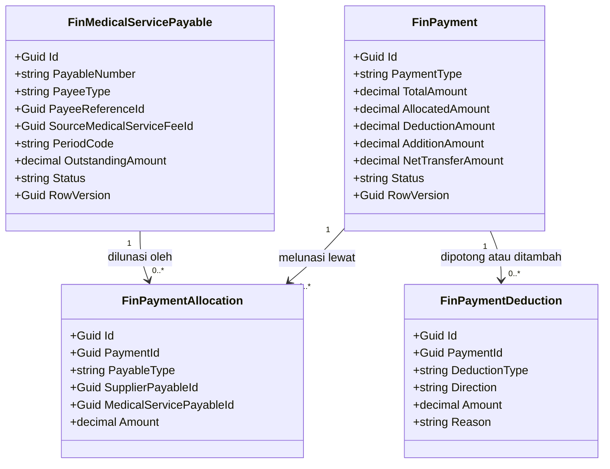
```mermaid
classDiagram
    class FinMedicalServicePayable {
        +Guid Id
        +string PayableNumber
        +string PayeeType
        +Guid PayeeReferenceId
        +Guid SourceMedicalServiceFeeId
        +string PeriodCode
        +decimal OutstandingAmount
        +string Status
        +Guid RowVersion
    }
    class FinPayment {
        +Guid Id
        +string PaymentType
        +decimal TotalAmount
        +decimal AllocatedAmount
        +decimal DeductionAmount
        +decimal AdditionAmount
        +decimal NetTransferAmount
        +string Status
        +Guid RowVersion
    }
    class FinPaymentAllocation {
        +Guid Id
        +Guid PaymentId
        +string PayableType
        +Guid SupplierPayableId
        +Guid MedicalServicePayableId
        +decimal Amount
    }
    class FinPaymentDeduction {
        +Guid Id
        +Guid PaymentId
        +string DeductionType
        +string Direction
        +decimal Amount
        +string Reason
    }
    FinPayment "1" --> "1..*" FinPaymentAllocation : melunasi lewat
    FinPayment "1" --> "0..*" FinPaymentDeduction : dipotong atau ditambah
    FinMedicalServicePayable "1" --> "0..*" FinPaymentAllocation : dilunasi oleh
```

## A.5 Penjelasan class baru dan berubah

### `FinMedicalServicePayable` — menggantikan `FinDoctorPayable`

| Aspek | Penjelasan |
|---|---|
| **Status** | `Baru` — menggantikan `FinDoctorPayable` yang belum pernah ditulis kodenya |
| **Lokasi file** | `Areas/Corporate/FinanceManagement/Payable/Models/FinMedicalServicePayable.cs` |
| Kategori | Transaksi — aggregate root utang jasa tenaga medis |
| Tanggung jawab utama | Mencatat kewajiban membayar jasa tenaga medis yang hasilnya sudah disetujui modul Medical Fee |
| Field penting | `PayableNumber`, `PayeeType`, `PayeeReferenceId`, `SourceMedicalServiceFeeId`, `PeriodCode`, `OriginalAmount`, `OutstandingAmount`, `PaidAmount`, `AdjustedAmount`, `Status`, `RecognizedAt`, `RowVersion` |
| Navigation property dan relasi | Punya banyak `FinMedicalServicePayableItem` dan `FinPaymentAllocation` |
| Pemakaian dalam alur bisnis | Dibuat setelah hasil jasa disetujui Medical Fee — bukan saat `BilApHandoff` datang |
| Catatan desain | `SourceMedicalServiceFeeId` MUST unik: satu hasil jasa yang disetujui menghasilkan paling banyak satu utang. `PayeeType` menentukan makna `PayeeReferenceId`, dan keduanya **sensitif** |
| Ekuivalen model lama | `FinDoctorPayable` pada revisi 1 — digantikan, belum pernah diimplementasikan |

### `FinPaymentDeduction` — baru

| Aspek | Penjelasan |
|---|---|
| **Status** | `Baru` |
| **Lokasi file** | `Areas/Corporate/FinanceManagement/Payable/Models/FinPaymentDeduction.cs` |
| Kategori | Transaksi — baris potongan dan tambahan |
| Tanggung jawab utama | Merinci mengapa uang yang ditransfer berbeda dari jumlah utang yang dilunasi |
| Field penting | `PaymentId`, `DeductionType`, `Direction`, `Amount`, `Reason`, `ReferenceNumber` |
| Navigation property dan relasi | Milik `FinPayment` |
| Pemakaian dalam alur bisnis | Diisi staf AP saat menyusun rekap pembayaran, sebelum diajukan untuk disetujui |
| Catatan desain | `Direction` membedakan potongan dari tambahan, karena "Atless" di praktik memuat keduanya. Nilai `Amount` selalu positif; arahnya ditentukan `Direction`. Baris ini **tidak pernah** mengurangi `OutstandingAmount` utang (`FIN-DES-028`) |
| Ekuivalen model lama | — |

### `FinPayment` — diperbarui

| Kolom yang ditambahkan | Tipe | Keterangan |
|---|---|---|
| `DeductionAmount` | `decimal(18,2)` | Jumlah seluruh baris berarah potongan |
| `AdditionAmount` | `decimal(18,2)` | Jumlah seluruh baris berarah tambahan |
| `NetTransferAmount` | `decimal(18,2)` | `TotalAmount` − `DeductionAmount` + `AdditionAmount` |

Kolom lain pada `FinPayment` **tidak berubah**.

### `FinPaymentAllocation` dan `FinPayableAdjustment` — diperbarui

Kolom `DoctorPayableId` diganti namanya menjadi `MedicalServicePayableId`, menunjuk
`FinMedicalServicePayable`. Nilai `PayableType` berubah dari `DOCTOR` menjadi
`MEDICAL_SERVICE`. Aturan tepat-satu-FK (`FIN-DES-016`) **tetap berlaku apa adanya**.

## A.6 Jenis potongan yang dikenal

Diturunkan dari praktik pada `evidence/03-referensi-meeting-rs-mmc.md`. Disimpan sebagai
`string` dengan check constraint, mengikuti `FIN-DES-004`.

| `DeductionType` | Arah lazim | Keterangan |
|---|---|---|
| `PPH21` | Potongan | Pajak penghasilan atas jasa |
| `KASBON` | Potongan | Pinjaman yang sudah diambil penerima |
| `PATIENT_DEBT` | Potongan | Hutang pasien yang dijamin dipotong dari honor |
| `SITTING_FEE` | Tambahan | Honor kehadiran |
| `KSO` | Potongan | Kerja sama operasional |
| `IURAN` | Potongan | Iuran kerohanian dan sejenisnya |
| `OTHER` | Keduanya | Wajib mengisi `Reason` |

Daftar ini **MUST** dapat bertambah tanpa perubahan skema — hanya check constraint yang
diperbarui.

## A.7 Status model sesudah amendment

| Model | Status | Kolom yang berubah | Dampak migration |
|---|---|---|---|
| `FinMedicalServicePayable` | `Baru` | Seluruh kolom | Menggantikan rencana tabel `FinDoctorPayable` |
| `FinMedicalServicePayableItem` | `Baru` | Seluruh kolom | Menggantikan rencana `FinDoctorPayableItem` |
| `FinPaymentDeduction` | `Baru` | Seluruh kolom | Tabel baru |
| `FinPayment` | `Diperbarui` | Tambah `DeductionAmount`, `AdditionAmount`, `NetTransferAmount` | Tiga kolom uang, bawaan nol |
| `FinPaymentAllocation` | `Diperbarui` | `DoctorPayableId` → `MedicalServicePayableId`; nilai `PayableType` `DOCTOR` → `MEDICAL_SERVICE` | Belum ada data, jadi bukan rename melainkan definisi awal |
| `FinPayableAdjustment` | `Diperbarui` | Sama seperti di atas | Sama |
| `FinDoctorPayable`, `FinDoctorPayableItem` | **Dibatalkan** | — | Tidak pernah dibuat; dihapus dari rencana migration `AddFinancePayable` |

Rencana migration pada bagian 7 nomor 5 (`AddFinancePayable`) **belum dijalankan**, sehingga
seluruh perubahan di atas masuk ke migration yang sama — bukan menjadi migration tambahan.

## A.8 Invariant yang ditambahkan

| Invariant | Ditegakkan di mana | Bila dilanggar |
|---|---|---|
| `FinPayment.NetTransferAmount = TotalAmount − DeductionAmount + AdditionAmount` | Check constraint + service | Transaksi dibatalkan |
| `NetTransferAmount >= 0` | Check constraint | `422` — potongan tidak boleh melebihi jasa yang dibayarkan |
| `FinPaymentDeduction.Amount > 0` | Check constraint | Ditolak database |
| `DeductionType = 'OTHER'` mewajibkan `Reason` terisi | Check constraint | Ditolak database |
| Satu `SourceMedicalServiceFeeId` → paling banyak satu utang jasa | Unique index | `409` |
| Potongan **tidak pernah** mengurangi `OutstandingAmount` utang | Service | Utang lunas sebesar alokasinya (`FIN-DES-028`) |

## A.9 Yang tetap tidak dibuat

| Yang ditolak | Alasan |
|---|---|
| Tabel utang terpisah per jenis tenaga medis | Melahirkan tabel kembar beserta dua jalur pembayaran; diganti kolom `PayeeType` (`FIN-DES-025`) |
| Perhitungan PPh 21 di dalam Finance | Finance hanya **mencatat** nilainya. Cara menghitungnya mengikuti ketentuan pajak, dan bila kelak perlu otomatis, itu keputusan tersendiri |
| Master jenis potongan sebagai tabel | Daftarnya pendek dan jarang berubah; check constraint sudah cukup, mengikuti pola `FIN-DES-004` |
| Pengurangan utang oleh potongan | Akan membuat utang jasa tidak pernah lunas (`FIN-DES-028`) |

---

# AMENDMENT REVISI 3 — Uang Muka, Deposit, dan Selisih Kas

| Field | Nilai |
|---|---|
| Tanggal | 25 September 2026 |
| Masukan | `00-interview-decisions.md` — `FIN-DEC-030`..`044`, seluruhnya `approved` 25 September 2026 |
| Backend SHA | `d6cdfaf9` (branch `Yasmina`) — bergerak dari `09101d05`, impact scan tercatat di `01-existing-capability-map.md` bagian 9.3 |
| Kontrak yang ikut naik | `FIN-INTEGRATION-1.1`, `FIN-STATE-1.1` |
| Status keputusan | `FIN-DES-029`..`036` **`approved`** — Yasmin, 25 September 2026. Approval ini BUKAN otorisasi migration, perubahan source, maupun pengaktifan pengiriman |
| Yang TIDAK berubah | Seluruh `FIN-DES-001`..`028` tetap berlaku apa adanya. Tidak ada keputusan lama yang dicabut |

## B.1 Mengapa amendment ini ada

Dua sebab, dan keduanya berasal dari luar dokumen ini:

1. **Accounting meminta satu perubahan perilaku** (`ACC-DEC-091`): penerimaan sebelum tagihan
   final tidak lagi ditahan, melainkan terbit segera sebagai Uang Muka Pasien. Owner Finance
   menyetujuinya (`FIN-DEC-030`). Ini membatalkan wujud teknis `FIN-DEC-004` yang **sudah
   terkode** — satu-satunya amendment pada blueprint ini yang menyentuh source berjalan.
2. **Gerbang cutover `G6` menuntut kejelasan** deposit pasien, kelebihan bayar, dan selisih kas
   shift kasir. Jawabannya melahirkan tujuh kode kejadian baru (`FIN-DEC-031`, `034`, `035`,
   `040`..`044`).

**Temuan yang paling mengubah rencana, dan arahnya menguntungkan:** ketiga rumpun itu ternyata
**sudah dimiliki Billing sepenuhnya** dan Finance sudah punya akses bacanya. Tidak ada satu pun
tabel baru yang perlu dibuat Finance, dan tidak ada kontrak baru yang perlu diminta dari Billing.
Bukti lengkap di `01-existing-capability-map.md` `FIN-CAP-022`..`025`.

## B.2 Keputusan arsitektur baru

| ID | Keputusan | Dasar | Kenapa begitu |
|---|---|---|---|
| `FIN-DES-029` | Empat jenis fakta baru masuk lewat `FinBillingHandoffIntake` yang **sudah ada**, dengan menambah nilai `HandoffType`: `DEPOSIT_MOVEMENT`, `REFUNDABLE_CREDIT`, `REFUND_CASE`, `CASH_VARIANCE_REVIEW`. **Bukan** tabel intake baru | `FIN-DEC-040`..`044`; `FIN-DES-008` sudah menetapkan tabel itu sebagai "satu pintu masuk seluruh fakta dari Billing" | Tabelnya memang dirancang untuk ini: `HandoffType` sudah menjadi kolom pembeda, dan unique index `(HandoffType, SourceHandoffKey)` sudah menjaga satu fakta hanya diolah satu kali. Membuat tabel intake kedua akan melahirkan dua jalur idempotensi yang bisa saling menyimpang |
| `FIN-DES-030` | `FinAccountingEventOutbox` **tidak bertambah satu kolom pun**. Tujuh kode baru cukup memakai nilai `EventTypeCode` baru, dan idempotensinya memakai unique index yang sudah ada `(SourceModule, SourceTransactionId, EventTypeCode, SourceVersion)` | `FIN-DEC-031`..`044`; konfigurasi `FinAccountingEventOutboxConfiguration` baris 53-55 | `EventTypeCode` sengaja tidak dibatasi check constraint (komentar pada model menyebutnya eksplisit), sehingga kode baru tidak menuntut migration. `SourceTransactionId` diisi kunci fakta Billing, sehingga satu mutasi deposit tidak mungkin melahirkan dua kejadian sejenis |
| `FIN-DES-031` | Batas `Amount > 0` pada `FinanceAccountingOutboxService.ValidateRequest` **dipersempit**: hanya berlaku untuk kejadian bernilai moneter searah. `SELISIH-KAS-SHIFT` boleh **negatif** (kekurangan kas), `SALDO-SUBLEDGER` boleh **nol atau negatif** | `FIN-DEC-034`, `043`, `035`; `integration-contract.md` bagian 5.6 | Diverifikasi langsung: pembatasan itu **hanya ada di kode**, bukan di database — konfigurasi hanya menetapkan `HasPrecision(18,2)` tanpa check constraint nilai. Jadi relaksasinya **nol migration** |
| `FIN-DES-032` | `AccountingOutboxEventRequest` bertambah satu properti opsional `SubledgerBalance` (`AccountingPeriodCode`, `ControlAccountCode`). `BuildPayloadJson` menyertakannya **hanya** bila terisi | `FIN-DEC-035`; `integration-contract.md` bagian 5.2 | Payload tetap dibangun di dalam service, bukan diterima mentah dari pemanggil — penjagaan `FR-FIN-073` (data pasien tidak pernah ikut) tetap terkunci di level tipe. Menambah satu objek bertipe tetap tidak membuka jalan field bebas |
| `FIN-DES-033` | Properti `RequiresFinalization` pada `AccountingOutboxEventRequest` **dicabut**. Penentuan perlakuan pra-finalisasi berpindah ke pemanggil sebagai **pemilihan `EventTypeCode`**, bukan sebagai penahanan status | `FIN-DEC-030` | Satu fakta hanya boleh punya satu representasi. Membiarkan `RequiresFinalization` tetap ada sementara tidak lagi berpengaruh akan menjadi properti yang menipu pembaca kode berikutnya |
| `FIN-DES-034` | Kode pembalikan penerimaan diturunkan dari **`FinReceipt.SourceInvoiceStatus` milik baris penerimaan ASLI** (yang ditunjuk `ReversalOfReceiptId`), bukan dari status tagihan saat pembalikan terjadi, dan bukan pula dengan menambah kolom baru | `FIN-DEC-044` | Kolomnya sudah ada dan sudah menyimpan status historis yang tepat. `FinanceReceiptService` juga sudah membaca baris asli untuk membuat pembalikan, sehingga tidak ada query tambahan sama sekali — **nol migration, nol biaya baca** |
| `FIN-DES-035` | Pemicu sinkronisasi empat fakta baru memakai **anti-join ke `FinBillingHandoffIntake`**, bukan ke kotak keluar, dengan penyempitan waktu (`OccurredAt`/`RecognizedAt`/`ReviewedAt`) | `FIN-DES-008`, `FIN-DES-029` | Tabel intake adalah catatan resmi "fakta ini sudah diolah". Memakai kotak keluar sebagai penanda akan mencampur dua urusan: apa yang sudah **diolah** dan apa yang sudah **dikirim** |
| `FIN-DES-036` | `SELISIH-KAS-SHIFT` memakai `BilCashVarianceReview.Id` sebagai `SourceTransactionId`, dan `AccountingDate` diambil dari **tanggal shift** (`BilCashierShift.OpenedAt`), bukan tanggal pengesahan | `FIN-DEC-043`; `FIN-CAP-024` | `BilCashVarianceReview` adalah baris yang benar-benar berarti "selisih disahkan", lengkap dengan `ReviewerId`, `Reason`, dan `Resolution`. Memakai `BilCashierShift.Id` akan gagal membedakan shift yang selisihnya ditinjau lebih dari sekali |

## B.3 Contoh berangka — tiga kejadian dari satu rawat inap

Pasien rawat inap menitipkan deposit, dipakai sebagian, sisanya dikembalikan.

| Tanggal | Fakta di Billing | Kejadian Finance | Nilai | Akibat di buku besar |
|---|---|---|---|---|
| 5 November | `BilDepositMovement` `TOP_UP` | `PENERIMAAN-UANG-MUKA` | Rp 10.000.000 | Debit Kas, Kredit Uang Muka Pasien |
| 12 November | `BilDepositMovement` `ALLOCATION` | `PEMAKAIAN-UANG-MUKA-DEPOSIT` | Rp 7.500.000 | Debit Uang Muka Pasien, Kredit Piutang — **kas tidak bergerak** |
| 13 November | `BilDepositMovement` `RELEASE` | ~~`PENGEMBALIAN-UANG-MUKA`~~ → **`PEMBALIKAN-PEMAKAIAN-UANG-MUKA-DEPOSIT`** | Rp 2.500.000 | ~~Debit Uang Muka Pasien, Kredit Kas~~ → **Debit Piutang, kredit Uang Muka Pasien**. **Contoh ini dikoreksi AMENDMENT REVISI 9** (`FIN-DES-064`): mutasi `RELEASE` tidak mengeluarkan kas. Jangan dipakai dalam bentuk lamanya |

Setelah ketiganya, saldo Uang Muka Pasien untuk pasien itu nol: Rp 10.000.000 masuk,
Rp 7.500.000 dipakai, Rp 2.500.000 dikembalikan. **Bila baris kedua dan ketiga memakai satu kode
yang sama** — sebagaimana `FIN-DEC-032` versi sebelum dikoreksi — Accounting tidak punya cara
membedakan mana yang mengurangi piutang dan mana yang mengeluarkan kas, sehingga salah satunya
pasti salah jurnal sementara buku besar tetap seimbang.

## B.4 Contoh berangka — kelebihan bayar

Pasien rawat jalan membayar tunai Rp 500.000 untuk tagihan Rp 450.000.

| Urutan | Fakta | Kejadian Finance | Nilai | Akibat |
|---:|---|---|---|---|
| 1 | Tender berhasil, tagihan sudah `FINAL` | `PENERIMAAN-KASIR` | Rp 500.000 | Debit Kas Rp 500.000 |
| 2 | Alokasi ke tagihan | *(tidak ada kejadian baru)* | Rp 450.000 | — |
| 3 | `BilRefundableCredit` `ALLOCATION_EXCESS` diakui | `PENGAKUAN-KELEBIHAN-BAYAR` | Rp 50.000 | Debit lawan jurnal penerimaan asli, Kredit Uang Muka Pasien — **kas tidak disentuh** |
| 4 | `BilRefundCase` `EXECUTED` | `PENGEMBALIAN-UANG-MUKA` | Rp 50.000 | Debit Uang Muka Pasien, Kredit Kas |

**Kenapa langkah 3 tidak digabung ke langkah 1.** Pada langkah 1 Finance **belum tahu** ada
kelebihan — Billing baru mengakuinya setelah alokasi. Menunggu sampai langkah 4 juga tidak bisa:
bila pengakuan terjadi November dan pengembaliannya Desember, jurnal koreksinya akan menabrak
periode November yang mungkin sudah ditutup Accounting, dan toleransi selisih mereka nol.

## B.5 Status model dan dampak migration

| Model | Status | Yang berubah | Dampak migration |
|---|---|---|---|
| `FinBillingHandoffIntake` | **Diperbarui** | **Tidak ada kolom yang berubah.** Yang berubah hanya himpunan nilai sah `HandoffType`: dari `AR`, `AP`, `COLLECTION`, `ADJUSTMENT` menjadi delapan nilai dengan tambahan `DEPOSIT_MOVEMENT`, `REFUNDABLE_CREDIT`, `REFUND_CASE`, `CASH_VARIANCE_REVIEW` | **Satu migration** — ubah check constraint `CK_FinBillingHandoffIntake_HandoffType` |
| `FinAccountingEventOutbox` | **Sudah ada, tidak disentuh skemanya** | Nol kolom. `EventTypeCode` menerima tujuh nilai baru tanpa check constraint; `Amount` sudah menerima nol/negatif di level database | **Nol migration** |
| `FinReceipt` | **Sudah ada, tidak disentuh** | Nol kolom. `SourceInvoiceStatus` yang sudah ada dipakai untuk memilih kode (`FIN-DES-034`) | **Nol migration** |
| `FinanceAccountingOutboxService` | **Diperbarui** (kode) | `ValidateRequest` dipersempit (`FIN-DES-031`); `AccountingOutboxEventRequest` bertambah `SubledgerBalance` dan kehilangan `RequiresFinalization` (`FIN-DES-032`, `033`); `BuildPayloadJson` menyertakan objek saldo bila ada | — |
| `FinanceReceiptService` | **Diperbarui** (kode) | Pemilihan `EventTypeCode` berdasarkan `SourceInvoiceStatus`; pembalikan memilih kode dari baris asli (`FIN-DES-034`) | — |
| `FinanceBillingIntakeService` | **Diperbarui** (kode) | Empat jalur sinkronisasi baru (`FIN-DES-035`) | — |
| `FinAccountingEventDeliveryStatuses` | **Sudah ada, tidak disentuh** | `HELD_FOR_FINALIZATION` **tetap** sebagai konstanta dan tetap sah pada check constraint, tetapi **tidak lagi dihasilkan kode baru** | **Nol migration** — lihat B.6 |

**Ringkasnya: satu migration untuk seluruh amendment ini.** Sisanya perubahan kode. Ini akibat
langsung dari keputusan memakai tabel dan kolom yang sudah ada (`FIN-DES-029`, `030`, `034`).

## B.6 Rencana migration

| Urutan | Migration | Tanpa downtime | Pengisian data lama | Cara mundur |
|---:|---|:---:|---|---|
| 1 | `AlterFinBillingHandoffIntakeHandoffTypeCheck` — `DROP CONSTRAINT` lalu `ADD CONSTRAINT` dengan delapan nilai | **Ya** | Tidak ada. Baris existing seluruhnya memakai empat nilai lama yang tetap sah | Kembalikan constraint ke empat nilai. **Hanya aman selama belum ada baris memakai nilai baru** — bila sudah ada, baris itu harus dihapus atau dipindah lebih dulu |

**Penanganan baris warisan `HELD_FOR_FINALIZATION`.** Nilai itu **tidak dihapus** dari check
constraint `CK_FinAccountingEventOutbox_DeliveryStatus`, supaya baris yang tersimpan sebelum
`FIN-DEC-030` berlaku tidak menjadi tidak valid. Tetapi baris seperti itu **tidak akan pernah
terkirim**, karena pemicu pelepasannya dicabut bersama `FIN-DES-033`. Karena itu:

1. Sebelum pengiriman diaktifkan (gerbang `G4`), hitung baris berstatus `HELD_FOR_FINALIZATION`.
2. Bila nol — kasus yang paling mungkin, karena worker pengiriman belum pernah hidup dan endpoint
   Accounting belum ada — tidak ada pekerjaan data sama sekali.
3. Bila ada, tiap baris diperiksa: `EventTypeCode`-nya dibetulkan menjadi `PENERIMAAN-UANG-MUKA`
   bila `SourceInvoiceStatus` penerimaannya `OPEN`, lalu statusnya dipindah ke `PENDING`
   (`state-transition-matrix.md` bagian 9, transisi migrasi satu kali).

Langkah 1 adalah **pembacaan database**, dan seperti seluruh dokumen ini ia **tidak** memberi
wewenang menjalankan apa pun terhadap database. Wewenang migration dan eksekusi tetap terpisah.

## B.7 Yang sengaja tidak dibuat pada amendment ini

| Yang ditolak | Alasan |
|---|---|
| Tabel `FinPatientAdvance` / `FinDepositLedger` milik Finance | Deposit pasien dimiliki Billing (`BilDepositAccount`/`BilDepositMovement`, `FIN-CAP-022`). Membuat salinannya di Finance melahirkan dua saldo yang bisa berselisih, dan melanggar aturan bisnis #1 (Finance menyalin, tidak menghitung ulang) |
| Tabel `FinRefundRequest` milik Finance | Kasus pengembalian beserta approval-nya dimiliki Billing (`BilRefundCase`, `FIN-CAP-023`) dan sudah punya siklus `SUBMITTED→APPROVED→EXECUTED` sendiri. Finance hanya menerbitkan kejadian saat `EXECUTED` |
| Tabel intake kedua khusus deposit/refund | Melahirkan dua jalur idempotensi yang bisa saling menyimpang; `FinBillingHandoffIntake` memang dirancang untuk diperluas lewat `HandoffType` (`FIN-DES-029`) |
| Kolom `AccountingEventTypeCode` pada `FinReceipt` | `SourceInvoiceStatus` yang sudah ada cukup untuk menurunkan kodenya (`FIN-DES-034`), sehingga kolom itu hanya akan menduplikasi informasi yang sama dan berisiko menyimpang |
| Check constraint pada `FinAccountingEventOutbox.EventTypeCode` | Katalog kode adalah kesepakatan dua pihak yang masih menunggu ratifikasi Accounting (`FIN-OQ-017`). Mengunci nilainya di database sekarang berarti setiap penyesuaian nama kode menuntut migration |
| Satu kode gabungan untuk pemakaian dan pengembalian uang muka | Lawan jurnalnya berbeda — lihat B.3. Ini keputusan yang **sudah pernah diambil lalu dikoreksi** (`FIN-DEC-032` `superseded`), dan dicatat di sini supaya tidak diusulkan ulang |
| Kejadian untuk `BilRefundCase` bersumber `SETTLEMENT`/`REFERRED_OUTPATIENT_ADMIN` | Lawan jurnalnya belum digali (`FIN-OQ-018`); di luar permintaan gerbang `G6` |


# AMENDMENT REVISI 4 — Purchasing/AP, AR Invoice Agregat, dan Potongan AR

## C.1 Mengapa amendment ini ada

Amendment ini menutup tiga rumpun kapabilitas baru (`FIN-SC-008`, `FIN-SC-009`, `FIN-SC-010`)
yang ditemukan lewat audit `Keuangan.md` — dokumen evidence hasil analisis video sistem rujukan
eksternal, bukan sumber otoritatif, dipakai murni sebagai peta area yang perlu diperiksa.
Ketiga rumpun disetujui lewat `FIN-DEC-045` s.d. `FIN-DEC-055` (`00-interview-decisions.md`),
seluruhnya `approved` 25 September 2026, dan ditelusuri lewat `/trace-existing-capabilities`
menghasilkan `FIN-CAP-026` s.d. `FIN-CAP-036` (`01-existing-capability-map.md` bagian 12).

Berbeda dari REVISI 2 (Payable) dan REVISI 3 (Accounting Integration/Collection) yang masing-
masing memperluas rumpun yang **sudah ada**, amendment ini yang pertama kali membangun rumpun
yang **sama sekali belum ada satu barisnya pun** di backend (Purchasing/AP) — dikonfirmasi nol
lewat pencarian `rg` menyeluruh (`FIN-CAP-028`). Ini juga pertama kalinya Finance Management
menjadi **pemilik proses hulu** (procurement), bukan sekadar konsumen hilir dari modul lain —
konsekuensi eksplisit dari `FIN-DEC-045` yang sudah dicatat sebagai penyimpangan pola oleh owner
sendiri.

Tiga rumpun ini dirancang dalam satu amendment karena diputuskan dalam satu sesi keputusan yang
sama dan saling beririsan: rumpun Purchasing/AP memperbarui `FinSupplierPayable` (sisi Payable
yang sudah ada), rumpun AR Invoice Agregat membangun lapisan baru di atas `FinReceivable` (sisi
Receivable yang sudah ada), dan rumpun Potongan AR memperbarui invariant `FinReceivable` yang
sama. Merancangnya terpisah berisiko melahirkan keputusan yang saling bertentangan pada entity
yang sama.

## C.2 Keputusan arsitektur baru

### Tabel kepemilikan data

| Kelompok data | Modul pemilik | Dipakai amendment ini | Dibuat ulang? |
|---|---|---|---|
| Data supplier (kode, NPWP, bank, TOP, lead time, PPN, diskon, limit kredit) | Finance Management (`MstSupplier`, `FIN-CAP-027`) | Ya — direferensikan seluruh entity Purchasing/AP baru | Tidak — `MstSupplier` sudah lengkap, tidak ada kolom baru |
| Utang ke supplier (ledger) | Finance Management (`FinSupplierPayable`) | Ya — jadi target penciptaan dari `FinPurchasingInvoice` | Tidak — diperluas (`Diperbarui`), bukan diganti |
| Piutang per invoice pasien/penjamin | Finance Management (`FinReceivable`, `FIN-CAP-031`) | Ya — jadi unit dasar yang dikelompokkan `FinReceivableInvoiceBatch`, dan target pengurangan `FinReceiptDeduction` | Tidak — dipakai apa adanya, nol kolom baru |
| Dokumen tagihan per invoice untuk penjamin perusahaan | Billing (`BillingCompanyGuarantorInvoiceDocumentService`, `FIN-CAP-030`) | Ya — dirujuk sebagai rincian baris dalam `FinReceivableInvoiceBatch` | Tidak — dipakai lewat pemanggilan service yang sudah ada (`Reuse with adapter`), bukan disalin |
| Potongan sisi Payable (pola struktur) | Finance Management (`FinPaymentDeduction`, `FIN-CAP-033`) | Ya — jadi pola struktural untuk `FinReceiptDeduction` (arah aliran dibalik, bukan tabel yang sama) | Tidak — entity baru terpisah, `FinPaymentDeduction` tidak disentuh |
| Ambang dan jenjang approval nominal (pola) | Finance Management (`FinancePaymentService.ResolveApprovalTier`, `FIN-CAP-035`) | Ya — logikanya diekstrak jadi helper bersama, dipakai ulang oleh PO dan Purchasing Invoice | Tidak — diekstrak (`Diperbarui`), logika nominal (Rp 50.000.000) tidak berubah |
| Purchase Order, Tanda Terima Barang, Tukar Faktur, Purchasing Invoice, Retur Pembelian, Deposit Retur | **Baru — Finance Management** | — | Ya — dikonfirmasi nol existing (`FIN-CAP-028`, `FIN-CAP-029`) |
| AR Invoice Agregat (batch tagihan gabungan) | **Baru — Finance Management** | — | Ya — dikonfirmasi nol existing (`FIN-CAP-032`) |
| Potongan sisi penerimaan piutang (PPh 23, biaya admin bank) | **Baru — Finance Management** | — | Ya — dikonfirmasi nol existing (`FIN-CAP-034`) |
| Kejadian akuntansi PPN Masukan Pembelian | Accounting (kode `PPN-MASUKAN-PEMBELIAN`, diusulkan `evidence/06`) | Ya — dipicu dari `FinPurchasingInvoice` disetujui | Tidak — Finance hanya mengirim envelope `ACC-XMOD-0.3` yang sudah ada, tidak membuat tabel Accounting |

### FIN-DES-037 — Rumpun Purchasing/AP: entity inti

Tujuh entity baru dibangun mengikuti alur `PO → Tanda Terima Barang → Tukar Faktur →
Purchasing Invoice`, sebagaimana ditegaskan `FIN-DEC-051`:

- `FinPurchaseOrder` + `FinPurchaseOrderItem` — permintaan pembelian ke supplier, menunggu
  approval bila di atas ambang (`FIN-DES-039`).
- `FinGoodsReceipt` + `FinGoodsReceiptItem` — pencatatan barang fisik diterima terhadap satu PO.
  **DEV_DISCRETION**: dirancang selalu terhadap satu `PurchaseOrderId` (tidak nullable) — jalur
  "tanpa PO" yang disebut `Keuangan.md` hanya berlaku pada Tukar Faktur/Purchasing Invoice
  (`FIN-DEC-051` eksplisit menyebut Tukar Faktur boleh tanpa PO), bukan pada penerimaan barang,
  karena menerima barang tanpa order yang mendahuluinya bukan pola yang diminta owner. Keputusan
  ini didelegasikan ke pelaksana desain karena tidak ada keputusan eksplisit soal GR tanpa PO
  pada decision log manapun; bila keliru, dapat diamandemen terpisah tanpa mengubah entity lain.
- `FinInvoiceExchange` ("Tukar Faktur") — checkpoint serah terima dokumen dari supplier,
  mencatat tanggal terima dan estimasi jatuh tempo dari TOP supplier (`MstSupplier.PaymentTermDays`,
  sudah ada — `FIN-CAP-027`). `PurchaseOrderId` dan `GoodsReceiptId` nullable sesuai `FIN-DEC-051`.
- `FinPurchasingInvoice` + `FinPurchasingInvoiceItem` — nilai final pembelian (PPN, diskon,
  potongan, DP/termin). Tepat satu `FinInvoiceExchange` menghasilkan tepat satu
  `FinPurchasingInvoice` (`FIN-DEC-051`, unique constraint pada `InvoiceExchangeId`).

### FIN-DES-038 — Retur Pembelian dan Deposit Retur

`FinSupplierReturn` + `FinSupplierReturnItem` mencatat pengembalian barang ke supplier.
`FinSupplierReturnDeposit` adalah entity kredit terpisah yang dapat dipakai lintas invoice/
pembelian berikutnya (`FIN-DEC-047`), secara struktural meniru pola `BilRefundableCredit`
(Billing) namun **bukan tabel yang sama** — arah aliran uang berlawanan (Billing: kredit ke
pasien; Finance: kredit dari supplier ke RS). `FinSupplierReturnDepositUsage` mencatat setiap
pemakaian deposit terhadap `FinPurchasingInvoice`/`FinSupplierPayable` tertentu, menjaga
`FinSupplierReturnDeposit.AvailableAmount` tetap konsisten (pola yang sama dengan bagaimana
`FinPaymentDeduction` diaudit — satu baris pemakaian, bukan pengurangan langsung tanpa jejak).

### FIN-DES-039 — Approval dua jenjang untuk PO dan Purchasing Invoice

`FIN-DEC-050` meminta jenjang approval bertingkat berdasarkan nominal sejak awal desain;
`FIN-DEC-052` menutup ambangnya di **Rp 50.000.000**, angka yang persis sama dengan placeholder
yang sudah ditemukan di `FinancePaymentService.ResolveApprovalTier` (`FIN-CAP-035`).

Alih-alih menulis ulang logika ambang tiga kali (Payment, PO, Purchasing Invoice), logika
`ResolveApprovalTier(decimal nominal)` dan `ApprovalTiers.Tier1`/`Tier2` **diekstrak** dari
`FinancePaymentService` menjadi helper bersama `FinanceApprovalTierResolver` (baru, di folder
`Payable/Services` karena dipakai lintas Payable — lihat C.7). `FinancePaymentService` diperbarui
untuk memanggil helper ini alih-alih menyimpan salinan logikanya sendiri, supaya tidak ada tiga
salinan ambang yang bisa menyimpang.

> **KOREKSI 25 September 2026 (ditemukan saat `/plan-module-delivery` membaca source).** Versi
> awal paragraf ini menyatakan "logika nominal tidak berubah, murni ekstraksi". **Itu keliru
> tepat pada satu nilai.** Kode yang berjalan (`FinancePaymentService.cs` baris 654-658) memakai
> `<= 50_000_000m → TIER_1`, sedangkan `FIN-DEC-052` yang sudah `approved` menetapkan
> `< Rp 50.000.000` → Supervisor Finance dan **`>= Rp 50.000.000` → Manajer Finance**.
>
> | Nominal | Kode hari ini | `FIN-DEC-052` |
> |---|---|---|
> | Rp 49.999.999 | `TIER_1` | `TIER_1` |
> | **Rp 50.000.000 tepat** | **`TIER_1`** | **`TIER_2`** |
> | Rp 50.000.001 | `TIER_2` | `TIER_2` |
>
> Resolver bersama **MUST** mengikuti `FIN-DEC-052` (`>= 50.000.000 → TIER_2`). Akibatnya ekstraksi
> ini **mengubah perilaku pembayaran yang sudah berjalan** untuk satu nilai batas itu:
> pembayaran tepat Rp 50.000.000 yang hari ini cukup disetujui Supervisor akan menuntut Manajer.
> Pembayaran yang sudah tersimpan tidak dihitung ulang — `ApprovalTier` dibekukan saat diajukan
> (`FIN-DEC-052`: jejak audit mencatat jenjang yang berlaku saat approval).

Komentar kode yang menyebut ambang ini "provisional"/"belum diratifikasi" (`FinPayment.cs` baris
18, `FinancePaymentsController.cs` baris 24-28, `FinancePaymentService.cs` baris 646-651)
diperbarui karena `FIN-DEC-052` sudah meratifikasi nilainya secara eksplisit.

`FinPurchaseOrder` dan `FinPurchasingInvoice` masing-masing mendapat kolom `ApprovalTier`,
`RequestedByUserId`, `RequestedAt`, `ApprovedByUserId`, `ApprovedAt`, mengikuti pola persis yang
sudah ada pada `FinPayment`. Checkpoint ini **berbeda** dari checkpoint approval pembayaran
(`FIN-DEC-022`) — PO/Purchasing Invoice disetujui sebelum utang tercatat; pembayaran disetujui
sebelum kas keluar. Keduanya kini memakai ambang yang sama (`FIN-DEC-052`) tapi tetap dua
checkpoint independen dengan actor dan record persetujuan masing-masing.

### FIN-DES-040 — Perluasan FinSupplierPayable

`FinSupplierPayable` (`Diperbarui`) mendapat kolom `SourcePurchasingInvoiceId` (nullable, FK ke
`FinPurchasingInvoice`). **Jalur input manual yang sudah ada tetap dipertahankan** — amendment
ini tidak menghapus kapasitas mencatat utang supplier secara manual, karena beberapa supplier
lama mungkin belum onboarding ke alur PO penuh dan tidak ada keputusan eksplisit untuk
mendeprekasinya. `SourcePurchasingInvoiceId` bernilai `NULL` untuk baris yang dibuat manual
(perilaku lama, tidak berubah) dan terisi otomatis untuk baris yang dibuat sistem saat
`FinPurchasingInvoice` berstatus `Approved` (`FIN-DEC-045`).

### FIN-DES-041 — AR Invoice Agregat

`FinReceivableInvoiceBatch` (baru) adalah aggregate root yang mengelompokkan baris `FinReceivable`
yang berbagi `DebtorType="PAYER"` dan `DebtorReferenceId` yang sama (kunci pengelompokan yang
sudah tersedia di `FinReceivable`, nol perubahan skema dibutuhkan — `FIN-CAP-031`) dalam satu
periode penagihan. Batch ini menjadi **dokumen resmi yang dikirim ke penjamin** (`FIN-DEC-048`),
menggantikan `BilInvoice` individual sebagai dokumen yang dikirim — namun `BilInvoice` dan
`FinReceivable` **tetap ada dan tidak diubah perannya** sebagai satuan internal; batch adalah
lapisan baru di atasnya, bukan pengganti. `FinReceivableInvoiceBatchItem` (baru) adalah tabel
penghubung `BatchId` ↔ `ReceivableId`; satu `FinReceivable` hanya boleh tergabung dalam satu
batch aktif pada satu waktu (unique constraint pada `ReceivableId` untuk baris yang batch-nya
belum `Cancelled`).

Saat batch diterbitkan (`Issued`), setiap baris `FinReceivable` anggotanya dapat merujuk balik
ke dokumen per-invoice yang sudah ada via `BillingCompanyGuarantorInvoiceDocumentService`
(`FIN-CAP-030`, `Reuse with adapter`) sebagai rincian baris pada dokumen batch gabungan —
service tersebut **dipanggil**, bukan disalin ulang logikanya.

### FIN-DES-042 — Potongan sisi penerimaan piutang

`FinReceiptDeduction` (baru) meniru struktur `FinPaymentDeduction` (`DeductionType`, `Amount`,
`Reason`, `ReferenceNumber`) namun melekat pada `FinReceipt`/alokasinya, bukan `FinPayment`, dan
`DeductionType` memakai daftar nilai berbeda: `PPH23`, `BANK_ADMIN_FEE`, `OTHER` (bukan daftar
`FinPaymentDeduction` yang memuat `PPH21`/`KASBON`/dst — konteksnya berbeda, sisi penerimaan
bukan sisi pembayaran ke pihak ketiga).

Per `FIN-DEC-055`, potongan ini **mengurangi `FinReceivable.OutstandingAmount`** — berfungsi
sebagai "pembayaran non-tunai", kebalikan tepat dari `FIN-DES-028` (potongan sisi Payable TIDAK
mengurangi `FinSupplierPayable` yang dibayarkan, karena di sana potongan adalah pengurang nilai
yang dibayar tunai, bukan pelunasan utang). Baris `FinReceiptDeduction` diperlakukan sama seperti
baris alokasi pembayaran biasa untuk keperluan invariant `FinReceivable`
(`OriginalAmount = OutstandingAmount + AllocatedAmount + AdjustedAmount + WrittenOffAmount`,
`FIN-CAP-031`) — nilainya masuk ke `AllocatedAmount`, bukan kategori baru, supaya invariant yang
sudah ada tidak perlu diubah bentuknya.

### FIN-DES-043 — PPN Masukan Pembelian

`FinPurchasingInvoice` menyimpan `PPNAmount` (nilai Pajak Masukan). Saat status berubah menjadi
`Approved`, sistem **menyiapkan** kejadian akuntansi kode `PPN-MASUKAN-PEMBELIAN` (diusulkan
lewat `evidence/06`, mengikuti kontrak amplop 12 field `ACC-XMOD-0.3` yang sudah diratifikasi
Accounting) ke `FinAccountingEventOutbox` yang sudah ada — **bukan mekanisme baru**, memakai
pola outbox transaksional yang sama dengan seluruh kejadian Finance lain.

**Gerbang keras**: sesuai `FIN-DEC-046`, worker pengiriman kejadian ini **tidak boleh diaktifkan**
sampai Accounting meratifikasi kode `PPN-MASUKAN-PEMBELIAN` (`FIN-OQ-020`, sisi Finance sudah
ditutup lewat `evidence/06`, ratifikasi masih ditunggu). Baris outbox tetap dibuat dan disimpan
berstatus `PENDING` sejak awal (tidak diblokir di level penulisan data), tapi worker pengiriman
untuk `EventTypeCode = PPN-MASUKAN-PEMBELIAN` secara eksplisit di-*feature-gate* menunggu
ratifikasi — pola yang sama persis dengan bagaimana kode lain di blueprint ini pernah menunggu
ratifikasi sebelum dikirim (`FIN-DES-029` dst).

Nilai pokok barang/jasa (bukan PPN-nya) dicatat lewat kejadian pengakuan utang supplier — kode
kejadian ini **belum diusulkan** pada amendment ini; menyusul sebagai keputusan operasional
terpisah sebelum `/plan-module-delivery` mengunci Purchasing/AP untuk implementasi
(dicatat sebagai open item baru di bagian C.11).

### FIN-DES-044 — Endpoint laporan (tanpa tabel baru)

Delapan kapabilitas pelaporan dari `Keuangan.md` (Aging AP, Rekap Purchasing AP, Laporan Tukar
Faktur, Laporan Jatuh Tempo, Rekonsiliasi Tagihan) dirancang sebagai **query service read-only**
di atas entity `FIN-DES-037`..`042` — tidak melahirkan tabel baru. Aging AP dan Laporan Jatuh
Tempo dihitung dari `FinSupplierPayable`/`FinPurchasingInvoice` beserta `EstimatedDueDate` pada
`FinInvoiceExchange`; Rekap Purchasing AP adalah agregasi periodik; Rekonsiliasi Tagihan
membandingkan `FinInvoiceExchange` terhadap `FinPurchasingInvoice` untuk menemukan Tukar Faktur
yang belum menghasilkan invoice. Ini konsisten dengan pola laporan Finance yang sudah ada
(tidak ada laporan Finance manapun yang punya tabel persisten tersendiri).

## C.3 Class diagram — rumpun Purchasing/AP

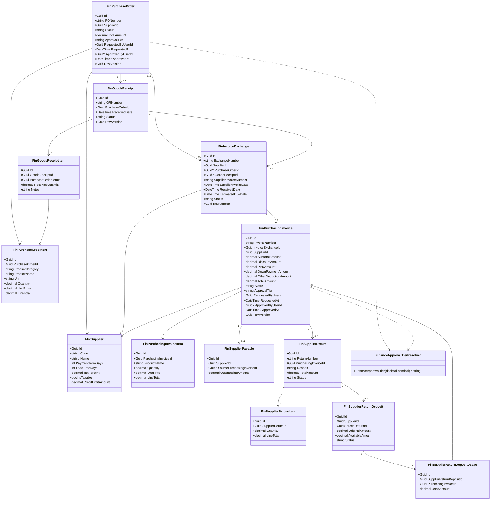
```mermaid
classDiagram
    class MstSupplier {
        +Guid Id
        +string Code
        +string Name
        +int PaymentTermDays
        +int LeadTimeDays
        +decimal TaxPercent
        +bool IsTaxable
        +decimal CreditLimitAmount
    }
    class FinPurchaseOrder {
        +Guid Id
        +string PONumber
        +Guid SupplierId
        +string Status
        +decimal TotalAmount
        +string ApprovalTier
        +Guid RequestedByUserId
        +DateTime RequestedAt
        +Guid? ApprovedByUserId
        +DateTime? ApprovedAt
        +Guid RowVersion
    }
    class FinPurchaseOrderItem {
        +Guid Id
        +Guid PurchaseOrderId
        +string ProductCategory
        +string ProductName
        +string Unit
        +decimal Quantity
        +decimal UnitPrice
        +decimal LineTotal
    }
    class FinGoodsReceipt {
        +Guid Id
        +string GRNumber
        +Guid PurchaseOrderId
        +DateTime ReceivedDate
        +string Status
        +Guid RowVersion
    }
    class FinGoodsReceiptItem {
        +Guid Id
        +Guid GoodsReceiptId
        +Guid PurchaseOrderItemId
        +decimal ReceivedQuantity
        +string Notes
    }
    class FinInvoiceExchange {
        +Guid Id
        +string ExchangeNumber
        +Guid SupplierId
        +Guid? PurchaseOrderId
        +Guid? GoodsReceiptId
        +string SupplierInvoiceNumber
        +DateTime SupplierInvoiceDate
        +DateTime ReceivedDate
        +DateTime EstimatedDueDate
        +string Status
        +Guid RowVersion
    }
    class FinPurchasingInvoice {
        +Guid Id
        +string InvoiceNumber
        +Guid InvoiceExchangeId
        +Guid SupplierId
        +decimal SubtotalAmount
        +decimal DiscountAmount
        +decimal PPNAmount
        +decimal DownPaymentAmount
        +decimal OtherDeductionAmount
        +decimal TotalAmount
        +string Status
        +string ApprovalTier
        +Guid RequestedByUserId
        +DateTime RequestedAt
        +Guid? ApprovedByUserId
        +DateTime? ApprovedAt
        +Guid RowVersion
    }
    class FinPurchasingInvoiceItem {
        +Guid Id
        +Guid PurchasingInvoiceId
        +string ProductName
        +decimal Quantity
        +decimal UnitPrice
        +decimal LineTotal
    }
    class FinSupplierPayable {
        +Guid Id
        +Guid SupplierId
        +Guid? SourcePurchasingInvoiceId
        +decimal OutstandingAmount
    }
    class FinSupplierReturn {
        +Guid Id
        +string ReturnNumber
        +Guid PurchasingInvoiceId
        +string Reason
        +decimal TotalAmount
        +string Status
    }
    class FinSupplierReturnItem {
        +Guid Id
        +Guid SupplierReturnId
        +decimal Quantity
        +decimal LineTotal
    }
    class FinSupplierReturnDeposit {
        +Guid Id
        +Guid SupplierId
        +Guid SourceReturnId
        +decimal OriginalAmount
        +decimal AvailableAmount
        +string Status
    }
    class FinSupplierReturnDepositUsage {
        +Guid Id
        +Guid SupplierReturnDepositId
        +Guid PurchasingInvoiceId
        +decimal UsedAmount
    }
    class FinanceApprovalTierResolver {
        +ResolveApprovalTier(decimal nominal) string
    }

    FinPurchaseOrder "1" --> "*" FinPurchaseOrderItem
    FinPurchaseOrder "1" --> "0..*" FinGoodsReceipt
    FinGoodsReceipt "1" --> "*" FinGoodsReceiptItem
    FinGoodsReceiptItem --> FinPurchaseOrderItem
    FinPurchaseOrder "0..1" --> "0..*" FinInvoiceExchange
    FinGoodsReceipt "0..1" --> "0..*" FinInvoiceExchange
    FinInvoiceExchange "1" --> "1" FinPurchasingInvoice
    FinPurchasingInvoice "1" --> "*" FinPurchasingInvoiceItem
    FinPurchasingInvoice "1" --> "0..1" FinSupplierPayable
    FinPurchasingInvoice "1" --> "0..*" FinSupplierReturn
    FinSupplierReturn "1" --> "*" FinSupplierReturnItem
    FinSupplierReturn "1" --> "0..1" FinSupplierReturnDeposit
    FinSupplierReturnDeposit "1" --> "*" FinSupplierReturnDepositUsage
    FinSupplierReturnDepositUsage --> FinPurchasingInvoice
    FinPurchaseOrder --> MstSupplier
    FinInvoiceExchange --> MstSupplier
    FinPurchasingInvoice --> MstSupplier
    FinPurchaseOrder ..> FinanceApprovalTierResolver
    FinPurchasingInvoice ..> FinanceApprovalTierResolver
```

## C.4 Class diagram — rumpun AR Invoice Agregat

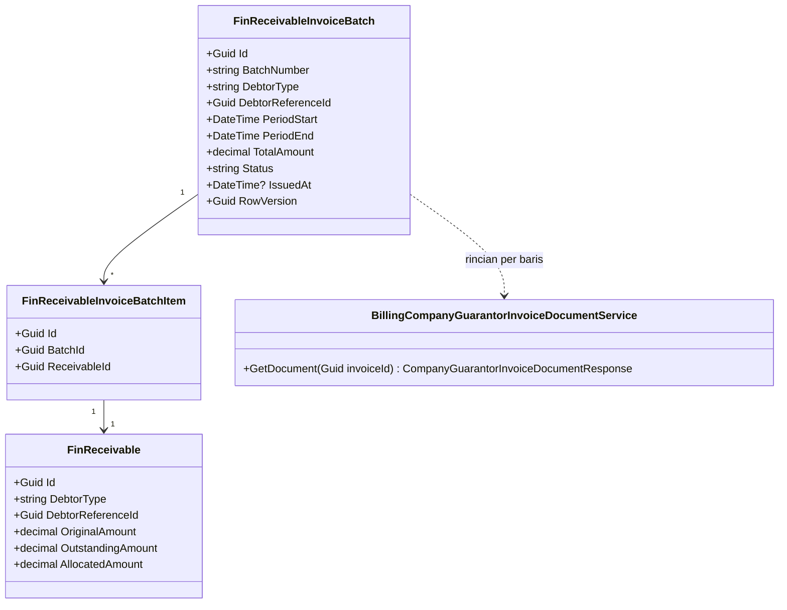
```mermaid
classDiagram
    class FinReceivable {
        +Guid Id
        +string DebtorType
        +Guid DebtorReferenceId
        +decimal OriginalAmount
        +decimal OutstandingAmount
        +decimal AllocatedAmount
    }
    class FinReceivableInvoiceBatch {
        +Guid Id
        +string BatchNumber
        +string DebtorType
        +Guid DebtorReferenceId
        +DateTime PeriodStart
        +DateTime PeriodEnd
        +decimal TotalAmount
        +string Status
        +DateTime? IssuedAt
        +Guid RowVersion
    }
    class FinReceivableInvoiceBatchItem {
        +Guid Id
        +Guid BatchId
        +Guid ReceivableId
    }
    class BillingCompanyGuarantorInvoiceDocumentService {
        +GetDocument(Guid invoiceId) CompanyGuarantorInvoiceDocumentResponse
    }

    FinReceivableInvoiceBatch "1" --> "*" FinReceivableInvoiceBatchItem
    FinReceivableInvoiceBatchItem "1" --> "1" FinReceivable
    FinReceivableInvoiceBatch ..> BillingCompanyGuarantorInvoiceDocumentService : rincian per baris
```

## C.5 Class diagram — rumpun Potongan AR

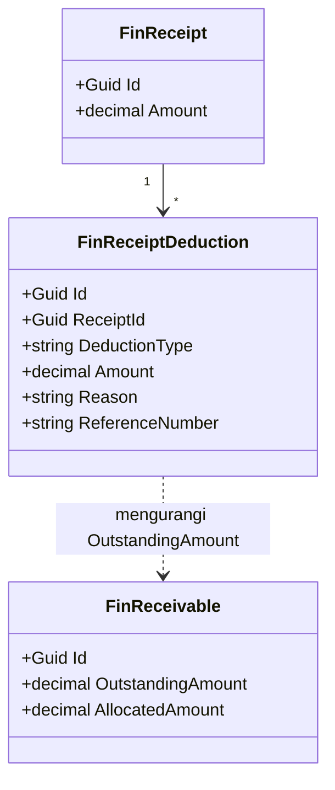
```mermaid
classDiagram
    class FinReceivable {
        +Guid Id
        +decimal OutstandingAmount
        +decimal AllocatedAmount
    }
    class FinReceipt {
        +Guid Id
        +decimal Amount
    }
    class FinReceiptDeduction {
        +Guid Id
        +Guid ReceiptId
        +string DeductionType
        +decimal Amount
        +string Reason
        +string ReferenceNumber
    }

    FinReceipt "1" --> "*" FinReceiptDeduction
    FinReceiptDeduction ..> FinReceivable : mengurangi OutstandingAmount
```

## C.6 Penjelasan class

> **KOREKSI 25 September 2026 (ditemukan saat `/plan-module-delivery` membaca source).** Versi
> awal tabel ini dan pohon C.7 memuat tiga kekeliruan terhadap pola yang **sudah berjalan** di
> repository: (1) service dan controller memakai prefix `Fin…` padahal seluruh service/controller
> Finance memakai `Finance…` (`FinancePaymentService`, `FinanceReceiptsController`); (2) EF
> configuration ditaruh di `Areas/…/Configurations/` padahal seluruhnya ada di
> `Repositories/Configurations/Corporate/FinanceManagement/<Submodul>/` (DoD backend #10);
> (3) `FinReceipt`, `FinanceReceiptService`, dan `FinanceReceiptsController` berada di submodul
> **`Collection`**, bukan `Receivable` — sehingga `FinReceiptDeduction` ikut ke `Collection`.
> Nama **entity** (`Fin…`) dan nama tabel **tidak berubah**; yang dikoreksi hanya nama
> service/controller dan lokasi berkas. Tabel di bawah adalah versi yang berlaku.

| Class | Status | Lokasi file |
|---|---|---|
| `FinPurchaseOrder`, `FinPurchaseOrderItem` | Baru | `Areas/Corporate/FinanceManagement/Purchasing/Models/` |
| `FinGoodsReceipt`, `FinGoodsReceiptItem` | Baru | `Areas/Corporate/FinanceManagement/Purchasing/Models/` |
| `FinInvoiceExchange` | Baru | `Areas/Corporate/FinanceManagement/Purchasing/Models/` |
| `FinPurchasingInvoice`, `FinPurchasingInvoiceItem` | Baru | `Areas/Corporate/FinanceManagement/Purchasing/Models/` |
| `FinSupplierReturn`, `FinSupplierReturnItem` | Baru | `Areas/Corporate/FinanceManagement/Purchasing/Models/` |
| `FinSupplierReturnDeposit`, `FinSupplierReturnDepositUsage` | Baru | `Areas/Corporate/FinanceManagement/Purchasing/Models/` |
| Sebelas configuration entity Purchasing | Baru | `Repositories/Configurations/Corporate/FinanceManagement/Purchasing/Fin…Configuration.cs` |
| `FinSupplierPayable` | Diperbarui — kolom `SourcePurchasingInvoiceId` (nullable, FK `SetNull`) | `Areas/Corporate/FinanceManagement/Payable/Models/FinSupplierPayable.cs`; configuration `Repositories/Configurations/Corporate/FinanceManagement/Payable/FinSupplierPayableConfiguration.cs` |
| `FinanceApprovalTierResolver` (+ `ApprovalTiers` dipindah ke sini) | Baru — ekstraksi `FinancePaymentService.ResolveApprovalTier`, batas `>= 50.000.000 → TIER_2` (lihat koreksi `FIN-DES-039`) | `Areas/Corporate/FinanceManagement/Payable/Services/FinanceApprovalTierResolver.cs` |
| `FinancePaymentService` | Diperbarui — memanggil resolver; komentar "provisional" dicabut | `Areas/Corporate/FinanceManagement/Payable/Services/FinancePaymentService.cs` |
| `FinancePurchaseOrderService` | Baru — buat/ubah/ajukan/setujui/tolak/batal PO | `Areas/Corporate/FinanceManagement/Purchasing/Services/` |
| `FinanceGoodsReceiptService` | Baru — catat/batalkan penerimaan barang, perbarui status PO | `Areas/Corporate/FinanceManagement/Purchasing/Services/` |
| `FinanceInvoiceExchangeService` | Baru — catat/batalkan Tukar Faktur, hitung `EstimatedDueDate` | `Areas/Corporate/FinanceManagement/Purchasing/Services/` |
| `FinancePurchasingInvoiceService` | Baru — siklus Purchasing Invoice; saat `APPROVED` membuat `FinSupplierPayable` dan menulis outbox `PPN-MASUKAN-PEMBELIAN` dalam satu transaksi | `Areas/Corporate/FinanceManagement/Purchasing/Services/` |
| `FinanceSupplierReturnService` | Baru — retur, terbitkan dan pakai Deposit Retur | `Areas/Corporate/FinanceManagement/Purchasing/Services/` |
| `FinancePurchasingReportService` | Baru — lima laporan read-only | `Areas/Corporate/FinanceManagement/Purchasing/Services/` |
| `FinancePurchaseOrdersController`, `FinanceGoodsReceiptsController`, `FinanceInvoiceExchangesController`, `FinancePurchasingInvoicesController`, `FinanceSupplierReturnsController`, `FinancePurchasingReportsController` | Baru | `Areas/Corporate/FinanceManagement/Purchasing/Controllers/` |
| `FinReceivableInvoiceBatch`, `FinReceivableInvoiceBatchItem` | Baru | `Areas/Corporate/FinanceManagement/Receivable/Models/`; configuration di `Repositories/Configurations/Corporate/FinanceManagement/Receivable/` |
| `FinanceReceivableInvoiceBatchService` | Baru — kelompokkan `FinReceivable`, terbitkan batch, rujuk dokumen per-invoice Billing. **MUST NOT** menulis `FinReceivable.OutstandingAmount` (`FinanceReceivableService` tetap satu-satunya penulis, DoD backend #13) | `Areas/Corporate/FinanceManagement/Receivable/Services/` |
| `FinanceReceivableInvoiceBatchesController` | Baru | `Areas/Corporate/FinanceManagement/Receivable/Controllers/` |
| `FinReceiptDeduction` | Baru | `Areas/Corporate/FinanceManagement/Collection/Models/`; configuration di `Repositories/Configurations/Corporate/FinanceManagement/Collection/` |
| `FinanceReceiptService` | Diperbarui — catat potongan; efeknya ke piutang **disalurkan lewat** `FinanceReceivableService.ApplyAllocationAsync` yang sudah ada, bukan ditulis langsung | `Areas/Corporate/FinanceManagement/Collection/Services/FinanceReceiptService.cs` |
| `FinanceReceiptsController` | Diperbarui — `GET`/`POST /receipts/{id}/deductions` | `Areas/Corporate/FinanceManagement/Collection/Controllers/FinanceReceiptsController.cs` |
| `BillingManagementServiceCollectionExtensions` | Diperbarui — registrasi DI tujuh service baru + resolver | `Areas/HealthServices/BillingManagement/Billing/BillingManagementServiceCollectionExtensions.cs` |
| `ApplicationDbContext` | Diperbarui — empat belas `DbSet` baru | `Repositories/ApplicationDbContext.cs` |
| `BillingCompanyGuarantorInvoiceDocumentService` | Sudah ada — dipanggil, tidak diubah | `Areas/HealthServices/BillingManagement/Billing/Services/BillingCompanyGuarantorInvoiceDocumentService.cs` |
| `MstSupplier` | Sudah ada — tidak diubah | `Areas/Administrator/MasterData/Models/MstSupplier.cs` |

**Utang teknis yang diikuti, bukan ditiru diam-diam.** Seluruh service Finance hari ini
didaftarkan DI di `BillingManagementServiceCollectionExtensions.cs` (milik Billing) — preseden
`BE-FIN-017`/`019`/`020`. Revisi ini **mengikuti** preseden itu agar tidak membuat dua titik
registrasi, dan **mencatatnya** sebagai utang teknis. Memindahkannya ke berkas registrasi milik
Finance adalah pekerjaan terpisah yang tidak dicakup revisi ini.

## C.7 Arsitektur folder

```text
Areas/Corporate/FinanceManagement/
├── Purchasing/                                   (Baru — submodul ketujuh, WAJIB didaftarkan
│   │                                              di registry sebelum model pertama)
│   ├── Models/          11 entity                 (Baru)
│   ├── Dtos/            per entity: Create/Update/Response/PagedQuery + Approve/Reject/Cancel
│   ├── Services/        FinancePurchaseOrderService, FinanceGoodsReceiptService,
│   │                    FinanceInvoiceExchangeService, FinancePurchasingInvoiceService,
│   │                    FinanceSupplierReturnService, FinancePurchasingReportService   (Baru)
│   └── Controllers/     enam Finance…Controller   (Baru)
├── Payable/
│   ├── Models/FinSupplierPayable.cs                    (Diperbarui)
│   └── Services/FinanceApprovalTierResolver.cs         (Baru)
│              FinancePaymentService.cs                 (Diperbarui)
├── Receivable/
│   ├── Models/FinReceivableInvoiceBatch.cs, …Item.cs   (Baru)
│   ├── Dtos/                                           (Baru)
│   ├── Services/FinanceReceivableInvoiceBatchService.cs        (Baru)
│   └── Controllers/FinanceReceivableInvoiceBatchesController.cs (Baru)
└── Collection/
    ├── Models/FinReceiptDeduction.cs                   (Baru)
    ├── Services/FinanceReceiptService.cs               (Diperbarui)
    └── Controllers/FinanceReceiptsController.cs        (Diperbarui)

Repositories/Configurations/Corporate/FinanceManagement/
├── Purchasing/       11 configuration              (Baru)
├── Payable/FinSupplierPayableConfiguration.cs      (Diperbarui)
├── Receivable/       2 configuration               (Baru)
└── Collection/FinReceiptDeductionConfiguration.cs  (Baru)
```

**Satu prasyarat struktur baru:** folder `Purchasing/` belum terdaftar di
`docs/engineering/MODULE_OWNERSHIP_PREFIX_REGISTRY.md`. Enam submodul yang ada didaftarkan
eksplisit lewat `BE-FIN-001` (`FIN-DES-002`); `Purchasing` MUST mengikuti prosedur yang sama —
baris `Corporate / Finance | FinanceManagement / Purchasing / Pembelian | … | Fin | ACTIVE` —
sebelum file model pertama ditulis (`QBE-MOD-003`). Prefix tetap `Fin`, tidak ada prefix baru.

## C.8 Status model dan dampak migration

| Entity | Status | Kolom yang berubah |
|---|---|---|
| `FinPurchaseOrder` | Baru | Seluruh kolom baru (lihat C.3) |
| `FinPurchaseOrderItem` | Baru | Seluruh kolom baru |
| `FinGoodsReceipt` | Baru | Seluruh kolom baru |
| `FinGoodsReceiptItem` | Baru | Seluruh kolom baru |
| `FinInvoiceExchange` | Baru | Seluruh kolom baru |
| `FinPurchasingInvoice` | Baru | Seluruh kolom baru |
| `FinPurchasingInvoiceItem` | Baru | Seluruh kolom baru |
| `FinSupplierReturn` | Baru | Seluruh kolom baru |
| `FinSupplierReturnItem` | Baru | Seluruh kolom baru |
| `FinSupplierReturnDeposit` | Baru | Seluruh kolom baru |
| `FinSupplierReturnDepositUsage` | Baru | Seluruh kolom baru |
| `FinReceivableInvoiceBatch` | Baru | Seluruh kolom baru |
| `FinReceivableInvoiceBatchItem` | Baru | Seluruh kolom baru |
| `FinReceiptDeduction` | Baru | Seluruh kolom baru |
| `FinSupplierPayable` | Diperbarui | Tambah `SourcePurchasingInvoiceId Guid?` (FK ke `FinPurchasingInvoice`, `ON DELETE SET NULL`, nullable — baris lama tetap `NULL`) |
| `FinPayment` | Diperbarui (non-skema) | Tidak ada kolom baru — hanya komentar kode yang diperbarui (C.2, `FIN-DES-039`) |

Status model tiap entity transaksional baru mengikuti pola `Draft/PendingApproval/Approved/
Rejected/Cancelled` yang sudah dipakai `FinPayment` (kecuali `FinGoodsReceipt`/`FinInvoiceExchange`
yang lebih sederhana: `Received/Cancelled` dan `Received/LinkedToInvoice/Cancelled`), dijabarkan
penuh di `contracts/state-transition-matrix.md`.

## C.9 Rencana migration

1. Migration tunggal `AddPurchasingApRumpun` mencakup 11 tabel baru rumpun Purchasing/AP —
   seluruhnya `CREATE TABLE`, tidak mengganggu tabel yang sudah ada, dapat dijalankan tanpa
   mematikan layanan.
2. Migration kedua `AddArInvoiceBatchAndReceiptDeduction` mencakup `FinReceivableInvoiceBatch`,
   `FinReceivableInvoiceBatchItem`, `FinReceiptDeduction` — juga murni `CREATE TABLE`.
3. Migration ketiga `AddSourcePurchasingInvoiceIdToSupplierPayable` menambah satu kolom nullable
   ke `FinSupplierPayable` — aman dijalankan tanpa downtime, tidak butuh pengisian data lama
   (baris lama valid dengan `NULL`).
4. Ketiganya dipisah (bukan satu migration raksasa) supaya urutan dependency FK jelas dan mudah
   di-rollback satu-satu bila salah satu gagal — migration 2 dan 3 tidak bergantung pada isi data
   migration 1, hanya pada skema-nya.
5. Tidak ada langkah pengisian data lama (backfill) yang dibutuhkan — seluruh tabel baru kosong
   di awal, dan kolom baru pada `FinSupplierPayable` valid `NULL` untuk baris lama.
6. Langkah mundur bila gagal: `DROP TABLE` sesuai urutan FK terbalik untuk migration 1 dan 2;
   `DROP COLUMN SourcePurchasingInvoiceId` untuk migration 3. Seperti seluruh dokumen ini, bagian
   ini **hanya rencana** — wewenang membuat dan menjalankan migration tetap terpisah dan
   membutuhkan otorisasi eksplisit sendiri.

## C.10 Rencana data master awal

`MstSupplier` sudah punya data (tidak kosong) — tidak ada kebutuhan seed baru untuk rumpun ini.
Katalog `ApprovalTiers.Tier1`/`Tier2` sudah berupa konstanta kode (bukan tabel), dipakai ulang
apa adanya. Tidak ada tabel master baru yang lahir dari amendment ini — seluruh entity baru
bersifat transaksional (PO, Tukar Faktur, Purchasing Invoice, dst.), bukan master data, sehingga
bagian ini tidak berlaku secara substansial (mengikuti aturan skill: file/bagian tetap ditulis
dengan satu baris alasan, bukan dikosongkan).

## C.11 Yang sengaja tidak dibuat pada amendment ini

| Yang ditolak | Alasan |
|---|---|
| `MstProduct`/`MstItem` sebagai katalog produk pembelian | Tidak ada permintaan eksplisit untuk katalog produk terstruktur; `Keuangan.md` menyebut "Kategori Produk, Nama Produk, Satuan" sebagai field deskriptif, bukan referensi ke master. `FinPurchaseOrderItem`/`FinPurchasingInvoiceItem` memakai kolom teks bebas. Bila ke depan dibutuhkan katalog terstruktur, ini keputusan terpisah yang butuh scope baru |
| `FinGoodsReceipt` tanpa `PurchaseOrderId` (nullable) | Tidak ada keputusan eksplisit yang meminta penerimaan barang tanpa PO mendahului; berbeda dari Tukar Faktur yang eksplisit diizinkan tanpa PO (`FIN-DEC-051`). Menjaga `PurchaseOrderId` wajib mencegah kapabilitas yang tidak diminta ikut terbangun diam-diam |
| Menghapus jalur input manual `FinSupplierPayable` | Tidak ada keputusan yang meminta deprekasi; beberapa supplier mungkin belum onboarding ke alur PO. Menghapusnya adalah keputusan produk terpisah di luar scope amendment ini |
| Kode kejadian akuntansi baru untuk pengakuan utang supplier (nilai pokok, bukan PPN) | Belum diusulkan ke Accounting — `evidence/06` hanya mengusulkan kode PPN Masukan. Mengusulkan keduanya sekaligus tanpa keputusan terpisah berisiko keliru menggabungkan dua kejadian yang lawan jurnalnya berbeda (lihat `evidence/06` bagian 2) |
| Tabel Accounting/COA untuk PPN Masukan di sisi Finance | Akun dan waktu pengakuan adalah wewenang Accounting (`evidence/06` bagian 3), bukan sesuatu yang diusulkan/dibangun Finance |
| Satu tabel gabungan untuk `FinPaymentDeduction` dan `FinReceiptDeduction` | Arah aliran dan invariant-nya berlawanan (`FIN-DEC-049`, `FIN-DEC-055`) — menggabungkannya memaksa satu tabel menampung dua semantik berbeda, meniru kesalahan yang sudah pernah dikoreksi pada `FIN-DEC-032` (kode gabungan uang muka) |
| `FinReceivableInvoiceBatch` menggantikan `FinReceivable`/`BilInvoice` sebagai unit internal | `FIN-DEC-048` eksplisit menyatakan batch adalah lapisan baru DI ATAS unit yang sudah ada, bukan pengganti — mengubah `FinReceivable` jadi unit sekunder akan memaksa migrasi ulang seluruh rumpun AR yang sudah berjalan (`FIN-DES-010`..`013`) tanpa keputusan yang memintanya |
| Endpoint kirim otomatis kejadian `PPN-MASUKAN-PEMBELIAN` tanpa feature gate | `FIN-DEC-046` menetapkan ratifikasi Accounting sebagai syarat keras sebelum rumpun ini masuk `/plan-module-delivery` — mengaktifkan pengiriman tanpa gate melanggar keputusan itu langsung |


# AMENDMENT REVISI 5 — Sumber Dana Deposit Retur dan Jalur Potongan AR

## D.1 Mengapa amendment ini ada

Amendment ini menggambar skema yang dituntut empat keputusan yang sudah `approved`:
`FIN-DEC-057` (Deposit Retur dipakai di dalam `FinPayment`), `FIN-DEC-058` (kode kejadian
potongan AR), `FIN-DEC-061` (kode kejadian retur dan pemakaian deposit), dan `FIN-DEC-062`
(kode pembalikan potongan AR). Keputusan bisnisnya sudah turun; yang belum ada adalah
bentuk tabel dan urutan transaksi yang mewujudkannya.

Pembacaan source pada `96bf9746` menemukan **dua kekurangan** pada rancangan REVISI 4 yang
ikut diperbaiki di sini, karena keduanya membuat `BE-FIN-036` dan `BE-FIN-040` tidak dapat
dibangun apa adanya:

| # | Kekurangan pada REVISI 4 | Akibat bila dibangun apa adanya |
|---|---|---|
| 1 | `FinSupplierReturnDepositUsage.PurchasingInvoiceId` menunjuk invoice, bukan pembayaran | Pemakaian deposit tidak punya tempat di siklus `FinPayment`, padahal `FIN-DEC-057` menaruhnya di sana. Invoice `APPROVED` juga sudah beku (`FIN-STATE-1.2` B.4) |
| 2 | `FinReceiptDeduction` hanya punya `ReceiptId` | Satu penerimaan dapat dialokasikan ke banyak piutang — tidak ada cara tahu piutang **mana** yang dikurangi PPh 23-nya |

Keduanya menyentuh tabel yang **belum dibangun** (`BE-FIN-030`, `BE-FIN-038` belum
dikerjakan), sehingga koreksinya tidak menuntut pembetulan data. Satu-satunya tabel **yang
sudah berjalan** yang berubah adalah `FinPayment` (satu kolom baru, satu check constraint
diganti) — lihat D.6.

## D.2 Keputusan arsitektur baru

### FIN-DES-045 — Deposit Retur sebagai baris sumber dana di tingkat pembayaran

`FIN-DEC-057` menyebut deposit dipakai sebagai "baris alokasi non-tunai di dalam `FinPayment`".
Desain ini mewujudkannya sebagai **baris sumber dana di tingkat pembayaran**, bukan penanda
pada tiap `FinPaymentAllocation`. Alasannya satu dan bersifat teknis, bukan keputusan bisnis
baru:

> `FIN-VAL-057` melarang satu utang muncul dua kali dalam satu pembayaran. Bila sumber dana
> ditandai per baris alokasi, satu faktur yang dilunasi "Rp 3.000.000 transfer + Rp 2.000.000
> deposit" butuh dua baris alokasi ke utang yang sama — langsung ditolak aturan itu.

Pola baris sumber dana di tingkat pembayaran **sudah ada** dan sudah berjalan:
`FinPaymentDeduction` (`FIN-DES-026`). Deposit mengikuti bentuk yang sama.

| Hal | Ketentuan |
|---|---|
| Alokasi ke utang | **Tidak berubah.** `FinPaymentAllocation` tetap melunasi utang sebesar nilai penuhnya; `OutstandingAmount` berkurang lewat `FinancePaymentService.MarkPaidAsync` yang sudah ada — nol penulis baru |
| Sumber dana deposit | `FinSupplierReturnDepositUsage` kini menunjuk `PaymentId` (bukan lagi `PurchasingInvoiceId`) |
| Uang yang benar-benar keluar | `NetTransferAmount = TotalAmount − DeductionAmount + AdditionAmount − DepositAppliedAmount` |
| Kolom baru pada `FinPayment` | `DepositAppliedAmount` — jumlah baris pemakaian deposit yang belum dilepas |
| Siapa boleh memakai deposit | Hanya `PaymentType = SUPPLIER`, dan hanya deposit milik supplier yang sama dengan `PayeeReferenceId` pembayaran |
| Kapan boleh ditambah/dilepas | Hanya selama pembayaran `DRAFT` — sama persis dengan aturan potongan (`FIN-STATE-0.2` A.2) |

**Contoh berangka.** Utang ke PT Contoh Farma dua faktur: Rp 6.000.000 dan Rp 4.000.000. Ada
Deposit Retur Rp 2.500.000 dari retur bulan lalu.

| Komponen | Nilai |
|---|---|
| `TotalAmount` (dua alokasi) | Rp 10.000.000 |
| `DepositAppliedAmount` | Rp 2.500.000 |
| `NetTransferAmount` | Rp 7.500.000 — yang benar-benar ditransfer |
| Sisa kedua utang sesudah `PAID` | Rp 0 dan Rp 0 |
| Sisa deposit | Rp 0 → deposit `EXHAUSTED` |

### FIN-DES-046 — Reservasi deposit dan pelepasannya

Deposit **dicadangkan** saat baris pemakaian ditambahkan ke pembayaran `DRAFT`, bukan saat
pembayaran `PAID`. Alasan: bila baru dikurangi saat `PAID`, dua pembayaran `DRAFT` dapat
sama-sama memakai deposit yang sama dan baru bertabrakan di ujung — setelah keduanya disetujui.

| Kejadian pada pembayaran | Status baris pemakaian | `AvailableAmount` deposit |
|---|---|---|
| Baris ditambahkan (pembayaran `DRAFT`) | `RESERVED` | Berkurang seketika |
| Baris dilepas oleh petugas (masih `DRAFT`) | `RELEASED` | Kembali |
| Pembayaran `REJECTED` atau `CANCELLED` | Seluruh baris `RESERVED` → `RELEASED` | Kembali |
| Pembayaran `PAID` | Seluruh baris `RESERVED` → `APPLIED` | Tidak bergerak lagi (sudah dikurangi saat reservasi) |

Baris **tidak pernah dihapus** — pelepasan adalah perubahan status, sehingga jejak "deposit ini
pernah dicadangkan lalu dilepas" tetap terbaca. Penulisan `AvailableAmount` hanya oleh
`FinanceSupplierReturnService`; `FinancePaymentService` memanggilnya, tidak menulis kolom deposit
sendiri. Seluruhnya `Serializable` dengan kunci `FIN_RETURN_DEPOSIT_{id}` dan `RowVersion`
deposit.

### FIN-DES-047 — Kejadian Accounting untuk retur dan pemakaian deposit (`FIN-DEC-061`)

| Kapan | Kode | `SourceTransactionId` | `Amount` |
|---|---|---|---|
| Retur `CONFIRMED` | `RETUR-PEMBELIAN` (ke-28) | `ReturnNumber` | `FinSupplierReturn.TotalAmount` |
| Pembayaran `PAID` dengan `DepositAppliedAmount > 0` | `PEMAKAIAN-DEPOSIT-RETUR` (ke-29) | `PaymentNumber` | `DepositAppliedAmount` |
| Pembayaran `PAID` (yang sudah ada) | `AP_PAYMENT` | `PaymentNumber` | **`TotalAmount − DepositAppliedAmount`** — sebelumnya `TotalAmount` |

**Satu perubahan pada kode yang sudah berjalan:** `FinancePaymentService.MarkPaidAsync`
(baris 553-563) menulis `Amount = payment.TotalAmount`. Sesudah amendment ini nilainya
dikurangi `DepositAppliedAmount`. Untuk seluruh pembayaran yang **tidak** memakai deposit,
`DepositAppliedAmount = 0` sehingga nilainya **identik** dengan hari ini — nol perubahan
perilaku bagi pembayaran lama.

**Pembayaran yang seluruhnya dilunasi deposit** (`TotalAmount − DepositAppliedAmount = 0`) **tidak**
menulis `AP_PAYMENT` sama sekali — `FIN-VAL-079` menolak kejadian bernilai nol, dan memang tidak
ada uang yang bergerak. Hanya `PEMAKAIAN-DEPOSIT-RETUR` yang terbit.

**Keterbatasan yang sudah ada dan tidak diubah amendment ini:** `AP_PAYMENT` memakai
`Components = TOTAL` (`FIN-DEC-038`), sehingga potongan (`DeductionAmount`) tetap tidak terpisah
di kejadian. Amendment ini hanya memisahkan porsi deposit, karena porsi itulah yang tanpa
pemisahan membukukan kas keluar untuk uang yang tidak pernah bergerak.

### FIN-DES-048 — Potongan AR melekat pada baris alokasi, dicatat bersama alokasinya

Menggantikan bentuk `FinReceiptDeduction` pada `FIN-DES-042`/`data-dictionary.md` C.15.

| Hal | Ketentuan |
|---|---|
| Melekat pada | `FinReceiptAllocation` (kolom baru `ReceiptAllocationId`) — alokasi itulah yang menyebut piutang mana (`ReceivableId`) |
| Syarat alokasi | Hanya alokasi `TargetType = RECEIVABLE` yang bukan baris pembalik. Alokasi `INVOICE_DIRECT` tidak punya piutang untuk dikurangi |
| Kapan dicatat | **Dalam permintaan yang sama** dengan alokasinya: `AllocateReceiptRequest` diperluas, tiap baris alokasi boleh membawa daftar potongan. Endpoint `POST /receipts/{id}/deductions` terpisah **dicabut** — setelah uang penerimaan habis teralokasi, `FIN-VAL-120` akan menolaknya, sehingga petugas tidak pernah bisa memakainya pada kasus PPh 23 biasa |
| Efek ke piutang | `FinanceReceiptService` memanggil `FinanceReceivableService.ApplyAllocationAsync(receivableId, deduction.Amount)` yang **sudah ada** — nilai masuk `AllocatedAmount`, sesuai `FIN-DES-042`/`FIN-DEC-055`. Nol penulis `OutstandingAmount` baru |
| Batas nilai | Uang alokasi + seluruh potongan pada baris itu ≤ sisa piutang (perluasan `FIN-VAL-033`). Potongan **tidak** memakai uang penerimaan, sehingga `UnallocatedAmount` tidak bergerak karenanya |
| Nomor | Kolom baru `DeductionNumber` (unik) — dipakai sebagai `SourceTransactionId` kejadian. Tanpa nomor sendiri, dua potongan pada satu penerimaan (PPh 23 **dan** biaya bank) akan berbagi kunci kejadian dan yang kedua terbaca sebagai koreksi yang pertama |

**Contoh berangka.** Piutang PT Asuransi Contoh Rp 10.000.000. Transfer masuk Rp 9.745.000.

| Baris dalam satu permintaan alokasi | Nilai | Efek |
|---|---|---|
| Alokasi uang | Rp 9.745.000 | `UnallocatedAmount` penerimaan → Rp 0 |
| Potongan `PPH23` | Rp 230.000 | `AllocatedAmount` piutang +230.000 |
| Potongan `BANK_ADMIN_FEE` | Rp 25.000 | `AllocatedAmount` piutang +25.000 |
| Sisa piutang | **Rp 0** — `SETTLED` | |

Kejadian yang terbit: satu kejadian penerimaan untuk Rp 9.745.000 (jalur yang sudah ada), dan
**dua** `POTONGAN-PIUTANG-NON-TUNAI` — Rp 230.000 dan Rp 25.000, masing-masing dengan
`DeductionNumber` sendiri.

### FIN-DES-049 — Pembalikan potongan AR (`FIN-DEC-062`)

Saat sebuah alokasi dibalik — manual oleh petugas, atau otomatis karena tender Billing
dibatalkan (`FIN-DEC-021`) — **seluruh potongan pada alokasi itu ikut dibalik dalam transaksi
yang sama**:

1. Untuk tiap `FinReceiptDeduction` pada alokasi itu, dibuat baris pembalik (`IsReversal = true`,
   `ReversalOfDeductionId` menunjuk baris asli, `DeductionNumber` baru).
2. `FinanceReceivableService.ReverseAllocationAsync(receivableId, deduction.Amount)` yang
   **sudah ada** dipanggil untuk tiap baris — piutang terbuka kembali.
3. Satu kejadian `PEMBALIKAN-POTONGAN-PIUTANG-NON-TUNAI` per baris pembalik, `Amount` positif.

Potongan **tidak dapat dibalik sendirian** tanpa membalik alokasinya. Potongan yang keliru
dibetulkan dengan membalik alokasinya lalu mencatat ulang — sama seperti `FIN-STATE-1.2` B.8.

### FIN-DES-050 — Kejadian potongan AR (`FIN-DEC-058`)

| Kapan | Kode | `SourceTransactionId` | `Amount` |
|---|---|---|---|
| Potongan dicatat | `POTONGAN-PIUTANG-NON-TUNAI` (ke-26) | `DeductionNumber` | `FinReceiptDeduction.Amount` |
| Potongan dibalik | `PEMBALIKAN-POTONGAN-PIUTANG-NON-TUNAI` (ke-27) | `DeductionNumber` baris pembalik | `Amount` baris asli, positif |

Kode **tidak pernah** `AR_PAYMENT`, `PENERIMAAN-PIUTANG`, maupun `PENYESUAIAN-PIUTANG`.

## D.3 Tabel kepemilikan data — perubahan

Tidak ada kelompok data baru dan tidak ada pemilik yang berubah. Yang berubah hanya bentuk dua
tabel Finance yang belum dibangun, dan satu kolom pada tabel Finance yang sudah berjalan.

| Kelompok data | Pemilik | Perubahan |
|---|---|---|
| Pembayaran keluar | Finance (`FinPayment`) | Tambah `DepositAppliedAmount`; ganti `CK_FinPayment_NetTransfer` |
| Pemakaian Deposit Retur | Finance (`FinSupplierReturnDepositUsage`) | `PurchasingInvoiceId` → `PaymentId`; tambah `Status`, `ReleasedAt`, `RowVersion` |
| Potongan AR | Finance (`FinReceiptDeduction`) | Tambah `ReceiptAllocationId`, `DeductionNumber`, `IsReversal`, `ReversalOfDeductionId` |

## D.4 Class diagram — sesudah amendment

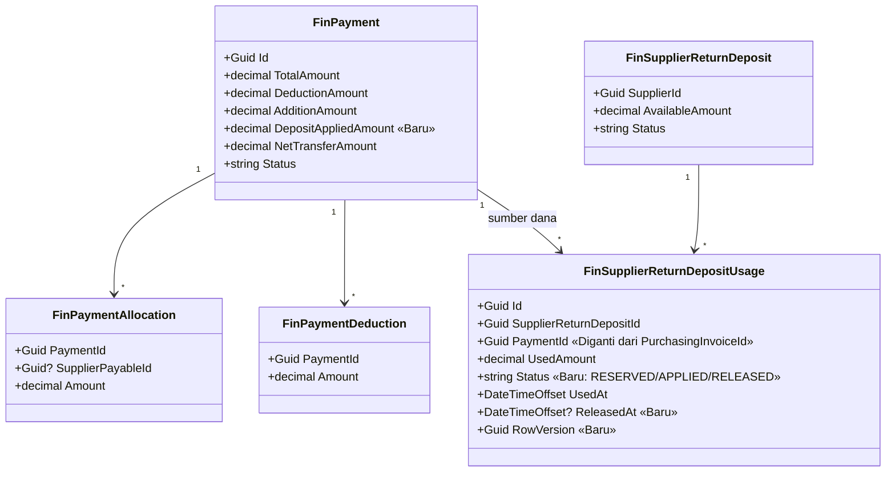
```mermaid
classDiagram
    class FinPayment {
        +Guid Id
        +decimal TotalAmount
        +decimal DeductionAmount
        +decimal AdditionAmount
        +decimal DepositAppliedAmount  «Baru»
        +decimal NetTransferAmount
        +string Status
    }
    class FinPaymentAllocation {
        +Guid PaymentId
        +Guid? SupplierPayableId
        +decimal Amount
    }
    class FinPaymentDeduction {
        +Guid PaymentId
        +decimal Amount
    }
    class FinSupplierReturnDepositUsage {
        +Guid Id
        +Guid SupplierReturnDepositId
        +Guid PaymentId  «Diganti dari PurchasingInvoiceId»
        +decimal UsedAmount
        +string Status  «Baru: RESERVED/APPLIED/RELEASED»
        +DateTimeOffset UsedAt
        +DateTimeOffset? ReleasedAt  «Baru»
        +Guid RowVersion  «Baru»
    }
    class FinSupplierReturnDeposit {
        +Guid SupplierId
        +decimal AvailableAmount
        +string Status
    }
    FinPayment "1" --> "*" FinPaymentAllocation
    FinPayment "1" --> "*" FinPaymentDeduction
    FinPayment "1" --> "*" FinSupplierReturnDepositUsage : sumber dana
    FinSupplierReturnDeposit "1" --> "*" FinSupplierReturnDepositUsage
```

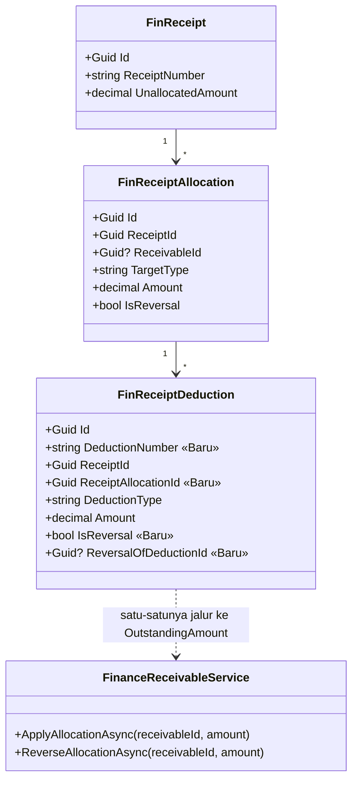
```mermaid
classDiagram
    class FinReceipt {
        +Guid Id
        +string ReceiptNumber
        +decimal UnallocatedAmount
    }
    class FinReceiptAllocation {
        +Guid Id
        +Guid ReceiptId
        +Guid? ReceivableId
        +string TargetType
        +decimal Amount
        +bool IsReversal
    }
    class FinReceiptDeduction {
        +Guid Id
        +string DeductionNumber  «Baru»
        +Guid ReceiptId
        +Guid ReceiptAllocationId  «Baru»
        +string DeductionType
        +decimal Amount
        +bool IsReversal  «Baru»
        +Guid? ReversalOfDeductionId  «Baru»
    }
    class FinanceReceivableService {
        +ApplyAllocationAsync(receivableId, amount)
        +ReverseAllocationAsync(receivableId, amount)
    }
    FinReceipt "1" --> "*" FinReceiptAllocation
    FinReceiptAllocation "1" --> "*" FinReceiptDeduction
    FinReceiptDeduction ..> FinanceReceivableService : satu-satunya jalur ke OutstandingAmount
```

## D.5 Penjelasan class — perubahan

| Class | Status | Perubahan | Lokasi file |
|---|---|---|---|
| `FinPayment` | Diperbarui | Tambah `DepositAppliedAmount` | `Areas/Corporate/FinanceManagement/Payable/Models/FinPayment.cs`; configuration `Repositories/Configurations/Corporate/FinanceManagement/Payable/FinPaymentConfiguration.cs` |
| `FinSupplierReturnDepositUsage` | Baru (bentuk dikoreksi dari REVISI 4) | Lihat D.3 | `Areas/Corporate/FinanceManagement/Purchasing/Models/`; configuration `Repositories/Configurations/Corporate/FinanceManagement/Purchasing/` |
| `FinSupplierReturnDepositUsageStatuses` | Baru | `RESERVED`, `APPLIED`, `RELEASED` — `static class`, bukan enum `int` | Idem, satu berkas dengan model |
| `FinReceiptDeduction` | Baru (bentuk dikoreksi dari REVISI 4) | Lihat D.3 | `Areas/Corporate/FinanceManagement/Collection/Models/`; configuration `Repositories/Configurations/Corporate/FinanceManagement/Collection/` |
| `FinancePaymentService` | Diperbarui | (a) `AddReturnDepositAsync`/`ReleaseReturnDepositAsync` — hanya `DRAFT`, membuka transaksi `Serializable`; (b) hitung `NetTransferAmount` dengan `DepositAppliedAmount`; (c) `SubmitAsync`: `FIN-VAL-091` hanya berlaku bila `DepositAppliedAmount = 0`; (d) `RejectAsync`/`CancelAsync`: lepas seluruh baris `RESERVED`; (e) `MarkPaidAsync`: baris → `APPLIED`, `AP_PAYMENT` bernilai `TotalAmount − DepositAppliedAmount` (dilewati bila nol), tulis `PEMAKAIAN-DEPOSIT-RETUR`; nomor bukti transfer wajib hanya bila `NetTransferAmount > 0` | `Areas/Corporate/FinanceManagement/Payable/Services/FinancePaymentService.cs` |
| `FinanceSupplierReturnService` | Baru (REVISI 4) + tanggung jawab tambahan | Satu-satunya penulis `AvailableAmount`: `ReserveAsync`, `ReleaseAsync`, `MarkAppliedAsync` — dipanggil `FinancePaymentService`, **ikut** transaksinya (tidak membuka transaksi sendiri); tulis `RETUR-PEMBELIAN` saat retur `CONFIRMED` | `Areas/Corporate/FinanceManagement/Purchasing/Services/FinanceSupplierReturnService.cs` |
| `FinancePaymentsController` | Diperbarui | `GET`/`POST /payments/{id}/return-deposits`, `DELETE /payments/{id}/return-deposits/{usageId}` | `Areas/Corporate/FinanceManagement/Payable/Controllers/FinancePaymentsController.cs` |
| `FinanceSupplierReturnsController` | Baru (REVISI 4), cakupan menyempit | Endpoint `POST /deposits/{id}/apply` **dicabut** | `Areas/Corporate/FinanceManagement/Purchasing/Controllers/` |
| `FinanceReceiptService` | Diperbarui | `AllocateAsync` menerima potongan per baris alokasi; `ReverseAllocationAsync` ikut membalik potongannya; tulis `POTONGAN-…`/`PEMBALIKAN-POTONGAN-…` | `Areas/Corporate/FinanceManagement/Collection/Services/FinanceReceiptService.cs` |
| `FinanceReceiptsController` | Diperbarui | `GET /receipts/{id}/deductions` saja (baca); `POST` dicabut | `Areas/Corporate/FinanceManagement/Collection/Controllers/FinanceReceiptsController.cs` |
| `FinanceReceivableService` | **Sudah ada — tidak diubah** | `ApplyAllocationAsync`/`ReverseAllocationAsync` dipakai apa adanya | `Areas/Corporate/FinanceManagement/Receivable/Services/FinanceReceivableService.cs` |
| `FinAccountingEventTypeCodes` | Diperbarui | Empat konstanta: `PotonganPiutangNonTunai`, `PembalikanPotonganPiutangNonTunai`, `ReturPembelian`, `PemakaianDepositRetur` (bersama `PpnMasukanPembelian` dari REVISI 4) | `Areas/Corporate/FinanceManagement/AccountingIntegration/Models/FinAccountingEventOutbox.cs` |

**DTO yang berubah.**

| DTO | Jenis | Field |
|---|---|---|
| `AddPaymentReturnDepositRequest` | Create | `SupplierReturnDepositId` (Guid, wajib), `UsedAmount` (decimal > 0, wajib), `ExpectedRowVersion` (Guid, wajib — milik pembayaran) |
| `PaymentReturnDepositResponse` | Response | `Id`, `SupplierReturnDepositId`, `ReturnNumber`, `UsedAmount`, `Status`, `UsedAt`, `ReleasedAt` |
| `PaymentDetailResponse` | Response, diperluas | Tambah `depositAppliedAmount`, `returnDeposits[]` |
| `AllocateReceiptRequest.Lines[]` | Create, diperluas | Tiap baris tambah `Deductions[]`: `DeductionType` (`PPH23`/`BANK_ADMIN_FEE`/`OTHER`), `Amount`, `Reason` (wajib bila `OTHER`), `ReferenceNumber` |
| `ReceiptDeductionResponse` | Response | `Id`, `DeductionNumber`, `ReceiptAllocationId`, `ReceivableNumber`, `DeductionType`, `Amount`, `IsReversal`, `ReversalOfDeductionId` |

## D.6 Status model dan dampak migration

| Tabel | Status | Kolom yang berubah |
|---|---|---|
| `FinPayment` | **Diperbarui — tabel sudah berjalan** | Tambah `DepositAppliedAmount numeric(18,2) NOT NULL DEFAULT 0`. Ganti `CK_FinPayment_NetTransfer` menjadi `NetTransferAmount = TotalAmount − DeductionAmount + AdditionAmount − DepositAppliedAmount`. Tambah `CK_FinPayment_DepositApplied` (`DepositAppliedAmount >= 0`) |
| `FinSupplierReturnDepositUsage` | Baru — **menggantikan** bentuk `data-dictionary.md` C.11 | `PurchasingInvoiceId` diganti `PaymentId`; tambah `Status`, `ReleasedAt`, `RowVersion` |
| `FinReceiptDeduction` | Baru — **menggantikan** bentuk `data-dictionary.md` C.15 | Tambah `DeductionNumber`, `ReceiptAllocationId`, `IsReversal`, `ReversalOfDeductionId` |

## D.7 Rencana migration

| Urutan | Migration | Isi | Tanpa downtime? | Cara mundur |
|---:|---|---|---|---|
| 1 | `AddPurchasingApRumpun` (REVISI 4, `BE-FIN-031`) | **Dibuat dengan bentuk D.6** untuk `FinSupplierReturnDepositUsage` — belum pernah ditulis, jadi tidak ada migration koreksi | Ya | Sama seperti REVISI 4 |
| 2 | `AddArInvoiceBatchAndReceiptDeduction` (REVISI 4, `BE-FIN-038`) | **Dibuat dengan bentuk D.6** untuk `FinReceiptDeduction` | Ya | Sama seperti REVISI 4 |
| 3 | `AddDepositAppliedAmountToFinPayment` (**baru**) | `ADD COLUMN ... DEFAULT 0`; `DROP CONSTRAINT CK_FinPayment_NetTransfer`; `ADD CONSTRAINT` bentuk baru; `ADD CONSTRAINT CK_FinPayment_DepositApplied` | Ya — seluruh baris lama bernilai `0` sehingga constraint baru langsung terpenuhi; tidak ada backfill | `DROP CONSTRAINT` baru, `ADD CONSTRAINT` bentuk lama, `DROP COLUMN`. **Aman hanya** bila belum ada baris dengan `DepositAppliedAmount > 0` |

Migration 3 bergantung pada tabel `FinPayment` yang sudah ada (`AddFinancePayment`, `BE-FIN-020` ✅)
dan harus dijalankan **sebelum** kode `BE-FIN-036` membaca kolomnya. Seperti seluruh dokumen ini,
bagian ini hanya rencana — wewenang membuat dan menjalankan migration tetap terpisah.

## D.8 Rencana data master awal

Tidak berlaku — amendment ini tidak menambah tabel master. Empat konstanta kode kejadian
adalah konstanta kode, bukan data tabel.

## D.9 Invariant yang ditambahkan

| Invariant | Ditegakkan di |
|---|---|
| `NetTransferAmount = TotalAmount − DeductionAmount + AdditionAmount − DepositAppliedAmount` | Check constraint + service |
| `DepositAppliedAmount` = jumlah `UsedAmount` baris pemakaian berstatus `RESERVED` atau `APPLIED` | Service (`FinancePaymentService`) |
| Deposit hanya dipakai untuk pembayaran `SUPPLIER` kepada supplier pemilik deposit | Service |
| `FinSupplierReturnDeposit.AvailableAmount >= 0` | Check constraint (REVISI 4) + kunci `Serializable` |
| Satu baris potongan hanya dibalik sekali | Unique index parsial `ReversalOfDeductionId` |
| Uang alokasi + potongan pada satu baris alokasi ≤ sisa piutang | Service + `FinanceReceivableService` (sudah menolak alokasi melebihi sisa) |

## D.10 Yang sengaja tidak dibuat

| Yang ditolak | Alasan |
|---|---|
| Kolom `FundingSource` pada `FinPaymentAllocation` | Bertabrakan dengan `FIN-VAL-057` — lihat `FIN-DES-045` |
| Baris `FinPaymentAllocation` berjenis "deposit" | Sama seperti di atas, dan membuat `AllocatedAmount` tidak lagi berarti "utang yang dilunasi" |
| Mengurangi `AvailableAmount` baru saat `PAID` | Dua pembayaran `DRAFT` dapat memakai deposit yang sama tanpa ketahuan sampai ujung — lihat `FIN-DES-046` |
| `BankAccountId` nullable untuk pembayaran yang seluruhnya dari deposit | Mengubah kolom wajib pada tabel yang sudah berjalan demi kasus tepi. Rekening tetap wajib dipilih walau nilai transfernya nol; bila owner ingin menghapus kewajiban ini, itu keputusan terpisah |
| Endpoint `POST /receipts/{id}/deductions` terpisah | Tidak dapat dipakai pada kasus PPh 23 biasa — lihat `FIN-DES-048` |
| Membalik potongan tanpa membalik alokasinya | Potongan tanpa alokasi tidak punya arti; koreksi lewat pembalikan alokasi |
| Memisahkan potongan pembayaran (`DeductionAmount`) dari `AP_PAYMENT` | Di luar cakupan — keterbatasan `FIN-DEC-038` yang berlaku sejak REVISI 2, tidak dibuka ulang di sini |

---

# AMENDMENT REVISI 6 — Penyelarasan katalog kejadian dengan ratifikasi Accounting

| Field | Nilai |
|---|---|
| Keputusan arsitektur | `FIN-DES-051`..`FIN-DES-058`, seluruhnya `draft` — **belum** disetujui owner |
| Keputusan bisnis yang diturunkan | `FIN-DEC-063`..`FIN-DEC-071` (`approved` 28 September 2026, `/grill-me` closure pass) |
| Pemicu | `docs/module-blueprints/accounting/evidence/14-balasan-accounting-atas-kode-finance-05-06-07.md` — ratifikasi, koreksi, dan tujuh pertanyaan balik owner Accounting |
| Backend SHA saat amendment | `cba60cb0` (branch `Yasmina`) — naik dari `96bf9746` pada manifest, lihat `E.1` |
| Frontend SHA saat amendment | `49b59cfaa` (branch `yasmina`) — naik dari `abed49b03` |
| Tabel baru | **Nol** |
| Tabel diperbarui | **Satu** — `FinSupplierReturn` (tambah `PPNAmount`) |
| Migration | **Satu** — `AddPPNAmountToFinSupplierReturn` |
| Perubahan perilaku pada kode yang sudah berjalan | **Tiga** — lihat `E.9` |

## E.1 Mengapa amendment ini ada, dan apa yang ditemukan saat memeriksa source

Owner Accounting meratifikasi dua belas kode yang diusulkan Finance, tetapi **tiga di antaranya
diminta dipecah** dan **dua diratifikasi bersyarat**. `/grill-me` 28 September 2026 sudah menutup
sisi keputusan bisnisnya (`FIN-DEC-063`..`071`). Amendment ini mengerjakan yang tersisa: memetakan
keputusan itu ke titik tulis yang konkret di source.

**Impact scan wajib dijalankan lebih dulu** karena kedua SHA sudah bergerak dari manifest
(backend `96bf9746` → `cba60cb0`, 79 commit, *fast-forward*, bukan *diverged*). Hasilnya mengubah
bentuk amendment ini, bukan hanya memperbarui angka:

| # | Temuan dari source | Akibat pada desain |
|---:|---|---|
| 1 | Seluruh rumpun Purchasing/AP REVISI 4-5 **sudah dibangun** (`FinPurchaseOrder`, `FinGoodsReceipt`, `FinInvoiceExchange`, `FinPurchasingInvoice`, `FinSupplierReturn`, `FinSupplierReturnDeposit`, `FinSupplierReturnDepositUsage` beserta lima controller dan lima service) | Kode `RETUR-PEMBELIAN` dan `PPN-MASUKAN-PEMBELIAN` **sudah ditulis dan sudah berjalan** — penamaan ulang dan pelurusan di bawah ini menyentuh kode hidup, bukan rencana |
| 2 | Endpoint penerima Accounting **sudah ada** — `Areas/Corporate/AccountingManagement/AccountingEvent/Services/AccAccountingEventService.cs` | `FIN-CAP-018` (`Missing`) **stale**. Gerbang G1 Accounting sudah dibangun seperti disebut `evidence/14` bagian 4.4. Ini menaikkan urgensi pelurusan bentuk pesan: begitu worker hidup, pesan yang salah bentuk akan benar-benar ditolak `400` |
| 3 | `FinReceiptDeduction` **belum dibangun** (`BE-FIN-040` masih ⛔) | Pemecahan kode potongan AR (`FIN-DEC-065`) dapat dipetakan ke `DeductionType` yang **sudah dirancang** `FIN-DES-048` tanpa mengubah tabel — nol migration |
| 4 | `FinSupplierReturn` hanya punya `TotalAmount`; **tidak ada** pemisahan PPN, padahal `FinPurchasingInvoice` sudah punya `PPNAmount` | `FIN-DEC-068` (porsi PPN retur) **tidak dapat** dilaksanakan tanpa satu kolom baru — lihat `FIN-DES-055` |
| 5 | `FinanceAccountingOutboxService.ValidateRequest` menolak `Amount <= 0` | Kode penanda shift tertutup (`FIN-DEC-070`) yang tidak membawa jurnal **akan ditolak layanan Finance sendiri** sebelum sampai ke Accounting — lihat `FIN-DES-054` |
| 6 | `FinanceAccountingEventService.GetFilterMetadataAsync` masih mendaftar **17** kode | `PPN-MASUKAN-PEMBELIAN` dan `RETUR-PEMBELIAN` yang sudah ditulis tidak dapat difilter di layar pantauan — drift yang sudah ada sebelum amendment ini |

**Empat temuan yang lebih keras, dan seluruhnya berasal dari membaca source Billing.** Keempatnya
membatalkan asumsi yang dipakai keputusan bisnis, sehingga dicatat di sini apa adanya dan
**membutuhkan pengakuan owner**, bukan diselesaikan sendiri oleh desain. **Keempatnya sudah
ditanggapi owner 28 September 2026** — temuan A oleh `FIN-DEC-072`, temuan B oleh `FIN-DEC-073`,
temuan D oleh `FIN-DEC-074`, dan temuan C tetap terbuka sebagai `FIN-OQ-034` (milik owner Billing).
Temuan 5 ditindaklanjuti `FIN-DEC-075`; lihat AMENDMENT REVISI 7 (`F.1`):

| # | Asumsi yang dipakai keputusan | Kenyataan di source | Konsekuensi |
|---:|---|---|---|
| A | `FIN-DEC-070`: penanda shift tertutup terbit saat `BilCashierShift.Status` menjadi `REVIEWED` | Shift **tanpa** selisih tidak pernah mencapai `REVIEWED`. `CashierShiftService.CloseAsync` baris 550-552: `Variance == 0` → status `CLOSED`, selesai. `REVIEWED` hanya dicapai shift yang **ada** selisihnya | Bila diikuti apa adanya, **mayoritas shift** (yang kasnya pas) tidak pernah menerbitkan penanda, dan penegakan `ACC-DEC-065` di Accounting akan menahan tutup bulan selamanya. Dikoreksi `FIN-DES-054` |
| B | `FIN-CAP-024` dan `FIN-DEC-070`: `SourceTransactionId` memakai `BilCashVarianceReview.Id` | Satu shift dapat menghasilkan **dua** baris `BilCashVarianceReview`: `ReviewVarianceAsync` (baris 609-627, hasil `NEEDS_FOLLOW_UP` → status `PERLU_TINDAK_LANJUT`), lalu `ResolveFollowUpAsync` (baris 737-750 → status `REVIEWED`). Keduanya menyimpan `Variance = shift.Variance` yang **sama** | Memakai `Id` baris review sebagai kunci membuat **satu selisih terjurnal dua kali**. Dikoreksi `FIN-DES-053` |
| C | `FIN-DEC-063` dan pertanyaan 7.1 Accounting: tender uang muka dapat dibatalkan sesudah uang mukanya dipakai | **Tidak ada jalur yang menghasilkannya.** `BillingDepositService` baris 457-464 hanya mengizinkan pembalikan movement `TOP_UP`, **dan menolak** bila `AvailableBalance < original.Amount` — yaitu tepat ketika dananya sudah terpakai. Jalur kedua, pembalikan tender (`BillingSettlementService` baris 508-511), menulis movement deposit **hanya** saat tender `SUCCEEDED`; pada `REVERSED` **tidak ada movement deposit apa pun yang ditulis** | Kode `PEMBALIKAN-PEMAKAIAN-UANG-MUKA-DEPOSIT` tidak punya sumber fakta. Yang lebih penting: pembalikan tender top-up deposit meninggalkan saldo deposit yang **kelebihan catat** tanpa jejak — gap di Billing, bukan di Finance. Lihat `FIN-DES-057` dan `FIN-OQ-034` |
| D | `FIN-DEC-071`: refund `SETTLEMENT` dan `REFERRED_OUTPATIENT_ADMIN` sama-sama butuh kode baru | Keduanya **berbeda asal**. `SETTLEMENT` (`BillingAllocationService` baris 287-330) lahir dari uang yang **benar-benar diterima** melebihi yang dapat dialokasikan ke tagihan — ekonominya identik dengan `ALLOCATION_EXCESS`. `REFERRED_OUTPATIENT_ADMIN` (`AdministrationFeeCalculationService` baris 219-250, `BKC-DEC-119`) lahir dari biaya administrasi rawat jalan yang **sudah dibayar** lalu dialihkan sebagai kredit ke tagihan rawat inap — pendapatannya tetap terbuku | `SETTLEMENT` **tidak butuh kode baru** — cukup memperluas cakupan dua kode yang sudah ada. `REFERRED_OUTPATIENT_ADMIN` justru **tidak dapat diputuskan Finance**: akun debitnya bergantung pada apakah pendapatan administrasi rawat jalan dibalik, dan itu kebijakan Billing + Accounting. Lihat `FIN-DES-056` |

## E.2 Bounded context, ownership, dan batas transaksi

Tidak ada bounded context baru dan tidak ada kepemilikan yang berpindah. Amendment ini seluruhnya
berada di dalam konteks `FIN_ACCOUNTING_INTEGRATION` yang sudah ada, ditambah dua titik sentuh yang
sudah berjalan (`FIN_PURCHASING` untuk porsi PPN retur, `FIN_COLLECTION` untuk potongan AR).

| Hal | Ketentuan |
|---|---|
| Aggregate root | Tidak berubah. `FinAccountingEventOutbox` tetap bukan aggregate root — ia baris turunan yang ditulis di dalam transaksi fakta bisnis yang melahirkannya (`FIN-DES-017`) |
| Batas transaksi | Tidak berubah. `FinanceAccountingOutboxService.StageEventAsync` tetap **MUST NOT** membuka/commit transaksi; pemanggil yang memegangnya. Setiap kejadian baru pada amendment ini ditulis di dalam transaksi pemanggilnya yang sudah ada |
| Arah data | Tetap satu arah. Finance **MUST NOT** menulis ke tabel Billing mana pun (`FIN-OOS-001`..`004`), termasuk untuk menutup gap temuan C — itulah sebabnya temuan C menjadi permintaan ke owner Billing, bukan perbaikan di Finance |
| Rollback | Tidak berubah. Kegagalan penulisan kejadian menggugurkan fakta bisnisnya bersama-sama (satu `SaveChangesAsync`) |

## E.3 Tabel kepemilikan data — perubahan

Nol kelompok data baru. Nol pemilik berubah. Nol tabel milik modul lain yang dibuat ulang.

| Kelompok data | Modul pemilik | Dipakai modul ini | Dibuat ulang di modul ini | Perubahan amendment ini |
|---|---|:---:|---|---|
| Retur pembelian ke supplier | Finance (`FinSupplierReturn`) | Ya | Tidak | **Tambah `PPNAmount`** (`FIN-DES-055`) |
| Kredit retur supplier | Finance (`FinSupplierReturnDeposit`) | Ya | Tidak | Nol kolom baru; **arti `AvailableAmount` berubah** — lihat `E.9` |
| Potongan sisi penerimaan AR | Finance (`FinReceiptDeduction`, belum dibangun) | Ya | Tidak | Nol kolom baru; `DeductionType` yang sudah dirancang dipakai memilih kode |
| Kotak keluar kejadian | Finance (`FinAccountingEventOutbox`) | Ya | Tidak | Nol kolom baru; hanya konstanta kode dan isi `PayloadJson` |
| Shift kasir dan pengesahan selisihnya | **Billing** (`BilCashierShift`, `BilCashVarianceReview`) | Ya — baca saja | **Tidak** | Nol. Dibaca lewat `ApplicationDbContext` yang sudah terdaftar (`FIN-CAP-024`) |
| Deposit pasien dan mutasinya | **Billing** (`BilDepositAccount`, `BilDepositMovement`) | Ya — baca saja | **Tidak** | Nol (`FIN-CAP-022`) |
| Kelebihan bayar dan pengembaliannya | **Billing** (`BilRefundableCredit`, `BilRefundCase`) | Ya — baca saja | **Tidak** | Nol (`FIN-CAP-023`) |
| Tender dan settlement | **Billing** (`BilTender`, `BilSettlement`) | Ya — baca saja | **Tidak** | Nol. Dibaca hanya untuk pemeriksaan kecocokan `FIN-DES-057` |

## E.4 Keputusan arsitektur baru

### FIN-DES-051 — Penamaan ulang lima kode, tanpa satu pun migration

Menurunkan `FIN-DEC-064`, `065`, `066`. Seluruhnya konstanta di
`FinAccountingEventTypeCodes`; `EventTypeCode` **tidak** punya check constraint, sehingga penamaan
ulang tidak menyentuh skema sama sekali.

| Nama lama | Nama final | Keadaan kode hari ini | Yang harus dikerjakan |
|---|---|---|---|
| `SELISIH-KAS-SHIFT` | **dipecah** → `SELISIH-KAS-KURANG`, `SELISIH-KAS-LEBIH` | Konstanta belum pernah ditulis | Tulis dua konstanta baru; jangan pernah menulis nama lama |
| `POTONGAN-PIUTANG-NON-TUNAI` | **dipecah** → `POTONGAN-PPH23-PIUTANG`, `POTONGAN-BIAYA-BANK-PIUTANG` | Belum pernah ditulis (`BE-FIN-040` ⛔) | Tulis dua konstanta baru |
| `PEMBALIKAN-POTONGAN-PIUTANG-NON-TUNAI` | **dipecah** → `PEMBALIKAN-POTONGAN-PPH23-PIUTANG`, `PEMBALIKAN-POTONGAN-BIAYA-BANK-PIUTANG` | Belum pernah ditulis | Tulis dua konstanta baru |
| `PEMAKAIAN-DEPOSIT-RETUR` | `PEMAKAIAN-KREDIT-RETUR-PEMBELIAN` | **Sudah ditulis** — lihat catatan di bawah tabel | Hapus alias `PemakaianDepositRetur` |
| `RETUR-PEMBELIAN` | **tidak berubah** — diratifikasi apa adanya | **Sudah ditulis dan berjalan** (`FinanceSupplierReturnService` baris 157) | Tidak ada perubahan nama; nilainya diperjelas `FIN-DES-055` |

Konstanta `PotonganPiutangNonTunai` dan `PembalikanPotonganPiutangNonTunai` yang dijanjikan
`FIN-DES-050` **MUST NOT** ditulis. Bila sudah tertulis di cabang mana pun, ia dihapus, bukan
dibiarkan sebagai alias — dua nama untuk satu kejadian adalah cara paling mudah membuat satu
potongan terkirim dua kali.

**Catatan keadaan source, 28 September 2026.** Implementasi `BE-FIN-036` sedang berjalan di working
tree (belum di-commit, karena itu **di luar** SHA `cba60cb0` yang diaudit). Pemeriksaan sepintas
menemukan konstanta nama final **sudah ditulis dengan benar**
(`PemakaianKreditReturPembelian = "PEMAKAIAN-KREDIT-RETUR-PEMBELIAN"`), tetapi didampingi satu
baris alias:

```csharp
public const string PemakaianDepositRetur = PemakaianKreditReturPembelian;
```

| Hal | Penilaian |
|---|---|
| Apakah ini menimbulkan risiko kirim ganda? | **Tidak.** Alias ini `const` yang menunjuk **nilai yang sama**, sehingga `EventTypeCode` yang tertulis ke kotak keluar tetap satu nilai. Risiko yang dicegah aturan di atas — dua **nilai** berbeda untuk satu kejadian — tidak terjadi di sini |
| Apakah tetap MUST dihapus? | **Ya.** Ia menghidupkan nama yang sudah dicabut katalog (`integration-contract.md` 5.10.2), dan pembaca berikutnya dapat memakainya lalu menganggap nama lama masih sah. Penghapusannya murni pembersihan, nol perubahan perilaku |
| Siapa yang mengerjakan | Task implementasi yang sedang berjalan, bukan pass desain ini. Dokumen ini hanya mencatat temuannya |

Temuan ini **belum** masuk `01-existing-capability-map.md` karena peta itu mencatat keadaan pada
SHA yang sudah di-commit, sementara perubahan ini masih di working tree. Ia MUST diverifikasi ulang
lewat `/trace-existing-capabilities` sesudah pekerjaan itu di-commit.

### FIN-DES-052 — Kode potongan AR dipilih dari `DeductionType`, dan `OTHER` ditutup

`FIN-DES-048` sudah merancang `FinReceiptDeduction.DeductionType` dengan tiga nilai
(`PPH23`/`BANK_ADMIN_FEE`/`OTHER`). Pemecahan yang diminta Accounting memetakan langsung ke dua
nilai pertama:

| `DeductionType` | Kejadian saat potongan dicatat | Kejadian saat potongan dibalik | Lawan jurnal Accounting |
|---|---|---|---|
| `PPH23` | `POTONGAN-PPH23-PIUTANG` | `PEMBALIKAN-POTONGAN-PPH23-PIUTANG` | Debit PPh 23 dibayar di muka, kredit Piutang |
| `BANK_ADMIN_FEE` | `POTONGAN-BIAYA-BANK-PIUTANG` | `PEMBALIKAN-POTONGAN-BIAYA-BANK-PIUTANG` | Debit beban administrasi bank, kredit Piutang |
| `OTHER` | **tidak ada kode** | **tidak ada kode** | **Belum ada** |

**Konsekuensi yang tidak boleh didiamkan.** Pemecahan dari satu kode menjadi dua meninggalkan
`OTHER` tanpa kode. Sebelum pemecahan, `OTHER` menumpang `POTONGAN-PIUTANG-NON-TUNAI`; sesudah
pemecahan, tidak ada akun debit yang sah untuknya — dan justru itu alasan Accounting memecahnya.

Keputusan desain, *fail-closed*: `DeductionType = OTHER` **MUST ditolak** validasi
(`FIN-VAL-137`) sampai Accounting meratifikasi kode ketiga. Menerima barisnya lalu tidak
menerbitkan kejadian adalah pilihan yang **MUST NOT** diambil: piutang berkurang di Finance tanpa
jejak di buku besar, yaitu persis kerusakan yang dicegah seluruh rumpun ini. Ratifikasi kode
ketiga dicatat sebagai `FIN-OQ-033`.

### FIN-DES-053 — Kejadian selisih kas: satu kejadian per shift, bukan per baris review

Menurunkan `FIN-DEC-064`, dan **mengoreksi** `FIN-CAP-024` beserta pemicu `FIN-DEC-043`
berdasarkan temuan B.

| Hal | Ketentuan |
|---|---|
| Kapan terbit | Saat shift mencapai `REVIEWED` — yaitu baris review yang **menyelesaikan** selisihnya |
| Kode | `SELISIH-KAS-KURANG` bila `BilCashierShift.Variance < 0`; `SELISIH-KAS-LEBIH` bila `> 0` |
| `Amount` | **Nilai mutlak** `Variance`, selalu positif |
| `AccountingDate` | Tanggal shift (`FIN-DEC-043`, tidak diubah) |
| `SourceTransactionId` | **`BilCashierShift.Id`** — bukan `BilCashVarianceReview.Id` |
| `SourceVersion` | **Dipatok `"1"`**, tidak dibiarkan null |
| `CorrelationId` | `BilCashierShift.Id` |
| `CausationId` | `BilCashVarianceReview.Id` baris yang menyelesaikan — jejak `ReviewerId`/`Reason`/`Resolution` tetap terjaga |
| Yang **tidak** menerbitkan apa pun | Baris review yang hasilnya `NEEDS_FOLLOW_UP` (shift menjadi `PERLU_TINDAK_LANJUT`) — selisihnya belum selesai |

**Kenapa `SourceVersion` dipatok.** `StageEventAsync` memanggil `ResolveNextSourceVersionAsync`
bila `SourceVersion` null, yang menaikkan versi menjadi `2` dan **melewati** unique index dua lapis
`(SourceModule, SourceTransactionId, EventTypeCode, SourceVersion)`. Dengan versi dipatok `"1"`,
percobaan kedua untuk shift yang sama ditolak database, bukan bergantung pada kebenaran logika
pemanggil. Inilah yang menutup temuan B di lapisan paling bawah.

**Contoh berangka.** Shift 20 November 2026, kas fisik kurang Rp 30.000. Petugas memilih
`NEEDS_FOLLOW_UP` lebih dulu (baris review ke-1, shift → `PERLU_TINDAK_LANJUT`): **tidak ada
kejadian**. Dua hari kemudian tindak lanjutnya selesai (baris review ke-2, shift → `REVIEWED`):
terbit **satu** `SELISIH-KAS-KURANG` `30000.00`, `AccountingDate` tetap 20 November 2026. Bila
kunci memakai `Id` baris review, kejadian yang sama akan terbit dua kali dengan nilai yang sama —
buku besar mencatat kekurangan Rp 60.000 untuk selisih Rp 30.000.

### FIN-DES-054 — Penanda shift tertutup: pemicu dikoreksi, nilai nol, dan pembaliknya

Menurunkan `FIN-DEC-070`, dengan **dua koreksi** dari temuan A dan temuan 5.

| Hal | Ketentuan |
|---|---|
| Kode | `PENUTUPAN-SHIFT-KASIR` |
| Kapan terbit | Saat shift mencapai keadaan tertutup final: **`CLOSED`** (tanpa selisih, dari `CloseAsync`) **atau `REVIEWED`** (selisihnya sudah disahkan) |
| Yang **tidak** menerbitkan | `CLOSED_WITH_VARIANCE` dan `PERLU_TINDAK_LANJUT` — keduanya justru **harus** tetap menahan tutup bulan, sesuai maksud `ACC-DEC-065` |
| `Amount` | **`0`** — penanda status, bukan transaksi, tidak membawa lawan jurnal |
| `SourceTransactionId` | `BilCashierShift.Id`; `SourceVersion` dipatok `"1"` |
| `AccountingDate` | Tanggal shift |

**Koreksi pertama (temuan A).** `FIN-DEC-070` menulis pemicunya "saat status menjadi `REVIEWED`".
Diikuti apa adanya, shift yang kasnya pas — mayoritas shift — tidak pernah menerbitkan penanda,
karena ia berhenti di `CLOSED` dan tidak pernah melewati `REVIEWED`. Akibatnya Accounting akan
memperlakukan setiap shift bersih sebagai shift yang belum ditutup dan tutup bulan tertahan
selamanya. Keduanya (`CLOSED` dan `REVIEWED`) adalah keadaan tertutup final dan keduanya
menerbitkan penanda.

**Koreksi kedua (temuan 5).** `FinanceAccountingOutboxService.ValidateRequest` baris 128 menolak
`Amount <= 0` dengan pesan "Amount kejadian harus lebih dari nol." Penanda bernilai `0` akan
**ditolak layanan Finance sendiri**, sebelum sampai ke Accounting. Karena itu `ValidateRequest`
diperluas: ia menerima `Amount = 0` **hanya** untuk daftar kode penanda yang disebut eksplisit
(`PENUTUPAN-SHIFT-KASIR`, `PEMBALIKAN-PENUTUPAN-SHIFT-KASIR`, dan `SALDO-SUBLEDGER` bila kelak
ditulis lewat jalur yang sama). Untuk seluruh kode lain aturan lama berlaku tanpa pengecualian.
Daftar kode penanda ini **MUST** berupa daftar tertutup di satu tempat, bukan pemeriksaan
`Amount == 0` yang longgar — kalau longgar, setiap kejadian transaksi yang kebetulan bernilai nol
akan lolos diam-diam.

**Kode baru yang dituntut `ReopenAsync`.** `CashierShiftService.ReopenAsync` baris 839-841
mengizinkan shift `CLOSED` **atau** `REVIEWED` dibuka kembali menjadi `REOPENED`. Tanpa penanda
pembalik, Accounting akan terus menganggap shift itu tertutup dan mengizinkan tutup bulan atas
periode yang sebenarnya kembali terbuka. Karena itu dirancang satu kode pendamping:

| Kode | Kapan | `Amount` | `SourceTransactionId` | `SourceVersion` |
|---|---|---|---|---|
| `PEMBALIKAN-PENUTUPAN-SHIFT-KASIR` | Shift `CLOSED`/`REVIEWED` → `REOPENED` | `0` | `BilCashierShift.Id` | dinaikkan otomatis (shift boleh dibuka-tutup berulang) |

Pada kode ini `SourceVersion` justru **tidak** dipatok: satu shift memang boleh ditutup dan dibuka
berulang kali, dan setiap siklus adalah kejadian tersendiri. Pasangannya, `PENUTUPAN-SHIFT-KASIR`,
karena itu juga tidak dapat dipatok `"1"` selamanya — patokan berlaku **per siklus**, dan nomor
siklusnya diambil dari jumlah penanda pembalik yang sudah terbit untuk shift itu. Ratifikasi kode
pembalik ini, beserta konfirmasi bahwa kotak masuk Accounting menerima `Amount = 0` untuk kedua
penanda, dicatat sebagai `FIN-OQ-032`.

### FIN-DES-055 — Porsi PPN retur pembelian: satu kolom baru, satu kode baru

Menurunkan `FIN-DEC-068` dan syarat kedua ratifikasi `RETUR-PEMBELIAN` (`evidence/14` bagian 3.6):
nilai `RETUR-PEMBELIAN` **MUST** pokok tanpa PPN, dan porsi PPN dikirim lewat kode terpisah.

Temuan 4 membuat ini tidak dapat dikerjakan tanpa kolom baru: `FinSupplierReturn` hanya menyimpan
`TotalAmount`, sementara `FinPurchasingInvoice` di rumpun yang sama sudah memisahkan `PPNAmount`.

| Hal | Ketentuan |
|---|---|
| Kolom baru | `FinSupplierReturn.PPNAmount numeric(18,2) NOT NULL DEFAULT 0`, mengikuti nama yang sudah dipakai `FinPurchasingInvoice.PPNAmount` |
| Arti `TotalAmount` | **Diperjelas, tidak diubah**: pokok tanpa PPN, yaitu jumlah `FinSupplierReturnItem.LineTotal`. Inilah yang sudah dikirim `RETUR-PEMBELIAN` hari ini, sehingga nilai kejadian itu **sudah benar** dan tidak berubah |
| Nilai kredit retur | `FinSupplierReturnDeposit.AvailableAmount` = **`TotalAmount + PPNAmount`** — perubahan perilaku, lihat `E.9` |
| Kode baru | `PPN-MASUKAN-RETUR-PEMBELIAN`, terbit **hanya bila `PPNAmount > 0`**, di transaksi yang sama dengan `RETUR-PEMBELIAN` |
| `SourceTransactionId` | `ReturnNumber` — sama dengan `RETUR-PEMBELIAN`; yang membedakan baris kejadiannya adalah `EventTypeCode`, dan unique index dua lapis sudah memuatnya |
| `Amount` | `PPNAmount` |
| Lawan jurnal (usulan ke Accounting) | Debit Piutang Retur Supplier, kredit akun yang sama dengan debit `PPN-MASUKAN-PEMBELIAN` — cermin persis, sesuai permintaan `evidence/14` bagian 3.6 |

**Contoh berangka.** Obat pokok Rp 1.000.000 + PPN Rp 110.000 diretur; supplier memberi kredit
retur Rp 1.110.000.

| Yang tercatat | Nilai |
|---|---|
| `FinSupplierReturn.TotalAmount` | Rp 1.000.000 |
| `FinSupplierReturn.PPNAmount` | Rp 110.000 |
| `FinSupplierReturnDeposit.AvailableAmount` | **Rp 1.110.000** — hari ini Rp 1.000.000 |
| Kejadian `RETUR-PEMBELIAN` | Rp 1.000.000 |
| Kejadian `PPN-MASUKAN-RETUR-PEMBELIAN` | Rp 110.000 |

**Yang dicegah.** Tanpa kolom ini, kredit retur tercatat Rp 1.000.000 padahal supplier mengakui
Rp 1.110.000. Selisih Rp 110.000 tidak pernah dapat dipakai mengurangi utang, dan pada rekonsiliasi
supplier ia terbaca sebagai utang yang masih harus dibayar — padahal sudah diselesaikan lewat retur.
Ratifikasi kode ini dicatat sebagai `FIN-OQ-029`.

**Satu batas nilai yang MUST diperketat bersamaan.** `FinanceSupplierReturnService` baris 81-83
menguji nilai retur terhadap `FinPurchasingInvoice.TotalAmount`, dan total faktur itu **termasuk
PPN** — dipastikan dari baris 268 service invoice yang menghitung nilai kejadian utang sebagai
`TotalAmount − PPNAmount`. Selama retur hanya punya satu angka, perbandingan itu longgar tetapi
tidak berbahaya. Begitu PPN dipisah, batasnya **MUST** menjadi
`TotalAmount + PPNAmount ≤ FinPurchasingInvoice.TotalAmount` (`FIN-VAL-143`) — kalau tidak, retur
pokok sebesar total faktur ber-PPN tetap lolos, lalu porsi PPN-nya ditambahkan di atasnya, dan
kredit retur melebihi nilai faktur yang diretur.

### FIN-DES-056 — Refund kas: `SETTLEMENT` masuk jalur yang sudah ada, `REFERRED_OUTPATIENT_ADMIN` ditahan

Menurunkan `FIN-DEC-071`, dan **mempersempitnya** berdasarkan temuan D. `FIN-DEC-071`
memperlakukan kedua `SourceType` sebagai satu kelompok yang butuh kode baru; source menunjukkan
keduanya berbeda asal, dan hanya satu yang benar-benar butuh keputusan baru.

**`SETTLEMENT` — tidak butuh kode baru.**

`BillingAllocationService` baris 287-330: kredit ini lahir dari `settlement.SuccessfulAmount`
yang melebihi yang dapat dialokasikan ke tagihan — uang yang **benar-benar masuk**, lebih besar
dari tagihannya. Ekonominya identik dengan `ALLOCATION_EXCESS`; yang membedakan hanya **kapan**
Billing menyadarinya (saat settlement vs saat alokasi dihitung ulang). Karena itu:

| Perluasan | Dari | Menjadi |
|---|---|---|
| Intake `REFUNDABLE_CREDIT` | `SourceType = ALLOCATION_EXCESS` saja | `ALLOCATION_EXCESS` **atau** `SETTLEMENT` |
| `PENGAKUAN-KELEBIHAN-BAYAR` | `ALLOCATION_EXCESS` saja | keduanya — keduanya memenuhi syarat kedua `FIN-DEC-067` (lahir dari pembayaran yang mengkredit Piutang) |
| Intake `REFUND_CASE` | refund kredit `ALLOCATION_EXCESS` saja | refund kredit `ALLOCATION_EXCESS` **atau** `SETTLEMENT` |
| `PENGEMBALIAN-UANG-MUKA` | idem | idem |

Ini **mempersempit** `FIN-DEC-071` dan **MUST** diakui owner sebelum dipakai: keputusan bisnisnya
memerintahkan kode baru, desain ini menemukan bahwa separuh kasusnya sudah tercakup kode yang ada.

**`REFERRED_OUTPATIENT_ADMIN` — `OPEN DECISION`, dan Finance tidak berwenang menutupnya.**

`AdministrationFeeCalculationService` baris 219-250 (`BKC-DEC-119`): biaya administrasi rawat jalan
yang **sudah dibayar** dialihkan menjadi kredit pada tagihan rawat inap. Baris biaya aslinya
**tidak** di-void — pendapatan administrasinya tetap terbuku. Akun debit saat kredit ini dicairkan
tunai karena itu bergantung pada pertanyaan yang bukan milik Finance: apakah pendapatan
administrasi rawat jalan itu dibalik saat kredit lahir, atau kredit itu adalah kewajiban baru di
atas pendapatan yang tetap berdiri. Menebaknya berarti Finance menetapkan kebijakan pendapatan
milik Billing dan kebijakan akun milik Accounting sekaligus.

Perilaku yang dirancang, *fail-closed* dan **berbunyi**:

| Keadaan | Yang dilakukan Finance |
|---|---|
| `BilRefundCase` `EXECUTED` atas kredit `REFERRED_OUTPATIENT_ADMIN` | Baris intake ditulis berstatus **`ERROR`** dengan `ErrorMessage` yang menyebut `SourceType`-nya dan menunjuk `FIN-OQ-031` |
| Kejadian yang diterbitkan | **Nol.** `PENGEMBALIAN-UANG-MUKA` **MUST NOT** dipakai — lawan jurnalnya (debit Uang Muka Pasien) salah, karena tidak pernah ada uang muka yang diakui untuk kredit ini |
| Yang dilihat petugas | Baris `ERROR` muncul di layar pantauan Integrasi Accounting beserta sebabnya |

Diam-diam melewatkannya adalah pilihan yang **MUST NOT** diambil: itu persis bahaya yang
digambarkan Accounting di `evidence/14` bagian 4.2 — kas keluar tanpa kejadian, lalu rekonsiliasi
toleransi nol tertahan tanpa ada yang tahu sebabnya. Baris `ERROR` membuat lubangnya terlihat
sejak hari pertama, bukan saat tutup bulan.

### FIN-DES-057 — Pembalikan pemakaian uang muka: kode disiapkan, pemicunya tertahan gap Billing

Menurunkan `FIN-DEC-063`. Lawan jurnal yang disepakati tetap benar dan tetap dicatat sebagai
sasaran; yang tidak ada adalah **faktanya**.

| Hal | Ketentuan |
|---|---|
| Kode | `PEMBALIKAN-PEMAKAIAN-UANG-MUKA-DEPOSIT` — debit Piutang, kredit Uang Muka Pasien |
| Pemicu sasaran | Baris `BilDepositMovement` `REVERSAL` yang membalik movement bertipe `ALLOCATION` |
| Keadaan pemicu hari ini | **Tidak ada.** `BillingDepositService` hanya membalik `TOP_UP` (baris 457-459) dan menolak bila dananya sudah terpakai (baris 462-464). Tidak ada jalur yang menghasilkan pembalikan `ALLOCATION` |
| Pasangannya | `PEMBALIKAN-PENERIMAAN-UANG-MUKA` (sudah diratifikasi) tetap dipicu pembalikan `TOP_UP`, dan itu **sudah berjalan sebagai rancangan** |
| Status | `OPEN DECISION` — kodenya masuk katalog, worker-nya tidak pernah menemukan baris untuk dikirim sampai gap Billing ditutup |

**Gap Billing yang ditemukan, dan kenapa ini lebih besar dari pertanyaan 7.1.** Saat tender yang
mendanai top-up deposit berubah menjadi `REVERSED` — misalnya kartu ditarik kembali oleh penerbit —
`BillingSettlementService` **tidak menulis movement deposit apa pun**. Movement deposit hanya
ditulis saat tender `SUCCEEDED` (baris 508-511). Akibatnya saldo deposit tetap mencatat uang yang
sebenarnya tidak pernah jadi diterima, dan Finance tidak melihat fakta apa pun untuk dikirim —
`PEMBALIKAN-PENERIMAAN-UANG-MUKA` pun tidak terbit, padahal kasusnya justru kasus yang paling
membutuhkannya.

Ini **tidak dapat** diperbaiki dari Finance: menulis movement pembalik berarti Finance menulis ke
tabel Billing, yang dilarang `FIN-OOS-001`..`004`. Yang dirancang di sini hanya pendeteksinya:

| Pemeriksaan | Isi | Hasil |
|---|---|---|
| Kecocokan tender-deposit | Untuk setiap `BilTender` berstatus `REVERSED` yang settlement-nya `Purpose = DepositTopUp`, periksa apakah ada `BilDepositMovement` `REVERSAL` yang membalik `TOP_UP` dari settlement itu | Bila tidak ada: baris intake `ERROR` menunjuk `FIN-OQ-034`, nol kejadian diterbitkan |

Pemeriksaan ini **membaca** `BilTender` dan `BilDepositMovement`, tidak menulis keduanya.
Permintaan perbaikan ke owner Billing dicatat sebagai `FIN-OQ-034` dan **MUST** dikirim sebagai
surat evidence tersendiri — bukan diselundupkan ke surat balasan untuk Accounting, karena
pemiliknya berbeda.

### FIN-DES-058 — Pelurusan bentuk pesan sebelum worker mana pun hidup

Menurunkan empat pelurusan `evidence/14` bagian 5. Temuan 2 (kotak masuk Accounting sudah ada)
menaikkan urgensinya dari dokumentasi menjadi kebenaran runtime.

**Pelurusan 1 — `Components` dikosongkan, bukan diisi teks.**

`BuildPayloadJson` menyusun objek anonim yang **selalu** memuat properti `Components`, sehingga
pesan tanpa komponen terkirim sebagai `"Components": null`. Accounting meminta field itu
**tidak ada sama sekali** bila seluruh nilai memakai komponen `TOTAL`.

| Hal | Ketentuan |
|---|---|
| Yang diubah | `FinanceAccountingOutboxService.BuildPayloadJson` — serialisasi memakai `JsonSerializerOptions { DefaultIgnoreCondition = JsonIgnoreCondition.WhenWritingNull }`, atau properti `Components` tidak ikut disusun saat `request.Components` null |
| Yang **tidak** diubah | `ComponentsJson` pada tabel tetap `null` seperti sekarang — kolomnya sudah benar; yang salah hanya bentuk pesan yang dikirim |
| Cakupan | Seluruh kode, bukan hanya kode baru. Sepuluh pemanggil `StageEventAsync` yang sudah berjalan ikut terdampak, dan seluruhnya mengirim `Components = null` hari ini |

**Pelurusan 2 — nilai nol/negatif.** Hanya pesan penanda dan pesan saldo yang boleh bernilai nol
(`FIN-DES-054`). Tidak ada kejadian transaksi yang boleh bernilai negatif; `SELISIH-KAS-SHIFT`
bernilai bertanda sudah tidak ada lagi karena dipecah (`FIN-DES-051`).

**Pelurusan 3 — empat nama pendek diganti nama katalog.** Dugaan Accounting sudah diverifikasi
benar terhadap `contracts/integration-contract.md` baris 296-300. Lima titik tulis yang harus
diubah, seluruhnya kode yang **sudah berjalan**:

| # | Berkas | Baris | Dari | Menjadi |
|---:|---|---:|---|---|
| 1 | `Payable/Services/FinanceSupplierPayableService.cs` | 127 | `ApCreated` | `PengakuanHutangSupplier` |
| 2 | `Payable/Services/FinanceSupplierPayableService.cs` | 250 | `ApPayment` | `PembayaranHutangSupplier` |
| 3 | `Payable/Services/FinancePaymentService.cs` | 555 | `ApPayment` | `PembayaranHutangSupplier` |
| 4 | `Receivable/Services/FinanceReceivableService.cs` | 604 | `ArPayment` | `PenerimaanPiutang` |
| 5 | `Receivable/Services/FinanceReceivableService.cs` | 698 | `ArWriteOff` | `PemutihanPiutang` |

Kelima konstanta alias (`ArCreated`, `ArPayment`, `ArWriteOff`, `ApCreated`, `ApPayment`)
**dihapus** dari `FinAccountingEventTypeCodes` sesudahnya. Dibiarkan hidup, keduanya akan dipakai
berdampingan oleh penulis berikutnya, dan satu fakta akan terkirim dengan dua nama berbeda.

**Baris yang sudah tertulis dengan nama lama.** Baris outbox lama tetap memuat nama pendek dan
**MUST NOT** ditimpa oleh migration data: ia salinan pesan yang memang pernah disusun begitu.
Karena worker pengiriman belum pernah hidup, seluruh baris itu masih `PENDING` dan belum pernah
sampai ke Accounting. Penanganannya adalah keputusan operasional terpisah (dibuang atau ditulis
ulang sebagai versi baru) yang **MUST** diambil sebelum worker diaktifkan, dan **MUST NOT**
diputuskan oleh dokumen desain — ia menyentuh data yang sudah ada.

**Pelurusan 4 — contoh angka `evidence/06`.** Rp 11.000.000 → Rp 11.100.000. Perbaikan dokumen
pada surat evidence, bukan kode.

## E.5 Peta lengkap kode kejadian sesudah amendment

| Kode | Pemicu | `SourceTransactionId` | `Amount` | Keadaan kode |
|---|---|---|---|---|
| `SELISIH-KAS-KURANG` | Shift → `REVIEWED`, `Variance < 0` | `BilCashierShift.Id` | \|`Variance`\| | Baru |
| `SELISIH-KAS-LEBIH` | Shift → `REVIEWED`, `Variance > 0` | `BilCashierShift.Id` | `Variance` | Baru |
| `PENUTUPAN-SHIFT-KASIR` | Shift → `CLOSED` atau `REVIEWED` | `BilCashierShift.Id` | `0` | Baru |
| `PEMBALIKAN-PENUTUPAN-SHIFT-KASIR` | Shift → `REOPENED` | `BilCashierShift.Id` | `0` | Baru |
| `POTONGAN-PPH23-PIUTANG` | Potongan `PPH23` dicatat | `DeductionNumber` | `Amount` | Baru |
| `PEMBALIKAN-POTONGAN-PPH23-PIUTANG` | Potongan `PPH23` dibalik | `DeductionNumber` pembalik | `Amount` asli | Baru |
| `POTONGAN-BIAYA-BANK-PIUTANG` | Potongan `BANK_ADMIN_FEE` dicatat | `DeductionNumber` | `Amount` | Baru |
| `PEMBALIKAN-POTONGAN-BIAYA-BANK-PIUTANG` | Potongan `BANK_ADMIN_FEE` dibalik | `DeductionNumber` pembalik | `Amount` asli | Baru |
| `PEMAKAIAN-KREDIT-RETUR-PEMBELIAN` | Pembayaran `PAID` dengan `DepositAppliedAmount > 0` | `PaymentNumber` | `DepositAppliedAmount` | Baru (nama final) |
| `PPN-MASUKAN-RETUR-PEMBELIAN` | Retur `CONFIRMED` dengan `PPNAmount > 0` | `ReturnNumber` | `PPNAmount` | Baru |
| `PEMBALIKAN-PEMAKAIAN-UANG-MUKA-DEPOSIT` | Mutasi `RELEASE` yang berpasangan dengan mutasi `REVERSAL` ber-`SettlementId` sama — **dikoreksi AMENDMENT REVISI 9**, sebelumnya "pembalikan movement `ALLOCATION`" yang tidak pernah ada | `BilDepositMovement.Id` | `Amount` mutasi `RELEASE` | Baru — **pemicunya kini ADA** sejak `BKC-DEC-131` (`FIN-DES-064`) |
| `RETUR-PEMBELIAN` | Retur `CONFIRMED` | `ReturnNumber` | `TotalAmount` (pokok) | **Sudah berjalan**, nilai diperjelas |
| `PPN-MASUKAN-PEMBELIAN` | Purchasing Invoice disetujui | `InvoiceNumber` | `PPNAmount` | **Sudah berjalan** |
| `PENGAKUAN-KELEBIHAN-BAYAR` | Kredit `ALLOCATION_EXCESS` **atau `SETTLEMENT`** diakui | `BilRefundableCredit.Id` | `OriginalAmount` | Cakupan diperluas |
| `PENGEMBALIAN-UANG-MUKA` | Refund `EXECUTED` atas kredit `ALLOCATION_EXCESS` **atau `SETTLEMENT`**. ~~atau movement `RELEASE`~~ — **butir `RELEASE` DICABUT AMENDMENT REVISI 9** (`FIN-DES-064`), lihat `H.4` | `BilRefundCase.Id` | Nilai refund | Cakupan diperluas revisi 6, **dipersempit revisi 9** |
| `PENGAKUAN-HUTANG-SUPPLIER` | Utang supplier diinput | `PayableNumber` | Nilai utang | **Sudah berjalan** — ganti nama dari `AP_CREATED` |
| `PEMBAYARAN-HUTANG-SUPPLIER` | Pembayaran `PAID` | `PaymentNumber` | `TotalAmount − DepositAppliedAmount` | **Sudah berjalan** — ganti nama dari `AP_PAYMENT` |
| `PENERIMAAN-PIUTANG` | Penerimaan piutang | `ReceiptNumber` | Nilai diterima | **Sudah berjalan** — ganti nama dari `AR_PAYMENT` |
| `PEMUTIHAN-PIUTANG` | Write-off disetujui | `ReceivableNumber` | Nilai dihapus | **Sudah berjalan** — ganti nama dari `AR_WRITEOFF` |

Kode yang **tidak ada lagi**: `SELISIH-KAS-SHIFT`, `POTONGAN-PIUTANG-NON-TUNAI`,
`PEMBALIKAN-POTONGAN-PIUTANG-NON-TUNAI`, `PEMAKAIAN-DEPOSIT-RETUR`, dan kelima alias
`AR_*`/`AP_*`.

## E.6 Class diagram — konteks integrasi Accounting sesudah amendment

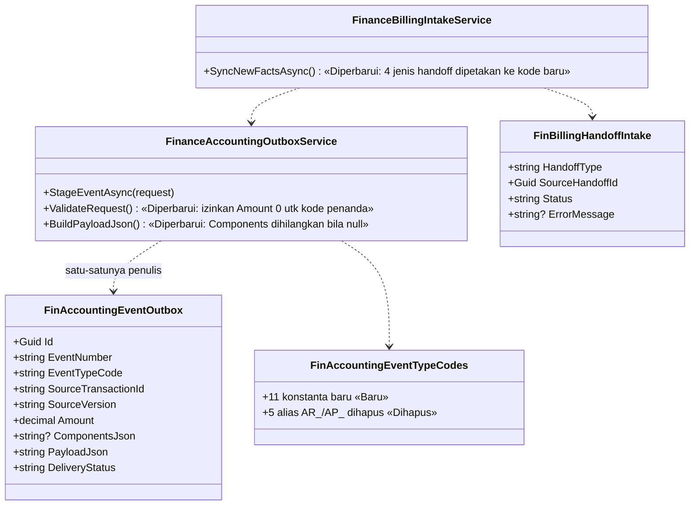
```mermaid
classDiagram
    class FinAccountingEventOutbox {
        +Guid Id
        +string EventNumber
        +string EventTypeCode
        +string SourceTransactionId
        +string SourceVersion
        +decimal Amount
        +string? ComponentsJson
        +string PayloadJson
        +string DeliveryStatus
    }
    class FinAccountingEventTypeCodes {
        +11 konstanta baru «Baru»
        +5 alias AR_/AP_ dihapus «Dihapus»
    }
    class FinanceAccountingOutboxService {
        +StageEventAsync(request)
        +ValidateRequest() «Diperbarui: izinkan Amount 0 utk kode penanda»
        +BuildPayloadJson() «Diperbarui: Components dihilangkan bila null»
    }
    class FinBillingHandoffIntake {
        +string HandoffType
        +Guid SourceHandoffId
        +string Status
        +string? ErrorMessage
    }
    class FinanceBillingIntakeService {
        +SyncNewFactsAsync() «Diperbarui: 4 jenis handoff dipetakan ke kode baru»
    }
    FinanceAccountingOutboxService ..> FinAccountingEventOutbox : satu-satunya penulis
    FinanceAccountingOutboxService ..> FinAccountingEventTypeCodes
    FinanceBillingIntakeService ..> FinBillingHandoffIntake
    FinanceBillingIntakeService ..> FinanceAccountingOutboxService
```

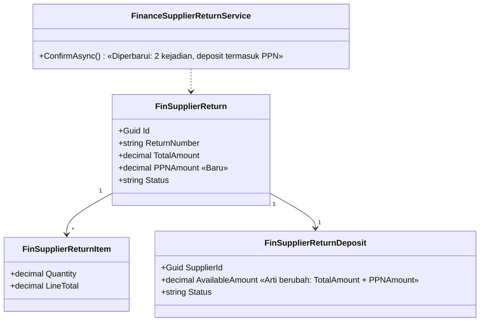
```mermaid
classDiagram
    class FinSupplierReturn {
        +Guid Id
        +string ReturnNumber
        +decimal TotalAmount
        +decimal PPNAmount  «Baru»
        +string Status
    }
    class FinSupplierReturnItem {
        +decimal Quantity
        +decimal LineTotal
    }
    class FinSupplierReturnDeposit {
        +Guid SupplierId
        +decimal AvailableAmount  «Arti berubah: TotalAmount + PPNAmount»
        +string Status
    }
    class FinanceSupplierReturnService {
        +ConfirmAsync() «Diperbarui: 2 kejadian, deposit termasuk PPN»
    }
    FinSupplierReturn "1" --> "*" FinSupplierReturnItem
    FinSupplierReturn "1" --> "1" FinSupplierReturnDeposit
    FinanceSupplierReturnService ..> FinSupplierReturn
```

## E.7 Penjelasan class — perubahan

| Class | Status | Perubahan | Lokasi file |
|---|---|---|---|
| `FinSupplierReturn` | **Diperbarui — tabel sudah berjalan** | Tambah `PPNAmount` | `Areas/Corporate/FinanceManagement/Purchasing/Models/FinSupplierReturn.cs`; configuration `Repositories/Configurations/Corporate/FinanceManagement/Purchasing/FinSupplierReturnConfiguration.cs` |
| `FinAccountingEventTypeCodes` | Diperbarui | **Tambah 11 konstanta**: `SelisihKasKurang`, `SelisihKasLebih`, `PenutupanShiftKasir`, `PembalikanPenutupanShiftKasir`, `PotonganPph23Piutang`, `PembalikanPotonganPph23Piutang`, `PotonganBiayaBankPiutang`, `PembalikanPotonganBiayaBankPiutang`, `PemakaianKreditReturPembelian`, `PpnMasukanReturPembelian`, `PembalikanPemakaianUangMukaDeposit`. **Hapus 5 alias**: `ArCreated`, `ArPayment`, `ArWriteOff`, `ApCreated`, `ApPayment`. **Tambah** daftar tertutup kode penanda bernilai nol | `Areas/Corporate/FinanceManagement/AccountingIntegration/Models/FinAccountingEventOutbox.cs` |
| `FinanceAccountingOutboxService` | Diperbarui | (a) `ValidateRequest`: `Amount = 0` diterima hanya untuk kode penanda pada daftar tertutup; (b) `BuildPayloadJson`: properti `Components` tidak ikut disusun bila null | `Areas/Corporate/FinanceManagement/AccountingIntegration/Services/FinanceAccountingOutboxService.cs` |
| `FinanceAccountingEventService` | Diperbarui | `GetFilterMetadataAsync`: `EventTypeCodeOptions` diisi dari seluruh katalog, bukan 17 yang ditulis tangan — menutup drift temuan 6 sekaligus mencegahnya terulang | Idem, folder `Services/` |
| `FinanceBillingIntakeService` | Diperbarui | Pemetaan empat jenis handoff (`DEPOSIT_MOVEMENT`, `REFUNDABLE_CREDIT`, `REFUND_CASE`, `CASH_VARIANCE_REVIEW`) ke kode kejadian `E.5`; perluasan cakupan `SETTLEMENT`; jalur `ERROR` untuk `REFERRED_OUTPATIENT_ADMIN` dan untuk pemeriksaan tender-deposit | `Areas/Corporate/FinanceManagement/BillingIntake/Services/FinanceBillingIntakeService.cs` |
| `FinanceSupplierReturnService` | Diperbarui | `ConfirmAsync`: `AvailableAmount = TotalAmount + PPNAmount`; terbitkan `PPN-MASUKAN-RETUR-PEMBELIAN` bila `PPNAmount > 0` | `Areas/Corporate/FinanceManagement/Purchasing/Services/FinanceSupplierReturnService.cs` |
| `FinanceSupplierPayableService` | Diperbarui | Dua nama kode (baris 127, 250) | `Areas/Corporate/FinanceManagement/Payable/Services/FinanceSupplierPayableService.cs` |
| `FinancePaymentService` | Diperbarui | Satu nama kode (baris 555); kode pemakaian deposit memakai nama final `FIN-DES-051` | `Areas/Corporate/FinanceManagement/Payable/Services/FinancePaymentService.cs` |
| `FinanceReceivableService` | Diperbarui | Dua nama kode (baris 604, 698) | `Areas/Corporate/FinanceManagement/Receivable/Services/FinanceReceivableService.cs` |
| `FinanceReceiptService` | Diperbarui | Pemilihan kode potongan dari `DeductionType` (`FIN-DES-052`); `OTHER` ditolak | `Areas/Corporate/FinanceManagement/Collection/Services/FinanceReceiptService.cs` |
| `FinReceiptDeduction` | Baru — **bentuk tidak berubah** dari `FIN-DES-048` | Nol kolom baru. `DeductionType` yang sudah dirancang dipakai memilih kode | `Areas/Corporate/FinanceManagement/Collection/Models/` |

**DTO yang berubah.**

| DTO | Jenis | Perubahan |
|---|---|---|
| `CreateSupplierReturnRequest` | Create, diperluas | Tambah `PPNAmount` (decimal, opsional, bawaan `0`, `>= 0`) |
| `SupplierReturnResponse` | Response, diperluas | Tambah `ppnAmount` |
| `AllocateReceiptRequest.Lines[].Deductions[]` | Create, **dipersempit** | `DeductionType` menerima `PPH23`/`BANK_ADMIN_FEE` saja; `OTHER` ditolak (`FIN-VAL-137`) |
| `AccountingEventFilterMetadataResponse` | Response | `eventTypeCodeOptions` bertambah mengikuti katalog |

**Enum/konstanta.** `FinReceiptDeductionTypes` tetap memuat `OTHER` sebagai nilai yang dikenal
tetapi **ditolak** validasi. Menghapus nilainya dari konstanta akan menyembunyikan keberadaannya
dari pembaca berikutnya; menolaknya di validasi membuat alasannya terbaca.

**Permission.** Nol butir hak akses baru. Seluruh kejadian pada amendment ini terbit sebagai efek
samping operasi yang hak aksesnya sudah ada (`FinanceSupplierReturn : Update`,
`FinanceReceipt : Update`, dan sinkronisasi intake yang berjalan sebagai akun layanan).

## E.8 Arsitektur folder

Nol berkas baru. Nol folder baru. Seluruh perubahan menyentuh berkas yang sudah ada.

```text
Areas/Corporate/FinanceManagement/
├── AccountingIntegration/
│   ├── Models/FinAccountingEventOutbox.cs              (Diperbarui — 11 konstanta, 5 alias dihapus)
│   └── Services/
│       ├── FinanceAccountingOutboxService.cs           (Diperbarui — ValidateRequest, BuildPayloadJson)
│       └── FinanceAccountingEventService.cs            (Diperbarui — EventTypeCodeOptions)
├── BillingIntake/Services/FinanceBillingIntakeService.cs   (Diperbarui — pemetaan 4 handoff)
├── Collection/Services/FinanceReceiptService.cs            (Diperbarui — kode potongan per DeductionType)
├── Payable/Services/
│   ├── FinanceSupplierPayableService.cs                (Diperbarui — 2 nama kode)
│   └── FinancePaymentService.cs                        (Diperbarui — 1 nama kode)
├── Purchasing/
│   ├── Models/FinSupplierReturn.cs                     (Diperbarui — PPNAmount)
│   └── Services/FinanceSupplierReturnService.cs         (Diperbarui — deposit + PPN, 2 kejadian)
└── Receivable/Services/FinanceReceivableService.cs      (Diperbarui — 2 nama kode)

Repositories/Configurations/Corporate/FinanceManagement/
└── Purchasing/FinSupplierReturnConfiguration.cs         (Diperbarui — kolom PPNAmount)
```

## E.9 Status model, dan tiga perubahan perilaku pada kode yang sudah berjalan

| Tabel | Status | Kolom yang berubah |
|---|---|---|
| `FinSupplierReturn` | **Diperbarui — tabel sudah berjalan** | Tambah `PPNAmount numeric(18,2) NOT NULL DEFAULT 0`; tambah check constraint `CK_FinSupplierReturn_PPNAmount` (`PPNAmount >= 0`) |
| Seluruh tabel lain | Tidak berubah | — |

Tiga perubahan perilaku yang menyentuh kode yang **sudah berjalan**, dan seluruhnya **MUST**
disebut di surat balasan ke Accounting supaya tidak mengejutkan saat pengiriman hidup:

| # | Yang berubah | Sebelum | Sesudah | Dampak pada data lama |
|---:|---|---|---|---|
| 1 | Nama empat `EventTypeCode` | `AP_CREATED`, `AP_PAYMENT`, `AR_PAYMENT`, `AR_WRITEOFF` | Nama katalog (`FIN-DES-058`) | Baris lama tetap bernama lama, tidak ditimpa. Seluruhnya masih `PENDING` dan belum pernah terkirim |
| 2 | `FinSupplierReturnDeposit.AvailableAmount` saat retur `CONFIRMED` | `TotalAmount` | `TotalAmount + PPNAmount` | Retur lama punya `PPNAmount = 0`, sehingga nilainya **identik** — nol perubahan bagi baris lama |
| 3 | Bentuk `PayloadJson` | Selalu memuat `"Components": null` | Properti dihilangkan bila null | Baris lama tetap memuat bentuk lama. Karena belum pernah terkirim, tidak ada pesan yang perlu dikirim ulang |

## E.10 Rencana migration

| Urutan | Migration | Isi | Tanpa downtime? | Cara mundur |
|---:|---|---|---|---|
| 1 | `AddPPNAmountToFinSupplierReturn` (**baru**) | `ALTER TABLE "FinSupplierReturn" ADD COLUMN "PPNAmount" numeric(18,2) NOT NULL DEFAULT 0;` lalu `ADD CONSTRAINT "CK_FinSupplierReturn_PPNAmount" CHECK ("PPNAmount" >= 0)` | **Ya** — kolom ber-default, seluruh baris lama langsung memenuhi constraint, nol backfill | `DROP CONSTRAINT` lalu `DROP COLUMN`. **Aman hanya** bila belum ada baris dengan `PPNAmount > 0`; bila sudah ada, nilai PPN-nya hilang dan kredit retur terkait **MUST** dihitung ulang lebih dulu |

Migration ini bergantung pada tabel `FinSupplierReturn` yang **sudah ada** (dibangun bersama
rumpun Purchasing/AP pada `cba60cb0`) dan **MUST** dijalankan sebelum kode `FIN-DES-055`
membacanya. Seperti seluruh dokumen ini, ini **rencana**: wewenang membuat dan menjalankan
migration tetap terpisah dan **MUST** diminta tersendiri (`AGENTS.md`, Keselamatan Database).

## E.11 Rencana data master awal

Tidak berlaku — amendment ini tidak menambah tabel master. Sebelas konstanta kode kejadian adalah
konstanta di dalam kode, bukan baris tabel, dan karena itu tidak butuh seeder.

Satu catatan yang berlaku bagi Accounting, bukan Finance: setiap kode baru pada `E.5` **MUST**
terdaftar sebagai `AccEventType` di sisi Accounting sebelum worker pengiriman hidup. Tanpa itu
kejadiannya tersimpan **Tertahan** dengan `EVENT_TYPE_NOT_REGISTERED` dan tidak pernah menjadi
jurnal (`evidence/14` bagian 5 butir 3). Pendaftaran itu pekerjaan modul Accounting.

## E.12 Invariant yang ditambahkan

| Invariant | Ditegakkan di |
|---|---|
| `FinSupplierReturn.PPNAmount >= 0` | Check constraint + validasi service |
| `FinSupplierReturn.TotalAmount` = jumlah `FinSupplierReturnItem.LineTotal`, **tanpa** PPN | Service (`FinanceSupplierReturnService`) |
| `FinSupplierReturnDeposit.AvailableAmount` awal = `TotalAmount + PPNAmount` | Service, di dalam transaksi konfirmasi retur |
| `TotalAmount + PPNAmount` retur ≤ `FinPurchasingInvoice.TotalAmount` | Service (`FIN-VAL-143`) — memperketat batas yang sudah ada, karena total faktur termasuk PPN |
| Satu shift menerbitkan **tepat satu** `SELISIH-KAS-*` per siklus tutup | `SourceVersion` dipatok + unique index dua lapis pada outbox |
| Satu shift menerbitkan **tepat satu** `PENUTUPAN-SHIFT-KASIR` per siklus tutup | Idem |
| `Amount = 0` hanya untuk kode pada daftar tertutup kode penanda | `FinanceAccountingOutboxService.ValidateRequest` |
| `PayloadJson` **tidak** memuat properti `Components` bila tidak ada komponen | `BuildPayloadJson` |
| Tidak ada `EventTypeCode` di luar katalog `E.5` yang ditulis | Konstanta; alias lama dihapus sehingga tidak dapat dipakai lagi |
| Potongan AR `DeductionType = OTHER` tidak dapat dicatat | Validasi (`FIN-VAL-137`) |

## E.13 Yang sengaja tidak dibuat pada amendment ini

| Yang ditolak | Alasan |
|---|---|
| Tabel baru untuk penanda shift tertutup | Penanda adalah kejadian, bukan fakta yang perlu disimpan Finance. Sumbernya `BilCashierShift` milik Billing, dan kotak keluar sudah menyimpan jejaknya |
| Menulis movement pembalik ke `BilDepositMovement` untuk menutup gap temuan C | Finance **MUST NOT** menulis ke tabel Billing (`FIN-OOS-001`..`004`). Yang dibuat hanya pendeteksi baca-saja; perbaikannya milik owner Billing (`FIN-OQ-034`) |
| Memetakan refund `REFERRED_OUTPATIENT_ADMIN` ke `PENGEMBALIAN-UANG-MUKA` | Lawan jurnalnya salah — tidak pernah ada uang muka yang diakui untuk kredit itu. Memaksakannya menghasilkan jurnal yang seimbang tetapi keliru, yang lebih sulit ditemukan daripada baris `ERROR` |
| Kode baru untuk refund `SETTLEMENT` | Ekonominya identik `ALLOCATION_EXCESS` (temuan D) — cukup memperluas cakupan dua kode yang sudah ada. Menambah kode ketiga untuk ekonomi yang sama akan memecah laporan yang seharusnya satu |
| Menerima `DeductionType = OTHER` tanpa kejadian | Piutang berkurang tanpa jejak di buku besar — kerusakan yang justru dicegah seluruh rumpun ini |
| Mengizinkan `Amount = 0` secara umum | Membuka jalan bagi kejadian transaksi bernilai nol untuk lolos diam-diam. Daftar tertutup kode penanda lebih sempit dan dapat diuji |
| Memperbaiki nama kode pada baris outbox lama lewat migration data | Baris outbox adalah salinan pesan yang memang pernah disusun begitu; menimpanya menghapus jejak. Penanganannya keputusan operasional terpisah sebelum worker hidup |
| Mengaktifkan worker pengiriman | Di luar cakupan desain dan tetap menunggu `FIN-OQ-016` (kredensial akun layanan) beserta ratifikasi kode baru |
| Memecah `DeductionAmount` pembayaran dari `PEMBAYARAN-HUTANG-SUPPLIER` | Keterbatasan `FIN-DEC-038` sejak REVISI 2; tidak dibuka ulang di sini |

---

# AMENDMENT REVISI 7 — Gerbang penanda shift dan penyelarasan menu

| Field | Nilai |
|---|---|
| Keputusan arsitektur | `FIN-DES-059`, `FIN-DES-060` — `draft` |
| Keputusan bisnis yang diturunkan | `FIN-DEC-072`..`076` (`approved` 28 September 2026) |
| Pemicu | `/trace-existing-capabilities` 28 September 2026 (`01-existing-capability-map.md` bagian 15) — kontrak as-is kotak masuk Accounting terbaca langsung, dan tiga `Conflict` ditemukan |
| Status `FIN-DES-051`..`058` | **`approved` 28 September 2026** — lihat `F.1` |
| Tabel baru / diperbarui | **Nol / nol** |
| Migration | **Nol** |

## F.1 Apa yang berubah statusnya, dan apa yang benar-benar baru

Pass ini **tidak** merancang ulang apa pun dari revisi 6. Tiga koreksi yang menunggu pengakuan
owner sudah diakui, sehingga `FIN-DES-053`, `054`, dan `056` berlaku **apa adanya** seperti sudah
tertulis — bukan diubah:

| Yang menunggu pengakuan | Ditanggapi | Akibat pada desain revisi 6 |
|---|---|---|
| Temuan A — pemicu penanda shift MUST mencakup `CLOSED` | `FIN-DEC-072` **diterima** | `FIN-DES-054` berlaku apa adanya. Nol perubahan teks |
| Temuan B — kunci kejadian = Id shift, bukan Id baris review | `FIN-DEC-073` **diterima** | `FIN-DES-053` berlaku apa adanya. Nol perubahan teks |
| Temuan D — refund `SETTLEMENT` tidak butuh kode baru | `FIN-DEC-074` **diterima** | `FIN-DES-056` berlaku apa adanya. Nol perubahan teks |
| Temuan C — pembalikan tender top-up deposit tidak menulis mutasi | **Tetap terbuka** — `FIN-OQ-034`, milik owner **Billing** | `FIN-DES-057` berlaku apa adanya, termasuk pendeteksi baca-saja |

**Owner menyetujui `FIN-DES-051`..`058`** pada 28 September 2026 lewat pernyataan langsung
"Saya approve". Dicatat apa adanya; skill tidak menetapkannya sendiri. Approval ini **BUKAN**
otorisasi membuat atau menjalankan migration `AddPPNAmountToFinSupplierReturn`, dan **BUKAN**
otorisasi mengubah source.

Yang benar-benar baru pada pass ini hanya dua hal, keduanya lahir dari temuan audit:

### FIN-DES-059 — Gerbang worker untuk kedua kode penanda, dan kenapa bentuknya tidak diubah

Menurunkan `FIN-DEC-075`. Audit membaca langsung `AccAccountingEventService.cs` dan menemukan
kotak masuk Accounting **hari ini menolak kejadian bernilai nol lewat kedua jalur**:

| Jalur | Baris | Perilaku |
|---|---|---|
| Pesan transaksi biasa | 1098 | `Amount <= 0` → **`400`** "Nilai kejadian harus lebih besar dari nol." |
| Pesan saldo subledger | 1075-1079 | Jenis kejadian bertipe saldo → **`409`** "Pesan saldo subledger belum dapat diterima. Jalurnya dibangun pada `BE-ACC-P2-028`." |

Tidak ada celah yang lolos. Keputusan owner: **bentuk penanda tidak diubah** — `Amount = 0`
dipertahankan karena itu bentuk yang benar secara akuntansi (penanda status, bukan transaksi, dan
memberinya nilai palsu justru menyesatkan pembaca buku besar). Yang ditambahkan hanya gerbangnya:

| Hal | Ketentuan |
|---|---|
| Penulisan baris outbox | **Tetap berjalan** sejak shift mencapai keadaan tertutup final. Baris ditulis `PENDING` |
| Aktivasi worker pengiriman | **MUST NOT** diaktifkan untuk `PENUTUPAN-SHIFT-KASIR` dan `PEMBALIKAN-PENUTUPAN-SHIFT-KASIR` sebelum `FIN-OQ-035` dijawab Accounting — pola yang sama dengan `FIN-DEC-056` |
| Yang diminta ke Accounting | Memperluas validasi agar menerima `Amount = 0` untuk kedua kode ini, **atau** mengaktifkan jalur pesan saldo (`BE-ACC-P2-028`) yang memang dirancang untuk nilai nol. Permintaan dikirim lewat `evidence/16` — **terpisah** dari surat ratifikasi nama kode |
| Bila Accounting menolak keduanya | Bentuk penanda **MUST** dirancang ulang lewat amendment tersendiri. Desain ini **tidak** menyiapkan jalur cadangan, karena jalur cadangan yang dipilih sepihak (mis. nilai simbolis Rp 1) justru merusak arti angka di buku besar |

**Kenapa gerbangnya di worker, bukan di penulisan.** Konsisten dengan seluruh rumpun ini sejak
`FIN-DEC-056`: Finance adalah titik asal, dan kesiapan Finance tidak digantungkan pada kecepatan
pihak hilir. Baris outbox yang menumpuk `PENDING` aman — ia justru menjadi bukti berapa banyak
shift yang sudah tertutup sejak fitur dibangun, dan langsung terkirim begitu gerbangnya dibuka.

### FIN-DES-060 — Menu Purchasing disesuaikan ke `FIN-DEC-060`, bukan sebaliknya

Menurunkan `FIN-DEC-076`. Audit menemukan menu yang sudah dibangun menyimpang dari keputusan yang
sudah disetujui **sebelum** menu itu dibangun. Keputusan owner: keputusannya yang ditegakkan.

Pemetaan yang MUST dikerjakan ada di `03-frontend-architecture.md` bagian 15 — **bukan** di sini,
karena ini seluruhnya perubahan frontend: nol endpoint, nol tabel, nol hak akses baru.

**Satu hal yang MUST dicatat sebagai konsekuensi.** Butir menu "Purchase Order" dan "Receiving"
yang sudah ada mengarah ke layar yang **belum punya sumber data** (`FIN-CQ-07`). Audit memastikan
ini **celah implementasi, bukan celah desain**: `contracts/api-contract.md` bagian `B.1`-`B.5`
**sudah** memuat kelima endpoint `GET /` berpaging beserta query dan bentuk `PagedResult`-nya,
seluruhnya berlabel `Rencana (belum tersedia)`. Yang belum ada adalah kodenya, dan komentar
controller sendiri menyebut gap itu eksplisit.

Karena itu **tidak ada endpoint baru yang dirancang di sini.** Urutan penutupannya:

| Urutan | Pekerjaan | Sudah dikontrak? |
|---:|---|---|
| 1 | Bangun kelima `GET /` berpaging sesuai `api-contract.md` `B.1`-`B.5` | **Ya** — `Rencana (belum tersedia)` |
| 2 | Bangun layar Purchasing yang memakainya | Ya — `03-frontend-architecture.md` bagian 12.1 |
| 3 | Selaraskan butir menu (`FIN-DES-060`) | Ya — bagian 15 berkas frontend |

Menyelaraskan menu lebih dulu tanpa langkah 1 dan 2 hanya memindahkan butir yang tetap tidak dapat
menampilkan data. Ketiganya **MUST** dijadwalkan sebagai satu rangkaian di
`/plan-module-delivery`, bukan tiga task yang berdiri sendiri.

## F.2 Yang sengaja tidak dibuat pada amendment ini

| Yang ditolak | Alasan |
|---|---|
| Nilai simbolis non-nol untuk kedua kode penanda | Ditolak owner (`FIN-DEC-075`). Nilai palsu di buku besar lebih berbahaya daripada baris `PENDING` yang menunggu gerbang — angka yang salah terbaca sebagai fakta oleh siapa pun yang tidak tahu konteksnya |
| Jalur cadangan bila Accounting menolak perluasan validasi | Merancang dua bentuk sekaligus berarti salah satunya pasti dibuang, dan yang dibuang tetap meninggalkan jejak di kontrak. Bila ditolak, itu amendment tersendiri |
| Endpoint `GET /` baru untuk rumpun Purchasing | **Sudah ada di `api-contract.md` `B.1`-`B.5`**. Menambahkannya lagi akan menghasilkan dua definisi untuk satu endpoint |
| Mengubah `FIN-DEC-060` mengikuti menu yang sudah dibangun | Ditolak owner (`FIN-DEC-076`). Implementasi yang mendahului keputusan tidak membatalkan keputusan itu |
| Merancang ulang `FIN-DES-053`/`054`/`056` | Ketiganya sudah benar; yang kurang hanya pengakuan owner, dan itu sudah diberikan |

---

# AMENDMENT REVISI 8 — Pemetaan Payung-ke-Granular FIN-CQ-08 dan Strategi Migrasi Peran

| Field | Nilai |
|---|---|
| Keputusan arsitektur | `FIN-DES-061`, `FIN-DES-062`, `FIN-DES-063` — `approved` |
| Keputusan bisnis yang diturunkan | `FIN-DEC-078`, `FIN-DEC-079` (`approved` 28 September 2026 oleh Yasmin) |
| Tanggal | 28 September 2026 |
| Masalah teknis yang diselesaikan | `FIN-CQ-08` (Penyelarasan 6 controller legacy), `FIN-CAP-043` (Audit kapabilitas controller), `FIN-OQ-036` (Granularitas hak akses butir menu) |
| Kontrak acuan | `contracts/permission-audit-matrix.md` (`FIN-PERM-1.3`, Bagian D) |

Amendment ini menetapkan arsitektur backend untuk menyelesaikan inkonsistensi nama resource otorisasi antara kode legacy dan kontrak kanonikal, mendefinisikan mekanisme ekspansi hak akses payung ke granular pada sistem otorisasi peran, serta merumuskan strategi migrasi data peran database yang aman dan teruji.

---

### FIN-DES-061 — Resource Payung Finance.AP dan Finance.AR serta Aturan Ekspansi Seeder Peran

Menurunkan `FIN-DEC-079` dan `FIN-PERM-1.3`.

#### 1. Masalah Arsitektur
Frontend mengelola menu navigasi sidebar (`corporateFinance.js`) dengan menggunakan dua resource tingkat payung: `Finance.AP` untuk seluruh alur kerja Hutang/Pengadaan, dan `Finance.AR` untuk alur kerja Piutang/Penerimaan. Sementara itu, backend ASP.NET Core menuntut evaluasi hak akses di tingkat granular pada masing-masing endpoint (`[AccessPermission("FinancePurchaseOrder", "Read")]`, `[AccessPermission("FinancePayment", "Read")]`, dst.). Bila otorisasi backend hanya mengenal resource granular tanpa jembatan dari payung, pengguna yang memegang hak payung akan melihat menu di frontend namun mengalami galat `403 Forbidden` saat memanggil API backend.

#### 2. Keputusan Arsitektur
1. `Finance.AP` dan `Finance.AR` secara resmi diakui dan didaftarkan sebagai **Group-Level Umbrella Resources** di dalam sistem otorisasi backend.
2. Mekanisme ekspansi peran diimplementasikan pada generator seeder peran (`AccessMenuSeeder`) atau layanan otorisasi peran runtime. Saat sebuah peran (*Role*) diberikan hak pada resource payung, sistem secara otomatis mengekspansi dan mendaftarkan seluruh resource granular terkait:
   - **Payung `Finance.AP`** diekspansi ke 9 resource granular: `FinancePayment`, `FinanceSupplierPayable`, `FinanceMedicalServicePayable`, `FinancePurchaseOrder`, `FinanceGoodsReceipt`, `FinanceInvoiceExchange`, `FinancePurchasingInvoice`, `FinanceSupplierReturn`, dan `FinancePurchasingReport`.
   - **Payung `Finance.AR`** diekspansi ke 4 resource granular: `FinanceReceivable`, `FinanceReceipt`, `FinanceReceivableInvoiceBatch`, dan `FinanceBillingIntake`.
3. Aturan pewarisan aksi payung ke granular:
   - Aksi `View` pada payung menghasilkan aksi `Read` pada seluruh resource granular di kelompoknya.
   - Aksi `Operate` pada payung menghasilkan aksi pembuat transaksi (*Maker*): `Create`, `Update`, `Submit`, `Allocate`, `RequestAdjustment`, `RequestWriteOff`, `Consume`.
   - Aksi `Approve` pada payung menghasilkan aksi pengesahan (*Checker*): `Approve`, `Confirm`, `MarkPaid`, `ApproveAdjustment`, `ApproveWriteOff`, `Reverse`, `Cancel`.

#### 3. Konsekuensi
- **Frontend tidak perlu diubah sedikit pun:** Filter menu sidebar yang sudah memakai `Finance.AP` dan `Finance.AR` tetap sah dan berfungsi penuh.
- Masalah `FIN-OQ-036` tertutup secara arsitektural: staf rumah sakit yang berhak melihat menu dijamin memiliki izin yang sesuai saat memanggil API granular.
- Setiap penambahan resource granular baru di masa depan wajib didaftarkan pada matriks ekspansi ini.

---

### FIN-DES-062 — Penyelarasan Nama Resource 6 Controller Legacy Mengikuti Kontrak FIN-PERM-1.3

Menurunkan `FIN-DEC-078`.

#### 1. Masalah Arsitektur
Enam controller Finance awal menggunakan string nama pendek tanpa awalan `Finance` pada atribut `[AccessPermission]`:
- `FinancePaymentsController` menggunakan `"Payment"`
- `FinanceReceiptsController` menggunakan `"Receipt"`
- `FinanceReceivablesController` menggunakan `"Receivable"`
- `FinanceSupplierPayablesController` menggunakan `"SupplierPayable"`
- `FinanceBillingIntakeController` menggunakan `"BillingIntake"`
- `FinanceAccountingEventsController` menggunakan `"AccountingEvents"` (jamak)

Hal ini menciptakan fragmentasi dengan 7 controller Purchasing baru yang sudah menggunakan awalan `"Finance"` (`FinancePurchaseOrdersController`, dst.) dan menyimpang dari kontrak `permission-audit-matrix.md`.

#### 2. Keputusan Arsitektur
Kode backend diselaraskan mengikuti kontrak (`FIN-DEC-078`). Implementer wajib mengubah nilai parameter resource pada seluruh atribut `[AccessPermission]` di keenam controller tersebut menjadi nama kanonikal berawalan `"Finance"`:
1. `Areas/Corporate/FinanceManagement/Payable/Controllers/FinancePaymentsController.cs`: seluruh string `"Payment"` diganti menjadi `"FinancePayment"`.
2. `Areas/Corporate/FinanceManagement/Collection/Controllers/FinanceReceiptsController.cs`: seluruh string `"Receipt"` diganti menjadi `"FinanceReceipt"`.
3. `Areas/Corporate/FinanceManagement/Receivable/Controllers/FinanceReceivablesController.cs`: seluruh string `"Receivable"` diganti menjadi `"FinanceReceivable"`.
4. `Areas/Corporate/FinanceManagement/Payable/Controllers/FinanceSupplierPayablesController.cs`: seluruh string `"SupplierPayable"` diganti menjadi `"FinanceSupplierPayable"`.
5. `Areas/Corporate/FinanceManagement/BillingIntake/Controllers/FinanceBillingIntakeController.cs`: seluruh string `"BillingIntake"` diganti menjadi `"FinanceBillingIntake"`.
6. `Areas/Corporate/FinanceManagement/AccountingIntegration/Controllers/FinanceAccountingEventsController.cs`: string `"AccountingEvents"` diganti menjadi `"FinanceAccountingEvent"` (bentuk tunggal).

#### 3. Konsekuensi & Acceptance Criteria
- Nol string nama pendek tersisa di atribut `[AccessPermission]` modul Finance.
- Arsitektur otorisasi controller menjadi seragam, bersih, dan mematuhi konvensi penamaan enterprise Quilvian.

---

### FIN-DES-063 — Strategi Migrasi Data Peran Database SysRolePermissions dan Idempotensi Eksekusi

Menurunkan `FIN-DEC-078`.

#### 1. Masalah Arsitektur
Mengubah nama resource di kode C# tanpa memperbarui tabel izin peran di database akan menyebabkan seluruh pengguna di lingkungan yang sudah berjalan kehilangan akses secara mendadak (`403 Forbidden`). Oleh karena itu, perubahan kode wajib digabungkan dengan skrip migrasi data yang aman dan deterministik.

#### 2. Keputusan Arsitektur
1. Strategi migrasi data peran dirancang menggunakan skrip SQL idempotent yang memperbarui kolom `ResourceName` pada tabel perizinan peran (`SysRolePermissions`):
   ```sql
   UPDATE "SysRolePermissions" SET "ResourceName" = 'FinancePayment' WHERE "ResourceName" = 'Payment';
   UPDATE "SysRolePermissions" SET "ResourceName" = 'FinanceReceipt' WHERE "ResourceName" = 'Receipt';
   UPDATE "SysRolePermissions" SET "ResourceName" = 'FinanceReceivable' WHERE "ResourceName" = 'Receivable';
   UPDATE "SysRolePermissions" SET "ResourceName" = 'FinanceSupplierPayable' WHERE "ResourceName" = 'SupplierPayable';
   UPDATE "SysRolePermissions" SET "ResourceName" = 'FinanceBillingIntake' WHERE "ResourceName" = 'BillingIntake';
   UPDATE "SysRolePermissions" SET "ResourceName" = 'FinanceAccountingEvent' WHERE "ResourceName" = 'AccountingEvents';
   ```
2. Skrip dibungkus dalam blok transaksi database eksplisit (`BEGIN TRANSACTION ... COMMIT;`) untuk menjamin sifat *all-or-nothing*.
3. Idempotensi: Klausa `WHERE "ResourceName" = '<NamaLama>'` menjamin bahwa skrip aman dijalankan berulang kali tanpa mengubah baris yang sudah termigrasi atau baris lain di luar modul Finance.
4. Rencana Rollback: Jika rilis backend dibatalkan, skrip pembalik simetris disediakan untuk mengembalikan nama kanonikal ke nama pendek sebelum aplikasi versi lama diaktifkan kembali.

#### 3. Batasan Keselamatan Database
Sesuai piagam tata kelola Quilvian (`AGENTS.md`), pass desain ini **hanya menetapkan rancangan skrip**. Wewenang untuk mengeksekusi skrip migrasi database pada lingkungan kerja tetap memerlukan otorisasi implementasi terpisah dan tidak boleh dijalankan otomatis oleh agen.

---

## G.2 Yang sengaja tidak dibuat pada amendment ini

| Yang ditolak | Alasan penolakan |
|---|---|
| Mengubah filter menu sidebar frontend ke nama resource granular | Ditolak oleh owner (`FIN-DEC-079`). Mengubah frontend ke belasan nama granular akan memecah kesatuan menu dan membebani pengelolaan hak akses; pendekatan payung lebih bersih dan stabil |
| Membuat tabel database baru untuk relasi payung-ke-granular | Terlalu rumit dan menambah beban query (*overhead*). Pemetaan payung bersifat deklaratif dan cukup diselesaikan pada level seeder peran saat inisialisasi data |
| Mengeksekusi migrasi database atau mengubah source code aplikasi di pass ini | Melanggar batas kewenangan skill desain (`design-business-module`); eksekusi kode dan migrasi data adalah ranah `build-module-backend` setelah task disetujui |
| Membiarkan nama pendek pada controller lama | Ditolak oleh owner (`FIN-DEC-078`). Membiarkan nama pendek mempertahankan utang teknis dan inkonsistensi sistem otorisasi |

---

# AMENDMENT REVISI 9 — Arti tunggal mutasi `RELEASE` dan pemicu pembalikan pemakaian uang muka

| Field | Nilai |
|---|---|
| Revisi blueprint | 9 |
| Contract version | `FIN-INTEGRATION-1.6` (peta pemicu), `FIN-VAL-1.5` (`FIN-VAL-144`..`146`), `FIN-TEST-1.6` (bagian F) |
| Keputusan arsitektur | `FIN-DES-064`, `FIN-DES-065` — **`approved`** (disahkan Yasmin via Amendment Pass 29 September 2026: `FIN-DEC-080`, `FIN-DEC-081`) |
| Keputusan bisnis yang diturunkan | `FIN-DEC-063`, `FIN-DEC-077`, `FIN-DEC-080`, `FIN-DEC-081`; `BKC-DEC-128`..`131` |
| Yang dikoreksi | `FIN-DES-035` dan `FIN-DES-057`, beserta `FIN-DEC-041` (butir `RELEASE` dicabut) |
| Open question baru | `FIN-OQ-037` — permintaan penanda eksplisit kepada owner Billing (`evidence/19`) |
| Source SHA saat pemeriksaan | Backend `7811c048` (bergerak dari `cba60cb0`, dua commit) |
| Tabel baru | **Nol.** Kolom baru: **nol.** Migration: **nol.** Endpoint baru: **nol** |

## H.1 Mengapa amendment ini ada

`BE-FIN-047` tidak dapat direncanakan karena pemicunya tidak jelas. Pass perencanaan roadmap
29 September 2026 mencatatnya sebagai blocker dan menyerahkannya ke pass desain ini.

Pemeriksaan langsung ke source pada `7811c048` menemukan sesuatu yang **lebih tajam** daripada
dugaan pass perencanaan itu. Dugaannya: satu `MovementType = RELEASE` membawa dua arti sehingga
Finance perlu membedakannya. Kenyataannya: **`RELEASE` hari ini hanya punya satu penulis, dan
blueprint memetakannya ke kode kejadian yang salah.**

### Peta lengkap penulis `BilDepositMovement` pada `7811c048`

| # | Berkas dan baris | `MovementType` | `ReversesMovementId` | Arti bisnis sebenarnya |
|---:|---|---|---|---|
| 1 | `BillingDepositService.cs:329` | `TOP_UP` | — | Pasien menitip uang muka lewat kasir |
| 2 | `BillingSettlementService.cs:819` | `TOP_UP` | — | Top-up lahir dari tender yang `SUCCEEDED` |
| 3 | `BillingAllocationService.cs:169` | `ALLOCATION` | — | Uang muka dipakai melunasi tagihan |
| 4 | `BillingDepositService.cs:468` | `REVERSAL` | terisi, menunjuk `TOP_UP` | Pembalikan top-up manual |
| 5 | `BillingSettlementService.cs:974` | `REVERSAL` | terisi, menunjuk `TOP_UP` | Pembalikan tender top-up (`BKC-DEC-128`) |
| 6 | `BillingSettlementService.cs:949` | **`RELEASE`** | **tidak diisi** | **Pembatalan alokasi tagihan secara LIFO** (`BKC-DEC-131`) |

**Tidak ada penulis `RELEASE` untuk pengembalian uang muka tunai kepada pasien.**
`BillingDepositService` hanya punya dua operasi tulis — `TopUpAsync` dan `ReverseTopUpAsync` — dan
tidak ada operasi refund deposit sama sekali.

### Akibatnya bagi dua keputusan yang sudah `approved`

| Yang tertulis | Yang sebenarnya terjadi | Akibat bila dibangun apa adanya |
|---|---|---|
| `FIN-DES-035`/`FIN-DEC-041`: `RELEASE` menerbitkan `PENGEMBALIAN-UANG-MUKA`, debit Uang Muka Pasien, kredit **Kas** | Pada pembatalan alokasi LIFO **tidak ada kas yang bergerak**. Saldo deposit justru **naik kembali**, dan tagihan yang tadinya lunas kembali terbuka | Buku besar mencatat kas keluar untuk uang yang masih ada di saldo deposit pasien. Kas di buku besar menjadi lebih kecil daripada kas sebenarnya, dan rekonsiliasi toleransi nol Accounting (`ACC-DEC-076`) gagal tanpa sebab yang terlihat |
| `FIN-DES-057`: pemicu `PEMBALIKAN-PEMAKAIAN-UANG-MUKA-DEPOSIT` adalah mutasi `REVERSAL` atas `ALLOCATION` | Billing **tidak pernah** menulis `REVERSAL` atas `ALLOCATION`. Yang ditulis untuk pembatalan alokasi adalah `RELEASE` | Kode itu tidak pernah menemukan baris untuk dikirim. Pembatalan alokasi uang muka tidak pernah sampai ke buku besar, dan piutang yang terbuka kembali tidak pernah diakui |

Keduanya **bertemu pada satu fakta yang sama**: mutasi `RELEASE` versi `BKC-DEC-131`. Satu kode
memetakannya ke tempat yang salah, satu kode lagi menunggu pemicu yang tidak akan pernah datang.

**Contoh berangka.** Pasien menitip uang muka Rp 20.000.000 lewat kartu, lalu uang muka itu dipakai
melunasi tagihan Rp 32.000.000 — sisa piutang Rp 12.000.000. Kartunya kemudian ditarik penerbit,
sehingga tendernya dibalik.

| Langkah Billing | Mutasi yang ditulis | Yang seharusnya diakui buku besar |
|---|---|---|
| Alokasi ke tagihan dibatalkan LIFO | `RELEASE` Rp 20.000.000 | Debit Piutang Rp 20.000.000, kredit Uang Muka Pasien — tagihan kembali terbuka |
| Top-up ditarik | `REVERSAL` Rp 20.000.000 | Debit Uang Muka Pasien Rp 20.000.000, kredit Kas — uangnya memang tidak pernah jadi diterima |
| **Hasil bersih** | — | **Debit Piutang, kredit Kas** — persis yang diminta Accounting pada `evidence/14` bagian 7.1 |

Bila mutasi `RELEASE` dikirim sebagai `PENGEMBALIAN-UANG-MUKA` seperti tertulis hari ini, hasil
bersihnya menjadi **kredit Kas dua kali** Rp 40.000.000 untuk uang Rp 20.000.000 yang tidak pernah
masuk, dan piutang Rp 20.000.000 tidak pernah terbuka kembali.

## H.2 Bounded context, ownership, dan batas transaksi — tidak ada yang berubah

| Hal | Ketentuan |
|---|---|
| Pemilik `BilDepositMovement` | Billing. Finance **hanya membaca** — `FIN-OOS-001`..`004` tetap berlaku penuh |
| Pemilik nama kode kejadian | Accounting meratifikasi namanya; Finance yang menerbitkan barisnya |
| Batas transaksi | Tidak berubah. Baris intake dan baris kejadian tetap ditulis dalam satu transaksi dengan pembacaan faktanya, pola `FIN-DES-017` |
| Aggregate yang disentuh | Nol. Amendment ini tidak menambah entity, kolom, maupun tabel |

## H.3 Keputusan arsitektur baru

### FIN-DES-064 — Mutasi `RELEASE` dipetakan ke pembalikan pemakaian, bukan ke pengembalian kas

Menurunkan `FIN-DEC-063`, `FIN-DEC-077`, dan `FIN-DEC-080` (**`approved`**, 29 September 2026), dan **mengoreksi** `FIN-DES-035`, `FIN-DEC-041`, beserta dua baris
katalog `E.5`.

| Hal | Ketentuan |
|---|---|
| Kode untuk mutasi `RELEASE` | **`PEMBALIKAN-PEMAKAIAN-UANG-MUKA-DEPOSIT`** — debit Piutang, kredit Uang Muka Pasien |
| Kode yang **dicabut** untuk mutasi `RELEASE` | `PENGEMBALIAN-UANG-MUKA`. Ia **tidak mati** — pemicunya yang benar tetap `BilRefundCase` berstatus `EXECUTED` (`FIN-DES-056`), jalur yang memang mengeluarkan kas |
| `SourceTransactionId` | `BilDepositMovement.Id` |
| `Amount` | `Amount` mutasi `RELEASE` — jumlah alokasi yang dibatalkan, selalu positif |
| `SourceVersion` | Dipatok `"1"` — satu mutasi adalah satu fakta yang tidak pernah berulang |
| `AccountingDate` | Tanggal `OccurredAt` mutasi |
| Pasangannya | Mutasi `REVERSAL` yang lahir dalam transaksi Billing yang sama menerbitkan `PEMBALIKAN-PENERIMAAN-UANG-MUKA` (`BE-FIN-046`, tidak berubah) |

**Kenapa arah koreksinya begini, bukan sebaliknya.** Yang menentukan lawan jurnal adalah
**pergerakan uang**, bukan nama `MovementType`. Pada mutasi `RELEASE` versi `BKC-DEC-131` tidak ada
kas yang bergerak sama sekali — saldo deposit naik dan tagihan terbuka kembali. Itu persis definisi
`PEMBALIKAN-PEMAKAIAN-UANG-MUKA-DEPOSIT` yang sudah diratifikasi Accounting. Memaksanya menjadi
`PENGEMBALIAN-UANG-MUKA` berarti menulis kas keluar yang tidak pernah terjadi.

### FIN-DES-065 — Syarat pembeda, dan perilaku *fail-closed* selama artinya belum tunggal

Menurunkan `FIN-DEC-081` (**`approved`**, 29 September 2026). Surat evidence resmi ke Billing diterbitkan via `evidence/19-permintaan-penanda-eksplisit-mutasi-release-ke-billing.md` (`FIN-OQ-037`).

`FIN-DES-064` benar untuk mutasi `RELEASE` **sebagaimana ditulis Billing hari ini**. Risikonya: nama
`RELEASE` sendiri masih bermakna ganda di sisi Billing, sehingga penulis berikutnya dapat
memakainya untuk pengembalian kas tanpa Finance mengetahuinya.

Bukti bahwa maknanya memang masih ganda di Billing: `BillingDepositService.cs:176` menjumlahkan
seluruh mutasi `RELEASE` sebagai **`totalRefunded`** — "dana yang dikembalikan". Sesudah
`BKC-DEC-131`, angka itu ikut memuat pembatalan alokasi, padahal uangnya masih ada di saldo
deposit. **Ini temuan milik Billing**, dilaporkan apa adanya dan **MUST NOT** diperbaiki dari
Finance.

| Keadaan mutasi `RELEASE` | Yang dilakukan Finance | Alasan |
|---|---|---|
| Ada mutasi `REVERSAL` dengan `SettlementId` yang sama | Terbitkan `PEMBALIKAN-PEMAKAIAN-UANG-MUKA-DEPOSIT` | Inilah tanda pasti pembatalan alokasi LIFO: `BKC-DEC-131` selalu menulis keduanya dalam satu transaksi dengan `SettlementId` yang sama |
| Tidak ada mutasi `REVERSAL` yang bersesuaian | Baris intake `ERROR` menunjuk `FIN-OQ-037`, **nol kejadian** | Artinya mutasi itu lahir dari jalur yang belum dikenal Finance. Menebak lawan jurnalnya berarti memilih antara kas dan piutang tanpa dasar — persis kesalahan yang dicegah amendment ini |

**Kenapa *fail-closed*, bukan menebak.** Kedua kemungkinan lawan jurnalnya berbeda pada akun yang
paling sensitif: kas. Salah menebak berarti kas di buku besar bergerak untuk uang yang tidak
bergerak, dan itu baru ketahuan saat rekonsiliasi tutup bulan gagal. Baris `ERROR` membuatnya
terlihat pada hari pertama, di layar pantauan yang sudah direncanakan `FE-FIN-007`.

**Yang diminta dari owner Billing (`FIN-OQ-037`).** Satu dari dua, pilihan ada pada Billing:

| Opsi | Isi | Akibat bagi Finance |
|---|---|---|
| A — penanda eksplisit *(direkomendasikan)* | Mutasi `RELEASE` versi pembatalan alokasi mengisi `ReversesMovementId` menunjuk mutasi `ALLOCATION` yang dibatalkan | Pembedaannya menjadi langsung dan tidak bergantung korelasi `SettlementId`. Kolomnya **sudah ada**, jadi nol perubahan skema di kedua modul |
| B — `MovementType` tersendiri | Nilai baru, misalnya `ALLOCATION_CANCELLED` | Paling bersih secara makna, tetapi menyentuh check constraint dan setiap pembaca `MovementType` lain di Billing, termasuk perhitungan `totalRefunded` |

Sampai salah satunya turun, aturan pada tabel di atas berlaku apa adanya. Permintaan ini **MUST**
dikirim sebagai surat evidence tersendiri kepada owner Billing — bukan diselundupkan ke surat
Accounting, karena pemiliknya berbeda. Pola yang sama dengan `FIN-OQ-034`/`evidence/17`.

## H.4 Peta kode kejadian — tiga baris yang berubah

| Kode | Pemicu **sebelum** amendment ini | Pemicu **sesudah** | Keadaan |
|---|---|---|---|
| `PEMBALIKAN-PEMAKAIAN-UANG-MUKA-DEPOSIT` | Mutasi `REVERSAL` atas `ALLOCATION` — **tidak pernah ada** | Mutasi `RELEASE` yang berpasangan dengan `REVERSAL` ber-`SettlementId` sama | Pemicunya **kini ada**; `BE-FIN-047` dapat direncanakan |
| `PENGEMBALIAN-UANG-MUKA` | `BilRefundCase` `EXECUTED` **atau** mutasi `RELEASE` | `BilRefundCase` `EXECUTED` saja | Cakupan **dipersempit**; kode tetap hidup |
| `PEMBALIKAN-PENERIMAAN-UANG-MUKA` | Mutasi `REVERSAL` atas `TOP_UP` | **Tidak berubah** | Tetap seperti rancangan `BE-FIN-046` |

## H.5 Status model, migration, dan data master

| Hal | Isi |
|---|---|
| Status model | **Nol perubahan.** Tidak ada entity, kolom, index, constraint, maupun `DeleteBehavior` yang bergerak |
| Rencana migration | **Nol migration.** Amendment ini murni pemetaan pemicu kejadian |
| Rencana data master awal | **Nol tambahan.** Tidak ada tabel master yang disentuh |
| Perubahan perilaku pada kode yang sudah berjalan | **Nol.** `FinanceBillingIntakeService` belum pernah memiliki jalur mutasi `RELEASE` — jalur itu baru lahir bersama `BE-FIN-025`, sehingga koreksi ini tiba **sebelum** kodenya ditulis, bukan sesudah |

Butir terakhir adalah alasan amendment ini murah: `BE-FIN-025` belum dikerjakan. Bila koreksi ini
datang setelahnya, ia akan menjadi perubahan perilaku pada kode berjalan beserta pembetulan baris
outbox yang sudah terbit.

## H.6 Yang sengaja tidak dibuat pada amendment ini

| Yang ditolak | Alasan penolakan |
|---|---|
| Menebak arti mutasi `RELEASE` dari kolom `Reason` | `Reason` adalah teks bebas 500 karakter yang ditulis manusia. Menjadikannya kunci logika akuntansi berarti satu perubahan kalimat di Billing mengubah lawan jurnal di buku besar |
| Memperbaiki perhitungan `totalRefunded` milik Billing | Melanggar `FIN-OOS-001`..`004`. Dilaporkan sebagai temuan kepada owner Billing, bukan diperbaiki dari Finance |
| Menulis mutasi pembalik sendiri agar pemicunya "ada" | Finance tidak pernah menulis ke tabel `Bil*`. Itu pula yang sudah ditolak `FIN-DES-057` sejak awal |
| Kode kejadian baru untuk pembatalan alokasi | Tidak perlu. `PEMBALIKAN-PEMAKAIAN-UANG-MUKA-DEPOSIT` sudah diratifikasi Accounting dengan lawan jurnal yang persis cocok; yang salah hanya pemicunya |
| Mencabut `PENGEMBALIAN-UANG-MUKA` sepenuhnya | Pemicunya yang benar tetap ada lewat `BilRefundCase` `EXECUTED` (`FIN-DES-056`). Mencabutnya akan menghilangkan satu-satunya kode untuk refund kas yang nyata |

---

# AMENDMENT REVISI 11 — Mekanisme resource payung hak akses (`FIN-DEC-082`, `FIN-DEC-083`)

| Field | Nilai |
|---|---|
| Pemicu | `/grill-me` Amendment pass 29 September 2026 (`FIN-DEC-082`, `FIN-DEC-083`), yang sendiri dipicu temuan implementasi `BE-FIN-042` bagian 7 |
| Keputusan yang diturunkan | `FIN-DEC-082` (payung memakai nama baru; controller V2 tidak disentuh), `FIN-DEC-083` (ekspansi materialized saat grant diberikan admin) |
| Keputusan arsitektur baru | `FIN-DES-066`..`FIN-DES-069` — seluruhnya **`draft`**, belum disetujui owner |
| Dampak skema | **NOL** tabel baru, **NOL** kolom baru, **NOL** migration |
| Dampak lintas modul | **ADA.** Titik tulis mekanismenya berada di area `Administrator` (`RoleAccessController`), milik rumpun `platform-authorization` — bukan milik Finance. Lihat `I.6` |
| Status gerbang | Satu gerbang terbuka: `FIN-OQ-038` (lihat `I.5`) menahan implementasi mekanisme ekspansi, **tidak** menahan `BE-FIN-042` D.5/D.6.1 yang sudah selesai |

## I.1 Apa yang diperiksa pada source, dan apa yang ternyata berbeda dari dugaan

Impact scan read-only dijalankan pada backend `7811c048` (**tidak bergerak** dari manifest) dan
frontend `a31da3c21` (**bergerak** dari `49b59cfaa`). Pemindaian dibatasi pada area terdampak:
jalur penulisan `SysAccessPolicy`, registry hak akses, dan penyaring menu frontend.

| # | Dugaan yang dipakai `FIN-DEC-079`/`FIN-DES-061`..`063` | Kenyataan pada source | Akibat |
|---:|---|---|---|
| 1 | `Finance.AP`/`Finance.AR` adalah nama bebas yang belum dipakai siapa pun | Dipakai `FinanceApController` dan `FinanceArController` (V2, berjalan) | Sudah dijawab `FIN-DEC-082` |
| 2 | Seeder peran dapat mendistribusikan izin granular | `AccessMenuSeeder` **tidak pernah** menulis `SysAccessPolicy`; ia hanya mengelola tiga tabel registry | Sudah dijawab `FIN-DEC-083` — titik tulis pindah ke layar Akses Role |
| 3 | Filter menu frontend memakai payung untuk menjaga butir menu **Purchasing** | Butir menu yang dijaga `Finance.AP`/`Finance.AR` seluruhnya menunjuk rute **V2** (`/finance/payable*`, `/finance/receivable*`) dengan aksi `View`/`Payment`/`Report` — yaitu aksi milik controller V2 itu sendiri. Butir menu Purchasing ("Pembelian") **belum ada sama sekali**; ia baru akan dibuat `FE-FIN-008`..`014` | Premis `FIN-OQ-036` keliru — lihat `I.4` dan `FIN-DES-069` |
| 4 | Berkas penyaring menu bernama `src/utils/menu-sidebar/corporateFinance.js` | Berkas itu **tidak ada**. Penyaringan ada di `src/utils/menu-sidebar/menu-items.jsx` (deklarasi `requiredPermission`) dan `src/utils/menu-sidebar/permission/filter-menu-items-by-permission.jsx` (fungsi penyaringnya) | `FIN-CQ-10`, dokumen dikoreksi |
| 5 | — (tidak pernah diperiksa sebelumnya) | Dua butir menu dijaga aksi yang **tidak pernah terdaftar**: `Finance.AR : Report` dan `Finance.AP : Report`. Kedua controller V2 hanya mendeklarasikan `View`, `Payment` (AP) dan `View`, `Payment`, `Create` (AR); endpoint `/report` keduanya justru dijaga `View` | `FIN-CQ-09` — dua butir menu mati permanen, lihat `I.4` |

**Temuan 5 dijelaskan lebih jauh.** Registry hanya memuat pasangan yang ditemukan dari atribut
source. Karena `Report` tidak pernah dideklarasikan, ia tidak pernah menjadi baris
`SysActionAccess`, sehingga tidak dapat dicentang admin, tidak pernah masuk `SysAccessPolicy`, dan
tidak pernah muncul pada daftar izin efektif. Penyaring menu bersifat *fail-closed* — hanya `true`
yang menampilkan — sehingga butir "Report AR" dan "Report AP" **tersembunyi bagi semua orang,
termasuk SuperAdmin**. Endpoint laporannya sendiri sehat dan dapat dipanggil pemegang `View`; yang
rusak hanya jalan masuk menunya.

## I.2 Tabel kepemilikan data — perubahan

Nol kelompok data baru. Nol pemilik berubah. Nol tabel dibuat ulang.

| Kelompok data | Modul pemilik | Dipakai modul ini | Dibuat ulang di modul ini | Perubahan amendment ini |
|---|---|:---:|---|---|
| Registry kemampuan (`SysApplicationModule`, `SysControllerAccess`, `SysActionAccess`) | **Platform** (`platform-authorization`) | Ya — baca, dan bertambah baris lewat pemindaian atribut | **Tidak** | Bertambah satu resource payung per kelompok beserta aksinya, lewat mekanisme pendaftaran yang sudah ada |
| Kebijakan hak akses (`SysAccessPolicy`) | **Platform** (`platform-authorization`) | Ya — **ditulis** oleh mekanisme ekspansi | **Tidak** | Nol kolom baru; bertambah baris hasil materialisasi |
| Peta payung ke granular | **Finance** (isi petanya), **Platform** (mekanismenya) | Ya | Tidak — `contracts/permission-audit-matrix.md` D.3 tetap satu-satunya sumber kebenaran isinya | Bentuk teknisnya ditetapkan `FIN-DES-068` |

## I.3 Keputusan arsitektur baru

### FIN-DES-066 — Resource payung wajib punya pembawa yang terdaftar, dan hari ini platform belum bisa menampungnya

Menurunkan `FIN-DEC-082`. Nama final yang dirancang: **`Finance.AP.Umbrella`** dan
**`Finance.AR.Umbrella`**, dengan tiga aksi `View`, `Operate`, `Approve` (`AccessType` berturut-turut
`Read`, `Create`, `Update`, supaya dapat dicentang pada layar Akses Role).

**Kendala mekanis yang ditemukan, dan ia menentukan bentuk seluruh desain ini.** Sebuah pasangan
`(resource, action)` hanya dapat diberikan admin bila ia **terdaftar** di registry. Registry disusun
`PermissionRegistryDescriptor` dari dua sumber, dan **hanya** dua: (a) pemindaian atribut
`[AccessController]`/`[AccessAction]` pada controller nyata, dan (b) `[assembly:
AccessExplicitPermission(...)]` — "hak akses penanda" untuk kewenangan yang tidak menempel pada
endpoint mana pun. Jalur (b) **tidak dapat dipakai membuat resource baru**: dokumentasi atributnya
menyatakan `ResourceName` wajib menunjuk resource yang sudah terdaftar dari pemindaian endpoint pada
modul yang sama, dan penanda yang menunjuk resource tak dikenal **ditolak keras** saat registry
disusun.

Konsekuensinya lugas: **resource payung yang tidak memiliki satu pun endpoint tidak dapat
didaftarkan dengan mekanisme platform hari ini.** Ini bukan pilihan gaya yang bisa disiasati desain
Finance; ini batas kemampuan platform yang nyata.

Dua jalan keluar yang sah, dan keduanya **bukan wewenang Finance untuk memilih sendiri** karena
salah satunya mengubah mekanisme milik modul lain:

| Jalan keluar | Bentuk | Konsekuensi |
|---|---|---|
| **(C) Pembawa milik Finance** | Satu controller Finance baru yang memiliki resource payung, dengan satu endpoint nyata sebagai pembawanya, ditambah dua aksi penanda lewat `[assembly: AccessExplicitPermission]` untuk tier yang tidak punya endpoint | Seluruhnya di dalam wewenang Finance. Harganya: satu endpoint yang keberadaannya sebagian besar untuk membawa resource — dan endpoint itu **MUST** punya kegunaan nyata bagi pemegangnya, bukan sekadar hiasan, kalau tidak ia melanggar prinsip "jangan membuat permukaan teknis tanpa kebutuhan" |
| **(D) Perluasan platform** | `platform-authorization` memperluas jalur penanda supaya dapat mendeklarasikan resource tanpa endpoint (*virtual resource*), dengan opt-in eksplisit | Bentuk yang paling jujur: kebutuhan "resource yang dapat diberikan tetapi tidak dijaga endpoint" memang belum dapat diungkapkan platform. Dapat dipakai ulang modul lain. Harganya: menyentuh mekanisme milik modul lain, **MUST** disetujui Security Owner dan pemilik `platform-authorization` |

Pilihan di antara keduanya dicatat sebagai `FIN-OQ-038` (`I.5`). Sampai ia dijawab, mekanisme
ekspansi **MUST NOT** diimplementasikan — bukan karena petanya belum jelas, melainkan karena
pembawa resource-nya belum ada.

### FIN-DES-067 — Titik tulis materialisasi: `ApplyPoliciesAsync`, sebelum gerbang validasi, di dalam transaksi yang sudah ada

Menurunkan `FIN-DEC-083`. Seluruh penulisan `SysAccessPolicy` di aplikasi ini bermuara pada **satu**
method: `RoleAccessController.ApplyPoliciesAsync`. Dua endpoint memakainya —
`POST /role-access/policies` (simpan) dan `POST /role-access/policies/copy` (salin dari role lain) —
sehingga menyisipkan ekspansi di sana mencakup kedua jalur sekaligus tanpa duplikasi.

Urutan yang dirancang:

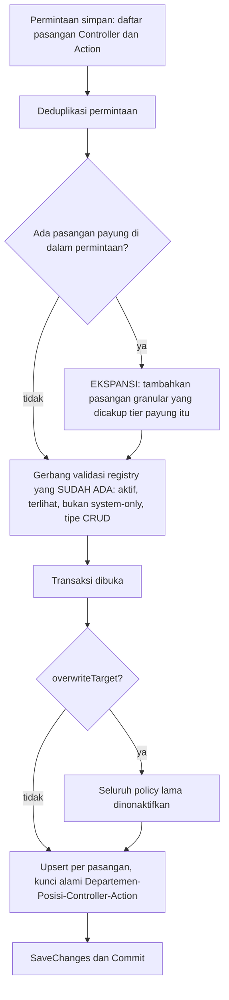
```mermaid
flowchart TD
    A["Permintaan simpan: daftar pasangan Controller dan Action"] --> B["Deduplikasi permintaan"]
    B --> C{"Ada pasangan payung di dalam permintaan?"}
    C -- tidak --> E
    C -- ya --> D["EKSPANSI: tambahkan pasangan granular yang dicakup tier payung itu"]
    D --> E["Gerbang validasi registry yang SUDAH ADA: aktif, terlihat, bukan system-only, tipe CRUD"]
    E --> F["Transaksi dibuka"]
    F --> G{"overwriteTarget?"}
    G -- ya --> H["Seluruh policy lama dinonaktifkan"]
    G -- tidak --> I
    H --> I["Upsert per pasangan, kunci alami Departemen-Posisi-Controller-Action"]
    I --> J["SaveChanges dan Commit"]
```

| Keputusan penempatan | Alasan |
|---|---|
| Ekspansi **sebelum** gerbang validasi | Baris hasil ekspansi diperlakukan sama ketatnya dengan baris yang dicentang admin. Bila satu identitas granular pada peta ternyata sudah pensiun/tersembunyi, permintaan **ditolak** — bukan diam-diam menghasilkan payung yang memberi lebih sedikit daripada yang tertulis di kontrak |
| Pesan penolakannya **menyebut identitas yang hilang** | Gerbang validasi yang sudah ada hanya berkata "Terdapat akses yang tidak valid". Untuk ekspansi, pesan itu tidak dapat ditindaklanjuti siapa pun. Ekspansi **MUST** menolak dengan menyebut pasangan mana yang tidak terselesaikan, mengikuti gaya gerbang `be-sec-003b-policy-expansion.sql` |
| Ekspansi **di dalam** transaksi yang sudah ada | Payung dan granularnya tersimpan atau batal bersama. Tidak ada keadaan setengah jadi tempat payung tercatat tetapi granularnya tidak |
| Idempoten tanpa kode tambahan | Upsert di langkah terakhir sudah berkunci alami (Departemen, Posisi, Controller, Action). Menjalankan ekspansi dua kali menghasilkan keadaan yang sama |
| Nol perubahan pada `HasAccessAsync` | Inilah inti `FIN-DEC-083`. Algoritma otorisasi yang dipakai **seluruh** modul aplikasi tidak disentuh sama sekali |

**Perilaku pencabutan, ditulis apa adanya karena inilah yang paling mudah disalahpahami.** Layar
Akses Role mengirim **seluruh** himpunan izin yang diinginkan untuk satu Departemen x Posisi, dan
`SavePolicies` memakai `overwriteTarget: true`. Sesudah materialisasi, baris granular ikut tampil
**tercentang** pada layar (karena layar membaca policy yang benar-benar ada). Akibatnya:

| Yang dilakukan admin | Yang terjadi | Sesuai `FIN-DEC-083`? |
|---|---|---|
| Mencentang payung lalu simpan | Payung + seluruh granular tercakup tersimpan | Ya |
| **Hanya** melepas centang payung lalu simpan | Granular **tetap ada** — ia masih tercentang di layar, jadi ikut terkirim ulang | Ya — "mencabut payung tidak otomatis mencabut granularnya" |
| Melepas centang payung **dan** granularnya lalu simpan | Keduanya hilang | Ya — inilah "langkah eksplisit terpisah" yang dimaksud keputusan |
| Menyalin dari role lain | Baris granular yang sudah termaterialisasi ikut tersalin apa adanya; ekspansi berjalan lagi dan menjadi no-op | Ya |

Perilaku itu **tidak perlu kode tambahan**: ia jatuh langsung dari semantik `overwriteTarget` yang
sudah ada. Yang **MUST** dijaga implementasi adalah tidak menambahkan cascade pencabutan otomatis,
karena itu justru melanggar `FIN-DEC-083`.

**Contoh berangka.** Departemen Keuangan x Posisi Staf AP diberi `Finance.AP.Umbrella : View` dan
`Operate`. Sesudah simpan, baris `SysAccessPolicy` yang tersimpan: 2 baris payung + seluruh pasangan
granular tier `View` (9 resource x aksi `Read`) + tier `Operate` (aksi maker pada 9 resource itu).
Staf itu kemudian dapat membuka layar Purchase Order, membuat draf PO, dan mengajukannya — tanpa
admin pernah mencentang sembilan resource satu per satu.

### FIN-DES-068 — Peta payung ke granular: satu berkas, dan kontrak sinkronisasinya dengan dokumen

Peta ditulis sebagai **satu daftar statis di satu berkas**, bukan tabel database dan bukan atribut
yang disebar ke 13 controller.

| Pilihan | Diterima? | Alasan |
|---|:---:|---|
| Satu berkas statis | **Ya** | Satu tempat untuk dibaca saat audit ("apa saja yang diberikan payung AP?" dijawab satu berkas), dan dapat di-*diff* langsung terhadap D.3 kontrak. Nol perubahan pada 13 controller, sehingga nol risiko merusak izin yang sudah berjalan |
| Tabel database yang dapat disunting admin | **Tidak** | Siapa pun yang dapat menyunting peta dapat menaikkan hak aksesnya sendiri. Peta eskalasi hak akses yang dapat disunting dari layar adalah permukaan serangan baru, bukan kenyamanan |
| Atribut pada tiap aksi di 13 controller | **Tidak** | Sekitar 55 baris atribut tersebar di 13 berkas; untuk menjawab satu pertanyaan audit, peninjau harus membuka 13 berkas. Kedekatan kalah penting dibanding auditabilitas untuk peta sekuriti |

Kontrak sinkronisasi yang mengikat, diturunkan dari peringatan `FIN-DEC-079` sendiri:

1. `contracts/permission-audit-matrix.md` D.3 tetap **satu-satunya sumber kebenaran** isi peta.
   Berkas kode adalah cerminannya, bukan saingannya.
2. Setiap resource granular baru di rumpun AP/AR **MUST** ditambahkan ke keduanya pada perubahan
   yang sama. Menambah ke salah satu saja adalah cacat yang **MUST** ditolak saat review.
3. Peta **MUST NOT** memuat resource di luar daftar D.3 — termasuk `Finance.AP`/`Finance.AR` milik
   controller V2, yang justru **tidak** dicakup payung mana pun (`FIN-DEC-082`).

### FIN-DES-069 — Butir menu memakai resource granular; payung murni alat pemberian massal

Menutup `FIN-OQ-036` dengan jawaban yang berpijak pada source, bukan pada premis yang keliru
(`I.1` temuan 3).

| Hal | Ketentuan |
|---|---|
| Butir menu "Pembelian" dan "Tagihan Gabungan Penjamin" yang akan dibangun `FE-FIN-008`..`014` | Dijaga resource **granular** yang sama persis dengan yang dituntut endpointnya — mis. butir "Purchase Order" dijaga `FinancePurchaseOrder : Read`, bukan payung |
| Butir menu V2 yang sudah ada (`/finance/payable*`, `/finance/receivable*`) | **Tidak disentuh.** Tetap dijaga `Finance.AP`/`Finance.AR` milik controller V2 — konsisten dengan endpoint yang dipanggilnya, dan konsisten dengan `FIN-DEC-082` |
| Peran payung terhadap menu | **Nol.** Payung tidak pernah diperiksa penyaring menu. Ia hanya alat admin untuk memberi 9/4 izin granular sekaligus; sesudah materialisasi, pemegangnya memiliki pasangan granular yang sungguhan, sehingga penyaring menu granular menampilkannya |
| Kenapa ini aman | Penyaring menu (`filter-menu-items-by-permission.jsx`) memeriksa pasangan resource dan action terhadap daftar izin efektif dari `GET auth/permissions`, yang dibangun `GetEffectivePermissionsAsync` dari `SysAccessPolicy` apa adanya. Baris hasil materialisasi **adalah** baris `SysAccessPolicy` biasa, sehingga ikut terbaca tanpa perlakuan khusus |

Dengan ini, klaim "frontend tidak perlu diubah" pada `FIN-DEC-079` menjadi benar untuk alasan yang
**berbeda** dari yang tertulis di sana: bukan karena payung dipakai penyaring menu, melainkan karena
butir menu yang dijaga payung hari ini memang milik V2 dan tidak berubah — sementara butir menu
Purchasing yang baru memang belum pernah ada, sehingga tidak ada yang "diubah", hanya ditulis benar
sejak awal oleh `FE-FIN-014`.

## I.4 Dua temuan yang dilaporkan, bukan diperbaiki di sini

| ID | Temuan | Pemilik perbaikan | Kenapa tidak diperbaiki di sini |
|---|---|---|---|
| `FIN-CQ-09` | Butir menu "Report AR" dan "Report AP" dijaga `Finance.AR : Report` / `Finance.AP : Report` — aksi yang tidak pernah dideklarasikan controller mana pun, sehingga kedua butir tersembunyi permanen bagi semua orang | Frontend (memakai `View`, sesuai endpoint `/report` yang memang dijaga `View`) **atau** Backend (mendeklarasikan aksi `Report`) — keputusan pemilik | Menyentuh perilaku menu yang sudah berjalan, di luar cakupan amendment ini. Perbaikan satu baris, tetapi arah perbaikannya adalah keputusan, bukan pekerjaan mekanis |
| `FIN-CQ-10` | Dokumen menyebut berkas penyaring menu `src/utils/menu-sidebar/corporateFinance.js` yang **tidak ada**; yang nyata `menu-items.jsx` + `permission/filter-menu-items-by-permission.jsx` | Dokumentasi | Dikoreksi pada pass ini — lihat `03-frontend-architecture.md` bagian 15.4 |

## I.5 Gerbang yang terbuka

| ID | Pertanyaan | Pihak yang berwenang | Menahan apa |
|---|---|---|---|
| ~~`FIN-OQ-038`~~ | ~~Pembawa resource payung: **(C)** controller Finance baru yang memiliki resource payung beserta satu endpoint nyata, atau **(D)** perluasan `platform-authorization` supaya resource tanpa endpoint dapat dideklarasikan?~~ | — | **CLOSED 29 September 2026** oleh `FIN-DEC-084`: dipilih **(D) perluasan platform**. Opsi (C) ditolak karena endpoint yang keberadaannya terutama untuk membawa resource adalah jebakan jangka panjang — peninjau berikutnya wajar menghapusnya sebagai endpoint mati, dan itu diam-diam mematikan seluruh pemberian hak lewat payung |
| `FIN-OQ-039` | Persetujuan dan penjadwalan perluasan registry supaya resource tanpa endpoint dapat dideklarasikan (opt-in eksplisit, penjaga anti-typo yang ada **tetap** dipertahankan) | Security Owner + pemilik `platform-authorization`. `FIN-DEC-084` adalah keputusan **sisi Finance** — ia meminta, bukan menyetujui atas nama modul lain | **Hanya** implementasi mekanisme ekspansi. **Tidak** menahan `BE-FIN-042` D.5 (rename 6 controller) dan D.6.1 (skrip migrasi `SysAccessPolicy`) yang sudah selesai dan berdiri sendiri, maupun pekerjaan frontend mana pun |

## I.6 Batas kepemilikan yang MUST dijaga implementasi

Amendment ini menyentuh kode milik modul lain, dan itu dicatat terbuka — bukan diselundupkan sebagai
"pekerjaan Finance":

| Bagian | Pemilik | Catatan |
|---|---|---|
| `RoleAccessController.ApplyPoliciesAsync` (titik tulis ekspansi) | **Platform** (`platform-authorization`) | Finance menyumbang kebutuhan dan peta, bukan kewenangan. Perubahan di sini **MUST** ditinjau pemilik platform |
| Isi peta payung ke granular | **Finance** | Finance memiliki daftar resource AP/AR-nya sendiri |
| Mekanisme generik (bila kelak dipakai modul lain) | **Platform** | Dirancang generik sejak awal supaya modul lain tidak menyalin logika yang sama |

## I.7 Status model dan rencana migration

| Hal | Nilai |
|---|---|
| Tabel baru | **NOL** |
| Kolom baru | **NOL** |
| Migration EF Core | **NOL** |
| Skrip SQL data | **NOL** yang baru. Skrip `be-fin-042-role-permissions-migration.sql` (`BE-FIN-042`) berdiri sendiri dan tidak terdampak amendment ini |
| Data master awal | **NOL**. Payung bukan data master; ia identitas registry yang lahir dari atribut source |

## I.8 Yang sengaja tidak dibuat pada amendment ini

| Yang ditolak | Alasan penolakan |
|---|---|
| Ekspansi dihitung saat request (`HasAccessAsync` diperluas) | Ditolak `FIN-DEC-083`. Mengubah algoritma otorisasi yang dipakai seluruh modul aplikasi demi kenyamanan satu modul |
| Cascade pencabutan otomatis payung ke granular | Melanggar `FIN-DEC-083`. Pencabutan granular adalah langkah eksplisit admin |
| Tabel peta payung yang dapat disunting dari layar | Permukaan eskalasi hak akses. Lihat `FIN-DES-068` |
| Mengganti nama resource `Finance.AP`/`Finance.AR` milik controller V2 | Ditolak `FIN-DEC-082`. Menuntut migrasi data peran tambahan tanpa kebutuhan langsung |
| Memperbaiki `FIN-CQ-09` di sini | Arah perbaikannya keputusan pemilik, bukan pekerjaan mekanis. Lihat `I.4` |
| Payung untuk rumpun di luar AP/AR (Cash, Master Data, Accounting Integration) | `FIN-DEC-079` D.3 secara eksplisit menempatkannya sebagai resource mandiri. Menambah payung ketiga tanpa permintaan adalah perluasan cakupan |


---

# AMENDMENT REVISI 13 — Pelacakan Klaim Penjamin dan Pemecahan Layar ke Bentuk V1 (`FIN-DEC-094`..`FIN-DEC-098`)

| Field | Nilai |
|---|---|
| Pemicu | `/grill-me` Amendment pass 1 Oktober 2026, yang sendiri dipicu perbandingan owner antara menu Keuangan sistem produksi V1 (`QuilvianSystemFrontendDev1`/`QuilvianSystemBackendDev1`, UAT-approved) dengan menu `finance` governed |
| Keputusan yang diturunkan | `FIN-DEC-094` (penempatan halaman mengikuti V1, supersedes `FIN-DEC-060`), `FIN-DEC-095` (Manajemen Klaim = sisi keuangan saja), `FIN-DEC-096` (Ayat Silang tidak butuh kapabilitas baru), `FIN-DEC-097` (Manajemen Klaim = perluasan `FinReceivableInvoiceBatch`), `FIN-DEC-098` (wewenang staf AR, tanpa jenjang approval) |
| Keputusan arsitektur baru | `FIN-DES-070`..`FIN-DES-073` — seluruhnya **`draft`**, belum disetujui owner |
| Dampak skema | **ADA.** Nol tabel baru. **Satu tabel `Diperbarui`** (`FinReceivableInvoiceBatch`, tujuh kolom baru) + satu check constraint + satu index. Satu migration |
| Dampak hak akses | **NOL** resource baru, **NOL** action baru. Seluruh endpoint baru memakai pasangan yang sudah terdaftar — karena itu amendment ini **tidak** bergantung pada gerbang `FIN-OQ-039` yang masih terbuka |
| Dampak lintas modul | **NOL.** Verifikasi dokumen klaim tetap milik Billing/Casemix (`FIN-DEC-095`); Finance tidak membaca maupun menulis ke sana pada amendment ini |

## J.1 Apa yang diperiksa pada source

Impact scan read-only dijalankan pada backend `d6978487` dan frontend `d2e8a3538` — **keduanya
bergerak** dari SHA yang tercatat `01-existing-capability-map.md` (`d6cdfaf9`/`49b59cfaa`), karena
pekerjaan `BE-FIN-044`..`051` dan `FE-FIN-004`..`015` berjalan sesudahnya. Pemindaian dibatasi pada
area terdampak: agregat Batch Tagihan AR, permukaan penerimaan/piutang, dan rute frontend `finance`.

Sebelum pass ini, `trace-existing-capabilities` penuh dijalankan atas **dua pasang repository**
(governed vs V1) untuk menjawab pertanyaan owner "menu apa yang belum tampil". Hasilnya memperkecil
cakupan amendment ini secara drastis, dan **MUST** dibaca sebagai pembatas scope:

| # | Dugaan sebelum audit | Kenyataan pada source | Akibat pada amendment ini |
|---:|---|---|---|
| 1 | Puluhan layar Keuangan V1 hilang dari sistem governed | Mayoritas sudah ada, sebagian bahkan lebih matang. Belasan lainnya sengaja dimiliki modul lain: COA/Buku Besar/Jurnal milik **Accounting** (`FIN-OOS-002`), Master Bank/Supplier milik **Administrator**, Master Tarif milik **Health Services** | Nol kapabilitas dibangun ulang untuk kelompok itu |
| 2 | Ayat Silang adalah kapabilitas yang hilang | Secara fungsional sama dengan alokasi penerimaan yang sudah berjalan (`FE-FIN-004`, `BE-FIN-016`..`018`) | `FIN-DEC-096` — nol model, nol endpoint, nol layar baru. Hanya butir menu |
| 3 | Manajemen Klaim punya aturan bisnis V1 yang bisa dirujuk | Layar V1-nya **murni `useState(dummyData)`** — tidak pernah memanggil API sama sekali | Aturan bisnisnya **MUST** digali dari owner, bukan disalin. Sudah dilakukan: `FIN-DEC-095`, `097`, `098` |
| 4 | Beberapa laporan AR/AP V1 butuh endpoint baru | `GET /goods-receipts`, `GET /receipts/register`, keempat laporan Purchasing, dan filter `Status` pada daftar batch **sudah ada** | Pemecahan layar sebagian besar nol pekerjaan backend |
| 5 | — (tidak diperiksa sebelumnya) | Daftar write-off **lintas piutang** tidak ada — `write-offs` hanya `POST` per piutang. Daftar alokasi yang dibalik juga tidak ada | Dua endpoint `GET` baru, lihat `J.5` |

## J.2 Tabel kepemilikan data — perubahan

Nol kelompok data baru. Nol pemilik berubah. Nol tabel dibuat ulang.

| Kelompok data | Modul pemilik | Dipakai modul ini | Dibuat ulang di modul ini | Perubahan amendment ini |
|---|---|:---:|---|---|
| Batch Tagihan AR (`FinReceivableInvoiceBatch`) | **Finance Management** | Ya | Tidak — sudah dimiliki sendiri | **Bertambah tujuh kolom** sumbu klaim |
| Piutang (`FinReceivable`) | Finance Management | Ya | Tidak | **Tidak berubah.** Selisih klaim **MUST NOT** mengurangi `OutstandingAmount` otomatis |
| Verifikasi dokumen klaim, SEP, kelengkapan administrasi | **Billing/Casemix** (modul lain) | **Tidak** pada amendment ini | **Tidak** | Dibatasi tegas `FIN-DEC-095` |
| Penghapusan piutang (`FinReceivableWriteOff`) | Finance Management | Ya | Tidak | Bertambah **satu endpoint baca lintas piutang**; model tidak berubah |
| Alokasi penerimaan (`FinReceiptAllocation`) | Finance Management | Ya | Tidak | Bertambah **satu endpoint baca** baris yang dibalik; model tidak berubah |

## J.3 Keputusan arsitektur baru

### `FIN-DES-070` — Status klaim adalah **sumbu kedua**, bukan perluasan enum status yang ada

Ini keputusan desain paling menentukan pada amendment ini, dan ia **berbeda dari bacaan harfiah**
`FIN-DEC-097`. Owner menyebut satu rantai: *Diajukan Diverifikasi Payer Disetujui (sebagian/
penuh) Dibayar Sebagian/Lunas Ditutup*. Pada source, dua ruas rantai itu sudah dipegang kolom
`Status` yang ada, dan **penulisnya berbeda**:

| Ruas rantai owner | Dipegang | Penulis | Bukti |
|---|---|---|---|
| Diajukan | `Status = ISSUED` | Petugas AR | `state-transition-matrix.md` B.7 |
| Diverifikasi Payer | **belum ada** | Petugas AR (manual) | — |
| Disetujui (sebagian/penuh) | **belum ada** | Petugas AR (manual) | — |
| Dibayar Sebagian / Lunas | `Status = PARTIALLY_PAID` / `PAID` | **Sistem**, diturunkan dari pelunasan anggota | `state-transition-matrix.md` B.7 |
| Ditutup | **belum ada** | Petugas AR (manual) | — |

Menggabungkan keduanya ke satu kolom berarti sebuah batch **tidak dapat** berada pada dua keadaan
yang sah secara bersamaan — misalnya "payer sudah menyetujui nominal, tetapi uangnya belum masuk
sama sekali". Keadaan itu justru keadaan normal pada klaim penjamin, dan merupakan inti dari apa
yang ingin dipantau. Penggabungan juga akan membuat petugas AR menjadi penulis status pelunasan,
membatalkan invariant yang dijaga sejak `FIN-DES-041`: **status batch tidak pernah menjadi sumber
kebenaran baru untuk pelunasan.**

Karena itu: kolom `ClaimStatus` baru, **nullable**, dengan empat nilai tersimpan; ruas "Dibayar"
tetap dibaca dari kolom `Status` yang sudah ada. Rantai tunggal yang dilihat owner disusun di
layar dari kedua sumbu — itu urusan penyajian, bukan urusan skema.

| `ClaimStatus` | Arti bagi petugas | Diisi oleh |
|---|---|---|
| `null` | Batch belum diterbitkan ke penjamin | — (bawaan) |
| `SUBMITTED` | Tagihan sudah dikirim ke penjamin | **Sistem**, saat batch diterbitkan (`POST /{id}/issue` yang sudah ada) |
| `PAYER_VERIFIED` | Penjamin menyatakan berkasnya diterima dan lengkap | Petugas AR, manual |
| `APPROVED` | Penjamin menyatakan nominal yang disetujui | Petugas AR, manual, **wajib menyertakan nominal** |
| `CLOSED` | Klaim ditutup; tidak ada tindak lanjut lagi | Petugas AR, manual |

Tidak ada nilai `NOT_SUBMITTED`. Owner tidak menyebutnya, dan `null` sudah menyatakan hal yang sama
tanpa mengarang status keenam.

### `FIN-DES-071` — Selisih nominal yang tidak disetujui penjamin **tidak** disentuh sistem

`FIN-DEC-097` menetapkan selisih dicatat sebagai item terpisah yang **memerlukan write-off manual**.
Konsekuensi arsitekturnya ditulis tegas supaya tidak diterjemahkan keliru saat implementasi:

| Yang **MUST** terjadi | Yang **MUST NOT** terjadi |
|---|---|
| Selisih `TotalAmount` dikurangi `ApprovedAmount` **dihitung pada response**, tidak disimpan | Menyimpan kolom selisih yang bisa basi terhadap kedua sumbernya |
| Selisih ditampilkan sebagai pekerjaan yang menunggu petugas | Sistem membuat baris write-off otomatis |
| Penghapusan dilakukan petugas per `FinReceivable` lewat jalur write-off yang sudah ada (`POST /receivables/{id}/write-offs`, maker-checker `BE-FIN-018`) | `OutstandingAmount` berkurang karena persetujuan klaim |
| Jenjang approval write-off yang sudah ada **tetap berlaku apa adanya** | Melewati maker-checker write-off dengan alasan "sudah disetujui di klaim" |

`FIN-DEC-098` (staf AR, tanpa jenjang) berlaku pada **perubahan status klaim**, bukan pada
write-off. Keduanya proses berbeda: menyatakan apa kata penjamin tidak sama dengan menghapus
piutang dari buku.

### `FIN-DES-072` — Nol resource dan nol action hak akses baru

Perubahan status klaim memakai `FinanceReceivableInvoiceBatch : Update` yang **sudah terdaftar**
(`[AccessAction("Update", ...)]` pada `FinanceReceivableInvoiceBatchesController`). Ini turunan
langsung `FIN-DEC-098`: wewenangnya sama dengan petugas yang sudah boleh mengelola batch, tanpa
jenjang tambahan.

Akibat yang perlu dicatat: amendment ini **tidak bergantung** pada `FIN-OQ-039` (perluasan registry
resource tanpa endpoint) yang masih menunggu Security Owner, dan **tidak** menambah baris registry
apa pun.

### `FIN-DES-073` — Layar hasil pemecahan memakai endpoint yang sudah ada, dengan saringan bawaan

`FIN-DEC-094` menuntut layar dipecah mengikuti V1. Pemecahan itu **MUST NOT** diterjemahkan menjadi
satu endpoint per layar. Belasan layar hasil pemecahan adalah **pandangan tersaring** atas permukaan
yang sudah ada — saringannya ditetapkan layar, datanya tetap satu sumber:

| Contoh layar hasil pemecahan | Endpoint yang dipakai | Saringan bawaan |
|---|---|---|
| Canceled Invoice | `GET /receivable-invoice-batches` | `Status = CANCELLED` |
| Rekap Purchasing AP, Laporan Tukar Faktur, Laporan Jatuh Tempo, Rekonsiliasi Tagihan | Keempat endpoint `purchasing/reports` yang sudah ada | — (satu endpoint per laporan, memang sudah terpisah) |
| Penerima Pesanan | `GET /goods-receipts` | — |

Hanya dua layar yang benar-benar tidak punya permukaan baca: lihat `J.5`.

## J.4 Class diagram — agregat Batch Tagihan AR sesudah amendment

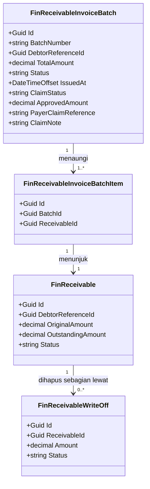
```mermaid
classDiagram
    class FinReceivableInvoiceBatch {
        +Guid Id
        +string BatchNumber
        +Guid DebtorReferenceId
        +decimal TotalAmount
        +string Status
        +DateTimeOffset IssuedAt
        +string ClaimStatus
        +decimal ApprovedAmount
        +string PayerClaimReference
        +string ClaimNote
    }
    class FinReceivableInvoiceBatchItem {
        +Guid Id
        +Guid BatchId
        +Guid ReceivableId
    }
    class FinReceivable {
        +Guid Id
        +Guid DebtorReferenceId
        +decimal OriginalAmount
        +decimal OutstandingAmount
        +string Status
    }
    class FinReceivableWriteOff {
        +Guid Id
        +Guid ReceivableId
        +decimal Amount
        +string Status
    }
    FinReceivableInvoiceBatch "1" --> "1..*" FinReceivableInvoiceBatchItem : menaungi
    FinReceivableInvoiceBatchItem "1" --> "1" FinReceivable : menunjuk
    FinReceivable "1" --> "0..*" FinReceivableWriteOff : dihapus sebagian lewat
```

Selisih klaim sengaja **tidak** digambar sebagai class. Ia angka turunan, bukan entity — lihat
`FIN-DES-071`.

### Penjelasan class yang berubah

| Aspek | Penjelasan |
|---|---|
| **Status** | `Diperbarui` |
| **Lokasi file** | `Areas/Corporate/FinanceManagement/Receivable/Models/FinReceivableInvoiceBatch.cs` |
| Kategori | Transaksi — aggregate root |
| Tanggung jawab utama | Menggabungkan beberapa piutang satu penjamin menjadi satu dokumen tagihan resmi. Amendment ini menambahkan **sumbu kedua**: apa jawaban penjamin atas tagihan itu, terpisah dari apakah uangnya sudah masuk |
| Field penting yang ditambahkan | `ClaimStatus`, `ApprovedAmount`, `PayerClaimReference`, `ClaimNote`, `PayerVerifiedAt`, `ClaimApprovedAt`, `ClaimClosedAt` |
| Navigation property dan relasi | Tidak berubah — tetap menaungi `FinReceivableInvoiceBatchItem` |
| Pemakaian dalam alur bisnis | Petugas AR mencatat jawaban penjamin setelah tagihan dikirim, lalu menutup klaim ketika tidak ada tindak lanjut lagi |
| Catatan desain | `ClaimStatus` **MUST NOT** mengubah `Status`, dan **MUST NOT** menyentuh `OutstandingAmount` piutang anggota. `ApprovedAmount` **MUST NOT** dipakai sebagai dasar perhitungan pelunasan |
| Ekuivalen model lama | `Fin_ARHeader` (V1) sebatas konsep dokumen tagihan; V1 tidak punya padanan sumbu klaim yang berfungsi |

| Aspek | Penjelasan |
|---|---|
| **Status** | `Diperbarui` |
| **Lokasi file** | `Areas/Corporate/FinanceManagement/Receivable/Services/FinanceReceivableInvoiceBatchService.cs` |
| Kategori | Service |
| Tanggung jawab utama | Bertambah tiga operasi perpindahan status klaim beserta penegakan syaratnya; menghitung selisih klaim pada response |
| Dipanggil oleh | `FinanceReceivableInvoiceBatchesController` |
| Membuka transaksi database | Ya, untuk setiap perpindahan status klaim — satu perpindahan satu transaksi, memakai `RowVersion` sebagai concurrency token yang sudah ada |
| Catatan desain | **MUST NOT** memanggil `FinanceReceivableService` untuk mengubah piutang. Jalur write-off tetap milik service piutang |

| Aspek | Penjelasan |
|---|---|
| **Status** | `Diperbarui` |
| **Lokasi file** | `Areas/Corporate/FinanceManagement/Receivable/Controllers/FinanceReceivableInvoiceBatchesController.cs` |
| Kategori | Controller |
| Service yang dipakai | `FinanceReceivableInvoiceBatchService` |
| Endpoint yang diurus | Bertambah tiga aksi klaim (lihat `J.5`) |
| Atribut akses | Ketiganya `[AccessPermission("FinanceReceivableInvoiceBatch", "Update")]` — **tidak ada** action baru |

## J.5 Endpoint yang bertambah

Rinciannya ada di `contracts/api-contract.md` (`FIN-API-1.3`). Ringkasnya lima, seluruhnya
`Rencana (belum tersedia)`:

| # | Method dan path | Kegunaan | Hak akses | Alasan keberadaannya |
|---:|---|---|---|---|
| 1 | `POST /receivable-invoice-batches/{id}/claim/verify` | Menandai berkas klaim diterima penjamin | `FinanceReceivableInvoiceBatch : Update` | `FIN-DEC-097` |
| 2 | `POST /receivable-invoice-batches/{id}/claim/approve` | Mencatat nominal yang disetujui penjamin | `FinanceReceivableInvoiceBatch : Update` | `FIN-DEC-097` |
| 3 | `POST /receivable-invoice-batches/{id}/claim/close` | Menutup klaim | `FinanceReceivableInvoiceBatch : Update` | `FIN-DEC-097` |
| 4 | `GET /receivables/write-offs` | Daftar penghapusan piutang **lintas piutang** | `FinanceReceivable : Read` | Layar "Pemutihan Piutang" (`FIN-DEC-094`); hari ini write-off hanya dapat dibuat, tidak dapat didaftar |
| 5 | `GET /receipts/reversed-allocations` | Daftar alokasi penerimaan yang dibalik | `FinanceReceipt : Read` | Layar "Receiveable AR Canceled" (`FIN-DEC-094`); grainnya baris alokasi, bukan penerimaan, sehingga tidak dapat ditumpangkan ke `GET /receipts/register` |

Aksi perpindahan status memakai bentuk `POST /{id}/<aksi>` sesuai `transaction-endpoint-standard`,
**bukan** `PATCH /{id}/status` generik.

## J.6 Status model, migration, dan data master

| Model | Status | Kolom yang berubah | Dampak migration |
|---|---|---|---|
| `FinReceivableInvoiceBatch` | **`Diperbarui`** | tambah `ClaimStatus` varchar(30) null; tambah `ApprovedAmount` numeric(18,2) null; tambah `PayerClaimReference` varchar(100) null; tambah `ClaimNote` varchar(500) null; tambah `PayerVerifiedAt` timestamptz null; tambah `ClaimApprovedAt` timestamptz null; tambah `ClaimClosedAt` timestamptz null | Satu migration |
| `FinReceivableInvoiceBatchItem` | `Sudah ada` | — | — |
| `FinReceivable`, `FinReceivableWriteOff`, `FinReceiptAllocation` | `Sudah ada` | — | — |

### Rencana migration

| Field | Nilai |
|---|---|
| Nama | `AddClaimTrackingToFinReceivableInvoiceBatch` |
| Urutan | Satu-satunya pada amendment ini; tidak bergantung pada migration lain yang belum jalan |
| Dapat dijalankan tanpa mematikan layanan | **Ya.** Seluruh kolom nullable, nol kolom wajib, nol perubahan tipe, nol rename |
| Pengisian data lama | **Tidak ada backfill.** Batch lama berstatus `ClaimStatus` kosong, dibaca sebagai "belum diterbitkan ke penjamin" — benar secara bisnis untuk batch `DRAFT`, dan untuk batch `ISSUED` lama petugas mengisinya saat menindaklanjuti klaimnya |
| Constraint yang ditambahkan | `CK_FinReceivableInvoiceBatch_ClaimStatus`: `ClaimStatus` kosong, atau salah satu dari `SUBMITTED`, `PAYER_VERIFIED`, `APPROVED`, `CLOSED` |
| Index yang ditambahkan | `IX_FinReceivableInvoiceBatch_ClaimStatus` — layar Manajemen Klaim menyaring berdasarkan kolom ini |
| Langkah mundur | `Down()` menghapus ketujuh kolom beserta constraint dan index. Aman karena tidak ada kolom lama yang diubah |
| Wewenang | Pembuatan migration dan eksekusinya adalah **dua wewenang terpisah** dan keduanya **MUST** diminta eksplisit kepada pemilik repository, mengikuti pola seluruh amendment sebelumnya |

### Rencana data master awal

**Nol.** Amendment ini tidak menambah tabel master. Nilai `ClaimStatus` adalah konstanta domain pada
`static class FinReceivableInvoiceBatchClaimStatuses`, mengikuti pola
`FinReceivableInvoiceBatchStatuses` yang sudah ada — bukan tabel referensi, karena daftarnya
ditetapkan aturan bisnis dan tidak boleh disunting pengguna.

## J.7 Yang sengaja tidak dibuat pada amendment ini

| Yang ditolak | Alasan penolakan |
|---|---|
| Entity `FinClaim` tersendiri | Ditolak `FIN-DEC-097`. Satu klaim = satu batch yang sudah ada; entity baru akan menduplikasi `DebtorReferenceId`, periode, dan daftar anggota |
| Model Ayat Silang (`FinCrossEntry` atau sejenisnya) | Ditolak `FIN-DEC-096`. Secara fungsional sama dengan alokasi penerimaan yang sudah berjalan |
| Kolom selisih klaim yang disimpan | Dapat basi terhadap `TotalAmount` dan `ApprovedAmount`. Dihitung pada response — `FIN-DES-071` |
| Pembuatan write-off otomatis dari persetujuan klaim | Melanggar `FIN-DEC-097` secara langsung, dan melewati maker-checker write-off yang sudah ada |
| Tabel riwayat perpindahan status klaim | Tiga kolom tanda waktu sudah menjawab "kapan", dan kolom audit `IdentityModel` menjawab "oleh siapa" untuk perubahan terakhir. Tabel riwayat baru dibuat bila owner menuntut jejak setiap percobaan, bukan sekadar hasil akhirnya |
| Action hak akses baru (mis. `ManageClaim`) | Ditolak `FIN-DEC-098` — wewenangnya sama dengan pengelolaan batch. Action baru juga akan menambah baris registry yang menunggu pemberian admin, membuat layar mati sampai admin bertindak |
| Verifikasi dokumen klaim, SEP, kelengkapan berkas | Ditolak `FIN-DEC-095` — milik Billing/Casemix |
| Entity Jasa Medis AP | Sudah diputuskan milik modul Medical Fee (`FIN-OQ-012`/`FIN-OQ-013`), tidak dibuka ulang di sini |
| Satu endpoint baru per layar hasil pemecahan | Ditolak `FIN-DES-073`. Belasan layar adalah pandangan tersaring atas permukaan yang sama |

---

# AMENDMENT REVISI 13 (lanjutan) — Piutang Non-Pasien: Sewa Parkir dan Tenant (`FIN-DEC-099`..`FIN-DEC-104`)

| Field | Nilai |
|---|---|
| Pemicu | `/grill-me` penutupan `FIN-OQ-043`, 1 Oktober 2026 — gerbang yang dibuka pass desain hari yang sama |
| Keputusan yang diturunkan | `FIN-DEC-099` (milik Finance sepenuhnya), `FIN-DEC-100` (dicatat manual per periode, tanpa master kontrak), `FIN-DEC-101` (entity tersendiri, invariant `FinReceivable` tidak dilonggarkan), `FIN-DEC-102` (denda nominal manual), `FIN-DEC-103` (staf AR penuh, tanpa jenjang approval), `FIN-DEC-104` (satu entity, kolom `Category`) |
| Keputusan arsitektur baru | `FIN-DES-074`..`FIN-DES-077` — seluruhnya **`draft`** |
| Dampak skema | **ADA.** **Dua tabel baru** (`FinNonPatientReceivable`, `FinNonPatientReceivableSettlement`). Nol tabel lama berubah. Satu migration |
| Dampak hak akses | **ADA.** Satu resource baru `FinanceNonPatientReceivable` beserta tiga action. Terdaftar lewat pemindaian atribut biasa karena controllernya nyata — **tidak** bergantung pada `FIN-OQ-039` |
| Gerbang baru | `FIN-OQ-044` — integrasi pelunasan sewa ke kas harian, setoran bank, dan kotak keluar Accounting. Lihat `K.3`. **Diperbarui 1 Oktober 2026:** (a) dan (c) dijawab — sewa terpisah dari kas (`FIN-DEC-109`), rilis dengan banner (`FIN-DEC-110`); hanya (b) kode kejadian akuntansi yang terbuka |

## K.1 Apa yang diperiksa pada source

Impact scan read-only pada backend `d6978487` dan frontend `d2e8a3538` — tidak bergeser sejak pass
desain sebelumnya pada hari yang sama. Pemindaian dibatasi pada rumpun piutang dan penerimaan.

| # | Yang diperiksa | Temuan | Akibat pada desain ini |
|---:|---|---|---|
| 1 | Apakah `FinReceivable` dapat menampung piutang non-pasien | **Tidak.** Jenis debitur terbatas `PAYER`/`PATIENT_GUARANTOR`/`EMPLOYEE_BENEFIT`, dan setiap baris wajib punya `SourceHandoffKey`/`SourceHandoffId`/`InvoiceId` dari Billing | Dasar `FIN-DEC-101`; entity terpisah |
| 2 | Apakah `FinReceipt` dapat menerima uang yang bukan dari Billing | **Tidak.** Penerimaan lahir dari intake tender Billing; `POST /receipts` manual sengaja tidak pernah dibangun (dikecualikan sejak `BE-FIN-018`) | Pelunasan sewa butuh jalurnya sendiri — `FIN-DES-075` |
| 3 | Bagaimana kelompok umur piutang dihitung | `ReceivableAgingBuckets` pada `FinanceReceivableService.cs` baris 835-853: empat kelompok `0-30`, `31-60`, `61-90`, `di atas 90 hari` | **Dipakai ulang apa adanya** — `FIN-DES-074` |
| 4 | Bagaimana nomor bisnis dialokasikan rumpun ini | `GenerateBatchNumber()` memakai tanggal + GUID, dengan komentar `KNOWN ISSUE` bahwa provider number-series atomik (`QBE-CODE-001`..`006`) belum dipakai seluruh rumpun ini | Desain ini **mengikuti pola yang sama** dan **mewarisi utang teknis yang sama**, bukan memperbaikinya diam-diam — lihat `K.3` |
| 5 | Prefix pemilik pada registry | `Fin` untuk Finance Management, terbukti dari seluruh model rumpun ini | `FinNonPatientReceivable` sah; nol prefix baru diajukan |

## K.2 Tabel kepemilikan data

| Kelompok data | Modul pemilik | Dipakai modul ini | Dibuat ulang di modul ini | Catatan |
|---|---|:---:|---|---|
| Piutang sewa parkir dan tenant | **Finance Management** | Ya | **Ya — tabel baru**, karena belum ada pemiliknya di modul mana pun (`FIN-DEC-099`) | Bukan duplikasi: tidak ada modul properti/konsesi yang memilikinya |
| Piutang pasien (`FinReceivable`) | Finance Management | **Tidak** oleh kapabilitas ini | **Tidak** | Sengaja tidak disentuh (`FIN-DEC-101`) |
| Penerimaan dari Billing (`FinReceipt`) | Finance Management | **Tidak** oleh kapabilitas ini | **Tidak** | Pelunasan sewa punya jalur sendiri — lihat `FIN-DES-075` dan `FIN-OQ-044` |
| Kelompok umur piutang (`ReceivableAgingBuckets`) | Finance Management | Ya — **dipakai ulang** | **Tidak** | Satu definisi kelompok umur untuk seluruh modul |
| Master penyewa, master area parkir, master unit tenant | **Tidak ada pemiliknya** | **Tidak** | **Tidak** | `FIN-DEC-100` meniadakan master kontrak; nama penyewa dan objek sewa diketik petugas sebagai teks |

## K.3 Keputusan arsitektur baru

### `FIN-DES-074` — Agregat berdiri sendiri, tetapi kelompok umur piutang dipakai ulang

`FinNonPatientReceivable` adalah aggregate root tersendiri. Ia **tidak** punya relasi database apa
pun ke `FinReceivable`, `FinReceipt`, atau `BilInvoice`, dan **tidak** pernah menulis ke ketiganya.
Invariant "setiap piutang berasal dari serah terima Billing" pada `FinReceivable` tetap berlaku
**tanpa satu pun pengecualian** — inilah yang dibeli `FIN-DEC-101`.

Satu hal **dipakai ulang dengan sengaja**: definisi kelompok umur (`ReceivableAgingBuckets`). Bila
kapabilitas ini mendefinisikan kelompoknya sendiri, dua laporan umur piutang di modul yang sama
dapat memakai batas hari berbeda dan angkanya tidak dapat dijumlahkan. Yang dipakai ulang adalah
**definisi kelompoknya**, bukan tabel maupun service-nya.

### `FIN-DES-075` — Pelunasan dicatat langsung pada piutangnya, dan akibatnya dicatat terbuka

`FinReceipt` tidak dapat dipakai: ia lahir dari intake tender Billing, dan jalur penerimaan manual
sengaja tidak pernah dibangun. Karena itu pelunasan sewa dicatat sebagai baris anak
`FinNonPatientReceivableSettlement` langsung di bawah piutangnya.

**Akibat yang MUST dicatat apa adanya, bukan disembunyikan di balik kata "sederhana":**

| Akibat | Keadaannya |
|---|---|
| Uang sewa yang diterima **tidak** muncul pada kas harian maupun setoran bank | Kedua layar itu membaca `FinReceipt`, yang tidak dilewati jalur ini |
| **Nol** kejadian akuntansi terbit untuk pendapatan sewa maupun pelunasannya | Kotak keluar Accounting hanya menerima kode yang sudah diratifikasi; sewa belum punya kode apa pun |
| Rekonsiliasi rekening koran **tidak** mencakup pelunasan sewa | Konsekuensi langsung dari dua baris di atas |

> **Diperbarui 1 Oktober 2026 (`FIN-DEC-109`, `FIN-DEC-110`):** baris pertama dan ketiga di atas kini
> **keputusan**, bukan batas sementara — piutang sewa dikelola terpisah dari kas harian dan setoran
> bank. Hanya baris kedua (kejadian akuntansi) yang masih menunggu ratifikasi Accounting
> (`FIN-OQ-044(b)`).

Ketiganya **bukan** cacat desain yang ditutupi — ketiganya adalah konsekuensi sah dari memisahkan
jalur, dan menjadi isi `FIN-OQ-044`. Desain ini **MUST NOT** diimplementasikan sampai pemilik tahu
bahwa pada rilis pertama, uang sewa tercatat sebagai pelunasan piutang tetapi belum tercatat
sebagai kas masuk di mana pun.

### `FIN-DES-076` — Tanpa jenjang approval, dan batas penularannya dikunci

`FIN-DEC-103` menetapkan staf AR berwenang penuh: mencatat tagihan, mencatat pelunasan, menghapus
piutang, dan membatalkan — seluruhnya selesai dalam satu aksi, tanpa pemeriksa kedua.

| Yang berlaku | Yang **MUST NOT** terjadi |
|---|---|
| Penghapusan piutang sewa adalah satu perpindahan status langsung | Jalur ini dipakai untuk menghapus `FinReceivable` (piutang pasien) |
| Service kapabilitas ini **tidak** memiliki konsep pengajuan dan persetujuan | Maker-checker pada `FinReceivableWriteOff` dilonggarkan dengan alasan "di sewa sudah boleh" |
| Jejaknya hanya kolom audit `IdentityModel` beserta alasan yang wajib diisi | Penghapusan tanpa alasan tertulis |

Risiko yang diterima sadar: satu orang dapat mencatat piutang lalu menghapusnya sendiri. Mitigasi
yang tersedia tanpa mengubah keputusan: alasan penghapusan **wajib** diisi (`FIN-VAL-158`), dan
seluruh perubahan tercatat logger.

### `FIN-DES-077` — Satu resource hak akses baru, tiga action

| Resource | Action | Dipakai untuk |
|---|---|---|
| `FinanceNonPatientReceivable` | `Read` | Daftar, rincian, umur piutang |
| `FinanceNonPatientReceivable` | `Create` | Mencatat tagihan sewa baru |
| `FinanceNonPatientReceivable` | `Update` | Mencatat pelunasan, menghapus piutang, membatalkan, mengoreksi |

Ketiganya terdaftar lewat pemindaian atribut biasa karena controllernya nyata dan punya endpoint —
**berbeda** dari resource payung `FIN-OQ-039` yang tertahan justru karena tidak punya endpoint.
Nol ketergantungan pada gerbang itu.

Penghapusan dan pembatalan sengaja **tidak** mendapat action sendiri: `FIN-DEC-103` menyamakan
wewenangnya dengan perubahan biasa, dan action terpisah akan menyiratkan jenjang yang tidak ada.

### Utang teknis yang diwarisi, bukan diperbaiki di sini

Alokasi nomor bisnis mengikuti pola rumpun ini apa adanya (tanggal + GUID), **termasuk** komentar
`KNOWN ISSUE` bahwa provider number-series atomik `QBE-CODE-001`..`006` belum dipakai. Memperbaikinya
hanya untuk tabel baru akan membuat satu rumpun punya dua cara menomori. Perapiannya **MUST** menjadi
task tersendiri untuk seluruh rumpun.

## K.4 Class diagram

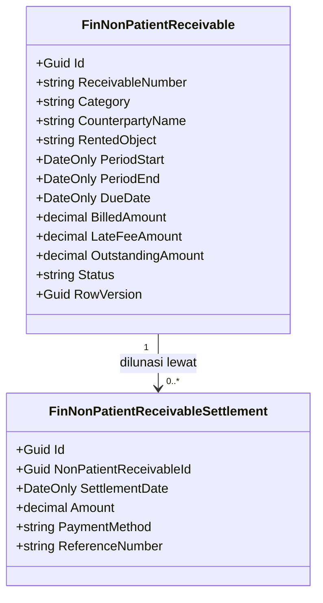
```mermaid
classDiagram
    class FinNonPatientReceivable {
        +Guid Id
        +string ReceivableNumber
        +string Category
        +string CounterpartyName
        +string RentedObject
        +DateOnly PeriodStart
        +DateOnly PeriodEnd
        +DateOnly DueDate
        +decimal BilledAmount
        +decimal LateFeeAmount
        +decimal OutstandingAmount
        +string Status
        +Guid RowVersion
    }
    class FinNonPatientReceivableSettlement {
        +Guid Id
        +Guid NonPatientReceivableId
        +DateOnly SettlementDate
        +decimal Amount
        +string PaymentMethod
        +string ReferenceNumber
    }
    FinNonPatientReceivable "1" --> "0..*" FinNonPatientReceivableSettlement : dilunasi lewat
```

Diagram ini sengaja **tidak** menggambar `FinReceivable` maupun `FinReceipt`: tidak ada relasi
apa pun di antaranya, dan menggambarnya akan menyiratkan hubungan yang justru dilarang `FIN-DES-074`.

### Penjelasan class

| Aspek | Penjelasan |
|---|---|
| **Status** | `Baru` |
| **Lokasi file** | `Areas/Corporate/FinanceManagement/Receivable/Models/FinNonPatientReceivable.cs` |
| Kategori | Transaksi — aggregate root |
| Tanggung jawab utama | Menyimpan satu tagihan sewa untuk satu periode, satu objek sewa, satu penyewa. Setiap periode adalah barisnya sendiri yang dicatat petugas (`FIN-DEC-100`) |
| Field penting | `Category` (`PARKING`/`TENANT`), `CounterpartyName`, `RentedObject`, `PeriodStart`, `PeriodEnd`, `DueDate`, `BilledAmount`, `LateFeeAmount`, `OutstandingAmount`, `Status` |
| Navigation property dan relasi | Memiliki banyak `FinNonPatientReceivableSettlement`. **Nol relasi** ke entity lain |
| Pemakaian dalam alur bisnis | Petugas AR mencatatnya tiap periode penagihan, lalu mencatat pelunasannya saat penyewa membayar |
| Catatan desain | **MUST NOT** diberi kolom rujukan ke `BilInvoice`, `FinReceivable`, atau `FinReceipt`. `OutstandingAmount` dihitung dari `BilledAmount + LateFeeAmount` dikurangi jumlah pelunasan — service ini **satu-satunya** penulisnya |
| Ekuivalen model lama | Tidak ada. Layar V1 Parkir/Tenant murni data contoh, nol tabel di baliknya |

| Aspek | Penjelasan |
|---|---|
| **Status** | `Baru` |
| **Lokasi file** | `Areas/Corporate/FinanceManagement/Receivable/Models/FinNonPatientReceivableSettlement.cs` |
| Kategori | Transaksi — anak |
| Tanggung jawab utama | Mencatat satu kali pembayaran yang diterima dari penyewa atas satu tagihan sewa |
| Field penting | `NonPatientReceivableId`, `SettlementDate`, `Amount`, `PaymentMethod`, `ReferenceNumber` |
| Navigation property dan relasi | Milik `FinNonPatientReceivable`, `DeleteBehavior.Restrict` |
| Pemakaian dalam alur bisnis | Dibuat petugas AR saat penyewa membayar, sebagian atau penuh |
| Catatan desain | Baris pelunasan **tidak pernah dihapus**; pembatalan pelunasan dilakukan dengan mencatat baris pelunasan bernilai negatif, mengikuti pola "tidak pernah menghapus, selalu menambah baris" yang berlaku di seluruh blueprint ini. **Belum** mengalir ke kas harian atau kotak keluar Accounting — `FIN-OQ-044` |
| Ekuivalen model lama | Tidak ada |

| Aspek | Penjelasan |
|---|---|
| **Status** | `Baru` |
| **Lokasi file** | `Areas/Corporate/FinanceManagement/Receivable/Services/FinanceNonPatientReceivableService.cs` |
| Kategori | Service |
| Tanggung jawab utama | Seluruh CRUD dan perpindahan status piutang sewa, perhitungan `OutstandingAmount`, dan perhitungan kelompok umur memakai `ReceivableAgingBuckets` yang sudah ada |
| Dipanggil oleh | `FinanceNonPatientReceivablesController` |
| Membuka transaksi database | Ya — pencatatan pelunasan dan perubahan `OutstandingAmount` dalam satu transaksi, memakai `RowVersion` sebagai concurrency token |
| Catatan desain | **MUST NOT** memanggil `FinanceReceivableService`, `FinanceReceiptService`, atau `FinanceAccountingOutboxService`. Ketiadaan panggilan terakhir itu **disengaja** dan menjadi isi `FIN-OQ-044` |

| Aspek | Penjelasan |
|---|---|
| **Status** | `Baru` |
| **Lokasi file** | `Areas/Corporate/FinanceManagement/Receivable/Controllers/FinanceNonPatientReceivablesController.cs` |
| Kategori | Controller |
| Service yang dipakai | `FinanceNonPatientReceivableService` |
| Endpoint yang diurus | Sepuluh, lihat `K.6` |
| Atribut akses | `[AccessController(..., ControllerName = "FinanceNonPatientReceivable", ...)]`; tiga `[AccessAction]`: `Read`, `Create`, `Update` |

## K.5 Arsitektur folder

```text
Areas/Corporate/FinanceManagement/Receivable/
├── Controllers/
│   ├── FinanceReceivablesController.cs                     # sudah ada
│   ├── FinanceReceivableInvoiceBatchesController.cs        # sudah ada, diperbarui amendment klaim
│   ├── FinanceArController.cs                              # sudah ada, V2 legacy
│   └── FinanceNonPatientReceivablesController.cs           # BARU
├── Models/
│   ├── FinReceivable.cs                                    # sudah ada, TIDAK disentuh
│   ├── FinNonPatientReceivable.cs                          # BARU
│   └── FinNonPatientReceivableSettlement.cs                # BARU
├── Services/
│   └── FinanceNonPatientReceivableService.cs               # BARU
└── DTOs/
    └── FinanceNonPatientReceivableDtos.cs                  # BARU

Repositories/Configurations/Corporate/FinanceManagement/Receivable/
├── FinNonPatientReceivableConfiguration.cs                 # BARU
└── FinNonPatientReceivableSettlementConfiguration.cs       # BARU
```

Configuration **tidak** berada di dalam `Areas/` — ia terpisah di `Repositories/Configurations/`,
mengikuti aturan struktur backend yang berlaku.

## K.6 Endpoint

Rinciannya pada `contracts/api-contract.md` bagian `E`. Sepuluh, seluruhnya
`Rencana (belum tersedia)`, memakai bentuk transaksi (`POST /{id}/<aksi>`), **tanpa**
`DELETE /{id}` dan **tanpa** `PATCH /{id}/status` generik.

| Method dan path | Kegunaan | Hak akses |
|---|---|---|
| `GET /` | Daftar tagihan sewa, bersaring kategori/status/periode | `FinanceNonPatientReceivable : Read` |
| `GET /{id}` | Rincian beserta riwayat pelunasan | `FinanceNonPatientReceivable : Read` |
| `GET /aging` | Umur piutang per kelompok, bersaring kategori | `FinanceNonPatientReceivable : Read` |
| `GET /summary` | Ringkasan nominal per status | `FinanceNonPatientReceivable : Read` |
| `GET /filters/metadata` | Isi pilihan saringan | `FinanceNonPatientReceivable : Read` |
| `POST /` | Mencatat tagihan sewa baru | `FinanceNonPatientReceivable : Create` |
| `PUT /{id}` | Mengoreksi tagihan yang belum dibayar sama sekali | `FinanceNonPatientReceivable : Update` |
| `POST /{id}/settlements` | Mencatat pembayaran dari penyewa | `FinanceNonPatientReceivable : Update` |
| `POST /{id}/write-off` | Menghapus piutang yang tidak tertagih | `FinanceNonPatientReceivable : Update` |
| `POST /{id}/cancel` | Membatalkan tagihan yang salah dicatat | `FinanceNonPatientReceivable : Update` |

## K.7 Status model, migration, dan data master

| Model | Status | Dampak migration |
|---|---|---|
| `FinNonPatientReceivable` | **`Baru`** | Tabel baru |
| `FinNonPatientReceivableSettlement` | **`Baru`** | Tabel baru |
| `FinReceivable`, `FinReceipt`, `FinReceivableWriteOff` | `Sudah ada` | **Nol perubahan** |

### Rencana migration

| Field | Nilai |
|---|---|
| Nama | `AddFinNonPatientReceivable` |
| Urutan | Sesudah `AddClaimTrackingToFinReceivableInvoiceBatch`; keduanya saling bebas, tetapi urutan ini menjaga satu amendment satu rangkaian |
| Dapat dijalankan tanpa mematikan layanan | **Ya.** Hanya menambah dua tabel baru; nol tabel lama disentuh |
| Pengisian data lama | **Tidak ada.** Tagihan sewa periode lalu dicatat petugas bila memang masih ditagih |
| Langkah mundur | `Down()` menghapus kedua tabel. Aman — tidak ada data lain yang merujuknya |
| Wewenang | Pembuatan migration dan eksekusinya **dua wewenang terpisah**, keduanya **MUST** diminta eksplisit kepada pemilik repository |

### Rencana data master awal

**Nol tabel master.** `FIN-DEC-100` meniadakan master kontrak sewa, dan `FIN-DEC-104` menjadikan
kategori sebagai konstanta domain (`FinNonPatientReceivableCategories`), bukan tabel referensi.

Konsekuensi yang dicatat terbuka: nama penyewa dan objek sewa adalah **teks bebas**. Dua baris untuk
penyewa yang sama dapat dieja berbeda, dan sistem tidak akan memergokinya. Ini harga langsung dari
meniadakan master — diterima sadar lewat `FIN-DEC-100`, dan **MUST NOT** diperbaiki diam-diam dengan
menambahkan master tanpa keputusan baru.

## K.8 Yang sengaja tidak dibuat

| Yang ditolak | Alasan penolakan |
|---|---|
| `MstLeaseContract` atau master kontrak sewa apa pun | Ditolak `FIN-DEC-100`. Tagihan dicatat manual tiap periode |
| Master penyewa, master area parkir, master unit tenant | Turunan langsung penolakan di atas — tanpa kontrak, master objek sewa kehilangan gunanya |
| Penerbitan tagihan otomatis per periode | Ditolak `FIN-DEC-100`. Risiko tagihan terlewat diterima sadar |
| Perhitungan denda otomatis dari tanggal jatuh tempo | Ditolak `FIN-DEC-102`. Denda adalah nominal yang diketik petugas |
| Jenjang approval untuk penghapusan piutang sewa | Ditolak `FIN-DEC-103` |
| Dua entity terpisah untuk Parkir dan Tenant | Ditolak `FIN-DEC-104` |
| Menambah jenis debitur baru pada `FinReceivable` | Ditolak `FIN-DEC-101`. Melonggarkan invariant yang menjaga piutang pasien |
| Mengalirkan pelunasan sewa ke `FinReceipt` | `FinReceipt` lahir dari intake Billing dan tidak punya jalur manual. Memaksanya berarti membangun penerimaan manual yang sengaja tidak pernah dibangun — keputusan tersendiri, bukan efek samping |
| Kode kejadian akuntansi untuk pendapatan sewa | **Bukan wewenang Finance sepihak.** Setiap kode wajib diratifikasi Accounting, mengikuti pola `FIN-DEC-053` dkk. Dicatat sebagai `FIN-OQ-044` |
| Definisi kelompok umur piutang tersendiri | Dipakai ulang dari `ReceivableAgingBuckets` supaya kedua laporan umur piutang dapat dibandingkan |

---

# AMENDMENT REVISI 14 — Jalur Pengiriman, Buku Mutasi, dan Cutover (`FIN-DEC-111`..`FIN-DEC-137`)

| Field | Nilai |
|---|---|
| Pemicu | `/grill-me` closure pass 1 Oktober 2026 menjawab balasan Accounting `accounting/evidence/16` (lima pertanyaan balik 16.1–16.5), lalu dua impact scan terarah yang menemukan celah lebih besar daripada pertanyaannya |
| Keputusan yang diturunkan | `FIN-DEC-111`..`FIN-DEC-137` (27 keputusan; `FIN-DEC-117` dan `FIN-DEC-119` `superseded`, rumus `FIN-DEC-127` digantikan `FIN-DEC-132`) |
| Keputusan arsitektur baru | `FIN-DES-078`..`FIN-DES-091` — seluruhnya **`draft`** |
| Dampak skema | **BESAR.** **Delapan tabel baru**, **dua tabel berjalan diperbarui** (`FinReceivable`, `FinSupplierPayable`), **empat migration** |
| Dampak runtime | **ADA.** **Tiga hosted service baru** didaftarkan di blok `runBackgroundJobs` — yang pertama bagi modul Finance. Dibangun dalam keadaan mati |
| Dampak hak akses | **ADA.** Tiga resource baru beserta action-nya — lihat `L.9` |
| Gerbang yang menahan implementasi | `FIN-OQ-051` (wewenang migration), `FIN-OQ-077` (paket pembaca spreadsheet), `FIN-OQ-045`/`047`/`048` (persetujuan Accounting), `FIN-OQ-075` (aturan berkas bukti) |
| Nilai yang sengaja kosong | `FIN-OQ-074` (angka ambang) dan `FIN-OQ-076` (jumlah tagihan lama) — **data konfigurasi**, tidak dikarang di desain ini |

## L.1 Apa yang diperiksa pada source

Impact scan read-only tercatat lengkap pada `01-existing-capability-map.md` bagian **18** dan **19**,
backend `7f8c3014` dan frontend `0b54fdce6`. Manifest sebelum revisi ini masih mencatat
`7811c048`/`a31da3c21`; selisih itu **sudah** ditutup kedua bagian tersebut, dan manifest revisi 14
memperbaruinya.

Enam temuan yang **membentuk** desain ini, bukan sekadar melatarinya:

| # | Temuan | Bukti | Akibat pada desain |
|---:|---|---|---|
| 1 | Finance **belum punya jalur pengiriman apa pun** ke Accounting. Nol hosted service Finance terdaftar | `Program.cs:940-953` — sebelas hosted service, tidak satu pun milik Finance | `FIN-DES-078`; seluruh janji "G4 siap" pada `evidence/15`/`21` menjadi bersyarat |
| 2 | Pembayaran langsung piutang **tidak meninggalkan riwayat bertanggal** | `FinanceReceivableService.cs:621-701` — mengubah `OutstandingAmount` tanpa baris `FinReceipt`/`FinReceiptAllocation` | `FIN-DES-079`; rumus "asli − alokasi − penyesuaian − penghapusan" **gugur** |
| 3 | Pembayaran langsung utang supplier bocor dengan bentuk yang **sama** | `FinanceSupplierPayableService.cs:207-274`; `bankAccountId`/`paymentMethod`/`notes` diterima lalu dibuang | `FIN-DES-079`, `FIN-DES-085` |
| 4 | Rekap kas harian menghitung kas dari **shift Billing tanpa melihat statusnya**, dan penutupannya tidak memeriksa shift | `FinanceCashManagementService.cs:415,499,585-611` | `FIN-DES-081`; rekap diturunkan menjadi laporan operasional |
| 5 | `FinReceivable` **tidak dapat** menampung tagihan tanpa Billing | `SourceHandoffKey`/`SourceHandoffId`/`InvoiceId` `Guid` non-nullable; `IX_FinReceivable_SourceHandoffKey` unik | `FIN-DES-089`; kolom menjadi nullable bersyarat |
| 6 | `AccountingDate` dihitung dari UTC pada **20 titik**, ditambah batas hari rekap kas | capability map 18.2; `FinanceCashManagementService.cs:409` | `FIN-DES-082`; 21 titik |

Dua fakta yang **menguntungkan** dan ikut memperkecil desain:

| Fakta | Bukti | Manfaat |
|---|---|---|
| Kotak masuk Accounting menerima ruas tambahan tanpa menolaknya | `ReceiveAccountingEventRequest.AdditionalFields` ber-`[JsonExtensionData]` | Dimensi shift dan metode dapat dikirim **tanpa** menunggu Accounting mengubah kodenya — yang ditunggu hanya persetujuan kontraknya (`FIN-OQ-045`) |
| `StageEventAsync` sudah menaikkan `SourceVersion` otomatis | `FinanceAccountingOutboxService.cs:89-97` | Pernyataan ulang saldo (`FIN-DEC-114`) **tidak** butuh mekanisme versi baru |

## L.2 Tabel kepemilikan data

| Kelompok data | Modul pemilik | Dipakai modul ini | Dibuat ulang di modul ini | Catatan |
|---|---|:---:|---|---|
| Mutasi saldo piutang, utang supplier, dan kas | **Finance Management** | Ya | **Ya — tiga tabel baru**, karena belum ada pemiliknya | Bukan duplikasi: tidak ada tabel riwayat saldo di modul mana pun |
| Pemetaan kelompok saldo ke kode akun control | **Finance Management** | Ya | **Ya — tabel baru** | Isi kodenya **milik Accounting** (bagan akun G2); yang dimiliki Finance hanya pemetaannya |
| Bagan akun dan aturan posting | Accounting Management | **Tidak** | **Tidak** | Finance hanya menyebut kode akun control sebagai teks, tidak pernah menyimpan bagan akunnya |
| Saldo dan mutasi rekening bank | **Accounting Management** | **Tidak** | **Tidak** | `FIN-DEC-137` — Finance menyimpan master rekening dan identitas rekening pada transaksi, **bukan** saldonya |
| Shift kasir (`BilCashierShift`) | Billing Kasir | Ya — **baca saja** | **Tidak** | Nol tulisan ke tabel `Bil*`, mengikuti `FIN-OOS-001`..`004` |
| Rekening bank (`MstBankAccount`) | Finance Management | Ya — dipakai ulang | **Tidak** | Sudah ada; dipakai sebagai sumber dana pembayaran |
| Kas kecil (`FinPettyCashBudget`) | Finance Management | Ya — dibaca snapshot | **Tidak** | `FIN-DEC-133` melarang pembayaran supplier memotong anggaran kas kecil |
| Utang jasa medis (`FinMedicalServicePayable`) | Finance Management | Ya — dibaca snapshot | **Tidak** | `FIN-DEC-122`; nol penulis hari ini, snapshot mengirim `0.00` |
| Berkas bukti pembayaran | **Finance Management** | Ya | **Ya — tabel metadata baru** | `FinReceivableDocument` **tidak** dipakai ulang (`FIN-DEC-135`) — tujuannya kelengkapan klaim penjamin |
| Pola unggah berkas dan akar penyimpanan | Platform (konfigurasi aplikasi) | Ya — **polanya** | **Tidak** | `FileStorage:UploadRootPath` dan `UseStaticFiles` dipakai ulang; kelas unggah milik HR **tidak** dipakai |
| Ambang nilai pembayaran langsung | **Finance Management** | Ya | **Ya — tabel master baru** | `FIN-DEC-134` |
| Saldo awal cutover sisi Finance | **Finance Management** | Ya | **Ya — tabel baru** | Angkanya **wajib sama** dengan saldo awal manual Accounting (G5); Finance tidak membaca tabel Accounting |
| Piutang sewa non-pasien (`FinNonPatientReceivable`) | Finance Management | **Tidak** oleh amandemen ini | **Tidak** | Sengaja tidak disentuh; `FIN-OQ-069` belum dijawab |

## L.3 Keputusan arsitektur baru

### `FIN-DES-078` — Tiga hosted service terpisah, satu gerbang konfigurasi, dibangun mati

`FIN-DEC-118` membuka kembali `EPIC FIN-12` sebagai paket tiga bagian. Desain ini memecahnya menjadi
**tiga hosted service terpisah**, bukan satu worker serba bisa:

| Hosted service | Tugas | Irama |
|---|---|---|
| `FinanceAccountingDispatchWorker` | Mengirim baris `FinAccountingEventOutbox` berstatus `PENDING` ke kotak masuk Accounting, mencatat percobaan pada `FinAccountingEventAttempt` | Berkala, jeda dari konfigurasi |
| `FinanceSubledgerSnapshotSchedulerHostedService` | Memicu snapshot saldo periode sebelumnya, lalu memeriksa kebutuhan pernyataan ulang | Harian pukul **00.05 WIB**; snapshot periode baru hanya pada tanggal 1 |
| `FinanceCashierShiftMarkerSchedulerHostedService` | Memanggil sinkronisasi penanda shift (pembukaan, penutupan, pembalikan) | Berkala, jeda dari konfigurasi |

**Kenapa dipecah tiga.** Ketiganya punya irama, bentuk kegagalan, dan gerbang yang berbeda.
Pengiriman tertahan `FIN-OQ-045`/`047` dan kredensial G3; penjadwal snapshot tertahan `FIN-DEC-113`
dan G2; pemicu penanda shift tidak tertahan apa pun. Menyatukannya membuat satu gerbang mematikan
tiga pekerjaan yang tidak saling bergantung.

**Dibangun dalam keadaan mati.** Ketiganya didaftarkan di dalam blok `runBackgroundJobs` yang sudah
ada pada `Program.cs:940`, mengikuti `AccAccountingEventSchedulerHostedService`. Masing-masing
membaca `Enabled` dari options-nya dan **berhenti dengan satu baris log** bila mati — pola yang sama
persis dengan penjadwal Accounting. Nilai bawaannya **mati**, sehingga menambahkan kode ini **tidak**
mengubah perilaku lingkungan mana pun sebelum seseorang menyalakannya.

| Gerbang yang berada di dalam kode, bukan hanya di konfigurasi | Perilaku |
|---|---|
| Penanda shift (`PENUTUPAN-`, `PEMBALIKAN-PENUTUPAN-`, `PEMBUKAAN-SHIFT-KASIR`) | **Dilewati** worker pengiriman — tetap `PENDING`, `AttemptCount` tidak bertambah — sampai Accounting menyatakan G6 siap (`FIN-OQ-035`, `FIN-OQ-047`). Mempertahankan `FIN-DES-059` apa adanya |
| Kode yang belum diratifikasi Accounting | Dilewati dengan alasan yang sama, mengikuti pola `FIN-OQ-026` |

Jadi ada **dua lapis**: satu gerbang konfigurasi untuk seluruh pengiriman, dan satu daftar kode yang
tetap dilewati walaupun pengiriman sudah hidup. Lapis kedua **MUST NOT** dihapus ketika lapis
pertama dinyalakan.

**Kredensial (G3) bukan bagian desain ini.** Mekanisme akun layanan masih terbuka bersama Platform
dan Accounting. Worker dirancang mengambil kredensialnya dari konfigurasi, dan **MUST NOT**
menanamkan kredensial apa pun di source.

### `FIN-DES-079` — Tiga buku mutasi per agregat, bukan satu tabel polimorfik

`FIN-DEC-123` menuntut buku mutasi untuk Piutang dan Utang supplier. `FIN-DEC-132` menambahkan
kebutuhan yang sama untuk kas. Desain ini membuat **tiga tabel**:

| Tabel | Agregat induk | Kenapa terpisah |
|---|---|---|
| `FinReceivableMovement` | `FinReceivable` | FK sungguhan, non-nullable |
| `FinSupplierPayableMovement` | `FinSupplierPayable` | FK sungguhan, non-nullable |
| `FinCashMovement` | **tanpa agregat induk** | Kas bukan baris tabel; ia posisi yang dihitung |

**Satu tabel polimorfik ditolak.** Pola `FinPaymentAllocation` (FK nullable + check constraint
"tepat satu terisi") memang sudah ada di blueprint ini, tetapi di sini ia merugikan: ketiga buku
punya himpunan jenis mutasi yang berbeda, dan query "posisi per tanggal" dijalankan per kelompok
saldo. FK non-nullable membuat kemustahilan mutasi tanpa induk dijaga **database**, bukan dijaga
service.

**Bentuk barisnya mengikuti `FinPettyCashBudgetMovement` yang sudah berjalan** — `Amount`,
`BalanceBefore`, `BalanceAfter`, waktu kejadian — sehingga tidak ada pola baru yang diperkenalkan.

**Satu titik tulis.** Ketiga buku ditulis **hanya** oleh `FinanceSubledgerMovementService`. Service
itu **tidak** membuka transaksi sendiri; ia dipanggil di dalam transaksi pemanggilnya, persis pola
`FinanceReceivableService.ApplyAllocationAsync` yang sudah menjadi satu-satunya penulis
`OutstandingAmount` walaupun dipanggil dari rumpun Collection.

**Daftar jalur yang MUST menulis mutasi.** Satu jalur yang terlewat membuat saldo per tanggal salah
tanpa ada yang tahu, jadi daftarnya ditulis lengkap di sini dan diuji satu per satu:

| Agregat | Jalur | Lokasi hari ini |
|---|---|---|
| Piutang | Pengakuan dari intake Billing | `FinanceBillingIntakeService.cs:437-494` |
| Piutang | Alokasi penerimaan dan pembalikannya | `FinanceReceivableService.ApplyAllocationAsync` / `ReverseAllocationAsync` |
| Piutang | Potongan PPh 23 dan biaya bank (memanggil alokasi tersendiri) | `FinanceReceiptService.cs:611,725` |
| Piutang | Penyesuaian disetujui | `FinanceReceivableService.cs:310,315` |
| Piutang | Penghapusan — jenjang approval maupun langsung | `FinanceReceivableService.cs:498,742` |
| Piutang | **Pembayaran langsung** | `FinanceReceivableService.cs:649` |
| Piutang | **Pembukaan item migrasi** | baru, `FIN-DES-089` |
| Utang supplier | Pembuatan utang | `FinanceSupplierPayableService.cs:99-139` |
| Utang supplier | Pembayaran lewat dokumen, satu baris per alokasi | `FinancePaymentService.cs:575` |
| Utang supplier | **Pembayaran langsung** | `FinanceSupplierPayableService.cs:239` |
| Utang supplier | Penyesuaian disetujui | `FinanceSupplierPayableService.cs:450,455` |
| Utang supplier | **Pembukaan item migrasi** | baru, `FIN-DES-089` |
| Kas | Shift kasir mencapai `CLOSED`/`REVIEWED` | baru, dari sinkronisasi penanda shift |
| Kas | Penerimaan tunai langsung piutang | baru, `FIN-DES-085` |
| Kas | Pengeluaran tunai — pembayaran langsung **dan** `FinPayment` bermetode `CASH` | baru, `FIN-DES-085` |
| Kas | Setoran bank `POSTED`/`VERIFIED` dan pembatalannya | `FinanceCashManagementService` |
| Kas | Saldo awal cutover | baru, `FIN-DES-088` |

**Satu jalur sengaja belum dibuat.** Utang jasa medis (`FinMedicalServicePayable`) **tidak** mendapat
buku mutasi, karena ia **tidak punya penulis apa pun** hari ini (`FinancePaymentService.cs:103,112`;
`BE-FIN-021` `BLOCKED`). Snapshot-nya membaca tabel apa adanya dan mengirim `0.00` (`FIN-DEC-122`).
Ketika `BE-FIN-021` dibangun, buku mutasinya **MUST** dibangun bersamaan — `FIN-DES-091`.

### `FIN-DES-080` — Pemetaan akun control berkelompok dan bersegmen, gagal tertutup

`FIN-DEC-113` menuntut satu baris saldo per akun control lewat pemetaan terkonfigurasi. Bentuk yang
harus dijawab: bila bagan akun sah memecah Piutang menjadi dua akun (pasien pribadi dan penjamin),
pemetaan **kelompok → satu kode** tidak cukup. Karena itu `FinSubledgerControlAccountMap` memetakan
**kelompok saldo + segmen → kode akun control**:

| Kelompok saldo | Segmen yang sah | Asal nilai segmen |
|---|---|---|
| `PIUTANG` | `PAYER`, `PATIENT_GUARANTOR`, `EMPLOYEE_BENEFIT` | `FinReceivableDebtorTypes` yang sudah ada |
| `UTANG-SUPPLIER` | `(seluruh)` | Belum ada sumbu pemecah yang disepakati |
| `KAS-KASIR`, `KAS-KECIL` | `(seluruh)` | Kas tidak punya sumbu debitur |
| `UTANG-JASA-MEDIS` | `DOCTOR`, `NURSE`, `OTHER_PRACTITIONER` | `FinMedicalServicePayeeTypes` yang sudah ada |

Segmen `(seluruh)` disimpan sebagai `NULL`, artinya satu akun menanggung seluruh kelompok.

**Gagal tertutup, dan cakupannya diperiksa menyeluruh.** Snapshot **MUST** menolak terbit — nol baris
outbox, bukan sebagian — bila salah satu keadaan ini terjadi:

| Keadaan | Kenapa ditolak |
|---|---|
| Sebuah kelompok tidak punya baris pemetaan aktif sama sekali | Periode Accounting akan tertahan "belum menerima saldo" |
| Sebuah kelompok memetakan **sebagian** segmennya saja | Saldo segmen yang tidak terpetakan hilang tanpa jejak — bentuk kegagalan paling berbahaya, karena totalnya tetap terlihat wajar |
| Satu kelompok punya baris `NULL` **dan** baris bersegmen sekaligus | Dua tafsir yang bertabrakan; nilainya terhitung dua kali |
| Satu kode akun control dipakai dua baris pemetaan | Accounting menerima dua saldo untuk satu akun |

Tiga yang pertama dijaga service beserta pesan yang menyebut kelompok dan segmennya; yang keempat
dijaga unique index.

**Yang TIDAK dilakukan pemetaan ini.** Ia **tidak** menyimpan nama akun, tipe akun, maupun saldo
normalnya. Seluruhnya milik bagan akun Accounting (G2). Yang disimpan Finance hanya kodenya sebagai
teks, persis seperti `SubledgerBalanceRequest.ControlAccountCode` hari ini.

### `FIN-DES-081` — Kas Kasir dihitung dari buku mutasi kas; rekap harian menjadi laporan

`FIN-DEC-124`, `125`, `132`, dan `133` bersama-sama memindahkan sumber kebenaran Kas Kasir.

| Hal | Sebelum | Sesudah |
|---|---|---|
| Sumber angka yang dikirim ke Accounting | `FinDailyCashSnapshot.ClosingBalance` hari tertutup terakhir | **Posisi dihitung dari `FinCashMovement`** sampai tanggal akhir periode (WIB) |
| Kedudukan rekap kas harian | Dasar saldo ke Accounting | **Laporan operasional** untuk petugas kas |
| Penutupan rekap harian | Direncanakan menjadi syarat snapshot (`FIN-DEC-119`) | **Bukan** syarat; boleh ditutup walau shift belum final (`FIN-DEC-124`) |
| Pengeluaran kas | Diketik petugas (`DisbursementAmount`) | **Dihitung** dari mutasi kas keluar bertanggal |

Rumus final (`FIN-DEC-132` di atas `FIN-DEC-127` dan `FIN-DEC-128`):

```text
Kas Kasir pada akhir periode P
  = saldo awal cutover  (FinOpeningBalance, kelompok KAS-KASIR)
  + Σ kas masuk   dari shift CLOSED/REVIEWED       bertanggal <= akhir P
  + Σ kas masuk   dari penerimaan tunai langsung    bertanggal <= akhir P
  − Σ kas keluar  dari pembayaran tunai             bertanggal <= akhir P
  − Σ setoran bank POSTED/VERIFIED                  bertanggal <= akhir P
```

Seluruh tanggal adalah **tanggal WIB** (`FIN-DES-082`), dan keempat sumbu itu **adalah** baris
`FinCashMovement` — bukan empat query terpisah ke empat tabel. Itulah gunanya buku mutasi kas.

**Satu jebakan yang dihindari sengaja.** Pengeluaran tunai lewat `FinPayment` **MUST NOT** dijumlah
dari alokasinya: `NetTransferAmount = TotalAmount − DeductionAmount + AdditionAmount −
DepositAppliedAmount` (`FinPayment.cs:13-15`), sehingga menjumlah alokasi akan **melebih-hitung** kas
keluar setiap kali ada potongan atau deposit retur terpakai. Mutasi kas untuk `FinPayment` bermetode
`CASH` karena itu bernilai **`NetTransferAmount`**, satu baris per pembayaran — berbeda dari mutasi
utang yang satu baris per alokasi. Keduanya memang menjawab pertanyaan yang berbeda.

**Pernyataan ulang jatuh sendiri.** Shift yang baru tertutup menulis mutasi kas **bertanggal tanggal
shift**. Bila tanggal itu berada di periode yang snapshot-nya sudah terbit, posisi periode itu
berubah, dan penjadwal menerbitkan ulang **hanya** akun yang nilainya berubah dengan `SourceVersion`
lebih tinggi (`FIN-DEC-114`). Tidak ada pembukaan kembali rekap harian, dan tidak ada koreksi
berantai antarhari — inilah yang dibeli dengan menurunkan rekap harian menjadi laporan.

**Selisih yang MUST ditampilkan.** Karena rekap harian dan snapshot kini dua perhitungan berbeda,
keduanya dapat berselisih secara sah. `FIN-DEC-125` mewajibkan selisihnya **ditampilkan sebagai
informasi**, bukan disembunyikan — permukaan bacanya pada `L.8`.

### `FIN-DES-082` — Tanggal WIB lewat helper lokal Finance, 21 titik

`FIN-DEC-116` menetapkan seluruh `AccountingDate` dan batas periode memakai tanggal WIB.

| Yang dipertimbangkan | Keputusan |
|---|---|
| Memperluas `Helpers/AppDateTimeHelper.cs` | **Ditolak.** Ia berkas bersama, dan namespace-nya bersarang ganda (`QuilvianSystemBackend.Helpers.QuilvianSystemBackend.Helpers`) — cacat yang akan ikut terbawa setiap pemakai baru. Memperbaikinya menyentuh source di luar scope Finance |
| Helper lokal milik Finance | **Dipilih.** `FinanceBusinessDate`, statis, satu tempat, dengan cadangan `SE Asia Standard Time` persis pola `AdministrationFeePolicyService.ResolveBusinessTimeZone()` |

Preseden source mendukung bentuk ini: `AdministrationFeePolicyService`, `NumberSeriesAllocator`, dan
`InpatientRoomChargeCalculationService` masing-masing sudah punya salinannya sendiri. Desain ini
**mengikuti** preseden itu dan **mencatat utang tekniknya**: empat salinan menjadi lima, dan
penyatuannya **MUST** menjadi task tersendiri lintas modul, bukan efek samping amandemen Finance.

**21 titik yang MUST berubah** — 20 titik `AccountingDate` (capability map 18.2), ditambah batas hari
rekap kas (`FinanceCashManagementService.cs:409,617`) dan batas akhir periode snapshot piutang
(`FinanceSubledgerSnapshotService.cs:104`) yang hari ini berzona nol.

Satu hal **tidak** berubah: `EventOccurredAt` tetap `DateTimeOffset` UTC. Yang berpindah ke WIB
adalah **tanggal akuntansi**, bukan tanda waktu kejadian.

### `FIN-DES-083` — Dimensi shift dan metode dibawa payload, bukan kolom outbox baru

`FIN-DEC-111` mempertahankan satu kejadian per kuitansi ditambah nomor shift dan metode bayar;
`FIN-DEC-120` menetapkan kuitansi pembalik memakai shift saat pembalikan terjadi.

| Yang dipertimbangkan | Keputusan |
|---|---|
| Kolom baru pada `FinAccountingEventOutbox` | **Ditolak.** Kedua dimensi ini tidak dipakai idempotensi (kuncinya tetap `SourceTransactionId` + `EventTypeCode` + `SourceVersion`) dan tidak dipakai saringan baca. Kolom baru pada tabel berjalan tanpa pemakai adalah biaya tanpa manfaat |
| Dibawa di `PayloadJson` | **Dipilih.** Ditambahkan pada `BuildPayloadJson`; kotak masuk Accounting menerimanya lewat `AdditionalFields` tanpa perubahan kode di sisi mereka |

Ruas yang ditambahkan: `CashierShiftId`, `CashierShiftNumber`, `PaymentMethodCode`,
`PaymentMethodAccountId`, dan `ReversalOfSourceTransactionId`. Seluruhnya **sudah tersimpan** pada
`FinReceipt` (`FinanceReceiptService.cs:105-111,170`), jadi tidak ada data baru yang perlu
dikumpulkan.

**Shift pada kuitansi pembalik.** Kode hari ini menyalin `CashierShiftId` dari handoff **pembalikan**
(`FinanceReceiptService.cs:165-180`) — dan `FIN-DEC-120` menyatakan itulah yang benar, karena uang
fisik keluar dari laci shift itu. Jadi perilaku kode **tidak berubah**; yang berubah hanya contoh
pada `FIN-DEC-111` yang semula menulis "shift yang sama". Rujukan ke kuitansi asli tetap dibawa lewat
`ReversalOfReceiptId` yang sudah ada dan ikut masuk payload.

Kejadian yang mendapat kedua dimensi: `PENERIMAAN-KASIR`, `PEMBALIKAN-PENERIMAAN-KASIR`,
`PENERIMAAN-UANG-MUKA`, `PEMBALIKAN-PENERIMAAN-UANG-MUKA`, serta `PENERIMAAN-PIUTANG` dan
`PEMBAYARAN-HUTANG-SUPPLIER` — dua yang terakhir mendapat metode dan sumber dana saja, karena
keduanya tidak punya shift.

### `FIN-DES-084` — Penanda pembukaan shift memakai pola siklus yang sudah ada

`FIN-DEC-115` dan `FIN-DEC-121` menambah satu kode: `PEMBUKAAN-SHIFT-KASIR`, bernilai nol,
diterbitkan saat Finance pertama kali melihat shift **belum final**.

| Hal | Isi |
|---|---|
| "Belum final" | Seluruh status selain `CLOSED` dan `REVIEWED`, yaitu `OPEN`, `HANDED_OVER`, `REOPENED`, `CLOSED_WITH_VARIANCE`, `PERLU_TINDAK_LANJUT` (`FIN-DEC-121`) |
| `SourceTransactionId` | Nomor shift — sama dengan kedua penanda yang sudah ada |
| `SourceVersion` | Nomor siklus: jumlah penanda pembalik yang sudah terbit untuk shift itu ditambah satu. **Pola yang sama persis** dengan `SyncCashierShiftClosureMarkersAsync` hari ini |
| `AccountingDate` | Tanggal shift (dari `OpenedAt`) dalam WIB — konvensi yang sama dengan `SELISIH-KAS-*` |
| Daftar nilai nol | Ditambahkan ke `ZeroAmountAllowedEventTypes` (`FinAccountingEventOutbox.cs:182-186`) |
| Gerbang | `FIN-OQ-047` — belum diratifikasi Accounting dan belum masuk daftar nilai nol **mereka**. Pengirimannya dilewati worker sampai itu turun |

Idempotensinya ikut dari unique index outbox yang sudah ada: satu shift pada satu siklus hanya
menghasilkan satu penanda pembukaan, berapa kali pun sinkronisasi berjalan.

**Pasangan yang terbentuk.** Satu siklus shift menghasilkan paling banyak satu `PEMBUKAAN-`, satu
`PENUTUPAN-`, dan — bila dibuka kembali — satu `PEMBALIKAN-PENUTUPAN-`. Accounting menahan tutup
bulan selama ada `PEMBUKAAN-` tanpa `PENUTUPAN-` pada siklus yang sama. Itulah yang membuat
`ACC-DEC-065` dapat ditegakkan **tanpa** Accounting membaca tabel Billing.

### `FIN-DES-085` — Metode, sumber dana, dan bukti dibawa baris mutasi

`FIN-DEC-126` dan `FIN-DEC-130` menuntut pembayaran langsung piutang maupun utang menyimpan metode,
sumber dana, catatan, dan bukti, dengan satu mekanisme untuk tunai dan non-tunai.

| Yang dipertimbangkan | Keputusan |
|---|---|
| Kolom baru pada `FinReceivable`/`FinSupplierPayable` | **Ditolak.** Agregatnya dapat menerima banyak pembayaran; metode adalah sifat **setiap pembayaran**, bukan sifat piutang atau utangnya |
| Tabel pembayaran langsung tersendiri | **Ditolak.** Ia akan menjadi kembaran buku mutasi — data, tanggal, dan nilai yang sama |
| Dibawa baris `FinReceivableMovement`/`FinSupplierPayableMovement` | **Dipilih.** Satu pembayaran langsung = satu baris mutasi yang memang sudah wajib ada (`FIN-DEC-123`), ditambah empat ruas |

Ruas yang dibawa baris mutasi: `PaymentMethodCode`, `FundingSourceType` + `FundingSourceId`
(rekening bank atau kas), `ReferenceNumber`, dan `ProofId`. Mutasi yang bukan pembayaran
mengosongkan seluruhnya.

**Hubungan dengan kas.** Mutasi bermetode `CASH` melahirkan **satu baris `FinCashMovement`** pada
transaksi yang sama: masuk untuk penerimaan piutang, keluar untuk pembayaran utang. Keduanya
menambah atau mengurangi **Kas Kasir** (`FIN-DEC-127`, `FIN-DEC-133`); anggaran kas kecil **tidak**
pernah tersentuh jalur ini.

**Ambang (`FIN-DEC-131`, `FIN-DEC-134`).** Pembayaran langsung di atas ambang **ditolak** beserta
pesan yang mengarahkan ke jalur `FinPayment` berjenjang. Ambangnya satu nilai rupiah yang berlaku
sama untuk piutang dan utang, dibaca dari `MstDirectPaymentThreshold` (`FIN-DES-086`).

**Yang diterima sadar.** Pembayaran yang dipecah-pecah agar tetap di bawah ambang **tidak**
tertangkap otomatis — `FIN-DEC-134` menolak kriteria "berisiko" pada rilis ini. Mitigasinya jejak
mutasi dan laporan, bukan blokir. Dicatat terbuka, bukan dianggap tidak ada.

### `FIN-DES-086` — Ambang disimpan sebagai master berjejak, bukan appsettings

`FIN-DEC-134` menuntut ambang yang dapat diubah pejabat berwenang dengan alasan dan jejak. Itu
meniadakan `appsettings.json`: berkas konfigurasi tidak punya pemilik perubahan, tidak punya alasan,
dan tidak tercatat logger.

`MstDirectPaymentThreshold` karena itu adalah **tabel master dengan satu baris aktif**, memuat
`Amount`, `ChangeReason` yang **wajib**, dan kolom audit `IdentityModel` yang menjawab siapa dan
kapan. Perubahannya dicatat logger seperti Update lain.

**Yang ditolak beserta alasannya.** Tabel riwayat perubahan ambang **tidak** dibuat: kolom audit
sudah menjawab perubahan terakhir dan logger menyimpan jejaknya. Riwayat penuh dibuat bila pemilik
menuntut dapat menelusuri setiap perubahan ambang di masa lalu — pertimbangan yang sama dengan tabel
riwayat status klaim yang ditolak pada revisi 13.

Nilai awalnya **tidak ditetapkan desain ini** (`FIN-OQ-074`). Tanpa baris aktif, seluruh pembayaran
langsung **ditolak fail-closed** beserta pesan yang menyebut ambang belum ditetapkan — bukan
dianggap tak terbatas.

### `FIN-DES-087` — Bukti pembayaran: tabel metadata milik Finance, pola unggah dipakai ulang

`FIN-DEC-135` menetapkan Finance membuat layanan penyimpanan buktinya sendiri.

| Hal | Keputusan |
|---|---|
| `FinReceivableDocument` dipakai ulang | **Tidak.** Ia melacak kelengkapan berkas klaim penjamin, tidak punya kolom berkas, dan komentarnya sendiri melarang dikaitkan dengan pengakuan nilai |
| Kelas unggah HR (`WorkflowFileStorageService` dkk.) dipakai langsung | **Tidak.** Melintasi batas modul |
| Pola dan konfigurasinya dipakai ulang | **Ya.** `FileStorage:UploadRootPath` dan `UseStaticFiles` (`Program.cs:1391-1419`) sudah berjalan; Finance menulis `FinanceTransactionProofService` sendiri di atasnya |
| Layanan berkas bersama dari Platform | Belum ada. Bila kelak ada, **Finance** yang memigrasikan |

`FinTransactionProof` menyimpan metadata saja: jenis, nama berkas asli, nama berkas tersimpan, jalur
relatif, tipe media, ukuran, dan pengunggah. Berkasnya sendiri berada di luar database, mengikuti
pola yang sudah berjalan.

Bukti terikat ke **tepat satu** baris mutasi lewat `ProofId` pada mutasi itu. Satu bukti **tidak
dapat** dipakai dua pembayaran — dijaga unique index pada `ProofId` di kedua tabel mutasi.

Jenis dan ukuran berkas yang diterima, lama simpan, serta siapa boleh melihat dan menggantinya
**belum ditetapkan** (`FIN-OQ-075`). Sampai itu turun, bagian **unggah** desain ini **MUST NOT**
diimplementasikan; bagian mutasinya tidak tertahan.

### `FIN-DES-088` — Saldo awal cutover: satu tabel untuk seluruh kelompok, sekali kunci

`FIN-DEC-128` menuntut saldo awal Kas Kasir yang diinput manual, disetujui, bernilai sama dengan
saldo awal manual Accounting, dan hanya boleh diisi sekali.

`FinOpeningBalance` menampung **seluruh kelompok saldo**, bukan hanya Kas Kasir, karena gerbang G5
menuntut hal yang sama untuk setiap akun control:

| Kelompok | Isi saldo awalnya | Alasan |
|---|---|---|
| `KAS-KASIR` | **Nominal**, diketik dan disetujui | Kas fisik tidak punya rincian item |
| `KAS-KECIL` | **Nominal** | Alasan yang sama |
| `PIUTANG`, `UTANG-SUPPLIER` | **`0.00`**, rinciannya datang dari item migrasi (`FIN-DES-089`) | `FIN-DEC-129` memilih item bertagihan, bukan nominal gelondongan |
| `UTANG-JASA-MEDIS` | **`0.00`** | Nol penulis hari ini (`FIN-DEC-122`) |

Barisnya berstatus `DRAFT` → `APPROVED` → `LOCKED`. Sesudah `LOCKED` nilainya **tidak dapat** diubah;
koreksi menuntut keputusan baru dan jalur tersendiri. Satu kelompok hanya boleh punya satu baris
aktif — dijaga unique index.

**Kenapa `PIUTANG` bernilai nol dan bukan total migrasi.** Bila keduanya diisi, saldo awal terhitung
dua kali: sekali sebagai nominal, sekali lagi sebagai mutasi pembuka item migrasi. Tabel ini
mencatatnya **eksplisit** sebagai nol beserta alasannya, bukan membiarkan barisnya kosong — supaya
pembaca berikutnya tidak menyangka saldo awal piutang terlupa diisi.

### `FIN-DES-089` — Item migrasi: penandanya FK batch; kolom Billing menjadi nullable bersyarat

`FIN-DEC-129` menempatkan tagihan lama sebagai item biasa di tabel Finance, berpenanda migrasi,
dibuka lewat mutasi pembuka. `FIN-DEC-136` menetapkan jalannya: spreadsheet, divalidasi, disetujui
per batch.

**Penandanya bukan kolom boolean.** `FinReceivable` dan `FinSupplierPayable` mendapat satu kolom
`OpeningItemBatchId` (FK nullable ke `FinOpeningItemBatch`). Terisi berarti item migrasi; kosong
berarti item normal. Satu kolom menjawab dua pertanyaan sekaligus — apakah ia migrasi, dan dari batch
mana — sehingga tidak ada penanda boolean yang dapat berselisih dari FK-nya.

**Kolom asal Billing menjadi nullable bersyarat.** Inilah bagian paling berisiko amandemen ini,
karena menyentuh tabel yang sudah berjalan:

| Kolom `FinReceivable` | Sebelum | Sesudah |
|---|---|---|
| `SourceHandoffKey`, `SourceHandoffId`, `InvoiceId` | `Guid` non-nullable | `Guid?` nullable |
| `CK_FinReceivable_OpeningItem` | — | **Baru**: ketiganya terisi **dan** `OpeningItemBatchId` kosong, **atau** ketiganya kosong **dan** `OpeningItemBatchId` terisi |
| `IX_FinReceivable_SourceHandoffKey` | Unik, filter `IsDelete = false` | Unik, filter `IsDelete = false AND "SourceHandoffKey" IS NOT NULL` |

Invariant "piutang pasien wajib berasal dari serah terima Billing" **tetap ditegakkan database**;
yang berubah hanya syaratnya menjadi bersyarat pada jenis barisnya. Ini **berbeda** dari melonggarkan
invariant: baris non-migrasi tetap wajib lengkap, dan baris migrasi tetap wajib punya batch.

> **Hubungan dengan `FIN-DEC-101`.** Piutang sewa non-pasien dulu **ditolak** masuk `FinReceivable`
> dengan alasan invariant ini. Keputusan itu **tidak dibuka ulang**: sewa tetap punya tabelnya
> sendiri. Yang diizinkan di sini hanya baris migrasi dari batch bersetujuan — bukan jenis piutang
> baru, dan bukan jalur input manual harian. `FIN-OQ-069` (apakah piutang sewa lama ikut
> dimigrasikan) **tidak** dijawab desain ini.

**Migrasi tidak menerbitkan kejadian.** `FIN-DEC-129` butir 3 melarangnya, sedangkan jalur pembuatan
utang supplier hari ini menerbitkan `PENGAKUAN-HUTANG-SUPPLIER` **tanpa syarat**
(`FinanceSupplierPayableService.cs:125-135`). Karena itu kedua jalur pembuatan mendapat parameter
eksplisit `isOpeningItem`; bila benar, **nol** baris outbox ditulis dan yang ditulis hanya mutasi
pembuka. Parameter itu **MUST** bernilai salah secara bawaan, sehingga jalur normal tidak dapat
diam-diam berhenti menerbitkan kejadian.

**Alur batch.** `DRAFT` → `VALIDATED` → `APPROVED` → `LOCKED`, dengan rekonsiliasi sebagai syarat
perpindahan ke `APPROVED`. Rinciannya pada `contracts/state-transition-matrix.md` bagian `F`.

### `FIN-DES-090` — Rekonsiliasi batch dibandingkan terhadap angka yang dinyatakan, bukan dibaca dari Accounting

`FIN-DEC-129` butir 1 menuntut total sisa migrasi direkonsiliasi dengan saldo awal AR/AP Accounting
sebelum batch dikunci. Pertanyaan desainnya: dari mana Finance tahu angka Accounting.

| Yang dipertimbangkan | Keputusan |
|---|---|
| Finance membaca tabel saldo awal Accounting | **Ditolak.** Melintasi batas bounded context tanpa kontrak. Setiap pertukaran dengan Accounting sejauh ini lewat kontrak tertulis (`FIN-DEC-053` dst.), dan desain ini tidak menjadi pengecualian pertama |
| Accounting menyediakan jalur baca saldo awal | **Tidak diminta pada rilis ini.** Ia kontrak baru, dan `evidence/22` sudah memuat tiga permintaan. Dicatat `FIN-OQ-078` sebagai bentuk yang lebih baik di kemudian hari |
| Petugas menyatakan angkanya, sistem membandingkan | **Dipilih.** `FinOpeningItemBatch` menyimpan `DeclaredAccountingOpeningAmount` beserta rujukan dokumen saldo awal Accounting; batch **tidak dapat** `APPROVED` bila total sisa itemnya berbeda |

Kelemahannya dicatat apa adanya: angka yang dinyatakan **dapat salah ketik**, dan sistem hanya
memeriksa kedua angka itu cocok — bukan bahwa angkanya benar. Mitigasi yang tersedia tanpa kontrak
baru: rujukan dokumen wajib diisi, dan persetujuan batch adalah tindakan bernama pada satu orang.

### `FIN-DES-091` — Utang jasa medis: dibaca apa adanya, dan kewajibannya dicatat ke depan

`FIN-DEC-122` menetapkan Finance mengirim saldo utang jasa medis dari tabelnya sendiri, `0.00` selama
tabel kosong. Hari ini tabel itu **tidak punya penulis apa pun**.

| Hari ini | Ketika `BE-FIN-021` dibangun |
|---|---|
| Snapshot menjumlah `FinMedicalServicePayable` apa adanya — hasilnya `0.00` | Jumlah langsung **tidak lagi sah** sebagai posisi per tanggal |
| Nol buku mutasi | `FinMedicalServicePayableMovement` **MUST** dibangun bersamaan, beserta seluruh jalur penulisnya |
| Pemetaan akun control kelompok `UTANG-JASA-MEDIS` tetap wajib ada | Tidak berubah |

Kewajiban ini ditulis di sini supaya `BE-FIN-021` tidak dibangun tanpa buku mutasinya, lalu mewarisi
persis cacat yang amandemen ini perbaiki pada piutang dan utang supplier.

## L.4 Class diagram

Dipecah tiga supaya setiap diagram muat dibaca dalam satu layar.

### L.4.1 Buku mutasi dan bukti

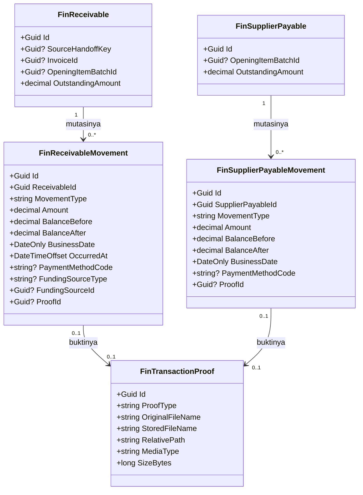
```mermaid
classDiagram
    class FinReceivable {
        +Guid Id
        +Guid? SourceHandoffKey
        +Guid? InvoiceId
        +Guid? OpeningItemBatchId
        +decimal OutstandingAmount
    }
    class FinReceivableMovement {
        +Guid Id
        +Guid ReceivableId
        +string MovementType
        +decimal Amount
        +decimal BalanceBefore
        +decimal BalanceAfter
        +DateOnly BusinessDate
        +DateTimeOffset OccurredAt
        +string? PaymentMethodCode
        +string? FundingSourceType
        +Guid? FundingSourceId
        +Guid? ProofId
    }
    class FinSupplierPayable {
        +Guid Id
        +Guid? OpeningItemBatchId
        +decimal OutstandingAmount
    }
    class FinSupplierPayableMovement {
        +Guid Id
        +Guid SupplierPayableId
        +string MovementType
        +decimal Amount
        +decimal BalanceBefore
        +decimal BalanceAfter
        +DateOnly BusinessDate
        +string? PaymentMethodCode
        +Guid? ProofId
    }
    class FinTransactionProof {
        +Guid Id
        +string ProofType
        +string OriginalFileName
        +string StoredFileName
        +string RelativePath
        +string MediaType
        +long SizeBytes
    }
    FinReceivable "1" --> "0..*" FinReceivableMovement : mutasinya
    FinSupplierPayable "1" --> "0..*" FinSupplierPayableMovement : mutasinya
    FinReceivableMovement "0..1" --> "0..1" FinTransactionProof : buktinya
    FinSupplierPayableMovement "0..1" --> "0..1" FinTransactionProof : buktinya
```

### L.4.2 Kas dan saldo awal

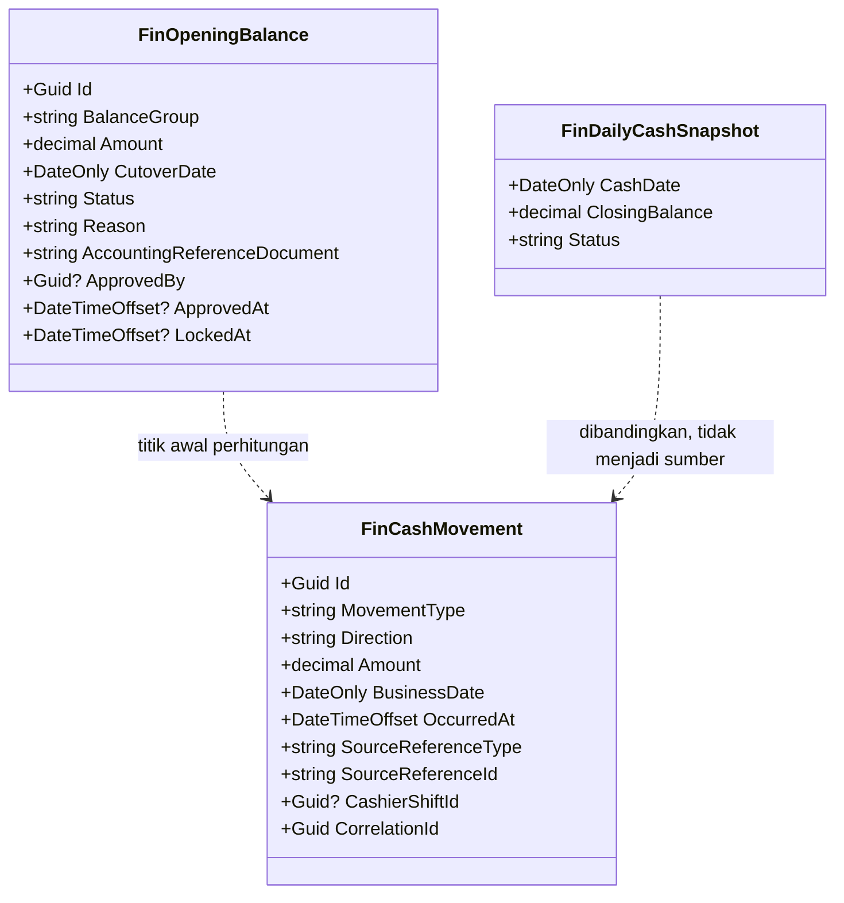
```mermaid
classDiagram
    class FinCashMovement {
        +Guid Id
        +string MovementType
        +string Direction
        +decimal Amount
        +DateOnly BusinessDate
        +DateTimeOffset OccurredAt
        +string SourceReferenceType
        +string SourceReferenceId
        +Guid? CashierShiftId
        +Guid CorrelationId
    }
    class FinOpeningBalance {
        +Guid Id
        +string BalanceGroup
        +decimal Amount
        +DateOnly CutoverDate
        +string Status
        +string Reason
        +string AccountingReferenceDocument
        +Guid? ApprovedBy
        +DateTimeOffset? ApprovedAt
        +DateTimeOffset? LockedAt
    }
    class FinDailyCashSnapshot {
        +DateOnly CashDate
        +decimal ClosingBalance
        +string Status
    }
    FinOpeningBalance ..> FinCashMovement : titik awal perhitungan
    FinDailyCashSnapshot ..> FinCashMovement : dibandingkan, tidak menjadi sumber
```

`FinDailyCashSnapshot` digambar **bergaris putus-putus** dan sengaja tanpa relasi database: sesudah
`FIN-DES-081` ia laporan operasional yang **dibandingkan** terhadap posisi kas, bukan sumbernya.

### L.4.3 Pemetaan akun control, batch migrasi, dan pengiriman

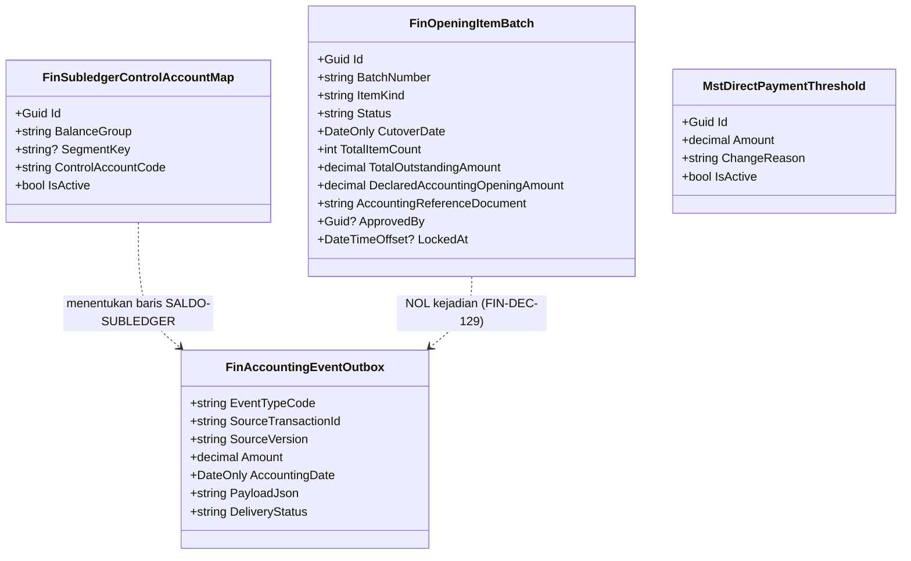
```mermaid
classDiagram
    class FinSubledgerControlAccountMap {
        +Guid Id
        +string BalanceGroup
        +string? SegmentKey
        +string ControlAccountCode
        +bool IsActive
    }
    class FinOpeningItemBatch {
        +Guid Id
        +string BatchNumber
        +string ItemKind
        +string Status
        +DateOnly CutoverDate
        +int TotalItemCount
        +decimal TotalOutstandingAmount
        +decimal DeclaredAccountingOpeningAmount
        +string AccountingReferenceDocument
        +Guid? ApprovedBy
        +DateTimeOffset? LockedAt
    }
    class FinAccountingEventOutbox {
        +string EventTypeCode
        +string SourceTransactionId
        +string SourceVersion
        +decimal Amount
        +DateOnly AccountingDate
        +string PayloadJson
        +string DeliveryStatus
    }
    class MstDirectPaymentThreshold {
        +Guid Id
        +decimal Amount
        +string ChangeReason
        +bool IsActive
    }
    FinSubledgerControlAccountMap ..> FinAccountingEventOutbox : menentukan baris SALDO-SUBLEDGER
    FinOpeningItemBatch ..> FinAccountingEventOutbox : NOL kejadian (FIN-DEC-129)
```

Panah `FinOpeningItemBatch` digambar justru untuk menegaskan yang **tidak** terjadi: batch migrasi
tidak pernah menulis ke kotak keluar.

### Penjelasan class

| Aspek | Penjelasan |
|---|---|
| **Status** | `Baru` |
| **Lokasi file** | `Areas/Corporate/FinanceManagement/Receivable/Models/FinReceivableMovement.cs` |
| Kategori | Transaksi — buku mutasi, anak `FinReceivable` |
| Tanggung jawab utama | Mencatat setiap perubahan `OutstandingAmount` beserta tanggal bisnisnya, supaya posisi piutang pada tanggal mana pun dapat dihitung ulang (`FIN-DEC-123`) |
| Field penting | `ReceivableId`, `MovementType`, `Amount`, `BalanceBefore`, `BalanceAfter`, `BusinessDate` (WIB), `OccurredAt`, `PaymentMethodCode`, `FundingSourceType`/`FundingSourceId`, `ReferenceNumber`, `ProofId`, `CorrelationId` |
| Navigation property dan relasi | Milik `FinReceivable`, `DeleteBehavior.Restrict`. `ProofId` menunjuk `FinTransactionProof`, `DeleteBehavior.Restrict` |
| Pemakaian dalam alur bisnis | Ditulis **setiap** jalur pada daftar `FIN-DES-079`; dibaca `FinanceSubledgerBalanceCalculator` dan layar riwayat piutang |
| Catatan desain | Baris **tidak pernah diubah atau dihapus**; koreksi menambah baris. `BalanceAfter` baris terakhir **MUST** sama dengan `FinReceivable.OutstandingAmount` — invariant yang dapat diuji dan menjadi alat deteksi jalur yang lupa menulis mutasi |
| Ekuivalen model lama | Tidak ada. `FinReceiptAllocation` hanya memuat alokasi, bukan seluruh sumbu perubahan saldo |

| Aspek | Penjelasan |
|---|---|
| **Status** | `Baru` |
| **Lokasi file** | `Areas/Corporate/FinanceManagement/Payable/Models/FinSupplierPayableMovement.cs` |
| Kategori | Transaksi — buku mutasi, anak `FinSupplierPayable` |
| Tanggung jawab utama | Padanan `FinReceivableMovement` untuk utang supplier |
| Field penting | Sama dengan buku mutasi piutang, dengan `SupplierPayableId` sebagai induk dan `PaymentId` opsional untuk mutasi yang lahir dari `FinPayment` |
| Navigation property dan relasi | Milik `FinSupplierPayable`, `DeleteBehavior.Restrict` |
| Pemakaian dalam alur bisnis | Ditulis pembuatan utang, pembayaran dokumen (satu baris per alokasi), pembayaran langsung, penyesuaian, dan pembukaan item migrasi |
| Catatan desain | `PaymentId` **tidak** cukup menggantikan `BusinessDate`: `FinPaymentAllocation` tidak punya tanggal sendiri, dan utang berkurang saat pembayaran **disetujui**, bukan saat `PaidAt` (`FinancePaymentService.cs:575`). Tanggal bisnis karena itu disalin ke baris mutasi saat ditulis |
| Ekuivalen model lama | Tidak ada |

| Aspek | Penjelasan |
|---|---|
| **Status** | `Baru` |
| **Lokasi file** | `Areas/Corporate/FinanceManagement/CashManagement/Models/FinCashMovement.cs` |
| Kategori | Transaksi — buku mutasi kas, tanpa agregat induk |
| Tanggung jawab utama | Menjadi satu-satunya sumbu perhitungan posisi Kas Kasir (`FIN-DES-081`) |
| Field penting | `MovementType`, `Direction` (`IN`/`OUT`), `Amount`, `BusinessDate` (WIB), `OccurredAt`, `SourceReferenceType` + `SourceReferenceId`, `CashierShiftId`, `CorrelationId` |
| Navigation property dan relasi | **Nol FK.** Rujukan ke shift, setoran, pembayaran, dan penerimaan disimpan sebagai pasangan jenis dan id tanpa FK, karena sumbernya melintasi submodul dan satu di antaranya milik Billing |
| Pemakaian dalam alur bisnis | Ditulis saat shift mencapai keadaan final, saat penerimaan dan pembayaran tunai, saat setoran bank diposting, dan sekali saat saldo awal cutover dikunci |
| Catatan desain | **Idempotensi wajib**: unique index pada (`SourceReferenceType`, `SourceReferenceId`, `MovementType`) supaya sinkronisasi penanda shift yang berjalan berkala tidak menulis kas shift yang sama dua kali. Ini pelajaran langsung dari idempotensi penanda shift yang sudah ada |
| Ekuivalen model lama | `FinDailyCashSnapshot` menghitung hal yang mirip, tetapi per hari, dari status shift yang tidak diperiksa, dan tidak dapat ditanya "posisi pada tanggal X" |

| Aspek | Penjelasan |
|---|---|
| **Status** | `Baru` |
| **Lokasi file** | `Areas/Corporate/FinanceManagement/AccountingIntegration/Models/FinSubledgerControlAccountMap.cs` |
| Kategori | Konfigurasi integrasi |
| Tanggung jawab utama | Memetakan kelompok saldo dan segmennya ke kode akun control milik Accounting (`FIN-DES-080`) |
| Field penting | `BalanceGroup`, `SegmentKey` (nullable = seluruh kelompok), `ControlAccountCode`, `IsActive`, `Notes` |
| Navigation property dan relasi | **Nol FK.** `ControlAccountCode` adalah teks milik Accounting, bukan FK lintas bounded context |
| Pemakaian dalam alur bisnis | Dibaca `FinanceSubledgerSnapshotService` sebelum menerbitkan satu baris `SALDO-SUBLEDGER` per akun |
| Catatan desain | Unique index pada (`BalanceGroup`, `SegmentKey`) dan pada `ControlAccountCode` untuk baris aktif. Ditempatkan di `AccountingIntegration` karena ia murni alat penyelarasan dengan Accounting — bukan master data operasional Finance |
| Ekuivalen model lama | `SubledgerControlAccountDefaults` — konstanta di kode ditambah override per permintaan. Konstanta itu **tetap ada** sebagai nilai bawaan seed, tetapi **berhenti** menjadi sumber kebenaran |

| Aspek | Penjelasan |
|---|---|
| **Status** | `Baru` |
| **Lokasi file** | `Areas/Corporate/FinanceManagement/AccountingIntegration/Models/FinOpeningBalance.cs` |
| Kategori | Konfigurasi cutover |
| Tanggung jawab utama | Menyimpan saldo awal per kelompok saldo pada tanggal cutover, sekali isi lalu dikunci (`FIN-DES-088`) |
| Field penting | `BalanceGroup`, `Amount`, `CutoverDate`, `Status` (`DRAFT`/`APPROVED`/`LOCKED`), `Reason` wajib, `AccountingReferenceDocument` wajib, `ApprovedBy`, `ApprovedAt`, `LockedAt` |
| Navigation property dan relasi | Nol FK |
| Pemakaian dalam alur bisnis | Dibaca `FinanceSubledgerBalanceCalculator` sebagai titik awal setiap kelompok |
| Catatan desain | Baris `LOCKED` **MUST NOT** dapat diubah service mana pun. Unique index satu baris aktif per kelompok. Kelompok piutang dan utang **wajib** bernilai `0.00` beserta alasan tertulis, supaya tidak terhitung dua kali bersama item migrasi |
| Ekuivalen model lama | Tidak ada. Rekap kas harian pertama menolak saldo awal selain nol (`FinanceCashManagementService.cs:608-612`), sehingga saldo awal kas memang belum punya tempat |

| Aspek | Penjelasan |
|---|---|
| **Status** | `Baru` |
| **Lokasi file** | `Areas/Corporate/FinanceManagement/AccountingIntegration/Models/FinOpeningItemBatch.cs` |
| Kategori | Transaksi — batch cutover |
| Tanggung jawab utama | Menampung satu unggahan migrasi tagihan lama beserta hasil validasi dan rekonsiliasinya (`FIN-DES-089`, `FIN-DES-090`) |
| Field penting | `BatchNumber`, `ItemKind` (`RECEIVABLE`/`SUPPLIER_PAYABLE`), `Status` (`DRAFT`/`VALIDATED`/`APPROVED`/`LOCKED`/`REJECTED`), `CutoverDate`, `TotalItemCount`, `TotalOutstandingAmount`, `DeclaredAccountingOpeningAmount`, `AccountingReferenceDocument`, `UploadedFileName`, `ApprovedBy`, `LockedAt` |
| Navigation property dan relasi | Dirujuk `FinReceivable.OpeningItemBatchId` dan `FinSupplierPayable.OpeningItemBatchId`, keduanya `DeleteBehavior.Restrict` |
| Pemakaian dalam alur bisnis | Petugas mengunggah spreadsheet, sistem memvalidasi per baris, petugas menyatakan saldo awal Accounting, lalu batch disetujui dan dikunci |
| Catatan desain | Satu `ItemKind` per batch — piutang dan utang **tidak** dicampur, supaya rekonsiliasinya dapat dibandingkan terhadap satu angka Accounting. Item hanya dibuat saat perpindahan ke `APPROVED`; selama `DRAFT`/`VALIDATED` tidak ada baris piutang atau utang yang lahir |
| Ekuivalen model lama | Tidak ada; nol mekanisme impor di seluruh `Areas` |

| Aspek | Penjelasan |
|---|---|
| **Status** | `Baru` |
| **Lokasi file** | `Areas/Corporate/FinanceManagement/Collection/Models/FinTransactionProof.cs` |
| Kategori | Transaksi — metadata berkas |
| Tanggung jawab utama | Menyimpan keterangan berkas bukti pembayaran; berkasnya sendiri di luar database (`FIN-DES-087`) |
| Field penting | `ProofType`, `OriginalFileName`, `StoredFileName`, `RelativePath`, `MediaType`, `SizeBytes`, `UploadedBy`, `UploadedAt` |
| Navigation property dan relasi | Dirujuk `ProofId` pada kedua tabel mutasi, `DeleteBehavior.Restrict` |
| Pemakaian dalam alur bisnis | Diunggah bersama pembayaran langsung piutang maupun utang |
| Catatan desain | Ditempatkan di `Collection` karena rumpun itu sudah menampung keluarga penerimaan dan potongan, dan ia submodul terdaftar (`Fin`) — **folder baru sengaja tidak dibuat** supaya tidak memicu gerbang pendaftaran registry untuk satu tabel. `RelativePath` **MUST** divalidasi berada di bawah akar penyimpanan, mengikuti pemeriksaan jalur yang sudah ada pada pola unggah |
| Ekuivalen model lama | `FinReceivableDocument` — **bukan** padanannya; ia melacak kelengkapan klaim, tanpa kolom berkas |

| Aspek | Penjelasan |
|---|---|
| **Status** | `Baru` |
| **Lokasi file** | `Areas/Corporate/FinanceManagement/MasterData/Models/MstDirectPaymentThreshold.cs` |
| Kategori | Master — parameter kendali |
| Tanggung jawab utama | Menyimpan ambang nilai pembayaran langsung beserta alasan perubahannya (`FIN-DES-086`) |
| Field penting | `Amount`, `ChangeReason` wajib, `IsActive`, `EffectiveFrom` |
| Navigation property dan relasi | Nol FK |
| Pemakaian dalam alur bisnis | Dibaca sebelum setiap pembayaran langsung piutang maupun utang |
| Catatan desain | Memakai awalan `Mst` dan ditempatkan di `MasterData/` mengikuti `MstBankAccount`, `MstCurrency`, dan `MstPettyCashCategory` yang sudah ada di folder itu — tercakup baris registry `Mst`, sehingga **nol** prefix dan **nol** folder baru |
| Ekuivalen model lama | Tidak ada; jalur pembayaran langsung hari ini tidak punya batas apa pun |

| Aspek | Penjelasan |
|---|---|
| **Status** | `Baru` |
| **Lokasi file** | `Areas/Corporate/FinanceManagement/AccountingIntegration/Services/FinanceSubledgerMovementService.cs` |
| Kategori | Service |
| Tanggung jawab utama | **Satu-satunya** penulis ketiga buku mutasi; menghitung `BalanceBefore`/`BalanceAfter` dan menetapkan `BusinessDate` WIB |
| Dipanggil oleh | `FinanceReceivableService`, `FinanceReceiptService`, `FinanceBillingIntakeService`, `FinanceSupplierPayableService`, `FinancePaymentService`, `FinanceCashManagementService`, `FinanceOpeningItemImportService` |
| Membuka transaksi database | **Tidak.** Dipanggil di dalam transaksi pemanggilnya, mengikuti pola `FinanceAccountingOutboxService.StageEventAsync` dan `FinanceReceivableService.ApplyAllocationAsync` |
| Catatan desain | Pemanggil **MUST** sudah memegang advisory lock atas agregatnya sebelum memanggil, karena `BalanceBefore` dibaca dari baris mutasi terakhir. Tanpa lock, dua mutasi bersamaan menghasilkan rantai saldo yang bercabang |

| Aspek | Penjelasan |
|---|---|
| **Status** | `Baru` |
| **Lokasi file** | `Areas/Corporate/FinanceManagement/AccountingIntegration/Services/FinanceSubledgerBalanceCalculator.cs` |
| Kategori | Service — baca saja |
| Tanggung jawab utama | Menghitung posisi setiap kelompok saldo dan segmennya pada satu tanggal, dari saldo awal ditambah buku mutasi |
| Dipanggil oleh | `FinanceSubledgerSnapshotService`, dan permukaan baca perbandingan pada `L.8` |
| Membuka transaksi database | Tidak |
| Catatan desain | **Nol tulisan.** Ia tidak pernah membaca `OutstandingAmount` maupun `ClosingBalance` sebagai jawaban — keduanya posisi *sekarang*, bukan posisi *pada tanggal*. Membacanya akan menghidupkan kembali cacat yang amandemen ini perbaiki |

| Aspek | Penjelasan |
|---|---|
| **Status** | `Diperbarui` |
| **Lokasi file** | `Areas/Corporate/FinanceManagement/AccountingIntegration/Services/FinanceSubledgerSnapshotService.cs` |
| Kategori | Service |
| Yang berubah | (1) Sumber angka berpindah ke `FinanceSubledgerBalanceCalculator`; (2) `Math.Max(0m, …)` pada empat tempat **dihapus** (`FIN-DEC-112`); (3) jumlah baris tidak lagi tetap empat, melainkan sebanyak baris pemetaan aktif (`FIN-DEC-113`); (4) gagal tertutup bila pemetaan tidak lengkap; (5) menambahkan jalur pernyataan ulang yang membandingkan posisi terhitung dengan baris outbox terakhir per akun |
| Membuka transaksi database | Ya — tetap `Serializable` beserta advisory lock per periode, seperti sekarang |
| Catatan desain | `IsComplete = items.Count >= 4` pada jalur baca **MUST** diubah: angka empat tidak lagi bermakna sesudah `FIN-DEC-113` |

| Aspek | Penjelasan |
|---|---|
| **Status** | `Diperbarui` |
| **Lokasi file** | `Areas/Corporate/FinanceManagement/BillingIntake/Services/FinanceBillingIntakeService.cs` |
| Kategori | Service |
| Yang berubah | (1) `SyncCashierShiftClosureMarkersAsync` mencakup status **belum final** dan menerbitkan `PEMBUKAAN-SHIFT-KASIR` (`FIN-DES-084`); (2) shift yang mencapai `CLOSED`/`REVIEWED` menulis satu `FinCashMovement` kas masuk; (3) `AccountingDate` memakai WIB |
| Membuka transaksi database | Ya — sudah |
| Catatan desain | Query hari ini menyaring tiga status (`cs:1049-1054`) dan **MUST** diperluas ke tujuh. Shift `Bil*` tetap **dibaca saja** |

| Aspek | Penjelasan |
|---|---|
| **Status** | `Baru` |
| **Lokasi file** | `Areas/Corporate/FinanceManagement/AccountingIntegration/Services/FinanceAccountingDispatchWorker.cs` |
| Kategori | Hosted service (`BackgroundService`) |
| Tanggung jawab utama | Mengirim baris outbox `PENDING` ke kotak masuk Accounting, mencatat `FinAccountingEventAttempt`, memperbarui `DeliveryStatus` |
| Dipanggil oleh | Runtime, lewat `AddHostedService` di blok `runBackgroundJobs` |
| Membuka transaksi database | Ya — per baris, supaya satu kegagalan tidak membatalkan seluruh siklus |
| Catatan desain | Memakai `IServiceScopeFactory.CreateScope()` per siklus seperti `AccAccountingEventSchedulerHostedService`. **Melewati** kode yang digerbang (`FIN-DES-078`). Balasan `200` dan `201` **sama-sama** sukses, dan `AccountingReceiptNumber` diisi dari `AccountingEventId` — keduanya sudah dikonfirmasi Accounting pada `evidence/16` bagian 5 |

| Aspek | Penjelasan |
|---|---|
| **Status** | `Baru` |
| **Lokasi file** | `Areas/Corporate/FinanceManagement/AccountingIntegration/Services/FinanceSubledgerSnapshotSchedulerHostedService.cs` |
| Kategori | Hosted service |
| Tanggung jawab utama | Menjalankan snapshot periode sebelumnya pada tanggal 1 pukul 00.05 WIB, lalu tiap hari memeriksa kebutuhan pernyataan ulang |
| Membuka transaksi database | Tidak sendiri — memanggil service yang membukanya |
| Catatan desain | Jam dihitung dalam WIB lewat `FinanceBusinessDate`. Menjalankannya dua kali untuk periode yang sama **tidak** menggandakan baris, karena `SourceTransactionId` snapshot sudah deterministik dan idempotensinya dijaga unique index outbox |

| Aspek | Penjelasan |
|---|---|
| **Status** | `Baru` |
| **Lokasi file** | `Areas/Corporate/FinanceManagement/AccountingIntegration/Services/FinanceOpeningItemImportService.cs` |
| Kategori | Service |
| Tanggung jawab utama | Membaca spreadsheet migrasi, memvalidasi per baris, menyimpan hasilnya, lalu membuat item piutang atau utang saat batch disetujui (`FIN-DES-089`) |
| Dipanggil oleh | `FinanceOpeningItemBatchesController` |
| Membuka transaksi database | Ya — pembuatan seluruh item satu batch dalam satu transaksi, supaya tidak ada batch setengah jadi |
| Catatan desain | Pembacaan spreadsheet menuntut paket yang **belum ada di proyek** (`FIN-OQ-077`). Sampai paketnya disetujui, service ini **MUST NOT** dibangun; bagian validasi dan pembuatan item dapat dirancang lebih dulu karena tidak bergantung pada pembacanya |

| Aspek | Penjelasan |
|---|---|
| **Status** | `Baru` |
| **Lokasi file** | `Areas/Corporate/FinanceManagement/Collection/Services/FinanceTransactionProofService.cs` |
| Kategori | Service |
| Tanggung jawab utama | Menyimpan dan membaca berkas bukti beserta metadatanya |
| Catatan desain | Memakai `FileStorage:UploadRootPath` yang sudah ada. **MUST NOT** memanggil kelas unggah milik HR. Aturan jenis dan ukuran berkas menunggu `FIN-OQ-075` |

| Aspek | Penjelasan |
|---|---|
| **Status** | `Baru` |
| **Lokasi file** | `Areas/Corporate/FinanceManagement/AccountingIntegration/Services/FinanceBusinessDate.cs` |
| Kategori | Helper statis |
| Tanggung jawab utama | Mengubah `DateTimeOffset`/`DateTime` menjadi `DateOnly` menurut kalender WIB, dan menyusun batas awal serta akhir periode dalam WIB |
| Catatan desain | Salinan kelima pola zona waktu di repository ini — utang teknis yang **diwarisi sadar**, lihat `FIN-DES-082` |

| Aspek | Penjelasan |
|---|---|
| **Status** | `Diperbarui` |
| **Lokasi file** | `Areas/Corporate/FinanceManagement/AccountingIntegration/Services/FinanceAccountingOutboxService.cs` |
| Kategori | Service |
| Yang berubah | (1) `AccountingOutboxEventRequest` menerima lima ruas dimensi baru dan meneruskannya ke `BuildPayloadJson` (`FIN-DES-083`); (2) larangan nilai negatif pada `SALDO-SUBLEDGER` **dicabut** (`FIN-DEC-112`, mengamandemen `FIN-DEC-091`); (3) `ZeroAmountAllowedEventTypes` menerima `PEMBUKAAN-SHIFT-KASIR` |
| Catatan desain | Validasi `AccountingDate` wajib tanggal akhir periode untuk pesan saldo **tetap berlaku**, hanya perbandingannya kini memakai kalender WIB |

## L.5 Arsitektur folder

```text
Areas/Corporate/FinanceManagement/
├── AccountingIntegration/
│   ├── Controllers/
│   │   ├── FinanceAccountingEventsController.cs                      # sudah ada, diperbarui
│   │   ├── FinanceSubledgerControlAccountMapsController.cs           # BARU
│   │   ├── FinanceOpeningBalancesController.cs                       # BARU
│   │   └── FinanceOpeningItemBatchesController.cs                    # BARU
│   ├── Models/
│   │   ├── FinAccountingEventOutbox.cs                               # sudah ada, konstanta kode baru
│   │   ├── FinSubledgerControlAccountMap.cs                          # BARU
│   │   ├── FinOpeningBalance.cs                                      # BARU
│   │   └── FinOpeningItemBatch.cs                                    # BARU
│   ├── Services/
│   │   ├── FinanceAccountingOutboxService.cs                         # sudah ada, diperbarui
│   │   ├── FinanceSubledgerSnapshotService.cs                        # sudah ada, diperbarui
│   │   ├── FinanceSubledgerMovementService.cs                        # BARU
│   │   ├── FinanceSubledgerBalanceCalculator.cs                      # BARU
│   │   ├── FinanceOpeningItemImportService.cs                        # BARU
│   │   ├── FinanceBusinessDate.cs                                    # BARU (helper statis)
│   │   ├── FinanceAccountingDispatchWorker.cs                        # BARU (hosted service)
│   │   └── FinanceSubledgerSnapshotSchedulerHostedService.cs         # BARU (hosted service)
│   └── DTOs/
│       ├── SubledgerSnapshotDtos.cs                                  # sudah ada, diperbarui
│       ├── SubledgerControlAccountMapDtos.cs                         # BARU
│       ├── OpeningBalanceDtos.cs                                     # BARU
│       └── OpeningItemBatchDtos.cs                                   # BARU
├── Receivable/
│   ├── Models/FinReceivable.cs                                       # sudah ada, DIPERBARUI (4 kolom)
│   ├── Models/FinReceivableMovement.cs                               # BARU
│   └── Services/FinanceReceivableService.cs                          # sudah ada, diperbarui
├── Payable/
│   ├── Models/FinSupplierPayable.cs                                  # sudah ada, DIPERBARUI (1 kolom)
│   ├── Models/FinSupplierPayableMovement.cs                          # BARU
│   └── Services/FinanceSupplierPayableService.cs                     # sudah ada, diperbarui
├── Collection/
│   ├── Models/FinTransactionProof.cs                                 # BARU
│   ├── Services/FinanceTransactionProofService.cs                    # BARU
│   └── Controllers/FinanceTransactionProofsController.cs             # BARU
├── CashManagement/
│   ├── Models/FinCashMovement.cs                                     # BARU
│   └── Services/FinanceCashManagementService.cs                      # sudah ada, diperbarui
├── BillingIntake/
│   └── Services/FinanceBillingIntakeService.cs                       # sudah ada, diperbarui
│       └── FinanceCashierShiftMarkerSchedulerHostedService.cs        # BARU (hosted service)
└── MasterData/
    ├── Models/MstDirectPaymentThreshold.cs                           # BARU
    ├── Services/DirectPaymentThresholdService.cs                     # BARU
    └── Controllers/DirectPaymentThresholdsController.cs              # BARU

Repositories/Configurations/Corporate/FinanceManagement/
├── Receivable/
│   ├── FinReceivableConfiguration.cs                                 # sudah ada, DIPERBARUI
│   └── FinReceivableMovementConfiguration.cs                         # BARU
├── Payable/
│   ├── FinSupplierPayableConfiguration.cs                            # sudah ada, DIPERBARUI
│   └── FinSupplierPayableMovementConfiguration.cs                    # BARU
├── CashManagement/FinCashMovementConfiguration.cs                    # BARU
├── Collection/FinTransactionProofConfiguration.cs                    # BARU
├── AccountingIntegration/
│   ├── FinSubledgerControlAccountMapConfiguration.cs                 # BARU
│   ├── FinOpeningBalanceConfiguration.cs                             # BARU
│   └── FinOpeningItemBatchConfiguration.cs                           # BARU
└── MasterData/MstDirectPaymentThresholdConfiguration.cs              # BARU

Program.cs                                                            # DIPERBARUI — 3 AddHostedService
```

Dua hal yang mengikuti aturan struktur dan sering salah:

1. Configuration **tidak** berada di dalam `Areas/`; ia terpisah di `Repositories/Configurations/`.
2. **Nol folder submodul baru dibuat.** Ketujuh submodul Finance sudah terdaftar pada
   `MODULE_OWNERSHIP_PREFIX_REGISTRY.md` (catatan 2026-09-21 dan 2026-09-26) dengan prefix `Fin`,
   dan `MasterData/` tercakup baris `Mst`. Karena itu **tidak ada** gerbang `QBE-MOD-003` baru pada
   amandemen ini — berbeda dari revisi 4 yang menuntut pendaftaran `Purchasing`.

## L.6 Endpoint

Rinciannya pada `contracts/api-contract.md` bagian `F`. Seluruhnya
**`Rencana (belum tersedia)`**, memakai bentuk transaksi (`POST /{id}/<aksi>`).

| Grup | Method dan path | Kegunaan | Hak akses |
|---|---|---|---|
| Pemetaan akun control | `GET /subledger-control-accounts` | Daftar pemetaan | `FinanceSubledgerSetup : Read` |
| Pemetaan akun control | `POST /subledger-control-accounts` | Menambah pemetaan | `FinanceSubledgerSetup : Create` |
| Pemetaan akun control | `PUT /subledger-control-accounts/{id}` | Mengoreksi pemetaan | `FinanceSubledgerSetup : Update` |
| Pemetaan akun control | `GET /subledger-control-accounts/coverage` | Memeriksa kelengkapan cakupan sebelum snapshot | `FinanceSubledgerSetup : Read` |
| Saldo awal | `GET /opening-balances` | Daftar saldo awal per kelompok | `FinanceSubledgerSetup : Read` |
| Saldo awal | `POST /opening-balances` | Mencatat saldo awal | `FinanceSubledgerSetup : Create` |
| Saldo awal | `POST /opening-balances/{id}/approve` | Menyetujui | `FinanceSubledgerSetup : Approve` |
| Saldo awal | `POST /opening-balances/{id}/lock` | Mengunci | `FinanceSubledgerSetup : Approve` |
| Batch migrasi | `GET /opening-item-batches` | Daftar batch | `FinanceOpeningItemBatch : Read` |
| Batch migrasi | `GET /opening-item-batches/{id}` | Rincian beserta hasil validasi per baris | `FinanceOpeningItemBatch : Read` |
| Batch migrasi | `POST /opening-item-batches` | Mengunggah spreadsheet, membuat batch `DRAFT` | `FinanceOpeningItemBatch : Create` |
| Batch migrasi | `POST /opening-item-batches/{id}/validate` | Menjalankan validasi per baris | `FinanceOpeningItemBatch : Update` |
| Batch migrasi | `POST /opening-item-batches/{id}/approve` | Membuat item dan mutasi pembuka | `FinanceOpeningItemBatch : Approve` |
| Batch migrasi | `POST /opening-item-batches/{id}/reject` | Menolak batch | `FinanceOpeningItemBatch : Update` |
| Mutasi | `GET /receivables/{id}/movements` | Buku mutasi satu piutang | `FinanceReceivable : Read` |
| Mutasi | `GET /supplier-payables/{id}/movements` | Buku mutasi satu utang | `FinanceSupplierPayable : Read` |
| Mutasi | `GET /cash-movements` | Buku mutasi kas, bersaring tanggal dan jenis | `FinanceCashManagement : Read` |
| Posisi saldo | `GET /subledger-balances/position` | Posisi terhitung per kelompok dan segmen pada satu tanggal | `FinanceAccountingEvent : Read` |
| Posisi saldo | `GET /subledger-balances/{periode}/variance` | Selisih rekap kas harian terhadap posisi terhitung (`FIN-DEC-125`) | `FinanceAccountingEvent : Read` |
| Ambang | `GET /direct-payment-threshold` | Ambang aktif | `MstDirectPaymentThreshold : Read` |
| Ambang | `PUT /direct-payment-threshold` | Mengubah ambang beserta alasan | `MstDirectPaymentThreshold : Update` |
| Bukti | `POST /transaction-proofs` | Mengunggah bukti, mengembalikan `ProofId` | `FinanceTransactionProof : Create` |
| Bukti | `GET /transaction-proofs/{id}` | Mengunduh bukti | `FinanceTransactionProof : Read` |

Dua endpoint yang **sudah ada** dan berubah bentuk requestnya:

| Endpoint | Perubahan | Kompatibilitas |
|---|---|---|
| `POST /receivables/{id}/payment` | `PaymentMethod` **menjadi wajib** dan disimpan; ditambah `FundingSourceType`/`FundingSourceId`, `ReferenceNumber`, `ProofId` wajib | **Memutus.** Hari ini `PaymentMethod` punya nilai bawaan `"TRANSFER"` dan diabaikan |
| `POST /supplier-payables/{id}/direct-payment` | Ruas yang sama menjadi wajib dan disimpan | **Memutus** dengan alasan yang sama |

Keduanya dicatat sebagai perubahan memutus di `contracts/api-contract.md`, dan konsumen
frontend-nya dibahas pada `03-frontend-architecture.md` bagian 19.

## L.7 Status model, migration, dan data master

| Model | Status | Dampak migration |
|---|---|---|
| `FinReceivableMovement` | **`Baru`** | Tabel baru |
| `FinSupplierPayableMovement` | **`Baru`** | Tabel baru |
| `FinCashMovement` | **`Baru`** | Tabel baru |
| `FinSubledgerControlAccountMap` | **`Baru`** | Tabel baru |
| `FinOpeningBalance` | **`Baru`** | Tabel baru |
| `FinOpeningItemBatch` | **`Baru`** | Tabel baru |
| `FinTransactionProof` | **`Baru`** | Tabel baru |
| `MstDirectPaymentThreshold` | **`Baru`** | Tabel baru |
| `FinReceivable` | **`Diperbarui`** | `SourceHandoffKey`, `SourceHandoffId`, `InvoiceId` menjadi nullable; kolom `OpeningItemBatchId` ditambah; `CK_FinReceivable_OpeningItem` ditambah; `IX_FinReceivable_SourceHandoffKey` diganti filternya |
| `FinSupplierPayable` | **`Diperbarui`** | Kolom `OpeningItemBatchId` ditambah |
| `FinAccountingEventOutbox` | `Sudah ada` | **Nol perubahan skema.** Hanya konstanta kode dan isi `PayloadJson` |
| `FinDailyCashSnapshot` | `Sudah ada` | **Nol perubahan skema.** Yang berubah kedudukannya, bukan kolomnya |
| `FinMedicalServicePayable` | `Sudah ada` | **Nol perubahan** |

### Rencana migration

Empat migration, berurutan. Urutannya penting karena yang belakangan merujuk tabel yang lebih dulu.

| # | Nama | Isi | Tanpa mematikan layanan | Langkah mundur |
|---:|---|---|---|---|
| 1 | `AddFinanceSubledgerMovementLedgers` | Tiga tabel buku mutasi | **Ya** — murni tabel baru | `Down()` menghapus ketiganya; aman selama belum ada baris |
| 2 | `AddFinanceSubledgerSetup` | `FinSubledgerControlAccountMap`, `FinOpeningBalance` | **Ya** | `Down()` menghapus keduanya |
| 3 | `AddFinanceTransactionProofAndDirectPaymentThreshold` | `FinTransactionProof`, `MstDirectPaymentThreshold` | **Ya** | `Down()` menghapus keduanya |
| 4 | `AddFinanceOpeningItemMigration` | `FinOpeningItemBatch`; perubahan `FinReceivable` dan `FinSupplierPayable` | **Ya, dengan syarat** — lihat di bawah | **Tidak sepenuhnya aman** — lihat di bawah |

**Kenapa migration ke-4 butuh perhatian khusus.** Ia satu-satunya yang menyentuh tabel berjalan:

| Langkah | Sifat di PostgreSQL | Catatan |
|---|---|---|
| `DROP NOT NULL` pada tiga kolom `FinReceivable` | Perubahan katalog, **tanpa penulisan ulang tabel** | Cepat; pembaca yang ada tidak terdampak |
| `ADD COLUMN "OpeningItemBatchId" uuid NULL` | Tanpa penulisan ulang | Cepat |
| `ADD CONSTRAINT ... CHECK (...) NOT VALID` lalu `VALIDATE CONSTRAINT` | Dua langkah **sengaja dipisah** | Menambahkannya langsung memaksa pemindaian seluruh tabel di dalam kunci tulis. `NOT VALID` menghindarinya, dan `VALIDATE` berjalan dengan kunci yang lebih ringan |
| `DROP INDEX` lalu `CREATE INDEX CONCURRENTLY` untuk filter unik yang baru | **MUST** `CONCURRENTLY` | Tanpa itu, pembuatan index unik memblokir tulisan ke piutang |

Satu catatan jujur: `CREATE INDEX CONCURRENTLY` **tidak dapat** berjalan di dalam transaksi, sehingga
migration ini **MUST** menandai dirinya tanpa transaksi untuk langkah tersebut. Bila pola itu tidak
dipakai di repository ini, alternatifnya menjalankan langkah index sebagai langkah operasional
terpisah di luar migration — dan itu **keputusan pemilik repository**, bukan keputusan desain ini.

| Field | Nilai |
|---|---|
| Pengisian data lama | **Tidak ada.** Baris `FinReceivable` dan `FinSupplierPayable` yang sudah ada tetap sah: ketiga kolom Billing-nya terisi dan `OpeningItemBatchId` kosong — persis cabang pertama check constraint |
| Buku mutasi untuk baris lama | **Tidak diisi mundur.** Lihat peringatan di bawah |
| Wewenang | Pembuatan migration dan eksekusinya **dua wewenang terpisah**, keduanya **MUST** diminta eksplisit (`FIN-OQ-051`) |

> **Peringatan yang MUST dibaca sebelum implementasi.** Buku mutasi **tidak** diisi mundur, sehingga
> posisi saldo untuk tanggal **sebelum** buku mutasi hidup tidak dapat dihitung. Dua akibatnya:
> (1) snapshot periode yang seluruhnya berada sebelum tanggal itu akan salah, dan (2) karena itu
> tanggal mulai buku mutasi **MUST** sama dengan atau lebih awal daripada `CutoverDate` pada
> `FinOpeningBalance`. Snapshot **MUST** menolak terbit untuk periode yang berakhir sebelum
> `CutoverDate`, beserta pesan yang menyebutnya — bukan mengembalikan angka yang kelihatan wajar.

### Rencana data master awal

| Master | Isi minimum | Sumber nilai |
|---|---|---|
| `MstDirectPaymentThreshold` | **Satu baris aktif** beserta `ChangeReason` | **Belum ada** — `FIN-OQ-074`. Tanpa baris ini seluruh pembayaran langsung ditolak, dan itu perilaku yang disengaja |
| `FinSubledgerControlAccountMap` | **Satu baris per kelompok saldo**; `PIUTANG` dan `UTANG-JASA-MEDIS` boleh satu baris `NULL` atau satu baris per segmen | Daftar kode akun control definitif dari Accounting, **menunggu G2**. Sebelum itu dapat diisi nilai sementara `SubledgerControlAccountDefaults` supaya jalurnya dapat diuji |
| `FinOpeningBalance` | **Lima baris**, satu per kelompok: `KAS-KASIR` dan `KAS-KECIL` bernominal, tiga sisanya `0.00` beserta alasan tertulis | Nominal kas dari perhitungan fisik saat cutover; **wajib sama** dengan saldo awal manual Accounting (G5) |

Nol tabel master lain. Kode metode pembayaran **tidak** dibuat sebagai master baru: `FinPaymentMethods`
(`TRANSFER`, `CASH`) sudah ada sebagai konstanta domain, dan master metode pembayaran kasir milik
Billing dipakai apa adanya untuk penerimaan.

## L.8 Permukaan baca baru yang bukan endpoint CRUD

Dua permukaan lahir dari kewajiban yang ditetapkan keputusan, bukan dari permintaan layar:

| Permukaan | Kewajiban yang memerintahkannya | Isi |
|---|---|---|
| `GET /subledger-control-accounts/coverage` | `FIN-DES-080` gagal tertutup | Daftar kelompok dan segmen yang **belum** terpetakan, supaya petugas tahu apa yang menahan snapshot sebelum tanggal 1 tiba |
| `GET /subledger-balances/{periode}/variance` | `FIN-DEC-125` mewajibkan selisih **ditampilkan** | Perbandingan `FinDailyCashSnapshot.ClosingBalance` terhadap posisi kas terhitung, beserta daftar mutasi yang menjelaskan selisihnya |

Keduanya **baca saja** dan tidak menulis apa pun.

## L.9 Hak akses

| Resource | Status | Action | Dipakai untuk |
|---|---|---|---|
| `FinanceSubledgerSetup` | **Baru** | `Read`, `Create`, `Update`, `Approve` | Pemetaan akun control dan saldo awal cutover |
| `FinanceOpeningItemBatch` | **Baru** | `Read`, `Create`, `Update`, `Approve` | Batch migrasi tagihan lama |
| `FinanceTransactionProof` | **Baru** | `Read`, `Create` | Unggah dan unduh bukti pembayaran |
| `MstDirectPaymentThreshold` | **Baru** | `Read`, `Update` | Ambang pembayaran langsung |
| `FinanceReceivable`, `FinanceSupplierPayable`, `FinanceCashManagement`, `FinanceAccountingEvent` | Sudah ada | `Read` | Permukaan baca mutasi dan posisi |

Keempat resource baru punya controller nyata beserta endpoint, sehingga terdaftar lewat pemindaian
atribut biasa — **nol** ketergantungan pada `FIN-OQ-039` yang tertahan justru karena resource tanpa
endpoint.

**Action `Approve` adalah action baru pada resource baru**, bukan action baru pada resource yang sudah
ada. Ia dipakai untuk menyetujui saldo awal dan batch migrasi: dua tindakan yang mengubah pembukaan
seluruh buku, dan karena itu **tidak** disamakan dengan `Update` biasa. Ini **berbeda** dari
`FIN-DEC-103`/`FIN-DEC-098` yang sengaja menolak jenjang approval — keduanya menyangkut transaksi
harian, bukan pembukaan buku.

## L.10 Yang sengaja tidak dibuat

| Yang ditolak | Alasan penolakan |
|---|---|
| Satu tabel mutasi polimorfik untuk ketiga agregat | Ditolak `FIN-DES-079`. FK non-nullable membuat mutasi tanpa induk mustahil di tingkat database |
| Buku mutasi untuk `FinMedicalServicePayable` | Belum ada penulis saldonya sama sekali (`BE-FIN-021` `BLOCKED`). Kewajiban membangunnya dicatat ke depan — `FIN-DES-091` |
| Tabel saldo per rekening bank | Ditolak `FIN-DEC-137`. Saldo bank, jurnal akun bank, dan rekonsiliasi rekening koran milik Accounting |
| Rekening bank sebagai kelompok saldo kelima yang dikirim | Turunan penolakan di atas — ia bukan akun control Finance |
| Kolom baru pada `FinAccountingEventOutbox` untuk shift dan metode | Ditolak `FIN-DES-083`. Tidak dipakai idempotensi maupun saringan baca |
| Jalur membuka kembali `FinDailyCashSnapshot` yang sudah ditutup | Ditolak `FIN-DEC-125` lewat pilihan menghitung posisi langsung. Pembukaan kembali menuntut koreksi berantai antarhari |
| Penanda boolean `IsOpeningItem` pada piutang dan utang | Ditolak `FIN-DES-089`. FK batch sudah menjawab pertanyaannya, dan dua penanda dapat berselisih |
| Melonggarkan jenis debitur `FinReceivable` untuk tagihan lama | Tidak perlu: tagihan lama tetap `PAYER`/`PATIENT_GUARANTOR`/`EMPLOYEE_BENEFIT`. Yang dilonggarkan bersyarat hanya kolom asal Billing |
| Memindahkan piutang sewa non-pasien ke `FinReceivable` | Ditolak `FIN-DEC-101`, tidak dibuka ulang di sini. `FIN-OQ-069` belum dijawab |
| Tabel riwayat perubahan ambang | Ditolak `FIN-DES-086`. Kolom audit dan logger sudah menjawab perubahan terakhir |
| Kriteria "berisiko" otomatis pada pembayaran langsung | Ditolak `FIN-DEC-134` secara eksplisit (pilihan B tidak diambil) |
| `FinReceivableDocument` dipakai untuk bukti pembayaran | Ditolak `FIN-DEC-135`. Tujuannya kelengkapan klaim penjamin, tanpa kolom berkas |
| Layanan penyimpanan berkas bersama lintas modul | **Bukan wewenang Finance.** Bila Platform membuatnya, Finance yang memigrasikan (`FIN-OQ-068`) |
| Finance membaca tabel saldo awal Accounting | Ditolak `FIN-DES-090`. Melintasi bounded context tanpa kontrak |
| Pembayaran supplier tunai memotong anggaran kas kecil | Ditolak `FIN-DEC-133`. Kas kecil hanya lewat mekanisme vouchernya sendiri |
| Penyatuan lima salinan helper zona waktu | **Bukan scope Finance.** Task tersendiri lintas modul (`FIN-DES-082`) |
| Perbaikan namespace bersarang `AppDateTimeHelper` | Menyentuh berkas bersama di luar scope; **MUST NOT** dirapikan diam-diam |
| Provider nomor seri atomik untuk tabel baru | Rumpun ini memakai pola tanggal + GUID beserta komentar `KNOWN ISSUE`-nya. Memperbaikinya hanya untuk tabel baru membuat satu rumpun punya dua cara menomori — utang teknis yang **diwarisi**, persis seperti revisi 13 |
