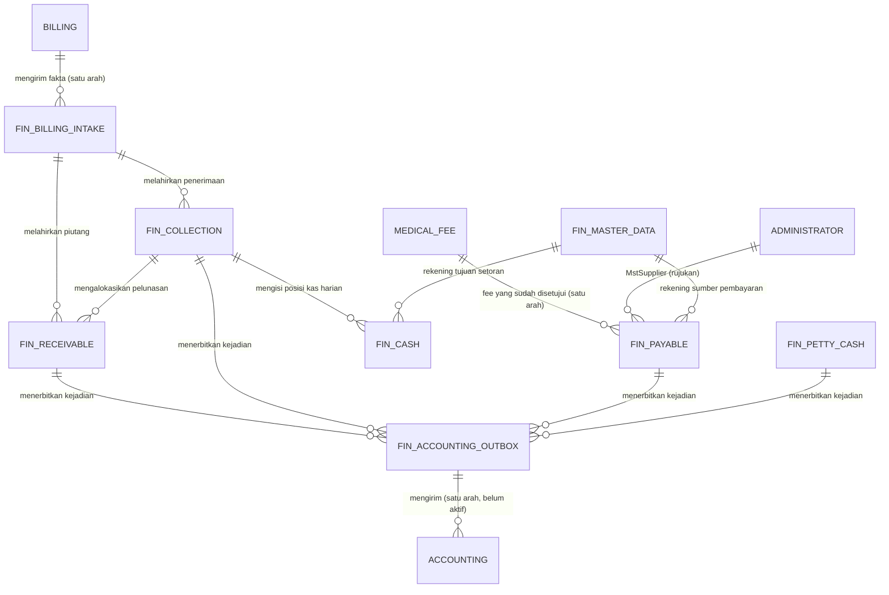

# Finance Management — Peta Antar Bounded Context

| Field | Nilai |
|---|---|
| Blueprint ID | `FIN-BP-001` revisi `1` |
| Status | `draft` |
| Backend SHA | `09101d05` |

Dokumen ini menunjukkan **arah ketergantungan** antar konteks, bukan kolom. Kolom ada di empat
berkas ERD rinci dan di `data-dictionary.md`.

## 1. Arah ketergantungan

## 2. Yang dibaca setiap panah

| Panah | Yang dipertukarkan | Sifat |
|---|---|---|
| Billing → Billing Intake | `BilArHandoff`, `BilApHandoff`, `BilHandoffAdjustment`, `BilCollectionHandoff` | Satu arah. Finance memberi ACK, tidak menulis isi handoff |
| Medical Fee → Payable | `DoctorServiceFee` yang sudah disetujui | Satu arah. Finance tidak menghitung ulang nilai fee |
| Administrator → Payable | `MstSupplier` lewat `SupplierId` | Rujukan baca. Tidak disalin (`FIN-DEC-014`) |
| Billing Intake → Receivable | Piutang baru dari handoff AR | Di dalam satu transaksi |
| Billing Intake → Collection | Penerimaan baru dari handoff penerimaan | Di dalam satu transaksi |
| Collection → Receivable | `FinReceiptAllocation` mengurangi `OutstandingAmount` | Manual penuh (`FIN-DEC-011`) |
| Collection → Cash | Penerimaan tunai mengisi `CashReceiptAmount` kas harian | Diringkas saat penutupan hari |
| Master Data → Cash / Payable | `MstBankAccount` sebagai tujuan setoran dan sumber pembayaran | Rujukan baca |
| Empat konteks → Outbox | Baris kejadian ditulis di transaksi yang sama (`FIN-DES-017`) | Wajib satu transaksi |
| Outbox → Accounting | `POST` kejadian 12 field | **Belum aktif.** Endpoint penerima belum dibangun (`FIN-CAP-018`) |

## 3. Yang sengaja tidak ada panahnya

| Yang tidak terhubung | Alasan |
|---|---|
| Accounting → Finance | Kontrak `ACC-XMOD-0.2` satu arah. Accounting adalah muara |
| Finance → Billing | Finance tidak pernah menulis ke tabel Billing, termasuk `BilCashierShift` (aturan bisnis #12) |
| Petty Cash ↔ Collection | Kas kecil dan kas kasir adalah dua kolam terpisah. Pencairan kas kecil MUST NOT mengubah kas kasir, dan sebaliknya (aturan bisnis #15) |
| Finance → Medical Fee | Finance tidak pernah mengubah status atau nilai fee dokter |

## 4. Daftar berkas ERD rinci

| Berkas | Konteks yang dirinci |
|---|---|
| `receivable-collection.md` | Billing Intake, Receivable, Collection |
| `payable.md` | Supplier Payable, Doctor Payable, Payment |
| `cash-and-master-data.md` | Bank Deposit, Daily Cash, dan seluruh master Finance |
| `accounting-integration.md` | Outbox, Attempt, Subledger Period Balance |
| `data-dictionary.md` | Kamus data seluruh kolom dan bentuk DDL |
