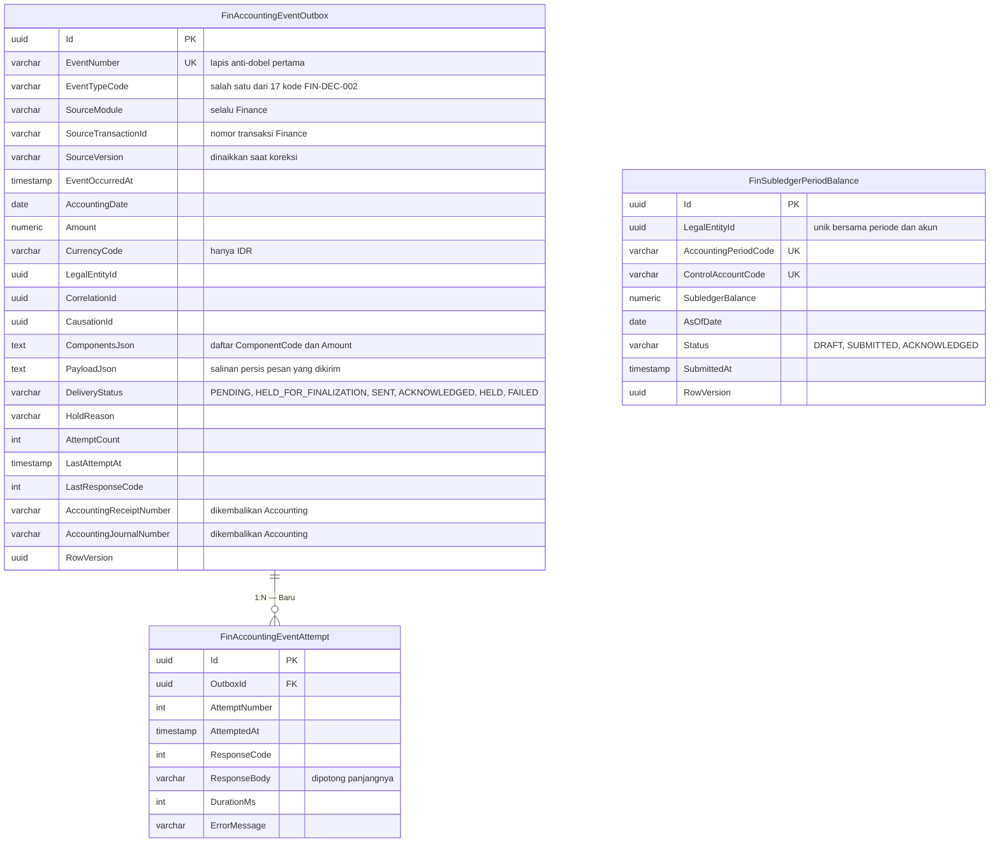

# ERD — Integrasi ke Accounting

| Field | Nilai |
|---|---|
| Blueprint ID | `FIN-BP-001` revisi `1` |
| Status | `draft` |
| Kontrak eksternal | `ACC-XMOD-0.2` (milik Accounting), diratifikasi sisi Finance lewat `FIN-DEC-001` |
| Backend SHA | `09101d05` |

Kolom audit warisan `IdentityModel` tidak digambar.

## 1. Kotak keluar kejadian

## 2. Status entity

| Entity | Status | Owner | Catatan |
|---|---|---|---|
| `FinAccountingEventOutbox` | Baru | Finance | Ditulis di transaksi yang sama dengan fakta bisnisnya (`FIN-DES-017`) |
| `FinAccountingEventAttempt` | Baru | Finance | Append-only, jejak percobaan kirim |
| `FinSubledgerPeriodBalance` | Baru | Finance | Nama field masih draf, menunggu `FIN-OQ-011` |
| `AccEventType`, `AccPostingRule`, `AccChartOfAccount`, `AccAccountingPeriod`, `AccJournal` | Sudah ada | Accounting | Hanya dirujuk lewat kode; Finance **MUST NOT** menyimpan nomor akun |

## 3. Dua lapis pencegahan jurnal ganda

Keduanya diambil persis dari paket kontrak Accounting bagian 5, dan keduanya berupa unique
index — bukan pemeriksaan di kode yang bisa terlewat.

| Lapis | Kunci | Menangkap |
|---|---|---|
| Pertama | `EventNumber` | Pesan sama terkirim berulang karena gangguan jaringan |
| Kedua | (`SourceModule`, `SourceTransactionId`, `EventTypeCode`, `SourceVersion`) | Finance keliru membuat **nomor kejadian baru** untuk kejadian yang sebenarnya sama |

**Contoh lapis kedua bekerja.** Finance mengirim `EVT-100` untuk piutang `AR-2026-09-00871`
versi `1`. Karena gangguan, sistem membuat kejadian baru `EVT-101` untuk piutang dan versi yang
sama. Nomor kejadiannya berbeda, jadi lapis pertama lolos — tetapi lapis kedua menangkapnya
karena kombinasi (`Finance`, `AR-2026-09-00871`, `PENGAKUAN-PIUTANG`, `1`) sudah ada. Buku besar
tetap berisi satu jurnal.

**Konsekuensi yang MUST dipatuhi:** koreksi atas transaksi yang sama dikirim dengan
`SourceVersion` yang **dinaikkan**, bukan dengan versi yang sama. Kalau versinya tetap, koreksi
itu terbaca sebagai kiriman ulang dan tidak dijurnal.

## 4. Mengapa ada status `HELD_FOR_FINALIZATION`

Ini wujud teknis dari `FIN-DEC-004`.

Billing memungkinkan pasien membayar **sebelum** tagihannya difinalisasi. Uangnya nyata dan
harus segera tercatat di Finance — tetapi jurnal akuntansinya belum boleh terbit karena tagihan
yang menjadi dasarnya belum final.

| Keadaan | `FinReceipt` | Baris outbox |
|---|---|---|
| Tender berhasil, tagihan masih `OPEN` | Dibuat, status `RECEIVED` | Dibuat, `DeliveryStatus = HELD_FOR_FINALIZATION` |
| Tagihan kemudian menjadi `FINAL` | Tidak berubah | Diubah menjadi `PENDING` — worker boleh mengirimnya |
| Tender berhasil, tagihan sudah `FINAL` | Dibuat, status `RECEIVED` | Dibuat langsung `PENDING` |

Worker pengiriman **MUST** melewati baris berstatus `HELD_FOR_FINALIZATION`. Pelepasannya
dipicu peristiwa finalisasi tagihan, bukan oleh timer — kalau dilepas timer, jurnal bisa terbit
untuk tagihan yang ternyata batal.

## 5. Kolom yang MUST NOT terisi

Aturan bisnis #6 dan `ACC-DEC-056` melarang data pasien masuk ke Accounting. Yang dijaga:

| Tidak boleh ada di `PayloadJson` maupun `ComponentsJson` | Penggantinya |
|---|---|
| Nama pasien, nomor rekam medis, nomor kunjungan | `SourceTransactionId` dan `CorrelationId` |
| `DoctorId` | `SourceTransactionId` utang dokter |
| Nama penerima dan keperluan voucher kas kecil | `SourceTransactionId` movement kas kecil |

Penelusuran dari jurnal kembali ke pasien tetap mungkin — lewat `CorrelationId` ke Finance, lalu
dari Finance ke Billing. Yang tidak terjadi adalah data pasien **tersimpan** di Accounting.

## 6. Keadaan saat ini: belum ada tujuan kirim

`FIN-CAP-018` pada capability map mencatat bahwa endpoint penerima di Accounting **belum
dibangun**, dan itu diverifikasi langsung ke source, bukan dikutip dari dokumen.

Konsekuensinya untuk rencana kerja:

| Bagian | Boleh dibangun sekarang | Alasan |
|---|:---:|---|
| Tabel outbox dan attempt | Ya | Tidak bergantung pada endpoint |
| Penulisan baris outbox oleh service Finance | Ya | Menulis ke tabel sendiri |
| Layar pemantauan outbox | Ya | Membaca tabel sendiri |
| Worker pengiriman | Tidak | `FIN-DES-020` — dibangun tapi dimatikan konfigurasi sampai endpoint ada |
| Penanganan balasan `200`/`201`/`400`/`403`/`409`/`422` | Tidak | Menunggu endpoint |
