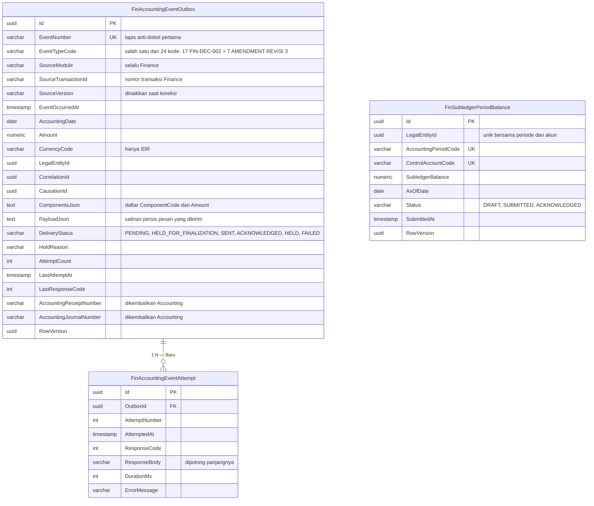
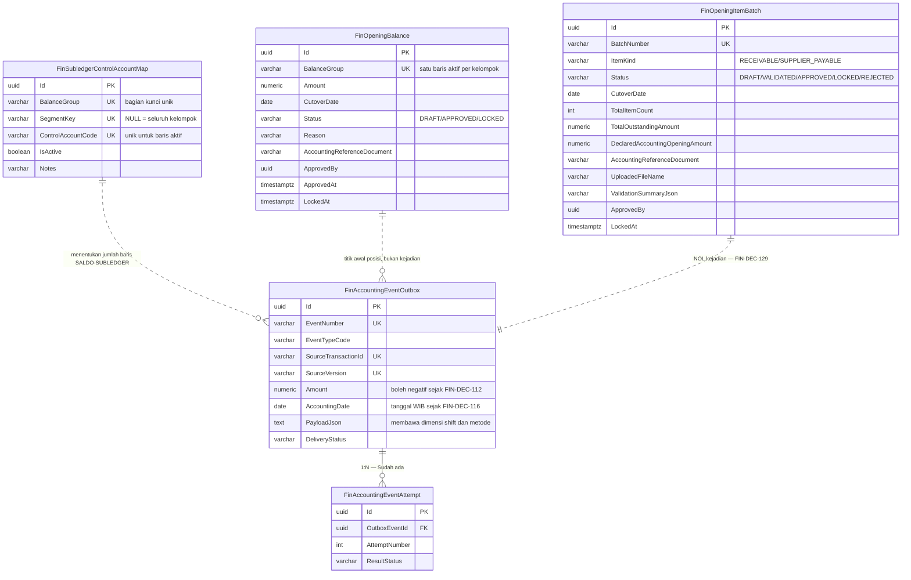

# ERD — Integrasi ke Accounting

| Field | Nilai |
|---|---|
| Blueprint ID | `FIN-BP-001` revisi `1`; **AMENDMENT REVISI 3 diterapkan pada bagian 4 dan 6** |
| Status | `draft` |
| Kontrak eksternal | **`ACC-XMOD-0.3`** (milik Accounting), naik dari `0.2` — diratifikasi sisi Finance lewat `FIN-DEC-001` dan `FIN-DEC-039` |
| Backend SHA | `09101d05` untuk bagian 1-3 dan 5; **`d6cdfaf9`** untuk bagian 4 dan 6 (diverifikasi ulang 25 September 2026) |
| Perubahan revisi 1.1 | Status `HELD_FOR_FINALIZATION` **dicabut** (bagian 4); tujuh kode kejadian baru masuk katalog tanpa perubahan skema (`FIN-DES-030`) |

Kolom audit warisan `IdentityModel` tidak digambar.

## 1. Kotak keluar kejadian


```mermaid
erDiagram
    FinAccountingEventOutbox {
        uuid Id PK
        varchar EventNumber UK "lapis anti-dobel pertama"
        varchar EventTypeCode "salah satu dari 24 kode: 17 FIN-DEC-002 + 7 AMENDMENT REVISI 3"
        varchar SourceModule "selalu Finance"
        varchar SourceTransactionId "nomor transaksi Finance"
        varchar SourceVersion "dinaikkan saat koreksi"
        timestamp EventOccurredAt
        date AccountingDate
        numeric Amount
        varchar CurrencyCode "hanya IDR"
        uuid LegalEntityId
        uuid CorrelationId
        uuid CausationId
        text ComponentsJson "daftar ComponentCode dan Amount"
        text PayloadJson "salinan persis pesan yang dikirim"
        varchar DeliveryStatus "PENDING, HELD_FOR_FINALIZATION, SENT, ACKNOWLEDGED, HELD, FAILED"
        varchar HoldReason
        int AttemptCount
        timestamp LastAttemptAt
        int LastResponseCode
        varchar AccountingReceiptNumber "dikembalikan Accounting"
        varchar AccountingJournalNumber "dikembalikan Accounting"
        uuid RowVersion
    }
    FinAccountingEventAttempt {
        uuid Id PK
        uuid OutboxId FK
        int AttemptNumber
        timestamp AttemptedAt
        int ResponseCode
        varchar ResponseBody "dipotong panjangnya"
        int DurationMs
        varchar ErrorMessage
    }
    FinSubledgerPeriodBalance {
        uuid Id PK
        uuid LegalEntityId "unik bersama periode dan akun"
        varchar AccountingPeriodCode UK
        varchar ControlAccountCode UK
        numeric SubledgerBalance
        date AsOfDate
        varchar Status "DRAFT, SUBMITTED, ACKNOWLEDGED"
        timestamp SubmittedAt
        uuid RowVersion
    }
    FinAccountingEventOutbox ||--o{ FinAccountingEventAttempt : "1:N — Baru"
```

## 2. Status entity

| Entity | Status | Owner | Catatan |
|---|---|---|---|
| `FinAccountingEventOutbox` | Baru | Finance | Ditulis di transaksi yang sama dengan fakta bisnisnya (`FIN-DES-017`) |
| `FinAccountingEventAttempt` | Baru | Finance | Append-only, jejak percobaan kirim |
| `FinSubledgerPeriodBalance` | Baru | Finance | ~~Nama field masih draf, menunggu `FIN-OQ-011`~~ — **`FIN-OQ-011` TERTUTUP 25 September 2026** (`FIN-DEC-035`). Kolom tabel Finance ini (`SubledgerBalance`, `AsOfDate`) **tetap seperti digambar**: ia menyimpan hasil hitungan Finance, bukan bentuk pesannya. Yang berubah hanya **bentuk pesan** ke Accounting — nilainya dikirim lewat `Amount` dan `AccountingDate` di amplop, ditambah objek `SubledgerBalance` berisi `AccountingPeriodCode` dan `ControlAccountCode`. Lihat `contracts/integration-contract.md` bagian 5.6 |
| `AccEventType`, `AccPostingRule`, `AccChartOfAccount`, `AccAccountingPeriod`, `AccJournal` | Sudah ada | Accounting | Hanya dirujuk lewat kode; Finance **MUST NOT** menyimpan nomor akun |

## 3. Dua lapis pencegahan jurnal ganda

Keduanya diambil persis dari paket kontrak Accounting bagian 5, dan keduanya berupa unique
index — bukan pemeriksaan di kode yang bisa terlewat.

| Lapis | Kunci | Menangkap |
|---|---|---|
| Pertama | `EventNumber` | Pesan sama terkirim berulang karena gangguan jaringan |
| Kedua | (`SourceModule`, `SourceTransactionId`, `EventTypeCode`, `SourceVersion`) | Finance keliru membuat **nomor kejadian baru** untuk kejadian yang sebenarnya sama |

**Contoh lapis kedua bekerja.** Finance mengirim `EVT-100` untuk piutang `AR-2026-09-00871`
versi `1`. Karena gangguan, sistem membuat kejadian baru `EVT-101` untuk piutang dan versi yang
sama. Nomor kejadiannya berbeda, jadi lapis pertama lolos — tetapi lapis kedua menangkapnya
karena kombinasi (`Finance`, `AR-2026-09-00871`, `PENGAKUAN-PIUTANG`, `1`) sudah ada. Buku besar
tetap berisi satu jurnal.

**Konsekuensi yang MUST dipatuhi:** koreksi atas transaksi yang sama dikirim dengan
`SourceVersion` yang **dinaikkan**, bukan dengan versi yang sama. Kalau versinya tetap, koreksi
itu terbaca sebagai kiriman ulang dan tidak dijurnal.

## 4. Status `HELD_FOR_FINALIZATION` — DICABUT pada AMENDMENT REVISI 3

**Bagian ini sudah tidak berlaku sebagai aturan, dan dipertahankan sebagai jejak sejarah.**
`FIN-DEC-004` yang menjadi dasarnya `superseded` oleh `FIN-DEC-030` pada 25 September 2026, atas
permintaan Accounting (`ACC-DEC-091`).

**Yang dulu berlaku (revisi 1.0):**

| Keadaan | `FinReceipt` | Baris outbox |
|---|---|---|
| Tender berhasil, tagihan masih `OPEN` | Dibuat, status `RECEIVED` | Dibuat, `DeliveryStatus = HELD_FOR_FINALIZATION` |
| Tagihan kemudian menjadi `FINAL` | Tidak berubah | Diubah menjadi `PENDING` — worker boleh mengirimnya |
| Tender berhasil, tagihan sudah `FINAL` | Dibuat, status `RECEIVED` | Dibuat langsung `PENDING` |

**Yang berlaku sekarang (revisi 1.1).** Penahanan dihapus. Yang membedakan penerimaan pra-final
dari penerimaan final bukan lagi *status pengiriman*, melainkan *jenis kejadiannya*:

| Keadaan | `FinReceipt` | Baris outbox |
|---|---|---|
| Tender berhasil, tagihan masih `OPEN` | Dibuat, status `RECEIVED` | Dibuat `PENDING` dengan `EventTypeCode = PENERIMAAN-UANG-MUKA` |
| Tagihan kemudian menjadi `FINAL` | Tidak berubah | Baris **baru** `PEMAKAIAN-UANG-MUKA-DEPOSIT` saat uang muka dipakai melunasi piutang |
| Tender berhasil, tagihan sudah `FINAL` | Dibuat, status `RECEIVED` | Dibuat `PENDING` dengan `EventTypeCode = PENERIMAAN-KASIR` |

**Alasan perubahannya, ringkas:** uangnya sudah ada di kasir sejak diterima, jadi menahan
jurnalnya tidak menahan risikonya — ia hanya membuat kas buku besar berselisih dari kas fisik
persis di titik tutup buku. Contoh berangkanya ada di `02-backend-architecture.md` bagian B.3
dan `contracts/integration-contract.md` bagian 5.5.

**Nilai `HELD_FOR_FINALIZATION` tetap ada di check constraint** supaya baris warisan tidak
menjadi tidak valid, tetapi **tidak lagi dihasilkan kode baru**. Penanganan baris warisan ada di
`02-backend-architecture.md` bagian B.6.

## 5. Kolom yang MUST NOT terisi

Aturan bisnis #6 dan `ACC-DEC-056` melarang data pasien masuk ke Accounting. Yang dijaga:

| Tidak boleh ada di `PayloadJson` maupun `ComponentsJson` | Penggantinya |
|---|---|
| Nama pasien, nomor rekam medis, nomor kunjungan | `SourceTransactionId` dan `CorrelationId` |
| `DoctorId` | `SourceTransactionId` utang dokter |
| Nama penerima dan keperluan voucher kas kecil | `SourceTransactionId` movement kas kecil |

Penelusuran dari jurnal kembali ke pasien tetap mungkin — lewat `CorrelationId` ke Finance, lalu
dari Finance ke Billing. Yang tidak terjadi adalah data pasien **tersimpan** di Accounting.

## 6. Keadaan saat ini: belum ada tujuan kirim

`FIN-CAP-018` pada capability map mencatat bahwa endpoint penerima di Accounting **belum
dibangun**, dan itu diverifikasi langsung ke source, bukan dikutip dari dokumen.
**Diverifikasi ulang pada `d6cdfaf9` (25 September 2026): masih belum ada** — sepuluh controller
Accounting seluruhnya route `api/v1/corporate/accounting/...` yang sudah ada sebelumnya, tidak
satu pun penerima kejadian. Konsisten dengan gerbang `G1` yang diakui owner Accounting sendiri.

Konsekuensinya untuk rencana kerja:

| Bagian | Boleh dibangun sekarang | Alasan |
|---|:---:|---|
| Tabel outbox dan attempt | Ya | Tidak bergantung pada endpoint |
| Penulisan baris outbox oleh service Finance | Ya | Menulis ke tabel sendiri |
| Layar pemantauan outbox | Ya | Membaca tabel sendiri |
| Worker pengiriman | Tidak | `FIN-DES-020` — dibangun tapi dimatikan konfigurasi sampai endpoint ada |
| Penanganan balasan `200`/`201`/`400`/`403`/`409`/`422` | Tidak | Menunggu endpoint |

---

## 7. Tujuan kirim sudah ada — pembaruan 28 September 2026 (AMENDMENT REVISI 6)

**Bagian 6 di atas sudah tidak berlaku sebagai keadaan terkini.** Impact scan 28 September 2026
pada `cba60cb0` menemukan kotak masuk Accounting **sudah dibangun**:
`Areas/Corporate/AccountingManagement/AccountingEvent/Services/AccAccountingEventService.cs`,
sejalan dengan pernyataan owner Accounting di `evidence/14` bagian 4.4 (dibangun dan diuji
pengembang; uji penerimaan oleh tim terpisah belum). Bagian 6 dipertahankan sebagai jejak sejarah.

Konsekuensinya bukan "worker boleh hidup", melainkan **pelurusan bentuk pesan berubah dari
persoalan dokumen menjadi persoalan runtime**: pesan yang salah bentuk kini benar-benar akan
ditolak. Yang masih menahan pengaktifan worker: kredensial akun layanan (`FIN-OQ-016`), ratifikasi
kode baru (`FIN-OQ-027`..`033`), dan aturan posting di sisi Accounting (gerbang G2 mereka).

### 7.1 Peta pemicu setiap kode — dari fakta mana kejadian lahir

Tabel ini menjawab satu pertanyaan yang tidak dipegang dokumen lain: **fakta apa** yang melahirkan
setiap kejadian, dan **siapa pemilik** fakta itu. Nama kode dan nilainya ada di
`contracts/integration-contract.md` bagian 5.4 dan 5.10.

| Fakta sumber | Pemilik fakta | Kejadian yang lahir |
|---|---|---|
| Utang supplier diinput | Finance | `PENGAKUAN-HUTANG-SUPPLIER` |
| Pembayaran supplier ditandai sudah dibayar | Finance | `PEMBAYARAN-HUTANG-SUPPLIER`, dan `PEMAKAIAN-KREDIT-RETUR-PEMBELIAN` bila memakai kredit retur |
| Retur pembelian dikonfirmasi | Finance | `RETUR-PEMBELIAN`, dan `PPN-MASUKAN-RETUR-PEMBELIAN` bila ada porsi PPN |
| Purchasing Invoice disetujui | Finance | `PENGAKUAN-HUTANG-SUPPLIER` dan `PPN-MASUKAN-PEMBELIAN` |
| Penerimaan piutang dialokasikan | Finance | `PENERIMAAN-PIUTANG`, ditambah `POTONGAN-PPH23-PIUTANG` dan/atau `POTONGAN-BIAYA-BANK-PIUTANG` bila ada potongan |
| Alokasi penerimaan dibalik | Finance | Kejadian pembalik yang bersesuaian, satu per baris potongan |
| Write-off piutang disetujui | Finance | `PEMUTIHAN-PIUTANG` |
| Mutasi deposit pasien `TOP_UP` | **Billing** | `PENERIMAAN-UANG-MUKA` |
| Mutasi deposit pasien `ALLOCATION` | **Billing** | `PEMAKAIAN-UANG-MUKA-DEPOSIT` |
| Mutasi deposit pasien `RELEASE` | **Billing** | `PEMBALIKAN-PEMAKAIAN-UANG-MUKA-DEPOSIT` — **dikoreksi AMENDMENT REVISI 9** (`FIN-DES-064`), sebelumnya `PENGEMBALIAN-UANG-MUKA`. Mutasi ini tidak mengeluarkan kas; ia membatalkan alokasi uang muka ke tagihan. Berlaku hanya bila ada mutasi `REVERSAL` ber-`SettlementId` sama — bila tidak ada, baris intake `ERROR` (`FIN-VAL-145`) |
| Mutasi deposit pasien `REVERSAL` atas `TOP_UP` | **Billing** | `PEMBALIKAN-PENERIMAAN-UANG-MUKA` |
| ~~Mutasi deposit pasien `REVERSAL` atas `ALLOCATION`~~ | **Billing** | ~~`PEMBALIKAN-PEMAKAIAN-UANG-MUKA-DEPOSIT`~~ — **tidak pernah ada di Billing**; digantikan oleh mutasi `RELEASE` berpasangan di atas (`FIN-DES-064`) |
| Kelebihan bayar diakui (`ALLOCATION_EXCESS` atau `SETTLEMENT`) | **Billing** | `PENGAKUAN-KELEBIHAN-BAYAR` |
| Pengembalian uang dieksekusi atas kredit `ALLOCATION_EXCESS`/`SETTLEMENT` | **Billing** | `PENGEMBALIAN-UANG-MUKA` |
| Pengembalian uang dieksekusi atas kredit `REFERRED_OUTPATIENT_ADMIN` | **Billing** | **Nol kejadian** — baris intake `ERROR`, lihat 7.2 |
| Selisih kas shift disahkan sampai selesai | **Billing** | `SELISIH-KAS-KURANG` atau `SELISIH-KAS-LEBIH` |
| Shift mencapai keadaan tertutup final | **Billing** | `PENUTUPAN-SHIFT-KASIR` (bernilai `0`) |
| Shift tertutup dibuka kembali | **Billing** | `PEMBALIKAN-PENUTUPAN-SHIFT-KASIR` (bernilai `0`) |
| Setoran bank, mutasi kas kecil | Finance | `SETORAN-BANK`, `PETTY-CASH-*` |
| Tutup bulan dicocokkan | Finance | `SALDO-SUBLEDGER` (boleh nol/negatif) |

Setiap fakta milik **Billing** masuk lewat satu pintu yang sama, `FinBillingHandoffIntake`
(`FIN-DES-008`/`029`/`036`), dan Finance **MUST NOT** menulis balik ke tabel Billing mana pun.

### 7.2 Dua fakta yang tidak sampai ke buku besar, dan sengaja dibuat berbunyi

| Keadaan | Yang terjadi | Kenapa begitu |
|---|---|---|
| Pengembalian tunai atas kredit `REFERRED_OUTPATIENT_ADMIN` | Baris intake `ERROR`, nol kejadian | Akun debitnya belum ditetapkan dan bukan wewenang Finance (`FIN-OQ-031`). Memaksakan kode yang ada menghasilkan jurnal seimbang tetapi keliru |
| Tender top-up deposit dibalik tanpa mutasi deposit pembalik | Baris intake `ERROR`, nol kejadian | Billing tidak menulis mutasi apa pun saat tender top-up dibalik, sehingga saldo deposit kelebihan catat tanpa jejak (`FIN-OQ-034`). Perbaikannya milik owner Billing |

Keduanya **MUST** terlihat di layar pemantauan sejak hari pertama. Melewatkannya diam-diam adalah
persis bahaya yang digambarkan Accounting di `evidence/14` bagian 4.2: kas bergerak tanpa kejadian,
lalu rekonsiliasi toleransi nol tertahan tanpa ada yang tahu sebabnya.

---

## Revisi 14 — Pemetaan akun control, saldo awal, dan batch migrasi

Diturunkan dari `FIN-DES-080`, `FIN-DES-088`, `FIN-DES-089`, dan `FIN-DES-090`.
Kolom audit `IdentityModel` tidak digambar.


```mermaid
erDiagram
    FinSubledgerControlAccountMap {
        uuid Id PK
        varchar BalanceGroup UK "bagian kunci unik"
        varchar SegmentKey UK "NULL = seluruh kelompok"
        varchar ControlAccountCode UK "unik untuk baris aktif"
        boolean IsActive
        varchar Notes
    }
    FinOpeningBalance {
        uuid Id PK
        varchar BalanceGroup UK "satu baris aktif per kelompok"
        numeric Amount
        date CutoverDate
        varchar Status "DRAFT/APPROVED/LOCKED"
        varchar Reason
        varchar AccountingReferenceDocument
        uuid ApprovedBy
        timestamptz ApprovedAt
        timestamptz LockedAt
    }
    FinOpeningItemBatch {
        uuid Id PK
        varchar BatchNumber UK
        varchar ItemKind "RECEIVABLE/SUPPLIER_PAYABLE"
        varchar Status "DRAFT/VALIDATED/APPROVED/LOCKED/REJECTED"
        date CutoverDate
        int TotalItemCount
        numeric TotalOutstandingAmount
        numeric DeclaredAccountingOpeningAmount
        varchar AccountingReferenceDocument
        varchar UploadedFileName
        varchar ValidationSummaryJson
        uuid ApprovedBy
        timestamptz LockedAt
    }
    FinAccountingEventOutbox {
        uuid Id PK
        varchar EventNumber UK
        varchar EventTypeCode
        varchar SourceTransactionId UK
        varchar SourceVersion UK
        numeric Amount "boleh negatif sejak FIN-DEC-112"
        date AccountingDate "tanggal WIB sejak FIN-DEC-116"
        text PayloadJson "membawa dimensi shift dan metode"
        varchar DeliveryStatus
    }
    FinAccountingEventAttempt {
        uuid Id PK
        uuid OutboxEventId FK
        int AttemptNumber
        varchar ResultStatus
    }
    FinSubledgerControlAccountMap ||..o{ FinAccountingEventOutbox : "menentukan jumlah baris SALDO-SUBLEDGER"
    FinOpeningBalance ||..o{ FinAccountingEventOutbox : "titik awal posisi, bukan kejadian"
    FinOpeningItemBatch ||..|| FinAccountingEventOutbox : "NOL kejadian — FIN-DEC-129"
    FinAccountingEventOutbox ||--o{ FinAccountingEventAttempt : "1:N — Sudah ada"
```

### Status entity

| Entity | Status | Owner | Catatan |
|---|---|---|---|
| `FinSubledgerControlAccountMap` | **Baru** | Finance Management | Isi kodenya milik Accounting; pemetaannya milik Finance |
| `FinOpeningBalance` | **Baru** | Finance Management | Satu baris aktif per kelompok; `LOCKED` tidak dapat diubah |
| `FinOpeningItemBatch` | **Baru** | Finance Management | Satu `ItemKind` per batch |
| `FinAccountingEventOutbox` | Sudah ada | Finance Management | **Nol perubahan skema.** Yang berubah: `Amount` boleh negatif untuk pesan saldo, `AccountingDate` memakai WIB, `PayloadJson` membawa ruas dimensi baru |
| `FinAccountingEventAttempt` | Sudah ada | Finance Management | Nol perubahan; mulai benar-benar terisi setelah worker hidup |
| `AccAccountingEvent` dan turunannya | Sudah ada | **Accounting Management** | Dirujuk lewat kontrak, **MUST NOT** dibaca langsung (`FIN-DES-090`) |

### Pemetaan kelompok dan segmen

| `BalanceGroup` | `SegmentKey` yang sah | Sumber nilai segmen |
|---|---|---|
| `KAS-KASIR` | `NULL` saja | Kas tidak punya sumbu debitur |
| `KAS-KECIL` | `NULL` saja | Alasan yang sama |
| `PIUTANG` | `NULL`, atau `PAYER` / `PATIENT_GUARANTOR` / `EMPLOYEE_BENEFIT` | `FinReceivableDebtorTypes` |
| `UTANG-SUPPLIER` | `NULL` saja | Belum ada sumbu pemecah yang disepakati |
| `UTANG-JASA-MEDIS` | `NULL`, atau `DOCTOR` / `NURSE` / `OTHER_PRACTITIONER` | `FinMedicalServicePayeeTypes` |

Satu kelompok **MUST NOT** punya baris `NULL` dan baris bersegmen sekaligus — dua tafsir yang
membuat nilainya terhitung dua kali. Dijaga service, bukan constraint, karena syaratnya melintasi
baris.

### Alur batch migrasi

```text
DRAFT  --validate-->  VALIDATED  --approve-->  APPROVED  --(otomatis)-->  LOCKED
  |                       |                        
  +-------reject----------+---------> REJECTED
```

Syarat perpindahan `VALIDATED` → `APPROVED`: nol baris bergalat, `AccountingReferenceDocument`
terisi, dan `TotalOutstandingAmount` **sama dengan** `DeclaredAccountingOpeningAmount`. Item piutang
atau utang **baru dibuat** pada perpindahan ini — selama `DRAFT` dan `VALIDATED` nol baris lahir.

### Yang sengaja tidak digambar

Tabel saldo awal milik Accounting tidak digambar dan tidak dirujuk. `DeclaredAccountingOpeningAmount`
adalah angka yang **dinyatakan petugas**, bukan angka yang dibaca dari modul Accounting
(`FIN-DES-090`). Kelemahannya — salah ketik tidak terdeteksi — dicatat terbuka di sana.
