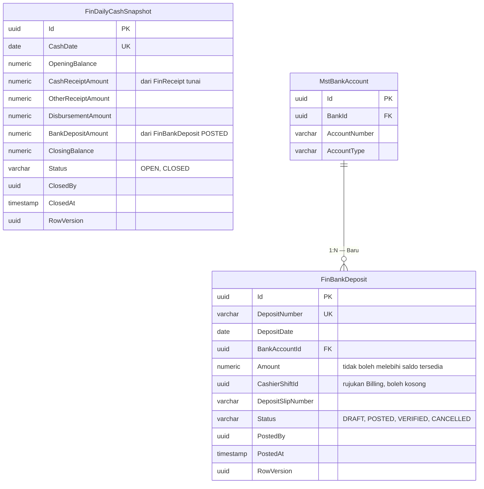
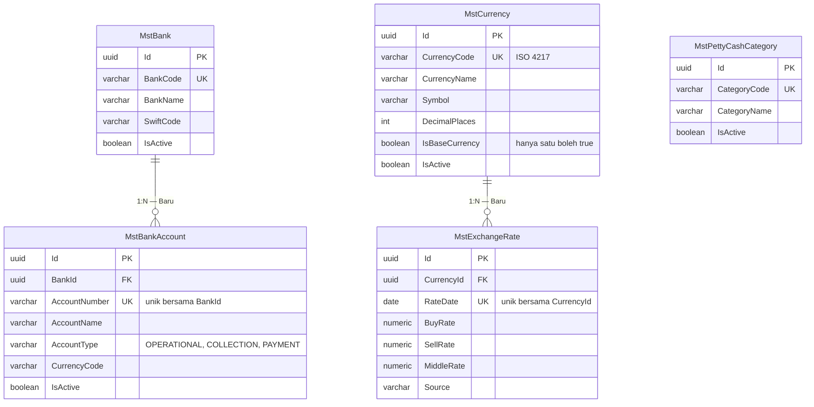

# ERD — Kas dan Data Induk Finance

| Field | Nilai |
|---|---|
| Blueprint ID | `FIN-BP-001` revisi `1` |
| Status | `draft` |
| Backend SHA | `09101d05` |

Kolom audit warisan `IdentityModel` tidak digambar.

## 1. Kas

`FinDailyCashSnapshot` sengaja **tidak** punya FK ke `FinReceipt` maupun `FinBankDeposit`.
Angkanya diringkas saat penutupan hari lalu dibekukan. Kalau dihubungkan dengan FK, angka yang
sudah ditutup akan ikut berubah setiap ada transaksi terlambat — persis yang dicegah
`FIN-DES-022`.

## 2. Data induk Finance

## 3. Status entity

| Entity | Status | Owner | Catatan |
|---|---|---|---|
| `FinBankDeposit` | Baru | Finance | Validasi saldo dihitung backend saat posting (`FIN-DES-021`) |
| `FinDailyCashSnapshot` | Baru | Finance | Satu baris per tanggal, dibekukan saat `CLOSED` |
| `MstBank` | Baru | Finance | Prefix `Mst` mengikuti `FIN-DES-003` |
| `MstBankAccount` | Baru | Finance | Rekening `COLLECTION` dan `PAYMENT` wajib ada sebelum fitur aktif |
| `MstCurrency` | Baru | Finance | Wajib berisi `IDR` sebagai mata uang dasar |
| `MstExchangeRate` | Baru | Finance | Boleh kosong saat mulai |
| `MstPettyCashCategory` | Sudah ada | Finance | Tidak disentuh pass ini |
| `FinPettyCashBudget`, `FinPettyCashBudgetMovement` | Sudah ada | Finance | Tidak disentuh; keputusannya milik blueprint `billing-kasir` (`FIN-DEC-009`) |
| `BilCashierShift` | Sudah ada | Billing | Hanya dirujuk `CashierShiftId`; Finance **MUST NOT** menulisnya |

## 4. Bagaimana saldo kas tersedia dihitung

Ini bagian paling mudah salah, jadi ditulis dengan contoh berangka.

**Aturan:** saldo yang boleh disetor = seluruh penerimaan tunai yang sudah tercatat, dikurangi
setoran yang sudah diposting sebelumnya, dikurangi koreksi/selisih yang sudah disahkan.

**Contoh.** Pada 20 September 2026 kasir menerima tunai total Rp 15.000.000. Treasury sudah
menyetor Rp 10.000.000 pagi harinya, dan ada selisih kurang Rp 200.000 yang sudah disahkan
kepala unit.

Saldo tersedia = 15.000.000 − 10.000.000 − 200.000 = **Rp 4.800.000**

- Treasury menyetor Rp 4.800.000 → diterima.
- Treasury menyetor Rp 3.000.000 → diterima (setoran sebagian diperbolehkan), sisa saldo
  tersedia menjadi Rp 1.800.000.
- Treasury menyetor Rp 5.000.000 → **ditolak** dengan pesan "Nominal setoran melebihi kas yang
  tersedia. Saldo tersedia saat ini Rp 4.800.000." dan kode `422`.

Perhitungan ini dijalankan ulang **di dalam transaksi** saat posting. Kalau dua petugas menyetor
hampir bersamaan, yang kedua membaca saldo yang sudah berkurang oleh yang pertama — bukan angka
lama yang sempat tampil di layar.

## 5. Mengapa kas kecil tidak ikut dihitung

`FinDailyCashSnapshot` **tidak** memuat pergerakan kas kecil sama sekali. Ini bukan kelalaian,
melainkan aturan bisnis #15 dan `FIN-DEC-020`:

> Uang kas kasir pasien dan kas kecil adalah dua kolam terpisah. Pencairan kas kecil MUST NOT
> mengubah `BilCashierShift.SystemCash`/`PhysicalCash`, dan penerimaan kasir MUST NOT mengubah
> `FinPettyCashBudget.CurrentBalance`.

Kalau keduanya dicampur dalam satu perhitungan kas harian, penarikan kas kecil akan terlihat
seolah uang kasir berkurang — padahal uang itu tidak pernah ada di laci kasir.
