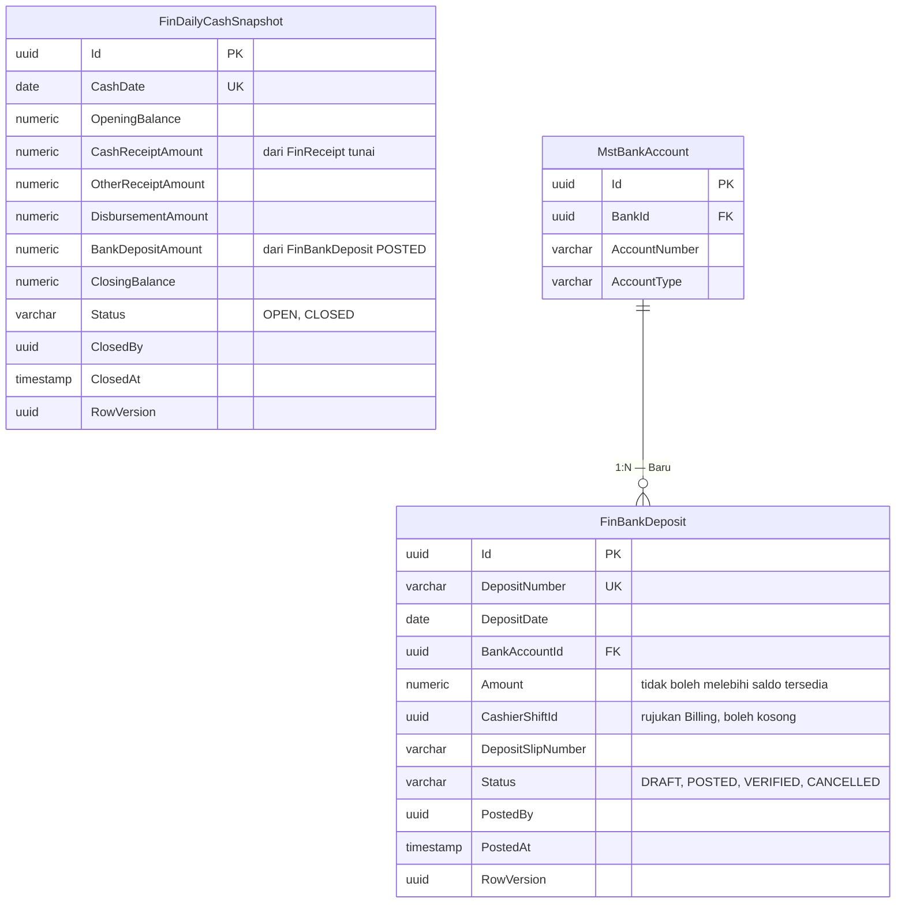
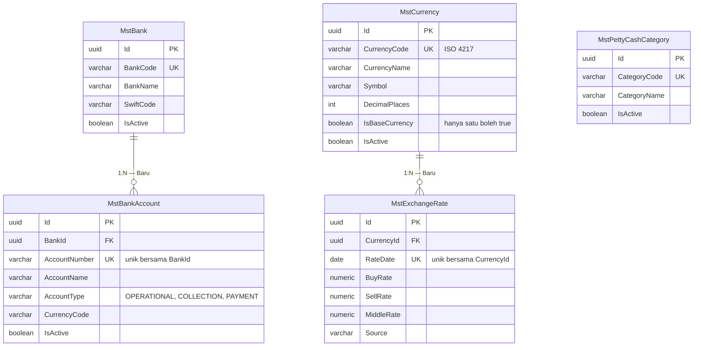
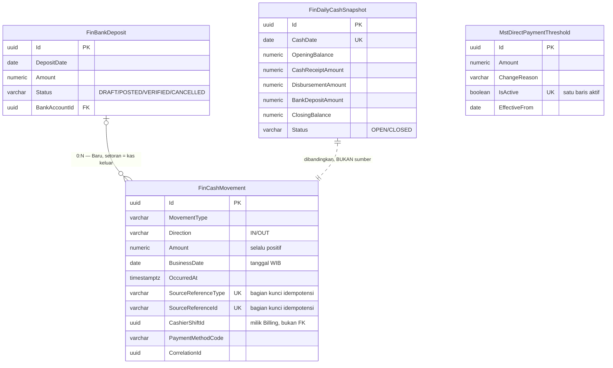

# ERD — Kas dan Data Induk Finance

| Field | Nilai |
|---|---|
| Blueprint ID | `FIN-BP-001` revisi `1` |
| Status | `draft` |
| Backend SHA | `09101d05` |

Kolom audit warisan `IdentityModel` tidak digambar.

## 1. Kas


```mermaid
erDiagram
    FinBankDeposit {
        uuid Id PK
        varchar DepositNumber UK
        date DepositDate
        uuid BankAccountId FK
        numeric Amount "tidak boleh melebihi saldo tersedia"
        uuid CashierShiftId "rujukan Billing, boleh kosong"
        varchar DepositSlipNumber
        varchar Status "DRAFT, POSTED, VERIFIED, CANCELLED"
        uuid PostedBy
        timestamp PostedAt
        uuid RowVersion
    }
    FinDailyCashSnapshot {
        uuid Id PK
        date CashDate UK
        numeric OpeningBalance
        numeric CashReceiptAmount "dari FinReceipt tunai"
        numeric OtherReceiptAmount
        numeric DisbursementAmount
        numeric BankDepositAmount "dari FinBankDeposit POSTED"
        numeric ClosingBalance
        varchar Status "OPEN, CLOSED"
        uuid ClosedBy
        timestamp ClosedAt
        uuid RowVersion
    }
    MstBankAccount {
        uuid Id PK
        uuid BankId FK
        varchar AccountNumber
        varchar AccountType
    }
    MstBankAccount ||--o{ FinBankDeposit : "1:N — Baru"
```

`FinDailyCashSnapshot` sengaja **tidak** punya FK ke `FinReceipt` maupun `FinBankDeposit`.
Angkanya diringkas saat penutupan hari lalu dibekukan. Kalau dihubungkan dengan FK, angka yang
sudah ditutup akan ikut berubah setiap ada transaksi terlambat — persis yang dicegah
`FIN-DES-022`.

## 2. Data induk Finance


```mermaid
erDiagram
    MstBank {
        uuid Id PK
        varchar BankCode UK
        varchar BankName
        varchar SwiftCode
        boolean IsActive
    }
    MstBankAccount {
        uuid Id PK
        uuid BankId FK
        varchar AccountNumber UK "unik bersama BankId"
        varchar AccountName
        varchar AccountType "OPERATIONAL, COLLECTION, PAYMENT"
        varchar CurrencyCode
        boolean IsActive
    }
    MstCurrency {
        uuid Id PK
        varchar CurrencyCode UK "ISO 4217"
        varchar CurrencyName
        varchar Symbol
        int DecimalPlaces
        boolean IsBaseCurrency "hanya satu boleh true"
        boolean IsActive
    }
    MstExchangeRate {
        uuid Id PK
        uuid CurrencyId FK
        date RateDate UK "unik bersama CurrencyId"
        numeric BuyRate
        numeric SellRate
        numeric MiddleRate
        varchar Source
    }
    MstPettyCashCategory {
        uuid Id PK
        varchar CategoryCode UK
        varchar CategoryName
        boolean IsActive
    }
    MstBank ||--o{ MstBankAccount : "1:N — Baru"
    MstCurrency ||--o{ MstExchangeRate : "1:N — Baru"
```

## 3. Status entity

| Entity | Status | Owner | Catatan |
|---|---|---|---|
| `FinBankDeposit` | Baru | Finance | Validasi saldo dihitung backend saat posting (`FIN-DES-021`) |
| `FinDailyCashSnapshot` | Baru | Finance | Satu baris per tanggal, dibekukan saat `CLOSED` |
| `MstBank` | Baru | Finance | Prefix `Mst` mengikuti `FIN-DES-003` |
| `MstBankAccount` | Baru | Finance | Rekening `COLLECTION` dan `PAYMENT` wajib ada sebelum fitur aktif |
| `MstCurrency` | Baru | Finance | Wajib berisi `IDR` sebagai mata uang dasar |
| `MstExchangeRate` | Baru | Finance | Boleh kosong saat mulai |
| `MstPettyCashCategory` | Sudah ada | Finance | Tidak disentuh pass ini |
| `FinPettyCashBudget`, `FinPettyCashBudgetMovement` | Sudah ada | Finance | Tidak disentuh; keputusannya milik blueprint `billing-kasir` (`FIN-DEC-009`) |
| `BilCashierShift` | Sudah ada | Billing | Hanya dirujuk `CashierShiftId`; Finance **MUST NOT** menulisnya |

## 4. Bagaimana saldo kas tersedia dihitung

Ini bagian paling mudah salah, jadi ditulis dengan contoh berangka.

**Aturan:** saldo yang boleh disetor = seluruh penerimaan tunai yang sudah tercatat, dikurangi
setoran yang sudah diposting sebelumnya, dikurangi koreksi/selisih yang sudah disahkan.

**Contoh.** Pada 20 September 2026 kasir menerima tunai total Rp 15.000.000. Treasury sudah
menyetor Rp 10.000.000 pagi harinya, dan ada selisih kurang Rp 200.000 yang sudah disahkan
kepala unit.

Saldo tersedia = 15.000.000 − 10.000.000 − 200.000 = **Rp 4.800.000**

- Treasury menyetor Rp 4.800.000 → diterima.
- Treasury menyetor Rp 3.000.000 → diterima (setoran sebagian diperbolehkan), sisa saldo
  tersedia menjadi Rp 1.800.000.
- Treasury menyetor Rp 5.000.000 → **ditolak** dengan pesan "Nominal setoran melebihi kas yang
  tersedia. Saldo tersedia saat ini Rp 4.800.000." dan kode `422`.

Perhitungan ini dijalankan ulang **di dalam transaksi** saat posting. Kalau dua petugas menyetor
hampir bersamaan, yang kedua membaca saldo yang sudah berkurang oleh yang pertama — bukan angka
lama yang sempat tampil di layar.

## 5. Mengapa kas kecil tidak ikut dihitung

`FinDailyCashSnapshot` **tidak** memuat pergerakan kas kecil sama sekali. Ini bukan kelalaian,
melainkan aturan bisnis #15 dan `FIN-DEC-020`:

> Uang kas kasir pasien dan kas kecil adalah dua kolam terpisah. Pencairan kas kecil MUST NOT
> mengubah `BilCashierShift.SystemCash`/`PhysicalCash`, dan penerimaan kasir MUST NOT mengubah
> `FinPettyCashBudget.CurrentBalance`.

Kalau keduanya dicampur dalam satu perhitungan kas harian, penarikan kas kecil akan terlihat
seolah uang kasir berkurang — padahal uang itu tidak pernah ada di laci kasir.

---

## Revisi 14 — Buku mutasi kas dan ambang pembayaran langsung

Diturunkan dari `FIN-DES-081`, `FIN-DES-086`, dan `FIN-DES-088`.
Kolom audit `IdentityModel` tidak digambar.


```mermaid
erDiagram
    FinCashMovement {
        uuid Id PK
        varchar MovementType
        varchar Direction "IN/OUT"
        numeric Amount "selalu positif"
        date BusinessDate "tanggal WIB"
        timestamptz OccurredAt
        varchar SourceReferenceType UK "bagian kunci idempotensi"
        varchar SourceReferenceId UK "bagian kunci idempotensi"
        uuid CashierShiftId "milik Billing, bukan FK"
        varchar PaymentMethodCode
        uuid CorrelationId
    }
    FinDailyCashSnapshot {
        uuid Id PK
        date CashDate UK
        numeric OpeningBalance
        numeric CashReceiptAmount
        numeric DisbursementAmount
        numeric BankDepositAmount
        numeric ClosingBalance
        varchar Status "OPEN/CLOSED"
    }
    FinBankDeposit {
        uuid Id PK
        date DepositDate
        numeric Amount
        varchar Status "DRAFT/POSTED/VERIFIED/CANCELLED"
        uuid BankAccountId FK
    }
    MstDirectPaymentThreshold {
        uuid Id PK
        numeric Amount
        varchar ChangeReason
        boolean IsActive UK "satu baris aktif"
        date EffectiveFrom
    }
    FinBankDeposit |o--o{ FinCashMovement : "0:N — Baru, setoran = kas keluar"
    FinDailyCashSnapshot ||..|| FinCashMovement : "dibandingkan, BUKAN sumber"
```

### Status entity

| Entity | Status | Owner | Catatan |
|---|---|---|---|
| `FinCashMovement` | **Baru** | Finance Management | Satu-satunya dasar posisi Kas Kasir |
| `MstDirectPaymentThreshold` | **Baru** | Finance Management | Master parameter kendali, satu baris aktif |
| `FinDailyCashSnapshot` | Sudah ada | Finance Management | **Nol perubahan skema.** Kedudukannya berubah menjadi laporan operasional (`FIN-DEC-124`) |
| `FinBankDeposit` | Sudah ada | Finance Management | Nol perubahan skema; penulisnya menambah satu mutasi kas keluar |
| `FinPettyCashBudget` | Sudah ada | Finance Management | Dibaca snapshot sebagai kelompok `KAS-KECIL`; **tidak** tersentuh pembayaran supplier (`FIN-DEC-133`) |
| `BilCashierShift` | Sudah ada | **Billing Kasir** | Dibaca saja; nol tulisan |

### Jenis mutasi kas

| `MovementType` | `Direction` | Sumber | `BusinessDate` diambil dari |
|---|---|---|---|
| `SALDO-AWAL` | `IN` | `FinOpeningBalance` kelompok `KAS-KASIR` saat dikunci | `CutoverDate` |
| `KAS-SHIFT` | `IN` | Shift mencapai `CLOSED`/`REVIEWED` | Tanggal shift (`OpenedAt`, WIB) |
| `PENERIMAAN-TUNAI-LANGSUNG` | `IN` | Pembayaran langsung piutang bermetode `CASH` | Tanggal pembayaran (WIB) |
| `PEMBAYARAN-TUNAI-LANGSUNG` | `OUT` | Pembayaran langsung utang bermetode `CASH` | Tanggal pembayaran (WIB) |
| `PEMBAYARAN-TUNAI-DOKUMEN` | `OUT` | `FinPayment` bermetode `CASH`, bernilai `NetTransferAmount` | `ApprovedAt` (WIB) |
| `SETORAN-BANK` | `OUT` | `FinBankDeposit` berstatus `POSTED`/`VERIFIED` | `DepositDate` |
| `PEMBALIKAN-SETORAN-BANK` | `IN` | Pembatalan setoran yang sudah diposting | Tanggal pembatalan (WIB) |

**Idempotensi wajib.** Unique index pada (`SourceReferenceType`, `SourceReferenceId`,
`MovementType`) dengan filter `IsDelete = false`. Tanpa itu, penjadwal penanda shift yang berjalan
berkala akan menulis kas shift yang sama berulang kali — pelajaran langsung dari idempotensi penanda
shift yang sudah berjalan.

### Kenapa `FinDailyCashSnapshot` digambar bergaris putus-putus

Tidak ada relasi database di antara keduanya, dan **tidak boleh** ada. Sesudah `FIN-DES-081`, rekap
harian adalah laporan operasional yang **dibandingkan** terhadap posisi kas terhitung
(`GET /subledger-balances/{periode}/variance`), bukan sumbernya. Rekap boleh ditutup walau masih ada
shift belum final (`FIN-DEC-124`), sehingga keduanya **dapat berselisih secara sah**.

### Rumus posisi Kas Kasir

```text
Kas Kasir pada tanggal T
  = Σ Amount mutasi Direction = IN   dengan BusinessDate <= T
  − Σ Amount mutasi Direction = OUT  dengan BusinessDate <= T
```

Saldo awal cutover ikut sebagai mutasi `SALDO-AWAL`, sehingga rumusnya satu baris tanpa pengecualian.
Snapshot **MUST** menolak terbit untuk periode yang berakhir sebelum `CutoverDate`.
