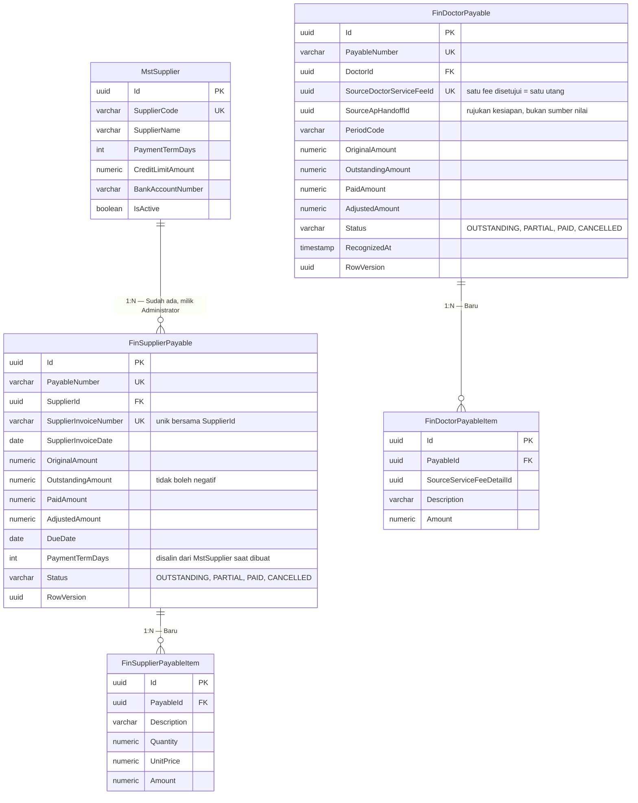
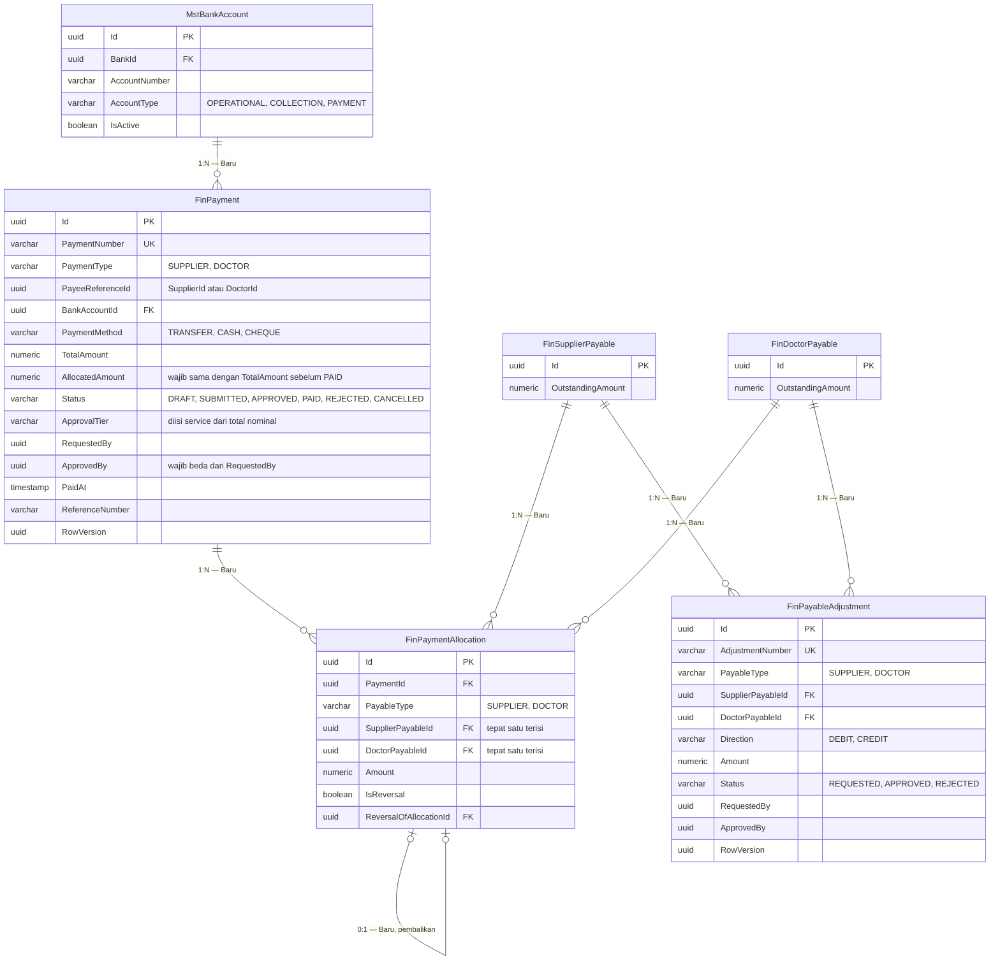
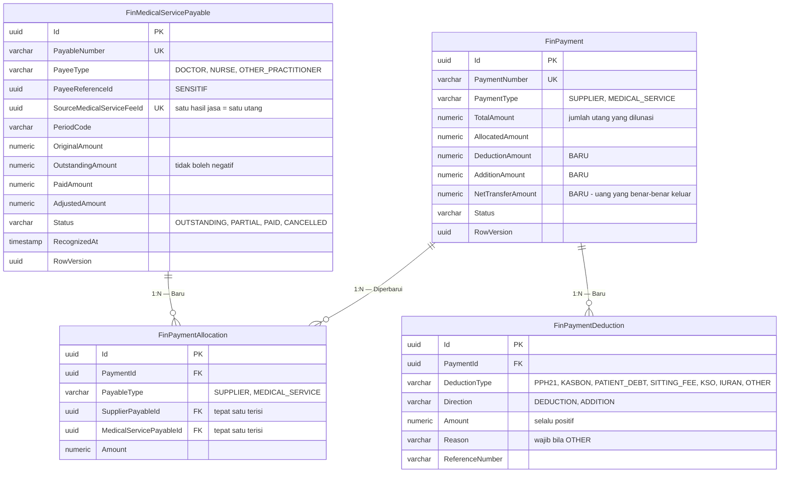

# ERD — Utang Supplier, Utang Dokter, dan Pembayaran

| Field | Nilai |
|---|---|
| Blueprint ID | `FIN-BP-001` revisi `1` |
| Status | `draft` |
| Backend SHA | `09101d05` |

Kolom audit warisan `IdentityModel` tidak digambar.

## 1. Utang

## 2. Pembayaran dan alokasinya

## 3. Status entity

| Entity | Status | Owner | Catatan |
|---|---|---|---|
| `MstSupplier` | Sudah ada | Administrator | Dipakai apa adanya (`FIN-DEC-014`); **MUST NOT** disalin ke Finance |
| `FinSupplierPayable` | Baru | Finance | Diinput manual staf AP (`FIN-DEC-015`) |
| `FinSupplierPayableItem` | Baru | Finance | Jumlah barisnya wajib sama dengan `OriginalAmount` induk |
| `FinDoctorPayable` | Baru | Finance | Lahir dari fee yang sudah disetujui Medical Fee, bukan dari `BilApHandoff` |
| `FinDoctorPayableItem` | Baru | Finance | Nilainya disalin, tidak dihitung ulang |
| `FinPayment` | Baru | Finance | Satu entity untuk supplier dan dokter (`FIN-DES-015`) |
| `FinPaymentAllocation` | Baru | Finance | Dua FK nullable + check constraint (`FIN-DES-016`) |
| `FinPayableAdjustment` | Baru | Finance | Memakai aturan tepat-satu-FK yang sama |
| `MstBankAccount` | Baru | Finance | Rekening sumber pembayaran |
| `DoctorServiceFee` | Sudah ada di luar | Medical Fee | Hanya dirujuk lewat `SourceDoctorServiceFeeId` |

## 4. Mengapa satu pembayaran boleh melunasi banyak utang

Ini jawaban langsung atas `FIN-DEC-019`. Owner menyebut masalah nyata pada sistem lama: dokter
dobel dibayar atau justru terlewat, karena rekap dikerjakan di Excel terpisah dari sistem.

Bentuk `FinPayment` satu-ke-banyak `FinPaymentAllocation` membuat rekap itu **hidup di dalam
sistem**, bukan di luar. Contoh konkret:

> Rumah sakit membayar dr. Andi (nama samaran) untuk bulan Agustus 2026 dengan satu transfer
> sebesar Rp 24.500.000. Transfer itu sebenarnya melunasi tiga utang: fee rawat jalan
> Rp 12.000.000, fee tindakan Rp 9.500.000, dan fee visite Rp 3.000.000.
>
> Yang tersimpan: satu baris `FinPayment` bernilai Rp 24.500.000, dan **tiga** baris
> `FinPaymentAllocation` yang masing-masing menunjuk satu `FinDoctorPayable`. Setiap utang itu
> `OutstandingAmount`-nya menjadi nol.
>
> Kalau kemudian ada pertanyaan "fee tindakan Agustus dr. Andi sudah dibayar belum?", jawabannya
> dapat ditelusuri satu query — bukan dengan membuka Excel.

Aturan yang menjaganya: `FinPayment.TotalAmount` **MUST** sama dengan jumlah seluruh alokasinya
sebelum statusnya boleh menjadi `PAID`. Dalam contoh di atas,
12.000.000 + 9.500.000 + 3.000.000 = 24.500.000. Bila staf keliru mengalokasikan hanya dua dari
tiga utang, totalnya menjadi Rp 21.500.000, tidak sama dengan Rp 24.500.000, dan sistem menolak
pembayaran itu diselesaikan.

## 5. Aturan tepat-satu-FK

`FinPaymentAllocation` dan `FinPayableAdjustment` sama-sama punya dua kolom FK yang keduanya
boleh kosong. Aturannya ditegakkan database, bukan hanya kode:

| `PayableType` | `SupplierPayableId` | `DoctorPayableId` |
|---|---|---|
| `SUPPLIER` | Wajib terisi | Wajib kosong |
| `DOCTOR` | Wajib kosong | Wajib terisi |

Kombinasi lain ditolak `CHECK` constraint. Ini mencegah baris yatim yang menunjuk dua utang
sekaligus atau tidak menunjuk apa pun — kesalahan yang baru ketahuan saat rekonsiliasi kalau
hanya dijaga di kode.

---

# AMENDMENT REVISI 2

| Field | Nilai |
|---|---|
| Revisi | `2`, 20 September 2026 — status `locked` 20 September 2026 |
| Dipicu | `MF-DEC-002`, `MF-DEC-005`, `MF-DEC-008` |
| Keputusan | `FIN-DES-025`..`028` |

## A.1 Bentuk sesudah amendment

## A.2 Status entity sesudah amendment

| Entity | Status | Catatan |
|---|---|---|
| `FinMedicalServicePayable` | Baru | Menggantikan `FinDoctorPayable`; melayani dokter dan tenaga kesehatan lain |
| `FinMedicalServicePayableItem` | Baru | Menggantikan `FinDoctorPayableItem` |
| `FinPaymentDeduction` | Baru | Potongan dan tambahan per pembayaran |
| `FinPayment` | Diperbarui | Tambah tiga kolom uang |
| `FinPaymentAllocation`, `FinPayableAdjustment` | Diperbarui | `DoctorPayableId` → `MedicalServicePayableId` |
| `FinDoctorPayable`, `FinDoctorPayableItem` | **Dibatalkan** | Tidak pernah dibuat |

## A.3 Tiga angka pada satu pembayaran

Ini bagian yang paling mudah salah dibaca dari ERD di atas.

| Angka | Menjawab pertanyaan | Dihitung dari |
|---|---|---|
| `TotalAmount` | "Berapa utang jasa yang lunas?" | Jumlah seluruh `FinPaymentAllocation` |
| `NetTransferAmount` | "Berapa uang yang benar-benar keluar dari rekening?" | `TotalAmount` − potongan + tambahan |
| `OutstandingAmount` pada utang | "Masih ada sisa kewajiban?" | Berkurang sebesar **alokasinya**, bukan sebesar transfer |

Ketiganya sengaja dipisah. Bila `NetTransferAmount` dipakai mengurangi utang, utang jasa tidak
akan pernah lunas karena potongan pajak dan kasbon akan selamanya tersisa sebagai "kekurangan
bayar" — padahal kewajiban rumah sakit kepada penerima memang sudah selesai (`FIN-DES-028`).
