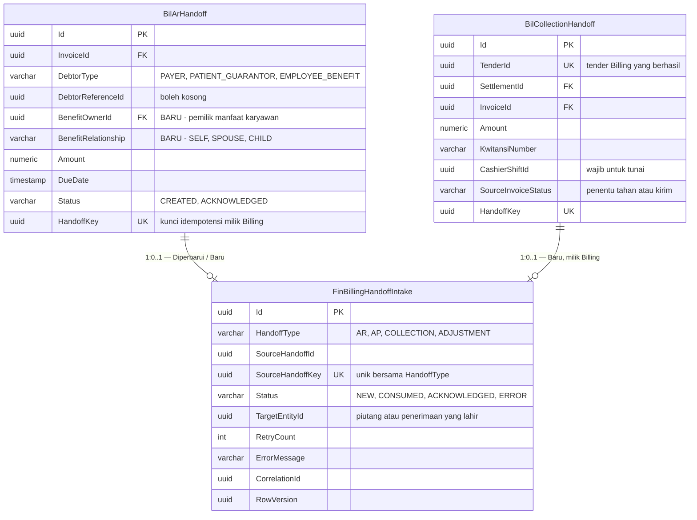
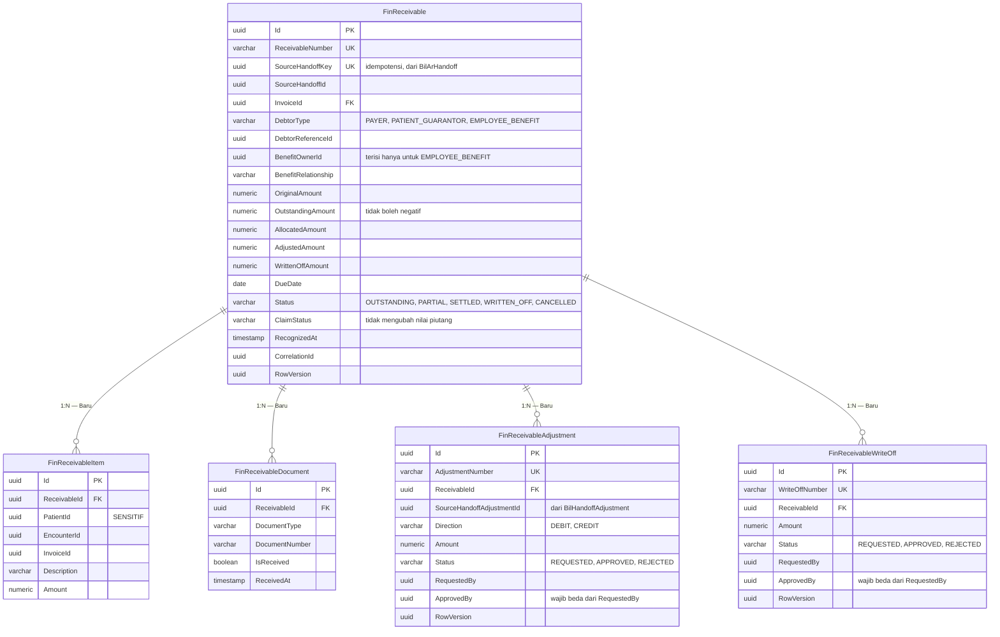
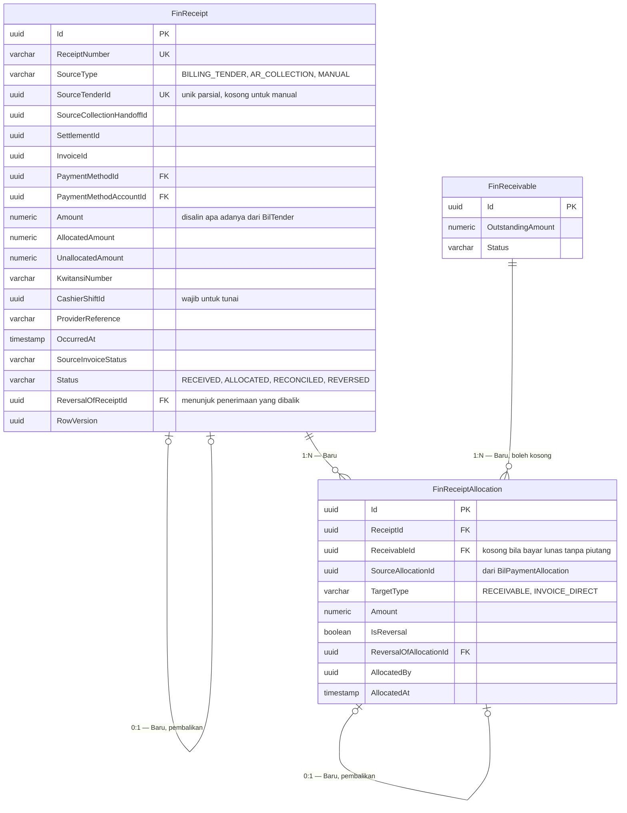

# ERD — Billing Intake, Piutang, dan Penerimaan

| Field | Nilai |
|---|---|
| Blueprint ID | `FIN-BP-001` revisi `1` |
| Status | `draft` |
| Backend SHA | `09101d05` |

Kolom audit warisan `IdentityModel` tidak digambar. Penjelasannya ada di `data-dictionary.md`.

## 1. Billing Intake

## 2. Piutang

## 3. Penerimaan

## 4. Status entity

| Entity | Status | Owner | Catatan |
|---|---|---|---|
| `BilArHandoff` | Diperbarui | Billing | Tambah `BenefitOwnerId` dan `BenefitRelationship`; migration milik tim Billing |
| `BilCollectionHandoff` | Baru | Billing | Bentuknya dikunci `integration-contract.md`; tabelnya dibangun tim Billing (`FIN-DES-023`) |
| `BilHandoffAdjustment` | Sudah ada | Billing | Direferensikan, **MUST NOT** disalin |
| `BilTender`, `BilSettlement`, `BilPaymentAllocation` | Sudah ada | Billing | Sumber nilai penerimaan; hanya dibaca |
| `FinBillingHandoffIntake` | Baru | Finance | Pintu masuk tunggal seluruh handoff |
| `FinReceivable` | Baru | Finance | Aggregate root piutang |
| `FinReceivableItem` | Baru | Finance | Menyimpan `PatientId` yang **sensitif** |
| `FinReceivableDocument` | Baru | Finance | Tidak pernah mengubah nilai piutang |
| `FinReceivableAdjustment` | Baru | Finance | Maker-checker |
| `FinReceivableWriteOff` | Baru | Finance | Maker-checker |
| `FinReceipt` | Baru | Finance | Aggregate root penerimaan |
| `FinReceiptAllocation` | Baru | Finance | Satu-satunya jembatan penerimaan ke piutang |

## 5. Tiga hal yang paling sering salah dibaca dari ERD ini

1. **`FinReceipt` tidak menunjuk `FinReceivable` secara langsung.** Hubungan keduanya selalu
   lewat `FinReceiptAllocation`. Ini disengaja: pasien yang membayar lunas di kasir
   menghasilkan penerimaan **tanpa piutang sama sekali** (`FIN-DES-011`).

2. **`FinReceiptAllocation.ReceivableId` boleh kosong.** Kolom kosong di sini bukan data yang
   belum diisi, melainkan keadaan sah — uangnya langsung melunasi tagihan Billing, bukan
   melunasi piutang Finance.

3. **Pembalikan tidak menghapus apa pun.** Baik `FinReceipt` maupun `FinReceiptAllocation`
   menunjuk dirinya sendiri lewat kolom `ReversalOf...`. Baris lama tetap utuh dan tetap
   terbaca; yang baru yang menetralkan (`FIN-DES-012`).
