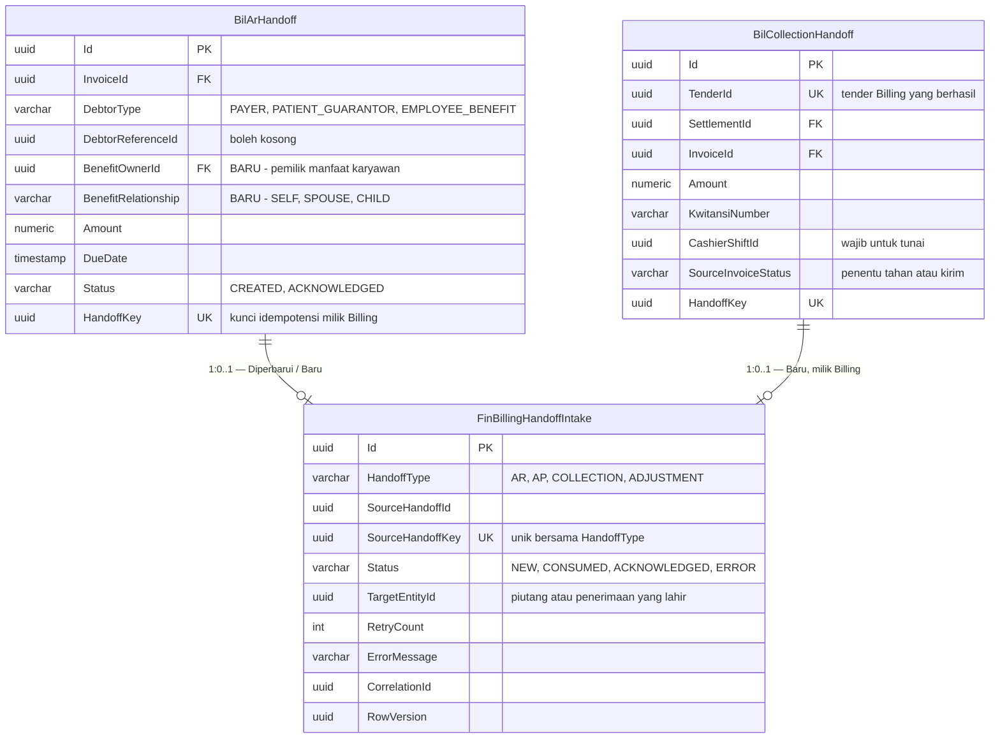
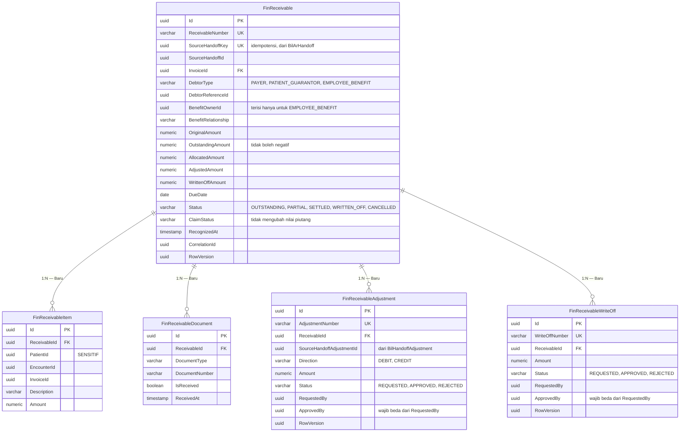
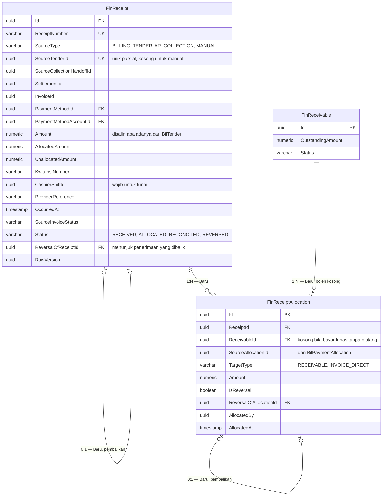
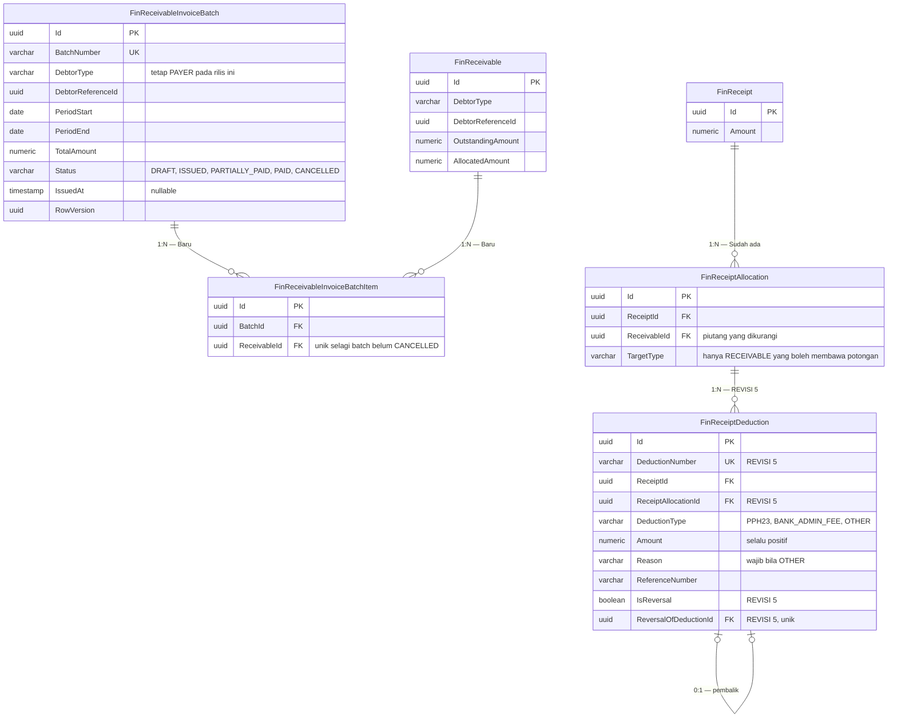
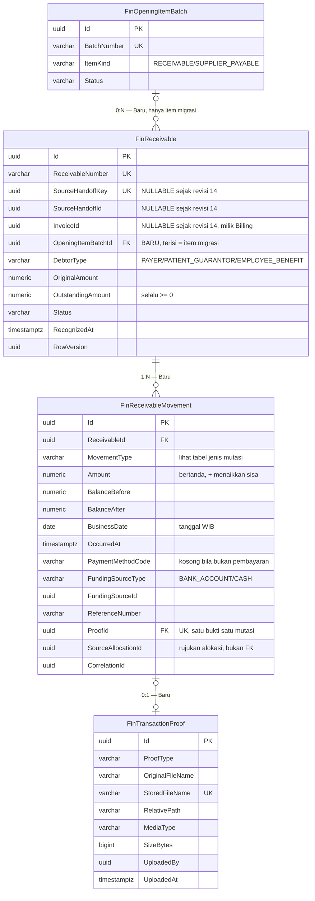

# ERD — Billing Intake, Piutang, dan Penerimaan

| Field | Nilai |
|---|---|
| Blueprint ID | `FIN-BP-001` revisi `1` |
| Status | `draft` |
| Backend SHA | `09101d05` |

Kolom audit warisan `IdentityModel` tidak digambar. Penjelasannya ada di `data-dictionary.md`.

## 1. Billing Intake

```mermaid
erDiagram
    BilArHandoff {
        uuid Id PK
        uuid InvoiceId FK
        varchar DebtorType "PAYER, PATIENT_GUARANTOR, EMPLOYEE_BENEFIT"
        uuid DebtorReferenceId "boleh kosong"
        uuid BenefitOwnerId FK "BARU - pemilik manfaat karyawan"
        varchar BenefitRelationship "BARU - SELF, SPOUSE, CHILD"
        numeric Amount
        timestamp DueDate
        varchar Status "CREATED, ACKNOWLEDGED"
        uuid HandoffKey UK "kunci idempotensi milik Billing"
    }
    BilCollectionHandoff {
        uuid Id PK
        uuid TenderId UK "tender Billing yang berhasil"
        uuid SettlementId FK
        uuid InvoiceId FK
        numeric Amount
        varchar KwitansiNumber
        uuid CashierShiftId "wajib untuk tunai"
        varchar SourceInvoiceStatus "penentu tahan atau kirim"
        uuid HandoffKey UK
    }
    FinBillingHandoffIntake {
        uuid Id PK
        varchar HandoffType "AR, AP, COLLECTION, ADJUSTMENT"
        uuid SourceHandoffId
        uuid SourceHandoffKey UK "unik bersama HandoffType"
        varchar Status "NEW, CONSUMED, ACKNOWLEDGED, ERROR"
        uuid TargetEntityId "piutang atau penerimaan yang lahir"
        int RetryCount
        varchar ErrorMessage
        uuid CorrelationId
        uuid RowVersion
    }
    BilArHandoff ||--o| FinBillingHandoffIntake : "1:0..1 — Diperbarui / Baru"
    BilCollectionHandoff ||--o| FinBillingHandoffIntake : "1:0..1 — Baru, milik Billing"
```

## 2. Piutang

```mermaid
erDiagram
    FinReceivable {
        uuid Id PK
        varchar ReceivableNumber UK
        uuid SourceHandoffKey UK "idempotensi, dari BilArHandoff"
        uuid SourceHandoffId
        uuid InvoiceId FK
        varchar DebtorType "PAYER, PATIENT_GUARANTOR, EMPLOYEE_BENEFIT"
        uuid DebtorReferenceId
        uuid BenefitOwnerId "terisi hanya untuk EMPLOYEE_BENEFIT"
        varchar BenefitRelationship
        numeric OriginalAmount
        numeric OutstandingAmount "tidak boleh negatif"
        numeric AllocatedAmount
        numeric AdjustedAmount
        numeric WrittenOffAmount
        date DueDate
        varchar Status "OUTSTANDING, PARTIAL, SETTLED, WRITTEN_OFF, CANCELLED"
        varchar ClaimStatus "tidak mengubah nilai piutang"
        timestamp RecognizedAt
        uuid CorrelationId
        uuid RowVersion
    }
    FinReceivableItem {
        uuid Id PK
        uuid ReceivableId FK
        uuid PatientId "SENSITIF"
        uuid EncounterId
        uuid InvoiceId
        varchar Description
        numeric Amount
    }
    FinReceivableDocument {
        uuid Id PK
        uuid ReceivableId FK
        varchar DocumentType
        varchar DocumentNumber
        boolean IsReceived
        timestamp ReceivedAt
    }
    FinReceivableAdjustment {
        uuid Id PK
        varchar AdjustmentNumber UK
        uuid ReceivableId FK
        uuid SourceHandoffAdjustmentId "dari BilHandoffAdjustment"
        varchar Direction "DEBIT, CREDIT"
        numeric Amount
        varchar Status "REQUESTED, APPROVED, REJECTED"
        uuid RequestedBy
        uuid ApprovedBy "wajib beda dari RequestedBy"
        uuid RowVersion
    }
    FinReceivableWriteOff {
        uuid Id PK
        varchar WriteOffNumber UK
        uuid ReceivableId FK
        numeric Amount
        varchar Status "REQUESTED, APPROVED, REJECTED"
        uuid RequestedBy
        uuid ApprovedBy "wajib beda dari RequestedBy"
        uuid RowVersion
    }
    FinReceivable ||--o{ FinReceivableItem : "1:N — Baru"
    FinReceivable ||--o{ FinReceivableDocument : "1:N — Baru"
    FinReceivable ||--o{ FinReceivableAdjustment : "1:N — Baru"
    FinReceivable ||--o{ FinReceivableWriteOff : "1:N — Baru"
```

## 3. Penerimaan

```mermaid
erDiagram
    FinReceipt {
        uuid Id PK
        varchar ReceiptNumber UK
        varchar SourceType "BILLING_TENDER, AR_COLLECTION, MANUAL"
        uuid SourceTenderId UK "unik parsial, kosong untuk manual"
        uuid SourceCollectionHandoffId
        uuid SettlementId
        uuid InvoiceId
        uuid PaymentMethodId FK
        uuid PaymentMethodAccountId FK
        numeric Amount "disalin apa adanya dari BilTender"
        numeric AllocatedAmount
        numeric UnallocatedAmount
        varchar KwitansiNumber
        uuid CashierShiftId "wajib untuk tunai"
        varchar ProviderReference
        timestamp OccurredAt
        varchar SourceInvoiceStatus
        varchar Status "RECEIVED, ALLOCATED, RECONCILED, REVERSED"
        uuid ReversalOfReceiptId FK "menunjuk penerimaan yang dibalik"
        uuid RowVersion
    }
    FinReceiptAllocation {
        uuid Id PK
        uuid ReceiptId FK
        uuid ReceivableId FK "kosong bila bayar lunas tanpa piutang"
        uuid SourceAllocationId "dari BilPaymentAllocation"
        varchar TargetType "RECEIVABLE, INVOICE_DIRECT"
        numeric Amount
        boolean IsReversal
        uuid ReversalOfAllocationId FK
        uuid AllocatedBy
        timestamp AllocatedAt
    }
    FinReceivable {
        uuid Id PK
        numeric OutstandingAmount
        varchar Status
    }
    FinReceipt ||--o{ FinReceiptAllocation : "1:N — Baru"
    FinReceivable ||--o{ FinReceiptAllocation : "1:N — Baru, boleh kosong"
    FinReceipt |o--o| FinReceipt : "0:1 — Baru, pembalikan"
    FinReceiptAllocation |o--o| FinReceiptAllocation : "0:1 — Baru, pembalikan"
```

## 4. Status entity

| Entity | Status | Owner | Catatan |
|---|---|---|---|
| `BilArHandoff` | Diperbarui | Billing | Tambah `BenefitOwnerId` dan `BenefitRelationship`; migration milik tim Billing |
| `BilCollectionHandoff` | Baru | Billing | Bentuknya dikunci `integration-contract.md`; tabelnya dibangun tim Billing (`FIN-DES-023`) |
| `BilHandoffAdjustment` | Sudah ada | Billing | Direferensikan, **MUST NOT** disalin |
| `BilTender`, `BilSettlement`, `BilPaymentAllocation` | Sudah ada | Billing | Sumber nilai penerimaan; hanya dibaca |
| `FinBillingHandoffIntake` | Baru | Finance | Pintu masuk tunggal seluruh handoff |
| `FinReceivable` | Baru | Finance | Aggregate root piutang |
| `FinReceivableItem` | Baru | Finance | Menyimpan `PatientId` yang **sensitif** |
| `FinReceivableDocument` | Baru | Finance | Tidak pernah mengubah nilai piutang |
| `FinReceivableAdjustment` | Baru | Finance | Maker-checker |
| `FinReceivableWriteOff` | Baru | Finance | Maker-checker |
| `FinReceipt` | Baru | Finance | Aggregate root penerimaan |
| `FinReceiptAllocation` | Baru | Finance | Satu-satunya jembatan penerimaan ke piutang |

## 5. Tiga hal yang paling sering salah dibaca dari ERD ini

1. **`FinReceipt` tidak menunjuk `FinReceivable` secara langsung.** Hubungan keduanya selalu
   lewat `FinReceiptAllocation`. Ini disengaja: pasien yang membayar lunas di kasir
   menghasilkan penerimaan **tanpa piutang sama sekali** (`FIN-DES-011`).

2. **`FinReceiptAllocation.ReceivableId` boleh kosong.** Kolom kosong di sini bukan data yang
   belum diisi, melainkan keadaan sah — uangnya langsung melunasi tagihan Billing, bukan
   melunasi piutang Finance.

3. **Pembalikan tidak menghapus apa pun.** Baik `FinReceipt` maupun `FinReceiptAllocation`
   menunjuk dirinya sendiri lewat kolom `ReversalOf...`. Baris lama tetap utuh dan tetap
   terbaca; yang baru yang menetralkan (`FIN-DES-012`).

---

# AMENDMENT REVISI 4 — AR Invoice Agregat dan Potongan AR

| Field | Nilai |
|---|---|
| Revisi | `4`, 25 September 2026 — status `draft` |
| Dipicu | `FIN-SC-009`, `FIN-SC-010` (`Keuangan.md`) |
| Keputusan | `FIN-DEC-048`, `FIN-DEC-049`, `FIN-DEC-055`, `FIN-DES-041`, `FIN-DES-042` |

## D.1 Bentuk sesudah amendment

```mermaid
erDiagram
    FinReceivable {
        uuid Id PK
        varchar DebtorType
        uuid DebtorReferenceId
        numeric OutstandingAmount
        numeric AllocatedAmount
    }
    FinReceivableInvoiceBatch {
        uuid Id PK
        varchar BatchNumber UK
        varchar DebtorType "tetap PAYER pada rilis ini"
        uuid DebtorReferenceId
        date PeriodStart
        date PeriodEnd
        numeric TotalAmount
        varchar Status "DRAFT, ISSUED, PARTIALLY_PAID, PAID, CANCELLED"
        timestamp IssuedAt "nullable"
        uuid RowVersion
    }
    FinReceivableInvoiceBatchItem {
        uuid Id PK
        uuid BatchId FK
        uuid ReceivableId FK "unik selagi batch belum CANCELLED"
    }
    FinReceipt {
        uuid Id PK
        numeric Amount
    }
    FinReceiptAllocation {
        uuid Id PK
        uuid ReceiptId FK
        uuid ReceivableId FK "piutang yang dikurangi"
        varchar TargetType "hanya RECEIVABLE yang boleh membawa potongan"
    }
    FinReceiptDeduction {
        uuid Id PK
        varchar DeductionNumber UK "REVISI 5"
        uuid ReceiptId FK
        uuid ReceiptAllocationId FK "REVISI 5"
        varchar DeductionType "PPH23, BANK_ADMIN_FEE, OTHER"
        numeric Amount "selalu positif"
        varchar Reason "wajib bila OTHER"
        varchar ReferenceNumber
        boolean IsReversal "REVISI 5"
        uuid ReversalOfDeductionId FK "REVISI 5, unik"
    }

    FinReceivableInvoiceBatch ||--o{ FinReceivableInvoiceBatchItem : "1:N — Baru"
    FinReceivable ||--o{ FinReceivableInvoiceBatchItem : "1:N — Baru"
    FinReceipt ||--o{ FinReceiptAllocation : "1:N — Sudah ada"
    FinReceiptAllocation ||--o{ FinReceiptDeduction : "1:N — REVISI 5"
    FinReceiptDeduction |o--o| FinReceiptDeduction : "0:1 — pembalik"
```

**Diperbarui AMENDMENT REVISI 5 (25 September 2026).** Potongan melekat pada **baris alokasi**,
bukan hanya pada penerimaan — alokasi itulah yang menyebut piutang mana yang dikurangi
(`FIN-DES-048`). Potongan dicatat dalam permintaan yang sama dengan alokasinya, dan ikut dibalik
bila alokasinya dibalik (`FIN-DES-049`). Rincian kolom: `data-dictionary.md` D.3.

## D.2 Status entity sesudah amendment

| Entity | Status | Catatan |
|---|---|---|
| `FinReceivableInvoiceBatch` | Baru | Dokumen resmi yang dikirim ke penjamin (`FIN-DEC-048`); **bukan** pengganti `FinReceivable`/`BilInvoice` — lapisan baru di atasnya |
| `FinReceivableInvoiceBatchItem` | Baru | Kunci pengelompokan memakai `FinReceivable.DebtorType`+`DebtorReferenceId` yang sudah ada, nol kolom baru pada `FinReceivable` |
| `FinReceiptDeduction` | Baru | Arah berlawanan dari `FinPaymentDeduction` (sisi Payable) — mengurangi `OutstandingAmount` sebagai "pembayaran non-tunai" (`FIN-DEC-055`), bukan entity yang sama |

## D.3 Yang paling mudah salah dibaca

1. **`FinReceivableInvoiceBatch` tidak menggantikan `FinReceivable`.** Batch adalah lapisan
   penagihan gabungan; `FinReceivable` tetap satuan internal per invoice, dan
   `BillingCompanyGuarantorInvoiceDocumentService` (Billing, `FIN-CAP-030`) tetap dipakai sebagai
   rincian baris — dipanggil, bukan disalin ulang logikanya.
2. **`FinReceiptDeduction.Amount` menambah `AllocatedAmount`, bukan kategori baru.** Supaya
   invariant `FinReceivable` yang sudah ada
   (`OriginalAmount = OutstandingAmount + AllocatedAmount + AdjustedAmount + WrittenOffAmount`)
   tidak perlu diubah bentuknya.
3. **Ini kebalikan tepat dari `FinPaymentDeduction`.** Di sisi Payable, potongan **tidak**
   mengurangi utang yang dibayar (`FIN-DES-028`); di sisi Receivable, potongan **mengurangi**
   piutang. Arah yang tertukar adalah kesalahan paling mahal pada amendment ini.

Rincian kolom penuh dan DDL ada di `data-dictionary.md` AMENDMENT REVISI 4 bagian C.13-C.16,
dengan `FinReceiptDeduction` **digantikan** bagian D.3 (REVISI 5).

---

## Revisi 14 — Buku mutasi piutang, item migrasi, dan bukti pembayaran

Diturunkan dari `FIN-DES-079`, `FIN-DES-085`, `FIN-DES-087`, dan `FIN-DES-089`.
Kolom audit `IdentityModel` tidak digambar.

```mermaid
erDiagram
    FinReceivable {
        uuid Id PK
        varchar ReceivableNumber UK
        uuid SourceHandoffKey UK "NULLABLE sejak revisi 14"
        uuid SourceHandoffId "NULLABLE sejak revisi 14"
        uuid InvoiceId "NULLABLE sejak revisi 14, milik Billing"
        uuid OpeningItemBatchId FK "BARU, terisi = item migrasi"
        varchar DebtorType "PAYER/PATIENT_GUARANTOR/EMPLOYEE_BENEFIT"
        numeric OriginalAmount
        numeric OutstandingAmount "selalu >= 0"
        varchar Status
        timestamptz RecognizedAt
        uuid RowVersion
    }
    FinReceivableMovement {
        uuid Id PK
        uuid ReceivableId FK
        varchar MovementType "lihat tabel jenis mutasi"
        numeric Amount "bertanda, + menaikkan sisa"
        numeric BalanceBefore
        numeric BalanceAfter
        date BusinessDate "tanggal WIB"
        timestamptz OccurredAt
        varchar PaymentMethodCode "kosong bila bukan pembayaran"
        varchar FundingSourceType "BANK_ACCOUNT/CASH"
        uuid FundingSourceId
        varchar ReferenceNumber
        uuid ProofId FK "UK, satu bukti satu mutasi"
        uuid SourceAllocationId "rujukan alokasi, bukan FK"
        uuid CorrelationId
    }
    FinTransactionProof {
        uuid Id PK
        varchar ProofType
        varchar OriginalFileName
        varchar StoredFileName UK
        varchar RelativePath
        varchar MediaType
        bigint SizeBytes
        uuid UploadedBy
        timestamptz UploadedAt
    }
    FinOpeningItemBatch {
        uuid Id PK
        varchar BatchNumber UK
        varchar ItemKind "RECEIVABLE/SUPPLIER_PAYABLE"
        varchar Status
    }
    FinReceivable ||--o{ FinReceivableMovement : "1:N — Baru"
    FinOpeningItemBatch |o--o{ FinReceivable : "0:N — Baru, hanya item migrasi"
    FinReceivableMovement |o--o| FinTransactionProof : "0:1 — Baru"
```

### Status entity

| Entity | Status | Owner | Catatan |
|---|---|---|---|
| `FinReceivable` | **Diperbarui** | Finance Management | Tiga kolom asal Billing menjadi nullable bersyarat; satu kolom FK batch ditambah; satu check constraint baru; satu index diganti filternya |
| `FinReceivableMovement` | **Baru** | Finance Management | Buku mutasi; satu-satunya dasar posisi piutang per tanggal |
| `FinTransactionProof` | **Baru** | Finance Management | Metadata berkas bukti; berkasnya di luar database |
| `FinOpeningItemBatch` | **Baru** | Finance Management | Digambar sebatas titik sentuhnya; ERD lengkapnya pada `accounting-integration.md` |
| `FinReceiptAllocation`, `FinReceiptDeduction`, `FinReceivableWriteOff`, `FinReceivableAdjustment` | Sudah ada | Finance Management | **Tidak disentuh.** Keempatnya tetap menjadi rincian kejadiannya; buku mutasi **melengkapi**, bukan menggantikannya |
| `FinNonPatientReceivable` | Sudah ada | Finance Management | **Tidak disentuh** (`FIN-OQ-069` belum dijawab) |

### Jenis mutasi piutang

| `MovementType` | Tanda `Amount` | Ditulis oleh |
|---|---|---|
| `PENGAKUAN` | + | Intake Billing |
| `PEMBUKAAN-MIGRASI` | + | Persetujuan batch migrasi |
| `ALOKASI-PENERIMAAN` | − | `ApplyAllocationAsync` |
| `PEMBALIKAN-ALOKASI` | + | `ReverseAllocationAsync` |
| `POTONGAN` | − | Potongan PPh 23 dan biaya bank |
| `PEMBALIKAN-POTONGAN` | + | Pembalikan potongan |
| `PENYESUAIAN` | + atau − | Penyesuaian disetujui |
| `PENGHAPUSAN` | − | Penghapusan, berjenjang maupun langsung |
| `PEMBAYARAN-LANGSUNG` | − | Pembayaran langsung; **membawa** metode, sumber dana, dan bukti |

Invariant yang dapat diuji: `BalanceAfter` baris mutasi terakhir **MUST** sama dengan
`FinReceivable.OutstandingAmount`. Selisih berarti ada jalur yang lupa menulis mutasi.

### Yang sengaja tidak digambar

`FinReceipt` tidak digambar bersama buku mutasi. Pembayaran langsung **tidak** melahirkan
`FinReceipt` — itu justru temuan yang melahirkan `FIN-DEC-123`. Menggambarnya akan menyiratkan
hubungan yang tidak ada.
