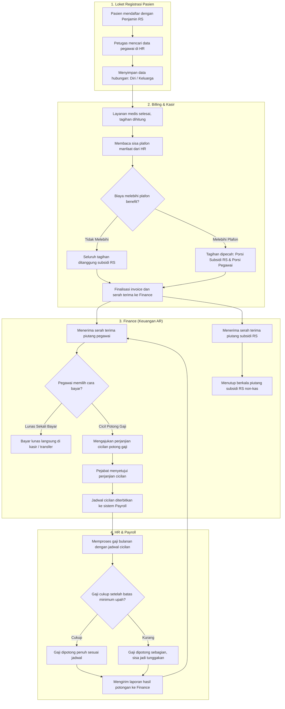
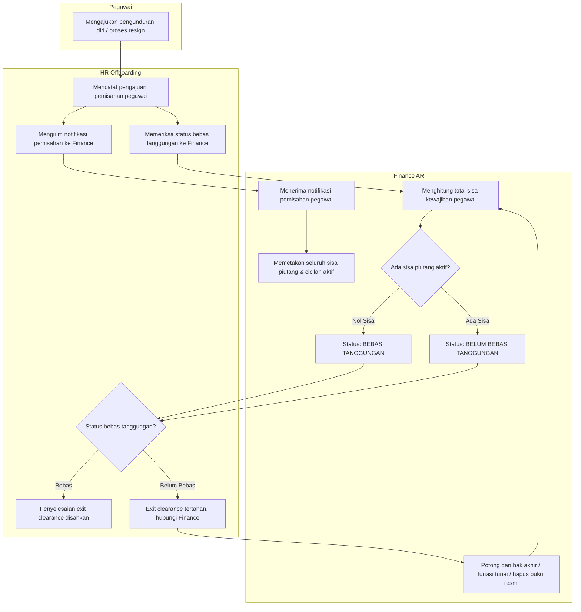
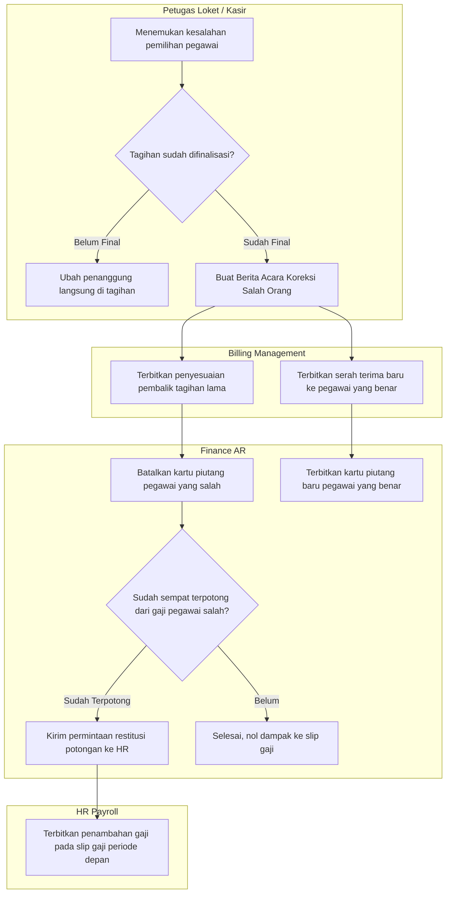

# Alur Proses — Integrasi Ujung-ke-Ujung Piutang Manfaat Karyawan

| Field | Nilai |
|---|---|
| Slice | `S1`, `S2a`, `S2b`, `S3`, `S4a`, `S4b`, `S5`, `S6`, `S7a`, `S8` — Integrasi Lintas Domain Ujung-ke-Ujung |
| Domain Terkait | Registrasi Pasien (`REG`), Billing & Kasir (`BIL`), Finance AR (`FIN`), Human Resource Benefit & Payroll (`HR`) |
| Keputusan yang Diturunkan | `FIN-DEC-161` s.d. `FIN-DEC-202` (Keputusan Finance, Billing, HR, dan Registrasi) |
| Rujukan Arsitektur | `02-backend-architecture.md` Bagian O & P; `contracts/integration-contract.md` Bagian P |
| Status | `approved` — Disetujui pemilik (Yasmin) 6 Oktober 2026 |
| Catatan Kepatuhan | Diagram ini **tidak** memuat nama tabel teknis, kolom, endpoint, maupun nama class. Pesan penolakan validasi rinci merujuk ke `contracts/validation-matrix.md` |

---

## 1. Mengapa Alur Integrasi Ini Ada

Pelayanan medis bagi pegawai rumah sakit dan keluarganya melibatkan empat bagian yang saling terhubung:
1. **Loket Registrasi**: Mengidentifikasi pasien sebagai pegawai atau keluarga tanggungan penjamin internal rumah sakit.
2. **Kasir / Billing**: Menghitung batas plafon manfaat dari HR; memisahkan tagihan menjadi porsi subsidi rumah sakit dan porsi tanggungan pribadi pegawai (bila melebihi plafon).
3. **Finance (Keuangan)**: Mencatat piutang tanggungan pegawai, menyepakati skema cicilan potong gaji, dan menutup berkala porsi subsidi rumah sakit.
4. **HR & Payroll**: Memotong angsuran dari slip gaji bulanan, menjaga batas upah minimum pegawai, serta menegakkan gerbang bebas tanggungan sebelum pegawai berhenti kerja (*exit clearance*).

Bila keempat bagian ini tidak terintegrasi dengan runtut, risiko yang terjadi meliputi: salah potong gaji pegawai lain, piutang subsidi rumah sakit menggelembung tanpa pernah ditutup, atau pegawai berhenti kerja dengan menyisakan tunggakan yang tidak tertagih.

---

## 2. Diagram Alur Pokok Integrasi Ujung-ke-Ujung

---

## 3. Diagram Alur Khusus: Gerbang Berhenti Kerja (Exit Clearance)

---

## 4. Diagram Alur Khusus: Koreksi Salah Pemilik Manfaat

---

## 5. Tabel Langkah Integrasi Ujung-ke-Ujung

| # | Tahap | Pelaku | Masukan | Keluaran | Penanganan Bila Gagal |
|---:|---|---|---|---|---|
| 1 | Pendaftaran Pasien | Petugas Loket Registrasi | Identitas pasien, kartu penjamin RS, pencarian pegawai di HR | Data pendaftaran dengan snapshot hubungan dan ID pegawai sah | Jika pegawai tidak ditemukan di data HR, pendaftaran dengan penjamin internal ditolak; pasien didaftarkan sebagai Pasien Umum. |
| 2 | Pembacaan Plafon Benefit | Sistem Billing | Nomor kunjungan dan ID pegawai terdaftar | Sisa plafon medis pegawai dan keluarga dari HR | Jika HR tidak dapat dihubungi atau data plafon belum diisi, tagihan dialihkan sementara untuk konfirmasi manual ke HR. |
| 3 | Perhitungan Pembagian Tagihan | Sistem Billing | Rincian biaya pelayanan medis dan sisa plafon | Pembagian 2 porsi: Porsi Subsidi RS dan Porsi Tanggungan Pegawai | Jika sisa plafon habis, seluruh tagihan menjadi porsi tanggungan pegawai. Perhitungan dilakukan otomatis oleh Billing. |
| 4 | Finalisasi & Serah Terima | Kasir / Sistem Billing | Tagihan final yang disetujui | Tepat dua baris serah terima data ke Finance: subsidi RS dan pegawai | Bila serah terima data gagal, invoice tidak dapat disahkan dan kasir diminta mengulang proses finalisasi. |
| 5 | Pencatatan Piutang | Sistem Finance | Serah terima data dari Billing | Dua kartu piutang terpisah: Piutang Pegawai dan Piutang Subsidi RS | Piutang pegawai wajib memiliki identitas pegawai yang sah dari HR; jika tidak ada, sistem menolak serah terima secara ketat. |
| 6 | Pengajuan & Persetujuan Cicilan | Staf Finance & Pejabat Penyetuju | Kartu piutang pegawai, jumlah bulan cicilan, periode awal potong gaji | Perjanjian cicilan disetujui dan jadwal potongan gaji diterbitkan | Pengaju dilarang menyetujui pengajuannya sendiri. Jika sisa utang berubah sebelum disetujui, pengajuan ditolak untuk diajukan ulang. |
| 7 | Pengiriman Jadwal ke Payroll | Sistem Finance | Jadwal angsuran yang disetujui | Baris potongan variabel pada modul Payroll HR | Pengiriman jadwal dilakukan otomatis antar-sistem tanpa input ulang manual di HR. |
| 8 | Eksekusi Potongan Payroll | Sistem Payroll HR | Jadwal potongan dan perhitungan gaji bulanan | Hasil potongan gaji: Lunas Penuh, Terpotong Sebagian, atau Gagal | HR membatasi potongan agar sisa gaji tidak melanggar batas take-home pay minimum. Potongan yang kurang dilaporkan sebagian. |
| 9 | Pelaporan Hasil ke Finance | Sistem Payroll HR | Status dan nominal potongan per baris angsuran | Pembaruan status angsuran dan pengurangan sisa piutang pegawai | Pengiriman hasil potongan bersifat idempoten; pengiriman ulang akibat kendala jaringan tidak memotong saldo piutang dua kali. |
| 10 | Penanganan Tunggakan | Sistem Finance | Hasil potongan sebagian atau gagal | Sisa angsuran otomatis ditambahkan ke jadwal potongan periode berikutnya | Tunggakan tidak dihapus otomatis dan tidak membatalkan perjanjian cicilan. Tunggakan terus dibawa sampai lunas. |
| 11 | Penutupan Piutang Subsidi RS | Pejabat Penyetuju Finance | Daftar piutang subsidi RS pada periode berjalan | Pelunasan internal berkala disahkan, saldo piutang subsidi menjadi nol | Pelunasan internal bukan penghapusan buku. Penutupan dilakukan sekaligus per periode; jika ada data berubah di tengah jalan, proses diulang. |
| 12 | Pemeriksaan Bebas Tanggungan | Petugas HR Offboarding | ID pegawai yang mengundurkan diri / pensiun | Status bebas tanggungan: Bebas atau Masih Ada Tanggungan | Jika masih ada sisa utang, proses exit clearance terkunci hingga utang dilunasi tunai, dipotong pesangon, atau dihapus buku resmi. |

---

## 6. Jalur Gagal dan Titik Kendali Petugas

| Skenario Kendala | Dampak yang Terlihat Petugas | Tindakan Penyelesaian Petugas | Yang Dilarang Keras Dilakukan |
|---|---|---|---|
| Salah memilih pegawai pada saat pendaftaran | Tagihan dan piutang tercatat atas nama rekan kerja yang salah | Petugas membuat Berita Acara Koreksi; Billing menerbitkan pembalik dan serah terima baru; Finance membatalkan piutang lama | Mengubah nama debitur secara langsung di kartu piutang Finance tanpa jejak audit |
| Gaji bulanan pegawai tidak mencukupi untuk angsuran | Slip gaji dipotong sebagian; Finance mencatat sisa sebagai tunggakan | Sistem otomatis menjadwalkan sisa potongan ke bulan berikutnya | Membatalkan perjanjian cicilan secara sepihak atau membiarkan potongan melanggar upah minimum |
| Gangguan koneksi saat HR mengirim hasil potongan gaji | HR mengirim ulang data potongan beberapa saat kemudian | Finance mendeteksi data duplikat dan mengabaikannya dengan aman tanpa galat | Memotong saldo piutang dua kali untuk satu periode gaji yang sama |
| Pegawai berhenti kerja namun masih memiliki cicilan aktif | Formulir exit clearance di HR menampilkan status *Belum Bebas Tanggungan* dan tombol simpan terkunci | Sisa utang dilunasi via pemotongan hak akhir/pesangon, pembayaran tunai di kasir, atau penghapusan buku resmi jika diizinkan Direksi | Membuka kunci gerbang clearance secara manual tanpa penyelesaian finansial |
| Piutang subsidi rumah sakit belum ditutup pada akhir bulan | Laporan umur piutang rumah sakit tampak membengkak | Pejabat Finance menjalankan proses Pelunasan Internal Manfaat berkala untuk periode tersebut | Menggunakan fitur "Hapus Buku Piutang Macet" untuk menutup porsi subsidi rumah sakit yang sah |
