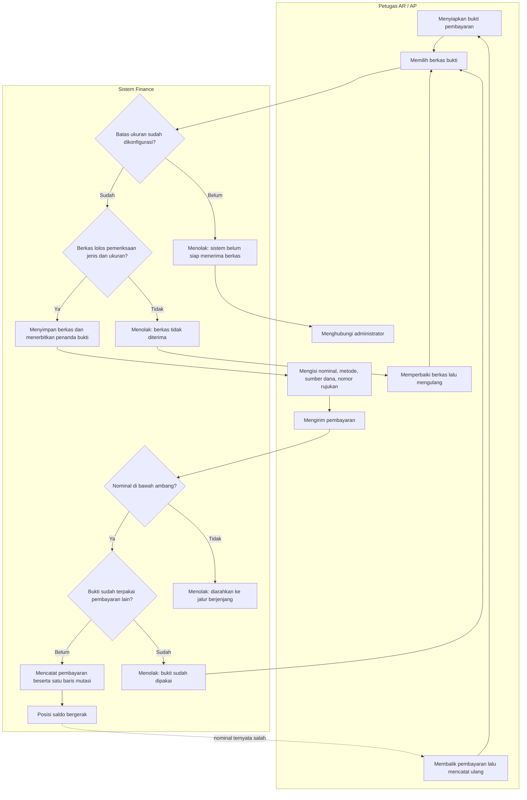

# Alur proses — Bukti pembayaran langsung

| Field | Nilai |
|---|---|
| Keputusan yang diturunkan | `FIN-DEC-126` (bukti wajib), `FIN-DEC-139` (aturan berkasnya) |
| Rancangan | `FIN-DES-092`, `02-backend-architecture.md` AMENDMENT REVISI 15 |
| Status | `draft` — menunggu persetujuan owner |
| Catatan | Diagram ini **tidak** memuat nama tabel, kolom, endpoint, maupun class. Pesan penolakan persisnya ada di `contracts/validation-matrix.md` bagian `G.1`, tidak disalin ke sini |

## Alur normal beserta jalur gagalnya

## Tabel langkah

| # | Langkah | Pelaku | Masukan | Keluaran | Bila gagal |
|---:|---|---|---|---|---|
| 1 | Menyiapkan bukti | Petugas | Kuitansi, bukti transfer | Berkas PDF atau foto | — |
| 2 | Memeriksa kesiapan sistem | Sistem | Konfigurasi batas ukuran | Lanjut, atau penolakan "belum siap" | Petugas menghubungi administrator. Ia **tidak** perlu mengganti berkas — masalahnya bukan di berkasnya |
| 3 | Memeriksa berkas | Sistem | Berkas beserta jenis dan ukurannya | Penanda bukti, atau penolakan | Petugas memperbaiki berkas: menyimpan ulang sebagai PDF/JPG/JPEG/PNG, atau memperkecil ukurannya |
| 4 | Mengisi rincian pembayaran | Petugas | Nominal, metode, sumber dana, nomor rujukan | Permintaan pembayaran | — |
| 5 | Memeriksa ambang | Sistem | Nominal, ambang aktif | Lanjut, atau arahan ke jalur berjenjang | Petugas memakai jalur berjenjang. Bila ambang belum ditetapkan, **seluruh** pembayaran langsung ditolak — disengaja |
| 6 | Memeriksa bukti belum terpakai | Sistem | Penanda bukti | Lanjut, atau penolakan | Petugas mengunggah bukti baru. Bukti lama tetap tersimpan dan **tidak** dapat dipakai ulang |
| 7 | Mencatat pembayaran | Sistem | Permintaan beserta penanda bukti | Satu baris mutasi, posisi saldo bergerak | Bila pencatatan gagal, bukti yang sudah terunggah **tetap sah** dipakai percobaan berikutnya |
| 8 | Mengoreksi pembayaran yang nominalnya salah | Petugas | Pembayaran yang sudah tercatat | Pembalikan, lalu pencatatan ulang beserta bukti baru | **Bukti tidak dapat diganti.** Satu-satunya jalan koreksi adalah membalik lalu mencatat ulang — bukan menukar berkasnya |

## Jalur gagal yang paling sering ditemui petugas

| Keadaan | Yang dilihat petugas | Yang **MUST NOT** terjadi |
|---|---|---|
| Foto kuitansi dari ponsel terlalu besar | Pesan batas ukuran, dan ia tahu batasnya **sebelum** memilih berkas | Unggahan besar berjalan sampai selesai hanya untuk ditolak |
| Berkas bernama `.pdf` tetapi isinya bukan PDF | Pesan bahwa isi berkas tidak sesuai jenisnya | Berkas diterima hanya karena ekstensinya benar |
| Administrator belum mengisi batas ukuran | Pesan konfigurasi belum lengkap, beserta arahan menghubungi administrator | Petugas menyangka berkasnya yang salah dan mencoba berkas demi berkas |
| Nominal salah ketik dan sudah tercatat | Jalan koreksi: balik lalu catat ulang | Muncul tombol "ganti bukti" yang menyamarkan riwayat pembayaran |
