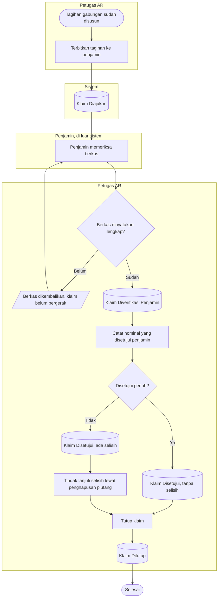
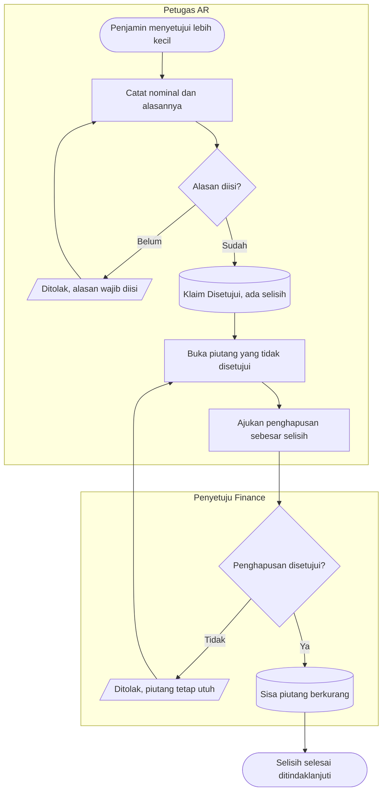
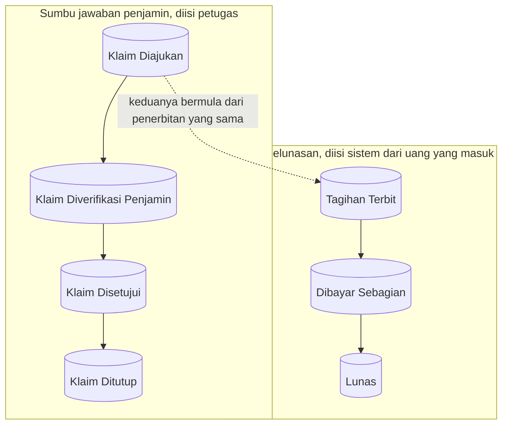

# Alur Proses — Klaim Penjamin atas Tagihan Gabungan

Status: `draft`, 1 Oktober 2026. Diturunkan dari `FIN-DEC-095`, `FIN-DEC-097`, `FIN-DEC-098`;
dirancang `FIN-DES-070`, `FIN-DES-071`.

Nama keadaan pada diagram ini sama persis dengan `contracts/state-transition-matrix.md` bagian
`D.1` (sumbu klaim) dan `B.7` (sumbu dokumen dan pelunasan).

> **Catatan struktur.** Blueprint ini dibangun sebelum folder `flowcharts/` menjadi bagian kontrak
> keluaran, sehingga diagram lama tinggal di `erd/`. Berkas ini mengikuti kontrak yang berlaku
> sekarang. Pemindahan diagram lama adalah pekerjaan tersendiri, bukan efek samping amendment ini.

## 1. Alur pokok — dari tagihan terbit sampai klaim ditutup

**Yang sengaja tidak digambar di sini:** masuknya uang dari penjamin. Pelunasan berjalan pada sumbu
yang berbeda dan tidak menunggu klaim ditutup — lihat bagian 3.

| Langkah | Pelaku | Masukan yang dibutuhkan | Keluaran | Bila gagal |
|---|---|---|---|---|
| Terbitkan tagihan ke penjamin | Petugas AR | Tagihan gabungan berisi minimal satu piutang | Tagihan terbit; klaim berstatus Diajukan | Tagihan kosong ditolak; petugas melengkapi anggotanya lebih dulu |
| Tandai berkas diterima penjamin | Petugas AR | Konfirmasi dari penjamin | Klaim berstatus Diverifikasi Penjamin | Bila tagihannya ternyata belum terbit, petugas menerbitkannya lebih dulu |
| Catat nominal yang disetujui | Petugas AR | Surat atau berita acara persetujuan penjamin, beserta alasan bila nominalnya lebih kecil | Klaim berstatus Disetujui beserta nominal dan selisihnya | Nominal melebihi tagihan atau alasan kosong ditolak; petugas membetulkan isiannya |
| Tindak lanjuti selisih | Petugas AR, lalu penyetuju | Piutang anggota yang nilainya tidak disetujui penjamin | Pengajuan penghapusan piutang, menunggu penyetuju | Selisih tetap terbaca sebagai pekerjaan yang belum selesai |
| Tutup klaim | Petugas AR | Tidak ada tindak lanjut lagi dari penjamin | Klaim berstatus Ditutup | Klaim yang sudah ditutup tidak dapat dibuka lagi |

## 2. Jalur pengecualian — penjamin menyetujui lebih kecil dari tagihan

**Inti jalur ini:** persetujuan penjamin **tidak** menghapus piutang. Yang menghapus adalah
keputusan penyetuju Finance pada jalur penghapusan yang sudah berjalan sejak awal. Menyatakan apa
kata penjamin dan menghapus piutang dari buku adalah dua keputusan berbeda, dengan pemutus berbeda.

| Langkah | Pelaku | Masukan yang dibutuhkan | Keluaran | Bila gagal |
|---|---|---|---|---|
| Catat nominal dan alasan | Petugas AR | Nominal persetujuan, alasan selisih | Klaim Disetujui beserta selisihnya | Alasan kosong ditolak; petugas melengkapinya |
| Ajukan penghapusan | Petugas AR | Piutang anggota yang terdampak | Pengajuan penghapusan menunggu penyetuju | Pengajuan tidak terbentuk; selisih tetap tercatat menunggu |
| Putuskan penghapusan | Penyetuju Finance | Pengajuan beserta alasannya | Sisa piutang berkurang, atau pengajuan ditolak | Bila ditolak, piutang tetap utuh dan selisih tetap terbaca sebagai pekerjaan |

## 3. Dua sumbu berjalan sendiri-sendiri

Keduanya **tidak** saling menunggu. Keadaan "penjamin sudah menyetujui tetapi uang belum masuk
sama sekali" dan "uang sudah masuk sebagian walau klaim belum resmi disetujui" keduanya sah, dan
keduanya sering ditemui petugas.

| Langkah | Pelaku | Masukan yang dibutuhkan | Keluaran | Bila gagal |
|---|---|---|---|---|
| Alokasikan uang yang masuk | Petugas AR | Penerimaan dari penjamin | Sisa piutang anggota berkurang; sumbu pelunasan bergerak sendiri | Alokasi ditolak bila melebihi sisa; petugas membetulkan nominalnya |
