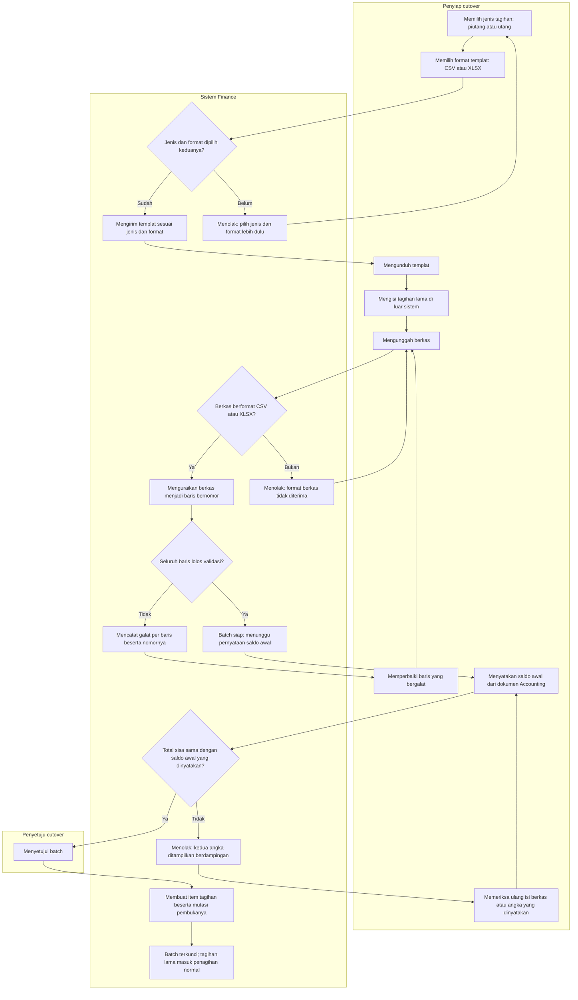

# Alur proses — Migrasi tagihan lama (dua format berkas)

| Field | Nilai |
|---|---|
| Keputusan yang diturunkan | `FIN-DEC-129`, `FIN-DEC-136` (jalannya: spreadsheet, divalidasi, disetujui per batch), `FIN-DEC-140` (dua format: CSV dan XLSX) |
| Rancangan | `FIN-DES-089`, `FIN-DES-090`, `FIN-DES-093`, `02-backend-architecture.md` AMENDMENT REVISI 15 |
| Status | `draft` — menunggu persetujuan owner |
| Catatan | Diagram ini **tidak** memuat nama tabel, kolom, endpoint, maupun class. Pesan penolakan persisnya ada di `contracts/validation-matrix.md` bagian `G.2`, tidak disalin ke sini |

## Alur normal beserta jalur gagalnya

## Tabel langkah

| # | Langkah | Pelaku | Masukan | Keluaran | Bila gagal |
|---:|---|---|---|---|---|
| 1 | Memilih jenis dan format templat | Penyiap | Jenis tagihan, format berkas | Templat terunduh | Keduanya wajib. Tanpa salah satunya, unduhan ditolak |
| 2 | Mengisi tagihan lama | Penyiap | Daftar tagihan lama dari pembukuan luar sistem | Berkas terisi | Format angka dan tanggal **MUST** mengikuti templat — khususnya pada CSV |
| 3 | Mengunggah berkas | Penyiap | Berkas CSV atau XLSX | Batch baru beserta asal formatnya | Format lain ditolak. Format ditentukan sistem dari berkasnya, **bukan** dari pilihan pengguna |
| 4 | Menguraikan dan memvalidasi | Sistem | Berkas | Baris bernomor beserta galatnya | Galat dicatat **per baris beserta nomornya**. Batch tetap tertahan, tidak hilang |
| 5 | Memperbaiki baris bergalat | Penyiap | Daftar galat beserta nomor baris | Berkas perbaikan | Petugas memperbaiki di luar sistem lalu mengunggah ulang |
| 6 | Menyatakan saldo awal Accounting | Penyiap | Angka dari dokumen Accounting beserta rujukan dokumennya | Batch siap disetujui | Angka yang dinyatakan **MUST** berasal dari dokumen Accounting, bukan dihitung sistem |
| 7 | Merekonsiliasi | Sistem | Total sisa item vs saldo awal yang dinyatakan | Lanjut, atau penolakan | Penolakan menampilkan **kedua angka berdampingan**, bukan hanya "tidak cocok" |
| 8 | Menyetujui batch | Penyetuju | Batch yang sudah direkonsiliasi | Item tagihan beserta mutasi pembukanya, dalam satu transaksi | Penyiap **tidak** dapat menyetujui batch yang disiapkannya sendiri bila haknya tidak mencakup persetujuan |
| 9 | Penagihan normal | Petugas AR/AP | Tagihan lama yang sudah terbit | Penagihan, pelunasan, umur piutang seperti tagihan biasa | — |

## Jalur gagal yang paling sering ditemui petugas

| Keadaan | Yang dilihat petugas | Yang **MUST NOT** terjadi |
|---|---|---|
| Excel lokal Indonesia menulis `1.500.000,00` pada CSV | Baris itu ditolak beserta nomornya | Angkanya **ditebak** menjadi nilai lain |
| Berkas disimpan sebagai `.ods` | Pesan menyebut CSV dan XLSX | Berkas diterima lalu gagal di tengah penguraian |
| Satu nomor dokumen kembar di dalam satu berkas | Baris kedua ditolak beserta nomor baris pasangannya | Keduanya masuk, melahirkan tagihan ganda |
| Saldo awal yang dinyatakan berbeda dari total item | Kedua angka ditampilkan berdampingan | Batch disetujui dengan selisih yang tidak dijelaskan |
| Berkas yang sama diunggah sebagai CSV dan sebagai XLSX | Hasil uraian **identik**, hanya asal formatnya berbeda | Kedua format menghasilkan jumlah baris atau nomor baris yang berbeda |
