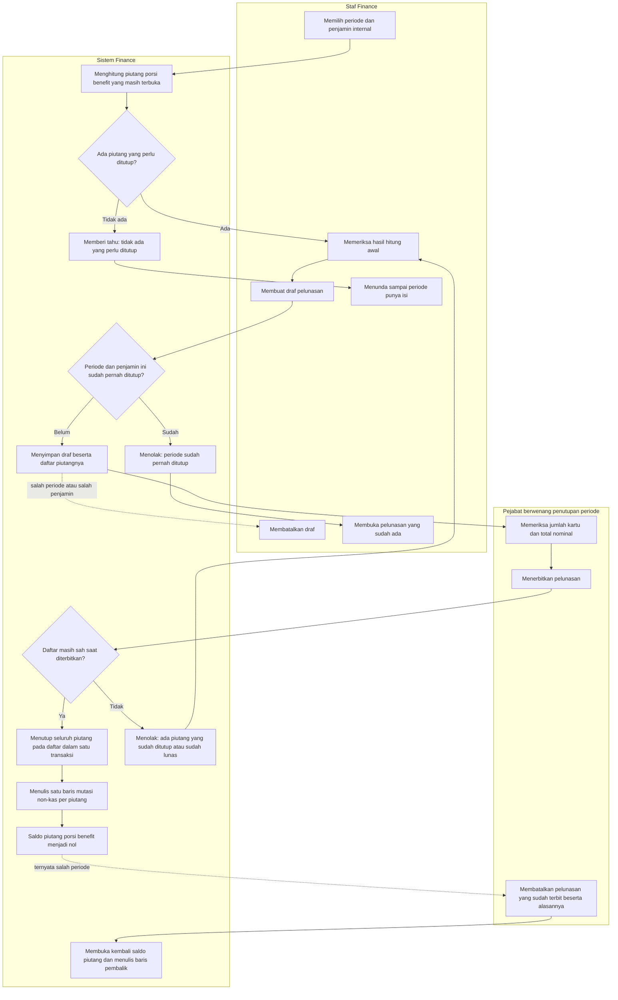

# Alur proses — Pelunasan internal porsi benefit karyawan

| Field | Nilai |
|---|---|
| Slice | `S7a` — mencatat porsi benefit dan menutupnya berkala di sisi Finance |
| Keputusan yang diturunkan | `FIN-DEC-177` (porsi benefit menjadi piutang atas penjamin internal), `FIN-DEC-178` (ditutup berkala lewat pelunasan internal non-kas, **bukan** penghapusan buku) |
| Rancangan | `FIN-DES-102`, `FIN-DES-103`, `02-backend-architecture.md` bagian O |
| Status | `approved` — disetujui pemilik (Yasmin, 5 Oktober 2026) |
| Catatan | Diagram ini **tidak** memuat nama tabel, kolom, endpoint, maupun class. Pesan penolakan persisnya ada di `contracts/validation-matrix.md` bagian `O.3`, tidak disalin ke sini |
| Yang sengaja berada di luar alur ini | Jurnal beban manfaat karyawan di Accounting. Kontraknya belum ada (`FIN-OQ-103`), dan penutupan piutang di sisi Finance **tetap berjalan** tanpanya |

## Mengapa alur ini ada

Satu tagihan manfaat karyawan menghasilkan **dua** piutang: porsi yang menjadi tanggungan pegawai, dan
porsi yang ditanggung rumah sakit. Porsi kedua tidak pernah ditagih ke pihak luar — penjaminnya adalah
rumah sakit sendiri. Bila ia tidak pernah ditutup, ia menetap di umur piutang dan menggelembungkan saldo
piutang rumah sakit sampai laporan piutang berhenti berarti.

## Alur normal beserta jalur gagalnya

## Tabel langkah

| # | Langkah | Pelaku | Masukan | Keluaran | Bila gagal |
|---:|---|---|---|---|---|
| 1 | Memilih periode dan penjamin internal | Staf Finance | Periode penutupan, penjamin internal | Permintaan hitung awal | — |
| 2 | Menghitung lebih dulu | Sistem | Piutang porsi benefit yang masih terbuka pada periode itu | Jumlah kartu dan total nominal. **Nol perubahan data** | Hitung awal boleh diulang sebanyak apa pun. Ia tidak mengubah apa pun, sehingga aman dipakai memeriksa angka |
| 3 | Memeriksa isi | Staf Finance | Daftar piutang beserta pemilik manfaatnya | Keputusan melanjutkan atau menunda | Periode tanpa isi **bukan** kegagalan. Tidak ada tagihan manfaat karyawan pada periode itu adalah keadaan yang sah |
| 4 | Memeriksa periode belum pernah ditutup | Sistem | Pelunasan yang sudah ada untuk periode dan penjamin itu | Lanjut, atau penolakan beserta nomor pelunasan terdahulu | Staf membuka pelunasan yang sudah ada. Dua pelunasan atas satu periode berarti porsi benefit tertutup dua kali dan beban terbukukan ganda |
| 5 | Membuat draf | Staf Finance | Hasil hitung awal | Draf beserta daftar piutang yang dibekukan | Draf **boleh** dibatalkan tanpa akibat apa pun selama belum diterbitkan |
| 6 | Memeriksa jumlah dan nominal | Pejabat berwenang | Draf | Keputusan menerbitkan | Pemeriksaan ini satu-satunya titik kendali sebelum banyak kartu piutang tertutup sekaligus |
| 7 | Memeriksa daftar masih sah | Sistem | Status tiap piutang pada daftar | Lanjut, atau penolakan | Bila ada piutang yang berubah sejak draf dibuat — sudah lunas, sudah ditutup pelunasan lain, atau dibatalkan — daftar **MUST** dihitung ulang, bukan diterbitkan apa adanya |
| 8 | Menerbitkan | Sistem | Draf yang sah | Seluruh piutang tertutup dalam **satu** transaksi, satu baris mutasi non-kas per piutang | Bila satu piutang gagal ditutup, **tidak ada** yang tertutup. Penutupan sebagian akan meninggalkan periode yang separuh selesai dan tidak dapat dibereskan |
| 9 | Membatalkan pelunasan yang sudah terbit | Pejabat berwenang | Nomor pelunasan beserta alasannya | Saldo piutang terbuka kembali, baris pembalik tertulis | Pembatalan **tidak** menghapus jejaknya. Riwayat per pegawai dan per kunjungan tetap utuh |

## Jalur gagal yang paling sering ditemui petugas

| Keadaan | Yang dilihat petugas | Yang **MUST NOT** terjadi |
|---|---|---|
| Periode tanpa tagihan manfaat karyawan | Keterangan bahwa tidak ada yang perlu ditutup, beserta tombol terbitkan nonaktif | Pelunasan kosong terbit, sehingga periode itu tampak "sudah ditutup" padahal tidak ada apa pun di dalamnya |
| Dua petugas menerbitkan periode yang sama hampir bersamaan | Yang kedua ditolak beserta nomor pelunasan yang pertama | Porsi benefit tertutup dua kali dan beban manfaat terbukukan ganda |
| Satu kartu piutang terlanjur lunas dari jalur lain setelah draf dibuat | Keterangan bahwa daftar perlu dihitung ulang, beserta nomor piutang yang bermasalah | Piutang yang sudah lunas ditutup untuk kedua kalinya, sehingga saldonya menjadi negatif |
| Periode yang salah sudah diterbitkan | Jalan koreksi: batalkan beserta alasannya, lalu terbitkan periode yang benar | Muncul pilihan "hapus buku" sebagai jalan keluar — benefit yang memang direncanakan **bukan** piutang tak tertagih |
| Accounting belum menyepakati jurnalnya | Rincian pelunasan berbunyi *belum dikirim ke Accounting* | Penutupan piutang ditahan menunggu Accounting, sehingga umur piutang tetap menggelembung |
