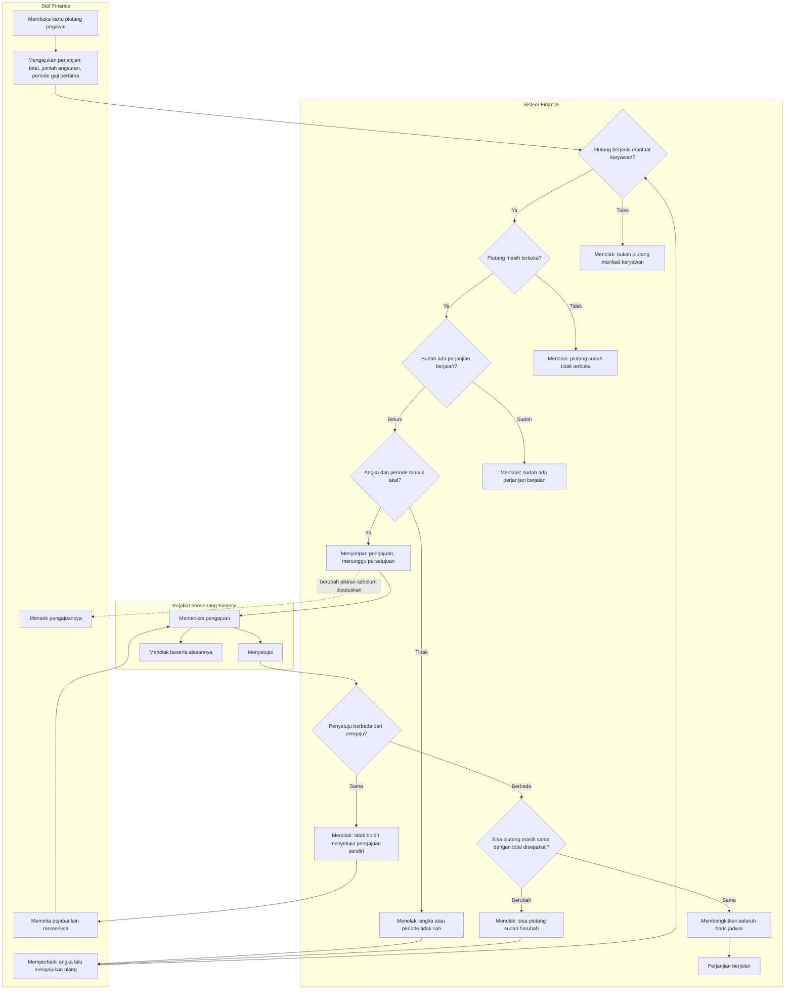
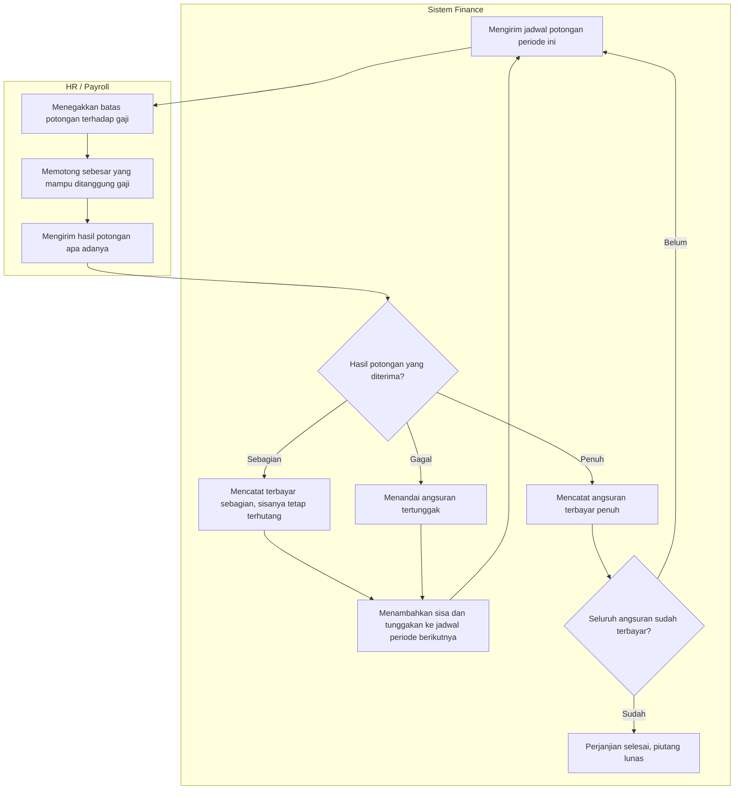

# Alur proses — Perjanjian cicilan piutang karyawan

| Field | Nilai |
|---|---|
| Slice | `S2a` (perjanjian dan jadwalnya), `S2b` (penumpukan tunggakan) |
| Keputusan yang diturunkan | `FIN-DEC-165` (boleh lunas sekali bayar, boleh dicicil dengan perjanjian), `FIN-DEC-166` (pengaju tidak menyetujui sendiri), `FIN-DEC-168` (tunggakan tetap terhutang dan ikut periode berikutnya sampai lunas), `FIN-DEC-179` (HR menegakkan batas potongan) |
| Rancangan | `FIN-DES-099`, `FIN-DES-100`, `02-backend-architecture.md` bagian O |
| Status | `approved` — disetujui pemilik (Yasmin, 5 Oktober 2026) |
| Catatan | Diagram ini **tidak** memuat nama tabel, kolom, endpoint, maupun class. Pesan penolakan persisnya ada di `contracts/validation-matrix.md` bagian `O.1` dan `O.2`, tidak disalin ke sini |

## Alur normal beserta jalur gagalnya

## Alur setelah perjanjian berjalan: potongan dan tunggakan

## Tabel langkah — pengajuan sampai disetujui

| # | Langkah | Pelaku | Masukan | Keluaran | Bila gagal |
|---:|---|---|---|---|---|
| 1 | Membuka kartu piutang pegawai | Staf Finance | Nomor piutang atau pencarian | Kartu piutang beserta sisanya | — |
| 2 | Memeriksa kelayakan piutang | Sistem | Jenis debitur dan status piutang | Lanjut, atau penolakan | Piutang penjamin atau piutang sewa **tidak** memakai jalur ini. Piutang yang sudah lunas atau dibatalkan juga tidak |
| 3 | Memeriksa perjanjian yang sudah ada | Sistem | Perjanjian pada kartu piutang itu | Lanjut, atau penolakan | Staf membatalkan dulu perjanjian yang berjalan. Dua perjanjian berjalan atas satu piutang berarti satu utang dijadwalkan dua kali |
| 4 | Mengisi syarat perjanjian | Staf Finance | Total, jumlah angsuran, periode gaji pertama, catatan, berkas perjanjian bila ada | Pengajuan menunggu persetujuan | Angka yang tidak cocok atau periode yang sudah lewat ditolak beserta sebabnya |
| 5 | Memeriksa pengajuan | Pejabat berwenang | Pengajuan beserta kartu piutangnya | Persetujuan atau penolakan beserta alasan | — |
| 6 | Memeriksa pengaju dan penyetuju berbeda | Sistem | Identitas keduanya | Lanjut, atau penolakan | Staf meminta pejabat lain. Ini **bukan** masalah hak akses yang dapat diperbaiki administrator — satu orang memang tidak boleh melakukan keduanya |
| 7 | Memeriksa sisa piutang masih sama | Sistem | Sisa piutang saat ini dan total yang disepakati | Lanjut, atau penolakan | Staf mengajukan ulang dengan angka yang benar. Keadaan ini wajar: pegawai mungkin menyetor tunai setelah pengajuan dibuat |
| 8 | Membangkitkan jadwal | Sistem | Syarat perjanjian yang disetujui | Seluruh baris jadwal sekaligus | Sebelum langkah ini **belum ada** jadwal. Jadwal lahir dari persetujuan, bukan dari pengajuan |

## Tabel langkah — potongan dan tunggakan

| # | Langkah | Pelaku | Masukan | Keluaran | Bila gagal |
|---:|---|---|---|---|---|
| 9 | Mengirim jadwal periode ini | Finance | Angsuran yang jatuh pada periode itu beserta sisa dan tunggakannya | Jadwal potongan | — |
| 10 | Menegakkan batas potongan | HR | Jadwal, gaji, dan aturan batas milik HR | Nominal yang benar-benar dipotong | **Finance tidak memeriksa batas ini.** Bila HR memotong lebih kecil daripada jadwal, Finance menerimanya sebagai potongan sebagian |
| 11 | Mengirim hasil potongan | HR | Hasil per pegawai | Hasil penuh, sebagian, atau gagal | Kiriman ganda **tidak** mengurangi piutang dua kali |
| 12 | Mencatat hasil | Finance | Hasil potongan | Angsuran terbayar, terbayar sebagian, atau tertunggak | — |
| 13 | Menumpuk sisa ke periode berikutnya | Finance | Sisa dan tunggakan | Jadwal periode berikutnya yang membawa tunggakan | **Tunggakan tidak hangus dan tidak dihapus otomatis.** Ia ikut sampai lunas |
| 14 | Menutup perjanjian | Finance | Seluruh angsuran terbayar | Perjanjian selesai, piutang lunas | Bila pegawai berhenti kerja sebelum lunas, sisa piutangnya **tidak** dihapus otomatis; penghapusan hanya lewat pengajuan dan persetujuan |

## Jalur gagal yang paling sering ditemui petugas

| Keadaan | Yang dilihat petugas | Yang **MUST NOT** terjadi |
|---|---|---|
| Staf yang sama mencoba menyetujui pengajuannya | Keterangan bahwa pengajuan sendiri tidak dapat disetujui, beserta arahan meminta pejabat lain | Tombol setujui tampil lalu permintaannya gagal dengan galat teknis |
| Pegawai menyetor tunai setelah pengajuan dibuat | Keterangan bahwa sisa piutang sudah berubah, beserta angka barunya | Perjanjian disetujui dengan total lama, sehingga gaji dipotong lebih besar daripada utangnya |
| Gaji tidak cukup menanggung angsuran bulan ini | Angsuran tercatat terbayar sebagian, dan sisanya terlihat ikut periode berikutnya | Angsuran dianggap lunas, atau tunggakannya hilang dari jadwal |
| Potongan gagal sama sekali satu periode | Angsuran tertunggak, dan jumlah periode tertunggak terlihat di rincian perjanjian | Perjanjian otomatis dibatalkan karena satu kali gagal |
| Dua staf mengajukan perjanjian atas piutang yang sama | Yang kedua ditolak beserta keterangan ada perjanjian berjalan | Dua perjanjian berjalan atas satu utang |
| Pegawai berhenti kerja dengan sisa cicilan | Sisa piutang tetap terbuka, dan status bebas tanggungannya **tidak** terbit | Sisa dihapus otomatis, sehingga penghapusan buku terjadi tanpa persetujuan siapa pun |
