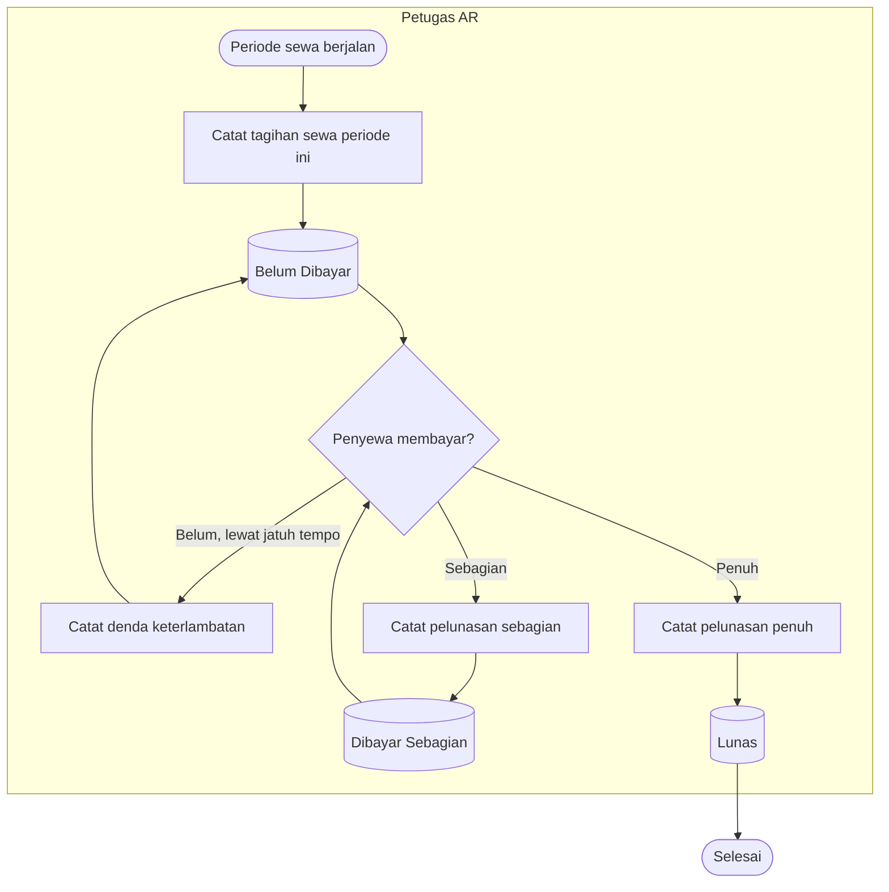
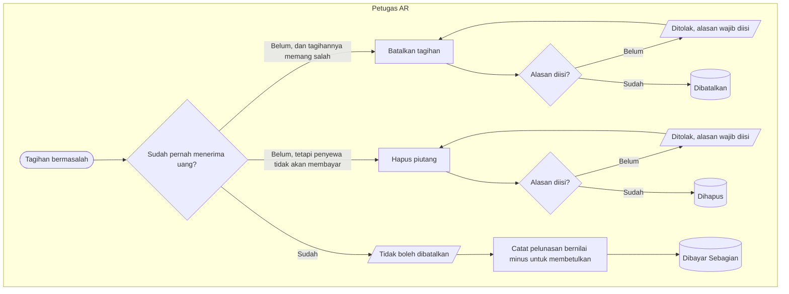
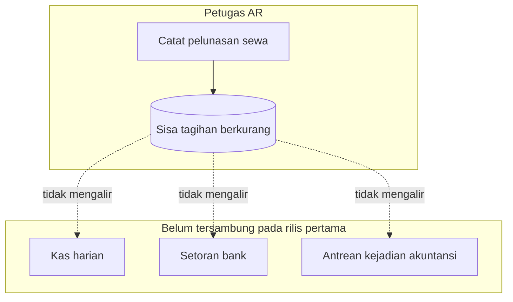

# Alur Proses — Piutang Sewa Non-Pasien (Parkir dan Tenant)

Status: `draft`, 1 Oktober 2026. Diturunkan dari `FIN-DEC-099`..`FIN-DEC-104`;
dirancang `FIN-DES-074`..`FIN-DES-077`.

Nama keadaan pada diagram ini sama persis dengan `contracts/state-transition-matrix.md` bagian `E.1`.

## 1. Alur pokok — dari tagihan dicatat sampai lunas

Setiap periode adalah tagihan baru yang dicatat sendiri — tidak ada kontrak yang menerbitkannya
otomatis. Risiko periode terlewat ditanggung ketelitian petugas, dan itu keputusan sadar pemilik.

| Langkah | Pelaku | Masukan yang dibutuhkan | Keluaran | Bila gagal |
|---|---|---|---|---|
| Catat tagihan sewa | Petugas AR | Jenis sewa, nama penyewa, objek sewa, periode, jatuh tempo, nominal | Tagihan berstatus Belum Dibayar | Nominal nol atau tanggal tidak masuk akal ditolak; petugas membetulkan isiannya |
| Catat denda keterlambatan | Petugas AR | Nominal denda menurut kebijakan yang berlaku | Sisa tagihan bertambah sebesar denda | Nominal minus ditolak |
| Catat pelunasan | Petugas AR | Tanggal terima, nominal, cara bayar | Sisa tagihan berkurang | Pelunasan melebihi sisa ditolak; petugas memeriksa kembali nominalnya |

## 2. Jalur pengecualian — tagihan tidak tertagih, atau salah dicatat

**Yang membedakan kapabilitas ini dari piutang pasien:** penghapusan di sini **selesai seketika**,
tanpa pengajuan dan tanpa penyetuju. Satu-satunya penahan yang tersisa adalah alasan yang wajib
diisi dan jejak audit. Ini keputusan sadar pemilik, dan **tidak berlaku** untuk piutang pasien.

| Langkah | Pelaku | Masukan yang dibutuhkan | Keluaran | Bila gagal |
|---|---|---|---|---|
| Batalkan tagihan | Petugas AR | Alasan pembatalan | Tagihan berstatus Dibatalkan | Ditolak bila sudah pernah menerima uang; petugas memakai pelunasan minus |
| Hapus piutang | Petugas AR | Alasan penghapusan | Tagihan berstatus Dihapus | Ditolak bila alasan kosong |
| Betulkan pelunasan keliru | Petugas AR | Nominal minus sebesar kekeliruannya | Sisa tagihan kembali bertambah | Ditolak bila pembatalan melebihi pembayaran yang pernah tercatat |

## 3. Batas yang MUST diketahui petugas

Uang sewa yang dicatat di sini **mengurangi sisa tagihan**, tetapi **belum** tercatat sebagai kas
masuk di mana pun. Ini bukan kekeliruan implementasi — ini batas yang dipilih saat memisahkan jalur
piutang sewa dari jalur penerimaan Billing, dan menjadi isi pertanyaan terbuka yang belum dijawab.

| Langkah | Pelaku | Masukan yang dibutuhkan | Keluaran | Bila gagal |
|---|---|---|---|---|
| Rekonsiliasi uang sewa ke kas | **Belum dirancang** | — | — | Selama belum diputuskan, pencocokan dilakukan di luar sistem, dan layar **MUST** menyatakannya terang kepada petugas |
