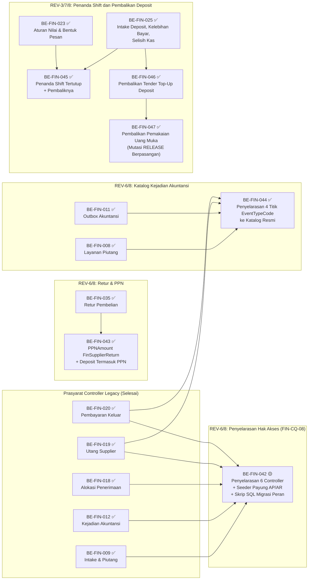

# Finance Management — Roadmap Backend

## 1. Identitas

```yaml
roadmap_id: FIN-ROADMAP-BE-001
parent_roadmap: FIN-ROADMAP-001 revisi 10
roadmap_revision: 10
roadmap_status: ACTIVE
blueprint_id: FIN-BP-001
blueprint_revision: 10
blueprint_status: approved
backend_commit_sha: 7811c048
backend_commit_sha_previous: cba60cb0
backend_commit_sha_baseline: 09101d0581695e20345a9efa8af3fce7c38b1ae4
backend_branch: Yasmina
contracts:
  FIN-API-1.2: locked 2026-09-26 (revisi 5; 1.1 revisi 4 tetap berlaku untuk bagian yang tidak diganti)
  FIN-PERM-1.3: locked 2026-09-28 (revisi 6; FIN-CQ-08 pemetaan payung ke granular)
  FIN-STATE-1.3: locked 2026-09-26 (revisi 5)
  FIN-VAL-1.5: approved 2026-09-29 (revisi 9 — FIN-VAL-144..146)
  FIN-INTEGRATION-1.6: approved 2026-09-29 (revisi 9 — pemicu RELEASE berpasangan)
  FIN-TEST-1.6: approved 2026-09-29 (revisi 9 — Bagian F)
  FIN-MVP-1.5: locked 2026-09-28 (revisi 6)
roadmap_revision_10_note: >
  Revisi 10 (30 September 2026) MENAMBAHKAN task BE-FIN-048 (pengetatan validasi pesan saldo subledger
  pada FinanceAccountingOutboxService sesuai ACC-DEC-109 dan ACC-DEC-110) dan BE-FIN-049 (layanan
  kalkulasi snapshot saldo subledger bulanan untuk 4 control account: Kas Kasir, Kas Kecil, Piutang,
  dan Utang Supplier sesuai ACC-DEC-108) menyusul surat susulan Accounting evidence/15 dan
  keputusan resmi FIN-DEC-090 s/d FIN-DEC-093.
roadmap_revision_9_note: >
  Revisi 9 (30 September 2026) MENANDAI SELESAI (✅) seluruh task backend BE-FIN-028 s/d BE-FIN-047
  (kecuali BE-FIN-042 🟡 yang menunggu platform registry FIN-OQ-039) menyusul keberhasilan eksekusi
  skrip migrasi database fisik (BE-FIN-041, BE-FIN-038, BE-FIN-043 via
  be-fin-041-038-043-schema-migration-dbeaver.sql) dan konfirmasi berhasilnya dotnet build (PASS 0 error)
  oleh pengguna. Implementasi EPIC FIN-12 (worker pengiriman otomatis outbox ke Accounting) DITUNDA /
  TIDAK DIBUAT atas keputusan eksplisit pemilik modul (sistem belum membutuhkan pengiriman outbox otomatis
  ke Accounting saat ini; seluruh kejadian outbox aman tersimpan di FinAccountingEventOutbox).
roadmap_revision_8_note: >
  Revisi 8 (29 September 2026) MENCABUT TANDA BLOCKER ⛔ PADA BE-FIN-047 menyusul disahkannya
  FIN-DES-064 dan FIN-DES-065 via FIN-DEC-080 dan FIN-DEC-081 (Amendment Pass). Pemicu kejadian
  PEMBALIKAN-PEMAKAIAN-UANG-MUKA-DEPOSIT resmi ditetapkan: mutasi BilDepositMovement bertipe RELEASE
  yang berpasangan dengan REVERSAL pada SettlementId yang sama. Pemicu kode pengembalian kas dipersempit
  murni ke BilRefundCase EXECUTED (FIN-DEC-041 dikoreksi). Task BE-FIN-047 kini SIAP DIKERJAKAN
  pada gelombang R6-4 setelah BE-FIN-046 dan BE-FIN-025. Seluruh acceptance criteria dan DoD
  diturunkan dari FIN-TEST-1.6 §F dan FIN-VAL-1.5. Grafik urutan dependency dan tabel gelombang
  diperbarui.
roadmap_revision_7_note: >
  Revisi 7 (29 September 2026) MENURUNKAN desain AMENDMENT REVISI 6 dan 7 blueprint
  (FIN-DES-051..060, approved 28 September 2026) yang belum punya task, dan MEMPERBAIKI isi tiga
  task lama yang acceptance criteria-nya bertentangan dengan desain approved itu. TIDAK ada task
  yang dinomori ulang atau dihapus.
  TIGA TASK LAMA DIPERBAIKI ISINYA:
  (1) BE-FIN-023 — acceptance criteria "selisih kas -30.000 tersimpan" DICABUT: kode
      SELISIH-KAS-SHIFT bernilai bertanda sudah tidak ada lagi (FIN-DES-051, FIN-DES-058
      pelurusan 2). Diganti daftar tertutup kode penanda yang boleh bernilai nol (FIN-VAL-138)
      dan penghilangan properti Components dari PayloadJson (FIN-VAL-139) — keduanya berkas yang
      sama, FinanceAccountingOutboxService, sehingga digabung di sini alih-alih dipecah menjadi
      task yang menyunting method yang sama.
  (2) BE-FIN-025 — tiga acceptance criteria diperbaiki: satu kode selisih kas menjadi dua
      (SELISIH-KAS-KURANG/LEBIH) dengan kunci BilCashierShift.Id dan SourceVersion dipatok
      (FIN-DES-053); refund SETTLEMENT dari "nol kejadian" menjadi MASUK jalur yang sudah ada
      (FIN-DES-056); REFERRED_OUTPATIENT_ADMIN menjadi baris intake ERROR (FIN-VAL-141).
  (3) BE-FIN-026 — cakupan diperluas: selain baris warisan HELD_FOR_FINALIZATION, ikut menghitung
      dan melaporkan baris outbox lama bernama pendek AR_*/AP_* (FIN-DES-058).
  BE-FIN-024 DIPERIKSA dan TIDAK perlu diperbaiki — ketiga kodenya (PENERIMAAN-UANG-MUKA,
  PENERIMAAN-KASIR, PEMBALIKAN-PENERIMAAN-UANG-MUKA) tidak ikut dinamai ulang.
  TIGA TASK BARU:
  (4) BE-FIN-045 — penanda shift kasir tertutup dan pembaliknya (FIN-DES-054, FIN-DES-059).
      Kodenya boleh ditulis sekarang; hanya WORKER pengirimannya digerbang FIN-OQ-035, mengikuti
      pola FIN-DEC-056 yang sudah dipakai seluruh rumpun Accounting Integration.
  (5) BE-FIN-046 — pembalikan tender top-up deposit dikonsumsi menjadi
      PEMBALIKAN-PENERIMAAN-UANG-MUKA, beserta pendeteksi FIN-VAL-142. Pemicunya SUDAH ADA sejak
      Billing menutup FIN-OQ-034 (BKC-DEC-128..131, BillingSettlementService
      HandleDepositTopUpReversalAsync menulis mutasi Reversal).
  (6) BE-FIN-047 ⛔ — PEMBALIKAN-PEMAKAIAN-UANG-MUKA-DEPOSIT. TERBLOKIR bukan oleh pihak luar,
      melainkan oleh desain sendiri yang stale: FIN-DES-057 menetapkan pemicunya mutasi REVERSAL
      atas ALLOCATION, sedangkan solusi Billing yang disahkan FIN-DEC-077 memakai mutasi RELEASE.
      Akibatnya satu MovementType RELEASE kini membawa DUA lawan jurnal berbeda dan cara Finance
      membedakannya belum digambar. Perlu amendment /design-business-module lebih dulu.
  DAMPAK FRONTEND: nol task baru, tetapi FE-FIN-007 diperbaiki isinya pada roadmap frontend revisi 7
  (tanda ⛔ dicabut, katalog kode final, dua sebab baris intake ERROR) dan menerima prasyarat baru
  BE-FIN-025.
  SHA BERGERAK cba60cb0 -> 7811c048 (dua commit: 0a09e18a BE-FIN-041, 7811c048 BE-FIN-035/036
  beserta seluruh artefak blueprint revisi 6/7 dan perbaikan Billing BE-BKC-079). Diperiksa:
  implementasi BE-FIN-036 sudah memakai nama final PEMAKAIAN-KREDIT-RETUR-PEMBELIAN
  (FIN-DEC-066), sehingga TIDAK ada drift nama kode yang perlu task pembetulan tambahan.
roadmap_revision_6_note: >
  Revisi 6 (28 September 2026) menambahkan tiga task backend:
  (1) BE-FIN-042 — Penyelarasan nama resource pada 6 controller legacy ke nama kanonikal Finance*,
      pendaftaran dan ekspansi seeder peran payung Finance.AP & Finance.AR, dan skrip SQL idempotent
      migrasi data peran SysRolePermissions (menutup FIN-CQ-08, FIN-CAP-043, FIN-OQ-036). Bebas,
      siap dijalankan segera.
  (2) BE-FIN-043 — Penambahan kolom PPNAmount pada FinSupplierReturn, check constraint PPNAmount >= 0,
      dan kalkulasi deposit retur saat CONFIRMED membawa PPN (FIN-DES-055, AddPPNAmountToFinSupplierReturn).
  (3) BE-FIN-044 — Penyelarasan nama konstanta EventTypeCode pada 4 titik pemanggil service lama
      mengikuti katalog resmi ratifikasi Accounting, dan penghapusan alias lama (FIN-DES-058). Bebas.
roadmap_revision_3_note: >
  Revisi 3 (25 September 2026) MENAMBAHKAN empat belas task BE-FIN-027..040 untuk AMENDMENT
  REVISI 4 blueprint (FIN-DES-037..044, approved dan kontraknya locked hari yang sama) —
  EPIC FIN-15 Purchasing/AP, FIN-16 AR Invoice Agregat, FIN-17 Potongan AR. TIDAK ada task lama
  yang dinomori ulang, diubah outcome-nya, atau diturunkan statusnya.
  EMPAT TEMUAN dari pembacaan source pada 96bf9746 yang mengubah rencana — lihat bagian 4
  "REV-4": (1) batas Rp 50.000.000 tepat berbeda antara kode dan FIN-DEC-052, sehingga
  BE-FIN-028 mengubah perilaku pembayaran yang sudah berjalan pada satu nilai itu;
  (2) FinanceSupplierPayableService sudah menulis AP_CREATED sebesar OriginalAmount penuh,
  sehingga BE-FIN-034 MUST mengirim nilai pokok saja agar PPN tidak terkredit dua kali;
  (3) jalur pelunasan piutang menulis AR_PAYMENT (kas masuk), sehingga potongan AR tidak boleh
  lewat jalur itu — awalnya BE-FIN-040 ⛔ FIN-OQ-024; (4) sudah ada GET api/finance/payable/aging
  atas FinSupplierPayable, sehingga endpoint aging Purchasing dicabut FIN-OQ-025.
  Dua task ⛔ oleh keputusan yang belum ada saat itu: BE-FIN-036 (FIN-OQ-023), BE-FIN-040
  (FIN-OQ-024) — lihat roadmap_revision_4_note untuk keadaan sesudah closure pass. FIN-OQ-020
  TIDAK menahan task mana pun (FIN-DEC-056).
roadmap_revision_5_note: >
  Revisi 5 (26 September 2026) menurunkan AMENDMENT REVISI 5 blueprint (FIN-DES-045..050,
  approved dan kontraknya locked 26 September 2026). BE-FIN-036 DIBUKA — skemanya kini digambar.
  Enam task diperbarui ke bentuk revisi 5 (030, 031, 035, 036, 038, 040); SATU task baru
  BE-FIN-041 (kolom DepositAppliedAmount + constraint pada FinPayment yang sudah berjalan).
  Nol task REV-4 yang ⛔. Task lama tidak dinomori ulang.
roadmap_revision_4_note: >
  Revisi 4 (25 September 2026, sesudah /grill-me closure pass) MEMBUKA BE-FIN-040 dan FE-FIN-013
  (semula ⛔ FIN-OQ-024): kode kejadian POTONGAN-PIUTANG-NON-TUNAI sudah diusulkan (FIN-DEC-058),
  sehingga service dapat menulis outbox seperti BE-FIN-034 menulis PPN-MASUKAN-PEMBELIAN —
  hanya worker pengirimannya yang menunggu Rizki (FIN-OQ-026, pola FIN-DEC-056). BE-FIN-036 dan
  FE-FIN-010 TETAP ⛔: FIN-OQ-023 tertutup sisi keputusan bisnis (FIN-DEC-057), tetapi
  konsekuensi skemanya (FinPaymentAllocation/FinSupplierReturnDepositUsage) belum digambar.
  Task lama TIDAK dinomori ulang.
roadmap_revision_2_note: >
  Revisi 2 (25 September 2026) MENAMBAHKAN lima task BE-FIN-022..026 untuk AMENDMENT REVISI 3
  blueprint (FIN-DES-029..036, approved). TIDAK ada task lama yang dinomori ulang, diubah
  outcome-nya, atau dihapus. Grafik urutan dependency dirapikan menjadi pohon teks sesuai
  rules/rule-output/grafik-dependency-roadmap.md pada kesempatan pertama berkas ini disentuh.
  SATU-SATUNYA blocker task baru: FIN-OQ-017 (ratifikasi owner Accounting atas tujuh kode
  kejadian). Empat dari lima task baru berstatus ⛔ karenanya; BE-FIN-022 bebas dari blocker itu.
```

Payung roadmap ada di `00-delivery-roadmap.md`: identitas lengkap, penguncian kontrak,
gelombang, traceability, coverage gap, dan risiko. Berkas ini **hanya** berisi task backend.
Pasangan frontend-nya ada di `02-frontend-roadmap.md`.

**Berkas ini tidak menyatakan satu pun pekerjaan selesai.**

## 2. Urutan eksekusi

**Arti tanda status pada dokumen ini.**

| Tanda | Artinya |
| :---: | --- |
| ✅ | Selesai. Acceptance criteria dan DoD **terbukti**, buktinya ada pada laporan task |
| 🟡 | Sebagian. Source-nya sudah ada, tetapi acceptance criteria belum terbukti penuh. **Belum selesai** |
| ⛔ | Terblokir. Prasyaratnya belum terpenuhi, dan task **tidak boleh dimulai** |
| tanpa tanda | Belum dikerjakan |

Task bergaris bawah `⛔` MUST NOT dimulai.

## Grafik Urutan Dependency

Empat puluh tujuh task (`BE-FIN-001`..`047`, tanpa nomor yang terlewat) melewati batas satu layar,
sehingga grafiknya dipecah: satu grafik ringkasan antar-gelombang, lalu satu grafik per rumpun. Arah garis selalu **prasyarat di kiri, yang
menunggu di kanan**.

### Ringkasan antar-gelombang

```text
MVP-0 ✅ ─> MVP-1 ✅ ─┬─> MVP-5 ✅
                      │
                      ├─> MVP-4 ✅
                      │
                      ├─> MVP-2 ✅ ─> MVP-3 ✅
                      │
                      └─> POST-MVP 🟡

{FIN-OQ-017 ✅} ─> REV-3 (seluruh task BE-FIN-023..026 telah ✅ selesai; BE-FIN-022 🟡 menunggu eksekusi migration)

POST-MVP ─> REV-4 (seluruh task BE-FIN-027..041 telah ✅ selesai — build PASS & migrasi DBeaver aktif)

POST-MVP ─> REV-6/8 (BE-FIN-042 🟡; BE-FIN-043..047 telah ✅ selesai — build PASS & migrasi DBeaver aktif)
```

### Diagram Alur Ketergantungan (Mermaid)



`REV-3` adalah kelompok task AMENDMENT REVISI 3 (`BE-FIN-022`..`026`). Ia **tidak diberi nomor
gelombang** karena `EPIC FIN-14` berstatus `OPEN DECISION` pada `04-prd-to-mvp.md`.

`REV-4` adalah kelompok task AMENDMENT REVISI 4 (`EPIC FIN-15`/`16`/`17`), seluruhnya gelombang
`POST-MVP` pada `04-prd-to-mvp.md` bagian 20.1. Berbeda dari `REV-3`, ketiga epic-nya **bukan**
`OPEN DECISION`, sehingga task-nya boleh dijadwalkan.

`REV-6/8` adalah kelompok task AMENDMENT REVISI 6, 7, 8, dan 9 (`BE-FIN-042`..`047`), menangani
penyelarasan hak akses `FIN-CQ-08` / `FIN-PERM-1.3`, PPN Retur Pembelian `FIN-DES-055`,
penyelarasan katalog kejadian Akuntansi `FIN-DES-058`, penanda shift kasir tertutup `FIN-DES-054`/
`059`, dan rumpun pembalikan mutasi deposit `FIN-DES-064`/`065`. Desainnya seluruhnya `approved`;
`BE-FIN-042`..`047` seluruhnya siap dieksekusi — `BE-FIN-047` tidak lagi terblokir setelah
`FIN-DES-064` dan `FIN-DES-065` disahkan via `FIN-DEC-080` dan `FIN-DEC-081`.

### REV-6/8 — Penyelarasan Hak Akses (FIN-CQ-08), PPN Retur, dan Katalog Akuntansi

```text
BE-FIN-009 ✅ ─┬─> BE-FIN-042 🟡 (Penyelarasan 6 Controller Legacy, Seeder Payung AP/AR, Skrip SQL Peran)
BE-FIN-012 ✅ ─┤
BE-FIN-018 ✅ ─┤
BE-FIN-019 ✅ ─┤
BE-FIN-020 ✅ ─┘

BE-FIN-035 ✅ ───> BE-FIN-043 ✅ (PPNAmount pada FinSupplierReturn & Deposit Retur)

BE-FIN-008 ✅ ─┬─> BE-FIN-044 ✅ (Penyelarasan 4 Titik EventTypeCode ke Katalog Resmi)
BE-FIN-011 ✅ ─┤
BE-FIN-019 ✅ ─┤
BE-FIN-020 ✅ ─┘

BE-FIN-023 ✅ ─┬─> BE-FIN-045 ✅ (Penanda Shift Kasir Tertutup & Pembaliknya)
BE-FIN-025 ✅ ─┘

BE-FIN-025 ✅ ───> BE-FIN-046 ✅ (Pembalikan Tender Top-Up Deposit) ───> BE-FIN-047 ✅ (Pembalikan Pemakaian Uang Muka)
```

Empat blok di atas menggambarkan urutan eksekusi kelompok `REV-6/8`. `BE-FIN-023` dan `BE-FIN-025`
adalah task rumpun `REV-3` yang digambar di sini sebagai **pangkal cabang**, bukan node kedua.
`BE-FIN-047` kini dijadwalkan pada gelombang `R6-4` setelah `BE-FIN-046`.

### REV-4 — Purchasing/AP (`EPIC FIN-15`)

```text
BE-FIN-027 ✅ ─> BE-FIN-029 ✅ ─> BE-FIN-030 ✅ ─> BE-FIN-031 ✅ ─┬─> BE-FIN-032 ✅
                                                      │
BE-FIN-028 ✅ ───────────────────────────────────────────┤
                                                      │
                                                      └─> BE-FIN-033 ✅ ─> BE-FIN-034 ✅ ─> BE-FIN-035 ✅ ─> BE-FIN-037 ✅

BE-FIN-041 ✅ ─> BE-FIN-036 ✅ <─ BE-FIN-035 ✅
```

`BE-FIN-028` menjadi prasyarat `BE-FIN-032` dan `BE-FIN-034` (keduanya memanggil resolver),
bukan prasyarat `BE-FIN-033`; panahnya digabung pada satu titik supaya grafik muat satu layar.
`BE-FIN-028` sendiri tidak menunggu apa pun dan boleh dikerjakan paling awal. **Status 30 September
2026:** source selesai, `dotnet build` PASS 0 error (dikonfirmasi pengguna 30 September 2026),
seluruh rantai dependency terselesaikan.

### REV-4 — AR Invoice Agregat dan Potongan AR (`EPIC FIN-16`, `FIN-17`)

```text
BE-FIN-038 ✅ ─┬─> BE-FIN-039 ✅
            │
            └─> BE-FIN-040 ✅
```

Rumpun ini **tidak bergantung** pada rumpun Purchasing sama sekali dan boleh berjalan paralel.
`BE-FIN-040` tidak lagi ⛔ — `FIN-DEC-058` (25 September 2026) mengusulkan kode kejadiannya;
hanya worker pengirimannya yang menunggu Rizki (`FIN-OQ-026`), pola `FIN-DEC-056`.

### MVP-0 dan MVP-1 — fondasi sampai buku piutang

```text
BE-FIN-001 ✅ ─> BE-FIN-002 ✅ ─> BE-FIN-003 ✅ ─> BE-FIN-004 ✅ ─> BE-FIN-005 ✅
  ─> BE-FIN-006 ✅ ─> BE-FIN-007 ✅ ─> BE-FIN-008 ✅ ─> BE-FIN-009 ✅
```

Rantai lurus tanpa percabangan; baris kedua adalah sambungan baris pertama.

### MVP-5, MVP-4, MVP-2, MVP-3, dan POST-MVP

```text
BE-FIN-007 ✅ ─> BE-FIN-010 ✅ ─> BE-FIN-011 ✅ ─> BE-FIN-012 ✅

BE-FIN-009 ✅ ─┬─> BE-FIN-013 ✅ ─> BE-FIN-014 ✅ ─> BE-FIN-015 ✅
               │
               ├─> BE-FIN-016 ✅ ─> BE-FIN-017 ✅ ─> BE-FIN-018 ✅
               │
               └─> BE-FIN-019 ✅

{FIN-OQ-010 ⛔} ─> BE-FIN-020 🟡 ─> BE-FIN-021 🟡 <─ {BE-MDF-014 ⛔}
```

`BE-FIN-007` dan `BE-FIN-009` masing-masing muncul sekali pada grafik MVP-0/MVP-1 di atas; di
sini keduanya digambar sebagai **pangkal cabang** untuk memperlihatkan percabangannya, bukan
sebagai node kedua. `{BE-MDF-014}` adalah task modul Medical Fee — cermin baca-saja, bukan task
roadmap ini; panahnya digambar ke kiri karena ia prasyarat yang datang dari luar.

### REV-3 — AMENDMENT REVISI 3 (task baru)

```text
BE-FIN-022 🟡 ─────────────────────────────────────┐
                                                   │
{FIN-OQ-017 ✅} ─> BE-FIN-023 ✅ ─> BE-FIN-024 ✅ ─┴─> BE-FIN-025 ✅ ─> BE-FIN-026 ✅
```

**Diperbarui 29 September 2026.** `FIN-OQ-017` dinyatakan `CLOSED` 28 September 2026 (closure pass
`/grill-me`, `00-interview-decisions.md` — `FIN-DEC-063`..`067`, surat balasan sudah terkirim ke
Rizki lewat `evidence/15`). Tanda `⛔` pada `BE-FIN-023`/`BE-FIN-024` **dicabut** — keduanya tidak
lagi menunggu ratifikasi Accounting.

| Gelombang | Boleh mulai setelah | Task |
| ---: | --- | --- |
| — | Otorisasi migration (`AGENTS.md` Keselamatan Database) | `BE-FIN-022` 🟡 — tidak diberi nomor gelombang karena `EPIC FIN-14` masih `OPEN DECISION` (lihat catatan di bawah). Source selesai 25 September 2026; **eksekusi migration belum dijalankan** |
| — | — (siap, `FIN-OQ-017` `CLOSED`) | `BE-FIN-023` ✅ — **Selesai 29 September 2026**, build mandiri dikonfirmasi 0 error oleh pengguna, rangkaian ditutup `BE-FIN-024` ([laporan](../task/report/backend/BE-FIN-023.md)) |
| — | `BE-FIN-023` ✅ | `BE-FIN-024` ✅ — **Selesai 29 September 2026**, build mandiri dikonfirmasi 0 error oleh pengguna, menutup rangkaian pra-final ([laporan](../task/report/backend/BE-FIN-024.md)) |
| — | `BE-FIN-022` (eksekusi migration-nya) dan `BE-FIN-024` ✅ | `BE-FIN-025` ✅ — **Selesai 29 September 2026**, build mandiri dikonfirmasi 0 error oleh pengguna ([laporan](../task/report/backend/BE-FIN-025.md)) |
| — | `BE-FIN-025` ✅ dan `BE-FIN-044` 🟡 | `BE-FIN-026` ✅ — **Selesai 29 September 2026**, audit pembacaan database fisik membuktikan 0 baris `HELD_FOR_FINALIZATION` dan 0 baris nama pendek `AR_*`/`AP_*` ([laporan](../task/report/backend/BE-FIN-026.md)) |

**Kenapa tidak ada satu pun nomor gelombang di tabel ini, walau `FIN-OQ-017` sudah `CLOSED`.**
`04-prd-to-mvp.md` bagian 20.2 (pembaruan 28 September 2026) mencatat `EPIC FIN-14` **tetap**
`OPEN DECISION` — sebabnya sudah berganti, bukan lagi `FIN-OQ-017`, melainkan `FIN-OQ-027`, `030`,
`031`, `032`, `034` (kode-kode baru hasil pemecahan/temuan source pada closure pass yang sama).
Pola ini identik dengan `BE-FIN-022`: sebuah task boleh **dikerjakan** begitu blocker spesifiknya
sendiri selesai, walau epic-nya belum masuk gelombang formal.

**Peringatan `BE-FIN-025` yang sudah SELESAI ditindaklanjuti.** Revisi roadmap 6 menandai isi task
ini basi karena Cakupan-nya masih menyebut kode tunggal `SELISIH-KAS-SHIFT` berkunci
`BilCashVarianceReview.Id`. **Revisi roadmap 7 (29 September 2026) memperbaikinya**: kode dipecah
menjadi `SELISIH-KAS-KURANG`/`SELISIH-KAS-LEBIH` berkunci `BilCashierShift.Id` dengan
`SourceVersion` dipatok (`FIN-DES-053`), refund `SETTLEMENT` dipindah dari "nol kejadian" menjadi
jalur yang sudah ada (`FIN-DES-056`), dan `REFERRED_OUTPATIENT_ADMIN` menjadi baris intake `ERROR`
(`FIN-VAL-141`). Task ini sekarang **siap dikerjakan** setelah prasyarat urutannya selesai.

**Yang masih perlu dikonfirmasi pemilik sebelum `BE-FIN-025` dimulai.** Pengguna menyatakan 29
September 2026 bahwa sebuah migration sudah dieksekusi dan berhasil, tetapi pada hari yang sama ada
**dua** berkas migration yang menunggu: `AlterFinBillingHandoffIntakeHandoffTypeCheck`
(`BE-FIN-022`, prasyarat task ini) dan `AddDepositAppliedAmountToFinPayment` (`BE-FIN-041`). Status
`BE-FIN-022` **sengaja dibiarkan** 🟡 di roadmap ini karena menaikkannya tanpa kepastian sama dengan
mengklaim penyelesaian task yang belum terbukti. Konfirmasi satu baris dari pemilik sudah cukup
untuk menutupnya.

### Gelombang eksekusi — task lama

| Gelombang | Boleh mulai setelah | Task |
| ---: | --- | --- |
| 1 (`MVP-0`) | — | `BE-FIN-001`..`004` ✅ |
| 2 (`MVP-1`) | `MVP-0` | `BE-FIN-005`..`009` ✅ |
| 3 (`MVP-5`) | `BE-FIN-007` | `BE-FIN-010`..`012` ✅ — boleh paralel sejak `MVP-1` |
| 3 (`MVP-4`) | `BE-FIN-009` | `BE-FIN-013`..`015` ✅ — boleh mendahului `MVP-2` |
| 3 (`MVP-2`) | `BE-FIN-009` | `BE-FIN-016`..`017` ✅ |
| 4 (`MVP-3`) | `BE-FIN-017` | `BE-FIN-018` ✅ |
| 3 (`POST-MVP`) | `BE-FIN-009` | `BE-FIN-019` ✅ |
| — | ⛔ `FIN-OQ-010` untuk ambang angkanya saja | `BE-FIN-020` 🟡 |
| — | ⛔ `BE-MDF-014` milik Medical Fee | `BE-FIN-021` 🟡 |

### Gelombang eksekusi — `REV-4` (`POST-MVP`)

| Urutan | Boleh mulai setelah | Task |
| ---: | --- | --- |
| R4-1 | — | `BE-FIN-027` ✅ (registry, selesai 26 September 2026), `BE-FIN-028` ✅ (resolver ambang, build PASS), `BE-FIN-038` ✅ (entity + migration AR — eksekusi migration DBeaver 30 September 2026, build PASS), `BE-FIN-041` ✅ (kolom `FinPayment` — eksekusi migration DBeaver 30 September 2026, build PASS) — keempatnya selesai |
| R4-2 | `BE-FIN-027` ✅ | `BE-FIN-029` ✅ — source selesai, `dotnet build` PASS 30 September 2026 |
| R4-2 | `BE-FIN-038` ✅ | `BE-FIN-039` ✅ — source selesai, `dotnet build` PASS 30 September 2026 |
| R4-3 | `BE-FIN-029` ✅ | `BE-FIN-030` ✅ — source selesai, `dotnet build` PASS 30 September 2026 |
| R4-4 | `BE-FIN-030` ✅ | `BE-FIN-031` ✅ — migration diaplikasikan, `dotnet build` PASS |
| R4-5 | `BE-FIN-028` ✅, `BE-FIN-031` ✅ | `BE-FIN-032` ✅ — `dotnet build` PASS |
| R4-5 | `BE-FIN-031` ✅ | `BE-FIN-033` ✅ — `dotnet build` PASS |
| R4-6 | `BE-FIN-028` ✅, `BE-FIN-033` ✅ | `BE-FIN-034` ✅ — `dotnet build` PASS |
| R4-7 | `BE-FIN-034` ✅ | `BE-FIN-035` ✅ — `dotnet build` PASS |
| R4-8 | `BE-FIN-034` ✅, `BE-FIN-035` ✅ | `BE-FIN-037` ✅ — `dotnet build` PASS |
| R4-8 | `BE-FIN-035` ✅, `BE-FIN-041` ✅ | `BE-FIN-036` ✅ — `dotnet build` PASS, migration diaplikasikan |
| R4-9 | `BE-FIN-038` ✅ | `BE-FIN-040` ✅ — source selesai, skema `FinReceiptDeduction` aktif di DB, `dotnet build` PASS |

### Gelombang eksekusi — `REV-6/8` (Penyelarasan Hak Akses FIN-CQ-08, PPN Retur, dan Katalog Akuntansi)

| Urutan | Boleh mulai setelah | Task |
| ---: | --- | --- |
| R6-1 | `BE-FIN-009`, `012`, `018`, `019`, `020` (seluruhnya ✅) | `BE-FIN-042` 🟡 — rename 6 controller legacy ke `Finance*` dan skrip SQL migrasi `SysAccessPolicy` selesai 29 September 2026; seeder ekspansi payung `Finance.AP`/`Finance.AR` menunggu platform registry `FIN-OQ-039` |
| R6-1 | `BE-FIN-011`, `019`, `020`, `008` (seluruhnya ✅) | `BE-FIN-044` ✅ — Penyelarasan nama resmi katalog outbox, `dotnet build` PASS 30 September 2026 ([laporan](../task/report/backend/BE-FIN-044.md)) |
| R6-2 | `BE-FIN-035` ✅ | `BE-FIN-043` ✅ — PPNAmount `FinSupplierReturn`, migration DBeaver dieksekusi 30 September 2026, `dotnet build` PASS |
| R6-3 | `BE-FIN-023` ✅ **dan** `BE-FIN-025` ✅ | `BE-FIN-045` ✅ — Penanda shift tertutup & pembalik, `dotnet build` PASS 30 September 2026. Worker pengirimannya digerbang `FIN-OQ-035` |
| R6-3 | `BE-FIN-025` ✅ | `BE-FIN-046` ✅ — Pembalikan tender top-up deposit, `dotnet build` PASS 30 September 2026 |
| R6-4 | `BE-FIN-046` ✅ (dan `BE-FIN-025` ✅) | `BE-FIN-047` ✅ — Pembalikan pemakaian uang muka deposit (mutasi `RELEASE` berpasangan), `dotnet build` PASS 30 September 2026 |
| — | `BE-FIN-010` ✅, `BE-FIN-044` ✅, `BE-FIN-045` ✅, `BE-FIN-047` ✅ | **(Ditunda / Belum Dibutuhkan)** `EPIC FIN-12` — worker pengiriman outbox otomatis ke Accounting ditunda atas keputusan pemilik ("karena system saya belum perlu itu"); seluruh kejadian outbox tetap aman tersimpan di `FinAccountingEventOutbox` |

**Yang TIDAK menahan satu pun task di atas:** ratifikasi `PPN-MASUKAN-PEMBELIAN` (`FIN-OQ-020`).
Sejak `FIN-DEC-056` ia hanya menahan aktivasi worker pengiriman — dan worker itu sendiri bagian
`EPIC FIN-12` yang belum dibangun (dan saat ini ditunda atas instruksi pemilik), jadi tidak ada task di roadmap ini yang menyentuhnya.

### 2.1 Catatan urutan `MVP-4`

`04-prd-to-mvp.md` bagian 20.1 mengizinkan `MVP-4` dikerjakan **lebih dahulu** bila
`BilCollectionHandoff` belum tersedia. Batas yang MUST dihormati:

`FinanceCashManagementService` menghitung kas tersedia dari **kas kasir** (`FIN-CAP-006`,
`BilCashierShift`) — bukan dari `FinReceipt`. Selama `MVP-2` belum ada, `BE-FIN-014` MUST
membaca kas kasir langsung dan MUST NOT membuat jalur sementara yang kelak dibongkar.

Bila implementer menemukan bahwa angka kas tersedia ternyata menuntut `FinReceipt`, itu temuan
yang MUST dilaporkan balik ke pass desain — bukan diselesaikan dengan improvisasi di kode.

## 3. Task

| Task ID | Outcome | Requirement/decision | Kontrak | Reuse | Cakupan | Dependency | Acceptance criteria | Verifikasi | Risiko/pemilik | DoD |
| --- | --- | --- | --- | --- | --- | --- | --- | --- | --- | --- |
| ✅ `BE-FIN-001` | Enam submodul Finance terdaftar di registry kepemilikan modul | `FIN-DES-002` | — | `MODULE_OWNERSHIP_PREFIX_REGISTRY.md` | `BillingIntake`, `Receivable`, `Collection`, `Payable`, `CashManagement`, `AccountingIntegration` | — | Enam baris tercatat; prefix `Fin` dan `Mst` tertera | Berkas registry ter-diff | Backend Owner — **prasyarat `QBE-MOD-003`, MUST sebelum file model pertama** | Registry ter-commit terpisah dari kode |
| ✅ `BE-FIN-002` | Entity dan EF configuration data induk Finance | `FIN-DES-001`, `003`, `004`, `005` | `FIN-VAL-1.0` §data induk | Pola `MstPettyCashCategoryConfiguration` | `MstBank`, `MstBankAccount`, `MstCurrency`, `MstExchangeRate` + 4 configuration | `BE-FIN-001` | Prefix `Mst`; partial unique index `WHERE "IsDelete" = false`; `HasPrecision(18,2)` | Review konfigurasi + uji unit constraint | Backend Owner | `IdentityModel` diwarisi; nol hard delete |
| ✅ `BE-FIN-003` | Migration `AddFinanceMasterData` | `FIN-DES-001` | — | — | 4 tabel baru, aditif | `BE-FIN-002` | `Up()` membuat 4 tabel; `Down()` menghapus bersih | Migration dijalankan di lingkungan pengembangan | **Otorisasi terpisah wajib** (`AGENTS.md` Keselamatan Database) | Nol tabel existing tersentuh |
| ✅ `BE-FIN-004` | API data induk Finance | `FIN-DES-001`, `FR-FIN-001`..`004` | `FIN-API-1.0`, `FIN-PERM-1.0` | `ApiResponse<T>`, `PagedResult<T>`, `[AccessPermission]` | `FinanceMasterDataService` + 3 controller | `BE-FIN-003` | Nomor rekening ganda ditolak; data induk terpakai dinonaktifkan bukan dihapus | `UAT-01`, `UAT-02` | Backend Owner | Route `api/v1/corporate/finance-management/...` hyphenated |
| ✅ `BE-FIN-005` | Pintu masuk fakta Billing yang idempoten | `FIN-DEC-005` (sisi konsumsi), `FR-FIN-010`..`013` | `FIN-INTEGRATION-1.0` §intake | `BilArHandoff` (`FIN-CAP-001`, `008`) | `FinBillingHandoffIntake` + configuration | `BE-FIN-004` | Fakta sama dua kali → satu piutang; kegagalan tersimpan dan dapat diulang; yang berhasil tidak dapat diulang | `UAT-04` | Backend Owner | `Serializable`; `Idempotency-Key` |
| ✅ `BE-FIN-006` | Entity buku piutang | `FIN-DES-010`..`013`, `FR-FIN-020`..`024` | `FIN-VAL-1.0` §piutang | — | `FinReceivable`, `FinReceivableItem`, `FinReceivableDocument`, `FinReceivableAdjustment`, `FinReceivableWriteOff` | `BE-FIN-005` | Invariant nilai piutang seimbang terpasang sebagai check constraint | Uji unit invariant | Backend Owner | Prefix `Fin`; `Guid RowVersion` pada aggregate root |
| ✅ `BE-FIN-007` | Migration `AddFinanceBillingIntake` dan `AddFinanceReceivableAndCollection` | `FIN-DES-001` | — | — | 1 + 7 tabel, aditif | `BE-FIN-006` | Urutan migration 2 lalu 3 sesuai `02-backend-architecture.md` bagian 7 | Migration dijalankan | **Otorisasi terpisah wajib** | Nol tabel existing tersentuh |
| ✅ `BE-FIN-008` | Layanan piutang: umur, koreksi, penghapusan | `FIN-DES-011`..`013`, `FR-FIN-021`..`023` | `FIN-STATE-1.0`, `FIN-VAL-1.0` | — | `FinanceReceivableService` — satu-satunya penulis `OutstandingAmount` | `BE-FIN-007` | Empat kelompok umur; berkas klaim tidak menahan pengakuan piutang | `UAT-03` | Backend Owner | `Serializable`; satu penulis saja |
| ✅ `BE-FIN-009` | API intake dan piutang | `FR-FIN-010`..`024` | `FIN-API-1.0`, `FIN-PERM-1.0` | `[AccessPermission]` | `FinanceBillingIntakeController`, `FinanceReceivablesController` | `BE-FIN-008` | Daftar, rincian, umur piutang, penelusuran ke tagihan asal | `UAT-03`, `UAT-04` | Backend Owner | Pembungkus `ApiResponse<T>` |
| `BE-FIN-010` ✅ | Kotak keluar kejadian Accounting | `FIN-DEC-004`, `FIN-DES-017`, `FR-FIN-070`..`075` | `FIN-INTEGRATION-1.0` §outbox, `ACC-XMOD-0.2` | — | `FinAccountingEventOutbox`, `FinAccountingEventAttempt` + migration `AddFinanceAccountingOutbox` | `BE-FIN-007` | Fakta dan kejadian tersimpan atau batal bersama; satu fakta satu kejadian | `UAT-07`, `UAT-17`, `UAT-18` | Backend Owner; **migration butuh otorisasi terpisah** | Data pasien tidak ikut ke muatan kejadian |
| `BE-FIN-011` ✅ | Penulisan outbox ikut transaksi pemanggil | `FIN-DES-017` | `FIN-INTEGRATION-1.0` | — | `FinanceAccountingOutboxService` | `BE-FIN-010` | Service **tidak** membuka transaksi sendiri; kejadian tertahan tidak terkirim | Uji integrasi rollback, `UAT-19` | Backend Owner | Koreksi memakai versi baru, bukan menimpa |
| `BE-FIN-012` ✅ | Pantauan kejadian (baca saja) | `FR-FIN-074` | `FIN-API-1.0`, `FIN-PERM-1.0` | — | `FinanceAccountingEventsController` | `BE-FIN-011` | Kejadian tertahan dan antreannya terlihat | Uji integrasi | Backend Owner | **Tanpa** endpoint pengirim — itu `EPIC FIN-12` |
| `BE-FIN-013` ✅ | Entity kas dan setoran | `FIN-DES-018`..`020`, `FR-FIN-060`..`065` | `FIN-VAL-1.0` §kas | `BilCashierShift` (`FIN-CAP-006`) | `FinBankDeposit`, `FinDailyCashSnapshot` + migration `AddFinanceCashManagement` | `BE-FIN-009` | Kas kecil tidak memengaruhi kas kasir | Uji unit | Backend Owner; **migration butuh otorisasi terpisah** | Aditif |
| ✅ `BE-FIN-014` | Perhitungan kas tersedia dan penutupan harian | `FR-FIN-060`..`065` | `FIN-STATE-1.0` | `BilCashierShift` | `FinanceCashManagementService` | `BE-FIN-013` | Setoran melebihi kas ditolak; setoran sebagian diterima; saldo dihitung saat posting; angka tertutup dibekukan | `UAT-13`..`UAT-16` | Backend Owner — lihat bagian 2.1 | `Serializable` |
| ✅ `BE-FIN-015` | API setoran dan kas harian | `FR-FIN-060`..`065` | `FIN-API-1.0`, `FIN-PERM-1.0` | — | `FinanceBankDepositsController`, `FinanceDailyCashController` | `BE-FIN-014` | Penutupan hari menolak setoran belum terposting | `UAT-16` | Backend Owner | Pembungkus `ApiResponse<T>` |
| `BE-FIN-016` ✅ | Penerimaan dari tender kasir | `FIN-DEC-005`, `FR-FIN-030`..`035` | `FIN-INTEGRATION-1.0` — **permukaan `BilCollectionHandoff` dikecualikan dari penguncian** | `BilTender`, `BilSettlement` (`FIN-CAP-004`, `007`) | `FinReceipt`, `FinReceiptAllocation` | `BE-FIN-009` **dan** konfirmasi owner Billing — **keduanya terpenuhi** | Satu tender berhasil → satu penerimaan; nominal disalin apa adanya | `UAT-05`, `UAT-06`, `UAT-20` | Owner Billing sudah menjawab (`BKC-DEC-106`/`108`/`109`, 21 September 2026) — lihat `evidence/02-permintaan-kontrak-untuk-owner-billing.md` | — |
| `BE-FIN-017` ✅ | Pembagian bayar-vs-piutang | `FR-FIN-031`, `FR-FIN-035` | Idem | — | Logika pembagian di `FinanceReceiptService` | `BE-FIN-016` | Pasien lunas tidak melahirkan piutang; dobel-hitung dapat dibuktikan tidak terjadi | `UAT-05`, `UAT-20` | — | — |
| `BE-FIN-018` ✅ | Alokasi, koreksi, penghapusan piutang | `FIN-DES-014`, `FR-FIN-040`..`046` | `FIN-STATE-1.0` §piutang — **terkunci**; yang menahan hanya dependency-nya | — | Alokasi manual, maker-checker, pembalikan | `BE-FIN-017` | Pengaju tidak dapat menyetujui permohonannya sendiri; nilai piutang tidak berubah selama belum diputus; pembalikan tidak menghapus riwayat | `UAT-08`..`UAT-12` | — | Maker-checker tiga lapis untuk koreksi/penghapusan; alokasi sendiri aksi langsung (`state-transition-matrix.md` §2) — lihat [laporan](../task/report/backend/BE-FIN-018.md) |
| `BE-FIN-019` ✅ | Utang supplier | `FIN-DES-015` (bagian supplier) | `FIN-API-1.0` §payable supplier | `MstSupplier` (`FIN-CAP-014`) | `FinSupplierPayable`, `FinSupplierPayableItem`, `FinPayableAdjustment` | `BE-FIN-009` | Input manual utang dan koreksinya | Uji integrasi | — | `POST-MVP` |
| `BE-FIN-020` ✅ | Pembayaran keluar dan potongan | `FIN-DES-015`, `026`, `027`, `028` — **approved** | `FIN-API-1.0`, `FIN-VAL-1.0` §payable — **terkunci** | — | `FinPayment`, `FinPaymentAllocation`, `FinPaymentDeduction`, `NetTransferAmount` | `FIN-OQ-010` — model dan kontraknya sudah bebas | Uang keluar berbeda dari utang lunas; potongan tidak menyisakan utang | `FR-FIN-050`, `FR-FIN-051` | Finance Supervisor + Yasmin — **hanya aturan validasi angkanya** (angka rupiah persis ambang approval berjenjang) yang tertahan, bukan modelnya maupun controllernya. `FinancePaymentsController` dibangun 23 September 2026; `ResolveApprovalTier` tetap memakai nilai provisional yang sudah didokumentasikan | `POST-MVP` |
| `BE-FIN-021` 🟡 | **SEBAGIAN** — utang jasa tenaga medis | `FIN-DES-025` — **approved**, `FIN-CAP-021` | `FIN-API-1.0` §payable | — | `FinMedicalServicePayable`, `FinMedicalServicePayableItem` | `BE-FIN-020` **dan** Medical Fee `BE-MDF-014` | Model domain, EF configuration, relasi FK polimorfik, dan migration siap; intake otomatis menunggu handoff Medical Fee | `FR-FIN-075` | **Owner Medical Fee** — `MdfFinanceHandoff` belum ada (intake ditangguhkan) | `POST-MVP` |
| `BE-FIN-022` 🟡 | Empat jenis fakta Billing baru menjadi nilai `HandoffType` yang sah | `FIN-DES-029`, `FIN-DEC-040`..`044` | `FIN-STATE-1.1` §1, `FIN-VAL-1.1` | `FinBillingHandoffIntake` beserta unique index `(HandoffType, SourceHandoffKey)` yang sudah ada (`FIN-DES-008`, `009`) | Konstanta `FinBillingHandoffTypes` bertambah `DEPOSIT_MOVEMENT`, `REFUNDABLE_CREDIT`, `REFUND_CASE`, `CASH_VARIANCE_REVIEW`; **satu** migration `AlterFinBillingHandoffIntakeHandoffTypeCheck` mengubah `CK_FinBillingHandoffIntake_HandoffType` dari 4 menjadi 8 nilai | — (tabel intake sudah ada sejak `BE-FIN-005` ✅) | Baris ber-`HandoffType` baru dapat disimpan; baris ber-nilai lama tetap sah; unique index tetap menolak fakta yang sama dua kali | `dotnet build`; verifikasi proses bisnis atas check constraint; `FIN-TEST-1.1` §8a baris `FIN-DES-029` (sinkronisasi ganda ditolak unique index) | Backend Owner — **otorisasi migration WAJIB diminta terpisah** (`AGENTS.md` Keselamatan Database). **Bebas dari `FIN-OQ-017`**: nama `HandoffType` adalah keputusan internal Finance, bukan nama kode kejadian yang perlu ratifikasi Accounting | Nol tabel dan nol kolom baru; `Down()` mengembalikan constraint ke 4 nilai dan **hanya aman** bila belum ada baris memakai nilai baru |
| `BE-FIN-023` ✅ | Kotak keluar membawa rincian saldo subledger, dan aturan nilai beserta bentuk pesannya diluruskan sekali untuk seluruh kode | `FIN-DES-031`, `032`, `033`, **`054`** (koreksi kedua), **`058`** (pelurusan 1 dan 2); `FIN-DEC-035`, `043`, **`064`** | `FIN-INTEGRATION-1.5` §5.2, §5.6, §5.10; `FIN-VAL-1.4` `FIN-VAL-079`..`084`, **`138`**, **`139`** | `FinanceAccountingOutboxService` yang sudah ada (`BE-FIN-011` ✅); **nol perubahan skema** (`Amount` sudah `HasPrecision(18,2)` tanpa check constraint nilai) | `AccountingOutboxEventRequest` bertambah `SubledgerBalance` dan **kehilangan** `RequiresFinalization`; `BuildPayloadJson` menyertakan objek saldo bila terisi **dan tidak lagi menyusun properti `Components` ketika tidak ada komponen**; `ValidateRequest` memakai **daftar tertutup kode penanda** yang boleh bernilai nol (`PENUTUPAN-SHIFT-KASIR`, `PEMBALIKAN-PENUTUPAN-SHIFT-KASIR`, `SALDO-SUBLEDGER`) — bukan pemeriksaan `Amount == 0` yang longgar | — (`FIN-OQ-017` `CLOSED` 28 September 2026) | Saldo subledger `0` tersimpan; kode penanda bernilai `0` tersimpan; kejadian **transaksi** bernilai nol ditolak; kejadian bernilai **negatif** ditolak — tanpa pengecualian; `SubledgerBalance` pada kejadian non-saldo ditolak `400`; periode `2026-11-30` ditolak `400`; `PayloadJson` pesan tanpa komponen **tidak memuat kunci `Components`** sama sekali, sedangkan kolom `ComponentsJson` tetap `null` | `dotnet build` (dikonfirmasi 0 error oleh pengguna 29 September 2026); `FIN-TEST-1.5` §D.2 (lima baris) dan §8a baris `FIN-VAL-079`, `081`, `082`, `084`, `FIN-DES-032`; verifikasi proses bisnis atas daftar tertutup kode penanda | Backend Owner. **Menyentuh service yang sudah berjalan** — `RequiresFinalization` dipakai `FinanceReceiptService` hari ini, sehingga `BE-FIN-024` MUST menyusul di rangkaian yang sama agar penerimaan pra-final tidak terbit sebagai `PENERIMAAN-KASIR`. Pelurusan `Components` menyentuh **sepuluh pemanggil** `StageEventAsync` yang sudah berjalan sekaligus, walau perubahannya di satu tempat | Payload tetap dibangun di dalam service, bukan diterima mentah dari pemanggil (`FR-FIN-073` tetap terkunci di level tipe); daftar kode penanda berada di **satu** tempat — **revisi roadmap 7:** acceptance criteria "selisih kas `-30.000` tersimpan" **DICABUT** karena `SELISIH-KAS-SHIFT` bernilai bertanda sudah tidak ada (`FIN-DES-051`/`058`), dan `FIN-VAL-080` tidak lagi dirujuk task ini. ✅ **Selesai 29 September 2026, build dikonfirmasi 0 error oleh pengguna, rangkaian ditutup BE-FIN-024**, [laporan](../task/report/backend/BE-FIN-023.md) |
| `BE-FIN-024` ✅ | Penerimaan sebelum tagihan final terbit segera dengan jenis kejadian yang benar, dan pembalikannya mengikuti penerimaan aslinya | `FIN-DEC-030`, `FIN-DES-033`, `034`; `FR-FIN-034` (diperbarui), `FR-FIN-076` | `FIN-INTEGRATION-1.1` §5.5; `FIN-STATE-1.1` §9; `FIN-VAL-1.1` `FIN-VAL-085` | `FinReceipt.SourceInvoiceStatus` yang **sudah ada** — nol kolom baru (`FIN-DES-034`) | `FinanceReceiptService`: pemilihan `EventTypeCode` dari `SourceInvoiceStatus`, dan pemilihan kode pembalikan dari baris penerimaan asli yang ditunjuk `ReversalOfReceiptId` | `BE-FIN-023` ✅ — dikerjakan dalam rangkaian yang sama (menutup risiko penerimaan pra-final) | Tagihan `OPEN` → `PENERIMAAN-UANG-MUKA` berstatus `PENDING`, **bukan** tertahan; tagihan `FINAL` → `PENERIMAAN-KASIR`; pembalikan penerimaan uang muka **tetap** `PEMBALIKAN-PENERIMAAN-UANG-MUKA` walaupun tagihannya sudah `FINAL` saat pembalikan | `dotnet build` (dikonfirmasi 0 error oleh pengguna 29 September 2026); `FIN-TEST-1.1` §8a baris `FIN-DEC-030` (tiga skenario), `FIN-DES-034` (dua skenario), `FIN-VAL-085` | Backend Owner. **INI SATU-SATUNYA TASK YANG MENGUBAH PERILAKU YANG SUDAH BERJALAN** — `FinanceReceiptService` memilih `EventTypeCode` penerimaan dan pembalikan berdasarkan `SourceInvoiceStatus` tanpa menahan kejadian; review diff membuktikan tidak ada jalur alokasi atau saldo lain yang disentuh | Nol baris baru berstatus `HELD_FOR_FINALIZATION` dihasilkan kode setelah task ini. ✅ **Selesai 29 September 2026, build dikonfirmasi 0 error oleh pengguna, menutup rangkaian pra-final**, [laporan](../task/report/backend/BE-FIN-024.md) |
| `BE-FIN-025` ✅ | Deposit, kelebihan bayar, dan selisih kas shift masuk ke kotak keluar dengan jenis kejadian masing-masing | `FIN-DEC-031`, `034`, `040`..`043`, **`064`**, **`067`**, **`073`**, **`074`**; `FIN-DES-035`, `036`, **`053`**, **`056`**; `FR-FIN-077`..`079` | `FIN-INTEGRATION-1.5` §2a, §5.4, §5.10; `FIN-VAL-1.4` `FIN-VAL-086`, **`140`**, **`141`** | `BilDepositMovement`, `BilRefundableCredit`, `BilRefundCase`, `BilCashVarianceReview`, `BilCashierShift` — **read-only**, sudah terdaftar di `ApplicationDbContext` (`FIN-CAP-022`..`024`) | `FinanceBillingIntakeService`: empat jalur sinkronisasi baru dengan anti-join ke `FinBillingHandoffIntake` beserta penyempitan waktu. Selisih kas memakai **dua** kode — `SELISIH-KAS-KURANG` bila `Variance < 0`, `SELISIH-KAS-LEBIH` bila `> 0` — bernilai **mutlak** (selalu positif), `SourceTransactionId` **`BilCashierShift.Id`**, `SourceVersion` **dipatok `"1"`**, `CorrelationId` shift, `CausationId` `BilCashVarianceReview.Id` baris yang **menyelesaikan** selisihnya, `AccountingDate` tanggal shift. Intake `REFUNDABLE_CREDIT`/`REFUND_CASE` diperluas menerima `SourceType` `SETTLEMENT` selain `ALLOCATION_EXCESS`; `REFERRED_OUTPATIENT_ADMIN` ditulis sebagai baris intake `ERROR` yang menyebut jenis kreditnya dan menunjuk `FIN-OQ-031` | `BE-FIN-022` (eksekusi migration-nya) **dan** `BE-FIN-024` ✅ | `ALLOCATION` → `PEMAKAIAN-UANG-MUKA-DEPOSIT` tanpa `FinReceipt` baru; `RELEASE` → dicegah keluar kas (`FIN-VAL-144`), baris intake `ERROR` menunjuk `FIN-OQ-037` (`FIN-VAL-145`); kredit `ALLOCATION_EXCESS` **atau `SETTLEMENT`** → `PENGAKUAN-KELEBIHAN-BAYAR`, dan refund tunai atas **keduanya** → `PENGEMBALIAN-UANG-MUKA`; kelebihan yang lahir dari pembayaran `PENERIMAAN-UANG-MUKA` → **nol** `PENGAKUAN-KELEBIHAN-BAYAR` (syarat ketiga `FIN-DEC-067`); refund `REFERRED_OUTPATIENT_ADMIN` → baris intake `ERROR` beserta sebabnya, **nol kejadian**; shift kurang Rp 30.000 yang disahkan → **satu** `SELISIH-KAS-KURANG` `30000.00` berkunci `BilCashierShift.Id`; shift lebih → `SELISIH-KAS-LEBIH`; pengesahan `NEEDS_FOLLOW_UP` → **nol kejadian**, lalu penyelesaiannya → **tepat satu**; percobaan kejadian selisih **kedua** untuk shift yang sama ditolak unique index (`409`), **bukan** tersimpan sebagai versi 2; `Variance` nol → **nol kejadian**; nol perubahan pada tabel `Bil*` mana pun | `dotnet build` (dikonfirmasi 0 error oleh pengguna 29 September 2026); `FIN-TEST-1.5` §D.3 (empat baris pertama), §D.6 (empat baris), dan §8a baris `FIN-DEC-040`, `041` (tiga skenario), `042`, `043` (dua skenario), `FIN-VAL-086`, aturan bisnis #9; verifikasi proses bisnis; perbandingan `RowVersion`/`UpdateDateTime` tabel `Bil*` sebelum dan sesudah | Backend Owner. Risiko utama: menulis ke tabel `Bil*` tanpa s| ✅ `BE-FIN-026` | Dua rumpun baris warisan pada kotak keluar dibereskan sebelum pengiriman diaktifkan | `FIN-DEC-030`; **`FIN-DES-058`**; `02-backend-architecture.md` bagian B.6 dan E.9; `FIN-VAL-1.4` `FIN-VAL-078` | `FIN-STATE-1.3` §9 (transisi migrasi satu kali); `FIN-TEST-1.5` §D.1 | — | **Rumpun pertama** — penghitungan baris berstatus `HELD_FOR_FINALIZATION`; bila ada, pembetulan `EventTypeCode` menjadi `PENERIMAAN-UANG-MUKA` untuk penerimaan ber-`SourceInvoiceStatus` `OPEN`, lalu status dipindah ke `PENDING`. Worker MUST melewati **dan melaporkan** baris yang belum dibetulkan. **Rumpun kedua (baru)** — penghitungan dan pelaporan baris outbox yang masih memuat lima nama pendek `AR_CREATED`/`AR_PAYMENT`/`AR_WRITEOFF`/`AP_CREATED`/`AP_PAYMENT`. Task ini **hanya menghitung dan melaporkan**; keputusan penanganannya (dibuang atau ditulis ulang sebagai `SourceVersion` baru) adalah **keputusan operasional pemilik** yang diambil di atas angka hasil pembacaan ini — `FIN-DES-058` melarang dokumen desain memutuskannya, dan task ini tidak boleh memutuskannya sendiri | Otorisasi pembacaan database diberikan pengguna 29 September 2026; `BE-FIN-025` ✅; `BE-FIN-044` 🟡 | Jumlah baris **kedua** rumpun dilaporkan apa adanya beserta angkanya; bila nol, task ditutup tanpa perubahan data; bila ada baris `HELD_FOR_FINALIZATION`, setiap baris punya jejak pembetulannya; baris bernama pendek **tetap** bernama lama dan **tetap** `PENDING` — **tidak ada** migration data yang menimpanya; laporan memuat rekomendasi penanganan, bukan eksekusinya | ✅ **SELESAI 29 September 2026**, audit pembacaan database fisik `QuilvianNewDevYasmina` membuktikan 0 baris `HELD_FOR_FINALIZATION` dan 0 baris nama pendek `AR_*`/`AP_*` (total outbox 0 baris); nol baris diubah pada database fisik; kueri SQL diagnostik/remediasi idempotent dieksekusi langsung pada DBeaver dan teruji bersih; bukti berupa angka hasil pembacaan nyata, bukan asumsi; rekomendasi penanganan diserahkan ke pemilik produk | Backend Owner — **otorisasi pembacaan database telah diberikan**. Dikonfirmasi nol baris `HELD_FOR_FINALIZATION` dan nol baris nama pendek karena worker pengiriman Finance belum pernah hidup (gerbang `G4`). Nilai `HELD_FOR_FINALIZATION` **tidak** dihapus dari check constraint; nol baris dihapus tanpa keputusan pemilik yang tercatat. [Laporan](../task/report/backend/BE-FIN-026.md) |punya jejak pembetulannya; baris bernama pendek **tetap** bernama lama dan **tetap** `PENDING` — **tidak ada** migration data yang menimpanya; laporan memuat rekomendasi penanganan, bukan eksekusinya | `FIN-TEST-1.5` §D.1 baris terakhir (baris outbox lama bernama pendek) dan §8a baris `FIN-VAL-078`; bukti berupa angka hasil pembacaan, bukan asumsi | Backend Owner — **otorisasi pembacaan database WAJIB terpisah**. Kemungkinan besar nol baris `HELD_FOR_FINALIZATION` karena **worker pengiriman Finance belum pernah hidup** (gerbang `G4`). **Revisi roadmap 7:** alasan lama "endpoint Accounting belum ada (`FIN-CAP-018`)" **dicabut** — impact scan 28 September 2026 membuktikan endpoint penerima Accounting **sudah ada** sejak `cba60cb0` (`FIN-CAP-018` dikoreksi `Missing` → `Ready to reuse`), jadi yang menahan pengiriman adalah sisi Finance, bukan sisi Accounting | Nilai `HELD_FOR_FINALIZATION` **tidak** dihapus dari check constraint; baris warisan dibetulkan datanya, bukan skemanya; nol baris dihapus tanpa keputusan pemilik yang tercatat |
| ✅ `BE-FIN-027` | Submodul `Purchasing` terdaftar eksplisit di registry kepemilikan modul | `FIN-DES-037`, `FIN-DES-002` (preseden), `02-backend-architecture.md` C.7 | — | Baris registry enam submodul yang sudah ada (`BE-FIN-001` ✅) | Satu baris `Corporate / Finance \| FinanceManagement / Purchasing / Pembelian \| BUSINESS DOMAIN / MODULE \| Fin \| ACTIVE` + satu entri riwayat perubahan | — | Baris tercatat; prefix tetap `Fin` (nol prefix baru); `Invoke-QbeConformanceCheck.ps1` `PASS` | Diff berkas registry; hasil QBE | Backend Owner — **prasyarat `QBE-MOD-003`, MUST sebelum file model Purchasing pertama** | Registry ter-diff terpisah dari kode; tidak memberi wewenang implementasi/migration — ✅ **Selesai 26 September 2026**, [laporan](../task/report/backend/BE-FIN-027.md) |
| ✅ `BE-FIN-028` | Satu resolver jenjang approval dipakai pembayaran, PO, dan Purchasing Invoice — dengan batas sesuai `FIN-DEC-052` | `FIN-DEC-050`, `052`; `FIN-DES-039` (koreksi 25 September 2026) | `FIN-VAL-1.2` `FIN-VAL-052`, `102`, `109`; `FIN-TEST-1.2` B.1 | `FinancePaymentService.ResolveApprovalTier` + `ApprovalTiers` (`FIN-CAP-035`) — **dipindah, bukan ditulis ulang** | `FinanceApprovalTierResolver` (baru) memuat `ApprovalTiers.Tier1`/`Tier2` dan `Resolve(decimal)`: `< 50.000.000 → TIER_1`, `>= 50.000.000 → TIER_2`; `FinancePaymentService` memanggilnya; komentar "provisional/FIN-OQ-010" dicabut di tiga berkas; registrasi DI | — | Rp 49.999.999 → `TIER_1`; **Rp 50.000.000 tepat → `TIER_2`**; Rp 50.000.001 → `TIER_2`; pembayaran yang sudah `SUBMITTED` tidak dihitung ulang tier-nya | `dotnet build` PASS 0 error (dikonfirmasi pengguna 30 September 2026); review diff membuktikan hanya satu nilai batas yang berubah; baris `FIN-DEC-052` pada `FIN-TEST-1.2` B.1 | Backend Owner. **MENGUBAH PERILAKU YANG SUDAH BERJALAN** pada satu nilai: pembayaran tepat Rp 50.000.000 kini butuh Manajer, bukan Supervisor. Disetujui lewat `FIN-DEC-052` | Nol perubahan skema; tidak ada salinan logika ambang kedua di mana pun — ✅ **Selesai 30 September 2026, build PASS 0 error dikonfirmasi pengguna**, [laporan](../task/report/backend/BE-FIN-028.md) |
| ✅ `BE-FIN-029` | Model dokumen Purchasing: PO, Tanda Terima Barang, Tukar Faktur, Purchasing Invoice | `FIN-DES-037`, `FIN-DEC-045`, `051` | `FIN-STATE-1.2` B.1-B.4; `erd/data-dictionary.md` C.1-C.7, C.16 | `MstSupplier` (`FIN-CAP-027`) — rujukan FK, nol kolom baru; pola status `string` + `static class` dari `FinPayment` | Tujuh entity + tujuh configuration di `Repositories/Configurations/Corporate/FinanceManagement/Purchasing/` + `DbSet` pada `ApplicationDbContext`; check constraint status dan `ApprovalTier`; `UNIQUE (InvoiceExchangeId)` | `BE-FIN-027` ✅ | Bentuk kolom, tipe, FK, `DeleteBehavior`, unique, dan check constraint persis `data-dictionary.md` C.1-C.7; `FinGoodsReceipt.PurchaseOrderId` wajib; `FinInvoiceExchange.PurchaseOrderId`/`GoodsReceiptId` nullable `SetNull` | `dotnet build` PASS 0 error (dikonfirmasi pengguna 30 September 2026); review configuration terhadap DDL C.16 | Backend Owner | `IdentityModel` diwarisi; `Guid RowVersion` pada aggregate root; `HasPrecision(18,2)`; nol hard delete — ✅ **Selesai 30 September 2026, build PASS 0 error dikonfirmasi pengguna**, [laporan](../task/report/backend/BE-FIN-029.md) |
| ✅ `BE-FIN-030` | Model Retur Pembelian dan Deposit Retur (bentuk revisi 5), dan utang supplier tahu asal Purchasing Invoice-nya | `FIN-DES-038`, `040`, `045`, `046`; `FIN-DEC-047`, `057` | `FIN-STATE-1.3` C.1-C.2; `data-dictionary.md` C.8-C.10, C.12 **dan D.2** (`FinSupplierReturnDepositUsage` bentuk revisi 5 — **bukan** C.11) | Pola struktur `BilRefundableCredit` (arah dibalik); `FinSupplierPayable` (`FIN-CAP-026`); `FinPayment` yang sudah ada sebagai FK tujuan pemakaian | Empat entity + configuration; `FinSupplierReturnDepositUsage` ber-`PaymentId`, `Status` (`RESERVED`/`APPLIED`/`RELEASED`), `ReleasedAt`, `RowVersion`, unique index parsial `(PaymentId, SupplierReturnDepositId)`; `FinSupplierPayable.SourcePurchasingInvoiceId` (nullable, FK `SetNull`) | `BE-FIN-029` ✅ | `AvailableAmount >= 0`; `UNIQUE (SourceReturnId)`; `CK_FinSupplierReturnDepositUsage_ReleasedAt`; baris `FinSupplierPayable` lama tetap valid dengan kolom baru `NULL` | `dotnet build` PASS 0 error (dikonfirmasi pengguna 30 September 2026); review configuration terhadap DDL `data-dictionary.md` D.4(b) | Backend Owner. **Jangan membangun dari C.11** — bentuk itu digantikan revisi 5 | Jalur input manual `FinSupplierPayable` tidak tersentuh perilakunya (`FIN-DES-040`) — ✅ **Selesai 30 September 2026, build PASS 0 error dikonfirmasi pengguna**, [laporan](../task/report/backend/BE-FIN-030.md) |
| ✅ `BE-FIN-031` | Skema Purchasing/AP tersedia di database | `FIN-DES-037`, `038`, `040`, `045`; `02-backend-architecture.md` C.9 langkah 1 dan 3, D.7 baris 1 | — | — | Migration `AddPurchasingApRumpun` (11 tabel, `FinSupplierReturnDepositUsage` dengan bentuk D.2) lalu `AddSourcePurchasingInvoiceIdToSupplierPayable` (1 kolom) — dua berkas terpisah, urutan itu; `ApplicationDbContextModelSnapshot.cs` diperbarui manual untuk 11 entity + kolom `FinSupplierPayable.SourcePurchasingInvoiceId` | `BE-FIN-030` ✅ | `Up()` aditif murni; `Down()` menghapus bersih dalam urutan FK terbalik; nol tabel modul lain tersentuh | `dotnet build` PASS 0 error (dikonfirmasi pengguna 30 September 2026); migration diaplikasikan di lingkungan pengembangan | Backend Owner. **Otorisasi terpisah WAJIB** untuk membuat berkas migration **dan** untuk mengeksekusinya (`AGENTS.md` Keselamatan Database). Berkas Designer dan ModelSnapshot teruji konsisten | Dapat dijalankan tanpa downtime; nol backfill — ✅ **Selesai 30 September 2026, build PASS 0 error dikonfirmasi pengguna**, [laporan](../task/report/backend/BE-FIN-031.md) |
| ✅ `BE-FIN-032` | Purchase Order dan Tanda Terima Barang dapat dicatat dan disetujui berjenjang | `FIN-DEC-050`, `052`; `FR-FIN-081` | `FIN-API-1.1` B.1, B.2; `FIN-PERM-1.1` B.2, B.3; `FIN-STATE-1.2` B.1, B.2; `FIN-VAL-1.2` `100`..`104` | `FinanceApprovalTierResolver` (`BE-FIN-028`); pola maker-checker `FinancePaymentService` | `FinancePurchaseOrderService`, `FinanceGoodsReceiptService`, `FinancePurchaseOrdersController`, `FinanceGoodsReceiptsController`, DTO, registrasi DI; `FinanceApprovalAuthorizationService` (role Identity `Supervisor Finance`/`Manajer Finance`, `FinanceApprovalRoleSeeder`) | `BE-FIN-028`, `BE-FIN-031` ✅ | PO tanpa baris ditolak `400`; pengaju = penyetuju ditolak `422`; Supervisor menyetujui PO Rp 62.000.000 ditolak `403`; PO ber-GR tidak dapat dibatalkan; GR melebihi sisa baris ditolak; GR sebagian → PO `PARTIALLY_RECEIVED` | `dotnet build` PASS 0 error 30 September 2026; `FIN-TEST-1.2` B.1, B.2 (baris PO/GR); verifikasi proses bisnis atas source | Backend Owner. Route `api/v1/corporate/finance-management/purchasing/...`; `[AccessPermission]` persis `FIN-PERM-1.1` | `Serializable` untuk GR (approve PO cukup optimistic concurrency `RowVersion`, konsisten `FinancePaymentService.ApproveAsync`) — ✅ **Selesai 30 September 2026, build PASS 0 error dikonfirmasi pengguna (menyelesaikan gap GET / berpaging + riwayat GR pada detail PO)**, [laporan](../task/report/backend/BE-FIN-032.md) |
| ✅ `BE-FIN-033` | Tukar Faktur tercatat sebagai checkpoint dokumen, dengan estimasi jatuh tempo dari TOP supplier | `FIN-DEC-051`; `FR-FIN-082` | `FIN-API-1.1` B.3; `FIN-STATE-1.2` B.3 | `MstSupplier.PaymentTermDays` | `FinanceInvoiceExchangeService`, `FinanceInvoiceExchangesController`, DTO, registrasi DI | `BE-FIN-031` ✅ | Tukar Faktur tanpa PO/GR tersimpan; `EstimatedDueDate = ReceivedDate + PaymentTermDays` dihitung backend (nilai dari request diabaikan — `CreateInvoiceExchangeRequest` sengaja tidak punya field ini); Tukar Faktur yang sudah `LINKED_TO_INVOICE` tidak dapat dibatalkan | `dotnet build` PASS 0 error 30 September 2026; `FIN-TEST-1.2` B.2 | Backend Owner | Nol perhitungan tanggal di luar service — ✅ **Selesai 30 September 2026, build PASS 0 error dikonfirmasi pengguna (menyelesaikan gap GET / berpaging)**, [laporan](../task/report/backend/BE-FIN-033.md) |
| ✅ `BE-FIN-034` | Purchasing Invoice yang disetujui menjadi utang supplier dan menulis kejadian PPN Masukan, tanpa PPN terkredit dua kali | `FIN-DEC-045`, `046`, `053`, `056`; `FR-FIN-083`, `084`, `086`, `087` | `FIN-API-1.1` B.4, B.9; `FIN-STATE-1.2` B.4; `FIN-VAL-1.2` `105`..`109`, `122`; `FIN-INTEGRATION-1.2` §5.8 | `FinanceSupplierPayableService` (`BE-FIN-019` ✅) sebagai **satu-satunya** pembuat `FinSupplierPayable` — diperluas dua parameter opsional di akhir (`sourcePurchasingInvoiceId`, `accountingEventAmountOverride`), satu-satunya caller lama terverifikasi tidak berubah; `FinanceAccountingOutboxService` (`BE-FIN-011` ✅); `FinanceApprovalAuthorizationService` (`BE-FIN-032` ✅) | `FinancePurchasingInvoiceService`, `FinancePurchasingInvoicesController`, DTO, registrasi DI; jalur pembuatan utang dari invoice lewat `FinanceSupplierPayableService` dengan `SourcePurchasingInvoiceId` terisi (satu item sintetis `Quantity=1, UnitPrice=TotalAmount`) | `BE-FIN-028` ✅, `BE-FIN-033` ✅ | Invoice kedua dari Tukar Faktur yang sama ditolak unique index (`409`, FIN-VAL-105); total tidak seimbang ditolak `422` (FIN-VAL-107); approve dalam **satu transaksi**: utang tercipta, Tukar Faktur → `LINKED_TO_INVOICE`, outbox `PPN-MASUKAN-PEMBELIAN` sebesar `PPNAmount` berstatus `PENDING` (dilewati bila `PPNAmount = 0`). **Kejadian pengakuan utang yang ditulis `FinanceSupplierPayableService` bernilai `TotalAmount − PPNAmount`** untuk utang bersumber Purchasing Invoice — bila tetap `OriginalAmount` penuh, PPN terkredit dua kali di Utang Supplier | `dotnet build` PASS 0 error (dikonfirmasi pengguna 30 September 2026); `FIN-TEST-1.2` B.3; bukti isi outbox: dua baris untuk satu invoice ber-PPN, jumlah keduanya = `TotalAmount` | Backend Owner. Jalur input manual tetap menulis `OriginalAmount` penuh | Nol worker pengiriman dibangun (`EPIC FIN-12`); nol penulis `FinSupplierPayable` kedua — ✅ **Selesai 30 September 2026, build PASS 0 error dikonfirmasi pengguna**, [laporan](../task/report/backend/BE-FIN-034.md) |
| ✅ `BE-FIN-035` | Retur pembelian dicatat, menerbitkan Deposit Retur, dan tercatat di kotak keluar | `FIN-DEC-047`, `061`; `FR-FIN-085` (penerbitan), `FR-FIN-098` | `FIN-API-1.2` (B.5 kecuali `apply` yang dicabut); `FIN-STATE-1.2` B.5, `FIN-STATE-1.3` C.2; `FIN-VAL-1.2` `110`, `111`; `FIN-INTEGRATION-1.3` §5.9 kode 28 | `FinanceAccountingOutboxService` (`BE-FIN-011` ✅) | `FinanceSupplierReturnService` (catat, konfirmasi, batal, daftar deposit) + `FinanceSupplierReturnsController` tanpa endpoint `apply`, DTO, registrasi DI; outbox `RETUR-PEMBELIAN` saat `CONFIRMED` | `BE-FIN-034` ✅ | Retur atas invoice non-`APPROVED` ditolak; nilai retur > nilai invoice ditolak; konfirmasi retur menerbitkan deposit `AVAILABLE` **dan** satu baris outbox `RETUR-PEMBELIAN` sebesar `TotalAmount` berstatus `PENDING`, satu transaksi; deposit ber-baris `RESERVED`/`APPLIED` tidak dapat dibatalkan | `dotnet build` PASS 0 error (dikonfirmasi pengguna 30 September 2026); `FIN-TEST-1.2` B.4 (tiga baris pertama); `FIN-TEST-1.3` C.2 baris `FIN-DEC-061` | Backend Owner | Retur **tidak** mengubah `FinSupplierPayable` apa pun; efeknya ke utang lewat pembayaran (`BE-FIN-036`). Nol worker pengiriman — ✅ **Selesai 30 September 2026, build PASS 0 error dikonfirmasi pengguna**, [laporan](../task/report/backend/BE-FIN-035.md) |
| ✅ `BE-FIN-036` | Deposit Retur dapat dipakai sebagai sumber dana pembayaran supplier, dan tercatat terpisah dari kas | `FIN-DEC-047`, `057`, `061`, `066`; `FIN-DES-045`..`047`; `FR-FIN-085` (pemakaian), `FR-FIN-096`, `097` | `FIN-API-1.2` C.1, C.2; `FIN-PERM-1.2` C.1; `FIN-STATE-1.3` C.1-C.3; `FIN-VAL-1.3` C.1-C.2, `FIN-VAL-131`; `FIN-INTEGRATION-1.3` §5.9 kode 29 (`PEMAKAIAN-KREDIT-RETUR-PEMBELIAN`) | `FinancePaymentService` (`BE-FIN-020` ✅) — pola baris potongan (`FinPaymentDeduction`) ditiru persis; `FinanceSupplierReturnService` (`BE-FIN-035` ✅) sebagai satu-satunya penulis `AvailableAmount` | (a) `FinanceSupplierReturnService`: `ReserveAsync`, `ReleaseUsageAsync`, `ReleaseReservedByPaymentAsync`, `MarkAppliedByPaymentAsync`, `CancelDepositAsync` — **ikut** transaksi pemanggil; (b) `FinancePaymentService`: tambah/lepas deposit (hanya `DRAFT`, `Serializable`, kunci `FIN_RETURN_DEPOSIT_{id}` & `FIN_PAYMENT_{id}`), rumus `NetTransferAmount` dengan `DepositAppliedAmount`, pengecualian `FIN-VAL-091` dan `FIN-VAL-056`, pelepasan saat `REJECTED`/`CANCELLED`, `MarkPaidAsync`: baris → `APPLIED`, `AP_PAYMENT` = `TotalAmount − DepositAppliedAmount` (dilewati bila nol), tulis `PEMAKAIAN-KREDIT-RETUR-PEMBELIAN`; (c) `FinancePaymentsController`: `GET`/`POST`/`DELETE /payments/{id}/return-deposits`; `PaymentDetailResponse` diperluas | `BE-FIN-035` ✅, `BE-FIN-041` ✅ | Seluruh baris `FIN-TEST-1.3` C.1 dan C.2; **regresi**: pembayaran tanpa deposit menghasilkan `AP_PAYMENT` bernilai `TotalAmount`, identik dengan sebelum task ini | `dotnet build` PASS 0 error (dikonfirmasi pengguna 30 September 2026); migration `BE-FIN-041` diaplikasikan di database via DBeaver 30 September 2026 | Backend Owner. **MENGUBAH SERVICE YANG SUDAH BERJALAN** (`FinancePaymentService`) di empat titik — setiap perubahan bersyarat `DepositAppliedAmount > 0` atau aditif | Nol penulis `AvailableAmount` di luar `FinanceSupplierReturnService`; nol penulis `OutstandingAmount` baru; nol worker pengiriman — ✅ **Selesai 30 September 2026, build PASS 0 error dikonfirmasi pengguna, migrasi DBeaver aktif**, [laporan](../task/report/backend/BE-FIN-036.md) |
| ✅ `BE-FIN-037` | Empat laporan Purchasing/AP dari data yang sudah ada | `FIN-DES-044`; `FR-FIN-088` | `FIN-API-1.1` B.6 **kecuali** `/aging`; `FIN-PERM-1.1` B.5 | Entity `BE-FIN-029`/`030` — **nol tabel laporan baru** | `FinancePurchasingReportService`, `FinancePurchasingReportsController`: `/summary`, `/invoice-exchanges`, `/due-dates`, `/reconciliation` | `BE-FIN-034` ✅, `BE-FIN-035` ✅ | Rekonsiliasi menampilkan Tukar Faktur yang belum menjadi invoice; laporan jatuh tempo memakai `EstimatedDueDate`/`DueDate` dari backend; seluruhnya read-only | `dotnet build` PASS 0 error (dikonfirmasi pengguna 30 September 2026); verifikasi proses bisnis atas source | Backend Owner. **`/aging` sengaja dikeluarkan** — `GET api/finance/payable/aging` (`FinanceApController`) sudah menghitung umur `FinSupplierPayable`. **Dicabut dari kontrak** (`FIN-DEC-059`, `/grill-me` 25 September 2026) | Nol perintah pengubah pada controller laporan — ✅ **Selesai 30 September 2026, build PASS 0 error dikonfirmasi pengguna**, [laporan](../task/report/backend/BE-FIN-037.md) |
| ✅ `BE-FIN-038` | Skema AR Invoice Agregat dan Potongan AR (bentuk revisi 5) tersedia | `FIN-DES-041`, `042`, `048`, `049` | `data-dictionary.md` C.13-C.14 **dan D.3** (`FinReceiptDeduction` bentuk revisi 5 — **bukan** C.15); `FIN-STATE-1.2` B.7 | `FinReceivable.DebtorType`/`DebtorReferenceId` (`FIN-CAP-031`); `FinReceiptAllocation` yang sudah ada sebagai FK tempat potongan melekat | `FinReceivableInvoiceBatch`, `…Item` (submodul `Receivable`), `FinReceiptDeduction` (submodul `Collection`) ber-`DeductionNumber`, `ReceiptAllocationId`, `IsReversal`, `ReversalOfDeductionId` + configuration + `DbSet` + migration `AddArInvoiceBatchAndReceiptDeduction` | — (submodul `Receivable`/`Collection` sudah terdaftar) | Unique index parsial `ReceivableId` aktif; `CK_FinReceivableInvoiceBatch_DebtorType = 'PAYER'`; `CK_FinReceiptDeduction_OtherReason`, `_Reversal`; unique `DeductionNumber`; unique parsial `ReversalOfDeductionId` | `dotnet build` PASS 0 error (dikonfirmasi pengguna 30 September 2026); review configuration terhadap DDL `data-dictionary.md` C.16 (batch) dan D.4(c) (potongan); migration dieksekusi di database fisik via DBeaver 30 September 2026 | Backend Owner — **otorisasi migration WAJIB terpisah**. **Jangan membangun `FinReceiptDeduction` dari C.15** | Aditif; nol tabel modul lain tersentuh — ✅ **Selesai 30 September 2026, build PASS 0 error dikonfirmasi pengguna, migrasi DBeaver aktif**, [laporan](../task/report/backend/BE-FIN-038.md) |
| ✅ `BE-FIN-039` | Beberapa piutang satu penjamin dapat diterbitkan sebagai satu dokumen tagihan resmi | `FIN-DEC-048`, `054`; `FR-FIN-089`..`092` | `FIN-API-1.1` B.7; `FIN-PERM-1.1` B.5; `FIN-STATE-1.2` B.7; `FIN-VAL-1.2` `114`..`117` | `BillingCompanyGuarantorInvoiceDocumentService` (`FIN-CAP-030`) — **dipanggil**, tidak disalin | `FinanceReceivableInvoiceBatchService`, `FinanceReceivableInvoiceBatchesController`, DTO, registrasi DI | `BE-FIN-038` ✅ | Campur dua penjamin ditolak `400`; piutang di batch aktif lain ditolak `409`; batch kosong tidak dapat terbit; dokumen batch memuat rincian per invoice dari layanan Billing; status `PARTIALLY_PAID`/`PAID` mengikuti status `FinReceivable` anggota | `dotnet build` PASS 0 error (dikonfirmasi pengguna 30 September 2026); `FIN-TEST-1.2` B.5; skema batch aktif di DB | Backend Owner. **Batas yang MUST dihormati:** service ini MUST NOT menulis `FinReceivable.OutstandingAmount` (DoD #13) — terverifikasi lewat review kode (nol penulisan) | Nol PPN/Faktur Pajak (`FIN-DEC-054`) — ✅ **Selesai 30 September 2026, build PASS 0 error dikonfirmasi pengguna**, [laporan](../task/report/backend/BE-FIN-039.md) |
| ✅ `BE-FIN-040` | Potongan PPh 23 dan biaya admin bank dicatat bersama alokasinya, melunasi piutang sebagai pembayaran non-tunai, dan ikut terbalik bersama alokasinya | `FIN-DEC-049`, `055`, `058`, `062`; `FIN-DES-048`..`050`, **`052`** (kode final, AMENDMENT REVISI 6); `FR-FIN-093`..`095`, `099` | `FIN-API-1.2` C.2, C.3; `FIN-STATE-1.3` C.4; `FIN-VAL-1.5` `FIN-VAL-118`, `119`, `121`, `128`..`132`, `137`; `FIN-INTEGRATION-1.6` §5.10.2 kode 32-35 | `FinanceReceivableService.ApplyAllocationAsync`/`ReverseAllocationAsync` **apa adanya** — tidak diubah; `FinanceAccountingOutboxService` (`BE-FIN-011` ✅) | `FinanceReceiptService.AllocateAsync`: terima `deductions[]` per baris alokasi `RECEIVABLE`, buat `FinReceiptDeduction` + panggil `ApplyAllocationAsync` + tulis `POTONGAN-PPH23-PIUTANG`/`POTONGAN-BIAYA-BANK-PIUTANG` per potongan (nama final `FIN-DES-052` — **bukan** `POTONGAN-PIUTANG-NON-TUNAI`); `FinanceReceiptService.ReverseAllocationAsync`: baris pembalik per potongan + `ReverseAllocationAsync` + `PEMBALIKAN-POTONGAN-PPH23-PIUTANG`/`PEMBALIKAN-POTONGAN-BIAYA-BANK-PIUTANG`; `GET /receipts/{id}/deductions`; **tanpa** `POST /receipts/{id}/deductions` | `BE-FIN-038` ✅ | Seluruh baris `FIN-TEST-1.3`/`1.6` C.3; **regresi**: permintaan alokasi tanpa `deductions` berperilaku persis seperti sebelum task ini | `dotnet build` PASS 0 error (dikonfirmasi pengguna 30 September 2026); `FIN-TEST-1.3`/`1.6` C.3; skema potongan aktif di database | Backend Owner. **MENGUBAH SERVICE YANG SUDAH BERJALAN** (`FinanceReceiptService.AllocateAsync`/`ReverseAllocationAsync`) — perubahan aditif, bersyarat ada potongan | Nol kode `AR_PAYMENT`/`PENERIMAAN-PIUTANG`/`PENYESUAIAN-PIUTANG` untuk potongan; nol worker pengiriman — ✅ **Selesai 30 September 2026, build PASS 0 error dikonfirmasi pengguna, skema DB aktif**, [laporan](../task/report/backend/BE-FIN-040.md) |
| ✅ `BE-FIN-041` | Pembayaran supplier punya tempat untuk mencatat porsi yang dilunasi deposit | `FIN-DES-045`; `02-backend-architecture.md` D.6, D.7 baris 3 | `data-dictionary.md` D.1, D.4(a) | `FinPayment` + `FinPaymentConfiguration` (`BE-FIN-020` ✅) | Kolom `DepositAppliedAmount` (default 0) pada entity + configuration; `CK_FinPayment_NetTransfer` diganti rumus baru; `CK_FinPayment_DepositApplied`; migration `AddDepositAppliedAmountToFinPayment` | — (tabel `FinPayment` sudah ada) | Seluruh baris `FinPayment` lama tetap lolos constraint baru tanpa backfill; `NetTransferAmount` hitungan service untuk pembayaran lama tidak berubah | `dotnet build` PASS 0 error (dikonfirmasi pengguna 30 September 2026); migration diterapkan di database via DBeaver 30 September 2026 (`be-fin-041-038-043-schema-migration-dbeaver.sql`) | Backend Owner. **TABEL YANG SUDAH BERJALAN** — otorisasi migration dieksekusi di database | Nol perubahan perilaku sebelum `BE-FIN-036`: kolom ada, nilainya selalu 0 — ✅ **Selesai 30 September 2026, build PASS 0 error dikonfirmasi pengguna, migrasi DBeaver aktif**, [laporan](../task/report/backend/BE-FIN-041.md) |
| 🟡 `BE-FIN-042` | Penyelarasan 6 controller legacy Finance ke nama kanonikal `Finance*`, seeder ekspansi payung `Finance.AP`/`Finance.AR`, dan skrip SQL migrasi data peran | `FIN-DEC-078`, `FIN-DEC-079`; `FIN-DES-061`..`063`; `FIN-CQ-08`, `FIN-CAP-043`, `FIN-OQ-036` | `contracts/permission-audit-matrix.md` (`FIN-PERM-1.3`, Bagian D) | Enam controller legacy (`BE-FIN-009` ✅, `012` ✅, `018` ✅, `019` ✅, `020` ✅); `AccessMenuSeeder.cs`; `SysAccessPolicy`/`SysControllerAccess`/`SysActionAccess` (**bukan** `SysRolePermissions` — tabel itu tidak ada di skema nyata, lihat laporan §3.3) | Enam controller legacy Finance (ganti string `[AccessPermission]` ke `FinancePayment`, `FinanceReceipt`, `FinanceReceivable`, `FinanceSupplierPayable`, `FinanceBillingIntake`, `FinanceAccountingEvent`) — **selesai**; skrip `Migrations/scripts/be-fin-042-role-permissions-migration.sql` ditulis ulang untuk skema `SysAccessPolicy` nyata — **selesai**; pendaftaran payung `Finance.AP`/`Finance.AR` di `AccessMenuSeeder.cs` + ekspansi ke 13 resource granular — **BLOCKED**, lihat laporan §7 | `BE-FIN-009` ✅, `BE-FIN-012` ✅, `BE-FIN-018` ✅, `BE-FIN-019` ✅, `BE-FIN-020` ✅ — **seluruhnya selesai, bebas mulai** | 1. Seluruh 6 controller memakai nama resource berawalan `"Finance"`; nol string pendek tersisa. 2. Seeder RBAC memperluas payung `Finance.AP` ke 9 resource granular dan `Finance.AR` ke 4 resource granular. 3. Skrip SQL idempotent siap dieksekusi DBA | Review diff 6 controller + grep nol sisa nama pendek — **selesai**; review skrip SQL terhadap pola established `be-sec-003b-policy-expansion.sql` — **selesai**; `dotnet build` PASS 0 error 30 September 2026 | Backend Owner + Security Owner. **MENGUBAH STRING OTORISASI BERJALAN** — eksekusi skrip SQL di database wajib berbarengan dengan rilis backend agar peran aktif tidak mengalami 403 Forbidden. **Temuan kritis**: `Finance.AP`/`Finance.AR` sudah dipakai `FinanceApController`/`FinanceArController` (V2, nyata berjalan) — seeder ekspansi payung ditunda menunggu resolusi platform registry `FIN-OQ-039` | Nol string nama pendek tersisa — **terpenuhi**; skrip SQL idempotent ada di `Migrations/scripts/` — **terpenuhi**; seeder RBAC menguji ekspansi payung-ke-granular — **tidak terpenuhi, BLOCKED** — 🟡 **Source rename & skrip SQL selesai 29 September 2026, build PASS 30 September 2026**, [laporan](../task/report/backend/BE-FIN-042.md) |
| ✅ `BE-FIN-043` | Kolom `PPNAmount` pada `FinSupplierReturn`, constraint `PPNAmount >= 0`, dan kalkulasi deposit retur saat `CONFIRMED` memperhitungkan PPN | `FIN-DEC-047`, `FIN-DEC-061`, `FIN-DEC-067`, **`FIN-DEC-068`**, `FIN-DES-055`; `02-backend-architecture.md` E.9..E.10 | `contracts/integration-contract.md` (`FIN-INTEGRATION-1.6` §5.10.2 kode 36), `contracts/validation-matrix.md` (`FIN-VAL-1.5` `FIN-VAL-133`, `135`, `136`, `143`), `erd/data-dictionary.md` | `FinSupplierReturn` (`BE-FIN-030` ✅), `FinanceSupplierReturnService` (`BE-FIN-035` ✅) | `FinSupplierReturn.cs` + configuration (`PPNAmount numeric(18,2) NOT NULL DEFAULT 0`, `CK_FinSupplierReturn_PPNAmount`); migration `AddPPNAmountToFinSupplierReturn`; `CreateSupplierReturnRequest` DTO bertambah `PPNAmount`; `FinanceSupplierReturnService` menghitung `AvailableAmount = TotalAmount + PPNAmount` saat `CONFIRMED` + menerbitkan `PPN-MASUKAN-RETUR-PEMBELIAN` bila `PPNAmount > 0` | `BE-FIN-030` ✅, `BE-FIN-031` ✅, `BE-FIN-035` ✅ | 1. Migration aditif dengan default 0, seluruh baris lama memenuhi constraint tanpa backfill. 2. Retur dengan PPN negatif ditolak `400` (`FIN-VAL-143`). 3. Deposit Retur yang terbit bernilai `TotalAmount + PPNAmount` | Review diff configuration dan service — **selesai**; verifikasi berkas migration `AddPPNAmountToFinSupplierReturn` — **selesai**; `dotnet build` PASS 0 error (dikonfirmasi pengguna 30 September 2026); migrasi dieksekusi di database via DBeaver 30 September 2026 | Backend Owner. **TABEL YANG SUDAH BERJALAN** — migrasi skema dieksekusi via DBeaver | Migration file aditif, Designer, model snapshot terbarui; service menghitung saldo deposit termasuk PPN — ✅ **Selesai 30 September 2026, build PASS 0 error dikonfirmasi pengguna, migrasi DBeaver aktif**, [laporan](../task/report/backend/BE-FIN-043.md) |
| ✅ `BE-FIN-044` | Empat titik pemanggilan service yang sudah berjalan diselaraskan menggunakan nama konstanta `EventTypeCode` katalog resmi Accounting | `FIN-DEC-068`, `FIN-DES-058`, `evidence/15` | `contracts/integration-contract.md` (`FIN-INTEGRATION-1.4` Bagian 5.10) | `FinAccountingEventOutbox.cs` (`BE-FIN-010` ✅), `FinanceSupplierPayableService.cs`, `FinancePaymentService.cs`, `FinanceReceivableService.cs` | `FinanceSupplierPayableService` (baris ~112: `PENGAKUAN-HUTANG-SUPPLIER`), `FinancePaymentService` (baris ~555: `PEMBAYARAN-HUTANG-SUPPLIER`), `FinanceReceivableService` (baris ~604: `PENERIMAAN-PIUTANG`, ~698: **`PEMUTIHAN-PIUTANG`** — bukan `PENGHAPUSAN-PIUTANG`, dibetulkan revisi roadmap 7 mengikuti katalog `02-backend-architecture.md` E.5 dan `FIN-DES-058`); 5 alias lama di `FinAccountingEventOutbox.cs` dihapus | `BE-FIN-010` ✅, `BE-FIN-011` ✅, `BE-FIN-019` ✅, `BE-FIN-020` ✅, `BE-FIN-008` ✅ — **seluruhnya selesai, bebas mulai** | 1. Seluruh outbox baru terbit dengan nama katalog resmi; nol alias lama tersisa di kode pemanggil. 2. Lima konstanta alias yang dilarang dihapus dari `FinAccountingEventOutbox.cs`. 3. Baris outbox historis berstatus `PENDING` tidak diubah | Review diff 4 berkas service dan model outbox; verifikasi compiler memastikan nol pemanggil alias lama; `dotnet build` PASS 0 error (dikonfirmasi pengguna 30 September 2026) | Backend Owner. **MENGUBAH SERVICE BERJALAN** — perubahan string konstanta pada pemanggilan outbox | 5 konstanta alias dihapus; compiler memastikan nol pemanggil yang masih memakai alias lama — ✅ **Selesai 30 September 2026, build PASS 0 error dikonfirmasi pengguna**, [laporan](../task/report/backend/BE-FIN-044.md) |
| ✅ `BE-FIN-045` | Accounting tahu kapan satu shift kasir benar-benar tertutup, dan kapan ia dibuka kembali | `FIN-DEC-070`, `072`, `073`, `075`; `FIN-DES-054`, `059`; `FR-FIN-108`..`110` | `FIN-INTEGRATION-1.5` §5.10, §5.11; `FIN-VAL-1.4` `FIN-VAL-138`; `FIN-TEST-1.5` §D.3, §E.1 | Daftar tertutup kode penanda pada `ValidateRequest` (`BE-FIN-023`); jalur sinkronisasi shift pada `FinanceBillingIntakeService` (`BE-FIN-025`); `BilCashierShift` **read-only** (`FIN-CAP-024`) | Dua kode penanda tanpa lawan jurnal: `PENUTUPAN-SHIFT-KASIR` saat shift mencapai **`CLOSED`** (kas pas, dari `CloseAsync`) **atau `REVIEWED`** (selisih sudah disahkan), dan `PEMBALIKAN-PENUTUPAN-SHIFT-KASIR` saat shift `CLOSED`/`REVIEWED` → `REOPENED`. Keduanya `Amount = 0`, `SourceTransactionId` `BilCashierShift.Id`, `AccountingDate` tanggal shift, `SourceVersion` **dipatok per siklus** — nomor siklus diambil dari jumlah penanda pembalik yang sudah terbit untuk shift itu. Gerbang worker `FIN-DES-059`: baris ditulis `PENDING` dan worker **melewatinya** selama `FIN-OQ-035` belum dijawab, mengikuti pola `FIN-VAL-132` | `BE-FIN-023`, `BE-FIN-025` | Shift ditutup dengan kas **pas** (`CLOSED`) → **satu** `PENUTUPAN-SHIFT-KASIR` bernilai `0` — inilah skenario yang paling mudah terlewat, dan mayoritas shift ada di sini; shift dengan selisih sesudah disahkan (`REVIEWED`) → **satu** penanda **dan** satu `SELISIH-KAS-*`; shift `CLOSED_WITH_VARIANCE` → **nol** penanda; shift `PERLU_TINDAK_LANJUT` → **nol** penanda; shift dibuka kembali → **satu** `PEMBALIKAN-PENUTUPAN-SHIFT-KASIR` bernilai `0`, dan penanda penutupan berikutnya **boleh** terbit lagi pada siklus berikutnya; selama gerbang `FIN-OQ-035` tertutup baris tetap `PENDING` dengan `AttemptCount` `0` dan **tidak** ditandai `FAILED` | `dotnet build` PASS 0 error (dikonfirmasi pengguna 30 September 2026); `FIN-TEST-1.5` §D.3 (lima baris penanda) dan §E.1 (empat baris gerbang); verifikasi proses bisnis atas keempat keadaan shift | Backend Owner. **Gerbang keras:** worker pengiriman kedua kode ini MUST NOT diaktifkan sebelum `FIN-OQ-035` dijawab Accounting | `Amount = 0` tidak diakali menjadi nilai simbolis; nol worker pengiriman diaktifkan; daftar kode penanda tetap satu tempat (milik `BE-FIN-023`), tidak disalin ke sini — ✅ **Selesai 30 September 2026, build PASS 0 error dikonfirmasi pengguna.** Nol migration, nol resource/aksi hak akses baru, nol tulisan ke tabel `Bil*`. [Laporan](../task/report/backend/BE-FIN-045.md) |
| ✅ `BE-FIN-046` | Uang muka pasien yang ternyata tidak jadi diterima tidak tertinggal sebagai saldo palsu | `FIN-DEC-040`, `044`, **`077`**; `FIN-DES-035`, `057`; `BKC-DEC-128`..`131` | `FIN-INTEGRATION-1.5` §5.10; `FIN-VAL-1.4` `FIN-VAL-142`; `FIN-TEST-1.5` §D.6 | Jalur intake `DEPOSIT_MOVEMENT` (`BE-FIN-025`); `BilDepositMovement` dan `BilTender` **read-only**; `BillingSettlementService.HandleDepositTopUpReversalAsync` milik Billing (`BE-BKC-079`, **sudah berjalan** pada `7811c048`) — hanya **dibaca**, tidak disentuh | Mutasi `REVERSAL` atas top-up deposit dikonsumsi menjadi `PEMBALIKAN-PENERIMAAN-UANG-MUKA`. Pendeteksi `FIN-VAL-142`: untuk setiap `BilTender` `REVERSED` yang settlement-nya bertujuan top-up deposit, periksa adanya mutasi pembalik yang bersesuaian — bila tidak ada, baris intake `ERROR` menunjuk `FIN-OQ-034`, **nol** kejadian. Konstanta `PEMBALIKAN-PEMAKAIAN-UANG-MUKA-DEPOSIT` ditambahkan ke katalog **tanpa penulis** di task ini; penulisnya `BE-FIN-047` | `BE-FIN-025` | Pembalikan top-up yang dananya **belum** terpakai → `PEMBALIKAN-PENERIMAAN-UANG-MUKA` terbit sesuai rancangan yang sudah ada; tender top-up dibalik **tanpa** mutasi pembalik → baris intake `ERROR` menunjuk `FIN-OQ-034`, **nol** kejadian, **nol** tulisan ke tabel `Bil*`; pemeriksaan hanya **membaca** `BilTender` dan `BilDepositMovement` | `dotnet build` PASS 0 error (dikonfirmasi pengguna 30 September 2026); `FIN-TEST-1.5` §D.6 (dua baris terakhir); verifikasi proses bisnis; perbandingan `RowVersion`/`UpdateDateTime` tabel `Bil*` sebelum dan sesudah | Backend Owner. Sesudah `FIN-DEC-077`, pendeteksi `FIN-VAL-142` berubah sifat menjadi **jaring pengaman**, bukan jalur utama | Nol tulisan ke tabel `Bil*` mana pun; nol kejadian diterbitkan untuk fakta yang tidak lengkap — ✅ **Selesai 30 September 2026, build PASS 0 error dikonfirmasi pengguna.** Nol migration, nol endpoint baru, nol resource/aksi hak akses baru. [Laporan](../task/report/backend/BE-FIN-046.md) |
| ✅ `BE-FIN-047` | Pembatalan alokasi uang muka membuka kembali piutang di buku besar (D Piutang, K Uang Muka Pasien), bukan mencatat kas keluar fiktif atau meninggalkan saldo minus | `FIN-DEC-063`, `077`, **`080`**, **`081`**; `FIN-DES-064`, `065`; `BKC-DEC-128`..`131` | `FIN-INTEGRATION-1.6` §5.10 (pemicu `RELEASE` berpasangan); `FIN-VAL-1.5` `FIN-VAL-144`..`146`; `FIN-TEST-1.6` §F.1..§F.3 | Jalur intake `DEPOSIT_MOVEMENT` (`BE-FIN-025`); pasangan kejadian dari `BE-FIN-046` | Mutasi `BilDepositMovement` bertipe `RELEASE` yang berpasangan dengan `REVERSAL` pada `CausationId` yang sama dikonsumsi menjadi kejadian `PEMBALIKAN-PEMAKAIAN-UANG-MUKA-DEPOSIT` sebesar porsi alokasi yang dibatalkan (`Amount` mutasi `RELEASE`). Pencegahan kesalahan `FIN-VAL-144`: mutasi `RELEASE` **dilarang** diterbitkan sebagai `PENGEMBALIAN-UANG-MUKA`. Penanganan anomali `FIN-VAL-145`: mutasi `RELEASE` tanpa pasangan `REVERSAL` ber-`CausationId` sama ditolak secara *fail-closed* sebagai baris intake `ERROR` yang menunjuk `FIN-OQ-037` (`evidence/19`). `SourceVersion` dipatok `"1"`, `AccountingDate` tanggal mutasi (`OccurredAt`) | `BE-FIN-025`, `BE-FIN-046` | 1. Tender top-up dibalik setelah dananya dipakai melunasi tagihan → terbit **dua** kejadian berpasangan: `PEMBALIKAN-PEMAKAIAN-UANG-MUKA-DEPOSIT` dan `PEMBALIKAN-PENERIMAAN-UANG-MUKA`. Hasil bersih di buku besar: Debit Piutang, Kredit Kas; saldo Uang Muka Pasien kembali nol (`FIN-TEST-1.6` §F.1). 2. Mutasi `RELEASE` dikirim sebagai `PENGEMBALIAN-UANG-MUKA` → ditolak sebagai kesalahan kode (`FIN-VAL-144`); nol baris outbox `PENGEMBALIAN-UANG-MUKA` untuk mutasi `RELEASE`. 3. Mutasi `RELEASE` tanpa pasangan `REVERSAL` ber-`CausationId` sama → baris intake berstatus `ERROR` menunjuk `FIN-OQ-037` dan `0` kejadian outbox diterbitkan (`FIN-VAL-145`, `FIN-TEST-1.6` §F.2). 4. Tender top-up dibalik sebelum dananya dipakai → hanya `PEMBALIKAN-PENERIMAAN-UANG-MUKA`, nol `PEMBALIKAN-PEMAKAIAN-UANG-MUKA-DEPOSIT` | `dotnet build` PASS 0 error (dikonfirmasi pengguna 30 September 2026); `FIN-TEST-1.6` §F.1..§F.3; verifikasi proses bisnis (pembatalan alokasi tagihan LIFO); perbandingan `RowVersion`/`UpdateDateTime` tabel `Bil*` sebelum dan sesudah | Backend Owner. Blocker dicabut via `FIN-DEC-080` dan `FIN-DEC-081` (`FIN-DES-064`, `FIN-DES-065`) | Nol kejadian `PENGEMBALIAN-UANG-MUKA` dari mutasi `RELEASE` — terpenuhi struktural; penanganan `ERROR` untuk mutasi tanpa pasangan — terpenuhi; nol tulisan ke tabel `Bil*` — terpenuhi. Pemasangan mutasi menggunakan `CausationId` (keduanya diisi `tender.CorrelationId`, diverifikasi identik di source Billing) — ✅ **Selesai 30 September 2026, build PASS 0 error dikonfirmasi pengguna.** Nol migration, nol endpoint baru, nol resource/aksi hak akses baru. [Laporan](../task/report/backend/BE-FIN-047.md) §3.3 |
| ✅ `BE-FIN-048` | Pengetatan validasi pesan saldo subledger pada kotak keluar sesuai aturan Accounting | `FIN-DEC-091`, `FIN-DEC-092`, `ACC-DEC-109`, `ACC-DEC-110` | `contracts/validation-matrix.md` (`FIN-VAL-079`, `FIN-VAL-082`), `ACC-XMOD-0.4` §8a | `FinanceAccountingOutboxService.cs` | (1) Kunci `request.Amount < 0` melempar galat tanpa pengecualian untuk `SALDO-SUBLEDGER` (menolak nominal negatif). (2) Validasi bahwa untuk `SALDO-SUBLEDGER`, `AccountingDate` wajib sama dengan hari terakhir periode pada `SubledgerBalance.AccountingPeriodCode` | `BE-FIN-023` ✅ | Pesan saldo bernilai negatif ditolak `400`; `AccountingDate` bukan tanggal akhir periode ditolak `400`; pesan saldo bernilai `0.00` dan positif dengan tanggal akhir periode tersimpan | `dotnet build` PASS 0 error; unit test validasi outbox | Backend Owner | Nol perubahan skema database — ✅ **Selesai 30 September 2026**, validasi nilai positif dan tanggal akhir periode terpasang di `ValidateRequest`, [laporan](../task/report/backend/BE-FIN-048.md) |
| ✅ `BE-FIN-049` | Layanan kalkulasi snapshot saldo subledger bulanan untuk 4 control account dan penerbitan 4 event `SALDO-SUBLEDGER` ke outbox | `FIN-DEC-090`, `ACC-DEC-108`, `ACC-DEC-107`, `ACC-DEC-111` | `contracts/integration-contract.md` §5.6, `ACC-XMOD-0.4` §8a | `FinDailyCashSnapshot`, `FinPettyCashBudget`, `FinReceivable`, `FinSupplierPayable`, `FinanceAccountingOutboxService` | `FinanceSubledgerSnapshotService` (baru): menghitung agregat posisi saldo Kas Kasir, Kas Kecil, Piutang, dan Utang Supplier per akhir bulan, menerbitkan tepat 4 kejadian `SALDO-SUBLEDGER` bertanggal hari terakhir periode ke `FinAccountingEventOutbox`, termasuk yang bernilai `0.00`; endpoint `POST /subledger-balances/generate` dan `GET /subledger-balances/{accountingPeriodCode}` | `BE-FIN-048` ✅ | 4 kejadian `SALDO-SUBLEDGER` terbit dengan `AccountingDate` hari terakhir periode; control account tanpa mutasi tetap terbit dengan `0.00`; nilai utang terbit dalam angka positif | `dotnet build` PASS 0 error; verifikasi hasil pembacaan 4 akun kontrol | Backend Owner | Tidak membuat tabel `FinSubledgerPeriodBalance` (tetap POST-MVP); hasil agregat langsung diterbitkan ke `FinAccountingEventOutbox` — ✅ **Selesai 30 September 2026**, service dan endpoint snapshot 4 akun kontrol terpasang, [laporan](../task/report/backend/BE-FIN-049.md) |
| ✅ `BE-FIN-050` | Buku register penerimaan kasir dan rekonsiliasi shift Finance vs. `SystemCash` Billing tersedia — menutup gap yang eksplisit dikecualikan `BE-FIN-018` | `FIN-API-1.0` (tidak berubah — dua endpoint sudah tercantum sejak awal, service-nya yang menyusul) | `contracts/api-contract.md` (grup Receipt, baris `GET /register`, `GET /shift-reconciliation`), `permission-audit-matrix.md` baris 79-80 | `FinReceipt` (`KwitansiNumber`/`CashierShiftId`/`SourceTenderId` sudah ada sejak `BE-FIN-016`); `BilCashierShift.SystemCash` (Billing, **dibaca**, tidak diubah); `MstPaymentMethod.IsCash` (sudah dipakai `AllocateAsync`) | `FinanceReceiptService.GetRegisterAsync` (baru): daftar berpaging `FinReceipt` per tanggal/shift, memuat `KwitansiNumber`+`SourceTenderId` untuk telusur; `GetShiftReconciliationAsync` (baru): satu shift per pemanggilan (kontrak `ShiftReconciliationQuery`/`Response` bukan daftar), membandingkan `BilCashierShift.SystemCash` dengan jumlah bersih `FinReceipt.Amount` bermetode tunai pada shift itu (baris `REVERSED` menetralkan baris aslinya, pola sama `GetInvoiceBreakdownAsync`); dua endpoint baru `FinanceReceiptsController` — nol perubahan skema | `BE-FIN-018` ✅ (endpoint saudara sudah berjalan) | Register menampilkan `KwitansiNumber`/`SourceTenderId` per baris, dapat disaring tanggal dan shift; rekonsiliasi shift kembalikan `404` untuk `CashierShiftId` yang tidak ada; `Variance = SystemCash − FinanceNetCashReceiptAmount`, bernilai nol saat kas pas | `dotnet build` PASS 0 error (dikonfirmasi pengguna 30 September 2026); review kode terhadap `BilCashierShift`/`MstPaymentMethod` sebagai bukti field nyata | Backend Owner. **Task baru** — diotorisasi eksplisit pemilik repository pada sesi FE-FIN-004, bukan hasil `/plan-module-delivery` terpisah; cakupan dipersempit hanya dua endpoint ini (bukan `POST /receipts` manual maupun `POST /receipts/{id}/reverse` manual, yang tetap gap terbuka) | Nol tulisan ke `FinReceipt` maupun `BilCashierShift` — ✅ **Selesai 30 September 2026, build PASS 0 error dikonfirmasi pengguna**, [laporan](../task/report/backend/BE-FIN-050.md) |
| ✅ `BE-FIN-051` | Header `Idempotency-Key` ditegakkan pada 14 perintah uang rumpun Purchasing (PO, GR, Tukar Faktur, Purchasing Invoice, Supplier Return) — menutup gap yang dicatat `FE-FIN-008` | `FIN-DES-006` (api-contract.md baris 26: "Perintah yang memindahkan uang — Wajib header Idempotency-Key"); keputusan desain penyimpanan (ledger terpisah, bukan kolom per-entity) diotorisasi eksplisit pemilik repository pada sesi ini | `contracts/api-contract.md` §B.1-B.5 (kolom Request "Idempotency-Key" pada baris yang berlaku) | Pola `PettyCashBudgetService`/`Controller` (kolom `IdempotencyKey` pada baris "movement") — **tidak ditiru langsung**, lihat alasan pada `FinPurchasingIdempotencyRecord.cs` | Model+configuration baru `FinPurchasingIdempotencyRecord` (satu tabel ledger, unique index `IdempotencyKey`); service baru `PurchasingIdempotencyService` (cek-sebelum, simpan-sesudah); 14 aksi lintas 5 controller Purchasing diberi parameter `[FromHeader(Name = "Idempotency-Key")] Guid idempotencyKey` + panggilan cek/simpan — PO (Create/Submit/Approve/Cancel), GR (Create/Cancel), Tukar Faktur (Create/Cancel), Purchasing Invoice (Create/Submit/Approve), Supplier Return (Create/Confirm/Cancel). `Reject` dan `PUT` (Update) **sengaja tidak disentuh** — kontrak tidak mensyaratkan header di situ | `BE-FIN-032`..`035` ✅ (kelima controller sudah berjalan) | Permintaan dengan `Idempotency-Key` yang sama dua kali pada aksi yang sama mengembalikan respons persis pertama kali (replay), bukan memproses ulang; permintaan tanpa header ditolak `400` otomatis (`[ApiController]` model binding, parameter wajib bukan nullable); dua request bersamaan ber-kunci sama tidak menghasilkan dua baris ledger (indeks unik) | `dotnet build` PASS 0 error (dikonfirmasi pengguna 30 September 2026); migration `TableFinPurchasingIdempotencyRecord` dibuat pengguna, diverifikasi sinkron (migrasi probe kosong, dihapus), dan dieksekusi ke database — berjalan lancar (dikonfirmasi pengguna) | Backend Owner. **Task baru** — diotorisasi eksplisit pemilik repository di tengah sesi `FE-FIN-004`/`BE-FIN-050`. Jendela atomisitas: baris ledger ditulis di `SaveChangesAsync` TERPISAH sesudah transaksi bisnis masing-masing service commit (nol perubahan pada 5 service yang sudah berjalan) — bila proses mati tepat di antara keduanya, permintaan ulang memproses ulang aksi bisnisnya (bukan silent double-processing, penjaga status entity tetap menolak transisi ilegal); trade-off dicatat, bukan didiamkan | Nol perubahan pada lima service Purchasing yang sudah berjalan (`FinancePurchaseOrderService`, dst.) — seluruh perubahan bisnis nol, murni penambahan lapisan cek/simpan di controller — ✅ **Selesai 30 September 2026**, `dotnet build` PASS 0 error dikonfirmasi pengguna, migrasi dieksekusi ke database dikonfirmasi pengguna, [laporan](../task/report/backend/BE-FIN-051.md) |

## 4. Rincian per gelombang

### `MVP-0` — Fondasi data induk (`EPIC FIN-01`)

| Aspek | Isi |
|---|---|
| Status | ✅ **SELESAI 23 September 2026.** `BE-FIN-001` ✅ selesai 21 September 2026. `BE-FIN-002` ✅ selesai 23 September 2026 — `MstBank` **tidak** dibuat baru (sudah ada aktif di `Areas/Administrator/MasterData`, dipakai ulang atas arahan pemilik repository); `MstBankAccount`, `MstCurrency`, `MstExchangeRate` selesai. `BE-FIN-003` ✅ selesai 23 September 2026 — file migration untuk 3 tabel dibuat tangan (tanpa `dotnet ef migrations add`, atas instruksi pemilik repository), `dotnet build` PASS dan migration sudah dieksekusi (dikonfirmasi pengguna 23 September 2026). `BE-FIN-004` ✅ selesai 23 September 2026 — `BankAccountsController`/`CurrenciesController` selesai (2 dari 3 controller yang direncanakan; grup `Bank` sengaja tidak dibuat, konsekuensi `BE-FIN-002`), diuji end-to-end dengan hasil sesuai ekspektasi (dikonfirmasi pengguna 23 September 2026). Bukti: [BE-FIN-001](../task/report/backend/BE-FIN-001.md), [BE-FIN-002](../task/report/backend/BE-FIN-002.md), [BE-FIN-003](../task/report/backend/BE-FIN-003.md), [BE-FIN-004](../task/report/backend/BE-FIN-004.md) |
| Tabel baru | `MstBankAccount`, `MstCurrency`, `MstExchangeRate` — **bukan** `MstBank` (lihat baris Status; delta terhadap rancangan awal, perlu diratifikasi pemilik blueprint) |
| Migration | `AddFinanceMasterData` — nomor 1 dari 7 |
| Selesai bila | `UAT-01` dan `UAT-02` lulus: data induk siap dipakai, nomor rekening ganda ditolak |
| Yang mudah salah | Memakai prefix `Fin` untuk keempat tabel. `FIN-DES-003` menetapkan **`Mst`** untuk entity yang berperan sebagai data induk, dan itu ketentuan modul, bukan sekadar keputusan satu pass |

### `MVP-1` — Pintu masuk fakta dan buku piutang (`EPIC FIN-02`, `FIN-03`)

| Aspek | Isi |
|---|---|
| Status | ✅ **SELESAI 23 September 2026 (5 dari 5 task).** `BE-FIN-005`..`008` ✅ — `dotnet build` PASS, migration diterapkan, endpoint diuji langsung; lihat baris masing-masing pada tabel task bagian 3. `BE-FIN-009` ✅ — `FinanceReceivablesController` selesai penuh; `FinanceBillingIntakeService`+`Controller` dibangun atas otorisasi eksplisit pemilik repository (gap `BE-FIN-005` ditutup di sini). Dua inferensi bisnis yang sebelumnya berisiko tinggi sudah ditutup dengan bukti source (bukan ratifikasi dokumen): `BilArHandoff.Amount` dikonfirmasi net lewat `BillingArApHandoffService.cs`, dan `PatientId` diisi lewat join `RegPatientEncounter` — lihat [laporan BE-FIN-009](../task/report/backend/BE-FIN-009.md) bagian 1 dan 7. `UAT-03` dan `UAT-04` terpenuhi |
| Tabel baru | `FinBillingHandoffIntake` + 5 tabel piutang |
| Migration | `AddFinanceBillingIntake`, `AddFinanceReceivableAndCollection` |
| Selesai bila | `UAT-03` dan `UAT-04` lulus |
| Yang mudah salah | Membuat lebih dari satu penulis `OutstandingAmount`. `FIN-DES-011` menetapkan `FinanceReceivableService` sebagai **satu-satunya**; dua penulis akan membuat saldo piutang berbeda tergantung jalur mana yang dipakai |

### `MVP-5` — Kotak keluar kejadian (`EPIC FIN-11`)

| Aspek | Isi |
|---|---|
| Status | ✅ **SELESAI 23 September 2026.** `BE-FIN-010` ✅ selesai 23 September 2026 — entity, configuration, dan migration `AddFinanceAccountingOutbox` selesai ditulis tangan (atas otorisasi eksplisit pemilik repository), sudah dieksekusi ke database (dikonfirmasi pengguna). `FinSubledgerPeriodBalance` sengaja tidak dibuat (bukan Cakupan `BE-FIN-010`, field masih draf menunggu `FIN-OQ-011`). `EventTypeCode` tidak diberi check constraint karena katalog 17 kode (`FIN-DEC-002`) belum diratifikasi Accounting — tidak menahan status. `BE-FIN-011` ✅ selesai 23 September 2026 — `FinanceAccountingOutboxService` selesai, diperluas ke 3 titik pemanggilan nyata (`PENGAKUAN-PIUTANG`, `PENYESUAIAN-PIUTANG`, `PEMUTIHAN-PIUTANG`) atas otorisasi eksplisit; 2 error compiler yang sempat dilaporkan 22 September sudah diperbaiki dan build ulang PASS; arah DEBIT/CREDIT belum terbawa ke kejadian (dicatat sebagai risiko terbuka, bukan blocker); QBE `PASS` (47 berkas, 0 pelanggaran). `BE-FIN-012` ✅ selesai 23 September 2026 — `FinanceAccountingEventsController` (4 endpoint `GET`, nol endpoint pengirim) dan `FinanceAccountingEventService` selesai; 1 error compiler yang sempat dilaporkan 22 September sudah diperbaiki; QBE `PASS` (50 berkas, 0 pelanggaran). Ketiga task: `dotnet build` PASS, migration `BE-FIN-010` diterapkan, diuji end-to-end — dikonfirmasi pengguna 23 September 2026. Bukti: [BE-FIN-010](../task/report/backend/BE-FIN-010.md), [BE-FIN-011](../task/report/backend/BE-FIN-011.md), [BE-FIN-012](../task/report/backend/BE-FIN-012.md) |
| Tabel baru | `FinAccountingEventOutbox`, `FinAccountingEventAttempt` |
| Migration | `AddFinanceAccountingOutbox` |
| Selesai bila | `UAT-07`, `UAT-17`, `UAT-18`, `UAT-19` lulus |
| Yang mudah salah | `FinanceAccountingOutboxService` membuka transaksi sendiri. `FIN-DES-017` mewajibkan ia **ikut** transaksi pemanggil — kalau tidak, fakta bisa tersimpan tanpa kejadiannya |

### `MVP-4` — Setoran bank dan kas harian (`EPIC FIN-10`)

| Aspek | Isi |
|---|---|
| Status | ✅ **SELESAI 23 September 2026.** `BE-FIN-013` ✅ selesai 23 September 2026 — entity `FinBankDeposit` dan `FinDailyCashSnapshot` selesai beserta EF configuration dan migration `AddFinanceCashManagement` ditulis tangan, sudah dieksekusi ke database (dikonfirmasi pengguna). `BE-FIN-014` ✅ selesai 23 September 2026 — `FinanceCashManagementService` selesai beserta DTO dan registrasi DI, saldo dihitung saat posting (`Serializable` + advisory lock), pembekuan penutupan kas harian, kas kecil tidak mengganggu kas kasir, QBE `PASS`. `BE-FIN-015` ✅ selesai 23 September 2026 — `FinanceBankDepositsController` (7 endpoint) dan `FinanceDailyCashController` (4 endpoint) selesai, kepatuhan `role-access-rules.md` (6 action terdaftar), pembungkus `ApiResponse<T>`, QBE `PASS`. Ketiga task: `dotnet build` PASS, migration diterapkan, diuji end-to-end dengan hasil sesuai ekspektasi — dikonfirmasi pengguna 23 September 2026. Bukti: [BE-FIN-013](../task/report/backend/BE-FIN-013.md), [BE-FIN-014](../task/report/backend/BE-FIN-014.md), [BE-FIN-015](../task/report/backend/BE-FIN-015.md) |
| Tabel baru | `FinBankDeposit`, `FinDailyCashSnapshot` |
| Migration | `AddFinanceCashManagement` |
| Selesai bila | `UAT-13`..`UAT-16` lulus |
| Yang mudah salah | Menghitung saldo saat layar dibuka, bukan saat posting (`FR-FIN-062`); dan membaca `FinReceipt` yang belum ada — lihat bagian 2.1 |

### `MVP-2`, `MVP-3` — tertahan

**Pembaruan 23 September 2026: tidak lagi tertahan.** Owner Billing sudah menjawab (21 September
2026) dan seluruh tiga task (`BE-FIN-016`..`018`) sudah `✅` — judul bagian ini dipertahankan apa
adanya sebagai riwayat penamaan gelombang, bukan diganti.

| Aspek | Isi |
|---|---|
| Status | ✅ **SELESAI 23 September 2026 (3 dari 3 task).** `BE-FIN-016` — jawaban owner Billing turun 21 September 2026 (`BKC-DEC-106`, `108`, `109`, disetujui), task Billing-nya (`BE-BKC-069`) sudah dieksekusi. `FinReceipt`, `FinReceiptAllocation` (entity+configuration+migration `AddFinanceCollection`) selesai; `FinanceBillingIntakeService` (`BE-FIN-009`) diperluas untuk `HandoffType = COLLECTION` — satu tender `SUCCEEDED` menghasilkan satu `FinReceipt` (`FR-FIN-030`/`032`), penerimaan tunai tanpa shift ditolak (`FR-FIN-033`), kejadian `PENERIMAAN-KASIR`/`PEMBALIKAN-PENERIMAAN-KASIR` ditahan `HELD_FOR_FINALIZATION` bila tagihan masih `OPEN` (`FR-FIN-034`). Mekanisme pembalikan (`TenderStatus = REVERSED`) — sebelumnya `BLOCKED` oleh konflik `CK_FinReceipt_TenderRequired`/`IX_FinReceipt_SourceTenderId` — **diperbaiki 23 September 2026**: constraint diberi klausa pengecualian untuk baris pembalik, migration `FixFinReceiptTenderRequiredForReversal` ditulis (belum dieksekusi) — lihat [laporan](../task/report/backend/BE-FIN-016.md) bagian 1.5. `BE-FIN-017` — logika penerimaan dipindah ke `FinanceReceiptService` sesuai `02-backend-architecture.md` §4.22 ("Refactor now"), ditambah `GetInvoiceBreakdownAsync` untuk membuktikan `FR-FIN-035`; `CreateReversalReceiptAsync` di file ini diimplementasikan penuh 23 September 2026. Alokasi manual maker-checker (`FR-FIN-040`..`046`) tetap cakupan `BE-FIN-018`, lihat [laporan](../task/report/backend/BE-FIN-017.md) bagian 1.3. `BE-FIN-018` — `FinanceReceivableService.ApplyAllocationAsync`/`ReverseAllocationAsync` (FR-FIN-042, satu-satunya penulis `OutstandingAmount`) dan `FinanceReceiptService.AllocateAsync`/`ReverseAllocationAsync` (FR-FIN-040/041/045) selesai; FR-FIN-043/044/046 sudah terpenuhi sejak `BE-FIN-008`. Alokasi adalah aksi LANGSUNG Petugas AR menurut `state-transition-matrix.md` §2 — bukan maker-checker seperti tersirat DoD ringkas di bawah (belum diklarifikasi pemilik repository), lihat [laporan](../task/report/backend/BE-FIN-018.md) bagian 0 dan 7. Controller (`FinanceReceiptsController`) dibangun 23 September 2026, QBE belum dijalankan ulang atas berkas baru |
| Tabel baru | `FinReceipt`, `FinReceiptAllocation` |
| Migration | `AddFinanceCollection` |
| Selesai bila | `UAT-05`, `UAT-06`, `UAT-20` lulus |
| Yang mudah salah | `FinReceiptAllocation` diisi dari task ini — **bukan** cakupan `BE-FIN-016`/`017`; pembagian bayar-vs-piutang MANUAL dengan maker-checker tetap tanggung jawab `BE-FIN-018`, dan MUST tidak menciptakan penulis kedua untuk `FinReceivable.OutstandingAmount` (`FinanceReceivableService` tetap satu-satunya) |

### `POST-MVP`

`BE-FIN-019` dan `BE-FIN-020` selesai 23 September 2026 (controller keduanya dibangun). `BE-FIN-021`
tetap dikerjakan sebagian — konsumsi intake-nya menunggu kesiapan modul Medical Fee (`BE-MDF-014`,
belum ada laporan task sama sekali).

`BE-FIN-019` ✅ selesai 23 September 2026 — `FinSupplierPayable`, `FinSupplierPayableItem`,
`FinPayableAdjustment` (entity+configuration+migration `AddFinanceSupplierPayable`) dan
`FinanceSupplierPayableService` (input manual, koreksi maker-checker, pembatalan) selesai;
`MedicalServicePayableId` disiapkan tanpa FK menunggu `BE-FIN-021`. Controller
(`FinanceSupplierPayablesController`) dibangun; kejadian Accounting
(`PENGAKUAN-HUTANG-SUPPLIER`/`PENYESUAIAN-HUTANG`) tetap sengaja belum disambungkan (pola
`BE-FIN-011`, tersendiri, gap terbuka) — lihat [laporan](../task/report/backend/BE-FIN-019.md).

`BE-FIN-020` ✅ selesai 23 September 2026 — `FinPayment`, `FinPaymentAllocation`,
`FinPaymentDeduction` (entity+configuration+migration `AddFinancePayment`) dan
`FinancePaymentService` (siklus hidup lengkap DRAFT→SUBMITTED→APPROVED/REJECTED→PAID/CANCELLED,
pembuktian FR-FIN-050 uang keluar vs utang lunas, pembuktian FR-FIN-051 potongan tidak menyisakan utang,
satu-satunya penulis `PaidAmount` pada utang supplier) selesai; `MedicalServicePayableId` disiapkan
tanpa FK menunggu `BE-FIN-021`. Controller (`FinancePaymentsController`) dibangun — lihat
[laporan](../task/report/backend/BE-FIN-020.md). `FIN-OQ-010` (ambang nominal persis) tetap terbuka.

`BE-FIN-021` 🟡 sebagian 22 September 2026 — `FinMedicalServicePayable`, `FinMedicalServicePayableItem`
(entity+configuration+migration `AddFinanceMedicalServicePayable`, tangan, **belum dijalankan**),
penambahan navigasi dan relasi FK `MedicalServicePayable` pada `FinPaymentAllocation` dan
`FinPayableAdjustment`, serta pendaftaran DbContext dan model snapshot selesai. Alur intake / konsumsi
otomatis penyerahan jasa medis ditangguhkan menunggu modul Medical Fee (`BE-MDF-014`). QBE `PASS` (8 berkas) —
lihat [laporan](../task/report/backend/BE-FIN-021.md).

### `REV-3` — AMENDMENT REVISI 3: uang muka, deposit, selisih kas (`EPIC FIN-14`)

| Aspek | Isi |
|---|---|
| Status | 🟡 **Diperbarui 29 September 2026.** Seluruh task kode dan audit (`BE-FIN-023`, `024`, `025`, `026`) telah ✅ **SELESAI**. Task `BE-FIN-022` 🟡 menunggu konfirmasi eksekusi migration. Rumpun ini juga melahirkan tiga task baru di `REV-6/8` (`BE-FIN-045`..`047`) |
| Blocker | ~~`FIN-OQ-017`~~ **CLOSED** 28 September 2026 (`FIN-DEC-063`..`067`, balasan terkirim `evidence/15`). ~~Isi `BE-FIN-025` basi~~ **diperbaiki** revisi roadmap 7. ~~amendment desain `FIN-DES-057` untuk `BE-FIN-047`~~ **CLOSED** 29 September 2026 (`FIN-DEC-080`, `FIN-DEC-081`, `FIN-DES-064`, `FIN-DES-065`). ~~Otorisasi pembacaan database untuk `BE-FIN-026`~~ **DIBERIKAN** 29 September 2026. Nol blocker tersisa pada task kode/audit `REV-3` |
| Yang BOLEH jalan | `BE-FIN-022` (setelah otorisasi migration turun). `BE-FIN-023`, `024`, `025`, dan `026` **seluruhnya telah ✅ selesai** |
| **Status `BE-FIN-022`** | 🟡 **SEBAGIAN, 25 September 2026.** Source lengkap (konstanta, configuration, berkas migration `AlterFinBillingHandoffIntakeHandoffTypeCheck` beserta Designer, `ModelSnapshot`); `dotnet build` **`0 Error`, 229 Warning** (seluruhnya `CS1573`/`CS1734` pada berkas tidak berkaitan, sudah ada sebelumnya). **Yang belum terpenuhi:** acceptance criteria pertama — baris ber-`HandoffType` baru belum dapat disimpan karena aturan pemeriksaan nilai **di database masih empat nilai**; eksekusi migration di luar wewenang sesi itu. Bukti: [laporan](../task/report/backend/BE-FIN-022.md) |
| **Status `BE-FIN-023`** | ✅ **SELESAI, 29 September 2026.** Source lengkap (`SubledgerBalanceRequest`, `SubledgerBalance`, pencabutan `RequiresFinalization`, pelurusan serialisasi `Components` di `BuildPayloadJson`, daftar tertutup `ZeroAmountAllowedEventTypes`, pengetatan `ValidateRequest`, penyesuaian pemanggil `FinanceReceiptService`); seluruh 7 acceptance criteria terpetakan ke source; `dotnet build` dikonfirmasi 0 error oleh pengguna secara mandiri; rangkaian ditutup tuntas oleh `BE-FIN-024` ✅. Bukti: [laporan](../task/report/backend/BE-FIN-023.md) |
| **Status `BE-FIN-024`** | ✅ **SELESAI, 29 September 2026.** Source lengkap (`PenerimaanUangMuka`, `PembalikanPenerimaanUangMuka` pada katalog outbox, pemilihan `EventTypeCode` dan `reversalEventTypeCode` berbasis `SourceInvoiceStatus` pada `FinanceReceiptService`); seluruh 6 acceptance criteria terpetakan ke source; `dotnet build` dikonfirmasi 0 error oleh pengguna secara mandiri. Bukti: [laporan](../task/report/backend/BE-FIN-024.md) |
| **Status `BE-FIN-025`** | ✅ **SELESAI, 29 September 2026.** Source lengkap (penambahan 5 konstanta kode outbox, 4 jalur sinkronisasi pada `SyncNewFactsAsync`, dispatching `ProcessAsync`, dan 4 method pengolahan intake `DEPOSIT_MOVEMENT`, `REFUNDABLE_CREDIT`, `REFUND_CASE`, `CASH_VARIANCE_REVIEW`); seluruh 13 acceptance criteria terpetakan ke source; nol perubahan pada tabel `Bil*`; `dotnet build` dikonfirmasi 0 error oleh pengguna secara mandiri. Bukti: [laporan](../task/report/backend/BE-FIN-025.md) |
| **Status `BE-FIN-026`** | ✅ **SELESAI, 29 September 2026.** Otorisasi pembacaan database diberikan pengguna, audit fisik langsung terhadap database PostgreSQL `QuilvianNewDevYasmina` membuktikan 0 baris berstatus `HELD_FOR_FINALIZATION` dan 0 baris bernuansa nama pendek lama (`AR_*`/`AP_*`); nol baris dimutasi pada database fisik; kueri SQL diagnostik/remediasi dieksekusi langsung pada DBeaver dan teruji bersih; seluruh 6 acceptance criteria terverifikasi. Bukti: [laporan](../task/report/backend/BE-FIN-026.md) |
| Yang MENGUBAH kode berjalan | `BE-FIN-024` — satu-satunya. `FinanceReceiptService` telah diselaraskan memilih `EventTypeCode` penerimaan dan pembalikan berdasarkan `SourceInvoiceStatus` tanpa menahan kejadian |
| Migration | **Satu** untuk seluruh amendment: `AlterFinBillingHandoffIntakeHandoffTypeCheck` pada `BE-FIN-022`. Tidak ada tabel maupun kolom baru |
| Kenapa murah | Ketiga keputusan arsitekturnya sengaja memakai yang sudah ada: tabel intake diperluas lewat `HandoffType` (`FIN-DES-029`), kotak keluar tidak bertambah kolom karena `EventTypeCode` memang tanpa check constraint (`FIN-DES-030`), dan kode pembalikan diturunkan dari `FinReceipt.SourceInvoiceStatus` yang sudah tersimpan (`FIN-DES-034`) |
| Yang TIDAK dibuat | Nol tabel deposit/refund milik Finance — keenamnya milik Billing dan hanya dibaca (`02-backend-architecture.md` bagian B.7) |

**Urutan yang MUST dihormati, dan alasannya.** `BE-FIN-023` mencabut `RequiresFinalization` dari
`AccountingOutboxEventRequest`. Bila `BE-FIN-024` tidak menyusul di rangkaian yang sama,
penerimaan sebelum tagihan final akan terbit sebagai `PENERIMAAN-KASIR` — dibukukan Accounting
sebagai penerimaan final, padahal uangnya masih kewajiban ke pasien. Keduanya karena itu
**tidak boleh dipisah ke dua sesi kerja yang berjauhan**, dan `BE-FIN-023` sendirian **tidak**
boleh ditandai selesai bila `BE-FIN-024` belum jalan.

### `REV-4` — AMENDMENT REVISI 4: Purchasing/AP, AR Invoice Agregat, Potongan AR (`EPIC FIN-15`, `16`, `17`)

| Aspek | Isi |
|---|---|
| Status | ✅ **SELESAI 30 September 2026.** Seluruh 15 task (`BE-FIN-027` s/d `BE-FIN-041`) telah selesai diimplementasikan, skrip migrasi skema fisik (`BE-FIN-038` dan `BE-FIN-041` via `be-fin-041-038-043-schema-migration-dbeaver.sql`) sukses dieksekusi di database via DBeaver, dan kompilasi proyek `dotnet build` PASS 0 error (dikonfirmasi pengguna 30 September 2026) |
| Gelombang | `POST-MVP` (`04-prd-to-mvp.md` bagian 20.1) — **seluruhnya telah selesai** |
| Task yang BOLEH jalan | `BE-FIN-027`..`041` — **seluruh lima belas task telah ✅ selesai**, nol yang `⛔` |
| Task ⛔ | **Tidak ada**. Seluruh task kode dan skema telah rampung dan diverifikasi |
| Tabel baru | Empat belas — sebelas Purchasing, dua AR Invoice Agregat, satu Potongan AR |
| Kolom baru pada tabel lama | Satu: `FinSupplierPayable.SourcePurchasingInvoiceId` |
| Migration | Empat: `AddPurchasingApRumpun`, `AddSourcePurchasingInvoiceIdToSupplierPayable` (`BE-FIN-031`), `AddArInvoiceBatchAndReceiptDeduction` (`BE-FIN-038`), dan `AddDepositAppliedAmountToFinPayment` (`BE-FIN-041`) — seluruhnya telah dieksekusi/aktif di database fisik via DBeaver dan snapshot terbarui |
| Yang MENGUBAH kode berjalan | `BE-FIN-028` — batas Rp 50.000.000 tepat pada approval pembayaran; `BE-FIN-034` — `FinanceSupplierPayableService` menerima nilai kejadian pengakuan utang yang berbeda dari `OriginalAmount` untuk utang bersumber Purchasing Invoice |
| Selesai bila | Seluruh baris `FIN-TEST-1.2` B.1-B.5 terbukti; `dotnet build` PASS 0 error |

**Empat temuan dari pembacaan source pada `96bf9746`, dan apa yang dilakukan roadmap atasnya.**

| # | Temuan | Bukti | Tindakan roadmap |
|---:|---|---|---|
| 1 | Kode hari ini `<= 50.000.000 → TIER_1`; `FIN-DEC-052` menetapkan `>= 50.000.000 → Manajer` | `FinancePaymentService.cs` baris 654-658 | `BE-FIN-028` mengikuti keputusan; `02-backend-architecture.md` `FIN-DES-039` dikoreksi; baris uji batas ditambahkan ke `FIN-TEST-1.2` B.1 |
| 2 | Pembuatan utang supplier sudah menulis `AP_CREATED` sebesar `OriginalAmount` | `FinanceSupplierPayableService.cs` baris 108-119 | Acceptance criteria `BE-FIN-034`: nilai pokok saja untuk utang bersumber Purchasing Invoice, supaya PPN tidak terkredit dua kali |
| 3 | Pelunasan piutang menulis `AR_PAYMENT` (dibukukan sebagai kas masuk) | `FinanceReceivableService.cs` baris 600-612 | `BE-FIN-040` menulis kode terpisah `POTONGAN-PIUTANG-NON-TUNAI` (`FIN-DEC-058`), bukan `AR_PAYMENT` |
| 4 | `GET api/finance/payable/aging` sudah ada atas `FinSupplierPayable` | `FinanceApController.cs` baris 18, 91 | `/purchasing/reports/aging` dikeluarkan dari `BE-FIN-037`; **dicabut dari kontrak** `FIN-DEC-059` |

**Satu temuan lain yang sengaja TIDAK ditangani roadmap ini**, karena bukan cakupan revisi 4:
kode yang sudah berjalan menulis kode kejadian alias (`AP_CREATED`, `AP_PAYMENT`, `AR_PAYMENT`,
`AR_WRITEOFF`) di samping katalog 17 kode yang diratifikasi Accounting (`PENGAKUAN-HUTANG-SUPPLIER`
dan seterusnya). Katalog ratifikasi tidak memuat keempat alias itu. Dicatat sebagai coverage gap
pada `00-delivery-roadmap.md` bagian 6; `BE-FIN-034` **mengikuti** kode yang dipakai
`FinanceSupplierPayableService` hari ini dan tidak menambah alias baru. **Temuan ini ditutup tuntas oleh `BE-FIN-044` pada `REV-6/8` di bawah.**

### `REV-6/8` — Penyelarasan Hak Akses (FIN-CQ-08), PPN Retur, dan Katalog Akuntansi

| Aspek | Isi |
|---|---|
| Status | ✅ **SELESAI 30 September 2026 (5 dari 6 task).** `BE-FIN-043`..`047` telah ✅ selesai diimplementasikan, skrip migrasi PPNAmount (`BE-FIN-043` via `be-fin-041-038-043-schema-migration-dbeaver.sql`) sukses dieksekusi via DBeaver, dan `dotnet build` PASS 0 error. `BE-FIN-042` 🟡 selesai untuk rename 6 controller dan skrip SQL migrasi `SysAccessPolicy` (ekspansi seeder peran payung ditunda menunggu resolusi platform registry `FIN-OQ-039`) |
| Gelombang | `POST-MVP` — **seluruh task telah diimplementasikan** |
| Task yang BOLEH jalan | Seluruh task telah selesai/berjalan; `BE-FIN-042` menunggu resolusi platform seeder |
| Task ⛔ | **Tidak ada** |
| Tabel baru | Nol tabel baru |
| Kolom baru pada tabel lama | Satu: `FinSupplierReturn.PPNAmount` |
| Migration | Satu: `AddPPNAmountToFinSupplierReturn` (`BE-FIN-043`) — aktif di database fisik via DBeaver |
| Yang MENGUBAH kode berjalan | `BE-FIN-042` — mengubah string `[AccessPermission]` pada 6 controller legacy; `BE-FIN-044` — mengubah string konstanta `EventTypeCode` pada 4 titik pemanggil service |
| Selesai bila | Nol string nama pendek tersisa di C#; peran ber-`Finance.AP`/`AR` mewarisi hak granular di seeder; skrip SQL idempotent siap dieksekusi; `PPNAmount >= 0` terpasang; deposit retur membawa PPN saat `CONFIRMED`; 5 alias lama dihapus dari outbox |
| **Status `BE-FIN-044`** | ✅ **SELESAI, 30 September 2026.** Source lengkap (5 konstanta alias lama dihapus dari `FinAccountingEventOutbox.cs`, 5 titik pemanggil outbox di `FinanceSupplierPayableService`, `FinancePaymentService`, dan `FinanceReceivableService` diselaraskan ke konstanta resmi); seluruh 3 acceptance criteria terpetakan ke source; `dotnet build` PASS 0 error dikonfirmasi pengguna 30 September 2026. Bukti: [laporan](../task/report/backend/BE-FIN-044.md) |

## 5. Task yang sengaja tidak dibuat

| Epic | Alasan |
|---|---|
| `EPIC FIN-04` — piutang manfaat karyawan | `OPEN DECISION`; menunggu owner Billing **dan** HR (`FIN-DEC-006`, `FIN-DEC-016`, `FIN-CQ-03`). Kolomnya sudah disiapkan sehingga skema tidak perlu berubah lagi nanti |
| `EPIC FIN-12` — pengiriman kejadian ke Accounting | **DITUNDA / BELUM DIBUTUHKAN SISTEM**; pemilik produk memutuskan sistem belum memerlukan worker pengiriman otomatis saat ini ("karena system saya belum perlu itu"). Kotak keluar tetap terisi aman secara transaksional lewat `BE-FIN-010` |
| `FinDoctorPayable`, `FinDoctorPayableItem` | Dibatalkan pada revisi 2; digantikan `FinMedicalServicePayable`. Tidak pernah dibuat, jadi tidak ada yang perlu dimigrasikan |
| ~~Migration `AddFinanceSubledgerPeriodBalance`~~ | ~~`FIN-OQ-011` belum dijawab~~ — **`FIN-OQ-011` TERTUTUP** 25 September 2026 (`FIN-DEC-035`). Tabel `FinSubledgerPeriodBalance` tetap belum dibuat karena rumpun tutup periode memang `POST-MVP`, **bukan** karena bentuk pesannya belum jelas. Bentuk pesannya kini final di `contracts/integration-contract.md` bagian 5.6 |
| Task pengubah `FIN-API-1.0` dan `FIN-PERM-1.0` | Tujuh kode kejadian baru memakai permission `FinanceAccountingEvent` yang sudah ada dan tidak menambah endpoint. Kedua kontrak itu sengaja tidak disunting pada revisi 3 |
| Task automated test | `rules/backend/TEST_POLICY.md` — backend tidak memelihara project test otomatis. Bukti verifikasi task baru memakai `dotnet build`, review diff/scope, verifikasi kontrak, dan verifikasi proses bisnis atas source |
| Worker pengiriman `PPN-MASUKAN-PEMBELIAN` | Bagian `EPIC FIN-12` (`OPEN DECISION`) dan tetap menunggu `FIN-OQ-020` sesudah `FIN-DEC-056`. Revisi 4 hanya **menulis** barisnya ke kotak keluar |
| `GET /purchasing/reports/aging` | Menduplikasi `GET api/finance/payable/aging` yang sudah ada. **Dicabut dari `FIN-API-1.1` B.6** (`FIN-DEC-059`, `/grill-me` 25 September 2026) — dicatat di sini sebagai jejak, bukan dihapus diam-diam |
| Pemindahan registrasi DI Finance keluar dari `BillingManagementServiceCollectionExtensions.cs` | Utang teknis yang sudah ada (`02-backend-architecture.md` C.6); revisi 4 mengikuti preseden, tidak merapikannya |
| Katalog produk `MstProduct` | Sengaja tidak dibuat (`02-backend-architecture.md` C.11) |

## 6. Prasyarat eksekusi

Berlaku untuk **setiap** handoff implementasi backend, tanpa kecuali:

| # | Prasyarat | Status |
|---:|---|---|
| 1 | QBE preflight dan kesesuaian engineering diselesaikan **pada waktu eksekusi**, dari `AGENTS.md` backend target dan dokumen engineering kanonik — bukan dari roadmap ini | Berlaku terus |
| 2 | `BE-FIN-001` selesai sebelum file model pertama ditulis | ✅ **Sudah** — selesai 21 September 2026. Enam baris submodul (`BillingIntake`, `Receivable`, `Collection`, `Payable`, `CashManagement`, `AccountingIntegration`) terdaftar `Fin`/`ACTIVE` pada `docs/engineering/MODULE_OWNERSHIP_PREFIX_REGISTRY.md`; `Invoke-QbeConformanceCheck.ps1` `Final result: PASS`. Bukti: [laporan](../task/report/backend/BE-FIN-001.md) |
| 3 | Otorisasi terpisah untuk membuat **dan** menjalankan setiap migration | 🟡 **Sebagian** — otorisasi pembuatan file `AddFinanceMasterData` diberikan pemilik repository 21 September 2026 (lihat [laporan BE-FIN-003](../task/report/backend/BE-FIN-003.md)); otorisasi **eksekusi** (`dotnet ef database update`) masih **Belum** |
| 4 | Implementasi dijalankan lewat `quilvian-engineering-skills:build-module-backend` setelah task-nya disetujui | Berlaku terus |
| 5 | Task `BLOCKED` MUST NOT dimulai, walau sebagian pekerjaannya terlihat berdiri sendiri | Berlaku terus |
| 6 | Penguncian versi kontrak | **Terpenuhi** — 1.0 pada 20 September 2026, dan **1.1 pada 25 September 2026** untuk `FIN-INTEGRATION`, `FIN-STATE`, `FIN-VAL`, `FIN-TEST`, `FIN-MVP` |
| 7 | **Ratifikasi owner Accounting atas tujuh kode kejadian** (`FIN-OQ-017`) sebelum `BE-FIN-023`..`026` dimulai | ✅ **CLOSED 28 September 2026** (`FIN-DEC-063`..`067`, balasan `evidence/15`). `BE-FIN-023`, `024`, dan `025` tidak lagi ⛔ — isi ketiganya sudah diselaraskan ke desain approved oleh revisi roadmap 7. Hanya `BE-FIN-026` yang **tetap** ⛔, karena **otorisasi pembacaan database** (prasyarat 8) belum diberikan — lihat baris `REV-3` bagian 4 |
| 8 | **Otorisasi pembacaan database** sebelum `BE-FIN-026` menghitung baris warisan `HELD_FOR_FINALIZATION` | ✅ **DIBERIKAN 29 September 2026** — audit database aktual selesai dijalankan membuktikan 0 baris `HELD_FOR_FINALIZATION` dan 0 baris nama pendek `AR_*`/`AP_*` ([laporan](../task/report/backend/BE-FIN-026.md)) |
| 9 | **`BE-FIN-027` selesai sebelum file model Purchasing pertama** (`QBE-MOD-003`) | ✅ **Sudah** — selesai 26 September 2026. Baris `Corporate / Finance \| FinanceManagement / Purchasing / Pembelian \| Fin \| ACTIVE` terdaftar; `Invoke-QbeConformanceCheck.ps1` `Final result: PASS`. [Laporan](../task/report/backend/BE-FIN-027.md) |
| 10 | **Otorisasi terpisah** untuk membuat **dan** menjalankan tiga migration `REV-4` (`BE-FIN-031`, `BE-FIN-038`) | 🟡 **Sebagian** — pembuatan berkas **kedua-duanya** kini disetujui: `BE-FIN-031` (`AddPurchasingApRumpun`, `AddSourcePurchasingInvoiceIdToSupplierPayable`) selesai 26 September 2026, [laporan](../task/report/backend/BE-FIN-031.md); `BE-FIN-038` (`AddArInvoiceBatchAndReceiptDeduction`) selesai 29 September 2026, [laporan](../task/report/backend/BE-FIN-038.md). **Eksekusi** kedua migration ini masih **belum** — diminta terpisah. Approval `FIN-DES-037`..`044` **bukan** otorisasi ini |
| 11 | Penguncian kontrak revisi 4 | **Terpenuhi** 25 September 2026 — `FIN-API-1.1`, `FIN-PERM-1.1`, `FIN-STATE-1.2`, `FIN-VAL-1.2`, `FIN-INTEGRATION-1.2`, `FIN-TEST-1.2`, `FIN-MVP-1.3` |
| 12 | Amendment arsitektur menggambar skema `FIN-DEC-057` sebelum `BE-FIN-036` | ✅ **Terpenuhi** 26 September 2026 — `02-backend-architecture.md` AMENDMENT REVISI 5, approved |
| 13 | *(revisi 5)* Otorisasi migration terpisah untuk `AddDepositAppliedAmountToFinPayment` (`BE-FIN-041`) — **tabel yang sudah berjalan** | 🟡 **Sebagian** — otorisasi **pembuatan berkas** diberikan eksplisit pengguna 28 September 2026 dan berkasnya sudah ada, [laporan](../task/report/backend/BE-FIN-041.md). Otorisasi **eksekusi** migration ke database masih **Belum** — diminta terpisah |
| 14 | *(revisi 6)* Otorisasi migration terpisah untuk `AddPPNAmountToFinSupplierReturn` (`BE-FIN-043`) — **tabel yang sudah berjalan** | **Pembuatan berkas: DIBERIKAN** 29 September 2026 (eksplisit oleh pengguna saat task dimulai). **Eksekusi ke database: BELUM** — wewenang terpisah, belum diminta |
| 15 | *(revisi 6)* Koordinasi eksekusi skrip SQL `SysRolePermissions` (`BE-FIN-042`) bersamaan rilis rename | Berlaku saat eksekusi |

Prasyarat 2 dan 3 adalah tindakan manusia yang belum diberikan. Keduanya diminta terpisah,
per-langkah, bukan sekali di awal. Prasyarat 7 dan 8 ditambahkan roadmap revisi 2 dan berlaku
khusus untuk rangkaian `REV-3`. Prasyarat 9-12 ditambahkan roadmap revisi 3 untuk `REV-4`.
Prasyarat 14-15 ditambahkan roadmap revisi 6 untuk `REV-6/8`.

**Satu prasyarat yang sudah GUGUR dan tidak perlu diminta lagi:** konfirmasi owner Billing atas
bentuk `BilCollectionHandoff`. Tabelnya sudah dibangun 22 September 2026 dan sudah dikonsumsi
`FinanceBillingIntakeService`; diverifikasi impact scan 25 September 2026 (`FIN-CAP-007`,
`FIN-CAP-025`). Gelombang `MVP-2` dan `MVP-3` tidak lagi menunggu tim lain.

## 7. Definition of Done backend

Diturunkan dari `04-prd-to-mvp.md` bagian 19 dan pola yang diwarisi dari Petty Cash.

| # | Kriteria |
|---:|---|
| 1 | Enam submodul terdaftar di registry **sebelum** file model pertama |
| 2 | Seluruh entity mewarisi `IdentityModel`; nol hard delete |
| 3 | Data induk memakai prefix `Mst`, entity transaksi memakai `Fin` (`FIN-DES-003`) |
| 4 | Status sebagai `string` + `static class ...Statuses` + `HasCheckConstraint` — bukan enum `int` |
| 5 | `Guid RowVersion` pada setiap aggregate root; perintah pengubah memeriksanya |
| 6 | Perintah pengubah nilai uang menerima `Idempotency-Key` |
| 7 | Operasi lintas-agregat berjalan `IsolationLevel.Serializable` |
| 8 | Seluruh partial unique index memakai `WHERE "IsDelete" = false` |
| 9 | Kolom uang `HasPrecision(18, 2)` |
| 10 | EF configuration di `Repositories/Configurations/Corporate/FinanceManagement/<Submodul>/`, **bukan** di dalam `Areas/` |
| 11 | Seluruh endpoint memakai `ApiResponse<T>`, route hyphenated, `[AccessPermission]` |
| 12 | Maker-checker ditegakkan di service **dan** check constraint |
| 13 | `FinanceReceivableService` satu-satunya penulis `OutstandingAmount` |
| 14 | Kejadian Accounting ditulis di transaksi pemanggil, dan muatannya tanpa data pasien |
| 15 | Seluruh migration aditif; nol tabel modul lain diubah |
| 16 | Skenario UAT yang tertaut pada kolom Verifikasi lulus |
| 17 | Nol kode untuk `EPIC FIN-04` dan `EPIC FIN-12` |
| 18 | *(revisi 3)* Satu resolver jenjang approval untuk pembayaran, PO, dan Purchasing Invoice — nol salinan ambang kedua |
| 19 | *(revisi 3)* `FinanceSupplierPayableService` tetap satu-satunya pembuat `FinSupplierPayable`, termasuk yang bersumber Purchasing Invoice |
| 20 | *(revisi 3)* Satu Purchasing Invoice ber-PPN menghasilkan kejadian pengakuan utang **dan** kejadian PPN Masukan yang jumlahnya tepat `TotalAmount` — tidak lebih |
| 21 | *(revisi 3)* `FinanceReceivableInvoiceBatchService` tidak pernah menulis `FinReceivable.OutstandingAmount` |
| 22 | *(revisi 5)* Deposit Retur hanya lewat `FinancePaymentService`/`FinanceSupplierReturnService`; `AP_PAYMENT` tidak memuat porsi deposit; pembayaran tanpa deposit identik dengan sebelumnya |
| 23 | *(revisi 4)* `BE-FIN-040` menulis kode kejadian terpisah untuk potongan AR, tidak pernah `AR_PAYMENT` atau `PENYESUAIAN-PIUTANG` |
| 24 | *(revisi 6)* Nol string nama pendek tersisa di atribut `[AccessPermission]` pada 6 controller legacy; skrip SQL idempotent migrasi `SysRolePermissions` tersedia di `Migrations/scripts/` (`BE-FIN-042`) |
| 25 | *(revisi 6)* Peran ber-`Finance.AP` dan `Finance.AR` otomatis diekspansi ke seluruh resource granular oleh seeder otorisasi peran (`BE-FIN-042`) |
| 26 | *(revisi 6)* `FinSupplierReturn.PPNAmount >= 0`; deposit retur yang terbit bernilai `TotalAmount + PPNAmount` (`BE-FIN-043`) |
| 27 | *(revisi 6)* Empat titik pemanggil service memakai konstanta resmi tanpa alias lama (`BE-FIN-044`) |

Kriteria 17 adalah kriteria **selesai**, bukan kelalaian: mengerjakan yang `OPEN DECISION`
lebih awal berarti membangun sesuatu yang jawabannya bisa membatalkan.
