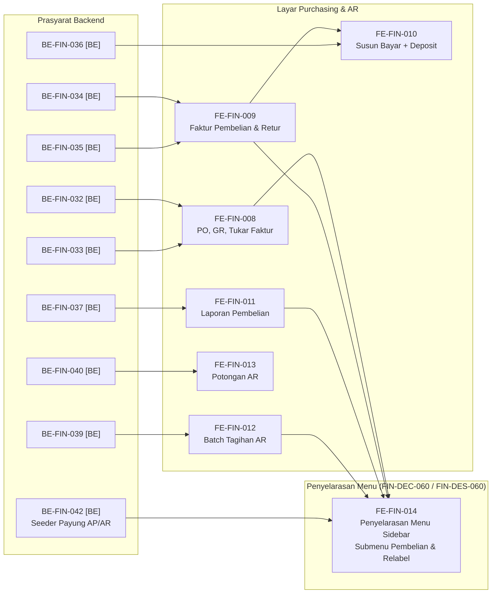

# Finance Management — Roadmap Frontend

## 1. Identitas

```yaml
roadmap_id: FIN-ROADMAP-FE-001
parent_roadmap: FIN-ROADMAP-001 revisi 8
roadmap_revision: 6
roadmap_status: ACTIVE — UI brief closed 2026-09-23 untuk FE-FIN-001..007; addendum UI brief closed 2026-09-25 (/grill-me, FIN-DEC-060)
blueprint_id: FIN-BP-001
blueprint_revision: 7
frontend_commit_sha: 49b59cfaa
frontend_commit_sha_previous: abed49b03
frontend_branch: yasmina
frontend_authority: Product Owner (Yasmin) — UI brief closed 2026-09-23, FIN-DEC-024..029 di 00-interview-decisions.md
contracts:
  FIN-API-1.2: locked 2026-09-26 (revisi 5)
  FIN-PERM-1.3: locked 2026-09-28 (revisi 6; FIN-CQ-08 pemetaan payung ke granular)
  FIN-STATE-1.3: locked 2026-09-26 (revisi 5; FE-FIN-007 tetap merujuk bagian 9)
  FIN-MVP-1.5: locked 2026-09-28 (revisi 6)
roadmap_revision_6_note: >
  Revisi 6 (28 September 2026) menambahkan FE-FIN-014 (penyelarasan menu sidebar navigasi Finance
  ke FIN-DEC-060 dan FIN-DES-060: submenu "Pembelian", butir flat "Tagihan Gabungan Penjamin",
  dan relabel "Faktur Pembelian"). Menegaskan bahwa filter menu Finance.AP dan Finance.AR tetap
  berlaku apa adanya per FIN-DEC-079 / FIN-DES-061 tanpa perubahan kode filter di frontend,
  menutup resmi FIN-CAP-040 dan FIN-OQ-036.
roadmap_revision_5_note: >
  Revisi 5 (26 September 2026) MEMBUKA FE-FIN-010 dan mengubah cakupannya: deposit tidak lagi
  dipakai dari layar Deposit Retur, melainkan dipilih sebagai sumber dana di layar susun
  pembayaran supplier (03-frontend-architecture.md bagian 13.1, FIN-DES-045). Nol task FE revisi 4
  yang ⛔ selain yang bergantung pada FE-FIN-004. Task lama tidak dinomori ulang.
roadmap_revision_4_note: >
  Revisi 4 (25 September 2026, /grill-me closure pass) MENUTUP FIN-OQ-022 (label menu, FIN-DEC-060)
  dan MEMBUKA FE-FIN-013 (semula ⛔ FIN-OQ-024, sekarang menunggu BE-FIN-040 yang juga dibuka).
  FE-FIN-010 TETAP ⛔ — FIN-OQ-023 tertutup sisi keputusan bisnis (FIN-DEC-057), tetapi
  BE-FIN-036 yang menjadi prasyaratnya masih menunggu amendment arsitektur. Task lama TIDAK
  dinomori ulang.
roadmap_revision_3_note: >
  Revisi 3 (25 September 2026) MENAMBAHKAN enam task FE-FIN-008..013 untuk AMENDMENT REVISI 4
  blueprint (layar Purchasing/AP, Batch Tagihan AR, Potongan AR — 03-frontend-architecture.md
  bagian 12). TIDAK ada task lama yang dinomori ulang atau diturunkan statusnya.
  SHA frontend bergerak abed49b03 -> 49b59cfaa; tiga commit di antaranya menambah rute
  /finance/payable/*, /finance/receivable/*, /finance/ap-aging, /finance/payment-ar, dan lainnya
  yang TIDAK tercatat pada task FE-FIN-001..007. Status task lama pada berkas ini TIDAK
  diverifikasi ulang terhadap 49b59cfaa — lihat coverage gap pada 00-delivery-roadmap.md.
roadmap_revision_2_note: >
  Revisi 2 (25 September 2026) MENAMBAHKAN satu task FE-FIN-007 untuk AMENDMENT REVISI 3
  blueprint, dan MENAMBAHKAN bagian Grafik Urutan Dependency yang sebelumnya belum ada pada
  berkas ini. TIDAK ada task lama yang dinomori ulang, diubah outcome-nya, atau diturunkan
  statusnya. Kriteria FE-FIN-006 yang menyebut HELD_FOR_FINALIZATION diberi catatan, bukan
  diubah: task itu sudah selesai dan buktinya tetap berlaku untuk keadaan saat dikerjakan.
```

Payung roadmap ada di `00-delivery-roadmap.md`. Pasangan backend-nya ada di
`01-backend-roadmap.md`.

**Berkas ini tidak menyatakan satu pun pekerjaan selesai, dan tidak memutuskan satu pun
rancangan antarmuka.**

## 2. Dua hal berbeda yang menahan frontend

Penting dipisahkan, karena obatnya berbeda:

| Penahan | Menahan apa | Keadaan |
|---|---|---|
| Kontrak API belum terkunci | Kerja paralel dengan backend | **Sudah tercabut** — `FIN-API-1.0` terkunci 20 September 2026 |
| ~~UI brief belum ada~~ | Seluruh task `FE-FIN-*` | **Sudah tercabut 23 September 2026** — keenam keputusan Product Owner pada bagian 5 tercatat `FIN-DEC-024`..`029` (approved, Yasmin) di `docs/module-blueprints/finance-management/00-interview-decisions.md` bagian `Frontend Decision Authority` |
| Endpoint belum dibangun | Pengujian nyata tiap layar | Menyusul per gelombang backend — lihat dependency per task pada tabel bagian 4. **Pembaruan 23 September 2026**: `BE-FIN-004` kini ✅ selesai (build PASS, migration diterapkan, endpoint diuji langsung — [laporan](../task/report/backend/BE-FIN-004.md)), jadi `FE-FIN-001` tidak lagi tertahan di titik ini |

Dengan UI brief tertutup, penahan yang tersisa untuk tiap task `FE-FIN-*` murni dependency
backend-nya masing-masing pada tabel bagian 4 — bukan lagi keputusan Product Owner.

**Tambahan revisi 3 (25 September 2026), ditutup 25 September 2026.** Layar revisi 4 sempat
menambah satu penahan kecil: **label dan pengelompokan butir menu baru** (`FIN-OQ-022`).
`/grill-me` closure pass menutupnya (`FIN-DEC-060`): lima layar AP masuk submenu baru
"Pembelian"; Batch Tagihan AR jadi butir flat "Tagihan Gabungan Penjamin"; Purchasing Invoice
dilabeli "Faktur Pembelian" supaya tidak tertukar dengan "Faktur & Tagihan Supplier" yang sudah
ada. Butir menu **boleh** didaftarkan begitu halaman terkaitnya dibangun — tidak ada lagi yang
menahan.

`03-frontend-architecture.md` menetapkan **kontrak fungsional** — kemampuan apa yang MUST ada,
data apa yang MUST terlihat, aksi apa yang MUST disembunyikan. Ia **bukan** rancangan
antarmuka.

## 3. Keadaan frontend sekarang

Diverifikasi langsung pada `abed49b03`:

| Yang sudah ada | Keadaan |
|---|---|
| Menu sidebar "Keuangan" (`corporateFinance`) | Ada, berisi **dua** butir: Kategori Petty Cash dan Anggaran Petty Cash |
| `/finance/petty-cash-budget` | Halaman nyata, 687 baris, berfungsi penuh |
| `/finance/master-data/petty-cash-category` | Halaman nyata beserta create, detail, update |
| Redux slice dan hook Petty Cash | Masih di path `health-services/billing-management/` |
| Halaman voucher di bawah `/finance/` | Belum ada |
| Layar AR, AP, pembayaran, setoran, kas harian | **Belum ada satu pun** |

Jadi pekerjaan frontend modul ini adalah **membangun dari nol** untuk AR, AP, kas, dan
pemantauan — ditambah **merapikan** yang sudah ada untuk Petty Cash.

## Grafik Urutan Dependency

**Arti tanda status pada dokumen ini.**

| Tanda | Artinya |
| :---: | --- |
| ✅ | Selesai. Acceptance criteria dan DoD **terbukti**, buktinya ada pada laporan task |
| 🟡 | Sebagian. Source-nya sudah ada, tetapi acceptance criteria belum terbukti penuh. **Belum selesai** |
| ⛔ | Terblokir. Prasyaratnya belum terpenuhi, dan task **tidak boleh dimulai** |
| tanpa tanda | Belum dikerjakan |

```text
BE-FIN-004 ✅ [BE] ─> FE-FIN-001 🟡

BE-FIN-015 ✅ [BE] ─> FE-FIN-003 ✅

BE-FIN-018 ✅ [BE] ─> FE-FIN-004

FE-FIN-005 ✅

BE-FIN-009 ✅ [BE] ─┬─> FE-FIN-002 ✅
                    │
BE-FIN-012 ✅ [BE] ─┴─> FE-FIN-006 ✅ ─┐
                                       │
BE-FIN-024 ⛔ [BE] ────────────────────┴─> FE-FIN-007 ⛔
```

`[BE]` = task backend pada `01-backend-roadmap.md`, **cermin baca-saja**. Tandanya disalin dari
roadmap pemiliknya, tidak pernah ditetapkan di berkas ini. `FE-FIN-005` tidak punya prasyarat
backend sama sekali — ia merapikan halaman Petty Cash yang sudah berfungsi.

| Gelombang | Boleh mulai setelah | Task |
| ---: | --- | --- |
| 1 | `BE-FIN-004` ✅ | `FE-FIN-001` 🟡 — sudah dikerjakan, verifikasi runtime belum dibuktikan |
| 1 | — | `FE-FIN-005` ✅ |
| 2 | `BE-FIN-009` ✅ | `FE-FIN-002` ✅ |
| 2 | `BE-FIN-015` ✅ | `FE-FIN-003` ✅ |
| 2 | `BE-FIN-009` ✅ dan `BE-FIN-012` ✅ | `FE-FIN-006` ✅ |
| 3 | `BE-FIN-018` ✅ | `FE-FIN-004` — belum dikerjakan; seluruh prasyaratnya sudah ✅ |
| — | ⛔ menunggu `BE-FIN-024` (yang sendirinya menunggu `FIN-OQ-017`) | `FE-FIN-007` |

`FE-FIN-007` **tidak diberi nomor gelombang** karena `EPIC FIN-14` berstatus `OPEN DECISION` pada
`04-prd-to-mvp.md`, sama seperti rangkaian `REV-3` pada roadmap backend.

### REV-4 — layar Purchasing/AP, Batch Tagihan AR, Potongan AR (`POST-MVP`)

```text
BE-FIN-032 [BE] ─┬─> FE-FIN-008
BE-FIN-033 [BE] ─┘

BE-FIN-034 [BE] ─┬─> FE-FIN-009 ─> FE-FIN-010 <─ BE-FIN-036 [BE]
BE-FIN-035 [BE] ─┘

BE-FIN-037 [BE] ─> FE-FIN-011

BE-FIN-039 [BE] ─> FE-FIN-012

FE-FIN-004 ─┬─> FE-FIN-013
            │
BE-FIN-040 [BE] ─┘

BE-FIN-042 [BE] ─┬─> FE-FIN-014
FE-FIN-008 ──────┤
FE-FIN-009 ──────┤
FE-FIN-011 ──────┤
FE-FIN-012 ──────┘
```

### Diagram Ketergantungan Frontend (Mermaid)



`FE-FIN-013` menunggu `FE-FIN-004` karena potongan AR tinggal di dalam layar alokasi penerimaan
(`03-frontend-architecture.md` bagian 12.3), bukan layar sendiri. `FIN-OQ-022` (label menu)
sudah **tertutup** 25 September 2026 (`FIN-DEC-060`) — tidak lagi digambar sebagai penahan.

| Urutan | Boleh mulai setelah | Task |
| ---: | --- | --- |
| R4-1 | `BE-FIN-032`, `BE-FIN-033` | `FE-FIN-008` |
| R4-1 | `BE-FIN-039` | `FE-FIN-012` — rumpun AR, paralel dengan Purchasing |
| R4-2 | `BE-FIN-034`, `BE-FIN-035` | `FE-FIN-009` |
| R4-3 | `BE-FIN-037` | `FE-FIN-011` |
| R4-3 | `FE-FIN-004` ✅, `BE-FIN-040` | `FE-FIN-013` — **dibuka** `FIN-DEC-058` |
| R4-4 | `BE-FIN-036`, `FE-FIN-009` | `FE-FIN-010` — **dibuka** revisi 5; cakupan pindah ke layar susun pembayaran |
| R4-5 | `BE-FIN-042` [BE], `FE-FIN-008`, `FE-FIN-009`, `FE-FIN-011`, `FE-FIN-012` | `FE-FIN-014` — Penyelarasan menu sidebar (submenu Pembelian, relabel Faktur Pembelian, butir Tagihan Gabungan Penjamin) |

## 4. Task

| Task ID | Outcome | Requirement/decision | Kontrak | Reuse | Cakupan | Dependency | Acceptance criteria | Verifikasi | Risiko/pemilik | DoD |
| --- | --- | --- | --- | --- | --- | --- | --- | --- | --- | --- |
| 🟡 `FE-FIN-001` | Pengelolaan data induk Finance | `FR-FIN-001`..`004` | `FIN-API-1.0`, `FIN-PERM-1.0` | Pola halaman Petty Cash (`FIN-CAP-015`), group menu `corporateFinance` | Bank, rekening, mata uang, kurs — CRUD beserta aktif/nonaktif | `BE-FIN-004` ✅ selesai 23 September 2026 (UI brief closed — `FIN-DEC-024`..`029`) | Nomor rekening ganda ditolak dengan pesan yang dapat dibaca petugas | `UAT-01`, `UAT-02` — **belum dibuktikan runtime**, `npm run lint:errors`/`npm run build` `NOT RUN` ([laporan](../task/report/frontend/FE-FIN-001.md)) | Product Owner — tata letak `DEV_DISCRETION` | Aksi mengikuti `FIN-PERM-1.0`; nol perhitungan di klien |
| ✅ `FE-FIN-002` | Buku piutang dan umur piutang | `FR-FIN-020`..`024` | `FIN-API-1.0` | — | Daftar, rincian, umur empat kelompok, penelusuran ke tagihan asal | `BE-FIN-009` ✅ selesai 23 September 2026 (UI brief closed — `FIN-DEC-024`..`029`) | Piutang dapat ditelusuri ke tagihan asalnya dari layar | `UAT-03` — ✅ **Selesai 23 September 2026**; `npm run lint:errors` PASS (0 error), `npm run build` PASS (0 error) ([laporan](../task/report/frontend/FE-FIN-002.md)) | Product Owner | Nilai uang **tidak** dibulatkan ulang di klien; kelompok umur tidak diubah layar |
| ✅ `FE-FIN-003` | Setoran bank dan kas harian | `FR-FIN-060`..`065` | `FIN-API-1.0` | — | Setoran, penutupan hari, saldo | `BE-FIN-015` ✅ selesai 23 September 2026 (UI brief closed — `FIN-DEC-024`..`029`) | Angka yang sudah ditutup ditampilkan beku; setoran melebihi kas ditolak dengan pesan yang jelas | `UAT-13`..`UAT-16` — ✅ **Selesai 23 September 2026**; `npm run lint:errors` PASS (0 error), `npm run build` PASS (0 error) ([laporan](../task/report/frontend/FE-FIN-003.md)) | Product Owner | Saldo dibaca dari backend, tidak dihitung ulang |
| ✅ `FE-FIN-006` | Pemantauan fakta Billing dan kejadian Accounting | `FR-FIN-011`, `FR-FIN-012`, `FR-FIN-074` | `FIN-API-1.0` | Pola tab Finance & base components | Daftar gagal olah beserta pengulangan; antrean kejadian beserta status tertahan | `BE-FIN-009`, `BE-FIN-012` ✅ selesai 23 September 2026 (UI brief closed — `FIN-DEC-024`..`029`) | `HELD_FOR_FINALIZATION`, `HELD`, dan `FAILED` **dibedakan** — tindakan penggunanya berbeda | `UAT-04`, `UAT-17`..`UAT-19` — ✅ **Selesai 23 September 2026**; `npm run lint:errors` PASS (0 error), `npm run build` PASS (0 error) ([laporan](../task/report/frontend/FE-FIN-006.md)) | Product Owner | Tanpa tombol kirim — pengiriman adalah `EPIC FIN-12` |
| `FE-FIN-004` | Penerimaan dan alokasi | `FR-FIN-030`..`046` | `FIN-API-1.0` — permukaan collection dikecualikan dari penguncian | — | Penerimaan, alokasi manual, koreksi, penghapusan, rekonsiliasi shift | `BE-FIN-016`..`018` ✅ selesai 23 September 2026 (UI brief closed — `FIN-DEC-024`..`029`) | Alokasi dipilih petugas, bukan dicocokkan otomatis | `UAT-05`..`UAT-12`, `UAT-20` | Owner Billing sudah menjawab 21 September 2026 (`BKC-DEC-106`/`108`/`109`) — tidak lagi `BLOCKED` | — |
| ✅ `FE-FIN-005` | Merapikan Petty Cash ke rute Finance | `EPIC FIN-13` | `FIN-API-1.0` | `FIN-CAP-015`, `FIN-CAP-016` — **halaman sudah berfungsi penuh** | Pindahkan hook dan Redux slice; tambah halaman voucher di `/finance/`; satu butir menu | Kapan saja | Kemampuan pengguna **tidak berkurang sedikit pun** | Uji regresi halaman Petty Cash — ✅ **Selesai 23 September 2026**; `npm run lint:errors` PASS (0 error), `npm run build` PASS (0 error) ([laporan](../task/report/frontend/FE-FIN-005.md)) | Product Owner | `POST-MVP`. Aturan bisnis Petty Cash MUST NOT diubah — milik `billing-kasir` (`FIN-DEC-009`) |
| `FE-FIN-007` ⛔ | Layar pemantauan kejadian menampilkan tujuh jenis kejadian baru, dan memperlakukan `HELD_FOR_FINALIZATION` sebagai peninggalan kebijakan lama | `FIN-DEC-030`, `039`; `FR-FIN-074` **dicabut**, `FR-FIN-076`..`080` **baru**; `03-frontend-architecture.md` bagian 3 | `FIN-STATE-1.1`, `FIN-API-1.0` (endpoint `GET /accounting-events` **tidak berubah** — hanya isi datanya yang bertambah jenis) | Layar pemantauan yang sudah dibangun `FE-FIN-006` ✅ | (a) Tujuh jenis kejadian baru dapat disaring dan terbaca namanya; (b) `HELD_FOR_FINALIZATION` diberi keterangan bahwa ia peninggalan kebijakan lama yang perlu dibetulkan, **bukan** keadaan normal yang menunggu Billing; (c) baris berstatus `ACKNOWLEDGED` dengan nomor jurnal kosong **tidak** ditampilkan sebagai kegagalan | ⛔ `BE-FIN-024` — lihat `01-backend-roadmap.md` | Petugas dapat membedakan `HELD` (menunggu Accounting) dari `FAILED` (menunggu Finance) dari baris warisan `HELD_FOR_FINALIZATION` (menunggu pembetulan data); nomor jurnal kosong pada baris `ACKNOWLEDGED` tidak memicu tombol kirim ulang | `npm run lint:errors`, `npm run build`, dan verifikasi manual ketiga keadaan di layar. Test otomatis **opsional** sesuai `rules/frontend/test-policy.md` | Product Owner — tata letak, warna, dan penempatan keterangan tetap `DEV_DISCRETION`. Yang dikunci hanya **isi dan sumber datanya** | Nol tombol kirim — pengiriman tetap `EPIC FIN-12`. Nol perhitungan nilai di klien |

| `FE-FIN-008` | Petugas AP mencatat Purchase Order, Tanda Terima Barang, dan Tukar Faktur; penyetuju menyetujui PO sesuai jenjangnya | `FR-FIN-081`, `082`; `FIN-DEC-050`, `051`, `052` | `FIN-API-1.1` B.1-B.3, `FIN-PERM-1.1` B.2-B.3, `FIN-VAL-1.2` `100`..`104` | Pola halaman Finance yang sudah ada (`finance-payable-view.jsx`: `DataTable`, `DataFilter`, `SummaryCards`, `AccessDeniedGate`); master supplier existing | Daftar/buat/rincian PO; ajukan/setujui/tolak/batal; catat GR terhadap PO; daftar/buat/batal Tukar Faktur (PO/GR opsional) | `BE-FIN-032`, `BE-FIN-033` | `ApprovalTier` dan `EstimatedDueDate` **ditampilkan dari response**, tidak dihitung layar; tombol Setujui tidak tampil bagi pengaju; penolakan `403` jenjang menampilkan pesan backend apa adanya | `npm run lint:errors`, `npm run build`; verifikasi manual: PO Rp 62.000.000 ditolak untuk Supervisor, PO Rp 50.000.000 tepat menuntut Manajer | Product Owner — tata letak, wizard vs layar terpisah tetap `DEV_DISCRETION` (`03-frontend-architecture.md` 12.6) | Nol perhitungan uang/tanggal di klien; `Idempotency-Key` pada perintah uang |
| `FE-FIN-009` | Petugas AP menyusun Purchasing Invoice dari Tukar Faktur, penyetuju menyetujuinya, dan retur pembelian menerbitkan Deposit Retur | `FR-FIN-083`, `084`, `085` (penerbitan), `086`; `FIN-DEC-045`, `047` | `FIN-API-1.1` B.4, B.5 (tanpa `apply`), `FIN-PERM-1.1` B.4, `FIN-VAL-1.2` `105`..`111` | Idem `FE-FIN-008` | Daftar/buat/ubah/ajukan/setujui/tolak Purchasing Invoice; catat retur; daftar Deposit Retur dan saldo tersedianya | `BE-FIN-034`, `BE-FIN-035` | Hanya Tukar Faktur yang belum terpakai dapat dipilih; total, PPN, dan saldo deposit dari backend; **tidak** menduplikasi layar "Faktur & Tagihan Supplier" yang sudah ada di `/finance/payable/invoice` — layar itu menampilkan **utang**, layar ini **dokumen sebelum menjadi utang** | `npm run lint:errors`, `npm run build`; verifikasi manual: invoice ber-PPN disetujui → utangnya muncul di `/finance/payable/invoice` | Product Owner. Risiko: pengguna bingung dua daftar "faktur" — penamaannya bagian `FIN-OQ-022` | Status kirim kejadian PPN **tidak** ditampilkan sebagai berhasil (`03-frontend-architecture.md` 12.7) |
| `FE-FIN-010` | Petugas AP memilih Deposit Retur sebagai sumber dana saat menyusun pembayaran supplier | `FR-FIN-085` (pemakaian), `FR-FIN-096`, `097`; `FIN-DEC-057`, `061` | `FIN-API-1.2` C.1, C.2; `FIN-PERM-1.2` C.1; `FIN-VAL-1.3` C.2; `03-frontend-architecture.md` bagian 13.1 | Layar susun pembayaran supplier yang sudah ada (`finance-payment-ap-view.jsx` di `/finance/payment-ap`) — **diperluas, bukan dibuat baru**; daftar deposit dari `FE-FIN-009` | Pilih/lepas deposit selama pembayaran `DRAFT`; tampilkan empat angka (`totalAmount`, potongan/tambahan, `depositAppliedAmount`, `netTransferAmount`) dari response; riwayat baris `RELEASED`; `mark-paid` tanpa nomor bukti bila `netTransferAmount = 0` | `BE-FIN-036`, `FE-FIN-009` | Tidak ada angka uang yang dihitung layar; sesudah `422` saldo kurang, daftar deposit dimuat ulang; deposit hanya muncul untuk pembayaran `SUPPLIER` kepada supplier pemiliknya | `npm run lint:errors`, `npm run build`; verifikasi manual: pembayaran Rp 10.000.000 dengan deposit Rp 2.500.000 menampilkan transfer Rp 7.500.000 | Product Owner — tata letak `DEV_DISCRETION`. **Risiko:** layar pembayaran yang ada hari ini memanggil rute alias `api/finance/payable/payment` (`FinanceApController`), bukan `api/v1/corporate/finance-management/payments` tempat endpoint deposit berada. Sebelum task ini dimulai, MUST dipastikan layar mana yang kanonik — lihat coverage gap frontend di `00-delivery-roadmap.md` | Nol angka uang dihitung di klien; `Idempotency-Key` pada `POST` |
| `FE-FIN-011` | Empat laporan Purchasing/AP dapat dibaca | `FR-FIN-088` | `FIN-API-1.1` B.6 kecuali `/aging` | Pola halaman laporan yang sudah ada (`/finance/ap-report`) | Rekap, Laporan Tukar Faktur, Laporan Jatuh Tempo, Rekonsiliasi Tagihan | `BE-FIN-037` | Seluruh angka dan kelompok dari response; read-only | `npm run lint:errors`, `npm run build` | Product Owner. **Aging AP tidak dibuat baru** — layar `/finance/ap-aging` yang sudah ada tetap satu-satunya (`FIN-DEC-059`) | Nol perhitungan di klien |
| `FE-FIN-012` | Petugas AR menerbitkan satu dokumen tagihan untuk banyak piutang satu penjamin | `FR-FIN-089`..`092`; `FIN-DEC-048` | `FIN-API-1.1` B.7, `FIN-PERM-1.1` B.5, `FIN-VAL-1.2` `114`..`117` | Layar piutang yang sudah ada (`/finance/receivable`) sebagai sumber pilihan | Daftar/buat/rincian/terbitkan/batal batch; unduh dokumen batch | `BE-FIN-039` | Daftar piutang yang layak digabung **diambil dari** `GET /eligible-receivables`, bukan disaring layar; batch `ISSUED` tampil terkunci | `npm run lint:errors`, `npm run build`; verifikasi manual: piutang dua penjamin tidak dapat digabung | Product Owner | Nol PPN/Faktur Pajak ditampilkan (`FIN-DEC-054`) |
| `FE-FIN-013` | Petugas AR mencatat PPh 23/biaya admin bank saat mengalokasikan penerimaan | `FR-FIN-093`..`095` | `FIN-API-1.1` B.8 | Layar alokasi penerimaan (`FE-FIN-004`) | Baris potongan di dalam alur alokasi yang sama | `BE-FIN-040`, `FE-FIN-004` ✅ | Sisa piutang sesudah potongan dari response backend | `npm run lint:errors`, `npm run build` | Product Owner. **`FIN-OQ-024` ditutup sisi Finance** (`FIN-DEC-058`) — layar boleh dibangun; status kirim kejadian `POTONGAN-PIUTANG-NON-TUNAI` **tidak** ditampilkan sebagai berhasil sebelum `FIN-OQ-026` (pola bagian 12.7) | Tetap di dalam alur satu penerimaan (`03-frontend-architecture.md` 12.3) |
| `FE-FIN-014` | Penyelarasan menu sidebar navigasi Finance mengikuti FIN-DEC-060 dan FIN-DES-060 (submenu Pembelian, relabel Faktur Pembelian, butir flat Tagihan Gabungan Penjamin) | `FIN-DEC-060`, `076`, `079`; `FIN-DES-060`, `061`; `03-frontend-architecture.md` Bagian 15 | `03-frontend-architecture.md` Bagian 15, `FIN-MVP-1.5` | `src/utils/menu-sidebar/corporateFinance.js` | Submenu Pembelian (5 link), relabel Faktur Pembelian, Tagihan Gabungan Penjamin flat sejajar Piutang; filter payung Finance.AP/Finance.AR tetap berlaku | `BE-FIN-042` [BE], `FE-FIN-008`..`012` | 1. Submenu Pembelian tampil di sidebar memuat link Purchasing AP. 2. "Supplier Invoice" direlabel "Faktur Pembelian". 3. "Tagihan Gabungan Penjamin" muncul flat. 4. Filter Finance.AP/AR berfungsi tanpa galat | `npm run lint:errors`, `npm run build`, verifikasi visual | Product Owner (Yasmin) + Frontend Owner | Submenu Pembelian terpasang; label bahasa Indonesia baku; filter payung berfungsi |

**Catatan revisi 2 atas `FE-FIN-006` yang sudah ✅ selesai.** Acceptance criteria-nya menyebut
`HELD_FOR_FINALIZATION` dibedakan dari `HELD` dan `FAILED`, mengikuti `FR-FIN-074` yang berlaku
saat task itu dikerjakan. `FR-FIN-074` **dicabut** 25 September 2026 (`FIN-DEC-030`). Statusnya
**tetap** ✅ dan buktinya **tetap berlaku** — ia benar untuk keadaan saat dikerjakan; yang
menindaklanjuti perubahan kebijakan adalah `FE-FIN-007`, bukan pembukaan ulang `FE-FIN-006`.
Riwayat tidak dihapus, sesuai `rules/rule-output/status-task-roadmap.md` bagian 5.

`FE-FIN-006` **baru** pada roadmap frontend ini. Revisi payung sebelumnya melewatkannya:
`03-frontend-architecture.md` bagian 3.5 menuntut dua layar pemantauan, dan keduanya sebelumnya
tidak punya task frontend sama sekali walau backend-nya (`BE-FIN-009`, `BE-FIN-012`) ada.

## 5. Yang MUST diputuskan UI brief

**Status: DITUTUP 23 September 2026.** Keenam hal ini sebelumnya menahan seluruh task
`FE-FIN-*` sampai diputuskan Product Owner (bukan developer). Seluruhnya sudah dijawab Yasmin
(Product Owner Finance) lewat `/grill-me`, tercatat sebagai `FIN-DEC-024`..`029` pada
`docs/module-blueprints/finance-management/00-interview-decisions.md` bagian
`Frontend Decision Authority` — rujukan itu yang otoritatif untuk detail dan evidence tiap
keputusan.

| # | Yang perlu diputuskan | Kenapa bukan wewenang developer | Hasil | Decision ID |
|---:|---|---|---|---|
| 1 | Struktur rute di bawah `/finance/...` | Menentukan bentuk navigasi seluruh modul | Ikuti pola existing: master data → `/finance/master-data/<entity>`, lainnya → slug flat `/finance/<capability>` | `FIN-DEC-024` |
| 2 | Urutan dan penamaan butir menu pada group `corporateFinance` | Yang dilihat pengguna tiap hari | "Rekening Bank"/"Mata Uang & Kurs" masuk submenu Master Data; "Piutang"/"Setoran & Kas Harian"/"Pemantauan Finance" jadi butir flat | `FIN-DEC-025` |
| 3 | Bentuk penyajian umur piutang | Kelompoknya sudah dikunci `FIN-DEC-010`; penyajiannya belum | Summary card 4 bucket + satu tabel, klik baris untuk trace ke tagihan asal | `FIN-DEC-026` |
| 4 | Rekonsiliasi shift: satu halaman atau tab | Memengaruhi alur kerja kasir | Halaman penuh terpisah | `FIN-DEC-027` |
| 5 | Koreksi dan penghapusan: modal atau halaman penuh | Memengaruhi ketelitian pada aksi yang menyentuh uang | Modal | `FIN-DEC-028` |
| 6 | Cetak dan unduh | Belum ada keputusan bisnisnya sama sekali | Ditunda dari MVP `FE-FIN-001`/`002`/`003`/`006`; lingkup detail dibuka sebagai `FIN-OQ-015` | `FIN-DEC-029` |

Yang **sudah** ditetapkan dan tidak perlu ditanyakan lagi: rute berada di bawah `/finance/...`
(bukan `/health-services/billing-management/...`), dan group menu `corporateFinance` sudah ada
sehingga tidak perlu membuat group baru.

## 6. `DEV_DISCRETION`

Diputuskan developer, tanpa perlu menunggu siapa pun:

| Keputusan | Catatan |
|---|---|
| Tata letak halaman, urutan kolom tabel | Mengikuti pola halaman Finance yang sudah ada |
| Modal atau halaman penuh untuk aksi kecil | — |
| Urutan butir menu di dalam group | Group-nya sendiri sudah ditetapkan |
| Tombol Setujui: disembunyikan atau dinonaktifkan bagi pengaju | Keduanya sah; yang MUST adalah backend tetap menolak |
| Kapan angka dimuat ulang otomatis | Kecuali setelah `409`, yang **MUST** memuat ulang |

Warna, tipografi, dan spacing mengikuti design system project — bukan wewenang modul ini.

## 7. Yang frontend MUST NOT lakukan

| Larangan | Alasan |
|---|---|
| Menghitung ulang nilai uang di klien | Satu-satunya sumber angka adalah backend; dua tempat perhitungan akan berbeda |
| Membulatkan ulang nilai uang | Pembulatan hanya terjadi sekali, di backend |
| Mengubah kelompok umur piutang | Dikunci `FIN-DEC-010` |
| Mulai dengan data tiruan yang bentuknya ditebak | `FIN-API-1.0` sudah tertulis dan terkunci; bentuk itulah yang dipakai |
| Mengandalkan penyembunyian tombol sebagai penjagaan wewenang | Backend yang menjaga; layar hanya menghemat satu putaran gagal |
| Mengubah aturan bisnis Petty Cash saat merapikan rute | Keputusannya milik `billing-kasir` (`FIN-DEC-009`) |
| Menyediakan tombol kirim kejadian ke Accounting | `EPIC FIN-12` `OPEN DECISION` |

## 8. Urutan yang disarankan

Mengikuti gelombang backend, karena tiap task frontend menunggu endpoint-nya ada:

```text
UI brief turun (closed 23 September 2026 — FIN-DEC-024..029)
   ↓
FE-FIN-001 🟡 source lengkap 23 September 2026, validasi belum dijalankan (data induk — paling kecil, bagus untuk menetapkan pola)
   ↓
FE-FIN-002   ✅ selesai 23 September 2026 (buku piutang — layar inti pertama)
FE-FIN-006   ✅ selesai 23 September 2026 (pemantauan — fakta intake & antrean outbox)
   ↓
FE-FIN-003   ✅ selesai 23 September 2026 (setoran dan kas harian)
   ↓
FE-FIN-004   siap                  (owner Billing sudah menjawab 21 September 2026; BE-FIN-016..018 selesai 23 September 2026)
FE-FIN-005   ✅ selesai 23 September 2026 (merapikan Petty Cash, tidak mengunci apa pun)
```

`FE-FIN-001` sengaja didahulukan bukan karena paling penting, melainkan karena paling kecil —
ia menetapkan pola halaman, penanganan `409`, dan penerapan `[AccessPermission]` di layar yang
akan diikuti seluruh layar berikutnya.

## 9. Definition of Done frontend

| # | Kriteria |
|---:|---|
| 1 | UI brief disetujui Product Owner sebelum task pertama dimulai |
| 2 | Bentuk data mengikuti `FIN-API-1.0` apa adanya — nol tebakan |
| 3 | Aksi disembunyikan atau dinonaktifkan sesuai `FIN-PERM-1.0` |
| 4 | Nol perhitungan dan nol pembulatan nilai uang di klien |
| 5 | `409` memuat ulang data dan memberi tahu pengguna, tanpa mengirim ulang diam-diam |
| 6 | Rute baru di bawah `/finance/...`; butir menu masuk group `corporateFinance` yang sudah ada |
| 7 | Layar pemantauan membedakan `HELD_FOR_FINALIZATION`, `HELD`, dan `FAILED` |
| 8 | Uji regresi Petty Cash lulus pada `FE-FIN-005` — nol kemampuan pengguna yang hilang |
| 9 | Skenario UAT yang tertaut pada kolom Verifikasi lulus |
| 10 | Nol layar untuk `EPIC FIN-04` dan `EPIC FIN-12` |
| 11 | *(revisi 3)* Bentuk data mengikuti `FIN-API-1.1` untuk layar revisi 4; aksi mengikuti `FIN-PERM-1.1` |
| 12 | *(revisi 3)* `ApprovalTier`, `EstimatedDueDate`, total invoice, saldo deposit, dan sisa piutang sesudah potongan seluruhnya dari backend |
| 13 | *(revisi 3)* Nol layar Aging AP kedua; nol daftar "faktur" yang menduplikasi `/finance/payable/invoice` |
| 14 | *(revisi 3)* Butir menu mengikuti label `FIN-DEC-060` (submenu "Pembelian", "Tagihan Gabungan Penjamin", "Faktur Pembelian") |
| 16 | *(revisi 5)* Deposit Retur dipilih di layar susun pembayaran, bukan di layar Deposit Retur; empat angka pembayaran dari response backend |
| 15 | *(revisi 4)* `FE-FIN-013` tidak menampilkan status kirim kejadian potongan AR sebagai berhasil sebelum `FIN-OQ-026` turun |
| 17 | *(revisi 6)* Menu sidebar memuat submenu "Pembelian" berisi 5 layar Purchasing AP; "Supplier Invoice" direlabel menjadi "Faktur Pembelian"; "Tagihan Gabungan Penjamin" sejajar "Piutang"; seluruhnya difilter Finance.AP dan Finance.AR tanpa galat runtime (FE-FIN-014) |

