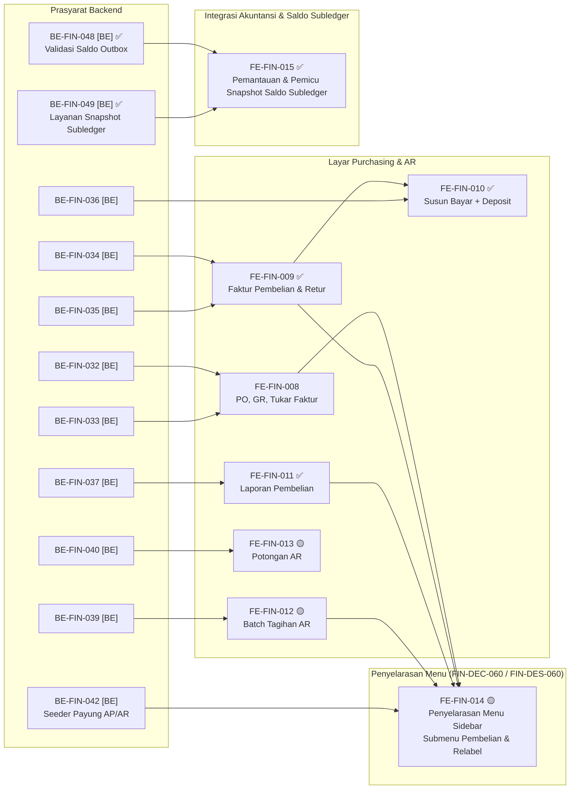

# Finance Management — Roadmap Frontend

## 1. Identitas

```yaml
roadmap_id: FIN-ROADMAP-FE-001
parent_roadmap: FIN-ROADMAP-001 revisi 10
roadmap_revision: 8
roadmap_status: ACTIVE — UI brief closed 2026-09-23 untuk FE-FIN-001..007; addendum UI brief closed 2026-09-25 (/grill-me, FIN-DEC-060); FE-FIN-015 ditambahkan 30 September 2026
blueprint_id: FIN-BP-001
blueprint_revision: 10
frontend_commit_sha: 49b59cfaa
frontend_commit_sha_previous: abed49b03
frontend_branch: yasmina
frontend_authority: Product Owner (Yasmin) — UI brief closed 2026-09-23, FIN-DEC-024..029 di 00-interview-decisions.md
contracts:
  FIN-API-1.2: locked 2026-09-26 (revisi 5)
  FIN-PERM-1.3: locked 2026-09-28 (revisi 6; FIN-CQ-08 pemetaan payung ke granular)
  FIN-STATE-1.3: locked 2026-09-26 (revisi 5; FE-FIN-007 tetap merujuk bagian 9)
  FIN-MVP-1.5: locked 2026-09-28 (revisi 6)
roadmap_revision_8_note: >
  Revisi 8 (30 September 2026) MENAMBAHKAN task FE-FIN-015 (Layar/Tab Pemantauan & Pemicu Snapshot Saldo
  Subledger Bulanan untuk 4 Control Account) menyusul selesainya task backend BE-FIN-048 dan BE-FIN-049,
  menjawab kebutuhan operasional staf Finance/Accounting dalam memastikan kelengkapan 4 akun kontrol
  (Kas Kasir, Kas Kecil, Piutang Pasien & Penjamin, dan Utang Supplier) dan pemicu penutupan saldo subledger
  akhir bulan secara manual bila diperlukan (ACC-DEC-108, FIN-DEC-090).
roadmap_revision_7_note: >
  Revisi 7 (29 September 2026) TIDAK menambah task frontend. Satu task lama diperbaiki isinya:
  FE-FIN-007. Tanda ⛔ dicabut karena FIN-OQ-017 sudah CLOSED 28 September 2026; outcome "tujuh
  jenis kejadian baru" diperbarui menjadi katalog final revisi 6 (SELISIH-KAS-SHIFT dipecah dua,
  dua kode penanda shift ditambah, empat nama pendek AR_*/AP_* diganti); dan dua sebab baris intake
  ERROR baru ditambahkan sebagai isi layar — refund REFERRED_OUTPATIENT_ADMIN (FIN-VAL-141) dan
  tender top-up dibalik tanpa mutasi pembalik (FIN-VAL-142).
  SATU PRASYARAT BARU: BE-FIN-025, karena baris intake ERROR baru ada setelah task itu membangun
  jalur sinkronisasinya. Grafik dan tabel gelombang ikut diperbarui.
  Pilihan UI tetap DEV_DISCRETION sepenuhnya — yang dikunci hanya isi dan sumber datanya, termasuk
  aturan bahwa daftar jenis kejadian diambil dari katalog dan TIDAK ditulis tangan di klien.
roadmap_revision_6_note: >
  Revisi 6 (28 September 2026) menambahkan FE-FIN-014 (penyelarasan menu sidebar navigasi Finance
  ke FIN-DEC-060 dan FIN-DES-060: submenu "Pembelian", butir flat "Tagihan Gabungan Penjamin",
  dan relabel "Faktur Pembelian"). Menegaskan bahwa filter menu Finance.AP dan Finance.AR tetap
  berlaku apa adanya per FIN-DEC-079 / FIN-DES-061 tanpa perubahan kode filter di frontend,
  menutup resmi FIN-CAP-040 dan FIN-OQ-036.
roadmap_revision_5_note: >
  Revisi 5 (26 September 2026) MEMBUKA FE-FIN-010 dan mengubah cakupannya: deposit tidak lagi
  dipakai dari layar Deposit Retur, melainkan dipilih sebagai sumber dana di layar susun
  pembayaran supplier (03-frontend-architecture.md bagian 13.1, FIN-DES-045). Nol task FE revisi 4
  yang ⛔ selain yang bergantung pada FE-FIN-004. Task lama tidak dinomori ulang.
roadmap_revision_4_note: >
  Revisi 4 (25 September 2026, /grill-me closure pass) MENUTUP FIN-OQ-022 (label menu, FIN-DEC-060)
  dan MEMBUKA FE-FIN-013 (semula ⛔ FIN-OQ-024, sekarang menunggu BE-FIN-040 yang juga dibuka).
  FE-FIN-010 TETAP ⛔ — FIN-OQ-023 tertutup sisi keputusan bisnis (FIN-DEC-057), tetapi
  BE-FIN-036 yang menjadi prasyaratnya masih menunggu amendment arsitektur. Task lama TIDAK
  dinomori ulang.
roadmap_revision_3_note: >
  Revisi 3 (25 September 2026) MENAMBAHKAN enam task FE-FIN-008..013 untuk AMENDMENT REVISI 4
  blueprint (layar Purchasing/AP, Batch Tagihan AR, Potongan AR — 03-frontend-architecture.md
  bagian 12). TIDAK ada task lama yang dinomori ulang atau diturunkan statusnya.
  SHA frontend bergerak abed49b03 -> 49b59cfaa; tiga commit di antaranya menambah rute
  /finance/payable/*, /finance/receivable/*, /finance/ap-aging, /finance/payment-ar, dan lainnya
  yang TIDAK tercatat pada task FE-FIN-001..007. Status task lama pada berkas ini TIDAK
  diverifikasi ulang terhadap 49b59cfaa — lihat coverage gap pada 00-delivery-roadmap.md.
roadmap_revision_2_note: >
  Revisi 2 (25 September 2026) MENAMBAHKAN satu task FE-FIN-007 untuk AMENDMENT REVISI 3
  blueprint, dan MENAMBAHKAN bagian Grafik Urutan Dependency yang sebelumnya belum ada pada
  berkas ini. TIDAK ada task lama yang dinomori ulang, diubah outcome-nya, atau diturunkan
  statusnya. Kriteria FE-FIN-006 yang menyebut HELD_FOR_FINALIZATION diberi catatan, bukan
  diubah: task itu sudah selesai dan buktinya tetap berlaku untuk keadaan saat dikerjakan.
```

Payung roadmap ada di `00-delivery-roadmap.md`. Pasangan backend-nya ada di
`01-backend-roadmap.md`.

**Berkas ini tidak menyatakan satu pun pekerjaan selesai, dan tidak memutuskan satu pun
rancangan antarmuka.**

## 2. Dua hal berbeda yang menahan frontend

Penting dipisahkan, karena obatnya berbeda:

| Penahan | Menahan apa | Keadaan |
|---|---|---|
| Kontrak API belum terkunci | Kerja paralel dengan backend | **Sudah tercabut** — `FIN-API-1.0` terkunci 20 September 2026 |
| ~~UI brief belum ada~~ | Seluruh task `FE-FIN-*` | **Sudah tercabut 23 September 2026** — keenam keputusan Product Owner pada bagian 5 tercatat `FIN-DEC-024`..`029` (approved, Yasmin) di `docs/module-blueprints/finance-management/00-interview-decisions.md` bagian `Frontend Decision Authority` |
| Endpoint belum dibangun | Pengujian nyata tiap layar | Menyusul per gelombang backend — lihat dependency per task pada tabel bagian 4. **Pembaruan 23 September 2026**: `BE-FIN-004` kini ✅ selesai (build PASS, migration diterapkan, endpoint diuji langsung — [laporan](../task/report/backend/BE-FIN-004.md)), jadi `FE-FIN-001` tidak lagi tertahan di titik ini |

Dengan UI brief tertutup, penahan yang tersisa untuk tiap task `FE-FIN-*` murni dependency
backend-nya masing-masing pada tabel bagian 4 — bukan lagi keputusan Product Owner.

**Tambahan revisi 3 (25 September 2026), ditutup 25 September 2026.** Layar revisi 4 sempat
menambah satu penahan kecil: **label dan pengelompokan butir menu baru** (`FIN-OQ-022`).
`/grill-me` closure pass menutupnya (`FIN-DEC-060`): lima layar AP masuk submenu baru
"Pembelian"; Batch Tagihan AR jadi butir flat "Tagihan Gabungan Penjamin"; Purchasing Invoice
dilabeli "Faktur Pembelian" supaya tidak tertukar dengan "Faktur & Tagihan Supplier" yang sudah
ada. Butir menu **boleh** didaftarkan begitu halaman terkaitnya dibangun — tidak ada lagi yang
menahan.

`03-frontend-architecture.md` menetapkan **kontrak fungsional** — kemampuan apa yang MUST ada,
data apa yang MUST terlihat, aksi apa yang MUST disembunyikan. Ia **bukan** rancangan
antarmuka.

## 3. Keadaan frontend sekarang

Diverifikasi langsung pada `abed49b03`:

| Yang sudah ada | Keadaan |
|---|---|
| Menu sidebar "Keuangan" (`corporateFinance`) | Ada, berisi **dua** butir: Kategori Petty Cash dan Anggaran Petty Cash |
| `/finance/petty-cash-budget` | Halaman nyata, 687 baris, berfungsi penuh |
| `/finance/master-data/petty-cash-category` | Halaman nyata beserta create, detail, update |
| Redux slice dan hook Petty Cash | Masih di path `health-services/billing-management/` |
| Halaman voucher di bawah `/finance/` | Belum ada |
| Layar AR, AP, pembayaran, setoran, kas harian | **Belum ada satu pun** |

Jadi pekerjaan frontend modul ini adalah **membangun dari nol** untuk AR, AP, kas, dan
pemantauan — ditambah **merapikan** yang sudah ada untuk Petty Cash.

## Grafik Urutan Dependency

**Arti tanda status pada dokumen ini.**

| Tanda | Artinya |
| :---: | --- |
| ✅ | Selesai. Acceptance criteria dan DoD **terbukti**, buktinya ada pada laporan task |
| 🟡 | Sebagian. Source-nya sudah ada, tetapi acceptance criteria belum terbukti penuh. **Belum selesai** |
| ⛔ | Terblokir. Prasyaratnya belum terpenuhi, dan task **tidak boleh dimulai** |
| tanpa tanda | Belum dikerjakan |

```text
BE-FIN-004 ✅ [BE] ─> FE-FIN-001 🟡

BE-FIN-015 ✅ [BE] ─> FE-FIN-003 ✅

BE-FIN-018 ✅ [BE] ─> FE-FIN-004 🟡

FE-FIN-005 ✅

BE-FIN-009 ✅ [BE] ─┬─> FE-FIN-002 ✅
                    │
BE-FIN-012 ✅ [BE] ─┴─> FE-FIN-006 ✅

FE-FIN-006 ✅ ────┬─> FE-FIN-007 ✅
BE-FIN-024 ✅ [BE] ─┤
BE-FIN-025 ✅ [BE] ─┘
```

`[BE]` = task backend pada `01-backend-roadmap.md`, **cermin baca-saja**. Tandanya disalin dari
roadmap pemiliknya, tidak pernah ditetapkan di berkas ini. `FE-FIN-005` tidak punya prasyarat
backend sama sekali — ia merapikan halaman Petty Cash yang sudah berfungsi.

| Gelombang | Boleh mulai setelah | Task |
| ---: | --- | --- |
| 1 | `BE-FIN-004` ✅ | `FE-FIN-001` 🟡 — sudah dikerjakan, verifikasi runtime belum dibuktikan |
| 1 | — | `FE-FIN-005` ✅ |
| 2 | `BE-FIN-009` ✅ | `FE-FIN-002` ✅ |
| 2 | `BE-FIN-015` ✅ | `FE-FIN-003` ✅ |
| 2 | `BE-FIN-009` ✅ dan `BE-FIN-012` ✅ | `FE-FIN-006` ✅ |
| 3 | `BE-FIN-018` ✅ | `FE-FIN-004` 🟡 — sebagian 30 September 2026, seluruh 5 layar (Penerimaan, alokasi, buku register, rekonsiliasi shift) selesai, lint/build PASS; menunggu verifikasi runtime |
| — | `FE-FIN-006` ✅, `BE-FIN-024` ✅, dan `BE-FIN-025` ✅ | `FE-FIN-007` ✅ — Selesai 30 September 2026; lint/build PASS, katalog final dinamis, intake error & legacy policy disempurnakan ([laporan](../task/report/frontend/FE-FIN-007.md)) |

`FE-FIN-007` **tidak diberi nomor gelombang** karena `EPIC FIN-14` berstatus `OPEN DECISION` pada
`04-prd-to-mvp.md`, sama seperti rangkaian `REV-3` pada roadmap backend — sebabnya kini `FIN-OQ-027`,
`030`..`032`, dan `034`, bukan lagi `FIN-OQ-017` (`04-prd-to-mvp.md` bagian 20.2). Ia **boleh
dikerjakan** begitu kedua prasyarat backend-nya selesai, hanya tidak dijadwalkan sebagai bagian
gelombang — pola yang sama dengan `BE-FIN-022`.

**Prasyarat backend `BE-FIN-025` ditambahkan revisi roadmap 7.** Layar ini sekarang wajib
menampilkan baris intake berstatus `ERROR` beserta sebabnya (`FIN-VAL-141`, `142`), dan baris itu
baru ada setelah `BE-FIN-025` membangun jalur sinkronisasinya.

### REV-4 — layar Purchasing/AP, Batch Tagihan AR, Potongan AR (`POST-MVP`)

```text
BE-FIN-032 [BE] ─┬─> FE-FIN-008 🟡
BE-FIN-033 [BE] ─┘

BE-FIN-034 [BE] ─┬─> FE-FIN-009 ✅ ─> FE-FIN-010 ✅ <─ BE-FIN-036 [BE]
BE-FIN-035 [BE] ─┘

BE-FIN-037 [BE] ─> FE-FIN-011 ✅

BE-FIN-039 [BE] ─> FE-FIN-012 🟡

FE-FIN-004 🟡 ─┬─> FE-FIN-013
               │
BE-FIN-040 [BE] ─┘

BE-FIN-042 [BE] ─┬─> FE-FIN-014 🟡
FE-FIN-008 🟡 ────┤
FE-FIN-009 ✅ ────┤
FE-FIN-011 ✅ ────┤
FE-FIN-012 🟡 ────┘
```

### Diagram Ketergantungan Frontend (Mermaid)



`FE-FIN-013` menunggu `FE-FIN-004` karena potongan AR tinggal di dalam layar alokasi penerimaan
(`03-frontend-architecture.md` bagian 12.3), bukan layar sendiri. `FIN-OQ-022` (label menu)
sudah **tertutup** 25 September 2026 (`FIN-DEC-060`) — tidak lagi digambar sebagai penahan.

| Urutan | Boleh mulai setelah | Task |
| ---: | --- | --- |
| R4-1 | `BE-FIN-032`, `BE-FIN-033` | `FE-FIN-008` |
| R4-1 | `BE-FIN-039` | `FE-FIN-012` 🟡 — rumpun AR, paralel dengan Purchasing |
| R4-2 | `BE-FIN-034`, `BE-FIN-035` | `FE-FIN-009` ✅ |
| R4-3 | `BE-FIN-037` | `FE-FIN-011` ✅ |
| R4-3 | `FE-FIN-004` 🟡, `BE-FIN-040` | `FE-FIN-013` 🟡 — **dibuka** `FIN-DEC-058` |
| R4-4 | `BE-FIN-036`, `FE-FIN-009` ✅ | `FE-FIN-010` ✅ — **dibuka** revisi 5; cakupan pindah ke layar susun pembayaran |
| R4-5 | `BE-FIN-042` [BE], `FE-FIN-008`, `FE-FIN-009`, `FE-FIN-011` ✅, `FE-FIN-012` 🟡 | `FE-FIN-014` 🟡 — Sebagian 30 September 2026; lint/build PASS, verifikasi visual NOT FEASIBLE ([laporan](../task/report/frontend/FE-FIN-014.md)) |
| R4-6 | `BE-FIN-048` ✅, `BE-FIN-049` ✅ | `FE-FIN-015` ✅ — Selesai 30 September 2026; lint/build PASS, tab pemantauan kelengkapan 4 akun & pemicu kalkulasi snapshot terintegrasi ([laporan](../task/report/frontend/FE-FIN-015.md)) |

## 4. Task

| Task ID | Outcome | Requirement/decision | Kontrak | Reuse | Cakupan | Dependency | Acceptance criteria | Verifikasi | Risiko/pemilik | DoD |
| --- | --- | --- | --- | --- | --- | --- | --- | --- | --- | --- |
| 🟡 `FE-FIN-001` | Pengelolaan data induk Finance | `FR-FIN-001`..`004` | `FIN-API-1.0`, `FIN-PERM-1.0` | Pola halaman Petty Cash (`FIN-CAP-015`), group menu `corporateFinance` | Bank, rekening, mata uang, kurs — CRUD beserta aktif/nonaktif | `BE-FIN-004` ✅ selesai 23 September 2026 (UI brief closed — `FIN-DEC-024`..`029`) | Nomor rekening ganda ditolak dengan pesan yang dapat dibaca petugas | `UAT-01`, `UAT-02` — **belum dibuktikan runtime**, `npm run lint:errors`/`npm run build` `NOT RUN` ([laporan](../task/report/frontend/FE-FIN-001.md)) | Product Owner — tata letak `DEV_DISCRETION` | Aksi mengikuti `FIN-PERM-1.0`; nol perhitungan di klien |
| ✅ `FE-FIN-002` | Buku piutang dan umur piutang | `FR-FIN-020`..`024` | `FIN-API-1.0` | — | Daftar, rincian, umur empat kelompok, penelusuran ke tagihan asal | `BE-FIN-009` ✅ selesai 23 September 2026 (UI brief closed — `FIN-DEC-024`..`029`) | Piutang dapat ditelusuri ke tagihan asalnya dari layar | `UAT-03` — ✅ **Selesai 23 September 2026**; `npm run lint:errors` PASS (0 error), `npm run build` PASS (0 error) ([laporan](../task/report/frontend/FE-FIN-002.md)) | Product Owner | Nilai uang **tidak** dibulatkan ulang di klien; kelompok umur tidak diubah layar |
| ✅ `FE-FIN-003` | Setoran bank dan kas harian | `FR-FIN-060`..`065` | `FIN-API-1.0` | — | Setoran, penutupan hari, saldo | `BE-FIN-015` ✅ selesai 23 September 2026 (UI brief closed — `FIN-DEC-024`..`029`) | Angka yang sudah ditutup ditampilkan beku; setoran melebihi kas ditolak dengan pesan yang jelas | `UAT-13`..`UAT-16` — ✅ **Selesai 23 September 2026**; `npm run lint:errors` PASS (0 error), `npm run build` PASS (0 error) ([laporan](../task/report/frontend/FE-FIN-003.md)) | Product Owner | Saldo dibaca dari backend, tidak dihitung ulang |
| ✅ `FE-FIN-006` | Pemantauan fakta Billing dan kejadian Accounting | `FR-FIN-011`, `FR-FIN-012`, `FR-FIN-074` | `FIN-API-1.0` | Pola tab Finance & base components | Daftar gagal olah beserta pengulangan; antrean kejadian beserta status tertahan | `BE-FIN-009`, `BE-FIN-012` ✅ selesai 23 September 2026 (UI brief closed — `FIN-DEC-024`..`029`) | `HELD_FOR_FINALIZATION`, `HELD`, dan `FAILED` **dibedakan** — tindakan penggunanya berbeda | `UAT-04`, `UAT-17`..`UAT-19` — ✅ **Selesai 23 September 2026**; `npm run lint:errors` PASS (0 error), `npm run build` PASS (0 error) ([laporan](../task/report/frontend/FE-FIN-006.md)) | Product Owner | Tanpa tombol kirim — pengiriman adalah `EPIC FIN-12` |
| 🟡 `FE-FIN-004` | Penerimaan dan alokasi | `FR-FIN-030`..`046` | `FIN-API-1.0` — permukaan collection dikecualikan dari penguncian | — | Penerimaan, alokasi manual, koreksi, penghapusan, rekonsiliasi shift | `BE-FIN-016`..`018` ✅ selesai 23 September 2026 (UI brief closed — `FIN-DEC-024`..`029`) | Alokasi dipilih petugas, bukan dicocokkan otomatis | 🟡 **Sebagian** 30 September 2026 — Penerimaan (daftar+rincian), alokasi manual (susun+balik), buku register, dan rekonsiliasi shift **kelimanya selesai** (`BE-FIN-050` menutup gap backend); `npm run lint:errors` PASS, `npm run build` PASS; verifikasi manual/runtime `NOT FEASIBLE` ([laporan](../task/report/frontend/FE-FIN-004.md)) | Owner Billing sudah menjawab 21 September 2026 (`BKC-DEC-106`/`108`/`109`) — tidak lagi `BLOCKED` | — |
| ✅ `FE-FIN-005` | Merapikan Petty Cash ke rute Finance | `EPIC FIN-13` | `FIN-API-1.0` | `FIN-CAP-015`, `FIN-CAP-016` — **halaman sudah berfungsi penuh** | Pindahkan hook dan Redux slice; tambah halaman voucher di `/finance/`; satu butir menu | Kapan saja | Kemampuan pengguna **tidak berkurang sedikit pun** | Uji regresi halaman Petty Cash — ✅ **Selesai 23 September 2026**; `npm run lint:errors` PASS (0 error), `npm run build` PASS (0 error) ([laporan](../task/report/frontend/FE-FIN-005.md)) | Product Owner | `POST-MVP`. Aturan bisnis Petty Cash MUST NOT diubah — milik `billing-kasir` (`FIN-DEC-009`) |
| ✅ `FE-FIN-007` | Layar pemantauan kejadian menampilkan **seluruh** jenis kejadian katalog final, menampilkan baris intake yang gagal disinkronkan beserta sebabnya, dan memperlakukan `HELD_FOR_FINALIZATION` sebagai peninggalan kebijakan lama | `FIN-DEC-030`, `039`, **`064`**, **`072`**, **`074`**; `FR-FIN-074` **dicabut**, `FR-FIN-076`..`080` **baru**; `03-frontend-architecture.md` bagian 3 | `FIN-STATE-1.3`, `FIN-API-1.0` (endpoint `GET /accounting-events` **tidak berubah** — hanya isi datanya yang bertambah jenis); `FIN-VAL-1.4` `FIN-VAL-141`, `142`; `FIN-TEST-1.5` §D.7 | Layar pemantauan yang sudah dibangun `FE-FIN-006` ✅ | (a) **Seluruh** kode katalog dapat disaring dan terbaca namanya — **bukan lagi "tujuh jenis"**: katalog final revisi 6 memecah `SELISIH-KAS-SHIFT` menjadi `SELISIH-KAS-KURANG`/`LEBIH`, menambah dua kode penanda shift, dan mengganti empat nama pendek `AR_*`/`AP_*`; daftar pilihannya diambil dari katalog, **tidak** ditulis tangan di klien; (b) baris intake berstatus `ERROR` dapat ditemukan beserta sebabnya **tanpa membaca database**, termasuk dua sebab baru — refund `REFERRED_OUTPATIENT_ADMIN` (`FIN-VAL-141`) dan tender top-up dibalik tanpa mutasi pembalik (`FIN-VAL-142`); (c) `HELD_FOR_FINALIZATION` diberi keterangan bahwa ia peninggalan kebijakan lama yang perlu dibetulkan, **bukan** keadaan normal yang menunggu Billing; (d) baris berstatus `ACKNOWLEDGED` dengan nomor jurnal kosong **tidak** ditampilkan sebagai kegagalan | `BE-FIN-024` ✅, **`BE-FIN-025` ✅** — lihat `01-backend-roadmap.md` | Petugas dapat membedakan `HELD` (menunggu Accounting) dari `FAILED` (menunggu Finance) dari `ERROR` (fakta Billing yang tidak dapat diterbitkan) dari baris warisan `HELD_FOR_FINALIZATION` (menunggu pembetulan data); nomor jurnal kosong pada baris `ACKNOWLEDGED` tidak memicu tombol kirim ulang | ✅ **Selesai 30 September 2026**; `npm run lint:errors` PASS (0 error), `npm run build` PASS (0 error), Turbopack build PASS ([laporan](../task/report/frontend/FE-FIN-007.md)) | Product Owner — tata letak, warna, dan penempatan keterangan tetap `DEV_DISCRETION`. Yang dikunci hanya **isi dan sumber datanya** | Nol tombol kirim — pengiriman tetap `EPIC FIN-12`. Nol perhitungan nilai di klien. Nol daftar kode ditulis tangan di klien |

| 🟡 `FE-FIN-008` | Petugas AP mencatat Purchase Order, Tanda Terima Barang, dan Tukar Faktur; penyetuju menyetujui PO sesuai jenjangnya | `FR-FIN-081`, `082`; `FIN-DEC-050`, `051`, `052` | `FIN-API-1.1` B.1-B.3, `FIN-PERM-1.1` B.2-B.3, `FIN-VAL-1.2` `100`..`104` | Pola halaman Finance yang sudah ada (`finance-payable-view.jsx`: `DataTable`, `DataFilter`, `SummaryCards`, `AccessDeniedGate`); master supplier existing | Daftar/buat/rincian PO; ajukan/setujui/tolak/batal; catat GR terhadap PO; daftar/buat/batal Tukar Faktur (PO/GR opsional) | `BE-FIN-032`, `BE-FIN-033` | `ApprovalTier` dan `EstimatedDueDate` **ditampilkan dari response**, tidak dihitung layar; tombol Setujui tidak tampil bagi pengaju; penolakan `403` jenjang menampilkan pesan backend apa adanya | `npm run lint:errors` PASS (0 error) — termasuk dua lanjutan 30 September 2026 (Daftar PO/Tukar Faktur; kolom Supplier + dropdown PO/GR pada Tukar Faktur, keduanya kini terpenuhi); `npm run build` NOT RUN; verifikasi manual NOT FEASIBLE; `Idempotency-Key` dikonfirmasi perlu task backend tersendiri ([laporan](../task/report/frontend/FE-FIN-008.md)) | Product Owner — tata letak, wizard vs layar terpisah tetap `DEV_DISCRETION` (`03-frontend-architecture.md` 12.6) | Nol perhitungan uang/tanggal di klien; `Idempotency-Key` pada perintah uang |
| ✅ `FE-FIN-009` | Petugas AP menyusun Purchasing Invoice dari Tukar Faktur, penyetuju menyetujuinya, dan retur pembelian menerbitkan Deposit Retur | `FR-FIN-083`, `084`, `085` (penerbitan), `086`; `FIN-DEC-045`, `047` | `FIN-API-1.1` B.4, B.5 (tanpa `apply`), `FIN-PERM-1.1` B.4, `FIN-VAL-1.2` `105`..`111` | Idem `FE-FIN-008` | Daftar/buat/ubah/ajukan/setujui/tolak Purchasing Invoice; catat retur; daftar Deposit Retur dan saldo tersedianya | `BE-FIN-034` ✅, `BE-FIN-035` ✅ | Hanya Tukar Faktur yang belum terpakai dapat dipilih; total, PPN, dan saldo deposit dari backend; **tidak** menduplikasi layar "Faktur & Tagihan Supplier" yang sudah ada di `/finance/payable/invoice` — layar itu menampilkan **utang**, layar ini **dokumen sebelum menjadi utang** | ✅ **Selesai 30 September 2026**; `npm run lint:errors` PASS (0 error), `npm run build` PASS (0 error), Turbopack build PASS ([laporan](../task/report/frontend/FE-FIN-009.md)) | Product Owner. Risiko: pengguna bingung dua daftar "faktur" — penamaannya bagian `FIN-OQ-022` | Status kirim kejadian PPN **tidak** ditampilkan sebagai berhasil (`03-frontend-architecture.md` 12.7) |
| ✅ `FE-FIN-010` | Petugas AP memilih Deposit Retur sebagai sumber dana saat menyusun pembayaran supplier | `FR-FIN-085` (pemakaian), `FR-FIN-096`, `097`; `FIN-DEC-057`, `061` | `FIN-API-1.2` C.1, C.2; `FIN-PERM-1.2` C.1; `FIN-VAL-1.3` C.2; `03-frontend-architecture.md` bagian 13.1 | Layar susun pembayaran supplier yang sudah ada (`finance-payment-ap-view.jsx` di `/finance/payment-ap`) — **diperluas, bukan dibuat baru**; daftar deposit dari `FE-FIN-009` | Pilih/lepas deposit selama pembayaran `DRAFT`; tampilkan empat angka (`totalAmount`, potongan/tambahan, `depositAppliedAmount`, `netTransferAmount`) dari response; riwayat baris `RELEASED`; `mark-paid` tanpa nomor bukti bila `netTransferAmount = 0` | `BE-FIN-036` ✅, `FE-FIN-009` ✅ | Tidak ada angka uang yang dihitung layar; sesudah `422` saldo kurang, daftar deposit dimuat ulang; deposit hanya muncul untuk pembayaran `SUPPLIER` kepada supplier pemiliknya | ✅ **Selesai 30 September 2026**; `npm run lint:errors` PASS (0 error), `npm run build` PASS (0 error), Turbopack build PASS ([laporan](../task/report/frontend/FE-FIN-010.md)) | Product Owner — tata letak `DEV_DISCRETION`. **Risiko:** layar pembayaran yang ada hari ini memanggil rute alias `api/finance/payable/payment` (`FinanceApController`), bukan `api/v1/corporate/finance-management/payments` tempat endpoint deposit berada. Sebelum task ini dimulai, MUST dipastikan layar mana yang kanonik — lihat coverage gap frontend di `00-delivery-roadmap.md` | Nol angka uang dihitung di klien; `Idempotency-Key` pada `POST` |
| ✅ `FE-FIN-011` | Empat laporan Purchasing/AP dapat dibaca | `FR-FIN-088` | `FIN-API-1.1` B.6 kecuali `/aging` | Pola halaman laporan yang sudah ada (`/finance/ap-report`) | Rekap, Laporan Tukar Faktur, Laporan Jatuh Tempo, Rekonsiliasi Tagihan | `BE-FIN-037` ✅ | Seluruh angka dan kelompok dari response; read-only | ✅ **Selesai 30 September 2026**; `npm run lint:errors` PASS (0 error), `npm run build` PASS (0 error), Turbopack build PASS ([laporan](../task/report/frontend/FE-FIN-011.md)) | Product Owner. **Aging AP tidak dibuat baru** — layar `/finance/ap-aging` yang sudah ada tetap satu-satunya (`FIN-DEC-059`) | Nol perhitungan di klien |
| 🟡 `FE-FIN-012` | Petugas AR menerbitkan satu dokumen tagihan untuk banyak piutang satu penjamin | `FR-FIN-089`..`092`; `FIN-DEC-048` | `FIN-API-1.1` B.7, `FIN-PERM-1.1` B.5, `FIN-VAL-1.2` `114`..`117` | Layar piutang yang sudah ada (`/finance/receivable`) sebagai sumber pilihan | Daftar/buat/rincian/terbitkan/batal batch; unduh dokumen batch | `BE-FIN-039` | Daftar piutang yang layak digabung **diambil dari** `GET /eligible-receivables`, bukan disaring layar; batch `ISSUED` tampil terkunci | 🟡 **Sebagian** 30 September 2026 — source lengkap (Daftar/Buat/Detail/Terbitkan/Batal/Dokumen); `npm run lint:errors` PASS (0 error), `npm run build` PASS (0 error); verifikasi manual/runtime `NOT FEASIBLE` — migrasi `BE-FIN-038` belum dieksekusi ke database ([laporan](../task/report/frontend/FE-FIN-012.md)) | Product Owner | Nol PPN/Faktur Pajak ditampilkan (`FIN-DEC-054`) |
| 🟡 `FE-FIN-013` | Petugas AR mencatat PPh 23/biaya admin bank saat mengalokasikan penerimaan | `FR-FIN-093`..`095` | `FIN-API-1.1` B.8 | Layar alokasi penerimaan (`FE-FIN-004`) | Baris potongan di dalam alur alokasi yang sama | `BE-FIN-040`, `FE-FIN-004` 🟡 | Sisa piutang sesudah potongan dari response backend | 🟡 **Sebagian** 30 September 2026 — baris potongan ditambahkan ke modal alokasi `FE-FIN-004`; `npm run lint:errors` PASS, `npm run build` PASS; verifikasi manual/runtime `NOT FEASIBLE` ([laporan](../task/report/frontend/FE-FIN-013.md)) | Product Owner. **`FIN-OQ-024` ditutup sisi Finance** (`FIN-DEC-058`) — layar boleh dibangun; status kirim kejadian `POTONGAN-PIUTANG-NON-TUNAI` **tidak** ditampilkan sebagai berhasil sebelum `FIN-OQ-026` (pola bagian 12.7) | Tetap di dalam alur satu penerimaan (`03-frontend-architecture.md` 12.3) |
| 🟡 `FE-FIN-014` | Penyelarasan menu sidebar navigasi Finance mengikuti FIN-DEC-060 dan FIN-DES-060 (submenu Pembelian, relabel Faktur Pembelian, butir flat Tagihan Gabungan Penjamin) | `FIN-DEC-060`, `076`, `079`; `FIN-DES-060`, `061`; `03-frontend-architecture.md` Bagian 15 | `03-frontend-architecture.md` Bagian 15, `FIN-MVP-1.5` | `src/utils/menu-sidebar/menu-items.jsx` (berkas nyata — bukan `corporateFinance.js`, lihat laporan §1) | Submenu Pembelian (5 link), relabel Faktur Pembelian, Tagihan Gabungan Penjamin flat sejajar Piutang; filter payung Finance.AP/Finance.AR tetap berlaku | `BE-FIN-042` [BE], `FE-FIN-008`..`012` | 1. Submenu Pembelian tampil di sidebar memuat link Purchasing AP. 2. "Supplier Invoice" direlabel "Faktur Pembelian". 3. "Tagihan Gabungan Penjamin" muncul flat. 4. Filter Finance.AP/AR berfungsi tanpa galat | 🟡 **Sebagian** 30 September 2026 — `npm run lint:errors` PASS (0 error), `npm run build` PASS (0 error); verifikasi visual `NOT FEASIBLE` (tidak ada dev server/peramban). **Addendum:** `FIN-CQ-09` diperbaiki — Report AR/AP kini dijaga `View` bukan `Report`, `npm run lint:errors` PASS ([laporan](../task/report/frontend/FE-FIN-014.md)) | Product Owner (Yasmin) + Frontend Owner | Submenu Pembelian terpasang; label bahasa Indonesia baku; filter payung berfungsi |
| ✅ `FE-FIN-015` | Petugas Finance / Akuntansi memantau kelengkapan posisi saldo 4 akun kontrol dan memicu kalkulasi snapshot saldo subledger bulanan | `FIN-DEC-090`, `ACC-DEC-108`, `ACC-DEC-109`, `ACC-DEC-110`; `03-frontend-architecture.md` Bagian 16 | `contracts/integration-contract.md` §5.6, `03-frontend-architecture.md` Bagian 16 | Pola halaman pemantauan kejadian (`FE-FIN-006` ✅), modal konfirmasi, badge status | Pemilih periode akuntansi (`YYYY-MM`), badge kelengkapan 4 akun, tabel rincian saldo 4 kontrol akun (Kas Kasir, Kas Kecil, Piutang Pasien & Penjamin, Utang Supplier), tombol pemicu generate snapshot | `BE-FIN-048` ✅, `BE-FIN-049` ✅ | 1. Pemilih periode memuat status snapshot periode yang dipilih dari endpoint `GET .../subledger-balances/{accountingPeriodCode}`. 2. Tabel menyajikan 4 akun kontrol dengan nominal saldo normal non-negatif, nomor event, versi saldo, dan status pengiriman outbox. 3. Tombol *"Kalkulasi & Terbitkan Saldo Subledger"* mengeksekusi `POST .../subledger-balances/generate` dengan konfirmasi, menampilkan respon sukses, dan memuat ulang tabel. 4. Tombol pemicu dijaga oleh izin `FinanceAccountingEvent : Create` (disembunyikan/dinonaktifkan bila tanpa izin). | ✅ **Selesai 30 September 2026**; `npm run lint:errors` PASS (0 error), `npm run build` PASS (0 error), Turbopack build PASS ([laporan](../task/report/frontend/FE-FIN-015.md)) | Product Owner (Yasmin) + Frontend Owner — tata letak `DEV_DISCRETION` (tab pada `/finance/monitoring` atau rute `/finance/subledger-balances`) | Nol perhitungan nominal di klien; seluruh angka dari backend; tombol dijaga RBAC `FinanceAccountingEvent : Create`; respons error ditangani ramah |

**Catatan revisi 2 atas `FE-FIN-006` yang sudah ✅ selesai.** Acceptance criteria-nya menyebut
`HELD_FOR_FINALIZATION` dibedakan dari `HELD` dan `FAILED`, mengikuti `FR-FIN-074` yang berlaku
saat task itu dikerjakan. `FR-FIN-074` **dicabut** 25 September 2026 (`FIN-DEC-030`). Statusnya
**tetap** ✅ dan buktinya **tetap berlaku** — ia benar untuk keadaan saat dikerjakan; yang
menindaklanjuti perubahan kebijakan adalah `FE-FIN-007`, bukan pembukaan ulang `FE-FIN-006`.
Riwayat tidak dihapus, sesuai `rules/rule-output/status-task-roadmap.md` bagian 5.

`FE-FIN-006` **baru** pada roadmap frontend ini. Revisi payung sebelumnya melewatkannya:
`03-frontend-architecture.md` bagian 3.5 menuntut dua layar pemantauan, dan keduanya sebelumnya
tidak punya task frontend sama sekali walau backend-nya (`BE-FIN-009`, `BE-FIN-012`) ada.

## 5. Yang MUST diputuskan UI brief

**Status: DITUTUP 23 September 2026.** Keenam hal ini sebelumnya menahan seluruh task
`FE-FIN-*` sampai diputuskan Product Owner (bukan developer). Seluruhnya sudah dijawab Yasmin
(Product Owner Finance) lewat `/grill-me`, tercatat sebagai `FIN-DEC-024`..`029` pada
`docs/module-blueprints/finance-management/00-interview-decisions.md` bagian
`Frontend Decision Authority` — rujukan itu yang otoritatif untuk detail dan evidence tiap
keputusan.

| # | Yang perlu diputuskan | Kenapa bukan wewenang developer | Hasil | Decision ID |
|---:|---|---|---|---|
| 1 | Struktur rute di bawah `/finance/...` | Menentukan bentuk navigasi seluruh modul | Ikuti pola existing: master data → `/finance/master-data/<entity>`, lainnya → slug flat `/finance/<capability>` | `FIN-DEC-024` |
| 2 | Urutan dan penamaan butir menu pada group `corporateFinance` | Yang dilihat pengguna tiap hari | "Rekening Bank"/"Mata Uang & Kurs" masuk submenu Master Data; "Piutang"/"Setoran & Kas Harian"/"Pemantauan Finance" jadi butir flat | `FIN-DEC-025` |
| 3 | Bentuk penyajian umur piutang | Kelompoknya sudah dikunci `FIN-DEC-010`; penyajiannya belum | Summary card 4 bucket + satu tabel, klik baris untuk trace ke tagihan asal | `FIN-DEC-026` |
| 4 | Rekonsiliasi shift: satu halaman atau tab | Memengaruhi alur kerja kasir | Halaman penuh terpisah | `FIN-DEC-027` |
| 5 | Koreksi dan penghapusan: modal atau halaman penuh | Memengaruhi ketelitian pada aksi yang menyentuh uang | Modal | `FIN-DEC-028` |
| 6 | Cetak dan unduh | Belum ada keputusan bisnisnya sama sekali | Ditunda dari MVP `FE-FIN-001`/`002`/`003`/`006`; lingkup detail dibuka sebagai `FIN-OQ-015` | `FIN-DEC-029` |

Yang **sudah** ditetapkan dan tidak perlu ditanyakan lagi: rute berada di bawah `/finance/...`
(bukan `/health-services/billing-management/...`), dan group menu `corporateFinance` sudah ada
sehingga tidak perlu membuat group baru.

## 6. `DEV_DISCRETION`

Diputuskan developer, tanpa perlu menunggu siapa pun:

| Keputusan | Catatan |
|---|---|
| Tata letak halaman, urutan kolom tabel | Mengikuti pola halaman Finance yang sudah ada |
| Modal atau halaman penuh untuk aksi kecil | — |
| Urutan butir menu di dalam group | Group-nya sendiri sudah ditetapkan |
| Tombol Setujui: disembunyikan atau dinonaktifkan bagi pengaju | Keduanya sah; yang MUST adalah backend tetap menolak |
| Kapan angka dimuat ulang otomatis | Kecuali setelah `409`, yang **MUST** memuat ulang |

Warna, tipografi, dan spacing mengikuti design system project — bukan wewenang modul ini.

## 7. Yang frontend MUST NOT lakukan

| Larangan | Alasan |
|---|---|
| Menghitung ulang nilai uang di klien | Satu-satunya sumber angka adalah backend; dua tempat perhitungan akan berbeda |
| Membulatkan ulang nilai uang | Pembulatan hanya terjadi sekali, di backend |
| Mengubah kelompok umur piutang | Dikunci `FIN-DEC-010` |
| Mulai dengan data tiruan yang bentuknya ditebak | `FIN-API-1.0` sudah tertulis dan terkunci; bentuk itulah yang dipakai |
| Mengandalkan penyembunyian tombol sebagai penjagaan wewenang | Backend yang menjaga; layar hanya menghemat satu putaran gagal |
| Mengubah aturan bisnis Petty Cash saat merapikan rute | Keputusannya milik `billing-kasir` (`FIN-DEC-009`) |
| Menyediakan tombol kirim kejadian ke Accounting | `EPIC FIN-12` `OPEN DECISION` |

## 8. Urutan yang disarankan

Mengikuti gelombang backend, karena tiap task frontend menunggu endpoint-nya ada:

```text
UI brief turun (closed 23 September 2026 — FIN-DEC-024..029)
   ↓
FE-FIN-001 🟡 source lengkap 23 September 2026, validasi belum dijalankan (data induk — paling kecil, bagus untuk menetapkan pola)
   ↓
FE-FIN-002   ✅ selesai 23 September 2026 (buku piutang — layar inti pertama)
FE-FIN-006   ✅ selesai 23 September 2026 (pemantauan — fakta intake & antrean outbox)
   ↓
FE-FIN-003   ✅ selesai 23 September 2026 (setoran dan kas harian)
   ↓
FE-FIN-004   🟡 sebagian 30 September 2026, kelima layar selesai (owner Billing sudah menjawab 21 September 2026; BE-FIN-016..018 dan BE-FIN-050 selesai)
FE-FIN-005   ✅ selesai 23 September 2026 (merapikan Petty Cash, tidak mengunci apa pun)
```

`FE-FIN-001` sengaja didahulukan bukan karena paling penting, melainkan karena paling kecil —
ia menetapkan pola halaman, penanganan `409`, dan penerapan `[AccessPermission]` di layar yang
akan diikuti seluruh layar berikutnya.

## 9. Definition of Done frontend

| # | Kriteria |
|---:|---|
| 1 | UI brief disetujui Product Owner sebelum task pertama dimulai |
| 2 | Bentuk data mengikuti `FIN-API-1.0` apa adanya — nol tebakan |
| 3 | Aksi disembunyikan atau dinonaktifkan sesuai `FIN-PERM-1.0` |
| 4 | Nol perhitungan dan nol pembulatan nilai uang di klien |
| 5 | `409` memuat ulang data dan memberi tahu pengguna, tanpa mengirim ulang diam-diam |
| 6 | Rute baru di bawah `/finance/...`; butir menu masuk group `corporateFinance` yang sudah ada |
| 7 | Layar pemantauan membedakan `HELD_FOR_FINALIZATION`, `HELD`, dan `FAILED` |
| 8 | Uji regresi Petty Cash lulus pada `FE-FIN-005` — nol kemampuan pengguna yang hilang |
| 9 | Skenario UAT yang tertaut pada kolom Verifikasi lulus |
| 10 | Nol layar untuk `EPIC FIN-04` dan `EPIC FIN-12` |
| 11 | *(revisi 3)* Bentuk data mengikuti `FIN-API-1.1` untuk layar revisi 4; aksi mengikuti `FIN-PERM-1.1` |
| 12 | *(revisi 3)* `ApprovalTier`, `EstimatedDueDate`, total invoice, saldo deposit, dan sisa piutang sesudah potongan seluruhnya dari backend |
| 13 | *(revisi 3)* Nol layar Aging AP kedua; nol daftar "faktur" yang menduplikasi `/finance/payable/invoice` |
| 14 | *(revisi 3)* Butir menu mengikuti label `FIN-DEC-060` (submenu "Pembelian", "Tagihan Gabungan Penjamin", "Faktur Pembelian") |
| 16 | *(revisi 5)* Deposit Retur dipilih di layar susun pembayaran, bukan di layar Deposit Retur; empat angka pembayaran dari response backend |
| 15 | *(revisi 4)* `FE-FIN-013` tidak menampilkan status kirim kejadian potongan AR sebagai berhasil sebelum `FIN-OQ-026` turun |
| 17 | *(revisi 6)* Menu sidebar memuat submenu "Pembelian" berisi 5 layar Purchasing AP; "Supplier Invoice" direlabel menjadi "Faktur Pembelian"; "Tagihan Gabungan Penjamin" sejajar "Piutang"; seluruhnya difilter Finance.AP dan Finance.AR tanpa galat runtime (FE-FIN-014) |
| 18 | *(revisi 8)* Layar/tab pemantauan saldo subledger bulanan (`FE-FIN-015`) membaca kelengkapan 4 kontrol akun dari backend, menampilkan nominal non-negatif dan status pengiriman outbox, serta memicu kalkulasi snapshot dengan modal konfirmasi dan proteksi RBAC |


---

# AMENDMENT ROADMAP REVISI 13 — `EPIC FIN-18` dan `EPIC FIN-19`

```yaml
roadmap_revision: 13
roadmap_status: DRAFT
blueprint_revision: 13
blueprint_status: draft — desain FIN-DES-070..077 BELUM disetujui owner
decisions: FIN-DEC-094..FIN-DEC-106 (seluruhnya approved)
contract_versions: FIN-API-1.4, FIN-STATE-1.5, FIN-VAL-1.6, FIN-PERM-1.6, FIN-TEST-1.7 (seluruhnya draft)
backend_source_sha: d6978487
frontend_source_sha: d2e8a3538
tanggal: 1 Oktober 2026
```

**Status `DRAFT`.** Keputusan bisnisnya sudah `approved`, rancangan dan kontraknya belum. Task di
bawah **MUST NOT** dieksekusi sebelum approval desain turun.

## Grafik Urutan Dependency — REV-13

Delapan task frontend. Prasyarat milik roadmap backend digambar sebagai cermin baca-saja berlabel
`[BE]`; ia **tidak** dihitung sebagai task roadmap ini.

```text
FE-FIN-016 🟡 ─┬─> FE-FIN-017 🟡
              ├─> FE-FIN-018 🟡
              ├─> FE-FIN-019 🟡
              ├─> FE-FIN-020 ✅
              ├─> FE-FIN-021 ✅
              ├─> FE-FIN-022 ✅
              └─> FE-FIN-023 ✅

BE-FIN-053 [BE] ✅ ─┬─> FE-FIN-019 🟡
BE-FIN-054 [BE] ✅ ─┘

BE-FIN-052 [BE] ✅ ───> FE-FIN-020 ✅

BE-FIN-055 [BE] ✅ ───> FE-FIN-021 ✅

BE-FIN-057 [BE] ✅ ─┬─> FE-FIN-022 ✅
                   └─> FE-FIN-023 ✅
```

**Legenda:** `[BE]` menandai task milik `01-backend-roadmap.md` yang digambar di sini sebagai
prasyarat baca-saja.

| Gelombang | Boleh mulai setelah | Task |
|---|---|---|
| `REV-13A` | Approval desain | `FE-FIN-016` 🟡 — dua grup menu berdiri lebih dulu supaya butir layar berikutnya punya tempat bergantung |
| `REV-13A` | `FE-FIN-016` 🟡 | `FE-FIN-017` 🟡, `FE-FIN-018` 🟡 — **nol pekerjaan backend**, hasil terlihat paling cepat |
| `REV-13B` | `FE-FIN-016` 🟡, `BE-FIN-053` ✅ ✚ `BE-FIN-054` ✅ | `FE-FIN-019` 🟡 |
| `REV-13B` | `FE-FIN-016` 🟡, `BE-FIN-055` ✅ | `FE-FIN-021` ✅ |
| `REV-13C` | `FE-FIN-016` 🟡, `BE-FIN-052` ✅ | `FE-FIN-020` ✅ |
| `REV-13D` | `FE-FIN-016` 🟡, `BE-FIN-057` ✅ | `FE-FIN-022` ✅, `FE-FIN-023` ✅ |
| `REV-13D` | `FE-FIN-022` ✅, `FE-FIN-023` ✅ | `FE-FIN-024` 🟡 — penyelarasan teks pernyataan kas |

## Task REV-13

| Task ID | Outcome | Requirement/decision | Kontrak | Reuse | Cakupan | Dependency | Acceptance criteria | Verifikasi | Risiko/pemilik | DoD |
| --- | --- | --- | --- | --- | --- | --- | --- | --- | --- | --- | --- |
| 🟡 `FE-FIN-016` | Menu Keuangan berbentuk dua grup datar "Transaksi A/R" dan "Transaksi A/P" seperti sistem produksi V1 | `FIN-DEC-094` (**supersedes `FIN-DEC-060`**) | `03-frontend-architecture.md` bagian 17.2 | `menu-items.jsx`, `filter-menu-items-by-permission.jsx` — penyaring **tidak** disentuh | Susun ulang kedua grup; daftarkan **hanya** butir yang rutenya sudah ada hari ini (13 rute unik, 16 butir menu — dua pasang berbagi rute dasar dengan query berbeda); submenu "Pembelian" dicabut | — | Kedua grup tampil dengan label dan urutan V1; **nol** butir mengarah ke rute yang belum ada; butir yang dijaga `Finance.AP`/`Finance.AR` V2 tidak berubah hak aksesnya | 🟡 **Sebagian** 1 Oktober 2026 — source lengkap, `npm run lint:errors` PASS, `npm run build` **NOT RUN** ([laporan](../task/report/frontend/FE-FIN-016.md)) | Product Owner — **risiko:** mendaftarkan butir yang layarnya belum dibuat, menghasilkan tautan mati. Butir layar baru didaftarkan oleh task layarnya masing-masing | Lint + build PASS; laporan task tracked ada; roadmap ditandai |
| 🟡 `FE-FIN-017` | Tujuh layar pandangan tersaring rumpun A/R terjangkau dari menu | `FIN-DEC-094`; `FIN-DES-073` | `03-frontend-architecture.md` 17.2, 17.3 | Pola layar daftar modul ini; endpoint `GET /receivable-invoice-batches`, `GET /receivables`, `GET /receipts/register` yang sudah ada | Canceled Invoice, Report Canceled Invoice, Report Receiveable AR, Report Payment AR, Report Closed Billing, Report AR Created, Piutang Korporat/Penjamin — beserta pendaftaran butir menunya | `FE-FIN-016` 🟡 | Saringan bawaan tiap layar **dikirim ke backend**, bukan disaring di klien; paginasi benar pada data lebih dari satu halaman; keempat keadaan (memuat/kosong/gagal/berisi) ada | 🟡 **Sebagian** 1 Oktober 2026 — source lengkap (5 hook, 7 view, 7 route), `npm run lint:errors` PASS, `npm run build` **NOT RUN** ([laporan](../task/report/frontend/FE-FIN-017.md)) | Product Owner — **risiko:** menyaring di klien membuat paginasi dan jumlah baris salah | Lint + build PASS; butir menu terdaftar; laporan task tracked ada |
| 🟡 `FE-FIN-018` | Lima layar pandangan tersaring rumpun A/P beserta daftar tanda terima barang terjangkau dari menu | `FIN-DEC-094`; `FIN-DES-073` | `03-frontend-architecture.md` 17.2, 17.3 | Keempat endpoint `purchasing/reports` dan `GET /goods-receipts` yang **sudah ada** | Rekap Purchasing AP, Laporan Tukar Faktur, Laporan Jatuh Tempo, Rekonsiliasi Tagihan (pecahan dari tab), serta Penerima Pesanan — beserta butir menunya | `FE-FIN-016` 🟡 | Keempat laporan memakai endpointnya masing-masing, bukan satu endpoint disaring klien; Penerima Pesanan **hanya membaca** — pencatatan tanda terima tetap dari detail Purchase Order | 🟡 **Sebagian** 1 Oktober 2026 — source lengkap (9 hook, 9 view, 9 route), `npm run lint:errors` PASS, `npm run build` **NOT RUN** ([laporan](../task/report/frontend/FE-FIN-018.md)) | Product Owner — **risiko:** memindahkan alur pencatatan tanda terima keluar dari detail PO, yang tidak diminta keputusan mana pun | Lint + build PASS; butir menu terdaftar; laporan task tracked ada |
| 🟡 `FE-FIN-019` | Alokasi penerimaan yang dibalik dan penghapusan piutang dapat ditelusuri dari layar sendiri | `FIN-DEC-094` | `FIN-API-1.4` D.2 | Pola layar daftar modul ini | Layar "Receiveable AR Canceled" dan "Pemutihan Piutang", keduanya **baca saja**, beserta butir menunya | `FE-FIN-016` 🟡, `BE-FIN-053` [BE] ✅, `BE-FIN-054` [BE] ✅ | Keduanya **tidak** menyediakan aksi membuat atau menyetujui apa pun — pembuatan write-off dan pembalikan alokasi tetap dari layar asalnya beserta jenjangnya | 🟡 **Sebagian** 1 Oktober 2026 — source lengkap (2 hook, 2 view, 2 route), `npm run lint:errors` PASS, `npm run build` **NOT RUN** ([laporan](../task/report/frontend/FE-FIN-019.md)) | Product Owner — **risiko:** menambahkan tombol aksi di layar baca, yang akan melewati maker-checker yang sudah ada | Lint + build PASS; butir menu terdaftar; laporan task tracked ada |
| ✅ `FE-FIN-020` | Petugas AR melacak jawaban penjamin atas tagihan gabungan, terpisah dari status pelunasannya | `FIN-DEC-095`, `097`, `098`; `FIN-DES-070`, `071` | `FIN-API-1.4` D.1, D.3; `03-frontend-architecture.md` 17.3 | Layar batch tagihan (`FE-FIN-012`) sebagai sumber pola | Layar Manajemen Klaim: daftar bersaring status klaim, rincian dua sumbu, tiga aksi klaim, panel selisih beserta tautan ke piutang yang perlu dihapus | `FE-FIN-016` 🟡, `BE-FIN-052` [BE] ✅ | **Dua status ditampilkan berdampingan**, bukan digabung satu chip; selisih dibaca dari `ClaimVarianceAmount` backend, **nol** perhitungan di klien; aksi yang tidak sah pada status saat ini **dinonaktifkan**, bukan disembunyikan; **nol** tombol yang menghapus selisih langsung dari layar ini | ✅ **Selesai** 1 Oktober 2026 — source lengkap (2 hook, 2 view, 2 route, 1 columns, constants, menu), `npm run lint:errors` PASS, `npm run build` PASS ([laporan](../task/report/frontend/FE-FIN-020.md)) | Product Owner — **risiko utama:** menggabungkan dua sumbu status menjadi satu chip, yang membuat keadaan "penjamin sudah setuju tetapi uang belum masuk" hilang dari layar | Lint + build PASS; butir menu terdaftar; laporan task tracked ada |
| ✅ `FE-FIN-021` | Umur piutang pasien dapat dibaca lewat butir menu "Kasir" | `FIN-DEC-094`, `FIN-OQ-040` | `FIN-API-1.4` (perluasan `ReceivableAgingQuery`) | Layar umur piutang yang sudah ada | Butir menu "Umur Piutang — Kasir", memanggil `GET /receivables/aging` **tanpa parameter** — **dikoreksi** dari rencana awal "saringan segmen": `BE-FIN-055` membuktikan tidak ada nilai "KASIR" pada data, lihat [laporan](../task/report/backend/BE-FIN-055.md) §1 | `FE-FIN-016` 🟡, `BE-FIN-055` [BE] ✅ | Layar umur piutang **tidak berubah perilakunya** dari hari ini — murni butir menu baru menunjuk endpoint yang sudah ada | ✅ **Selesai** 1 Oktober 2026 — source lengkap (endpoint governed, metadata, menu grup), `npm run lint:errors` PASS, `npm run build` PASS ([laporan](../task/report/frontend/FE-FIN-021.md)) | Product Owner | Lint + build PASS; butir menu terdaftar; laporan task tracked ada |
| ✅ `FE-FIN-022` | Petugas AR mencatat, melunasi, menghapus, dan membatalkan tagihan sewa parkir dan tenant | `FIN-DEC-099`..`106`; `FIN-DES-075`, `076` | `FIN-API-1.4` E.1; `03-frontend-architecture.md` bagian 18 | Pola layar daftar dan rincian modul ini | Butir menu **"Tagihan Sewa"** (`FIN-DEC-105` — penyimpangan yang disetujui dari V1), layar daftar beserta pencatatan, dan layar rincian beserta riwayat pelunasan | `FE-FIN-016` 🟡, `BE-FIN-057` [BE] ✅ | Konfirmasi Hapus dan Batalkan **MUST** menyebut terang bahwa tindakan ini tidak melewati persetujuan siapa pun, dan alasan wajib diisi; layar **MUST** menyatakan bahwa pelunasan yang dicatat belum tercatat sebagai kas masuk selama `FIN-OQ-044` terbuka; pelunasan bernilai minus terbaca jelas sebagai pembatalan | ✅ **Selesai** 1 Oktober 2026 — source lengkap (2 hook, 2 view, 2 route, 1 columns, modal set), `npm run lint:errors` PASS, `npm run build` PASS ([laporan](../task/report/frontend/FE-FIN-022.md)) | Product Owner — **risiko utama:** petugas menyangka uang sewa sudah tercatat di kas. Pernyataan di layar adalah satu-satunya penahan selama `FIN-OQ-044` belum dijawab | Lint + build PASS; butir menu terdaftar; laporan task tracked ada |
| ✅ `FE-FIN-023` | Umur piutang sewa dapat dibaca terpisah untuk Parkir dan Tenant | `FIN-DEC-104`; `FIN-DES-074` | `FIN-API-1.4` E.1; `03-frontend-architecture.md` 18.1, 18.2 | Layar umur piutang sewa digambar sekali, dipakai dua butir menu | Butir menu **"Umur Piutang — Parkir"** dan **"— Tenant"**, satu layar dengan saringan kategori terkunci | `FE-FIN-016` 🟡, `BE-FIN-057` [BE] ✅ | Keduanya memakai **satu** endpoint umur piutang sewa dengan saringan kategori berbeda; kelompok umurnya **sama persis** dengan umur piutang pasien; angkanya terpisah dan tidak bercampur | ✅ **Selesai** 1 Oktober 2026 — source lengkap (1 hook, 1 view, 1 route, constants, menu), `npm run lint:errors` PASS, `npm run build` PASS ([laporan](../task/report/frontend/FE-FIN-023.md)) | Product Owner | Lint + build PASS; kedua butir menu terdaftar; laporan task tracked ada |
| 🟡 `FE-FIN-024` | Pernyataan pada layar piutang sewa selaras dengan keputusan: sewa dikelola terpisah dari kas harian dan setoran bank | `FIN-DEC-109`, `FIN-DEC-110`; `FIN-OQ-044(b)` masih terbuka | `03-frontend-architecture.md` 18.2 dan 18.3 (baris pernyataan kas, diperbarui 1 Oktober 2026) | Konstanta pernyataan wajib yang sudah dipakai ketiga layar di `non-patient-receivable-constants.jsx` | Ubah **satu** konstanta pernyataan (baris 77-81) dan judul "Pernyataan Status Integrasi Kas (FIN-OQ-044)" pada tiga view (daftar, rincian, umur piutang) serta modal pelunasan: bunyi menjadi "dikelola terpisah dari kas harian dan setoran bank", **bukan** "belum tercatat"; kejadian akuntansi disebut **belum terbit** menunggu ratifikasi Accounting | `FE-FIN-022` ✅, `FE-FIN-023` ✅ | Pernyataan tetap tampil pada keempat tempat (daftar, rincian, modal pelunasan, umur piutang); **tidak** ada kata yang menyiratkan integrasi kas akan menyusul; tidak ada perubahan perilaku, endpoint, atau hak akses | 🟡 **Sebagian** 1 Oktober 2026 — source selesai (1 konstanta `NON_PATIENT_RECEIVABLE_NOTICES` dengan judul baru `CASH_INTEGRATION_TITLE`, 3 view memakai judul itu; modal memakai konstanta yang sama); `npm run lint:errors` dan `npm run build` **NOT RUN**, dijalankan pengguna | Product Owner — **risiko:** menghapus pernyataan karena "sudah diputuskan"; `FIN-DEC-110` mensyaratkan banner **tetap** tampil | Lint + build PASS (dijalankan pengguna); keempat tempat terbaca pada layar; laporan task tracked ada |

## Task yang sengaja **tidak** dibuat pada REV-13

| Yang tidak dibuat | Alasan |
|---|---|
| Butir menu "Umur Piutang (A/R Aging)" sebagai tautan tunggal | Ia **grup**, bukan daun — isinya Kasir, Parkir, Tenant (`FIN-OQ-040` terjawab). Ketiganya punya task sendiri |
| Butir menu "Jasa Medis" | Kepemilikannya sudah diputuskan milik modul Medical Fee (`FIN-OQ-012`/`013`) |
| Layar pengaturan tarif sewa atau master kontrak | Ditolak `FIN-DEC-100`/`102`, ditegaskan batas `FIN-DEC-105` |
| Layar rekonsiliasi uang sewa ke kas | Dicabut — `FIN-DEC-109`: sewa dikelola terpisah dari kas harian dan setoran bank |

## Pertanyaan terbuka yang masih menggantung

| ID | Memblokir | Pemilik |
|---|---|---|
| ~~`FIN-OQ-041`~~ | **CLOSED 1 Oktober 2026** oleh `FIN-DEC-107` — keempat pasang butir adalah layar berbeda, seluruhnya dipertahankan | — |
| ~~`FIN-OQ-042`~~ | **CLOSED 1 Oktober 2026** oleh `FIN-DEC-108` — `PayerClaimReference` dipertahankan sebagai kolom opsional | — |
| `FIN-OQ-044` | **Hanya bagian (b)** yang terbuka: kelengkapan akuntansi `EPIC FIN-19`, bukan pembangunannya. (a) dan (c) CLOSED oleh `FIN-DEC-109`, `FIN-DEC-110` | Rizki (Accounting) untuk ratifikasi kode kejadian |

---

# REV-14 — Layar buku mutasi, posisi saldo, dan cutover

```yaml
roadmap_revision: REV-14
blueprint_id: FIN-BP-001
blueprint_revision: 14
blueprint_status: approved — FIN-DES-078..091 disetujui owner 1 Oktober 2026
decisions: FIN-DEC-111..FIN-DEC-138
contract_versions: FIN-API-1.5, FIN-PERM-1.7, FIN-MVP-1.9 (approved 1 Oktober 2026)
backend_source_sha: 7f8c3014
frontend_source_sha: 0b54fdce6
tanggal: 1 Oktober 2026
```

## Kabar baik yang perlu dibaca lebih dulu

Desain revisi 14 memuat **dua perubahan memutus** pada endpoint pembayaran langsung piutang dan utang
supplier (`FIN-API-1.5` F.8). Keduanya **TIDAK** jatuh pada REV-14A sampai REV-14C.

| Hal | Keadaan |
|---|---|
| Yang membuatnya memutus | `PaymentMethod` menjadi wajib, ditambah sumber dana, nomor rujukan, dan bukti wajib |
| Epic pembawanya | **`EPIC FIN-23`**, berstatus `OPEN DECISION` dan di luar seluruh gelombang |
| Yang dilakukan REV-14A pada endpoint itu | **Hanya** mulai menulis baris buku mutasi. Bentuk request dan response **tidak berubah** |

Artinya: **layar pembayaran langsung yang sudah berjalan tidak tersentuh REV-14A sampai REV-14C.**
Urutan rilis yang diperingatkan pada `03-frontend-architecture.md` bagian 19.1 baru berlaku ketika
`EPIC FIN-23` dijalankan, dan peringatan itu tetap berlaku apa adanya untuk saat itu.

## Gerbang yang berlaku untuk seluruh task REV-14

**`FIN-OQ-079` — penempatan butir menu.** Tujuh layar baru revisi 14 **tidak ada** pada sistem V1,
sedangkan `FIN-DEC-094` mengikat menu Transaksi A/R dan A/P pada bentuk V1 persis. Karena itu:

| Hal | Keadaan |
|---|---|
| Membangun layarnya | **Boleh** — rute dan komponennya tidak tertahan |
| Memasang butir menunya | **TERTAHAN** `FIN-OQ-079`. Bukan `DEV_DISCRETION` |
| Cara mencapai layar selama tertahan | Lewat rute langsung dan tautan dari layar terkait, dicatat pada laporan task |

Setiap task di bawah karena itu berstatus **sebagian tertahan**: layarnya selesai, penempatan menunya
menyusul. Ini **bukan** `BLOCKED` seluruhnya.

## Grafik urutan dependency — REV-14

```text
REV-14A   BE-FIN-063 ─> FE-FIN-025        (permukaan baca mutasi ─> layar riwayat)
          BE-FIN-063 ─> FE-FIN-026        (permukaan baca kas ─> buku kas)

REV-14B   BE-FIN-065 ─> FE-FIN-027        (pemetaan akun ─> layarnya)
          BE-FIN-066 ─> FE-FIN-028        (saldo awal ─> layarnya)
          BE-FIN-068 ─> FE-FIN-029        (snapshot dirombak ─> penyesuaian layarnya)
          BE-FIN-067 ─> FE-FIN-029        (selisih kas ─> bagian selisih pada layar yang sama)

REV-14C   (nol task frontend — lihat bagian di bawah)

{FIN-OQ-079} ─> (penempatan butir menu untuk ketujuh layar — sengaja belum bernomor)
{FIN-OQ-075} ─> (layar pembayaran langsung berkontrol — EPIC FIN-23, di luar gelombang)
```

| Gelombang | Task | Boleh mulai setelah |
|---|---|---|
| `REV-14A` | `FE-FIN-025`, `FE-FIN-026` | `BE-FIN-063` selesai |
| `REV-14B` | `FE-FIN-027`, `FE-FIN-028`, `FE-FIN-029` | Task backend pasangannya selesai |
| `REV-14C` | — | Tidak ada task frontend |

## Task REV-14A

| Task ID | Outcome | Requirement/decision | Kontrak | Reuse | Cakupan | Dependency | Acceptance criteria | Verifikasi | Risiko/pemilik | DoD |
| --- | --- | --- | --- | --- | --- | --- | --- | --- | --- | --- |
| `FE-FIN-025` | Petugas dapat menelusuri mengapa sisa piutang atau utang berubah, baris per baris | `FR-FIN-140`; `FIN-DEC-123`; `03-frontend-architecture.md` 19.2 nomor 3-4 | `FIN-API-1.5` F.5; `FIN-PERM-1.7` G.3 | Pola tabel berpaging dan hook daftar rumpun Finance yang sudah ada; resource hak akses yang **sudah ada** | 2 permukaan riwayat mutasi (piutang dan utang) beserta hook dan slice-nya; menampilkan jenis, nominal bertanda, saldo sebelum dan sesudah, metode, dan tautan bukti | `BE-FIN-063` | Nominal bertanda terbaca jelas mana yang menaikkan dan mana yang menurunkan sisa; keadaan kosong berbunyi "buku mutasi baru berjalan sejak tanggal cutover", **bukan** "tidak ada data"; kolom catatan **tidak** ditampilkan pada ringkasan yang dibagikan luas | `npm run lint` dan `npm run build` PASS | Frontend Owner — **sebagian tertahan** `FIN-OQ-079` untuk penempatan menu. Bentuk tabel, lebar kolom, dan pilihan tab/modal/drawer adalah `DEV_DISCRETION` | Lint dan build PASS; laporan menyebut cara mencapai layar selama menu tertahan |
| `FE-FIN-026` | Petugas kas dapat melihat kas masuk dan keluar bertanggal, dan memahami bahwa rekap harian bukan lagi angka yang dikirim ke Accounting | `FR-FIN-132`, `FR-FIN-140`; `FIN-DEC-124`, `125`; `03-frontend-architecture.md` 19.2 nomor 5-6 | `FIN-API-1.5` F.5 | Layar rekap kas harian yang sudah ada; pola saringan tanggal | 1 layar buku kas bersaring tanggal, arah, dan jenis; penyesuaian layar rekap kas harian berupa keterangan kedudukannya | `BE-FIN-063` | Buku kas menampilkan posisi berjalan; layar rekap harian menyatakan dirinya **laporan operasional**; penutupan rekap **tidak lagi** diblokir layar karena shift belum selesai | `npm run lint` dan `npm run build` PASS | Frontend Owner — **tertahan sebagian:** kata-kata peringatan pada layar rekap harian menuntut brief singkat dari pemilik. Sampai turun, keterangannya **MUST NOT** dikarang; bagian buku kas tidak tertahan | Lint dan build PASS; bagian yang menunggu brief dicatat terbuka di laporan |

## Task REV-14B

| Task ID | Outcome | Requirement/decision | Kontrak | Reuse | Cakupan | Dependency | Acceptance criteria | Verifikasi | Risiko/pemilik | DoD |
| --- | --- | --- | --- | --- | --- | --- | --- | --- | --- | --- |
| `FE-FIN-027` | Penyiap cutover dapat memetakan kelompok saldo ke kode akun Accounting, dan melihat apa yang masih menahan snapshot | `FR-FIN-141`, `FR-FIN-144`; `FIN-DEC-113`; `03-frontend-architecture.md` 19.2 nomor 7 | `FIN-API-1.5` F.1; `FIN-PERM-1.7` G.1 | Pola form master dan tabel rumpun Finance | 1 layar daftar dan form pemetaan; penanda kelompok dan segmen yang **belum** terpetakan beserta tautan memperbaikinya | `BE-FIN-065` | Pilihan segmen menyesuaikan kelompok yang dipilih, dan segmen yang tidak sah tidak dapat dipilih; kelompok yang belum terpetakan **ditonjolkan**, bukan disembunyikan di baris bawah; galat `FIN-VAL-176` ditampilkan sebagai keterangan yang dapat dipahami, bukan pesan teknis | `npm run lint` dan `npm run build` PASS | Frontend Owner — **risiko:** layar memperbolehkan pemetaan menyeluruh dan per segmen dipilih bersamaan, lalu menyerahkan penolakannya ke backend. Lebih baik dicegah di layar sekaligus | Lint dan build PASS; **sebagian tertahan** `FIN-OQ-079` |
| `FE-FIN-028` | Penyetuju cutover dapat mencatat, menyetujui, dan mengunci saldo awal setiap kelompok | `FR-FIN-146`..`148`; `FIN-DEC-128`; `03-frontend-architecture.md` 19.2 nomor 8 | `FIN-API-1.5` F.1; `FIN-STATE-1.6` F.1; `FIN-PERM-1.7` G.1, G.5 | Pola `POST /{id}/<aksi>` dan penanganan `RowVersion` yang sudah ada | 1 layar lima kelompok beserta alur `DRAFT`→`APPROVED`→`LOCKED`; kolom alasan dan rujukan dokumen Accounting **wajib** | `BE-FIN-066` | Tombol setujui dan kunci **dinonaktifkan sejak permintaan dikirim** — keduanya tidak dapat ditarik; baris `LOCKED` menampilkan kendali ubah **dinonaktifkan**, bukan disembunyikan; kelompok piutang dan utang menampilkan nol beserta alasannya, bukan kolom kosong | `npm run lint` dan `npm run build` PASS | Frontend Owner — **risiko:** layar menyiratkan pemisahan penyiap dan penyetuju dijamin sistem. Mesin hak akses **tidak** mencegah satu orang memegang keduanya (`FIN-PERM-1.7` G.5), dan layar **MUST NOT** menjanjikan sebaliknya | Lint dan build PASS; **sebagian tertahan** `FIN-OQ-079` |
| `FE-FIN-029` | Layar snapshot menampilkan baris sebanyak akun control yang ada, nilai negatif apa adanya, dan sebab penolakan yang dapat ditindaklanjuti | `FR-FIN-139`, `FR-FIN-142`, `FR-FIN-143`, `FR-FIN-145`; `FIN-DEC-112`, `113`, `125`; `03-frontend-architecture.md` 19.2 nomor 11 | `FIN-API-1.5` F.6, F.7 | Layar Snapshot Saldo Subledger yang sudah ada (`FE-FIN-015`) beserta slice dan hook-nya | Penyesuaian layar snapshot: jumlah baris tidak lagi tetap empat, nilai negatif ditampilkan apa adanya, pesan gagal tertutup memuat kelompok dan segmennya; ditambah bagian **selisih** rekap kas harian terhadap posisi terhitung | `BE-FIN-068`, `BE-FIN-067` | Nilai negatif **MUST** terbaca negatif beserta keterangan bahwa ia berlawanan dengan saldo normal akun — **MUST NOT** disembunyikan atau ditampilkan nol; pesan gagal tertutup memuat tautan ke layar pemetaan; bagian selisih menampilkan **kedua angka** berdampingan, bukan hanya pernyataan tidak cocok | `npm run lint` dan `npm run build` PASS | Frontend Owner — **risiko:** mempertahankan anggapan "selalu empat baris" pada kode layar yang sudah ada, sehingga baris kelima dan seterusnya tidak tampil. Cara menampilkan nilai negatif adalah `DEV_DISCRETION`; **maknanya** tidak | Lint dan build PASS; layar `FE-FIN-015` dibuktikan tidak regresi untuk periode lama |

## REV-14C tidak punya task frontend, dan itu disengaja

| Yang ditanyakan | Jawaban |
|---|---|
| Apakah worker pengiriman butuh layar? | **Tidak.** Tombol "kirim sekarang" sengaja **tidak** dibuat (`FIN-API-1.5` F.9) supaya tidak menjadi jalan memutar gerbang `FIN-DES-078` |
| Apakah penjadwal snapshot butuh tombol? | **Tidak.** Pemicu manual yang sudah ada dipertahankan apa adanya |
| Bagaimana petugas tahu pengiriman berjalan? | Dari layar Snapshot Saldo Subledger dan daftar kejadian akuntansi yang **sudah ada**, lewat kolom status pengiriman |
| Apakah penanda shift butuh layar? | **Tidak.** Ia kejadian internal menuju Accounting, bukan pekerjaan petugas |

## Task yang sengaja **tidak** dibuat pada REV-14 (frontend)

| Yang tidak dibuat | Alasan |
|---|---|
| Penempatan tujuh butir menu baru | Tertahan `FIN-OQ-079`. `FIN-DEC-094` mengikat menu pada bentuk V1 yang **tidak memuat** ketujuh layar ini, sehingga penempatannya keputusan pemilik — **bukan** `DEV_DISCRETION` |
| Penyesuaian layar pembayaran langsung piutang dan utang | Milik **`EPIC FIN-23`** yang berstatus `OPEN DECISION` (`FIN-OQ-075`). Selama itu, kedua layar **tetap berjalan seperti sekarang** dan **tidak tersentuh** REV-14 |
| Layar unggah bukti pembayaran | Alasan yang sama; aturan jenis dan ukuran berkasnya belum ada |
| Layar ambang pembayaran langsung | Alasan yang sama; ditambah `FIN-OQ-080` (apakah ambang ditampilkan kepada staf) belum dijawab |
| Layar batch migrasi tagihan lama | Milik **`EPIC FIN-24`** yang berstatus `OPEN DECISION` (`FIN-OQ-077`) |
| Layar saldo per rekening bank | Ditolak `FIN-DEC-137` — milik Accounting |
| Tombol membuka kembali rekap kas harian | Ditolak `FIN-DEC-125` |
| Automated test frontend | Mengikuti kebijakan test yang berlaku; ketiadaannya **bukan** coverage gap |

## Wewenang UI dan ruang `DEV_DISCRETION` — REV-14

| Hal | Wewenang |
|---|---|
| Penempatan butir menu ketujuh layar | **Pemilik** — `FIN-OQ-079` |
| Kata-kata peringatan kedudukan rekap kas harian | **Pemilik** — brief singkat; **MUST NOT** dikarang |
| Apakah ambang ditampilkan kepada staf AR/AP | **Pemilik** — `FIN-OQ-080`, milik `EPIC FIN-23` |
| Nilai negatif **MUST** terbaca negatif | **Invariant** — bukan `DEV_DISCRETION` |
| Baris `LOCKED` **MUST** tampil dinonaktifkan, bukan disembunyikan | **Invariant** |
| Layar **MUST NOT** menjanjikan pemisahan penyiap dan penyetuju dijamin sistem | **Invariant** |
| Bentuk tabel, lebar dan urutan kolom, penempatan saringan | `DEV_DISCRETION` |
| Tab, modal, atau drawer untuk riwayat mutasi | `DEV_DISCRETION` |
| Cara menampilkan nilai negatif dan keadaan dinonaktifkan | `DEV_DISCRETION` |
| Warna dan ikon | `DEV_DISCRETION` |
