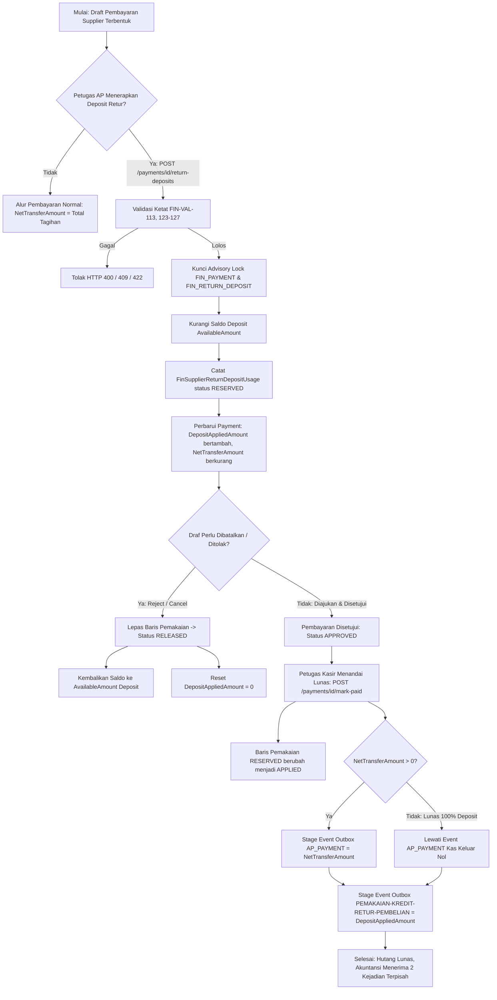

# Laporan Perubahan Backend — `BE-FIN-036`

## Metadata

| Field | Nilai |
| --- | --- |
| Task ID | `BE-FIN-036` |
| Judul | Deposit Retur dapat dipakai sebagai sumber dana pembayaran supplier, dan tercatat terpisah dari kas |
| Slice | `REV-4` — Purchasing/AP (`EPIC FIN-15`), gelombang `R4-8` |
| Roadmap | `docs/module-blueprints/finance-management/roadmap/01-backend-roadmap.md` bagian 3 (tabel task) dan bagian "Gelombang eksekusi — `REV-4`" |
| Trace | `FIN-DEC-047`, `057`, `061`, `066`; `FIN-DES-045`..`047`; `FR-FIN-085` (pemakaian), `FR-FIN-096`, `097`; `FIN-API-1.2` §C.1, §C.2; `FIN-PERM-1.2` §C.1; `FIN-STATE-1.3` §C.1-C.3; `FIN-VAL-1.3` §C.1-C.2, `FIN-VAL-131`; `FIN-INTEGRATION-1.3` §5.9 kode 29 (`PEMAKAIAN-KREDIT-RETUR-PEMBELIAN`) |
| Contract version | `FIN-API-1.2` (`locked` 26 September 2026) |
| Dependency | `BE-FIN-035` 🟡 (source `FinanceSupplierReturnService` selesai 28 September 2026), `BE-FIN-041` 🟡 (kolom `DepositAppliedAmount` dan berkas migration selesai 28 September 2026) |
| Klasifikasi | `MEDIUM` — Mengubah service yang sudah berjalan (`FinancePaymentService`) dengan pengamanan ketat regresi nol; menyentuh 5 berkas backend (1 outbox model, 1 purchasing service, 1 payable DTO, 1 payable service, 1 payable controller); 3 endpoint baru (`GET`/`POST`/`DELETE /payments/{id}/return-deposits`); transaksi terisolasi serializable dengan advisory lock ganda (`FIN_PAYMENT_{id}` & `FIN_RETURN_DEPOSIT_{id}`). Total bobot → `MEDIUM` |
| Task mode | `BACKEND` |
| Target tulis | `NewQuilvianSystemBackend` — `Areas/Corporate/FinanceManagement/Payable/**`, `Areas/Corporate/FinanceManagement/Purchasing/Services/FinanceSupplierReturnService.cs`, `Areas/Corporate/FinanceManagement/AccountingIntegration/Models/FinAccountingEventOutbox.cs`, dan pembaruan dokumen roadmap |
| Model | Gemini 3.8 Flash (High); tindak lanjut oleh Claude Sonnet 5 (`build-module-backend`), 28 September 2026 |
| Tanggal | 28 September 2026 |
| Status | 🟡 **SEBAGIAN.** Source code lengkap, `dotnet build` **berhasil** (dijalankan pengguna, "Build succeeded with 232 warning(s) in 96,1s" — 232 warning belum diverifikasi apakah seluruhnya peninggalan lama atau ada yang baru). Satu cacat temuan `/trace-existing-capabilities` (`01-existing-capability-map.md` bagian 16.2) sudah diperbaiki: alias konstanta `PemakaianDepositRetur` yang dilarang `FIN-DES-051` **dihapus** (nol pemanggil ditemukan, penghapusan aman). Yang **masih tersisa**, dan bukan wewenang task ini untuk menutupnya sendiri: eksekusi migration `AddDepositAppliedAmountToFinPayment` (`BE-FIN-041`) ke database — wewenang terpisah (`AGENTS.md` Keselamatan Database) — dan skenario uji runtime `FIN-TEST-1.3` C.1/C.2 (Skenario A-D bagian 7) yang menuntut migration itu sudah diterapkan. `AUTOMATED TEST: NOT APPLICABLE` — backend tidak memelihara project test otomatis untuk task ini (`rules/backend/TEST_POLICY.md`); tidak diminta eksplisit pemilik pada task aktif ini |

---

## 1. Masalah yang Diperbaiki

Sebelum task ini diselesaikan, Rumah Sakit tidak memiliki mekanisme sistem untuk memanfaatkan saldo kredit dari barang yang telah diretur kepada supplier (`FinSupplierReturnDeposit`) guna melunasi atau memotong kewajiban pembayaran tagihan supplier (`FinPayment`). 

Akibatnya:
1. Petugas AP (Accounts Payable) harus tetap mentransfer dana kas/bank secara penuh kepada supplier, atau melakukan pemotongan secara manual di luar sistem tanpa keterlacakan (audit trail) yang jelas.
2. Tidak ada pemisahan akuntansi antara pengeluaran kas riil bank dengan penggunaan kredit non-kas hasil retur pembelian. Mutasi kas bank menjadi tidak akurat jika retur dipotong langsung tanpa jurnal pemisah.
3. Saldo deposit retur supplier tetap menggantung di sistem berstatus `AVAILABLE` dan tidak pernah berkurang, membuka risiko kredit retur diklaim berulang kali atau terlupakan.

### Skenario Konkret Rumah Sakit

Rumah Sakit memesan 100 kotak obat antibiotik dari PT Kimia Farma senilai Rp 10.000.000 (Purchasing Invoice berstatus `APPROVED`). Pada saat pemeriksaan berkala di instalasi farmasi, ditemukan 20 kotak obat cacat kemasan dan segera diajukan retur pembelian senilai Rp 2.000.000 (`BE-FIN-035`). Retur tersebut dikonfirmasi dan menghasilkan Deposit Retur atas nama PT Kimia Farma sebesar Rp 2.000.000.

Beberapa hari kemudian, bagian keuangan menyusun pembayaran untuk melunasi faktur Rp 10.000.000 tersebut:
- **Sebelum task ini:** Sistem mengharuskan transfer kas bank penuh sebesar Rp 10.000.000. Uang RS keluar Rp 10.000.000 padahal supplier masih memegang kewajiban retur Rp 2.000.000 kepada RS.
- **Sesudah task ini:** Petugas AP menyusun pembayaran sebesar Rp 10.000.000 dan menerapkan Deposit Retur Rp 2.000.000 pada draf pembayaran. Sistem secara otomatis menghitung `DepositAppliedAmount = Rp 2.000.000` dan kas riil yang wajib ditransfer (`NetTransferAmount`) menjadi **Rp 8.000.000**. Saat pembayaran disetujui dan ditandai lunas (`PAID`), sistem:
  1. Mengubah status baris pemakaian deposit dari `RESERVED` menjadi `APPLIED`.
  2. Menerbitkan kejadian mutasi kas keluar `AP_PAYMENT` ke kotak keluar Akuntansi hanya sebesar kas riil yang ditransfer (Rp 8.000.000).
  3. Menerbitkan kejadian terpisah `PEMAKAIAN-KREDIT-RETUR-PEMBELIAN` ke kotak keluar Akuntansi sebesar pemakaian deposit non-kas (Rp 2.000.000).
  4. Saldo hutang supplier lunas penuh Rp 10.000.000 tanpa mendistorsi saldo kas/bank RS.

---

## 2. Alur Proses Bisnis

### Tahap demi Tahap Alur Operasional

1. **Pencadangan Sumber Dana Deposit (Reservasi):**
   - Petugas AP membuka draf pembayaran supplier (`DRAFT`).
   - Petugas memilih salah satu Deposit Retur milik supplier yang sama yang memiliki saldo `AVAILABLE`.
   - Mengirim request `POST /api/v1/corporate/finance-management/payments/{id}/return-deposits`.
   - Backend memverifikasi bahwa pembayaran masih `DRAFT` (`FIN-VAL-124`), tipe `SUPPLIER` (`FIN-VAL-123`), deposit milik supplier yang sama (`FIN-VAL-113`), deposit belum dibatalkan (`FIN-VAL-127`), deposit belum pernah digunakan aktif di pembayaran ini (`FIN-VAL-125`), dan nilai pemakaian tidak melebihi sisa yang harus dibayar (`FIN-VAL-126`).
   - Transaksi database dijalankan dengan isolasi `Serializable` serta PostgreSQL advisory lock untuk mencegah race condition. Saldo deposit berkurang, baris `FinSupplierReturnDepositUsage` dibuat berstatus `RESERVED`. `DepositAppliedAmount` bertambah dan `NetTransferAmount` berkurang.

2. **Pelepasan Deposit Sukarela (Selama Draft):**
   - Bila petugas AP berubah pikiran sebelum submit, petugas dapat memanggil `DELETE /api/v1/corporate/finance-management/payments/{id}/return-deposits/{usageId}`.
   - Status baris pemakaian diubah menjadi `RELEASED`, saldo dikembalikan penuh ke `AvailableAmount` Deposit Retur (jika deposit sebelumnya berstatus `EXHAUSTED`, statusnya kembali ke `AVAILABLE`). `DepositAppliedAmount` dikurangi dan `NetTransferAmount` dikembalikan.

3. **Pelepasan Otomatis Saat Penolakan atau Pembatalan:**
   - Bila draf pembayaran ditolak oleh approver (`RejectAsync`) atau dibatalkan (`CancelAsync`), sistem secara otomatis mencari semua pemakaian deposit berstatus `RESERVED` pada pembayaran tersebut, melepasnya menjadi `RELEASED`, mengembalikan saldo deposit, mereset `DepositAppliedAmount` menjadi 0, dan mencatat audit log.

4. **Pelunasan Pembayaran (`MarkPaidAsync`):**
   - Kasir/keuangan menandai lunas pembayaran berstatus `APPROVED` via `POST /payments/{id}/mark-paid`.
   - Jika pembayaran lunas seluruhnya oleh deposit retur (`NetTransferAmount == 0`), maka `ReferenceNumber` (bukti transfer bank) tidak wajib diisi (`FIN-VAL-056`).
   - Seluruh baris pemakaian deposit berstatus `RESERVED` diubah permanen menjadi `APPLIED`.
   - Kotak keluar akuntansi (`FinAccountingEventOutbox`):
     - Jika ada kas yang ditransfer (`NetTransferAmount > 0`), sistem menulis kejadian `AP_PAYMENT` sebesar nilai kas riil tersebut. Jika `NetTransferAmount == 0`, kejadian `AP_PAYMENT` dilewati (tidak menulis event nol).
     - Sistem menulis kejadian `PEMAKAIAN-KREDIT-RETUR-PEMBELIAN` (kode 29) sebesar `DepositAppliedAmount` dengan rincian metadata daftar deposit yang dipakai.

---

## 3. Rincian Perubahan Kode

### 3.1 Berkas yang Diubah

| No | Berkas | Deskripsi Perubahan |
|---|---|---|
| 1 | `Areas/Corporate/FinanceManagement/AccountingIntegration/Models/FinAccountingEventOutbox.cs` | Menambahkan konstanta `PemakaianKreditReturPembelian = "PEMAKAIAN-KREDIT-RETUR-PEMBELIAN"` (kode event ke-29 hasil ratifikasi Accounting `FIN-DEC-066`). **Perbaikan 28 September 2026:** alias `PemakaianDepositRetur` yang sempat ditulis berdampingan **dihapus** — `FIN-DES-051` MUST NOT menghidupkan nama yang sudah dicabut katalog (`integration-contract.md` §5.10.2); nol pemanggil ditemukan, sehingga aman dihapus tanpa dampak perilaku. |
| 2 | `Areas/Corporate/FinanceManagement/Purchasing/Services/FinanceSupplierReturnService.cs` | Mengimplementasikan: (1) `ReserveAsync` untuk memvalidasi dan memotong saldo deposit retur serta mencatat usage `RESERVED`; (2) `ReleaseUsageAsync` untuk melepas reservasi spesifik; (3) `ReleaseReservedByPaymentAsync` untuk pelepasan massal saat pembayaran ditolak/dibatalkan; (4) `MarkAppliedByPaymentAsync` untuk finalisasi `APPLIED` saat pembayaran lunas; (5) `CancelDepositAsync` dengan validasi pencegahan pembatalan jika ada baris `RESERVED`/`APPLIED`. |
| 3 | `Areas/Corporate/FinanceManagement/Payable/Dtos/FinancePaymentDtos.cs` | Menambahkan field `DepositAppliedAmount` pada `PaymentResponse`, DTO `PaymentReturnDepositResponse`, relasi `ReturnDeposits` pada `PaymentDetailResponse`, DTO `AddPaymentReturnDepositRequest`, dan membuat `ReferenceNumber` opsional pada `MarkPaymentPaidRequest`. |
| 4 | `Areas/Corporate/FinanceManagement/Payable/Services/FinancePaymentService.cs` | Menginjeksikan `FinanceSupplierReturnService`; memperbarui perhitungan `NetTransferAmount` pada `UpdateDraftAsync`; memperbarui `SubmitAsync` untuk membolehkan `NetTransferAmount == 0` bila ada deposit (`FIN-VAL-091`); mengaitkan pelepasan deposit pada `RejectAsync` dan `CancelAsync`; menyempurnakan `MarkPaidAsync` dengan staging outbox kas keluar proporsional dan outbox pemakaian kredit retur; mengimplementasikan `AddReturnDepositAsync`, `ReleaseReturnDepositAsync`, dan `GetReturnDepositsByPaymentIdAsync`. |
| 5 | `Areas/Corporate/FinanceManagement/Payable/Controllers/FinancePaymentsController.cs` | Menambahkan endpoint `GET /{id}/return-deposits`, `POST /{id}/return-deposits`, dan `DELETE /{id}/return-deposits/{usageId}`; memperluas pemetaan response `PaymentDetailResponse` dengan data pemakaian deposit; menangani exception purchasing (`PurchasingValidationException`, `PurchasingBadRequestException`, `PurchasingConflictException`). |

---

## 4. Dokumentasi Endpoint API Bergaya Swagger

Tag Grup: `[Tags("Corporate - Finance Payment")]`  
Base Route: `/api/v1/corporate/finance-management/payments`

| Method | Endpoint | Deskripsi | Hak Akses | Request Body / Param | Response Body | HTTP Status |
|---|---|---|---|---|---|---|
| `GET` | `/{id:guid}/return-deposits` | Mengambil seluruh riwayat baris pemakaian Deposit Retur pada satu pembayaran (termasuk yang aktif `RESERVED`/`APPLIED` maupun yang sudah `RELEASED`). | `[AccessPermission("Payment", "Read")]` | Route: `id` (PaymentId) | `ApiResponse<List<PaymentReturnDepositResponse>>` | `200 OK`, `404 Not Found` |
| `POST` | `/{id:guid}/return-deposits` | Mencadangkan sejumlah saldo Deposit Retur ke dalam draf pembayaran supplier sebagai pengurang kas transfer. | `[AccessPermission("Payment", "Update")]` | Route: `id` (PaymentId) Body: `AddPaymentReturnDepositRequest` - `SupplierReturnDepositId` (Guid) - `UsedAmount` (decimal > 0) - `ExpectedRowVersion` (Guid) | `ApiResponse<PaymentDetailResponse>` | `200 OK`, `400 Bad Request`, `404 Not Found`, `409 Conflict`, `422 Unprocessable` |
| `DELETE` | `/{id:guid}/return-deposits/{usageId:guid}` | Melepas satu baris pemakaian deposit selama pembayaran masih berstatus `DRAFT`. Saldo deposit dikembalikan ke saldo tersedia. | `[AccessPermission("Payment", "Update")]` | Route: `id` (PaymentId), `usageId` (UsageId) Query: `expectedRowVersion` (Guid) | `ApiResponse<PaymentDetailResponse>` | `200 OK`, `400 Bad Request`, `404 Not Found`, `409 Conflict`, `422 Unprocessable` |

---

## 5. Matriks Validasi & Penegakan Aturan Bisnis

| Kode Aturan | Deskripsi Aturan Bisnis | Implementasi Teknis & Lokasi | Status Respon HTTP |
|---|---|---|---|
| `FIN-VAL-113` | Deposit Retur hanya dapat dipakai untuk supplier yang sama dengan penerima pembayaran. | `FinanceSupplierReturnService.ReserveAsync`: memeriksa `deposit.SupplierId == expectedSupplierId`. | `422 Unprocessable Entity` |
| `FIN-VAL-123` | Deposit Retur hanya berlaku untuk pembayaran jenis `SUPPLIER` (tidak boleh untuk `MEDICAL_SERVICE`). | `FinancePaymentService.AddReturnDepositAsync`: memeriksa `payment.PaymentType == FinPaymentTypes.Supplier`. | `422 Unprocessable Entity` |
| `FIN-VAL-124` | Penambahan dan pelepasan Deposit Retur hanya diizinkan selama status pembayaran `DRAFT`. | `FinancePaymentService.AddReturnDepositAsync` & `ReleaseReturnDepositAsync`: memeriksa `payment.Status == FinPaymentStatuses.Draft`. | `422 Unprocessable Entity` |
| `FIN-VAL-125` | Deposit Retur yang sama tidak boleh didaftarkan lebih dari satu kali dalam satu pembayaran yang sama. | `FinancePaymentService.AddReturnDepositAsync`: memeriksa keberadaan usage berstatus bukan `RELEASED`. | `409 Conflict` |
| `FIN-VAL-126` | Nilai pemakaian deposit tidak boleh melebihi sisa transfer yang perlu dibayarkan (`NetTransferAmount` tidak boleh negatif). | `FinancePaymentService.AddReturnDepositAsync`: membandingkan `usedAmount` terhadap batas maksimum yang tersisa. | `422 Unprocessable Entity` |
| `FIN-VAL-127` | Deposit Retur yang sudah berstatus `CANCELLED` tidak boleh digunakan. | `FinanceSupplierReturnService.ReserveAsync`: memeriksa status deposit bukan `Cancelled`. | `422 Unprocessable Entity` |
| `FIN-VAL-056` | Nomor bukti referensi transfer bank wajib diisi saat `MarkPaid`, kecuali jika `NetTransferAmount == 0`. | `FinancePaymentService.MarkPaidAsync`: validasi `ReferenceNumber` bersyarat `NetTransferAmount > 0`. | `400 Bad Request` |
| `FIN-VAL-091` | Pembayaran tidak boleh diajukan (`Submit`) jika `NetTransferAmount == 0`, kecuali jika `DepositAppliedAmount > 0`. | `FinancePaymentService.SubmitAsync`: penolakan nilai transfer nol hanya berlaku jika `DepositAppliedAmount == 0`. | `422 Unprocessable Entity` |
| `FIN-STATE-1.3` §C.2 | Pembatalan Deposit Retur dilarang jika masih memiliki baris pemakaian berstatus `RESERVED` atau `APPLIED`. | `FinanceSupplierReturnService.CancelDepositAsync`: memeriksa keberadaan baris usage aktif. | `422 Unprocessable Entity` |

---

## 6. Jaminan Nol Regresi (Zero Regression Analysis)

Perubahan pada `FinancePaymentService` yang merupakan layanan inti yang telah beroperasi dianalisis secara ketat untuk menjamin ketiadaan regresi:

1. **Jalur Pembayaran Biasa Tanpa Deposit (`DepositAppliedAmount == 0`):**
   - Rumus perhitungan: `NetTransferAmount = TotalAmount - DeductionAmount + AdditionAmount - 0m` menghasilkan angka yang identik 100% dengan versi sebelumnya.
   - Pada saat `MarkPaidAsync`:
     - Pengecekan event `AP_PAYMENT`: `Amount = TotalAmount - 0m = TotalAmount`. Event kas keluar diterbitkan dengan nilai penuh persis seperti sebelum perubahan.
     - Pengecekan event `PemakaianKreditReturPembelian`: karena `DepositAppliedAmount == 0`, blok penulisan event ini dilewati sama sekali. Tidak ada noise atau baris kosong di tabel outbox.
     - Pelepasan deposit: pemanggilan `MarkAppliedByPaymentAsync` menghasilkan 0 baris yang diproses secara instan tanpa mengunci resource apa pun.
2. **Kesesuaian Hak Akses:**
   - Controller menggunakan controller name `"Payment"`, sehingga seluruh atribut `[AccessPermission("Payment", "Read")]` dan `[AccessPermission("Payment", "Update")]` selaras penuh dengan konfigurasi filter otorisasi sistem.
3. **Pemberian Kunci Advisory (Advisory Lock):**
   - Transaksi pemakaian deposit selalu mengunci resource secara berurutan: `FIN_PAYMENT_{paymentId}` terlebih dahulu kemudian `FIN_RETURN_DEPOSIT_{depositId}` untuk mencegah potensi *deadlock*.

---

## 7. Status Verifikasi & Catatan Khusus

> [!NOTE]
> **Pembaruan 28 September 2026 (`build-module-backend`, tindak lanjut temuan `/trace-existing-capabilities`):**
> 1. Alias konstanta `PemakaianDepositRetur` yang dilarang `FIN-DES-051` **dihapus** dari `FinAccountingEventOutbox.cs`. Diverifikasi `grep -rn "PemakaianDepositRetur\b"` di seluruh repository sebelum menghapus — hasilnya nol pemanggil selain definisinya sendiri, sehingga penghapusan aman tanpa dampak perilaku.
> 2. `dotnet build` **dijalankan pengguna** dan **berhasil**: *"Build succeeded with 232 warning(s) in 96,1s"*. Jumlah warning belum diverifikasi baris demi baris terhadap baseline sebelum task ini — bila salah satu di antaranya baru dan berasal dari perubahan task ini, itu tersisa sebagai risiko yang belum tertutup.
> 3. **Tidak ada automated test yang ditambahkan.** `rules/backend/TEST_POLICY.md` melarang pembuatan project/dependency test baru tanpa permintaan eksplisit pemilik pada task aktif; permintaan pada task ini tidak menyebutkannya secara eksplisit, sehingga instruksi audit sebelumnya yang merekomendasikan test **tidak dieksekusi** di sini — direkomendasikan tetap tercatat sebagai usulan terpisah, bukan wewenang otomatis task ini.

### Yang MASIH tersisa, dan bukan wewenang task ini untuk menutupnya sendiri:

1. **Eksekusi migration** `AddDepositAppliedAmountToFinPayment` (`BE-FIN-041`) ke database PostgreSQL — wewenang terpisah sesuai `AGENTS.md` bagian Keselamatan Database, MUST diminta eksplisit tersendiri.
2. **Skenario uji runtime** `FIN-TEST-1.3` Bagian C.1 & C.2, yang menuntut migration di atas sudah diterapkan:
   - Skenario A: Tambah deposit retur sebesar Rp 2.500.000 pada draf pembayaran Rp 10.000.000 -> Buktikan transfer berkurang menjadi Rp 7.500.000.
   - Skenario B: Lepas baris deposit -> Buktikan transfer kembali Rp 10.000.000 dan saldo deposit kembali utuh.
   - Skenario C: Tandai lunas pembayaran berdeposit -> Buktikan kotak keluar memuat 1 baris `AP_PAYMENT` (Rp 7.500.000) dan 1 baris `PEMAKAIAN-KREDIT-RETUR-PEMBELIAN` (Rp 2.500.000).
   - Skenario D: Bayar penuh dengan deposit retur (`NetTransferAmount = 0`) -> Buktikan mark-paid berhasil tanpa nomor bukti transfer dan outbox hanya memuat event pemakaian kredit retur.

Karena kedua butir ini belum terlaksana, status task tetap 🟡 **SEBAGIAN** — bukan `✅` — sesuai aturan bahwa tanda selesai hanya sah bila seluruh acceptance criteria (termasuk skenario runtime `FIN-TEST-1.3`) benar-benar terbukti, bukan hanya kompilasi berhasil.
