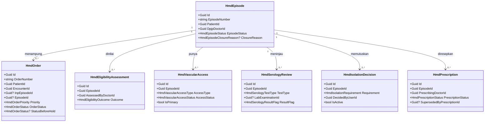
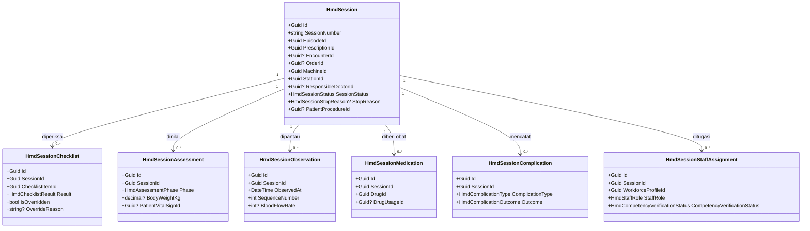
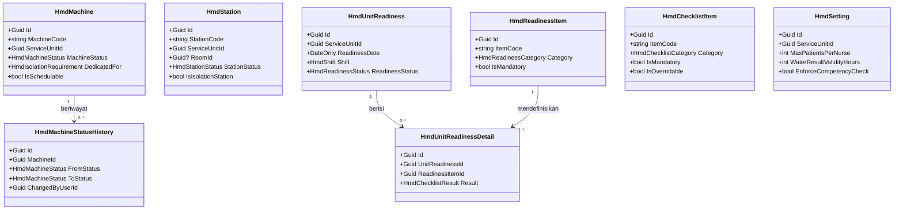
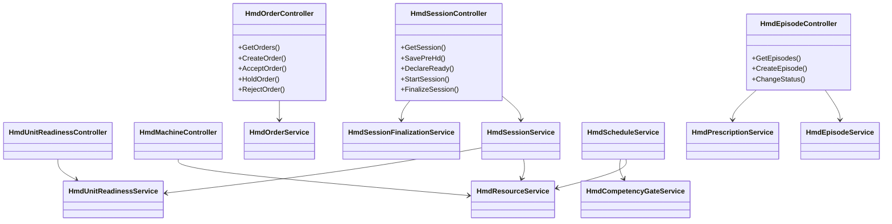

# Hemodialisa — Arsitektur Backend

| Field | Value |
|---|---|
| Blueprint ID | `HMD-BP-001` |
| Contract version | `HMD-CONTRACT-v1` — `last_changed_in: HMD-CONTRACT-v1`, status `approved` |
| Revision | `1` |
| Owner | Muhammad Hamzah (`HMD-DEC-006`) |
| `approved_by` / `approved_at` | Muhammad Hamzah / 2026-09-18T15:40:07+07:00 |
| Backend SHA | `190c91a0` — branch `MHamzah` |
| Frontend SHA | `a38683142` — branch `HamzahV2` |
| `input_revision` | `00-interview-decisions.md` r12; `01-existing-capability-map.md` r2; `HMD-RCG-001` r3 |
| `domain_architecture_readiness` | `DOMAIN_ARCHITECTURE_NOT_RUN` |
| Traceability | `HMD-DEC-001` s/d `HMD-DEC-013`; `CAP-01` s/d `CAP-40`; slice `S1` s/d `S12` |

> **Dokumen ini adalah rancangan, bukan kode.** Tidak ada satu baris pun yang sudah ada di
> repository. Seluruh tabel, endpoint, dan service di bawah berstatus **rencana**.

---

## 1. Bounded Context dan Kepemilikan

### 1.1 Batas konteks

Hemodialisa adalah **satu bounded context** bernama `HemodialysisManagement` di bawah Area
`HealthServices`, dengan prefix entity `Hmd` (`HMD-DEC-007`).

Batasnya satu kalimat: **Hemodialisa memiliki segala hal yang hanya bermakna di dalam unit cuci
darah**, dan tidak memiliki apa pun yang sudah bermakna di luar sana.

Contoh konkret pembedanya: status "mesin HD nomor 3 sedang diblokir" hanya bermakna di unit HD,
jadi Hemodialisa memilikinya. Sedangkan "Ibu Sinta lahir 12 Maret 1968" bermakna di seluruh
rumah sakit, jadi Hemodialisa **membacanya** dari Patient Management dan tidak pernah
menyalinnya.

### 1.2 Aggregate root dan invariant

Ada empat aggregate root. Aggregate root adalah pintu masuk tunggal: seluruh perubahan pada
anak-anaknya harus lewat dia, supaya aturan tidak bisa dibobol dari samping.

| Aggregate root | Anak-anaknya | Invariant yang dijaga |
|---|---|---|
| `HmdEpisode` | `HmdEligibilityAssessment`, `HmdVascularAccess`, `HmdSerologyReview`, `HmdIsolationDecision`, `HmdPrescription` | Satu pasien hanya boleh punya satu episode berstatus `Active` pada satu waktu. Resep berstatus `Active` juga hanya boleh satu per episode |
| `HmdSession` | `HmdSessionChecklist`, `HmdSessionAssessment`, `HmdSessionObservation`, `HmdSessionMedication`, `HmdSessionComplication`, `HmdSessionStaffAssignment` | Sesi `Finalized` tidak dapat diubah. Satu sesi memakai tepat satu mesin dan satu station, dan keduanya tidak boleh dipakai sesi lain yang waktunya bertumpang tindih |
| `HmdUnitReadiness` | `HmdUnitReadinessDetail` | Kesiapan unit menjadi `Ready` hanya bila seluruh butir wajib berstatus terpenuhi |
| `HmdOrder` | — | Permintaan tidak pernah menjadi sesi dengan sendirinya. Ia hanya dapat ditautkan ke sesi yang dibuat koordinator |

### 1.3 Batas transaksi dan pembatalan

| Operasi | Yang masuk satu transaksi | Bila gagal di tengah |
|---|---|---|
| Mulai sesi | Ubah status sesi, isi waktu mulai dan pelaku, buat `TrxPatientProcedure` berstatus `InProgress`, kunci mesin dan station | Seluruhnya dibatalkan. Sesi tetap `Ready`, tidak ada tindakan terbentuk, mesin tidak terkunci |
| Finalisasi sesi | Validasi kelengkapan, daftarkan dokumen ke daftar keutuhan Rekam Medis, tandatangani, ubah status sesi menjadi `Finalized`, selesaikan `TrxPatientProcedure` | Seluruhnya dibatalkan. Sesi tetap `AwaitingFinalization` |
| Serah terima ke Billing | **Di luar transaksi finalisasi.** Diterbitkan setelah transaksi finalisasi berhasil | Sesi **tetap** `Finalized`. Kegagalan masuk daftar percobaan ulang (`NFR-008` pada PRD) |
| Nyatakan unit siap | Ubah status seluruh butir kesiapan dan status induknya | Seluruhnya dibatalkan |

Pemisahan baris ketiga adalah yang paling penting dan paling mudah salah: **catatan klinis tidak
boleh dibuka kembali hanya karena Billing sedang gagal.**

---

## 2. Tabel Kepemilikan Data

Inilah pertahanan langsung terhadap duplikasi. Sumbernya `01-existing-capability-map.md` r2.

| Kelompok data | Modul pemilik | Dipakai modul ini | Dibuat ulang di modul ini |
|---|---|:---:|---|
| Identitas dan data induk pasien | Patient Management | Ya | **Tidak** — dirujuk lewat `PatientId` |
| Kunjungan pasien | Registration Management | Ya | **Tidak** — dirujuk lewat `EncounterId` |
| Episode rawat inap | Inpatient Management | Ya | **Tidak** — dirujuk lewat `InpEpisodeId`, boleh kosong |
| Dokter dan profil petugas | Human Resource | Ya | **Tidak** — dirujuk lewat `DoctorId` dan `WorkforceProfileId` |
| Kewenangan klinis petugas | Human Resource / Credentialing | Ya | **Tidak** — hanya status hasil pemeriksaan yang disimpan, bukan kewenangannya |
| Unit layanan dan ruang | Master Data | Ya | **Tidak** — dirujuk lewat `ServiceUnitId` dan `RoomId` |
| Master tindakan | Master Data | Ya | **Tidak** — tindakan HD didaftarkan sebagai baris `MstProcedure` |
| Tanda vital | Clinical Management | Ya | **Tidak** — vital klinis memakai `TrxPatientVitalSign` |
| Persetujuan tindakan | Clinical Management | Ya | **Tidak** — memakai `TrxPatientConsent` |
| Tindakan yang dapat ditagih | Clinical Management | Ya | **Tidak** — memakai `TrxPatientProcedure` |
| Hasil laboratorium | Laboratorium | Ya | **Tidak** — hanya rujukan hasil yang disimpan |
| Stok dan penyaluran obat | Farmasi | Ya | **Tidak** — pemakaian diteruskan ke `PhmDrugUsage` |
| Harga, tagihan, pembayaran | Billing dan Kasir | Ya | **Tidak** — hanya fakta tindakan selesai yang diserahkan |
| Keutuhan dan koreksi dokumen klinis | Rekam Medis | Ya | **Tidak** — memakai `MrcClinicalDocumentIntegrity` dan `MrcClinicalNoteAddendum` |
| **Permintaan HD masuk** | **Hemodialisa** | Ya | **Ya** — tidak ada padanannya; bentuknya menyalin `LabOrder`/`RadOrder` |
| **Program dan episode HD** | **Hemodialisa** | Ya | **Ya** — berbeda dari episode rawat inap |
| **Kelayakan, akses vaskular, isolasi** | **Hemodialisa** | Ya | **Ya** — keputusan operasional khas unit HD |
| **Resep HD** | **Hemodialisa** | Ya | **Ya** — parameter mesin tidak ada padanannya di modul mana pun |
| **Sesi HD beserta isinya** | **Hemodialisa** | Ya | **Ya** |
| **Mesin dan station HD** | **Hemodialisa** | Ya | **Ya** — tidak ada master alat medis di sistem; `MstBed` dipakai sebagai contoh bentuk, bukan disalin |
| **Kesiapan unit HD** | **Hemodialisa** | Ya | **Ya** |
| **Pengaturan unit HD** | **Hemodialisa** | Ya | **Ya** |

---

## 3. Class Diagram

Dipecah empat, mengikuti aggregate root, agar masing-masing muat dibaca dalam satu layar.

### 3.1 Permintaan dan program HD



### 3.2 Sesi HD



### 3.3 Sumber daya dan kesiapan unit



### 3.4 Service dan controller



---

## 4. Penjelasan Setiap Class

Seluruh class berstatus `Baru` kecuali disebut lain. Seluruh model mewarisi `IdentityModel`.

### 4.1 `HmdOrder`

| Aspek | Penjelasan |
|---|---|
| **Status** | `Baru` |
| **Lokasi file** | `Areas/HealthServices/HemodialysisManagement/Models/HmdOrder.cs` |
| Kategori | Transaksi |
| Tanggung jawab utama | Menampung permintaan cuci darah yang datang dari luar unit HD — dari bangsal rawat inap, poliklinik, atau IGD. Permintaan bukan jadwal: ia hanya menyatakan bahwa seseorang meminta pasien ini dicuci darah, beserta alasannya |
| Field penting | `OrderNumber`, `PatientId`, `EncounterId`, `InpEpisodeId`, `EpisodeId`, `Priority`, `ClinicalReason`, `RequestedByUserId`, `RequestingDoctorId`, `OrderStatus`, `StatusBeforeHold`, `DecisionReason` |
| Navigation property dan relasi | Menunjuk `MstPatient`, `RegPatientEncounter`, opsional `InpEpisode` dan `HmdEpisode` |
| Pemakaian dalam alur bisnis | Dibuat dokter atau perawat bangsal lewat layar layanan penunjang Rawat Inap. Koordinator unit HD menerima, menahan, atau menolaknya |
| Catatan desain | Permintaan **tidak pernah** berubah sendiri menjadi sesi. Bentuknya menyalin `LabOrder` dan `RadOrder` — `EncounterId` wajib, `InpEpisodeId` boleh kosong, status bermula di `Requested`, penahanan memakai `StatusBeforeHold` |
| Ekuivalen model lama | — |

### 4.2 `HmdEpisode`

| Aspek | Penjelasan |
|---|---|
| **Status** | `Baru` |
| **Lokasi file** | `Areas/HealthServices/HemodialysisManagement/Models/HmdEpisode.cs` |
| Kategori | Transaksi — aggregate root |
| Tanggung jawab utama | Mewakili satu program cuci darah seorang pasien. Satu episode dapat mencakup puluhan sesi selama berbulan-bulan, dan dapat melintasi banyak kunjungan rawat jalan maupun rawat inap |
| Field penting | `EpisodeNumber`, `PatientId`, `ServiceUnitId`, `DpjpDoctorId`, `StartDate`, `EndDate`, `EpisodeStatus`, `ClosureReason`, `ClosureNote` |
| Navigation property dan relasi | Menunjuk `MstPatient` dan `MstDoctor`; memiliki kelayakan, akses vaskular, tinjauan serologi, keputusan isolasi, resep, dan sesi |
| Pemakaian dalam alur bisnis | Dibuat petugas administrasi HD saat pasien pertama kali masuk program. Ditutup saat program selesai, pasien pindah, berhenti, atau meninggal |
| Catatan desain | **Bukan** `InpEpisode` dan tidak boleh disamakan dengannya. `EpisodeNumber` dialokasikan lewat penyedia nomor seri atomik, bukan hitung-tambah-satu |
| Ekuivalen model lama | — |

### 4.3 `HmdPrescription`

| Aspek | Penjelasan |
|---|---|
| **Status** | `Baru` |
| **Lokasi file** | `Areas/HealthServices/HemodialysisManagement/Models/HmdPrescription.cs` |
| Kategori | Transaksi |
| Tanggung jawab utama | Menyimpan instruksi dokter tentang bagaimana cuci darah dijalankan: berapa kali seminggu, berapa lama, target penarikan cairan, jenis antikoagulan, dan akses vaskular yang dipakai |
| Field penting | `EpisodeId`, `PrescribingDoctorId`, `EffectiveDate`, `FrequencyPerWeek`, `TargetDurationMinutes`, `TargetUltrafiltrationMl`, `DialysateFlowRate`, `BloodFlowRate`, `AnticoagulantPlan`, `VascularAccessId`, `PrescriptionStatus`, `SupersededByPrescriptionId` |
| Navigation property dan relasi | Milik `HmdEpisode`; menunjuk `MstDoctor` dan `HmdVascularAccess`; menunjuk resep pengganti |
| Pemakaian dalam alur bisnis | Dokter membuat draf, lalu mengaktifkannya. Perubahan instruksi membuat resep **baru** yang menggantikan yang lama |
| Catatan desain | Resep berstatus `Active` **tidak boleh** disunting. Perawat yang menjalankan sesi berbeda dari resep mencatat penyimpangannya pada sesi, bukan mengubah resep dokter |
| Ekuivalen model lama | — |

### 4.4 `HmdSession`

| Aspek | Penjelasan |
|---|---|
| **Status** | `Baru` |
| **Lokasi file** | `Areas/HealthServices/HemodialysisManagement/Models/HmdSession.cs` |
| Kategori | Transaksi — aggregate root |
| Tanggung jawab utama | Mewakili satu kali pelaksanaan cuci darah, dari dijadwalkan sampai catatannya dikunci |
| Field penting | `SessionNumber`, `EpisodeId`, `PrescriptionId`, `EncounterId`, `OrderId`, `MachineId`, `StationId`, `ResponsibleDoctorId`, `ScheduledDate`, `Shift`, `ScheduledStartAt`, `ScheduledEndAt`, `StartedAt`, `StartedByUserId`, `CompletedAt`, `SessionStatus`, `StopReason`, `StopNote`, `DocumentedByUserId`, `DocumentedAt`, `SignedByUserId`, `SignedAt`, `PatientProcedureId`, `IdempotencyKey` |
| Navigation property dan relasi | Milik `HmdEpisode`; menunjuk `HmdPrescription`, `HmdMachine`, `HmdStation`, opsional `RegPatientEncounter`, `HmdOrder`, dan `TrxPatientProcedure` |
| Pemakaian dalam alur bisnis | Dibuat koordinator saat menjadwalkan. Dipakai perawat sepanjang hari pelaksanaan. Dikunci setelah dokter mengesahkan |
| Catatan desain | **Dua pelaku disimpan terpisah** — `DocumentedByUserId` yang menyelesaikan dokumentasi dan `SignedByUserId` yang mengesahkan (syarat 2). `ResponsibleDoctorId` wajib terisi sebelum sesi boleh dimulai (`HMD-DEC-009`). `IdempotencyKey` mencegah tombol Mulai yang ditekan dua kali membuat dua sesi |
| Ekuivalen model lama | — |

### 4.5 `HmdSessionChecklist`

| Aspek | Penjelasan |
|---|---|
| **Status** | `Baru` |
| **Lokasi file** | `Areas/HealthServices/HemodialysisManagement/Models/HmdSessionChecklist.cs` |
| Kategori | Transaksi |
| Tanggung jawab utama | Menyimpan hasil pemeriksaan satu butir checklist Pra-HD pada satu sesi |
| Field penting | `SessionId`, `ChecklistItemId`, `Result`, `VerifiedByUserId`, `VerifiedAt`, `Note`, `IsOverridden`, `OverrideReason`, `OverriddenByUserId`, `OverriddenAt` |
| Navigation property dan relasi | Milik `HmdSession`; menunjuk `HmdChecklistItem` |
| Pemakaian dalam alur bisnis | Perawat mengisi sebelum sesi dinyatakan siap |
| Catatan desain | Pelewatan butir hanya sah bila butir masternya bertanda `IsOverridable = true`. Selama badan klinis belum memutuskan, seluruh butir bertanda `false` (`HMD-ASM-001`), sehingga bagian *override* terbangun tetapi tidak pernah aktif |
| Ekuivalen model lama | — |

### 4.6 `HmdSessionStaffAssignment`

| Aspek | Penjelasan |
|---|---|
| **Status** | `Baru` |
| **Lokasi file** | `Areas/HealthServices/HemodialysisManagement/Models/HmdSessionStaffAssignment.cs` |
| Kategori | Transaksi |
| Tanggung jawab utama | Mencatat siapa saja yang bertugas pada satu sesi, beserta hasil pemeriksaan kewenangan klinisnya |
| Field penting | `SessionId`, `WorkforceProfileId`, `StaffRole`, `CompetencyVerificationStatus`, `CompetencyCheckedAt`, `CompetencySourceReference` |
| Navigation property dan relasi | Milik `HmdSession`; menunjuk `MstWorkforceProfile` |
| Pemakaian dalam alur bisnis | Diisi koordinator saat menjadwalkan; diperbarui bila petugas berganti |
| Catatan desain | `CompetencyVerificationStatus` punya **tiga** nilai sejak awal (syarat 5). Selama pembacaan kewenangan dari Human Resource belum tersedia (`HMD-DEP-002`), nilainya `NotVerifiable` — **tidak boleh** diisi `Verified`. Penegakan dinyalakan lewat `HmdSetting.EnforceCompetencyCheck`, tanpa mengubah tabel |
| Ekuivalen model lama | — |

### 4.7 `HmdMachine`

| Aspek | Penjelasan |
|---|---|
| **Status** | `Baru` |
| **Lokasi file** | `Areas/HealthServices/HemodialysisManagement/Models/HmdMachine.cs` |
| Kategori | Master milik modul |
| Tanggung jawab utama | Daftar mesin cuci darah beserta status laik pakainya |
| Field penting | `MachineCode`, `MachineName`, `ServiceUnitId`, `SerialNumber`, `MachineStatus`, `DedicatedFor`, `IsSchedulable`, `LastStatusChangedAt` |
| Navigation property dan relasi | Menunjuk `MstServiceUnit`; punya riwayat status; dipakai banyak sesi |
| Pemakaian dalam alur bisnis | Dibuat sekali oleh admin unit. Statusnya berubah setiap kali mesin rusak, diperbaiki, atau dinyatakan laik kembali |
| Catatan desain | Diberi prefix `Hmd`, **bukan** `Mst`, dan ditempatkan di folder Hemodialisa. Lihat *Yang sengaja tidak dibuat* butir 1. `DedicatedFor` menyatakan mesin khusus, misalnya khusus pasien Hepatitis B |
| Ekuivalen model lama | — |

### 4.8 `HmdMachineStatusHistory`

| Aspek | Penjelasan |
|---|---|
| **Status** | `Baru` |
| **Lokasi file** | `Areas/HealthServices/HemodialysisManagement/Models/HmdMachineStatusHistory.cs` |
| Kategori | Transaksi |
| Tanggung jawab utama | Menyimpan setiap perpindahan status mesin beserta alasan dan pelakunya |
| Field penting | `MachineId`, `FromStatus`, `ToStatus`, `Reason`, `ChangedByUserId`, `ChangedAt` |
| Pemakaian dalam alur bisnis | Ditulis otomatis setiap kali status mesin diubah |
| Catatan desain | `FEAT-027` mewajibkan riwayat status disimpan. `MstBed` yang dipakai sebagai contoh bentuk **tidak** punya riwayat, jadi bagian ini memang tambahan Hemodialisa |
| Ekuivalen model lama | — |

### 4.9 `HmdSetting`

| Aspek | Penjelasan |
|---|---|
| **Status** | `Baru` |
| **Lokasi file** | `Areas/HealthServices/HemodialysisManagement/Models/HmdSetting.cs` |
| Kategori | Master milik modul |
| Tanggung jawab utama | Menyimpan angka dan sakelar yang wajar berbeda antar rumah sakit dan antar unit |
| Field penting | `ServiceUnitId`, `MaxPatientsPerNurse`, `EnforceNurseRatio`, `WaterResultValidityHours`, `EnforceCompetencyCheck`, `AllowMultipleActiveEpisodePerPatient`, `SessionStartGraceMinutes` |
| Pemakaian dalam alur bisnis | Dibaca setiap kali penjadwalan, pemeriksaan kesiapan, dan penugasan petugas dijalankan |
| Catatan desain | Ini yang memenuhi syarat 3 dan 5. Tidak satu pun angka ini boleh ditanam di kode maupun di frontend |
| Ekuivalen model lama | — |

### 4.10 Class model lain

Delapan model berikut mengikuti pola yang sama dan tidak diulang tabelnya. Seluruhnya `Baru`,
berada di `Areas/HealthServices/HemodialysisManagement/Models/`, dan kolom lengkapnya ada di
`data/data-dictionary.md`.

| Class | Tanggung jawab singkat | Induk |
|---|---|---|
| `HmdEligibilityAssessment` | Keputusan dokter apakah pasien layak menjalani HD, beserta alasannya | `HmdEpisode` |
| `HmdVascularAccess` | Jenis, lokasi, dan kondisi akses pembuluh darah yang dipakai | `HmdEpisode` |
| `HmdSerologyReview` | Rujukan hasil serologi dari Laboratorium beserta status tinjauannya | `HmdEpisode` |
| `HmdIsolationDecision` | Keputusan operasional apakah pasien perlu mesin atau ruang khusus | `HmdEpisode` |
| `HmdSessionAssessment` | Penilaian pra-HD dan pasca-HD, termasuk berat badan | `HmdSession` |
| `HmdSessionObservation` | Satu baris pemantauan pada satu waktu selama sesi berjalan | `HmdSession` |
| `HmdSessionMedication` | Catatan klinis pemberian obat selama sesi | `HmdSession` |
| `HmdSessionComplication` | Kejadian tidak diinginkan selama sesi beserta penanganannya | `HmdSession` |
| `HmdStation` | Kursi atau tempat tidur tempat pasien dicuci darah | — |
| `HmdChecklistItem` | Master butir checklist Pra-HD | — |
| `HmdReadinessItem` | Master butir pemeriksaan kesiapan unit | — |
| `HmdUnitReadiness` | Hasil pemeriksaan kesiapan unit pada satu tanggal dan shift | — |
| `HmdUnitReadinessDetail` | Hasil satu butir pemeriksaan kesiapan | `HmdUnitReadiness` |

### 4.11 Service

Seluruhnya `Baru`, di `Areas/HealthServices/HemodialysisManagement/Services/`, tanpa interface,
didaftarkan `AddScoped<TService>()` di `Program.cs`.

| Service | Fungsi utama | Dipanggil oleh | Membuka transaksi |
|---|---|---|---|
| `HmdOrderService` | Membuat, menerima, menahan, dan menolak permintaan HD | `HmdOrderController` | Ya |
| `HmdEpisodeService` | Mengelola episode, kelayakan, akses vaskular, serologi, dan isolasi | `HmdEpisodeController` | Ya |
| `HmdPrescriptionService` | Membuat, mengaktifkan, menggantikan, dan membatalkan resep | `HmdEpisodeController` | Ya |
| `HmdScheduleService` | Menjadwalkan sesi, memeriksa tabrakan, dan menyusun daftar kerja | `HmdSessionController` | Ya |
| `HmdSessionService` | Pra-HD, pernyataan siap, mulai, pemantauan, obat, komplikasi, pasca-HD | `HmdSessionController` | Ya |
| `HmdSessionFinalizationService` | Validasi kelengkapan, pendaftaran keutuhan dokumen, penandatanganan, penyelesaian tindakan | `HmdSessionController` | Ya |
| `HmdBillingHandoffService` | Menerbitkan fakta tindakan selesai ke Billing setelah finalisasi berhasil | `HmdSessionFinalizationService` | **Tidak** — sengaja di luar transaksi finalisasi |
| `HmdUnitReadinessService` | Membentuk dan menilai kesiapan unit per tanggal dan shift | `HmdUnitReadinessController` | Ya |
| `HmdResourceService` | Mengelola mesin, station, status, dan riwayatnya | `HmdMachineController`, `HmdStationController` | Ya |
| `HmdCompetencyGateService` | Memeriksa kewenangan klinis petugas dan mengembalikan salah satu dari tiga status | `HmdScheduleService`, `HmdSessionService` | Tidak |

### 4.12 Controller

Seluruhnya `Baru`, di `Areas/HealthServices/HemodialysisManagement/Controllers/`. Tidak satu pun
mengakses `ApplicationDbContext` langsung (`QBE-SVC-001`).

| Controller | Grup Swagger | Service yang dipakai |
|---|---|---|
| `HmdOrderController` | `Health Services / Hemodialysis Management / Hemodialysis Order` | `HmdOrderService` |
| `HmdEpisodeController` | `Health Services / Hemodialysis Management / Hemodialysis Episode` | `HmdEpisodeService`, `HmdPrescriptionService` |
| `HmdSessionController` | `Health Services / Hemodialysis Management / Hemodialysis Session` | `HmdScheduleService`, `HmdSessionService`, `HmdSessionFinalizationService` |
| `HmdUnitReadinessController` | `Health Services / Hemodialysis Management / Hemodialysis Unit Readiness` | `HmdUnitReadinessService` |
| `HmdMachineController` | `Health Services / Hemodialysis Management / Master Data / Hemodialysis Machine` | `HmdResourceService` |
| `HmdStationController` | `Health Services / Hemodialysis Management / Master Data / Hemodialysis Station` | `HmdResourceService` |
| `HmdSettingController` | `Health Services / Hemodialysis Management / Master Data / Hemodialysis Setting` | `HmdResourceService` |

---

## 5. Arsitektur Folder

```text
Areas/HealthServices/HemodialysisManagement/          # BARU — seluruh isinya rencana
├── Controllers/
│   ├── HmdOrderController.cs                         # Baru
│   ├── HmdEpisodeController.cs                       # Baru
│   ├── HmdSessionController.cs                       # Baru
│   ├── HmdUnitReadinessController.cs                 # Baru
│   ├── HmdMachineController.cs                       # Baru
│   ├── HmdStationController.cs                       # Baru
│   └── HmdSettingController.cs                       # Baru
├── DTOs/
│   ├── HmdOrderDtos.cs                               # Baru
│   ├── HmdEpisodeDtos.cs                             # Baru
│   ├── HmdPrescriptionDtos.cs                        # Baru
│   ├── HmdSessionDtos.cs                             # Baru
│   ├── HmdUnitReadinessDtos.cs                       # Baru
│   └── HmdResourceDtos.cs                            # Baru
├── Enums/
│   └── HemodialysisEnums.cs                          # Baru — seluruh enum modul dalam satu berkas
├── Models/                                           # 21 model, seluruhnya Baru
│   ├── HmdOrder.cs
│   ├── HmdEpisode.cs
│   ├── HmdEligibilityAssessment.cs
│   ├── HmdVascularAccess.cs
│   ├── HmdSerologyReview.cs
│   ├── HmdIsolationDecision.cs
│   ├── HmdPrescription.cs
│   ├── HmdSession.cs
│   ├── HmdSessionChecklist.cs
│   ├── HmdSessionAssessment.cs
│   ├── HmdSessionObservation.cs
│   ├── HmdSessionMedication.cs
│   ├── HmdSessionComplication.cs
│   ├── HmdSessionStaffAssignment.cs
│   ├── HmdMachine.cs
│   ├── HmdMachineStatusHistory.cs
│   ├── HmdStation.cs
│   ├── HmdChecklistItem.cs
│   ├── HmdReadinessItem.cs
│   ├── HmdUnitReadiness.cs
│   ├── HmdUnitReadinessDetail.cs
│   └── HmdSetting.cs
└── Services/                                         # 10 service, seluruhnya Baru
    ├── HmdOrderService.cs
    ├── HmdEpisodeService.cs
    ├── HmdPrescriptionService.cs
    ├── HmdScheduleService.cs
    ├── HmdSessionService.cs
    ├── HmdSessionFinalizationService.cs
    ├── HmdBillingHandoffService.cs
    ├── HmdUnitReadinessService.cs
    ├── HmdResourceService.cs
    └── HmdCompetencyGateService.cs

Repositories/Configurations/HealthServices/HemodialysisManagement/   # BARU
├── HmdOrderConfiguration.cs                          # Baru
├── HmdEpisodeConfiguration.cs                        # Baru
├── ... satu configuration per model, 21 berkas
└── HmdSettingConfiguration.cs                        # Baru

Migrations/
└── <timestamp>_AddHemodialysisManagement.cs          # Baru

# Berkas milik modul lain yang ikut berubah — Diperbarui, bukan Baru
Areas/HealthServices/MasterData/Enums/ServiceUnitType.cs                       # Diperbarui
Areas/HealthServices/MedicalRecordManagement/Enums/ClinicalDocumentKind.cs      # Diperbarui
Areas/HealthServices/MedicalRecordManagement/Services/
    └── ClinicalDocumentIntegrityService.cs                                     # Diperbarui — WAJIB, lihat §7
Program.cs                                                                      # Diperbarui — pendaftaran 10 service
Repositories/ApplicationDbContext.cs                                            # Diperbarui — 22 DbSet baru
```

**Catatan penempatan yang paling mudah salah:** file `Configuration` **tidak** berada di dalam
`Areas/`. Ia terpisah di `Repositories/Configurations/HealthServices/HemodialysisManagement/`.

**Utang teknis yang tidak boleh ditiru:** sebagian modul lama menempatkan entity master dengan
prefix `Mst` di dalam folder modulnya sendiri — contohnya `MstRadModality` di
`Areas/HealthServices/RadiologyManagement/Models/`. Hemodialisa **tidak meniru** pola itu; lihat
*Yang sengaja tidak dibuat* butir 1.

---

## 6. Status Model

| Model / berkas | Status | Kolom atau nilai yang berubah | Dampak migration |
|---|---|---|---|
| 22 model `Hmd*` | `Baru` | Seluruh kolom baru | 22 tabel baru, satu migration |
| `ServiceUnitType` | `Diperbarui` | Tambah satu nilai enum `Hemodialysis = 10` | Tidak ada perubahan skema — enum disimpan sebagai integer |
| `ClinicalDocumentKind` | `Diperbarui` | Tambah satu nilai enum `HemodialysisSession = 14` | Tidak ada perubahan skema |
| `ClinicalDocumentIntegrityService` | `Diperbarui` | Tambah `ClinicalDocumentKind.HemodialysisSession` ke himpunan `JenisYangDitegakkan` | Tidak ada perubahan skema — perubahan perilaku |
| `ApplicationDbContext` | `Diperbarui` | Tambah 22 `DbSet<Hmd*>` | Tidak ada perubahan skema di luar tabel baru |
| `Program.cs` | `Diperbarui` | Tambah 10 `AddScoped<...>()` | — |
| `TrxPatientProcedure` | `Sudah ada` | Tidak berubah | — |
| `MstProcedure` | `Sudah ada` | Tidak berubah; tindakan HD ditambahkan sebagai **data**, bukan kolom | — |

---

## 7. Dua Tempat, Bukan Satu — Penegakan Keutuhan Dokumen

Ini temuan paling mahal bila terlewat, dan sengaja diberi bagian sendiri.

Menambahkan `ClinicalDocumentKind.HemodialysisSession = 14` **tidak cukup**. Penegakan aturan
keutuhan dokumen bergantung pada himpunan tertutup di dalam service:

```csharp
// Areas/HealthServices/MedicalRecordManagement/Services/ClinicalDocumentIntegrityService.cs
private static readonly HashSet<ClinicalDocumentKind> JenisYangDitegakkan =
[
    ClinicalDocumentKind.ProgressNote,
    ClinicalDocumentKind.Consultation,
    ClinicalDocumentKind.Assessment,
    ClinicalDocumentKind.Procedure
    // ← HemodialysisSession WAJIB ditambahkan di sini juga
];
```

**Bila langkah kedua terlewat:** sesi difinalisasi, layar menampilkan `Finalized`, tetapi
`DitegakkanUntuk` mengembalikan `false`. Akibatnya dokumen tidak pernah terdaftar di daftar
keutuhan, `EnsureMutableAsync` tidak pernah menolak perubahan, dan catatan sesi yang seharusnya
terkunci **tetap bisa disunting**. Uji `HMD-AC-008` akan gagal tanpa pesan error apa pun yang
menjelaskan sebabnya.

Karena berkas itu milik modul Rekam Medis, perubahannya **wajib** dikoordinasikan dengan pemilik
Rekam Medis dan dicatat sebagai task tersendiri pada roadmap.

---

## 8. Rencana Migration

Satu migration untuk seluruh modul. Alasannya: 22 tabel ini saling merujuk dan tidak ada
satupun yang berguna sendirian, sehingga memecahnya menjadi beberapa migration hanya
menciptakan keadaan setengah jadi yang tidak pernah dipakai.

| # | Migration | Isi | Tanpa mematikan layanan? | Pengisian data lama | Langkah mundur |
|---:|---|---|:---:|---|---|
| 1 | `AddHemodialysisManagement` | 22 tabel baru beserta index, unique constraint, dan foreign key | **Ya** | Tidak ada — seluruh tabel baru dan kosong | `Down()` menghapus 22 tabel. Aman karena belum ada data |

**Mengapa aman dijalankan tanpa mematikan layanan:** migration ini hanya menambah tabel baru.
Ia tidak menyentuh satu pun tabel yang sedang dipakai, tidak mengubah kolom mana pun, dan tidak
mengunci tabel existing.

Dua perubahan enum — `ServiceUnitType` dan `ClinicalDocumentKind` — **tidak** memerlukan
migration, karena keduanya disimpan sebagai integer dan hanya menambah nilai baru di ujung.
Nilai lama tidak bergeser.

**Urutan pengerjaan yang mengikat:**

1. Baris registry `Hmd` ditambahkan dan di-*commit* lebih dulu — tanpa ini `QBE-MOD-002`
   menolak seluruh model (lihat `00-interview-decisions.md` bagian *Tindakan Lanjutan*).
2. Model, configuration, dan DbSet dibuat.
3. Migration dibuat dari model, bukan ditulis tangan.
4. Perubahan pada `ClinicalDocumentIntegrityService` dikerjakan sebagai task terpisah bersama
   pemilik Rekam Medis.

---

## 9. Rencana Data Master Awal

Modul dengan master kosong tidak dapat dipakai sama sekali. Enam tabel berikut wajib terisi
sebelum sesi pertama dapat dijalankan.

| Master | Isi minimum | Sumber nilai |
|---|---|---|
| `MstServiceUnit` | Satu baris unit Hemodialisa dengan `ServiceUnitType = Hemodialysis` | Admin master data rumah sakit |
| `MstProcedure` | Satu baris tindakan "Hemodialisis" beserta kode dan tarifnya | Katalog tindakan rumah sakit |
| `HmdMachine` | Seluruh mesin yang benar-benar ada di unit, beserta status awal `Ready` dan penanda mesin khusus | Inventaris unit HD |
| `HmdStation` | Seluruh kursi atau tempat tidur di unit, beserta penanda station isolasi | Denah unit HD |
| `HmdChecklistItem` | Dua belas butir checklist Pra-HD sesuai `FEAT-010`, **seluruhnya `IsOverridable = false`** | PRD `FR-HD-014`; nilai `IsOverridable` menunggu `HMD-GATE-002` |
| `HmdReadinessItem` | Butir kesiapan unit: mesin, station, pengolahan air, obat dan BMHP, staf | PRD `FR-HD-011` dan `FR-HD-012` |
| `HmdSetting` | Satu baris per unit HD | Kebijakan unit; nilai awal pada tabel di bawah |

### Nilai awal `HmdSetting`

| Kolom | Nilai awal | Sebabnya |
|---|---|---|
| `MaxPatientsPerNurse` | `3` | Mengikuti rujukan yang dikutip PRD; **belum** dikonfirmasi rumah sakit (`RCG-P-05`) |
| `EnforceNurseRatio` | `false` | Fail-closed terbalik disengaja: selama angkanya belum disahkan, rasio hanya ditampilkan sebagai peringatan, tidak menolak penjadwalan |
| `WaterResultValidityHours` | `720` (30 hari) | Nilai awal yang wajar; menunggu kebijakan unit (`RCG-M-04`) |
| `EnforceCompetencyCheck` | `false` | Wajib, karena `HMD-DEP-002` belum tersedia. Menyalakannya sekarang membuat seluruh penjadwalan tertolak |
| `AllowMultipleActiveEpisodePerPatient` | `false` | Aturan paling ketat sebagai bawaan (`RCG-M-05`) |
| `SessionStartGraceMinutes` | `60` | Toleransi mulai sesi terhadap jadwal |

### Dua belas butir `HmdChecklistItem`

| Kode | Butir | Kategori | Wajib | Boleh dilewati |
|---|---|---|:---:|:---:|
| `IDENTITY` | Identitas pasien cocok | Identitas | Ya | **Tidak** |
| `ENCOUNTER` | Konteks kunjungan sah | Identitas | Ya | **Tidak** |
| `EPISODE` | Episode HD aktif | Konteks klinis | Ya | **Tidak** |
| `PRESCRIPTION` | Resep HD aktif tersedia | Konteks klinis | Ya | **Tidak** |
| `CONSENT` | Persetujuan tindakan sah tersedia | Konteks klinis | Ya | **Tidak** |
| `ALLERGY` | Riwayat alergi ditinjau | Konteks klinis | Ya | **Tidak** |
| `VASCULAR_ACCESS` | Akses vaskular layak dipakai | Konteks klinis | Ya | **Tidak** |
| `ISOLATION` | Kebutuhan isolasi terpenuhi | Konteks klinis | Ya | **Tidak** |
| `MACHINE` | Mesin siap dan sesuai kebutuhan isolasi | Sumber daya | Ya | **Tidak** |
| `STATION` | Station tersedia | Sumber daya | Ya | **Tidak** |
| `WATER` | Pengolahan air dinyatakan siap | Sumber daya | Ya | **Tidak** |
| `SUPPLY` | Obat dan BMHP tersedia | Sumber daya | Ya | **Tidak** |

Seluruh baris bertanda **Tidak** pada kolom terakhir. Itu bukan kelalaian — itu `HMD-ASM-001`.
Badan klinis nanti cukup mengubah nilai kolom itu; tidak ada satu baris kode pun yang berubah.

---

## 10. Yang Sengaja Tidak Dibuat

| Yang ditolak | Alasan |
|---|---|
| `MstHemodialysisMachine` dan `MstHemodialysisStation` | Pemeriksa QBE menentukan pemilik dari **path folder**, lalu mewajibkan nama entity diawali prefix pemilik itu. Entity bernama `Mst*` di dalam folder `HemodialysisManagement` akan ditolak karena tidak diawali `Hmd`. Menaruhnya di `MasterData` juga tidak tepat, karena mesin HD hanya bermakna di unit HD. Karena itu dipakai `HmdMachine` dan `HmdStation` |
| `HmdPatient`, `HmdDoctor`, `HmdNurse` | Ketiganya sudah dimiliki Patient Management dan Human Resource. Dipakai lewat `PatientId`, `DoctorId`, dan `WorkforceProfileId` |
| `HmdEncounter` | Kunjungan dimiliki Registration Management. Hemodialisa juga **tidak** menambah `EncounterType.Hemodialysis`; pasien HD tetap masuk sebagai rawat jalan, rawat inap, atau gawat darurat sesuai konteksnya |
| `HmdConsent` | Persetujuan tindakan sudah lengkap di `TrxPatientConsent`, termasuk penjelasan risiko, penanda tangan, saksi, dan berkas |
| `HmdVitalSign` | Tanda vital klinis memakai `TrxPatientVitalSign`. Yang **tidak** dipaksakan masuk ke sana adalah parameter mesin seperti `QB`, `QD`, `TMP`, dan tekanan vena — keduanya konsep berbeda, dan parameter mesin tinggal di `HmdSessionObservation` |
| `HmdLabResult` | Hasil laboratorium dimiliki Laboratorium. Hemodialisa hanya menyimpan rujukan pada `HmdSerologyReview` |
| `HmdDrugStock` | Stok dimiliki Farmasi. Hemodialisa mencatat fakta pemberian klinis, lalu meneruskannya ke `PhmDrugUsage` |
| `HmdInvoice`, `HmdTariff`, `HmdPayment`, `HmdClaim` | Seluruhnya dimiliki Billing dan Kasir |
| `SourceDomain = HEMODIALYSIS` pada Billing | Sumber `Procedure` sudah terdaftar dan sah. Menambah sumber baru berarti menyentuh kontrak Billing tanpa kebutuhan |
| `HmdDocumentIntegrity` dan `HmdAddendum` | Keutuhan dan koreksi dokumen dimiliki Rekam Medis, dan endpoint-nya sudah generik per jenis dokumen. Yang dibutuhkan hanya menambahkan jenis dokumen baru di **dua** tempat |
| Tabel riwayat status sesi tersendiri | Perpindahan status sesi sudah terekam lewat kolom waktu dan pelaku pada `HmdSession` ditambah pencatatan logger. Tabel riwayat tersendiri baru diperlukan bila jumlah statusnya bertambah di luar dua belas yang ada |
| `HmdIntegrationOutbox` | Di luar scope Phase 1. Serah terima ke Billing memakai jalur fakta klinis yang sudah ada. Kebutuhan *outbox* baru muncul pada Phase 2 untuk SATUSEHAT, dan pemiliknya belum diputuskan (`HMD-CONF-002`) |
