# Hemodialisa — Alur Utama

| Field | Value |
|---|---|
| Blueprint ID | `HMD-BP-001` |
| Contract version | `HMD-CONTRACT-v1` — status `draft` |
| Owner | Muhammad Hamzah |

Diagram ini menggambarkan **jalur normal saja**, dari permintaan sampai catatan dikunci dan
tagihan terbit. Percabangan dan jalur gagal ada pada tiga berkas flowchart lainnya.

Nama keadaan pada diagram sama persis dengan `contracts/state-transition-matrix.md`.

---

## FLOW-HMD-MVP-001 — Dari permintaan sampai tagihan

```mermaid
flowchart TD
    subgraph bangsal[Dokter atau perawat unit peminta]
        A([Pasien perlu cuci darah]) --> B[Buat permintaan HD]
        B --> C[(Permintaan Requested)]
    end

    subgraph koordinator[Koordinator unit HD]
        C --> D[Terima permintaan]
        D --> E[(Permintaan Accepted)]
        E --> F[Tetapkan jadwal, mesin, station, perawat, dan dokter penanggung jawab]
        F --> G[(Sesi Scheduled)]
        G --> H[Periksa kesiapan unit pada shift itu]
        H --> I[(Kesiapan unit Ready)]
    end

    subgraph perawat[Perawat dialisis]
        I --> J[Tandai pasien datang]
        J --> K[(Sesi CheckedIn)]
        K --> L[Isi checklist dan penilaian sebelum tindakan]
        L --> M[(Sesi PreCheck)]
        M --> N[Nyatakan sesi siap]
        N --> O[(Sesi Ready)]
        O --> P[Mulai cuci darah]
        P --> Q[(Sesi InProgress)]
        Q --> R[Catat pemantauan berkala, obat, dan kejadian]
        R --> S[Isi penilaian setelah tindakan dan tujuan pasien]
        S --> T[(Sesi Completed)]
        T --> U[Selesaikan dokumentasi]
        U --> V[(Sesi AwaitingFinalization)]
    end

    subgraph dokter[Dokter penanggung jawab sesi]
        V --> W[Periksa dan sahkan catatan]
        W --> X[(Sesi Finalized)]
    end

    subgraph sistem[Sistem]
        X --> Y[Serahkan tindakan selesai ke penagihan]
        Y --> Z([Tagihan terbit, catatan terkunci])
    end
```

---

## Tabel langkah

| Langkah | Pelaku | Masukan yang dibutuhkan | Keluaran | Bila gagal |
|---|---|---|---|---|
| Buat permintaan HD | Dokter atau perawat unit peminta | Pasien terdaftar, kunjungan sah, alasan klinis | Permintaan berstatus `Requested` | Permintaan tidak terbentuk; petugas melengkapi alasan klinis lalu mengirim ulang |
| Terima permintaan | Koordinator unit HD | Permintaan yang masih menunggu | Permintaan berstatus `Accepted` | Bila permintaan sudah diproses orang lain, koordinator memuat ulang daftar dan melihat status terbarunya |
| Tetapkan jadwal dan sumber daya | Koordinator unit HD | Episode dan resep pasien yang aktif, mesin siap, station kosong, perawat bertugas, dokter penanggung jawab | Sesi berstatus `Scheduled` | Bila mesin atau station bentrok, koordinator memilih mesin, station, atau jam lain |
| Periksa kesiapan unit | Koordinator unit HD | Hasil pemeriksaan mesin, pengolahan air, obat dan bahan, serta staf | Kesiapan unit berstatus `Ready` | Bila ada butir yang belum terpenuhi, unit dinyatakan tidak siap dan sesi pada shift itu tidak dapat dinyatakan siap |
| Tandai pasien datang | Perawat dialisis | Pasien hadir, kunjungan sah untuk hari itu | Sesi berstatus `CheckedIn` | Bila kunjungan belum ada, petugas pendaftaran diminta melengkapinya lebih dulu |
| Isi checklist dan penilaian sebelum tindakan | Perawat dialisis | Berat badan, tanda vital, keluhan, kondisi akses, dan hasil pemeriksaan dua belas butir persiapan | Sesi berstatus `PreCheck` | Isian disimpan sebagian; perawat melanjutkan mengisi sampai lengkap |
| Nyatakan sesi siap | Perawat dialisis | Seluruh butir wajib terpenuhi, penilaian lengkap, unit siap, dokter penanggung jawab sudah ada | Sesi berstatus `Ready` | Bila ada yang belum terpenuhi, perawat melengkapinya atau menahan sesi |
| Mulai cuci darah | Perawat dialisis | Sesi siap, mesin masih siap saat itu juga, kunjungan masih sah | Sesi berstatus `InProgress`, waktu mulai dan pelakunya tercatat | Bila mesin berubah status, perawat memilih mesin lain lalu menyatakan siap kembali |
| Catat pemantauan, obat, dan kejadian | Perawat dialisis | Pengamatan tekanan darah, nadi, dan parameter mesin secara berkala | Riwayat pemantauan bertambah, tidak menimpa yang lama | Bila penyimpanan gagal, perawat mencoba lagi; pengamatan sebelumnya tidak hilang |
| Isi penilaian setelah tindakan | Perawat dialisis | Waktu selesai, berat badan akhir, cairan yang ditarik, tanda vital akhir, kondisi pasien, tujuan pasien | Sesi berstatus `Completed` | Bila belum lengkap, sesi belum dapat diselesaikan |
| Selesaikan dokumentasi | Perawat dialisis | Seluruh isian minimum sudah lengkap | Sesi berstatus `AwaitingFinalization`, nama dan waktu penyelesai tercatat | Bila ada isian minimum yang kosong, perawat melengkapinya |
| Periksa dan sahkan catatan | Dokter penanggung jawab sesi | Catatan sesi yang menunggu pengesahan | Sesi berstatus `Finalized`, catatan terkunci, nama dan waktu pengesah tercatat | Bila ada yang perlu diperbaiki, dokter mengembalikannya ke perawat beserta alasannya |
| Serahkan tindakan ke penagihan | Sistem | Tindakan pasien yang sudah selesai | Tagihan terbit satu kali | Bila penyerahan gagal, catatan **tetap** terkunci dan penyerahan masuk daftar untuk diulang |

---

## Yang perlu diperhatikan pembaca

**Permintaan tidak sama dengan jadwal.** Dokter bangsal meminta; koordinator unit HD yang
menentukan kapan, di mesin mana, dan dengan perawat siapa. Permintaan tidak pernah berubah
sendiri menjadi sesi.

**Cuci darah selesai secara fisik tidak sama dengan catatan selesai.** Setelah pasien pulang,
catatannya masih dilengkapi perawat lalu disahkan dokter. Dua langkah itu sengaja dipisah dan
dikerjakan dua orang berbeda.

**Kegagalan penagihan tidak pernah membuka kembali catatan klinis.** Ini satu-satunya jalur
pada diagram yang boleh gagal tanpa menghentikan apa pun di belakangnya.
