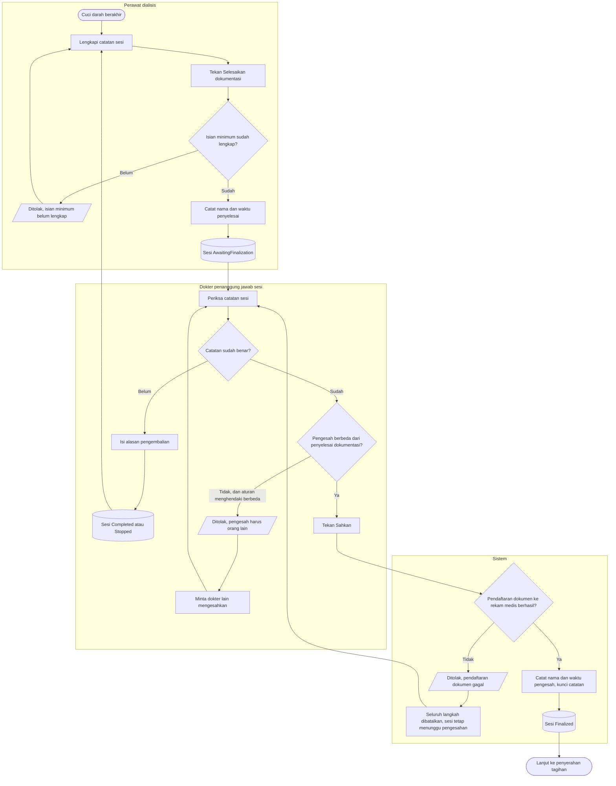
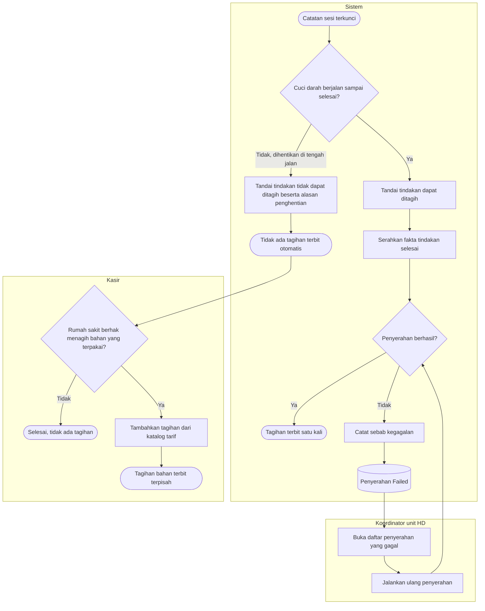
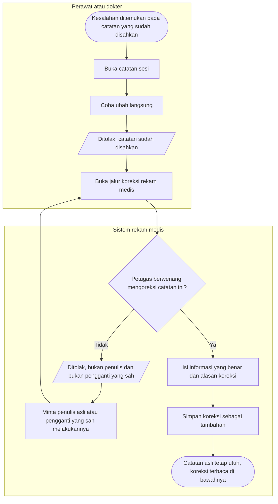

# Hemodialisa — Finalisasi, Penagihan, dan Koreksi

| Field | Value |
|---|---|
| Blueprint ID | `HMD-BP-001` |
| Contract version | `HMD-CONTRACT-v1` — status `draft` |
| Owner | Muhammad Hamzah |

Proses ini mencakup sejak cuci darah berakhir sampai catatannya terkunci, tagihannya terbit, dan
— bila kelak ditemukan kesalahan — dikoreksi tanpa mengubah catatan aslinya.

---

## 1. Menyelesaikan dokumentasi dan mengesahkan

### Tabel langkah

| Langkah | Pelaku | Masukan yang dibutuhkan | Keluaran | Bila gagal |
|---|---|---|---|---|
| Lengkapi catatan sesi | Perawat dialisis | Waktu selesai, berat badan akhir, cairan yang ditarik, tanda vital akhir, kondisi akses, kondisi pasien, tujuan pasien | Catatan tersimpan | Isian yang belum lengkap tetap tersimpan sebagian |
| Selesaikan dokumentasi | Perawat dialisis | Isian minimum lengkap | Sesi `AwaitingFinalization`, nama dan waktu penyelesai tercatat | Perawat melengkapi bagian yang kurang |
| Periksa catatan | Dokter penanggung jawab sesi | Catatan sesi yang menunggu pengesahan | Keputusan sahkan atau kembalikan | — |
| Kembalikan untuk dilengkapi | Dokter penanggung jawab sesi | Alasan pengembalian | Sesi kembali ke keadaan sebelumnya | Alasan wajib diisi agar perawat tahu bagian mana yang kurang |
| Sahkan dan kunci | Dokter penanggung jawab sesi | Catatan yang sudah benar | Sesi `Finalized`, catatan terkunci, nama dan waktu pengesah tercatat | Bila pendaftaran dokumen ke rekam medis gagal, seluruh langkah dibatalkan dan sesi tetap menunggu pengesahan |

### Yang perlu diperhatikan

**Dua orang, dua kolom.** Siapa yang menyelesaikan dokumentasi dan siapa yang mengesahkan
disimpan terpisah. Bila kelak badan klinis memutuskan satu orang saja cukup, kolom kedua tinggal
diisi orang yang sama — tidak ada tabel yang berubah.

**Pengesahan dan pendaftaran dokumen adalah satu paket.** Bila pendaftaran ke rekam medis gagal,
sesi **tidak** menjadi terkunci setengah jalan. Seluruhnya dibatalkan, dan dokter mengulang.

**Hanya dokter penanggung jawab sesi itu yang boleh mengesahkan** — bukan sembarang dokter yang
punya hak akses pengesahan. Pemeriksaan itu dilakukan aturan bisnis, karena mesin hak akses tidak
mengenal konsep "sesi yang mana".

---

## 2. Menyerahkan tindakan ke penagihan

### Tabel langkah

| Langkah | Pelaku | Masukan yang dibutuhkan | Keluaran | Bila gagal |
|---|---|---|---|---|
| Tentukan dapat ditagih atau tidak | Sistem | Cara sesi berakhir — selesai atau dihentikan | Tindakan bertanda dapat atau tidak dapat ditagih | — |
| Serahkan fakta tindakan selesai | Sistem | Tindakan pasien yang sudah selesai | Tagihan terbit satu kali | Kegagalan dicatat; **catatan klinis tetap terkunci** |
| Jalankan ulang penyerahan | Koordinator unit HD | Penyerahan yang berstatus gagal | Tagihan terbit | Pengulangan membawa penanda yang sama sehingga tidak pernah menghasilkan tagihan ganda |
| Tambahkan tagihan bahan | Kasir | Kewenangan menagih bahan yang terpakai, katalog tarif | Tagihan terpisah dari tagihan klinis | Bila rumah sakit tidak berhak menagih, tidak ada yang dilakukan |

### Yang perlu diperhatikan

**Ini satu-satunya jalur pada seluruh modul yang boleh gagal tanpa menghentikan apa pun.**
Catatan klinis sudah terkunci dan tidak dibuka kembali hanya karena penagihan sedang bermasalah.
Keduanya dua urusan yang berbeda.

**Sesi yang dihentikan di tengah jalan tidak menagih otomatis.** Tindakannya tetap tercatat
lengkap sebagai fakta klinis — mesin memang dipakai, bahan memang terbuang — tetapi tagihannya
tidak terbit sendiri. Bila rumah sakit memang berhak menagih bahan yang terpakai, kasir
menambahkannya dari katalog tarif, terpisah dan terlacak sendiri.

**Pengulangan tidak pernah menghasilkan dua tagihan.** Berapa kali pun dijalankan ulang,
penandanya sama, sehingga hanya satu tagihan yang terbentuk untuk satu sesi.

---

## 3. Mengoreksi catatan yang sudah terkunci

### Tabel langkah

| Langkah | Pelaku | Masukan yang dibutuhkan | Keluaran | Bila gagal |
|---|---|---|---|---|
| Coba ubah catatan yang sudah disahkan | Perawat atau dokter | — | Ditolak | Petugas beralih ke jalur koreksi |
| Periksa kewenangan koreksi | Sistem rekam medis | Identitas petugas, dokumen yang dikoreksi | Izin atau penolakan | Bila tidak berwenang, penulis asli atau penggantinya yang melakukannya |
| Buat koreksi | Perawat atau dokter berwenang | Informasi yang benar, alasan koreksi | Koreksi tersimpan sebagai tambahan beserta penulis dan waktunya | Alasan koreksi wajib diisi |

### Yang perlu diperhatikan

**Angka yang salah tidak pernah hilang.** Misalnya berat badan setelah tindakan tertulis 58,5 kg
padahal seharusnya 55,8 kg. Setelah dikoreksi, kedua angka tetap terbaca: yang asli sebagai
catatan awal, yang benar sebagai koreksi beserta alasan, penulis, dan waktunya. Inilah yang
membuat catatan klinis dapat dipertanggungjawabkan bertahun-tahun kemudian.

**Koreksi bukan penyuntingan.** Tidak ada satu pun jalur di modul ini yang menimpa isi catatan
klinis yang sudah disahkan.

**Prasyarat yang harus dipenuhi lebih dulu.** Agar penolakan pada langkah pertama benar-benar
terjadi, jenis dokumen sesi HD wajib didaftarkan pada **dua** tempat di sistem rekam medis. Bila
hanya satu yang dikerjakan, layar akan menampilkan catatan sudah disahkan tetapi perubahan
langsung **tetap diterima** — dan itu kegagalan yang tidak menampilkan pesan apa pun.
