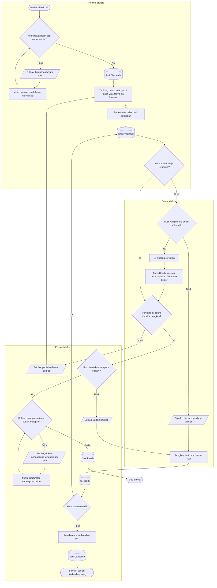
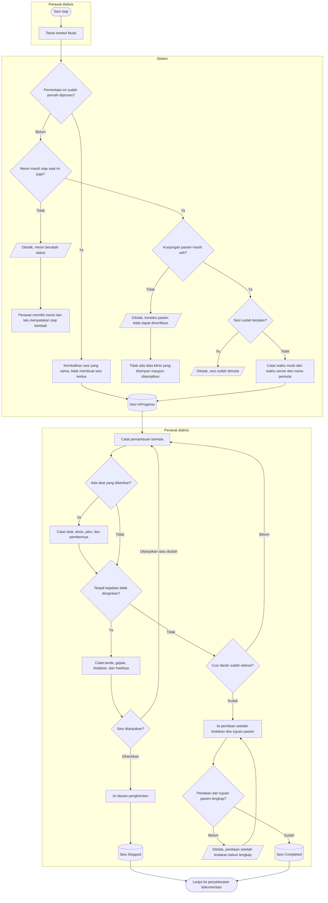

# Hemodialisa — Pelaksanaan Sesi

| Field | Value |
|---|---|
| Blueprint ID | `HMD-BP-001` |
| Contract version | `HMD-CONTRACT-v1` — status `draft` |
| Owner | Muhammad Hamzah |

Proses ini mencakup sejak pasien datang sampai cuci darah berakhir — baik karena selesai maupun
karena dihentikan.

---

## 1. Persiapan sebelum tindakan

### Tabel langkah

| Langkah | Pelaku | Masukan yang dibutuhkan | Keluaran | Bila gagal |
|---|---|---|---|---|
| Tandai pasien datang | Perawat dialisis | Pasien hadir, kunjungan sah hari itu | Sesi `CheckedIn` | Perawat meminta petugas pendaftaran melengkapi kunjungan lebih dulu |
| Isi penilaian sebelum tindakan | Perawat dialisis | Berat badan, tekanan darah, nadi, napas, suhu, saturasi, keluhan, kondisi akses | Penilaian tersimpan | Isian yang belum lengkap tetap tersimpan sebagian; perawat melanjutkan |
| Periksa dua belas butir persiapan | Perawat dialisis | Identitas, kunjungan, program, instruksi, persetujuan, alergi, akses, isolasi, mesin, station, air, bahan | Sesi `PreCheck` | Butir yang belum terpenuhi ditandai; perawat melengkapinya |
| Lewati satu butir | **Dokter dialisis** | Butir yang memang boleh dilewati, alasan tertulis | Butir ditandai dilewati beserta alasan, nama dokter, dan waktunya | Bila butir itu tidak boleh dilewati, permintaan ditolak; perawat melengkapinya atau menahan sesi |
| Nyatakan sesi siap | Perawat dialisis | Seluruh butir wajib terpenuhi atau dilewati secara sah, penilaian lengkap, unit siap, dokter penanggung jawab ada | Sesi `Ready` | Perawat melengkapi apa yang kurang, atau menahan sesi |
| Tahan sesi | Perawat dialisis | Alasan penahanan | Sesi `Held` | Alasan wajib diisi |
| Lanjutkan sesi yang ditahan | Perawat dialisis | Hambatan sudah teratasi | Sesi kembali `PreCheck` | — |

### Yang perlu diperhatikan

**Selama badan klinis belum menetapkan, tidak ada satu pun butir yang boleh dilewati.** Cabang
"boleh dilewati" pada diagram memang sudah dibangun, tetapi daftar butir yang boleh dilewati
kosong. Akibatnya setiap upaya melewati butir akan ditolak. Ketika badan klinis kelak
menetapkannya, cabang itu langsung bekerja tanpa satu baris kode pun berubah.

**Penahanan bukan pembatalan.** Sesi yang ditahan masih dapat dilanjutkan hari itu juga setelah
hambatannya teratasi. Sesi yang dibatalkan tidak dapat dihidupkan kembali.

---

## 2. Memulai dan menjalankan cuci darah

### Tabel langkah

| Langkah | Pelaku | Masukan yang dibutuhkan | Keluaran | Bila gagal |
|---|---|---|---|---|
| Tekan tombol Mulai | Perawat dialisis | Sesi berstatus siap | Sesi `InProgress`, waktu mulai dan pemulainya tercatat | Bila ditekan dua kali, permintaan kedua mengembalikan sesi yang sama — bukan sesi kedua |
| Pemeriksaan ulang sebelum mulai | Sistem | Status mesin dan kesahan kunjungan **saat itu juga** | Sesi boleh dimulai | Bila mesin berubah status, perawat memilih mesin lain lalu menyatakan siap kembali |
| Catat pemantauan berkala | Perawat dialisis | Tekanan darah, nadi, napas, suhu, saturasi, dan parameter mesin | Satu baris pemantauan baru; riwayat sebelumnya tidak berubah | Bila penyimpanan gagal, perawat mencoba lagi; pengamatan sebelumnya tetap ada |
| Catat pemberian obat | Perawat dialisis | Obat, dosis, satuan, jalur pemberian, pemberi instruksi | Catatan pemberian tersimpan lalu diteruskan ke Farmasi | Bila penerusan ke Farmasi gagal, catatan klinis **tetap tersimpan** dan penerusan diulang |
| Catat kejadian tidak diinginkan | Perawat dialisis | Tanda dan gejala, tindakan yang dilakukan, instruksi dokter, hasilnya | Catatan kejadian tersimpan beserta dampaknya pada sesi | Isian wajib harus lengkap |
| Hentikan sesi | Perawat dialisis | Alasan penghentian | Sesi `Stopped` | Alasan wajib diisi |
| Selesaikan sesi | Perawat dialisis | Waktu selesai, berat badan akhir, cairan yang ditarik, tanda vital akhir, kondisi pasien, tujuan pasien | Sesi `Completed` | Perawat melengkapi penilaian yang kurang |

### Yang perlu diperhatikan

**Pemeriksaan sebelum tombol Mulai dijalankan dua kali, bukan sekali.** Sekali saat perawat
menyatakan sesi siap, dan sekali lagi tepat sebelum sesi benar-benar dimulai. Alasannya nyata:
antara pukul 06.50 dan 07.05 mesin bisa saja diblokir teknisi, atau kunjungan pasien dibatalkan
petugas pendaftaran.

**Tombol Mulai yang ditekan dua kali tetap menghasilkan satu sesi dan satu tindakan.** Permintaan
kedua membawa penanda yang sama, sehingga sistem mengembalikan sesi yang sudah terbentuk alih-alih
membuat yang baru.

**Riwayat pemantauan tidak pernah saling menimpa.** Setiap pengamatan adalah baris baru, lengkap
dengan waktu dan pencatatnya. Sistem tidak menyimpan "nilai terakhir" saja.

**Sesi yang sudah berjalan tidak dapat dibatalkan.** Cuci darah yang sudah masuk ke tubuh pasien
tidak dapat dianggap tidak pernah terjadi. Yang tersedia hanyalah menghentikannya, dan itu tetap
menghasilkan catatan sesi yang harus disahkan.

**Nilai setelah tindakan tidak disalin dari sebelum tindakan.** Berat badan akhir adalah angka
yang menentukan apakah target penarikan cairan tercapai. Menyalinnya membuat angka itu kehilangan
arti sama sekali.
