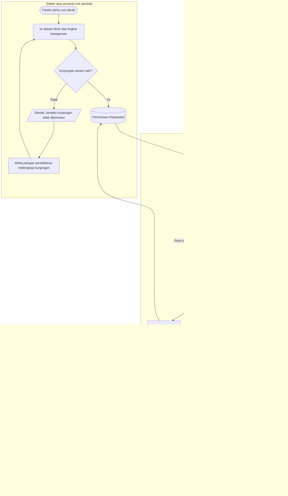
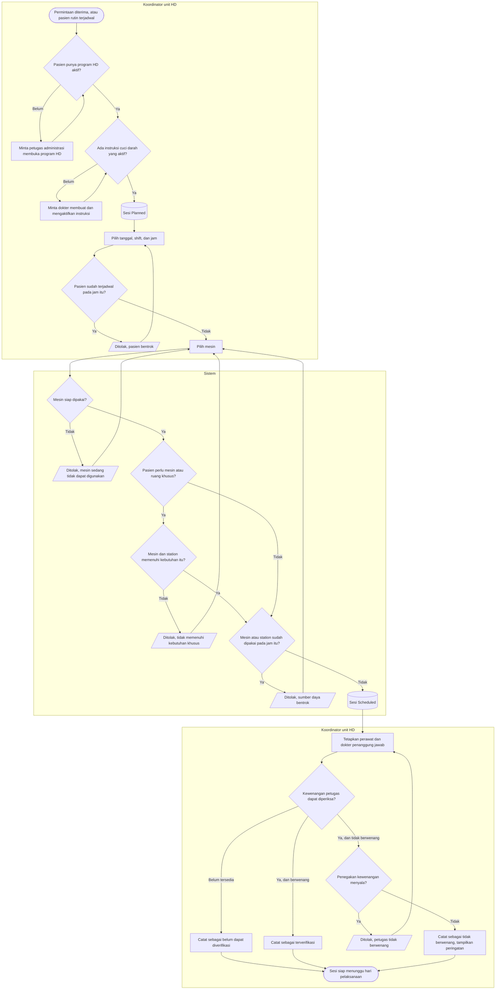
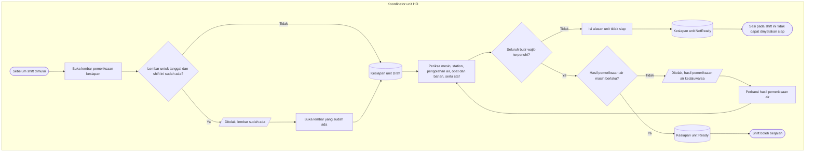

# Hemodialisa — Permintaan dan Penjadwalan

| Field | Value |
|---|---|
| Blueprint ID | `HMD-BP-001` |
| Contract version | `HMD-CONTRACT-v1` — status `draft` |
| Owner | Muhammad Hamzah |

Proses ini mencakup sejak permintaan cuci darah masuk sampai sesi punya tanggal, mesin, station,
perawat, dan dokter penanggung jawab.

Berbeda dari `00-alur-utama.md`, diagram di sini memuat **seluruh percabangan dan jalur
pengecualiannya**.

---

## 1. Menerima permintaan HD

### Tabel langkah

| Langkah | Pelaku | Masukan yang dibutuhkan | Keluaran | Bila gagal |
|---|---|---|---|---|
| Isi alasan klinis dan kesegeraan | Dokter atau perawat unit peminta | Pasien, kunjungan sah, alasan klinis, rutin atau cito | Permintaan `Requested` | Petugas melengkapi alasan klinis lalu mengirim ulang |
| Nilai apakah unit dapat menerima | Koordinator unit HD | Permintaan yang menunggu, kapasitas unit | Permintaan `Accepted` atau `OnHold` | Bila permintaan sudah diproses orang lain, koordinator memuat ulang daftarnya |
| Tahan permintaan | Koordinator unit HD | Alasan operasional | Permintaan `OnHold`; status sebelumnya disimpan | Alasan wajib diisi; tanpa itu penahanan tidak tersimpan |
| Lepas tahanan | Koordinator unit HD | Permintaan yang sedang ditahan | Kembali ke status sebelum ditahan | Bila permintaan tidak sedang ditahan, tidak ada yang berubah |
| Tolak permintaan | **Dokter** | Alasan klinis | Permintaan `Rejected`, bersifat akhir | Koordinator **tidak** dapat melakukan ini; menolak adalah keputusan klinis |
| Batalkan permintaan | Pembuat permintaan | Permintaan yang belum diterima unit HD | Permintaan `Cancelled` | Bila sudah diterima unit HD, pembatalan lewat koordinator |

### Yang perlu diperhatikan

**Menahan dan menolak adalah dua hal berbeda.** Menahan berarti "belum bisa sekarang, alasannya
operasional" — misalnya seluruh mesin penuh hari ini. Menolak berarti "cuci darah tidak
diindikasikan untuk pasien ini" — dan itu keputusan medis. Karena itu koordinator boleh menahan,
tetapi hanya dokter yang boleh menolak.

**Penolakan bersifat akhir.** Bila kondisi pasien berubah, dibuat permintaan baru, supaya
riwayat penolakan sebelumnya tetap terbaca.

---

## 2. Menjadwalkan sesi

### Tabel langkah

| Langkah | Pelaku | Masukan yang dibutuhkan | Keluaran | Bila gagal |
|---|---|---|---|---|
| Periksa program dan instruksi | Koordinator unit HD | Program HD aktif, instruksi cuci darah aktif | Sesi `Planned` | Koordinator meminta petugas administrasi membuka program, atau dokter mengaktifkan instruksi |
| Pilih tanggal, shift, dan jam | Koordinator unit HD | Kalender unit | Rentang waktu terpilih | Bila pasien sudah terjadwal pada jam bertumpang tindih, koordinator memilih jam lain |
| Pilih mesin dan station | Koordinator unit HD | Daftar mesin dan station beserta statusnya | Mesin dan station terpilih | Bila mesin sedang diblokir, dalam perawatan, atau tidak laik, koordinator memilih yang lain |
| Periksa kebutuhan khusus | Sistem | Keputusan isolasi pasien yang sedang berlaku | Mesin dan station yang sesuai | Bila tidak memenuhi, koordinator memilih mesin atau station khusus |
| Periksa tabrakan sumber daya | Sistem | Jadwal seluruh sesi pada rentang waktu itu | Sesi `Scheduled` | Bila bentrok, koordinator memilih sumber daya atau jam lain |
| Tetapkan perawat dan dokter penanggung jawab | Koordinator unit HD | Daftar petugas yang bertugas pada shift itu | Penugasan tersimpan beserta status kewenangannya | Bila penegakan kewenangan menyala dan petugas tidak berwenang, koordinator memilih petugas lain |
| Batalkan sesi | Koordinator unit HD | Sesi yang belum dimulai, alasan pembatalan | Sesi `Cancelled` | Sesi yang sudah berjalan **tidak** dapat dibatalkan; yang tersedia adalah menghentikannya |

### Yang perlu diperhatikan

**Tiga jenis tabrakan diperiksa sekaligus:** pasien tidak boleh punya dua sesi bertumpang
tindih, satu mesin tidak boleh dipakai dua pasien, dan satu station tidak boleh dipakai dua
pasien. Ketiganya diperiksa di dalam satu transaksi, sehingga dua koordinator yang menjadwalkan
pada saat hampir bersamaan tidak dapat menghasilkan jadwal ganda.

**Kewenangan petugas punya tiga kemungkinan, bukan dua.** Selain "berwenang" dan "tidak
berwenang", ada keadaan ketiga: **belum dapat diperiksa**, karena sumber datanya belum tersedia.
Keadaan ketiga itu dicatat apa adanya, tidak ditulis seolah-olah sudah diperiksa.

---

## 3. Kesiapan unit sebelum shift dimulai

### Tabel langkah

| Langkah | Pelaku | Masukan yang dibutuhkan | Keluaran | Bila gagal |
|---|---|---|---|---|
| Buka lembar pemeriksaan | Koordinator unit HD | Tanggal dan shift | Lembar `Draft` | Bila lembarnya sudah ada, koordinator membuka yang sudah ada alih-alih membuat baru |
| Periksa seluruh butir | Koordinator unit HD | Kondisi mesin, station, hasil pemeriksaan air, ketersediaan obat dan bahan, jumlah staf | Hasil tiap butir tersimpan | Butir yang belum diperiksa tetap berstatus belum diperiksa; koordinator melanjutkan |
| Nyatakan unit siap | Koordinator unit HD | Seluruh butir wajib terpenuhi, hasil pemeriksaan air masih dalam masa berlaku | Kesiapan unit `Ready` | Bila hasil air kedaluwarsa, koordinator memperbaruinya lebih dulu |
| Nyatakan unit tidak siap | Koordinator unit HD | Alasan | Kesiapan unit `NotReady` | Alasan wajib diisi |

### Yang perlu diperhatikan

**Unit yang dinyatakan tidak siap di tengah shift tidak menghentikan sesi yang sudah berjalan.**
Menghentikan cuci darah yang sedang berlangsung adalah keputusan klinis yang diambil perawat dan
dokter di tempat, bukan akibat otomatis dari perubahan status administratif.

**Masa berlaku hasil pemeriksaan air adalah pengaturan, bukan angka tetap.** Nilai awalnya 30
hari, dan setiap unit boleh mengubahnya sesuai kebijakan rumah sakit.
