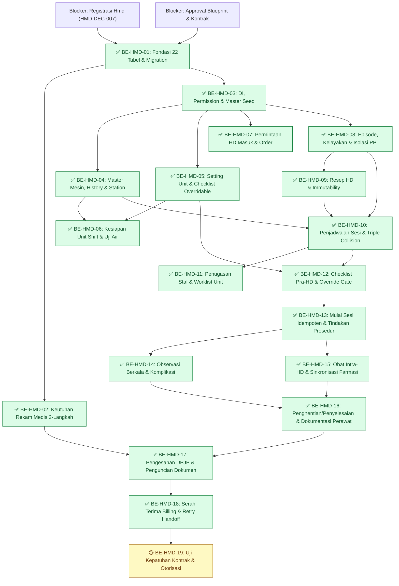

# Backend Roadmap — Modul Hemodialisa

| Field | Value |
|---|---|
| Roadmap ID | `HMD-RM-BE-001` |
| Revision | `1` |
| Status | `approved` |
| Blueprint ID | `HMD-BP-001` revision 1, status `approved` |
| Backend SHA baseline | `190c91a0` — branch `MHamzah` |
| Frontend SHA baseline | `a38683142` — branch `HamzahV2` |
| Kontrak masukan | `HMD-CONTRACT-v1` (`api-contract.md`, `state-transition-matrix.md`, `validation-matrix.md`, `integration-contract.md`, `permission-audit-matrix.md`) — seluruhnya berstatus `approved` |
| Owner | Muhammad Hamzah (`HMD-DEC-006`) |
| `approved_by` / `approved_at` | Muhammad Hamzah / 2026-09-18T15:40:07+07:00 |
| Tanggal persetujuan | 18 September 2026 |

> [!WARNING]
> **Batas Dokumen dan Status Kelayakan Eksekusi**
> 1. Dokumen ini memecah blueprint dan kontrak arsitektur menjadi task backend berukuran kecil berbasis irisan vertikal (*vertical slice*) yang dapat diuji secara mandiri. Dokumen ini **bukan** izin menulis kode aplikasi.
> 2. Status saat ini adalah **FORWARD-TEST / DRAFT**. Seluruh task implementasi berstatus **`BLOCKED`** sampai:
>    - Pemilik modul menyetujui blueprint dan mengunci kontrak masukan (`HMD-CONTRACT-v1`).
>    - Lima tindakan lanjutan registry `HealthServices / HemodialysisManagement / Hemodialysis / Hmd / ACTIVE` (`HMD-DEC-007`) diselesaikan pada kedua salinan registry repositori (`backend` dan `frontend`).
> 3. **QBE Preflight Statement**: Pada setiap serah terima implementasi task backend (`TASK MODE: BACKEND`), pemeriksa kesesuaian arsitektur (*QBE preflight check*) dan kepatuhan engineering diselesaikan pada waktu eksekusi mengacu langsung pada `AGENTS.md` repositori backend target dan dokumen engineering kanonikal di `rules/backend/engineering/`.
> 4. Eksekusi database (pembuatan migration dan penerapannya) merupakan wewenang terpisah yang membutuhkan otorisasi eksplisit dari pemilik database.
>
> **Catatan penutupan gerbang — 22 September 2026.**
> - Gerbang persetujuan blueprint dan kontrak `HMD-CONTRACT-v1`: **tertutup** 18 September 2026 (lihat kepala dokumen).
> - Gerbang registry `HMD-DEC-007`: tindakan 1–4 **selesai** 22 September 2026 — baris `HealthServices / HemodialysisManagement / Hemodialysis / Hmd / ACTIVE` ditambahkan pada `docs/engineering/MODULE_OWNERSHIP_PREFIX_REGISTRY.md` dan pada dua salinan canonical suite skill (isi identik). Repository frontend tidak menyimpan salinan registry. Tindakan 5 — commit dan push kedua repository — **masih terbuka**, dijalankan pemilik.
> - Wewenang migration: diberikan pemilik pada sesi 22 September 2026 untuk DB pribadi `QuilvianNewDevHamzah` saja; migration `20260922044002_AddHemodialysisManagement` diterapkan di sana. DB bersama dan deployment tetap wewenang terpisah.

---

## 1. Ringkasan Irisan Vertikal (Vertical Slice)

Sebanyak 19 task backend disusun menurut gelombang pengiriman (*delivery waves*). Setiap task menghasilkan kemampuan yang dapat dibuktikan dengan uji otomatis (*integration/unit test*) dan tidak meninggalkan lapisan setengah jadi yang mengambang.

| Gelombang | Task ID | Epic Sasaran | Hasil Nyata yang Dapat Diuji | Status Eksekusi |
|---|---|---|---|:---:|
| `MVP-0` | `BE-HMD-01` s/d `BE-HMD-03` | Fondasi & Tata Kelola | 22 tabel `Hmd*` terpasang lewat 1 migration, 2 enum diekstensi, penegakan keutuhan rekam medis 2-tempat aktif, 10 service terdaftar, dan data master awal siap | ✅ selesai 22 September 2026 — ketiga task terimplementasi (sebelumnya `BLOCKED` oleh tindakan registry `HMD-DEC-007`) |
| `MVP-1` | `BE-HMD-04` s/d `BE-HMD-06` | `EPIC HMD-05` | Mesin, station, pengaturan unit, dan checklist persiapan dapat dikelola; shift unit HD dapat dinilai dan dinyatakan siap | ✅ selesai 22 September 2026 — ketiga task terimplementasi |
| `MVP-2` | `BE-HMD-07` s/d `BE-HMD-09` | `EPIC HMD-01`, `HMD-02`, `HMD-03` | Permintaan HD masuk dari rawat inap/IGD/jalan dapat diproses; program episode pasien, kelayakan, serologi, isolasi, dan resep HD aktif dapat diterbitkan | ✅ selesai 22 September 2026 — ketiga task terimplementasi |
| `MVP-3` | `BE-HMD-10` s/d `BE-HMD-11` | `EPIC HMD-04` | Sesi terjadwal tanpa tabrakan mesin/pasien/station; penugasan staf diverifikasi gerbang kompetensi; daftar kerja harian siap | ✅ selesai 22 September 2026 — kedua task terimplementasi |
| `MVP-4` | `BE-HMD-12` s/d `BE-HMD-15` | `EPIC HMD-06`, `HMD-07` | Checklist Pra-HD diperiksa; sesi dimulai idempoten dengan waktu server; pemantauan berkala, komplikasi, dan obat tercatat ke Farmasi | ✅ selesai 22 September 2026 — keempat task terimplementasi |
| `MVP-5` | `BE-HMD-16` s/d `BE-HMD-18` | `EPIC HMD-08`, `HMD-09` | Sesi ditutup; perawat menyelesaikan dokumentasi; dokter mengesahkan; catatan terkunci permanen; koreksi via addendum; tagihan terbit ke Billing | ✅ selesai 22 September 2026 — ketiga task terimplementasi |
| Lintas | `BE-HMD-19` | Lintas Epic | Pengujian otomatis seluruh endpoint, kepatuhan matriks otorisasi peran, dan audit trail tidak dapat dijebol | 🟡 sebagian 22 September 2026 — kriteria 1 dan 2 terpenuhi; kriteria 3 menunggu keputusan pemilik soal alamat IP di database |

---

## 2. Rincian Task Backend

**Arti tanda status pada dokumen ini.**

| Tanda | Artinya |
| :---: | --- |
| ✅ | Selesai. Acceptance criteria dan DoD **terbukti**, buktinya ada pada laporan task |
| 🟡 | Sebagian. Source-nya sudah ada, tetapi acceptance criteria belum terbukti penuh. **Belum selesai** |
| ⛔ | Terblokir. Prasyaratnya belum terpenuhi, dan task **tidak boleh dimulai** |
| tanpa tanda | Belum dikerjakan |

### 2.1 Gelombang `MVP-0` — Fondasi, Model Data, dan Tata Kelola

#### ✅ `BE-HMD-01` — Fondasi Entity, Konfigurasi EF Core, DbContext, dan Migration 22 Tabel `Hmd*`

* **Status**: ✅ **SELESAI 22 September 2026.** Ketiga acceptance criteria dipetakan ke source; bagian jadwal pada kriteria 2 dipenuhi sebagai index biasa ditambah kunci advisory, mengikuti `data-dictionary.md` bagian 3.8 (delta tercatat). Migration `20260922044002_AddHemodialysisManagement` diterapkan ke DB pribadi `QuilvianNewDevHamzah` — 22 tabel, 138 index, 46 FK — dan `Down()`/`Up()` diuji. `dotnet build` `0 Error(s)` — 224 warning, 0 dari berkas Hemodialisa (garis dasar 21 September 2026: 222 warning); QBE Strict `PASS` atas 94 berkas, 0 violation; audit akses reflektif 0 masalah atribut. Bukti: [laporan](../task/report/backend/BE-HMD-01.md)
* **Outcome**: Skema basis data 22 tabel modul Hemodialisa terbentuk sempurna melalui Entity Framework Core Migration tunggal, konsisten dengan relasi foreign key, index pencegah tabrakan, dan audit columns standar.
* **Requirement / Decision**: `HMD-DEC-004`, `HMD-DEC-007`, `HMD-DEC-008`, `FR-HMD-001`, `FR-HMD-030`, `NFR-001`, `NFR-002`.
* **Kontrak**: `02-backend-architecture.md` Bagian 3, 5, 6, dan 8; `data/data-dictionary.md` seluruh entitas.
* **Reuse Kemampuan**: Merujuk tabel existing tanpa membuat salinan: `MstPatient` (`PatientId`), `RegPatientEncounter` (`EncounterId`), `InpEpisode` (`InpEpisodeId`), `MstDoctor` (`DoctorId`), `MstWorkforceProfile` (`WorkforceProfileId`), `MstServiceUnit` (`ServiceUnitId`), `MstRoom` (`RoomId`).
* **Cakupan yang Diharapkan**:
  - Membuat 21 berkas model C# pada `Areas/HealthServices/HemodialysisManagement/Models/` (`HmdOrder`, `HmdEpisode`, `HmdEligibilityAssessment`, `HmdVascularAccess`, `HmdSerologyReview`, `HmdIsolationDecision`, `HmdPrescription`, `HmdSession`, `HmdSessionChecklist`, `HmdSessionAssessment`, `HmdSessionObservation`, `HmdSessionMedication`, `HmdSessionComplication`, `HmdSessionStaffAssignment`, `HmdMachine`, `HmdMachineStatusHistory`, `HmdStation`, `HmdChecklistItem`, `HmdReadinessItem`, `HmdUnitReadiness`, `HmdUnitReadinessDetail`, `HmdSetting`).
  - Membuat berkas enum `Areas/HealthServices/HemodialysisManagement/Enums/HemodialysisEnums.cs`.
  - Membuat 22 berkas konfigurasi EntityTypeConfiguration pada `Repositories/Configurations/HealthServices/HemodialysisManagement/`.
  - Mendaftarkan 22 `DbSet<Hmd*>` pada `Repositories/ApplicationDbContext.cs`.
  - Menghasilkan 1 file migration bernama `<Timestamp>_AddHemodialysisManagement.cs`.
* **Dependency & Blocker**:
  - `BLOCKER`: Lima tindakan registrasi `HMD-DEC-007` diselesaikan pada file registry repository.
  - `BLOCKER`: Persetujuan kontrak `HMD-CONTRACT-v1` oleh Human Owner.
* **Acceptance Criteria**:
  1. *Contoh Skenario Skema*: Menjalankan `dotnet ef migrations add AddHemodialysisManagement` menghasilkan kode yang menciptakan tepat 22 tabel dengan prefix `Hmd` tanpa menyentuh atau memodifikasi tabel modul lain yang sudah ada.
  2. Index pencegahan tabrakan terpasang: Unique index pada `HmdEpisode` untuk `(PatientId, EpisodeStatus)` di mana status = `Active`. Unique composite index pada jadwal sesi untuk mesin dan waktu.
  3. Migration dapat dijalankan (`Up()`) dan dibatalkan (`Down()`) pada lingkungan pengujian tanpa meninggalkan artefak yatim.
* **Bukti Verifikasi / Test**: Eksekusi kompilasi `dotnet build` lulus 0 warning/error; inspeksi berkas snapshot model DbContext membuktikan 22 entity terdaftar dengan prefix `Hmd`; uji coba rollback migration `Down()` sukses mengembalikan skema awal.
* **Risiko & Pemilik**: Risiko: Penamaan entity atau penempatan file melanggar aturan arsitektur QBE. Mitigasi: Seluruh entity wajib diawali `Hmd`, folder konfigurasi terpisah di `Repositories/Configurations/`. Pemilik: Backend Engineer.
* **Definition of Done**: Migration terbentuk otomatis dari model EF Core, kompilasi solusi backend 100% bebas error, verifikasi QBE preflight lolos untuk seluruh entity `Hmd*`.

---

#### ✅ `BE-HMD-02` — Integrasi Keutuhan Rekam Medis Dua Langkah dan Ekstensi Enum Lintas Modul

* **Status**: ✅ **SELESAI 22 September 2026.** Kedua acceptance criteria dipetakan ke source: `HemodialysisSession` masuk `JenisYangDitegakkan`, dan penolakan `EnsureMutableAsync` dipetakan menjadi `423 HMD-VAL-075`. Berkas Rekam Medis diubah atas izin pemilik 22 September 2026. `dotnet build` `0 Error(s)` — 224 warning, 0 dari berkas Hemodialisa (garis dasar 21 September 2026: 222 warning); QBE Strict `PASS` atas 94 berkas, 0 violation; audit akses reflektif 0 masalah atribut. Unit test integritas **dikecualikan atas keputusan pengguna 22 September 2026**. Bukti: [laporan](../task/report/backend/BE-HMD-02.md)
* **Outcome**: Catatan sesi hemodialisa terdaftar dan ditegakkan dalam subsistem keutuhan rekam medis (*Medical Record Integrity*) sehingga proteksi penguncian aktif dan tidak dapat disunting diam-diam setelah disahkan.
* **Requirement / Decision**: `CAP-07`, `CAP-08`, `CAP-18`, `HMD-DEC-010`, `FR-HMD-073`, `FR-HMD-074`, `NFR-008`, **Temuan Kritis 1**.
* **Kontrak**: `02-backend-architecture.md` Bagian 6 dan 7; `01-existing-capability-map.md` Bagian Temuan Kritis 1.
* **Reuse Kemampuan**: `ClinicalDocumentIntegrityService`, `MrcClinicalDocumentIntegrity`, `MrcClinicalNoteAddendum`.
* **Cakupan yang Diharapkan**:
  - Memperbarui `Areas/HealthServices/MasterData/Enums/ServiceUnitType.cs` dengan menambahkan nilai `Hemodialysis = 10`.
  - Memperbarui `Areas/HealthServices/MedicalRecordManagement/Enums/ClinicalDocumentKind.cs` dengan menambahkan nilai `HemodialysisSession = 14`.
  - **Langkah Wajib Kedua (Temuan Kritis 1)**: Memperbarui `Areas/HealthServices/MedicalRecordManagement/Services/ClinicalDocumentIntegrityService.cs` dengan menambahkan `ClinicalDocumentKind.HemodialysisSession` ke dalam himpunan tertutup `private static readonly HashSet<ClinicalDocumentKind> JenisYangDitegakkan`.
* **Dependency & Blocker**:
  - `BE-HMD-01`.
  - Koordinasi tertulis dengan pemilik bounded context Rekam Medis (`MedicalRecordManagement`).
* **Acceptance Criteria**:
  1. *Contoh Kasus Penguncian Nyata*: Ketika sebuah dokumen sesi Hemodialisa didaftarkan dengan tipe `HemodialysisSession`, pemanggilan `DitegakkanUntuk(ClinicalDocumentKind.HemodialysisSession)` mengembalikan nilai `true`.
  2. Saat dokumen sesi Hemodialisa berstatus `Finalized` diverifikasi oleh `EnsureMutableAsync`, sistem melempar `InvalidOperationException` atau menolak penyuntingan, membuktikan catatan benar-benar terkunci secara hukum.
* **Bukti Verifikasi / Test**: Unit test arsitektur `HemodialysisDocumentIntegrityTests`:
  - Uji memanggil `ClinicalDocumentIntegrityService.DitegakkanUntuk(ClinicalDocumentKind.HemodialysisSession)` dan menegaskan hasilnya `true`.
  - Uji mutasi dokumen final menolak modifikasi catatan secara absolut.
* **Risiko & Pemilik**: **Risiko Kritis**: Bila penambahan hanya dilakukan pada enum dan terlewat pada `JenisYangDitegakkan`, dokumen terlihat `Finalized` di UI tetapi catatan klinis tetap dapat diubah tanpa error log. Pemilik: Backend Engineer & Lead Rekam Medis.
* **Definition of Done**: Kedua berkas di Rekam Medis diperbarui, unit test integritas rekam medis membuktikan `HemodialysisSession` masuk dalam kategori dokumen yang ditegakkan, `dotnet build` lulus bersih.

---

#### ✅ `BE-HMD-03` — Pendaftaran Dependency Injection Service, Definisi Hak Akses, dan Pengisian Data Master Awal

* **Status**: ✅ **SELESAI 22 September 2026.** Ketiga acceptance criteria terpetakan: DB `QuilvianNewDevHamzah` berisi 12 butir checklist (0 boleh dilewati), 5 butir kesiapan, dan pengaturan 60 menit/720 jam; seeder dijalankan ulang menambah 0 baris; seluruh dependency konstruktor 10 service terdaftar *scoped* tanpa siklus. `dotnet build` `0 Error(s)` — 224 warning, 0 dari berkas Hemodialisa (garis dasar 21 September 2026: 222 warning); QBE Strict `PASS` atas 94 berkas, 0 violation; audit akses reflektif 0 masalah atribut. Butir DoD test otomatis **dikecualikan atas keputusan pengguna 22 September 2026**. Startup aplikasi `NOT RUN` — dikecualikan menurut keputusan tetap pemilik 10 September 2026. Bukti: [laporan](../task/report/backend/BE-HMD-03.md)
* **Outcome**: Sepuluh layanan backend Hemodialisa terdaftar di DI container, konstanta permission terdefinisi, dan seeder data awal master unit, tindakan, butir checklist, dan pengaturan unit tersedia.
* **Requirement / Decision**: `HMD-DEC-007`, `HMD-DEC-013`, `FR-HMD-041`, `FR-HMD-051`, `NFR-011`.
* **Kontrak**: `02-backend-architecture.md` Bagian 4, 5, dan 9; `contracts/permission-audit-matrix.md` Bagian 2 dan 3.
* **Reuse Kemampuan**: `MstServiceUnit`, `MstProcedure`, infrastruktur `IServiceCollection`, sistem otorisasi berbasis klaim Quilvian.
* **Cakupan yang Diharapkan**:
  - Mendaftarkan 10 service pada `Program.cs` (`AddScoped`): `HmdOrderService`, `HmdEpisodeService`, `HmdPrescriptionService`, `HmdScheduleService`, `HmdSessionService`, `HmdSessionFinalizationService`, `HmdBillingHandoffService`, `HmdUnitReadinessService`, `HmdResourceService`, `HmdCompetencyGateService`.
  - Mendefinisikan konstanta Permission pada `Areas/HealthServices/HemodialysisManagement/Constants/HemodialysisPermissions.cs` sesuai matriks otorisasi.
  - Membuat seeder master data awal (`HemodialysisMasterDataSeeder`):
    - 1 baris unit HD di `MstServiceUnit` (`ServiceUnitType = Hemodialysis`).
    - 1 baris tindakan "Hemodialisis" di `MstProcedure`.
    - 12 butir checklist persiapan Pra-HD di `HmdChecklistItem` dengan bawaan `IsOverridable = false`.
    - 5 butir kesiapan unit di `HmdReadinessItem`.
    - 1 baris konfigurasi unit di `HmdSetting` (`MaxPatientsPerNurse = 3`, `EnforceNurseRatio = false`, `WaterResultValidityHours = 720`, `EnforceCompetencyCheck = false`, `AllowMultipleActiveEpisodePerPatient = false`).
* **Dependency & Blocker**: `BE-HMD-01`, `BE-HMD-02`.
* **Acceptance Criteria**:
  1. *Contoh Master Siap Pakai*: Unit HD memiliki 12 butir checklist terisi di database; seluruhnya berstatus `IsOverridable = false` sehingga dokter tidak dapat melewati checklist tanpa otorisasi tata kelola klinis.
  2. Nilai `HmdSetting` berhasil dimuat dengan toleransi mulai sesi 60 menit dan masa berlaku hasil air 30 hari (720 jam).
  3. Seluruh 10 service dapat di-*resolve* oleh service provider ASP.NET Core tanpa `InvalidOperationException` siklik atau missing dependency.
* **Bukti Verifikasi / Test**: Integration test `DependencyInjectionResolutionTests` berhasil menginstansiasi setiap service dari `IServiceScope`; seeder test membuktikan tabel master terisi lengkap dan idempoten (tidak menduplikasi baris saat dijalankan ulang).
* **Risiko & Pemilik**: Risiko: Kegagalan resolusi scoped service saat startup. Pemilik: Backend Engineer.
* **Definition of Done**: Startup backend lulus tanpa error resolusi dependensi, master seeder lolos eksekusi uji dengan data lengkap 12 checklist dan parameter setting bawaan.

---

### 2.2 Gelombang `MVP-1` — Pengelolaan Sumber Daya dan Kesiapan Unit HD

#### ✅ `BE-HMD-04` — Pengelolaan Mesin HD, Riwayat Status Mesin, dan Master Station

* **Status**: ✅ **SELESAI 22 September 2026.** Ketiga acceptance criteria dipetakan ke source: satu baris `HmdMachineStatusHistory` per perubahan status, pilihan penjadwalan hanya mesin `Ready`, station tidak dapat `Maintenance` selama ada sesi berjalan. 19 endpoint (12 kontrak + 7 baca baseline). `dotnet build` `0 Error(s)` — 224 warning, 0 dari berkas Hemodialisa (garis dasar 21 September 2026: 222 warning); QBE Strict `PASS` atas 94 berkas, 0 violation; audit akses reflektif 0 masalah atribut. Butir DoD test otomatis **dikecualikan atas keputusan pengguna 22 September 2026**. Uji runtime HTTP `NOT RUN` — dikecualikan menurut keputusan tetap pemilik 10 September 2026. Bukti: [laporan](../task/report/backend/BE-HMD-04.md)
* **Outcome**: API master mesin dan station cuci darah beroperasi penuh, mencatat riwayat perubahan kelaikan mesin (*ready*, *blocked*, *maintenance*, *not-eligible*), dan memvalidasi isolasi fisik.
* **Requirement / Decision**: `FR-HMD-031`, `FR-HMD-033`, `CAP-13`, `CAP-14`, `NFR-005`.
* **Kontrak**: `contracts/api-contract.md` Grup Master Data Machine & Station; `contracts/state-transition-matrix.md` Bagian 3.
* **Reuse Kemampuan**: Pola pelacakan status dari `MstBed`, audit logging context.
* **Cakupan yang Diharapkan**:
  - Mengimplementasikan `HmdResourceService` untuk operasi CRUD mesin dan station.
  - Mengimplementasikan `HmdMachineController` (`[Tags("Health Services / Hemodialysis Management / Master Data / Hemodialysis Machine")]`) dan `HmdStationController` (`[Tags("Health Services / Hemodialysis Management / Master Data / Hemodialysis Station")]`).
  - Mencatat setiap perubahan status mesin ke dalam tabel `HmdMachineStatusHistory` beserta alasan perubahan, nama teknisi/petugas, dan stempel waktu server.
* **Dependency & Blocker**: `BE-HMD-01`, `BE-HMD-03`.
* **Acceptance Criteria**:
  1. *Contoh Kasus Mesin Rusak*: Teknisi mengubah status mesin `M-03` dari `Ready` menjadi `Blocked` dengan alasan "Kebocoran dialisat". Permintaan berhasil, status mesin berubah, dan 1 baris baru terbentuk di `HmdMachineStatusHistory`.
  2. Mesin berstatus `Blocked`, `Maintenance`, atau `NotEligible` tidak muncul dalam daftar mesin yang dapat dipilih untuk penjadwalan sesi baru.
  3. Mengubah station menjadi `Maintenance` memvalidasi bahwa tidak ada sesi aktif yang sedang berlangsung di station tersebut pada saat yang sama.
* **Bukti Verifikasi / Test**: Integration test `MachineStatusLifecycleTests`:
  - `PUT /api/v1/health-services/hemodialysis-management/master-data/hemodialysis-machines/{id}/status` mengubah status dan memverifikasi rekaman pada `HmdMachineStatusHistory`.
  - Uji mencoba mengubah mesin tanpa menyertakan alasan penonaktifan ditolak HTTP 400 Bad Request.
* **Risiko & Pemilik**: Risiko: Mesin rusak tetap dijadwalkan karena status basi di cache. Mitigasi: Validasi status langsung menembus database secara transaksional. Pemilik: Backend Engineer.
* **Definition of Done**: Controller, DTO, Service, dan Handler status history berfungsi 100%, seluruh transisi status mesin tervalidasi via unit/integration test.

---

#### ✅ `BE-HMD-05` — Pengaturan Kebijakan Unit HD dan Penentuan Butir Persiapan Overridable

* **Status**: ✅ **SELESAI 22 September 2026.** Ketiga acceptance criteria dipetakan ke source: `PATCH …/overridable` dengan catatan tata kelola wajib, pengaturan air dibaca langsung tanpa restart, `403` lewat `[AccessPermission]`. **Perlu keputusan pemilik:** `PUT` butir checklist masih dapat menjadikan butir tidak wajib atau nonaktif (laporan bagian 7). `dotnet build` `0 Error(s)` — 224 warning, 0 dari berkas Hemodialisa (garis dasar 21 September 2026: 222 warning); QBE Strict `PASS` atas 94 berkas, 0 violation; audit akses reflektif 0 masalah atribut. Butir DoD test otomatis **dikecualikan atas keputusan pengguna 22 September 2026**. Uji runtime HTTP `NOT RUN` — dikecualikan menurut keputusan tetap pemilik 10 September 2026. Bukti: [laporan](../task/report/backend/BE-HMD-05.md)
* **Outcome**: Pengaturan operasional unit HD dan penanda butir persiapan yang boleh dilewati (*overridable*) dapat disesuaikan secara dinamis via API tanpa perlu mengubah atau merilis ulang kode backend.
* **Requirement / Decision**: `FR-HMD-041`, `FR-HMD-051`, `NFR-011`, `HMD-ASM-001`, `HMD-GATE-002`.
* **Kontrak**: `contracts/api-contract.md` Grup Master Data Settings & Checklist Items.
* **Reuse Kemampuan**: Autentikasi dan pengecekan permission `HemodialysisSetting:Update`, `HemodialysisChecklistItem:SetOverridable`.
* **Cakupan yang Diharapkan**:
  - Mengimplementasikan endpoint `PATCH /master-data/hemodialysis-checklist-items/{id}/overridable` pada `HmdSettingController` / checklist handler.
  - Mengimplementasikan endpoint `GET` dan `PUT` pada `HmdSettingController` (`[Tags("Health Services / Hemodialysis Management / Master Data / Hemodialysis Setting")]`).
  - Validasi bahwa hanya pemegang akun tata kelola klinis/admin berwenang yang dapat mengubah nilai `IsOverridable`.
* **Dependency & Blocker**: `BE-HMD-03`.
* **Acceptance Criteria**:
  1. *Contoh Fleksibilitas Regulasi*: Pemegang akun tata kelola klinis memanggil `PATCH .../checklist-items/{id}/overridable` dengan payload `{ "isOverridable": true, "clinicalGovernanceNote": "Keputusan Komite Medis No. 42" }`. Nilai `IsOverridable` berubah menjadi `true` dan tercatat dalam audit log.
  2. Permintaan pengubahan setting `WaterResultValidityHours` menjadi 60 hari (1440 jam) tersimpan dengan sukses dan langsung mempengaruhi perhitungan kedaluwarsa kesiapan air pada shift berikutnya.
  3. Pengguna tanpa permission `HemodialysisChecklistItem:SetOverridable` menerima HTTP 403 Forbidden.
* **Bukti Verifikasi / Test**: Uji integrasi `ChecklistPolicyUpdateTests` membuktikan nilai `IsOverridable` dapat dinyalakan/dimatikan dan langsung terbaca oleh logika validasi sesi tanpa restart aplikasi backend.
* **Risiko & Pemilik**: Risiko: Pelonggaran checklist penting secara ilegal. Mitigasi: Otorisasi ketat dan pencatatan audit log komprehensif. Pemilik: Backend Engineer.
* **Definition of Done**: Endpoint setting dan checklist overridable selesai sesuai spesifikasi Swagger, lulus pengujian otorisasi dan audit log.

---

#### ✅ `BE-HMD-06` — Penilaian Kesiapan Unit Shift, Validasi Kelaikan Air, dan Logistik BMHP

* **Status**: ✅ **SELESAI 22 September 2026.** Ketiga acceptance criteria dipetakan ke source: `422 HMD-VAL-102` untuk air kedaluwarsa (teks mengikuti `validation-matrix.md`), `Ready` dengan waktu server dan `DeclaredByUserId`, `NotReady` tidak menyentuh sesi. `dotnet build` `0 Error(s)` — 224 warning, 0 dari berkas Hemodialisa (garis dasar 21 September 2026: 222 warning); QBE Strict `PASS` atas 94 berkas, 0 violation; audit akses reflektif 0 masalah atribut. Butir DoD test otomatis **dikecualikan atas keputusan pengguna 22 September 2026**. Uji runtime HTTP `NOT RUN` — dikecualikan menurut keputusan tetap pemilik 10 September 2026. Bukti: [laporan](../task/report/backend/BE-HMD-06.md)
* **Outcome**: Koordinator unit dapat membuka lembar kesiapan shift harian, memeriksa butir kelaikan air dan logistik, serta menyatakan unit siap (`Ready`) atau tidak siap (`NotReady`) sebelum pelayanan dimulai.
* **Requirement / Decision**: `FR-HMD-040`, `FR-HMD-041`, `FR-HMD-042`, `CAP-15`, `CAP-24`, `NFR-004`.
* **Kontrak**: `contracts/api-contract.md` Grup Hemodialysis Unit Readiness; `contracts/state-transition-matrix.md` Bagian 4.
* **Reuse Kemampuan**: Validasi waktu server (`DateTimeOffset.UtcNow`), pencatatan user context penilai kesiapan.
* **Cakupan yang Diharapkan**:
  - Mengimplementasikan `HmdUnitReadinessService` dan `HmdUnitReadinessController` (`[Tags("Health Services / Hemodialysis Management / Hemodialysis Unit Readiness")]`).
  - Validasi gerbang kelaikan air: Memeriksa apakah `WaterTestingDate` masih berada dalam jendela masa berlaku `WaterResultValidityHours` dari setting unit.
  - Status kesiapan unit hanya dapat berubah menjadi `Ready` jika seluruh butir wajib (air, mesin, station, BMHP, tenaga) berstatus terpenuhi.
* **Dependency & Blocker**: `BE-HMD-04`, `BE-HMD-05`.
* **Acceptance Criteria**:
  1. *Contoh Kegagalan Uji Air*: Koordinator mencoba menyatakan unit siap untuk Shift Pagi, tetapi tanggal uji air terakhir berumur 40 hari (melebihi batas 30 hari pada `HmdSetting`). Sistem menolak dengan HTTP 422 Unprocessable Entity dan pesan "Hasil pemeriksaan air telah kedaluwarsa."
  2. *Contoh Kesiapan Berhasil*: Seluruh 5 butir kesiapan terverifikasi valid, status `HmdUnitReadiness` berubah menjadi `Ready`, waktu pernyataan diisi stempel waktu server, dan koordinator tercatat sebagai `DeclaredByUserId`.
  3. Status unit dinyatakan `NotReady` di tengah shift tidak membatalkan atau menghentikan sesi yang sedang berjalan secara otomatis (keputusan klinis tetap di tangan tim medis).
* **Bukti Verifikasi / Test**: Integration test `UnitReadinessEvaluationTests` mensimulasikan skenario air kedaluwarsa (gagal 422) dan skenario butir lengkap (berhasil 200); verifikasi database membuktikan status tersimpan konsisten.
* **Risiko & Pemilik**: Risiko: Pelayanan tertunda karena kelalaian input kesiapan shift. Mitigasi: Respon API menyertakan detail butir spesifik yang belum lengkap agar dapat segera diperbaiki. Pemilik: Backend Engineer.
* **Definition of Done**: Service dan Controller kesiapan unit selesai 100%, lolos uji skenario air kedaluwarsa dan validasi kelengkapan butir wajib.

---

### 2.3 Gelombang `MVP-2` — Permintaan HD Masuk, Program Episode, dan Resep Hemodialisa

#### ✅ `BE-HMD-07` — Alur Permintaan HD Masuk, Konteks Kunjungan, dan Tindakan Terima/Tahan/Tolak

* **Status**: ✅ **SELESAI 22 September 2026.** Ketiga acceptance criteria dipetakan ke source: `400 HMD-VAL-001` tanpa kunjungan sah, `403` bagi penolak bukan dokter (hak akses dan relasi `MstDoctor`), `422` untuk aksi pada permintaan final. `dotnet build` `0 Error(s)` — 224 warning, 0 dari berkas Hemodialisa (garis dasar 21 September 2026: 222 warning); QBE Strict `PASS` atas 94 berkas, 0 violation; audit akses reflektif 0 masalah atribut. Butir DoD test otomatis **dikecualikan atas keputusan pengguna 22 September 2026**. Uji runtime HTTP `NOT RUN` — dikecualikan menurut keputusan tetap pemilik 10 September 2026. Bukti: [laporan](../task/report/backend/BE-HMD-07.md)
* **Outcome**: Permintaan cuci darah dari unit rawat inap, IGD, dan rawat jalan tercatat sebagai data resmi terstruktur; koordinator dapat menerima (*accept*) atau menahan (*hold*), dan dokter dialisis dapat menolak (*reject*).
* **Requirement / Decision**: `FR-HMD-001`, `FR-HMD-002`, `FR-HMD-003`, `FR-HMD-004`, `CAP-36` (`HMD-CAP-001`), `HMD-DEC-008`.
* **Kontrak**: `contracts/api-contract.md` Grup Hemodialysis Order; `contracts/state-transition-matrix.md` Bagian 1.
* **Reuse Kemampuan**: Pola order penunjang dari `LabOrder`/`RadOrder`; integrasi validasi kunjungan aktif dari `RegPatientEncounter`.
* **Cakupan yang Diharapkan**:
  - Mengimplementasikan `HmdOrderService` dan `HmdOrderController` (`[Tags("Health Services / Hemodialysis Management / Hemodialysis Order")]`).
  - Endpoint: `POST /` (buat permintaan), `GET /` (daftar permintaan masuk berfilter status/urgensi), `GET /{id}`, `POST /{id}/accept`, `POST /{id}/hold`, `POST /{id}/reject`, `POST /{id}/cancel`.
  - Penegakan aturan bisnis:
    - Permintaan wajib menautkan `PatientId` dan `EncounterId` yang sah.
    - Menahan permintaan hanya boleh dengan alasan operasional (koordinator).
    - Menolak permintaan hanya boleh dilakukan oleh dokter dengan alasan klinis yang wajib diisi, dan penolakan bersifat final (*terminal state*).
    - Penerimaan permintaan **tidak** membuat sesi terjadwal secara otomatis.
* **Dependency & Blocker**: `BE-HMD-01`, `BE-HMD-03`.
* **Acceptance Criteria**:
  1. *Contoh Validasi Kunjungan*: Permintaan dibuat tanpa `EncounterId` yang valid ditolak HTTP 400 dengan pesan error deskriptif.
  2. *Contoh Otorisasi Penolakan*: Koordinator (bukan dokter) mencoba menekan Tolak pada permintaan HD; sistem menolak dengan HTTP 403 Forbidden karena penolakan membutuhkan permission `HemodialysisOrder:Reject` milik dokter.
  3. *Contoh Penolakan Final*: Dokter menolak permintaan karena ketidakstabilan hemodinamik berat; status berubah menjadi `Rejected`. Percobaan memanggil endpoint `accept` pada permintaan yang ditolak menghasilkan HTTP 422.
* **Bukti Verifikasi / Test**: Integration test `HemodialysisOrderWorkflowTests` membuktikan siklus hidup permintaan: create -> accept, create -> hold -> accept, create -> reject (dengan verifikasi alasan klinis dan terminal state).
* **Risiko & Pemilik**: Risiko: Permintaan cito terlambat ditangani. Mitigasi: Kolom `IsCito` diindeks untuk penyaringan cepat di daftar kerja. Pemilik: Backend Engineer.
* **Definition of Done**: Controller, Service, dan DTO order selesai; seluruh pengujian transisi status dan validasi aturan klinis/operasional lulus 100%.

---

#### ✅ `BE-HMD-08` — Pengelolaan Program Episode Pasien, Penilaian Kelayakan, Akses Vaskular, dan Isolasi PPI

* **Status**: ✅ **SELESAI 22 September 2026.** Ketiga acceptance criteria dipetakan ke source: `409 HMD-VAL-011` ditambah unique index bersyarat, `422 HMD-VAL-013` beserta rincian sesi, keputusan isolasi menjadi prasyarat penjadwalan. `dotnet build` `0 Error(s)` — 224 warning, 0 dari berkas Hemodialisa (garis dasar 21 September 2026: 222 warning); QBE Strict `PASS` atas 94 berkas, 0 violation; audit akses reflektif 0 masalah atribut. Butir DoD test otomatis **dikecualikan atas keputusan pengguna 22 September 2026**. Uji runtime HTTP `NOT RUN` — dikecualikan menurut keputusan tetap pemilik 10 September 2026. Bukti: [laporan](../task/report/backend/BE-HMD-08.md)
* **Outcome**: Program HD pasien (*HmdEpisode*) aktif dapat dikelola dengan batas satu episode aktif per pasien, mencakup pencatatan kelayakan klinis, status akses vaskular, rujukan serologi, dan penetapan isolasi infeksius.
* **Requirement / Decision**: `FR-HMD-010`, `FR-HMD-011`, `FR-HMD-012`, `FR-HMD-013`, `FR-HMD-014`, `CAP-16`, `CAP-25`, `CAP-26`, `CAP-27`, `HMD-DEC-001`.
* **Kontrak**: `contracts/api-contract.md` Grup Hemodialysis Episode; `contracts/state-transition-matrix.md` Bagian 2.
* **Reuse Kemampuan**: Data pasien `MstPatient`, pencatatan audit log `MrcAccessLog`.
* **Cakupan yang Diharapkan**:
  - Mengimplementasikan `HmdEpisodeService` dan `HmdEpisodeController` (`[Tags("Health Services / Hemodialysis Management / Hemodialysis Episode")]`).
  - Menegakkan aturan satu episode aktif per pasien: Percobaan mengaktifkan episode baru saat masih ada episode aktif ditolak HTTP 409 Conflict.
  - Sub-entitas di bawah episode:
    - Penilaian Kelayakan (`HmdEligibilityAssessment`): mencatat dokter penilai, tanggal, status kelayakan, dan catatan klinis.
    - Akses Vaskular (`HmdVascularAccess`): mencatat tipe akses (AV Fistula, AV Graft, CDL Double Lumen femoral/jugular/subclavia), lokasi anatomi, tanggal pemasangan, dan kelaikan fungsi.
    - Tinjauan Serologi (`HmdSerologyReview`): mencatat rujukan nomor lab/tanggal, status HBsAg, Anti-HCV, Anti-HIV, dan catatan tinjauan.
    - Keputusan Isolasi (`HmdIsolationDecision`): mencatat keputusan kebutuhan mesin khusus / station isolasi yang ditetapkan tim PPI / dokter dialisis.
  - Penutupan episode (`Close`) memvalidasi bahwa tidak ada sesi berstatus selain `Finalized` atau `Cancelled`.
* **Dependency & Blocker**: `BE-HMD-01`, `BE-HMD-03`.
* **Acceptance Criteria**:
  1. *Contoh Penolakan Episode Ganda*: Pasien Ibu Sinta memiliki episode aktif `HD-EP-2026-001`. Petugas mencoba membuat dan mengaktifkan episode kedua untuk pasien yang sama; sistem menolak HTTP 409 Conflict.
  2. *Contoh Penutupan Tertahan*: Petugas mencoba menutup episode Ibu Sinta saat terdapat sesi tanggal kemarin yang masih berstatus `AwaitingFinalization`; sistem menolak HTTP 422 dengan rincian sesi yang belum disahkan.
  3. *Contoh Keputusan Isolasi*: Hasil Anti-HCV pasien reaktif; dokter/PPI menetapkan keputusan isolasi membutuhkan mesin khusus. Parameter ini tersimpan pada episode dan menjadi prasyarat validasi saat penjadwalan mesin.
* **Bukti Verifikasi / Test**: Integration test `EpisodeLifecycleAndIsolationTests` memverifikasi constraint satu episode aktif, pencegahan penutupan sebelum finalisasi sesi, dan integritas pencatatan sub-entitas klinis.
* **Risiko & Pemilik**: Risiko: Kebocoran data sensitif serologi. Mitigasi: Data serologi dilindungi permission khusus `HemodialysisSerology:Read` dan tidak diekspos pada endpoint publik daftar kerja. Pemilik: Backend Engineer.
* **Definition of Done**: Seluruh endpoint episode, kelayakan, akses vaskular, serologi, dan isolasi berfungsi sesuai kontrak API, invariant 1 episode aktif terjaga.

---

#### ✅ `BE-HMD-09` — Pengelolaan Siklus Resep Hemodialisa (Draf, Aktivasi, Penggantian Terlacak, Pembatalan)

* **Status**: ✅ **SELESAI 22 September 2026.** Kedua acceptance criteria dipetakan ke source: aktivasi menjadikan resep lama `Superseded` dalam satu transaksi berkunci, `PUT` resep aktif ditolak `423 HMD-VAL-024`. `dotnet build` `0 Error(s)` — 224 warning, 0 dari berkas Hemodialisa (garis dasar 21 September 2026: 222 warning); QBE Strict `PASS` atas 94 berkas, 0 violation; audit akses reflektif 0 masalah atribut. Butir DoD test otomatis **dikecualikan atas keputusan pengguna 22 September 2026**. Uji runtime HTTP `NOT RUN` — dikecualikan menurut keputusan tetap pemilik 10 September 2026. Bukti: [laporan](../task/report/backend/BE-HMD-09.md)
* **Outcome**: Parameter teknis dialisis tersimpan aman dalam resep HD resmi dokter (`HmdPrescription`); resep aktif tidak dapat diubah di tempat (*immutable*), dan setiap perubahan dosis/target menerbitkan resep baru yang menggantikan resep lama secara transaksional.
* **Requirement / Decision**: `FR-HMD-020`, `FR-HMD-021`, `FR-HMD-022`, `CAP-28`, `HMD-DEC-009`.
* **Kontrak**: `contracts/api-contract.md` Grup Hemodialysis Episode / Prescriptions; `contracts/state-transition-matrix.md` Bagian 2.
* **Reuse Kemampuan**: `MstDoctor` (`InstructingDoctorId`).
* **Cakupan yang Diharapkan**:
  - Mengimplementasikan `HmdPrescriptionService` sebagai bagian penanganan episode.
  - Parameter teknis resep: Durasi dialisis (menit), target penarikan cairan / Ultrafiltration Goal (ml), tipe dializer (low-flux / high-flux), komposisi dialisat, kecepatan aliran darah / Quick Blood QB (ml/menit), kecepatan aliran dialisat / Quick Dialysate QD (ml/menit), jenis dan protokol heparin/antikoagulan, profil natrium/bikarbonat, dan temperatur dialisat.
  - Logika transisi:
    - Pembuatan resep berstatus `Draft`.
    - Aktivasi resep: Mengubah status menjadi `Active`. Bila sudah ada resep `Active` sebelumnya pada episode tersebut, resep lama otomatis diubah menjadi `Superseded` dalam satu transaksi database tunggal.
    - Resep berstatus `Active` ditolak HTTP 423 Locked jika dicoba untuk diubah field nilainya secara langsung.
* **Dependency & Blocker**: `BE-HMD-08`.
* **Acceptance Criteria**:
  1. *Contoh Pergantian Resep Terlacak*: Dokter Rahmat ingin menaikkan UF goal dari 2.000 ml menjadi 2.500 ml. Ia membuat resep draf baru lalu mengaktifkannya. Resep baru menjadi `Active`, resep lama menjadi `Superseded`. Riwayat kedua resep terbaca utuh lengkap dengan identitas dokter dan waktu pengaktifan.
  2. *Contoh Immutability*: Permintaan `PUT .../prescriptions/{id}` pada resep berstatus `Active` ditolak HTTP 423 Locked dengan anjuran membuat resep baru.
* **Bukti Verifikasi / Test**: Unit dan integration test `PrescriptionLifecycleTests` membuktikan invariant: tepat 1 resep aktif per episode, kegagalan update in-place pada resep aktif, dan pergantian transaksional atomik.
* **Risiko & Pemilik**: Risiko: Sesi berjalan dengan parameter resep usang. Mitigasi: Resep yang disalin ke sesi dikunci saat sesi dijadwalkan/dimulai. Pemilik: Backend Engineer.
* **Definition of Done**: Service dan Controller resep HD lulus pengujian siklus hidup, pengujian immutability, dan verifikasi riwayat penggantian.

---

### 2.4 Gelombang `MVP-3` — Penjadwalan Sesi dan Pencegahan Tabrakan Sumber Daya

#### ✅ `BE-HMD-10` — Penjadwalan Sesi HD dengan Validasi Tabrakan Pasien-Mesin-Station dan Isolasi

* **Status**: ✅ **SELESAI 22 September 2026.** Ketiga acceptance criteria dipetakan ke source: tiga tabrakan `409 HMD-VAL-031/032/033` di bawah `pg_advisory_xact_lock`, isolasi `422 HMD-VAL-035`, sesi `Scheduled` menautkan resep aktif; teks pesan mengikuti `validation-matrix.md`. `dotnet build` `0 Error(s)` — 224 warning, 0 dari berkas Hemodialisa (garis dasar 21 September 2026: 222 warning); QBE Strict `PASS` atas 94 berkas, 0 violation; audit akses reflektif 0 masalah atribut. Butir DoD test otomatis **dikecualikan atas keputusan pengguna 22 September 2026**. Uji konkurensi paralel dan runtime HTTP `NOT RUN` — dikecualikan menurut keputusan tetap pemilik 10 September 2026. Bukti: [laporan](../task/report/backend/BE-HMD-10.md)
* **Outcome**: Penjadwalan sesi hemodialisa aman dari benturan sumber daya, mencegah tumpang tindih waktu untuk pasien yang sama, mesin yang sama, dan station yang sama, serta memastikan kesesuaian kebutuhan mesin isolasi.
* **Requirement / Decision**: `FR-HMD-030`, `FR-HMD-031`, `FR-HMD-032`, `CAP-29`, `NFR-002`.
* **Kontrak**: `contracts/api-contract.md` Grup Hemodialysis Schedule; `contracts/state-transition-matrix.md` Bagian 3; `contracts/validation-matrix.md` Bagian 2.
* **Reuse Kemampuan**: Transaksi basis data atomik, pengecekan index unik composite EF Core.
* **Cakupan yang Diharapkan**:
  - Mengimplementasikan `HmdScheduleService` dan endpoint penjadwalan pada `HmdSessionController`.
  - Menerima `CreateHmdSessionRequest` berisi tanggal, rentang waktu jadwal (*scheduled start & end*), shift, `PatientId`, `HmdEpisodeId`, `HmdMachineId`, `HmdStationId`, `DoctorId`, dan daftar perawat.
  - Validasi tiga tabrakan (*triple collision check*):
    1. Pasien tidak sedang dijadwalkan pada rentang waktu yang bertumpang tindih di sesi lain.
    2. Mesin tidak sedang dipakai sesi lain pada waktu yang bertumpang tindih dan berstatus kelaikan `Ready`.
    3. Station tidak sedang dipakai sesi lain pada waktu yang bertumpang tindih.
  - Validasi isolasi: Bila keputusan isolasi pasien mewajibkan mesin/station khusus, sistem menolak jika dialokasikan ke mesin/station reguler (HTTP 422).
* **Dependency & Blocker**: `BE-HMD-04`, `BE-HMD-08`, `BE-HMD-09`.
* **Acceptance Criteria**:
  1. *Contoh Tabrakan Mesin Terdeteksi*: Koordinator A menjadwalkan Pasien B ke mesin `M-01` pukul 07.00–11.00. Koordinator C mencoba menjadwalkan Pasien D ke mesin `M-01` pukul 09.00–13.00 pada tanggal yang sama. Permintaan kedua ditolak HTTP 409 Conflict dengan pesan "Mesin M-01 telah terpakai pada rentang waktu tersebut."
  2. *Contoh Penolakan Pelanggaran Isolasi*: Pasien Hepatitis B positif berstatus isolasi dijadwalkan ke mesin umum; sistem menolak HTTP 422 dengan pesan "Pasien memerlukan alokasi mesin isolasi."
  3. Sesi berhasil dibuat dengan status awal `Scheduled`, menautkan resep aktif pasien saat itu.
* **Bukti Verifikasi / Test**: Concurrency test `ScheduleCollisionTests` menjalankan simulasi request paralel perebutan mesin/station yang sama; membuktikan tepat 1 request berhasil dan request lainnya menerima HTTP 409 secara konsisten.
* **Risiko & Pemilik**: **Risiko Tinggi**: Tabrakan fisik mesin atau kontaminasi silang akibat kesalahan isolasi. Mitigasi: Validasi di tingkat service diapit transaksi serializable dan index database. Pemilik: Backend Engineer.
* **Definition of Done**: Logika deteksi benturan dan validasi isolasi lolos pengujian konkurensi, endpoint create schedule merespons sesuai kontrak API.

---

#### ✅ `BE-HMD-11` — Penugasan Staf, Pengecekan Gerbang Kompetensi, dan Penyusunan Daftar Kerja Unit

* **Status**: ✅ **SELESAI 22 September 2026.** Ketiga acceptance criteria dipetakan ke source: kompetensi tersimpan jujur `NotVerifiable` (`HMD-DEP-002`), worklist hanya membawa penanda isolasi boolean, hasil berhalaman `PagedResult`. `dotnet build` `0 Error(s)` — 224 warning, 0 dari berkas Hemodialisa (garis dasar 21 September 2026: 222 warning); QBE Strict `PASS` atas 94 berkas, 0 violation; audit akses reflektif 0 masalah atribut. Butir DoD test otomatis **dikecualikan atas keputusan pengguna 22 September 2026**. Uji runtime HTTP `NOT RUN` — dikecualikan menurut keputusan tetap pemilik 10 September 2026. Bukti: [laporan](../task/report/backend/BE-HMD-11.md)
* **Outcome**: Penugasan dokter penanggung jawab dan perawat pada sesi terkelola dengan baik; status kompetensi dicatat secara transparan; dan endpoint daftar kerja (*worklist*) unit menyajikan data operasional harian secara efisien.
* **Requirement / Decision**: `FR-HMD-034`, `CAP-20`, `CAP-21`, `HMD-DEC-013`, `HMD-DEP-002`, `NFR-006`.
* **Kontrak**: `contracts/api-contract.md` Grup Hemodialysis Schedule & Sessions (`GET /worklist`, `PUT /{id}/staff-assignments`); `contracts/permission-audit-matrix.md` Bagian 7.
* **Reuse Kemampuan**: `MstDoctor`, `MstWorkforceProfile`, `WfpClinicalPrivilege` (bila tersedia).
* **Cakupan yang Diharapkan**:
  - Mengimplementasikan `HmdCompetencyGateService`: Memeriksa kewenangan klinis staf dan mengembalikan salah satu dari tiga nilai enum: `Verified`, `NotAuthorized`, atau `NotVerifiable` (`HMD-DEC-013`). Selama integrasi HR belum otomatis, status tersimpan sebagai `NotVerifiable` secara jujur.
  - Endpoint `PUT /hemodialysis-sessions/{id}/staff-assignments`: Memperbarui dokter penanggung jawab dan perawat pendamping sesi.
  - Endpoint `GET /hemodialysis-sessions/worklist`: Menyajikan daftar sesi berfilter tanggal, shift, status, dan pencarian pasien.
  - Perlindungan Privasi: Payload respons worklist hanya menampilkan penanda isolasi ringkas (`IsIsolationRequired: true/false`), **tidak** membocorkan diagnosis atau status serologi pasien ke publik worklist.
* **Dependency & Blocker**: `BE-HMD-10`.
* **Acceptance Criteria**:
  1. *Contoh Pencatatan Kompetensi Jujur*: Penugasan perawat Rina dicatat; karena kredensialing HR otomatis belum terhubung, `CompetencyVerificationStatus` tersimpan sebagai `NotVerifiable`. Sesi tetap dapat dilanjutkan karena `EnforceCompetencyCheck = false` pada `HmdSetting`.
  2. *Contoh Worklist Tanpa Bocoran Serologi*: Memanggil `GET .../worklist` mengembalikan daftar pasien terjadwal dengan penanda isolasi berupa boolean sederhana tanpa string penyakit hepatitis atau HIV.
  3. Query worklist teroptimasi dan mendukung pagination standar Quilvian (`PagedResult<HmdWorklistItemResponse>`).
* **Bukti Verifikasi / Test**: Integration test `WorklistAndStaffAssignmentTests`:
  - Menguji pemanggilan worklist dengan berbagai filter.
  - Uji penugasan staf memverifikasi tiga status kompetensi dan pencatatan riwayat penugasan.
* **Risiko & Pemilik**: Risiko: Kebocoran informasi medis di layar bersama. Mitigasi: DTO respons disaring ketat di backend. Pemilik: Backend Engineer.
* **Definition of Done**: Service kompetensi, endpoint penugasan, dan query worklist berfungsi optimal, lulus uji privasi dan pagination.

---

### 2.5 Gelombang `MVP-4` — Pelaksanaan Sesi, Checklist Pra-HD, Pemantauan, dan Farmasi

#### ✅ `BE-HMD-12` — Checklist Pra-HD, Validasi Prasyarat Keselamatan, dan Gerbang Pelolosan Dokter

* **Status**: ✅ **SELESAI 22 September 2026.** Kedua acceptance criteria dipetakan ke source: override butir non-overridable `422 HMD-VAL-044`, pengisian 12 butir mencatat perawat dan waktu server. Gerbang `NotApplicable` pada butir wajib diperbaiki 22 September 2026; build dan QBE diulang dengan hasil sama. Celah terbuka: pembacaan `TrxPatientConsent` menunggu definisi persetujuan sah dari pemilik. `dotnet build` `0 Error(s)` — 224 warning, 0 dari berkas Hemodialisa (garis dasar 21 September 2026: 222 warning); QBE Strict `PASS` atas 94 berkas, 0 violation; audit akses reflektif 0 masalah atribut. Butir DoD test otomatis **dikecualikan atas keputusan pengguna 22 September 2026**. Uji runtime HTTP `NOT RUN` — dikecualikan menurut keputusan tetap pemilik 10 September 2026. Bukti: [laporan](../task/report/backend/BE-HMD-12.md)
* **Outcome**: Dua belas butir checklist persiapan keselamatan Pra-HD tersimpan per sesi; sistem menegakkan bahwa sesi tidak dapat dinyatakan siap sebelum seluruh butir terpenuhi atau dilewati secara sah sesuai wewenang.
* **Requirement / Decision**: `FR-HMD-050`, `FR-HMD-051`, `FR-HMD-052`, `CAP-30`, `HMD-ASM-001`, `HMD-GATE-002`.
* **Kontrak**: `contracts/api-contract.md` Grup Hemodialysis Session Checklist; `contracts/validation-matrix.md` Bagian 3.
* **Reuse Kemampuan**: `TrxPatientConsent` (verifikasi persetujuan sah), `TrxPatientVitalSign` (pemeriksaan vital pra-HD).
* **Cakupan yang Diharapkan**:
  - Mengimplementasikan endpoint `PUT /hemodialysis-sessions/{id}/checklist` untuk menyimpan status pemenuhan butir checklist oleh perawat.
  - Mengimplementasikan endpoint `POST /hemodialysis-sessions/{id}/checklist/{itemId}/override` untuk pelolosan (*override*) butir tertentu oleh dokter berwenang.
  - Validasi gerbang override: Sistem memeriksa flag `IsOverridable` pada master `HmdChecklistItem`. Jika bernilai `false`, permintaan override ditolak HTTP 422 meskipun menyertakan alasan.
  - Setiap tindakan override wajib mencatat `OverriddenByUserId`, waktu server, dan alasan klinis.
* **Dependency & Blocker**: `BE-HMD-03`, `BE-HMD-05`, `BE-HMD-10`.
* **Acceptance Criteria**:
  1. *Contoh Pelolosan Tertolak*: Dokter mencoba melakukan override pada butir persiapan identitas pasien (`IDENTITY`) yang berstatus `IsOverridable = false`; sistem menolak HTTP 422 dengan pesan "Butir persiapan ini tidak dapat dilewati menurut kebijakan keselamatan."
  2. *Contoh Pemeriksaan Checklist*: Perawat mengisi 12 butir checklist; seluruh butir tercatat status pemenuhannya (`Checked = true`), nama perawat pemeriksa, dan stempel waktu.
* **Bukti Verifikasi / Test**: Integration test `PreDialysisChecklistTests` memverifikasi penyimpanan checklist lengkap dan penolakan keras override pada butir non-overridable.
* **Risiko & Pemilik**: **Risiko Keselamatan Klinis**: Pasien menjalani cuci darah tanpa persetujuan atau tanpa pemeriksaan identitas. Mitigasi: Fail-closed, default seluruh butir tidak dapat dilewati. Pemilik: Backend Engineer.
* **Definition of Done**: Endpoint checklist dan override selesai, pengujian penolakan override non-overridable 100% lulus.

---

#### ✅ `BE-HMD-13` — Pernyataan Sesi Siap dan Transaksi Memulai Sesi HD Berpenanda Idempotensi

* **Status**: ✅ **SELESAI 22 September 2026.** Ketiga acceptance criteria dipetakan ke source: pemeriksaan tepat waktu `422 HMD-VAL-051`, idempotensi lewat kunci advisory dan dua unique index (tepat satu `TrxPatientProcedure`), `StartedAt` waktu server. `SessionStartGraceMinutes` belum dipakai — perlu keputusan pemilik. `dotnet build` `0 Error(s)` — 224 warning, 0 dari berkas Hemodialisa (garis dasar 21 September 2026: 222 warning); QBE Strict `PASS` atas 94 berkas, 0 violation; audit akses reflektif 0 masalah atribut. Butir DoD test otomatis **dikecualikan atas keputusan pengguna 22 September 2026**. Uji runtime HTTP `NOT RUN` — dikecualikan menurut keputusan tetap pemilik 10 September 2026. Bukti: [laporan](../task/report/backend/BE-HMD-13.md)
* **Outcome**: Transaksi peralihan sesi dari persiapan ke pelaksanaan berlangsung aman dan atomik; sistem memeriksa ulang kelaikan mesin dan kunjungan pasien saat tombol mulai ditekan, serta kebal terhadap pengiriman ganda (*idempotent*).
* **Requirement / Decision**: `FR-HMD-053`, `FR-HMD-054`, `FR-HMD-055`, `CAP-10`, `CAP-31`, `NFR-001`, `NFR-003`, `NFR-004`.
* **Kontrak**: `contracts/api-contract.md` Grup Hemodialysis Session (`POST /{id}/ready`, `POST /{id}/start`); `contracts/state-transition-matrix.md` Bagian 3.
* **Reuse Kemampuan**: Pembentukan `TrxPatientProcedure` berstatus `InProgress` pada Clinical Management.
* **Cakupan yang Diharapkan**:
  - Endpoint `POST /hemodialysis-sessions/{id}/ready`: Memverifikasi kelengkapan 12 butir checklist dan kehadiran dokter penanggung jawab; mengubah status sesi menjadi `Ready`.
  - Endpoint `POST /hemodialysis-sessions/{id}/start`:
    - Menerima `StartHmdSessionRequest` berisi `IdempotencyKey`.
    - **Pemeriksaan Tepat Waktu (*Just-in-Time Check*)**: Memeriksa ulang detik itu juga apakah mesin masih `Ready` dan encounter pasien masih aktif. Bila mesin mendadak diblokir atau kunjungan dibatalkan, mulai sesi digagalkan (HTTP 422).
    - **Transaksi Atomik**: Mengubah status sesi menjadi `InProgress`, mencatat `ActualStartTime` dari waktu server, mencatat `StartedByUserId`, dan membuat 1 baris tindakan klinis `TrxPatientProcedure` berstatus `InProgress`.
    - Idempotensi: Bila key yang sama dikirim ulang karena latensi jaringan, server mengembalikan data sesi yang sudah berjalan tanpa membuat tindakan duplikat.
* **Dependency & Blocker**: `BE-HMD-12`.
* **Acceptance Criteria**:
  1. *Contoh Mesin Mendadak Rusak*: Sesi dinyatakan siap pukul 06.55. Pukul 06.58 teknisi memblokir mesin `M-01`. Pukul 07.02 perawat menekan Mulai. Sistem mendeteksi status mesin telah berubah dan menolak mulai sesi dengan HTTP 422.
  2. *Contoh Idempotensi Jaringan*: Permintaan `POST .../start` dengan header/payload `IdempotencyKey: "abc-123"` dikirim dua kali dalam selang 500ms. Sesi dimulai tepat sekali, dan tepat 1 entitas `TrxPatientProcedure` terbentuk di database.
  3. Jam mulai sesi menggunakan waktu server (`DateTimeOffset.UtcNow`), mengabaikan perbedaan jam pada komputer klien perawat.
* **Bukti Verifikasi / Test**: Unit dan concurrency test `SessionStartIdempotencyTests` memverifikasi kekebalan pengiriman ganda dan pembatalan atomik jika pemeriksaan just-in-time mendeteksi anomali mesin.
* **Risiko & Pemilik**: **Risiko Tinggi**: Duplikasi tindakan penagihan atau sesi berjalan pada mesin berbahaya. Pemilik: Backend Engineer.
* **Definition of Done**: Transaksi mulai sesi terbukti atomik, lulus uji idempotensi dan uji just-in-time re-check.

---

#### ✅ `BE-HMD-14` — Pencatatan Pemantauan Berkala, Parameter Mesin, dan Komplikasi Klinis Intra-HD

* **Status**: ✅ **SELESAI 22 September 2026.** Kedua acceptance criteria dipetakan ke source: observasi selalu baris baru bernomor urut unik tanpa endpoint ubah/hapus, komplikasi hanya dicatat perawat secara sadar. `dotnet build` `0 Error(s)` — 224 warning, 0 dari berkas Hemodialisa (garis dasar 21 September 2026: 222 warning); QBE Strict `PASS` atas 94 berkas, 0 violation; audit akses reflektif 0 masalah atribut. Butir DoD test otomatis **dikecualikan atas keputusan pengguna 22 September 2026**. Uji runtime HTTP `NOT RUN` — dikecualikan menurut keputusan tetap pemilik 10 September 2026. Bukti: [laporan](../task/report/backend/BE-HMD-14.md)
* **Outcome**: Riwayat observasi berkala kondisi klinis pasien, parameter mesin dialisis (QB, QD, TMP, UF terkumpul, tekanan vena/arteri), dan kejadian komplikasi intra-dialisis tersimpan kronologis tanpa pernah saling menimpa.
* **Requirement / Decision**: `FR-HMD-060`, `FR-HMD-063`, `CAP-32`, `CAP-34`, `NFR-004`.
* **Kontrak**: `contracts/api-contract.md` Grup Hemodialysis Session Observations & Complications; `contracts/validation-matrix.md` Bagian 4.
* **Reuse Kemampuan**: Audit logging, penautan `TrxPatientVitalSign` bila ada data tanda vital yang dipetakan ke clinical record.
* **Cakupan yang Diharapkan**:
  - Mengimplementasikan endpoint `POST /hemodialysis-sessions/{id}/observations` dan `GET /hemodialysis-sessions/{id}/observations`.
  - Merekam parameter: Tekanan darah sistolik/diastolik, nadi, laju napas, suhu tubuh, QB (ml/min), QD (ml/min), Tekanan Arteri (AP), Tekanan Vena (VP), Transmembrane Pressure (TMP), Volume Ultrafiltrasi Terkumpul (UF Removed), dan keluhan subjektif pasien.
  - Setiap observasi menambahkan baris baru dengan stempel waktu server; riwayat disajikan terurut kronologis menaik.
  - Mengimplementasikan endpoint `POST /hemodialysis-sessions/{id}/complications`: Mencatat jenis komplikasi (misal: hipotensi intradialitik, kram otot, menggigil, perdarahan akses), derajat keparahan, waktu kejadian, tindakan intervensi keperawatan/medis, dan hasil evaluasi.
* **Dependency & Blocker**: `BE-HMD-13`.
* **Acceptance Criteria**:
  1. *Contoh Kronologi Pemantauan*: Perawat mencatat 5 observasi berturut-turut pada jam 07.30, 08.00, 08.30, 09.00, dan 09.30. Kelima catatan tersimpan utuh di `HmdSessionObservation` dan dapat diambil kembali secara urut tanpa ada data yang terhapus atau tertimpa.
  2. *Contoh Komplikasi Mandiri*: Tekanan darah pasien turun menjadi 80/50 mmHg pada jam 08.30; sistem **tidak** otomatis menyimpulkan diagnosis komplikasi, melainkan perawat secara sadar mencatat komplikasi "Hipotensi Intradialisis" beserta intervensi "Bolus NaCl 0.9% 100 ml dan penurunan kecepatan UF".
* **Bukti Verifikasi / Test**: Integration test `IntraDialysisMonitoringTests` memverifikasi persistensi multi-observasi terurut dan pencatatan komplikasi lengkap dengan rincian intervensi.
* **Risiko & Pemilik**: Risiko: Kehilangan data pemantauan saat koneksi putus-nyambung. Mitigasi: Endpoint menerima batching bila diperlukan dan memvalidasi timestamp secara ketat. Pemilik: Backend Engineer.
* **Definition of Done**: Endpoint observasi dan komplikasi berfungsi sesuai kontrak, data tersimpan terurut waktu tanpa anomali penimpaan.

---

#### ✅ `BE-HMD-15` — Pencatatan Pemberian Obat Intra-HD dan Penerusan Pemakaian ke Bounded Context Farmasi

* **Status**: ✅ **SELESAI 22 September 2026.** Kedua acceptance criteria dipetakan ke source: catatan obat disimpan sebelum penerusan ke Farmasi dan tetap `201` dengan `HandoffStatus = Pending` bila Farmasi gagal, `400 HMD-VAL-056` tanpa dosis atau rute. `dotnet build` `0 Error(s)` — 224 warning, 0 dari berkas Hemodialisa (garis dasar 21 September 2026: 222 warning); QBE Strict `PASS` atas 94 berkas, 0 violation; audit akses reflektif 0 masalah atribut. Butir DoD test otomatis **dikecualikan atas keputusan pengguna 22 September 2026**. Uji runtime HTTP `NOT RUN` — dikecualikan menurut keputusan tetap pemilik 10 September 2026. Bukti: [laporan](../task/report/backend/BE-HMD-15.md)
* **Outcome**: Pemberian obat intradialisis (seperti heparin standar/LMWH, eritropoietin/ESA, zat besi IV, antibiotik) terdokumentasi pada sesi klinis dan fakta pemakaiannya diteruskan secara andal ke Farmasi tanpa membatalkan catatan klinis bila Farmasi bermasalah.
* **Requirement / Decision**: `FR-HMD-061`, `FR-HMD-062`, `CAP-23`, `CAP-33`, `NFR-007`.
* **Kontrak**: `contracts/api-contract.md` Grup Hemodialysis Session Medications; `contracts/integration-contract.md` Bagian 3.
* **Reuse Kemampuan**: Penerusan fakta pemakaian obat ke `PhmDrugUsage` pada `PharmacyManagement`.
* **Cakupan yang Diharapkan**:
  - Mengimplementasikan endpoint `POST /hemodialysis-sessions/{id}/medications`: Mencatat `DrugId`, nama obat, dosis, satuan, rute pemberian (bolus/kontinu dialisat/IV), waktu pemberian, dan nama perawat pemberi.
  - Logika Integrasi Farmasi Asinkron / Andal:
    - Fakta pemberian obat disimpan di `HmdSessionMedication`.
    - Sistem mencoba meneruskan pemakaian obat ke service Farmasi (`PhmDrugUsage`).
    - Bila panggilan ke Farmasi gagal (timeout/gangguan jaringan), catatan pemberian pada sesi HD **tetap berhasil disimpan**, status integrasi ditandai `PendingSync`, dan dicatat ke antrean percobaan ulang.
* **Dependency & Blocker**: `BE-HMD-13`.
* **Acceptance Criteria**:
  1. *Contoh Ketahanan Catatan Klinis*: Perawat memberikan Heparin 2.000 IU ke pasien. Layanan database Farmasi sedang mengalami gangguan sesaat. Permintaan pencatatan obat tetap mengembalikan respons sukses HTTP 201 Created; catatan obat tersimpan di sesi pasien, dan kolom `PharmacySyncStatus` bernilai `Pending`.
  2. Pemberian obat tanpa mencantumkan dosis atau rute ditolak HTTP 400 Bad Request dengan pesan validasi yang jelas.
* **Bukti Verifikasi / Test**: Integration test `MedicationAdministrationTests` mensimulasikan kegagalan service Farmasi (mock failure); membuktikan data klinis tetap persisten di `HmdSessionMedication` dan flag sync pending aktif.
* **Risiko & Pemilik**: Risiko: Pasien sudah menerima obat tetapi sistem membatalkan pencatatan karena kegagalan modul logistik. Mitigasi: Prinsip clinical record first, inventory sync second. Pemilik: Backend Engineer.
* **Definition of Done**: Endpoint administrasi obat selesai, pengujian isolasi kegagalan integrasi Farmasi lulus 100%.

---

### 2.6 Gelombang `MVP-5` — Penutupan Sesi, Pengesahan Medis, Rekam Medis, dan Penagihan

#### ✅ `BE-HMD-16` — Penghentian atau Penyelesaian Sesi, Penilaian Pasca-HD, dan Pengajuan Dokumentasi Perawat

* **Status**: ✅ **SELESAI 22 September 2026.** Kedua acceptance criteria dipetakan ke source: `stop` → `Stopped` dan `IsBillable = false`, `submit-documentation` → `AwaitingFinalization` dengan `DocumentedByUserId`. `dotnet build` `0 Error(s)` — 224 warning, 0 dari berkas Hemodialisa (garis dasar 21 September 2026: 222 warning); QBE Strict `PASS` atas 94 berkas, 0 violation; audit akses reflektif 0 masalah atribut. Butir DoD test otomatis **dikecualikan atas keputusan pengguna 22 September 2026**. Uji runtime HTTP `NOT RUN` — dikecualikan menurut keputusan tetap pemilik 10 September 2026. Bukti: [laporan](../task/report/backend/BE-HMD-16.md)
* **Outcome**: Sesi hemodialisa dapat diselesaikan normal atau dihentikan di tengah jalan dengan alasan jelas; evaluasi pasca-tindakan terisi; dan perawat mengajukan dokumentasi yang mengunci fase keperawatan dan meneruskan sesi ke antrean pengesahan dokter.
* **Requirement / Decision**: `FR-HMD-070`, `FR-HMD-071`, `FR-HMD-081`, `CAP-06`, `CAP-35`, `HMD-DEC-012`.
* **Kontrak**: `contracts/api-contract.md` Grup Hemodialysis Session (`POST /{id}/complete`, `POST /{id}/stop`, `POST /{id}/submit-documentation`); `contracts/state-transition-matrix.md` Bagian 3.
* **Reuse Kemampuan**: `TrxPatientVitalSign` (vital pasca-HD), `TrxPatientAssessment`.
* **Cakupan yang Diharapkan**:
  - Endpoint `POST /hemodialysis-sessions/{id}/complete`: Menandai sesi selesai normal, mencatat `ActualEndTime` waktu server.
  - Endpoint `POST /hemodialysis-sessions/{id}/stop`: Menerima penghentian darurat dengan alasan wajib (`StopReason`, misal: syok, clotting sirkulasi ekstrakorporeal, pasien menolak lanjut), mencatat flag `IsBillable = false`.
  - Endpoint pengisian penilaian pasca-HD (`HmdSessionAssessment` post-HD): Berat badan kering sesudah HD, total volume penarikan tercapai, evaluasi hemostasis akses, kondisi umum, dan disposisi tujuan pasien (`DischargeDestination`: pulang, kembali ke bangsal, transfer IGD).
  - Endpoint `POST /hemodialysis-sessions/{id}/submit-documentation`:
    - Memvalidasi kelengkapan penilaian pasca-HD.
    - Mengubah status sesi dari `Completed`/`Stopped` menjadi `AwaitingFinalization`.
    - Mencatat `DocumentedByUserId` dan `DocumentedAt` waktu server.
* **Dependency & Blocker**: `BE-HMD-14`, `BE-HMD-15`.
* **Acceptance Criteria**:
  1. *Contoh Sesi Dihentikan*: Pasien mengalami hipotensi refrakter setelah 45 menit. Perawat memanggil endpoint `stop` dengan alasan "Syok intradialitik refrakter cairan". Sesi berhenti, status menjadi `Stopped`, dan tindakan ditandai tidak dapat ditagih secara otomatis.
  2. *Contoh Pemisahan Pelaku Tahap 1*: Perawat Rina memanggil `submit-documentation`. Kolom `DocumentedByUserId` terisi ID Rina. Sesi berpindah status ke `AwaitingFinalization` dan siap diperiksa dokter penanggung jawab.
* **Bukti Verifikasi / Test**: Integration test `SessionClosureAndDocumentationTests` menguji alur complete normal dan alur stop klinis, memvalidasi transisi status ke `AwaitingFinalization`.
* **Risiko & Pemilik**: Risiko: Sesi ditinggalkan menggantung tanpa submit dokumentasi. Mitigasi: Endpoint worklist menyediakan filter sesi yang butuh penyelesaian dokumentasi. Pemilik: Backend Engineer.
* **Definition of Done**: Alur complete, stop, assessment pasca-HD, dan submit documentation berfungsi sesuai kontrak, status `AwaitingFinalization` tercapai.

---

#### ✅ `BE-HMD-17` — Pengesahan Dokter, Pendaftaran Keutuhan Rekam Medis, dan Penguncian Catatan Sesi

* **Status**: ✅ **SELESAI 22 September 2026.** Ketiga acceptance criteria dipetakan ke source: `403 HMD-VAL-072` bagi dokter bukan DPJP, penguncian dua tempat `423 HMD-VAL-075`, addendum lewat endpoint Rekam Medis dengan perawat sebagai penulis. Transaksi pengesahan atomik; Billing dijalankan sesudah commit. `dotnet build` `0 Error(s)` — 224 warning, 0 dari berkas Hemodialisa (garis dasar 21 September 2026: 222 warning); QBE Strict `PASS` atas 94 berkas, 0 violation; audit akses reflektif 0 masalah atribut. Butir DoD test otomatis **dikecualikan atas keputusan pengguna 22 September 2026**. Uji runtime HTTP `NOT RUN` — dikecualikan menurut keputusan tetap pemilik 10 September 2026. Bukti: [laporan](../task/report/backend/BE-HMD-17.md)
* **Outcome**: Dokter penanggung jawab sesi mengesahkan (*finalize*) dokumen sesi; catatan didaftarkan ke `MrcClinicalDocumentIntegrity` dan dikunci permanen; penyuntingan langsung ditolak; dan koreksi hanya dapat dilakukan via addendum rekam medis.
* **Requirement / Decision**: `FR-HMD-071`, `FR-HMD-072`, `FR-HMD-073`, `FR-HMD-074`, `CAP-07`, `CAP-08`, `NFR-001`, `NFR-008`, **Temuan Kritis 1**.
* **Kontrak**: `contracts/api-contract.md` Grup Hemodialysis Session (`POST /{id}/finalize`); `contracts/state-transition-matrix.md` Bagian 3; `contracts/integration-contract.md` Bagian 2.
* **Reuse Kemampuan**: `ClinicalDocumentIntegrityService`, `MrcClinicalDocumentIntegrity`, `ClinicalNoteAddendumService`.
* **Cakupan yang Diharapkan**:
  - Mengimplementasikan `HmdSessionFinalizationService` dan endpoint `POST /hemodialysis-sessions/{id}/finalize`.
  - Penegakan Aturan Dokter Penanggung Jawab: Hanya dokter yang ditugaskan sebagai DPJP sesi tersebut yang dapat memanggil endpoint ini (mencegah dokter lain yang memiliki permission umum mengesahkan sesi yang bukan tanggung jawabnya).
  - Pengecekan Dua Pelaku: Memverifikasi `DocumentedByUserId` dan `SignedByUserId` tercatat pada kolom terpisah.
  - **Transaksi Finalisasi Utuh**:
    1. Memvalidasi kelengkapan seluruh rekam medis sesi.
    2. Mendaftarkan dokumen ke `ClinicalDocumentIntegrityService` dengan tipe `HemodialysisSession = 14`.
    3. Mengubah status sesi menjadi `Finalized`.
    4. Mengubah status `TrxPatientProcedure` menjadi `Completed`.
    5. Menandatangani secara elektronik (mencatat hash dan waktu server).
    6. Bila salah satu gagal, seluruh transaksi di-rollback.
  - Mengaktifkan penanganan addendum koreksi via `ClinicalNoteAddendumService`.
* **Dependency & Blocker**: `BE-HMD-02`, `BE-HMD-16`.
* **Acceptance Criteria**:
  1. *Contoh Dokter Bukan DPJP Ditolak*: Dokter B memiliki permission `HemodialysisRecord:Finalize`, tetapi DPJP sesi Pasien C adalah Dokter A. Dokter B mencoba memanggil finalize pada sesi tersebut; sistem menolak HTTP 403 Forbidden dengan pesan "Hanya dokter penanggung jawab sesi yang berhak mengesahkan."
  2. *Contoh Bukti Penguncian Mutlak (Temuan Kritis 1)*: Sesi berhasil difinalisasi oleh Dokter A. Seseorang mencoba melakukan request `PUT .../observations` atau `PUT .../checklist` pada sesi tersebut; sistem menolak dengan HTTP 423 Locked.
  3. *Contoh Koreksi Addendum*: Perawat ingin mengoreksi salah ketik berat badan akhir. Ia membuat addendum rekam medis; data asli tetap tersimpan dan addendum tercatat berdampingan dengan alasan dan stempel waktu.
* **Bukti Verifikasi / Test**: Integration test `SessionFinalizationAndLockingTests`:
  - Menguji transaksi pengesahan DPJP berhasil.
  - Menguji dokter non-DPJP ditolak 403.
  - Menguji percobaan mutasi pasca-finalisasi ditolak 423.
  - Menguji rollback atomik jika pendaftaran rekam medis disimulasikan gagal.
* **Risiko & Pemilik**: **Risiko Legal Medis Tertinggi**: Catatan medis final dapat disunting atau disahkan oleh bukan DPJP. Pemilik: Backend Engineer.
* **Definition of Done**: Transaksi pengesahan terbukti atomik, catatan terbukti terkunci di tingkat database dan service integrity, koreksi addendum berfungsi.

---

#### ✅ `BE-HMD-18` — Serah Terima Tagihan ke Bounded Context Billing, Penanganan Sesi Dihentikan, dan Percobaan Ulang

* **Status**: ✅ **SELESAI 22 September 2026.** Ketiga acceptance criteria dipetakan ke source: sesi tetap `Finalized` saat Billing gagal dan pengulangan memakai `OccurredAt = SignedAt` tanpa tagihan ganda, sesi dihentikan `NotRequired`, `DoctorId` dan `InstructingDoctorId` terisi. `dotnet build` `0 Error(s)` — 224 warning, 0 dari berkas Hemodialisa (garis dasar 21 September 2026: 222 warning); QBE Strict `PASS` atas 94 berkas, 0 violation; audit akses reflektif 0 masalah atribut. Butir DoD test otomatis **dikecualikan atas keputusan pengguna 22 September 2026**. Uji runtime HTTP `NOT RUN` — dikecualikan menurut keputusan tetap pemilik 10 September 2026. Bukti: [laporan](../task/report/backend/BE-HMD-18.md)
* **Outcome**: Fakta tindakan sesi HD yang telah disahkan diserahkan ke penagihan (*Billing Management*) di luar transaksi finalisasi; sesi selesai menerbitkan tagihan, sesi dihentikan menerbitkan tindakan non-billable; dan kegagalan serah terima dapat diulang tanpa membuka catatan medis.
* **Requirement / Decision**: `FR-HMD-080`, `FR-HMD-081`, `FR-HMD-082`, `FR-HMD-083`, `CAP-10`, `CAP-11`, `HMD-DEC-009`, `HMD-DEC-012`, `NFR-003`, `NFR-008`.
* **Kontrak**: `contracts/api-contract.md` Grup Hemodialysis Session (`POST /{id}/billing-handoff/retry`); `contracts/integration-contract.md` Bagian 1.
* **Reuse Kemampuan**: `BillingSourceContract.Procedure`, `TrxPatientProcedure.IsBillable`, sinkronisasi kasir.
* **Cakupan yang Diharapkan**:
  - Mengimplementasikan `HmdBillingHandoffService`.
  - **Pemisahan Batas Transaksi**: Penyerahan tagihan dijalankan **setelah** transaksi finalisasi `BE-HMD-17` selesai (asinkron atau post-commit hook). Kegagalan komunikasi ke Billing **tidak boleh** membatalkan status `Finalized` pada sesi medis.
  - Pemetaan Data Tindakan: Mengisi `DoctorId` dengan dokter penanggung jawab sesi dan `InstructingDoctorId` dengan dokter pembuat resep (`HMD-DEC-009`).
  - Penanganan Sesi Dihentikan: Mengirimkan fakta tindakan dengan penanda `IsBillable = false` dan `Notes = StopReason`, sehingga tidak ada tagihan jasa cuci darah yang tertagih ke pasien.
  - Endpoint Percobaan Ulang: `POST /hemodialysis-sessions/{id}/billing-handoff/retry` untuk memproses ulang penyerahan yang tertunda/gagal secara idempoten.
* **Dependency & Blocker**: `BE-HMD-17`.
* **Acceptance Criteria**:
  1. *Contoh Ketahanan Final Medis saat Billing Gagal*: Saat sesi difinalisasi, service Billing sedang down. Sesi **tetap** `Finalized` dan terkunci. Kolom `BillingHandoffStatus` bernilai `Failed`. Koordinator menekan tombol ulang nanti via endpoint retry, dan tagihan berhasil terkirim tanpa tagihan ganda.
  2. *Contoh Sesi Dihentikan Tidak Menagih*: Sesi Bapak Darma dihentikan karena komplikasi. Saat serah terima, `TrxPatientProcedure.IsBillable` bernilai `false`. Pada billing pasien, tidak muncul tagihan jasa HD.
  3. Dua dokter berbeda tercatat pada tindakan pasien: Dokter DPJP sesi dan Dokter pemberi instruksi.
* **Bukti Verifikasi / Test**: Integration test `BillingHandoffAndResilienceTests` memverifikasi idempotensi percobaan ulang penagihan dan pemisahan transaksi medis vs finansial.
* **Risiko & Pemilik**: Risiko: Kebocoran pendapatan (*unbilled procedures*) atau penagihan ganda. Mitigasi: Status handoff terpantau dan idempotency key terpasang pada penyerahan billing. Pemilik: Backend Engineer.
* **Definition of Done**: Service handoff billing selesai, mekanisme isolasi kegagalan dan retry terbukti andal, uji non-billable pada sesi stopped lulus.

---

### 2.7 Task Lintas Potong (Cross-Cutting)

#### 🟡 `BE-HMD-19` — Uji Kepatuhan Kontrak API Otomatis, Penegakan Otorisasi Endpoint, dan Audit Trail Server

* **Status**: 🟡 **SEBAGIAN 22 September 2026.** Dua dari tiga acceptance criteria terpenuhi: 100 dari 100 action pada 18 controller beratribut akses dengan 0 masalah, 78 dari 78 endpoint kontrak cocok, dan `401`/`403` terpetakan ke `[Authorize]` serta `[AccessPermission]`. Kriteria 3 **belum terpenuhi penuh**: jejak 10 peristiwa ada di database, tetapi alamat IP hanya tersimpan untuk 1 dari 10 (pengesahan); sisanya di log aplikasi. Kriteria ini bertentangan dengan `permission-audit-matrix.md` bagian 6 — **menunggu keputusan pemilik**. Suite `HemodialysisPermissionAndContractTests` tidak dibuat — **dikecualikan atas keputusan pengguna 22 September 2026**, diganti audit reflektif. Uji runtime HTTP `NOT RUN` — dikecualikan menurut keputusan tetap pemilik 10 September 2026. Bukti: [laporan](../task/report/backend/BE-HMD-19.md)
* **Outcome**: Seluruh controller dan endpoint modul Hemodialisa terlindungi oleh atribut otorisasi yang presisi sesuai matriks hak akses, respons serialisasi mematuhi envelope `ApiResponse<T>`, dan sepuluh peristiwa penting meninggalkan audit trail yang melekat pada data.
* **Requirement / Decision**: `NFR-005`, `NFR-006`, `NFR-007`, `contracts/permission-audit-matrix.md` seluruh bagian.
* **Kontrak**: Seluruh berkas di `contracts/`.
* **Reuse Kemampuan**: `AccessPermissionAttribute`, test harness controller ASP.NET Core, `MrcAccessLog`.
* **Cakupan yang Diharapkan**:
  - Menulis test suite komprehensif `HemodialysisPermissionAndContractTests`:
    - Memindai secara reflektif seluruh Controller dan Action di bawah `Areas/HealthServices/HemodialysisManagement/Controllers/`.
    - Memvalidasi bahwa setiap action memiliki atribut `[AccessPermission("...", "...")]` yang string-nya cocok 1:1 dengan matriks otorisasi.
    - Memverifikasi endpoint tidak ada yang mengembalikan status HTTP yang tidak terdefinisi pada kontrak API.
  - Memvalidasi pencatatan audit log server untuk 10 peristiwa kritis: Buat permintaan, tolak permintaan, aktivasi episode, aktivasi resep, ubah status mesin, pernyataan kesiapan unit, mulai sesi, penghentian sesi, pengesahan catatan medis, dan serah terima penagihan.
* **Dependency & Blocker**: `BE-HMD-01` s/d `BE-HMD-18`.
* **Acceptance Criteria**:
  1. *Pemeriksaan Otorisasi Reflektif*: 100% action method pada 7 controller terbukti memiliki atribut otorisasi; tidak ada satu pun endpoint yang terbuka tanpa izin.
  2. Permintaan tanpa header autentikasi mengembalikan HTTP 401 Unauthorized; permintaan dengan token tanpa klaim hak akses yang sesuai mengembalikan HTTP 403 Forbidden.
  3. Sepuluh peristiwa penting terbukti menuliskan rekaman jejak audit ke basis data dengan menyertakan IP address, User ID, nama aksi, dan payload ringkas tanpa mengekspos data serologi sensitif.
* **Bukti Verifikasi / Test**: Eksekusi test suite `HemodialysisPermissionAndContractTests` lulus 100% (ditargetkan >30 test cases) pada build pipeline.
* **Risiko & Pemilik**: Risiko: Developer lupa memasang atribut permission pada endpoint baru. Mitigasi: Automated reflection test akan menggagalkan build jika ada endpoint tanpa atribut izin. Pemilik: Backend Engineer & Lead QA.
* **Definition of Done**: Reflection test hak akses lulus 100%, seluruh 10 event audit terbukti tercatat, kontrak Swagger tervalidasi otomatis.

---

## 3. Grafik Ketergantungan Task Backend

