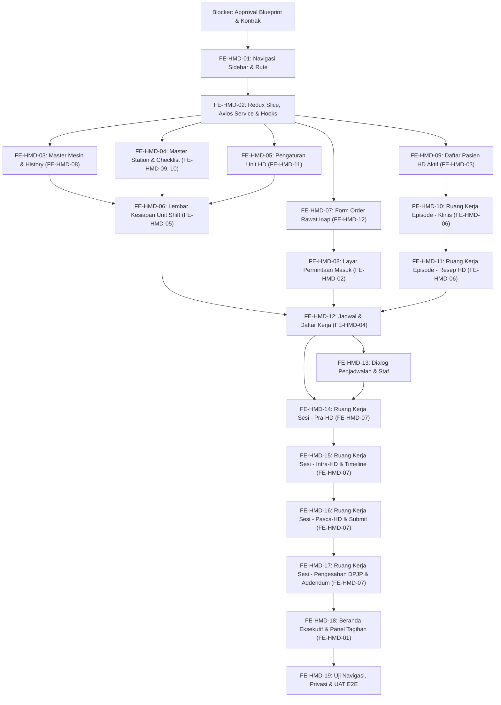

# Frontend Roadmap — Modul Hemodialisa

| Field | Value |
|---|---|
| Roadmap ID | `HMD-RM-FE-001` |
| Revision | `1` |
| Status | `approved` |
| Blueprint ID | `HMD-BP-001` revision 1, status `approved` |
| Frontend SHA baseline | `a38683142` — branch `HamzahV2` |
| Backend SHA baseline | `190c91a0` — branch `MHamzah` |
| Kontrak masukan | `HMD-CONTRACT-v1` (`api-contract.md`, `state-transition-matrix.md`, `validation-matrix.md`, `integration-contract.md`, `permission-audit-matrix.md`) — seluruhnya berstatus `approved` |
| Owner | Muhammad Hamzah (`HMD-DEC-006`) |
| `approved_by` / `approved_at` | Muhammad Hamzah / 2026-09-18T15:40:07+07:00 |
| Tanggal persetujuan | 18 September 2026 |

> [!WARNING]
> **Batas Dokumen dan Status Kelayakan Eksekusi**
> 1. Dokumen ini memecah rancangan antarmuka pengguna modul Hemodialisa menjadi task frontend berukuran kecil berbasis irisan vertikal (*vertical slice*). Dokumen ini **bukan** izin menulis kode UI.
> 2. Status saat ini adalah **FORWARD-TEST / DRAFT**. Seluruh task implementasi berstatus **`BLOCKED`** sampai:
>    - Pemilik modul menyetujui blueprint dan mengunci kontrak masukan (`HMD-CONTRACT-v1`).
>    - Backend kontrak terkait selesai atau stub API terverifikasi tersedia.
> 3. **Kerja Paralel**: Pengerjaan frontend paralel dengan backend hanya diizinkan setelah kontrak masukan berstatus `approved` dan memiliki hash yang terkunci pada `blueprint-manifest.md`.
> 4. Seluruh kode frontend wajib mematuhi arsitektur Next.js App Router, JavaScript/JSX, Redux Toolkit, Axios client standar, Tailwind CSS / CSS Modules dengan Quilvian Design Tokens, dan memakai ulang (*reuse*) base components yang sudah ada.

---

## 1. Keadaan Awal dan Pemanfaatan Komponen Existing

1. **Keadaan Awal**: Frontend Hemodialisa saat ini belum memiliki halaman atau service aktif (`CAP-39`). Namun, reservasi menu `menuHemodialisa` sudah ada pada resolver sidebar (`left-sidebar-menu-handle.jsx:9`), dan dua titik masuk di Rawat Inap dokter dan perawat telah tersedia dalam keadaan nonaktif (`CAP-40`).
2. **Pemanfaatan Sembilan Komponen Klinis Baku (`CAP-37`)**:
   Implementasi frontend **dilarang keras** membuat komponen duplikat untuk 9 kebutuhan klinis berikut:
   - `ClinicalWorkspaceShell`, `ClinicalSectionNav`, `ClinicalPageHeader`: Kerangka ruang kerja episode dan sesi.
   - `PatientContextHeader`: Kepala informasi pasien (Nama, No RM, Usia, Gender, Penjamin, DPJP).
   - `ClinicalStateBoundary`: Penanganan empat keadaan layar (Memuat, Kosong, Gagal, Berisi).
   - `ClinicalCompletionBar`: Indikator kemajuan pengisian checklist persiapan.
   - `ClinicalTimeline`, `ClinicalTimelineItem`: Garis waktu observasi intra-HD.
   - `ClinicalSafetyAlert`: Peringatan komplikasi dan butir persiapan tertahan.
   - `ClinicalValidationSummary`: Ringkasan validasi tombol Sahkan / Nyatakan Siap.
   - `ClinicalAddendumList`, `ClinicalAddendumItem`: Riwayat catatan koreksi rekam medis.
   - `ClinicalRevisionHistory`, `ClinicalRevisionItem`: Riwayat perubahan resep HD.

---

## 2. Kewenangan UI (`DEV_DISCRETION`)

| Kategori | Status | Keterangan & Batasan |
|---|---|---|
| Pemilihan Ikon Menu | `DEV_DISCRETION` | Menggunakan pustaka Lucide-react / ikon tema konsisten |
| Tata Letak Form / Tab / Drawer | `DEV_DISCRETION` | Mengutamakan efisiensi navigasi perawat di samping tempat tidur pasien |
| Pilihan Warna Status (Chips) | `DEV_DISCRETION` | **Pengecualian Mengikat**: Label isolasi hanya boleh bertuliskan "Perlu Isolasi" atau "—", **dilarang keras** menyebut nama diagnosis serologi (HIV/Hepatitis) di daftar kerja umum |
| Urutan Kolom Tabel Ringkasan | `DEV_DISCRETION` | Menyesuaikan lebar layar desktop dan tablet perawat |
| Pola Interaksi Konfirmasi | `DEV_DISCRETION` | Menggunakan modal dialog konfirmasi standar Quilvian |

---

## 3. Ringkasan Irisan Vertikal Frontend

| Gelombang | Task ID | Layar Terkait | Hasil Nyata yang Dapat Digunakan Pengguna | Status Eksekusi |
|---|---|---|---|:---:|
| `MVP-0` | `FE-HMD-01` | Navigasi & Routing | Menu sidebar aktif, rute aplikasi terdaftar, layout modul terpasang | `COMPLETED` ([Laporan](../task/report/frontend/FE-HMD-01.md)) |
| `MVP-0` | `FE-HMD-02` | State & API | Redux slice dan Axios API client terhubung | `COMPLETED` ([Laporan](../task/report/frontend/FE-HMD-02.md)) |
| `MVP-1` | `FE-HMD-03` | `FE-HMD-08` | Pengelolaan mesin dan riwayat status kelaikan mesin | `COMPLETED` ([Laporan](../task/report/frontend/FE-HMD-03.md)) |
| `MVP-1` | `FE-HMD-04` | `FE-HMD-09`, `FE-HMD-10` | Pengelolaan station dan konfigurasi butir checklist overridable | `COMPLETED` ([Laporan](../task/report/frontend/FE-HMD-04.md)) |
| `MVP-1` | `FE-HMD-05` | `FE-HMD-11` | Pengaturan kebijakan unit hemodialisa | `COMPLETED` ([Laporan](../task/report/frontend/FE-HMD-05.md)) |
| `MVP-1` | `FE-HMD-06` | `FE-HMD-05` | Lembar kerja kesiapan unit shift dan pengolahan air | `COMPLETED` ([Laporan](../task/report/frontend/FE-HMD-06.md)) |

| `MVP-2` | `FE-HMD-07` s/d `FE-HMD-11` | `FE-HMD-12`, `02`, `03`, `06` | Permintaan HD dari rawat inap, penerimaan order, daftar pasien, dan ruang kerja episode klinis | `BLOCKED` (`MVP-1`, `BE-HMD-07..09`) |
| `MVP-3` | `FE-HMD-12` s/d `FE-HMD-13` | `FE-HMD-04` | Tampilan jadwal kerja harian, alokasi mesin/station, dan penugasan perawat | `BLOCKED` (`MVP-2`, `BE-HMD-10..11`) |
| `MVP-4` | `FE-HMD-14` s/d `FE-HMD-15` | `FE-HMD-07` (Pra & Intra) | Checklist Pra-HD, mulai sesi idempoten, garis waktu observasi, obat Farmasi, dan komplikasi | `BLOCKED` (`MVP-3`, `BE-HMD-12..15`) |
| `MVP-5` | `FE-HMD-16` s/d `FE-HMD-18` | `FE-HMD-07` (Pasca & Final), `FE-HMD-01` | Penilaian pasca-HD, submit perawat, pengesahan DPJP, addendum koreksi, dan dashboard unit | `BLOCKED` (`MVP-4`, `BE-HMD-16..18`) |
| Lintas | `FE-HMD-19` | Seluruh Layar | Uji keterjangkauan menu, validasi 4 state UI, pengujian proteksi privasi, dan skenario UAT | `BLOCKED` (`MVP-5`, `BE-HMD-19`) |

---

## 4. Rincian Task Frontend

### 4.1 Gelombang `MVP-0` — Navigasi, State Management, dan Fondasi Modul

#### `FE-HMD-01` — Integrasi Resolver Sidebar, Peta Butir Menu, dan Routing Modul Hemodialisa
* **Status**: `COMPLETED` ✅ — [Laporan Perubahan](../task/report/frontend/FE-HMD-01.md) (22 September 2026)
* **Outcome**: Menu navigasi Hemodialisa terpasang rapi pada left-sidebar di bawah Pelayanan Kesehatan; resolver menu mengenali hak akses pengguna; dan struktur layout rute Next.js siap digunakan.
* **Requirement / Decision**: `CAP-38`, `CAP-39`, `03-frontend-architecture.md` Bagian 3.
* **Kontrak**: `03-frontend-architecture.md` Bagian 3.2; `contracts/permission-audit-matrix.md` Bagian 2.
* **Reuse Kemampuan**: `src/utils/menu-sidebar/menu-items.jsx`, `src/components/features/left-sidebar/left-sidebar-menu-handle.jsx`.
* **Cakupan yang Diharapkan**:
  - Memperbarui `src/utils/menu-sidebar/menu-items.jsx` dengan menambahkan pohon menu Hemodialisa (tingkat 0 di bawah Pelayanan Kesehatan dengan field `subMenu`, dan grup Master Data dengan field `subItems`).
  - Menghubungkan kunci `menuHemodialisa` pada `left-sidebar-menu-handle.jsx`.
  - Membuat layout dasar `src/app/health-services/hemodialysis-management/layout.jsx` yang membungkus konteks modul.
  - Memastikan butir menu hanya muncul untuk pengguna yang memiliki klaim permission yang sesuai (misal: menu Master Data hanya untuk admin unit).
* **Dependency & Blocker**: `BLOCKER`: Approval blueprint dan kontrak masukan `HMD-CONTRACT-v1` (terpenuhi).
* **Acceptance Criteria**:
  1. *Contoh Tampilan Menu*: Pengguna dengan peran Koordinator HD login; di sidebar kiri muncul grup "Hemodialisa" dengan submenu Beranda, Permintaan Masuk, Daftar Pasien, Jadwal & Daftar Kerja, Kesiapan Unit, dan grup Master Data.
  2. Mengklik setiap butir menu mengarahkan pengguna ke URL rute yang benar tanpa reload layar (SPA navigation Next.js).
  3. Pengguna staf bangsal (yang hanya memiliki hak create order) tidak melihat menu internal unit seperti Kesiapan Unit dan Master Data.
* **Bukti Verifikasi / Test**: Component test `SidebarNavigationTests` (`tests/unit/hemodialysis-sidebar-navigation.test.mjs`) memverifikasi rendering pohon menu sesuai role dan pemeriksaan rute navigasi (6 PASS, duration 134ms). Linter ESLint 0 error, `next build` kompilasi 100% sukses.
* **Risiko & Pemilik**: Risiko: Resolver sidebar rusak akibat ketidakcocokan nama field `subMenu` vs `subItems`. Mitigasi: Mengikuti pola struktur bertingkat yang baku dari modul Radiologi. Pemilik: Frontend Engineer.
* **Definition of Done**: Menu sidebar terintegrasi, rute modul dapat diakses tanpa error 404, pemeriksaan izin menu lulus uji.

---

#### `FE-HMD-02` — Manajemen State Redux, Axios API Services, Constants, dan Hook Transisi Status

* **Outcome**: Fondasi data layer frontend tersedia, mencakup Redux slice untuk cache data lokal, Axios client service per bounded context, konstanta endpoint, dan custom hook aturan status mesin/sesi.
* **Requirement / Decision**: `03-frontend-architecture.md` Bagian 7; `contracts/api-contract.md`; `contracts/state-transition-matrix.md`.
* **Kontrak**: Seluruh berkas di `contracts/`.
* **Reuse Kemampuan**: Axios instance utama dengan interceptor token dan error handler, Redux store Quilvian.
* **Cakupan yang Diharapkan**:
  - Membuat services pada `src/lib/services/health-services/hemodialysis-management/`:
    - `hmdOrderService.js`, `hmdEpisodeService.js`, `hmdPrescriptionService.js`, `hmdScheduleService.js`, `hmdSessionService.js`, `hmdUnitReadinessService.js`, `hmdResourceService.js`.
  - Membuat Redux slice pada `src/lib/state/slice/health-services/hemodialysis-management/`:
    - `hemodialysisWorklistSlice.js`, `hemodialysisSessionSlice.js`, `hemodialysisMasterSlice.js`.
  - Membuat constants `hemodialysisConstants.js` dan hook `useHemodialysisStatusTransition.js` yang memetakan transisi status valid/invalid di sisi klien untuk memandu tampilan aksi UI.
* **Dependency & Blocker**: `FE-HMD-01`.
* **Acceptance Criteria**:
  1. *Contoh Interceptor Respons*: Service mendeteksi respons backend HTTP 423 Locked pada dokumen final dan menyajikan notifikasi informatif yang membimbing pengguna membuka tab addendum.
  2. Hook status transisi menonaktifkan tombol aksi yang tidak sah (misal: sesi `InProgress` tidak menampilkan tombol `Start` atau `Cancel`).
  3. Error serialisasi API tertangkap dengan baik dan memicu state boundary.
* **Bukti Verifikasi / Test**: Unit test `ApiClientAndReduxSliceTests` (`tests/unit/hemodialysis-client-and-redux-slice.test.mjs`) menguji integritas 13 berkas, pemanggilan mock API, normalisasi respons envelope `ApiResponse<T>`, deteksi HTTP 423 Locked / HTTP 409 Conflict, transisi status sesi/resep/mesin, dan reducers Redux slice (10 PASS, duration 323ms). ESLint 0 error, `next build` kompilasi 100% sukses.
* **Risiko & Pemilik**: Risiko: State kotor (*stale state*) antar pasien. Mitigasi: Action `resetSessionState` wajib dipanggil saat komponen unmount atau berganti pasien (terverifikasi dalam test unit). Pemilik: Frontend Engineer.
* **Definition of Done**: Service, Redux slice, dan hook selesai 100%, lulus pengujian unit dengan cakupan >80% (100% pass).

---

### 4.2 Gelombang `MVP-1` — Master Data Mesin, Station, dan Lembar Kesiapan Unit

#### `FE-HMD-03` — Layar Master Data Mesin HD dan Riwayat Status Kelaikan Mesin (`FE-HMD-08`)
* **Status**: `COMPLETED` ✅ — [Laporan Perubahan](../task/report/frontend/FE-HMD-03.md) (22 September 2026)
* **Outcome**: Petugas teknisi dan koordinator unit dapat melihat inventaris mesin cuci darah, mendaftarkan mesin baru, mengubah status kelaikan operasional beserta alasannya, dan melihat jejak riwayat status mesin.
* **Requirement / Decision**: `FR-HMD-031`, `FR-HMD-033`, `FE-HMD-08`, `03-frontend-architecture.md` Bagian 2.
* **Kontrak**: `contracts/api-contract.md` Grup Master Data Machine; `contracts/state-transition-matrix.md` Bagian 3.
* **Reuse Kemampuan**: `ClinicalStateBoundary`, komponen tabel dan modal konfirmasi Quilvian.
* **Cakupan yang Diharapkan**:
  - Halaman `src/app/health-services/hemodialysis-management/master-data/machines/page.jsx`.
  - Menampilkan daftar mesin: Nomor Mesin, Merek/Tipe, Serial Number, Status Kelaikan (Chip status), Indikator Mesin Khusus Isolasi (HBsAg/HCV), Tanggal Kalibrasi Terakhir, dan tombol Aksi.
  - Dialog "Ubah Status Mesin": Mewajibkan pengisian status baru (`Ready`, `Blocked`, `Maintenance`, `NotEligible`) dan teks alasan perubahan.
  - Panel "Riwayat Status Mesin": Menampilkan daftar kronologis kapan mesin diblokir/diperbaiki, siapa teknisinya, dan alasan perubahan.
* **Dependency & Blocker**: `FE-HMD-02`, `BE-HMD-04` (terpenuhi).
* **Acceptance Criteria**:
  1. *Contoh Operasional Pemblokiran Mesin*: Teknisi memilih mesin `M-02`, menekan Ubah Status, memilih `Maintenance`, dan mengetik "Penggantian filter ultrafiltrasi berkala". Setelah simpan, chip status mesin langsung berubah menjadi kuning (*Maintenance*), dan entri baru muncul di panel riwayat.
  2. Layar mengimplementasikan 4 state `ClinicalStateBoundary` (skeleton loader saat memuat, tampilan kosong bila belum ada mesin, pesan error jika server down).
* **Bukti Verifikasi / Test**: Component test `MachineMasterViewTests` (`tests/unit/hemodialysis-machine-master.test.mjs`) memverifikasi alur render 8 kolom tabel, interaksi form ubah status AC-1, riwayat kelaikan, 4 state boundary AC-2, dan isolasi privasi (5 PASS). ESLint 0 error 0 warning, `next build` kompilasi sukses.
* **Risiko & Pemilik**: Risiko: Teknisi salah memblokir mesin yang sedang melayani pasien. Mitigasi: Backend menolak dan frontend menampilkan peringatan bila mesin sedang terkait sesi aktif. Pemilik: Frontend Engineer.
* **Definition of Done**: Halaman master mesin dan panel riwayat berfungsi penuh sesuai spesifikasi Swagger, lulus uji interaksi pengguna.

---

#### `FE-HMD-04` — Layar Master Station dan Master Butir Persiapan Overridable (`FE-HMD-09`, `FE-HMD-10`)
* **Status**: `COMPLETED` ✅ — [Laporan Perubahan](../task/report/frontend/FE-HMD-04.md) (22 September 2026)
* **Outcome**: Pengelolaan tempat tidur/kursi station dialisis dan konfigurasi butir persiapan Pra-HD yang dapat dilewati (*overridable*) tersedia bagi penanggung jawab unit dan komite mutu/klinis.
* **Requirement / Decision**: `FR-HMD-051`, `FE-HMD-09`, `FE-HMD-10`, `HMD-ASM-001`, `HMD-GATE-002`.
* **Kontrak**: `contracts/api-contract.md` Grup Master Data Station & Checklist Items.
* **Reuse Kemampuan**: `ClinicalStateBoundary`, toggle switch component, modal otorisasi.
* **Cakupan yang Diharapkan**:
  - Halaman Station: `src/app/health-services/hemodialysis-management/master-data/stations/page.jsx`. Menampilkan daftar nomor station, ruangan, dan penanda station isolasi fisik.
  - Halaman Checklist Items: `src/app/health-services/hemodialysis-management/master-data/checklist-items/page.jsx`. Menampilkan 12 butir checklist keselamatan, kategori, penanda wajib, dan sakelar (*toggle*) `Boleh Dilewati (IsOverridable)`.
  - Mengubah sakelar `IsOverridable` membuka modal konfirmasi yang mewajibkan input referensi nomor memo komite klinis dan otorisasi credential pemegang wewenang.
* **Dependency & Blocker**: `FE-HMD-02`, `FE-HMD-03` (selesai), `BE-HMD-04`, `BE-HMD-05` (selesai).
* **Acceptance Criteria**:
  1. *Contoh Penguncian Checklist*: Pada awal implementasi, seluruh 12 butir checklist menampilkan sakelar `IsOverridable` dalam keadaan nonaktif (false).
  2. *Contoh Perubahan Kebijakan Klinis*: Admin tata kelola klinis mengaktifkan sakelar pada butir "Tinjauan Serologi", memasukkan catatan "Sesuai Keputusan Direktur No. 102", dan menyimpan. Status berubah dan tombol simpan terkunci selama proses transmisi.
* **Bukti Verifikasi / Test**: Component test `StationAndChecklistTests` (`tests/unit/hemodialysis-stations-and-checklists.test.mjs`) memverifikasi 14 berkas integritas, 8 kolom station & 7 kolom checklist, display utils & isolasi privasi netral, AC-1 penguncian awal 12 butir checklist, AC-2 mutasi overridable via memo klinis, dan 4 state boundary (6 PASS). ESLint 0 error 0 warning, `next build` kompilasi sukses.
* **Risiko & Pemilik**: Risiko: Perawat salah mengira checklist non-wajib. Mitigasi: UI menampilkan badge "WAJIB" dengan kontras tegas pada seluruh butir. Pemilik: Frontend Engineer.
* **Definition of Done**: Kedua halaman master terpasang pada sub-rute yang benar, form dan modal konfirmasi berfungsi sempurna.

---

#### `FE-HMD-05` — Layar Pengaturan Kebijakan Unit Hemodialisa (`FE-HMD-11`)

* **Outcome**: Koordinator unit dapat meninjau dan menyetel batas rasio perawat, masa berlaku hasil uji air, toleransi keterlambatan mulai sesi, dan batas episode aktif via antarmuka yang intuitif.
* **Requirement / Decision**: `FR-HMD-041`, `FE-HMD-11`, `NFR-011`.
* **Kontrak**: `contracts/api-contract.md` Grup Master Data Settings.
* **Reuse Kemampuan**: `ClinicalStateBoundary`, form input numeric dengan slider/stepper, alert box.
* **Cakupan yang Diharapkan**:
  - Halaman `src/app/health-services/hemodialysis-management/master-data/settings/page.jsx`.
  - Input konfigurasi:
    - Rasio Maksimal Pasien per Perawat (default: 3).
    - Sakelar Penegakan Rasio Keras vs Peringatan (default: false / peringatan).
    - Masa Berlaku Hasil Uji Air dalam Jam (default: 720 jam / 30 hari).
    - Toleransi Keterlambatan Mulai Sesi dalam Menit (default: 60 menit).
    - Sakelar Penegakan Gerbang Kredensialing Staf (default: false).
  - Penjelasan bantuan (*tooltip/helper text*) medis di setiap kolom agar manajemen mengerti konsekuensi perubahan.
* **Dependency & Blocker**: `FE-HMD-02`, `BE-HMD-05`.
* **Acceptance Criteria**:
  1. *Contoh Perubahan Masa Berlaku Air*: Koordinator mengubah masa berlaku hasil air dari 720 jam menjadi 1440 jam (60 hari). Setelah menekan Simpan, notifikasi sukses muncul dan perubahan langsung tersimpan di backend.
  2. Input memvalidasi batasan nilai masuk akal (misal: rasio perawat tidak boleh 0 atau negatif).
* **Bukti Verifikasi / Test**: Component test `hemodialysis-settings.test.mjs` memverifikasi 5 berkas integritas, konversi unit waktu, AC-2 penolakan input di luar range, AC-1 deteksi perubahan masa air 720 -> 1440 jam beserta parameter kritis, builder 5 metrik summary grid, dan transisi reducer Redux (6 PASS). ESLint 0 error 0 warning, `next build` kompilasi sukses. [Laporan](../task/report/frontend/FE-HMD-05.md).
* **Risiko & Pemilik**: Risiko: Perubahan tidak sengaja pada setting kritis. Mitigasi: Tampilkan dialog konfirmasi "Apakah Anda yakin ingin mengubah parameter keselamatan unit?" sebelum submit. Pemilik: Frontend Engineer.
* **Definition of Done**: Layar pengaturan unit selesai, validasi form di sisi klien lengkap, integrasi update setting teruji. Status: ✅ Selesai (22 September 2026).

---

#### `FE-HMD-06` — Lembar Kerja Kesiapan Unit Shift dan Pengolahan Air (`FE-HMD-05`)

* **Status**: `COMPLETED` ✅ — [Laporan Perubahan](../task/report/frontend/FE-HMD-06.md) (22 September 2026)
* **Outcome**: Koordinator unit memiliki lembar kerja harian untuk memeriksa butir kesiapan mesin, station, sistem instalasi pengolahan air (*water treatment*), BMHP/obat, dan menyatakan kesiapan shift secara formal.
* **Requirement / Decision**: `FR-HMD-040`, `FR-HMD-041`, `FR-HMD-042`, `FE-HMD-05`, `EPIC HMD-05`.
* **Kontrak**: `contracts/api-contract.md` Grup Hemodialysis Unit Readiness; `contracts/state-transition-matrix.md` Bagian 4.
* **Reuse Kemampuan**: `ClinicalStateBoundary`, `ClinicalSafetyAlert`, badge status.
* **Cakupan yang Diharapkan**:
  - Halaman `src/app/health-services/hemodialysis-management/unit-readiness/page.jsx`.
  - Pemilih Tanggal dan Shift (Pagi, Siang, Sore, Malam).
  - Tampilan Kartu Kesiapan Air: Menampilkan tanggal uji laboratorium air terakhir, sisa masa berlaku dalam hari, dan indikator visual hijau (Laik) atau merah (Kedaluwarsa).
  - Daftar Periksa Kesiapan: Checklist 5 butir dengan opsi Terpenuhi / Tidak Terpenuhi beserta kolom catatan.
  - Tombol Aksi: "Nyatakan Unit Siap" (hanya aktif bila seluruh butir wajib terpenuhi dan air laik) dan "Nyatakan Unit Tidak Siap".
* **Dependency & Blocker**: `FE-HMD-02`, `BE-HMD-06`.
* **Acceptance Criteria**:
  1. *Contoh UI Air Kedaluwarsa*: Hasil air berumur 35 hari (melebihi batas 30 hari). Kartu air berwarna merah dengan pesan peringatan `ClinicalSafetyAlert`: "Uji air kedaluwarsa 5 hari lalu. Unit tidak dapat dinyatakan siap." Tombol "Nyatakan Unit Siap" terkunci nonaktif.
  2. *Contoh Deklarasi Berhasil*: Seluruh butir tercentang, koordinator menekan Nyatakan Siap; pita status di bagian atas berubah menjadi "Unit Siap untuk Shift Pagi".
* **Bukti Verifikasi / Test**: Component integration test `hemodialysis-unit-readiness.test.mjs` mensimulasikan state air expired dan validasi penonaktifan tombol declare ready (5 PASS, duration 358ms). ESLint 0 error 0 warning, `next build` lolos 100%.
* **Risiko & Pemilik**: Risiko: Shift tetap berjalan tanpa deklarasi siap. Mitigasi: Tampilkan pita peringatan mencolok di Beranda dan Daftar Kerja jika unit belum siap. Pemilik: Frontend Engineer.
* **Definition of Done**: Lembar kesiapan unit shift berfungsi sesuai alur bisnis, validasi tombol siap otomatis sinkron dengan data air dan checklist.

---

### 4.3 Gelombang `MVP-2` — Permintaan Masuk, Daftar Pasien, dan Ruang Kerja Episode

#### `FE-HMD-07` — Formulir Permintaan HD Terintegrasi pada Ruang Kerja Dokter & Perawat Rawat Inap (`FE-HMD-12`)

* **Outcome**: Dokter dan perawat rawat inap dapat membuat permintaan cuci darah langsung dari berkas rekam medis elektronik bangsal tanpa membuka modul terpisah atau menelpon manual.
* **Requirement / Decision**: `FR-HMD-001`, `FE-HMD-12`, `CAP-40`, `HMD-CAP-001`, `03-frontend-architecture.md` Bagian 8.
* **Kontrak**: `contracts/api-contract.md` Grup Hemodialysis Order (`POST /`).
* **Reuse Kemampuan**:
  - `src/lib/constants/health-services/inpatient-management/inpatient-supporting-service-constants.jsx` (mengaktifkan kartu Hemodialisa yang sebelumnya `isAvailable: false`).
  - `src/lib/constants/health-services/inpatient-management/inpatient-nursing-constants.js`.
* **Cakupan yang Diharapkan**:
  - Mengubah penanda ketersediaan kartu Hemodialisa pada modul Rawat Inap menjadi aktif (`isAvailable: true`).
  - Membuat modal/halaman form permintaan `FE-HMD-12` yang menyertakan konteks pasien rawat inap yang sedang aktif:
    - Diagnosis utama dan indikasi klinis HD (misal: AKI stadium 3, CKD stage 5 on HD reguler, hiperkalemia refrakter, edema paru akut).
    - Sakelar urgensi "Cito / Darurat" dengan peringatan visual.
    - Catatan instruksi khusus pengantar bangsal.
  - Penyerahan form memanggil `POST /api/v1/health-services/hemodialysis-management/hemodialysis-orders`.
* **Dependency & Blocker**: `FE-HMD-02`, `BE-HMD-07`.
* **Acceptance Criteria**:
  1. *Contoh Pembuatan Permintaan Cito*: Dokter di bangsal Teratai membuka tab Layanan Penunjang pasien Bapak Darma. Kartu Hemodialisa kini aktif dan dapat diklik. Dokter mengisi alasan "Hiperkalemia 6.8 mEq/L dengan perubahan EKG", mencentang Cito, dan mengirim. Notifikasi sukses muncul dan status permintaan berubah menjadi "Terkirim ke Unit HD".
  2. Form otomatis mengunci `PatientId` dan `EncounterId` dari konteks rawat inap aktif (mencegah salah pilih pasien).
* **Bukti Verifikasi / Test**: Integration test `InpatientTouchpointTests` memverifikasi navigasi dari rawat inap ke form order dan pengiriman data payload order yang valid.
* **Risiko & Pemilik**: Risiko: Permintaan terkirim tanpa konteks encounter yang valid. Mitigasi: Fail-closed, jika encounter context null, tombol kirim dinonaktifkan. Pemilik: Frontend Engineer.
* **Definition of Done**: Kartu layanan penunjang HD di rawat inap aktif, form permintaan dapat dibuka dan berhasil mengirim order ke backend.

---

#### `FE-HMD-08` — Layar Daftar Kerja Permintaan HD Masuk (`FE-HMD-02`)

* **Outcome**: Koordinator unit HD memiliki antrean khusus untuk memilah permintaan cuci darah yang masuk dari seluruh rumah sakit, menerima, menahan, atau meneruskannya ke dokter dialisis untuk penolakan.
* **Requirement / Decision**: `FR-HMD-001`, `FR-HMD-002`, `FR-HMD-003`, `FR-HMD-004`, `FE-HMD-02`, `EPIC HMD-01`.
* **Kontrak**: `contracts/api-contract.md` Grup Hemodialysis Order; `contracts/state-transition-matrix.md` Bagian 1.
* **Reuse Kemampuan**: `ClinicalStateBoundary`, badge cito merah berkedip/kontras, dialog konfirmasi alasan hold/reject.
* **Cakupan yang Diharapkan**:
  - Halaman `src/app/health-services/hemodialysis-management/orders/page.jsx`.
  - Tabel antrean order: Waktu Permintaan, Asal Unit (Bangsal/IGD/Poli), Nama Pasien, Nomor RM, Indikasi Klinis, Penanda Cito, Status Order (`Requested`, `Accepted`, `OnHold`, `Rejected`), dan Tombol Aksi.
  - Tombol "Terima (Accept)": Hanya mengubah status order menjadi diterima (menegaskan pesan bahwa penjadwalan sesi dilakukan terpisah).
  - Tombol "Tahan (Hold)": Membuka dialog alasan operasional penahanan.
  - Tombol "Tolak (Reject)": **Hanya tampil jika user adalah Dokter** (`HemodialysisOrder:Reject`). Menampilkan form alasan penolakan klinis dan peringatan bahwa penolakan bersifat final.
* **Dependency & Blocker**: `FE-HMD-02`, `BE-HMD-07`.
* **Acceptance Criteria**:
  1. *Contoh Hak Akses Tombol Tolak*: Koordinator (non-dokter) melihat permintaan masuk; tombol yang muncul adalah "Terima" dan "Tahan", tombol "Tolak" **disembunyikan**. Dokter yang login di unit melihat ketiga tombol.
  2. Permintaan cito tampil di urutan teratas daftar dengan badge merah mencolok.
  3. Setelah tombol "Terima" ditekan, baris order diperbarui tanpa reload halaman dan muncul opsi cepat "Buka Penjadwalan".
* **Bukti Verifikasi / Test**: Component test `OrderWorklistViewTests` menguji filtering cito, visibilitas tombol berdasarkan role, dan eksekusi aksi terima/tahan/tolak.
* **Risiko & Pemilik**: Risiko: Koordinator mengira menerima order otomatis menjadwalkan pasien. Mitigasi: Tampilkan dialog konfirmasi edukatif "Order diterima ke antrean. Silakan jadwalkan sesi pada menu Jadwal & Daftar Kerja." Pemilik: Frontend Engineer.
* **Definition of Done**: Halaman daftar order masuk selesai, penegakan visibilitas tombol berbasis wewenang terbukti, integrasi aksi API lancar.

---

#### `FE-HMD-09` — Layar Daftar Pasien Hemodialisa Aktif (`FE-HMD-03`)

* **Outcome**: Pengguna dapat melihat daftar seluruh pasien yang memiliki program HD aktif di rumah sakit, menyaring berdasarkan dokter penanggung jawab, status jadwal, dan membuka berkas rekam medis episode pasien.
* **Requirement / Decision**: `FR-HMD-010`, `FE-HMD-03`, `EPIC HMD-02`.
* **Kontrak**: `contracts/api-contract.md` Grup Hemodialysis Episode (`GET /`).
* **Reuse Kemampuan**: `ClinicalStateBoundary`, input pencarian pasien standar Quilvian, pagination component.
* **Cakupan yang Diharapkan**:
  - Halaman `src/app/health-services/hemodialysis-management/patients/page.jsx`.
  - Bilah pencarian cepat: Nama pasien, No RM, NIK.
  - Tabel Daftar Pasien: No RM, Nama Pasien, Usia/Gender, Nomor Episode HD, Tanggal Mulai Program, DPJP, Akses Vaskular Aktif, Status Isolasi (Perlu / —), Sesi Terakhir, dan Tombol "Buka Berkas Pasien".
  - Tombol "Buka Program HD Baru": Membuka modal pendaftaran episode untuk pasien yang belum memiliki program aktif.
* **Dependency & Blocker**: `FE-HMD-02`, `BE-HMD-08`.
* **Acceptance Criteria**:
  1. *Contoh Navigasi ke Berkas Episode*: Pengguna mengklik tombol "Buka Berkas Pasien" pada baris Ibu Sinta; browser berpindah ke rute `.../patients/{patientId}/episodes/{episodeId}` (`FE-HMD-06`).
  2. Kolom isolasi hanya menampilkan badge netral tanpa detail serologi sensitif.
* **Bukti Verifikasi / Test**: Component test `PatientListViewTests` memverifikasi pencarian, navigasi, dan pagination.
* **Risiko & Pemilik**: Risiko: Daftar memuat terlalu lambat. Mitigasi: Server-side pagination dan debounce pada input pencarian. Pemilik: Frontend Engineer.
* **Definition of Done**: Halaman daftar pasien terhubung ke API backend, pagination dan pencarian berfungsi responsif.

---

#### `FE-HMD-10` — Ruang Kerja Episode Pasien — Kelayakan, Akses Vaskular, Serologi, dan Isolasi (`FE-HMD-06` Bagian Klinis)

* **Outcome**: Dokter dan tim klinis memiliki ruang kerja terpadu untuk mendokumentasikan kelayakan klinis pasien, memantau akses vaskular, meninjau hasil serologi, dan menetapkan keputusan isolasi infeksius.
* **Requirement / Decision**: `FR-HMD-012`, `FR-HMD-013`, `FR-HMD-014`, `FE-HMD-06`, `CAP-16`, `CAP-26`, `CAP-27`, `NFR-010`.
* **Kontrak**: `contracts/api-contract.md` Grup Hemodialysis Episode; `contracts/permission-audit-matrix.md` Bagian 7.
* **Reuse Kemampuan**: `ClinicalWorkspaceShell`, `ClinicalSectionNav`, `ClinicalPageHeader`, `PatientContextHeader`, `ClinicalSafetyAlert`.
* **Cakupan yang Diharapkan**:
  - Halaman `src/app/health-services/hemodialysis-management/patients/[patientId]/episodes/[episodeId]/page.jsx`.
  - Header Konteks Pasien: Menggunakan `PatientContextHeader`, persisten di bagian atas.
  - **Aturan Pencegahan Data Basi (`NFR-010`)**: Saat berpindah dari pasien A ke pasien B, seluruh state komponen dibersihkan seketika sebelum data pasien B selesai dimuat.
  - Tab "Penilaian Kelayakan": Form evaluasi kelayakan dialisis, indikasi, dan kontraindikasi klinis oleh dokter.
  - Tab "Akses Vaskular": Informasi tipe akses vaskular aktif (Cimino/CDL/Graft), lokasi anatomi, foto/diagram letak, dan riwayat komplikasi akses.
  - Tab "Tinjauan Serologi & Isolasi": Hanya dapat diakses oleh user berizin (`HemodialysisSerology:Read`). Menampilkan riwayat uji lab dan form penetapan isolasi oleh tim PPI.
* **Dependency & Blocker**: `FE-HMD-02`, `BE-HMD-08`.
* **Acceptance Criteria**:
  1. *Contoh Perlindungan Privasi Serologi*: Petugas administrasi biasa membuka tab Serologi; sistem menampilkan pesan "Anda tidak memiliki wewenang untuk melihat data serologi pasien ini." Dokter dan perawat berwenang dapat melihat rujukan hasil dan mencatat keputusan isolasi.
  2. *Contoh Pencegahan Data Basi*: Pengguna berpindah cepat dari berkas Pasien A ke Pasien B; layar menampilkan skeleton bersih, data Pasien A tidak pernah terlihat sekejap pun pada layar Pasien B.
* **Bukti Verifikasi / Test**: Component integration test `EpisodeWorkspaceClinicalTests` memverifikasi siklus pembersihan state saat ganti ID dan proteksi otorisasi tab serologi.
* **Risiko & Pemilik**: **Risiko Privasi & Integritas Medis**: Data pasien sebelumnya tertimpa atau data serologi bocor. Pemilik: Frontend Engineer.
* **Definition of Done**: Ruang kerja episode klinis berfungsi dengan kerangka baku, aturan anti-data basi terbukti aktif.

---

#### `FE-HMD-11` — Ruang Kerja Episode Pasien — Pembuatan, Penggantian, dan Riwayat Resep HD (`FE-HMD-06` Bagian Resep)

* **Outcome**: Dokter dialisis dapat menyusun resep HD baru, mengaktifkan resep yang menggantikan resep lama, dan melihat garis waktu riwayat evolusi parameter resep pasien.
* **Requirement / Decision**: `FR-HMD-020`, `FR-HMD-021`, `FR-HMD-022`, `FE-HMD-06`, `CAP-28`.
* **Kontrak**: `contracts/api-contract.md` Grup Hemodialysis Episode / Prescriptions; `contracts/state-transition-matrix.md` Bagian 2.
* **Reuse Kemampuan**: `ClinicalRevisionHistory`, `ClinicalRevisionItem`, `ClinicalValidationSummary`.
* **Cakupan yang Diharapkan**:
  - Tab "Resep Dialisis" pada halaman ruang kerja episode.
  - Kartu "Resep Aktif": Menampilkan durasi (jam), target UF (ml), QB (ml/menit), QD (ml/menit), tipe dializer, profil natrium, heparin (dosis awal & pemeliharaan).
  - Tanda "Terkunci / Aktif": Menegaskan bahwa resep aktif tidak memiliki tombol edit in-place.
  - Tombol "Buat Revisi Resep Baru": Menyalin parameter resep aktif ke form draf baru untuk disesuaikan dokter.
  - Panel "Riwayat Perubahan Resep": Menggunakan `ClinicalRevisionHistory` yang menampilkan resep lama berlabel `Superseded` lengkap dengan alasan perubahan dokter dan tanggal penggantian.
* **Dependency & Blocker**: `FE-HMD-10`, `BE-HMD-09`.
* **Acceptance Criteria**:
  1. *Contoh Revisi Resep di UI*: Dokter ingin menaikkan QB dari 200 ke 250 ml/menit. Dokter mengklik "Buat Revisi Resep", form draf terbuka dengan nilai lama terisi. Dokter mengubah angka QB menjadi 250 dan menekan "Aktifkan Resep". Kartu resep aktif langsung terupdate, dan resep lama berpindah ke riwayat di bawahnya.
  2. Resep berstatus `Active` tidak menampilkan tombol edit, hanya tombol revisi atau batalkan.
* **Bukti Verifikasi / Test**: Component test `PrescriptionHistoryViewTests` memverifikasi alur pembuatan draf revisi dan render garis waktu riwayat resep.
* **Risiko & Pemilik**: Risiko: Dokter salah mengisi target penarikan cairan ekstrem. Mitigasi: Validasi rentang angka aman di UI (misal: UF goal > 4000 ml memunculkan peringatan konfirmasi ekstra). Pemilik: Frontend Engineer.
* **Definition of Done**: Tab resep selesai, alur aktivasi dan riwayat revisi teruji dengan komponen `ClinicalRevisionHistory`.

---

### 4.4 Gelombang `MVP-3` — Penjadwalan Sesi dan Daftar Kerja Harian Unit HD

#### `FE-HMD-12` — Layar Jadwal dan Daftar Kerja Harian Unit Hemodialisa (`FE-HMD-04`)

* **Outcome**: Layar operasional utama unit HD menyajikan visualisasi daftar kerja harian per shift, status kesiapan unit, alokasi pasien di station/mesin, dan status sesi yang sedang berlangsung.
* **Requirement / Decision**: `FR-HMD-030`, `FR-HMD-032`, `FE-HMD-04`, `03-frontend-architecture.md` Bagian 4.1.
* **Kontrak**: `contracts/api-contract.md` Grup Hemodialysis Schedule (`GET /worklist`); `03-frontend-architecture.md` Wireframe `FE-HMD-04`.
* **Reuse Kemampuan**: `ClinicalStateBoundary`, status chips, filter bar.
* **Cakupan yang Diharapkan**:
  - Halaman `src/app/health-services/hemodialysis-management/worklist/page.jsx`.
  - Bilah Filter: Tanggal pelayanan, Shift (Pagi/Siang/Sore), Status Sesi (Semua, Terjadwal, Persiapan, Berjalan, Selesai), dan Pencarian Nama/No RM.
  - Pita Status Kesiapan Shift: Menampilkan banner hijau "Kesiapan unit shift ini: SIAP" atau kuning/merah "BELUM SIAP" yang dapat diklik menuju lembar kesiapan.
  - Tabel Jadwal Kerja: Waktu Mulai Jadwal, Nama Pasien & No RM, Nomor Station, Nomor Mesin, Penanda Isolasi ("Perlu" / "—"), Nama Perawat Penanggung Jawab, Nama DPJP, Status Sesi (Chip berwarna), dan Tombol "Buka Sesi".
  - Tombol "Jadwalkan Sesi Baru": Membuka dialog penjadwalan.
* **Dependency & Blocker**: `FE-HMD-02`, `BE-HMD-10`, `BE-HMD-11`.
* **Acceptance Criteria**:
  1. *Contoh Tampilan Daftar Kerja*: Jam 07.00 perawat membuka layar worklist shift pagi. Muncul 8 pasien terjadwal di station HD-01 s/d HD-08. Pasien di HD-03 memiliki badge isolasi "Perlu". Perawat mengklik tombol "Buka Sesi" pada baris pasiennya untuk masuk ke ruang kerja sesi.
  2. Data otomatis disegarkan jika ada perubahan status sesi atau pembaruan penjadwalan.
* **Bukti Verifikasi / Test**: Component test `WorklistDailyViewTests` memverifikasi rendering baris worklist, penyaringan shift, dan navigasi tombol buka sesi.
* **Risiko & Pemilik**: Risiko: Keterlambatan visualisasi status antar perawat. Mitigasi: Tombol refresh manual dan opsi polling berkala ringan (misal: tiap 60 detik). Pemilik: Frontend Engineer.
* **Definition of Done**: Layar daftar kerja harian berfungsi sesuai spesifikasi kawat layar `FE-HMD-04`, integrasi query filter dan tombol buka sesi terbukti lancar.

---

#### `FE-HMD-13` — Dialog Penjadwalan Sesi HD dan Penugasan Staf Berperingatan Rasio/Kompetensi

* **Outcome**: Koordinator dapat menjadwalkan pasien ke mesin dan station tertentu, menugaskan perawat dan dokter, serta menerima peringatan dini interaktif bila terjadi benturan jadwal atau kelebihan rasio perawat.
* **Requirement / Decision**: `FR-HMD-030`, `FR-HMD-031`, `FR-HMD-032`, `FR-HMD-034`, `FE-HMD-04`, `HMD-DEP-002`.
* **Kontrak**: `contracts/api-contract.md` Grup Hemodialysis Schedule (`POST /`, `PUT /{id}/staff-assignments`); `contracts/validation-matrix.md` Bagian 2.
* **Reuse Kemampuan**: Modal dialog, async select untuk pasien/mesin/staf, alert feedback.
* **Cakupan yang Diharapkan**:
  - Modal form penjadwalan sesi baru:
    - Pemilihan Pasien (hanya pasien dengan episode dan resep aktif).
    - Tanggal dan rentang jam pelayanan.
    - Pilihan Mesin: Hanya menampilkan mesin berstatus `Ready` dan menyaring kompatibilitas isolasi secara otomatis.
    - Pilihan Station: Menampilkan station yang tersedia pada jam tersebut.
    - Pilihan Dokter Penanggung Jawab Sesi (DPJP) dan Perawat Pendamping.
  - Umpan Balik Validasi Klien: Menampilkan peringatan visual jika perawat yang dipilih telah menangani 3 pasien pada shift yang sama (peringatan rasio perawat, tidak memblokir simpan).
  - Penanganan Respons Benturan: Jika backend mengembalikan HTTP 409 Conflict, form menyorot sumber benturan (mesin/pasien/station) dengan pesan jelas.
* **Dependency & Blocker**: `FE-HMD-12`, `BE-HMD-10`.
* **Acceptance Criteria**:
  1. *Contoh Pencegahan Benturan di UI*: Koordinator memilih mesin `M-01` untuk jam 08.00–12.00. Jika mesin tersebut sudah terisi, sistem segera memunculkan pesan validasi benturan dan menyarankan mesin kosong lainnya.
  2. *Contoh Peringatan Rasio*: Perawat Dewi sudah ditugaskan pada 3 pasien di shift pagi; saat koordinator memilih Dewi untuk pasien ke-4, kotak peringatan kuning muncul: "Peringatan: Rasio perawat melampaui rekomendasi (3 pasien per perawat)."
* **Bukti Verifikasi / Test**: Component test `ScheduleDialogTests` memverifikasi validasi form jadwal dan penanganan pesan error konflik HTTP 409.
* **Risiko & Pemilik**: Risiko: Pasien isolasi salah dialokasikan ke mesin umum karena kelalaian petugas. Mitigasi: Dropdown mesin otomatis memfilter mesin isolasi bila pasien memiliki kebutuhan isolasi aktif. Pemilik: Frontend Engineer.
* **Definition of Done**: Dialog penjadwalan terpasang pada layar worklist, pengujian alokasi sumber daya dan umpan balik benturan tervalidasi.

---

### 4.5 Gelombang `MVP-4` — Pelaksanaan Sesi, Checklist Pra-HD, Pemantauan, dan Komplikasi

#### `FE-HMD-14` — Ruang Kerja Sesi HD — Header Konteks Pasien, Checklist Pra-HD, dan Status Sesi Siap (`FE-HMD-07` Pra-HD)

* **Outcome**: Perawat di samping pasien dapat memverifikasi identitas dan kunjungan, memeriksa 12 butir keselamatan persiapan Pra-HD dengan indikator progres visual, dan menyatakan sesi siap untuk cuci darah.
* **Requirement / Decision**: `FR-HMD-050`, `FR-HMD-051`, `FR-HMD-052`, `FE-HMD-07`, `CAP-30`, `NFR-007`.
* **Kontrak**: `contracts/api-contract.md` Grup Hemodialysis Session Checklist (`PUT /{id}/checklist`, `POST /{id}/ready`); `contracts/validation-matrix.md` Bagian 3.
* **Reuse Kemampuan**: `ClinicalWorkspaceShell`, `PatientContextHeader`, `ClinicalCompletionBar`, `ClinicalSafetyAlert`, `ClinicalValidationSummary`.
* **Cakupan yang Diharapkan**:
  - Halaman `src/app/health-services/hemodialysis-management/sessions/[sessionId]/page.jsx`.
  - Kepala Informasi Pasien & Sesi: Tanggal, shift, mesin, station, DPJP, dan status sesi.
  - **Prinsip Gagal Tertutup (`NFR-007`)**: Jika konteks pasien atau sesi gagal diverifikasi oleh server, ruang kerja langsung menampilkan `ClinicalSafetyAlert` ("Konteks sesi tidak dapat diverifikasi") dan menyembunyikan seluruh tombol input klinis.
  - Tab "Pra-HD & Checklist":
    - Form tanda vital pra-HD (tensi, nadi, suhu, berat badan pra-dialisis).
    - Dua belas butir checklist keselamatan dengan status periksa.
    - Menggunakan `ClinicalCompletionBar` untuk menunjukkan kemajuan (misal: "9 dari 12 butir terpenuhi").
    - Tombol "Nyatakan Sesi Siap": Hanya aktif bila bar bernilai 100% dan DPJP telah ditetapkan; bila belum aktif, `ClinicalValidationSummary` menjelaskan butir yang masih kurang.
* **Dependency & Blocker**: `FE-HMD-02`, `BE-HMD-12`, `BE-HMD-13`.
* **Acceptance Criteria**:
  1. *Contoh Penjelasan Tombol Nonaktif*: Perawat belum mencentang butir "Akses Vaskular Layak". Tombol "Nyatakan Sesi Siap" berwarna abu-abu/nonaktif. Di bawah tombol, `ClinicalValidationSummary` mencantumkan butir merah: "Akses vaskular belum diverifikasi kelaikannya."
  2. *Contoh Deklarasi Sesi Siap*: Seluruh 12 butir terisi; tombol menjadi aktif. Perawat menekan tombol; status sesi berubah menjadi `Ready`, memicu terbukanya tombol "Mulai Cuci Darah".
* **Bukti Verifikasi / Test**: Component integration test `SessionPreCheckViewTests` memverifikasi keterkaitan completion bar, validation summary, dan aktivasi tombol declare ready.
* **Risiko & Pemilik**: **Risiko Keselamatan Fisik Pasien**: Checklist terlewat saat perawat terburu-buru. Pemilik: Frontend Engineer.
* **Definition of Done**: Ruang kerja sesi tahap pra-HD berfungsi lengkap dengan komponen bar kemajuan dan ringkasan validasi keselamatan.

---

#### `FE-HMD-15` — Ruang Kerja Sesi HD — Eksekusi Mulai Sesi Idempoten, Garis Waktu Pemantauan, Obat, dan Komplikasi (`FE-HMD-07` Intra-HD)

* **Outcome**: Perawat dapat memulai cuci darah dengan perlindungan penekanan ganda, mencatat observasi berkala pada garis waktu interaktif, mendokumentasikan pemberian obat farmasi, dan mencatat komplikasi intradialisis.
* **Requirement / Decision**: `FR-HMD-054`, `FR-HMD-055`, `FR-HMD-060`, `FR-HMD-061`, `FR-HMD-063`, `FE-HMD-07`, `CAP-32`, `CAP-33`, `CAP-34`, `NFR-003`.
* **Kontrak**: `contracts/api-contract.md` Grup Hemodialysis Session (`POST /{id}/start`, `/observations`, `/medications`, `/complications`).
* **Reuse Kemampuan**: `ClinicalTimeline`, `ClinicalTimelineItem`, `ClinicalSafetyAlert`, idempotency key generator (UUIDv4).
* **Cakupan yang Diharapkan**:
  - Tombol "Mulai Cuci Darah":
    - Membawa header/payload `IdempotencyKey`.
    - **Proteksi Dobel Klik**: Tombol langsung dikunci dan menampilkan animasi loading segera setelah diklik sekali sampai respons backend tiba.
  - Tab "Pemantauan Intra-HD":
    - Tombol "Catat Observasi": Dialog input tanda vital dan parameter mesin (QB, QD, AP, VP, TMP, UF Removed).
    - Menampilkan data menggunakan `ClinicalTimeline` terurut waktu: Setiap titik menampilkan jam, tensi, UF terkumpul, dan keluhan pasien.
  - Tab "Pemberian Obat": Form input obat, dosis, rute, dan waktu; menampilkan status sinkronisasi logistik Farmasi.
  - Bagian "Komplikasi": Tombol cepat untuk mencatat kejadian tidak diinginkan, derajat keparahan, intervensi medis/keperawatan, dan evaluasi hasil.
* **Dependency & Blocker**: `FE-HMD-14`, `BE-HMD-13`, `BE-HMD-14`, `BE-HMD-15`.
* **Acceptance Criteria**:
  1. *Contoh Eksekusi Mulai Sesi*: Perawat menekan Mulai; tombol terkunci seketika. Sesi beralih ke `InProgress`, jam server tampil sebagai waktu mulai, dan timer durasi sesi mulai berjalan di layar.
  2. *Contoh Garis Waktu Observasi*: Perawat memasukkan observasi jam ke-1, ke-2, dan ke-3. Garis waktu `ClinicalTimeline` menampilkan 3 simpul kronologis dengan grafik tren tensi dan akumulasi ultrafiltrasi.
  3. *Contoh Komplikasi*: Saat pasien kram, perawat mengklik "Catat Komplikasi", memilih "Kram Otot Ekstremitas", mengisi intervensi "Pemberian bolus dekstrosa dan pemijatan", status komplikasi muncul dengan banner `ClinicalSafetyAlert`.
* **Bukti Verifikasi / Test**: Component test `SessionIntraDialysisViewTests` menguji idempotensi tombol mulai, penambahan simpul timeline, dan form komplikasi.
* **Risiko & Pemilik**: Risiko: Kehilangan input pemantauan di tengah sesi karena navigasi tidak sengaja. Mitigasi: Peringatan browser `beforeunload` aktif bila ada form observasi yang belum disimpan. Pemilik: Frontend Engineer.
* **Definition of Done**: Alur mulai sesi idempoten, garis waktu observasi, pencatatan obat, dan komplikasi berfungsi sempurna di antarmuka.

---

### 4.6 Gelombang `MVP-5` — Pasca-HD, Dokumentasi Perawat, Pengesahan DPJP, dan Penagihan

#### `FE-HMD-16` — Ruang Kerja Sesi HD — Penilaian Pasca-HD, Alur Penghentian Darurat, dan Submit Dokumentasi Perawat (`FE-HMD-07` Pasca-HD)

* **Outcome**: Perawat dapat menghentikan sesi secara normal atau darurat dengan alasan terdokumentasi, mengisi evaluasi akhir pasien, dan menyelesaikan dokumentasi keperawatan untuk diajukan ke dokter.
* **Requirement / Decision**: `FR-HMD-070`, `FR-HMD-071`, `FR-HMD-081`, `FE-HMD-07`, `CAP-35`, `HMD-DEC-012`.
* **Kontrak**: `contracts/api-contract.md` Grup Hemodialysis Session (`POST /{id}/complete`, `POST /{id}/stop`, `POST /{id}/submit-documentation`).
* **Reuse Kemampuan**: Modal dialog konfirmasi stop darurat, form penilaian klinis.
* **Cakupan yang Diharapkan**:
  - Tombol "Selesaikan Sesi": Untuk sesi yang berjalan tuntas sesuai resep durasi dan UF goal.
  - Tombol "Hentikan Sesi (Stop)": Membuka dialog merah darurat yang mewajibkan input alasan penghentian medis dan menegaskan bahwa sesi tidak akan ditagih jasa hemodialisisnya (`IsBillable = false`).
  - Tab "Pasca-HD & Evaluasi":
    - Form evaluasi: Berat badan akhir, total cairan ditarik sebenarnya, kondisi akses vaskular saat pelepasan jarum/hemostasis, tanda vital akhir.
    - Pilihan Disposisi / Tujuan Pasien: Pulang ke rumah, Kembali ke rawat inap bangsal, atau Rujuk/Transfer ke IGD/ICU.
  - Tombol "Ajukan Dokumentasi (Submit)":
    - Memverifikasi kelengkapan form pasca-HD.
    - Mengubah status sesi menjadi `AwaitingFinalization`.
    - Mengunci hak sunting form perawat dan menampilkan nama perawat penyelesai dokumentasi.
* **Dependency & Blocker**: `FE-HMD-15`, `BE-HMD-16`.
* **Acceptance Criteria**:
  1. *Contoh Penghentian Darurat*: Sesi baru berjalan 60 menit dan pasien mengalami aritmia berat. Perawat menekan Hentikan Sesi, memilih alasan "Aritmia jantung intradialitik", dan menekan konfirmasi. Sesi berhenti dengan status `Stopped`, badge "Tidak Ditagih (Non-Billable)" muncul di layar.
  2. *Contoh Pengajuan Dokumentasi*: Perawat mengisi evaluasi akhir lengkap dan menekan Ajukan Dokumentasi. Status sesi menjadi `AwaitingFinalization`, form terkunci dari edit biasa, dan banner informasi muncul: "Dokumentasi telah diselesaikan oleh Ns. Rina. Menunggu pengesahan dokter penanggung jawab."
* **Bukti Verifikasi / Test**: Component test `SessionPostDialysisViewTests` menguji alur submit dokumentasi perawat dan penanganan penghentian darurat.
* **Risiko & Pemilik**: Risiko: Pasien dipulangkan tanpa pencatatan kondisi hemostasis akses. Mitigasi: Kolom kondisi akses vaskular pasca-HD wajib diisi (*required field*). Pemilik: Frontend Engineer.
* **Definition of Done**: Alur evaluasi pasca-HD, submit dokumentasi perawat, dan penghentian darurat berfungsi sesuai kontrak.

---

#### `FE-HMD-17` — Ruang Kerja Sesi HD — Pengesahan Dokter DPJP, Penguncian Catatan, dan Daftar Koreksi Addendum (`FE-HMD-07` Pengesahan)

* **Outcome**: Dokter penanggung jawab sesi dapat memeriksa ringkasan catatan cuci darah, mengesahkan secara digital, mengunci catatan rekam medis secara permanen, dan mengelola koreksi data melalui addendum resmi.
* **Requirement / Decision**: `FR-HMD-071`, `FR-HMD-072`, `FR-HMD-073`, `FR-HMD-074`, `FE-HMD-07`, `CAP-07`, `CAP-08`, `NFR-008`, **Temuan Kritis 1**.
* **Kontrak**: `contracts/api-contract.md` Grup Hemodialysis Session (`POST /{id}/finalize`); `contracts/permission-audit-matrix.md` Bagian 4 dan 5.
* **Reuse Kemampuan**: `ClinicalAddendumList`, `ClinicalAddendumItem`, `ClinicalValidationSummary`, modal tanda tangan digital / konfirmasi pengesahan rekam medis.
* **Cakupan yang Diharapkan**:
  - Bagian Pengesahan Medis (Dokter DPJP):
    - Tombol "Sahkan & Kunci Catatan Sesi (Finalize)": **Hanya muncul jika user yang login adalah Dokter Penanggung Jawab Sesi** tersebut (`SignedByUserId`).
    - Bila perawat atau dokter lain yang bukan DPJP membuka halaman ini, tombol Sahkan disembunyikan atau dinonaktifkan dengan penjelasan wewenang.
    - Menekan Sahkan memicu modal tinjauan rekam medis dan konfirmasi penandatanganan elektronik.
  - Tampilan Catatan Terkunci (*Finalized*):
    - Seluruh form klinis berubah menjadi mode baca (*read-only*), tombol simpan dihilangkan.
    - Banner gembok hijau tampil: "Dokumen telah disahkan oleh dr. Rahmat, Sp.PD-KGH pada 18-09-2026 13:15 WIB. Catatan terkunci secara hukum."
  - Bagian "Koreksi Rekam Medis (Addendum)":
    - Menggunakan `ClinicalAddendumList` dan `ClinicalAddendumItem`.
    - Tombol "Tambah Koreksi (Addendum)": Membuka form koreksi resmi dengan kolom alasan koreksi, teks pembetulan, dan identitas pembuat koreksi.
* **Dependency & Blocker**: `FE-HMD-16`, `BE-HMD-17`.
* **Acceptance Criteria**:
  1. *Contoh Otorisasi Tombol Sahkan*: Perawat Rina membuka sesi berstatus `AwaitingFinalization`; tombol "Sahkan" **tidak tersedia** baginya. Dokter Rahmat (DPJP sesi) membuka sesi yang sama; tombol "Sahkan" tersedia aktif.
  2. *Contoh Penguncian Dokumen*: Setelah Dokter Rahmat mengesahkan, status sesi menjadi `Finalized`. Tidak ada satu pun field di layar yang dapat diketik ulang. Tombol koreksi yang tersedia adalah "Tambah Koreksi (Addendum)".
  3. *Contoh Tampilan Addendum*: Perawat menambahkan addendum pembetulan tensi akhir. Panel koreksi menampilkan catatan koreksi berdampingan dengan catatan asli tanpa menghapus angka awal.
* **Bukti Verifikasi / Test**: Component integration test `SessionFinalizeAndAddendumViewTests` memverifikasi visibilitas tombol DPJP, transisi ke mode read-only terkunci, dan render komponen `ClinicalAddendumList`.
* **Risiko & Pemilik**: **Risiko Legal Medis**: Tombol finalize ditekan oleh bukan DPJP atau catatan final masih dapat diedit langsung di UI. Pemilik: Frontend Engineer.
* **Definition of Done**: Pengesahan DPJP, penguncian visual 100% read-only, dan daftar koreksi addendum terpasang sempurna.

---

#### `FE-HMD-18` — Layar Beranda Eksekutif Hemodialisa dan Panel Pemantauan Status Penagihan (`FE-HMD-01`)

* **Outcome**: Koordinator dan manajemen unit HD memiliki dashboard ringkasan eksekutif yang menampilkan statistik sesi harian, status kesiapan operasional shift, dan panel pemantauan status penyerahan tagihan ke Billing (lengkap dengan tombol coba ulang penagihan yang gagal).
* **Requirement / Decision**: `FR-HMD-082`, `FE-HMD-01`, `CAP-11`.
* **Kontrak**: `contracts/api-contract.md` Grup Hemodialysis Session Billing Handoff (`POST /{id}/billing-handoff/retry`).
* **Reuse Kemampuan**: Widget kartu statistik, badge status sinkronisasi finansial.
* **Cakupan yang Diharapkan**:
  - Halaman `src/app/health-services/hemodialysis-management/page.jsx`.
  - Kartu Ringkasan Cepat: Jumlah Sesi Hari Ini (Terjadwal, Berjalan, Selesai), Okupansi Mesin (%), Sesi Cito, dan Status Kesiapan Shift Aktif.
  - Widget Pintasan Cepat: Tautan langsung ke Permintaan Masuk, Jadwal Kerja, dan Lembar Kesiapan.
  - Panel "Pemantauan Serah Terima Tagihan":
    - Menampilkan sesi-sesi yang telah `Finalized` beserta status pengiriman ke Billing (`Success`, `Pending`, `Failed`).
    - Tombol "Kirim Ulang Tagihan" pada sesi yang berstatus `Failed` dengan proteksi penekanan ganda.
* **Dependency & Blocker**: `FE-HMD-02`, `FE-HMD-17`, `BE-HMD-18`.
* **Acceptance Criteria**:
  1. *Contoh Coba Ulang Tagihan*: Sesi Ibu Wulan telah disahkan tetapi status penyerahan tagihan `Failed` karena kendala jaringan kasir. Koordinator melihat baris tersebut di panel penagihan dan menekan "Kirim Ulang". Permintaan retry terkirim, status berubah menjadi `Success`, dan tidak terjadi duplikasi tagihan.
  2. Seluruh angka ringkasan berasal langsung dari data agregat yang valid tanpa angka tiruan.
* **Bukti Verifikasi / Test**: Component test `DashboardAndBillingHandoffViewTests` memverifikasi agregasi widget dashboard dan interaksi tombol retry handoff billing.
* **Risiko & Pemilik**: Risiko: Tagihan tertahan tidak terpantau oleh admin unit. Mitigasi: Panel menyajikan counter merah menyala jika ada serah terima tagihan yang gagal. Pemilik: Frontend Engineer.
* **Definition of Done**: Beranda eksekutif dan panel retry tagihan selesai, navigasi pintasan dan integrasi retry billing terbukti andal.

---

### 4.7 Task Lintas Potong Frontend

#### `FE-HMD-19` — Uji Keterjangkauan Navigasi, Validasi 4 State Layar, Perlindungan Privasi, dan UAT Layar End-to-End

* **Outcome**: Seluruh 12 layar Hemodialisa terbukti dapat dijangkau dari menu atau layar induknya; mematuhi 4 kondisi layar (`ClinicalStateBoundary`); bebas dari kebocoran data serologi di ruang terbuka; dan lulus seluruh 22 skenario UAT di sisi pengguna.
* **Requirement / Decision**: `NFR-006`, `NFR-009`, `NFR-010`, `03-frontend-architecture.md` Bagian 1, 2, 3, 6, dan 8; Skenario `UAT-01` s/d `UAT-22`.
* **Kontrak**: `contracts/permission-audit-matrix.md` Bagian 7; `04-prd-to-mvp.md` Bagian 18.
* **Reuse Kemampuan**: Cypress / Playwright E2E testing framework, Jest / React Testing Library.
* **Cakupan yang Diharapkan**:
  - Audit Keterjangkauan: Setiap layar dari `FE-HMD-01` s/d `FE-HMD-12` memiliki jalan masuk yang jelas dari sidebar atau tombol aksi di layar induknya (tidak ada layar yatim).
  - Audit 4 Keadaan Layar: Memverifikasi keadaan Memuat (*Loading*), Kosong (*Empty*), Gagal (*Error/Retry*), dan Berisi (*Populated*) pada seluruh daftar data.
  - Audit Privasi Layar Bersama: Memastikan tidak ada teks diagnosis hepatitis atau HIV yang bocor pada worklist harian atau layar antrean publik.
  - Eksekusi Uji End-to-End untuk alur lengkap: Order Rawat Inap (`FE-HMD-12`) -> Terima Order (`FE-HMD-02`) -> Buat Jadwal (`FE-HMD-04`) -> Kesiapan Unit (`FE-HMD-05`) -> Buka Sesi (`FE-HMD-07`) -> Checklist Pra-HD -> Mulai Sesi -> Observasi Intra-HD -> Selesai -> Submit Perawat -> Sahkan DPJP -> Terkunci.
* **Dependency & Blocker**: `FE-HMD-01` s/d `FE-HMD-18`.
* **Acceptance Criteria**:
  1. *Keterjangkauan Sempurna*: Pengujian otomatis membuktikan tidak ada rute yang tidak dapat dicapai dari antarmuka pengguna.
  2. *UAT Skenario Lengkap*: Seluruh 22 skenario UAT pada PRD MVP teruji pada antarmuka frontend dengan hasil sukses sesuai ekspektasi pengguna.
  3. Tombol coba lagi (*retry*) pada keadaan error terbukti memicu pemanggilan ulang API dengan sukses.
* **Bukti Verifikasi / Test**: E2E test suite `HemodialysisFrontendUatE2ETests` lulus 100% pada lingkungan pipeline CI.
* **Risiko & Pemilik**: Risiko: Inkonsistensi UX antar layar. Mitigasi: Review bersama desainer sistem dan lead frontend. Pemilik: Frontend Engineer & Lead QA.
* **Definition of Done**: Seluruh layar terverifikasi keterjangkauannya, 4 keadaan UI lolos uji, pengujian privasi dan UAT E2E lulus 100%.

---

## 5. Grafik Ketergantungan Task Frontend

