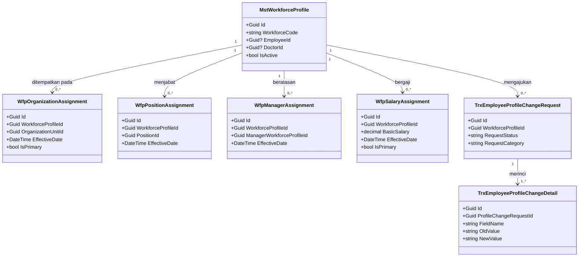
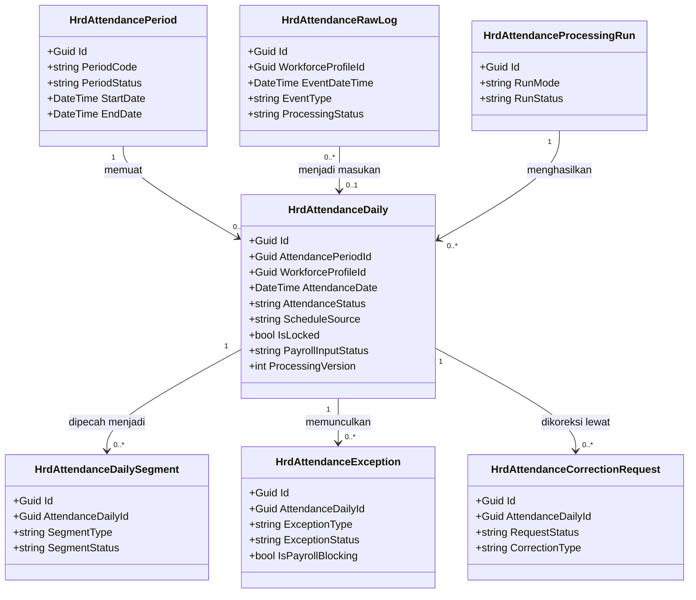
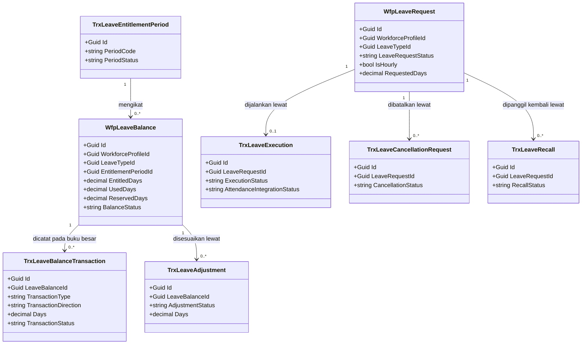
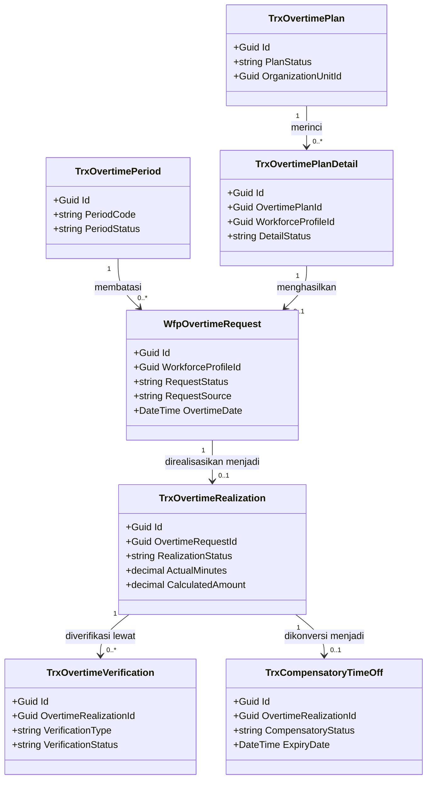
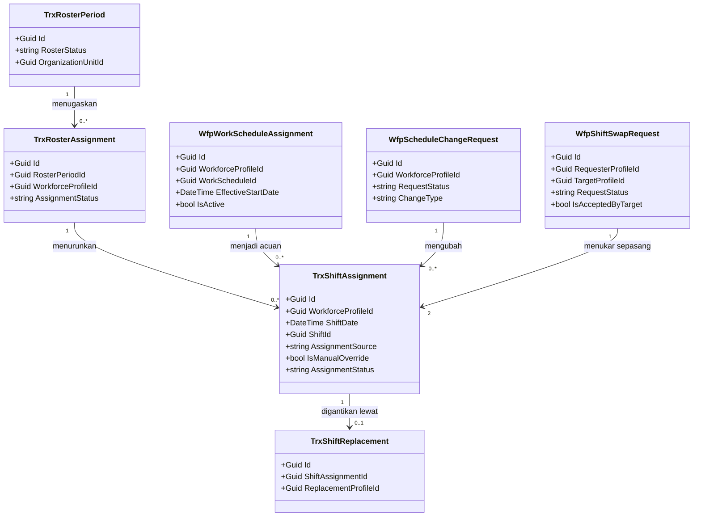
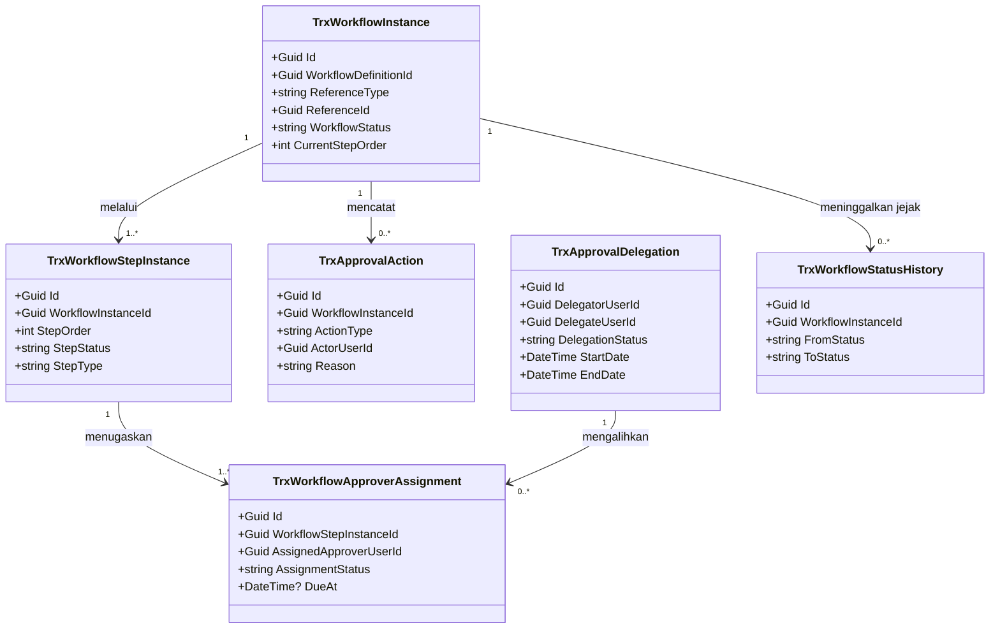
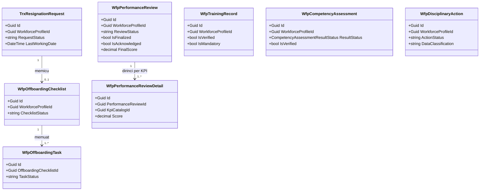

# Human Resource — Arsitektur Backend Target

| Field | Value |
| --- | --- |
| Blueprint ID | `HRD-BP-001` |
| Dokumen | `02-backend-architecture.md` |
| Revision | `1` |
| Status | `draft` — **belum** `approved`. Approval adalah tindakan manusia, bukan keluaran skill |
| Owner desain | Technical owner (`HRD-DEC-015`) |
| `approved_by` / `approved_at` | **Belum ada** |
| Backend baseline canonical | `origin/QuilvianIntegrationBackend` (`HRD-DEC-021`) |
| Backend SHA saat dokumen ini ditulis | `e0ee42c752a5f92c5b1663ff88bef07a5859f79f` (branch kerja `AndryZain`) |
| Backend SHA yang diaudit (historis) | `ecdc135444f0110482c9702212bcea30043983c8` |
| Backend SHA baseline terverifikasi | `16b8b71f4cd61e083213cf90722f4d768d339739` |
| Frontend SHA | `fff76a1b394d4b247c70a04f106c8ec098c9696e` (branch `AgentCodexFrontend`) |
| `input_revision` — decision log | `00-interview-decisions.md` revision `15` |
| `input_hash` — decision log | `da1d74f2e417fd31815cf69b401f390277c361e404d38579bcfa75e0f125f083` |
| `input_revision` — capability map | `01-existing-capability-map.md` revision `1.1` |
| `input_hash` — capability map | `f66edd1514d28ce338130d9aaebfd40ee5678a0037667a3b07fdfbd1326cc510` |
| `input_revision` — roadmap | `roadmap/00-slice-roadmap.md` revision `3` |
| `input_hash` — roadmap | `913fa949dbfe38c2fcce249d1416c983777f76c4587ec796f7a6ac8ca047bb5d` |
| Kesiapan arsitektur domain | `DOMAIN_ARCHITECTURE_NOT_RUN` — `hospital-domain-architect` **tidak** dijalankan untuk slice yang dirancang di sini. Seluruh slice dalam cakupan bersifat administratif ketenagakerjaan dan tidak melintasi kewenangan klinis. Slice yang **memang** melintasi batas klinis (`S-C1`, `S-C6`) sengaja **tidak** dirancang dan tetap `BLOCKED` |
| Kompatibilitas | Tidak ada perubahan yang memutus kontrak berjalan. Seluruh perubahan bersifat penambahan (`EXTEND`) atau perbaikan berbukti (`REPAIR`) |

---

## 0. Cara membaca dokumen ini, dan apa yang dokumen ini **bukan**

Dokumen ini menjawab satu pertanyaan: **bentuk backend seperti apa yang ingin dicapai modul
Human Resource, dan sejauh apa bentuk itu berbeda dari yang ada hari ini.**

| Dokumen ini | Bukan dokumen ini |
| --- | --- |
| Menetapkan batas konteks, kepemilikan data, dan bentuk class target | Memberi wewenang menulis satu baris source pun |
| Menyebut kolom yang berubah satu per satu agar migration dapat direncanakan | Membuat migration, apalagi menjalankannya |
| Menyatakan mana yang `Sudah ada`, `Diperbarui`, dan `Baru` | Menyatakan modul siap rilis |
| Menurunkan seluruh isinya dari keputusan yang sudah dikunci dan bukti source | Mengarang kebijakan ketenagakerjaan atau kewenangan klinis |

Tiga penanda dipakai konsisten, sama seperti pada berkas `flows/`:

| Penanda | Artinya |
| --- | --- |
| `[EXISTING]` | Terbukti ada di source pada baseline saat ini |
| `[DECISION]` | Berasal dari `HRD-DEC-xxx` berstatus `approved` |
| `[OPEN]` | Belum ada keputusan pihak berwenang. **Tidak boleh** dijadikan dasar implementasi |

### 0.1 Larangan yang berlaku sepanjang dokumen

1. **Tidak ada satu baris source aplikasi, migration, entity, controller, service, konfigurasi
   Entity Framework, maupun database yang boleh disentuh dari alur blueprint ini.** Wewenang
   implementasi diberikan terpisah per task lewat `/plan-module-delivery` lalu
   `/build-module-backend`.
2. **Tidak ada rename massal.** `HRD-DEC-019` hanya mengizinkan ratchet `Trx*` → `Hrd*` saat
   entity itu benar-benar *materially touched* oleh sebuah task.
3. **`Wfp*` dan `Mst*` tidak diubah.** `Wfp` adalah prefix yang sah untuk keluarga workforce,
   bukan legacy yang akan dihapus.
4. **Tidak ada route lama yang dimatikan.** `HRD-DEC-016` menuntut alias tetap hidup.
5. **Tidak ada keputusan skema yang merusak data.** `HRD-Q-05` — isi tabel 67 entity tanpa API —
   masih terbuka.

---

## 1. Batas cakupan dokumen ini

### 1.1 Yang dirancang di sini

| Slice | Kelompok kemampuan | Kesiapan |
| --- | --- | --- |
| `S0-A` | Pendaftaran prefix `Wfp` dan `Hrd` pada registry | `READY FOR DESIGN` |
| `S0-B` | Route canonical kebab-case beserta compatibility alias | `READY FOR DESIGN` |
| `S-A1` | Enam halaman daftar lintas-pegawai Administrasi Kepegawaian | `READY FOR DESIGN` |
| `S-A2` s.d. `S-A6` | Layanan mandiri pegawai: cuti, lembur, ubah jadwal/tukar shift, koreksi kehadiran, perubahan data, pengunduran diri, kehadiran | `READY FOR DESIGN` |
| `S-A7` | Kotak masuk persetujuan terpadu beserta mesin SLA dan eskalasi | `READY FOR DESIGN` |
| `S-B1` | Administrasi kehadiran, termasuk koreksi atas nama pegawai | `READY FOR DESIGN` |
| `S-B2` | Administrasi cuti dan saldo | `READY FOR DESIGN` |
| `S-B3` | Administrasi lembur | `READY FOR DESIGN` |
| `S-B4` | Penjadwalan kerja, termasuk roster dan shift harian | `READY FOR DESIGN` |
| `S-B5` | Payroll sisi HR — **`PARTIAL`**, hanya sampai batas `HRD-DEC-009` | `PARTIAL` |
| `S-C2` | Kompetensi dan pelatihan | `READY FOR DESIGN` |
| `S-C3` | Manajemen kinerja | `READY FOR DESIGN` |
| `S-C4` | Lifecycle dan offboarding | `READY FOR DESIGN` |
| `S-C5` | Hubungan karyawan dan kedisiplinan | `READY FOR DESIGN` |
| `S-E` | Ratchet penamaan `Trx` saat entity disentuh — aturan lintas-slice | `READY FOR DESIGN` |

### 1.2 Yang **tidak** dirancang di sini, beserta alasannya

Enam kelompok kemampuan berikut **sengaja tidak diberi arsitektur target**. Tidak ada class,
tidak ada endpoint, tidak ada relasi, dan tidak ada rencana migration untuk keenamnya di dokumen
ini. Merancangnya berarti mengarang kewenangan yang belum diberikan siapa pun.

| Slice | Kelompok kemampuan | Pemblokir | Pemilik keputusan |
| --- | --- | --- | --- |
| `S-C1` | Kredensial, lisensi, kewenangan klinis, SPK/RKK, OPPE, FPPE | `HRD-DEP-005`, `HRD-DEP-007`, `HRD-Q-08` | Komite Medik, setelah `requirement-completeness-gate` dan `hospital-domain-architect` |
| `S-C6` | Kesehatan dan keselamatan kerja staf | `HRD-DEP-007`, `HRD-DEC-010` masih `draft` | K3RS |
| `S-D1` | Perencanaan tenaga kerja | `HRD-Q-05` | Pemilik database |
| `S-D2` | Rekrutmen dan hiring | `HRD-Q-05` | Pemilik database |
| `S-D3` | Benefit | `HRD-Q-05` | Pemilik database |
| `S-D4` | Layanan HR dan tiket kepegawaian | `HRD-Q-05` | Pemilik database |
| `S-D5` | Perjalanan dinas dan reimbursement | `DEFERRED` — prioritas terendah, tetap tunduk `HRD-Q-05` | Pemilik produk |

**Catatan penting yang mudah salah baca.** `CredentialingManagement` (5 controller, 46 endpoint)
dan `OccupationalHealthManagement` (1 controller, 9 endpoint) **memang punya source yang berjalan
hari ini**. Keberadaannya dicatat apa adanya pada tabel kepemilikan data bagian 3, karena modul
ini menyentuhnya sebagai tetangga. Yang dilarang adalah **merancang bentuk targetnya** — bukan
berpura-pura source-nya tidak ada.

### 1.3 Batas payroll — sampai mana yang boleh dirancang

`[DECISION]` `HRD-DEC-009`: tanggung jawab HR atas payroll **berhenti setelah `execute` serah
terima**.

| Boleh dirancang di sini | Tidak boleh dirancang di sini |
| --- | --- |
| Pengumpulan masukan dari kehadiran, cuti, dan lembur | Bentuk data yang diterima Finance (`HRD-Q-10`) |
| Rekonsiliasi selisih antar masukan | Perilaku bila Finance menolak satu batch (`HRD-Q-11`) |
| Perhitungan komponen gaji sisi HR | Pembayaran, posting akuntansi, pajak, pelaporan |
| Kunci periode dan idempotensi serah terima | Apakah Finance menarik atau HR mengirim |
| `rollback` dan `repair` sisi HR | Alur koreksi di sisi Finance |

---

## 2. Bounded context dan kepemilikan

### 2.1 Tujuh bounded context modul HR

Batas di bawah **tidak** diturunkan dari nama folder. Ia diturunkan dari **invariant apa yang
harus dijaga bersama-sama dalam satu transaksi**. Dua data berada di satu konteks bila mengubah
salah satunya tanpa yang lain akan meninggalkan sistem dalam keadaan yang salah.

| ID | Bounded context | Aggregate root | Invariant utama yang dijaga |
| --- | --- | --- | --- |
| `BC-HR-01` | Master dan Referensi HR | Setiap entity `Mst*` berdiri sendiri | Kode master unik dan tidak dapat dipakai ulang; master yang sedang dirujuk transaksi berjalan tidak boleh dinonaktifkan diam-diam |
| `BC-HR-02` | Profil dan Administrasi Workforce | `MstWorkforceProfile` | Satu orang punya tepat satu profil workforce; seluruh berkas turunan (alamat, pendidikan, penempatan, gaji) tidak dapat hidup tanpa profil induknya |
| `BC-HR-03` | Penjadwalan Kerja | `WfpWorkScheduleAssignment` dan `TrxRosterPeriod` | Satu pegawai tidak boleh punya dua jadwal efektif yang bertabrakan pada tanggal yang sama; jadwal pada periode kehadiran tertutup tidak dapat diubah |
| `BC-HR-04` | Kehadiran | `HrdAttendancePeriod` sebagai penjaga periode; `HrdAttendanceDaily` sebagai satuan kerja harian | Rekaman mentah tidak pernah ditulis ulang; periode tidak dapat ditutup selama masih ada pengecualian pemblokir; hasil olahan selalu dapat dihitung ulang dari rekaman mentah |
| `BC-HR-05` | Cuti dan Saldo | `WfpLeaveBalance` sebagai buku besar; `WfpLeaveRequest` sebagai transaksi | Saldo tidak pernah berubah tanpa satu baris buku besar; jumlah baris buku besar selalu sama dengan saldo berjalan |
| `BC-HR-06` | Lembur | `TrxOvertimePeriod` sebagai penjaga periode; `WfpOvertimeRequest` sebagai transaksi | Lembur tidak dapat diserahkan ke payroll sebelum realisasinya terverifikasi; satu pegawai tidak boleh punya dua permohonan lembur yang rentang waktunya bertumpuk |
| `BC-HR-07` | Persetujuan Bersama | `TrxWorkflowInstance` | Satu instance melayani tepat satu transaksi bisnis; keputusan hanya sah dari penyetuju yang ditugaskan; instance tidak pernah memiliki aturan bisnis milik domain |

Dua konteks tambahan berada **di dalam** modul tetapi statusnya tipis, dan justru itu yang
menjadi pekerjaan `EXTEND` terbesar:

| ID | Bounded context | Aggregate root | Keadaan hari ini |
| --- | --- | --- | --- |
| `BC-HR-08` | Lifecycle Kepegawaian | `TrxResignationRequest` (matang); `TrxEmployeeOnboarding` (belum berperilaku) | 21 model, 1 controller, 7 endpoint `[EXISTING]` |
| `BC-HR-09` | Pengembangan Orang | `WfpPerformanceReview`, `WfpTrainingRecord`, `WfpCompetencyAssessment`, `WfpDisciplinaryAction` | Empat controller pencatatan; tidak ada lifecycle penuh `[EXISTING]` |
| `BC-HR-10` | Payroll sisi HR | `TrxPayrollRun` — **belum punya controller sama sekali** | Tiga jalur serah terima domain berjalan; kalkulasi run-level `MISSING` `[EXISTING]` |

### 2.2 Batas transaksi database dan rollback

Aturan yang mengikat setiap service pada modul ini. Ini bukan pilihan gaya; melanggarnya
menghasilkan saldo cuti atau kehadiran yang tidak dapat direkonsiliasi.

| Operasi | Batas transaksi | Bila gagal di tengah |
| --- | --- | --- |
| Menjalankan cuti (`LeaveExecutionProcessorService.ExecuteAsync`) | Satu transaksi memuat perubahan status eksekusi, baris buku besar saldo, dan baris integrasi kehadiran | Seluruhnya dibatalkan; `ExecutionStatus` tetap pada nilai sebelumnya, tidak ada baris buku besar yang tersisa `[EXISTING]` |
| Menerapkan tukar shift (`ShiftSwapService.ApplyAsync`) | Satu transaksi memuat penukaran dua baris `TrxShiftAssignment` **dan** perubahan `RequestStatus = Applied` | Seluruhnya dibatalkan; tidak mungkin ada keadaan "shift sudah tertukar tetapi permohonan belum `Applied`" `[EXISTING]` — dibuktikan `PHASE 2B.1` |
| Menutup periode kehadiran (`AttendancePeriodService.CloseAsync`) | Satu transaksi; pemeriksaan pengecualian pemblokir dan koreksi aktif dijalankan **sebelum** status berubah | Periode tetap `Open`/`Reopened`; petugas melihat daftar penghalang `[EXISTING]` |
| Serah terima kehadiran ke payroll (`AttendancePayrollHandoffService.Execute`) | Satu transaksi memuat pembuatan `TrxPayrollAttendanceInput` dan penguncian `HrdAttendanceDaily.IsLocked` | Seluruhnya dibatalkan; tidak ada hari yang terkunci tanpa snapshot pasangannya `[EXISTING]` |
| Pemrosesan kehadiran harian | Satu transaksi **per pegawai per hari**, bukan per periode | Hari lain tidak terpengaruh; ini yang membuat pemrosesan ulang satu hari aman `[EXISTING]` |
| Menyetujui satu langkah workflow | Satu transaksi memuat perubahan `TrxWorkflowApproverAssignment`, `TrxWorkflowStepInstance`, `TrxWorkflowInstance`, dan `TrxApprovalAction` | Seluruhnya dibatalkan; kotak masuk tidak pernah menampilkan tugas yang setengah diputuskan `[EXISTING]` |

**Aturan yang paling sering dilanggar dan paling mahal:** perubahan saldo cuti **wajib** berada
di dalam transaksi yang sama dengan perubahan status yang memicunya. Menulis saldo lebih dulu
lalu status menyusul akan menghasilkan pegawai yang saldonya terpotong untuk cuti yang tidak
pernah berjalan.

**Contoh nyata supaya batasnya terbaca.** Seorang perawat mengajukan cuti 3 hari. Saat cuti
mulai berjalan, sistem menulis tiga hal sekaligus: `TrxLeaveExecution.ExecutionStatus` menjadi
`Active`, satu baris `TrxLeaveBalanceTransaction` bertipe `Deduction` sebesar 3 hari, dan
`WfpLeaveBalance.UsedDays` bertambah 3. Bila penulisan baris ketiga gagal karena kunci baris,
ketiganya dibatalkan. Yang **tidak boleh terjadi**: eksekusi menjadi `Active` sementara saldo
belum terpotong, karena rekonsiliasi berikutnya akan melaporkan selisih yang tidak punya sebab.

### 2.3 Concurrency — dua petugas mengubah data yang sama

| Data | Risiko | Penjagaan target |
| --- | --- | --- |
| `WfpLeaveBalance` | Dua permohonan cuti disetujui hampir bersamaan, keduanya memakai sisa saldo yang sama | Reservasi saldo saat pengajuan (`LeaveRequestReservationService`) sudah ada `[EXISTING]`. Target menambahkan penguncian baris saldo di dalam transaksi potong |
| `HrdAttendancePeriod` | Dua petugas menutup periode yang sama | Guard `IsEditableStatus` membaca status di dalam transaksi `[EXISTING]` |
| `TrxShiftAssignment` | Dua tukar shift menyentuh baris penugasan yang sama | Guard `RequestStatus != PendingTarget` dan `IsAcceptedByTarget != true` `[EXISTING]`. Target menambahkan pemeriksaan bahwa baris penugasan belum berubah sejak pratinjau |
| `TrxWorkflowApproverAssignment` | Dua penyetuju menekan Setujui bersamaan pada langkah `Any` | Gate `assignment.AssignedApproverUserId == actorContext.UserId` dan status assignment `[EXISTING]` |
| `TrxPayrollRun` | Serah terima dijalankan dua kali | Idempotensi terbukti: kehadiran memakai `ResultStatus.Idempotent`, lembur memakai `IdempotencyKey`, cuti memeriksa baris yang sudah ada `[EXISTING]` |

---

## 3. Tabel kepemilikan data

Ini pertahanan paling langsung terhadap duplikasi entity. Setiap kelompok data yang disentuh
modul HR wajib punya barisnya di sini, beserta jawaban tegas: **dibuat ulang atau tidak.**

| Kelompok data | Modul pemilik | Dipakai modul ini | Dibuat ulang di modul ini |
| --- | :---: | :---: | --- |
| Profil workforce, pegawai, dokter, pengguna eksternal | Human Resource | Ya | Tidak. Pemilik memang HR |
| Organisasi, unit organisasi, jabatan, kelas jabatan, pusat biaya | Human Resource | Ya | Tidak |
| Jenis cuti, kebijakan cuti, kebijakan lembur, tarif lembur | Human Resource | Ya | Tidak |
| Shift, pola shift, kalender kerja, jadwal kerja | Human Resource | Ya | Tidak |
| Definisi workflow, langkah workflow, matriks persetujuan | Human Resource | Ya | Tidak |
| Rekaman kehadiran mentah dan hasil olahan harian | Human Resource | Ya | Tidak |
| Saldo cuti dan buku besar saldo | Human Resource | Ya | Tidak |
| Permohonan lembur, realisasi, verifikasi | Human Resource | Ya | Tidak |
| Akun aplikasi, role, permission, pencabutan akses | Administrator / Identity | Ya | **Tidak.** HR hanya mengirim permintaan buat dan cabut akses; HR **MUST NOT** membuat tabel akun sendiri. Bentuk kontraknya `[OPEN]` — `HRD-DEP-003` |
| Pembayaran gaji, jurnal akuntansi, pajak, pelaporan | Finance | Tidak | **Tidak.** `HRD-DEC-009` menghentikan tanggung jawab HR setelah `execute` |
| Jadwal praktik dokter untuk pendaftaran pasien | Health Services | Tidak | **Tidak.** `HRD-DEC-006` memisahkan jadwal kerja dari jadwal praktik. HR **MUST NOT** menjadi sumber kebenaran jadwal praktik |
| Data klinis pasien, tindakan, volume layanan | Health Services | Tidak | **Tidak.** Sumber angka OPPE ada di sana, tetapi OPPE sendiri `BLOCKED` |
| Penyimpanan berkas fisik (ijazah, STR, sertifikat, bukti koreksi) | Shared platform | Ya | **Tidak.** HR hanya menyimpan metadata dan rujukan path. Kontraknya `[OPEN]` — `HRD-DEP-006` |
| Kredensial, lisensi, kewenangan klinis, SPK/RKK | Human Resource + Komite Medik | Ya, sebagai data yang sudah ada | **Tidak dan tidak dirancang.** `S-C1` `BLOCKED` |
| Rekam kesehatan kerja staf | K3RS | Ya, sebagai data yang sudah ada | **Tidak dan tidak dirancang.** `S-C6` `BLOCKED` |
| Perencanaan tenaga kerja, rekrutmen, benefit, tiket HR | Human Resource | Belum | **Tidak pada pass ini.** `S-D1` s.d. `S-D4` `BLOCKED` oleh `HRD-Q-05` |

**Aturan yang mengikat tabel ini:** tidak boleh ada dua modul yang menjadi sumber kebenaran untuk
fakta yang sama. Bila sebuah task kelak merasa perlu membuat entity yang menduplikasi baris mana
pun di atas, task itu **berhenti** dan pertanyaannya dibawa ke pemilik data yang tercatat, bukan
diselesaikan dengan membuat salinan.

---

## 4. Class diagram per bounded context

Aturan yang berlaku untuk seluruh diagram: **satu diagram harus muat dibaca dalam satu layar.**
Karena itu diagram dipecah per konteks, bukan digambar sekaligus untuk 337 model. Hanya field
yang penting bagi pembaca yang ditampilkan — kunci, status, dan field yang dipakai aturan bisnis.
Field lengkap ada di [`data/data-dictionary.md`](./data/data-dictionary.md).

### 4.1 `BC-HR-02` — Profil dan Administrasi Workforce



### 4.2 `BC-HR-04` — Kehadiran



### 4.3 `BC-HR-05` — Cuti dan Saldo



### 4.4 `BC-HR-06` — Lembur



### 4.5 `BC-HR-03` — Penjadwalan Kerja



### 4.6 `BC-HR-07` — Persetujuan Bersama



### 4.7 `BC-HR-08` dan `BC-HR-09` — Lifecycle dan Pengembangan Orang



---

## 5. Penjelasan setiap class

Setiap class yang muncul pada diagram di atas dijelaskan di sini. Dua baris pertama — **Status**
dan **Lokasi file** — adalah yang paling dibutuhkan implementer dan paling sering terlupa.

Kolom **Status** memakai tiga nilai saja: `Baru`, `Diperbarui`, `Sudah ada`.

### 5.1 `MstWorkforceProfile`

| Aspek | Penjelasan |
| --- | --- |
| **Status** | `Sudah ada` |
| **Lokasi file** | `Areas/Corporate/HumanResource/MasterData/Workforce/Models/MstWorkforceProfile.cs` |
| Kategori | Master |
| Tanggung jawab utama | Menjadi identitas tunggal seseorang di mata modul HR. Baik pegawai tetap, dokter, maupun pengguna eksternal seperti mahasiswa praktik, semuanya punya tepat satu baris di sini. Seluruh berkas kepegawaian, kehadiran, cuti, dan lembur menunjuk ke baris ini, bukan ke tabel pegawai maupun dokter secara langsung |
| Field penting | `WorkforceCode`, `EmployeeId`, `DoctorId`, `ExternalUserId`, `WorkforceTypeId`, `IsActive` |
| Navigation property dan relasi | Punya banyak `WfpOrganizationAssignment`, `WfpPositionAssignment`, `WfpManagerAssignment`, `WfpSalaryAssignment`, dan seluruh entity `Wfp*` lainnya |
| Pemakaian dalam alur bisnis | Aktif sejak pegawai pertama kali didaftarkan, dan tetap aktif sesudah pegawai berhenti — barisnya **tidak** dihapus, hanya ditandai tidak aktif, agar riwayat kehadiran dan payroll tetap dapat ditelusuri |
| Catatan desain | **Jangan** membuat entity pegawai baru untuk keperluan kehadiran, cuti, atau lembur. Seluruh transaksi HR menunjuk `WorkforceProfileId`. Ini adalah pagar utama terhadap duplikasi data orang |
| Ekuivalen model lama | — |

### 5.2 `WfpSalaryAssignment`

| Aspek | Penjelasan |
| --- | --- |
| **Status** | `Sudah ada` |
| **Lokasi file** | `Areas/Corporate/HumanResource/WorkforceCore/Models/WfpSalaryAssignment.cs` |
| Kategori | Transaksi administrasi |
| Tanggung jawab utama | Menyimpan penetapan gaji seorang pegawai beserta tanggal mulai berlakunya. Perubahan gaji **tidak** menimpa baris lama; ia membuat baris baru dengan tanggal berlaku yang berbeda, sehingga riwayat gaji dapat dibaca utuh |
| Field penting | `WorkforceProfileId`, `BasicSalary`, `SalaryGradeId`, `EffectiveDate`, `IsPrimary`, `ApprovalStatus` |
| Navigation property dan relasi | Milik `MstWorkforceProfile`; menunjuk `MstSalaryGrade` |
| Pemakaian dalam alur bisnis | Dibuat HR Admin saat pengangkatan, kenaikan gaji, atau penyesuaian. Dibaca payroll saat menyiapkan komponen gaji |
| Catatan desain | Yang berlaku adalah **tanggal mulai berlaku**, bukan tanggal pencatatan. Penetapan yang berlaku surut ke periode payroll yang sudah tertutup adalah `[OPEN]` — `HRD-Q-18`; desain final menunggu jawaban. Jangan mengarang perilaku retroaktifnya |
| Ekuivalen model lama | — |
| Catatan kewenangan | Jalur persetujuan untuk penetapan gaji **tidak terbukti ada** pada audit `PHASE 2A.1`. Kolom `ApprovalStatus` ada dan endpoint `PATCH {id}/approval` ada, tetapi mesin persetujuan berjenjangnya tidak. `[OPEN]` — `HRD-Q-19` |

### 5.3 `TrxEmployeeProfileChangeRequest`

| Aspek | Penjelasan |
| --- | --- |
| **Status** | `Sudah ada` |
| **Lokasi file** | `Areas/Corporate/HumanResource/WorkforceCore/Models/TrxEmployeeProfileChangeRequest.cs` |
| Kategori | Transaksi administrasi |
| Tanggung jawab utama | Menampung permohonan pegawai untuk mengubah data pribadinya. Perubahan **tidak** langsung berlaku; ia menunggu verifikasi lalu penerapan |
| Field penting | `WorkforceProfileId`, `RequestStatus`, `RequestCategory`, `SubmittedAt`, `AppliedAt` |
| Navigation property dan relasi | Punya banyak `TrxEmployeeProfileChangeDetail` dan `TrxEmployeeProfileChangeVerification` |
| Pemakaian dalam alur bisnis | Diajukan pegawai lewat layanan mandiri, diverifikasi HR, lalu diterapkan ke profil |
| Catatan desain | Kosakata statusnya **berbeda** dari cuti walau sebagian nama nilainya sama. Nilai yang berlaku: `Draft`, `Submitted`, `UnderVerification`, `NeedRevision`, `Approved`, `Rejected`, `Cancelled`, `Applied` — divalidasi array privat `EmployeeProfileChangeService.RequestStatuses`. **Jangan** memakai `LeaveRequestValueConstants.Status` di sini `[EXISTING]` — `HRD-Q-21` tertutup |
| Ekuivalen model lama | — |
| Kelas QBE bila disentuh | `TOUCHED LEGACY` — prefix `Trx` milik HR; ratchet menjadi `HrdEmployeeProfileChangeRequest` berlaku **hanya** bila task memodifikasi entity, konfigurasi EF, tabel, kolom, relasi, index, atau migration-nya (`HRD-DEC-019` bagian 16.5) |

### 5.4 `HrdAttendanceRawLog`

| Aspek | Penjelasan |
| --- | --- |
| **Status** | `Sudah ada` |
| **Lokasi file** | `Areas/Corporate/HumanResource/AttendanceManagement/Models/HrdAttendanceRawLog.cs` |
| Kategori | Transaksi kehadiran |
| Tanggung jawab utama | Menyimpan rekaman mentah dari mesin absensi, aplikasi, atau impor. Ini adalah **fakta**, bukan hasil olahan |
| Field penting | `WorkforceProfileId`, `EventDateTime`, `EventType`, `SourceType`, `ProcessingStatus`, `DeviceId` |
| Navigation property dan relasi | Menjadi masukan bagi `HrdAttendanceDaily` |
| Pemakaian dalam alur bisnis | Masuk setiap kali pegawai menempelkan sidik jari, menekan tombol pada aplikasi, atau saat data diimpor dari mesin |
| Catatan desain | **Invariant yang paling penting di seluruh modul ini: baris di sini tidak pernah ditulis ulang oleh koreksi apa pun.** Koreksi kehadiran memutasi `HrdAttendanceDaily`, bukan rekaman mentah. Dibuktikan pada `PHASE 2A.1`. Setiap desain yang melanggar ini menghilangkan kemampuan menghitung ulang kehadiran dari nol |
| Ekuivalen model lama | `TrxAttendanceRawLog` — sudah diratchet lewat migration `20260819092733_ChangeNameTrxAttendanceToHrdAttendance` |

### 5.5 `HrdAttendanceDaily`

| Aspek | Penjelasan |
| --- | --- |
| **Status** | `Sudah ada` |
| **Lokasi file** | `Areas/Corporate/HumanResource/AttendanceManagement/Models/HrdAttendanceDaily.cs` |
| Kategori | Transaksi kehadiran |
| Tanggung jawab utama | Menyimpan hasil olahan satu hari kerja untuk satu pegawai, setelah jadwal, cuti, lembur, dan koreksi diperhitungkan. Inilah satuan yang dibaca payroll |
| Field penting | `AttendancePeriodId`, `WorkforceProfileId`, `AttendanceDate`, `AttendanceStatus`, `ScheduleSource`, `IsLate`, `LateMinutes`, `IsEarlyLeave`, `EarlyLeaveMinutes`, `IsLocked`, `PayrollInputStatus`, `ProcessingVersion` |
| Navigation property dan relasi | Milik `HrdAttendancePeriod`; punya banyak `HrdAttendanceDailySegment` dan `HrdAttendanceException` |
| Pemakaian dalam alur bisnis | Dihasilkan pemrosesan kehadiran, dilihat pegawai dan HR, dikoreksi lewat permohonan koreksi, lalu dikunci saat diserahkan ke payroll |
| Catatan desain | `ProcessingVersion` naik setiap pemrosesan ulang, sehingga selisih hasil dapat ditelusuri. `IsLocked = true` berarti hari itu sudah masuk snapshot payroll dan **tidak boleh** diubah tanpa `rollback` yang terotorisasi |
| Ekuivalen model lama | `TrxAttendanceDaily` — sudah diratchet |

### 5.6 `HrdAttendancePeriod`

| Aspek | Penjelasan |
| --- | --- |
| **Status** | `Sudah ada` |
| **Lokasi file** | `Areas/Corporate/HumanResource/AttendanceManagement/Models/HrdAttendancePeriod.cs` |
| Kategori | Transaksi kehadiran — penjaga periode |
| Tanggung jawab utama | Menjadi gerbang yang memutuskan kapan data kehadiran satu rentang tanggal boleh berubah dan kapan tidak |
| Field penting | `PeriodCode`, `PeriodStatus`, `StartDate`, `EndDate`, `ClosedAt`, `ClosedByUserId` |
| Navigation property dan relasi | Punya banyak `HrdAttendanceDaily` |
| Pemakaian dalam alur bisnis | Dibuka petugas payroll di awal periode, ditutup setelah seluruh pengecualian selesai, dibuka kembali hanya bila ada temuan |
| Catatan desain | Penutupan **ditolak** bila masih ada `HrdAttendanceException` dengan `IsPayrollBlocking` berstatus `Open`/`UnderReview`, atau masih ada permohonan koreksi aktif `[EXISTING]`. Pembukaan kembali hanya sah dari status `Closed`, dan ditolak bila ada hari yang sudah tertaut payroll `[EXISTING]` |
| Ekuivalen model lama | `TrxAttendancePeriod` — sudah diratchet |

### 5.7 `HrdAttendanceException`

| Aspek | Penjelasan |
| --- | --- |
| **Status** | **`Diperbarui`** |
| **Lokasi file** | `Areas/Corporate/HumanResource/AttendanceManagement/Models/HrdAttendanceException.cs` |
| Kategori | Transaksi kehadiran |
| Tanggung jawab utama | Menandai hal yang tidak wajar pada satu hari kerja — terlambat, pulang cepat, tidak absen masuk, tidak absen pulang, di luar area, dan seterusnya — agar petugas menanganinya sebelum periode ditutup |
| Field penting | `AttendanceDailyId`, `ExceptionType`, `ExceptionStatus`, `ExceptionSeverity`, `IsPayrollBlocking`, `ResolutionNote` |
| Navigation property dan relasi | Milik `HrdAttendanceDaily` |
| Pemakaian dalam alur bisnis | Dibuat otomatis saat pemrosesan; ditinjau HR atau atasan; ditutup lewat koreksi, pengabaian yang tercatat, atau penolakan |
| **Kolom yang berubah** | **Satu nilai baru ditambahkan pada kosakata `ExceptionType`: `OutOfScheduleWork`.** Tidak ada kolom baru pada tabel. Yang berubah adalah himpunan nilai yang sah untuk kolom `ExceptionType` yang sudah ada, ditambah kolom baru `ClassificationDecision` (`string(40)`, boleh kosong) dan `ClassifiedByUserId` (`Guid?`) serta `ClassifiedAt` (`DateTime?`) untuk menyimpan keputusan atasan atas pengecualian jenis ini |
| Catatan desain | `[DECISION]` `HRD-DEC-025`: **`ScheduleMismatch` tidak diperluas maknanya.** Ia tetap berarti *jadwal tidak dapat diselesaikan* (`SCHEDULE_UNRESOLVED`), bukan *kerja di luar jendela jadwal yang valid*. Aktivitas dokter di luar jadwal kerjanya memakai tipe **baru dan terpisah**. Nilai itu **tidak pernah** otomatis menjadi lembur — atasan yang memutuskan klasifikasinya, sejalan `HRD-DEC-013` |
| Ekuivalen model lama | `TrxAttendanceException` — sudah diratchet |

### 5.8 `HrdAttendanceCorrectionRequest`

| Aspek | Penjelasan |
| --- | --- |
| **Status** | **`Diperbarui`** |
| **Lokasi file** | `Areas/Corporate/HumanResource/AttendanceManagement/Models/HrdAttendanceCorrectionRequest.cs` |
| Kategori | Transaksi kehadiran |
| Tanggung jawab utama | Menampung permohonan pegawai untuk memperbaiki hasil olahan kehadirannya, beserta alasan dan buktinya |
| Field penting | `AttendanceDailyId`, `RequestStatus`, `CorrectionType`, `Reason`, `EvidenceFilePath`, `WorkflowInstanceId` |
| Navigation property dan relasi | Milik `HrdAttendanceDaily`; punya banyak `HrdAttendanceCorrectionDetail` dan `HrdAttendanceCorrectionApproval` |
| **Kolom yang berubah** | Empat kolom baru untuk mendukung permohonan atas nama pegawai (`HRD-DEC-028`): `InitiatedByUserId` (`Guid?`), `IsOnBehalf` (`bool`, bawaan `false`), `OnBehalfReason` (`string(500)`, boleh kosong), `OnBehalfNotifiedAt` (`DateTime?`) |
| Catatan desain | `[DECISION]` `HRD-DEC-022`: `Applied` adalah **terminal terhadap sinkronisasi workflow normal**. Endpoint `synchronize` **MUST NOT** menurunkan `Applied` kembali ke `Approved`. Keadaan hari ini melanggar ini dan tercatat sebagai `IMPLEMENTATION DEFECT / REPAIR`, bukan perilaku target. `[DECISION]` `HRD-DEC-028`: HR Admin boleh membuat permohonan atas nama pegawai bila pegawai tidak dapat mengakses layanan mandiri, dengan initiator, alasan, waktu, bukti bila perlu, notifikasi ke pegawai, dan jejak audit **wajib** |
| Ekuivalen model lama | `TrxAttendanceCorrectionRequest` — sudah diratchet |

### 5.9 `WfpLeaveBalance`

| Aspek | Penjelasan |
| --- | --- |
| **Status** | `Sudah ada` |
| **Lokasi file** | `Areas/Corporate/HumanResource/LeaveManagement/Models/WfpLeaveBalance.cs` |
| Kategori | Transaksi cuti — buku besar |
| Tanggung jawab utama | Menyimpan saldo cuti seorang pegawai untuk satu jenis cuti pada satu periode hak. Nilainya **selalu** merupakan hasil penjumlahan seluruh baris buku besar yang menunjuk ke sini |
| Field penting | `WorkforceProfileId`, `LeaveTypeId`, `EntitlementPeriodId`, `EntitledDays`, `UsedDays`, `ReservedDays`, `CarriedForwardDays`, `BalanceStatus` |
| Navigation property dan relasi | Punya banyak `TrxLeaveBalanceTransaction` dan `TrxLeaveAdjustment` |
| Pemakaian dalam alur bisnis | Dibaca saat pegawai mengajukan cuti; dipotong saat cuti mulai berjalan; dikembalikan saat cuti dibatalkan |
| Catatan desain | Satuan yang tersimpan adalah **pecahan hari**, bukan jam maupun menit. Cuti per jam dikonversi satu kali di titik kalkulasi. Saldo **MUST NOT** diubah tanpa satu baris `TrxLeaveBalanceTransaction` pasangannya di dalam transaksi yang sama |
| Ekuivalen model lama | — |

### 5.10 `WfpLeaveRequest`

| Aspek | Penjelasan |
| --- | --- |
| **Status** | `Sudah ada` |
| **Lokasi file** | `Areas/Corporate/HumanResource/LeaveManagement/Models/WfpLeaveRequest.cs` |
| Kategori | Transaksi cuti |
| Tanggung jawab utama | Menampung permohonan cuti seorang pegawai dari pengajuan sampai selesai dijalankan |
| Field penting | `WorkforceProfileId`, `LeaveTypeId`, `LeaveRequestStatus`, `StartDate`, `EndDate`, `IsHourly`, `IsHalfDay`, `RequestedMinutes`, `RequestedDays`, `CurrentApprovalStep`, `WorkflowInstanceId` |
| Navigation property dan relasi | Punya satu `TrxLeaveExecution`, banyak `TrxLeaveRequestAttachment`, `TrxLeaveCancellationRequest`, `TrxLeaveRecall` |
| Pemakaian dalam alur bisnis | Diajukan pegawai, disetujui atasan lewat mesin workflow, dijalankan sistem pada tanggal mulai, diselesaikan pada tanggal akhir |
| Catatan desain | Status domain adalah **`WaitingApproval` tunggal** sepanjang tingkatan persetujuan apa pun. Rantai bertingkat hidup di lapisan `MstWorkflowStep.StepOrder`, **bukan** sebagai status bernama. Komentar granular pada baris 89–92 model ini adalah **template yang disalin**, bukan desain — komentar identik ada pada `TrxExpenseClaim.cs`, entity yang tidak berhubungan. `HRD-Q-44` tertutup |
| Ekuivalen model lama | — |

### 5.11 `TrxLeaveBalanceTransaction`

| Aspek | Penjelasan |
| --- | --- |
| **Status** | `Sudah ada` |
| **Lokasi file** | `Areas/Corporate/HumanResource/LeaveManagement/Models/TrxLeaveBalanceTransaction.cs` |
| Kategori | Transaksi cuti — baris buku besar |
| Tanggung jawab utama | Mencatat setiap pergerakan saldo cuti sebagai satu baris yang tidak dapat diubah, sehingga selisih saldo selalu punya penjelasan |
| Field penting | `LeaveBalanceId`, `TransactionType`, `TransactionDirection`, `Days`, `TransactionStatus`, `ReferenceType`, `ReferenceId` |
| Navigation property dan relasi | Milik `WfpLeaveBalance` |
| Pemakaian dalam alur bisnis | Ditulis setiap kali saldo bertambah atau berkurang: pemberian hak, akrual bulanan, sisa yang dibawa ke periode berikutnya, reservasi, potongan, pengembalian karena pembatalan, penyesuaian manual, kedaluwarsa |
| Catatan desain | Baris yang sudah `Posted` **MUST NOT** diubah. Koreksi dilakukan dengan menulis baris pembalik bertipe `Reversal`, bukan dengan menyunting baris lama. Ini yang membuat buku besar dapat diaudit |
| Ekuivalen model lama | — |
| Kelas QBE bila disentuh | `TOUCHED LEGACY` |

### 5.12 `TrxLeaveExecution`

| Aspek | Penjelasan |
| --- | --- |
| **Status** | **`Diperbarui`** |
| **Lokasi file** | `Areas/Corporate/HumanResource/LeaveManagement/Models/TrxLeaveExecution.cs` |
| Kategori | Transaksi cuti |
| Tanggung jawab utama | Menjalankan cuti yang sudah disetujui: memotong saldo pada tanggal mulai, menandai hari-hari kehadiran sebagai cuti, dan menyelesaikannya pada tanggal akhir |
| Field penting | `LeaveRequestId`, `ExecutionStatus`, `AttendanceIntegrationStatus`, `ExecutedAt`, `CompletedAt` |
| Navigation property dan relasi | Milik `WfpLeaveRequest`; menulis `TrxLeaveAttendanceIntegration` dan `TrxLeaveBalanceTransaction` |
| **Kolom yang berubah** | Empat kolom baru untuk memenuhi `HRD-DEC-023`: `ReversalReason` (`string(500)`, boleh kosong), `ReversedByUserId` (`Guid?`), `ReversedAt` (`DateTime?`), `PayrollLockCheckedAt` (`DateTime?`) |
| Catatan desain | `[DECISION]` `HRD-DEC-023`: cuti `Completed` adalah **business-final untuk operasi normal**, tetapi pembalikan terkendali tetap sah. `Reverse` **wajib** punya permission khusus, alasan wajib, pelaku dan waktu, rekonsiliasi kehadiran, pembalikan saldo, dan guard periode payroll terkunci. **Bila payroll sudah terkunci, histori `Completed` MUST NOT dimutasi langsung** — pakai transaksi penyesuaian terpisah. Keadaan hari ini melanggar keenam syarat itu dan tercatat sebagai `IMPLEMENTATION DEFECT / REPAIR` |
| Ekuivalen model lama | — |
| Kelas QBE bila disentuh | `TOUCHED LEGACY` — menambah kolom adalah *material touch*, sehingga ratchet menjadi `HrdLeaveExecution` berlaku pada task yang sama |

### 5.13 `TrxLeaveRecall`

| Aspek | Penjelasan |
| --- | --- |
| **Status** | **`Diperbarui`** |
| **Lokasi file** | `Areas/Corporate/HumanResource/LeaveManagement/Models/TrxLeaveRecall.cs` |
| Kategori | Transaksi cuti |
| Tanggung jawab utama | Menampung pemanggilan kembali pegawai yang sedang cuti karena kebutuhan pelayanan |
| Field penting | `LeaveRequestId`, `RecallStatus`, `RecallDate`, `ReturnDate`, `Reason` |
| Navigation property dan relasi | Milik `WfpLeaveRequest` |
| **Kolom yang berubah** | Tiga kolom baru untuk `HRD-DEC-024`: `AcknowledgementOverrideReason` (`string(500)`, boleh kosong), `AcknowledgementOverrideByUserId` (`Guid?`), `AcknowledgementOverrideAt` (`DateTime?`) |
| Catatan desain | `[DECISION]` `HRD-DEC-024`: `Acknowledged` **bukan** prasyarat sebelum `Approved`. Urutan target: `WaitingApproval` → `Approved` → notifikasi dikirim → `Acknowledged` → `Applied`. HR Manager boleh melakukan *override* acknowledgement sebelum `Applied` dengan alasan, pelaku, waktu, dan jejak audit wajib. **Pegawai MUST NOT dapat memblokir keputusan organisasi selamanya hanya dengan tidak melakukan acknowledge** |
| Ekuivalen model lama | — |

### 5.14 `WfpOvertimeRequest`

| Aspek | Penjelasan |
| --- | --- |
| **Status** | `Sudah ada` |
| **Lokasi file** | `Areas/Corporate/HumanResource/OvertimeManagement/Models/WfpOvertimeRequest.cs` |
| Kategori | Transaksi lembur |
| Tanggung jawab utama | Menampung permohonan lembur dari pengajuan sampai penyerahan ke payroll |
| Field penting | `WorkforceProfileId`, `RequestStatus`, `RequestSource`, `OvertimeDate`, `PlannedStartAt`, `PlannedEndAt`, `OvertimeCategory`, `WorkflowInstanceId` |
| Navigation property dan relasi | Punya satu `TrxOvertimeRealization`; boleh berasal dari `TrxOvertimePlanDetail` |
| Pemakaian dalam alur bisnis | Diajukan pegawai atau diturunkan dari rencana atasan; disetujui; dikerjakan; direalisasikan; diverifikasi; diserahkan |
| Catatan desain | Lembur berjalan **lima tahap terpisah** — rencana, permohonan, realisasi, verifikasi, serah terima — dan kelimanya **MUST NOT** disatukan. Permohonan yang rentang waktunya bertumpuk ditolak dengan kode `REQUEST_OVERLAP` `[EXISTING]` |
| Ekuivalen model lama | — |

### 5.15 `TrxOvertimeRealization`

| Aspek | Penjelasan |
| --- | --- |
| **Status** | `Sudah ada` |
| **Lokasi file** | `Areas/Corporate/HumanResource/OvertimeManagement/Models/TrxOvertimeRealization.cs` |
| Kategori | Transaksi lembur |
| Tanggung jawab utama | Menyimpan lembur yang **benar-benar dikerjakan**, dihitung dari kehadiran nyata, bukan dari rencana |
| Field penting | `OvertimeRequestId`, `RealizationStatus`, `ActualStartAt`, `ActualEndAt`, `ActualMinutes`, `CalculatedAmount`, `AttendanceMatchStatus` |
| Navigation property dan relasi | Milik `WfpOvertimeRequest`; punya banyak `TrxOvertimeVerification` dan `TrxOvertimeRealizationDetail` |
| Pemakaian dalam alur bisnis | Dihitung setelah lembur selesai dikerjakan, dicocokkan dengan kehadiran, lalu diverifikasi berjenjang |
| Catatan desain | Nominal **selalu** berasal dari backend lewat `OvertimeRateResolverService`; frontend **MUST NOT** menghitung tarif. Penyerahan ke payroll diblokir kecuali `RealizationStatus == Verified` **dan** verifikasi aktif terbaru berstatus `Approved` `[EXISTING]` |
| Ekuivalen model lama | — |
| Kelas QBE bila disentuh | `TOUCHED LEGACY` |

### 5.16 `TrxShiftAssignment`

| Aspek | Penjelasan |
| --- | --- |
| **Status** | **`Diperbarui`** |
| **Lokasi file** | `Areas/Corporate/HumanResource/SchedulingManagement/Models/TrxShiftAssignment.cs` |
| Kategori | Transaksi penjadwalan |
| Tanggung jawab utama | Menyimpan shift yang ditugaskan kepada seorang pegawai pada satu tanggal. Inilah yang dibaca pemroses kehadiran untuk mengetahui jadwal hari itu |
| Field penting | `WorkforceProfileId`, `ShiftDate`, `ShiftId`, `WorkScheduleId`, `ScheduledStartAt`, `ScheduledEndAt`, `PlannedWorkMinutes`, `AssignmentSource`, `IsManualOverride`, `AssignmentStatus`, `IsActive` |
| Navigation property dan relasi | Boleh berasal dari `TrxRosterAssignment`; boleh diubah `WfpScheduleChangeRequest` dan `WfpShiftSwapRequest`; boleh digantikan `TrxShiftReplacement` |
| Pemakaian dalam alur bisnis | Ditulis saat roster diterbitkan atau saat tukar shift diterapkan; dibaca `AttendanceScheduleResolverService` setiap kali kehadiran diproses |
| **Kolom yang berubah** | Tidak ada kolom baru. Yang berubah adalah **statusnya sebagai entity yang memiliki API**: hari ini ia ditulis langsung dari lapisan service tanpa controller. Target `EXTEND` memberinya controller sendiri. Bila `EXTEND` ternyata menuntut kolom, kolom itu **wajib** disebutkan pada revisi dokumen ini lebih dulu, bukan ditambahkan saat implementasi |
| Catatan desain | Tukar shift yang `Applied` **benar-benar** menukar `ShiftDate`, `ShiftId`, `WorkScheduleId`, `ScheduledStartAt/EndAt`, dan `PlannedWorkMinutes` kedua baris, lalu menandai keduanya `AssignmentSource = "ShiftSwap"` dan `IsManualOverride = true` — dan pemroses kehadiran memungutnya `[EXISTING]`, dibuktikan `PHASE 2B.1`. Jangan merancang jalur kedua yang menduplikasi ini |
| Ekuivalen model lama | — |
| Kelas QBE bila disentuh | `TOUCHED LEGACY` — bila `EXTEND` menyentuh entity atau konfigurasi EF-nya, ratchet menjadi `HrdShiftAssignment` berlaku pada task yang sama |

### 5.17 `TrxRosterPeriod`

| Aspek | Penjelasan |
| --- | --- |
| **Status** | `Sudah ada` — **tanpa perilaku** |
| **Lokasi file** | `Areas/Corporate/HumanResource/SchedulingManagement/Models/TrxRosterPeriod.cs` |
| Kategori | Transaksi penjadwalan |
| Tanggung jawab utama | Menjadi wadah satu putaran penyusunan jadwal untuk satu unit pada satu rentang tanggal |
| Field penting | `OrganizationUnitId`, `RosterStatus`, `StartDate`, `EndDate`, `PublishedAt` |
| Navigation property dan relasi | Punya banyak `TrxRosterAssignment`, `TrxRosterPublication`, `TrxRosterApproval` |
| Pemakaian dalam alur bisnis | **Belum dipakai sama sekali.** Kosakata statusnya ada di model (`Draft`, `Validation`, `Submitted`, `Approved`, `Published`, `Locked`, `Closed`, `Cancelled`) tetapi **tidak ada satu pun controller atau service yang mengoperasikannya** `[EXISTING]` |
| Catatan desain | `[DECISION]` `HRD-DEC-026`: untuk rumah sakit 24 jam, roster adalah bagian target, **bukan** `DEFERRED`. Klasifikasi target adalah **`EXTEND` terhadap skema yang sudah ada** — model, konfigurasi EF, dan tabelnya sudah dibuat. **Larangan:** jangan membuat skema baru sebelum model existing diaudit, dan `HRD-Q-05` wajib terjawab lebih dulu bila perubahan destruktif ternyata diperlukan |
| Ekuivalen model lama | — |

### 5.18 `TrxWorkflowInstance`

| Aspek | Penjelasan |
| --- | --- |
| **Status** | **`Diperbarui`** |
| **Lokasi file** | `Areas/Corporate/HumanResource/WorkflowManagement/Models/TrxWorkflowInstance.cs` |
| Kategori | Transaksi persetujuan |
| Tanggung jawab utama | Menjadi mesin persetujuan bersama untuk seluruh jenis transaksi HR: cuti, lembur, koreksi kehadiran, tukar shift, ubah jadwal, perubahan data, pengunduran diri |
| Field penting | `WorkflowDefinitionId`, `ReferenceType`, `ReferenceId`, `WorkflowStatus`, `CurrentStepOrder`, `SubmittedAt`, `CompletedAt` |
| Navigation property dan relasi | Punya banyak `TrxWorkflowStepInstance`, `TrxApprovalAction`, `TrxWorkflowStatusHistory`, `TrxWorkflowComment`, `TrxWorkflowAttachment` |
| Pemakaian dalam alur bisnis | Dibuat saat transaksi diajukan; dimajukan setiap kali penyetuju memutuskan; ditutup saat seluruh langkah selesai |
| **Kolom yang berubah** | Tidak ada kolom baru pada entity ini. Perubahan `EXTEND` untuk `HRD-DEC-030` berada pada `TrxWorkflowApproverAssignment` — lihat 5.19 |
| Catatan desain | `[DECISION]` `HRD-DEC-018`: kotak masuk terpadu **hanya menyatukan pengalaman pengguna**. Workflow, policy, permission, validasi, SLA, dan eskalasi tetap **per jenis transaksi**. Instance ini **MUST NOT** memuat aturan bisnis domain mana pun. Yang boleh diseragamkan hanya bentuk baris ringkasan, cara memfilter, penanda status, dan cara berpindah ke detail |
| Ekuivalen model lama | — |
| Kelas QBE bila disentuh | `TOUCHED LEGACY` |

### 5.19 `TrxWorkflowApproverAssignment`

| Aspek | Penjelasan |
| --- | --- |
| **Status** | **`Diperbarui`** |
| **Lokasi file** | `Areas/Corporate/HumanResource/WorkflowManagement/Models/TrxWorkflowApproverAssignment.cs` |
| Kategori | Transaksi persetujuan |
| Tanggung jawab utama | Menugaskan satu langkah persetujuan kepada satu orang tertentu. Inilah baris yang muncul di kotak masuk seseorang |
| Field penting | `WorkflowStepInstanceId`, `AssignedApproverUserId`, `AssignmentStatus`, `DueAt`, `DecidedAt`, `DelegatedFromUserId` |
| Navigation property dan relasi | Milik `TrxWorkflowStepInstance`; boleh dialihkan `TrxApprovalDelegation` |
| Pemakaian dalam alur bisnis | Dibuat saat langkah menjadi aktif; diputuskan penyetuju; dialihkan bila ada delegasi aktif |
| **Kolom yang berubah** | Empat kolom baru untuk mesin pengingat dan eskalasi (`HRD-DEC-030`): `LastReminderSentAt` (`DateTime?`), `ReminderCount` (`int`, bawaan `0`), `EscalatedAt` (`DateTime?`), `EscalatedToUserId` (`Guid?`) |
| Catatan desain | Gate kewenangan yang **benar-benar berlaku** adalah `assignment.AssignedApproverUserId == actorContext.UserId`, bukan pemeriksaan peran `[EXISTING]`. `[DECISION]` `HRD-DEC-030`: `DueAt`, `ReminderAfterHours`, dan `EscalationAfterHours` **harus benar-benar dieksekusi** oleh pemrosesan terjadwal. `AutoApproveAfterHours` dan `AutoRejectAfterHours` **default mati**, hanya aktif bila definisi workflow transaksi itu secara eksplisit mengizinkan — **dilarang** diberlakukan otomatis ke seluruh transaksi HR |
| Ekuivalen model lama | — |
| Kelas QBE bila disentuh | `TOUCHED LEGACY` — menambah kolom adalah *material touch* |

### 5.20 `WfpPerformanceReview`

| Aspek | Penjelasan |
| --- | --- |
| **Status** | `Sudah ada` |
| **Lokasi file** | `Areas/Corporate/HumanResource/PerformanceManagement/Models/WfpPerformanceReview.cs` |
| Kategori | Transaksi pengembangan orang |
| Tanggung jawab utama | Menyimpan satu penilaian kinerja seorang pegawai untuk satu periode |
| Field penting | `WorkforceProfileId`, `PerformanceCycleId`, `ReviewStatus`, `IsFinalized`, `IsAcknowledged`, `FinalScore`, `OverallScore` |
| Navigation property dan relasi | Punya banyak `WfpPerformanceReviewDetail` |
| Pemakaian dalam alur bisnis | Dibuat saat siklus penilaian berjalan, diisi atasan per KPI, difinalkan, lalu diakui pegawai |
| Catatan desain | `Finalize` **mensyaratkan seluruh detail sudah berskor**, dan `Acknowledge` **mensyaratkan `IsFinalized`** — keduanya benar-benar dijaga kode `[EXISTING]`. Setelah `IsFinalized`, `Update`, `Status`, dan `Delete` ditolak, termasuk pada detailnya. Ini pola yang benar dan **layak ditiru** domain lain |
| Ekuivalen model lama | — |

### 5.21 `WfpDisciplinaryAction`

| Aspek | Penjelasan |
| --- | --- |
| **Status** | `Sudah ada` |
| **Lokasi file** | `Areas/Corporate/HumanResource/EmployeeRelationManagement/Models/WfpDisciplinaryAction.cs` |
| Kategori | Transaksi hubungan karyawan |
| Tanggung jawab utama | Menyimpan tindakan disiplin terhadap seorang pegawai beserta klasifikasi kerahasiaannya |
| Field penting | `WorkforceProfileId`, `ActionStatus`, `DataClassification`, `ViolationTypeId`, `SanctionTypeId`, `EffectiveDate` |
| Navigation property dan relasi | Menunjuk `MstViolationType`, `MstSanctionType`, `MstDisciplinaryActionType` |
| Pemakaian dalam alur bisnis | Dibuat HR, diproses sampai berlaku, diakui pegawai, boleh diajukan banding |
| Catatan desain | **Dua temuan yang tidak boleh disembunyikan.** Pertama, transisinya **lemah**: kode hanya memeriksa keanggotaan himpunan nilai, bukan urutan yang sah — status apa pun dapat berpindah ke status lain. Kedua, **swa-setuju mungkin terjadi**: pembuat tindakan dapat menyetujui tindakannya sendiri. Keduanya dicatat sebagai `[OPEN]` — `HRD-Q-51` dan `HRD-Q-52`, **bukan** diperbaiki diam-diam di dokumen ini. Nilai `DataClassification` `HighlyRestricted` ada, tetapi **tidak ada tingkatan izin khusus** yang menjaganya |
| Ekuivalen model lama | — |

### 5.22 `TrxResignationRequest`

| Aspek | Penjelasan |
| --- | --- |
| **Status** | `Sudah ada` |
| **Lokasi file** | `Areas/Corporate/HumanResource/LifecycleManagement/Models/TrxResignationRequest.cs` |
| Kategori | Transaksi lifecycle |
| Tanggung jawab utama | Menampung pengunduran diri pegawai dari pengajuan sampai serah terima selesai |
| Field penting | `WorkforceProfileId`, `RequestStatus`, `ResignationDate`, `LastWorkingDate`, `Reason`, `WorkflowInstanceId` |
| Navigation property dan relasi | Memicu `WfpOffboardingChecklist` |
| Pemakaian dalam alur bisnis | Satu-satunya alur lifecycle yang benar-benar matang hari ini: 1 dari 21 model yang operasional |
| Catatan desain | Serah terima **idempoten**, dijaga `RequestStatus == Approved` `[EXISTING]`. **Pencabutan akun aplikasi tidak otomatis** — source sendiri memuat peringatan eksplisit soal ini. Kontrak ke Identity `[OPEN]` — `HRD-DEP-003`. Tanggal terakhir bekerja **belum terhubung** ke kehadiran maupun payroll `[OPEN]` — `HRD-Q-50` |
| Ekuivalen model lama | — |
| Kelas QBE bila disentuh | `TOUCHED LEGACY` |

### 5.23 `TrxPayrollRun`

| Aspek | Penjelasan |
| --- | --- |
| **Status** | `Sudah ada` — **tanpa controller sama sekali** |
| **Lokasi file** | `Areas/Corporate/HumanResource/PayrollManagement/Models/TrxPayrollRun.cs` |
| Kategori | Transaksi payroll |
| Tanggung jawab utama | Menjadi wadah satu putaran penggajian untuk satu periode |
| Field penting | `PayrollPeriodId`, `RunStatus`, `IsLocked`, `CalculatedAt`, `SubmittedAt`, `ApprovedAt`, `PostedAt`, `ClosedAt` |
| Navigation property dan relasi | Punya banyak `TrxPayrollRunEmployee`, `TrxPayrollAttendanceInput`, `TrxPayrollOvertimeInput`, `TrxPayrollVariableInput`, `TrxPayrollApproval` |
| Pemakaian dalam alur bisnis | Dibaca ketiga jalur serah terima domain untuk **menolak** penulisan snapshot bila statusnya sudah terminal. Selain itu **tidak ada kode yang memajukan statusnya** `[EXISTING]` |
| Catatan desain | **`Payroll Executed` bukan `Employee Paid`.** Yang sudah berjalan hanyalah pengumpulan snapshot masukan dari tiga domain. Kalkulasi lintas domain menjadi angka gaji: `MISSING`. Persetujuan tingkat run: `MISSING`. Cara run benar-benar dimulai: `[OPEN]` — `HRD-Q-49`. **Bentuk serah terima ke Finance MUST NOT dirancang** sebelum `HRD-Q-10` dan `HRD-Q-11` dijawab |
| Ekuivalen model lama | — |

### 5.24 Service yang menjadi tulang punggung modul

Class diagram di atas menampilkan model. Bagian ini menjelaskan **service**, karena di sinilah
aturan bisnis sebenarnya tinggal. Aturan project: service tidak memakai interface, didaftarkan
`AddScoped<TService>()`, dan di-inject langsung ke constructor controller.

| Service | Status | Lokasi file | Fungsi utama | Dipanggil siapa | Membuka transaksi database |
| --- | --- | --- | --- | --- | :---: |
| `AttendanceProcessingService` | `Sudah ada` | `Areas/Corporate/HumanResource/AttendanceManagement/Services/AttendanceProcessingService.cs` | Mengolah rekaman mentah menjadi kehadiran harian, memanggil resolver jadwal, membangun segmen dan pengecualian | `AttendanceProcessingController`, `AttendanceSchedulerHostedService` | Ya — satu transaksi per pegawai per hari |
| `AttendanceScheduleResolverService` | `Sudah ada` | `.../AttendanceManagement/Services/AttendanceScheduleResolverService.cs` | Menentukan jadwal yang berlaku pada satu tanggal: roster, jadwal tetap, atau hasil tukar shift | `AttendanceProcessingService`, `AttendanceScheduleResolverController` | Tidak — hanya membaca |
| `AttendancePeriodService` | `Sudah ada` | `.../AttendanceManagement/Services/AttendancePeriodService.cs` | Membuka, menutup, membuka kembali, dan membatalkan periode; menegakkan guard penghalang penutupan | `AttendancePeriodController` | Ya |
| `AttendanceCorrectionService` | **`Diperbarui`** | `.../AttendanceManagement/Services/AttendanceCorrectionService.cs` | Mengelola permohonan koreksi beserta bukti; menerapkan koreksi yang disetujui | `AttendanceCorrectionController`, `AttendanceCorrectionSelfServiceController` | Ya |
| `AttendancePayrollHandoffService` | `Sudah ada` | `.../AttendanceManagement/Services/AttendancePayrollHandoffService.cs` | Menyiapkan, menjalankan, memperbaiki, dan membatalkan serah terima kehadiran ke payroll | `AttendancePayrollHandoffController` | Ya |
| `LeaveRequestService` | `Sudah ada` | `.../LeaveManagement/Services/LeaveRequestService.cs` | Membuat, mengubah, mengajukan, dan membatalkan permohonan cuti | `LeaveRequestController` (layanan mandiri) | Ya |
| `LeaveRequestCalculationService` | `Sudah ada` | `.../LeaveManagement/Services/LeaveRequestCalculationService.cs` | Menghitung jumlah hari yang dipotong, termasuk cuti per jam | `LeaveRequestService` | Tidak |
| `LeaveExecutionProcessorService` | **`Diperbarui`** | `.../LeaveManagement/Services/LeaveExecutionProcessorService.cs` | Menjalankan cuti pada tanggal mulai, menyelesaikannya pada tanggal akhir, dan membalikkannya bila perlu | `LeaveExecutionController`, `LeaveExecutionSchedulerHostedService` | Ya |
| `LeaveExecutionBalanceService` | `Sudah ada` | `.../LeaveManagement/Services/LeaveExecutionBalanceService.cs` | Satu-satunya tempat saldo cuti berubah karena eksekusi | `LeaveExecutionProcessorService` | Ikut transaksi pemanggil |
| `WorkflowService` | **`Diperbarui`** | `.../WorkflowManagement/Services/WorkflowService.cs` | Membuat instance, menentukan penyetuju, memajukan langkah, mencatat aksi | Seluruh service domain yang butuh persetujuan | Ya |
| `ApprovalInboxService` | `Sudah ada` | `.../WorkflowManagement/Services/ApprovalInboxService.cs` | Menjawab "apa yang menunggu persetujuan saya", lintas jenis transaksi | `ApprovalInboxController` | Tidak untuk baca; ya untuk keputusan |
| `ApprovalDelegationService` | `Sudah ada` | `.../WorkflowManagement/Services/ApprovalDelegationService.cs` | Mengelola delegasi persetujuan dan memindahkan tugas terbuka | `ApprovalDelegationController` | Ya |
| `ShiftSwapService` | `Sudah ada` | `.../SchedulingManagement/Services/ShiftSwapService.cs` | Mengelola tukar shift dua tahap dan menukar dua baris penugasan shift | `ShiftSwapController`, `ShiftSwapSelfServiceController` | Ya |
| `ScheduleChangeService` | `Sudah ada` | `.../SchedulingManagement/Services/ScheduleChangeService.cs` | Mengelola permohonan ubah jadwal dan menerapkannya | `ScheduleChangeController`, `ScheduleChangeSelfServiceController` | Ya |
| `ResignationRequestService` | `Sudah ada` | `.../LifecycleManagement/Services/ResignationRequestService.cs` | Mengelola pengunduran diri dari draft sampai serah terima | `ResignationController`, `ResignationSelfServiceController` | Ya |
| `EmployeeProfileChangeService` | `Sudah ada` | `.../WorkforceCore/Services/EmployeeProfileChangeService.cs` | Mengelola permohonan perubahan data pribadi beserta verifikasinya | `EmployeeProfileChangeController` dan versi layanan mandirinya | Ya |
| `OvertimePayrollHandoffService` | `Sudah ada` | `.../OvertimeManagement/Services/OvertimePayrollHandoffService.cs` | Menyerahkan realisasi lembur yang terverifikasi ke payroll | `OvertimePayrollHandoffController` | Ya |
| `HumanResourceContextService` | `Sudah ada` | `Shared/HumanResource/Services/HumanResourceContextService.cs` | Menurunkan identitas pegawai, unit, dan atasan dari pengguna yang sedang login | Seluruh controller layanan mandiri | Tidak |
| `WorkflowReminderEscalationService` | **`Baru`** | `.../WorkflowManagement/Services/WorkflowReminderEscalationService.cs` | Membaca `DueAt`, `ReminderAfterHours`, dan `EscalationAfterHours`, lalu benar-benar mengirim pengingat dan menaikkan eskalasi | `WorkflowReminderEscalationHostedService` | Ya |
| `WorkflowReminderEscalationHostedService` | **`Baru`** | `.../WorkflowManagement/Services/WorkflowReminderEscalationHostedService.cs` | Pemrosesan terjadwal yang memanggil service di atas pada interval yang dikonfigurasi | Runtime aplikasi | Tidak langsung |
| `AttendanceCorrectionOnBehalfService` | **`Baru`** | `.../AttendanceManagement/Services/AttendanceCorrectionOnBehalfService.cs` | Membuat permohonan koreksi atas nama pegawai lain oleh HR Admin, menyimpan initiator, alasan, waktu, dan memicu notifikasi | `AttendanceCorrectionController` | Ya |
| `WorkScheduleRetroactiveGuardService` | **`Baru`** | `.../SchedulingManagement/Services/WorkScheduleRetroactiveGuardService.cs` | Mendeteksi apakah perubahan jadwal bersifat berlaku surut atau menyentuh periode terkunci, lalu mengarahkannya ke jalur koreksi terkendali | `WfpWorkScheduleAssignmentController`, `ScheduleChangeService` | Tidak |

**Mengapa keempat service baru itu bukan karangan.** `WorkflowReminderEscalationService` dan
pasangan hosted service-nya lahir langsung dari `HRD-DEC-030`, yang mewajibkan field SLA
benar-benar dieksekusi. `AttendanceCorrectionOnBehalfService` lahir dari `HRD-DEC-028`.
`WorkScheduleRetroactiveGuardService` lahir dari `HRD-DEC-027` bagian kedua. Tidak satu pun
diturunkan dari nama layar, menu, atau task.

### 5.25 Controller yang menjadi permukaan modul

Tabel ini tidak mengulang seluruh 150 controller. Ia mencatat controller yang **berubah** atau
**baru**, karena itulah yang perlu direncanakan. Daftar lengkap permukaan API yang sudah ada
tinggal di [`contracts/api-contract.md`](./contracts/api-contract.md).

| Controller | Status | Lokasi file | Service yang dipakai | Atribut akses | Endpoint yang diurus |
| --- | --- | --- | --- | --- | --- |
| `AttendanceCorrectionController` | **`Diperbarui`** | `Areas/Corporate/HumanResource/AttendanceManagement/Controllers/AttendanceCorrectionController.cs` | `AttendanceCorrectionService`, `AttendanceCorrectionOnBehalfService` | `[Authorize]`, `[AccessController]`, `[AccessAction]`, `[AccessPermission("AttendanceCorrection", "...")]` | Menambah `POST /on-behalf`; memperketat `POST /{id}/workflow/synchronize` agar tidak menurunkan `Applied` |
| `AttendanceExceptionClassificationController` | **`Baru`** | `.../AttendanceManagement/Controllers/AttendanceExceptionClassificationController.cs` | `AttendanceProcessingService` | `[AccessPermission("AttendanceException", "Classify")]` | Menyediakan klasifikasi atasan atas pengecualian `OutOfScheduleWork` (`HRD-DEC-025`) |
| `LeaveExecutionController` | **`Diperbarui`** | `.../LeaveManagement/Controllers/LeaveExecutionController.cs` | `LeaveExecutionProcessorService` | `[AccessPermission("LeaveExecution", "Reverse")]` | `POST /{leaveRequestId}/reverse` diperketat: alasan wajib, guard periode payroll terkunci |
| `LeaveRecallController` | **`Diperbarui`** | `.../LeaveManagement/Controllers/LeaveRecallController.cs` | `LeaveRecallService` | `[AccessPermission("LeaveRecall", "OverrideAcknowledgement")]` | Menambah `POST /{id}/acknowledgement-override` (`HRD-DEC-024`) |
| `RosterPeriodController` | **`Baru`** | `.../SchedulingManagement/Controllers/RosterPeriodController.cs` | `RosterPeriodService` (baru) | `[AccessPermission("RosterPeriod", "...")]` | Siklus roster: susun, validasi, ajukan, setujui, terbitkan, kunci, tutup, batalkan |
| `RosterAssignmentController` | **`Baru`** | `.../SchedulingManagement/Controllers/RosterAssignmentController.cs` | `RosterAssignmentService` (baru) | `[AccessPermission("RosterAssignment", "...")]` | Penugasan pegawai ke roster beserta deteksi bentrok |
| `ShiftAssignmentController` | **`Baru`** | `.../SchedulingManagement/Controllers/ShiftAssignmentController.cs` | `ShiftAssignmentService` (baru) | `[AccessPermission("ShiftAssignment", "...")]` | Penugasan shift harian, sumber yang dibaca pemroses kehadiran |
| `ShiftReplacementController` | **`Baru`** | `.../SchedulingManagement/Controllers/ShiftReplacementController.cs` | `ShiftReplacementService` (baru) | `[AccessPermission("ShiftReplacement", "...")]` | Penggantian shift saat pegawai berhalangan |
| `EmergencyStaffingController` | **`Baru`** | `.../SchedulingManagement/Controllers/EmergencyStaffingController.cs` | `EmergencyStaffingService` (baru) | `[AccessPermission("EmergencyStaffing", "...")]` | Permintaan tenaga darurat |
| `OnCallAssignmentController` | **`Baru`** | `.../SchedulingManagement/Controllers/OnCallAssignmentController.cs` | `OnCallAssignmentService` (baru) | `[AccessPermission("OnCallAssignment", "...")]` | Penugasan siaga aktual, terpisah dari master jenis siaga |
| `WorkforceCoreCrossEmployeeController` | **`Baru`** | `.../WorkforceCore/Controllers/WorkforceCoreCrossEmployeeController.cs` | `WorkforceCoreCrossEmployeeQueryService` (baru) | `[AccessPermission("<Resource>", "ReadAll")]` per sumber daya | Enam daftar lintas-pegawai untuk `HRD-DEC-012` |
| `WfpWorkScheduleAssignmentController` | **`Diperbarui`** | `.../SchedulingManagement/Controllers/WfpWorkScheduleAssignmentController.cs` | `WorkScheduleRetroactiveGuardService` | **Perlu ditambahkan** — lihat catatan di bawah | Menambah guard berlaku surut (`HRD-DEC-027`) |
| Delapan controller master data pada `S0-B` | **`Diperbarui`** | `.../MasterData/**/Controllers/` | tidak berubah | tidak berubah | Menambah **satu route template kebab-case** pada action yang sama. **Dilarang** membuat controller, service, atau validasi kedua |

**Temuan yang harus dicatat, bukan diperbaiki diam-diam.** Audit endpoint pada baseline ini
menemukan dua controller yang **tidak memiliki `[AccessPermission]` pada action-nya**:
`WfpWorkScheduleAssignmentController` (8 endpoint) dan `AttendanceSelfServiceController`
(7 endpoint). Keduanya tetap memiliki `[Authorize]`, sehingga tidak terbuka tanpa autentikasi —
tetapi keduanya **tidak dijaga hak akses per aksi** seperti 148 controller lainnya. Ini dicatat
sebagai temuan untuk task implementasi terpisah, dan menjadi bagian dari
[`contracts/permission-audit-matrix.md`](./contracts/permission-audit-matrix.md) bagian
pengecualian. Dokumen ini **tidak** memperbaikinya.

---

## 6. Arsitektur folder

Pohon di bawah mengikuti [aturan struktur backend](../../../../QuilvianEngineeringSkills/Claude/.claude/skills/design-business-module/references/backend-structure-rules.md)
dan diverifikasi terhadap source, bukan ditebak. Status setiap berkas ditandai.

```text
Areas/Corporate/HumanResource/
├── MasterData/                                   # 65 controller, 618 endpoint — Sudah ada
│   ├── <SubKelompok>/Models/                     #   entity Mst* — Sudah ada, tidak diubah
│   ├── <SubKelompok>/Controllers/                #   delapan di antaranya Diperbarui (alias route S0-B)
│   ├── <SubKelompok>/DTOs/
│   └── EmployeeRelation/                         #   Catatan: empat controller domain ini
│                                                 #   tersimpan di Repositories/Configurations/ —
│                                                 #   utang teknis HRD-TF-004, jangan ditiru
├── WorkforceCore/
│   ├── Models/                                   # Wfp* dan Trx* — Sudah ada
│   ├── Controllers/                              # 14 controller — Sudah ada
│   │   └── WorkforceCoreCrossEmployeeController.cs   # Baru — HRD-DEC-012
│   ├── DTOs/                                     # Diperbarui — DTO daftar lintas-pegawai
│   └── Services/
│       ├── EmployeeProfileChangeService.cs       # Sudah ada
│       └── WorkforceCoreCrossEmployeeQueryService.cs # Baru
├── AttendanceManagement/
│   ├── Constants/AttendanceValueConstants.cs     # Diperbarui — nilai OutOfScheduleWork
│   ├── Models/                                   # seluruhnya Hrd* — sudah diratchet
│   ├── Controllers/                              # 9 controller — dua Diperbarui, satu Baru
│   ├── DTOs/                                     # Diperbarui
│   └── Services/                                 # 23 berkas — dua Diperbarui, satu Baru
├── LeaveManagement/
│   ├── Constants/                                # 5 berkas — Sudah ada
│   ├── Models/                                   # Wfp* dan Trx* — dua Diperbarui
│   ├── Controllers/                              # 12 controller — dua Diperbarui
│   ├── DTOs/
│   └── Services/                                 # 39 berkas — satu Diperbarui
├── OvertimeManagement/
│   ├── Contants/                                 # nama folder salah eja di source —
│   │                                             #   utang teknis, jangan ditiru, jangan
│   │                                             #   dirapikan diam-diam di tengah task lain
│   ├── Models/                                   # Sudah ada
│   ├── Controllers/                              # 9 controller — Sudah ada
│   └── Services/                                 # 31 berkas — Sudah ada
├── SchedulingManagement/
│   ├── Constants/                                # Sudah ada
│   ├── Models/                                   # 11 model — delapan tanpa API hari ini
│   ├── Controllers/                              # 3 Sudah ada + 5 Baru (HRD-DEC-026)
│   ├── DTOs/                                     # Diperbarui
│   └── Services/                                 # 7 Sudah ada + 6 Baru
├── WorkflowManagement/
│   ├── Models/                                   # satu Diperbarui
│   ├── Controllers/                              # 6 controller — Sudah ada
│   └── Services/                                 # 9 Sudah ada + 2 Baru (HRD-DEC-030)
├── LifecycleManagement/
│   ├── Constants/                                # Sudah ada
│   ├── Models/                                   # 21 model — hanya resign yang berperilaku
│   ├── Controllers/ResignationController.cs      # Sudah ada
│   └── Services/                                 # 5 berkas — Sudah ada
├── LearningAndDevelopment/                       # 13 model, 2 controller — Sudah ada
├── PerformanceManagement/                        # 11 model, 2 controller — Sudah ada
├── EmployeeRelationManagement/                   # 8 model, 1 controller — Sudah ada
├── PayrollManagement/                            # 19 model, 6 controller — Sudah ada
│                                                 #   TrxPayrollRun tanpa controller
├── CredentialingManagement/                      # BLOCKED — S-C1, tidak dirancang
├── OccupationalHealthManagement/                 # BLOCKED — S-C6, tidak dirancang
├── WorkforcePlanning/                            # BLOCKED — S-D1, tidak dirancang
├── RecruitmentManagement/                        # BLOCKED — S-D2, tidak dirancang
├── BenefitManagement/                            # BLOCKED — S-D3, tidak dirancang
├── HrServiceManagement/                          # BLOCKED — S-D4, tidak dirancang
├── BusinessTravelManagement/                     # DEFERRED — S-D5
├── ExpenseManagement/                            # DEFERRED — S-D5
└── WorkforceProfileManagement/Controllers/        # 1 controller ringkasan — Sudah ada

Areas/SelfServices/HumanResource/
├── Controllers/                                  # 13 controller — Sudah ada
├── DTOs/                                         # Sudah ada
└── Services/                                     # 4 berkas — Sudah ada

Shared/HumanResource/
└── Services/HumanResourceContextService.cs       # Sudah ada

Repositories/Configurations/Corporate/HumanResource/
├── <Domain>/<Entity>Configuration.cs             # 337 berkas, cocok satu per satu dengan model
│                                                 # Diperbarui: 6 berkas untuk kolom baru
└── MasterData/EmployeeRelation/                  # utang teknis HRD-TF-004:
    ├── Controllers/                              #   source aplikasi tersimpan di folder
    ├── DTOs/                                     #   konfigurasi. Tempat yang benar adalah
    └── Models/                                   #   Areas/Corporate/HumanResource/MasterData/
                                                  #   EmployeeRelation/. Jangan ditiru

Migrations/                                       # 1 migration membuat 279 tabel HR;
                                                  # 3 migration ratchet kehadiran ke Hrd*
```

### 6.1 Utang teknis yang tercatat, dan cara memperlakukannya

| Penyimpangan | Keadaan nyata | Pola standar | Perlakuan |
| --- | --- | --- | --- |
| Source aplikasi di dalam folder konfigurasi | `Repositories/Configurations/Corporate/HumanResource/MasterData/EmployeeRelation/` memuat `Controllers/`, `DTOs/`, dan `Models/` | Seluruhnya di `Areas/<Domain>/<SubDomain>/` | Perapian menjadi **task tersendiri** pada roadmap, digabungkan dengan `S0-B` karena keempat route-nya memang ikut berubah. **Jangan** dirapikan diam-diam di tengah task lain |
| Folder `Contants/` salah eja | `Areas/Corporate/HumanResource/OvertimeManagement/Contants/` | `Constants/` | Dicatat, tidak diperbaiki dari alur blueprint. Perbaikannya menyentuh namespace dan seluruh rujukannya |
| Empat gaya penamaan hidup bersama | `Hrd` 15, `Trx` 178, `Mst` 104, `Wfp` 40 | `Mst` untuk master, `Wfp` untuk keluarga workforce, `Hrd` untuk operasional baru | **Bukan** utang yang harus dilunasi. `HRD-DEC-019` menerimanya sebagai keadaan yang sah; hanya `Trx*` milik HR yang di-ratchet, itu pun hanya saat disentuh |
| Prefix `Wfp` belum terdaftar di registry | 40 entity memakai prefix tanpa baris registry | Setiap prefix punya baris registry | **Prasyarat `S0-A`.** Harus selesai sebelum entity HR baru mana pun dibuat, sesuai `QBE-MOD-002` |
| Dua controller tanpa `[AccessPermission]` per action | `WfpWorkScheduleAssignmentController`, `AttendanceSelfServiceController` | Seluruh action dijaga `[AccessPermission]` | Dicatat sebagai temuan; perbaikannya task tersendiri. Bukan celah autentikasi — keduanya tetap `[Authorize]` |

---

## 7. Status model dan dampak migration

Kolom **Kolom yang berubah** wajib terisi untuk setiap baris berstatus `Diperbarui`. Menulis
"diperbarui" tanpa merinci kolom membuat migration tidak dapat direncanakan.

### 7.1 Model yang berubah

| Model | Status | Schema | Kolom yang berubah | Index | Unique constraint | Perilaku hapus | Dampak migration |
| --- | --- | --- | --- | --- | --- | --- | --- |
| `HrdAttendanceException` | `Diperbarui` | `public` | **Tambah** `ClassificationDecision` `varchar(40)` boleh kosong; `ClassifiedByUserId` `uuid` boleh kosong; `ClassifiedAt` `timestamp` boleh kosong. Kosakata `ExceptionType` bertambah nilai `OutOfScheduleWork` — nilai string, **bukan** perubahan tipe kolom | Tambah index pada `(ExceptionType, ExceptionStatus)` untuk daftar pengecualian yang menunggu klasifikasi | Tidak ada | `Restrict` ke `HrdAttendanceDaily` — tidak berubah | Aditif. Dapat dijalankan tanpa mematikan layanan |
| `HrdAttendanceCorrectionRequest` | `Diperbarui` | `public` | **Tambah** `InitiatedByUserId` `uuid` boleh kosong; `IsOnBehalf` `boolean` wajib bawaan `false`; `OnBehalfReason` `varchar(500)` boleh kosong; `OnBehalfNotifiedAt` `timestamp` boleh kosong | Tambah index pada `(IsOnBehalf, RequestStatus)` | Tidak ada | `Restrict` ke `HrdAttendanceDaily` — tidak berubah | Aditif. Kolom `bool` diberi nilai bawaan, sehingga baris lama tidak perlu diisi ulang |
| `TrxLeaveExecution` | `Diperbarui` | `public` | **Tambah** `ReversalReason` `varchar(500)` boleh kosong; `PayrollLockCheckedAt` `timestamp` boleh kosong. **Koreksi:** `ReversedAt` dan `ReversedByUserId` semula ikut didaftar sebagai penambahan, padahal keduanya **sudah ada** di model dan configuration pada `e0ee42c`. Yang benar-benar baru hanya dua kolom | Tidak ada index baru | Tidak ada | `Restrict` ke `WfpLeaveRequest` — tidak berubah | Aditif |
| `TrxLeaveRecall` | `Diperbarui` | `public` | **Tambah** `AcknowledgementOverrideReason` `varchar(500)` boleh kosong; `AcknowledgementOverrideByUserId` `uuid` boleh kosong; `AcknowledgementOverrideAt` `timestamp` boleh kosong | Tidak ada index baru | Tidak ada | `Restrict` ke `WfpLeaveRequest` — tidak berubah | Aditif |
| `TrxWorkflowApproverAssignment` | `Diperbarui` | `public` | **Tambah** `LastReminderSentAt` `timestamp` boleh kosong; `ReminderCount` `integer` wajib bawaan `0`; `EscalatedAt` `timestamp` boleh kosong; `EscalatedToUserId` `uuid` boleh kosong | Tambah index pada `(AssignmentStatus, DueAt)` — dibaca pemroses pengingat setiap putaran | Tidak ada | `Restrict` ke `TrxWorkflowStepInstance` — tidak berubah | Aditif. Index perlu dibuat *concurrently* pada basis data besar |
| `TrxShiftAssignment` | `Diperbarui` | `public` | **Tidak ada kolom baru pada rancangan ini.** Yang berubah adalah keberadaan API-nya. Bila audit `EXTEND` kelak menemukan kolom yang benar-benar dibutuhkan, kolom itu **wajib** dicatat pada revisi dokumen ini lebih dulu | Tambah index pada `(WorkforceProfileId, ShiftDate, IsActive)` untuk resolusi jadwal | Pertimbangkan unique pada `(WorkforceProfileId, ShiftDate, IsActive)` — **ditahan** sampai audit data membuktikan tidak ada baris ganda hari ini | `Restrict` | Aditif untuk index. Unique constraint **BLOCKED** sampai data diaudit |

**Empat entity berikut ditambahkan `HRD-DEC-031`** — persetujuan wajib beserta pemisahan peran
untuk perubahan penempatan dan remunerasi. Sebelum keputusan itu, keempatnya berstatus
`Sudah ada` dan tidak disentuh.

| Model | Status | Schema | Kolom yang berubah | Index | Unique constraint | Perilaku hapus | Dampak migration |
| --- | --- | --- | --- | --- | --- | --- | --- |
| `WfpSalaryAssignment` | `Diperbarui` | `public` | **Tambah** `WorkflowDefinitionId` `uuid` boleh kosong; `WorkflowInstanceId` `uuid` boleh kosong; `ApprovalStatus` `varchar(30)` wajib bawaan `Draft`; `SubmittedByUserId` `uuid` boleh kosong; `SubmittedAt` `timestamp` boleh kosong; `RejectedByUserId` `uuid` boleh kosong; `RejectedAt` `timestamp` boleh kosong; `RejectionReason` `varchar(500)` boleh kosong. **Kolom `ApprovedByUserId` dan `ApprovedAt` sudah ada** dan tidak ditambahkan | Tambah index pada `(ApprovalStatus, EffectiveStartDate)` | Tidak ada | `Restrict` — tidak berubah | Aditif. `ApprovalStatus` diberi nilai bawaan sehingga baris lama tidak perlu diisi ulang |
| `WfpOrganizationAssignment` | `Diperbarui` | `public` | **Tambah** seluruh kolom persetujuan: `WorkflowDefinitionId`, `WorkflowInstanceId`, `ApprovalStatus` `varchar(30)` wajib bawaan `Draft`, `SubmittedByUserId`, `SubmittedAt`, `ApprovedByUserId`, `ApprovedAt`, `RejectedByUserId`, `RejectedAt`, `RejectionReason` `varchar(500)` | Tambah index pada `(ApprovalStatus, EffectiveStartDate)` | Tidak ada | `Restrict` | Aditif |
| `WfpPositionAssignment` | `Diperbarui` | `public` | **Tambah** kolom persetujuan yang sama dengan `WfpOrganizationAssignment` | Tambah index pada `(ApprovalStatus, EffectiveStartDate)` | Tidak ada | `Restrict` | Aditif |
| `WfpManagerAssignment` | `Diperbarui` | `public` | **Tambah** kolom persetujuan yang sama dengan `WfpOrganizationAssignment`. Kolom `CanApproveRequests` yang sudah ada **tidak** berubah artinya — ia menyatakan apakah atasan boleh menyetujui pengajuan **orang lain**, bukan persetujuan atas penetapan atasan itu sendiri | Tambah index pada `(ApprovalStatus, EffectiveStartDate)` | Tidak ada | `Restrict` | Aditif |

**Empat jenis transaksi, bukan satu** `[DECISION]` `HRD-DEC-036`. Keempat entity di atas memakai
kosakata status dan pola persetujuan awal yang sama, tetapi masing-masing memiliki definisi alur,
siklus versi konfigurasi, dan jejak audit sendiri. Membuat satu definisi bersama **MUST NOT**
dilakukan — perubahan kebijakan pada satu jenis transaksi tidak boleh menyeret ketiga lainnya.

**Peringatan yang mengikat keempat baris di atas.** Menambahkan kolom saja **tidak** memenuhi
`HRD-DEC-031`. Yang membuat keputusan itu berlaku adalah dua penjaga di tingkat aturan bisnis:

1. **Gerbang efektivitas** — penempatan **MUST NOT** berlaku sebelum `ApprovalStatus` bernilai
   disetujui. Hari ini tidak ada satu pun pemeriksaan seperti itu.
2. **Pemisahan peran** — penyetuju **MUST** berbeda dari pembuat. Hari ini endpoint persetujuan
   gaji memakai butir hak akses yang sama dengan buat dan ubah, sehingga swa-setuju mungkin
   terjadi.

Keduanya adalah pekerjaan implementasi yang **wajib** direncanakan bersama penambahan kolomnya,
bukan sesudahnya.

### 7.2 Model yang tidak berubah tetapi mendapat API baru

Kelompok ini adalah inti `HRD-DEC-026`. Skemanya **sudah ada** — model, konfigurasi EF, dan
tabelnya dibuat migration `20260726161839_initializeBigModulHRD2`. Yang belum ada adalah
perilakunya.

| Model | Status | Yang ditambahkan | Dampak migration |
| --- | --- | --- | --- |
| `TrxRosterPeriod` | `Sudah ada` | Controller, service, DTO | **Tidak ada migration.** Hanya API |
| `TrxRosterAssignment` | `Sudah ada` | Controller, service, DTO | Kemungkinan index pada `(RosterPeriodId, WorkforceProfileId)` |
| `TrxRosterPublication` | `Sudah ada` | Service, dipakai controller roster | Tidak ada |
| `TrxRosterApproval` | `Sudah ada` | Service, dipakai controller roster | Tidak ada |
| `TrxShiftReplacement` | `Sudah ada` | Controller, service, DTO | Tidak ada |
| `TrxEmergencyStaffingRequest` | `Sudah ada` | Controller, service, DTO | Tidak ada |
| `TrxOnCallAssignment` | `Sudah ada` | Controller, service, DTO | Kemungkinan index pada `(WorkforceProfileId, OnCallDate)` |

**Larangan yang mengikat kelompok ini** `[DECISION]` `HRD-DEC-026`: jangan membuat skema baru
sebelum model existing diaudit satu per satu, dan `HRD-Q-05` **wajib** terjawab lebih dulu bila
perubahan yang merusak data ternyata diperlukan.

### 7.3 Model yang tidak disentuh sama sekali

| Kelompok | Jumlah | Alasan |
| --- | ---: | --- |
| Seluruh `Mst*` HR | 104 | Master data sudah lengkap dan sudah dipakai frontend. Tidak ada kolom yang berubah pada rancangan ini |
| `Wfp*` selain yang disebut bagian 7.1 | 36 | Tidak disentuh, sehingga tidak berubah kelasnya. `Wfp` **tetap** `Wfp` |
| `CredentialingManagement` | 18 | `S-C1` `BLOCKED` |
| `OccupationalHealthManagement` | 10 | `S-C6` `BLOCKED` |
| Enam domain tanpa controller | 68 | `S-D1` s.d. `S-D5` `BLOCKED`/`DEFERRED` oleh `HRD-Q-05` |

### 7.4 Entity baru — daftar lengkap

| Entity | Prefix | Alasan prefix | Keputusan |
| --- | --- | --- | --- |
| **Tidak ada entity baru pada rancangan ini** | — | — | Seluruh kemampuan target dapat dipenuhi dengan `EXTEND` terhadap 337 model yang sudah ada, ditambah kolom yang dirinci bagian 7.1. `HRD-DEC-031` menambah kolom pada empat entity penempatan dan remunerasi, **tanpa** membuat tabel baru |

Satu kemampuan target **tidak** memiliki entity: **Early Leave Permission** (`HRD-DEC-029`).
Alasannya tegas dan disengaja — lihat bagian 9.

---

## 8. Rencana migration

### 8.1 Peringatan yang berlaku untuk seluruh bagian ini

Migration di bawah adalah **rencana**, bukan perintah kerja. Tidak ada satu pun yang boleh dibuat
maupun dijalankan dari alur blueprint ini. Wewenang membuat migration diberikan terpisah per task
lewat `/plan-module-delivery` lalu `/build-module-backend`, dan wewenang **menjalankannya** di
lingkungan bersama adalah wewenang terpisah lagi.

### 8.2 Urutan yang mengikat

| No | Migration | Isi | Tanpa mematikan layanan | Pengisian data lama | Langkah mundur bila gagal |
| ---: | --- | --- | :---: | --- | --- |
| 1 | `AddOutOfScheduleWorkClassificationToAttendanceException` | Tiga kolom klasifikasi pada `HrdAttendanceException`, ditambah index `(ExceptionType, ExceptionStatus)` | **Ya** | Tidak perlu. Ketiga kolom boleh kosong | `Down` menghapus ketiga kolom dan index. Tidak ada data yang hilang karena kolomnya baru |
| 2 | `AddOnBehalfFieldsToAttendanceCorrectionRequest` | Empat kolom on-behalf, index `(IsOnBehalf, RequestStatus)` | **Ya** | `IsOnBehalf` diisi `false` oleh nilai bawaan | `Down` menghapus keempat kolom dan index |
| 3 | `AddControlledReversalFieldsToLeaveExecution` | Empat kolom pembalikan terkendali | **Ya** | Tidak perlu | `Down` menghapus keempat kolom |
| 4 | `AddAcknowledgementOverrideFieldsToLeaveRecall` | Tiga kolom override acknowledgement | **Ya** | Tidak perlu | `Down` menghapus ketiga kolom |
| 5 | `AddReminderEscalationFieldsToWorkflowApproverAssignment` | Empat kolom pengingat dan eskalasi, index `(AssignmentStatus, DueAt)` | **Ya**, dengan catatan | `ReminderCount` diisi `0` oleh nilai bawaan | `Down` menghapus keempat kolom dan index |
| 6 | `AddSchedulingOperationalIndexes` | Index `(WorkforceProfileId, ShiftDate, IsActive)` pada `TrxShiftAssignment`; `(RosterPeriodId, WorkforceProfileId)` pada `TrxRosterAssignment`; `(WorkforceProfileId, OnCallDate)` pada `TrxOnCallAssignment` | **Ya**, dengan catatan | Tidak perlu | `Down` menghapus ketiga index |

**Catatan pada nomor 5 dan 6.** Membuat index pada tabel besar mengunci tabel selama pembuatan
bila dijalankan biasa. Pada PostgreSQL, index dibuat `CONCURRENTLY` agar layanan tetap berjalan.
EF Core tidak menghasilkan bentuk itu secara bawaan, sehingga migration-nya perlu ditulis dengan
`migrationBuilder.Sql(...)` yang eksplisit. Ini **wajib** disebutkan pada task-nya, bukan
ditemukan saat produksi melambat.

### 8.3 Migration yang **tidak** dibuat, dan alasannya

| Yang tidak dibuat | Alasan |
| --- | --- |
| Rename massal `Trx*` menjadi `Hrd*` | `HRD-DEC-019` melarangnya. Ratchet hanya berlaku saat entity *materially touched*, dan cakupannya sebesar task yang sedang berjalan |
| Migration yang mengubah atau membuang tabel milik 67 entity tanpa API | `HRD-Q-05` belum terjawab. Audit source membuktikan aplikasi tidak dapat menulis ke sana, **tetapi tidak dapat membuktikan** tidak ada data yang masuk lewat impor manual atau migrasi V1 |
| `DROP` lalu `CREATE` untuk keperluan apa pun | `QBE-DB-002` melarangnya selama rename yang mempertahankan data masih aman |
| Penghapusan tabel `TrxLeaveRequestApproval` | Statusnya `LEGACY_UNUSED` di **lapisan kode**, dan itu **bukan** bukti tabelnya kosong. Penghapusan `BLOCKED` oleh `HRD-Q-05` |
| Unique constraint pada `(WorkforceProfileId, ShiftDate, IsActive)` | Bila data hari ini sudah memuat baris ganda, migration akan gagal di tengah dan layanan berhenti. Perlu audit data lebih dulu |

### 8.4 Ratchet penamaan yang menempel pada migration di atas

`[DECISION]` `HRD-DEC-019` — tiga dari enam migration di atas menyentuh entity `Trx*` milik HR,
sehingga ratchet **berlaku pada task yang sama**:

| Migration | Entity yang tersentuh | Menjadi | Aturan pelaksanaan |
| --- | --- | --- | --- |
| Nomor 3 | `TrxLeaveExecution` | `HrdLeaveExecution` | `QBE-NAM-003` — nama class, berkas, configuration, `DbSet`, dan tabel fisik dinormalkan **bersamaan** |
| Nomor 4 | `TrxLeaveRecall` | `HrdLeaveRecall` | Sama |
| Nomor 5 | `TrxWorkflowApproverAssignment` | `HrdWorkflowApproverAssignment` | Sama |

Sebelum setiap rename, `QBE-DB-001` mewajibkan audit foreign key, index, constraint, dependency,
dan riwayat migration yang menyentuh entity itu. `QBE-DB-002` melarang `DROP` lalu `CREATE`
selama rename yang mempertahankan data masih aman.

`TrxShiftAssignment` pada migration nomor 6 **hanya mendapat index**. Menambah index adalah
*material touch* menurut `HRD-DEC-019` bagian 16.5, sehingga ratchet berlaku juga di sana. Bila
pemilik arsitektur menilai ratchet tiga entity sekaligus terlalu besar untuk satu task, pemecahan
task adalah wewenang `/plan-module-delivery` — **bukan** alasan untuk melewati ratchet.

---

## 9. Yang sengaja tidak dibuat

Bagian ini mencegah orang berikutnya mengusulkan ulang hal yang sudah dipertimbangkan dan
ditolak. Setiap baris menyebut alasannya, bukan sekadar "tidak perlu".

| Yang ditolak | Alasan |
| --- | --- |
| `HrdEmployee` atau entity pegawai versi HR | `MstWorkforceProfile` sudah menjadi identitas tunggal. Membuat entity kedua akan memecah riwayat kehadiran dan payroll seorang pegawai menjadi dua |
| `HrdEarlyLeavePermission` sebagai entity baru pada pass ini | `[DECISION]` `HRD-DEC-029` sudah menetapkan bahwa Early Leave Permission **terpisah** dari Hourly Leave dan **tidak boleh** disatukan entity maupun state machine-nya. Tetapi nilai policy-nya — `deductible`, `non-deductible`, atau dikonversi — masih `[OPEN]` (`HRD-Q-47`). Membuat entity sekarang berarti memilih salah satu policy tanpa wewenang. Entity ini dibuat setelah `HRD-Q-47` dijawab |
| Entity ringkasan untuk kotak masuk terpadu | `ApprovalInboxService` sudah menjawab lintas domain dengan query. Membuat tabel ringkasan menciptakan sumber kebenaran kedua yang pasti melenceng dari yang pertama |
| State machine persetujuan universal yang menggantikan status domain | `[DECISION]` `HRD-DEC-018`. Assignment adalah lapisan **routing dan keputusan**, bukan pengganti status domain. Cuti tetap punya `LeaveRequestStatus`, lembur tetap punya `RequestStatus`, dan keduanya tetap berbeda |
| Salinan `MstPatient` atau entity pasien versi HR | Milik Patient Management. HR tidak memerlukannya sama sekali |
| Entity jadwal praktik dokter di dalam HR | `[DECISION]` `HRD-DEC-006`. Jadwal praktik milik Health Services dan dipakai untuk pendaftaran pasien. HR **bukan** sumber kebenarannya |
| Tabel akun aplikasi, role, atau permission versi HR | Milik Administrator/Identity. HR hanya mengirim permintaan buat dan cabut akses. Kontraknya `[OPEN]` — `HRD-DEP-003` |
| Tabel penyimpanan berkas fisik versi HR | Milik shared platform. HR menyimpan metadata dan rujukan path saja |
| Controller kedua untuk melayani route lama pada `S0-B` | `[DECISION]` `HRD-DEC-016` — **satu action, satu implementasi**. Alias hanya menambah route template pada action yang sama. Dua implementasi pasti berbeda perilakunya cepat atau lambat |
| Kolom `PlannedWorkMinutes` bawaan pada master untuk menggantikan fallback 480 menit | Fallback 480 menit memang konstanta hardcode dan memang bermasalah, tetapi menggantinya adalah **keputusan kebijakan** — `[OPEN]` `HRD-Q-48`. Memindahkannya ke master tanpa jawaban pemilik produk hanya memindahkan angka karangan dari kode ke basis data |
| Perbaikan swa-setuju pada tindakan disiplin | `[OPEN]` `HRD-Q-51`. Apakah pemisahan peran diperlukan adalah keputusan pemilik proses, bukan pilihan teknis |
| Tingkatan izin khusus untuk data `HighlyRestricted` | `[OPEN]` `HRD-Q-52`. Merancangnya sekarang berarti menetapkan siapa yang boleh membaca kasus kedisiplinan tanpa wewenang |
| Arsitektur untuk kredensial, kewenangan klinis, OPPE, FPPE | `S-C1` `BLOCKED`. Menetapkannya berarti mengarang batas kewenangan praktik dokter |
| Arsitektur untuk kesehatan kerja staf | `S-C6` `BLOCKED`. Menetapkannya berarti mengarang aturan akses data kesehatan pribadi |
| Penurunan ulang **model data** enam domain tanpa controller | `S-D1` s.d. `S-D5` `BLOCKED`/`DEFERRED` oleh `HRD-Q-05`. Istilah "ERD" pada `HRD-DEC-004` bermakna penurunan model data, **bukan** folder `erd/`; folder itu tidak dipakai kontrak keluaran terbaru |

---

## 10. Rencana data master awal

Modul dengan tabel master kosong tidak dapat dipakai sama sekali. Tabel ini menyebut **isi
minimum** setiap master yang dibutuhkan agar slice dalam cakupan dapat berjalan, beserta dari
mana nilainya berasal.

**Aturan yang mengikat:** nilai seperti jumlah hari cuti, tarif lembur, dan toleransi
keterlambatan **MUST** berasal dari master, dan **MUST NOT** di-hardcode di controller maupun
frontend. Angka-angkanya sendiri adalah kebijakan ketenagakerjaan rumah sakit — dokumen ini
menyebut **bentuk dan siapa yang mengisi**, bukan angkanya.

| Master | Isi minimum | Sumber nilai | Status hari ini |
| --- | --- | --- | --- |
| `MstWorkforceType` | Sekurang-kurangnya tiga: pegawai, dokter, pengguna eksternal | Kebijakan kepegawaian rumah sakit | Sudah ada di frontend, isi belum diverifikasi |
| `MstOrganizationUnit` | Seluruh unit kerja yang benar-benar ada, beserta induknya | Struktur organisasi rumah sakit yang berlaku | Sudah ada |
| `MstEmploymentStatus`, `MstEmploymentType`, `MstContractType` | Nilai yang benar-benar dipakai rumah sakit — tetap, kontrak, harian, dan seterusnya | Kebijakan kepegawaian | Sudah ada |
| `MstShift` | Seluruh shift yang benar-benar dijalankan beserta jam mulai dan jam selesai | Pola kerja unit masing-masing | Sudah ada |
| `MstWorkSchedule` | Sekurang-kurangnya satu jadwal bawaan | `DefaultWorkScheduleSeeder` mengisi `SCH-RSMMC-DEFAULT` saat aplikasi start `[EXISTING]` | **Sudah terisi otomatis**, dapat dimatikan lewat `SeedDefaultData:Enabled` |
| `MstWorkCalendar` | Kalender kerja beserta hari libur nasional untuk tahun berjalan | Kalender resmi ditambah kebijakan rumah sakit | Sudah ada, isi per tahun perlu diperbarui |
| `MstLeaveType` | Seluruh jenis cuti yang berlaku beserta penanda `AllowHourly` dan `AllowHalfDay` | Kebijakan ketenagakerjaan — `[OPEN]` `HRD-Q-06` | Struktur sudah ada, **nilai kebijakan belum diputuskan** |
| `MstLeaveEntitlementPolicy` | Hak cuti per jenis pegawai per jenis cuti | `[OPEN]` `HRD-Q-06` | Struktur sudah ada, nilai belum |
| `MstLeaveCarryForwardPolicy` | Aturan sisa cuti yang dibawa ke periode berikutnya beserta masa kedaluwarsanya | `[OPEN]` `HRD-Q-06`, `HRD-Q-31` | Struktur sudah ada, nilai belum |
| `MstLeaveAdjustmentReason` | Alasan penyesuaian saldo yang sah | Kebijakan HR | Sudah ada |
| `MstOvertimePolicy`, `MstOvertimeRate` | Kelayakan lembur dan tarif per jenis hari serta pita waktu | `[OPEN]` `HRD-Q-06` | Struktur sudah ada, nilai belum |
| `MstWorkflowDefinition` | Satu definisi per jenis transaksi: cuti, lembur, koreksi kehadiran, tukar shift, ubah jadwal, perubahan data, pengunduran diri | Kebijakan persetujuan rumah sakit | Struktur sudah ada. **Belum ditemukan seed untuk `LEAVE_REQUEST`** — tanpa isi ini, seluruh alur persetujuan tidak berjalan |
| `MstWorkflowStep` | Langkah per definisi beserta `StepOrder`, `ApproverSourceType`, `ApprovalMode`, `DueAt`, `ReminderAfterHours`, `EscalationAfterHours` | Kebijakan persetujuan rumah sakit | Struktur sudah ada, isi belum terbukti ada |
| `MstApprovalMatrix` | Matriks penyetuju per unit dan per jenis transaksi | Kebijakan persetujuan | Struktur sudah ada |
| `MstRejectionReason`, `MstRequestReason` | Alasan baku penolakan dan pengajuan | Kebijakan HR | Sudah ada |
| `MstPerformanceCycle`, `MstPerformanceTemplate`, `MstPerformanceRatingScale`, `MstKpiCatalog` | Siklus, template, skala, dan katalog KPI yang berlaku | Kebijakan manajemen kinerja | Sudah ada di frontend |
| `MstTrainingCatalog`, `MstTrainingCategory`, `MstMandatoryTrainingRule` | Katalog pelatihan, kategorinya, dan pelatihan wajib per peran beserta intervalnya | `[OPEN]` `HRD-Q-06` untuk intervalnya | Struktur sudah ada |
| `MstViolationType`, `MstSanctionType`, `MstDisciplinaryActionType`, `MstEmployeeRelationCaseType` | Jenis pelanggaran, sanksi, tindakan, dan kasus | Kebijakan kedisiplinan | Sudah ada |
| `MstPayrollPeriod`, `MstPayrollComponent`, `MstPayrollComponentCategory` | Periode gaji dan komponennya | Kebijakan penggajian | Sudah ada |

**Temuan yang paling menentukan kesiapan rilis:** tanpa isi `MstWorkflowDefinition` dan
`MstWorkflowStep` untuk ketujuh jenis transaksi, **tidak satu pun alur persetujuan HR dapat
berjalan** — pegawai dapat mengajukan, tetapi tidak ada yang menerima tugas persetujuannya.
Pengisian master ini menjadi butir Definition of Done pada
[`04-prd-to-mvp.md`](./04-prd-to-mvp.md).

---

## 11. Autentikasi, hak akses, privasi, dan pencatatan

Rincian lengkapnya ada di
[`contracts/permission-audit-matrix.md`](./contracts/permission-audit-matrix.md). Bagian ini
hanya menyatakan bentuk arsitekturnya.

| Aspek | Bentuk yang berlaku |
| --- | --- |
| Autentikasi | `[Authorize]` pada kelas controller. **150 dari 150** controller HR memilikinya; tidak ada `[AllowAnonymous]` di seluruh area HR `[EXISTING]` |
| Hak akses per aksi | `[AccessController]` di kelas; `[AccessAction]` dan `[AccessPermission("Resource", "Action")]` di setiap endpoint. 148 dari 150 controller mengikuti pola ini |
| Kepemilikan layanan mandiri | Diturunkan dari pengguna yang terautentikasi lewat `HumanResourceContextService`, **bukan** dari identifier yang dikirim pemanggil. Ini pagar yang mencegah pegawai membaca data pegawai lain dengan menukar `id` di URL |
| Kewenangan persetujuan | Gate nyata adalah `assignment.AssignedApproverUserId == actorContext.UserId`. Peran seperti `Supervisor` dan `Manager` pada domain lembur **terbukti tidak terhubung** ke pemeriksaan identitas apa pun — hanya nilai default field `[EXISTING]` |
| Data sensitif | Gaji, rekam kesehatan kerja, dan kasus kedisiplinan. Kolom bertanda sensitif pada [`data/data-dictionary.md`](./data/data-dictionary.md) **MUST NOT** masuk payload logger |
| Pencatatan | Konvensi project: `GET` tidak dicatat; selain `GET` dicatat. Payload log hanya `EntityId`, controller, action, dan status |
| Masa simpan rekaman mentah kehadiran | `[OPEN]` — `HRD-Q-25`. Belum ada kebijakan retensi yang diputuskan |

---

## 11.1 Keamanan data gaji — `HRD-DEC-037` s.d. `HRD-DEC-040`

Seluruh butir di bawah adalah **kontrak sasaran**. Tidak satu pun sudah berjalan hari ini.

| Aspek | Sasaran | Keadaan sekarang |
| --- | --- | --- |
| Kewenangan konfigurasi kebijakan gaji | Hanya `HR Manager` | Belum ada pemisahan; master gaji dijaga butir hak akses umum |
| Bentuk konfigurasi | Berversi, bertanggal berlaku, dapat diaudit, riwayat tidak dihapus | `MstSalaryGrade` dan `MstSalaryStructure` **sudah punya** `EffectiveStartDate` dan `EffectiveEndDate`; yang belum ada adalah penjagaan riwayat dan audit perubahannya |
| Kepemilikan slip gaji | Diturunkan backend dari pengguna terautentikasi | **`MISSING`** — belum ada endpoint slip gaji layanan mandiri |
| Otentikasi bertingkat | `SALARY_SENSITIVE_SESSION`, bawaan 5 menit, memakai Identity canonical | **`MISSING`** |
| Audit `GET` sensitif | `SENSITIVE_GET_MUST_BE_AUDITED` | **`MISSING`** — konvensi sekarang tidak mencatat `GET` |
| `Cache-Control: no-store` | Pada seluruh response gaji sensitif | **`MISSING`** |
| Unduhan slip gaji | Endpoint terautentikasi, bukan URL statis | **`MISSING`** |

**Larangan arsitektur yang mengikat:** modul HR **MUST NOT** membuat pemverifikasi kata sandi
sendiri. Verifikasi memakai infrastruktur Identity canonical. Membuat pemverifikasi kedua berarti
membuat permukaan serangan kedua yang tidak ikut dirawat bersama yang pertama.

**Faktor penentu gaji** yang sah ada **empat**: Golongan, Level, Status kerja, dan
**Jenjang Pendidikan**. Istilah "masa studi" ditarik dan diganti "Jenjang Pendidikan" oleh
`HRD-DEC-041`. **Masa kerja BUKAN faktor kebijakan gaji pada MVP saat ini** — `HRD-DEC-045`
menggantikan `HRD-DEC-042`. Rinciannya pada bagian 11.2.

---

## 11.2 Model faktor kebijakan gaji — `HRD-DEC-041` s.d. `HRD-DEC-043`

Seluruhnya **kontrak sasaran**. Tidak ada tabel yang dibuat, dan tidak ada nilai kebijakan yang
ditetapkan.

### 11.2.1 Lima dimensi dan kecocokannya dengan source

| # | Dimensi | Sumber kebenaran | Verifikasi | Pemicu evaluasi | Sensitif | Cakupan source hari ini |
| ---: | --- | --- | --- | --- | :---: | --- |
| 1 | Golongan | `MstSalaryGrade.EmployeeGradeId`, `MstSalaryStructure.EmployeeCategoryId` | Perubahan lewat `T8` | Golongan berubah | Tidak | **`REUSE`** — lengkap |
| 2 | Level | `MstSalaryGrade.GradeLevel` | Sama | Level berubah | Tidak | **`REUSE`** — lengkap |
| 3 | Status kerja | `MstSalaryStructure.EmploymentTypeId`, `EmployeeCategoryId` | Sama | Status kerja berubah | Tidak | **`REUSE`** — lengkap |
| 4 | Jenjang pendidikan | `WfpEducation` yang `IsVerified` dan `IsHighestEducation` | **Wajib diverifikasi HR** | Pendidikan terverifikasi berubah | Tidak | **`REUSE` dengan dua celah** — lihat 11.2.2 |
| — | ~~Masa kerja~~ | — | — | — | — | **Dikeluarkan dari cakupan MVP saat ini** `HRD-DEC-045`. Lihat 11.2.3 |

### 11.2.2 Dimensi jenjang pendidikan — sudah ada, dua celah tercatat

| Yang sudah ada | Bukti |
| --- | --- |
| `WfpEducation.EducationLevel`, `IsHighestEducation` | `WorkforceCore/Models/WfpEducation.cs` |
| `IsVerified`, `VerifiedAt`, `VerifiedByUserId` | Sama, baris 46–48 |
| Bukti dokumen: `CertificateNumber`, `FilePath`, `FileContentType` | Sama, baris 37–43 |
| Endpoint verifikasi `PATCH /{id:guid}/verify` | `WfpEducationController.cs` baris 477 |

| Celah | Akibatnya | Klasifikasi |
| --- | --- | --- |
| Verifikasi dijaga `WorkforceEducation : Update` — butir **yang sama** dengan buat dan ubah | Pihak yang mencatat pendidikan juga dapat memverifikasinya. Invariant "hanya yang terverifikasi" tidak dijaga mesin | **`IMPLEMENTATION_WORK`** — butuh butir `WorkforceEducation : Verify` |
| `EducationLevel` berupa string bebas `varchar(100)` | `S1`, `S-1`, dan `Sarjana` menjadi tiga nilai berbeda yang tidak dapat dicocokkan kebijakan | **`IMPLEMENTATION_WORK`** — butuh kosakata terkendali |

### 11.2.3 Masa kerja — dikeluarkan dari cakupan MVP saat ini

`[DECISION]` `HRD-DEC-045`, menggantikan `HRD-DEC-042` untuk MVP saat ini.

**Masa kerja BUKAN faktor kebijakan gaji pada MVP saat ini.** Pemilik belum menetapkan bahwa masa
kerja — ambang mana pun, berkelanjutan, terakumulasi, maupun masa kerja sebelumnya yang diakui —
menghasilkan penyesuaian gaji.

**Yang MUST NOT ada pada kontrak sasaran MVP saat ini:** pita masa kerja untuk gaji; batas bawah
maupun batas atas masa kerja untuk gaji; penyesuaian gaji yang dipicu masa kerja; perhitungan gaji
berbasis masa kerja; dan pembentukan calon penyesuaian berbasis masa kerja.

Masa kerja **tetap boleh** menjadi informasi kepegawaian bila source memilikinya. Yang dilarang
adalah memakainya untuk **evaluasi kebijakan gaji**.

**Catatan audit yang dipertahankan.** Penelusuran sumber tanggal mulai bekerja tercatat pada
decision log bagian 29.3.1 — `MstWorkforceProfile` tidak punya tanggal dan tidak terhubung ke
`MstEmployee`; `WfpContractHistory` adalah kandidat terkuat secara semantik. Catatan itu
dipertahankan agar penelusuran yang sama tidak perlu diulang bila kebijakan masa kerja kelak
benar-benar ditetapkan. **Tidak satu pun dari kandidat itu dipilih sekarang**, dan `HRD-Q-56`
berstatus `DEFERRED / NOT_APPLICABLE_TO_CURRENT_MVP`.

Kebijakan gaji berbasis masa kerja di masa depan memerlukan **keputusan bisnis baru** dan
**tinjauan kontrak baru**.

### 11.2.4 Kebijakan gaji berversi

| Konsep logis yang dibutuhkan | Kegunaan |
| --- | --- |
| Identitas versi kebijakan | Penetapan gaji menunjuk versi yang menjadi dasarnya |
| Berlaku sejak, berlaku sampai — boleh terbuka | Rentang berlakunya |
| Status siklus hidup | Draf, akan datang, berlaku, digantikan |
| Pembuat, penyetuju atau pengaktif | Jejak tanggung jawab |
| Kriteria per dimensi | Golongan, level, status kerja, jenjang pendidikan |
| Rujukan aturan penyesuaian | Menunjuk bentuknya, **tanpa** nilainya |
| Riwayat versi lama | **Dipertahankan**, tidak ditimpa |

**Preseden yang sudah ada di repository ini.** `MstBenefitEligibilityRule` sudah memakai bentuk
yang hampir persis dibutuhkan: penyaring per dimensi (`EmployeeCategoryId`, `EmploymentTypeId`,
`EmployeeGradeId`, `SalaryGradeId`, dan cakupan organisasi), ditambah `RequireHrVerification` dan
`RequireManagerApproval`.

Preseden itu juga memuat `MinimumServiceMonths`. Kolom itu **tidak dipakai** kebijakan gaji MVP
saat ini — `HRD-DEC-045` mengeluarkan masa kerja dari cakupan. Ia disebut di sini hanya sebagai
bagian dari gambaran preseden, **bukan** sebagai kriteria yang diadopsi.

Yang belum ada padanya: dimensi jenjang pendidikan; identitas versi; dan rujukan aturan
penyesuaian.

**Konsekuensi:** entity kebijakan gaji **SHOULD** mengikuti bentuk `MstBenefitEligibilityRule`,
bukan menciptakan bentuk baru. Keputusan bentuk akhirnya milik revisi arsitektur berikutnya.

### 11.2.5 Larangan yang mengikat

| Larangan | Sebabnya |
| --- | --- |
| Aturan gaji **MUST NOT** ditulis sebagai percabangan di source | Aturan yang tersebar di kode tidak dapat diubah pemilik kebijakan, diberi versi, maupun diaudit |
| Dimensi baru **MUST NOT** ditambah perancang maupun implementer | Hanya lewat keputusan bisnis yang disetujui |
| Nilai kebijakan **MUST NOT** ditulis di blueprint | Ambang, persentase, dan nominal adalah konfigurasi HR Manager |
| Evaluasi kebijakan gaji **MUST NOT** menjadi mesin perhitungan payroll | Perhitungan payroll `POST-MVP` sesuai `HRD-DEC-035` |
| Perubahan faktor **MUST NOT** mengubah gaji efektif secara langsung | Hanya menghasilkan calon penyesuaian yang melewati tinjauan dan persetujuan `T8` |

---

## 12. Strategi test

`HRD-TF-007` mencatat kenyataan yang tidak nyaman: **tidak ada satu pun test untuk HR di kedua
repository**, sementara ada 1.343 endpoint dan 64 kelompok halaman. Rancangan ini tidak dapat
menutup seluruh lubang itu, tetapi dapat menetapkan di mana jaring pengaman pertama dipasang.

| Lapisan | Yang diuji | Prioritas | Alasan |
| --- | --- | --- | --- |
| Unit — service saldo cuti | Setiap perubahan saldo punya baris buku besar pasangannya; jumlah baris buku besar sama dengan saldo berjalan | **Tertinggi** | Saldo yang salah baru ketahuan berbulan-bulan kemudian, dan koreksinya menyentuh gaji |
| Unit — kalkulasi cuti per jam | Pembulatan empat angka di belakang koma; perilaku saat `PlannedWorkMinutes` tidak terselesaikan | Tinggi | Formula sudah terbukti, tetapi fallback 480 menit adalah konstanta yang bisa berubah |
| Unit — resolusi jadwal | Urutan prioritas sumber jadwal: roster terbit, roster terkonfirmasi, jadwal tetap, override manual | Tinggi | Salah urutan membuat kehadiran seluruh unit salah pada satu hari |
| Integrasi — penutupan periode kehadiran | Penutupan ditolak saat masih ada pengecualian pemblokir atau koreksi aktif | Tinggi | Ini guard yang melindungi payroll |
| Integrasi — idempotensi serah terima payroll | Menjalankan `execute` dua kali tidak menghasilkan dua snapshot | Tinggi | Sudah terbukti ada; test menjaganya tetap ada |
| Integrasi — tukar shift | Dua baris penugasan benar-benar tertukar **dan** status menjadi `Applied` dalam satu transaksi | Sedang | Kegagalan sebagian menghasilkan jadwal yang tidak konsisten |
| Integrasi — `Applied` terminal pada koreksi kehadiran | `synchronize` **tidak** menurunkan `Applied` | **Tertinggi** | Ini `IMPLEMENTATION DEFECT` yang sudah diketahui (`HRD-DEC-022`); test-nya ditulis bersamaan dengan perbaikannya |
| Integrasi — pembalikan cuti terkendali | `reverse` ditolak tanpa alasan, dan ditolak saat periode payroll terkunci | **Tertinggi** | Sama, `HRD-DEC-023` |
| Kontrak — bentuk response | Seluruh endpoint membungkus dengan `ApiResponse<T>`; list memakai `PagedResult<T>` | Sedang | Frontend saat ini menormalkan huruf besar-kecil field (`data.userId ?? data.UserId`), pertanda kontrak pernah berubah tanpa terdeteksi |

Repository backend memiliki dua project test, `QuilvianSystemBackend.Tests` dan
`QuilvianSystemBackend.BillingTests`. Test HR ditempatkan di project pertama.

---

## 13. Deployment dan langkah mundur

| Tahap | Isi | Langkah mundur |
| --- | --- | --- |
| 1 | Registry diperbarui: `Wfp` didaftarkan, `Hrd` ditegaskan sebagai prefix operasional canonical (`S0-A`) | Dokumentasi; dapat dikembalikan dengan menghapus barisnya |
| 2 | Alias route kebab-case ditambahkan pada delapan controller master data (`S0-B`) | Menghapus route template tambahan. **Tidak ada** konsumen yang rusak karena nama lama tetap hidup |
| 3 | Migration 1 sampai 6 dijalankan berurutan | Setiap migration punya `Down` yang menghapus kolom dan index yang ditambahkannya |
| 4 | Service dan controller baru diterbitkan | Endpoint baru; tidak ada endpoint lama yang berubah bentuknya |
| 5 | `WorkflowReminderEscalationHostedService` diaktifkan | **Dimatikan lewat konfigurasi**, mengikuti pola `SeedDefaultData:Enabled` yang sudah ada. Ini penting: mesin eskalasi yang salah konfigurasi dapat mengeskalasi ribuan tugas sekaligus |
| 6 | `AutoApproveAfterHours` dan `AutoRejectAfterHours` | **Default mati.** Hanya aktif bila definisi workflow transaksi itu secara eksplisit mengizinkan `[DECISION]` `HRD-DEC-030` |

---

## 14. Traceability

Setiap keputusan arsitektur pada dokumen ini menunjuk ke sumbernya. Baris tanpa sumber adalah
cacat, bukan kelalaian penulisan.

| Keputusan arsitektur | Sumber | Jenis |
| --- | --- | --- |
| Otoritas skema hybrid: domain berjalan dikunci, 67 entity tanpa API tidak diturunkan ulang pada pass ini | `HRD-DEC-004` + `HRD-Q-05` | Decision + Open Question |
| Batas payroll berhenti setelah `execute` | `HRD-DEC-009` | Decision |
| Kotak masuk terpadu hanya menyatukan pengalaman pengguna | `HRD-DEC-011`, `HRD-DEC-018` | Decision |
| Enam halaman daftar lintas-pegawai | `HRD-DEC-012` | Decision |
| Jam praktik di luar jadwal menjadi pengecualian yang menunggu keputusan atasan | `HRD-DEC-013` | Decision |
| Route canonical kebab-case dengan alias | `HRD-DEC-016` | Decision |
| Kebijakan penamaan `Mst`/`Wfp`/`Hrd`/`Trx` | `HRD-DEC-019` | Decision |
| Baseline implementasi canonical | `HRD-DEC-021` | Decision |
| `Applied` terminal pada koreksi kehadiran | `HRD-DEC-022` | Decision |
| Pembalikan cuti terkendali dengan enam syarat | `HRD-DEC-023` | Decision |
| `Acknowledged` bukan gate, override HR Manager sah | `HRD-DEC-024` | Decision |
| `OutOfScheduleWork` terpisah dari `ScheduleMismatch` | `HRD-DEC-025` | Decision |
| Roster dan penjadwalan operasional sebagai target `EXTEND` | `HRD-DEC-026` | Decision |
| Penempatan jadwal current/future tanpa approval; retroaktif lewat koreksi terkendali | `HRD-DEC-027` | Decision |
| Koreksi kehadiran atas nama pegawai | `HRD-DEC-028` | Decision |
| Early Leave Permission terpisah dari Hourly Leave | `HRD-DEC-029` | Decision |
| Mesin pengingat dan eskalasi sebagai target `EXTEND`, auto-approve default mati | `HRD-DEC-030` | Decision |
| Rekaman mentah kehadiran tidak pernah ditulis ulang | `flows/02-attendance.md`, audit `PHASE 2A.1` | Bukti source |
| Tukar shift benar-benar mengubah jadwal yang dibaca kehadiran | `flows/06-shift-change-swap.md`, audit `PHASE 2B.1` | Bukti source |
| Saldo cuti berubah hanya lewat buku besar | `flows/03-leave.md`, audit `PHASE 2A.1` | Bukti source |
| Lembur tidak dapat diserahkan sebelum realisasi terverifikasi | `flows/04-overtime.md`, audit `PHASE 2A.1` | Bukti source |
| Kalkulasi payroll lintas domain `MISSING` | `flows/10-payroll-processing-handoff.md` | Bukti source |
| Pencabutan akun aplikasi tidak otomatis | `flows/11-lifecycle-offboarding.md` | Bukti source |
| Transisi tindakan disiplin lemah dan swa-setuju mungkin terjadi | `flows/14-employee-relations-discipline.md` | Bukti source |
| Kemampuan yang dirancang berasal dari `HRD-CAP-01` s.d. `HRD-CAP-27` | `01-existing-capability-map.md` | Capability map |

### 14.1 Pertanyaan terbuka yang menyentuh arsitektur ini

| ID | Isi | Dampak bila belum dijawab | Memblokir arsitektur ini |
| --- | --- | --- | :---: |
| `HRD-Q-05` | Isi tabel 67 entity tanpa API | `S-D1` s.d. `S-D5` tidak dapat dirancang; unique constraint jadwal tidak dapat dipasang | Tidak untuk cakupan ini |
| `HRD-Q-06` | Dua puluh nilai kebijakan | Master data tidak dapat diisi; alur tetap dapat dirancang | Tidak |
| `HRD-Q-10`, `HRD-Q-11` | Bentuk serah terima payroll dan penolakan batch | Batas `S-B5` berhenti di `execute` | Tidak — batasnya sudah jelas |
| `HRD-Q-18` | Gaji berlaku surut ke periode tertutup | Perilaku retroaktif `WfpSalaryAssignment` tidak dapat difinalkan | Sebagian |
| `HRD-Q-19` | Persetujuan untuk penetapan gaji dan penempatan | Jalur persetujuan administrasi tidak dapat dirancang | Sebagian |
| `HRD-Q-20` | Siapa boleh membaca gaji pegawai lain | Hak akses daftar lintas-pegawai `S-A1` tidak dapat difinalkan | **Ya** untuk bagian gaji |
| `HRD-Q-23`, `HRD-Q-32` | Siapa berwenang membuka kembali periode | Mekanismenya sudah ada; pemetaan peran belum | Tidak |
| `HRD-Q-33` | Pemetaan peran lembur ke role aplikasi | Matriks kewenangan tidak lengkap | Sebagian |
| `HRD-Q-47` | Policy Early Leave Permission | Entity Early Leave Permission tidak dapat dibuat | **Ya** untuk kemampuan itu |
| `HRD-Q-48` | Fallback 480 menit | Nilai kebijakan cuti per jam | Tidak |
| `HRD-Q-49` | Bagaimana payroll run dimulai | Kalkulasi run-level tidak dapat dirancang | **Ya** untuk kalkulasi run |
| `HRD-Q-50` | Tanggal terakhir bekerja ke kehadiran dan payroll | Integrasi offboarding tidak dapat difinalkan | Sebagian |
| `HRD-Q-51`, `HRD-Q-52` | Swa-setuju dan tingkatan izin kedisiplinan | Perluasan `S-C5` tertahan | Tidak untuk pencatatan dasar |
| `HRD-Q-53` | Verifikasi bespoke versus mesin workflow generik | Penyeragaman `S-C2` dan `S-C3` tertahan | Tidak |

---

## 15. Yang sengaja tidak dikerjakan pada dokumen ini

1. Tidak ada satu baris source aplikasi, migration, entity, controller, service, konfigurasi
   Entity Framework, maupun database yang diubah di kedua repository.
2. Tidak ada arsitektur untuk `S-C1`, `S-C6`, `S-D1` s.d. `S-D5`.
3. Tidak ada bentuk data serah terima payroll ke Finance.
4. Tidak ada nilai kebijakan ketenagakerjaan yang dikarang: tidak ada jumlah hari cuti, tidak
   ada tarif lembur, tidak ada toleransi keterlambatan, tidak ada lama masa percobaan.
5. Tidak ada dokumen yang ditandai `approved`.
6. Tidak ada perbaikan atas cacat implementasi yang ditemukan. Ketiganya —
   `synchronize` menurunkan `Applied`, `reverse` tanpa guard, dan dua controller tanpa
   `[AccessPermission]` — dicatat sebagai temuan untuk task terpisah.
