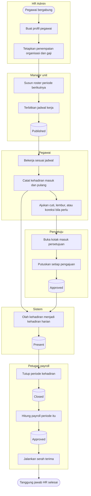

# Alur Utama Modul Human Resource

| Field | Value |
| --- | --- |
| Blueprint ID | `HRD-BP-001` |
| Jenis | Alur pokok modul, ujung ke ujung |
| Status | `draft` |
| Slice tercakup | `S0-A`, `S0-B`, `S-A1` s.d. `S-A7`, `S-B1` s.d. `S-B5`, `S-C2` s.d. `S-C5`, `S-E` |

---

## 1. Apa yang digambar di sini

Satu diagram, **jalur normal saja**. Percabangan dan jalur pengecualian ada di berkas proses
masing-masing; diagram ini sengaja tidak memuatnya supaya bentuk besar modul tetap terbaca.

Diagram ini menjawab: **dari mana satu bulan kerja pegawai dimulai, dan di mana ia berakhir bagi
HR.**

## 2. Diagram

**Batas yang digambar terakhir bukan hiasan.** `HRD-DEC-009` menghentikan tanggung jawab HR
setelah serah terima dijalankan. Apa yang terjadi setelah itu — pembayaran, jurnal, pajak, dan
pelaporan — milik Finance, dan bentuk serah terimanya masih terbuka (`HRD-Q-10`, `HRD-Q-11`).

## 3. Tabel langkah

| Langkah | Pelaku | Masukan yang dibutuhkan | Keluaran | Bila gagal |
| --- | --- | --- | --- | --- |
| Buat profil pegawai | HR Admin | Data diri pegawai, unit, jabatan | Profil pegawai aktif | Profil tidak terbentuk; HR melengkapi isian yang kurang |
| Tetapkan penempatan dan gaji | HR Admin | Struktur organisasi dan struktur gaji yang sudah terisi | Penempatan dan gaji berlaku | Penempatan ditolak; HR memilih unit atau golongan yang sah |
| Susun roster | Manajer unit | Kebutuhan tenaga per hari, daftar pegawai unit | Roster berstatus draf | Roster tidak dapat disusun; manajer melengkapi kebutuhan tenaga lebih dulu |
| Terbitkan jadwal kerja | Manajer unit | Roster yang lolos pemeriksaan bentrok | Jadwal berstatus `Published` | Penerbitan ditolak; manajer menyelesaikan bentrok yang menghalangi |
| Catat kehadiran | Pegawai | Jadwal yang berlaku pada tanggal itu | Rekaman kehadiran tersimpan | Pencatatan ditolak; pegawai menghubungi HR untuk jalur koreksi |
| Ajukan cuti, lembur, atau koreksi | Pegawai | Saldo, jadwal, atau data hari yang akan dikoreksi | Pengajuan berstatus `Submitted` | Pengajuan ditolak sistem; pegawai memperbaiki isian |
| Putuskan pengajuan | Penyetuju | Kotak masuk berisi pengajuan yang ditugaskan kepadanya | Pengajuan berstatus `Approved` atau `Rejected` | Keputusan tidak tersimpan; penyetuju mengulang dari kotak masuk |
| Olah kehadiran harian | Sistem | Rekaman kehadiran, jadwal, pengajuan yang sudah disetujui | Kehadiran harian berstatus hasil hitung | Pengolahan berstatus `Error`; HR menjalankan ulang untuk tanggal itu |
| Tutup periode kehadiran | Petugas payroll | Tidak ada pengecualian pemblokir yang masih terbuka | Periode berstatus `Closed` | Penutupan ditolak; petugas menyelesaikan penghalang yang ditampilkan lebih dulu |
| Hitung payroll | Petugas payroll | Periode kehadiran yang sudah `Closed` | Putaran payroll berstatus `Approved` | Perhitungan gagal; petugas memperbaiki masukan lalu menghitung ulang |
| Jalankan serah terima | Petugas payroll | Putaran payroll yang sudah disetujui | Serah terima terlaksana | Serah terima gagal; petugas mengulang. **Bentuk penanganan penolakan Finance masih terbuka** |

## 4. Yang sengaja tidak ada di diagram ini

| Yang tidak digambar | Di mana ia digambar |
| --- | --- |
| Seluruh jalur penolakan dan perbaikan | Berkas proses masing-masing di folder ini |
| Pelatihan, penilaian kinerja, kedisiplinan, dan pengunduran diri | `kompetensi-dan-pelatihan.md`, `manajemen-kinerja.md`, `hubungan-karyawan-dan-disiplin.md`, `offboarding.md` |
| Kredensial dan kewenangan klinis | **Tidak digambar di mana pun.** `S-C1` `BLOCKED` |
| Kesehatan kerja staf | **Tidak digambar di mana pun.** `S-C6` `BLOCKED` |

## 5. Traceability

| Bagian alur | Decision | Slice | Acceptance test |
| --- | --- | --- | --- |
| Profil dan penempatan | `HRD-DEC-012` | `S-A1` | `AT-HRD-A1-01` |
| Roster dan penerbitan jadwal | `HRD-DEC-026` | `S-B4` | `AT-HRD-B4-01` |
| Pencatatan dan pengolahan kehadiran | `HRD-DEC-013` | `S-B1` | `AT-HRD-B1-01` |
| Kotak masuk persetujuan | `HRD-DEC-011`, `HRD-DEC-018` | `S-A7` | `AT-HRD-A7-01` |
| Penutupan periode | `HRD-DEC-022` | `S-B1` | `AT-HRD-B1-05` |
| Batas serah terima payroll | `HRD-DEC-009`, `HRD-Q-10`, `HRD-Q-11` | `S-B5` | `AT-HRD-B5-01` |
