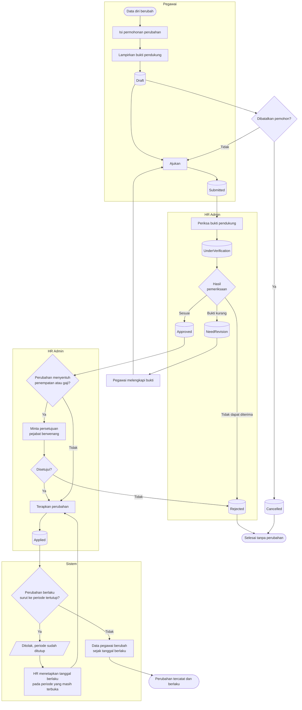

# Administrasi Kepegawaian

| Field | Value |
| --- | --- |
| Blueprint ID | `HRD-BP-001` |
| Jenis | Flowchart proses |
| Slice | `S-A1` administrasi kepegawaian |
| Status | `draft` |
| Kesiapan | `READY FOR DESIGN` |

---

## 1. Apa yang dijawab berkas ini

Bagaimana data pegawai berubah — baik karena pegawainya sendiri yang mengajukan, maupun karena
HR yang mengubahnya — dengan jejak yang dapat diperiksa.

**Aturan yang mengikat alur ini:** perubahan data pegawai yang material **tidak** langsung
berlaku. Ia melewati verifikasi lebih dulu. Data yang berubah tanpa verifikasi akan terbawa ke
kehadiran, cuti, dan payroll sebelum ada yang sempat memeriksanya.

## 2. Diagram

## 3. Tabel langkah

| Langkah | Pelaku | Masukan yang dibutuhkan | Keluaran | Bila gagal |
| --- | --- | --- | --- | --- |
| Isi permohonan perubahan | Pegawai | Data lama; data yang diinginkan; alasan | Permohonan berstatus `Draft` | Permohonan tidak terbentuk. Pegawai melengkapi isian |
| Lampirkan bukti pendukung | Pegawai | Berkas bukti sesuai jenis perubahan | Bukti tersimpan sebagai lampiran | Penyimpanan berkas gagal. **Bentuk kontrak penyimpanan berkas masih terbuka** — `HRD-DEP-006` |
| Ajukan | Pegawai | Permohonan `Draft` yang lengkap | Permohonan berstatus `Submitted` | Ditolak bila isian wajib kosong |
| Periksa bukti pendukung | HR Admin | Permohonan beserta lampirannya | Permohonan berstatus `UnderVerification` | Tidak ada kegagalan |
| Putuskan verifikasi | HR Admin | Bukti yang sudah diperiksa | `Approved`, `Rejected`, atau `NeedRevision` | Ditolak bila alasan wajib tidak diisi |
| Minta persetujuan pejabat | HR Admin | Perubahan yang menyentuh penempatan atau gaji | Persetujuan pejabat berwenang | Bila tidak disetujui, permohonan menjadi `Rejected` |
| Terapkan perubahan | HR Admin | Permohonan `Approved`; tanggal berlaku | Permohonan berstatus `Applied`; data pegawai berubah | Ditolak bila tanggal berlaku jatuh pada periode yang sudah ditutup. HR menetapkan tanggal pada periode yang masih terbuka |

## 4. Jalur pengecualian yang paling sering ditemui

| Keadaan | Apa yang petugas lakukan |
| --- | --- |
| Bukti pendukung tidak lengkap | Permohonan dikembalikan. Pegawai melengkapi lalu mengajukan ulang. Nomor permohonannya tetap sama |
| Perubahan gaji tanpa persetujuan pejabat | Penerapan tertahan. HR meminta persetujuan lebih dulu |
| Perubahan berlaku surut ke periode yang sudah ditutup | Penerapan ditolak. HR menetapkan tanggal berlaku pada periode yang masih terbuka, atau meminta periode dibuka kembali |
| HR mengubah data langsung tanpa permohonan | Diizinkan untuk perubahan yang tidak material, dan **tetap meninggalkan jejak audit**. Perubahan yang material tetap melewati verifikasi |

## 5. Batas yang tidak boleh dilanggar

| Larangan | Sebabnya |
| --- | --- |
| Perubahan penempatan dan gaji **MUST NOT** berlaku tanpa persetujuan pejabat berwenang | Keduanya berdampak langsung pada payroll |
| Nilai gaji **MUST NOT** tampil pada layar yang jangkauan pembacanya lebih luas daripada pemilik data dan HR yang berwenang | Kolom nominal bertanda sensitif pada kamus data |
| Akun aplikasi pegawai **MUST NOT** dibuat atau dicabut oleh modul HR sendiri | Kepemilikannya ada di Administrator/Identity. HR hanya mengirim permintaan. Bentuk kontraknya masih terbuka — `HRD-DEP-003` |

## 6. Traceability

| Aturan | Decision | Kontrak | Acceptance test |
| --- | --- | --- | --- |
| Alur permohonan perubahan data | `HRD-DEC-012` | `../contracts/state-transition-matrix.md` §6.1 | `AT-HRD-A1-01` |
| Verifikasi perubahan | — (terbukti dari source) | `../contracts/state-transition-matrix.md` §6.2 | `AT-HRD-A1-02` |
| Penempatan dan penetapan gaji | — (terbukti dari source) | `../contracts/state-transition-matrix.md` §6.3 | `AT-HRD-A1-03` |
| Batas kepemilikan akun aplikasi | `HRD-DEP-003` | `../contracts/integration-contract.md` | `AT-HRD-A1-04` |
