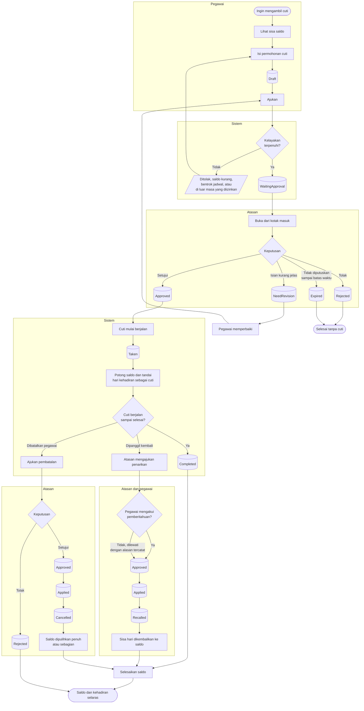

# Cuti

| Field | Value |
| --- | --- |
| Blueprint ID | `HRD-BP-001` |
| Jenis | Flowchart proses |
| Slice | `S-A2` layanan mandiri cuti, `S-B2` administrasi cuti dan saldo |
| Status | `draft` |
| Kesiapan | `READY FOR DESIGN` |

---

## 1. Apa yang dijawab berkas ini

Bagaimana seorang pegawai mengambil cuti dari saldo yang dimilikinya sampai saldonya
diselesaikan — **termasuk ketika cutinya dibatalkan, atau ketika ia dipanggil kembali bekerja di
tengah cuti.**

**Aturan yang mengikat seluruh alur ini:** angka saldo cuti adalah kewenangan backend. Layar
**MUST NOT** menghitung sendiri berapa sisa cuti seseorang, dan **MUST NOT** memperbaiki saldo
dengan menimpa angkanya. Setiap pergerakan saldo meninggalkan baris di buku besar saldo.

## 2. Diagram

## 3. Tabel langkah

| Langkah | Pelaku | Masukan yang dibutuhkan | Keluaran | Bila gagal |
| --- | --- | --- | --- | --- |
| Lihat sisa saldo | Pegawai | Saldo cuti yang sudah terbentuk untuk periode berjalan | Angka sisa cuti dari backend | Saldo belum terbentuk. Pegawai menghubungi HR untuk pembentukan hak cuti periode itu |
| Isi permohonan cuti | Pegawai | Jenis cuti; tanggal mulai dan selesai; alasan; pengganti bila diwajibkan | Permohonan berstatus `Draft` | Permohonan tidak terbentuk. Pegawai melengkapi isian |
| Ajukan | Pegawai | Permohonan `Draft` yang lengkap | Permohonan berstatus `WaitingApproval` | Ditolak karena saldo kurang, bentrok jadwal, atau di luar masa yang diizinkan. Pegawai mengubah tanggal atau jenis cutinya |
| Putuskan permohonan | Atasan | Kotak masuk berisi permohonan yang ditugaskan kepadanya | `Approved`, `Rejected`, atau `NeedRevision` | Ditolak bila alasan wajib tidak diisi. Atasan mengisinya |
| Perbaiki permohonan | Pegawai | Permohonan `NeedRevision` beserta catatan atasan | Permohonan `WaitingApproval` lagi | Sama dengan langkah Ajukan |
| Jalankan cuti | Sistem | Permohonan `Approved`; tanggal mulai tiba | Permohonan `Taken`; saldo dipotong; hari kehadiran ditandai cuti | Pelaksanaan berstatus `Failed`. HR menjalankan ulang setelah penyebabnya diperbaiki |
| Ajukan penarikan dari cuti | Atasan | Cuti yang sedang berjalan; alasan penarikan | Penarikan berstatus `WaitingApproval` | Ditolak bila alasan kosong. Atasan mengisinya |
| Akui pemberitahuan penarikan | Pegawai | Pemberitahuan penarikan | Penarikan berstatus `Acknowledged` | **Bukan penghalang.** Bila pegawai tidak mengakui, atasan dapat melewatinya dengan alasan yang tercatat |
| Terapkan penarikan | Sistem | Penarikan `Approved` | Penarikan `Applied`; cuti `Recalled`; sisa hari dikembalikan ke saldo | Penerapan berstatus `Failed`. HR menjalankan ulang |
| Ajukan pembatalan cuti | Pegawai | Cuti yang sudah `Approved` atau sedang berjalan | Pembatalan berstatus `WaitingApproval` | Ditolak bila cutinya sudah selesai dan periodenya terkunci |
| Terapkan pembatalan | Sistem | Pembatalan `Approved` | Pembatalan `Applied`; cuti `Cancelled`; saldo dipulihkan | Penerapan berstatus `Failed`. HR menjalankan ulang |
| Selesaikan saldo | Sistem | Cuti `Completed`, `Recalled`, atau `Cancelled` | Baris baru di buku besar saldo | Penyelesaian gagal. HR memeriksa buku besar saldo lalu menjalankan ulang |

## 4. Jalur pengecualian yang paling sering ditemui

| Keadaan | Apa yang petugas lakukan |
| --- | --- |
| Saldo kurang | Permohonan ditolak sistem sebelum sampai ke atasan. Pegawai mengurangi jumlah hari, atau memilih jenis cuti lain |
| Cuti bentrok dengan jadwal atau cuti lain | Ditolak sistem. Pegawai memilih tanggal lain |
| Atasan tidak memutuskan sampai batas waktu | Permohonan menjadi `Expired`. Pegawai mengajukan permohonan baru |
| Unit kekurangan tenaga di tengah cuti pegawai | Atasan mengajukan penarikan. Sisa hari kembali ke saldo |
| Pegawai tidak membaca pemberitahuan penarikan | Penarikan **tetap dapat berjalan**. Alasan pelewatan pengakuan wajib dicatat |
| Cuti sudah selesai tetapi ternyata keliru | Pembalikan hanya sah lewat jalur yang tercatat alasannya. **Bukan** dengan menyunting saldo langsung |

## 5. Batas yang tidak boleh dilanggar

| Larangan | Sebabnya |
| --- | --- |
| Layar **MUST NOT** menghitung sendiri sisa saldo cuti | Backend adalah kewenangan tunggal atas angka saldo. Dua tempat menghitung berarti dua angka yang berbeda |
| Saldo **MUST NOT** diperbaiki dengan menimpa angkanya | Setiap pergerakan saldo wajib meninggalkan baris di buku besar. Itulah yang membuat sengketa saldo dapat ditelusuri |
| Pelaksanaan cuti yang sudah selesai **MUST NOT** dibalik tanpa alasan tercatat | Saldo dan kehadiran akan berubah tanpa jejak, bahkan setelah payroll terkunci — `HRD-DEC-023` |
| Pengakuan pegawai atas penarikan **MUST NOT** dijadikan penghalang | Terbukti dari audit source bahwa ia memang bukan penghalang. Menjadikannya penghalang akan menghentikan penarikan yang mendesak — `HRD-DEC-029` |

## 6. Traceability

| Aturan | Decision | Kontrak | Acceptance test |
| --- | --- | --- | --- |
| Alur permohonan cuti | — (terbukti dari source) | `../contracts/state-transition-matrix.md` §2.1 | `AT-HRD-B2-01` |
| Buku besar saldo cuti | — (terbukti dari source) | `../contracts/state-transition-matrix.md` §2.3 | `AT-HRD-B2-02` |
| Pembalikan pelaksanaan cuti wajib beralasan | `HRD-DEC-023`, `HRD-DEC-027` | `../data/data-dictionary.md` §2.3 | `AT-HRD-B2-03` |
| Pengakuan penarikan bukan penghalang | `HRD-DEC-029` | `../data/data-dictionary.md` §2.4 | `AT-HRD-B2-04` |
| Backend otoritatif atas angka saldo | `HRD-DEC-007` | `../03-frontend-architecture.md` | `AT-HRD-B2-05` |
