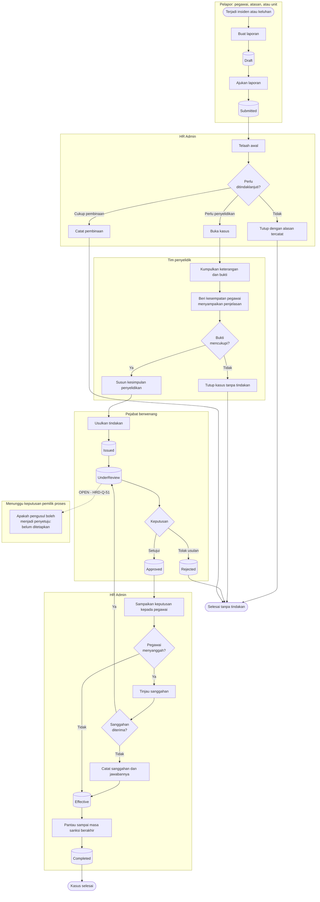

# Hubungan Karyawan dan Kedisiplinan

| Field | Value |
| --- | --- |
| Blueprint ID | `HRD-BP-001` |
| Jenis | Flowchart proses |
| Slice | `S-C5` hubungan karyawan dan kedisiplinan |
| Status | `draft` |
| Kesiapan | `READY FOR DESIGN` **untuk bentuk alurnya**; dua titik tetap `[OPEN]` |

---

## 1. Apa yang dijawab berkas ini, dan apa yang sengaja belum dijawab

Bagaimana sebuah laporan insiden atau keluhan pegawai ditangani sampai menjadi tindakan
kedisiplinan yang berlaku — atau ditutup tanpa tindakan.

Dua hal sengaja tidak dijawab di sini karena pemiliknya belum memutuskan:

| Pertanyaan | Pemilik | ID |
| --- | --- | --- |
| Apakah pemisahan peran diperlukan, sehingga seseorang tidak dapat menyetujui tindakan disiplin yang ia buat sendiri | Pemilik proses HR | `HRD-Q-51` |
| Tingkatan izin khusus bagi data yang paling terbatas jangkauan pembacanya | Pemilik keamanan bersama pemilik proses | `HRD-Q-52` |

**Ini bukan detail kecil.** Tanpa jawaban `HRD-Q-51`, seseorang dapat mengusulkan sekaligus
menyetujui sanksi terhadap pegawai lain. Tanpa jawaban `HRD-Q-52`, tidak ada yang menetapkan
siapa boleh membaca isi kasus kedisiplinan.

## 2. Diagram

## 3. Tabel langkah

| Langkah | Pelaku | Masukan yang dibutuhkan | Keluaran | Bila gagal |
| --- | --- | --- | --- | --- |
| Buat laporan | Pelapor | Uraian kejadian; tanggal; pihak yang terlibat | Laporan berstatus `Draft` | Laporan tidak terbentuk. Pelapor melengkapi isian |
| Ajukan laporan | Pelapor | Laporan `Draft` yang lengkap | Laporan berstatus `Submitted` | Ditolak bila uraian kejadian kosong |
| Telaah awal | HR Admin | Laporan yang masuk | Ditutup, dijadikan pembinaan, atau dibuka menjadi kasus | Tidak ada kegagalan. Keputusan menutup wajib menyebut alasannya |
| Kumpulkan keterangan dan bukti | Tim penyelidik | Kasus yang dibuka | Keterangan dan bukti tercatat | Bila bukti tidak dapat dikumpulkan, kasus ditutup tanpa tindakan dengan alasan tercatat |
| Beri kesempatan menjelaskan | Tim penyelidik | Pegawai yang dilaporkan | Penjelasan pegawai tercatat | **Bukan langkah yang boleh dilewati.** Bila pegawai menolak memberi penjelasan, penolakannya dicatat |
| Susun kesimpulan | Tim penyelidik | Seluruh keterangan dan bukti | Kesimpulan penyelidikan | Kesimpulan tidak dapat disusun bila bukti tidak mencukupi. Kasus ditutup tanpa tindakan |
| Usulkan tindakan | Pejabat berwenang | Kesimpulan penyelidikan; jenis sanksi dari master | Usulan berstatus `Issued` lalu `UnderReview` | Ditolak bila jenis sanksi tidak ada di master. HR melengkapi master lebih dulu |
| Putuskan usulan | Pejabat berwenang | Usulan `UnderReview` | `Approved` atau `Rejected` | Ditolak bila alasan wajib tidak diisi. **Apakah pengusul boleh menjadi penyetuju belum ditetapkan** — `HRD-Q-51` |
| Sampaikan keputusan | HR Admin | Tindakan `Approved` | Pegawai mengetahui keputusan | Tidak ada kegagalan |
| Tinjau sanggahan | Pejabat berwenang | Sanggahan pegawai | Sanggahan diterima atau ditolak | Ditolak bila alasan wajib tidak diisi |
| Pantau masa sanksi | HR Admin | Tindakan `Effective` | Tindakan `Completed` saat masa sanksi berakhir | Tidak ada kegagalan |

## 4. Jalur pengecualian yang paling sering ditemui

| Keadaan | Apa yang petugas lakukan |
| --- | --- |
| Laporan tidak cukup bukti | Kasus ditutup tanpa tindakan, dengan alasan tercatat. Laporannya **tidak dihapus** |
| Pegawai menolak memberi penjelasan | Penolakannya dicatat. Penyelidikan tetap berjalan dengan keterangan yang ada |
| Pegawai menyanggah keputusan | Sanggahan ditinjau. Bila diterima, usulan kembali ke tahap keputusan |
| Pegawai keluar sebelum kasus selesai | Kasus tetap tercatat sampai selesai. Tindakan yang belum berlaku tidak dipaksakan berlaku |
| Pengusul dan penyetuju adalah orang yang sama | **Belum ada penjagaan.** Ini adalah celah yang tercatat, menunggu `HRD-Q-51` |

## 5. Batas yang tidak boleh dilanggar

| Larangan | Sebabnya |
| --- | --- |
| Pegawai **MUST** diberi kesempatan menyampaikan penjelasan sebelum tindakan diputuskan | Keputusan yang menyangkut nasib pegawai tanpa mendengarnya tidak dapat dipertanggungjawabkan |
| Laporan dan sanggahan **MUST NOT** dihapus, bahkan ketika ditutup tanpa tindakan | Jejak bahwa sesuatu pernah dilaporkan adalah bagian dari keadilan proses |
| Isi kasus kedisiplinan **MUST NOT** tampil pada layar mana pun tanpa tingkatan izin yang jelas | Seluruh isi tabel tindakan disiplin bertanda sensitif. Tingkatannya masih `[OPEN]` — `HRD-Q-52` |
| Aturan pemisahan peran **MUST NOT** ditetapkan sendiri oleh perancang | Apakah pemisahan diperlukan adalah keputusan pemilik proses, bukan pilihan teknis — `HRD-Q-51` |

## 6. Traceability

| Aturan | Decision | Kontrak | Acceptance test |
| --- | --- | --- | --- |
| Alur tindakan kedisiplinan | — (terbukti dari source) | `../contracts/state-transition-matrix.md` §7.1 | `AT-HRD-C5-01` |
| Kasus, keputusan, dan investigasi | — (terbukti dari source) | `../contracts/state-transition-matrix.md` §7.2 | `AT-HRD-C5-02` |
| Kesempatan menjelaskan wajib diberikan | — | `../contracts/validation-matrix.md` | `AT-HRD-C5-03` |
| Pemisahan peran pengusul dan penyetuju | **`HRD-Q-51` `[OPEN]`** | **Belum ada** | **Belum dapat diuji.** `BLOCKED` |
| Tingkatan izin data paling terbatas | **`HRD-Q-52` `[OPEN]`** | **Belum ada** | **Belum dapat diuji.** `BLOCKED` |
