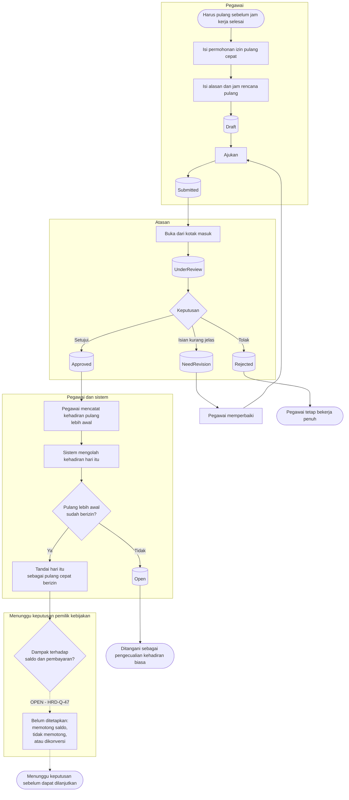

# Izin Pulang Cepat

| Field | Value |
| --- | --- |
| Blueprint ID | `HRD-BP-001` |
| Jenis | Flowchart proses |
| Slice | `S-A6` layanan mandiri izin pulang cepat |
| Status | `draft` |
| Kesiapan | `READY FOR DESIGN` **untuk bentuk alurnya**; satu titik keputusan tetap `[OPEN]` |

---

## 1. Apa yang dijawab berkas ini, dan apa yang sengaja belum dijawab

Bagaimana seorang pegawai meminta izin pulang sebelum jam kerjanya selesai, dan bagaimana izin
itu terbaca oleh pengolahan kehadiran.

**Satu hal sengaja tidak dijawab di sini:** apakah jam yang ditinggalkan memotong saldo cuti,
tidak memotong apa pun, atau dikonversi menjadi bentuk lain. Itu adalah **nilai kebijakan**, dan
pemiliknya belum memutuskan — `HRD-Q-47`. Menuliskan angkanya di sini berarti mengarang
kebijakan atas nama orang yang berwenang.

Karena itu diagram di bawah menggambar bentuk alurnya sampai batas yang sah, lalu berhenti di
titik keputusan yang masih terbuka.

## 2. Kedudukan izin pulang cepat terhadap cuti

`HRD-DEC-029` menetapkan bahwa izin pulang cepat **terpisah** dari cuti per jam. Keduanya
**MUST NOT** disatukan, baik tabelnya maupun perpindahan statusnya.

| | Izin pulang cepat | Cuti per jam |
| --- | --- | --- |
| Kapan diminta | Umumnya pada hari itu juga, sering mendadak | Direncanakan sebelumnya |
| Apa yang ditinggalkan | Sisa jam kerja hari itu | Blok jam yang dipilih |
| Dampak saldo | **`[OPEN]`** — `HRD-Q-47` | Memotong saldo cuti |

Menyatukan keduanya akan memaksa izin mendadak tunduk pada aturan perencanaan cuti, dan itu
membuat pegawai yang harus pulang karena keadaan mendesak kehilangan jalur yang sah.

## 3. Diagram

**Garis putus-putus pada diagram bukan gaya penulisan.** Ia menandai bahwa jalur itu **belum
boleh dirancang lebih jauh**. Setiap node di dalamnya berhenti sebagai pilihan, bukan sebagai
keputusan.

## 4. Tabel langkah

| Langkah | Pelaku | Masukan yang dibutuhkan | Keluaran | Bila gagal |
| --- | --- | --- | --- | --- |
| Isi permohonan izin pulang cepat | Pegawai | Tanggal; jam rencana pulang; alasan | Permohonan berstatus `Draft` | Permohonan tidak terbentuk. Pegawai melengkapi isian |
| Ajukan | Pegawai | Permohonan `Draft` yang lengkap | Permohonan berstatus `Submitted` | Ditolak bila alasan kosong, atau bila jam yang diminta di luar jadwal hari itu |
| Putuskan permohonan | Atasan | Kotak masuk berisi permohonan yang ditugaskan kepadanya | `Approved`, `Rejected`, atau `NeedRevision` | Ditolak bila alasan wajib tidak diisi |
| Catat kehadiran pulang lebih awal | Pegawai | Izin yang sudah `Approved` | Rekaman kehadiran pulang | Bila pegawai lupa mencatat, hari itu menjadi pengecualian kehadiran. Pegawai mengajukan koreksi |
| Olah kehadiran hari itu | Sistem | Rekaman kehadiran; izin yang berlaku | Hari itu ditandai pulang cepat berizin | Bila tidak ada izin yang berlaku, hari itu menjadi pengecualian berstatus `Open` dan ditangani seperti pengecualian biasa |
| Tetapkan dampak saldo dan pembayaran | **Pemilik kebijakan HR** | **Belum ada** | **Belum ada** | **`BLOCKED` — `HRD-Q-47`.** Tidak ada langkah lanjutan yang boleh dirancang sebelum keputusannya turun |

## 5. Jalur pengecualian

| Keadaan | Apa yang petugas lakukan |
| --- | --- |
| Pegawai pulang lebih awal tanpa izin | Hari itu menjadi pengecualian kehadiran. Ditangani lewat jalur pengecualian biasa; lihat [`kehadiran-harian.md`](./kehadiran-harian.md) |
| Izin disetujui setelah pegawai terlanjur pulang | Izin tetap sah bagi hari itu. Pengolahan ulang hari itu menandai hari tersebut sebagai pulang cepat berizin |
| Atasan menolak izin | Pegawai tetap bekerja penuh. Bila ia tetap pulang, hari itu menjadi pengecualian |

## 6. Batas yang tidak boleh dilanggar

| Larangan | Sebabnya |
| --- | --- |
| Izin pulang cepat **MUST NOT** disatukan dengan cuti per jam | `HRD-DEC-029`. Keduanya berbeda pemicu, berbeda perencanaan, dan berbeda dampak |
| Tabel untuk izin pulang cepat **MUST NOT** dibuat sebelum `HRD-Q-47` dijawab | Membuat tabelnya berarti memilih salah satu kebijakan pemotongan tanpa wewenang — `02-backend-architecture.md` bagian 9 |
| Dampak terhadap saldo **MUST NOT** ditebak dari praktik umum atau kebiasaan industri | Nilai kebijakan hanya sah bila ditetapkan pemiliknya |

## 7. Traceability

| Aturan | Decision | Kontrak | Acceptance test |
| --- | --- | --- | --- |
| Izin pulang cepat terpisah dari cuti per jam | `HRD-DEC-029` | `02-backend-architecture.md` bagian 9 | `AT-HRD-A6-01` |
| Alur persetujuan izin | `HRD-DEC-018` | `../contracts/state-transition-matrix.md` §5 | `AT-HRD-A6-02` |
| Dampak saldo dan pembayaran | **`HRD-Q-47` `[OPEN]`** | **Belum ada** | **Belum dapat diuji.** `BLOCKED` |
