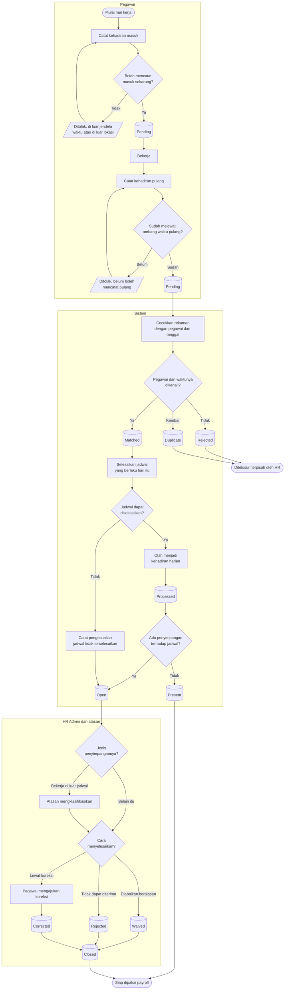

# Kehadiran Harian

| Field | Value |
| --- | --- |
| Blueprint ID | `HRD-BP-001` |
| Jenis | Flowchart proses |
| Slice | `S-A5` layanan mandiri kehadiran, `S-B1` administrasi kehadiran |
| Status | `draft` |
| Kesiapan | `READY FOR DESIGN` |

---

## 1. Apa yang dijawab berkas ini

Bagaimana satu penempelan sidik jari berubah menjadi satu baris kehadiran harian yang boleh
dipakai payroll — **termasuk apa yang terjadi ketika ia tidak bisa berubah menjadi itu.**

**Aturan yang mengikat seluruh alur ini:** rekaman kehadiran mentah adalah **fakta yang tidak
pernah diubah**. Koreksi apa pun memutasi hasil olahannya, bukan rekamannya. Kalau bukti bahwa
seseorang menempelkan sidik jari pada jam tertentu boleh disunting, tidak ada lagi yang dapat
dipercaya saat terjadi sengketa jam kerja.

## 2. Diagram

**Catatan tentang cabang "Bekerja di luar jadwal".** Ini adalah jenis penyimpangan baru yang
ditetapkan `HRD-DEC-025`. Ia berarti pegawai — biasanya dokter — benar-benar bekerja di luar
jendela jadwalnya yang sah. **Ia tidak pernah otomatis menjadi lembur** (`HRD-DEC-013`). Atasan
yang memutuskan: dijadikan lembur, dijadikan koreksi jadwal, atau tercatat tanpa kompensasi.
Keadaan hari ini: **belum ada di kode**, dan belum ada jalur yang mendeteksinya.

## 3. Tabel langkah

| Langkah | Pelaku | Masukan yang dibutuhkan | Keluaran | Bila gagal |
| --- | --- | --- | --- | --- |
| Catat kehadiran masuk | Pegawai | Profil aktif; jadwal yang berlaku; lokasi bila diwajibkan | Rekaman mentah berstatus `Pending` | Pencatatan ditolak. Pegawai mencoba lagi di dalam jendela waktu, atau mengajukan koreksi bila jendelanya sudah lewat |
| Catat kehadiran pulang | Pegawai | Rekaman masuk hari itu; ambang waktu pulang dari backend | Rekaman mentah berstatus `Pending` | Pencatatan ditolak. Pegawai menunggu sampai ambang waktu terlewati |
| Cocokkan rekaman | Sistem | Rekaman mentah | Rekaman berstatus `Matched` | Rekaman berstatus `Rejected`, `Duplicate`, atau `Error`. HR menelusurinya lewat daftar rekaman bermasalah, lalu mencoba ulang |
| Selesaikan jadwal | Sistem | Roster, jadwal tetap, penetapan manual, atau jadwal cadangan | Jadwal hari itu diketahui | Pengecualian jadwal tidak terselesaikan dibuat. Manajer melengkapi jadwal, lalu HR memproses ulang tanggal itu |
| Olah kehadiran harian | Sistem | Rekaman yang sudah `Matched` dan jadwal yang sudah diselesaikan | Kehadiran harian berstatus hasil hitung | Pengolahan berstatus `Error` lalu `ReprocessRequired`. HR menjalankan pemrosesan ulang untuk tanggal itu |
| Tinjau penyimpangan | HR Admin atau atasan | Daftar pengecualian berstatus `Open` | Pengecualian berstatus `UnderReview` | Tidak ada kegagalan; pengecualian tetap `Open` sampai ada yang meninjau |
| Klasifikasikan pekerjaan di luar jadwal | Atasan | Pengecualian berjenis bekerja di luar jadwal | Pengecualian berstatus `Corrected` atau `Waived` | Klasifikasi ditolak bila jenis pengecualiannya bukan itu. Atasan memilih jalur penyelesaian yang sesuai |
| Abaikan dengan alasan | HR Admin atau atasan | Alasan yang wajib diisi | Pengecualian berstatus `Waived` | Ditolak bila alasan kosong. Petugas mengisi alasannya |
| Tutup pengecualian | Sistem | Pengecualian sudah `Corrected`, `Waived`, atau `Rejected` | Pengecualian berstatus `Closed` | Tidak ada kegagalan |

## 4. Jalur pengecualian yang paling sering ditemui

| Keadaan | Apa yang petugas lakukan |
| --- | --- |
| Pegawai lupa mencatat pulang | Pengecualian terbuka. Pegawai mengajukan koreksi kehadiran; lihat [`koreksi-kehadiran.md`](./koreksi-kehadiran.md) |
| Mesin absensi mengirim rekaman kembar | Rekaman kedua berstatus `Duplicate`. Tidak ada tindakan petugas yang diperlukan |
| Mesin absensi mengirim identitas yang tidak dikenali | Rekaman berstatus `Rejected`. HR mencocokkan identitas lalu meminta pemrosesan ulang |
| Pegawai bekerja tetapi jadwalnya belum dibuat | Pengecualian jadwal tidak terselesaikan. Manajer membuat jadwalnya, lalu HR memproses ulang tanggal itu |
| Dokter bekerja di luar jadwal kerjanya | Pengecualian berjenis bekerja di luar jadwal. **Menunggu klasifikasi atasan.** Tidak pernah otomatis menjadi lembur |

## 5. Batas yang tidak boleh dilanggar

| Larangan | Sebabnya |
| --- | --- |
| Isi rekaman mentah **MUST NOT** disunting | Ia adalah bukti. Koreksi memutasi hasil olahan |
| Status kehadiran harian **MUST NOT** disunting langsung | Nilainya adalah **hasil hitung**, bukan status yang berpindah karena tindakan orang. Perubahannya selalu lewat koreksi lalu pemrosesan ulang |
| Bekerja di luar jadwal **MUST NOT** otomatis menjadi lembur | `HRD-DEC-013`. Lembur adalah keputusan atasan, bukan kesimpulan mesin |

## 6. Traceability

| Aturan | Decision | Kontrak | Acceptance test |
| --- | --- | --- | --- |
| Rekaman mentah tidak pernah diubah | — (terbukti dari source) | `../contracts/state-transition-matrix.md` §1.7 | `AT-HRD-B1-02` |
| Status kehadiran harian adalah hasil hitung | — (terbukti dari source) | `../contracts/state-transition-matrix.md` §1.3 | `AT-HRD-B1-03` |
| Jenis pengecualian bekerja di luar jadwal | `HRD-DEC-025` | `../contracts/state-transition-matrix.md` §1.5 | `AT-HRD-B1-06` |
| Larangan lembur otomatis | `HRD-DEC-013` | `../contracts/validation-matrix.md` | `AT-HRD-B1-07` |
| Pengecualian pemblokir menahan penutupan periode | `HRD-DEC-022` | `../contracts/state-transition-matrix.md` §1.1 | `AT-HRD-B1-05` |
