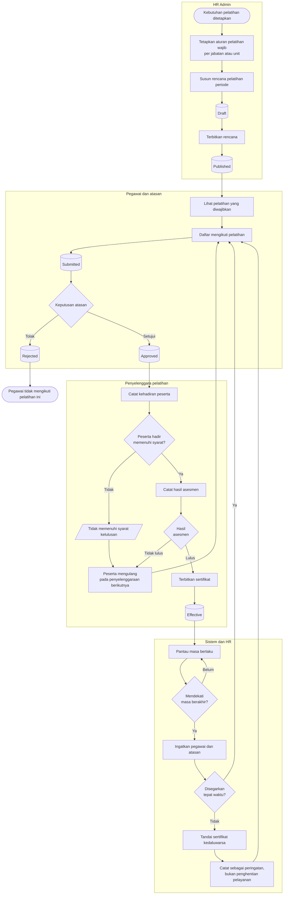

# Kompetensi dan Pelatihan

| Field | Value |
| --- | --- |
| Blueprint ID | `HRD-BP-001` |
| Jenis | Flowchart proses |
| Slice | `S-C2` kompetensi dan pelatihan |
| Status | `draft` |
| Kesiapan | `READY FOR DESIGN` |

---

## 1. Apa yang dijawab berkas ini, dan batas yang menyertainya

Bagaimana kebutuhan pelatihan ditetapkan, pegawai mengikutinya, dan hasilnya tercatat sebagai
sertifikat yang punya masa berlaku.

**Batas yang menentukan seluruh berkas ini:** proses di sini bersifat **administratif**. Ia
mencatat siapa mengikuti pelatihan apa, dan sertifikatnya berlaku sampai kapan.

Ia **tidak** menetapkan apakah seseorang boleh melakukan tindakan klinis tertentu. Itu adalah
kewenangan klinis, yang berstatus `BLOCKED` menunggu Komite Medik — `S-C1`, `HRD-Q-08`.

Perbedaan ini bukan soal kata. Sertifikat pelatihan yang kedaluwarsa berarti pegawai perlu
menyegarkan pelatihannya. Kewenangan klinis yang kedaluwarsa menyangkut keselamatan pasien, dan
siapa yang boleh memutuskannya belum ditetapkan.

## 2. Diagram

**Catatan tentang cabang terakhir.** Sertifikat pelatihan yang kedaluwarsa memberi **peringatan
yang tercatat**, dan tidak menghentikan pelayanan. Ini mengikuti `HRD-DEC-005` — yang statusnya
masih `draft` menunggu Komite Medik. Untuk **sertifikat pelatihan administratif**, perlakuan ini
sah. Untuk **kredensial dan kewenangan klinis**, perlakuannya belum boleh ditetapkan sama sekali.

## 3. Tabel langkah

| Langkah | Pelaku | Masukan yang dibutuhkan | Keluaran | Bila gagal |
| --- | --- | --- | --- | --- |
| Tetapkan aturan pelatihan wajib | HR Admin | Jabatan, unit, dan jenis pelatihan yang diwajibkan | Aturan pelatihan wajib tersimpan | Tidak terbentuk bila master jenis pelatihan belum terisi. HR melengkapi master lebih dulu |
| Susun rencana pelatihan | HR Admin | Aturan pelatihan wajib; anggaran; penyelenggara | Rencana berstatus `Draft` | Rencana tidak terbentuk. HR melengkapi isian |
| Terbitkan rencana | HR Admin | Rencana yang lengkap | Rencana berstatus `Published` | Penerbitan gagal. HR mengulang setelah penyebabnya diperbaiki |
| Daftar mengikuti pelatihan | Pegawai | Rencana yang sudah terbit; kuota masih tersedia | Pendaftaran berstatus `Submitted` | Ditolak bila kuota penuh atau pegawai tidak memenuhi syarat. Pegawai memilih penyelenggaraan berikutnya |
| Putuskan pendaftaran | Atasan | Pendaftaran `Submitted` | `Approved` atau `Rejected` | Ditolak bila alasan wajib tidak diisi |
| Catat kehadiran peserta | Penyelenggara | Daftar peserta yang disetujui | Kehadiran peserta tercatat | Peserta yang tidak memenuhi syarat kehadiran tidak dapat diases. Ia mengulang pada penyelenggaraan berikutnya |
| Catat hasil asesmen | Penyelenggara | Kehadiran yang memenuhi syarat | Hasil asesmen tercatat | Peserta yang tidak lulus mengulang |
| Terbitkan sertifikat | HR Admin | Hasil asesmen lulus; masa berlaku | Sertifikat berstatus `Effective` | Penerbitan gagal bila masa berlaku tidak ditetapkan. HR menetapkannya |
| Pantau masa berlaku | Sistem | Sertifikat yang berlaku | Pengingat menjelang masa berakhir | Pengiriman pengingat gagal. Percobaan diulang pada putaran berikutnya |
| Tandai kedaluwarsa | Sistem | Sertifikat yang lewat masa berlakunya | Peringatan tercatat | **Tidak menghentikan pelayanan.** Pegawai dan atasan mendapat peringatan |

## 4. Jalur pengecualian yang paling sering ditemui

| Keadaan | Apa yang petugas lakukan |
| --- | --- |
| Kuota pelatihan penuh | Pendaftaran ditolak. Pegawai mendaftar pada penyelenggaraan berikutnya |
| Pegawai tidak hadir memenuhi syarat kelulusan | Ia tidak dapat diases. Mengulang pada penyelenggaraan berikutnya |
| Pegawai tidak lulus asesmen | Sertifikat tidak terbit. Mengulang pada penyelenggaraan berikutnya |
| Sertifikat kedaluwarsa dan belum disegarkan | Peringatan tercatat bagi pegawai dan atasan. Pelayanan **tidak** dihentikan |
| Pelatihan bertabrakan dengan jadwal kerja | Bentrok pelatihan muncul saat roster disusun; lihat [`penjadwalan-kerja.md`](./penjadwalan-kerja.md) |

## 5. Batas yang tidak boleh dilanggar

| Larangan | Sebabnya |
| --- | --- |
| Sertifikat pelatihan **MUST NOT** dipakai sebagai penentu kewenangan klinis | Kewenangan klinis adalah keputusan Komite Medik, bukan turunan dari catatan pelatihan. `S-C1` `BLOCKED` |
| Kedaluwarsanya sertifikat pelatihan **MUST NOT** menghentikan pelayanan | `HRD-DEC-005`. Ia memberi peringatan yang tercatat |
| Aturan gerbang kredensial **MUST NOT** dirancang di sini | `HRD-DEC-005` masih `draft` menunggu Komite Medik — `HRD-Q-08` |

## 6. Traceability

| Aturan | Decision | Kontrak | Acceptance test |
| --- | --- | --- | --- |
| Rekaman pelatihan dan asesmen kompetensi | — (terbukti dari source) | `../contracts/state-transition-matrix.md` §7.4 | `AT-HRD-C2-01` |
| Kedaluwarsa memberi peringatan, bukan penghentian | `HRD-DEC-005` (`draft`) | `../contracts/validation-matrix.md` | `AT-HRD-C2-02` |
| Pemisahan dari kewenangan klinis | `S-C1` `BLOCKED`, `HRD-Q-08` | `MODULE-STATUS.md` §3 `HRD-BLK-001` | Tidak berlaku |
