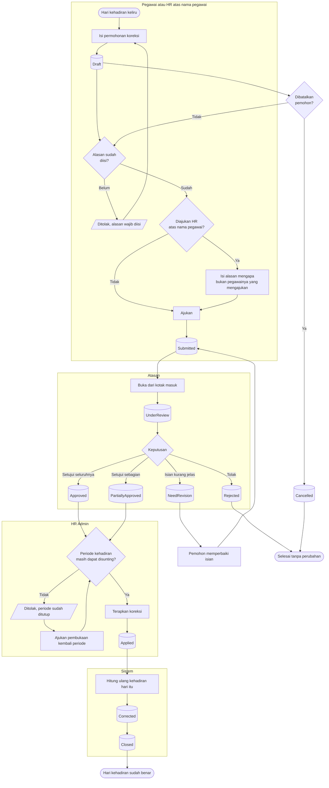

# Koreksi Kehadiran

| Field | Value |
| --- | --- |
| Blueprint ID | `HRD-BP-001` |
| Jenis | Flowchart proses |
| Slice | `S-B1` administrasi kehadiran |
| Status | `draft` |
| Kesiapan | `READY FOR DESIGN` |

---

## 1. Apa yang dijawab berkas ini

Bagaimana satu hari kehadiran yang salah diperbaiki tanpa menyentuh bukti aslinya, dan apa yang
terjadi ketika permohonan perbaikan itu ditolak, perlu diperbaiki, atau datang terlambat.

## 2. Diagram

## 3. Tabel langkah

| Langkah | Pelaku | Masukan yang dibutuhkan | Keluaran | Bila gagal |
| --- | --- | --- | --- | --- |
| Isi permohonan koreksi | Pegawai, atau HR atas nama pegawai | Hari kehadiran yang keliru; jenis koreksi; alasan; bukti bila ada | Permohonan berstatus `Draft` | Permohonan tidak terbentuk. Pemohon melengkapi isian yang kurang |
| Isi alasan pengajuan atas nama | HR Admin | Alasan mengapa bukan pegawainya yang mengajukan | Permohonan ditandai sebagai pengajuan atas nama | Ditolak bila alasan kosong. HR mengisinya |
| Ajukan | Pemohon | Permohonan `Draft` dengan alasan terisi | Permohonan berstatus `Submitted` | Ditolak bila alasan kosong. Pemohon mengisi alasannya |
| Buka dari kotak masuk | Atasan | Kotak masuk berisi permohonan yang ditugaskan kepadanya | Permohonan berstatus `UnderReview` | Tidak ada kegagalan |
| Minta perbaikan | Atasan | Alasan yang wajib diisi | Permohonan berstatus `NeedRevision` | Ditolak bila alasan kosong |
| Setujui seluruhnya | Atasan | Permohonan `UnderReview` | Permohonan berstatus `Approved` | Tidak ada kegagalan |
| Setujui sebagian | Atasan | Sekurang-kurangnya satu rincian disetujui | Permohonan berstatus `PartiallyApproved` | Ditolak bila tidak ada satu pun rincian yang disetujui |
| Tolak | Atasan | Alasan yang wajib diisi | Permohonan berstatus `Rejected` | Ditolak bila alasan kosong |
| Terapkan koreksi | HR Admin | Permohonan `Approved` atau `PartiallyApproved`; periode masih dapat disunting | Permohonan berstatus `Applied` | Ditolak karena periode sudah ditutup. HR mengajukan pembukaan kembali periode lebih dulu |
| Hitung ulang kehadiran | Sistem | Koreksi yang sudah diterapkan | Kehadiran harian berubah; pengecualian berstatus `Corrected` lalu `Closed` | Pengolahan gagal. HR menjalankan pemrosesan ulang tanggal itu |

## 4. Jalur pengecualian

| Keadaan | Apa yang petugas lakukan |
| --- | --- |
| Atasan minta perbaikan | Permohonan kembali ke pemohon. Pemohon memperbaiki isian lalu mengajukan ulang. Nomor permohonannya **tetap sama** |
| Periode kehadiran sudah ditutup | Penerapan ditolak. HR meminta periode dibuka kembali. Periode yang sudah tertaut payroll **tidak dapat** dibuka kembali |
| Permohonan sudah diterapkan tetapi ternyata masih salah | **Jangan menurunkan status permohonan lama.** Buat permohonan koreksi **baru** untuk hari yang sama |
| Pemohon berubah pikiran sebelum ditinjau | Permohonan `Draft` atau `Submitted` dibatalkan. `Cancelled` adalah keadaan akhir |

## 5. Batas yang tidak boleh dilanggar

| Larangan | Sebabnya |
| --- | --- |
| Permohonan berstatus `Applied` **MUST NOT** turun kembali ke `Approved` atau status sebelumnya | Penerapan akan berjalan dua kali, kehadiran harian dimutasi ulang, dan angka yang sudah diserahkan ke payroll berubah tanpa jejak yang jelas — `HRD-DEC-022` |
| Koreksi **MUST NOT** menyunting rekaman kehadiran mentah | Rekaman mentah adalah bukti |
| Pengajuan atas nama **MUST** menyimpan siapa yang benar-benar mengetiknya | Tanpa itu, jejak audit menunjuk pegawai untuk permohonan yang tidak pernah ia buat — `HRD-DEC-028` |

> **Cacat implementasi yang tercatat, bukan disembunyikan.** Pada baseline saat ini, jalur
> sinkronisasi persetujuan **dapat** menurunkan permohonan berstatus `Applied` kembali ke
> `Approved`, karena ia menulis status hasil pemetaan tanpa memeriksa status sekarang. Ini
> bertentangan dengan `HRD-DEC-022` dan tercatat sebagai pekerjaan `REPAIR`. Rincian lengkapnya
> ada di [`../contracts/state-transition-matrix.md`](../contracts/state-transition-matrix.md)
> bagian 1.6.

## 6. Traceability

| Aturan | Decision | Kontrak | Acceptance test |
| --- | --- | --- | --- |
| Alur persetujuan koreksi | — (terbukti dari source) | `../contracts/state-transition-matrix.md` §1.6 | `AT-HRD-B1-08` |
| `Applied` bersifat terminal terhadap sinkronisasi | `HRD-DEC-022` | `../contracts/state-transition-matrix.md` §1.6 | `AT-HRD-B1-09` |
| Pengajuan HR atas nama pegawai | `HRD-DEC-028` | `../data/data-dictionary.md` §2.2 | `AT-HRD-B1-10` |
| Penerapan ditolak bila periode tertutup | — (terbukti dari source) | `../contracts/validation-matrix.md` | `AT-HRD-B1-11` |
