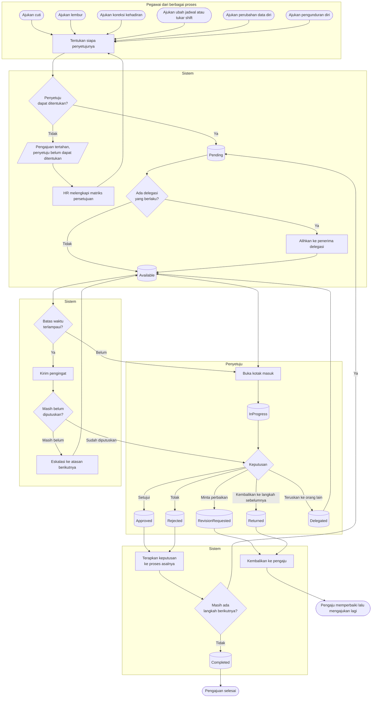

# Kotak Masuk Persetujuan Terpadu

| Field | Value |
| --- | --- |
| Blueprint ID | `HRD-BP-001` |
| Jenis | Flowchart proses |
| Slice | `S-A7` kotak masuk persetujuan terpadu |
| Status | `draft` |
| Kesiapan | `READY FOR DESIGN` |

---

## 1. Apa yang dijawab berkas ini

Bagaimana seorang penyetuju menangani **seluruh** jenis pengajuan dari satu tempat, dan apa yang
terjadi ketika ia tidak menanganinya sama sekali.

**Aturan yang mengikat alur ini** (`HRD-DEC-018`): yang disatukan adalah **pengalamannya**, bukan
aturannya. Satu kotak masuk untuk semua jenis pengajuan; tetapi alur persetujuan, kebijakan,
hak akses, validasi, batas waktu, dan eskalasi **tetap berbeda per jenis transaksi**.

Menyatukan aturannya akan membuat penolakan cuti tunduk pada aturan penolakan lembur — dan itu
salah.

## 2. Diagram

## 3. Tabel langkah

| Langkah | Pelaku | Masukan yang dibutuhkan | Keluaran | Bila gagal |
| --- | --- | --- | --- | --- |
| Tentukan penyetuju | Sistem | Jenis pengajuan; unit pengaju; matriks persetujuan yang berlaku | Tugas persetujuan berstatus `Pending` | Penyetuju tidak dapat ditentukan. Pengajuan tertahan; HR melengkapi matriks persetujuan untuk unit itu |
| Alihkan lewat delegasi | Sistem | Delegasi yang masih berlaku pada tanggal itu | Tugas dialihkan ke penerima delegasi | Tidak ada kegagalan. Bila tidak ada delegasi, tugas tetap pada penyetuju asal |
| Buka kotak masuk | Penyetuju | Daftar tugas yang ditugaskan kepadanya | Tugas berstatus `InProgress` | Tidak ada kegagalan |
| Setujui atau tolak | Penyetuju | Isi pengajuan; alasan bila menolak | Tugas `Approved` atau `Rejected` | Ditolak bila alasan wajib tidak diisi. Penyetuju mengisinya |
| Minta perbaikan | Penyetuju | Catatan apa yang harus diperbaiki | Tugas `RevisionRequested`; pengajuan kembali ke pengaju | Ditolak bila catatan kosong |
| Teruskan ke orang lain | Penyetuju | Orang yang dituju berwenang atas jenis pengajuan itu | Tugas `Delegated`; tugas baru terbentuk | Ditolak bila yang dituju tidak berwenang |
| Kirim pengingat | Sistem | Tugas yang batas waktunya terlampaui | Pengingat terkirim; hitungan pengingat naik | Pengiriman gagal. Percobaan diulang pada putaran berikutnya |
| Eskalasi | Sistem | Tugas yang tetap tidak diputuskan setelah diingatkan | Tugas baru untuk atasan berikutnya | Eskalasi gagal bila atasan berikutnya tidak dapat ditentukan. Tugas tetap tertahan dan muncul di daftar pengawasan HR |
| Terapkan keputusan | Sistem | Tugas yang sudah diputuskan | Status pengajuan di proses asalnya ikut berubah | Penerapan gagal. HR menjalankan sinkronisasi ulang |

## 4. Jalur pengecualian yang paling sering ditemui

| Keadaan | Apa yang petugas lakukan |
| --- | --- |
| Matriks persetujuan belum diisi untuk sebuah unit | Pengajuan tertahan sebelum sampai ke siapa pun. HR melengkapi matriksnya |
| Penyetuju sedang cuti | Delegasi yang berlaku mengalihkan tugasnya. Bila tidak ada delegasi, tugas menunggu — dan inilah yang memicu pengingat |
| Penyetuju tidak memutuskan sampai batas waktu | Pengingat dikirim. Bila tetap tidak diputuskan, tugas dieskalasi |
| Atasan berikutnya tidak dapat ditentukan | Eskalasi gagal. Tugas muncul di daftar pengawasan HR untuk ditangani manual |
| Satu pengajuan butuh lebih dari satu penyetuju | Setelah satu langkah selesai, langkah berikutnya membentuk tugas baru. Kotak masuknya tetap satu |

## 5. Keadaan hari ini yang harus dibaca sebelum apa pun dirancang di atasnya

| Kemampuan | Keadaan | Akibat bila dibiarkan |
| --- | --- | --- |
| Kotak masuk generik lintas jenis pengajuan | **Sudah ada** | — |
| Delegasi persetujuan | **Sudah ada** | — |
| Batas waktu tersimpan | **Sudah ada** | — |
| **Mesin pengingat, eskalasi, dan tindakan otomatis saat batas waktu terlampaui** | **Belum ada sama sekali** | Pengajuan menggantung tanpa batas; tidak ada yang mengingatkan penyetuju. Inilah yang ditutup `HRD-DEC-030` |
| Kedaluwarsa delegasi | Kosakata ada, penegakannya belum diverifikasi | Delegasi yang sudah lewat masa berlakunya mungkin masih aktif |

Bagian pengingat dan eskalasi pada diagram di atas adalah **rancangan target**, bukan gambaran
keadaan sekarang.

## 6. Batas yang tidak boleh dilanggar

| Larangan | Sebabnya |
| --- | --- |
| Aturan persetujuan **MUST NOT** disatukan antar jenis transaksi | `HRD-DEC-018`. Yang disatukan hanya pengalamannya. Menyatukan aturannya membuat kebijakan satu proses bocor ke proses lain |
| Eskalasi **MUST NOT** menjadi persetujuan otomatis tanpa keputusan pemilik kebijakan | Menyetujui atas nama orang yang tidak pernah membacanya adalah keputusan yang tidak boleh diambil mesin |
| Penyetuju **MUST NOT** menyetujui pengajuannya sendiri | Pemisahan peran. Penegakannya untuk tindakan disiplin masih `[OPEN]` — `HRD-Q-51` |

## 7. Traceability

| Aturan | Decision | Kontrak | Acceptance test |
| --- | --- | --- | --- |
| Satu kotak masuk, aturan tetap per jenis | `HRD-DEC-011`, `HRD-DEC-018` | `../contracts/state-transition-matrix.md` §5 | `AT-HRD-A7-01` |
| Status tugas persetujuan per orang | — (terbukti dari source) | `../contracts/state-transition-matrix.md` §5.2 | `AT-HRD-A7-02` |
| Mesin SLA, pengingat, dan eskalasi | `HRD-DEC-030` | `../data/data-dictionary.md` §2.5 | `AT-HRD-A7-03` |
| Delegasi persetujuan | — (terbukti dari source) | `../contracts/state-transition-matrix.md` §5.3 | `AT-HRD-A7-04` |
