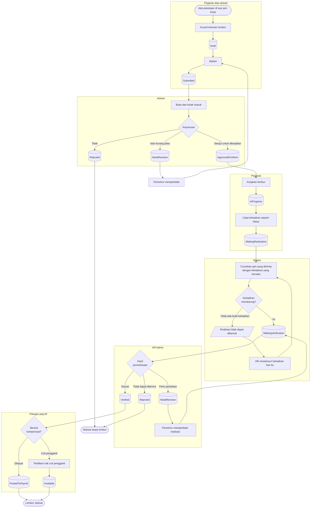

# Lembur

| Field | Value |
| --- | --- |
| Blueprint ID | `HRD-BP-001` |
| Jenis | Flowchart proses |
| Slice | `S-A3` layanan mandiri lembur, `S-B3` administrasi lembur |
| Status | `draft` |
| Kesiapan | `READY FOR DESIGN` |

---

## 1. Apa yang dijawab berkas ini

Bagaimana lembur direncanakan, dikerjakan, dibuktikan, dan akhirnya diteruskan ke payroll.

**Aturan yang mengikat seluruh alur ini:** lembur **dibuktikan oleh data kehadiran**, bukan oleh
pengakuan. Jumlah jam yang dibayar berasal dari apa yang benar-benar tercatat, bukan dari apa
yang diminta pada permohonan.

## 2. Diagram

## 3. Tabel langkah

| Langkah | Pelaku | Masukan yang dibutuhkan | Keluaran | Bila gagal |
| --- | --- | --- | --- | --- |
| Isi permohonan lembur | Pegawai atau atasan | Tanggal; rentang jam; alasan; unit dan pusat biaya | Permohonan berstatus `Draft` | Permohonan tidak terbentuk. Pemohon melengkapi isian |
| Ajukan | Pemohon | Permohonan `Draft` yang lengkap | Permohonan berstatus `Submitted` | Ditolak bila melampaui batas kebijakan lembur. Pemohon mengurangi jam atau meminta pengecualian |
| Putuskan permohonan | Atasan | Kotak masuk berisi permohonan yang ditugaskan kepadanya | `ApprovedForWork`, `Rejected`, atau `NeedRevision` | Ditolak bila alasan wajib tidak diisi |
| Kerjakan lembur | Pegawai | Permohonan `ApprovedForWork` | Permohonan `InProgress` | Bila lembur batal dikerjakan, permohonan dibatalkan. Tidak ada realisasi yang terbentuk |
| Catat kehadiran | Pegawai | Mesin absensi atau aplikasi | Rekaman kehadiran hari itu | Bila lupa mencatat, pegawai mengajukan koreksi kehadiran lebih dulu. **Realisasi menunggu kehadiran, bukan sebaliknya** |
| Bentuk realisasi | Sistem | Permohonan `WaitingRealization`; kehadiran hari itu sudah terolah | Realisasi berstatus `WaitingVerification` | Realisasi tidak terbentuk karena tidak ada bukti kehadiran. HR menelusuri kehadiran hari itu lebih dulu |
| Verifikasi realisasi | HR Admin | Realisasi beserta kehadiran pendukungnya | `Verified`, `Rejected`, atau `NeedRevision` | Ditolak bila alasan wajib tidak diisi |
| Teruskan ke payroll | Petugas payroll | Realisasi `Verified`; periode payroll masih terbuka | Realisasi `PostedToPayroll` | Ditolak bila periode payroll sudah terkunci. Realisasi menunggu periode berikutnya |
| Terbitkan cuti pengganti | HR Admin | Realisasi `Verified`; kebijakan mengizinkan kompensasi cuti | Hak cuti pengganti berstatus `Available` | Ditolak bila kebijakan tidak mengizinkan. Kompensasi dialihkan ke pembayaran |

## 4. Jalur pengecualian yang paling sering ditemui

| Keadaan | Apa yang petugas lakukan |
| --- | --- |
| Pegawai lembur tetapi lupa mencatat kehadiran | Realisasi tidak dapat dibentuk. Pegawai mengajukan koreksi kehadiran lebih dulu; lihat [`koreksi-kehadiran.md`](./koreksi-kehadiran.md) |
| Jam yang diminta lebih besar daripada yang tercatat | Realisasi dibentuk mengikuti **yang tercatat**. Selisihnya tidak dibayar |
| Dokter bekerja di luar jadwal tanpa permohonan lembur | **Tidak otomatis menjadi lembur.** Ia menjadi pengecualian kehadiran yang menunggu klasifikasi atasan; lihat [`kehadiran-harian.md`](./kehadiran-harian.md) |
| Periode payroll sudah terkunci saat realisasi selesai | Realisasi menunggu periode berikutnya. Ia tidak hilang |
| Cuti pengganti tidak diambil sampai masa berlakunya habis | Hak cuti pengganti menjadi kedaluwarsa. Tidak dikonversi menjadi uang tanpa keputusan tersendiri |

## 5. Batas yang tidak boleh dilanggar

| Larangan | Sebabnya |
| --- | --- |
| Realisasi lembur **MUST NOT** dibentuk tanpa bukti kehadiran | Lembur yang dibayar tanpa bukti adalah pembayaran atas pengakuan, bukan atas pekerjaan |
| Bekerja di luar jadwal **MUST NOT** otomatis menjadi lembur | `HRD-DEC-013`. Lembur adalah keputusan atasan |
| Jumlah jam yang dibayar **MUST NOT** melebihi yang tercatat | Selisih antara permintaan dan kenyataan adalah selisih yang tidak dibayar, bukan selisih yang dibulatkan |

## 6. Traceability

| Aturan | Decision | Kontrak | Acceptance test |
| --- | --- | --- | --- |
| Alur permohonan lembur | — (terbukti dari source) | `../contracts/state-transition-matrix.md` §3.2 | `AT-HRD-B3-01` |
| Realisasi dibuktikan kehadiran | — (terbukti dari source) | `../contracts/state-transition-matrix.md` §3.3 | `AT-HRD-B3-02` |
| Larangan lembur otomatis | `HRD-DEC-013` | `../contracts/validation-matrix.md` | `AT-HRD-B3-03` |
| Cuti pengganti dari lembur | — (terbukti dari source) | `../contracts/state-transition-matrix.md` §3.6 | `AT-HRD-B3-04` |
