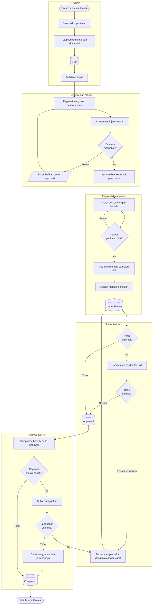

# Manajemen Kinerja

| Field | Value |
| --- | --- |
| Blueprint ID | `HRD-BP-001` |
| Jenis | Flowchart proses |
| Slice | `S-C3` manajemen kinerja |
| Status | `draft` |
| Kesiapan | `READY FOR DESIGN` |

---

## 1. Apa yang dijawab berkas ini

Bagaimana satu siklus penilaian kinerja berjalan dari penetapan sasaran sampai hasil akhir yang
disepakati pegawai dan atasannya.

**Kenyataan yang harus dibaca lebih dulu.** Tahap siklus penilaian kinerja hari ini **dapat
berpindah tanpa urutan**. Artinya sebuah siklus dapat melompat ke tahap akhir tanpa melewati
penilaiannya. Ini tercatat sebagai pekerjaan pengerasan, dan diagram di bawah menggambar urutan
**yang seharusnya**, bukan yang dijaga sistem hari ini.

## 2. Diagram

## 3. Tabel langkah

| Langkah | Pelaku | Masukan yang dibutuhkan | Keluaran | Bila gagal |
| --- | --- | --- | --- | --- |
| Buka siklus penilaian | HR Admin | Periode; cakupan unit; template; skala nilai | Siklus berstatus `Draft` | Siklus tidak terbentuk bila template atau skala nilai belum ada. HR melengkapi master lebih dulu |
| Terbitkan siklus | HR Admin | Siklus yang lengkap | Siklus berlaku bagi pegawai dalam cakupannya | Penerbitan gagal. HR mengulang setelah penyebabnya diperbaiki |
| Susun sasaran kerja | Pegawai | Siklus yang sudah terbit; arahan unit | Sasaran diajukan | Sasaran tidak tersimpan. Pegawai melengkapi isian |
| Tinjau sasaran | Atasan | Sasaran yang diajukan | Sasaran disepakati, atau dikembalikan | Bila dikembalikan, pegawai memperbaiki lalu mengajukan ulang |
| Catat perkembangan berkala | Pegawai dan atasan | Sasaran yang berlaku | Catatan perkembangan tersimpan | Tidak ada kegagalan. Ketiadaan catatan berkala membuat penilaian akhir kehilangan dasar |
| Isi penilaian diri | Pegawai | Sasaran dan catatan perkembangan | Penilaian diri tersimpan | Ditolak bila butir wajib belum terisi |
| Isi penilaian atasan | Atasan | Penilaian diri; catatan perkembangan | Penilaian berstatus `UnderReview` | Ditolak bila butir wajib belum terisi |
| Kalibrasi antar unit | Panel kalibrasi | Hasil penilaian seluruh unit dalam cakupan | Hasil kalibrasi | Bila panel tidak dapat dibentuk, kalibrasi dilewati dan alasannya dicatat |
| Sesuaikan hasil | Atasan | Hasil kalibrasi; alasan yang wajib diisi | Penilaian diperbarui | Ditolak bila alasan kosong |
| Sampaikan hasil | Atasan | Penilaian berstatus `Approved` | Pegawai mengetahui hasilnya | Tidak ada kegagalan |
| Ajukan sanggahan | Pegawai | Hasil yang disampaikan; alasan sanggahan | Sanggahan tercatat | Ditolak bila alasan kosong |

## 4. Jalur pengecualian yang paling sering ditemui

| Keadaan | Apa yang petugas lakukan |
| --- | --- |
| Sasaran tidak disepakati sampai periode berjalan | Penilaian kehilangan dasar. Atasan dan pegawai menyepakati sasaran lebih dulu; siklus tertahan sampai itu terjadi |
| Atasan pegawai berganti di tengah periode | Atasan baru meneruskan penilaian dengan membaca catatan perkembangan yang sudah ada |
| Pegawai keluar sebelum siklus selesai | Penilaian ditutup sampai tanggal terakhir ia bekerja. Hasilnya tetap tercatat |
| Panel kalibrasi tidak dapat dibentuk | Kalibrasi dilewati, dan alasannya dicatat. Hasil penilaian tetap sah |
| Pegawai menyanggah hasil | Sanggahan ditinjau. Bila diterima, atasan menyesuaikan dengan alasan tercatat. Bila tidak, sanggahan dan jawabannya tetap tercatat |

## 5. Batas yang tidak boleh dilanggar

| Larangan | Sebabnya |
| --- | --- |
| Hasil penilaian **MUST NOT** diubah tanpa alasan tercatat | Penilaian menyangkut karier seseorang. Perubahan tanpa jejak tidak dapat dipertanggungjawabkan |
| Sanggahan pegawai **MUST NOT** dihapus, bahkan ketika ditolak | Jejak bahwa pegawai pernah menyanggah adalah bagian dari keadilan proses |
| Isi penilaian **MUST NOT** tampil pada layar yang jangkauan pembacanya lebih luas daripada pegawai, atasannya, dan HR yang berwenang | Kolom nilai dan catatan penilaian bertanda sensitif pada kamus data |
| Hasil kinerja **MUST NOT** dijadikan penentu kewenangan klinis | Penilaian kinerja bersifat administratif. OPPE dan FPPE adalah proses berbeda dan berstatus `BLOCKED` — `S-C1` |

## 6. Traceability

| Aturan | Decision | Kontrak | Acceptance test |
| --- | --- | --- | --- |
| Alur penilaian kinerja | — (terbukti dari source) | `../contracts/state-transition-matrix.md` §7.3 | `AT-HRD-C3-01` |
| Perubahan hasil wajib beralasan | — | `../contracts/validation-matrix.md` | `AT-HRD-C3-02` |
| Kerahasiaan isi penilaian | — | `../contracts/permission-audit-matrix.md` | `AT-HRD-C3-03` |
| Tahap siklus dapat berpindah tanpa urutan | — (temuan yang tercatat) | `../contracts/state-transition-matrix.md` §9 baris 5 | `AT-HRD-C3-04` |
| Pemisahan dari OPPE dan FPPE | `S-C1` `BLOCKED` | `MODULE-STATUS.md` §3 `HRD-BLK-001` | Tidak berlaku |
