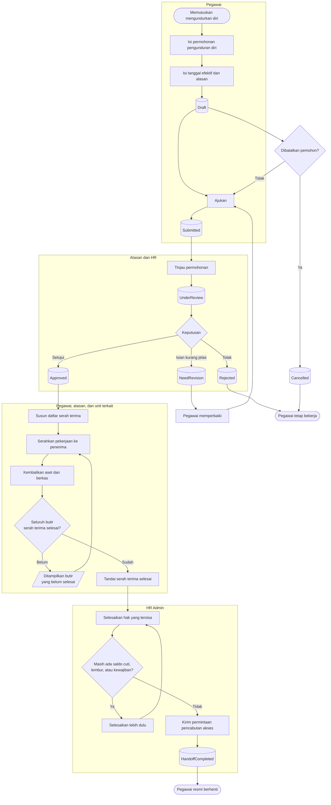

# Pengunduran Diri dan Serah Terima

| Field | Value |
| --- | --- |
| Blueprint ID | `HRD-BP-001` |
| Jenis | Flowchart proses |
| Slice | `S-C4` lifecycle dan offboarding |
| Status | `draft` |
| Kesiapan | `READY FOR DESIGN` |

---

## 1. Apa yang dijawab berkas ini

Bagaimana seorang pegawai berhenti bekerja dengan tertib: pengajuan, persetujuan, serah terima
pekerjaan, penyelesaian hak, dan pencabutan akses.

**Kenyataan yang harus dibaca lebih dulu.** Dari seluruh cara pegawai keluar-masuk, **hanya
pengunduran diri** yang punya alur di sistem hari ini. Onboarding, masa percobaan, pemberhentian,
pensiun, dan tidak diperpanjangnya kontrak baru punya kosakata status, belum punya alur. Semuanya
dikerjakan di luar sistem.

Berkas ini menggambar pengunduran diri saja. Menggambar yang lain berarti mengarang proses yang
belum ada wewenangnya.

## 2. Diagram

## 3. Tabel langkah

| Langkah | Pelaku | Masukan yang dibutuhkan | Keluaran | Bila gagal |
| --- | --- | --- | --- | --- |
| Isi permohonan pengunduran diri | Pegawai | Tanggal efektif; alasan | Permohonan berstatus `Draft` | Permohonan tidak terbentuk. Pegawai melengkapi isian |
| Ajukan | Pegawai | Permohonan `Draft` yang lengkap | Permohonan berstatus `Submitted` | Ditolak bila tanggal efektif tidak memenuhi masa pemberitahuan yang berlaku |
| Tinjau permohonan | Atasan dan HR | Permohonan `Submitted` | Permohonan berstatus `UnderReview` | Tidak ada kegagalan |
| Putuskan permohonan | Atasan dan HR | Permohonan yang sudah ditinjau | `Approved`, `Rejected`, atau `NeedRevision` | Ditolak bila alasan wajib tidak diisi |
| Susun daftar serah terima | Atasan | Daftar pekerjaan, aset, dan berkas yang dipegang pegawai | Daftar serah terima terbentuk | Daftar tidak lengkap. Atasan melengkapinya bersama unit terkait |
| Serahkan pekerjaan dan aset | Pegawai | Daftar serah terima; penerima yang ditunjuk | Butir serah terima ditandai selesai | Butir yang belum selesai ditampilkan. Pegawai menyelesaikannya |
| Selesaikan hak yang tersisa | HR Admin | Saldo cuti, realisasi lembur, dan kewajiban yang belum selesai | Hak dan kewajiban tuntas | Bila masih ada yang menggantung, penutupan tertahan sampai selesai |
| Kirim permintaan pencabutan akses | HR Admin | Serah terima dan hak sudah tuntas | Permintaan pencabutan terkirim | **Bentuk kontraknya masih terbuka** — `HRD-DEP-003`. HR mencatat permintaannya dan menindaklanjuti secara manual |

## 4. Jalur pengecualian yang paling sering ditemui

| Keadaan | Apa yang petugas lakukan |
| --- | --- |
| Pegawai membatalkan pengunduran dirinya | Permohonan `Draft` atau `Submitted` dibatalkan. Setelah `Approved`, pembatalan memerlukan keputusan tersendiri |
| Serah terima belum selesai pada tanggal efektif | Penutupan tertahan. Atasan menunjuk penerima pengganti agar serah terima dapat diselesaikan |
| Masih ada saldo cuti yang belum diselesaikan | Penutupan tertahan sampai saldonya tuntas. Bentuk penyelesaiannya mengikuti kebijakan cuti yang berlaku |
| Masih ada realisasi lembur yang belum diverifikasi | Sama. Verifikasi diselesaikan lebih dulu |
| Akses aplikasi belum tercabut setelah pegawai berhenti | HR menindaklanjuti secara manual ke pemilik Identity. **Ini adalah celah yang tercatat**, bukan yang diabaikan |

## 5. Batas yang tidak boleh dilanggar

| Larangan | Sebabnya |
| --- | --- |
| Modul HR **MUST NOT** mencabut akun aplikasi sendiri | Kepemilikannya ada di Administrator/Identity. HR hanya mengirim permintaan — `HRD-DEP-003` |
| Penutupan **MUST NOT** dijalankan sebelum hak dan kewajiban tuntas | Saldo yang tertinggal setelah pegawai berhenti tidak punya pemilik yang dapat menyelesaikannya |
| Onboarding, masa percobaan, pemberhentian, dan pensiun **MUST NOT** dirancang di sini | Keempatnya belum punya alur maupun keputusan pemiliknya. Merancangnya berarti mengarang proses |

## 6. Traceability

| Aturan | Decision | Kontrak | Acceptance test |
| --- | --- | --- | --- |
| Alur pengunduran diri | — (terbukti dari source) | `../contracts/state-transition-matrix.md` §7.5 | `AT-HRD-C4-01` |
| Serah terima sebagai syarat penutupan | — (terbukti dari source) | `../contracts/validation-matrix.md` | `AT-HRD-C4-02` |
| Pencabutan akses lewat Identity | `HRD-DEP-003` | `../contracts/integration-contract.md` | `AT-HRD-C4-03` |
| Onboarding dan pemberhentian belum punya alur | — | `../contracts/state-transition-matrix.md` §7.6 | Tidak berlaku |
