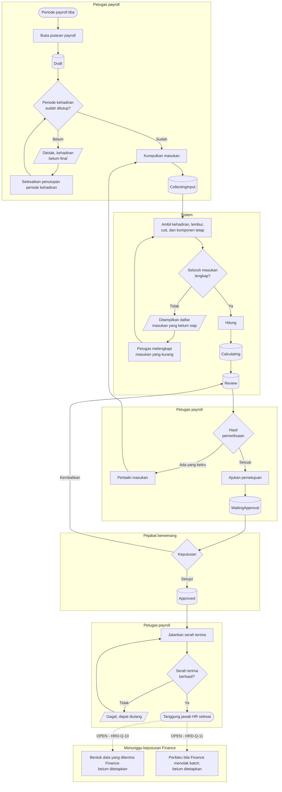

# Payroll Sisi HR

| Field | Value |
| --- | --- |
| Blueprint ID | `HRD-BP-001` |
| Jenis | Flowchart proses |
| Slice | `S-B5` payroll sisi HR |
| Status | `draft` |
| Kesiapan | **`PARTIAL`** — perhitungan sampai serah terima `READY FOR DESIGN`; **bentuk serah terima ke Finance `BLOCKED`** |

---

## 1. Apa yang dijawab berkas ini, dan di mana ia berhenti

Bagaimana HR mengumpulkan masukan, menghitung, memeriksa, dan menyerahkan hasil payroll — lalu
**berhenti**.

`HRD-DEC-009` menetapkan batasnya dengan tegas: **setelah serah terima dijalankan, tanggung
jawab HR selesai.** Pembayaran, jurnal akuntansi, pajak, dan pelaporan adalah milik Finance.

Dua hal yang belum dijawab dan **tidak boleh dikarang di sini**:

| Pertanyaan | Pemilik | ID |
| --- | --- | --- |
| Bentuk data yang diterima Finance | Pemilik produk bersama Finance | `HRD-Q-10` |
| Apa yang terjadi bila Finance menolak satu batch | Pemilik produk bersama Finance | `HRD-Q-11` |

## 2. Diagram

**Garis putus-putus di bawah adalah batas modul, bukan langkah berikutnya.** Tidak ada satu pun
perpindahan status yang boleh dirancang melewatinya.

## 3. Tabel langkah

| Langkah | Pelaku | Masukan yang dibutuhkan | Keluaran | Bila gagal |
| --- | --- | --- | --- | --- |
| Buka putaran payroll | Petugas payroll | Periode payroll; cakupan badan hukum dan lokasi | Putaran berstatus `Draft` | Putaran tidak terbentuk. Petugas memeriksa apakah periodenya sudah dibuat |
| Pastikan kehadiran sudah final | Petugas payroll | Periode kehadiran berstatus `Closed` | Izin melanjutkan | Ditolak karena kehadiran belum final. Petugas menyelesaikan penutupan periode kehadiran lebih dulu |
| Kumpulkan masukan | Sistem | Kehadiran harian, realisasi lembur, cuti, komponen tetap | Putaran berstatus `CollectingInput` | Daftar masukan yang belum siap ditampilkan. Petugas melengkapinya lalu mengulang |
| Hitung | Sistem | Seluruh masukan lengkap | Putaran berstatus `Calculating` lalu `Review` | Perhitungan gagal. Petugas memperbaiki masukan lalu menghitung ulang |
| Periksa hasil | Petugas payroll | Hasil perhitungan | Putaran diajukan, atau dikembalikan untuk diperbaiki | Bila ada yang keliru, petugas memperbaiki masukan. Putaran kembali mengumpulkan masukan |
| Putuskan persetujuan | Pejabat berwenang | Putaran berstatus `WaitingApproval` | Putaran `Approved`, atau dikembalikan ke pemeriksaan | Ditolak bila alasan wajib tidak diisi |
| Jalankan serah terima | Petugas payroll | Putaran berstatus `Approved` | Serah terima terlaksana | Serah terima gagal dan dapat diulang. **Perilaku bila Finance menolak batch belum ditetapkan** — `HRD-Q-11` |

## 4. Jalur pengecualian yang paling sering ditemui

| Keadaan | Apa yang petugas lakukan |
| --- | --- |
| Periode kehadiran belum ditutup | Putaran payroll tidak boleh berjalan. Petugas menyelesaikan pengecualian kehadiran yang menghalangi lebih dulu |
| Koreksi kehadiran datang setelah periode ditutup | Periode dibuka kembali bila belum tertaut payroll. Bila sudah tertaut, koreksi masuk ke periode berikutnya |
| Realisasi lembur belum diverifikasi | Masukan lembur tidak lengkap. Petugas menyelesaikan verifikasi lebih dulu |
| Hasil perhitungan keliru | Putaran dikembalikan ke pengumpulan masukan. **Bukan** dengan menyunting angka hasil |
| Serah terima gagal di tengah jalan | Serah terima diulang. Ia dirancang agar pengulangan tidak menghasilkan pengiriman ganda |
| Finance menolak batch yang sudah diserahkan | **Belum ada jawaban.** `HRD-Q-11` |

## 5. Batas yang tidak boleh dilanggar

| Larangan | Sebabnya |
| --- | --- |
| Modul HR **MUST NOT** menyimpan hasil pembayaran, jurnal akuntansi, atau perhitungan pajak | `HRD-DEC-009`. Keempatnya milik Finance |
| Tidak ada perpindahan status yang boleh dirancang melewati serah terima | Merancangnya berarti mengarang kontrak milik modul lain |
| Angka hasil perhitungan **MUST NOT** disunting langsung | Perbaikan dilakukan dengan memperbaiki masukan lalu menghitung ulang, sehingga hasilnya selalu dapat ditelusuri kembali ke masukannya |
| Payroll **MUST NOT** berjalan di atas kehadiran yang belum final | Angka yang diserahkan akan berbeda dari kehadiran yang tercatat |

## 6. Traceability

| Aturan | Decision | Kontrak | Acceptance test |
| --- | --- | --- | --- |
| Alur putaran payroll | — (terbukti dari source) | `../contracts/state-transition-matrix.md` §8.1 | `AT-HRD-B5-01` |
| Batas tanggung jawab HR | `HRD-DEC-009` | `../contracts/state-transition-matrix.md` §8.3 | `AT-HRD-B5-02` |
| Payroll menunggu kehadiran final | — (terbukti dari source) | `../contracts/validation-matrix.md` | `AT-HRD-B5-03` |
| Bentuk data yang diterima Finance | **`HRD-Q-10` `[OPEN]`** | **Belum ada** | **Belum dapat diuji.** `BLOCKED` |
| Perilaku bila Finance menolak batch | **`HRD-Q-11` `[OPEN]`** | **Belum ada** | **Belum dapat diuji.** `BLOCKED` |
